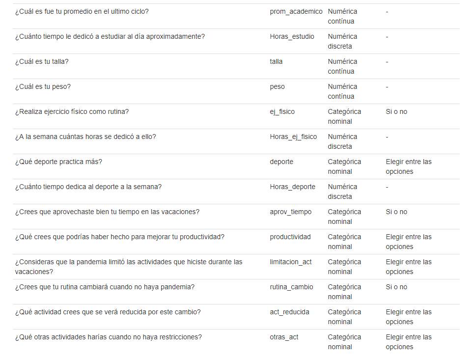
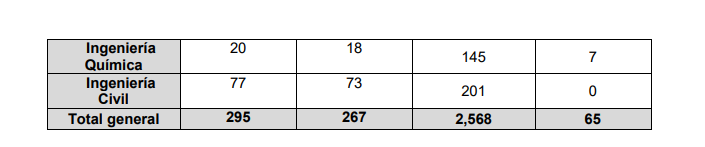

## Introducción

El siguiente informe refleja los datos proporcionados por los
estudiantes de la UTEC (Universidad de Ingeniera y Tecnología) a través
de una encuesta realizada por Google Forms, con finalidad de poder saber
como se desarrolla la población Utecsina cuando el estudio pasa a
segundo plano.

En esta oportunidad se va a realizar el análisis de las graficas y
tablas, se buscara una realción pertinente y que colabore al objetivo de
el proyecto, ademas de el uso de variables aleatorias para poder
precedir situaciones. El análisis respectivo sera sobre de 29 variables
y 157 observaciones conseguidas.

## Marco teorico

Población objetivo: Estudiantes de la Universidad de Ingeniería y
Tecnología (UTEC)

Tipo de muestreo: Muestreo aleatorio simple

Sesgo: sesgo de selección

Unidades muéstrales: 157 observaciones

Interesados: Alumnos en general

Variables: Variables de DataFrame de información de los estudiantes

## Recordatorio de Objetivo

Brindar información relevante de las diferentes actividades que realizan
los estudiantes de la UTEC en una semana regular durante las vacaciones
en un contexto de pandemia.

## Importancia

Con el proyecto podremos encontrar soluciones a problemas de rendimiento
academico, al ver el comportamiento que tienen en dias donde el estudio
no es prioridad, ademas de las actividades que tienden a realizar y como
la pandemia ha afectado a las actividades de los estudiantes durante el
periodo vacacional.

Diagrama de Gantt de nuestros pasos a seguir en el proyecto:

{width="100%"}

## Obtencion de observaciones

Las observaciones, tal dicho antes se consiguieron a traves de Google
Forms

{width="100%"}

```{r include=FALSE}
library(readr)
library(dplyr)
DF <- read_csv("Actividades est. UTEC.csv")
```

## Variables

{width="100%"}

{width="100%"}

## Limpieza de datos

En primer lugar se elimino las primeras 2 columnas, ya que estas
contenian el correo y la fecha de entrega de la observacion, cuales eran
irrelevantes para nuestra investigacion.

Se cambio el nombre a las 28 variables para hacer el trabajo mas simple,
ademas se agrego una variable numerica al final que sirvio como
referencia a la hora de editar el DataFrame.

Y a partir con esa variable y con la funcion filter, se hallaron los
valores erroneos que los encuestados colocaron y se reemplazaron a
valores mas coherentes, aunque algunas excepciones hacian que la
observacion sea invalida para nuestro analisis.

Dandonos como resultado 154 observaciones validas y 29 variables.

## Limpieza de datos (Codigo)

```{r echo=TRUE}
DF = DF[,-1:-2]
names(DF)<-c("Sexo","Edad","Departamento","Carrera","Ciclo","Act_frecuente","Trabajas","Horas_trabajo","Streaming","Horas_streaming","Redsocial","Horas_redsocial","Horas_games","Estudio","prom_academico",
             "Horas_estudio","talla","peso","ej_fisico","Horas_ej_fisico","deporte","Horas_deporte","aprov_tiempo","productividad","limitacion_act","rutina_cambio","act_reducida","otras_act")
numero<-c(1:157)
DF<-cbind(DF,numero)

DF[41,18]=63
DF[50,5]=1
DF[130,5]=1
DF[153,5]=3 
DF[33,18]=58

i=1:157
DF[1:157,17] <- ifelse(DF[i,17]<2,DF[i,17]*100,DF[i,17])
DF=DF[-119,]
DF=DF[-99,]
DF=DF[-97,]
dim(DF)
```

## Resultados principales de la encuesta: Género de los encuestados

```{r}
colores <- c("blue","red")
pie(round((table(DF$Sexo)/sum(table(DF$Sexo)))*100,2), clockwise = TRUE , col = colores , main= "TABLA DE GENEROS")
legend("topright", c("60.39%","39.61%"),fill=colores)
```

## Edad de los encuestados

```{r}
table(DF$Sexo,DF$Edad)
x1<-table(DF$Sexo,DF$Edad)
colores1=c("blue","red","yellow","green","orange","brown","violet","black","pink","gray","purple","magenta","beige","aquamarine3","aliceblue","antiquewhite2","darkgoldenrod","darkolivegreen")
barplot(x1,xlab = "Edades",ylab="Frecuencias" ,main="Grafica de Edades",col = colores1)
legend("topright", c("Hombre","Mujer"),fill=colores)
```

## Ciclo academico actual de los encuestados

```{r}
barplot(table(DF$Ciclo),ylab="ciclos", xlab = "cantidad de estudiantes",main = "Ciclos con mayor presencia",col = colores1,horiz = TRUE)
legend("topright",c("8.44%","0.65%","8.44%","15.58%","19.48%","18.18%","15.58%","5.84%","5.19%","2.6%"),cex=0.75,fill=colores1)
```

## Departamento de proveniencia de los encuestados

```{r}
x2<-table(DF$Departamento)
barplot(x2,xlab = "Departamentos",ylab="Frecuencias" ,main="Grafica de Departamentos",col = colores1)
legend("topright",c("Amazonas (1.3%)","Ancash (2.6%)","Arequipa (3.25%)","Ayacucho (1.3%)","Cajamarca (1.95%)","Callao (5.84%)","Cusco (2.6%)","Ica (3.25%)","Junín (1.95%)","La Libertad (1.95%)","Lambayeque (1.3%)","Lima (68.18%)","Madre de Dios (0.65%)","Moquegua (0.65%)","Piura (0.65%)","Puno (0.65%)","San Martín (0.65%)","Tacna (1.3%)"),cex = 0.9 ,fill = colores1)
```

## Carrera universitaria de los encuestados

```{r}
tablaCar <- as.data.frame(table(Carrea=DF$Carrera))
transform(tablaCar,FreqAc= cumsum(Freq),Rel= round(prop.table(Freq),3),RelAc=round(cumsum(prop.table(Freq)),3))
```

## Actividades de los encuestados

```{r}
x3<-table(DF$Act_frecuente)
barplot(x3,xlab="Actividad",ylab = "frecuencias", main = "grafica de Actividades",col = colores1)
legend("topleft", c("Consumiendo plataformas de streaming (11.69%)","Estudiar (12.34%)","Haciendo deportes (7.79%)","Jugando videojuegos (22.73%)","Otro (8.44%)","Pasar tiempo en Redes Sociales (21.42%)","Realizando ejercicio físico (5.84%)","Viajando (9.74%)"),cex = 0.7,fill=colores1)
```

## ¿Los encuestados hacen ejercicio físico?

```{r}
round((table(DF$ej_fisico)/sum(table(DF$ej_fisico)))*100,2)
colores <- c("indianred","orange")
pie(round((table(DF$ej_fisico)/sum(table(DF$ej_fisico)))*100,2), clockwise = TRUE , col = colores , main= "Ejercicio fisico",radius = 1
    )
legend("topright", c("59.09%","40.91%"),fill=colores)
```

## ¿Los encuestados trabajan en vacaciones?

```{r}
round((table(DF$Trabajas)/sum(table(DF$Trabajas)))*100,2)
colores <- c("blue","red")
pie(round((table(DF$Trabajas)/sum(table(DF$Trabajas)))*100,2), clockwise = TRUE , col = colores , main= "TRABAJAS",radius = 1
)
legend("topright", c("65.58%","34.42%"),fill=colores)
```

## ¿Los encuestados estudian en vacaciones?

```{r}
round((table(DF$Estudio)/sum(table(DF$Estudio)))*100,2)
colores <- c("blue","red")
pie(round((table(DF$Estudio)/sum(table(DF$Estudio)))*100,2), clockwise = TRUE , col = colores , main= "ESTUDIAS",radius = 1
)
legend("topright", c("25.32%","74.68%"),fill=colores)
```

## Consumo de plataformas de streaming

```{r}
X5<-table(DF$Streaming)
barplot(X5,xlab="Cantidad de usuarios",ylab="Plataforma",main="STREAMING",col=colores1,horiz=TRUE)
legend("bottomright", c("Amazon Prime (0.65%)","Disney Plus (3.9%)","HBO Max (0.65%)","Netflix (44.81%)","Otro (3.9%)","Twitch (3.9%)","Youtube (42.21%)"),cex = 1,fill=colores1)
```

## Análisis de las gráficas

La mayoria de encuestados son hombres y la mayoria dedican mayor tiempo
en las vacaciones a jugar videojuegos (22.73%), este seguido del uso de
las redes sociales (21.43%).

La mayoria no trabaja en vacaciones (65.58%), viendo que la gráfica de
edad nos indica que el 70.7% son adolescentes entre 18, 19 y 20 años
tiene sentido de que se cumpla estos porcentajes, ya que generalmente a
esa edad los adolescentes no de independizan de casa y todavía viven
bajo el techo de algún familiar, cual infiere que ademas de poder
desestresarse en las vacaciones con videojuegos o con las redes sociales
(como era de esperarse), la mayoría se prepara para el siguiente ciclo
académico (el 74.68%).

Como se preveía, la gran mayoría de encuestados provienen de la capital,
Lima (68.18%)

la gráfica de si realizan ejercicio físico nos muestra que hay mas gente
que no lo practica de la que practica, y de ese porcentaje que si lo
practica, una fracción dedica la mayoría de su tiempo en las vacaciones
al ejercicio físico.

las aplicaciones mas populares para el consumo de plataformas de
streaming, como era de esperarse son Netflix (44.81%) y YouTube (42.21%)

## Análisis de las gráficas

La carrera con mas encuestados fue de Ingeniera industrial, con 36
representantes (23.4%), seguido de Ingeniera civil con 30 representantes
(19.5%), de cierta manera la tabla de carreras de los encuestados cumple
proporcionalmente con la cantidad de ingresados de cada carrera en la
universidad, al ciclo 2020-2.

{width="75%"}
{width="77%"}

## Descriptores Numéricos

La primera tabla corresponde a los datos de la talla, peso, edad y
promedio académico entregadas por los encuestados. a partir de ello se
calculo también el indice de masa corporal (IMC).

```{r echo=FALSE}
df<-matrix(0,5,5)
colnames(df)<-c("talla","peso","IMC","edad","prom. Academico")

rownames(df)<-c("media","mediana","SD","rango", "RIC")
df[1,1]<-round(mean(DF$talla),2)
df[2,1]<-median(DF$talla)
df[3,1]<-round(sd(DF$talla),2)
df[4,1]<-max(DF$talla)-min(DF$talla)
df[5,1]<-IQR(DF$talla)

df[1,2]<-round(mean(DF$peso),2)
df[2,2]<-median(DF$peso)
df[3,2]<-round(sd(DF$peso),2)
df[4,2]<-max(DF$peso)-min(DF$peso)
df[5,2]<-IQR(DF$peso)
# imc
DFT<-DF
DFT <- DF %>% mutate(IMC=peso/(talla/100)^2)

df[1,3]<-round(mean(DFT$IMC),2)
df[2,3]<-median(DFT$IMC)
df[3,3]<-round(sd(DFT$IMC),2)
df[4,3]<-max(DFT$IMC)-min(DFT$IMC)
df[5,3]<-IQR(DFT$IMC)

df[1,4]<-round(mean(DF$Edad),2)
df[2,4]<-median(DF$Edad)
df[3,4]<-round(sd(DF$Edad),2)
df[4,4]<-max(DF$Edad)-min(DF$Edad)
df[5,4]<-IQR(DF$Edad)

df[1,5]<-round(mean(DF$prom_academico),2)
df[2,5]<-median(DF$prom_academico)
df[3,5]<-round(sd(DF$prom_academico),2)
df[4,5]<-max(DF$prom_academico)-min(DF$prom_academico)
df[5,5]<-IQR(DF$prom_academico)
df
```

Y este seria el coeficiente de variabilidad de las variables

```{r}
Coeff_val <- c(df[3,1],df[3,2],df[3,3],df[3,4],df[3,5])/c(df[1,1],df[1,2],df[1,3],df[1,4],df[1,5])
round(Coeff_val,3)
```

## Descriptores numéricos

La segunda tabla corresponde a las horas dedicadas en promedio por día a
actividades que se preguntaron en la encuesta, donde las variables
usadas fueron de trabajo,consumo de streaming, en las Redes Sociales,
jugando videojuegos, estudiando, ejercicio físico y de deporte, en ese
orden.

```{r echo=FALSE}
df<-matrix(0,5,7)
colnames(df)<-c("Trab.","Stream","RS","Games","Estudio","Fisico","Deporte")

rownames(df)<-c("media","mediana","SD","rango", "RIC")
df[1,1]<-round(mean(DF$Horas_trabajo, na.rm=T),2)
df[2,1]<-median(DF$Horas_trabajo, na.rm=T)
df[3,1]<-round(sd(DF$Horas_trabajo, na.rm=T),2)
df[4,1]<-max(DF$Horas_trabajo, na.rm=T)-min(DF$Horas_trabajo, na.rm=T)
df[5,1]<-IQR(DF$Horas_trabajo, na.rm=T)

df[1,2]<-round(mean(DF$Horas_streaming),2)
df[2,2]<-median(DF$Horas_streaming)
df[3,2]<-round(sd(DF$Horas_streaming, na.rm=T),2)
df[4,2]<-max(DF$Horas_streaming, na.rm=T)-min(DF$Horas_streaming, na.rm=T)
df[5,2]<-IQR(DF$Horas_streaming, na.rm=T)

df[1,3]<-round(mean(DF$Horas_redsocial, na.rm=T),2)
df[2,3]<-median(DF$Horas_redsocial, na.rm=T)
df[3,3]<-round(sd(DF$Horas_redsocial, na.rm=T),2)
df[4,3]<-max(DF$Horas_redsocial, na.rm=T)-min(DFT$Horas_redsocial, na.rm=T)
df[5,3]<-IQR(DF$Horas_redsocial, na.rm=T)

df[1,4]<-round(mean(DF$Horas_games, na.rm=T),2)
df[2,4]<-median(DF$Horas_games, na.rm=T)
df[3,4]<-round(sd(DF$Horas_games, na.rm=T),2)
df[4,4]<-max(DF$Horas_games, na.rm=T)-min(DF$Horas_games, na.rm=T)
df[5,4]<-IQR(DF$Horas_games, na.rm=T)

df[1,5]<-round(mean(DF$Horas_estudio, na.rm=T),2)
df[2,5]<-median(DF$Horas_estudio, na.rm=T)
df[3,5]<-round(sd(DF$Horas_estudio, na.rm=T),2)
df[4,5]<-max(DF$Horas_estudio, na.rm=T)-min(DF$Horas_estudio, na.rm=T)
df[5,5]<-IQR(DF$Horas_estudio, na.rm=T)

df[1,6]<-round(mean(DF$Horas_ej_fisico, na.rm=T),2)
df[2,6]<-median(DF$Horas_ej_fisico, na.rm=T)
df[3,6]<-round(sd(DF$Horas_ej_fisico, na.rm=T),2)
df[4,6]<-max(DF$Horas_ej_fisico, na.rm=T)-min(DF$Horas_ej_fisico, na.rm=T)
df[5,6]<-IQR(DF$Horas_ej_fisico, na.rm=T)

df[1,7]<-round(mean(DF$Horas_deporte, na.rm=T),2)
df[2,7]<-median(DF$Horas_deporte, na.rm=T)
df[3,7]<-round(sd(DF$Horas_deporte, na.rm=T),2)
df[4,7]<-max(DF$Horas_deporte, na.rm=T)-min(DF$Horas_deporte, na.rm=T)
df[5,7]<-IQR(DF$Horas_deporte, na.rm=T)

df

```

```{r echo=FALSE}
DFT<-DF
DFT <- DF %>% mutate(IMC=peso/(talla/100)^2)

```

Y este seria el coeficiente de varaibilidad de las variables de la tabla

```{r}
Coeff_val <- c(df[3,1],df[3,2],df[3,3],df[3,4],df[3,5],df[3,6],df[3,7])/c(df[1,1],df[1,2],df[1,3],df[1,4],df[1,5],df[1,6],df[1,7])
round(Coeff_val,3)
```

## Análisis de los descrip. numéricos

Con respecto a la primera tabla, se puede divisar que la talla de los
encuestados es que menos varia, gracias a que su Coeficiente de
variabilidad es el de menor valor de la tabla.

La media del promedio académico es de 14.14, cual entre comillas se
podría decir que esta bien pero si vemos el coeficiente de variabilidad,
nos percatamos que es un valor engañoso para mostrar, no refleja el
rendimiento total de los encuestados en el ultimo ciclo, tal ves este
valor de media se vea afectado por los que encuestaron con promedio
igual a 0, ya que según la encuesta los que colocaron ese numero son los
de primer ciclo; Tambien explica de porque el coeficiente de
variabilidad es muy alta.

El índice de masa corporal cual su promedio es de 23.66 indica que la
tendencia de los encuestados es haber aumentado de peso en estas
vacaciones gracias al sedentarismo que ocasiono la pandemia, esto se
podría verificar en cierta parte gracias al coeficiente de variabilidad
que es de 0.15, cual indica que la mayoría se encuentra en condiciones
físicas deplorables según la oms (Organización Mundial de la Salud). Por
ello un porcentaje de los encuestados (40.91%) indica que realizan
ejercicio físico en las vacaciones, cual un pequeño porcentaje dedica el
mayor tiempo del día a realizar estos ejercicios , intentando recuperar
su condición física pre-pandemia.

## Análisis de los descrip. numéricos

{width="75%"}

## Análisis de los descrip. numéricos

Respecto a la tabla numero 2, se puede ver que la media mas alta es la
de horas de trabajo por día, ademas teniendo un coeficiente de
variabilidad bajo, cual indica que los que respondieron tienen similares
horas de trabajo, claramente de los que trabajan en vacaciones (34.42%
de los encuestados).

Se aprecia que el coeficiente de variabilidad de las horas de
videojuegos por día es muy alta, cual dice que los encuestados que
dedican su tiempo a eso, o tienden a jugar un rato de su tiempo, o
prácticamente juegan todo el día, aprovechando al máximo su tiempo en
recrearse.

Los promedios de horas de estudio, de deporte y de ejercicio físico son
similares, pero se diferencian por su coeficiente de variabilidad,
siendo el las horas de estudio con un coeficiente mas bajo de los 3
mencionados, cual menciona que los encuestados estudian cantidad de
horas similares por día, pero el ejercicio físico y los deportes se
pueden inferir 2 cosas como en los videojuegos (en mayor o menor
medida): o dedican un rato de su tiempo, o prácticamente lo dedican todo
el día.

## Variables aleatorias

Teniendo un nivel de confianza del 95% y un error del 5%, ademas de 154
grados de libertad. El intervalo de confianza de la media, segun la
tabla del sigma conocido seria de esta forma:

| Tipo                 | n \< 30      | n \> 30      |
|----------------------|--------------|--------------|
| $\sigma$ conocido    | N(1-a/2,0,1) | N(1-a/2,0,1) |
| $\sigma$ desconocido | t(1-a/2,n-1) | N(1-a/2,0,1) |

$$\bar{x}-N(1-\frac{\alpha}{2})\frac{S}{\sqrt{n}} \leq \mu \leq \bar{x}+N(1-\frac{\alpha}{2})\frac{S}{\sqrt{n}}$$

```{r echo=FALSE}
a <- 0.05
```

## VAD Estudio

Esta variable de la encuesta obtuvo 154 respuestas validas, una
independiente de otra y tienen la misma probabilidad de ser
seleccionadas.

Al considerarse que es una distribución binomial con parámetros n y P,
El éxito sera la probabilidad de que un estudiante haya estudiado en
vacaciones con valor P, y fracaso el estudiante que no haya estudiado en
vacaciones, con valor 1-P, y n la cantidad total de observaciones
validas.

```{r}
#exito
P <- nrow(filter(DF,DF$Estudio=="Sí"))/nrow(DF)
P
#numero total de observaciones validas
n <- nrow(DF)
x <- 0:nrow(DF)
#media y varianza
m1 <- n*P
m1
v1 <- n*P*(1-P)
v1
```

```{r echo=FALSE}
plot(x,pbinom(x,n,P)*100, type= 'h', main = "Distribucion Binomial Estudio", xlab = "Cantidad de estudiantes", ylab = "Porcentaje", col="blue")
lines(x,dbinom(x,n,P)*100,col="red",type = "p")
legend("topleft",c("Funcion distribucion","Funcion acumulativa"),fill=c("red","blue"))

```

Al acercar la grafica se puede observar:

```{r echo=FALSE}
y <- 100:135
plot(y,pbinom(y,n,P)*100, type= 'h', main = "Distribucion Binomial Estudio", xlab = "Cantidad de estudiantes", ylab = "Porcentaje", col="blue")
lines(y,dbinom(y,n,P)*100,col="red",type = "p")
abline(v=m1,col="green")
abline(v=qbinom(0.25,n,P),col="black")
abline(v=qbinom(0.75,n,P),col="black")
legend("topleft",c("Funcion distribucion","Funcion acumulativa","Media","Quartiles 25 y 75"),fill=c("red","blue","green","black"))
```

Esto significa que de 154 estudiantes, para la funcion de distribución
binomial, muestra la probabilidad de que exactamente esa cantidad de
estudiantes hayan estudiado en las vacaciones, mientras tanto la función
acumulada representa la probabilidad de que minimo o maximo X
estudiantes hayan estudiado en las vacaciones.

## Inferencial Estudio

Teniendo un nivel de confianza del 95% y un error del 5%, ademas de 154
grados de libertad y siendo X: cantidad de estudientes universitarios
que estudiaron en la pandemia de 154 estudiantes; el intervalo de
confianza de la media:
$$\bar{x}-t(1-\frac{\alpha}{2};n-1)\frac{S}{\sqrt{n}} \leq \mu \leq \bar{x}+t(1-\frac{\alpha}{2};n-1)\frac{S}{\sqrt{n}}$$

Siendo S la desviacion estandar que es la raiz de la varianza y barra X
la media ya calculadas.

```{r echo=FALSE}
medmin <- m1 - qt(1-(a/2),n-1)*(v1^0.5/n^0.5)
medmax <- m1 + qt(1-(a/2),n-1)*(v1^0.5/n^0.5)
medmin
medmax
```

Obteniendo que el intervalo de la media es:
$114.14 \leq \mu \leq 115.86$

Respecto a la proporcion, su intervalo de confianza es:
$$P-Z(1-\frac{\alpha}{2})*\sqrt{\frac{P(1-P)}{n}} \leq \pi \leq P+Z(1-\frac{\alpha}{2})*\sqrt{\frac{P(1-P)}{n}}$$

```{r echo=FALSE}
propmin <- P - qnorm(1-(a/2))*((P*(1-P))/n)^0.5
propmax <- P + qnorm(1-(a/2))*((P*(1-P))/n)^0.5
propmin
propmax
```

Obteniendo que el intervalo de la proporcion es:
$0.68 \leq \pi \leq 0.82$

Por ultimo, el intervalo de confianza de la varianza es:
$$\frac{(n-1)S^2}{X^2(1-\frac{\alpha}{2};n-1)} \leq \sigma^2 \leq \frac{(n-1)S^2}{X^2(\frac{\alpha}{2};n-1)}$$

```{r echo=FALSE}
varmin <- (n-1)*v1/qchisq(1-(a/2),n-1)
varmax <- (n-1)*v1/qchisq((a/2),n-1)
varmin
varmax
```

Obteniendo que el intervalo de la varianza es:
$23.56 \leq \sigma^2 \leq 36.93$

Observaciones:

-   Se puede observar que la probabilidad de que exactamente de 0 a 100
    estudiantes (X=1;X=2;X=3; etc) hayan estudiado en pandemia es
    basicamente nula, y esta nulidad se aplica tambien aproximandamente
    en el valor de 130 hasta llegar a n=154.

-   El intervalo de confianza de la proporcion indica que las
    probabilidades de que un alunmo haya estudiado en vacaciones varia
    mucho con respecto al valor muestral que es del 0.7468, cual el
    rango que ocupa el intervalo es de 0.1373, que considerando que es
    una probabilidad, es mucho error.

## VAD Horas de streaming

La variable "Horas_streaming" ha sido obtenida de las respuestas de una
encuesta, en donde estas respuestas son independientes y tienen la misma
probabilidad de ser seleccionadas.

CRITERIO DE ANÁLISIS: Se considero a esta variable como la distribución
binomial. La variable "Horas_streaming" tiene dos posibles resultados,
una que se identifica como éxito y otra como fracaso. Estos resultados
tienen la misma probabilidad de ser elegidos.

Definimos:

Éxito al estudiante que decido MENOS de tres horas a consumir
plataformas de streaming.

Fracaso al estudiante que dedicó IGUAL O MÁS de tres horas a consumir
plataformas de streaming.

```{r}
P2 <- nrow(filter(DF,DF$Horas_streaming < 3))/nrow(DF)
P2
#media y varianza
m2 <- n*P2
m2
v2 <- n*P2*(1-P2)
v2
```

```{r echo=FALSE}
plot(x,pbinom(x,n,P2)*100, type= 'h', main = "Distribucion Binomial Horas_streaming", xlab = "Cantidad de estudiantes", ylab = "Porcentaje", col="blue")
lines(x,dbinom(x,n,P2)*100,col="red",type = "p")
legend("topleft",c("Funcion distribucion","Funcion acumulativa"),fill=c("red","blue"))

```

Al acercar la grafica se puede observar:

```{r echo=FALSE}
y2 <- 55:85
plot(y2,pbinom(y2,n,P2)*100, type= 'h', main = "Distribucion Binomial Horas_streaming", xlab = "Cantidad de estudiantes", ylab = "Porcentaje", col="blue")
lines(y2,dbinom(y2,n,P2)*100,col="red",type = "p")
abline(v=m2,col="green")
abline(v=qbinom(0.25,n,P2),col="black")
abline(v=qbinom(0.75,n,P2),col="black")
legend("topleft",c("Funcion distribucion","Funcion acumulativa","Media","Quartiles 25 y 75"),fill=c("red","blue","green","black"))
```

Esto significa que de 154 estudiantes, para la funcion de distribucion
binomial, muestra la probabilidad de que exactamente esa cantidad de
estudiantes hayan visto menos de 3 horas en plataformas de streaming al
dia, mientras tanto la funcion acumulada representa la probabilidad de
que minimo o maximo X estudiantes hayan visto menos de 3 horas en
plataformas de streaming al dia.

## Inferencial Horas de streaming

Teniendo un nivel de confianza del 95% y un error del 5%, ademas de 154
grados de libertad y siendo X: cantidad de estudientes universitarios
que hayan visto menos de 3 horas en plataformas de streaming de 154
estudiantes; el intervalo de confianza de la media:
$$\bar{x}-t(1-\frac{\alpha}{2};n-1)\frac{S}{\sqrt{n}} \leq \mu \leq \bar{x}+t(1-\frac{\alpha}{2};n-1)\frac{S}{\sqrt{n}}$$

Siendo S la desviacion estandar que es la raiz de la varianza y barra X
la media ya calculadas.

```{r echo=FALSE}
medmin2 <- m2 - qt(1-(a/2),n-1)*(v2^0.5/n^0.5)
medmax2 <- m2 + qt(1-(a/2),n-1)*(v2^0.5/n^0.5)
medmin2
medmax2
```

Obteniendo que el intervalo de la media es: $68.02 \leq \mu \leq 69.98$

Respecto a la proporcion, su intervalo de confianza es:
$$P-Z(1-\frac{\alpha}{2})*\sqrt{\frac{P(1-P)}{n}} \leq \pi \leq P+Z(1-\frac{\alpha}{2})*\sqrt{\frac{P(1-P)}{n}}$$

```{r echo=FALSE}
propmin2 <- P2 - qnorm(1-(a/2))*((P2*(1-P2))/n)^0.5
propmax2 <- P2 + qnorm(1-(a/2))*((P2*(1-P2))/n)^0.5
propmin2
propmax2
```

Obteniendo que el intervalo de la proporcion es:
$0.37 \leq \pi \leq 0.53$

Por ultimo, el intervalo de confinaza de la varianza es:
$$\frac{(n-1)S^2}{X^2(1-\frac{\alpha}{2};n-1)} \leq \sigma^2 \leq \frac{(n-1)S^2}{X^2(\frac{\alpha}{2};n-1)}$$

```{r echo=FALSE}
varmin2 <- (n-1)*v2/qchisq(1-(a/2),n-1)
varmax2 <- (n-1)*v2/qchisq((a/2),n-1)
varmin2
varmax2
```

Obteniendo que el intervalo de la varianza es:
$30.81 \leq \sigma^2 \leq 48.3$

Observaciones:

-   Se puede observar que la probabilidad de que exactamente de 0 a 50
    estudiantes (X=1;X=2;X=3; etc), tal como el caso anterior, que hayan
    visto menos de 3 horas de plataformas de streaming es basicamente
    nula, y esta nulidad se aplica tambien aproximandamente en el valor
    de X=80 hasta llegar al total.

-   El intervalo de confianza de la proporcion tiene una amplitud
    similar al caso anterior, esta proporcion indicando que las
    probabilidades de que un alunmo haya hayan visto menos de 3 horas de
    plataformas de streaming sea el valor muestral de 0.4481, cual el
    rango que ocupa el intervalo es de 0.1571.

## V.A.D. Horas_redsocial

La variable "Horas_redsocial" ha sido obtenida de las respuestas de una
encuesta, en donde estas respuestas son independientes y tienen la misma
probabilidad de ser seleccionadas.

CRITERIO DE ANÁLISIS

La variable "Horas_streaming" tiene dos posibles resultados, una que se
identifica como éxito y otra como fracaso. Estos resultados tienen la
misma probabilidad de ser elegidos. De acuerdo con una investigación
publicada en 2015 por la Biblioteca Nacional de Medicina de los
Institutos Nacionales de Salud de Estados Unidos (NIH, por sus siglas en
inglés), las personas que pasan dos o más horas al día usando las redes
sociales tienen más probabilidades de tener problemas de salud mental.
Por esta razón.

Definimos:

Éxito al estudiante que dedicó MENOS de dos horas a consumir cualquier
red social.

Fracaso al estudiante que dedicó IGUAL O MÁS de de dos horas a consumir
cualquier red social.

```{r}
P3 <- nrow(filter(DF, DF$Horas_redsocial < 2))/nrow(DF)
P3
#media y varianza
m3 <- n*P3
m3
v3 <- n*P3*(1-P3)
v3
```

```{r echo=FALSE}
plot(x,pbinom(x,n,P3)*100, type= 'h', main = "Distribucion Binomial Horas_redsocial", xlab = "Cantidad de estudiantes", ylab = "Porcentaje", col="blue")
lines(x,dbinom(x,n,P3)*100,col="red",type = "p")
legend("topright",c("Funcion distribucion","Funcion acumulativa"),fill=c("red","blue"))

```

Al acercar la grafica se puede observar:

```{r echo=FALSE}
y3 <- 20:45
plot(y3,pbinom(y3,n,P3)*100, type= 'h', main = "Distribucion Binomial Horas_redsocial", xlab = "Cantidad de estudiantes", ylab = "Porcentaje", col="blue")
lines(y3,dbinom(y3,n,P3)*100,col="red",type = "p")
abline(v=m3,col="green")
abline(v=qbinom(0.25,n,P3),col="black")
abline(v=qbinom(0.75,n,P3),col="black")
legend("topleft",c("Funcion distribucion","Funcion acumulativa","Media","Quartiles 25 y 75"),fill=c("red","blue","green","black"))
```

Esto significa que de 154 estudiantes, para la función de distribución
binomial, muestra la probabilidad de que exactamente esa cantidad de
estudiantes hayan visto menos de 2 horas en las redes sociales al día,
mientras tanto la función acumulada representa la probabilidad de que
mínimo o máximo X estudiantes hayan visto menos de 3 horas en las redes
sociales al día.

## Inferencial Horas_redsocial

Teniendo un nivel de confianza del 95% y un error del 5%, ademas de 154
grados de libertad y siendo X: cantidad de estudiantes universitarios
que hayan visto menos de 2 horas en las redes sociales de 154
estudiantes; El intervalo de confianza de la media:
$$\bar{x}-t(1-\frac{\alpha}{2};n-1)\frac{S}{\sqrt{n}} \leq \mu \leq \bar{x}+t(1-\frac{\alpha}{2};n-1)\frac{S}{\sqrt{n}}$$

Siendo S la desviación estandar que es la raíz de la varianza y barra X
la media ya calculadas.

```{r echo=FALSE}
medmin3 <- m3 - qt(1-(a/2),n-1)*(v3^0.5/n^0.5)
medmax3 <- m3 + qt(1-(a/2),n-1)*(v3^0.5/n^0.5)
medmin3
medmax3
```

obteniendo que el intervalo de la media es: $31.2 \leq \mu \leq 32.8$

Respecto a la proporción, su intervalo de confianza es:
$$P-Z(1-\frac{\alpha}{2})*\sqrt{\frac{P(1-P)}{n}} \leq \pi \leq P+Z(1-\frac{\alpha}{2})*\sqrt{\frac{P(1-P)}{n}}$$

```{r echo=FALSE}
propmin3 <- P3 - qnorm(1-(a/2))*((P3*(1-P2))/n)^0.5
propmax3 <- P3 + qnorm(1-(a/2))*((P3*(1-P2))/n)^0.5
propmin3
propmax3
```

obteniendo que el intervalo de la proporción es:
$0.15 \leq \pi \leq 0.26$

Por ultimo, el intervalo de confianza de la varianza es:
$$\frac{(n-1)S^2}{X^2(1-\frac{\alpha}{2};n-1)} \leq \sigma^2 \leq \frac{(n-1)S^2}{X^2(\frac{\alpha}{2};n-1)}$$

```{r echo=FALSE}
varmin3 <- (n-1)*v3/qchisq(1-(a/2),n-1)
varmax3 <- (n-1)*v3/qchisq((a/2),n-1)
varmin3
varmax3
```

Obteniendo que el intervalo de la varianza es:
$20.51 \leq \sigma^2 \leq 32.15$

Observaciones:

-   Se puede observar que la probabilidad de que exactamente de 0 a 20
    estudiantes (X=1,X=2,X=3, etc) que hayan visto menos de 2 horas
    consumiendo redes sociales es básicamente nula, y esta nulidad se
    aplica también aproximadamente en el valor de X=50 hasta llegar al
    total.

-   El intervalo de confianza de la proporción tiene una amplitud de
    0.107, esta proporción indicando que las probabilidades de que un
    estudiante haya consumido menos de 2 horas de redes sociales, su
    valor muestral siendo de 0.2078.

## Propuestas de hipótesis:

### Hipótesis 1:

### Hipótesis planteadas:

1.- A mayor cantidad de horas de estudio mejores promedios.

2.- Los estudiantes que estudian al menos 1 hora diaria tienen un
promedio de mayor o igual 14.

3.- Los estudiantes estudian en verano.

### Parámetros del estudio:

-   Confianza: 95%
-   Significancia: 5%
-   Todas nuestras hipótesis utilizarán como modelo a la t-student
    porque no tenemos los datos poblacionales requeridos.

### Parámetros de la hipótesis 1:

-   Variable: prom_academico

-   Prueba de hipótesis: Unilateral izquierda

-   Estimador puntual: Media

-   Modelo: t-Student

-   *Ho*= El promedio tiene un valor mayor o igual 14.

-   *H1*= El promedio tiene un valor menor a 14.

$H_0 :\mu >=$ 14 horas

$H_1 :\mu <$ 14 horas

### Intervalo de confianza

```{r eval=TRUE, echo=FALSE, message=FALSE, warning=FALSE}
#prome<-filter(DF,DF$prom_academico)
n<-nrow(DF)
media<-mean(DF$prom_academico, na.rm = TRUE)
media_p<-median(DF$prom_academico,na.rm = TRUE) #galletas en general

s<-sd(DF$prom_academico, na.rm = TRUE)

IC<-0.95
alfa<-1-IC
t <- 1-alfa/2
min_p<- media -(qt(t,n-1)*(s/sqrt(n)))
min_p

media

max_p<- media +(qt(t,n-1)*(s/sqrt(n)))
max_p

# mi muestra es representantiva

```

Como vemos, nuestra media esta dentro de nuestro valor mínimo y máximo.
Por lo que podemos decir que nuestra muestra es representativa, y el
promedio de la población es: `r media`.

### *Resultados de la hipótesis 1* 

```{r}
t0<-qt(alfa,df=n-1)
t0
tc <- ((media-14)/(s/sqrt(n)))
tc

# Aceptamos el H0
```

-   Estadístico de prueba : `r round(tc,4)`

-   Valor crítico: `r round(t0,4)`

-   Prueba de hipótesis Unilateral izquierda:</span>

```{r}
X <- seq(-4, 4, by = 0.1)
plot(X, dt(X,df=n-1), type = "l",ylab="Densidad de t-Student")
abline(v=tc, lty = c(1,2), col = "red")
abline(v=t0, lty = c(5,5), col = "blue")
abline(h = 0, col = "gray")
legend(2.5,0.4,c("tc","to"),col=c("red","blue"), lty = c(1,2))
```

Observaciones

-   Debido a la falta de una fuente referencial, se considero 14 como un
    valor referencial que estima el promedio de la población que estudia
    al menos 1 hora diaria en vacaciones. Es así que, los valores
    mayores a la mediana serán considerados altos y caso contrario con
    los valores por debajo.

-   Aplicando la prueba de t de Student encontramos que el tc \> t0, es
    decir, \*estadístico de prueba \< valor crítico. Lo que significa
    que el tc cayó en la zona de aceptación debido a que estamos
    hablamos de una Prueba de Hipótesis hacia la izquierda. Por lo
    tanto, para un nivel de confianza del 95%, \*\*se acepta la
    hipótesis nula\*.

-   Por último, se confirma que el promedio académico tras estudiar al
    menos 1 hora diaria en vacaciones tiene un valor mayor o igual a 14.
    Con respecto al estudio, esto significa que tener horas de estudio
    diaria aseguran un promedio aprobatorio.

### Hipótesis 2:

## Hipótesis planteadas:

Evaluaremos si la media de la talla de los estudiantes de UTEC es de
máximo 168 cm. Para esta prueba de hipótesis utilizaremos la variable
"talla".

Realizamos un resumen para las tallas de los estudiantes

```{r eval=TRUE, echo=FALSE, message=FALSE, warning=FALSE}
summary(DF$talla)
```

### Parámetros del estudio:

-   Nivel de confianza= 95%

-    error=5%

-   Variable: DF\$talla

-   Prueba de hipótesis: unilateral izquierda

-   Estimador puntual: Media

Hipótesis nula: El promedio de talla de los estudiantes de UTEC es mayor
o igual\
`r median(DF$talla,na.rm = TRUE)` cm

Hipótesis alternativa: El promedio de talla de los estudiantes de UTEC
es menor a `r median(DF$talla,na.rm = TRUE)` cm

$H_0 :\mu >=$ `r median(DF$talla,na.rm = TRUE)` cm

$H_a :\mu <$ `r median(DF$talla,na.rm = TRUE)` cm

### Resultados de la hipótesis

```{r}
media<-mean(DF$talla, na.rm = TRUE)
s<-sd(DF$talla, na.rm = TRUE)
n<-nrow(DF)-sum(!complete.cases(DF$talla))
sig<-0.05
to<-qt(sig,n-1)
to

tc <- (media-168)/(s/sqrt(n))
tc

```

-   <span style="color:gray16" size="10"> Estadístico de prueba :
    `r round(tc,4)`

-   <span style="color:gray16" size="10"> Valor crítico: `r round(to,4)`

-   [ Prueba de hipótesis: unilateral izquierda ]{style="color:gray16"
    size="10"}

```{r eval=TRUE, echo=FALSE, message=FALSE, warning=FALSE, out.width="50%"}
X <- seq(-4, 4, by = 0.1)
plot(X, dt(X,df=n-1), type = "l",ylab="Densidad de t-Student")
abline(v=tc, lty = c(1,2), col = "red")
abline(v=to, lty = c(5,5), col = "blue")
abline(h = 0, col = "gray")
legend(2.5,0.4,c("tc","to"),col=c("red","blue"), lty = c(1,2))

```

#### observaciones: 

-   Usamos la mediana (168cm) de la talla de los estudiantes de UTEC
    para decidir un punto a partir que será valor alto en cm. Por ello,
    los valores mayores de la mediana serán considerados altos y caso
    contrario con los valores por debajo.

-   Se determina que el tc \> to, eso quiere decir que "to" esta dentro
    de la zona de aceptación. Entonces, para un nivel de confianza del
    95%, se acepta la hipótesis nula.

-   Se concluye, que el promedio de las tallas de los estudiantes tienen
    un valor mayor a 168cm. Esto nos indica que la mayor cantidad de los
    estudiantes realiza actividades físicas, deportes o simplemente de
    genética.

### Hipótesis 3:

#### INTERVALO DE CONFIANZA PARA LA MEDIA:

El intervalo de confianza es un par de números entre los cuales se
estima que puede estar cierto valor desconocido respecto a un parámetro
poblacional con un determinado nivel de confianza. En este caso
determinaremos el intervalo de confianza de dos variables, la primera
"Horas_trabajo" y la segunda "Horas_estudio". Estos dados han sido
obtenidos a través de una encuesta realizada a una muestra poblacional
de los estudiantes de UTEC.

```{r echo=FALSE}
nc <- 0.95
alfa <- 1-nc

#Datos Horas_trabajo
n1 <- nrow(DF)-sum(!complete.cases(DF$Horas_trabajo))
s1 <- sd(DF$Horas_trabajo, na.rm = TRUE)
media1 <- mean(DF$Horas_trabajo, na.rm = TRUE)

#Datos Horas_estudio
n2 <- nrow(DF)-sum(!complete.cases(DF$Horas_estudio))
s2 <- sd(DF$Horas_estudio, na.rm = TRUE)
media2 <- mean(DF$Horas_estudio, na.rm = TRUE)
```

### VARIABLE Horas_trabajo:

Intervalo inferior:

```{r}
media1-(qt(1-alfa/2, n1-1)*(s1/sqrt(n1)))
```

Intervalo superior:

```{r}
media1+(qt(1-alfa/2, n1-1)*(s1/sqrt(n1)))
```

Como vemos, la media de las horas que trabajan los estudiantes en
vacaciones varia entre las 5.48 y 6.67 horas. Siendo el intervalo de
confianza de (5.48; 6.67) horas.

### VARIABLE Horas_estudio:

Intervalo inferior:

```{r}
media2-(qt(1-alfa/2, n2-1)*(s2/sqrt(n2)))
```

Intervalo superior:

```{r}
media2+(qt(1-alfa/2, n2-1)*(s2/sqrt(n2)))
```

En este caso, la media de las horas que estudian los estudiantes en
vacaciones varia entre las 3.7 y 4.51 horas. Siendo el intervalo de
confianza de (3.51; 4.7) horas.

### Hipótesis: 

Evaluaremos si la media de los estudiantes de UTEC trabajan en las
vacaciones a lo máximo 6 horas diarias. Para esta prueba de hipótesis
utilizaremos la variable "Horas_trabajo".

### Parámetros del estudio:

-   Nivel de confianza= 95%

-    error=5%

-   Variable: DF\$Horas_trabajo

-   Prueba de hipótesis: unilateral con cola hacia la derecha t2 =
    t(1-fi, n-1)

-   Estimador puntual: Media

Hipótesis nula: EL promedio de las horas de trabajo de los estudiantes
de UTEC en vacaciones es a lo máximo 6 horas diarias.

Hipótesis alternativa: El promedio de las horas de trabajo de los
estudiantes de UTEC en vacaciones es mayor a 6 horas diarias.

$H_0 :\mu <=$ `6` cm

$H_a :\mu >=$ `6` cm

#### Resultados de la hipótesis:

```{r echo=FALSE}
sig <- 0.05

tc <- ((media1-6)/(s1/sqrt(n1)))
tc
```

```{r echo=FALSE}
#t2 = t(1-fi, n-1)

to <- qt(1-sig, n1-1)
to
```

#### Gráfico:

```{r}
X <- seq(-4, 4, by = 0.1)
plot(X, dt(X,df=n-1), type = "l",ylab="Densidad de t-Student")
abline(v=tc, lty = c(1,2), col = "red")
abline(v=to, lty = c(5,5), col = "blue")
abline(h = 0, col = "gray")
legend(2.5,0.4,c("tc","to"),col=c("red","blue"), lty = c(1,2))

```

#### Observaciones:

-   Utilizamos la mediana para determinar un punto donde la media de
    horas que los estudiantes dedican para trabajar sea máximo.

-   La región de aceptación se encuentra en el rango to \<= 1.6747
    Nuestro resultado nos da que tc = 0.2538, el cual es mejor a to =
    1.6747. Esto nos indica indica que tc se encuentra en la región de
    aceptación por lo que la hipótesis nula (*Ho*) será aceptada.

-   La media de los estudiantes de UTEC que trabajaron en las vacaciones
    llega a lo máximo a 6 horas diaria.

### Hipótesis 4:

### Hipótesis planteadas:

1.  El promedio del IMC es mayor o igual a la media.

2.  A mayor peso el IMC aumenta.

3.  Que la media del IMC es mayor o igual 23.05 .

```{r}
#26.15 es el IMC promedio nacional del Perú
DF9 <- DFT %>% group_by(IMC) %>% summarise(peso)

```

### Parámetros del estudio:

-   Confianza: 95%

-   Significancia: 5%

-   Variable: IMC

-   Prueba de hipótesis: Unilateral izquierda

-   Estimador puntual: Media

-   Modelo: t-Student

-   *Ho*= El promedio del IMC tiene un valor mayor o igual a 23.05.

-   *H1*= El promedio del IMC tiene un valor menor a 23.05.

$H_0 :\mu >=$ 23.05 horas

$H_1 :\mu <$ 23.05 horas

#### Resultados de la hipótesis

```{r}
media<-mean(DF9$IMC, na.rm = TRUE)
s<-sd(DF9$IMC, na.rm = TRUE)
n<-nrow(DF9)-sum(!complete.cases(DF9$peso))
sig<-0.05
to<-qt(sig,n-1)
to

tc <- (media-23.05)/(s/sqrt(n))
tc

```

### Intervalo de confianza

```{r eval=TRUE, echo=FALSE, message=FALSE, warning=FALSE}
#prome<-filter(DF,DF$prom_academico)

n<-nrow(DF9)
media<-mean(DF9$IMC, na.rm = TRUE)
media_p<-median(DF9$IMC,na.rm = TRUE) #galletas en general

s<-sd(DF9$IMC, na.rm = TRUE)

IC<-0.95
alfa<-1-IC
t <- 1-alfa/2
min_p<- media -(qt(t,n-1)*(s/sqrt(n)))
min_p
media
max_p<- media +(qt(t,n-1)*(s/sqrt(n)))
max_p
```

Como vemos, la media del IMC esta dentro de nuestro valor mínimo y
máximo. Por lo que podemos decir que nuestra muestra es representativa,
y el promedio de la población es: `r media`.

### *Resultados de la hipótesis 4* 

```{r}
to<-qt(sig,n-1)
to

tc <- (media- 23.66)/(s/sqrt(n))
tc
# Aceptamos el H0
```

-   Estadístico de prueba : `r round(tc,4)`

-   Valor crítico: `r round(t0,4)`

-   Prueba de hipótesis Unilateral izquierda:</span>

```{r}
X <- seq(-4, 4, by = 0.1)
plot(X, dt(X,df=n-1), type = "l",ylab="Densidad de t-Student")
abline(v=tc, lty = c(1,2), col = "red")
abline(v=to, lty = c(5,5), col = "blue")
abline(h = 0, col = "gray")
legend(2.5,0.4,c("tc","to"),col=c("red","blue"), lty = c(1,2))
```

### Observaciones

-   Debido a la falta de una fuente referencial, se considero 23.66 como
    un valor referencial que estima el promedio del IMC de la población
    . Es así que, los valores mayores a la media de la muestra serán
    considerados correctos.

-   Aplicando la prueba de t de Student encontramos que el tc \> t0, es
    decir, estadístico de prueba \< valor crítico. Lo que significa que
    el tc cayó en la zona de aceptación debido a que estamos hablamos de
    una Prueba de Hipótesis hacia la izquierda.

-    Por lo tanto, para un nivel de confianza del 95%, \*\*se acepta la
    hipótesis nula.

## Regresiones

```{r echo=FALSE}
Lm1<-lm(DFT$IMC ~ DF$peso)
Lm2<-lm(DF$talla ~ DF$peso)


DF4 <- DF %>% group_by(Horas_estudio) %>% summarise(prom= mean(prom_academico))
DF4=DF4[-12,]

Lm3<-lm(DF4$prom ~ DF4$Horas_estudio) #Aqui va de Y a X

```

#### Peso VS. IMC

```{r}
plot(DFT$peso,DFT$IMC, pch=20, main = "IMC VS. PESO", xlab="peso", ylab = "IMC",col="skyblue")
abline(Lm1,col="red")

summary(Lm1)
```

#### Analizando la muestra:

Los residuos son las diferencias entre el valor que tiene la función con
el valor real. Nuestro residuo mínimo es de -4.4324 y el máximo es de
3.8680.

La mediana de los residuos es de -0.2278.

La ecuación estimada por la regresión lineal es la siguiente:

$y = 7.3037 - 0.2450x$

En este caso los dos p_value tienen como valores 6.84e-16 y 2e-16. Los
dos p_values son menores a la significancia de 0.05 por lo que se
rechaza la hipótesis *Ho*, además los dos tienen tres estrellas, lo que
significa que la estimación es significativa

En nuestro modelo R\^2 es 0.7343, cercano a uno, esto indica que nuestro
modelo es bueno para el análisis.

En nuestro caso tenemos que el p-value vale 2.2e-16 y esto significa que
se rechaza la hipótesis *Ho* debido a que es menor a 0.05 y nos dice que
los coeficientes son significativos.

### Peso VS. Talla

```{r}
plot(DF$peso,DF$talla, pch=20, main = "Peso vs Talla", xlab="Peso", ylab = "Talla",col="skyblue")
abline(Lm2,col="red")

Lm2<-lm(DF$talla ~ DF$peso)
summary(Lm2)
```

#### Analizando la muestra:

Los residuos son las diferencias entre el valor que tiene la función con
el valor real. Nuestro residuo máximo es de -14.6665 y el máximo es de
18.0753.

La mediana de los residuos es de 0.3245.

La ecuación estimada por la regresión lineal es la siguiente:

$y = 142.64857 +0.37537x$

El primer p-value y el segundo p-value representan a la hipótesis *Ho*
en donde los coeficientes de la función son iguales a cero. En este caso
tienen como valores 2e-16 y 1.56e-14. Los dos p-values son menores a la
significancia de 0.05 por lo que se rechaza la hipótesis *Ho*, además
los dos tienen tres estrellas, lo que significa que la estimación es
significativa.

En nuestro modelo R\^2 es 0.3226, es cercano a cero, pero no mucho, esto
nos indica que nuestro modelo no es tan bueno para el análisis.

El ultimo p-value plantea la hipótesis *Ho* de que los coeficientes son
al mismo tiempo cero al no ser significativos para la para la regresión.
En nuestro caso tenemos que el p-value vale 1.559e-14 y esto significa
que se rechaza la hipótesis *Ho* y los coeficientes son significativos.

### Horas de estudio VS. promedio

```{r}
plot(DF$Horas_estudio,DF$prom, pch=20, main = "Horas de estudio vs Promedio Academico", xlab="Horas_estudio", ylab = "Promedio Academico",col="skyblue")
abline(Lm3,col="red")#esto grafico de X a Y
summary(Lm3)
```

#### Analizando la muestra:

Los residuos son las diferencias entre el valor que tiene la función con
el valor real. Nuestro residuo máximo es de -1.1036 y el máximo es de
1.1100.

La mediana de los residuos es de -0.1102.

La ecuación estimada por la regresión lineal es la siguiente:

$y = 14.14721 +0.17428x$

El primer p-value y el segundo p-value representan a la hipótesis Ho en
donde los coeficientes de la función son iguales a cero. En este caso
tienen como valores 4.1e-09 y 0.0518. El primero es menor a la
significancia de 0.05 por lo que se rechaza la hipótesis Ho, además
tiene tres estrellas, lo que significa que la estimación es
significativa. En la segunda el p-value es mayor a la significancia por
lo cual NO rechaza la hipótesis Ho, además no tiene ninguna estrella lo
que indica que la estimación no es muy significativa.

En nuestro modelo R\^2 es 0.3945, es cercano a cero, pero no mucho, esto
nos indica que nuestro modelo no es tan bueno para el análisis.

El ultimo p-value plantea la hipótesis *Ho* de que los coeficientes son
al mismo tiempo cero al no ser significativos para la regresión. En
nuestro caso tenemos que el p-value vale 0.05181 y esto significa que no
se rechaza la hipótesis *Ho* debido a que es mayor a 0.05 y nos dice que
los coeficientes no son significativos.

### Observaciones

-   Debido a la falta de una fuente referencial, se considero 23.66 como
    un valor referencial que estima el promedio del IMC de la población
    . Es así que, los valores mayores a la media de la muestra serán
    considerados correctos.

-   Aplicando la prueba de t de Student encontramos que el tc \> t0, es
    decir, estadístico de prueba \< valor crítico. Lo que significa que
    el tc cayó en la zona de aceptación debido a que estamos hablamos de
    una Prueba de Hipótesis hacia la izquierda. Por lo tanto, para un
    nivel de confianza del 95%, \*\*se acepta la hipótesis nula.

## **Conclusiones**

-   Responderemos nuestras conclusiones de las preguntas generales de
    nuestro proyecto.

-   La mayoría de encuestados son hombres y dedican el mayor tiempo en
    las vacaciones a jugar videojuegos (22.73%), seguido del uso de las
    redes sociales (21.43%).

-   Además, la mayoría no trabaja en vacaciones (65.58%), toman un
    descanso jugando videojuegos o estando en las redes sociales.

-   El estudiante universitario promedio de UTEC trabaja aproximadamente
    6 horas diarias la cual entra a un trabajo de medio tiempo pero no
    lo podemos relacionar con su rendimiento académico por que lo puede
    dejar para dedicarse 100% a sus estudios universitarios.

-   El comportamiento de los alumnos de UTEC nos indican que estudian en
    vacaciones en un 25.32%, sin embargo la otra cantidad de alumnos
    prefieren descansar en vacaciones 74.68%. Al corroborarlo con
    nuestras hipótesis obtenemos que al menos 1 hora diaria obteniendo
    un promedio de 14.14.

-   Respecto a dos objetivos que planteamos en nuestra primera entrega
    como " *¿Cómo cambiará el comportamiento de los estudiantes cuando
    las medidas por la pandemia se hayan reducido?*" No llegamos a una
    conclusión clara, ya que las variables empleadas no tuvieron un uso
    importante en el desarrollo de nuestro proyecto.

## **Referencias**

-   IMC: Índice de Masa Corporal. (2016, 20 mayo). Farmacia Lavernia.
    Recuperado 4 de noviembre de 2021, de
    <https://farmacialavernia.com/es/imc-indice-de-masa-corpora/>
-   Universidad de ingieneria y Tecnologia. (2021). Número de Alumnos
    Postulantes, Ingresantes, Matriculados y Egresados - UTEC.
    <https://app.utec.edu.pe/sites/default/files/pdf/numero_de_postulantes_ingresantes_matriculados_y_egresados_2021_05.pdf>
