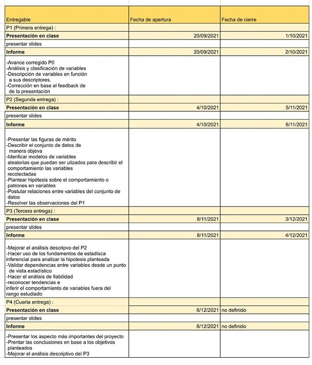

# 1.Importancia

La industria del deporte y, en específico, la del fútbol, es una de las más importantes a nivel mundial, por lo que toda la información concerniente o relacionada a este ámbito resulta sumamente valiosa, tanto para los propios equipos como para agentes externos al deporte (casas de apuestas) , y de alto interés por parte de la población. El valor de estas radica en el conocimiento de factores, características y patrones que dan lugar al determinado desempeño de un equipo, jugador o incluso de una liga entera. Por este motivo, en este estudio analizaremos el desempeño futbolístico en 5 ligas europeas entre 2014 y 2020, tomando en cuenta información como goles, asistencias, disparos, victorias de local, victorias de visitante 


## 1.1.Objetivos
### 1.1.1.Objetivo principal:
+ Analizar el desempeño individual y colectivo en cinco ligas europeas de fútbol(española, inglesa, italiana, alemana y francesa) entre los años 2014 y 2020.

### 1.1.2.Objetivos específicos:

+ Clasificar los equipos de las 5 ligas en base al nivel ofensivo.
+ Determinar la liga más ofensiva durante el periodo de tiempo analizado.
+ Determinar la temporada de mayor productividad goleadora.
+ Describir numéricamente la cantidad goles que se hacen cada minuto en cada liga, cada año.
+ Clasificar a los jugadores de todas las ligas según su media goleadora.
+ Clasificar las ligas en base a la cantidad de infracciones y tarjetas recibidas por partido.
+ Determinar los equipos con más victorias de locales y visitantes.
+ Evaluar la evolución en cuanto a la cantidad de goles realizados en cada liga a lo largo de los años.
+ Comparar la frecuencia de disparos de uno de los jugadores más determinantes de las cinco ligas a lo largo de los años.
+ Determinar los cuatro equipos más representativos de cada liga en cuanto a la cantidad de goles.
+ Establecer relaciones entre variables y detectar patrones significativos.
+ Formular y validar hipótesis sobre variables representativas en nuestro estudio.
+ Aplicar regresión lineal para formular predicciones en base a los patrones encontrados.

# 2.Descripción del estudio

Para este proyecto se utilizará una base de datos pública y fiable (obtenida en <https://www.kaggle.com/technika148/football-database>, una web dedicada al rubro de la ciencia de datos) la cual registra información sobre cinco ligas europeas de fútbol entre los años 2014 y 2020. Esta base de datos se encuentra en formato csv y es de descarga libre. 

Según la propia fuente de esta base de datos, la información provista corresponde a:

+ **Premier League**: 20 equipos, 380 partidos.
+ **La Liga**: 20 equipos, 380/380 partidos.
+ **Serie A**: 20 equipos, 380/380 partidos.
+ **Bundesliga**: 18 equipos, 306/306 partidos. 
+ **Ligue 1**: 20 equipos, 378/380 partidos (dos partidos suspendidos).


# 3.Factibilidad

</p>Durante el curso se llevaran a cabo diferentes actividades, entregables y presentaciones. Contamos con diferentes herramientas, tales como, sesiones de clase, asesorias, libros y materia adicional, para el desarrollo de estas. Además, desarrollamos la siguiente tabla con información sobre el cronográma de asignaciones del proyecto para cumplir con los objetivos de este.<p>



# 4.Clasificación de variables

## 4.1.Variables categóricas
### 4.1.1.Variables nominales

|<span style="color: #0CB7F2">Variable</span> |<span style="color: #0CB7F2">Definicion</span> |
|:--------|:---------|
|player|nombre del jugador|
|playerID|código del jugador|
|gameID|código del juego|
|playerID|código del jugador|
|position|posición del jugador|
|substituteIn|código del jugador entrante al hacer un cambio|
|substituteOut|código del jugador saliente al hacer un cambio|
|leagueID|código de la liga|
|teamID|código del equipo|
|team|nombre del equipo|
|league|nombre de la liga|
|understatNotation|sigla del nombre de la liga|
|shooterID|código del jugador que realiza el disparo|
|assisterID|código del jugador que realiza la asistencia|
|situation|situación en la que se da el disparo (corner o juego libre)|
|lastAction|acción anterior al disparo|
|shotType|parte del cuerpo con la que el jugador realiza el disparo|
|shotResult|resultado del disparo|


### 4.1.2.Variables ordinales

|<span style="color: #0CB7F2">Variable</span> |<span style="color: #0CB7F2">Definicion</span> |
|:--------|:---------|
|season|temporada en la que se jugó el partido|

## 4.2.Variables numéricas

### 4.2.1.Variables Continuas
|<span style="color: #0CB7F2">Variable</span> |<span style="color: #0CB7F2">Definicion</span> |
|:--------|:---------|
|xGoals|indica la probabilidad de convertir un disparo en gol|
|xGoalsChain|indica la probabilidad de convertir un disparo en gol segun la posición del jugador|
|xGoalsBuildup|indica la probabilidad de convertir un disparo o pase clave en gol|
|xAssists|indica la probabilidad de un pase en conventirse en gol|
|xGoal|indica la probabilidad de convertir en gol un disparo de un jugador|
|date|fecha en la que se realizó el partido|
|ppda|número de pases enemigos completados a través de la línea de defensa|
### 4.2.2.Variables Discretas
|<span style="color: #0CB7F2">Variable</span> |<span style="color: #0CB7F2">Definicion</span> |
|:--------|:---------|
|
|player goals|número de goles del jugador en el juego|
|player ownGoals|número de autogoles del jugador en el juego|
|player shots|número de disparos del jugador en el juego|
|player assists|número de asistencias del jugador en el juego|
|keyPasses|número de pases clave del jugador en el juego (no necesariamente terminan en gol)|
|player yellowCard|número de tarjetas amarillas del jugador en el juego|
|player redCard|número de tarjetas rojas del jugador en el juego|
|time|tiempo jugado por el jugador en el partido|
|minute|minuto en el que el jugador realiza el disparo|
|team goals|número de goles del equipo en el encuentro|
|team shots|número de disparos del equipo en el encuentro|
|shotsOnTarget|número de disparos al arco del equipo en el encuentro|
|deep|indica que tan lejos juega de la línea de meta juega un jugador|
|fouls|número de faltas cometidas por el equipo en el encuentro|
|corners|número de saques de esquina del equipo en el encuentro|
|yellowCards|número de tarjetas amarillas del equipo en el encuentro|
|redCards|número de tarjetas rojas del equipo en el encuentro|

# 5.Limpieza de datos 

Nuestra base de datos cuenta con información como apariciones individuales por jugador, disparos realizados en cada partido, estadísticas de cada equipo por partido e información de los partidos disputados dentro del periodo de tiempo mencionado.

Lo primero que realizaremos será cargar cada archivo **`csv`** a través de la librería **`readr`**.


```{r  message=FALSE}
library(readr)
library(tidyverse)
appearances <- read_csv("Data/appearances.csv")
games <- read_csv("Data/games.csv")
leagues <- read_csv("Data/leagues.csv")
shots <- read_csv("Data/shots.csv")
teams <- read_csv("Data/teams.csv")
teamstats <- read_csv("Data/teamstats.csv")
players <-read.csv("Data/players.csv")
```


Utilizando la función **`nrow()`** podremos contar la cantidad de observaciones (filas) correspondientes a los 4 data frames de nuestra base de datos y  utilizando la función **`ncol()`** podremos contar la cantidad de variables (columnas). 

```{r}
n_observaciones <- nrow(appearances) + nrow(games) + nrow (shots) + nrow(teamstats)
n_variables <- ncol(appearances) + ncol(games) + ncol(shots) + ncol(teamstats)

```
Es así que calculamos la existencia de __`r n_observaciones` observaciones y `r n_variables` variables.__

Dado que nuestra base de datos esta estructurada de un modo relacional, en donde nombres correspondientes a jugadores y ligas están dados en base a ID's en los principales *data frames*, debemos utilizar algunas funciones para adaptar cada uno de ellos a lo que nuestro estudio requiere:

+ *Data frame* con los datos correspondientes a las apariciones de cada jugador en todos los partidos.

```{r message = FALSE, echo=FALSE}

colorArea <- function(from, to, density, ..., col="blue", dens=NULL){
    y_seq <- seq(from, to, length.out=500)
    d <- c(0, density(y_seq, ...), 0)
    polygon(c(from, y_seq, to), d, col=col, density=dens)
}
```


```{r message = FALSE}
apariciones_jugadores <- players %>% right_join(appearances,by="playerID") %>% left_join(leagues,by="leagueID") %>% left_join(games %>% select(gameID,season),by="gameID")

apariciones_jugadores %>% rename(ID = playerID, player = name.x, league = name.y, league_notation = understatNotation) -> 
n_apariciones
remove(apariciones_jugadores)
apariciones_jugadores <- distinct(n_apariciones)
rm(n_apariciones)

```

+ *Data frame* con los datos correspondientes a los partidos jugados por cada equipo.
```{r}
estadisticas_equipos <- teams %>% right_join(teamstats,by= "teamID") %>% right_join (apariciones_jugadores %>% select(league,gameID),by="gameID") %>% rename(team=name) %>% distinct

```

+ *Data frame* con los datos correspondientes a los disparos realizados por cada jugador en cada partido.

```{r}
shots <- shots %>% rename(playerID = shooterID) 
disparos <- players %>% inner_join(shots,by="playerID") %>% inner_join(games %>% select(gameID,season),by="gameID") %>% inner_join (apariciones_jugadores %>% select(league,gameID),by="gameID") %>% distinct
disparos <- disparos %>% rename(player=name)
```

También seleccionamos las columnas correspondientes a las variables que consideraremos de cada *data frame* y descartamos las que no necesitaremos.

```{r echo=FALSE}
estadisticas_equipos <- estadisticas_equipos %>%select(gameID,team,season,location,goals,shots,shotsOnTarget,fouls,yellowCards,redCards,result,league)

apariciones_jugadores <- apariciones_jugadores %>% select(gameID,player,goals,ownGoals,shots,assists,keyPasses,position,redCard,time,league,season)

disparos <- disparos %>% select(player,gameID,minute,situation,shotType,shotResult,season,league)

rm(appearances,games,shots,teamstats)


n_observaciones <- nrow(disparos) + nrow(apariciones_jugadores) + nrow(estadisticas_equipos)
```

Habiendo realizado la limpieza de datos, tenemos __`r n_observaciones` observaciones y 24 variables.__
 

# 6.Descripción de los datos

## 6.1.Descriptores numéricos y análisis


### Goles y disparos por equipo

```{r message=FALSE, echo=FALSE, warning=FALSE}

estadisticas_equipos%>%group_by(team) %>% summarise (total_goals= sum(goals),total_shots = sum(shots),total_shots_OT = sum(shotsOnTarget)) %>% arrange(desc(total_goals))

```
En esta tabla tenemos la clasificación de los equipos de todas las ligas, ordenada con respecto al total de goles (adicionalmente tenemos columnas de disparos y disparos a puerta). De este modo, podemos apreciar que el equipo que lidera la clasificación es el Barcelona, seguido del Paris Saint Germain y el Bayern Munich, quienes son también los equipos que más disparan a puerta.

### Goles, disparos y faltas por liga
```{r message=FALSE, echo=FALSE, warning=FALSE}
estadisticas_equipos%>%group_by(league) %>% summarise (total_goals= sum(goals),total_shots_OT = sum(shotsOnTarget),
                                                    total_fouls = sum(fouls), total_red_cards = sum(redCards)) %>% arrange(desc(total_goals))
```

La liga con más goles y más disparos resulta ser la Serie A (liga italiana), además de ser la que más disparos tiene. Podemos notar que la liga con menos goles y disparos , la Bundesliga, también es la liga con menos faltas, mientras que la Serie A, la más goleadora, es la que más faltas presenta. En base a esta información podríamos interpretar la diferencia de intensividad de juego en cada campeonato.

### Minuto de gol en cada liga

```{r echo=FALSE, warning=FALSE,message=FALSE}
moda <- function(x) {
   return(as.numeric(names(which.max(table(x)))))
}

disparos %>% filter(shotResult == "Goal") %>% group_by(season,league) %>% summarise(avg_minute_goal = mean(minute), med_minute = median(minute) , mode_minute = moda(minute), min_minute=(min(minute)),max_min = max(minute),sd_minute = sd(minute))


```

En la última tabla tenemos descriptores numéricos en cuanto a la cantidad de goles que se han realizado por minuto en cada liga y cada año. Se evidencia una cierta tendencia en cuanto al minuto promedio de gol , el cual se aproxima al minuto central de la duración que suelen tener los partidos. Podemos inferir que esto sucede porque , al tener una gran cantidad de datos con cierto grado de aletoriedad existe una tendencia común y lógica en cada caso. Asimismo, la desviación estándar, considerando que contamos con promedios similares en cada fila, es en todos los casos muy aproximada, por lo que esto evidencia más aún en cómo la aletoriedad y la cantidad de datos influye en cuanto a la representatividad de una muestra.

### Goles por jugador
```{r message=FALSE, echo=FALSE, warning=FALSE}
apariciones_jugadores %>% group_by(player) %>% summarise(goal_avg = mean(goals), goals_median = median (goals), goals_sd = sd(goals), max_goals = max(goals)) %>% arrange(desc(goal_avg)) %>% filter(goal_avg != 1) -> n_goals
n_goals
```
Los dos jugadores más importantes a lo largo del periodo analizado son, justamente, Cristiano Ronaldo y Lionel Messi, ambos con un promedio goleador de aproximadamente 0.95 goles por partido. En las demás posiciones del podio, podemos encontrar a Erling Haaland y Kylian Mbappe, quienes evidentemente , y a pesar de su corta edad, ya tienen un impacto importante en el mundo del fútbol.

### Asistencias por jugador
```{r message=FALSE, echo=FALSE, warning=FALSE}
apariciones_jugadores %>% group_by(player) %>% summarise(assists_avg = mean(assists), assists_median = median (assists), assists_cv = sd(assists)/mean(assists), max_assists = max(assists), total_assists = sum(assists)) %>% arrange(desc(assists_avg)) %>% filter (total_assists>1)-> n_assists
n_assists


```

Para jugadores que han dado mas de una asistencia a lo largo de las 7 temporadas los de mejor promedio de asistencias son Kevin De Bruyne, Jadon Sancho, Brian Oddei y Lionel Messi. Este último también forma parte del podio de jugadores con mayor promedio goleador, por lo que se denota la influencia que tiene al momento de generar goles en cada partido. Tanto Messi como De Bruyne han logrado alcanzar un máximo de 3 asistencias en un mismo partido y cuentan con 97 asistencias en total.

### Victorias de local

```{r message=FALSE, echo=FALSE, warning=FALSE}
estadisticas_equipos %>% filter(result == "W" & location == "h") %>% group_by(team) %>% summarise(league = league, t_wins_h_avg = (table(result))/7 ) %>% arrange(desc(t_wins_h_avg)) %>% distinct
```
Los 4 equipos con más promedio de victorias por temporada son Juventus, Barcelona, Paris Saint Germain y Manchester City. Coincidentemente, estos 4 equipos han sido campeones de sus ligas locales en repetidas ocasiones entre el 2014 y el 2020.

### Victorias de visitante
```{r echo=FALSE, warning=FALSE,message=FALSE}

estadisticas_equipos %>% filter(result == "W" & location == "a") %>% group_by(team) %>% summarise(league = league, t_wins_a_avg = (table(result)/7) ) %>% arrange(desc(t_wins_a_avg)) %>% distinct


```
De manera similar a la anterior tabla, en este caso tenemos cantidad de victorias promedio por temporada, pero de visitante y ya no de local. Se evidencia el descenso de la Juventus, que es el equipo con mayor promedio de victorias de local, a la sexta posición, por lo que podríamos inferir la existencia de un mal desempeño y resultados principalmente fuera de casa.Por otro lado, Barcelona , Paris Saint Germain y Manchester City se mantienen en el top 4, al cual se les une el Bayern Munich.


### Disparos por jugador
```{r echo=FALSE, warning=FALSE,message=FALSE}
apariciones_jugadores %>% group_by(player) %>% summarise(shots_avg = mean(shots), shots_median = median (shots), shots_sd = sd(shots), max_shots = max(shots), total_shots = sum(shots)) %>% arrange(desc(shots_avg))-> disparos_numerico
disparos_numerico
```
La tabla presenta descriptores numéricos sobre los disparos que realizó cada jugador a lo largo de las 7 temporadas en estudio, tales como la media de disparos por partido, la mediana, la desviación estándar, el máximo de disparos en un partido y el total de disparos. Cristiano Ronaldo y Lionel Messi, quienes lideran la tabla de goles promedio por partido, se encuentran en los dos primeros lugares en cuando a media de disparos. Además, si ordenamos nuestro data frame según disparos totales, los tres primeros lugares se mantendrían igual, lo cual resulta lógico pues los jugadores que mejor promedio de disparo tienen serían también los que más veces han disparado.


### Minuto de disparo 
```{r echo=FALSE, warning=FALSE,message=FALSE}

disparos %>% group_by(player) %>% summarise(avg_minute_shot = mean(minute), med_minute = median(minute), mode_minute = moda(minute),min_minute = min(minute), max_minute = max(minute), cv_minute=sd(minute)/mean(minute), total_shots = n()) %>% arrange(desc(total_shots)) ->minutos_numerico
minutos_numerico
```
En este caso la variable descrita es el minuto en el que se realizo el disparo y el orden es el mismo al de la tabla anterior (descriptores numéricos de la variable disparos). Podemos notar que para los jugadores con mayores disparos tanto la media como la mediana tienden a un valor central , considerando que los partidos duran un poco más de 90 minutos. A partir de esta información podríamos decir que la variable del minuto de disparo por jugador tiene una distribución simétrica.


### Faltas y tarjetas amarillas por equipo
```{r echo=FALSE, warning=FALSE,message=FALSE}
fouls_df <- estadisticas_equipos %>% group_by(team) %>% summarise(fouls_avg = mean (fouls), fouls_median = median(fouls), fouls_cv = sd(fouls)/mean(fouls), max_fouls = max(fouls), min_fouls = min(fouls), total_fouls = sum(fouls)) %>% arrange(desc(fouls_avg))
fouls_df
```


```{r echo=FALSE, warning=FALSE,message=FALSE}
yellow_df <- estadisticas_equipos %>% group_by(team) %>% summarise(ycards_avg = mean (yellowCards), ycards_median = median(yellowCards), ycards_cv = sd(yellowCards)/mean(yellowCards), max_ycards = max(yellowCards), total_ycards = sum(yellowCards)) %>% arrange(desc(ycards_avg))
yellow_df
```
Según la tabla el promedio de faltas por partido adquiere un máximo de 17 faltas por partido aproximadamente. Este número corresponde al Carpi, por lo que podemos concluir que es el equipo que realizó más entradas agresivas a lo largo de las 7 temporadas. Además, el promedio de tarjetas amarillas por partido tiene un máximo de 13 tarjetas aproximadamente. Este valor corresponde al Getafe, por lo que concluimos que es el equipo con más entradas agresivas sancionadas. Además, la media y la mediana del número de faltas por partido presentan valores similares, debido a esto concluimos que el número de tarjetas y faltas no se ven alterados por valores extremos y que los árbitros tienen en cuenta los mismos criterios al momento de sancionar una falta. Finalmente, el total de tarjetas amarillas y faltas puede variar en gran magnitud al momento de comparar estos valores para 2 equipos, pero también se debe tener en cuenta que no todos los equipo estuvieron en primera división las 7 temporadas por lo que es lógico que algunos presenten un número mayor de dichos valores.

### Pases clave por jugador

```{r echo=FALSE,warning=FALSE,message=FALSE}

pases_1=apariciones_jugadores%>%
  group_by(player)%>%
  summarise(total_pases = sum(keyPasses), promedio_pases = (mean(keyPasses)), minimo_pases = min(keyPasses), maximo_pases = max(keyPasses)) %>% arrange(desc(total_pases))-> pases_clave

pases_clave
 

```
Un pase clave es una jugada que puede iniciar una situación de gol (no necesariamente termina en esto). Este pase es uno que lleva directamente a un disparo de un jugador del mismo equipo al arco contrario, este no debe confundirse con asistencia ya que un pase clave, a diferencia de las asitencias, no necesariamente van a dejar al compañerp sólo ante el portero en ocasión de gol.

Los pases clave muestran la contribución que tiene un jugador para el aspecto ofensivo en la generacion de jugadas de gol, es decir, cuánto contribuye este a que su equipo obtenga la victoria y lo vuelva más competitivo.

En la tabla se puede comparar el desempeño en cantidad de pases clave que realizó cada jugador en total, promedio, minimo y máximo en un periodo de 6 años (2014 - 2020). Como se menciono anteriormente, los pases clave indican que tanto un jugador es capaz de armar y contribuir un ataque ofensivo, por lo que a su vez nos dice que tan competitivo es. 


## 6.2.Descriptores gráficos y análisis


```{r echo=FALSE,warning=FALSE,message=FALSE}

library(ggplot2)

estadisticas_equipos %>% group_by(season,league) %>% summarise(goles_totales = sum(goals)) %>% filter(league == "Bundesliga") -> alemania


ggplot(alemania,aes(x=season,y=goles_totales)) + geom_bar(color="red",stat = "identity",fill = "red") + ggtitle("Bundesliga ")  +
  theme(plot.title = element_text(hjust = 0.5))


estadisticas_equipos %>% group_by(season,league) %>% summarise(goles_totales = sum(goals)) %>% filter(league == "Premier League") -> inglaterra

ggplot(inglaterra,aes(x=season,y=goles_totales)) + geom_bar(color="blue",stat = "identity",fill = "blue") + ggtitle("Premier League")  +
  theme(plot.title = element_text(hjust = 0.5))


estadisticas_equipos %>% group_by(season,league) %>% summarise(goles_totales = sum(goals)) %>% filter(league == "Ligue 1") -> fran


ggplot(fran,aes(x=season,y=goles_totales)) + geom_bar(color="skyblue",stat = "identity",fill = "skyblue") + ggtitle("Ligue 1 ")  +
  theme(plot.title = element_text(hjust = 0.5))


estadisticas_equipos %>% group_by(season,league) %>% summarise(goles_totales = sum(goals)) %>% filter(league == "Serie A") -> ita


ggplot(ita,aes(x=season,y=goles_totales)) + geom_bar(color="green",stat = "identity",fill = "green") + ggtitle("Serie A")  +
  theme(plot.title = element_text(hjust = 0.5))

estadisticas_equipos %>% group_by(season,league) %>% summarise(goles_totales = sum(goals)) %>% filter(league == "La Liga") -> españa

ggplot(españa,aes(x=season,y=goles_totales)) + geom_bar(color="yellow",stat = "identity",fill = "yellow") + ggtitle("La Liga ")  +
  theme(plot.title = element_text(hjust = 0.5))
```


La temporada de más goles en la Bundesliga fue la del 2019, mientras que la de menor cantidad fue el 2014.

La temporada de más goles en la Premier League  fue la del 2018, mientras que la de menor cantidad fue el 2014.

La temporada de más goles en la Ligue 1 fue la del 2020, mientras que la de menor cantidad, notoriamente, fue el 2019.

La temporada de más goles en la Serie A fue la del 2020, mientras que la de menor cantidad fue el 2015.

La temporada de más goles en La Liga fue la del 2016, mientras que la de menor cantidad fue 2019.

```{r echo=FALSE,warning=FALSE,message=FALSE}

tabla_suma_goles<-estadisticas_equipos%>%
  group_by(league,season)%>%
 summarise(goles = sum(goals))


ggplot(tabla_suma_goles,aes(x=season,y=goles,fill=league,main = "Goles por temporada entre 2014-2020"))+geom_col(position = "dodge") + ggtitle("Goles por temporada en cada liga")  +
  theme(plot.title = element_text(hjust = 0.5))

```

El gráfico de barras presenta una comparación de la cantidad de goles totales por liga en cada año. Por lo general, la liga con más goles por temporada es la Serie A , mientras que la liga con menos goles es la Bundesliga. A partir del gráfico también se evidencia una caída la cantidad de goles en la Liga española desde el 2016.

```{r echo=FALSE,warning=FALSE,message=FALSE}

disparos %>% filter(player == "Lionel Messi" & season == 2020)-> minutos
hist(minutos$minute, col = "gray", xlab = "Minuto del partido", main = "Frecuencia de disparos de Messi en 2020")

disparos %>% filter(player == "Lionel Messi" & season == 2018)-> minutos
hist(minutos$minute, col = "gray", xlab = "Minuto del partido", main = "Frecuencia de disparos de Messi en 2018")

disparos %>% filter(player == "Lionel Messi" & season == 2016)-> minutos
hist(minutos$minute, col = "gray", xlab = "Minuto del partido", main = "Frecuencia de disparos de Messi en 2016")

disparos %>% filter(player == "Lionel Messi" & season == 2014)-> minutos
hist(minutos$minute, col = "gray", xlab = "Minuto del partido", main = "Frecuencia de disparos de Messi en 2014")

```
 
 
 La frecuencia de disparos al arco por minuto de partido en promedio de Messi en el 2020 indican que el jugador tiene mayor frecuencia de disparos entre los minutos 40 y 50 (mitad del partido) y menor frecuencia al inicio y final del mismo.
 
 La frecuencia de disparos al arco por minuto de partido en promedio de Messi en el 2018 indican que el jugador tiene mayor frecuencia de disparos entre los minutos 40- 50, seguido por los minutos 80-90 y menor frecuencia al inicio y final del mismo.
 
 La frecuencia de disparos al arco por minuto de partido en promedio de Messi en el 2016 indican que el jugador tiene mayor frecuencia de disparos entre los minutos de 40 a 60 y menor frecuencia al final del mismo.
 
 La frecuencia de disparos al arco por minuto de partido en promedio de Messi en el 2014 indican que el jugador tiene mayor frecuencia de disparos entre los minutos de 60 a 70 y menor frecuencia al final del mismo.
 

```{r echo=FALSE,warning=FALSE,message=FALSE}

box_plot_equipos<-estadisticas_equipos%>%
  group_by(season,team)%>%
  summarise(goals_per_year =sum(goals))
box_plot_2014<-box_plot_equipos %>% filter (season == 2014)
box_plot_2015<-box_plot_equipos%>% filter (season == 2015)
box_plot_2016<-box_plot_equipos%>% filter (season == 2016)
box_plot_2017<-box_plot_equipos%>% filter (season == 2017)
box_plot_2018<-box_plot_equipos%>% filter (season == 2018)
box_plot_2019<-box_plot_equipos%>% filter (season == 2019)
box_plot_2020<-box_plot_equipos%>% filter (season == 2020)

#qplot(x=box_plot_2014$goals_per_year,geom="boxplot" ,xlab="Goles en la temporada",main = "Boxplot de los goles totales por equipo en las 5 ligas el 2014")

ggplot(box_plot_2014, aes(x=goals_per_year,y="")) +
  stat_boxplot(geom="errorbar") +
  geom_boxplot(fill="lightgreen", outlier.alpha = 0.3) +
  xlab("Goles en la temporada") +
  ylab("") +
  ggtitle("Boxplot de los goles totales por equipo en las 5 ligas el 2014")


#qplot(x=box_plot_2015$goals_per_year,geom="boxplot",xlab="Goles en la temporada",main = "Boxplot de los goles totales por equipo en las 5 ligas el 2015")

ggplot(box_plot_2015, aes(x=goals_per_year,y="")) +
  stat_boxplot(geom="errorbar") +
  geom_boxplot(fill="lightgreen", outlier.alpha = 0.3) +
  xlab("Goles en la temporada") +
  ylab("") +
  ggtitle("Boxplot de los goles totales por equipo en las 5 ligas el 2015")

#qplot(x=box_plot_2016$goals_per_year,geom="boxplot",xlab="Goles en la temporada",main = "Boxplot de los goles totales por equipo en las 5 ligas el 2016" )

ggplot(box_plot_2016, aes(x=goals_per_year,y="")) +
  stat_boxplot(geom="errorbar") +
  geom_boxplot(fill="lightgreen", outlier.alpha = 0.3) +
  xlab("Goles en la temporada") +
  ylab("") +
  ggtitle("Boxplot de los goles totales por equipo en las 5 ligas el 2016")

#qplot(x=box_plot_2017$goals_per_year,geom="boxplot",xlab="Goles en la temporada",main = "Boxplot de los goles totales por equipo en las 5 ligas el 2017")

ggplot(box_plot_2017, aes(x=goals_per_year,y="")) +
  stat_boxplot(geom="errorbar") +
  geom_boxplot(fill="lightgreen", outlier.alpha = 0.3) +
  xlab("Goles en la temporada") +
  ylab("") +
  ggtitle("Boxplot de los goles totales por equipo en las 5 ligas el 2017")


#qplot(x=box_plot_2018$goals_per_year,geom="boxplot",xlab="Goles en la temporada",main = "Boxplot de los goles totales por equipo en las 5 ligas el 2018" )

ggplot(box_plot_2018, aes(x=goals_per_year,y="")) +
  stat_boxplot(geom="errorbar") +
  geom_boxplot(fill="lightgreen", outlier.alpha = 0.3) +
  xlab("Goles en la temporada") +
  ylab("") +
  ggtitle("Boxplot de los goles totales por equipo en las 5 ligas el 2018")

#qplot(x=box_plot_2019$goals_per_year,geom="boxplot",xlab="Goles en la temporada",main = "Boxplot de los goles totales por equipo en las 5 ligas el 2019")

ggplot(box_plot_2019, aes(x=goals_per_year,y="")) +
  stat_boxplot(geom="errorbar") +
  geom_boxplot(fill="lightgreen", outlier.alpha = 0.3) +
  xlab("Goles en la temporada") +
  ylab("") +
  ggtitle("Boxplot de los goles totales por equipo en las 5 ligas el 2019")

#qplot(x=box_plot_2020$goals_per_year,geom="boxplot",xlab="Goles en la temporada",main = "Boxplot de los goles totales por equipo en las 5 ligas el 2020" )

ggplot(box_plot_2020, aes(x=goals_per_year,y="")) +
  stat_boxplot(geom="errorbar") +
  geom_boxplot(fill="lightgreen", outlier.alpha = 0.3) +
  xlab("Goles en la temporada") +
  ylab("") +
  ggtitle("Boxplot de los goles totales por equipo en las 5 ligas el 2020")
```

En los diagramas de cajas presentados podemos ver la cantidad de goles por equipo por temporada. Por lo general, son 3 equipos los que se alejan de sus competidores en cuanto a la cantidad de goles. La mediana suele estar cerca a los 40 goles cada año.


<h3> Cantidad goles por equipo en cada liga en el periodo 2014-2020</h3>
```{r echo=FALSE,warning=FALSE,message=FALSE}

pie_bundesliga<-estadisticas_equipos%>%
  filter(league=="Bundesliga")%>%
group_by(team)%>%
  summarise(goles_tem=sum(goals))%>%
  arrange(desc(goles_tem))


ggplot(pie_bundesliga,aes(x=reorder(team,goles_tem),y=goles_tem,main = "Goles por temporada entre 2014-2020"))+geom_col(position="dodge")+coord_flip()+ggtitle("Bundesliga")+(theme(plot.title = element_text(hjust = 0.5))) +  labs(x = "Equipos",y = "Goles totales")


pie_serieA<-estadisticas_equipos%>%
  filter(league=="Serie A")%>%
group_by(team)%>%
  summarise(goles_tem=sum(goals))%>%
              arrange(desc(goles_tem))


ggplot(pie_serieA,aes(x=reorder(team,goles_tem),y=goles_tem,main = "Goles por temporada entre 2014-2020"))+geom_col(position = "dodge")+coord_flip()+ggtitle("Serie A")+(theme(plot.title = element_text(hjust = 0.5))) +  labs(x = "Equipos",y = "Goles totales")


pie_Premier<-estadisticas_equipos%>%
  filter(league=="Premier League")%>%
group_by(team)%>%
  summarise(goles_tem=sum(goals))%>%
              arrange(desc(goles_tem))


ggplot(pie_Premier,aes(x=reorder(team,goles_tem),y=goles_tem,main = "Goles por temporada entre 2014-2020"))+geom_col(position = "dodge")+coord_flip()+ggtitle("Premier League")+(theme(plot.title = element_text(hjust = 0.5))) +  labs(x = "Equipos",y = "Goles totales")


pie_la_liga<-estadisticas_equipos%>%
  filter(league=="La Liga")%>%
group_by(team)%>%
  summarise(goles_tem=sum(goals))%>%
              arrange(desc(goles_tem))


ggplot(pie_la_liga,aes(x=reorder(team,goles_tem),y=goles_tem,main = "Goles por temporada entre 2014-2020"))+geom_col(position = "dodge")+coord_flip()+ggtitle("La liga")+(theme(plot.title = element_text(hjust = 0.5))) +  labs(x = "Equipos",y = "Goles totales")


pie_ligue1<-estadisticas_equipos%>%
  filter(league=="Ligue 1")%>%
group_by(team)%>%
  summarise(goles_tem=sum(goals))%>%
              arrange(desc(goles_tem))

ggplot(pie_ligue1,aes(x=reorder(team,goles_tem),y=goles_tem,main = "Goles por temporada entre 2014-2020"))+geom_col(position = "dodge")+coord_flip()+ggtitle("Ligue 1")+(theme(plot.title = element_text(hjust = 0.5))) +  labs(x = "Equipos",y = "Goles totales")
```


Los gráficos de barras horizontales representan la cantidad de goles totales de cada equipo en sus respectivas ligas del 2014 al 2020. Barcelona, Bayern, Manchester City, Paris Saint Germain y Napoli lideran sus respectivas ligas. Sorprendentemente, a pesar de liderar la tabla goleadora de su liga, el Napoli nunca ha sido campeón de la Serie A en este periodo.


```{r echo=FALSE,warning=FALSE,message=FALSE}
boxplot(disparos_numerico$shots_avg, col = "green",horizontal = TRUE, main = "Disparos por partido", xlab= "Promedio de disparos")
abline(v=mean(disparos_numerico$shots_avg ), col = "red",lwd=3, lty=2)
legend("topright", c("Media de los promedios de disparo"), col = "red", lwd=3 , lty=2 )
```

A partir del boxplot de los promedios de disparo por partido de cada jugador se puede evidenciar la existencia de muchos datos atípicos , en donde resaltan dos con valores cercanos al 5 y al 6, mientras que la media de los promedios de disparo se encuentra en 0.64. Podríamos deducir que el resultado gráfico que tenemos está influenciado por promedios de disparo correspondientes a jugadores de posiciones distintas a las de delantero que de modo circunstancial han podido disparar al arco pero que no suelen hacerlo, mienras que la gran cantidad de datos por fuera del RIQ corresponde a delanteros con alto promedio de disparo por partido. 


```{r message=FALSE, echo=FALSE, warning=FALSE}
boxplot(fouls_df$total_fouls,horizontal = TRUE, col = "red", main = "Faltas por equipo en las 7 temporadas", xlab= "Faltas totales")
abline(v=mean(fouls_df$total_fouls), col = "blue", lwd = 3, lty = 2)
legend("topright",c("Media de las faltas"),col = "blue", lwd = 3,lty =2)
```

Según el gráfico boxplot del total de faltas por equipo a lo largo de las 7 temporadas, ningún equipo presenta valores atípicos. La mediana de faltas por equipo adquiere un valor ligeramente inferior a las 2500 faltas. Además, la media de las faltas es 2250 (un número cercano a la mediana), por lo que la consideramos como un valor representativo.


```{r message=FALSE, echo=FALSE, warning=FALSE}
boxplot(yellow_df$total_ycards,horizontal = TRUE, col = "yellow", main = "Tarjetas amarillas por equipo en las 7 temporadas", xlab= "Total de tarjetas amarillas")
abline(v=mean(yellow_df$total_ycards,na.rm = TRUE), col = "green", lwd = 3, lty = 2)
legend("topright",c("Media del total de tarjetas amarillas"),col = "green", lwd = 3,lty =2)
```

Según el gráfico boxplot del total de tarjetas amarillas por equipo a lo largo de las 7 temporadas, ningún equipo presenta valores atípicos. La mediana de tarjetas amarillas por equipo adquiere un valor inferior a las 400 tarjetas amarillas por equipo. Además, la media de penalizaciones es 375 (un número cercano a la mediana), por lo que la consideramos como un valor representativo.


```{r message=FALSE, echo=FALSE, warning=FALSE}
boxplot(n_goals$goal_avg, col = "orange",horizontal = TRUE, main = "Goles promedio de jugadores", xlab= "Promedio de goles")
abline(v=mean(n_goals$goal_avg), col = "blue",lwd=3, lty=2)
legend("bottomright", c("Media de los promedios de goles"), col = "blue", lwd=3 , lty=2 )
```

La mayoria de jugadores en un partido anotan 1 o ni un gol, mientras que hay casos muy particulares en la que pocos jugadores tienen un promedio cercano a un gol por partido, cuyos promedios correspsonden a los jugadores mas reconocidos del mundo como lo son Messi o Cristiano Ronaldo. Los puntos que representan datos atípicos, son en su mayoria delanteros, jugadores que estan en constante interacción con el arco del equipo contrario.


```{r message=FALSE, echo=FALSE, warning=FALSE}
boxplot(n_assists$assists_avg, col = "yellow",horizontal = TRUE, main = "Asistencias promedio de jugadores", xlab= "Promedio de asistencias")
abline(v=mean(n_assists$assists_avg), col = "blue",lwd=3, lty=2)
legend("bottomright", c("Media de los promedios de asistencias"), col = "blue", lwd=3 , lty=2 )
```

De manera similar a los goles , las asistencias promedio de los jugadores por partido tienen una media alrededor de 0.1, la cual es baja debido a la influencia de jugadores relacionados a roles defensivos que de manera circunstancial pueden dar una asistencia pero que después no lo hacen de nuevo. Asimismo, existe una gran cantidad de datos atípicos correspondientes a promedios altos de jugadores más ofensivos como Messi o De Bruyne.  


```{r message=FALSE, echo=FALSE, warning=FALSE}
#1
pases_3=apariciones_jugadores%>%
  group_by(position)%>%
  summarise(total_pases = sum(keyPasses), promedio_pases = (mean(keyPasses)), minimo_pases = min(keyPasses), maximo_pases = max(keyPasses)) %>% arrange(desc(total_pases))-> pases_posicion


ggplot(pases_posicion,aes(x =reorder(position,total_pases),y=total_pases, main = "Cantidad de pases clave por posición de cada jugador")) + geom_col(position = "dodge") +coord_flip() + ggtitle("Cantidad de pases clave por posición de cada jugador") + (theme(plot.title = element_text(hjust = 0.5))) +  labs(y = "Pases claves totales",x = "Posiciones") 
```


La relevancia de los pases clave es que ha permitido también revelar que existen mediocampistas, no necesariamente ofensivos, pero que sí tienen una gran contribución en la generación de goles, que termina siendo una de las variables más importantes para ganar un partido. La aparición del pase clave, mas allá de la asistencia, es un buen indicador de la contribución que puede tener un mediocampista para llegar al gol.

```{r message=FALSE, echo=FALSE, warning=FALSE}
hist(disparos$minute, main = "Minutos en los que se realizan disparos", col = "lightblue",xlab = "Minuto del partido")
abline(v=mean(disparos$minute), col = "red")
abline(v=which.max(table(disparos$minute)), col = "blue")
abline(v=median(disparos$minute), col = "yellow")
legend("topright", c("Media","Moda","Mediana"), col = c("red","blue","yellow"), cex=0.8, pt.cex =0.8, lwd=1, lty=1 )

```

Este histograma de los minutos en los que se realizan disparos nos muestra una distribución simétrica de la variable en cuestión, lo cual se puede apreciar tanto visualmente como a través de la media, la moda y la mediana, las cuales se encuentran en valores aproximados entre sí. La frecuencia de disparos entre el minuto 95 y el 100 es baja pues los partidos no suelen extenderse tantos minutos como para alcanzar los 100.

```{r message=FALSE, echo=FALSE, warning=FALSE}
aux_faltas <- estadisticas_equipos %>% filter(league == "Serie A")

ggplot(aux_faltas,aes(fouls)) +
  geom_histogram(color="gray", aes(y=..density..),bins=17) +
  geom_density(color="red", fill="red", aes(y=..density..), alpha=0.4) +
  ylab("Density") +
  xlab("Fouls") +
  ggtitle("Gráfico de densidad de Faltas por partido por equipo en la Serie A")
```

En el gráfico de densidad de las faltas que cometen los equipos de la Serie A (la liga con mayor cantidad de faltas en el periodo 2014-2020) por partido, podemos apreciar una distribución simétrica de esta variable, lo cual nos podría indicar que las faltas se distribuyen de manera normal entre todos los equipos de la primera división italiana. De este modo, al contar con una distribución de este tipo podremos realizar pruebas de hipótesis con esta variable.

```{r message=FALSE, echo=FALSE, warning=FALSE}
estadisticas_equipos %>% filter(league == "Bundesliga" & result == "W") %>% group_by(team) %>% summarise(V = n()) -> aux_v

ggplot(aux_v, aes(V)) +
  geom_histogram(aes(y=..density..), colour="gray", bins=7) +
  geom_density(aes(y=..density..), colour="green", fill="lightgreen", alpha=0.4) +
  ylab("Density") +
  xlab("Victorias por equipos de la Bundesliga") +
  ggtitle("Gráfico de densidad de victorias por equipos de la Bundesliga")
```

En el gráfico de densidad de las victorias por equipos de la Bundesliga se puede apreciar una distribución normal comprobada con un test de Shapiro. Asimismo, se puede comprobar mediante la prueba de hipótesis planteada que la media es menor a 66.4 (de la Serie A), lo cual tiene sentido al revisar la distribución del gráfico y el intervalo de confianza de la media de esta misma variable.


# 7. Modelos de Variables Aleatorias 

|<span style="color: #0CB7F2">Variable</span> |<span style="color: #0CB7F2">Definicion</span> |
|:--------|:---------|
|Minuto en el que se realiza un disparo| El minuto del partido corresponde a una variable aleatoria discreta, según el gráfico de barras que hicimos en cuanto a la frecuencia de disparos por minuto sabemos que esta variable podría aproximarse a una distribución uniforme en el intervalo de 0 a 90.|
|Goles, asistencias, disparos, pases clave en un partido|Los goles, asistencias, disparos y pases claves realizados en un partido corresponden a una variable aleatoria discreta. Los goles por partido están en el rango de 0 a 5, las asistencias por partido en el rango de 0 a 4, los disparos por partido de 0 a 14 y los pases claves en el rango de 0 a 12 por partido.|
|Location| La locación del equipo que disputó el partido corresponde a una variable aleatoria discreta .Un equipo puede jugar de local o de visitante por lo que podríamos  relacionarlo con un modelo Bernoulli en donde “p” es la probabilidad de que un equipo haya disputado un partido de local.|
|Temporada| La temporada en que se jugó el partido es una variable aleatoria discreta en el rango de 2015 a 2020. Podemos relacionarla con una distribución uniforme pues en nuestra base de datos tenemos todos los partidos disputados en una temporada regular de fútbol.|
|Liga|La liga europea a la que corresponde el enfrentamiento es una variable aleatoria discreta y tiene 5 posibles valores. Ya que de las 5 ligas 3 tienen 380 partidos, una liga tiene 378 y la última 306 podríamos aproximar el comportamiento de esta variable como una distribución uniforme.|
|Posición del jugador que realizó el disparo| De todos los disparos posibles (Tamaño de población N) tenemos interés en los M elementos que corresponden a determinada posición en el campo de juego. Con  una muestra de tamaño “n” la cantidad de elementos que presentan la posición de interés sería “x” , por lo que podríamos relacionar esta variable con una distribución de probabilidad hipergeométrica.|


# 8. Análisis inferencial

## 8.1 Prueba de Hipótesis e intervalos de confianza

### Hipótesis 1

$H_0:$ La media del minuto en que se realiza un disparo en un partido de futbol de alguna de las 5 grandes ligas europeas como máximo 45.
\
$H_0:$ $\mu \le 45$
\
$H_1:$ La media del minuto en que se realiza un disparo en un partido de futbol de alguna de las 5 grandes ligas europeas es mayor a 45.
\
$H_1:$ $\mu > 45$
\

Intervalo de confianza al 90% para la media del minuto en que se realiza un disparo.

```{r message=FALSE,echo=FALSE, warning=FALSE}
# CONFIANZA DEL 90%
alpha = 0.1
disparos_sam <- sample(disparos$minute,1000)
# Intervalo de confianza de media
mean(disparos_sam)-qt(1-0.1/2,999)*sd(disparos_sam)/sqrt(1000)
mean(disparos_sam)+qt(1-0.1/2, 999)*sd(disparos_sam)/sqrt(1000)
```
\
Intervalo de confianza al 90% para la varianza del minuto en que se realiza un disparo.
```{r message=FALSE,echo=FALSE, warning=FALSE}
# Intervalo de confianza de varianza
(999*sd(disparos_sam)^2)/qchisq(1-0.1/2,999)
(999*sd(disparos_sam)^2)/qchisq(0.15/2,999)
```

\
Intervalo de confianza al 90% para la desviacion estándar del minuto en que se realiza un disparo
```{r message=FALSE,echo=FALSE, warning=FALSE}
# Intervalo de confianza de desviación estándar
sqrt((999*sd(disparos_sam)^2)/qchisq(1-0.1/2,999))
sqrt((999*sd(disparos_sam)^2)/qchisq(0.1/2,999))

```

\
Prueba de hipótesis unilateral con cola hacia la derecha:
```{r message=FALSE,echo=FALSE, warning=FALSE}
t.test(disparos_sam, alternative = "greater", mu=45, conf.level = .9)

```
Dado que el p-value es menor a nuestra significancia se rechaza la hipótesis nula, es decir, podemos aceptar que al 90% la media es mayor a 45.
\
```{r  echo=FALSE,fig.align = 'center'}
tc_disparo <- (mean(disparos_sam)- 45)/(sd(disparos_sam)/sqrt(1000))


to_disparo <- qt(0.9,999)

curve(dnorm(x), from=-8,to=8, xlim=c(-8,8), col="blue", lwd=4, main="Distribución de disparos f(x) Normal Estándar", ylab="f(x)")
legend("topright",legend=c("Z alfa","Z crítico supuesto", "Región de rechazo"), cex = 0.8, fill = c("red","green","lightblue"))
colorArea(from=to_disparo, to=500, dnorm, col="lightblue")
abline(v=to_disparo, col="red", lwd=3)
abline(v=tc_disparo, col="green", lwd=2)

```
A partir de esta gráfica, habiendo calculado los valores para $t_c$ y $t_0$ podemos notar que nos encontramos en la región de rechazo para una hipótesis unilateral con cola hacia la derecha, por lo que se comprueba que nuestra hipótesis nula es rechazada.

### Hipótesis 2

$H_0:$ La media de las victorias por equipos de la Bundesliga es menor o igual al de la Serie A
\
$H_0:$ $\mu \le 66.4$
\
$H_1:$ La media de las victorias por equipos de la Bundesliga es es mayor al de la Serie A
\
$H_1:$ $\mu > 66.4$
\

Intervalo de confianza al 85% para la media de victorias por equipos de la Bundesliga.
```{r  message=FALSE,echo=FALSE, warning=FALSE}

# Intervalo de confianza de parámetros de media de victorias por equipos
# de la Bundesliga
# Nivel de confianza de 85%, debido a que los datos no se encuentran
# muy dispersos
# alpha = 0.15

# Intervalo de confianza de media
mean(aux_v$V)-qt(1-0.15/2,24)*sd(aux_v$V)/sqrt(25)
mean(aux_v$V)+qt(1-0.15/2, 24)*sd(aux_v$V)/sqrt(25)

```
\
Intervalo de confianza al 85% para la varianza de victorias por equipos de la Bundesliga.

```{r message=FALSE,echo=FALSE, warning=FALSE }
# Intervalo de confianza de varianza
(24*sd(aux_v$V)^2)/qchisq(1-0.15/2,24)
(24*sd(aux_v$V)^2)/qchisq(0.15/2,24)
```

\
Intervalo de confianza al 85% para la desviación estándar de victorias por equipos de la Bundesliga.
```{r  message=FALSE,echo=FALSE, warning=FALSE}
# Intervalo de confianza de desviación estándar
sqrt((24*sd(aux_v$V)^2)/qchisq(1-0.15/2,24))
sqrt((24*sd(aux_v$V)^2)/qchisq(0.15/2,24))
```

\
Prueba de hipótesis unilateral con cola hacia la derecha:

```{r message=FALSE,echo=FALSE, warning=FALSE}
t.test(aux_v$V, alternative = "greater", mu=66.4, conf.level = .85)
```
Dado que el p-value es mayor a nuestra significancia se acepta nuestra hipótesis nula y podemos decir que la media es menor o igual a 66.4 al 85% de confianza.

```{r message=FALSE,echo=FALSE, warning=FALSE}
tc_v <- (mean(aux_v$V)- 66.4)/(sd(aux_v$V)/sqrt(length(aux_v$V)))

to_v <- qt(0.9,length(aux_v$V)-1)


curve(dnorm(x), from=-8, to=8, xlim=c(-8,8), col="red", lwd=4, main="Distribución de victorias por equipo en la Bundesliga f(x) Normal Estándar", ylab="f(x)")
legend("topright",legend=c("Z alfa","Z crítico supuesto", "Región de rechazo"), cex = 0.8, fill = c("green","blue","yellow"))
colorArea(from=to_v, to=100, dnorm, col="yellow")
abline(v=to_v, col="green", lwd=3)
abline(v=tc_v, col="blue", lwd=2)

```

A partir de esta gráfica, habiendo calculado los valores para $t_c$ y $t_o$ podemos notar que nos encontramos en la región de aceptación de la hipótesis nula, por lo que se comprueba que al 85% nuestra media es menor que 66.4.


### Hipótesis 3

$H_0:$ La media de las faltas por partido por equipo de la Serie A es menor o igual a 14
\
$H_0:$ $\mu \le 14$
\
$H_1:$ La media de las faltas por partido por equipo de la serie A es mayor a 14
\
$H_1:$ $\mu > 14$

\
Intervalo de confianza al 90% para la media de faltas por partido por equipo en la Serie A.

```{r  message=FALSE,echo=FALSE, warning=FALSE}

# Intervalo de confianza de parámetros de media de faltas por partido por equipo de la serie A

# Nivel de confianza de 90%, debido a que los datos no se encuentran
# muy dispersos
# alpha = 0.1
# Intervalo de confianza de media
mean(aux_faltas$fouls)-qt(1-0.1/2,5319)*sd(aux_faltas$fouls)/sqrt(5320)
mean(aux_faltas$fouls)+qt(1-0.1/2,5319)*sd(aux_faltas$fouls)/sqrt(5320)

```
\
Intervalo de confianza al 90% para la varianza de faltas por partido por equipo en la Serie A.

```{r message=FALSE,echo=FALSE, warning=FALSE }
# Intervalo de confianza de varianza
(5319*sd(aux_faltas$fouls)^2)/qchisq(1-0.1/2,5319)
(5319*sd(aux_faltas$fouls)^2)/qchisq(0.1/2,5319)
```

\
Intervalo de confianza al 90% para la desviación estándar de faltas por partido por equipo en la Serie A.
```{r  message=FALSE,echo=FALSE, warning=FALSE}
# Intervalo de confianza de desviación estándar
sqrt((5319*sd(aux_faltas$fouls)^2)/qchisq(1-0.1/2,5319))
sqrt((5319*sd(aux_faltas$fouls)^2)/qchisq(0.1/2,5319))
```
\
Prueba de hipótesis unilateral con cola hacia la derecha:
```{r message=FALSE,echo=FALSE, warning=FALSE}
t.test(aux_faltas$fouls, alternative = "greater", mu=14, conf.level = .9)
```
Dado que el p-value es mayor que nuestra significancia se acepta nuestra hipótesis nula, por lo que podemos aceptar que al 90% la media es menor a 14.

```{r echo=FALSE,fig.align = 'center'}
tc_fouls <- (mean(aux_faltas$fouls)- 14)/(sd(aux_faltas$fouls)/sqrt(length(aux_faltas$fouls)))
to_fouls <- qt(0.9,length(aux_faltas$fouls)-1)

curve(dnorm(x), from=-8, to=8, xlim=c(-8,8), col="yellow", lwd=4, main="Distribución de faltas por partido por equipo  f(x) Normal Estándar", ylab="f(x)")
legend("topright",legend=c("Z alfa","Z crítico supuesto", "Región de rechazo"), cex = 0.8, fill = c("red","blue","green"))
colorArea(from=to_fouls, to=100, dnorm, col="green")
abline(v=to_fouls, col="red", lwd=3)
abline(v=tc_fouls, col="blue", lwd=2)
```

A partir de esta gráfica, habiendo calculado los valores para $t_c$ y $t_0$ podemos notar que nos encontramos en la región de aceptación para una hipótesis unilateral con cola hacia la derecha, por lo que se comprueba que al 90% la media es menor a 14. 


# 9.Relaciones entre variables y regresión

```{r message=FALSE, echo=FALSE, warning=FALSE}
pases_2=apariciones_jugadores%>%
  group_by(player)%>%
  summarise(total_goles = sum(goals), total_pases = sum(keyPasses), promedio_pases = round(mean(keyPasses),0), minimo_pases = min(keyPasses), maximo_pases = max(keyPasses)) %>% arrange(desc(total_pases))-> pases_tabla


cor(x=pases_tabla$total_pases, y=pases_tabla$total_goles) -> cor1

ggplot(pases_tabla,aes(total_pases,total_goles))+geom_point()+labs(y="Goles anotados",x="Pases clave")+geom_smooth(method = "lm",color="red") + ggtitle ("Pases claves vs Goles anotados") + (theme(plot.title = element_text(hjust = 0.5)))

lm(pases_tabla$total_goles~pases_tabla$total_pases) -> patrones1
coefficients(patrones1)

```
La siguiente ecuación describe la función lineal obtenida del gráfico de correlación goles anotados vs pases claves.

\begin{equation}
f(x)= 0.0829 + 0.1418x 
\end{equation}

Se puede ver que la correlación entre los goles anotados y los pases clave es regular (0.69), esto se debe principalmente a que no todos los goles anotados van a ser siempre a razón de un pase clave, puede deberse a otro tipo de variables como asistencias, tiros libres y penales. De todas formas, como se mencionó anteriormente, un pase clave arma un ataque ofensivo con objetivos de gol por lo que su relación con los goles anotados tampoco es nula.


```{r message= FALSE, echo=FALSE, warning = FALSE}

total<-estadisticas_equipos%>%
  group_by(team)%>%
  summarise(total_faltas=sum(fouls),total_amarillas=sum(yellowCards))

ggplot(total,aes(total_faltas,total_amarillas))+geom_point()+labs(x="total faltas",y="total amarillas")+geom_smooth(method = "lm",color="red") + ggtitle ("Total faltas vs Total amarillas") + (theme(plot.title = element_text(hjust = 0.5)))

lm(total$total_amarillas~total$total_faltas) -> patrones2
coefficients(patrones2)

cor(total$total_amarillas,total$total_faltas, use = "complete.obs") -> cor2

```

La siguiente ecuación describe la función lineal obtenida del gráfico de correlación total de amarillas vs total de faltas. 

\begin{equation}
f(x)= -2.2933 + 0.1578x 
\end{equation}

El coeficiente de correlación de ambas variables es 0.96. El valor elevado de este coeficiente se debe, principalmente, a que cuando un jugador comete varias entradas agresivas o faltas leves en el mismo partido es muy probable que termine con una tarjeta amarilla al final de este.

La gráfica muestra la tendencia del equipo a obtener más tarjetas amarillas según aumenta el número de faltas cometidas. En ese sentido, podemos deducir que mientras aumente el número de entradas agresivas y/o faltas, el número de tarjetas amarillas lo hará en casi igual proporción.


```{r message=FALSE,echo=FALSE, warning=FALSE}

apariciones_jugadores %>% group_by(player) %>% summarise(goles = sum(goals), asistencias = sum(assists)) %>% arrange(desc(goles)) -> patrones3

ggplot(patrones3,aes(goles,asistencias))+geom_point()+labs(x="goles",y="asistencias")+geom_smooth(method = "lm",color="red") + ggtitle ("Goles vs Asistencias") + (theme(plot.title = element_text(hjust = 0.5)))


cor(x= patrones3$goles, y=patrones3$asistencias)->cor3
lm(patrones3$asistencias~patrones3$goles) -> patrones4
coefficients(patrones4)

```

El modelo lineal que relaciona la variable goles anotados y asistencias realizadas se representa por la siguiente ecuación:

\begin{equation}
f(x)= 1.4724 + 0.4207x 
\end{equation}


La correlación entre las dos variables es de 0.74, es decir, una correlación positiva alta. La interpretación que le damos a esta gráfica es que existe una tendencia a que los jugadores que más involucrados están con el ataque, como extremos o segundos delanteros, tienden a hacerlo tanto a través de goles como asistencias. Por otro lado, también existen mediocampistas ofensivos, cuyo rol se centra en las asistencias pero no los priva de la anotación de goles. Se podría plantear como hipótesis que los jugadores que más goles anoten en las siguientes temporadas tendrán también una considerable cantidad de asistencias debido a su influencia ofensiva.


## 9.1 Predicciones en base a los modelos de variables

Empleando la información del jugador Thomas Müller, el cual tiene un total de pases clave $x = 450$ y un total de goles anotados de $71$ se puede comparar el resultado real con el del modelado. Empleando de nuevo la función $f(x)$ y reemplazando en $f(246)$ se tiene un valor de $63,9$, lo cual es relativamente cerca. La gráfica no presenta una tendencia uniforme, por lo que se espera un error no pequeño.

Como predicción, para esta tendencia entre equipos, se toma como ejemplo al club Juventus, el cual tiene un total de 3453 faltas acumuladas y un total de $541$ tarjetas amarillas. Reemplazando en el modelo lineal planteado de $f(x)=-2.2933+0.1578x$ con un valor de $x=3453$ se tiene un valor de $f(3453)=542.6$, valor extremadamente cercano al valor real de tarjetas amarillas del Juventus. Esto confirma, junto con la tendencia uniforme visible en el gráfico, que nuestro modelo es preciso para predecir tarjetas amarillas a partir del número de faltas.


# 10. Conclusiones y reflexión

Entre las preguntas planteadas:

## Faltas

Se planteó determinar la liga con más faltas y amarillas y, efectivamente, pudimos encontrar que la Serie A es la liga con más faltas acumuladas con 74 232. Asimismo, es muy probable que, al tener más faltas, es la que haya tenido más tarjetas amarillas. A simple razonamiento, la acumulación de faltas lleva mayormente a amarillas. De este modo, logramos modelar una función lineal para este evento: $f(x)=-2.2933+0.1578x$. De igual manera, con más detalle, se logró realizar una prueba de hipótesis para la liga con más faltas acumuladas, Serie A. En esta prueba unilateral con NC al 90% se analiza la media de faltas por partido por equipo de la liga Serie A y se concluye que la media de faltas por partido es menor a 14, la cual sería de 13.95. 


## Goles 

Respecto a los goles, se determinó que los equipos con más goles de las principales ligas fueron el Bayern Munich, Napoli, Manchester City, Barcelona y PSG. Asimismo, los jugadores con más "tantos" por partido fueron, como era de esperar, Cristiano Ronaldo, Lionel Messi, Erling Haaland y Robert Lewandowski. Los únicos con más de 0.9 goles por partido. La mediana de goles se acerca a 40 por equipo en una temporada. Más a detalle, el minuto en que se realizan los disparos en cada partido se distribuye de manera normal, de manera que la media se acerca mucho a los 45 minutos de cada partido. Para repasar este último hecho, se realiza también una prueba de hipótesis para saber si la media del minuto en que se realiza un disparo es mayor a 45, lo cual aceptamos con un NC del 90%.


## Análisis: Messi, "el bicho" Cristiano Ronaldo y nuevas estrellas del fútbol


En el periodo 2014-2020 existen dos jugadores que sobresalen con respecto a los demás, los cuales son Lionel Messi y Cristiano Ronaldo. Ambos delanteros aparecen en los primeros lugares de las estadísticas de cantidad de goles, promedio goleador y disparos. Por un lado, Ronaldo es el jugador con más disparos al arco y con un promedio goleador prácticamente igual al de Messi, mientras que el jugador argentino también figura en el podio de estadísticas como asistencias y pases clave. De este modo, podríamos clasificar a un Cristiano como un jugador de perfil goleador, mientras que Messi despliega su faceta ofensiva de un modo más completo. Además, notamos la presencia de dos jugadores jóvenes que comienzan a escalar posiciones en las estadísticas goleadores, los cuales son Erling Haaland y Kylian Mbappé. Ambas promesas del fútbol mundial ya cuentan con números lo suficientemente importantes como para estar a la par de jugadores con trayectorias mucho más extensas.
