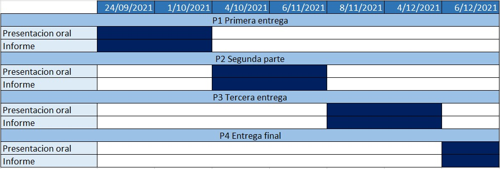
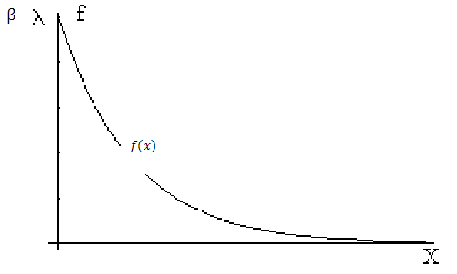
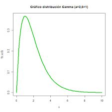

#### P4_ENTREGA \n

### Introduccion \n
La pobreza es definida, según las Naciones Unidas, como un problema de derechos humanos que no se limita a la carencia de dinero si no más al difícil acceso a servicios básicos para el ser humano.
Uno de los principales objetivos del desarrollo sostenible es ponerle fin a la pobreza, ya que según los datos brindados por las Naciones Unidas más de 700 millones de personas a nivel mundial viven en situación de extrema pobreza.
Con este estudio deseamos analizar la diferencia de pobreza entre los países del mundo.  Asimismo, nos gustaría incentivar a los alumnos de UTEC a en un futuro implementar las herramientas brindadas por la universidad, de manera que podamos generar un pequeño cambio. Para obtener la información necesaria usaremos la plataforma de kaggle, la que nos brindará información sobre índices de pobreza, escala de países más pobres, entre otros.


```{r message=FALSE, warning=FALSE, include=FALSE}
library(readr)
library(dplyr)
library(plotly)
library(summarytools)
library(tidyverse)
library(magrittr)
library(kableExtra)
library(ggplot2)
```

```{r fig.align='center', message=FALSE, warning=FALSE, include=FALSE, out.width='100%', paged.print=TRUE}
DatosF <- read_csv("MPI_national2345.csv")
                   
#file.choose()
DatosF
```


### Objetivo \n

Con esta investigacion buscamos analizar la pobreza mundial en el año 2018. A su vez, analizar el indice de pobreza  entre la zona rural y urbana, así mismo entre continenentes. Identificar el indice de recuento de personas en los distintos paises. haremos un contraste de la carencia de servicios basicos de las zonas urbanas con el de las zonas rurales de estos paises 102 paises sensados.


### Factibilidad \

Elaboramos este diagrama de Gantt, en donde se puede observar de manera gráfica las cuatro entregas del proyecto cada una con su presentación oral y su entrega de informe. Asimismo, se puede observar que el dia de fin de una entrega coincide con el dia de inicio de la siguiente, para cumplir con estos trabajaremos de manera organizada y puntual respetando el dia de inicio y el dia de entrega de estos informes, logrando cumplir con los objetivos trazados.


```{r echo=FALSE,  fig.align='center', out.width='100%'}

```


### Marco Teorico \n
Nuestro estudio se realizará a partir de una base de datos pública extraida del portal web kaggle, datos obtenidos en 2018. El muestreo se basó en el método AF para medir la pobreza multidimensional. La web ofrece esta temática para poder analizarla haciendo uso de la ciencia de datos, el software a utilizar será R y el entorno Restudio. \n

#### Poblacion Objetivo \n

   Habitantes de los 102 paises sensados
   
#### Unidad Muestral \n

   Personas que habitan en los paises con mayor índice de pobreza \n
   
#### *<span style="color:grey"> Cualitativas <span>*   
##### *<span style="color:blue"> Nominales <span>*
Variable| Definición
:---|:---
ISO| ID único para el país
Country| Nombre del pais
Continent| Continente del pais


##### *<span style="color:blue"> Ordinales <span>*
Variable| Definición
:---|:---
MPI Urban| Índice de pobreza multidimensional para áreas urbanas dentro del país
MPI Rural| Índice de pobreza multidimensional para áreas rurales dentro del país

#### *<span style="color:grey"> Cuantitativas <span>*   
##### *<span style="color:blue"> Continuas <span>*
Variable| Definición
:---|:---
Headcount Ratio Urban| Índice de recuento de la pobreza (% de la población catalogada como pobre) dentro de las áreas urbanas del país
Intensity of Deprivation Urban| Distancia media por debajo de la línea de pobreza de los que figuran como pobres en las zonas urbanas.
Headcount Ratio Rural| Índice de recuento de la pobreza (% de la población catalogada como pobre) dentro de las zonas rurales del país
Intensity of Deprivation Rural| Distancia media por debajo de la línea de pobreza de los que figuran como pobres en las zonas rurales.

### Data Frame
#### Variables de estudio
Nuestra base de datos contiene 9 variables, de las cuales tres son Cualitativas nominales, dos Cualitativas ordinales y cuatro Cuatitativas continuas. Asimismo cuenta con 102 observaciones que seran analizadas a continuacion.

#### Analisis de variables
</center>
Variable| Análisis
:---|:---
ISO| Se usara para las siglas de cada pais pertenecientes a la base de datos, esta estandarizado por una regla internacional. 
Country| Representa el nombre de cada pais encuestado.
Continent| Representa el continente de cada pais encuestado.
MPI Urban| La mediana del espacio muestral es 0.12, ademas el rango de la muestra es 0.46, donde el mínimo fue 0 y el máximo 0.459.
MPI Rural| La mediana del espacio muestral es 0.3595, ademas el rango de la muestra es 0.46, donde el mínimo fue 0 y el máximo 0.669.
Headcount Ratio Urban| Se observa que no hubo ningún país con el mismo numero de HRU urbano, sin embargo se obtuvo que la media de este fue de 16.81, mientras que el rango 82.5, donde el mínimo es 0 y el máximo fue de 82.5. 
Intensity of Deprivation Urban| Se observa que no se obtuvo ningún país con el mismo numero de “Intensity deprivation”, sin embargo se obtuvo que la media de este fue de 41.68, mientras que el rango 22.4, donde el mínimo es  33.3 y el máximo fue de 55.7.
Headcount Ratio Rural| Se observa que no hubo ningún país con el mismo numero de HRR urbano, sin embargo se obtuvo que la media de este fue de 40.04, mientras que el rango 96.92, donde el mínimo es 0.09 y el máximo fue de 96.83. 
Intensity of Deprivation Rural| Se observa que no se obtuvo ningún país con el mismo numero de “Intensity deprivation”, sin embargo se obtuvo que la media de este fue de 46.82, mientras que el rango 36.2, donde el mínimo es  33.3 y el máximo fue de 69.5.


## Descriptores Numericos

```{r echo=FALSE, fig.align="center", message=FALSE, warning=FALSE, paged.print=TRUE}

DatosF$`MPI Urban` %<>% as.double
DatosF$`Headcount Ratio Urban` %<>% as.double
DatosF$`Intensity of Deprivation Urban` %<>% as.double

DatosF %>% select(`MPI Urban`, `Headcount Ratio Urban`, `Intensity of Deprivation Urban`) %>% descr(stats="common") %>% kable(caption=" ") %>% kable_minimal
```


```{r echo=FALSE, fig.align="center", message=FALSE, warning=FALSE, paged.print=TRUE}
DatosF$`MPI Rural` %<>% as.double
DatosF$`Headcount Ratio Rural` %<>% as.double
DatosF$`Intensity of Deprivation Rural` %<>% as.double

DatosF %>% select(`MPI Rural`, `Headcount Ratio Rural`, `Intensity of Deprivation Rural`) %>% descr(stats="common") %>% kable(caption=" ") %>% kable_minimal

```


## Figuras de merito graficas 

## \n


Usamos una gráfica de Boxplot, en ella podemos observar datos atipicos apartir de 0.3 hasta 0.5 aproximadamente y eso se debe a que muy pocos de los paises evaluados en la zona urbana presentan pobreza y contrastando esta idea podemos ver que el RIQ se centra mas entre 0 a 0.12 donde se encuentra la mayor cantidad de paises para la zona urbana además tenemos una mediana de 0.0345


```{r echo=FALSE, message=FALSE, warning=FALSE}
DatosF <- read_csv("MPI_national2345.csv")
#file.choose()
```
 
```{r echo=FALSE, fig.align="center", message=FALSE, warning=FALSE}

boxplot(DatosF$`MPI Urban`,col=2, main="MPI Urban", horizontal=1)

```

## \n


mas de 50 paises estan dentro del ratio mas bajo de pobreza urbana y ademas la grafica decrece cada ves que aumenta la pobreza, solo 1 país presenta un alto indice de pobreza urbana
```{r echo=FALSE, fig.align="center", message=FALSE, warning=FALSE}
hist(DatosF$`Headcount Ratio Urban`, col=19, main="Headcount Ratio Urban", xlab="Headcount Ratio Urban %",ylab=" Numero Paises",xlim=c(0,103))

```


## \n

En el caso de extrema pobreza para la zona urbana la mayor cantidad de paises se encuentra en un rango de 35% a 50%, además es poco probable que un país tenga mas del 50% en el índice de extrema pobreza urbana. 

```{r echo=FALSE, fig.align="center"}
hist(DatosF$`Intensity of Deprivation Urban`, col=19, main="Intensity of Deprivation Urban", xlab="Intensity of Deprivation Urban %",ylab=" Numero Paises")

```

## \n

Usamos una gráfica de Boxplot, en ella podemos observar que no presenta datos atípicos y contrastando esta idea podemos ver que el RIQ es 0.3595 donde se encuentra la mayor cantidad de paises para la zona rural, admás tenemos una mediana de 0.18.

```{r include=FALSE}
IQR(DatosF$`MPI Rural`, na.rm = TRUE)
```


```{r echo=FALSE, fig.align="center"}

boxplot(DatosF$`MPI Rural`,col=2, main="MPI Rural",  horizontal=1)

```

## \n

Indice de recuento de la pobreza (% de la población catalogada como pobre) dentro de las zonas rurales del país.
La gráfica muestra que 7 países están con un índice entre 90% y 100% de pobreza con respecto al umbral de pobreza del correspondiente país, mientras que 30 países tienen un índice entre 0% y 15%

```{r echo=FALSE, fig.align="center"}
hist(DatosF$`Headcount Ratio Rural` , col=19, main="Headcount Ratio Rural", xlab="Headcount Ratio Rural %",ylab=" Numero Paises")

```

## \n

Se evidencia una mayor cantidad de paises en el intervalo de 40% a 45%. Además en el intervalo de 45% a 60% se encuentran 45 paises aproximadamente.


```{r echo=FALSE, fig.align="center"}
hist(DatosF$`Intensity of Deprivation Rural` , col=19, main="Intensity of Deprivation Rural", xlab="Intensity of Deprivation Rural %",ylab=" Numero Paises")

```

## \n

Grafica paises vs continentes ,nos puede ayudar para poder apreciar con mayor exactitud la proporcion de paises por continentes


```{r echo=FALSE, fig.align="center"}
barplot(table(DatosF$Continent), col=19, main="Continent", xlab="Continentes",ylab=" Numero Paises")
```

## Modelos de variables aleatorias 

Headcount Ratio Urban : Representa el Índice de recuento de la pobreza (% de la población catalogada como pobre) dentro de las áreas urbanas del país. Es una variable aleatoria continua porque puede obtener infinitos valores en el rango de 0% a 82.5%.

Headcount Ratio Rural: Representa el Índice de recuento de la pobreza (% de la población catalogada como pobre) dentro de las áreas rurales del país. Es una variable aleatoria continua porque puede obtener infinitos valores en el rango de 0% a 100%.

Amabas pueden ser modelada por una distribución exponencial ya que la variable es mayor que cero, y sus gráfica se asemeja a una distribución exponencial.

```{r echo=FALSE, fig.align="center",out.width='40%'}

```

La distribución exponencial para una variable aleatoria con parámetro 'B' es X∼Exp(B). Además se sabe que el parámetro es B=E(x), y este se puede estimar mediante el promedio de los valores.

Para  la variable Headcount Ratio Urban el parámetro B es igual a 16.81.

Para la variable Headcount Ratio Rural el parámetro B es igual a 40.04.

```{r echo=FALSE, message=FALSE, warning=FALSE}
B1 <- mean(DatosF$`Headcount Ratio Urban`) #Headcount Ratio Urban 
B2 <- mean(DatosF$`Headcount Ratio Rural`)#Headcount Ratio Rural
```


## Modelos de variables aleatorias 

Intensity of Deprivation Urban: Representa el Indice de pobreza extrema en la zona urbana. Es una variable aleatoria continua porque puede obtener infinitos valores en el rango de 33% a 56%

Intensity of Deprivation Rural: Representa el Indice de pobreza extrema en la zona rural. Es una variable aleatoria continua porque puede obtener infinitos valores en el rango de 33% a 63%

Ambas puede ser modeladas con distribucion gamma ya que las graficas se asemejan.

```{r echo=FALSE, fig.align="center"}

#file.choose()
```

La distribución gamma para una variable aleatoria con parámetros 'α,B' es X∼Gamma(α,B). Además se sabe que el parámetro es B=VAR(x)/mean(x) y α=mean(x)/B.

Para  la variable Intensity of Deprivation Urban el parámetro B es igual a 0.63 y el parametro α=65.85.

Para la variable Intensity of Deprivation Rural el parámetro B es igual a 1.65 y el parametro α=28.42.

```{r echo=FALSE, message=FALSE, warning=FALSE}
B1 <- var(DatosF$`Intensity of Deprivation Urban`)/mean(DatosF$`Intensity of Deprivation Urban`) #Intensity of Deprivation Urban
Alfa1 <- mean(DatosF$`Intensity of Deprivation Urban`)/B1

B2 <- var(DatosF$`Intensity of Deprivation Rural`)/mean(DatosF$`Intensity of Deprivation Rural`)#Intensity of Deprivation Rural
Alfa2 <- mean(DatosF$`Intensity of Deprivation Rural`)/B2

```
## Preguntas e hipotesis  \n

Pregunta| Hipotesis
:---|:---
¿Cuál es el porcentaje de paises que presentan MPI urbano fuera de lo habitual? | Se sabe que tenemos 102 unidades muestrales, de las cuales solo podemos observar 2 valores atípicos. Por ello podemos inferir que que solo el 1.96% de los paises tienen un MPI urbano fuera de lo habitual.
¿Por qué hay mayor dispersión en el índice de pobreza en la zona rural que en la urbana?|Esto es debido a que en la zona rural las personas tienden a tener ingresos similares a comparación con las personas en la zona urbana
¿Cuál es la diferencia entre el país que presenta menor pobreza urbana y el que presenta mayor pobreza urbana?| Los paises de menor y mayor pobreza urbana son Kazakhstan y South Sudan, posiblemente esta gran diferencia se debe a sus princiaples actividades economicas.
¿Cómo podríamos saber si el indice de pobreza rural o urbano puede disminuir en un próxima recopliacion de datos?|Tendría que reducirse el rango intercuartilico


## Relacion entre variables

La gráfica representa la proporción entre el indice de pobreza multidimensional para áreas rurales y el indice de pobreza urbano, en Africa y Asia, siendo estos los continentes con más países en la lista. En esta gráfica se observa una tendencia ascendente, en la que claramente se pude ver que los países de Africa cuentan con indices de pobreza mayores a los países de Asia. Asimismo, la gráfica cuenta con una correlación positiva, lo cual quiere decir que a medida que aumentan los MPI urbanos, aumentan los MPI rurales, en otras palabras mientas un país es más pobre en su zona urbana, lo será aun más en su zona rural.


```{r echo=FALSE, fig.align="center", message=FALSE, warning=FALSE}

two_data=DatosF [DatosF$Continent == "Asia" | DatosF$Continent == "Africa", ] 

p1 <- ggplot(data = two_data) + geom_point(aes(y= two_data$`MPI Urban`,x=two_data$`MPI Rural`, color = Continent))+ labs( title = "Africa VS Asia MPI",x ="MPI Rural",y= "MPI Urban") 


p1

```

## Relacion entre variables

El siguiente gráfico muestra la relación entre el porcentaje de personas pobres y el porcentaje de personas extremadamente pobres. En el caso de América se aprecia que a medida que incrementa el porcentaje de personas pobres también aumenta el porcentaje de personas extremadamente pobres. Y en el caso de Europa se evidencia que presentan un porcentaje personas pobres bajo, sin embargo presentan un alto porcentaje de  personas extremadamente pobres.
Las variables se pueden interpretar individualmente, no obstante no se puede obtener alguna relación entre las America y Europa.


```{r echo=FALSE, fig.align="center", message=FALSE, warning=FALSE}
tre_data=DatosF [DatosF$Continent == "America" | DatosF$Continent == "Europa", ] 

p2 <- ggplot(data = tre_data) + geom_point(aes(y= tre_data$`Intensity of Deprivation Rural`,x=tre_data$`Headcount Ratio Rural`, color = Continent))+ labs( title = "America VS Europa %",x ="Headcount Ratio Rural",y= "Intensity of Deprivation Rural") 


p2
```


## Relacion entre variables

La gráfica representa la relación entre porcentaje de personas pobres y el porcentaje de personas extremadamente pobres, en Africa y Asia. En esta gráfica se observa una tendencia ascendente, en la que claramente se pude ver que los países de Africa cuentan con indices de pobreza mayores a los países de Asia. Asimismo, la gráfica cuenta con una correlación positiva, lo cual quiere decir que a medida que aumenta el indice de recuento de la pobreza rural (HRR), aumenta la la intensidad de deprivación (IDR).


```{r echo=FALSE, fig.align="center", message=FALSE, warning=FALSE}

cuac_data=DatosF [DatosF$Continent == "Asia" | DatosF$Continent == "Africa", ] 

p4 <- ggplot(data = cuac_data) + geom_point(aes(y= cuac_data$`Intensity of Deprivation Rural`,x=cuac_data$`Headcount Ratio Rural`, color = Continent))+ labs( title = "Africa VS Asia %",x ="Headcount Ratio Rural",y= "Intensity of Deprivation Rural") 


p4

```

## HIPOTESIS 1

$H_0:$ El promedio de la Intensidad de deprivacion urbana (IDU) es mayor igual al promedio de la Intensidad de deprivacion rural (IDR).

$H_{0}:\mu >= 46.8$  

$H_1:$ El promedio de la Intensidad de deprivacion urbana (IDU) es menor al promedio de la Intensidad de deprivacion rural (IDR).

$H_{1}:\mu < 46.8$  

```{r message=FALSE, warning=FALSE, include=FALSE}
#poner para que no salga
#Pruebas para hacer calculos 
variable1 <- c(DatosF$`Intensity of Deprivation Urban`)
mean(variable1)
shapiro.test(variable1)
t.test(variable1, alternative ="less", mu=46.8, conf.level =0.98)#revisar
descr(variable1,stats="common")
```

Nivel de confianza= 98%
Tamaño muestra=102
Intervalo de confianza media=[-Inf, 42.73649]
En este caso nuestra variable no tiene una distribucion normal, pero la hemos aproximada para poder generar una hipotesis.

```{r message=FALSE, warning=FALSE, include=FALSE}

obs=length(variable1)
med=mean(variable1,na.rm=TRUE)
sd=sd(variable1,na.rm=TRUE)
niv_conf=0.98
tc<-qt(niv_conf,(obs)-1, lower.tail=FALSE)# t superior porque es bilateral hacia la izquierda
error=abs(tc*sd/sqrt(obs))
mu = 46.8
ts <- ((med-mu)*sqrt(obs))/(sd)
alpha1<- 1-niv_conf
T1<-qt(1-alpha1/2,102-1)
LI1<-med-T1*sd/sqrt(102)
LS1<-med+T1*sd/sqrt(102)
LI1
LS1
errTT1=(LS1-LI1)/2
errTT1
```

```{r echo=FALSE}
plot( function(x) dt(x, df = obs-1 ), 25, -25, ylim = c( 0, 0.4 ),
      col = "black", type = "l", lwd = 2,
      main = "Función densidad t de Student" , ylab="f(x)")
abline(v=tc, col="red",lwd=2)
abline(v=ts, col="blue",lwd=2)
legend(x="topleft", legend = c("t-crítico = -2.08","t-supuesto =-10.07"), lty=c(1,1), col=c("red","blue"), lwd=4)
dx1<- function(x) dt(x, df = obs-1 )
# colorear area bajo curva
```

## INTERVALOS DE CONFIANZA HIPOTESIS 1
Intervalo de confianza media = [40.47, 42.89]
Error= 1.20
```{r echo=FALSE}
int_dep_urb <- ggplot(data=DatosF, aes(DatosF$`Intensity of Deprivation Urban`)) + 
  geom_histogram(aes(y=..density..), color="gray", bins=20)+ 
  geom_density(aes(y=..density..), color="blue", fill="lightblue", alpha=0.4)+ 
  xlab("Intensity of Deprivation Urban")+ylab("Density") + 
  ggtitle("Intensity of Deprivation Urban") + 
  theme_light() +
  geom_vline(aes(xintercept=mean(variable1), colour="Mean"), size=.5) +
  geom_vline(aes(xintercept=median(variable1), colour="Median"), size=.5) 
  #geom_vline(aes(xintercept=))
int_dep_urb$labels$colour=""
int_dep_urb
```

## CONCLUSION HIPOTESIS 1
Luego de analizar la distribución de probabilidad de la variable promedio de Intensidad de deprivacion urbana (IDU) hemos podido calcular el valor t-critico obteniendo un valor de -2.08 y un valor de -10.07 como valor t-supuesto, ubicandose en la zona de rechazo. En el grafico del intervalo de confianza, podemos observar que la media muestral supera al intervalo de confianza, por lo que se rechasa la hipotesis nula. 


## HIPOTESIS 2

$H_0:$ La varianza de la Intensidad de deprivacion rural (IDU) es mayor igual al promedio de la Intensidad de deprivacion urbana (IDR).

$H_{0}:S^2 >= 26.38$  

$H_1:$ La varianza de la Intensidad de deprivacion rural (IDU) es menor al promedio de la Intensidad de deprivacion urbana (IDR).

$H_{1}:S^2 < 26.38$  

```{r message=FALSE, warning=FALSE, include=FALSE}
#poner para que no salga
#Pruebas para hacer calculos 
variable2 <- c(DatosF$`Intensity of Deprivation Rural`)
var(variable2,na.rm = TRUE)
var(variable1,na.rm = TRUE)
shapiro.test(variable2)
t.test(variable2, alternative ="less", mu=26.38, conf.level =0.999)
descr(variable2, stats="common")
```

Nivel de confianza= 99.9%
Tamaño muestra=102
Intervalo de confianza media=[-Inf, 49.58387]
En este caso nuestra variable no tiene una distribucion normal, pero la hemos aproximada para poder generar una hipotesis.

```{r echo=FALSE}
#hipotesis_2
obs2=length(variable2)
med2=mean(variable2,na.rm=TRUE)
sd2=sd(variable1,na.rm=TRUE)
niv_conf2=0.999
tc2<-qt(niv_conf2,(obs2)-1, lower.tail=FALSE)# t superior porque es bilateral hacia la izquierda
error=abs(tc2*sd2/sqrt(obs2))
s2 = 26.38
ts2 <- ((med2-s2)*sqrt(obs2))/(sd2)
s2
alpha2<-1-niv_conf2
T2<-qt(1-alpha2/2,102-1)
LI2<-med2-T2*sd2/sqrt(102)
LS2<-med2+T2*sd2/sqrt(102)
LI2
LS2
errTT2=(LS2-LI2)/2
errTT2
```

```{r echo=FALSE}
plot( function(x2) dt(x2, df = obs2-1 ), 45, -25, ylim = c( 0, 0.4 ),
      col = "black", type = "l", lwd = 2,
      main = "Función densidad t de Student" , ylab="f(x)")
abline(v=tc2, col="red",lwd=2)
abline(v=ts2, col="blue",lwd=2)
legend(x="topleft", legend = c("t-crítico = -3.17","t-supuesto = 40.20"), lty=c(1,1), col=c("red","blue"), lwd=4)
dx2<- function(x2) dt(x2, df = obs2-1 )
#colorear area bajo curva
```

## INTERVALOS DE CONFIANZA HIPOTESIS 2
Intervalo de confianza media = [45.10, 48.55]
Error= 1.72

```{r echo=FALSE}
int_dep_urb <- ggplot(data=DatosF, aes(variable2)) + 
  geom_histogram(aes(y=..density..), color="gray", bins=20)+ 
  geom_density(aes(y=..density..), color="blue", fill="lightblue", alpha=0.4)+ 
  xlab("Intensity of Deprivation Rural")+ylab("Density") + 
  ggtitle("Intensity of Deprivation Rural") + 
  theme_light() +
  geom_vline(aes(xintercept=mean(variable2), colour="Mean"), size=.5) +
  geom_vline(aes(xintercept=median(variable2), colour="Median"), size=.5) 
  #geom_vline(aes(xintercept=))
int_dep_urb$labels$colour=""
int_dep_urb
```

## CONCLUSION HIPOTESIS 2
Luego de analizar la distribución de probabilidad de la variable promedio de Intensidad de deprivacion Rural (IDU) hemos podido calcular el valor t-critico obteniendo un valor de -3.17 y un valor de 40.20 como valor t-supuesto, ubicandose en la zona de aceptación. En el grafico del intervalo de confianza, podemos observar que la media muestral es menor al intervalo de confianza, por lo que se acepta la hipotesis nula. 


## HIPOTESIS 3

$H_0:$ El promedio del ratio de pobreza rural (HCR) es mayor igual al promedio del ratio de pobreza urbana (HCU).

$H_{0}:\mu >= 16.8$  

$H_1:$ El promedio del ratio de pobreza rural (HCR) es mayor al promedio del ratio de pobreza urbana (HCU).

$H_{1}:\mu < 16.8$  

```{r message=FALSE, warning=FALSE, include=FALSE}
#poner para que no salga
#Pruebas para hacer calculos 
variable3 <- c(DatosF$`Headcount Ratio Rural`)
mean(variable3)
mean(DatosF$`Headcount Ratio Urban`)
shapiro.test(variable3)
t.test(variable3, alternative ="less", mu=46.8, conf.level =0.98)#revisar
descr(variable3,stats="common")
```

Nivel de confianza= 99.999%
Tamaño muestra=102
Intervalo de confianza media=[-Inf, 46.89032]
En este caso nuestra variable no tiene una distribucion normal, pero la hemos aproximada para poder generar una hipotesis.

```{r echo=FALSE, message=FALSE, warning=FALSE}
#hipotesis_3
obs3=length(variable3)
med3=mean(variable3,na.rm=TRUE)
sd3=sd(variable3,na.rm=TRUE)
niv_conf3=0.98
tc3<-qt(niv_conf3,(obs3)-1, lower.tail=FALSE)# t superior porque es bilateral hacia la izquierda
error3=abs(tc3*sd3/sqrt(obs3))
mu3 = 46.8
ts3 <- ((med3-mu3)*sqrt(obs3))/(sd3)
tc3
ts3
alpha3<-1-niv_conf3
T3<-qt(1-alpha3/2,102-1)
LI3<-med3-T3*sd3/sqrt(102)
LS3<-med3+T3*sd3/sqrt(102)
LI3
LS3
errTT3=(LS3-LI3)/2
errTT3
```

```{r echo=FALSE}
plot( function(x3) dt(x3, df = obs3-1 ), 25, -25, ylim = c( 0, 0.4 ),
      col = "black", type = "l", lwd = 2,
      main = "Función densidad t de Student" , ylab="f(x)")
abline(v=tc3, col="red",lwd=2)
abline(v=ts3, col="blue",lwd=2)
legend(x="topleft", legend = c("t-crítico = -2.08","t-supuesto =-2.05"), lty=c(1,1), col=c("red","blue"), lwd=4)
dx3<- function(x3) dt(x3, df = obs3-1 )
#colorear area bajo curva
```

## Intervalos de confianza hipótesis 1

Intervalo de confianza media = [32.24,  47.83]
Error= 7.79

```{r echo=FALSE}
int_dep_urb <- ggplot(data=DatosF, aes(variable3)) + 
  geom_histogram(aes(y=..density..), color="gray", bins=20)+ 
  geom_density(aes(y=..density..), color="blue", fill="lightblue", alpha=0.4)+ 
  xlab("Headcount Ratio Rural")+ylab("Density") + 
  ggtitle("Headcount Ratio Rural") + 
  theme_light() +
  geom_vline(aes(xintercept=mean(variable3), colour="Mean"), size=.5) +
  geom_vline(aes(xintercept=median(variable3), colour="Median"), size=.5) 
  #geom_vline(aes(xintercept=))
int_dep_urb$labels$colour=""
int_dep_urb
```

### CONCLUSION HIPOTESIS 3

Luego de analizar la distribución de probabilidad de la variable promedio de Intensidad de deprivacion urbana (IDU) hemos podido calcular el valor t-critico obteniendo un valor de -2.08 y un valor de -2.05 como valor t-supuesto, ubicandose en la zona de aceptación y haciendo que sea imposible ver las 2 lineas en el grafico. En el grafico del intervalo de confianza, podemos observar que la media muestral es menor al intervalo de confianza, por lo que se acepta la hipotesis nula. 
 

## REGRESION 1

En la siguiente regresión se muestra la relación entre la variable Intensity of Deprivation Rural (IDR) que representará la variable dependiente “y” y la variable Headcount Ratio Rural (HRR) que será la variable independiente “x” en los continentes de Asia y Africa. 

#### Correlación entre las variables
La correlacion entre las variables Intensity of Deprivation Rural y  Headcount Ratio Rural en los continentes de Asia y Africa, presentan una correlacion porsitiva de 0.94. Al ser cercana a 1 indica que estas variables tienen una proporcionalidad directa o positiva. Se considera que la correlación entre estas variables es fuerte ya que es mayor a 0.7.

```{r include=FALSE}
regre1 <- DatosF %>% filter(Continent=="Asia" | Continent=="Africa")
cor(regre1$`Intensity of Deprivation Rural`,regre1$`Headcount Ratio Rural`)
summary(lm(regre1$`Intensity of Deprivation Rural`~regre1$`Headcount Ratio Rural`))
```

#### Coeficientes de regresión
Aplicando la funcion summary obtenemos:
ßo = 36.29 
ß1 = 0.26 

$y(x)=ß0+ß1x$  
$y(x)=36.29+0.26x$

#### Coeficientes de regresión
Asimismo, con la funcion summary obtenemos el valor del R-cuadrado es 0.88, el cual  indica un buen ajuste del modelo lineal, siendo $R^2$ mayor a 0.7 y cercano a 1; explicando la variacion total de la variable Intensity of Deprivation Rural en los continentes de Asia y Africa. 

#### Prueba de hipótesis para el Interceptos
#### ßo
Ho: ßo = 0
H1: ßo ≠ 0

Tenien un p-valor = <2e-16, siendo menor a nuestro $a$. Nuestro ßo tiene un valor de casi 0 por lo que podemos aceptar la Ho.

#### ß1
Ho: ß1 = 0
H1: ß1 ≠ 0

Tenien un p-valor = <2e-16, siendo menor a nuestro $a$. Nuestro ß1 tiene un valor de casi 0 por lo que podemos aceptar la Ho.

#### Gráfica de Regresión
La variable Intensity of Deprivation Rural (IDR) que representará la variable dependiente “y” y la variable Headcount Ratio Rural (HRR) la variable independiente “x” en Asia y Africa.
```{r echo=FALSE}
x <- regre1$`Headcount Ratio Rural`
y <- regre1$`Intensity of Deprivation Rural`

plot(x,y)
abline(reg = lm(y~x))
```

Utilizamos este modelo de regresion lineal, pues consideramos que conforme la Intensidad de Deprivacion Rural (IDR) incrementa, el Ratio de Pobreza Rural aumenta. Analizamos el p-valor del modelo siendo este muy pequeño y menor a la significancia, podemos concluir que el modelo es significativo. 


## REGRESION 2

En la siguiente regresión se muestra la relación entre la variable MPI Rural que representará la variable dependiente “x” y la variable MPI Urban que será la variable independiente “y” en los continentes de Asia y Africa.


#### Correlación entre las variables
La correlacion entre las variables MPI Rural y  MPI Urban en los continentes de Asia y Africa, presentan una correlacion porsitiva de 0.91. Al ser cercana a 1 indica que estas variables tienen una proporcionalidad directa o positiva. Se considera que la correlación entre estas variables es fuerte ya que es mayor a 0.7.

```{r include=FALSE}
regre2 <- DatosF %>% filter(Continent=="Asia" | Continent=="Africa")
cor(regre2$`MPI Rural`,regre2$`MPI Urban`)
summary(lm(regre2$`MPI Rural`~regre2$`MPI Urban`))
```

#### Coeficientes de regresión
Aplicando la funcion summary obtenemos:
ßo = 0.01
ß1 = 1.87 

$y(x)=ß0+ß1x$  
$y(x)=0.01+1.87x$

#### Coeficientes de regresión
Asimismo, con la funcion summary obtenemos el valor del R-cuadrado es 0.83, el cual  indica un buen ajuste del modelo lineal, siendo $R^2$ mayor a 0.7 y cercano a 1; explicando la variacion total de la variable Intensity of Deprivation Rural en los continentes de Asia y Africa. 

#### Prueba de hipótesis para el Interceptos
#### ßo
Ho: ßo = 0
H1: ßo ≠ 0

Tenien un p-valor = <2e-16, siendo menor a nuestro $a$. Nuestro ßo tiene un valor de casi 0 por lo que podemos aceptar la Ho.

#### ß1
Ho: ß1 = 0
H1: ß1 ≠ 0

Tenien un p-valor = <2e-16, siendo menor a nuestro $a$. Nuestro ß1 tiene un valor de casi 0 por lo que podemos aceptar la Ho.

#### Gráfica de Regresión
La variable MPI Urban (MPU) que representará la variable dependiente “y” y la variable Headcount MPI Rural (MPU) la variable independiente “x” en Asia y Africa.

```{r echo=FALSE}
x <- regre2$`MPI Rural`
y <- regre2$`MPI Urban`

plot(x,y)
abline(reg = lm(y~x))
```

Utilizamos este modelo de regresion lineal, pues consideramos que conforme el MPI Urbano (MPU) incrementa, el el MPI Rural (MPR) aumenta. Analizamos el p-valor del modelo siendo este muy pequeño y menor a la significancia, podemos concluir que el modelo es significativo. 


## REGRESION 3
En la siguiente regresión se muestra la relación entre la variable MPI Rural que representará la variable dependiente “x” y la variable MPI Urban que será la variable independiente “y” en los continentes de Europa y Asia
```{r include=FALSE}
regre3 <- DatosF %>% filter(Continent=="Europa" | Continent=="America")
cor(regre3$`MPI Rural`,regre3$`MPI Urban`)
summary(lm(regre3$`MPI Rural`~regre3$`MPI Urban`))
```

#### Correlación entre las variables
La correlación entre las variables MPI Rural y MPI Urban en los continentes de Europa y Asia, presentan una correlación positiva de 0.87. Al ser un valor cercano a 1 indica que estas variables tienen una proporcionalidad directa o positiva. Se considera que la correlación es fuerte ya que es mayor a 0.7

#### Coeficientes de regresión
Aplicando la funcion summary obtenemos:
ßo = 0.02
ß1 = 3.06 

$y(x)=ß0+ß1x$  
$y(x)=0.02+3.06x$

#### Coeficientes de regresión
Asimismo, con la funcion summary obtenemos el valor del R-cuadrado es 0.88, el cual  indica un buen ajuste del modelo lineal, siendo $R^2$ mayor a 0.78 y cercano a 1; explicando la variacion total de la variable Intensity of Deprivation Rural en los continentes de Europa y Asia. 

#### Prueba de hipótesis para el Interceptos
#### ßo
Ho: ßo = 0
H1: ßo ≠ 0

Tenien un p-valor = <2e-16, siendo menor a nuestro $a$. Nuestro ßo tiene un valor de casi 0 por lo que podemos aceptar la Ho.

#### ß1
Ho: ß1 = 0
H1: ß1 ≠ 0

Tenien un p-valor = <2e-16, siendo menor a nuestro $a$. Nuestro ß1 tiene un valor de casi 0 por lo que podemos aceptar la Ho.

#### Gráfica de Regresión
El MPI Urban que representará la variable dependiente “y” y el MPI Rural la variable independiente “x” en Europa y Asia

```{r echo=FALSE}
x <- regre3$`MPI Rural`
y <- regre3$`MPI Urban`

plot(x,y)
abline(reg = lm(y~x))
```

Utilizamos este modelo de regresion lineal, pues consideramos que conforme MPI Urban incrementa, el MPI Rural aumenta. Analizamos el p-valor del modelo siendo este muy pequeño y menor a la significancia, podemos concluir que el modelo es significativo


## Conclusiones
A partir de esta investigacion de pobreza mundial en el año 2018, hemos podido concluir qu efectivamente podemos encontrar mayor pobreza en las zonas Rurales que en las Urbanas. Asimismo, en cuanto al análisis inferencial, se han podido identificar dependencia entre variables numéricas; los indices de pobreza varian de acuerdo a los diferentes continentes, pero siempre hay relacion entre los indices de un continente rural con los urbanos del mismos. Por otro lado, ahora sabemos que ninguno de los indices estudiados, son una variable continua, por lo que son varianles discretas. 


## Bibliografia

[Base de datos]https://www.kaggle.com/search

[Uso de comandos]https://yihui.org/knitr/options/