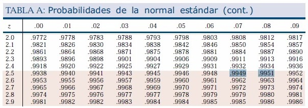

<style>

p, H1, H2, H3, H4, H5, th, li, caption {
  font-family: "Times New Roman", Times, serif;
}

.gray_back {
   background-color: #D3D3D3;
}

caption {
   font-size: 15px;
}

td {
   padding-right: 10px;
   padding-left: 10px;
}

</style>

<H2> Sismos percibidos en Perú desde 1960 </H2> <br>

\
**1. ¿Es el estudio de interés para la audiencia?**<br> 
\
Está información está orientada a las autoridades que se encargan de proyectos comunales, urbanización y organización territorial. Los datos son de mucho interés, ya que saber en qué zonas se puede o no vivir es un criterio muy importante para una OT (Organización Territorial). Asimismo, es de importancia científica, puesto que podemos hallar anomalías o patrones que pueden ser estudiados más a fondo por expertos de la área de investigación correspondiente<br>
\
**2. ¿Qué información se desea aportar al final del estudio?**<br>
\
Localizar las zonas vulnerables (Latitud longitud) a sismos en el Perú para determinar las zonas habitables y no habitables por personas a causa de su frecuencia y magnitud sísmica  para un proyecto de OT. Hallazgo de patrones o anomalías que pueden ser correctamente interpretados por especialistas en el tema y que pueden ser objeto de diferentes hipótesis. <br>
\
**3. ¿Es posible llegar a la información que se propone de manera específica y concreta?**<br>
\
Si, ya que los datos serán extraídos de la base de datos del Instituto Geofísico Peruano - CENTRO SISMOLOGICO NACIONAL (CENSIS) que se actualiza mensualmente. La información empleada corresponde a la base de datos actualizada hasta el 31 de agosto del año 2021. <br>

\

<H3> **Objetivos** </H3> <br>

<h4>Objetivos generales</h4>

<ul>
<li> Determinar susceptibilidad física ante sismos y acumulación de energía sísmica de diferentes regiones del Perú y zonas aledañas de acuerdo a la frecuencia, profundidad y magnitud sísmica </li>
<li>Identificar irregularidades y tendencias en y entre _Latitud_, _Longitud_, _Magnitud_, _Profundidad_, _Rango de Profundidad_, _Año_, _Mes_, _Día_ y _Hora_, variables directamente vinculadas a los sismos en la línea de tiempo desde el año 1960 en el Perú. </li>
</ul>
<br>

<h4>Objetivos específicos</h4>
<ul>
<li> Analizar la frecuencia de sismos dadas las variables de la base de datos del IGP </li>
<li> Destacar figuras de variables que guarden relación entre sí </li>
<li> Identificar patrones y/o anomalías que puedan presentarse al relacionar variables </li>
<li> Modelar las variables de manera que puedan adecuarse a una distribución </li>
<li> Plantear y responder hipótesis realizadas en base a nuestras variables </li>
<li> Informar acerca de posibles patrones y anomalías presentes al graficar y/o relacionar variables </li>
</ul>
<br>

<H3> **Importancia** </H3> <br>
Nuestro proyecto resalta la importancia de identificar las zonas
donde suelen ocurrir sismos de diferente magnitud en el Perú, lo cual sería información de suma importancia al realizar, por ejemplo, un proyecto de Ordenamiento Territorial. Nuestras conclusiones nos permitirán identificar las principales zonas vulnerables y encontrar irregularidades, clases o tendencias que, acompañados de un arduo y eficaz proceso de investigación, podrán ser correctamente interpretados o ser objeto de nuevas hipótesis.

\

<H3> **Factibilidad - Diagrama de Gantt** </H3> 

A continuación, se muestra como nos hemos organizado y cómo nos organizaremos para llevar a cabo cada entrega del proyecto:


\

<H3> **Variables de estudio** </H3>

\

<center>
<table border>
   <tr>
     <th class="gray_back"> Variables</th>    
     <th class="gray_back"> Tipo de variable </th>
     <th class="gray_back"> Restricciones </th>
   </tr>
   <tr>
     <td> Año </td>    
     <td> Cuantitativa - Discreta </td>
     <td> Intervalo de [1960, 2021] </td>
   </tr>
   <tr>
     <td> Mes </td>    
     <td> Cualitativa - Nominal </td>
     <td> Meses del año del 1 al 12 </td>
   </tr>
   <tr>
     <td> Día </td>    
     <td> Cuantitativa - Discreta </td>
     <td> Intervalo de [1, 31] </td>
   </tr>
   <tr>
     <td> Hora</td>    
     <td> Cuantitativa - Discreta </td>
     <td> Intervalo de [0, 23] </td>
   </tr>
   <tr>
     <td> Latitud</td>    
     <td> Cuantitativa - Continua</td>
     <td> Real negativo desde -25.701 hasta -1.396</td>
   </tr>
   <tr>
     <td> Longitud</td>    
     <td> Cuantitativa - Continua</td>
     <td> Real negativo desde -87.382 hasta -65.624</td>
   </tr>
   <tr>
     <td> Profundidad</td>    
     <td> Cuantitativa - Continua </td>
     <td> Entero positivo (Incluye al 0) </td>
   </tr>
   <tr>
     <td> Magnitud</td>    
     <td> Cualitativa - Ordinal </td>
     <td> Real positivo de 1 a 9 </td>
   </tr>
   <tr>
     <td> Rango de profundidad </td>
     <td> Cualitativa - Ordinal </td>
     <td> Superficial, Intermedio o Profundo </td>
   </tr>
</table>
</center>

\

Número de **observaciones**: 22 410

Número de **variables**: 9

```{r, results=F, echo=F, eval=F}
install.packages("units")
install.packages("readxl")
install.packages("PASWR2")
install.packages("tidyverse")
install.packages("anytime")
install.packages("summarytools")
install.packages("dlookr")
install.packages("ggmap")
install.packages("ggplot2")
install.packages("ggpubr")
install.packages("Hmisc")
install.packages("psych")
install.packages("fields")
install.packages("janitor")
install.packages("ggpmisc")
```

\

**Paquetes** de R empleados: _ggplot2_, _gpubr_, _ggmap_, _readxl_, _tidyverse_, _magrittr_, _kableExtra_, _lubridate_, _anytime_, _skimr_, _summarytools_, _dlookr_, _ggmap_, _Hmisc_, _psych_ y _fields_. 

\

```{r , results=F, echo=F, warning=F, message=F}
library(readxl)
library(tidyverse)
library(magrittr)
library(units)
library(kableExtra)
library(PASWR2)
library(lubridate)
library(anytime)
library(summarytools)
library(dlookr)
library(ggmap)
library(ggplot2)
library(ggpubr)
library(Hmisc)
library(psych)
library(fields)
library(janitor)
library(ggpmisc)
library(gridExtra)
```

```{r, echo=F}

# Cambia a un formato correcto las fechas (DD/MM/AA -> AA/MM/DD) para usar
# el paquete anytime y emplear fechas anteriores a 1970

format_dates <- function(x) {
   for(i in 1:length(x)) {
   x[i] <- paste(substr(x[i],7,10),substr(x[i], 4, 5),
                      substr(x[i], 1, 2), sep="/")
   }
   return(x)
}
```


<H3> **Limpieza de datos** </H3> <br>

Ver _Detalles_ para visualizar el proceso de limpieza de datos con R:

<details>

\

A continuación, se lee la base de datos con la función `read_excel()` del paquete _readxl_, se renombran las columnas con `col_names` y se corrigen los tipos de variables con `col_types`:

```{r, echo=TRUE}
# Los datos se guardan como un "tibble" en IGP_datos

IGP_datos <- read_excel(
   "IGP_datos_sismicos.xlsx", 
    col_names = c("Fecha", "Hora", "Latitud", "Longitud",
                    "Profundidad", "Magnitud")
   )

# Se omite la primera fila

IGP_datos <- IGP_datos[-c(1),]

# Corrección de tipo de variable

IGP_datos$Magnitud %<>% as.double
IGP_datos$Latitud %<>% as.double
IGP_datos$Longitud %<>% as.double
IGP_datos$Profundidad %<>% as.integer
IGP_datos$Fecha %<>% format_dates %<>% anytime
IGP_datos$Hora %<>% hms

#Adición de columna de nivel de profundidad
#(h<60 km), intermedios (61<h<350 km) y profundos (h>351 km).
IGP_datos$Rango_Profundidad <- with(IGP_datos, 
                                    factor(
                                      ifelse(Profundidad <= 60, "Superficial",
                                             ifelse(Profundidad <= 350 & Profundidad >= 61, "Intermedio", "Profundo")), levels=c("Superficial", "Intermedio", "Profundo")))
```

</details>

```{r, echo=F}
#Adición de columnas categóricas
Clase_Magnitud <- as.data.frame(table(cut(IGP_datos$Magnitud, 0:10))) %>% filter(Freq != 0)

```

\

No se eliminaron variables ni observaciones, puesto que se determinó que no habían datos faltantes o NA.

Se revisa que no hayan **datos faltantes** con la función `any(is.na())`:

```{r, echo=F}
colSums(is.na(IGP_datos)) %>% kable(
   caption="Tabla de valores faltantes (NA/NaN) de cada variable") %>%
   kable_paper("hover")
```

\

Previsualización (uso de `head()`) de las observaciones:
\
*La variable _Profundidad_ esta en kilómetros

```{r, echo=F}
IGP_datos %>% head %>% 
   kbl(caption="Primeras observaciones de la base de datos del IGP") %>% 
   kable_paper("hover", full_width = F)
```

\

<H3> **Descriptores** </H3> <br>

<H4> **Descriptores numéricos** </H4>

\
```{r, echo=F}
IGP_datos %>% select(Profundidad, Magnitud, Longitud, Latitud) %>%
   descr(
      stats=c("mean", "sd", "min", "q1", "med", "q3", "max", "mad", "iqr", "cv", "skewness", "kurtosis")
      ) %>%
   kable(caption="Descriptores estadísticos de cada variable") %>%
   kable_paper("hover")
```

\

<p>
El promedio y la desviación de Latitud y Longitud demuestra que tan dispersos se encuentran los sismos registrados en el globo terráqueo. Qué tan el Este/Oeste o Norte/Sur están. Más adelante se profundizará esta propuesta y realizará un gráfico para representar la concentración de sismos de cierto _Rango de Profundidad_ y cierto rango de _Magnitud_ de momento.
</p>

<hr>

\

Se desglosa la variable _Fecha_ y _Hora_ para tener un análisis más detallado:

```{r, echo=F}
new_data <- data.frame(Año=year(IGP_datos$Fecha), 
                       Mes=month(IGP_datos$Fecha),
                       Hora=hour(IGP_datos$Hora), 
                       Dia=day(IGP_datos$Fecha))
description <- data.frame(dlookr::describe(new_data))[c(-6, -11, -12, -13, -14, -16, -17, -19, -20, -22, -23, -24, -25)]
description$CV <- (description$sd)/description$mean
description %>% kable(caption="Descriptores estadísticos de Año, Mes, Hora y Día") %>% kable_paper("hover")
```

\

<p>
Como se puede ver en la tabla superior, no existe variación significante en tanto a frecuencia de sismos según meses, días y horas.
</p>
<hr>

\

```{r, echo=F}
#Summarise categorical variable
desc_categ <- count(IGP_datos, Rango_Profundidad)
desc_categ$Percent <- round(desc_categ$n / sum(desc_categ$n), 3)
desc_categ %<>% rename(Frequency = n)
desc_categ %<>% adorn_totals("row")
desc_categ %>% kable(caption="Resumen de variable categórica Rango_Profundidad") %>% kable_paper("hover")
```


\
\

<H4> **Variables aleatorias** </H4>

\

Variable| Justificación
:-----| :---------------------------
Número de sismos con una profundidad menor a 100 km al año.  |Es una variable aleatoria discreta, por que el conjunto finito de valores posibles. Estos se toman pasado cada año y los resultados del experimento aleatorio serán muy distintos entre sí. Donde X sería el número de sismos de una profundidad menor a 100 km en un determinado intervalo de 61 años. El número medio de veces (λ) que eso ocurrió fue de 16410 sismos/año . X ~ P(16410).
Número de sismos con una magnitud mayor a 6.1 al año | Se toma como variable aleatoria discreta. Puede ser descrita por una distribución de Poisson, ya que los sucesos son independientes, además donde x es el número de veces que ocurre el evento de que la magnitud de un sismo será mayor o igual a 6.1 (puede ocasionar daños severos) en un determinado intervalo de tiempo de 61 años, ya que los datos se cuentan desde 1960. El número medio de veces (λ) que eso ocurrió fue de 364 sismos/año. X ~ P(364).
Número de sismos ocurridos durante el primer trimestre | Es una variable aleatoria continua, ya que el conjunto de posibles valores que toma son números reales del intervalo de -25.701 hasta -1.396. Puede ser descrita por una distribución normal. X ~ N(-11.32, 4.47)


\
\

<H4> **Descriptores gráficos** </H4>

\

<H5> **Gráficos de una variable** </H5>

\

```{r, echo=F, results='hide', warning=F, message=F}
# Gráfica Años
g_year <- ggplot(IGP_datos, aes(year(IGP_datos$Fecha))) +
  geom_histogram(fill="#6c78bc", colour="black", bins=25) +
  geom_vline(aes(xintercept=mean(year(IGP_datos$Fecha)), color="Media"), linetype=2, size=0.5)+
  geom_vline(aes(xintercept=median(year(IGP_datos$Fecha)), color="Mediana"), linetype=2, size=0.5)+
  xlab("Año") +
  ylab("Frecuencia") +
  ggtitle("Histograma de variable Año") +
  scale_y_continuous(breaks=seq(0, 2500, by=500)) +
  scale_x_continuous(breaks=seq(min(year(IGP_datos$Fecha)), max(year(IGP_datos$Fecha)), by=10)) +
  theme_pubclean()
g_year$labels$colour = "" 
g_year
```

\

<p>
Con la gráfica buscamos saber la cantidad o frecuencia de los sismos en cada año. Se puede apreciar como la frecuencia de sismos ha ido en tendencia de aumento al pasar del tiempo debido a que el Perú se encuentra en el cinturón de fuego del pacifico que en los últimos años ha presentado más colisiones entre las placas. Asimismo, entre los años 2013 y 2014 se ve un aumento grande en la presencia de sismos esto pudo deberse a que en estos años hubo presencia de varios sismos de más de 6 M de magnitud que dejó algo inestable el suelo que permitió la liberación de más energía en menor cantidad pero en mayor proporción. Por otro lado, también es posible que, debido a la gran diferencia de tecnología desde el año 1960 antes no se registraban correctamente todos los sismos. No obstante, esta hipótesis ha sido solventada de manera parcial, puesto que en el 2019 el IGP mencionó que esta tendencia se debía a la diferencia de tecnología, lo cual tuvo como consecuencia más registros en las últimas décadas (Gobierno Peruano, 2019)
</p>
<hr>

\


\
<p>

</p>
<hr>

\

```{r, echo=F, results='hide', warning=F, message=F}
# Gráfica Mes
g_month <- ggplot(IGP_datos, aes(month(IGP_datos$Fecha))) +
  geom_histogram(fill="gray", colour="black", bins=12) +
  xlab("Mes") +
  ylab("Frecuencia") +
  ggtitle("Histograma - Mes") +
  scale_x_continuous(breaks=seq(0, 12, 2)) +
  theme_pubclean()

# Gráfica Día
g_day <- ggplot(IGP_datos, aes(day(IGP_datos$Fecha))) +
  geom_histogram(fill="#A4F4B8", colour="Black", bins=31) + #"#008B8B"
  xlab("Día") +
  ylab("Frecuencia") +
  ggtitle("Histograma - Día") +
  scale_x_continuous(breaks=seq(0, 31, 5)) +
  theme_pubclean()

# Gráfica Hora
g_hour <- ggplot(IGP_datos, aes(hour(IGP_datos$Hora))) +
  geom_histogram(fill="#FFD580", colour="black", bins=24) + 
  xlab("Hora (0 - 24)") + 
  ylab("Frecuencia") +
  ggtitle("Histograma - Hora") +
  scale_x_continuous(breaks=seq(0, 23, 4)) +
  theme_pubclean()

grid.arrange(g_month, g_day, g_hour, ncol=3)
```
\

<p>
En los tres gráficos de arriba se puede ver como no hay notable diferencia en lo que es frecuencia de sismos por Mes, Día y Hora, en otras palabras, la frecuencia no varía de manera significativa. En el histograma de Día, se puede ver cómo el 31 de cada mes hay menos sismos, ya que no todos los meses tienen un 31.
</p>
<hr>

\

<!-- 
# Gráfico de profundidad (no sirve)
# cambiar a ggplot2
g_profundidad <- ggplot(IGP_datos, aes(Profundidad)) +
  geom_histogram(fill="#B38989", colour="black", bins=25) +
  geom_vline(aes(xintercept=mean(IGP_datos$Profundidad), color="Media"), linetype=2, size=0.7)+
  geom_vline(aes(xintercept=median(IGP_datos$Profundidad), color="Mediana"), linetype=2, size=0.7)+
  scale_y_continuous(breaks=seq(0, 8000, 1000)) +
  ylab("Frecuencia") +
  xlab("Profundidad (km)") +
  ggtitle("Histograma de variable Profundidad")
g_profundidad$labels$colour = ""
g_profundidad + theme_pubclean() -->

\

```{r, echo=F, warning=F, message=F}

# histograma rango de profundidad
aux_df_rprof <- IGP_datos %>% 
  group_by(Rango_Profundidad) %>%
  summarise(Counts=n())
g_rprofundidad <- ggplot(aux_df_rprof, aes(x=Rango_Profundidad, y=Counts)) +
  geom_bar(fill="#C4A848", stat="identity") +
  geom_text(aes(label=Counts), vjust= -0.3) +
  xlab("Rango de profundidad") +
  ylab("Frecuencia") +
  ggtitle("Gráfico de barras de variable Rango de Profundidad") +
  scale_y_continuous(breaks=seq(0, 15e3, 2500)) +
  theme_pubclean()
g_rprofundidad

```

\

<p>
Para esta gráfica se tomaron 3 rangos según la profundidad de cada sismo. Con ello, sabemos si es superficial, intermedio o profundo y la cantidad de los mismos a lo largo del tiempo. Se puede demostrar que la zona más sísmica es la superficial esto debido a que las placas más superficiales son las de mayor movimiento y por tanto mayor liberación de energía. 
</p>
<hr>

\

```{r, echo=F, results='hide', warning=F, message=F}
#Gráfico de barras de Magnitud
g_magnitud <- ggplot(Clase_Magnitud, aes(x=Var1, y=Freq)) +
  geom_bar(fill="#0073C2FF", stat="identity") +
  geom_text(aes(label=Freq), vjust= -0.3) +
  xlab("Magnitud") +
  ylab("Frecuencia") + 
  ggtitle("Gráfico de barras de variable Magnitud") +
  theme_pubclean()
g_magnitud
```
\

<p>
Para esta gráfica se tomaron los diferentes rangos de magnitud que se tiene registrados. Se puede demostrar que el Perú ha presentado en una gran medida sismos de 4 a 5 M con gran diferencia a otras magnitudes. Asimismo, como un dato curioso se puede ver que en el Perú desde 1960 hasta el 2021 solo ha presenciado un terremoto mayor 8 M y uno menor a 3 M. 
</p>
<br>

\

```{r, echo=F}
g_box_mag <- ggplot(IGP_datos, aes(x="", y=Magnitud)) +
  geom_boxplot(outlier.shape = NA) +
  #geom_jitter(width = 0.2, alpha=0.1, colour="#69c561") +
  xlab("") +
  ggtitle("Boxplot de variable Magnitud") +
  theme_pubclean()

g_box_mag_jit <- g_box_mag + geom_jitter(width = 0.2, alpha=0.1, colour="#69c561") + ggtitle("")

g_box_prof <- ggplot(IGP_datos, aes(x="", y=Profundidad)) +
  geom_boxplot(outlier.shape = NA) +
  #geom_jitter(width = 0.2, alpha=0.1, colour="#b38989") +
  xlab("") +
  ggtitle("Boxplot de variable Profundidad") +
  theme_pubclean()

g_box_prof_jit <- g_box_prof + geom_jitter(width = 0.2, alpha=0.1, colour="#b38989") + ggtitle("")

grid.arrange(g_box_mag, g_box_mag_jit, g_box_prof, g_box_prof_jit, ncol=2, nrow=2)
```
\
<p>
Boxplot de Magnitud - Se puede ver claramente que la gran mayoría de los sismos se dan alrededor de los casi 5 grados de magnitud de momento. Asimismo, hay una clara simetría en los datos centrales. La mediana se encuentra entre 4.5 y 5 grados de magnitud de momento.
</p>

\

<p>
Boxplot de Profundidad - En este caso no existe simetría en los datos centrales. Además, se puede evidenciar un grupo de datos extremos que corresponden a los sismos "Profundos". El grupo de los datos centrales se reparte entre sismos "Superficiales" e "Intermedios", donde existe una gran concentración de estos. La mitad de los datos inferior se encuentra por debajo de 49 km. Esto indica que por lo menos la mitad de los sismos registrados son "Superficiales".
</p>
<hr>

\

<H5> **Gráficos de dos o más variables** </H5>

\

```{r, echo=F, warning=F, message=F}
# Años vs Magnitud
x2 <- year(IGP_datos$Fecha)
y2 <- IGP_datos$Magnitud

ggplot(IGP_datos,aes(x=x2, y=y2)) + 
  geom_point(alpha=0.09, colour="Brown") + 
  ggtitle("Gráfica de Magnitud vs Años") + 
  ylab("Magnitud (M)") + 
  xlab("Años") +
  scale_x_continuous(breaks=seq(1960, 2020, 10)) +
  theme_pubclean()
```

\

<p>

</p>
<hr>

\

```{r, echo=F, warning=F, message=F}
# Años vs Profundidad

y1 <- IGP_datos$Profundidad
x1 <- year(IGP_datos$Fecha)
aux_IGP_datos <- data.frame(x1, y1, Clase_Magnitud=cut(IGP_datos$Magnitud, 0:12))

p1 <- ggplot(aux_IGP_datos, aes(x=x1, y=y1)) + 
  geom_point(alpha=0.5, aes(colour=Clase_Magnitud)) + 
  ggtitle("Gráfica de Años vs Profundidad") + 
  scale_x_continuous(breaks=seq(1960, 2021, 10)) +
  ylab("Profundidad (km)") + 
  xlab("Años") 
p1$labels$colour = "Magnitud"
aux <- IGP_datos %>% filter(Magnitud > 8)
aux_2 <- IGP_datos %>% filter(Magnitud > 7 & Magnitud <= 8)
p1 <- p1 + geom_point(data=aux, aes(x=year(aux$Fecha), y=Profundidad), colour="violet", size=3)
p1 + theme_pubclean() + geom_point(data=aux_2, aes(x=year(aux_2$Fecha), y=Profundidad), colour="#b19cd9", size=2.5)
```
\

<p>
En la gráfica se presenta el patrón de que los sismos a lo largo del tiempo siempre se presentan entre los 5 a los 200 km de profundidad debido a que las placas que están más superficiales al momento de expulsar la energía se logra percibir. En cambio, las placas más profundas al liberar su energía las ondas de choque no llegan con la misma fuerza a la superficie o no llegan a sentirse a excepción de algunos casos que la energía liberada es tanta que si se logra sentir en la superficie. Asimismo, podemos ver como no ha habido tanta presencia de sismos de más de 7 M de magnitud y cabe la posibilidad de presenciar uno muy pronto.
</p>
<hr>

\

```{r, echo=F, results='hide'}
g_mag_long <- ggplot(IGP_datos, aes(y=Magnitud, x=Longitud)) +
  geom_point(aes(colour=Rango_Profundidad), alpha=0.3) +
  ggtitle("Gráfico de dispersión de Magnitud vs Longitud")
g_mag_long$labels$colour = "Rango de Profundidad"
g_mag_long + theme_pubclean()
```
\
<!-- ¿Por qué pasara esto último? -->
<p>
Se puede apreciar como se forman tres grupos. Los sismos "Superficiales" e "Intermedios" se concentran entre una magnitud de momento de 4.5 y 5.5. Los "Superficiales" se concentran más al sur, mientras que los "Intermedios" se concentran más al norte del Perú. De similar manera, los sismos "Profundos" se conglomeran, de manera particular, en el extremo norte del Perú
</p>
<hr>

\

```{r, echo=F, warning=F, message=F}
# Profundidad vs Magnitud
x <- IGP_datos$Profundidad
y <- IGP_datos$Magnitud

fudgeit <- function(){
  xm <- get('xm', envir = parent.frame(1))
  ym <- get('ym', envir = parent.frame(1))
  z  <- get('dens', envir = parent.frame(1))
  colramp <- get('colramp', parent.frame(1))
  fields::image.plot(z, col = colramp(256), legend.only=T, add =F)
}
smoothScatter(x, y, transformation = function(x) x ^ 0.4,xlim=c(0,700),
              colramp = colorRampPalette(c("#000099", "#00FEFF", "#45FE4F",
                                           "#FCFF00", "#FF9400", "#FF3100")),
              xlab="Profundidad (km)",
              ylab="Magnitud",
              main="Mapa de calor (frecuencia relativa) de Profundidad vs Magnitud",
              postPlotHook = fudgeit)

```
\

La leyenda (escala) representa la frecuencia relativa de los datos que coinciden en un registro del gráfico

<!-- Por qué existe un hueco entre 300 y 500 km -->
<p>
En la gráfica se aprecia como hay una tendencia entre la profundidad y magnitud hasta los 70 km aproximadamente. Además, lo que más resalta de este descriptor sería la concentración de sismos a una profundidad de entre 0 y 70 km, y entre 4.5 y 5 grados de magnitud de momento. Esto se puede evidenciar en la zona roja del gráfico. Esto puede decirnos que a menor profundidad se un mayor movimiento entre placas. Por último, se pueden ver dos grupos de puntos y cómo no hay casi ningún sismo entre los 300 y 500 km de profundidad.

Esta tendencia de los sismos se ve como a lo largo del tiempo se llegan a presentar en un punto a una profundidad que no sobrepasa los 100 KM y a su vez van de los 4 a 5 M en la escala de Richter de magnitud. Con ello podemos intuir que la capa más superficial de la corteza es la más expuesta a los sismos o mejor dicho la que presenta mayor movimiento de sus placas. 
</p>
<hr>
\

<!-- Magnitud x Latitud -->

```{r, echo=F}
g_mag_lat_x <- ggplot(IGP_datos,aes(x=Latitud, y=Magnitud)) + geom_point(alpha=0.04) + ggtitle("Gráfica de Magnitud vs Latitud") + ylab("Magnitud (M)") + xlab("Latitud (°)") + theme_pubclean()

g_mag_long_x <- ggplot(IGP_datos,aes(x=Longitud, y=Magnitud)) + geom_point(alpha=0.04) + ggtitle("Gráfica de Magnitud vs Longitud") + ylab("Magnitud (M)") + xlab("Longitud (°)") + theme_pubclean()

grid.arrange(g_mag_lat_x, g_mag_long_x, ncol=2)

```

<!-- Magnitud x Longitud -->


\

<center>
<h4> **Sismos percibidos en Perú desde el año 1960** </h4>
</center>
<br>

```{r, echo=FALSE, warning=FALSE, message=FALSE, results='hide'}

prueba <- factor(IGP_datos$Magnitud)
new_prueba <- data.frame(Longitud=IGP_datos$Longitud, Latitud=IGP_datos$Latitud, Magnitud=prueba)
mapa <- qmplot(Longitud, Latitud, data=new_prueba, colour = Magnitud, zoom=7,
       margins=T,
       main=" ",
       extent = "panel")
mapa
```

\

<hr>

<p>
A partir del mapa de calor y de acuerdo a las variables donde hay más frecuencia de sismos, se realiza un promedio de latitud y longitud del grupo de mayor frecuencia de sismos con un Rango de Profundidad "Superficial" y una magnitud de momento entre 4.5 y 5:
</p>

\

<center>
<h4> **Ubicación media de sismos de mayor frecuencia de profundidad Superficial entre 4.5 y 5 grados de magnitud** </h4>
</center>
<br>

<!-- ```{r, echo=FALSE, warning=FALSE, message=FALSE, results='hide'} -->

<!-- aux_3 <- IGP_datos  %>% filter(Rango_Profundidad=="Superficial" & Magnitud > 4.5 & Magnitud <= 5) -->
<!-- lat_mean <- aux_3 %>% select(Latitud)  -->
<!-- long_mean <- aux_3 %>% select(Longitud)  -->
<!-- long_mean <- mean(long_mean$Longitud) -->
<!-- lat_mean <- mean(lat_mean$Latitud) -->

<!-- si <- data.frame(Longitud=long_mean, Latitud=lat_mean) -->
<!-- sbbox <- make_bbox(lon=c(-66, -86), lat= c(0, -26), f=.1) -->
<!-- peru <- get_map(location=sbbox, zoom=7, maptype = "terrain") -->
<!-- peru_map <- ggmap::ggmap(peru) -->
<!-- peru_map + geom_point(data=si, mapping=aes(Longitud, Latitud), colour="red", shape=7, size=3) -->
<!-- ``` -->

\

<p>
Como se puede visualizar en el mapa superior, la concentración de sismos de Rango de Profundidad "Superficial" y con una magnitud de momento entre 4.5 y 5 se da en el departamento de Lima. Esta concentración de sismos es la mayor entre el total de sismos registrados (ver zona roja de mapa de calor). 
</p>
<p>
Este tipo de análisis se realizará de manera similar más adelante con otras consideraciones para identificar otras zonas con alto registro de sismos.
</p>

\

<center>
<h4> *Intervalos de confianza* </h4>
</center>
<br>


En este apartado se calcularon los intervalos de confianza de las variables aleatorias continuas profundidad y magnitud ya definidas anteriormente y la proporción de la variable rango profundidad.<br>
Dado que el tamaño de nuestra muestra n = 22 410 es mayor que 30 (n > 30), podemos estimar la media <b>µ</b> y la desviación típica poblacional <b>σ</b> con la desviación típica muestral <b>S</b> con un 99% de confianza.


<b>Parámetros del estudio:</b>

- Nivel de confianza:       99%

- Significancia (Riesgo):   0.01

Para un nivel de confianza del 99%, el valor de Z es aproximadamente 2.575 como se puede ver en la tabla.

<center>
  
</center>
<br>
Pero dada las facilidades que nos da R, usaremos la funcion: <b>qnorm()</b>

### <b>Variable magnitud</b>

- Media muestral (x):           4.7469835
- Desviación estándar mustral:  0.4221457

```{r}
#PARA LA MEDIA POBLACIONAL
media_magnitud <- 4.7469835
z_magnitud <- qnorm(0.995)
desviacion_magnitud <- 0.4221457
lim_inferior_magnitud <- media_magnitud - z_magnitud*(desviacion_magnitud/sqrt(22410))
lim_superior_magnitud <- media_magnitud + z_magnitud*(desviacion_magnitud/sqrt(22410))

#PARA LA DESVIACION ESTANDAR POBLACIONAL
t_desviacion_magnitud1 <- qchisq(0.995,22409)
t_desviacion_magnitud2 <- qchisq(0.005,22409)
lim_inferior_desviacion_magnitud <- sqrt(22409*(desviacion_magnitud^2)/t_desviacion_magnitud1)
lim_superior_desviacion_magnitud <- sqrt(22409*(desviacion_magnitud^2)/t_desviacion_magnitud2)
```
```{r}
lim_inferior_magnitud
lim_superior_magnitud
```
```{r}
lim_inferior_desviacion_magnitud
lim_superior_desviacion_magnitud
```
<br>
</center>
Parámetro descriptor| Límite inferior| Límite superior
:-----|:---|:---
Media poblacional| 4.73972| 4.754247
D. estándar poblacional| 0.4170671| 0.427341

De la tabla anterior podemos concluir para una población de sismos:<br>
- La media de la magnitud varía entre <b>4.73972 - 4.754247</b><br>
- La desviación típica de la magnitud varía entre <b>0.4170671 - 0.427341</b><br>

### <b>Variable profundidad</b>

- Media muestral (x):           71.2911647
- Desviación estándar mustral:  66.3790048


```{r}
#PARA LA MEDIA POBLACIONAL
media_profundidad <- 71.2911647
z_magnitud <- qnorm(0.995)
desviacion_profundidad <- 66.3790048
lim_inferior_profundidad <- media_profundidad - z_magnitud*(desviacion_profundidad/sqrt(22410))
lim_superior_profundidad <- media_profundidad + z_magnitud*(desviacion_profundidad/sqrt(22410))

#PARA LA DESVIACION ESTANDAR POBLACIONAL
t_desviacion_profundidad1 <- qchisq(0.995,22409)
t_desviacion_profundidad2 <- qchisq(0.005,22409)
lim_inferior_desviacion_profundidad <- sqrt(22409*(desviacion_profundidad^2)/t_desviacion_profundidad1)
lim_superior_desviacion_profundidad <- sqrt(22409*(desviacion_profundidad^2)/t_desviacion_profundidad2)
```
```{r}
lim_inferior_profundidad
lim_superior_profundidad
```
```{r}
lim_inferior_desviacion_profundidad
lim_superior_desviacion_profundidad
```
<br>
</center>
Parámetro descriptor| Límite inferior| Límite superior
:-----|:---|:---
Media poblacional| 70.149| 72.43332
D. estándar poblacional| 65.58044| 67.19592

De la tabla anterior podemos concluir para una población de sismos:<br>
- La media de la profundidad varía entre <b>70.149 - 72.43332</b><br>
- La desviación típica de la profundidad varía entre <b>65.58044 - 67.19592</b><br>

### <b>Variable rango_profundidad</b>

- Proporcion superficial muestral:    0.603792950
- Proporcion intermedia muestral:     0.390182954
- Proporcion profunda muestral:       0.006024096

Calculamos los límites de los intervalos de confianza para las proporciones: superficial, intermedia y profunda:
```{r}
proporcion_superficial <- 0.603792950
proporcion_intermedia <- 0.390182954
proporcion_profunda <- 0.006024096

error_superficial <- qnorm(0.995)*sqrt((proporcion_superficial)*(1-proporcion_superficial)/22410)
error_intermedia <- qnorm(0.995)*sqrt((proporcion_intermedia)*(1-proporcion_intermedia)/22410)
error_profunda <- qnorm(0.995)*sqrt((proporcion_profunda)*(1-proporcion_profunda)/22410)

#PARA SUPERFICIAL
limite_inferior_superficial <- proporcion_superficial - error_superficial
limite_superior_superficial <- proporcion_superficial + error_superficial

#PARA INTERMEDIA
limite_inferior_intermedia <- proporcion_intermedia - error_intermedia
limite_superior_intermedia <- proporcion_intermedia + error_intermedia

#PARA PROFUNDA
limite_inferior_profunda <- proporcion_profunda - error_profunda
limite_superior_profunda <- proporcion_profunda + error_profunda
```
```{r}
limite_inferior_superficial
limite_superior_superficial
```
```{r}
limite_inferior_intermedia
limite_superior_intermedia
```
```{r}
limite_inferior_profunda
limite_superior_profunda
```
<br>
</center>
Parámetro descriptor| Límite inferior| Límite superior| Porcentaje
:-----|:---|:---|:---
Superficial| 0.595377| 0.6122089| 59.54% - 61.22%
Intermedia | 0.3817897| 0.3985762| 38.18% - 39.86%
Profunda | 0.00469263| 0.007355562| 0.47% - 0.74%

Con la tabla anterior podemos decir entonces que para una población de sismos:<br>
- El porcentaje de sismos de profundidad superficial varía entre un <b>59.54% - 61.22%</b><br>
- El porcentaje de sismos de profundidad intermedia varía entre un <b>38.18% - 39.86%</b><br>
- El porcentaje de sismos de profundidad profunda varía entre un <b>0.47% - 0.74%</b><br>
<br>

<center>
<h4> *Prueba de hipótesis* </h4>
</center>
<br>

<H4> *Hipótesis 1*  </H4>

<p>
H. Nula:  La varianza de la magnitud de sismos a partir del 2018 es menor o igual a la varianza de los años antes del 2018
</p>
<p>
H. Alterna: La varianza de la magnitud de sismos a partir del 2018 es mayor a a la varianza de los años antes del 2018
</p>

<ul><li>Nivel de significancia: 0.05</li>
<li>Parámetro de interés: varianza</li>
<li>Unilateral, cola a la derecha</li></ul>


```{r}

#se filtran solo datos de sismos a partir y después del 2018
aux_df_anos <- IGP_datos %>% group_by(year(IGP_datos$Fecha))
mas <- aux_df_anos %>% filter(`year(IGP_datos$Fecha)`>=2018)
menos <- aux_df_anos %>% filter(`year(IGP_datos$Fecha)`<2018)

#varianza de magnitud
vmas<- var(mas$Magnitud)
vmenos<-var(menos$Magnitud)

#tamaño de muestra
n<-nrow(mas)

#valor crítico
val<-((n-1)*vmas)/vmenos
val

#estadístico
q<-qchisq(1-0.05,n-1)
q
```

<p>
Este se encuentra en a zona de aceptación de la hipótesis nula. Se rechaza la hipótesis alterna.

Conclusión: La varianza de la magnitud de sismos a partir del 2018 es menor o igual a la varianza de los años antes del 2018
</p>

<H4> *Hipótesis 2*  </H4>

<p>
H. Nula: Los sismos de magnitud media y baja tienen un promedio de profundidad mayor o igual a  50.
μ >= 50
</p>
<p>
H. Alterna: Los sismos de magnitud media y baja tienen un promedio de profundidad menor a  50.
μ < 50
</p>

<ul><li>Nivel de significancia: 0.05</li>
<li>Parámetro de interés: media </li>
<li>Unilateral, cola a la izquierda</li>
</ul>


```{r}

#se filtran solo datos de sismos de magnitud media y baja
mag <- IGP_datos %>% filter(IGP_datos$Magnitud<=4)

#media de profundidad
mmag<-mean(mag$Profundidad)
#tamaño de muestra
n2<-nrow(mas)
#desviación estandar de profundidad
smag<-sd(mag$Profundidad)

#valor crítico
val2<-(mmag-50)/(smag/sqrt(n2))
val2

#estadístico
q2<-qt(0.05,n2-1)
q2
```
<p>
Este se encuentra en a zona de rechazo de la hipótesis nula. Entonces se acepta la hipótesis alterna.

Conclusión: Los sismos de magnitud media y baja tienen un promedio de profundidad menor a  50.
</p>

<H4> *Hipótesis 3*  </H4>

<p>
H. Nula: En la zona este la varianza de la magnitud de sismos es menor o igual a la de la zona oeste.
</p>
<p>
Hi. Alterna: En la zona este la varianza de la magnitud de sismos es mayor a la zona este.
</p>

<ul><li> Nivel de significancia: 0.05</li>
<li>Parámetro de interés: varianza </li>
<li>Unilateral, cola a la derecha</li></ul>

```{r}
#se filtran solo datos de sismos de zona este y oeste
este <- IGP_datos %>% filter(IGP_datos$Longitud>=-77)
oeste <- IGP_datos %>% filter(IGP_datos$Longitud < (-77))

#varianza de magnitud
veste<-var(este$Magnitud)
voeste<-var(oeste$Magnitud)

#tamaño de muestra
n3<-nrow(este)
#desviación estandar de magnitud
seste<-sd(este$Magnitud)

#valor crítico
val3<-((n3-1)*veste)/voeste
val3
#unilateral 
q3<-qt(1-0.1,n3-1)
q3
```
<p>

Este se encuentra en a zona de aceptación de la hipótesis nula. Entonces se acepta la hipótesis nula y se rechaza la alterna.

Conclusión: En la zona este la varianza de la magnitud de sismos es menor o igual a la de la zona oeste.
</p>
<br>

<center>
<h4> **Dependencia entre variables y regresion** </h4>
</center>
<br>

<p>
Buscaremos si existe alguna dependencia en algunas variables y explicarla de manera estadística. Asimismo, mostrar el resultado por medio de una gráfica de regresión que nos permita ver con mayor detalle la dependecia existente.
</p>

```{r, message=F, echo=F, warning=F, results='hide'}
aux_df_anos <- IGP_datos %>% group_by(year(IGP_datos$Fecha)) %>% summarise(counts = n())
colnames(aux_df_anos) <- c("Año", "Frecuencia")
g_anos_points <- ggplot(aux_df_anos, aes(x=Año, y=Frecuencia)) + 
  geom_point() +
  geom_smooth(method="lm", colour="#6c78bc") +
  scale_x_continuous(breaks=seq(1960, 2021, 10)) +
  theme_pubclean()

formula = y ~ x

g_anos_points + 
  stat_cor(method="pearson", label.x=1963.5, label.y=765) +
  stat_poly_eq(aes(label = ..eq.label..), label.x=0.1, label.y=0.7, formula = formula, parse = TRUE)
```

<p>
Este grafico nos muestra una regresión alta ya que su correlación es de 0.83 lo que muestra una alta dependecia entre las variables ya que solo estamos viendo el año y la frecuencia de los sismos de los mismos.
</p>

<H5> **Dependencia de Magnitud X Profundidad** </H5>

```{r, echo=F, warning=F, message=F, results=F}

GR<- ggplot(IGP_datos, aes(IGP_datos$Magnitud, IGP_datos$Profundidad))+xlab("Magnitud")+ylab("Profundidad")+ geom_point() +  geom_smooth(method = "lm", colour="Red")

GR + 
  stat_cor(method="pearson", label.x=2.5, label.y=600) +
  stat_poly_eq(aes(label = ..eq.label..), label.x=0.05, label.y=0.7, formula = formula, parse = TRUE)
```
<p>
Para nuestros datos podemos identificar algunas dependencias de variables. Para la primera se busca hallar la profundidad de un sismo en función de la magnitud del mismo tendríamos a nuestra variable dependiente a la profundidad y variable independiente a la magnitud. A simple vista se ve que si hay dependencia de entre mayor magnitud mayor profundidad. Se muestra una regresión y su correlación es igual a 0.11 que significa una correlación positiva muy baja, es decir, no presenta una gran dependencia en la gráfica se aprecia como la regresión lineal solo aumenta en una pequeña proporción.
</p>

<H5> **Dependencia de Longitud X Profundidad** </H5>

```{r, echo=F, warning=F, message=F,results=F}
formula = y ~ x
GR<- ggplot(IGP_datos, aes(IGP_datos$Longitud, IGP_datos$Profundidad))+xlab("Longitud")+ylab("Profundidad")+ geom_point() +  geom_smooth(method = "lm", colour="Red")

GR + 
  stat_cor(method="pearson", label.x=-80, label.y=600) +
  stat_poly_eq(aes(label = ..eq.label..), label.x=0.23, label.y=0.7, formula = formula, parse = TRUE)


```

<p>
Para esta dependencia tenemos la profundidad de un sismo en función de la longitud así tendremos la longitud como variable independiente y la profundidad como variable dependiente. Asi podemos apreciar que a mas al este del peru la profundidad de los sismos es mayor. Se muestra una regresión y su correlación es igual a 0.36 que significa una correlación positiva baja, es decir, no presenta una gran dependencia. En la gráfica se aprecia una mayor regresión lineal por lo cual se muestra una mayor dependencia.
</p>

<H5> **Dependencia de Años X Magnitud** </H5>

```{r, echo=F, warning=F, message=F,results=F}
#Años x magnitud

GR<- ggplot(IGP_datos, aes( year(IGP_datos$Fecha),IGP_datos$Magnitud))+xlab("Años")+ylab("Magnitud")+ geom_point() +  geom_smooth(method = "lm", colour="Red")+scale_x_continuous(breaks=seq(1960, 2021, 10))

GR + 
  stat_cor(method="pearson", label.x=1960, label.y=9) +
  stat_poly_eq(aes(label = ..eq.label..), label.x=0.05, label.y=0.9, formula = formula, parse = TRUE)
```

<p>
Para esta variables tenemos a los años como variable independiente y a la magnitud como variable dependiente
que muestra una dependencia negativa, es decir, que en el paso del tiempo los sismos han ido teniendo una menor magnitud. Tiene una correlación de -0.39 que significa una correlación negativa baja.
</p>

<H5> **Dependencia de Longitud X Magnitud** </H5>

```{r, echo=F, warning=F, message=F,results=F}

GR<- ggplot(IGP_datos, aes(IGP_datos$Longitud, IGP_datos$Magnitud))+xlab("Longitud")+ylab("Magmitud")+ geom_point() +  geom_smooth(method = "lm", colour="Red")

GR + 
  stat_cor(method="pearson", label.x=-85, label.y=8) +
  stat_poly_eq(aes(label = ..eq.label..), label.x=0.05, label.y=0.8, formula = formula, parse = TRUE)
```
<p>
Por último, tenemos dos variables longitud y profundidad que al momento de realizar su regresión notamos que esta es una recta.Podemos ver que entre ambas variables no hay dependencia ya que la magnitud se mantiene constante en todo momento, Se muestra la regresión y su correlación es igual a 0.0023 que significa una correlación nula, es decir, no existe dependencia entre las variables. 
</p>


```{js, echo=FALSE}
(function() {
  var codes = document.querySelectorAll('pre:not([class])');
  var code, i, d, s, p;
  for (i = 0; i < codes.length; i++) {
    code = codes[i];
    p = code.parentNode;
    d = document.createElement('details');
    //s = document.createElement('summary');
    // = 'Details';
    // <details><summary>Details</summary></details>
    d.appendChild(s);
    // move the code into <details>
    p.replaceChild(d, code);
    d.appendChild(code);
  }
})();
```
<br>
<center>
<h4> **Predicciones del comportamiento de variables** </h4>
</center>
<br>

- Para la variable <b>magnitud</b>, conforme avancen los años se va atender a aumentar la frecuencia del registro de sismos, especialmente de los sismos de <b>muy baja magnitud</b>.
<br></br>
<br></br>
- Para las variables <b>magnitud y profundidad</b>, podemos predecir con muy baja precisión que en caso ocurra un sismo en una <b>zona este</b> del país, esta será de mayor profundidad que en caso ocurra uno en la zona oeste.
<br></br>
<br></br>
- No podemos predecir qué tipo de sismo será el siguiente en ocurrir, lo más probable es que ocurra uno de magnitud entre 4 y 5. Pero podemos decir también con muy baja precisión, que <b>si</b> el siguiente sismo es de baja magnitud, será también <b>superficial</b>, y si es de gran magnitud, será <b>profundo.</b>

<br>
<center>
<h4> **Reflexión y conclusiones** </h4>
</center>
<br>

<b>Determinar la susceptibilidad física ante sismos de diferentes zonas del Perú de acuerdo a la frecuencia, profundidad y magnitud sísmica, para poder ser usado en el ordenamiento territorial.</b>

```{r, echo=FALSE, warning=FALSE, message=FALSE, results='hide'}
prueba1 <- filter(IGP_datos, IGP_datos$Magnitud >= 6)
prueba <- factor(prueba1$Magnitud)
new_prueba <- data.frame(lon=prueba1$Longitud, lat=prueba1$Latitud, Magnitud=prueba)
qmplot(lon, lat, data=new_prueba, colour = Magnitud, darken = .6, zoom=7,
       margins=T, main=" ", extent = "panel")

```

Como podemos ver los sismos de mayor magnitud, es decir, los que traen mayor desastre se encuentran en la costa y selva del país. Lo que muestra que la sierra es en donde ocurren menos sismos de alto riesgo para la población, y los que ocurren en esta parte del país no son tan destructivos como los de mayor magnitud, por ello se le considera la zona mas segura para los ciudadanos. Por lo tanto, deben existir mayores políticas de manejo ante sismos en la zona costa y selva.


<b>Identificar irregularidades y tendencias entre latitud, longitud, magnitud, profundidad, fecha, hora, variables directamente vinculadas a los sismos en la línea de tiempo desde el año 1960 en el Perú.</b>

- Analizar la frecuencia de los sismos en diferentes zonas del Perú:

La base de datos del IGP muestra como ha ido en aumento el registro de sismos con el pasar del tiempo como ya lo vimos en el histograma de variable año. Esto no necesariamente significa que la frecuencia de sismos ha aumentado y podría deberse a cambios en la forma de registro de sismos.

- Analizar la magnitud de los sismos de las diferentes zonas del Perú.

En nuestro analizáis vemos que el rango de magnitud con mayor frecuencia es de [4,5] sobre pasando mas de la mitad de nuestra muestra. Asimismo, en el mapa que presenta los sismos ubicados en zonas del Perú se vio como estos están distribuidos casi de manera uniforme por todo el Perú.

- Analizar la profundidad de los sismos de las diferentes zonas del Perú.

Para este resultado tomamos una nueva variable de rango que se dividió en superficial, intermedia y profunda. 
Dando como resultado que mas de la mitad de nuestra muestra es superficial siendo esta la zona de mayor frecuencia de sismos y terminando con que los sismos mas profundos se encuentran en el este.

<H3> **Bibliografía** </H3>

- Datos de CENTRO SISMOLOGICO NACIONAL (CENSIS). Consultado el 05 de noviembre del 2021 en https://ultimosismo.igp.gob.pe/inicio
<br></br>
- Mapa de Peligro Sísmico para el Perú. (2014). Perú. INSTITUTO GEOFÍSICO DEL PERÚ. Recuperado de http://sigrid.cenepred.gob.pe/docs/PARA%20PUBLICAR/IGP/Mapa_Peligro_Sismico_Peru_2015_Version_Preliminar.pdf#:~:text=3.%2D%20SISMICIDAD%20EN%20PER%C3%9A,-La%20sismicidad%20en&text=Los%20sismos%20han%20sido%20diferenciados,(h%3E351%20km)
<br></br>
-Entrevista a Presidente Ejecutivo del IGP (2019) - https://www.gob.pe/institucion/igp/noticias/71381-mas-de-500-sismos-reporto-el-instituto-geofisico-del-peru-en-el-2019
