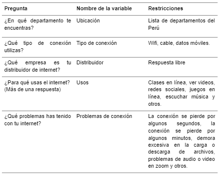
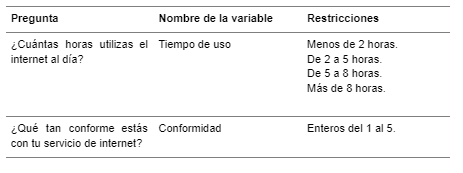
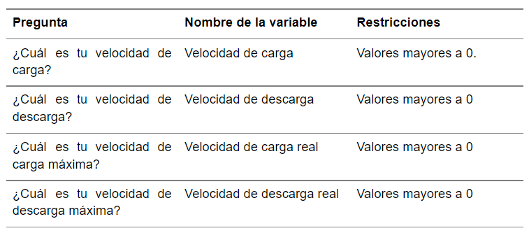
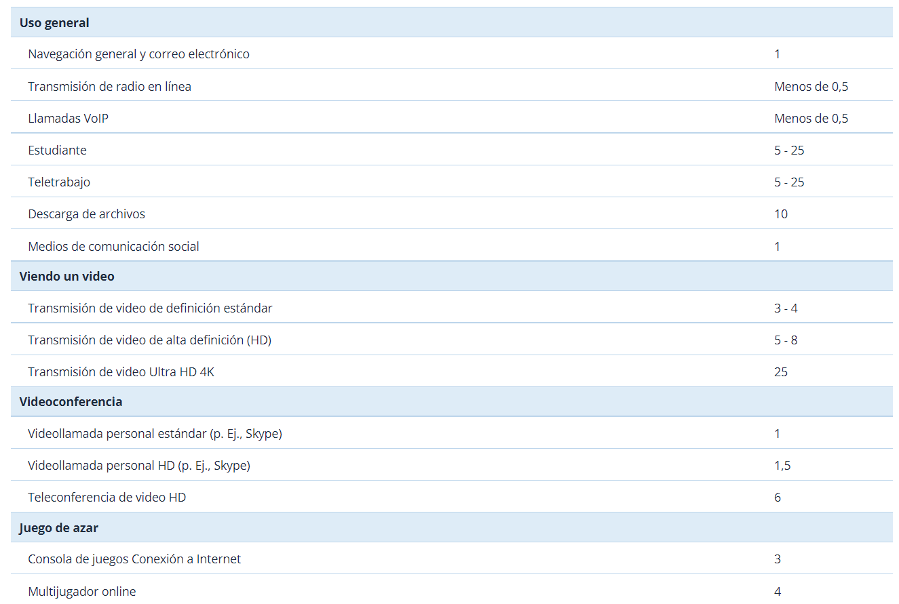

```{r setup, include=FALSE}
knitr::opts_chunk$set(echo = TRUE)
```

<center>


</center>

# Introducción

En la actualidad, el internet se ha convertido en un servicio fundamental para la sociedad debido a que permite la comunicación, búsqueda de información y muchas otras actividades que permiten el mejor desempeño de las personas. En este sentido, en la pandemia este servicio se volvió aún más importante puesto que ante la situación muchas actividades se vieron en la necesidad de realizarse de manera virtual por ejemplo las clases en línea. No obstante, en muchos casos, la población no estaba preparada para este cambio puesto que en muchos lugares del mundo la calidad del internet es limitada lo que dificulta su acceso. Es así como, los estudiantes se vieron perjudicados ya que realmente no conocen la calidad de su internet y si este es lo suficientemente bueno para poder desempeñar sus actividades sin problemas. De este modo, con este el presente estudio busca identificar el grado de calidad del internet de los estudiantes y evaluar posibles soluciones que permitan conocer la mejor alternativa de internet para los estudiantes de acuerdo con su contexto actual.

### Población

El internet, al ser una herramienta de carácter cotidiano y laboral, se ha vuelto indispensable en el día a día de la mayor parte de la población peruana. Una fracción de esta, se encuentra ejerciendo sus estudios superiores. No obstante, muchos de estos estudiantes, no gozan de la misma calidad de los servicios a internet. En esta oportunidad, dentro de todo el aglomerado que padece de este déficit, nos centraremos en los alumnos de la UTEC. En la cual, mediante el uso de encuestas, obtendremos respuestas que darán lugar a mapeos sobre tendencias relacionadas al ámbito de nuestro estudio.

### Importancia

Los estudiantes universitarios de UTEC necesitan de un servicio de internet que les permita acceder a sus clases o trabajos grupales sin inconvenientes. Además, en la pandemia la economía de las familias peruanas se ha visto afectada. Por ello, el estudio es importante para que tengan una noción de la utilidad de los servicios de internet que tienen en sus zonas para satisfacer sus necesidades académicas y la cantidad de dinero que cuestan estos.

### Relevancia

Durante la pandemia para las personas el servicio de internet se ha convertido en algo de suma importancia para realizar distintas actividades como trabajar, estudiar o comunicarse. Los estudiantes universitarios de UTEC, como muchos otros, tuvieron que continuar sus estudios haciendo uso del internet, por lo cual resulta muy importante conocer y analizar la calidad de conexión que presentan para así evaluar su grado de efectividad con respecto al ancho de banda que deberían poseer.

### Factibilidad

El tema es factible debido a que la recolección de datos no representa un problema. De este modo, herramientas digitales como Google Forms hacen factible realizar encuestas a distancia y sin riesgo de manera gratuita y fácil de tal forma que se puede obtener la información. Asimismo, se cuenta con el correo electrónico de los estudiantes de UTEC, lo que facilita el envío de los cuestionarios y garantiza que la muestra sea aleatoria y probabilística.

### Interés del público

El uso del internet se ha convertido en una herramienta primordial para los estudiantes, por lo que la calidad de este representa una gran relevancia para el público objetivo. Asimismo, permite evaluar a los estudiantes cuál es el internet más recomendado de acuerdo con las características de calidad de necesita. De igual forma, permite evaluar cuál es el gasto promedio estimado que debería tomar en consideración un estudiante al momento de considerar el contrato del servicio.

<center>

# Objetivos

</center>

### Pregunta de investigación

¿Qué factores influyen en la experiencia respecto a los servicios de internet por parte de los alumnos de UTEC?

Con esta pregunta se tiene como objetivo lograr la obtención de los siguientes indicadores:\
- Conocer si los servicios de internet de los estudiantes de UTEC cumplen con los requerimientos para su vida académica y al precio justo.\
- Analizar la calidad del internet que presentan los estudiantes de UTEC.\
- Analizar los elementos que repercuten en el servicio de internet

<center>

# Marco teórico

</center>

### Población

El internet se ha vuelto indispensable. Entre ellos, para los que cursan sus estudios superiores. No obstante, ellos no gozan de una calidad equitativa. En esta oportunidad, nos centraremos en los alumnos de la UTEC. En la cual, haremos mapeos sobre los factores que influyen en los servicios del internet.

### Muestra

Al menos 150 estudiantes de UTEC.

### Unidad Muestral

Estudiante del curso de Estadística y Probabilidades de UTEC.

### Tipo de muestreo

Usamos el muestreo por conveniencia, ya que al enviar encuestas esperando que los respondan los miembros de la comunidad y de ellos no son escogidos al azar sino que responden aquellos con la facilidad que tienen. Esta descripción encaja con nuestro tipo de muestreo

### Limpieza de datos

Para la realización de la limpieza de los datos, se ha procedido a hacerlas manualmente dado que se trata de una base de datos relativamente pequeña. Se han hecho algunos cambios de formato en las respuestas para una manipulación correcta en R, mas no se han adulterado, falsificado o viciado los datos.

### Glosario

**Velocidad de carga:** La velocidad de carga (o subida) se refiere a la cantidad de Mbps de datos por segundo que puede enviar información desde tu computadora a otro dispositivo o servidor en Internet.\
**Velocidad de descarga:** La velocidad de descarga se refiere a la cantidad de Mbps de datos por segundo que se necesitan para descargar datos de un servidor en forma de imágenes, videos, texto, archivos y audio.\
**Ping:** es el tiempo exacto que pasa desde que tu dispositivo hizo una solicitud al servidor y el tiempo que tardas en recibir una respuesta desde el servidor.\
**Ancho de banda:** es el volumen de información que se puede enviar a través de una conexión en una cantidad medida de tiempo, calculado en megabits por segundo (Mbps).

<center>

# Variables

</center>

### Variables categóricas nominales

<center>



</center>

### Variables categóricas ordinales

<center>



</center>

### Variables numéricas continuas

<center>



</center>

### Variables numéricas discretas

<center>


</center>

# Plan de realización:

### 1. Recolección de datos

La base de datos, necesaria para lograr los objetivos, se sustentará de una encuesta realizada a la muestra. Para realizar dicha encuesta, se tienen presente las variables que se vinculan directamente con la pregunta de investigación (velocidad, distribuidor, ping, costo,etc.) Asimismo, se debe considerar variables según el contexto en el que se encuentra el estudiante para evaluar cómo éstas influyen en la calidad del servicio que experimenta el usuario (ubicación, número de usuarios, etc).

En la encuesta se hace uso de Speed Test para determinar las velocidades de carga, descarga y el ping que presenta cada estudiante.

### 2. Análisis de la calidad de internet

Un criterio para determinar la calidad de internet se da a través de la obtención de la velocidad mínima de descarga, necesaria para tener una buena conexión. Ésta se calcula mediante la suma de velocidades mínimas por actividades que realiza por el número de personas que usan la red de internet. De este modo, se puede realizar la comparación con la velocidad que se presenta actualmente.

### Tabla de velocidades mínimas por actividad

<center>



</center>

Otro criterio a tener en cuenta es mediante la comparación entre la velocidad de carga y descarga que se presenta con la que ofrece su distribuidor por el monto indicado. Asimismo, así se podrá analizar que tan bueno es el servicio de internet de acuerdo al distribuidor que se presenta.

### Datos

Hasta el momento de la entrega, se cuentan con 153 respuestas, las cuales se muestran a continuación:

```{r echo=FALSE}
library(readr)
library(modeest)
library(PerformanceAnalytics)
library(ggpubr)
library(dplyr)
library(pander)
#importar datos
  datosUTEC <- read_csv("encuesta.csv")
```

```{r echo=FALSE}
names(datosUTEC)=c("MT","Region","Tipo_conexion","Distribuidor","Costo","Ping","V_carga","V_descarga","Tiempo_uso","Personas","Tipo_uso","Conformidad","Problemas","VD_ofrecida","VC_ofrecida")
datosUTEC
```

# Descriptores numéricos y gráficos

### Velocidad de carga

```{r echo=FALSE}
at<-datosUTEC$V_carga
at<-as.double(at)
```

Se hará uso del promedio, un descriptor numérico necesario para conocer el centro de masa de los datos. Junto al valor de la desviación estándar, para determinar qué tan dispersos son los datos obtenidos. Además, de un descriptor gráfico de tipo histograma para conocer la frecuencia de los datos y poder compararlo con su similar.

Se averiguo el numero de estudiantes de la UTEC, el cual ascendio a 3,475, razón por la cual usamos la formula de estimación con población finita :

$$ n = Z^2(1-alfa/2)*varianza*N/(Z^2*Varianza + error^2*(N-1))$$

donde :

-   **n** : Tamaño de la muestra
-   **N** : Tamaño de la población
-   **alfa** : Nivel de Significancia
-   **Z** : Cuantil de la distribución Normal

De aqui en adelante emplearemos esta formula para medias a estimar.

Se desea un nivel de confianza del 95% para la precisión o error con respecto a la estimación del promedio :

Promedio (mbps).

```{r echo=FALSE}
cat("Promedio  :")
cat(mean(at))
cat("\n")
#Deseamos una confianza del 95%
N<-3475
n<-nrow(datosUTEC)
alfa<-0.05
cuantil<-qnorm(p = 1-alfa/2,mean = 0,sd = 1)
error<-sqrt((cuantil^2*var(datosUTEC$V_carga)*(N-n))/(N-1)/n)
cat("Precisión :")
cat(error)


```

Desviación estándar (mbps)

```{r echo=FALSE}
sd(at)
```

```{r echo=FALSE}
tab.at<-table(at)
df<-matrix(0,12,3)
colnames(df)<-c("fa","fr","fp")
rownames(df)<-c("[0;49.9736>","[49.9736;99.9472>","[99.9472;149.9208>","[149.9208;199.8944>","[199.8944;249.868>","[249.868;299.8416>","[299.8416;349.8152>","[349.8152;399.7888>","[399.7888;449.7624>","[449.7624;499.736>","[499.736;550.01>","Total")
tab.at<-table(cut(at,breaks=c(0,49.9736,99.9472,149.9208,199.8944,249.868,299.8416,349.8152,399.7888,449.7624,499.736,550.01)))
df[1:11,1]<-tab.at
df[12,1]<-length(at)
for(i in 1:12) {df[i,2]<-df[i,1]/length(at)}
for(i in 1:12) {df[i,3]<-df[i,2]*100}
df
```

```{r echo=FALSE}
h<-hist(at, breaks=c(0,49.9736,99.9472,149.9208,199.8944,249.868,
299.8416,349.8152,399.7888,449.7624,499.736,550.01),
freq=FALSE, ylab="Dfr", xlab="velocidad de carga (Mbps)", main="",
col="#b3f061")
points(h$mids, h$density, "l", lwd=2)
```

Adicionalmente calcularemos la curtosis y la asimetria formalmente para refrendar lo ya observado en el histograma y adicionaremos un grafico de densidad.

```{r echo=FALSE,warning=FALSE}


cat("Asimetria  :")
cat(skewness(at))
cat("\n")
cat("Curtosis    :")
cat(kurtosis(at))
plot(density(at),col="red",lwd=2,main="Gráfico de densidad - Velocidad de Carga")
```

Observamos curtosis de 56 mucho mayor a 3, sabemos que la distribución normal estandar tiene una curtosis de 3, en este caso la distribución de datos de **Velocidad de Carga**, presentan un modelamiento leptocurtico, es decir una curva con campana mucho más elevada que la presentada por una distribución normal estandar, lo cual nos indica mayor concentración de los datos respecto a su promedio que la presentada por la distribución normal estandar.

También los datos presentan un comportamiento unimodal y una asimetria positiva, lo cual implica que los datos se concentran en los valores bajos de la variable en cuestión.

### Velocidad de descarga

```{r echo=FALSE}
at<-datosUTEC$V_descarga
at=as.double(at)
```

Se hará uso de un descriptor numérico del tipo promedio para conocer el centro de masa de los datos. Junto al valor de la desviación estándar, se puede saber la velocidad de carga de un alumno. Además, de un descriptor gráfico de tipo histograma para conocer la frecuencia de los datos y poder compararlo con su similar.

Promedio (mbps).

```{r echo=FALSE}
cat("Promedio  :")
cat(mean(at))
cat("\n")

#Deseamos una confianza del 95%
N<-3475
n<-nrow(datosUTEC)
alfa<-0.05
cuantil<-qnorm(p = 1-alfa/2,mean = 0,sd = 1)

error<-sqrt((cuantil^2*var(datosUTEC$V_descarga)*(N-n))/(N-1)/n)
cat("Precisión :")
cat(error)


```

Desviación estándar (mbps)

```{r echo=FALSE}
sd(at)
```

```{r echo=FALSE}
tab.at<-table(at)
df<-matrix(0,12,3)
colnames(df)<-c("fa","fr","fp")
rownames(df)<-c("[0;49.9273>","[49.9273;99.8546>","[99.8546;149.7819>","[149.7819;199.7092>","[199.7092;249.6365>","[249.6365;299.5638>","[299.5638;349.4911>","[349.4911;399.4184>","[399.4184;449.3457>","[449.3457;499.273>","[499.273;550.01>","Total")
tab.at<-table(cut(at,breaks=c(0,49.9273,99.8546,149.7819,199.7092,249.6365,
299.5638,349.4911,399.4184,449.3457,499.273,550.01)))
df[1:11,1]<-tab.at
df[12,1]<-length(at)
for(i in 1:12) {df[i,2]<-df[i,1]/length(at)}
for(i in 1:12) {df[i,3]<-df[i,2]*100}
df
```

```{r echo=FALSE}
h<-hist(at, breaks=c(0,49.9273,99.8546,149.7819,199.7092,249.6365,299.5638,349.4911,399.4184,449.3457,499.273,550.01),
freq=FALSE, ylab="Dfr", xlab="velocidad de descarga (Mbps)", main="",
col="#f4f081")
points(h$mids, h$density, "l", lwd=2)
```

Adicionalmente calcularemos la curtosis y la asimetria formalmente para refrendar lo ya observado en el histograma y adicionaremos un grafico de densidad.

```{r echo=FALSE,warning=FALSE}


cat("Asimetria   :")
cat(skewness(at))
cat("\n")
cat("Curtosis    :")
cat(kurtosis(at))
plot(density(at),col="blue",lwd=2,main="Gráfico de densidad -Velocidad de descarga")
```

Observamos curtosis de 21 mucho mayor a 3, sabemos que la distribución normal estandar tiene una curtosis de 3, en este caso la distribución de datos de **Velocidad de Descarga**, presentan un modelamiento leptocurtico, es decir una curva con campana mucho más elevada que la presentada por una distribución normal estandar, lo cual nos indica mayor concentración de los datos respecto a su promedio que la presentada por la distribución normal estandar.

También los datos presentan un comportamiento unimodal y una asimetria positiva, lo cual implica que los datos se concentran en los valores bajos de la variable en cuestión.

### Ping

```{r echo=FALSE}
pg<-datosUTEC$Ping
```

Para esta variable consideramos utilizar el descriptor numérico de la mediana, ya que los valores suelen ser muy extremos y por ello pueden afectar el promedio en caso se use ello. En el caso de descriptores gráficos se usará un boxplot para tener en cuenta la representación de los datos evitando los extremos. De esta forma podremos evidenciar la asimetría en el los resultados. Además, la variable es un factor que ayudará a determinar los problemas de los estudiantes, ya que el retraso puede asociarse a la calidad que están obteniendo.

Cabe resaltar que el cálculo de la precisión, se aplica solo a la media y a las proporciones, no se aplica para medidas de posición como la mediana que es el segundo cuartil.

Mediana:

```{r echo=FALSE}
median(pg)
```

```{r echo=FALSE}
pg<-datosUTEC$Ping
tab.pg <- table(pg)
boxplot(pg,main="Boxplot Ping",horizontal=TRUE,col="red")
```

Adicionalmente calcularemos la curtosis y la asimetria formalmente para refrendar lo ya observado en el boxplot y adicionaremos un grafico de densidad.

```{r echo=FALSE,warning=FALSE}


cat("Asimetria   :")
cat(skewness(pg))
cat("\n")
cat("Curtosis    :")
cat(kurtosis(pg))
plot(density(pg),col="green",lwd=2,main="Gráfico de densidad - Ping")
```

Observamos curtosis de 67 mucho mayor a 3, sabemos que la distribución normal estandar tiene una curtosis de 3, en este caso la distribución de datos de **Ping**, presentan un modelamiento leptocurtico, es decir una curva con campana mucho más elevada que la presentada por una distribución normal estandar, lo cual nos indica mayor concentración de los datos respecto a su promedio que la presentada por la distribución normal estandar.

También los datos presentan un comportamiento unimodal y una asimetria positiva, lo cual implica que los datos se concentran en los valores bajos de la variable en cuestión.

### Costo

```{r echo=FALSE}
at<-datosUTEC$Costo
```

Para el costo se obtendrá la media con su desviación estándar. Así, obtendremos el aproximado del pago promedio que realizan los estudiantes por su servicio. Además, se utilizará un histograma para evidenciar la concentración del costo. En el histograma podremos evidenciar la distribución de datos obtenidos en estas primeras 56 muestras. También, usar este modelo ayudará a encontrar interesantes intersecciones con otros histogramas planteados en otros factores. Obteniendo así relaciones que nos ayuden a calcular la calidad del servicio.

Se desea un nivel de confianza del 95% para la precisión o error con respecto a la estimación del promedio :

Promedio (mbps)

Promedio:

```{r echo=FALSE}

cat("Promedio  :")
cat(mean(at))
cat("\n")
#Deseamos una confianza del 95%


N<-3475
n<-nrow(datosUTEC)
alfa<-0.05
cuantil<-qnorm(p = 1-alfa/2,mean = 0,sd = 1)

error<-sqrt((cuantil^2*var(datosUTEC$Costo)*(N-n))/(N-1)/n)
cat("Precisión :")
cat(error)

```

Desviación estándar:

```{r echo=FALSE}
sd(at)
```

```{r echo=FALSE}
at<-datosUTEC$Costo
tab.at<-table(at)
df<-matrix(0,13,3)
colnames(df)<-c("fa","fr","fp")
rownames(df)<-c("[0;29.00000>","[29.00;71.81818>","[71.81818;114.63636>","[114.63636;157.45455>","[157.45455;200.27273>","[200.27273;243.09091>","[243.09091;285.90909>","[285.90909;328.72727>","[328.72727;371.54545>","[371.54545;414.36364>","[414.36364;457.18182>","[457.18182;500.00>","Total")
tab.at<-table(cut(at,breaks=c(0,29.00,71.81818,114.63636,157.45455,200.27273,243.09091,285.90909,328.72727,371.54545,414.36364,457.18182,500.0)))
df[1:12,1]<-tab.at
df[13,1]<-length(at)
for(i in 1:13) {df[i,2]<-df[i,1]/length(at)}
for(i in 1:13) {df[i,3]<-df[i,2]*100}
df
```

```{r echo=FALSE}
h<-hist(at, breaks=c(0,29.00,71.81818,114.63636,157.45455,200.27273,243.09091,285.90909,328.72727,371.54545,414.36364,457.18182,500.0),
freq=FALSE, ylab="Dfr", xlab="Costo del servicio (soles)", main="Histograma - Costo",
col="coral")
points(h$mids, h$density, "l", lwd=2)
```

Adicionalmente calcularemos la curtosis y la asimetria formalmente para refrendar lo ya observado en el histograma y adicionaremos un grafico de densidad.

```{r echo=FALSE,warning=FALSE}


cat("Asimetria   :")
cat(skewness(at))
cat("\n")
cat("Curtosis    :")
cat(kurtosis(at))
plot(density(at),col="brown",lwd=2,main="Gráfico de densidad - Costo")
```

Observamos curtosis de 17 mayor a 3, sabemos que la distribución normal estandar tiene una curtosis de 3, en este caso la distribución de datos de **Costo**, presentan un modelamiento leptocurtico, es decir una curva con campana mucho más elevada que la presentada por una distribución normal estandar, lo cual nos indica mayor concentración de los datos respecto a su promedio que la presentada por la distribución normal estandar.

También los datos presentan un comportamiento unimodal y una asimetria positiva, lo cual implica que los datos se concentran en los valores bajos de la variable en cuestión.

### Número de usuarios

```{r echo=FALSE}
Per<-datosUTEC$Personas
```

Para los usuarios se usará la mediana para conocer la tendencia central del número de usuarios. Además, se presentará una gráfica de barras para conocer la frecuencia de los casos. Usaremos esta gráfica para obtener resultados exactos, al tener 5 opciones podríamos dividirlo en gráfica circular para evidenciar la distribución pero con las barras y la mediana podremos usarlos para la fórmula planteada en un inicio.

Cabe resaltar que el cálculo de la precisión, se aplica solo a la media y a las proporciones, no se aplica para medidas de posición como la mediana que es el segundo cuartil.

Mediana:

```{r echo=FALSE}
median(Per)
```

```{r echo=FALSE}
tab.Per<-table(Per)
df<-matrix(0,8,3)
colnames(df)<-c("Fabs","Frel","Fpor")
rownames(df)<-c("1 usuario","2 usuarios","3 usuarios","4 usuarios","5 usuarios","6 usuarios","+6 usuarios","Total")
df[1,1]<-tab.Per[1]
df[2,1]<-tab.Per[2]
df[3,1]<-tab.Per[3]
df[4,1]<-tab.Per[4]
df[5,1]<-tab.Per[5]
df[6,1]<-tab.Per[6]
df[7,1]<-(length(Per)-df[1,1]-df[2,1]-df[3,1]-df[4,1]-df[5,1]-df[6,1])
df[8,1]<-length(Per)
for(i in 1:8) {df[i,2]<-df[i,1]/length(Per)}
for(i in 1:8) {df[i,3]<-df[i,2]*100}
df
```

```{r echo=FALSE}
GrafBarras <- barplot(df[1:7,1],xlab="#Usuarios",ylab = "Frecuencia Absoluta",col = c("#06fbca"))#Grafico de barras
```

### Conformidad

```{r echo=FALSE}
Conf<-datosUTEC$Conformidad
```

Para este caso se utilizará la gráfica barras para conocer la proporción de estudiantes conformes con su servicio a internet. Además, se podrá combinar con otros elementos para obtener la conformidad en un factor. En este caso al enumerar las variables es conveniente usar la mediana por si hay acumulación en los extremos de los datos y con el gráfico de barras corroborar este hecho.

Cabe resaltar que el cálculo de la precisión, se aplica solo a la media y a las proporciones, no se aplica para medidas de posición como la mediana que es el segundo cuartil.

Mediana:

```{r echo=FALSE}
median(Conf)
```

```{r echo=FALSE}
Conf<-datosUTEC$Conformidad
tab.Conf <- table(Conf)
df<-matrix(0,6,3)
colnames(df)<-c("Fabs","Frel","Fpor")
rownames(df)<-c("1","2","3","4","5","Total")
df[1:5,1]<-tab.Conf
df[6,1]<-length(Conf)
for(i in 1:6) {df[i,2]<-df[i,1]/length(Conf)}
for(i in 1:6) {df[i,3]<-df[i,2]*100}
df
```

```{r echo=FALSE}
GrafBarras <- barplot(df[1:5,1],xlab="Nivel de Conformidad",ylab = "Frecuencia Absoluta",col = c("#c8c744"))
```

### Distribuidora

Este factor se representará con el gráfico de barras al ser una variable categórica nominal es conveniente saber la frecuencia de las distribuidoras de internet que usan los alumnos. En el Perú existen varios servicios pero hay unos más populares. Por ello para no obtener una acumulación de datos en ciertas compañías se las agrupará en otras a aquellas con una frecuencia baja.

```{r echo=FALSE}
Dis<-datosUTEC$Distribuidor
tab.Dis<-table(Dis)
df<-matrix(0,6,3)
colnames(df)<-c("Fabs","Frel","Fpor")
rownames(df)<-c("Claro","Movistar","Win","Entel","Otros","Total")
df[1,1]<-tab.Dis["Claro"]
df[2,1]<-tab.Dis["Movistar"]
df[3,1]<-tab.Dis["Win"]
df[4,1]<-tab.Dis["Entel"]
df[5,1]<-(length(Dis)-df[1,1]-df[2,1]-df[3,1]-df[4,1])
df[6,1]<-length(Dis)
for(i in 1:6){df[i,2]<-df[i,1]/length(Dis)}
for(i in 1:6){df[i,3]<-df[i,2]*100}
df
```

```{r echo=FALSE}
pie(df[1:5,2],labels =round(100*df[1:5,2]/sum(df[1:5,2]), 1),col=rainbow(length(df[1:5,2])),radius = 1) 
legend("topright", c("Claro","Movistar","Win","Entel","Otros"), cex = 0.8,fill = rainbow(length(df[1:5,2])))
```

### Ubicación

Para este factor se utilizará el gráfico de barras para conocer de forma precisa la cantidad de alumnos ubicados en las regiones del Perú. Además, podremos usar ello para compararla con otras variables y conocer la calidad del servicio por regiones. Para este dato buscamos la precisión, por lo que, usamos las barras. No usaremos la moda, ya que para nuestro cálculo es mejor analizar las regiones como tales.

```{r echo=FALSE}
Ubic<-datosUTEC$Region
tab.Ubic <- table(Ubic)
df <- matrix(0,7,3)
colnames(df)<-c("Fabs","Frel","Fpor")
rownames(df)<-c("Amazonas","Cajamarca","Callao","La Libertad","Lima","Otros","Total")
df[1,1]<-tab.Ubic["Amazonas"]
df[2,1]<-tab.Ubic["Cajamarca"]
df[3,1]<-tab.Ubic["Callao"]
df[4,1]<-tab.Ubic["La Libertad"]
df[5,1]<-tab.Ubic["Lima"]
df[6,1]<-length(Ubic)-df[1,1]-df[2,1]-df[3,1]-df[4,1]-df[5,1]
df[7,1]<-length(Ubic)
for(i in 1:7){df[i,2]<-df[i,1]/length(Ubic)}
for(i in 1:7){df[i,3]<-df[i,2]*100}
df
```

```{r echo=FALSE}
GrafBarras<-barplot(df[1:6,1],horiz = TRUE,col = "#00aae4",xlab = "Frecuencia Absoluta",ylab = "Region")
```

### Tipo de uso

Con esta variable usaremos la gráfica de barras para comparar los usos que le dan usualmente los alumnos a su internet. De esta forma, podremos estimar la cantidad de internet que se necesita con los datos de la tabla de consumo presentada al inicio.

```{r echo=FALSE}
at<-datosUTEC$Tipo_uso
atc<-c()
for(i in 1:length(at)){{atc<-c(atc,strsplit(at[i], ", ")[[1]])}}
tab.atc<-table(atc)
df<-matrix(0,7,3)
colnames(df)<-c("fa","fr","fp")
rownames(df)<-c("Clases","videos","Redes","Juegos","música","Otros","Total")
df[1,1]<-tab.atc["Clases en línea"]
df[2,1]<-tab.atc["Ver videos"]
df[3,1]<-tab.atc["Redes sociales"]
df[4,1]<-tab.atc["Juegos en línea"]
df[5,1]<-tab.atc["Escuchar música"]
df[6,1]<-tab.atc["Otros"]
df[7,1]<-length(atc)
for(i in 1:7) {df[i,2]<-df[i,1]/length(atc)} #frecuencias relativas
for(i in 1:7) {df[i,3]<-df[i,2]*100} #frecuencia porcental
df
```

```{r echo=FALSE}
GrafBarras<-barplot(df[1:6,1],horiz = FALSE,col = "#00aae4",xlab = "tipos de usos",ylab = "Frecuencia absoluta")
```

### Velocidad de carga máxima

```{r echo=FALSE}
at<-datosUTEC$VC_ofrecida
at=as.double(at)
```

Para esta variable se hará uso del promedio para conocer el centro de masa de los datos. Junto al valor de la desviación estándar, para determinar qué tan dispersos son los datos obtenidos. Además, del descriptor gráfico histograma para conocer la frecuencia de los datos.

Se desea un nivel de confianza del 95% para la precisión o error con respecto a la estimación del promedio :

Promedio (mbps)

```{r echo=FALSE}

cat("Promedio  :")
cat(mean(at))
cat("\n")
N<-3475
n<-nrow(datosUTEC)
alfa<-0.05
cuantil<-qnorm(p = 1-alfa/2,mean = 0,sd = 1)

error<-sqrt((cuantil^2*var(datosUTEC$VC_ofrecida)*(N-n))/(N-1)/n)
cat("Precisión :")
cat(error)


```

Desviación estándar (mbps)

```{r echo=FALSE}
sd(at)
```

```{r echo=FALSE}
at.table<-table(at)
df<- matrix(0,13,3)
colnames(df)<-c("fa","fr","fp")
row.names(df) <- c("[0;4.1>","[4.1;53.72727>", "[53.72727;103.35455>", "[103.35455;152.98182>", "[152.98182;202.60909>", "[202.60909;252.23636>", "[252.23636;301.86364>", "[301.86364;351.49091>", "[351.49091;401.11818>", "[401.11818;450.74545>", "[450.74545;500.37273>", "[500.37273;550]", "Total")
at.tab <- table(cut(at,breaks=c(0,4.1, 53.72727, 103.35455 ,152.98182, 202.60909, 252.23636, 301.86364 ,351.49091, 401.11818 , 450.74545 , 500.37273 ,550)))
df[1:12,1]<-at.tab
df[13,1]<-length(at)
for(i in 1:13) {df[i,2]<-df[i,1]/length(at)}
for(i in 1:13) {df[i,3]<-df[i,2]*100}
df
```

```{r echo=FALSE}
h<-hist(at, breaks=c(0,4.10000 , 53.72727, 103.35455 ,152.98182, 202.60909, 252.23636, 301.86364 ,351.49091, 401.11818 , 450.74545 , 500.37273 ,550),
freq=FALSE, ylab="Dfr", xlab="velocidad de carga máxima ofrecida (Mbps)", main="",col="#06fbca")
points(h$mids, h$density, "l", lwd=2)
```

Adicionalmente calcularemos la curtosis y la asimetria formalmente para refrendar lo ya observado en el histograma y adicionaremos un grafico de densidad.

```{r echo=FALSE,warning=FALSE}


cat("Asimetria   :")
cat(skewness(at))
cat("\n")
cat("Curtosis    :")
cat(kurtosis(at))
plot(density(at),col="coral",lwd=2,main="Gráfico de densidad - Velocidad Carga Maxima")
```

Observamos curtosis de 17 mayor a 3, sabemos que la distribución normal estandar tiene una curtosis de 3, en este caso la distribución de datos de **Velocidad Carga Maxima**, presentan un modelamiento leptocurtico, es decir una curva con campana mucho más elevada que la presentada por una distribución normal estandar, lo cual nos indica mayor concentración de los datos respecto a su promedio que la presentada por la distribución normal estandar.

También los datos presentan un comportamiento unimodal y una asimetria positiva, lo cual implica que los datos se concentran en los valores bajos de la variable en cuestión.

### Velocidad de descarga máxima

```{r echo=FALSE}
at<-datosUTEC$VD_ofrecida
at=as.double(at)
```

Se hará uso del promedio, junto al valor de la desviación estándar, para determinar qué tan dispersos son los datos obtenidos; y del histograma, un descriptor gráfico necesario para conocer la frecuencia de los datos.

Se desea un nivel de confianza del 95% para la precisión o error con respecto a la estimación del promedio :

Promedio (mbps)

```{r echo=FALSE}
cat("Promedio  :")
cat(mean(at))
cat("\n")
N<-3475
n<-nrow(datosUTEC)
alfa<-0.05
cuantil<-qnorm(p = 1-alfa/2,mean = 0,sd = 1)

error<-sqrt((cuantil^2*var(datosUTEC$VD_ofrecida)*(N-n))/(N-1)/n)
cat("Precisión :")
cat(error)

```

Desviación estándar (mbps)

```{r echo=FALSE}
sd(at)
```

```{r echo=FALSE}
at.table<-table(at)
df<- matrix(0,13,3)
colnames(df)<-c("fa","fr","fp")
row.names(df) <- c("[0;10>","[10;59.09091>", "[59.09091;108.18182>", "[108.18182;157.27273>" , "[157.27273;206.36364>",  "[206.36364;255.45455>", "[255.45455;304.54545>", "[304.54545;353.63636>", "[353.63636;402.72727>","[402.72727;451.81818>", "[451.81818;500.90909>", "[500.90909; 550]", "Total")
at.tab <- table(cut(at,breaks=c(0,10.0, 59.09091 ,108.18182, 157.27273 ,206.36364 ,255.45455, 304.54545 ,353.63636, 402.72727 , 451.81818 , 500.90909 , 550)))
df[1:12,1]<-at.tab
df[13,1]<-length(at)
for(i in 1:13) {df[i,2]<-df[i,1]/length(at)}
for(i in 1:13) {df[i,3]<-df[i,2]*100}
df
```

```{r echo=FALSE}
h<-hist(at, breaks=c(0,10.00000 , 59.09091 ,108.18182, 157.27273 ,206.36364 ,255.45455, 304.54545 ,353.63636, 402.72727 , 451.81818 , 500.90909 , 550.00000),
freq=FALSE, ylab="Dfr", xlab="velocidad de descarga ofrecida (Mbps)", main="",col="#06fbca")
points(h$mids, h$density, "l", lwd=2)
```

Adicionalmente calcularemos la curtosis y la asimetria formalmente para refrendar lo ya observado en el histograma y adicionaremos un grafico de densidad.

```{r echo=FALSE,warning=FALSE}


cat("Asimetria   :")
cat(skewness(at))
cat("\n")
cat("Curtosis    :")
cat(kurtosis(at))
plot(density(at),col="palegreen",lwd=2,main="Gráfico de densidad - Velocidad Descarga Maxima")
```

Observamos curtosis de 11 mayor a 3, sabemos que la distribución normal estandar tiene una curtosis de 3, en este caso la distribución de datos de **Velocidad Descarga Maxima**, presentan un modelamiento leptocurtico, es decir una curva con campana mucho más elevada que la presentada por una distribución normal estandar, lo cual nos indica mayor concentración de los datos respecto a su promedio que la presentada por la distribución normal estandar.

También los datos aunque podian acercarse a ser bimodales, presentan un comportamiento unimodal y una asimetria positiva, lo cual implica que los datos se concentran en los valores bajos de la variable en cuestión.

# Relación entre variables y Patrones observados

```{r echo=FALSE}
costo <- as.double(datosUTEC$Costo)
carga <- as.double(datosUTEC$V_carga)
descarga <- as.double(datosUTEC$V_descarga)
ping <- as.double(datosUTEC$Ping)
d_ofrecida <- as.double(datosUTEC$VD_ofrecida)
c_ofrecida <- as.double(datosUTEC$VC_ofrecida)
```

### Velocidad de descarga máxima ofrecida y velocidad de descarga real

Presentamos esta gráfica donde usamos la función y=x para verificar la pérdida o ganancia de acuerdo a la situación del alumno. Sin embargo, añadiendo otra función podemos verificar si se cumplen las normas. Esta relación con la ayuda de una recta y = 2.5x (por la obligación de las empresas a brindar esta cantidad de internet por el que se paga que es el 0.4 de la real) a evidenciar si la concentración de puntos se encuentra a cierto lado de la linea indicando si están concentrados en la izquierda un incumplimiento por parte de la compañía, ya que la velocidad obtenida es menor a la asegurada y al lado de la derecha el cumplimiento del acuerdo, ya que la velocidad obtenida es mayor a la mínima asegurada.

```{r echo=FALSE}
colores <- ifelse(d_ofrecida <= 2.5*descarga,"blue","red")
TAB.colors=table(colores)
plot(descarga,d_ofrecida,xlab = "Velocidad de descarga real", ylab = "Velocidad de descarga máxima ofrecida",pch=19,col=colores)
grid()
segments(0,0,500,500,lwd=2,lty=2,col="red")
segments(0,0,200,500,lwd=2,lty=2,col="red")
TAB.colors
```

**Patrones observados:**

-   Valores como el 50, 70, 100 y 200 mbps tienen asociados diversos valores de velocidades de descarga inferiores a estos.

-   Un estimado del 34.46% de alumnos de UTEC tienen una velocidad de descarga menor a la que les ofrecen sus distribuidores.

### Velocidad de carga máxima ofrecida y velocidad de carga real

Esta relación al igual que la de descarga real y obtenida nos ayuda a saber si las empresas de internet están cumpliendo con las velocidades prometidas en el plan contratado de internet del alumno. Estás estarán cumpliendo el acuerdo si la concentración de puntos está a la izquierda y caso contrario si está a la derecha.

```{r echo=FALSE}
colores <- ifelse(c_ofrecida <= 2.5*carga,"blue","red")
TAB.colors=table(colores)
plot(carga,c_ofrecida,xlab = "Velocidad de carga real", ylab = "Velocidad de carga máxima ofrecida",pch=19,col=colores)
grid()
segments(0,0,500,500,lwd=2,lty=2,col="red")
segments(0,0,200,500,lwd=2,lty=2,col="red")
TAB.colors
```

**Patrones observados:**

-   Los valores de velocidad de carga tanto reales como ofrecidos tienden a ser bajos, en comparación con las velocidades de descarga.

-   Un estimado del 26.35% de alumnos de UTEC tienen una velocidad de carga menor a la que les ofrecen sus distribuidores.

### Número de personas que usan internet y nivel de conformidad

Podemos apreciar esta relación por gráfico de Mosaic plot donde el color representa el nivel de conformidad dependiendo del número de personas que usan internet. Además, el ancho de las barras representa la cantidad de personas que tienen tal cantidad de personas usando internet. Con ello, está gráfica nos ayuda a entender a qué número de personas que utilizan el internet con el alumno este se encuentra más satisfecho teniendo más peso las barras más anchas para deducir el número más adecuado.

```{r echo=FALSE}
tabla<-table(datosUTEC$Personas,datosUTEC$Conformidad);
mosaicplot(tabla,col=c("red","green","blue","orange","yellow"),main = "Mosaic Plot : Conformidad vs Numero Usuarios")
```

**Patrones observados:**

-   Se observa que la mayoría de los estudiantes con un nivel de conformidad de 3 y 4, emplean una conexión utilizada por 3,4 y 5 usuarios.

### Tipo de conexión y Conformidad

De estos datos podremos obtener la relación al interceptar estas variables de la cantidad de personas que están en cierto grado conformes con su servicio y el tipo de conexión que usa este grupo. Para ello, usaremos la gráfica de barras apiladas y comparar los tipos de conexiones en los distintos grados de conformidad. Esta relación nos brindará información para recomendar a los alumnos el tipo de conexión deberían usar en base a la experiencia de sus compañeros.

```{r echo=FALSE}
FA <- table(datosUTEC$Tipo_conexion, datosUTEC$Conformidad)
FR_Conf <- prop.table(FA, 2)
FR_Conf #tabla de doble entrada por columna
```

```{r echo=FALSE}
par(mar = c(5.1, 4.1, 4.1, 5))
barplot(FR_Conf, main="Barras Apiladas",xlab="Nivel de Conformidad",ylab="Frecuencia Relativa",axes=TRUE,col=c("#23205b","#48A849","#5e2129"),border=NA,legend.text = rownames(FR_Conf),args.legend = list(x="topright",inset=c(-0.17,0)))
```

**Patrones observados:**

-   Se observa que el nivel de conformidad m?s bajo tiene mayor porcentaje de usuarios de WIFI.

-   Se observa que la frecuencia relativa de los usuarios de cable aumenta con el nivel de conformidad.

# Validación de dependencia entre variables (regresión lineal)

Se selecciona, de todos los gráficos de dispersión, cuatro de ellos. Usando dos criterios:

-   Que muestre, de manera visual, una potencial relación lineal.

-   Que ambas variables tengan una relación lógica y coherente.

Los cuatro gráficos que han sido seleccionados son:

```{r echo=FALSE}
costo <- as.double(datosUTEC$Costo)
carga <- as.double(datosUTEC$V_carga)
descarga <- as.double(datosUTEC$V_descarga)
ping <- as.double(datosUTEC$Ping)
d_ofrecida <- as.double(datosUTEC$VD_ofrecida)
c_ofrecida <- as.double(datosUTEC$VC_ofrecida)
personas <- as.double(datosUTEC$Personas)
confor <- as.double(datosUTEC$Conformidad)

par(mfrow = c(2, 2))
plot(descarga,carga)
plot(d_ofrecida,c_ofrecida)
plot(costo,c_ofrecida)
plot(costo,d_ofrecida)
par(mfrow = c(1, 1))
```

Para la validación de las relaciones entre variables con regresión lineal mediante hipótesis:

Se sabe que la ecuación de la recta es

$y = \text{pendiente}\cdot x + \text{intersección}$

Se definen la siguiente prueba de hipótesis:

-   $H_0$:

    La pendiente es igual a 0 (no existe una relación de dependencia lineal entre las dos variables planteadas

-   $H_1$:

    Hipótesis alterna: La pendiente es distinta de 0 (existe una relación de dependencia lineal entre las dos variables planteadas)

Ya que se harán 4 análisis, se han creado una serie de funciones que serán usadas para hallar los principales valores numéricos que ayudarán a validar o rechazar las hipótesis planteadas.

```{r}
# Funciones a usar:
RegreLin <- function(x,y){
  xprom <- sum(x)/length(x)
  yprom <- sum(y)/length(y)
  pendiente <- sum((x-xprom)*(y-yprom))/sum((x-xprom)^2)
  interseccion <- yprom-pendiente*xprom
  lista <- c(pendiente,interseccion,yprom)
  return(lista)
}
FunLineal <- function(x,pendiente,interseccion){
  y <- x*pendiente+interseccion
  return(y)
}
SumCuadrad <- function(y,yaproximado,ypromedio){
  SCTotal <- sum((y-ypromedio)^2) 
  SCError <- sum((y-yaproximado)^2)
  SCRegre <- sum((yaproximado-ypromedio)^2)
  SC <- c(SCTotal,SCError,SCRegre)
  return(SC)
}
EstadF <- function(x,SC,k){
  RCM <- SC[3]/k #RCM: Regresión Media Cuadrada
  ECM <- SC[2]/(length(x)-k-1) #ECM: Error Medio Cuadrado o Varianza del error (su raíz cuadrada es la desviación estándar del error)
  estadisticoF <- RCM/ECM
  return(estadisticoF)
}
RelacionLineal <- function(x,y,k,significancia){
  lista <- RegreLin(x,y)
  yaprox <- FunLineal(x,lista[1],lista[2])
  SC <- SumCuadrad(y,yaprox,lista[3])
  r <- sqrt(SC[3]/SC[1])
  Fcalcul <- EstadF(x,SC,k)
  pvalor <- pf(Fcalcul,k,length(x)-k-1,lower.tail = F)
  EFES <- c(pvalor,lista[1],lista[2],r)
  return(EFES)
}
```

Correspondientemente, la función RelaciónLineal es la que reúne las funciones anteriores y es la que devolverá los valores de:

-   Pendiente de la recta

-   Intersección con el eje Y

-   Significancia

-   p - valor

-   Coeficiente de determinación (r)

Valores que determinan:

-   Si $r \approx 0$, se acepta la hipótesis nula. Si $r \approx 1$, entonces se rechaza la hipótesis nula y se acepta la hipótesis alterna. (Se evaluarán valores de $r$ mayores a 0.7)

-   Si el estadístico $Significancia<p-\text{valor}$, no se rechazará la hipótesis nula. De lo contrario, se rechazará la hipótesis nula.

Aunque se recomienda sólo hacer uso del valor-p y la significancia para validar o rechazar la hipótesis nula, para este proyecto, se tendrán en cuenta ambos valores (coeficiente de determinación y el valor-p). Así, el grupo se asegura de llegar a conclusiones más sólidas.

### Velocidad descarga máxima vs Costo

```{r echo=FALSE}
numeros <- costo[costo>200]
indices <- which(costo %in% numeros)
ncosto <- costo[-indices]
nd_ofrecida <- d_ofrecida[-indices]
nncosto <- costo[indices]
nnd_ofrecida <- d_ofrecida[indices]
resultados<-RelacionLineal(costo,d_ofrecida,1,0.05)


plot(costo,d_ofrecida,xlab = "Costo (soles)", ylab = "velocidad de descarga máxima (Mbps)", pch=19, cex=0.8, col="#474B4E")
x <- c(0,550)
y1<-FunLineal(x,resultados[2],resultados[3]+80)
y2<-FunLineal(x,resultados[2],resultados[3]-80)
polygon(c(x, rev(x)), c(y2, rev(y1)),col = "yellow",density = 10, angle = 135)
abline(a=resultados[3], b=resultados[2], lwd=3, col="red")
abline(a=resultados[3]+80, b=resultados[2], lwd=1, lty=2, col="orange")
abline(a=resultados[3]-80, b=resultados[2], lwd=1, lty=2, col="orange")

plot(ncosto,nd_ofrecida,xlab = "Costo (soles)", ylab = "velocidad de descarga máxima ofrecida (Mbps)", pch=19,cex=0.8,col="#474B4E")

x <- c(0,210)
y1<-FunLineal(x,resultados[2],resultados[3]+80)
y2<-FunLineal(x,resultados[2],resultados[3]-80)
polygon(c(x, rev(x)), c(y2, rev(y1)),col = "yellow",density = 10, angle = 135)

abline(a=resultados[3]+80, b=resultados[2], lwd=3, lty=2, col="orange")
abline(a=resultados[3]-80, b=resultados[2], lwd=3, lty=2, col="orange")
abline(a=resultados[3], b=resultados[2], lwd=3, col="red")

cat("Pendiente:",resultados[2])
cat("\n")
cat("Intersección:",resultados[3])
cat("\n")
cat("coeficiente de determinación:",resultados[4]^2)
cat("\n")
cat("Coeficiente de correlación:",resultados[4])
cat("\n")
cat("valor-p:",resultados[1])
cat("\n")
cat("Significancia: 0.05")
```

**Predicciones:**

Después de hacer uso de las funciones, los resultados numéricos arrojan un coeficiente de determinación (r) mayor a 0.7 y ligeramente cercano a 1, además, el valor-p es menor a la significancia de valor 0.05.Se observa también en el gráfico que la gran mayoría de los puntos (observaciones) obedecen a la función lineal (rojo).Finalmente, para ésta relación, se rechazará la hipótesis nula y se aceptará la alternativa.

### Velocidad carga máxima vs Velocidad descarga máxima

```{r echo=FALSE}
resultados<-RelacionLineal(d_ofrecida,c_ofrecida,1,0.05)
plot(d_ofrecida,c_ofrecida)
abline(a=resultados[3], b=resultados[2], lwd=3, col="red")
cat("Pendiente:",resultados[2])
cat("\n")
cat("Intersección:",resultados[3])
cat("\n")
cat("coeficiente de determinación:",resultados[4]^2)
cat("\n")
cat("Coeficiente de correlación:",resultados[4])
cat("\n")
cat("valor-p:",resultados[1])
cat("\n")
cat("Significancia: 0.05")
```

Se muestra un valor-p mucho menor a la significancia. Mientras tanto, a pesar de que el coeficiente de determinación está más cercano al 1 que al 0, no supera al 0.7 recomendado. En la gráfica se observa que la recta tiene muchas observaciones acumuladas cerca al origen de esta misma. Por ello, se ha decidido aceptar la hipótesis nula.

### Velocidad carga - Velocidad descarga

```{r echo=FALSE}
resultados<-RelacionLineal(descarga,carga,1,0.05)
plot(descarga,carga)
abline(a=resultados[3], b=resultados[2], lwd=3, col="red")
cat("Pendiente:",resultados[2])
cat("\n")
cat("Intersección:",resultados[3])
cat("\n")
cat("coeficiente de determinación:",resultados[4]^2)
cat("\n")
cat("Coeficiente de correlación:",resultados[4])
cat("\n")
cat("valor-p:",resultados[1])
cat("\n")
cat("Significancia: 0.05")
```

**Predicciones:**

Al igual que la anterior relación, se observa un valor-p menor a la significancia, sin embargo, presenta un coeficiente de determinación menor a 0.7. Por lo cual se acepta la hipótesis nula.

### Velocidad carga máxima vs Costo

```{r echo=FALSE}
resultados<-RelacionLineal(costo,c_ofrecida,1,0.05)
plot(costo,c_ofrecida)
abline(a=resultados[3], b=resultados[2], lwd=3, col="red")
cat("Pendiente:",resultados[2])
cat("\n")
cat("Intersección:",resultados[3])
cat("\n")
cat("coeficiente de determinación:",resultados[4]^2)
cat("\n")
cat("Coeficiente de correlación:",resultados[4])
cat("\n")
cat("valor-p:",resultados[1])
cat("\n")
cat("Significancia: 0.05")
```

**Predicciones:**

Se expone un valor-p menor a la significancia, no obstante, hay un coeficiente de determinación un tanto cercano a 0. En consecuencia, se aceptará la hipótesis nula.

### Velocidad descarga máxima - Velocidad descarga, costo

```{r echo=FALSE}
lm4<-lm(datosUTEC$VD_ofrecida~ datosUTEC$V_descarga + datosUTEC$Costo)
summary(lm4)
```

Verificamos el ajuste de forma gráfica.

```{r echo=FALSE}
op=par(mfrow=c(2,2))
plot(lm4, pch=20,col=rgb(0,0,0,0.25))
```

**Observaciones**

-   En el primer cuadro observamos una acuamulacion en la parte derecha no obteniendo la forma de Homostecidad que esperabamos obtener. Ademas, presenta 3 valores atipicos significativos.

-   La grafica normal si es lineal y los puntos estan distribuidos en la recta cumpliendo el supuesto para el ajuste.

-   En la grafica de residuos estandares obtenemos una acumulacion de datos la cual no refleja el modelo esperado con una distribucion de puntos mas uniforme.

-   Por ultimo en la grafica de distancia de residuos obtenemos una acumulación en la izquierda con lo que podemos afirmar que no cumple, ya que deberiamos observar una distribuci?n mas dispersa.

**Predicciones**

No es posible realizar predicciones significativas con el modelo.

Por ello, lo comprobaremos usando la función de ajuste.

$$
y = 0.37799\cdot \text{descarga} + 0.86739 \cdot \text{costo} - 15.05071
$$

Reemplazando los datos $costo = 449$ y $descarga = 240$,

obtenemos $descarga máxima = 465.125$ Mbps.

Sin embargo el resultado deberia ser al menos 600, ya que las empresas deben asegurar el 0.4 del valor. Dado que resulta poco creíble que la mayoría de las empresas no cumplan lo acordado, vemos que se trata de un modelo inadecuado.

### Porcentaje de Velocidad de Descarga Recibido (Real/Max) VS Costo

```{r echo=FALSE}
y <- (descarga/d_ofrecida)*100
x <- costo
resultados<-RelacionLineal(x,y,1,0.05)
plot(x,y)
abline(a=resultados[3], b=resultados[2], lwd=3, col="red")
cat("Pendiente:",resultados[2])
cat("\n")
cat("Intersección:",resultados[3])
cat("\n")
cat("coeficiente de determinación:",resultados[4]^2)
cat("\n")
cat("Coeficiente de correlación:",resultados[4])
cat("\n")
cat("valor-p:",resultados[1])
cat("\n")
cat("Significancia: 0.05")
```

Finalmente, se acepta la hipótesis nula para esta relación, puesto que, se presenta un valor-p mayor a la significancia. Además, un coeficiente de determinación muy cercano a 0.

### **Resumen de la sección**

Se observa (de acuerdo a los valores numéricos) que la primera gráfica de dispersión es la única que estrictamente presenta una relación entre las variables velocidad de descarga máxima ofrecida y costo.

# Variables aleatorias

A continuación se presentan modelos de variables aleatorias que eventualmente ayudarán a conseguir los objetivos proyectados por el grupo

## Distribuciones discretas

### Velocidad de carga y carga máxima

En la variable se hace uso del modelo de Bernoulli en el cúal se considera un caso exitoso si la velocidad de carga que presenta el alumno es mayor al 40% de la velocidad de carga máxima ofrecida por su distribuidora. Y como fracaso cuando la velocidad de carga no cumpla con este requerimiento mínimo.

Tambien estimaremos la precisión o error para la proporción calculada en la distribución, mediante la siguiente formula :

$$ n = N*Z^2(1-alfa/2)*p*q/(error^2*(N-1)+Z^2*p*q)$$

donde :

-   **n** : Tamaño de la muestra
-   **N** : Tamaño de la población
-   **alfa** : Nivel de Significancia
-   **Z** : Cuantil de la distribución Normal
-   **p** : Proporción Poblacional(si no es conocida se asume 0.5)
-   **q** : 1-p
-   **Z** : Cuantil de la distribución Normal

Cabe mencionar que para las proporciones subsiguientes, también será válida esta precisión calculada, debido a que, en la formula se utiliza la proporción poblacional y si esta no es conocida (como en nuestro caso para todas nuestras proporciones), se estima en 0.5.

```{r echo=FALSE}
library(readr)
library(dplyr)
DF<-read_csv(file="encuesta.csv")
DF$NuevaColumna <-  as.numeric(DF$`¿Cuál es tu velocidad de carga? (En Mbps, ejemplo: 100)`)/ as.numeric(DF$`¿Qué velocidad de carga máxima te ofrece tu plan de Internet? (En Mbps, ejemplo: 30)`)
DF$Nueva2 <- DF$NuevaColumna >0.4
num <- sum(DF$Nueva2 == TRUE)
nprob <- nrow(DF)
prob <- num/nprob

alfa<-0.05
N<-3475
n<-nrow(datosUTEC)
Z<-qnorm(p = 1-alfa/2,mean = 0,sd = 1,lower.tail = TRUE)

error<-(N*Z^2*0.5*0.5-n*Z^2*0.5*0.5)/(N-1)/n
cat("Proporción :")
cat(prob)
cat("\n")
cat("Precisión  :")
cat(error)

plot(x=0:30, y=dbinom(0:30,30,prob))
```

### Velocidad de descarga y descarga máxima

En la variable se hace uso del modelo de Bernoulli en el cual se considera un caso exitoso si la velocidad de descarga que presenta el alumno es mayor al 40% de la velocidad de descarga máxima ofrecida por su distribuidora. Y como fracaso cuando la velocidad de descarga no cumpla con este requerimiento mínimo.

```{r echo=FALSE}
library(readr)
library(dplyr)
DF<-read_csv(file="encuesta.csv")
DF$NuevaColumna2 <-  as.numeric(DF$`¿Cuál es tu velocidad de descarga? (En Mbps, ejemplo: 20)`)/ as.numeric(DF$`¿Qué velocidad de descarga máxima te ofrece tu plan de Internet? (En Mbps, ejemplo: 100)`)
DF$NuevaDescarga <- DF$NuevaColumna2 >0.4
#DF$NuevaDescarga
num1 <- sum(DF$NuevaDescarga == TRUE)
nprob1 <- nrow(DF)
prob1 <- num1/nprob1
#prob1
plot(x=0:30, y=dbinom(0:30,30,prob1))

alfa<-0.05
N<-3475
n<-nrow(datosUTEC)
Z<-qnorm(p = 1-alfa/2,mean = 0,sd = 1,lower.tail = TRUE)

error<-(N*Z^2*0.5*0.5-n*Z^2*0.5*0.5)/(N-1)/n
error<-(N*Z^2*0.5*0.5-n*Z^2*0.5*0.5)/(N-1)/n
cat("Proporción :")
cat(prob)
cat("\n")
cat("Precisión  :")
cat(error)


```

### Internet mediante cable

Para esta variable se hace uso del modelo Binomial en el cual se considera un caso exitoso si el alumno usa internet mediante cable, y como fracaso si no usa es tipo de internet.

```{r echo=FALSE}
# Rejilla de valores del eje X
x <- 1:30
n <- 30
# n = 80, p = 0.2
plot(dbinom(x, size = n, prob = 1/39), type = "h", lwd = 2,
     main = "Función de probabilidad binomial de internet por cable",
     ylab = "P(X = x)", xlab = "Número de éxitos")

# n = 80, p = 0.3
lines(dbinom(x, size = n, prob = 4/39), type = "h",
      lwd = 2, col = rgb(1,0,0, 0.7))

# n = 80, p = 0.4
lines(dbinom(x, size = n, prob = 13/39), type = "h",
      lwd = 2, col = rgb(0, 1, 0, 0.7))

lines(dbinom(x, size = n, prob = 15/39), type = "h",
      lwd = 2, col = rgb(0, 0.4, 1, 0.7))

lines(dbinom(x, size = n, prob = 6/39), type = "h",
      lwd = 2, col = rgb(1, 0, 1, 0.7))

# Añadimos una leyenda
legend("topright", legend = c("1", "2", "3","4","5"),
       title = "Conformidad", title.adj = 0.85,
       lty = 1, col = 1:5, lwd = 2, box.lty = 0)
```

### Internet mediante WIFI

En la variable se hará uso del modelo Binomial en el cual se considera un caso exitoso si el alumno usa internet mediante WIFI, y como fracaso cuando no.

```{r echo=FALSE}
# Rejilla de valores del eje X
x <- 1:30
n <- 30
# n = 80, p = 0.2
plot(dbinom(x, size = n, prob = 4/89), type = "h", lwd = 2,
     main = "Función de probabilidad binomial de wifi",
     ylab = "P(X = x)", xlab = "Número de éxitos")

# n = 80, p = 0.3
lines(dbinom(x, size = n, prob = 7/89), type = "h",
      lwd = 2, col = rgb(1,0,0, 0.7))

# n = 80, p = 0.4
lines(dbinom(x, size = n, prob = 39/89), type = "h",
      lwd = 2, col = rgb(0, 1, 0, 0.7))

lines(dbinom(x, size = n, prob = 31/89), type = "h",
      lwd = 2, col = rgb(0, 0.4, 1, 0.7))

lines(dbinom(x, size = n, prob = 8/89), type = "h",
      lwd = 2, col = rgb(1, 0, 1, 0.7))

# Añadimos una leyenda
legend("topright", legend = c("1", "2", "3","4","5"),
       title = "Conformidad", title.adj = 0.85,
       lty = 1, col = 1:5, lwd = 2, box.lty = 0)

```

### Internet mediante datos

La variable hace uso del modelo Binomial en el cual se considera un caso exitoso si el alumno hace uso de internet mediante datos, y como fracaso cuando no.

```{r echo=FALSE}
# Rejilla de valores del eje X
x <- 1:30
n <- 30
# n = 80, p = 0.2
plot(dbinom(x, size = n, prob = 3/5), type = "h", lwd = 2,
     main = "Función de probabilidad binomial de datos",
     ylab = "P(X = x)", xlab = "Número de éxitos")

# n = 80, p = 0.3
lines(dbinom(x, size = n, prob = 1/5), type = "h",
      lwd = 6, col = rgb(1,0,0, 0.7))

# n = 80, p = 0.4
lines(dbinom(x, size = n, prob = 1/5), type = "h",
      lwd = 4, col = rgb(0, 1, 0, 0.7))

# Añadimos una leyenda
legend("topright", legend = c("2", "3","4"),
       title = "Conformidad", title.adj = 0.85,
       lty = 1, col = 1:5, lwd = 2, box.lty = 0)
```

# Hipótesis

Con respecto a las variables estudiadas, planteamos las siguientes 3 hipótesis:

-   **Hipotesis 1:** \
    La velocidad de carga promedio suele ser mejor en Lima que en provincia, ¿se puede concluir esto para los estudiantes de UTEC?

-   **Hipotesis 2:\
    **La velocidad de descarga promedio suele ser mejor en Lima que en provincia, ¿se puede concluir esto para los estudiantes de UTEC?

-   **Hipotesis 3:** \
    La proporción poblacional con un nivel 4 de conformidad es al menos de 70%.

-   **Hipotesis 4:** \
    La media de la diferencia descarga(velociadad ofrecida - velocidad obtenida) en menor a 10 mbps.
 

Para realizar la validación de hipótesis, emplearemos las siguientes funciones:

```{r}
graficaMediana<-function(datosM,alfa,tc){
  a<-ceiling(abs(tc))
  if(a<4){a=4}
  ejeX<-seq(-a,a,by=0.1)
  ejeY<-dt(ejeX,length(datosM)-1)
  plot(ejeX,ejeY,type="l",lwd=2)
  Lizq<-qt(alfa,length(datosM)-1)
  aux.x<-ejeX[ejeX<=Lizq]
  aux.y<-dt(aux.x,length(datosM)-1)
  polygon(c(-a,a,aux.x,Lizq),c(0,0,aux.y,0),col="yellow")
  #polygon(c(-Lizq,-rev(aux.x),a),c(0,rev(aux.y),0),col="yellow")
  abline(v=0)
  abline(v=tc, col=2)
}

graficaProp <- function(datos,alfa,zc){
  a<-ceiling(abs(zc))
  if(a<4){a=4}
  ejeX<-seq(-a,a,by=0.1)
  ejeY<-dnorm(ejeX)
  plot(ejeX,ejeY,typle="l",lwd=2)
  Lizq<-qnorm(alfa)
  aux.x<-ejeX[ejeX<=Lizq]
  aux.y<-dt(aux.x,length(datos))
  polygon(c(-a,a,aux.x,Lizq), c(0,0,aux.y,0),col="yellow")
  abline(v=0)
  abline(v=zc, col=2)
}

hipMedia <- function(datos,alfa,mu){
  media=mean(datos)
  desEst=sd(datos)
  var=desEst^2

  t_c=(media-mu)/(desEst/sqrt(length(datos)))
  
  t_=qt(alfa,length(datos)-1)
  print(paste("t: ",t_))
  print(paste("tc: ",t_c))
  if(t_c>=t_){print("H0 no se rechaza")}
  if(t_c<t_){print("H0 se rechaza")}
  
  alternativa="greater"
  graficaMediana(datos,alfa,t_c)

  t.test(datos,alternative = alternativa,mu=mu)
}

hipProp <- function(datos, exito, alfa, pi){
  n = length(datos)
  x = length(datos[datos==exito])
  p = x/n
  
  Z_c = (p - pi)/sqrt(pi*(1-pi)/n)
  
  Z_ = qnorm(alfa)
  print(paste("z: ", Z_))
  print(paste("zc: ", Z_c))
  if(Z_c>=Z_){print("H0 se acepta")}
  if(Z_c<Z_){print("H0 se rechaza")}
  
  alternativa="less"
  graficaProp(datos,alfa,Z_c)
  
  prop.test(x, n, p=pi, alternative=alternativa)
}
```

### Validación de la hipótesis 1

Definimos la prueba de hipótesis:

-   $H_0$: \
    La velocidad de carga promedio en Lima es mayor o igual que la velocidad de carga promedio en provincia.

-   $H_a$: \
    La velocidad de carga promedio en Lima es menor que la velocidad de carga promedio en provincia.

Se trabajara con significancia de 0.05

```{r echo=FALSE}
vecLima <- which(DF$`¿En qué departamento te encuentras? (Ejemplo: Loreto)`=='Lima')
vc_lima <- as.numeric(DF$`¿Cuál es tu velocidad de carga? (En Mbps, ejemplo: 100)`[vecLima])
vecProvincia <- which(DF$`¿En qué departamento te encuentras? (Ejemplo: Loreto)`!='Lima')
vc_provincia <- as.numeric(DF$`¿Cuál es tu velocidad de carga? (En Mbps, ejemplo: 100)`[vecProvincia])
media_carga <- mean(vc_provincia)
vd_lima <- as.numeric(DF$`¿Cuál es tu velocidad de descarga? (En Mbps, ejemplo: 20)`[vecLima])
vd_provincia <- as.numeric(DF$`¿Cuál es tu velocidad de descarga? (En Mbps, ejemplo: 20)`[vecProvincia])
media_descarga <- mean(vd_provincia)
hipMedia(vc_lima,0.05,media_carga)
```

### Validación de la hipótesis 2

Definimos la prueba de hipótesis:

-   $H_0$: \
    La velocidad de descarga promedio en Lima es mayor que la velocidad de descarga promedio en provincia.

-   $H_a$: \
    La velocidad de descarga promedio en Lima es menor que la velocidad de descarga promedio en provincia.

Se trabajara con significancia de 0.05

```{r echo=FALSE}
hipMedia(vd_lima,0.05,media_descarga)
```

### Validación de la hipótesis 3

Definimos la prueba de hipótesis:

-   $H_0$ : $\pi \geq 0.7$

-   $H_a$ : $\pi<0.7$

Se trabajará con significancia de 0.05 y $\pi$ es la proporción poblacional de la variable conformidad.

```{r echo=FALSE, warning=FALSE}
conformidad <- datosUTEC$Conformidad
hipProp(conformidad,4,0.05,0.7)
```

### Validación de la hipótesis 4

Definimos la prueba de hipótesis:

-   $H_0$ : $\bar{x} \geq 10$

-   $H_a$ : $\bar{x}<10$

Se trabajara con significancia de 0.05

```{r echo=FALSE, warning=FALSE}
variacion <- datosUTEC$VD_ofrecida-datosUTEC$V_descarga
hipMedia(variacion,0.05,mean(variacion))
```


# Intervalos de confianza y tamaño de las muestras 

Se debe enfatizar el nivel de confianza o la precisión de los estimados en función de los parámetros del proyecto y los datos obtenidos, todo esto debe ir acompañado de un análisis descriptivo sólido que justifique las decisiones tomadas y visualizaciones apropiadas que refuercen estas.

En cuanto al nivel de confianza y la precisión, se decidió por escoger
un nivel de confianza del 95%, es decir un nivel de significancia del 5%, esto nos ayudó a calcular para cada variable, un nivel de error o precisión. Asimismo optamos por usar la corrección de población finita.

A continuación veremos por cada variable las implicancias del nivel de confianza tomado y contrastaremos si el nivel de error es aceptable de acuerdo a la escala de valores de dicha variable.

# Velocidad de Carga
## Intevalo de confianza

Media Muestral  :25.65725

Precisión       :8.425777

Lo anterior nos arroja el siguiente intervalo de Confianza :

$$[17.23 , 34.08]$$

## Tamaño de la muestra 
Considerando un nivel de significancia del 5% y un error de 1mbps Se puede estimar el tamaño de la muestra se debió considerar de los 3475 estudiantes de UTEC

```{r echo=FALSE}
N<-3475
alfa<-0.05
e<-1
s <- sd(datosUTEC$V_carga)
t <- qt(1-(alfa/2),Inf)
n <- ((s^2)*(t^2)*N)/(((e^2)*(N-1))+((s^2)*(t^2)))
n
```

Aproximadamente se debió tomar una muestra de 2662 observaciones para lograr la aproximación que consideramos representativa y adecuada. 

# Velocidad de Descarga
## Intervalo de confianza 
Promedio      :53.25255

Precisión     :10.26852

Lo anterior nos arroja el siguiente intervalo de Confianza:

$$[42.98 , 63.52]$$

## Tamaño de la muestra 
Considerando un nivel de significancia del 5% y un error de 1mbps Se puede estimar el tamaño de la muestra se debió considerar de los 3475 estudiantes de UTEC
```{r echo=FALSE}
N<-3475
alfa<-0.05
e<-1
s <- sd(datosUTEC$V_descarga)
t <- qt(1-(alfa/2),Inf)
n <- ((s^2)*(t^2)*N)/(((e^2)*(N-1))+((s^2)*(t^2)))
n
```
Aproximadamente se debió seleccionar una muestra de 2882 observaciones para lograr la aproximación que consideramos representativa y adecuada 

# Costo
## Intervalo de confianza 
Promedio      :105.0633

Precisión     :9.443203

Lo anterior nos arroja el siguiente intervalo de Confianza :

$$[95.62 , 114.5]$$

## Tamaño de la muestra 
Considerando un nivel de significancia del 5% y un error de 1mbps Se puede estimar el tamaño de la muestra se debió considerar de los 3475 estudiantes de UTEC
```{r echo=FALSE}
N<-3475
alfa<-0.05
e<-1
s <- sd(datosUTEC$Costo)
t <- qt(1-(alfa/2),Inf)
n <- ((s^2)*(t^2)*N)/(((e^2)*(N-1))+((s^2)*(t^2)))
n
```
Aproximadamente se debió seleccionar una muestra de 2795 observaciones para lograr la aproximación que consideramos representativa y adecuada 

## Velocidad de Carga Maxima
### Intervalo de confianza
Promedio      :37.11176

Precisión     :9.263211

Lo anterior nos arroja el siguiente intervalo de Confianza :

$$[27.84 , 46.37]$$

## Tamaño de la muestra 
Considerando un nivel de significancia del 5% y un error de 1mbps Se puede estimar el tamaño de la muestra se debió considerar de los 3475 estudiantes de UTEC
```{r echo=FALSE}
N<-3475
alfa<-0.05
e<-1
s <- sd(datosUTEC$VC_ofrecida)
t <- qt(1-(alfa/2),Inf)
n <- ((s^2)*(t^2)*N)/(((e^2)*(N-1))+((s^2)*(t^2)))
n
```
Aproximadamente se debió seleccionar una muestra de 2774 observaciones para lograr la aproximación que consideramos representativa y adecuada 

## Velocidad de Descarga Maxima
### Intervalo de confianza 
Promedio      :96.20902

Precisión     :13.05709

Lo anterior nos arroja el siguiente intervalo de Confianza :

$$[83.15 , 109.26]$$

## Tamaño de la muestra 
Considerando un nivel de significancia del 5% y un error de 1mbps Se puede estimar el tamaño de la muestra se debió considerar de los 3475 estudiantes de UTEC
```{r echo=FALSE}
N<-3475
alfa<-0.05
e<-1
s <- sd(datosUTEC$VD_ofrecida)
t <- qt(1-(alfa/2),Inf)
n <- ((s^2)*(t^2)*N)/(((e^2)*(N-1))+((s^2)*(t^2)))
n
```
Aproximadamente se debió seleccionar una muestra de 3083 observaciones para lograr la aproximación que consideramos representativa y adecuada 


#¿Qué factores influyen en la experiencia respecto a los servicios de internet por parte de los alumnos de UTEC?

#Velocidad de Carga

Para determinar que la Velocidad de Carga influye en la experiencia respecto a los servicios de internet por parte de los alumnos de UTEC, observaremos lo siguiente:

```{r}

datosUTEC %>% group_by(Conformidad) %>% summarise(Media = mean(as.numeric(V_carga))) %>% pander()

datosUTEC$V_carga<-as.double(datosUTEC$V_carga)
ggboxplot(data = datosUTEC,x = "Conformidad",y = "V_carga",
                  fill = "Conformidad", add = "jitter")
```

Observamos que el descontento con el servicio de internet se manifiesta con un nivel de Conformidad menor o igual a 2, lo cual implica un promedio de velocidad de carga de 8.58 Mbps. 

El siguiente paso que ya esta fuera de este estudio es efectuar un ANOVA de un factor para establecer diferencias estadisticamente significativas, esto implica ver normalidad de datos, residuos así como homocedasticidad (homogeneidad de varianzas), para determinar diferencias significativas entre los niveles de conformidad con respecto a los promedios de velocidad de carga.

Por lo pronto podemos establecer que la **velocidad de carga es un factor que influye en la experiencia respecto a los servicios de internet por parte de los alumnos de UTEC.**

# Velocidad de Descarga

Para determinar que la Velocidad de Descarga influye en la experiencia respecto a los servicios de internet por parte de los alumnos de UTEC, observaremos lo siguiente:

```{r}

datosUTEC %>% group_by(Conformidad) %>% summarise(Media = mean(as.numeric(V_descarga))) %>% pander()

datosUTEC$V_carga<-as.double(datosUTEC$V_descarga)
ggboxplot(data = datosUTEC,x = "Conformidad",y = "V_descarga",
                  fill = "Conformidad", add = "jitter")
```

La velocidad de descarga muestra claridad en su relación con la conformidad de los usuarios. Encontramos como el promedio aumenta de acuerdo al nivel de conformidad. De esta manera, se establece que influye directamente en la experiencia del usuario. 

# Ping

Para determinar que el Ping influye en la experiencia respecto a los servicios de internet por parte de los alumnos de UTEC, observaremos lo siguiente:

```{r}

datosUTEC %>% group_by(Conformidad) %>% summarise(Media = mean(as.numeric(Ping))) %>% pander()


datosUTEC$V_carga<-as.double(datosUTEC$Ping)
ggboxplot(data = datosUTEC,x = "Conformidad",y = "Ping",
                  fill = "Conformidad", add = "jitter")


```

Observamos que conforme mayor Ping (Mayor tiempo de reacción) existe menor nivel de satisfacción o conformidad por parte del usuario. Sin embargo, al analizar las medias de los datos y observar el bloxplot no se evidencia de manera notoria la relación con la conformidad del usuario. 

Por lo pronto podemos establecer que el **Ping es un factor que no influye de manera significativa en la experiencia respecto a los servicios de internet por parte de los alumnos de UTEC.**


# Tipo de Conexion


```{r}
mosaicplot(table(datosUTEC$Tipo_conexion,datosUTEC$Conformidad),col=c("red","blue","green","yellow"),main = "Tipo Conexion vs Conformidad")
```
Observamos que la mayoría de usuarios posee conexión Wifi y por cable, las cuales no representan una diferenciación en el nivel de conformidad. Sin embargo una minoría posee tipo de conexión :datos y estos usuarios si manifiestan en su gran mayoría descontento con el servicio.

Por tanto podemos establecer que el **El Tipo e Conexion : Datos es un factor que influye en la experiencia respecto a los servicios de internet por parte de los alumnos de UTEC.**


Conclusiones:

**La conformidad del internet difiere por varios motivos, tales como el costo, el número de usuarios o el tipo de conexión. En algunos casos es más notable que en otros.**

**Las empresas, en su mayoría, cumplen con lo ofrecido en el plan de internet que sugieren. No obstante, dependiendo del tipo de velocidad, sea de carga o descarga, más de 1/4 y 1/3 de los estudiantes mostraron que no se cumplían con estos requerimientos básicos de dichas velocidades.**

**La calidad de internet, de los estudiantes de UTEC, puede ser muy mala o muy buena evidenciando los dos extremos, de acuerdo con los valores atípicos obtenidos, tanto en velocidad e carga, descarga y ping, ya que son los principales componentes para evaluar este servicio.**  


