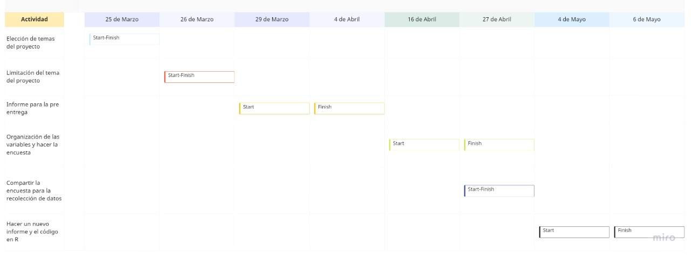

# **Impacto de la transición de las clases virtuales a presenciales** 

## **1. Introducción**

### **Relevancia**

<div style="text-align: justify">Tras 2 años intensos de clases virtuales, la UTEC decide regresar a la presencialidad con un modelo híbrido por lo que no es de esperarse una transición abrupta. Pues, los estudiantes se pueden ver afectados de diversas maneras, ya sea con su alimentación, sus horarios de sueño, gastos de transporte, etc. Es así que se hace de vital importancia identificar las posibles afectaciones que pueda generar esta transición en los estudiantes. Asimismo, es relevante conocer la preferencia en las modalidades de educación, puesto que se toman en cuenta las diferentes variables que determinan su desarrollo universitario, así como la comodidad al aprender.<div/>

***Objetivos*** 

- Estudiar la satisfacción de modalidad. 
- Estudiar la relación entre variables para poder ver sus dependencias entre ellas.
- Estudiar las probabilidades que tiene las actividades y preferencias que realizan los alumnos. 
- 

### **Planificación**




## **2. Datos**
<div style="text-align: justify">
-   **Recolección de datos**: La recolección de datos de este proyecto fue en base a la realización de una encuesta a los alumnos de UTEC, en esta se plasmó preguntas basadas en nuestras variables, como equipo se realizó la planificación e investigación en la búsqueda del mejor método para la recolección de datos, luego de crear el forms se realizó un feedback con la profesora a cargo para luego incorporar los comentarios y sugerencias en nuestra versión final. La encuesta fue compartida por las redes sociales por los integrantes del equipo tales como whatsapp, telegram, Instagram y otros. Se eligió esta estrategia ya que era la manera más viable de llegar a nuestra población. Consideramos como condición para realizar la recolección, que los encuestados tengan correo institucional y que está solo se podía llenar una vez por persona.<div/>

-   **Población objetivo**: La población de estudio de nuestro proyecto fue la Comunidad de estudiantes pregrado de la Universidad de tecnología e ingeniería.

-   **Muestra**: Tomamos como unidad muestral a un alumno pregrado de la universidad UTEC que cuente con correo institucional y que esté llevando cursos este ciclo 2022-1.

-   **Tipo de muestreo**: El tipo de muestreo que se eligió fue el muestreo no probabilístico - por conveniencia, ya que nosotros como equipo elegimos quienes formarían parte de nuestra muestra en base a los conocimientos que teníamos el población, la muestra se eligió tomando en cuenta criterios de inclusión , además de usar la lista de alumnos que tenemos disponible.

-   **Unidades muéstrales**: El tamaño de la muestra fue de 209 alumnos.

-   **Tipo de variables**
<div style="text-align: justify">

    -   Edad: Es de tipo numérica Discreta y su restricción es que sea un número entero mayor a 15 no negativo.

    -   Género:Es de tipo categórica nominal y su restricción es que sea una de las 2 opciones (Femenino- Masculino).

    -   Carrera profesional: Es de tipo categórica nominal y su restricción es que sea solo una de las carreras disponibles en UTEC.

    -   Ciclo: Es de tipo categórica ordinal y su restricción es que sea del rango 1 - 10 .

    -   Modalidad preferida: Es de tipo categórica nominal y su restricción es que sea una de las 3 opciones habilitadas por UTEC (presencial,virtual o híbrida).

    -   Horas de sueño al día en semana presencial: Es de tipo numérica continua su restricción es que sea un número entero menor a 24 no negativo.

    -   Horas de sueño al día en semana virtual: Es de tipo numérica continua su restricción es que sea un número entero menor a 24 no negativo.

    -   Costo de transporte: Es de tipo numérica continua su restricción es que sea un número entero no negativo.

    -   Tiempo de traslado: Es de tipo numérica continua su restricción es que sea un número entero menor a 24 no negativo.

    -   Tiempo en la Universidad: Es de tipo numérica continua su restricción es que sea un número entero menor a 24 no negativo.

    -   Número de cursos:Es de tipo numérica discretas su restricción es que sea un número entero menor a 10 no negativo. 
    
    -   Satisfacción de horario:Es de tipo categórica ordinal y su restricción es que sea del rango 1 - 10

    -   Costo de alimentación : Es de tipo numérica continua su restricción es que sea un número entero no negativo.
    
    -   Tiempo en cada curso: Es de tipo numérica continua su restricción es que sea un número entero menor a 24 no negativo.

    -   Riesgo de robo: Es de tipo categórica ordinal y su restricción es que sea del rango 1 - 10.

    -   Satisfacción de modalidad: Es de tipo categórica ordinal y su restricción es que sea del rango 1 - 10.


**Librerías**


```{r echo=F,comment=""}
library(gmodels)
library(readxl)
library(RColorBrewer)
library(readr)
library(dplyr)
library(ggplot2)
library(modeest)
library(lmtest)
library(stringr)
library(EnvStats)

```


Extraemos la base de datos limpios con la función read_csv para poder leer.

```{r echo=F,comment=""}
ZA<- read_csv("ITCVPLimpios.csv")
```
Variables con datos incompletos 

```{r echo=F,comment=""}
colSums(is.na(ZA))
```

Datos incompletos
```{r echo=F,comment=""}
sum(is.na(ZA))
```


# **3. DESCRIPTORES GRÁFICOS.**
<div style="text-align: justify">
sabiendo que tipo de variables tenemos hacemos gráficas para cada uno

#### <span style="color:purple"> **Edad** <span>
```{r echo=F,comment=""}
Des_Numericos<-function(x){
M<-round(median(x),2)
DS<-round(sd(x),2)

cat("Desviación estandar: ",DS,"\n")
cat("Variaza: ",round(DS^2,2),"\n")
cat("coeficiente de variación: ",round(DS/M,2),"\n")

}
```


```{r echo=F,comment="" }
x<-ZA$Edad
boxplot(x, main= "Gráfico 1: Edades", horizontal =TRUE,col="skyblue")
IMT <-summary(x)
#abline es promedio
abline(v=mean(x),col="red", lwd=2)
legend(23,1.5,legend=c("Media Aritmética"),col=c("red"),lwd=2)
IMT
Des_Numericos(x)

```

La gráfica de caja representa las edades en los alumnos encuestados durante el ciclo 2022-1. La mediana de las edades es 19 años, el mínimo es 16 años, el máximo 20 años, el primer cuartil es 18 años, la media es 18.98 años y el tercer cuartil es 20 años. De esto, se puede decir que podemos encontrar alumnos de 16 hasta 23 años, la mayoría de los encuestados tienen entre 18 y 20 años, y nuestros datos atípicos son 24 y 26 años. Esto debido probablemente a que la mayoría de los estudiantes están cursando su primera carrera y han egresado del colegio recientemente.

#### <span style="color:purple"> **Género** <span>

```{r eval=TRUE, echo=F,comment="", message=FALSE,warning=FALSE}
barplot(table(ZA$Genero), main = "Gráfico 2: Género", ylab = "Frecuencia", xlab = "", ylim = c(0,200),col=palette("pastel 2"))
table(ZA$Genero)
```

En la siguiente gráfica podemos observar que la edad de los alumnos oscila con un rango mínimo de 16 años y un máximo de 26 años. También que el 50% de los alumnos de la Universidad UTEC tiene la edad mayor a 19 años. Por lo tanto, se puede decir que la mayoría de los alumnos tiene 18.98 (19 años). Además, que existe 2 alumnos con edades únicas en la encuesta, uno de 24 años y el otro de 26 años.

#### <span style="color:purple"> **Profesión**<span>

```{r eval=TRUE, echo=FALSE, comment="" ,message=FALSE,warning=FALSE}

barplot(table(ZA$Profesion), main = "Gráfico 3: Profesión ", ylab = "Frecuencia", xlab = "", ylim = c(0,200),col=palette("pastel 2"))
table(ZA$Profesion)
```

Este gráfico de barras nos muestra la frecuencia o cantidad de alumnos pertenecientes a cada carrera, también informa que carrera es la más demandada, pues esta seria la que tiene más frecuencia en el gráfico con un porcentaje de 18.66% que vendría a ser mecatrónica. 


#### <span style="color:purple"> **Ciclo**<span>

```{r eval=TRUE, echo=FALSE, comment="" , message=FALSE,warning=FALSE}
barplot(table(ZA$Ciclo), main = "Gráfico 4: Ciclo", ylab = "Frecuencia", xlab = "Ciclo", ylim = c(0,80), space = 0.8,cex.main=1, cex.names=0.9, cex.axis=0.9,col = palette("set 2"))
table(ZA$Ciclo)
```

Este gráfico de barras representa la cantidad de alumnos de cada ciclo que fueron encuestados. Podemos observar que la mayor cantidad de alumnos son del 3er ciclo con 64 alumnos, seguido de 38 alumnos del 2do ciclo, 30 alumnos de 5to ciclo, 29 alumnos de 4to ciclo, 18 alumnos de 1er ciclo, 12 alumnos de 6to ciclo, 8 alumnos de 7mo ciclo, 6 alumnos de 8vo ciclo, y por último 5 alumnos de 9no ciclo. En general, la mayoría de alumnos se encuentran entre los ciclos 2, 3 y 5 en un porcentaje de 18.18%, 31.58% y 13.88% respectivamente.


#### <span style="color:purple"> **Preferencia de Modalidad** <span>

```{r eval=TRUE, echo=FALSE,comment="" , message=FALSE,warning=FALSE}

barplot(table(ZA$Modalidad_Preferenci), main = "Gráfico 5: Preferencia de Modalidad", ylab = "Frecuencia", xlab = "Modalidad", ylim = c(0,100), space = 0.4,cex.main=1, cex.names=0.9, cex.axis=0.9,col = palette("set 2"))

table(ZA$Modalidad_Preferenci)
```

El gráfico de barras representa la preferencia de los estudiantes por las modalidades de clases tomadas por el estado de emergencia, mostrándose así que la mayoría de la población tiene preferencia por las clases híbridas en un porcentaje de 43.06% seguida por las clases presenciales que recién se han implementando con un  porcentaje de 38.76% y por último tenemos la de menor preferencia que son las clases virtuales con un porcentaje de 18.18%.

#### <span style="color:purple"> **Horas de sueño al día las semanas que tiene clases presenciales** <span>

```{r eval=TRUE, echo=FALSE, comment="" ,message=FALSE,warning=FALSE}
z<-ZA$Horas_de_sueno_al_dia_semana_presencial
boxplot(z, main= "Gráfico 6: Horas de sueño al día las semanas que tiene clases presenciales", horizontal =TRUE,col = palette("set 2"))
IMT <-summary(z)
#abline es promedio
abline(v=mean(z),col="red", lwd=2)
legend(0.7,1.5,legend=c("Media Aritmética"),col=c("red"),lwd=2)
IMT
Des_Numericos(z)

```

A continuación, a través del siguiente gráfico podemos observar que hay 2 datos o valores atípicos repartidos 1 en la parte superior y otro en la parte inferior. También se puede observar que tenemos como valor mínimo de 0 horas y un máximo de 10.2 horas que se evidencia que estos son los valores atípicos por lo que seria recomendable no trabajar con esos valores para obtener valores mas precisos, por otro lado el 50% de la población encuestada se encuentra entre los valores de 6 a 8 horas, además la mediana posee un valor de 6.036 por lo que se puede decir que la mayoría de los estudiantes encuestados no cumplen con las horas de sueño recomendadas.

#### <span style="color:purple"> **Horas de sueño al día las semanas que tiene clases virtual** <span>

```{r eval=TRUE, echo=FALSE, comment="" ,message=FALSE,warning=FALSE}
D<-ZA$Horas_de_sueno_al_dia_semana_virtual
boxplot(D, main= "Gráfico 7: Horas de sueño al día las semanas que tiene clases virtual", horizontal =TRUE,col = palette("set 2"))
IMT <-summary(D)
#abline es promedio
abline(v=mean(D,na.rm = T),col="red", lwd=2)
legend(13,1.5,legend=c("Media Aritmética"),col=c("red"),lwd=2)
IMT
Des_Numericos(D)
```

Primero que nada, podemos ver 4 valores o datos atípicos. 2 en el rango inferior y 1 en el superior. El valor mínimo es de una hora y el máximo de 19 horas, datos que evidentemente podemos confirmar que son atípicos e innecesarios. Además, los valores de 1 y 19 están muy alejados de la media, los por lo que podrían afectar el resultado de esta. Sería recomendable quitar estos valores para poder tener una mayor precisión en los resultados. 
Por otro lado, el 50 por ciento de los datos se encuentran entre 6 y 8 horas. ademas, la mediana tienen un valor aproximadamente de 7. Es por esto que podemos decir que al menos la mitad de los estudiantes están cerca de las horas de sueño recomendadas.

#### <span style="color:purple"> **Costo de transporte** <span>

```{r eval=TRUE, echo=FALSE, comment="" ,message=FALSE,warning=FALSE}
R<-ZA$Costo_transporte
boxplot(R, main= "Gráfico 8: Costo de transporte", horizontal=TRUE,col =palette("set 2") )
IMT <-summary(R)
#abline es promedio
abline(v=mean(R,na.rm = T),col="red", lwd=2)
legend(21,1.5,legend=c("Media Aritmética"),col=c("red"),lwd=2)
IMT
Des_Numericos(R)
```

En esta gráfica interpretamos que los alumnos invierten de 0 a 35 soles en transporte hacia la universidad, y el promedio del costo es de 6.494 soles. Asimismo, el 50% de los alumnos gastan más de 6 soles. Finalmente solo hay dos alumnos que invierten 25 y 35 soles respectivamente.

#### <span style="color:purple"> **Tiempo de traslado** <span>

```{r eval=TRUE, echo=FALSE, comment="" ,message=FALSE,warning=FALSE}
B<-ZA$Tiempo_de_traslado
boxplot(B, main= "Gráfico 9: Tiempo de traslado", horizontal=TRUE,col =palette("set 2") )
IMT <-summary(B)
#abline es promedio
abline(v=mean(B,na.rm = T),col="red", lwd=1)
legend(7,1.5,legend=c("Media Aritmética"),col=c("red"),lwd=1)
IMT
Des_Numericos(B)
```

A partir de este gráfico de caja, observamos que los alumnos tienen un tiempo de traslado menor o mayor que 1.3 horas (1 hora y 18 minutos). Además, el 50% de los alumnos tiene un tiempo traslado mayor a 0.3 horas (18 minutos) y menor a 2 horas. Por lo tanto, podemos decir que la mayoría de los alumnos tienen un tiempo de traslado menor a 2 horas. Por último, debido a la ubicación del gráfico, concluimos que muy pocos estudiantes tienen un tiempo de traslado muy grande.

#### <span style="color:purple"> **Tiempo de permanencia en la universidad**<span>

```{r eval=TRUE, echo=FALSE, comment="" ,message=FALSE,warning=FALSE}
BB<-ZA$Tiempo_en_la_universidad
boxplot(BB, main= "Gráfico 10: Tiempo de permanencia en la universidad", horizontal=TRUE,col =palette("set 2") )
IMT <-summary(BB)
#abline es promedio
abline(v=mean(BB,na.rm = T),col="red", lwd=2)
legend(10,1.5,legend=c("Media Aritmética"),col=c("red"),lwd=2)
IMT
Des_Numericos(BB)
```

En este gráfico podemos ver que los alumnos, en general, permanecen en la universidad 6 horas y que el 50% de los encuestados permanecen entre 5 y 8 horas. Por lo tanto, podemos decir que la mayoría de estudiantes tienen un tiempo de permanencia menor a 8 horas. Por último, a partir de la ubicación, concluimos que tiene una distribución asimétrica hacia la derecha, mas no tan pronunciada, en otras palabras; los estudiantes tienen un tiempo de permanencia similar a la mediana de 6 horas, y unos pocos, un tiempo superior a 8 horas.


#### <span style="color:purple"> **Costo en alimentación** <span>

```{r eval=TRUE, echo=FALSE, comment="" ,message=FALSE,warning=FALSE}
BB<-ZA$Costo_alimentacion
boxplot(BB, main= "Gráfico 11: Costo en alimentación", horizontal=TRUE,col =palette("set 2") )
IMT <-summary(BB)
#abline es promedio
abline(v=mean(BB,na.rm = T),col="red", lwd=2)
legend(20,1.5,legend=c("Media Aritmética"),col=c("red"),lwd=2)
IMT
DE<- sd(ZA$Costo_alimentacion,na.rm = T)
VA<-DE^2
DE
VA
```

En esta gráfica se visualiza que hay valores atípicos en ambos extremo de la caja la cual concentra la data de la variable costo de alimentación por los que vemos el promedio varia demasiado gracias a estos valores atípicos, por ende trabajaremos por la mediana para esto decimos que la mayoria o el 50% gasta 13.5 soles al dia para poder alimentarse ya que se encentra en un intervalo de < 10,16 > 

#### <span style="color:purple"> **Tiempo en cada curso** <span>

```{r eval=TRUE, echo=FALSE, comment="" ,message=FALSE,warning=FALSE}
BD<-ZA$Tiemppo_en_cada_curso
boxplot(BD, main= "Gráfico 12: Tiempo en cada curso", horizontal=TRUE,col =palette("set 2") )
IMT <-summary(BD)
#abline es promedio
abline(v=mean(BD,na.rm = T),col="red", lwd=2)
legend(10,1.5,legend=c("Media Aritmética"),col=c("red"),lwd=2)
IMT
Des_Numericos(BD)
```

Este gráfico de caja nos muestra la concentración de horas al día que dedica cada estudiante al estudio durante el periodo 2022-1. La mediana es 4.3 horas (4 horas y 20 minutos), el mínimo es 0.3 horas (20 minutos), el máximo es 10 horas, el primer cuartil es 3 horas, la media es de 5.16 horas (5 horas y 10 minutos), y el tercer cuartil es 6 horas. Además, los valores atípicos son: 11 horas, 15 horas, 20 horas y 50 horas. Aunque este último no cumple las condiciones de la pregunta pues un día cuenta con 24 horas.

#### <span style="color:purple"> **Numero de cursos** <span>

```{r eval=TRUE, echo=FALSE, comment="" ,message=FALSE,warning=FALSE}
barplot(table(ZA$Numero_de_cursos), main = "Gráfico 13: Numero de cursos", ylab = "Frecuencia", xlab = "Cantidad de cursos", ylim = c(0,100), space = 0.4,cex.main=1, cex.names=0.9, cex.axis=0.9,col = palette("set 2"))
table(ZA$Numero_de_cursos)

```

En el gráfico de barras podemos visualizar la cantidad de cursos que están llevando los alumnos durante el ciclo 2022-1. Se puede decir que la mayor parte de alumnos cursa durante este ciclo un total de 6 cursos seguido por otro grupo menor que cursa 5 y así sucesivamente hasta llegar al menor grupo que cursan un total de 8 cursos.

#### <span style="color:purple"> **Satisfacción de horario** <span>

```{r eval=TRUE, echo=FALSE, comment="" ,message=FALSE,warning=FALSE}
barplot(table(ZA$Satisfaccion_de_horario), main = "Gráfico 14: Satisfacción de horario ", ylab = "Frecuencia", xlab = "Nivel de satisfación", ylim = c(0,100), space = 0.4,cex.main=1, cex.names=0.9, cex.axis=0.9,col = palette("set 2"))
table(ZA$Satisfaccion_de_horario)
```

Este gráfico de barras representa los niveles de satisfacción, ordenados del 1 al 10, acerca del horario de clases del periodo 2022-1. La mayor frecuencia está en el nivel 7 con el 19.62% alumnos, le siguen los niveles 6, 8 y 5, con el 18.18%, 17.70% y 16.27% de alumnos respectivamente. La mayoría de los encuestados se encuentra entre los niveles que van del 5 al 8, por ello, podemos decir que la mayoría de los encuestados están entre medianamente satisfechos y totalmente satisfechos.


#### <span style="color:purple"> **Riesgo de Robo ** <span>

```{r eval=TRUE, echo=FALSE, comment="" ,message=FALSE,warning=FALSE}
barplot(table(ZA$Riesgo_de_robo), main = "Gráfico 15: Riesgo de robo ", ylab = "Frecuencia", xlab = "Nivel de riesgo", ylim = c(0,100), space = 0.4,cex.main=1, cex.names=0.9, cex.axis=0.9,col = palette("set 2"))
table(ZA$Riesgo_de_robo)
```

El gráfico de barras representa el nivel de riesgo de robo de los estudiantes en el traslado desde su residencia a la universidad. De la gráfica se observa que la mayoría de la población tiene un riesgo entre 7 y 8 con 21.05% y 13.39% de alumnos respectivamente, y la cantidad de alumnos con un alto riesgo es de 7.65% del total de alumnos encuestados. 


#### <span style="color:purple"> **Satisfacción de modalidad**<span>

```{r eval=TRUE, echo=FALSE, comment="" ,message=FALSE,warning=FALSE}
barplot(table(ZA$Satisfaccion_de_Modalidad), main = "Gráfico 16: Satisfacción de modalidad ", ylab = "Frecuencia", xlab = "Nivel de Satisfacción", ylim = c(0,100), space = 0.4,cex.main=1, cex.names=0.9, cex.axis=0.9,col = palette("set 2"))
table(ZA$Satisfaccion_de_Modalidad)
```

En este gráfico de barras observamos una jerarquía del 1 al 10, siendo el 1: "Nada satisfecho" y siendo el 10: "Totalmente satisfecho", el nivel de satisfacción de cada estudiante acerca de la modalidad del periodo 2022-1. La mayor frecuencia se encuentra en el nivel 7 de satisfacción con el 22% de estudiantes, siguiéndole el nivel 10 con el 12.92% de estudiantes, y con una cantidad similar se encuentran los niveles 5 y 8 con 11.96% de estudiantes para ambos niveles de satisfacción . En general podemos decir que la mayoría de los estudiantes encuestados están entre medianamente satisfechos , muy satisfechos y totalmente satisfechos con la modalidad.

### **Relación entre variables** 


#### <span style="color:purple"> **Satisfacción de modalidad \~ Género** <span>

```{r eval=TRUE, echo=FALSE, comment="" ,message=FALSE,warning=FALSE}
Satisfaccion_de_Modalidad<-ZA$Satisfaccion_de_Modalidad
Genero<-ZA$Genero
summary(Satisfaccion_de_Modalidad)
boxplot(Satisfaccion_de_Modalidad~Genero,pch=19,las=2,main="Gráfico 17: Satisfacción de modalidad ~ Género",col=palette("set 2") )
abline(h=mean(Satisfaccion_de_Modalidad,na.rm = T),col="red", lwd=2)
table(Satisfaccion_de_Modalidad,Genero)


```

En el gráfico se puede representar la relación entre la Satisfacción de la modalidad y el género de la población durante el ciclo 2022-1. Se puede verificar por la gráfica que ambos grupos de estudiantes están conformes con las modalidades que se ha tomado y eso se corrobora con la media que tiene un valor igual a 6,297 y la mediana que se encuentra por encima de la media con un valor de 7, pero tenemos algunos casos poco comunes como es el caso del mínimo que tiene un valor de 1 y por otro lado encontramos el máximo con un valor de 10. Pero se puede concluir que la satisfacción de los chicos y las chicas es mayor a 4 pero menor a 8 en su gran mayoría.


#### <span style="color:purple"> **Género ~ Número de cursos**<span>

```{r eval=TRUE, echo=FALSE, comment="" ,message=FALSE,warning=FALSE}
A<- table(ZA$Numero_de_cursos,ZA$Genero)
plot(A,main = "Gráfico 18: Género ~ Número de cursos",col=palette("set 2"))
A

```
En el siguiente gráfico se puede observar el la cantidad de cursos que lleva cada género según las respuestas de nuestra encuesta. De esta se interpreta que la mayoría de mujeres lleva más de 5 cursos, es decir  es más probable que una encuestada lleve entre 5 a 8  que 1 a 5 cursos, a su vez es menos probable que una encuestada esté llevando menos de 2 cursos. Por otro lado la mayoría del género masculino lleva entre 5 a 6 cursos y es menos probable que un encuestado de género masculino lleve menos de 2 cursos. Dentro de los encuestados, la probabilidad de que lleven más de 5 cursos es mayor a que lleven menos de 5 cursos.


#### <span style="color:purple"> **Modalidad de preferencia ~ ciclo**<span>


```{r eval=TRUE, echo=FALSE, comment="" ,message=FALSE,warning=FALSE}
A<- table(ZA$Ciclo,ZA$Modalidad_Preferenci)
plot(A,main = " Gráfico 19: Modalidad de preferencia ~ Ciclo",col=palette("set 2"))

A
```
En el siguiente gráfico se puede observar la preferencia en modalidades según el ciclo en el que se encuentra nuestros encuestados. En esta gráfica se puede interpretar que que la mayoría prefiere la modalidad híbrida o presencial por el cuál es menos probable que un encuestado prefiera la modalidad virtual. A su vez, de los que prefieren la modalidad híbrida podemos decir que existe mayor probabilidad de que el encuestado se encuentre en el ciclo 3. Por otro lado, los encuestados que tienen como preferencia la modalidad presencial se puede deducir que es menos probable que el encuestado se encuentre en ciclo mayor 5 que se encuentre en un ciclo menor a 5. Además de los que prefieren la modalidad virtual se puede decir que existe una probabilidad 0 de que un encuestado se encuentre en ciclo 1.


#### <span style="color:purple">**Hora de sueño Semana presencial presencial vs Tiempo de traslado**


```{r eval=TRUE, echo=FALSE, comment="" ,message=FALSE,warning=FALSE}


Horas_sueño_MPresenencial<-ZA$Horas_de_sueno_al_dia_semana_presencial
Tiempo_de_traslado<-ZA$Tiempo_de_traslado
regresion<-lm(Tiempo_de_traslado~Horas_de_sueno_al_dia_semana_presencial,data=ZA)
plot(Horas_sueño_MPresenencial,Tiempo_de_traslado,main="Gráfico20: Tiempo de traslado ~ Horas de sueños M. presenciales  ",xlab = "Horas de sueño M. presencial", ylab = "Tiempo de traslado")
smoothScatter(Horas_sueño_MPresenencial,Tiempo_de_traslado,main="Gráfico 20: Tiempo de traslado ~ Horas de sueños M. presenciales  ",ylab="Horas de sueño M. Presencial",xlab="Tiempo de traslado")
abline(regresion, col = "red") 

summary(Tiempo_de_traslado)
summary(Horas_sueño_MPresenencial)
summary(regresion)
HSP <- ZA[!is.na(ZA$Horas_de_sueno_al_dia_semana_presencial),]
HSPlim <- HSP[!is.na(HSP$Tiempo_de_traslado),]

cat("Covarianza: ",round(cov(HSPlim$Tiempo_de_traslado,HSPlim$Horas_de_sueno_al_dia_semana_presencial),2),"\n")
cat("Correlación: ",round(cor(HSPlim$Tiempo_de_traslado,HSPlim$Horas_de_sueno_al_dia_semana_presencial),2))
```

En este gráfico de dispersión entre las variables “Tiempo de traslado” y “Horas de sueño durante la modalidad presencial”, tenemos un valor p de 0.08503 y un R-cuadrado ajustado de 0.009499. Tomando un nivel de significancia de 0.05, observamos que el valor de p es mayor a este nivel. El valor del R-cuadrado ajustado es demasiado pequeño. Además, la correlación y la covarianza tienen los valores de -0.12 y -0.23, respectivamente. A partir de ello podemos decir que tienen una correlación y covarianza negativa (Si una variable aumenta, la otra disminuye). Concluimos que no existe una relación lineal entre estas dos variables y un modelo lineal no sería el adecuado.


#### <span style="color:purple">**Tiempo de estadía en la universas vs Costos de transporte** 

```{r eval=TRUE, echo=FALSE, comment="" ,message=FALSE,warning=FALSE}


TE<-ZA$Tiempo_en_la_universidad
CT<-ZA$Costo_transporte
regresion<-lm(TE~CT,data=ZA)
plot(TE,CT,main="Gráfico 21: Tiempo de estadia en la universidad ~ Costode trasporte ",xlab = "Tiempo de estadia en la universidad", ylab = "Costo de traslado ")
smoothScatter(TE,CT, main ="Gráfico 21: Tiempo de estadia en la universidad ~ Costode trasporte ",ylab = "horas en la universidad",xlab="Costo de transporte")
abline(regresion, col = "red") 

summary(TE)
summary(CT)
summary(regresion)
HSP <- ZA[!is.na(ZA$Tiempo_en_la_universidad),]
HSPlim <- HSP[!is.na(HSP$Costo_transporte),]

cat("Covarianza: ",round(cov(HSPlim$Tiempo_en_la_universidad,HSPlim$Costo_transporte),2),"\n")
cat("Correlación: ",round(cor(HSPlim$Tiempo_en_la_universidad,HSPlim$Costo_transporte),2))
```

En este gráfico de dispersión entre las variables “Tiempo de estadía en la universidad” y “Costo del transporte”, tenemos los valores de 0.5434 y 0.003035 para el valor p y el R-cuadrado ajustado, respectivamente. Con un nivel de significancia de 0.05, el valor p es mucho mayor. El valor del R-cuadrado ajustado es demasiado pequeño. Además, la correlación y la covarianza tienen los valores de 0.04 y 0.59, respectivamente. A partir de ello podemos decir que tienen una correlación y covarianzas positivas (Si una variable aumenta, la otra aumenta). Concluimos que no existe una relación lineal entre estas dos variables y un modelo lineal no sería el adecuado.


#### <span style="color:purple">**Horas de sueño presencial vs Tiempo de estadía en la universidad**

```{r eval=TRUE, echo=FALSE, comment="" ,message=FALSE,warning=FALSE}


TE<-ZA$Horas_de_sueno_al_dia_semana_presencial
CT<-ZA$Tiempo_en_la_universidad
regresion<-lm(CT~TE,data=ZA)
plot(CT,TE,main="Gráfico 22: Horas de sueño en semana presencial~ Tiempo en la universidad ",xlab = "Horas de sueño en en seman presencial~ Tiempo en la universidad", ylab = "Tiempo en la universidad")
smoothScatter(CT,TE,main ="Gráfico 22: Horas de sueños en en semana presencial~ Tiempo en la universidad ",ylab = "Horas en la universidad",xlab = "Horas de sueño en modalidad presencial")
abline(regresion, col = "red") 

summary(TE)
summary(CT)
summary(regresion)
HSP <- ZA[!is.na(ZA$Horas_de_sueno_al_dia_semana_presencial),]
HSPlim <- HSP[!is.na(HSP$Tiempo_en_la_universidad),]

cat("Covarianza: ",round(cov(HSPlim$Tiempo_en_la_universidad,HSPlim$Horas_de_sueno_al_dia_semana_presencial),2),"\n")
cat("Correlación: ",round(cor(HSPlim$Tiempo_en_la_universidad,HSPlim$Horas_de_sueno_al_dia_semana_presencial),2))
```

En este grafico de dispersión entre las variables “Horas de sueño en la Semana Presencial” y el “Tiempo en la Universidad”, tenemos los valores de 0.0931 y 0.008797 para el valor de p y el R-cuadrado ajustado, respectivamente. Con un nivel de significancia de 0.05 concluimos que el valor de p es mayor, pero a la vez muy cercano teniendo una correlación de -0.12 dándonos que las variables están asociadas en sentido inverso.


# **4. Probabilidades **

1.- Preferencia de modalidad:

```{r eval=TRUE, echo=FALSE, comment="" ,message=FALSE,warning=FALSE}
cat("Tabla N° 1","\n")
table(ZA$Modalidad_Preferenci)
```


Un investigador realiza una encuesta a los alumnos de la universidad sobre su modalidad de clases de preferencia. 
El número total de alumnos que respondieron la encuesta es de 209 y 38 alumnos del total respondieron que prefieren las clases virtuales al 100%. Si se selecciona una muestra sin reemplazo de 10 alumnos. 
X: Nº de estudiantes que prefieren las clases 100% virtuales
X tiene H(N=209, M=38, n=10)

*Hallar la probabilidad que el número de estudiantes que prefieren la modalidad virtual sea como máximo 4. *

$P(X ≤ 4)$
```{r eval=TRUE, echo=FALSE, comment="" ,message=FALSE,warning=FALSE}
# P(X ≤ 4)
cat("X<=4 = ",phyper(4,38,171,10))
```

*Hallar la probabilidad que como mínimo 5 estudiantes prefieran la modalidad virtual y como máximo 8.*

$P( 5 ≤ X ≤ 8)$
```{r eval=TRUE, echo=FALSE, comment="" ,message=FALSE,warning=FALSE}
#P( 5 ≤ X ≤ 8)
cat("5<= X <=8 = ",phyper(8,38,171,10) - phyper(4,38,171,10))
```

*¿Cuántos alumnos se espera que prefieran la modalidad virtual al 100%?*

$ E(X)$
```{r eval=TRUE, echo=FALSE, comment="" ,message=FALSE,warning=FALSE}
#E(X): (nM) / N
cat("E(x) = ",(EX2 = (10*38) / 209))
```

Al finalizar el estudio, se puede concluir que la modalidad virtual no es tan preferida, ya que de los 10 alumnos evaluados, se espera que solo 2 prefieran la modalidad virtual.

2.- Tabla de relación número de cursos y horas de sueño al día en semana presencial.


```{r eval=TRUE, echo=FALSE, comment="" ,message=FALSE,warning=FALSE}
cat("Tabla recodificada N° 1","\n")

ZA %>% mutate(descanso1 =
       ifelse(Horas_de_sueno_al_dia_semana_presencial %in% c("0"), "0-3",
       ifelse(Horas_de_sueno_al_dia_semana_presencial %in% c("3.3", "3.5", "4", "4.3", "4.4", "5", "5.3", "5.4", "6"),      "3-6",
       ifelse(Horas_de_sueno_al_dia_semana_presencial %in% c("6.2", "6.3", "6.4", "6.5", "7", "7.2", "7.3", "7.34", "7.5", "8", "8.3", "9"), "6-9",
        ifelse(Horas_de_sueno_al_dia_semana_presencial %in% c("10.2"), "9-12", Horas_de_sueno_al_dia_semana_presencial))))) -> ZA

ZA %>% count(descanso1)
```

```{r eval=TRUE, echo=FALSE, comment="" ,message=FALSE,warning=FALSE}

cat("Tabla  N° 2","\n")

CrossTable(ZA$Numero_de_cursos,ZA$descanso1, prop.r=F,
prop.c=F, prop.t=F, prop.chisq=F)
```


*¿Cuál es la probabilidad que duerma de 3 a 6 horas pero que no lleve 8 cursos?*

$P(B∩C8^C) = P(B) - P(B∩C8)$
```{r eval=TRUE, echo=FALSE, comment="" ,message=FALSE,warning=FALSE}
#solo sucede A, pero no B
cat("P(B) - P(B∩C8)= ",(111/209) - (17/209))
```

Un poco mas de la mitad  de las personas que duermen de 3 a 6 horas tiene menos de 8 cursos.

*Si el alumno lleva 6 cursos, ¿cuál es la probabilidad de que duerma de 3 a 6 horas?*

$P(B/C6) = P(B∩C6) / P(C6)$
```{r eval=TRUE, echo=FALSE, comment="" ,message=FALSE,warning=FALSE}
#Prob A sabiendo que ya ocurrio B
cat("P(B∩C6) / P(C6)",(39/209) / (75/209))
```

Más de la mitad de gente que lleva 6 cursos, duerme de 3 a 6 horas. Podríamos decir que tienen una carga académica grande.

*¿Cuál es la probabilidad de que un estudiante lleve menos de 6 cursos?*

$1 - (P(C8) + P(7) + P(6))$
```{r eval=TRUE, echo=FALSE, comment="" ,message=FALSE,warning=FALSE}
cat("1 - (P(C8) + P(7) + P(6))= ",1 - ((19/209) + (24/209) + (75/209)))
```

Como podemos ver, el 43% de los estudiantes lleva menos de 6 cursos lo cual nos indica que mas de la mitad lleva mínimo 6 cursos.

3.- Al realizar una tabla de doble entrada de Profesión vs Modalidad Preferida podemos ver de que manera impactó el cambio de la virtualidad al modelo híbrido, así como saber la modalidad preferida de los alumnos de distintas carreras.

```{r eval=TRUE, echo=FALSE, comment="" ,message=FALSE,warning=FALSE}
cat("Tabla recodificada N° 3","\n")
CrossTable(ZA$Profesion,ZA$Modalidad_Preferenci, prop.r=F,
prop.c=F, prop.t=F, prop.chisq=F)
```

*¿Cuál es la probabilidad de que una persona prefiera la modalidad virtual o híbrido o presencial?*

```{r eval=TRUE, echo=FALSE, comment="" ,message=FALSE,warning=FALSE}
#modalidad virtual
cat('P(V)=',(90/209),'\n')
#modalidad híbrida
cat('P(H)=',(81/209),'\n')
#modalidad presencial
cat('P(P)=',(38/209),'\n')
```

*¿Cuál es la probabilidad de que un alumno prefiera la modalidad híbrida o que pertenezca a la carrera de ingeniería ambiental o ingeniería mecatrónica?*

$P(H)+P(am)+P(mt)-P(am∩H)-P(mt∩H)$

```{r eval=TRUE, echo=FALSE, comment="" ,message=FALSE,warning=FALSE}
cat("P(H)+P(am)+P(mt)-P(am∩H)-P(mt∩H)= ",(81/209) + (35/209) + (39/209) - (15/209) - (39/209))
```
Con el resultado que hemos obtenido podemos confirmar que la modalidad híbrida es la más preferida y las carreras de ingeniería ambiental y mecatrónica cuentan con una mayor cantidad de alumnos en la población estudiada ya que pertenecen al 50% de la población total.


*Si el alumno es de la carrera de ing. civil, ¿Cuál es la probabilidad de que su modalidad preferida sea virtual?*

$P(V/c) = P(V∩c) / P(c)$

```{r eval=TRUE, echo=FALSE, comment="" ,message=FALSE,warning=FALSE}
cat('P(V/c)=',round((5/209) / (20/209) ,4),'\n')
#Otra forma

```
De acuerdo al resultado obtenido, podemos determinar que la modalidad virtual no es la preferida de los estudiantes de la carrera de ingeniería civil. Esto debido a que un 75% prefiere otro tipo de modalidad, mientras que solo el 25% prefiere la modalidad virtual. 


4.- Análisis de histograma para ver el tipo de distribución que tiene nuestra variable 

```{r eval=TRUE, echo=FALSE, comment="" ,message=FALSE,warning=FALSE}
hist(ZA$Tiempo_en_la_universidad,main = "Gráfico 24: Tiempo de estadia en la univerdad ",ylab = "Frecuencia",xlab="Horas",col = "lightblue")
min(ZA$Tiempo_en_la_universidad)
max(ZA$Tiempo_en_la_universidad)
frecuencias <- data.frame(table(ZA$Tiempo_en_la_universidad))
moda <- frecuencias[which.max(frecuencias$Freq),1]
moda
```

Se realiza un estudio para saber cuanto tiempo pasan los estudiantes en la universidad. Tras realizar el estudio, se predice que se adapta a una distribución triangular con un valor mínimo de 0, máximo de 16 y una moda de 6. A continuación, se pide resolver los siguientes problemas para tener un mejor entendimiento del tiempo que pasan los estudiantes en la universidad.
X: *tiempo que pasan los estudiantes en la universidad*
X tiene tri(0,16,6)

*¿Cuál es la probabilidad de que un estudiante esté hasta 10 horas en la universidad?*

$P(X ≤ 10)$

```{r eval=TRUE, echo=FALSE, comment="" ,message=FALSE,warning=FALSE}
#P(X ≤ 10)
cat("P(X <= 10) = ",ptri(10,0,16,6))
```
De este resultado, podemos ver que más del 75% de los estudiantes pasan menos de 10 horas en la universidad.

*¿Cuál es la probabilidad de que un estudiante esté más de 6 horas en la universidad?*

$P(X ≥ 6)$
```{r eval=TRUE, echo=FALSE, comment="" ,message=FALSE,warning=FALSE}
#P(X ≥ 6)
cat("P(X >=6) = ",1 - ptri(5,0,16,6))
```
El 74% de estudiantes está de 6 a más horas en la universidad.

*¿Cuál es el tiempo esperado que pase un alumno en la universidad?*

$E(X)$
```{r eval=TRUE, echo=FALSE, comment="" ,message=FALSE,warning=FALSE}
#E(X) (a+b+c)/3
EX1 = (0+16+6)/3
cat("E(X) = ",EX1)
```
Finalmente, podemos ver que el tiempo esperado de un alumno en la universidad es de 7.33 horas. Luego de analizar los tres resultados, podemos observar que la mayoría de estudiantes pasa entre 6 a 10 horas en la universidad.


5.- Ahora analizaremos que tan satisfechos se encuentran los alumnos con la modalidad actual, la híbrida. Para esto, primero queremos conocer la probabilidad de que la satisfacción de los alumnos sea buena. Es decir, de 7 a 10. Para esto crearemos una tabla de frecuencia.
```{r eval=TRUE, echo=FALSE, comment="" ,message=FALSE,warning=FALSE}
cat("Tabla  N° 4","\n")
table(ZA$Satisfaccion_de_Modalidad)
```
```{r eval=TRUE, echo=FALSE, comment="" ,message=FALSE,warning=FALSE}
cat("Tabla recodificada N° 2","\n")
ZA %>% mutate(satisM =
       ifelse(Satisfaccion_de_Modalidad %in% c("1","2","3"), "Mala",
       ifelse(Satisfaccion_de_Modalidad %in% c( "4", "5", "6"),      "Intermedio ",
       ifelse(Satisfaccion_de_Modalidad %in% c( "7",  "8", "9", "10"),"Buena", Satisfaccion_de_Modalidad)))) -> ZA

ZA %>% count(satisM)
```
*Probabilidad de que los alumnos tengan una satisfacción buena*

$P(10≥X≥7)$

```{r eval=TRUE, echo=FALSE, comment="" ,message=FALSE,warning=FALSE}
cat("7<=X<=10 = ",(115) / 209)
```

Teniendo este dato podemos plantear lo siguiente:

El MINEDU a realizado un estudio para determinar el grado de satisfacción de los estudiantes con respecto a la modalidad híbrida de clases. Por estudios interiores, se ha determinado que la probabilidad declare que su satisfacción es buena es de 0.55. Para calcular alguna probabilidades, se escoge una muestra con remplazo de 50 alumnos.

X: Número de alumnos que declara que su satisfacción es buena.
X tiene B(50,0.55)

*¿Cuál es la cantidad de alumnos que se espera que tengan una satisfacción buena?*

$E(X)$

```{r eval=TRUE, echo=FALSE, comment="" ,message=FALSE,warning=FALSE}

#E(X): np
cat("E(X) = ",(EX3 = 50*0.55))
```

*¿Cuál es la probabilidad de que al menos hayan 25 alumnos con una satisfacción buena?*

$P(X ≥ 25)$

```{r eval=TRUE, echo=FALSE, comment="" ,message=FALSE,warning=FALSE}
#P(X ≥ 25)
cat("P(X >= 25)",1 - pbinom(24,50,0.55))
```
*¿Cuál es la probabilidad de que como mínimo 40 alumnos tengan una satisfacción buena y como máximo 50?*

$P(40 ≤ X ≤ 50)$

```{r eval=TRUE, echo=FALSE, comment="" ,message=FALSE,warning=FALSE}
#P(40 ≤ X ≤ 50)
cat("P(40 <= X <= 50)",pbinom(50,50,0.55) - pbinom(39,50,0.55))
```

<div style="text-align: justify">
Después de realizar el estudio, el MINEDU ha llegado a la conclusión de que hay 28 alumnos que tienen una satisfacción buena con respecto a la modalidad de clases híbridas. Esto se puede comprobar ya que la probabilidad de que más de 25 personas tengan una satisfacción buena es alta, de 0.80. Por último, esto no quiere decir que todos los alumnos tengan una satisfacción buena, como se puede ver con el último ejercicio.


# **5. Conclusiones **
<div style="text-align: justify">
Del estudio que se realizo a cerca de la Modalidad presencial y otras actividades que influyen en este proceso de reactivan académica, se observo la distribución de las diferentes variables que se estudio y las probabilidades de algunas de ellos y es satisfactorio el resultado obtenido ya que los estudiantes tiene un preferencia mayor en la modalidad híbrida porque equilibra su tiempo.


