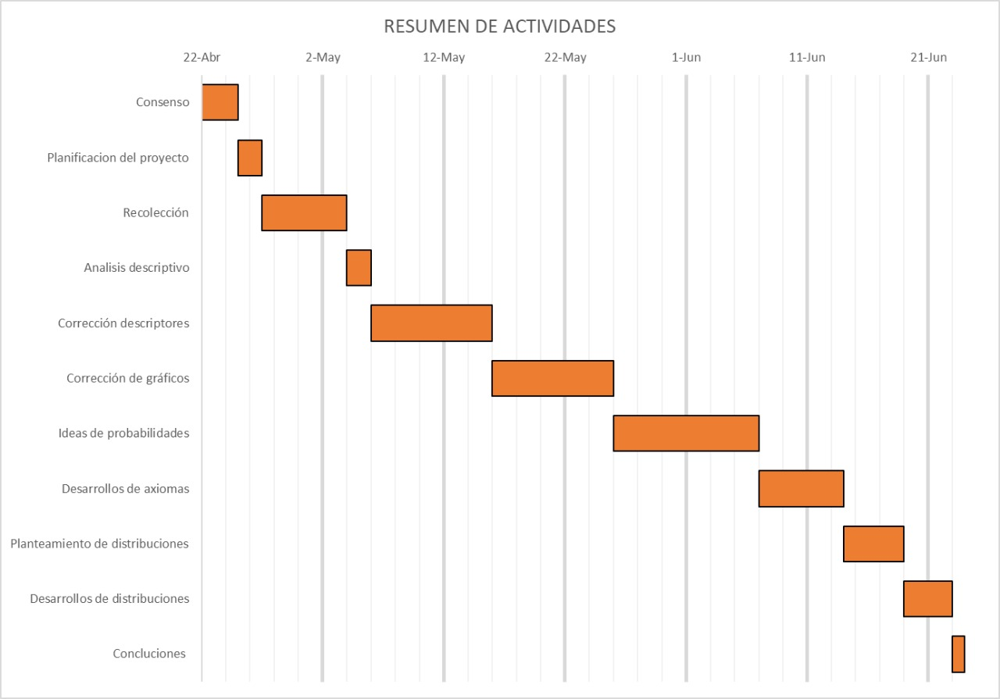

```{r setup, include=FALSE}
knitr::opts_chunk$set(echo = TRUE)
```

# <b style = 'color : #63B8FF;'> **Introducción**</b>

En las universidades existen diferentes tipos de estudiantes, con diferentes características, diferentes rutinas y diferentes estilos de vida, los cuales también obtienen diferentes notas. Muchas veces se dice que para obtener estas notas basta solo con estudiar, pero ¿qué tan real es esto?, estudios realizados como el de [(Chong, E. G)]  (https://www.redalyc.org/articulo.oa?id=27050422005), nos muestran cómo existen diversos factores que inciden en el rendimiento académico, además [(Murillo, M. A)]  (http://www.ori.soa.efn.uncor.edu/wp-content/uploads/2011/05/Rendimiento-Acad%C3%A9mico-Universitario.pdf), nos presenta variables muy poco conocidas pero muy importantes como las institucionales o pedagógicas las cuales cumplen un rol fundamental en la formación de todo profesional, asimismo,[(Mamani, R. L)] (http://www.revistasbolivianas.ciencia.bo/scielo.php?script=sci_arttext&pid=S2305-60102015000200003&lng=en&nrm=iso&tlng=es) nos hace presenta una investigación descriptiva y cuantitativa de los factores que influyeron a que los estudiantes de la carrera de ingeniería civil pertenecientes a la Universidad Autónoma Juan Misael Saracho obtengan bajas notas, por lo cual te preguntamos ¿ crees qué las notas solo dependen de las horas que estudias al dia? o quizá estas también dependen de otros factores y características. En este sentido analizaremos tales características, rutinas y otras variables y su relación con el desempeño académico. De este modo, con este estudio se identificarán aquellos aspectos que guardan relación directa con las notas y evaluar qué condiciones son causales de altas y bajas notas.


# <b style = 'color : #63B8FF;'> **Población** </b>

En esta oportunidad, nos centraremos en alumnos de UTEC tomando en cuenta todas las carreras y a los que están cursando el segundo ciclo o ciclos superiores,mediante el uso de encuestas obtendremos las respuestas las cuales luego nos servirán para hacer el respectivo análisis y conclusiones de nuestro estudio.

# <b style = 'color : #63B8FF;'> **Importancia** </b>

Los estudiantes universitarios de UTEC a lo largo de su vida universitaria necesitan aprobar sus cursos y además de esto lo recomendable es que obtengan buenas notas, muchas veces no conocemos o tenemos ejemplos a seguir, no tenemos una cierta guia de lo qué los estudiantes con mejor rendimiento realicen o quizá cuales son sus características los cuales hacen qué tengan un buen desempeño.

# <b style = 'color : #63B8FF;'> **Relevancia** </b>

Describir la relación entre perfiles de estudiantes analizando sus hábitos de estudio, horas de sueño, tiempo en llegar a la universidad, nivel socioeconómico, entre otras y ver si estos guardan relación con sus notas obtenidas en ciclos pasados o actuales..


# <b style = 'color : #63B8FF;'> **Factibilidad** </b>

El estudio a realizar es factible ya que la recolección de datos no sería un problema, utilizaremos las herramientas digitales como google forms para qué los alumnos puedan rellenar sus respuestas, estas herramientas son gratis y fáciles de usar, además que los alumnos ya están acostumbrados a llenar google forms, asimismo, se cuenta con el correo electrónico de los estudiantes de UTEC, lo que facilita el envío de los cuestionarios y garantiza que la muestra sea aleatoria y probabilística.

# <b style = 'color : #63B8FF;'> **Interes del Público** </b>

A todos los estudiantes les interesa obtener buenas calificaciones y captar los temas con facilidad, al finalizar el estudio podemos concluir qué rutinas, métodos de estudio y características poseen los estudiantes con mayor nota para que los estudiantes que posiblemente obtuvieron notas bajas anteriormente puedan aplicarlas en si mismo de tal manera que puedan mejorar su desempeño académico.

# <b style = 'color : #63B8FF;'> **1 Datos** </b>

## <b style = 'color : #63B8FF;'> **1.1 Recolección de Datos** </b>

Los datos obtenidos están en base al muestreo por conveniencia pues el estudio busca recopilar el perfil de cada estudiante para tener una idea de la calidad del estudiante de la UTEC. Se buscó que la encuesta tenga el mayor alcance posible para que todo el alumnado tenga la misma probabilidad de responder. Las estrategias usadas radican en esparcir nuestra encuesta para tener los datos. 

Las estrategias son: Esparcir la encuesta entre nuestros círculos sociales de la universidad, mediante el correo compartir nuestra encuesta con aquellos que lo permitieron, de manera presencial lograr que el alumno llene la encuesta.

## <b style = 'color : #63B8FF;'> **1.2 Población objetivo** </b>

El alumnado pregrado de la UTEC

## <b style = 'color : #63B8FF;'> **1.3 Unidad muestral** </b>

Alumno pregrado Utec

# Descripción General

Se realizó una encuesta a estudiantes universitarios para conocer características y percepciones importantes sobre su carrera, apoyo familiar, métodos de estudio, entre otros.

## <b style = 'color : #104E8B;'> **2.- Objetivos generales y específicos** </b>

### <b style = 'color : #009ACD;'> **2.1.- Objetivo General** </b>

Conocer las características más relevantes de los estudiantes de UTEC.

### <b style = 'color : #009ACD;'> **2.2.- Objetivos Específico:** </b>

- Diferenciar los atributos sociodemográficos y académicos según género.
- Descubrir correlaciones importantes entre variables edad, promedio ponderado, horas de estudio y horas de descanso.
- Modelar las variables según las distribuciones estudiadas en clase.

## <b style = 'color : #104E8B;'> **3.- Descripción General** </b>

Se realizó una encuesta a estudiantes universitarios para conocer características y percepciones importantes sobre su carrera, apoyo familiar, métodos de estudio, entre otros. Las variables se organizaron como:

### <b style = 'color : #009ACD;'> **3.1.- Variables cuantitativas** </b>

| Variable   | Definición               | Tipo de Variable | Restricciones                             |
|:-----------|:-------------------------|:-----------------|:------------------------------------------|
| Edad       | Edad del estudiante      | Discreta         | Entero entre 14 y 40                      |
| H.descanso | Horas de descanso al día | Continua         | Racionales entre 0 y 24 con un decimal    |
| H.estudio  | Horas de estudio al día  | Continua         | Racionales entre 0 y 24 con un decimal    |
| T.traslado | Tiempo de traslado       | Continua         | Racionales entre 0 y 24 con un decimal    |
| P.ciclo    | Promedio ponderado       | Continua         | Racionales entre 0 y 20 con dos decimales |

```{r cars}
library(readr)
datos <- read_csv("datos.csv")
head(datos)
```
Número de casos completos: 200
```{r}
sum(complete.cases(datos))
```

Número de observaciones: 5400
```{r}
sum(!is.na(datos))
```
## <b style = 'color : #104E8B;'> **4.- Estadísticas descriptivas** </b>

Se procedió a crear una función en R que permite obtener las estadísticas descriptivas para las variables numéricas

```{r}
de=function(x){
  library(modeest)
  n=length(x)
  Promedio=mean(x,na.rm = TRUE)
  Mediana=median(x,na.rm = TRUE)
  Moda=mfv(x)
  P25=as.vector(quantile(x,0.25,na.rm = TRUE))
  P75=as.vector(quantile(x,0.75,na.rm = TRUE))
  Min=min(x,na.rm = TRUE)
  Máx=max(x,na.rm = TRUE)
  Rango=Máx-Min
  Varianza=var(x,na.rm = TRUE)
  DE=sd(x,na.rm = TRUE)
  CV=100*DE/Promedio
  IQR=P75-P25
  resultados=rbind(n,Promedio,Mediana,Moda,P25,P75,Min,Máx,Rango,Varianza,DE,CV,IQR)
  resultados=round(resultados,2)
    return(resultados)
}
est=rownames(de(datos$Edad))
de(datos$Edad)

```

Esta función se puede aplicar de forma simultánea a todas las variables numéricas con uso de
de la libreria dplyr

```{r}
library(dplyr)
estadisticos=datos %>%
  summarise_at(c("Edad","H.descanso","H.estudio","T.traslado","P.ciclo"),de)
estadisticos=as.data.frame(estadisticos)
names(estadisticos)=c("Edad","H.descanso","H.estudio","T.traslado","P.ciclo")
rownames(estadisticos)=est
library(DT)
library(kableExtra)
estadisticos %>%
  kbl(caption = "Estadisticas descriptivas de variales cuantitativas") %>%
  kable_classic(full_width = F, html_font = "Cambria")
```

### <b style = 'color : #CD2626;'> **Interpretación** </b>

#### Edad

De los 200 estudiantes universitarios encuestados:

- La edad promedio es de 21.27 años.
- El 50% de los estudiantes tiene como máximo 21 años.
- La edad más frecuente es de 21 años.
- El 25% de los estudiantes tiene como máximo 20 años.
- El 75% de los estudiantes tiene como máximo 22 años.
- La edad mínima de los estudiantes es 17 años y la máxima 24 años.
- La variabilidad de los años de los estudiantes es de 6.68%.

Según el histograma la edad de los estudiantes se concentra mayormente en edades entre 19 y 22 años.

```{r}
hist(datos$Edad,main="Distribución de estudiantes según Edad",xlab="Edad",ylab="Frecuencia",col="red")
```

#### H.descanso

De los 200 estudiantes universitarios encuestados:

- Las horas promedio de descanso es de 6.5 horas.
- El 50% de los estudiantes descansa como máximo 7 horas.
- La hora más frecuente de descanso es 7 horas.
- El 25% de los estudiantes descansa como máximo 6 horas.
- El 75% de los estudiantes descansa como máximo 7 horas.
- La hora mínima de descanso de los estudiantes es 4 horas y la máxima 9 horas.
- La variabilidad de las horas de descanso de los estudiantes es de 11.74%.

Según el histograma el tiempo de descanso de los estudiantes se concentra mayormente en 7 horas.

```{r}
hist(datos$H.descanso,main="Distribución de estudiantes según horas de descanso",xlab="Horas de descanso",ylab="Frecuencia",col="blue")
```

#### H.estudio

De los 200 estudiantes universitarios encuestados:

- Las horas promedio de estudio es de 4.38 horas.
- El 50% de los estudiantes estudia como máximo 4 horas.
- La hora más frecuente de estudio es 4 horas.
- El 25% de los estudiantes estudia como máximo 4 horas.
- El 75% de los estudiantes estudia como máximo 5 años.
- La hora mínima de estudio de los estudiantes es 2 horas y la máxima 7 horas.
- La variabilidad de las horas de estudio de los estudiantes es de 25.97%.

Según el histograma el tiempo de estudio de los estudiantes se concentra mayormente en entre 4 horas.

```{r}
hist(datos$H.estudio,main="Distribución de estudiantes según horas de estudio diario",xlab="Horas de estudio",ylab="Frecuencia",col="green")
```

#### T.traslado

De los 200 estudiantes universitarios encuestados:

- El tiempo promedio de traslado es de 54.58 minutos.
- El 50% de los estudiantes demora como máximo 45 minutos.
- El tiempo de traslado más frecuente es de 35 minutos.
- El 25% de los estudiantes demora como máximo 35 minutos.
- El 75% de los estudiantes demora como máximo 65 minutos.
- El tiempo de traslado mínimo de los estudiantes es 20 minutos y la máxima 220 minutos.
- La variabilidad del tiempo de traslado de los estudiantes es de 64.31%.

Según el histograma el tiempo de traslado de los estudiantes se concentra mayormente en entre 0 y 60 minutos.

```{r}
hist(datos$T.traslado,main="Distribución de estudiantes según tiempo de traslado a la universidad",xlab="Tiempo de traslado a la universidad",ylab="Frecuencia",col="purple")
```

#### P.ciclo

De los 200 estudiantes universitarios encuestados:

- El promedio ponderado de los estudiantes es de 14.22.
- El 50% de los estudiantes tiene una nota máximo de 14.22
- El promedio ponderado más frecuente es 14.22.
- El 25% de los estudiantes tienen un promedio ponderado máximo de 13.30
- El 75% de los estudiantes tienen un promedio ponderado máximo de 15.10
- El promedio ponderado mínimo de los estudiantes es 10.89 y el máximo 18.19.
- La variabilidad del promedio ponderado de los estudiantes es de 10.35%.

Según el histograma el promedio ponderado de los estudiantes se concentra mayormente entre 13 y 16.

```{r}
hist(datos$P.ciclo,main="Distribución de estudiantes según promedio ponderado",xlab="Promedio ponderado",ylab="Frecuencia",col="white")
```

### <b style = 'color : #104E8B;'> **5.- Variables Cualitativas** </b>

#### Nominales

A escala nominal se tiene

| Variable      | Definición                               | Restricciones                                      |
|---------------|------------------------------------------|----------------------------------------------------|
| Sexo          | Sexo del estudiante                      | Masculino, Femenino                                |
| Carrera       | Carrera del estudiante                   | Administración y Negocios Digitales<br>Bioingeniería<br>Ciencia de la Computación<br> Ciencia de Datos<br>Ingeniería Ambiental<br>Ingeniería Civil<br>Ingeniería de la Energía<br>Ingeniería Electrónica<br>Ingeniería Industrial<br>Ingeniería Mecánica<br>Ingeniería Mecatrónica<br>Ingeniería Química|
| Ciclo         | Ciclo del estudiante                     | 1, 2, 3, 4, 5, 6, 7, 8, 9,10                       |
| E.laboral     | Estado laboral del estudiante            | No<br>A tiempo parcial<br>A tiempo completo        |
|---------------|------------------------------------------|----------------------------------------------------|
| Hogar         | Integrantes de la familia del estudiante | Solo<br>Familiares<br>Amigos                       |
|---------------|------------------------------------------|----------------------------------------------------|
| Asesoría      | Si el estudiante recibe asesorías        | Si, No                                             |
|---------------|------------------------------------------|----------------------------------------------------|
| L.estudio     | Si se cuenta con espacio de estudio      | Si, No                                             |
|---------------|------------------------------------------|----------------------------------------------------|
| S.sentimental | Situación sentimental                    | Si, No                                             |
|---------------|------------------------------------------|----------------------------------------------------|
| A.familiar    | Apoyo familiar                           | 1 (ningún apoyo emocional),<br>2, 3, 4,<br>5 (apoyo al 100%)|

##### Sexo

```{r}
tabla=prop.table(table(datos$Sexo))
tabla
barplot(tabla,col=1:2,main="Distribución de estudiantes según Sexo")
legend("topleft",legend=rownames(tabla), col=1:2, pch=15)
```

De acuerdo con los resultados, de los 200 estudiantes encuestados, el 39% son mujeres y el 61% son varones.

##### E.laboral

```{r}
tabla=prop.table(table(datos$E.laboral))
tabla
barplot(tabla,col=3:4,main="Distribución de estudiantes según Estado laboral")
legend("topleft",legend=rownames(tabla), col=3:4, pch=15)
```

De acuerdo con los resultados, de los 200 estudiantes encuestados, el 27% trabajan a tiempo parcial y el 73% no trabajan.

###### Asesoría

```{r}
tabla=prop.table(table(datos$Asesorias))
tabla
barplot(tabla,col=4:5,main="Distribución de estudiantes según Asesoría recibida")
legend("topright",legend=rownames(tabla), col=4:5, pch=15)
```
De acuerdo con los resultados, de los 200 estudiantes encuestados, el 75.5% no reciben asesoría adicional y el 24.5% si reciben asesoría.

##### Situación sentimental

```{r}
tabla=prop.table(table(datos$S.sentimental))
tabla
barplot(tabla,col=1:2,main="Distribución de estudiantes según situación sentimental")
legend("topright",legend=rownames(tabla), col=1:2, pch=15)
```

De acuerdo con los resultados, de los 200 estudiantes encuestados, el 64.5% no mantiene una relación sentimental y el 35.5% si mantiene una relación sentimental.

#### Ordinales

A escala ordinal se tiene

| Variable      | Definición                          | Restricciones                                                        |
|:--------------|:------------------------------------|:---------------------------------------------------------------------|
| N.padre       | Nivel de instrucción del padre      | Ninguno, Primaria, Secundaria, Bachillerato, Maestría,Doctorado      |
| N.madre       | Nivel de instrucción de la madre    | Ninguno, Primaria, Secundaria, Bachillerato, Maestría, Doctorado     |
| E.pagos       | Escala de pagos del estudiante      | Escala A, Escala B, Escala C, Escala D, Escala E                     |
| E.colegio     | Nivel de exigencia del colegio      | 1 (Muy baja), 2, 3, 4, 5 (Muy alta)                                  |
| R.textos      | Nivel de repaso de textos antes     | 1 (Nunca), 2, 3, 4, 5 (Siempre)                                      |
| R.temas       | Nivel de repaso de temas            | 1 (Nunca), 2, 3, 4, 5 (Siempre)                                      |
| E.curso       | Nivel de entendimiento de clases    | 1 (Me cuesta mucho entender), 2, 3, 4, 5 (Me resulta fácil entender) |
| N.Generales   | Dificultad de cursos generales      | Muy fácil, Fácil, Regular, Difícil, Muy difícil                      |
| N.Carrera     | Dificultad de cursos de carrera     | Muy fácil, Fácil, Regular, Difícil, Muy difícil                      |
| N.Humanidades | Dificultad de cursos de humanidades | Muy fácil, Fácil, Regular, Difícil, Muy difícil                      |
| N.Gestión     | Dificultad de cursos de gestión     | Muy fácil, Fácil, Regular, Difícil, Muy difícil                      |

##### Nivel de repaso antes de clase

De acuerdo con los resultados, de los 200 estudiantes encuestados:

- El 1.5% de los estudiantes nunca repasa antes de clase.
- El 12% de los estudiantes casi nunca repasa antes de clase.
- El 31% de los estudiantes a veces repasa antes de clase.
- El 48.5% de los estudiantes casi siempre repasa antes de clase.
- El 0.7% de los estudiantes siempre repasa antes de clase.

```{r}
datos$R.textos=as.factor(datos$R.textos)
levels(datos$R.textos)=list("Nunca"=1,"Casi nunca"=2,"A veces"=3,"Casi siempre"=4,"Siempre"=5)
tabla=prop.table(table(datos$R.textos))
tabla
barplot(tabla,col=1:5,main="Distribución de estudiantes según nivel de repaso de textos")
legend("topleft",legend=rownames(tabla), col=1:5, pch=15)
```

##### Dificultad de cursos de carrera

De acuerdo con los resultados, de los 200 estudiantes encuestados:

- El 1.5% de los estudiantes considera muy fácil los cursos de carrera.
- El 12% de los estudiantes considera fácil los cursos de carrera.
- El 35% de los estudiantes considera regular los cursos de carrera.
- El 18% de los estudiantes considera difícil los cursos de carrera.
- El 13.5% de los estudiantes considera muy difícil los cursos de carrera.

```{r}
datos$N.Carrera=as.factor(datos$N.Carrera)
levels(datos$N.Carrera)=list("Muy fácil"=1,"Fácil"=2,"Regular"=3,"Difícil"=4,"Muy difícil"=5)
tabla=prop.table(table(datos$N.Carrera))
tabla
barplot(tabla,col=1:5,main="Distribución de estudiantes según dificultad de carrera")
legend("topleft",legend=rownames(tabla), col=1:5, pch=15)
```

##### Apoyo familiar

De acuerdo con los resultados, de los 200 estudiantes encuestados:

- El 21% de los estudiantes casi nunca tiene el apoyo emocional de su familia.
- El 17.5% de los estudiantes a veces tiene el apoyo emocional de su familia.
- El 38% de los estudiantes casi siempre tiene el apoyo emocional de su familia.
- El 23.5% de los estudiantes siempre tiene el apoyo emocional de su familia.

```{r}
datos$A.familiar=as.factor(datos$A.familiar)
levels(datos$A.familiar)=list("Nunca"=1,"Casi nunca"=2,"A veces"=3,"Casi siempre"=4,"Siempre"=5)
tabla=prop.table(table(datos$A.familiar))
tabla
barplot(tabla,col=1:5,main="Distribución de estudiantes según apoyo familiar")
legend("topleft",legend=rownames(tabla), col=1:5, pch=15)
```

## <b style = 'color : #104E8B;'> **6.- Análisis Bivariado** </b>

### <b style = 'color : #009ACD;'> **6.1.- Cualitativas vs cuantitativas** </b>

#### E.colegio vs P.ciclo

De acuerdo con el gráfico de cajas comparativo, los estudiantes que asistieron a colegios con una exigencia muy baja presentaron un promedio ponderado más alto que el resto de niveles así como una menor variabilidad en el 50% central de los datos.
Para el resto de niveles se encuentra un similar promedio ponderado mediano alrededor de 14.

```{r}
datos$E.colegio=as.factor(datos$E.colegio)
levels(datos$E.colegio)=list("Muy baja"=1,"Baja"=2,"Regular"=3,"Alta"=4,"Muy Alta"=5)
boxplot(datos$P.ciclo~datos$E.colegio,xlab="Exigencia académica del colegio",ylab="Promedio ponderado",col="orange",main="Distribución de estudiantes según promedio ponderado por Exigencia de colegio")
```

#### R.textos vs P.ciclo

De acuerdo con el gráfico de cajas comparativo para los estudiantes que nunca repasan presentan una menor promedio ponderado que el resto de niveles así como una asimetría negativa en el 50% central de los datos.
Los estudiantes que casi nunca, a veces, casi siempre o siempre repasan los textos antes de clase tienen un promedio ponderado mediano alrededor de 14.5.

```{r}
boxplot(datos$P.ciclo~datos$R.textos,xlab="Revisión de textos antes de clase",ylab="Promedio ponderado",col="skyblue",main="Distribución de estudiantes según promedio ponderado por repaso de textos")
```

#### A.familiar vs P.ciclo

De acuerdo con el gráfico de cajas comparativo para los estudiantes que casi nunca cuentan con un apoyo familiar presentan un menor promedio ponderado mediano. Por el contrario, los que a veces, casi siempre y siempre cuentan con el apoyo emocional de sus familiares tienen un promedio ponderado mediano alrededor de 14,5 .

```{r}
boxplot(datos$P.ciclo~datos$A.familiar,xlab="Apoyo emocional de la familia",ylab="Promedio ponderado",col="red",main="Distribución de estudiantes según promedio ponderado por Apoyo familiar")
```

#### S.sentimental vs P.ciclo

De acuerdo con el gráfico de cajas comparativo para los estudiantes que no se encuentran en alguna relación sentimental tienen un promedio ponderado mediano ligeramente mayor a los que sí tienen relaciones sentimentales.Sin embargo, su variabilidad respecto al 50% central de los datos es similar.

```{r}
boxplot(datos$P.ciclo~datos$S.sentimental ,xlab="Situación sentimental",ylab="Promedio ponderado",col="green",main="Distribución de estudiantes según promedio ponderado por Situación sentimental")
```

### <b style = 'color : #009ACD;'> **6.2- Cualitativas vs cualitativas** </b>

#### R.textos vs sexo

```{r}
tabla=prop.table(table(datos$R.textos,datos$Sexo),margin =2)
tabla
barplot(tabla,beside=TRUE,col=1:5,main="Distribución de estudiantes según Nivel de repaso de textos por Sexo")
legend("topleft",legend=rownames(tabla),
  col=1:5, pch=15)
```

Se observa un patrón similar de comportamiento de repaso de textos en ambos sexos, es decir la forma de estudio es similar predominando la categoría casi siempre.

#### S.sentimental vs sexo

```{r}
tabla=prop.table(table(datos$S.sentimental,datos$Sexo),margin=2)
tabla
barplot(tabla,beside=TRUE,col=1:2,main="Distribución de estudiantes según situación sentimental por Sexo")
legend("top",legend=rownames(tabla),
  col=1:2, pch=15)
```

Se observa un patrón similar de comportamiento en la situación sentimental en ambos sexos, predominando la soltería.

#### Apoyo familiar vs sexo

```{r}
tabla=prop.table(table(datos$A.familiar,datos$Sexo),margin =2)
tabla
barplot(tabla,beside=TRUE,col=1:5,main="Distribución de estudiantes según apoyo familiar por Sexo")
legend("topleft",legend=rownames(tabla),
  col=1:5, pch=15)
```
No se observa un patrón de apoyo familiar entre hombres y mujeres. Existe un porcentaje regular de varones que casi nunca tienen el apoyo familiar mientras que las mujeres casi siempre tienen el apoyo familiar.

#### Dificultad de carrera vs sexo

```{r}
tabla=prop.table(table(datos$N.Carrera,datos$Sexo),margin =2)
tabla
barplot(tabla,beside=TRUE,col=1:5,ylim=c(0,0.6),main="Distribución de estudiantes según Nivel de dificulta de la carrera por Sexo")
legend("topleft",legend=rownames(tabla),
  col=1:5, pch=15)
```

Se observa un patrón casi similar de comportamiento de nivel de dificultad de la carrera en ambos sexos, es decir la percepción de dificultad es similar predominando las categoría regular y fácil.

### <b style = 'color : #009ACD;'> **6.3- Cuantitativas vs cuantitativas** </b>

#### P.ciclo vs Horas de estudio

```{r}
plot(datos$H.estudio,datos$P.ciclo,xlab="Horas de estudio",ylab="Promedio Ponderado",main="Distribución de estudiantes según Horas de estudio y Promedio Ponderado")
cor(datos$H.estudio,datos$P.ciclo)
```

De acuerdo con el gráfico de dispersión se observa una relación lineal entre ambas variables. De hecho su grado de asociación en valor absoluto es de 67.45% aproximadamente. De manera que el promedio ponderado se encuentra regularmente relacionado con las horas de estudio.

#### P.ciclo vs Edad

```{r}
plot(datos$Edad,datos$P.ciclo,xlab="Edad",ylab="Promedio Ponderado",main="Distribución de estudiantes según Edad y Promedio Ponderado")
cor(datos$Edad,datos$P.ciclo)
```

De acuerdo con el gráfico de dispersión se observa una relación lineal inversa entre ambas variables. De hecho su grado de asociación en valor absoluto es de 30.98% aproximadamente. De manera que el promedio ponderado se encuentra relativamente relacionado con la edad. Esto puede explicarse puesto que cuando una persona va aumentando de edad está por terminar la carrera y ello exige menor tiempo al estudio lo que afecta su rendimiento académico.

#### Edad vs Horas de descanso

```{r}
plot(datos$Edad,datos$H.descanso,xlab="Edad",ylab="Horas de descanso",main="Distribución de estudiantes según Edad y horas de descanso")
cor(datos$Edad,datos$H.descanso)
```

De acuerdo con el gráfico de dispersión se observa una relación lineal inversa entre ambas variables. De hecho su grado de asociación en valor absoluto es de 32.78% aproximadamente. De manera que la edad y las horas de descanso se encuentran relacionadas. Esto puede explicarse puesto que cuando una persona va aumentando de edad esta trabaja y al finalizar el ciclo lo que afecta sus horas de descanso.

#### Edad vs Horas de estudio

```{r}
plot(datos$Edad,datos$H.estudio,xlab="Edad",ylab="Horas de estudio",main="Distribución de estudiantes según Edad y horas de estudio")
cor(datos$Edad,datos$H.estudio)
```

De acuerdo con el gráfico de dispersión se observa una relación lineal inversa entre ambas variables. De hecho su grado de asociación en valor absoluto es de 43.77% aproximadamente. De manera que la edad y las horas de estudio se encuentran relacionadas. Esto puede explicarse puesto que cuando una persona va aumentando de edad está trabajando lo que limita sus horas de estudio.

## <b style = 'color : #104E8B;'> **7.- Tablas cruzadas** </b>

### <b style = 'color : #CD2626;'> **Sexo y Hogar** </b>

```{r}
tabla1=addmargins(table(datos$Sexo,datos$Hogar))
tabla1
```

- De un total de 200 estudiantes universitarios encuestados, 78 son mujeres, además 72 de ellas viven con familiares, 5 viven solas y solo 1 vive con amigas.
- De un total de 200 estudiantes universitarios encuestados, 122 son hombres, además 88 de ellos viven con familiares, 22 viven solos y solo 2 viven con amigos
- Por último de 200 estudiantes universitarios encuestados, 3 viven con amigos, 170 con familiares y 27 solos.

### <b style = 'color : #CD2626;'> **Sexo y Carrera** </b>

```{r}
tabla2=addmargins(table(datos$Carrera,datos$Sexo))
tabla2
```

- De un total de 200 estudiantes universitarios encuestados, 17 son de la carrera de Bioingeniería, 2 de Administración y Negocios Digitales, 6 de Ciencia de Datos, 8 de Ciencia de la Computación, 17 de Ingeniería Ambiental, 30 de Ingeniería Civil, 17 de Ingeniería de la Energía, 24 de Ingeniería Electrónica, 27 de Ingeniería Industrial, 24 de Ingeniería Mecánica, 21 de Ingeniería Mecatrónica y 7 de Ingeniería Química.
- De un total de 200 estudiantes universitarios encuestados, la carrera con menos alumnos encuestados es Administración y Negocios Digitales con 2 alumnos y la carrera con mayor número de alumnos encuestados es Ingeniería Civil con 30 alumnos.

### <b style = 'color : #CD2626;'> **Sexo y situación sentimental** </b>

```{r}
tabla3=addmargins(table(datos$Sexo,datos$S.sentimental))
tabla3
```

- De un total de 200 estudiantes universitarios encuestados, 78 son mujeres, además del total de mujeres 30 se encuentran en una relación sentimental y 48 no se encuentran en una relación sentimental.
- De un total de 200 estudiantes universitarios encuestados, 122 son hombres, además del total de hombres 41 y 81 se encuentran en una relación sentimental.

### <b style = 'color : #CD2626;'> **Sexo y Tercio al que pertenece** </b>

```{r}
tabla4=addmargins(table(datos$Tertil,datos$Sexo))
tabla4
```

- De un total de 200 estudiantes universitarios encuestados, 78 son mujeres, además en el Tercio inferior (inferior 33%) se encuentran 5 mujeres, en el Tercio medio (medio 33%) se encuentran 38 mujeres y en el Tercio superior (top 33%) se encuentran 35 mujeres. .
- De un total de 200 estudiantes universitarios encuestados, 122 son hombres, además en el Tercio inferior (inferior 33%) se encuentran 24 hombres, en el Tercio medio (medio 33%) se encuentran 48 hombres y en el Tercio superior (top 33%) se encuentran 50 hombres.

## <b style = 'color : #009ACD;'> **7.1.- Eventos estudiados** </b>

Los eventos que intervienen en el cálculo de probabilidad son:

- M: El estudiante es mujer
- H: El estudiante es hombre
- F: El estudiante vive con su familia
- D: El estudiante es de la carrera de Ciencia de Datos
- S: El estudiante se encuentra en una relación sentimental
- T: El estudiante pertenece al tercio superior

### <b style = 'color : #009ACD;'> **7.2.- Aplicación de axiomas de probabilidades** </b> 

### <b style = 'color : #CD2626;'> **Sexo y Hogar** </b>

#### <b style = 'color : #00B2EE;'> **Sabiendo que un estudiante vive con sus familiares, ¿Cual es la probabilidad de que sea hombre?** </b>

$P(H|D)=\frac{98/200}{170/200}$

```{r}
tabla1[2,2]/200/(tabla1[3,2]/200)

```


#### <b style = 'color : #00B2EE;'> **Si se elige un estudiante al azar, ¿cuál es la probabilidad de que sea mujer o viva con sus familiares?** </b>

$P(M \cup F)= P(M)+P(F)-P(M \cap F) = (78+170-72))/200$

```{r}
(tabla1[1,4]+tabla1[2,3]-tabla1[1,2])/200
```

#### <b style = 'color : #00B2EE;'> **Si se elige un estudiante al azar, ¿cuál es la probabilidad de que no viva con sus familiares?** </b>

$P(F')=170/200$

```{r}
1-tabla1[2,3]/200
```

### <b style = 'color : #CD2626;'> **Sexo y Carrera** </b>

#### <b style = 'color : #00B2EE;'> **Sabiendo que el estudiante es de la carrera de Ciencia de Datos, ¿cuál es la probabilidad de que de que sea hombre?** </b>

$P(H|D)=\frac{4/200}{6/200}$

```{r}
tabla2[3,2]/200/(tabla2[3,3]/200)
```

#### <b style = 'color : #00B2EE;'> **Si se elige un estudiante al azar, ¿cuál es la probabilidad de que sea mujer y estudie Ciencia de Datos?** </b>

$P(M\cap D)=2/200$

```{r}
tabla2[3,1]/200
```


#### <b style = 'color : #00B2EE;'> **Si se elige un estudiante al azar, ¿cuál es la probabilidad de que no estudie Ciencia de Datos?** </b>

$P(D')=1-6/200$

```{r}
1-tabla2[3,3]/200
```

### <b style = 'color : #CD2626;'> **Sexo y Situación sentimental** </b>

#### <b style = 'color : #00B2EE;'> **Sabiendo que el encuestado es mujer ¿Cual es la probabilidad de que se encuetre en una Situación sentimental?** </b>

$P(S|M)=\frac{30/200}{78/200}$
```{r}
tabla3[1,2]/200/(tabla3[1,3]/200)
```

#### <b style = 'color : #00B2EE;'> **Si se elige un estudiante al azar, ¿cuál es la probabilidad de que sea mujer o se encuentre en una relación sentimental?** </b>

$P(M \cap S)=P(M)+P(S)- P(M \cap S)=(78+71-30)/200$

```{r}
(tabla3[1,3]+tabla3[3,2]-tabla3[1,2])/200
```

#### <b style = 'color : #00B2EE;'> **Cual es la probabilidad de que una persona no este en una situación sentimental y no sea de género masculino** </b>

$P(S'\cap H')= 1- 41/200$

```{r}
1-tabla3[2,2]/200
```

### <b style = 'color : #CD2626;'> **Sexo y Tercio al que pertenece en el colegio** </b>

#### <b style = 'color : #00B2EE;'> **Sabiendo que es mujer ¿Cual es la probabilidad de que pertenezca al Tercio Superior en el colegio?** </b>

$P(T|M)=\frac{35/200}{78/200}$
```{r}
tabla4[3,1]/200/(tabla4[4,1]/200)
```

#### <b style = 'color : #00B2EE;'> **Si se elige un estudiante al azar, ¿cuál es la probabilidad de que pertenezca al tercio superior y sea mujer?** </b>

$P(T \cap M)= 35/200$
```{r}
tabla4[3,1]/200
```

#### <b style = 'color : #00B2EE;'> **Si se elige un estudiante al azar, ¿cuál es la probabilidad de que pertenezca al tercio superior o sea mujer?** </b>

$P(T \cup M)= P(T)+P(M)- P(T \cap M)= (85+78-35)/200 $

```{r}
(tabla4[3,3]+tabla4[4,1]-tabla4[3,1])/200
```


## <b style = 'color : #104E8B;'> **8.- Propuestas de modelos estudiados** </b>

A continuación se emplean los modelos de probabilidad aplicables a nuestras variables

### <b style = 'color : #009ACD;'> **8.1.- Variables aleatorias discretas** </b>

#### <b style = 'color : #009ACD;'> **Distribución Binomial** </b>

##### <b style = 'color : #CD2626;'> **Variable: Sexo ** </b>

De acuerdo con la tabla la probabilidad de que un estudiante sea mujer es de 0.39.
Si se asume que está probabilidad se mantiene en los próximos ciclos.

###### Se desea formar una comitiva de 25 estudiantes donde la selección es al azar, ¿cuál es la probabilidad de que la conformen 10 mujeres?

Sea X: número de mujeres que conforman la directiva

$X~Binom(n=25,p=0.39)$

$P(X=10)=C_9^{25}*0.39^5*(1-0.39)^{25-10}=$

```{r}
dbinom(10,25,0.39)
```

De la comitiva de 25 estudiantes donde la selección es al azar, la probabilidad de que la comitiva tenga 10 mujeres es de 0.1603.

###### Se desea formar una comitiva de 25 estudiantes donde la selección es al azar, ¿cuál es la probabilidad de que la conformen menos de 10 mujeres?

$P(X<10)=P(x\leq 9)=\sum_{x=0}^{x=9}C_x^{25}*0.39^x*(1-0.39)^{25-x}=$
```{r}
pbinom(9,25,0.39)
```

De la comitiva de 25 estudiantes donde la selección es al azar, la probabilidad de que la comitiva la conformen menos de 10 mujeres es de 0.4653.

###### Se desea formar una comitiva de 25 estudiantes donde la selección es al azar, ¿cuál es la probabilidad de que la conformen más de 10 mujeres?

$P(X>10)=1-P(x\leq 10)=1-\sum_{x=0}^{x=10}C_x^{25}*0.39^x*(1-0.39)^{25-x}=$

```{r}
1-pbinom(10,25,0.39)
```

De la comitiva de 25 estudiantes donde la selección es al azar, la probabilidad de que la comitiva la conformen más de 10 mujeres es de 0.3743.

#### <b style = 'color : #009ACD;'> **Distribución Hipergeométrica** </b>

##### <b style = 'color : #CD2626;'> **Variable: Sexo** </b>

Asumiendo que el total de estudiantes encuestados comparten una misma sección.

###### Se desea formar una comitiva de 25 estudiantes donde la selección es al azar, ¿cuál es la probabilidad de que la conformen 10 mujeres?

Los parámetros encontrados son: N=200, M=78, n=25

$X~Hiper(N=200,M=78,n=25)$

$P(X=10)=\frac{C_{10}^{78} C^{200-78}_{25-10}}{C^{200}_{25}} =$

```{r}
dhyper(10,78,200-78,25)
```

De la comitiva de 25 estudiantes donde la selección es al azar, la probabilidad de que la comitiva la conformen 10 mujeres es de 0.1713.

###### Se desea formar una comitiva de 25 estudiantes donde la selección es al azar, ¿cuál es la probabilidad de que la conformen menos de 10 mujeres?

$P(X<10)=P(x\leq 9) =\sum_{x=0}^{x=9} \frac{C_{x}^{78} C^{200-78}_{25-x}}{C^{200}_{25}} =$

```{r}
phyper(9,78,200-78,25)
```

De la comitiva de 25 estudiantes donde la selección es al azar, la probabilidad de que la comitiva la conformen menos de 10 mujeres es de 0.4613.

###### Se desea formar una comitiva de 25 estudiantes donde la selección es al azar, ¿cuál es la probabilidad de que la conformen más de 10 mujeres?

$P(X>10)=1-P(x\leq 10) =1-\sum_{x=0}^{x=10} \frac{C_{x}^{78} C^{200-78}_{25-x}}{C^{200}_{25}} =$

```{r}
1-phyper(10,78,200-78,25)
```

De la comitiva de 25 estudiantes donde la selección es al azar, la probabilidad de que la comitiva la conformen más de 10 mujeres es de 0.3673.

#### <b style = 'color : #009ACD;'> **Distribución Poisson** </b>

##### <b style = 'color : #CD2626;'> **Variable: Horas de descanso a día** </b>

La variable horas de descanso al día se puede modelar con el modelo Poisson pues contien información diaria de las horas de sueño.

```{r}
mean(datos$H.descanso)
```

###### ¿Cuál es la probabilidad de que un estudiante descanse 8 horas?

x: Número de horas de descanso al día

$x ~ Poisson(\lambda=6.505)$
$P(X=8)=\frac{e^{-6.505} 6.505^{8}}{8!}$

```{r}
dpois(8,6.505)
```

La probabilidad de que un estudiante descanse 8 horas al día es 0.1189, por lo tanto el 11.89% de los estudiantes descansan 8 horas diarias.

###### ¿Cuál es la probabilidad de que un estudiante descanse menos de 8 horas?

$P(X<8)=P(x \leq 7)=\sum_{x=0}^{x=7} \frac{e^{-6.505} 6.505^{x}}{x!}$
```{r}
ppois(7,6.505)
```

La probabilidad de que un estudiante descanse menos de 8 horas al día es 0.6720, por lo tanto el 67.20% de los estudiantes descansan menos de 8 horas diarias.

###### ¿Cuál es la probabilidad de que un estudiante descanse más de 8 horas?

$P(X>8)=1-P(x \leq 8)=\sum_{x=0}^{x=8} \frac{e^{-6.505} 6.505^{x}}{x!}$
```{r}
1-ppois(8,6.505)
```

La probabilidad de que un estudiante descanse más de 8 horas al día es 0.2090, por lo tanto el 20.90% de los estudiantes descansan más de 8 horas diarias.

### <b style = 'color : #009ACD;'> **8.2- Variables aleatorias continuas** </b>

Las variables elegidas para modelarse como distribución Normal fueron el tiempo de traslado y el promedio ponderado.

#### <b style = 'color : #009ACD;'> **Distribución Exponencial** </b>

##### <b style = 'color : #CD2626;'> **Variable: Tiempo de traslado** </b>

```{r}
hist(datos$T.traslado,xlab="Tiempo de traslado (en minutos)",main="Distribución de estudiantes según Tiempo de traslado",col="orange")
```

Se observa que la distribución presenta asimetría positiva, es decir, los tiempos de traslado se concentran en valores bajos. Esto hace suponer que la variable _Tiempo de traslado_ se ajusta a una distribución exponencial.

```{r}
mean(datos$T.traslado)
```

x: tiempo de traslado a la universidad (en minutos)

$x~Exp(\beta=54.575 min)$

###### ¿Cuál es la probabilidad de que un estudiante demore en trasladarse a la universidad menos de 45 minutos?

$P(X<45$
```{r}
pexp(45,1/54.575)
```

El 56.16% de los estudiantes demoran en trasladarse a la universidad menos de 45 minutos.

###### ¿Cuál es la probabilidad de que un estudiante demore en trasladarse a la universidad menos de 45 minutos?

$P(X>45=1-P(X<45)$
```{r}
1-pexp(45,1/54.575)
pexp(45,1/54.575,lower.tail = FALSE)
```

El 43.84% de los estudiantes demoran en trasladarse a la universidad más de 45 minutos.

###### ¿Cuál es la probabilidad de que un estudiante demore en trasladarse a la universidad entre 40 y 60 minutos?

$P(40<X<60) = P(X<60)-P(x<40)$

```{r}
pexp(60,1/54.575)-pexp(40,1/54.575)
```

El 14.74% de los estudiantes demoran en trasladarse a la universidad entre 40 y 60 minutos.

#### <b style = 'color : #009ACD;'> **Distribución Normal** </b>

##### <b style = 'color : #CD2626;'> **Variable: Promedio ponderado** </b>

```{r}
hist(datos$P.ciclo,xlab="Promedio ponderado",main="Distribución de estudiantes según promedio ponderado",col="green")
```

Se observa que la distribución presenta simetría lo cual hace suponer que se ajusta a la distribución Normal. Se aplicó el test de Anderson Darling para contrastar la siguiente hipótesis:

$H_0:$ Los datos del promedio ponderado se ajustan a una distribución Normal

$H_1:$ Los datos del promedio ponderado NO se ajustan a una distribución Normal

```{r}
library(nortest)
ad.test(datos$P.ciclo)
```

La prueba resulta no significativa, es decir, se asume que los datos del promedio ponderado se ajustan a una distribución Normal.

```{r}
mean(datos$P.ciclo); sd(datos$P.ciclo)
```

x: Promedio ponderado acumulado

$x~N(\mu=14.2168; \sigma=1.470853)$

###### ¿Cuál es la probabilidad de que un estudiante tenga menos de 15 en su promedio ponderado?

$P(X<15$
```{r}
pnorm(15,14.2168,1.470853)
```

El 70.28% de los estudiantes tienen un promedio ponderado menor a 15.

###### ¿Cuál es la probabilidad de que un estudiante tenga más de 15 en su promedio ponderado?

$P(X>15=1-P(X<15)$
```{r}
1-pnorm(15,14.2168,1.470853)
pnorm(15,14.2168,1.470853,lower.tail = FALSE)
```

El 29.72% de los estudiantes tienen un promedio ponderado mayor a 15.

###### ¿Cuál es la probabilidad de que un estudiante tenga entre 14 y 16 de promedio ponderado?

$P(14<X<16) = P(X<16)-P(x<14)$

```{r}
pnorm(16,14.2168,1.470853)-pnorm(14,14.2168,1.470853)
```

El 44.59% de los estudiantes tienen un promedio ponderado entre 14 y 16.

## <b style = 'color : #EE3B3B;'> **9.- Conclusiones finales** </b>

De acuerdo con el análisis realizado se concluye que:

- Respecto a las características sociodemográficas de los estudiantes la mayoría viven con sus familiares; no se encuentran en una relación sentimental y cerca del 40% pertenece al tercio superior. Respecto al aspecto académico, se observa un patrón similar de comportamiento de repaso de textos, situación sentimental, apoyo familiar y percepción de nivel de dificultad de la carrera en ambos sexos. Por último, el nivel de exigencia del colegio ni la frecuencia de estudio influyen en el promedio ponderado.

- Existe relación positiva entre la cantidad de horas de estudio y el promedio ponderado en un 67.44%. Asimismo se encuentra relación negativa y baja entre Promedio ponderado y edad; edad y horas de descanso; edad y horas de estudio.

- La proporción de mujeres en la muestra fue de 39%. Dicho valor sirve para aplicar los modelos binomial e Hipergeométrica. La variable horas de descanso al día puede modelarse con la distribución Poisson. Asimismo, la variable tiempo de traslado se puede modelar con la distribución exponencial y la variable promedio ponderado puede modelarse con la distribución Normal. El ajustar las variables a una distribución conocida permitió analizar diferentes escenarios a través de las probabilidades.


## <b style = 'color : #EE3B3B;'> **Diagrama de Gantt ** </b>

{width='700px'}
