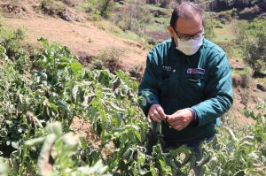
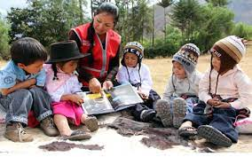

# **Tema N°1: *" Estudio sobre los principales indicadores en la predicción de enfermedades cardíacas (2020)"* **
{width="500"}

## Relevancia:
Nos parece de suma relevancia poder detectar los principales factores de riesgo que inciden en las enfermedades del corazón puesto que podrían ayudar a las personas a prevenir y mitigar posibles problemas de salud. Además, podrían generarse recomendaciones específicas para personas que se encuentran en posible riesgo de contraer alguna enfermedad de este tipo. 

## Factibilidad:
La base de datos pública para el tema fue sacada de una subsidiaria de Google LLC, es una comunidad en línea de científicos que recolectan diversos datos de gran cantidad de muestras de acuerdo a diferentes temas. La tabla de data a utilizar esta adjuntada como "Tema 3.csv".

URL: https://www.kaggle.com/datasets/kamilpytlak/personal-key-indicators-of-heart-disease

La información fue obtenida de un estudio anual del CDC de Estados Unidos, donde se recolectaron datos de 400 mil adultos sobre su estado de salud. Este estudio es del año 2020.

## Preguntas: 
* *¿Es el estudio de interés para la audiencia?*
  + El estudio es de sumo interés en el ámbito de la salud. El estudio de la data nos puede ofrecer información sobre las personas que presentan problemas cardiovasculares y los factores potenciales que pueden influir en generar alguno de estos. Nos parece que es muy interesante para todos aquellos que deseen cuidar su salud.
* *¿Qué información se desea aportar al final del estudio?*
  +  Al final del informe se quiere llegar a identificar una como ciertos indicadores personales pueden ser clave para prevenir las enfermedades cardiovasculares.
* *¿Es posible llegar a la información que se propone de manera específica y concreta?*
  + La data presenta la variable “Heart Disease”, la variable es de caracter booleanos (yes/no). Luego se una serie de variables como “Smoking”, “Sleep time”, entre otras, que podría ayudar a determinar un vínculo con los problemas cardíacos que sufren las personas entrevistadas.

## Variables:

| *Variable*        | *Descripción*                                          |        *Tipo*       |
|-------------------|:------------------------------------------------------:|--------------------:|
| Heart Disease     | ¿Tiene alguna enfermedad cardíaca?                     | Cualitativa Nominal |
| BMI               | Es el índice de masa corporal                          | Numérica Continua   |
| Smoking           | ¿Fuma?                                                 | Cualitativa Nominal |
| Alcohol Drinking  | ¿Bebe alcohol?                                         | Cualitativa Nominal |
| Stroke            | ¿Sufrió algún derrame cerebral?                        | Cualitativa Nominal |
| Physical Health   | Días con mala salud física en un intervalo de 30 días. | Numérica Discreta   |
| Mental Health     | Días con mala salud mental en un intervalo de 30 días. | Numérica Discreta   |
| Diff Walking      | Dificultad para subir escaleras o caminar.             | Cualitativa Nominal |
| Sex               | El sexo de la persona encuestada.                      | Cualitativa Nominal |
| Age Category      | Categoría de edad de catorces niveles.                 | Cualitativa Ordinal |
| Race              | Raza de la persona.                                    | Cualitativa Nominal |
| Diabetic          | ¿Sufre de diabetes?                                    | Cualitativa Nominal |
| Physical Activity | ¿Ha hecho alguna actividad física en el mes?           | Cualitativa Nominal |  
| Gen Health        | Diría usted que en general su salud es...              | Cualitativa Ordinal |
| Sleep Time        | Promedio de cantidad de horas que duerme por día.      | Numérica Continua   |
| Asthma            | ¿Sufre de asma?                                        | Cualitativa Nominal |
| Kidney Disease    | ¿Sufre de alguna enfermedad en los riñones?            | Cualitativa Nominal |
| Skin Cancer       | ¿Sufre de cáncer de piel?                              | Cualitativa Nominal |

# **Tema N°2: *" Estudio sobre la valorización de pérdidas por presencia de enfermedades y plagas  a nivel de región política en el Perú (2012-2015)"* **
{width='400'}

## Relevancia:
De acuerdo al informe anual 2019 del  Ministerio de Economía y Finanzas (MEF), la actividad agrícola representa el 6% del PBI del país. Sin embargo, un problema latente en esta actividad son las plagas, debido a que estas generan pérdidas económicas en la actividad. Por ello, es relevante tener en cuenta cuáles son las plagas que más pérdidas generan y al mismo tiempo ubicar los departamentos, así como, los tipos de cultivos que se ven más afectados económicamente por estas. 

## Factibilidad:
La base de datos a utilizar es pública obtenida de la “Plataforma Nacional de Datos Abiertos” del gobierno peruano, todas las tablas de data serán adjuntadas como "Tema 2_Tabla1.csv", "Tema 2_Tabla2.csv" y "Tema 2_Tabla3" respectivamente.

URL: https://www.datosabiertos.gob.pe/dataset/valorizaci%C3%B3n-de-p%C3%A9rdidas-por-presencia-de-enfermedades-nivel-de-regi%C3%B3n-pol%C3%ADtica-a%C3%B1os-2012

En dicha página la base de datos se encuentra con el nombre de “Valorización de pérdidas por presencia de enfermedades a nivel de región política: años 2012-2013-2014-2015”, según la página la última revisión de los datos fue el “Miér, 15/03/2017 por “Ministerio de Desarrollo Agrario y Riego - MIDAGRI”.

## Preguntas: 
* *¿Es el estudio de interés para la audiencia?*
  + El estudio es de interés para las regiones en donde la actividad agrícola es un pilar en sus respectivas economías. Con ello se podría hacer mejores presupuestos que consideren el combatir estas plagas. Esto también afecta a todas las personas ya que somos nosotros quiénes consumimos esos productos.
* *¿Qué información se desea aportar al final del estudio?*
  +  A grandes rasgos, se desea identificar cuales son las plagas que generan mayores pérdidas económicas, cuáles son los departamentos en donde se ha producido mayores pérdidas por plagas y cuales son los cultivos más afectados económicamente por estas. 
* *¿Es posible llegar a la información que se propone de manera específica y concreta?*
  + Se tienen tres bases de datos, en dónde se presentan las variables “Plagas”, “departamentos” y “Cultivos”; hay una variable “pérdidas por efecto de la plaga” que acompaña a cada una de las tres variables mencionadas anteriormente. Con estas variables y los datos proporcionados por la data, se podrá llegar a la información requerida.  

## Variables:

| *Variable*                      | *Descripción*                                                |        *Tipo*       |
|---------------------------------|:------------------------------------------------------------:|--------------------:|
| Nombre científico               | Nombre científico de la plaga.                               | Cualitativa nominal |
| Nombre común                    | Nombre común con el que se le conoce a la plaga.             | Cualitativa nominal |
| Taxonomía                       | Clasificación jerárquica a la que pertenece la plaga.        | Cualitativa nominal |
| Pérdidas por efecto de la plaga | Cantidad de dinero (en miles de soles) perdido por la plaga. | Numérica continua   |
| Departamento                    | Región geográfica del Perú afectada por la plaga.            | Cuantitativa nominal|
| Valor bruto de producción (VBP) | Es la suma total (en miles) de los valores de bienes y servicios producidos. | Numérica continua | 

# **Tema N°1: *"  Estudio de los Indicadores sobre la educación rural en el Perú (2018)"* **
{width="400"}

## Relevancia:

Bien sabemos que el Perú ocupa uno de los puestos más bajos en educación a nivel mundial, debido al mal sistema educativo que maneja el país, siendo esto más notorio en las zonas rurales del país, zona que está situada lejos de las principales ciudades. Por ese motivo, evaluar los indicadores de la educación rural es muy relevante para entender a qué se debe el mal desempeño del sistema educativo.

## Factibilidad:
  La base de datos pública para el tema será adjunto como “Tema1.csv”. Dicha base de datos es sacada de una página oficial del Perú (MINEDU).
  
URL: http://datos.minedu.gob.pe/dataset/indicadores-sobre-educaci%C3%B3n-rural
  
En la página la base de datos esta con el nombre de “Indicadores sobre educación rural 2018”, según la página la última revisión de los datos fue el “Lunes, 10/29/2018 - 12:52 p.m.”.

## Preguntas: 
* *¿Es el estudio de interés para la audiencia?*
  + El tema es de suma importancia para saber no solo el estado en que se encuentra la educación rural en el Perú, sino también para conocer la eficiencia del sistema educativo que se esta manejando en todo el país.
* *¿Qué información se desea aportar al final del estudio?*
  + La diferencia porcentual entre sectores rurales debido a la estratificación educativa. Además, se comprobará la siguiente hipótesis: “El nivel educativo de las escuelas disminuye mientras más alejados estén de la capital”.
* *¿Es posible llegar a la información que se propone de manera específica y concreta?*
  + Con las variables ya definidas es posible llegar a una conclusión de lo que se propone analizar ya que la base de datos con la que se va ha trabajar tiene información de cada departamento del Perú, y eso hace que el análisis sea más significativo.
  
## Variables:

| *Variable*        | *Descripción*                                          |        *Tipo*       |
|-------------------|:------------------------------------------------------:|--------------------:|
| D_DPTO            | Departamento                                           | Cualitativa Nominal |
| D_PROV            | Provincia                                              | Cualitativa Nominal |
| D_DIST            | Distrito                                               | Cualitativa Nominal |
| D_DREUGEL         | UGEL                                                   | Cualitativa Nominal |
| RURAL_PMM         | IIEE Primaria Multigrado Monolingüe.                   | Cualitativa Nominal |
| RURAL_PMM_MUJE1   | Estudiantes mujeres de PMM entre 6 y 11 años.          | Numérica Discreta   |
| RURAL_PMM_MUJE2   | Estudiantes mujeres de PMM entre 12 y 14 años.         | Numérica Discreta   |
| RURAL_PMM_HOME1   | Estudiantes hombres de PMM entre 6 y 11 años.          | Numérica Discreta   |
| RURAL_PMM_HOME2   | Estudiantes hombres de PMM entre 12 y 14 años.         | Numérica Discreta   |
| RURAL_PMMA_MUJE1  | Estudiantes mujeres de PMM entre 6 y 11 años con acompañamiento pedagógico.          | Numérica Discreta   |
| RURAL_PMMA_MUJE2  | Estudiantes mujeres de PMM entre 12 y 14 años con acompañamiento pedagógico.          | Numérica Discreta   |
| RURAL_PMMA_HOME1  | Estudiantes hombres de PMM entre 6 y 11 años con acompañamiento pedagógico.           | Numérica Discreta   |
| RURAL_PMMA_HOME2  | Estudiantes hombres de PMM entre 12 y 14 años con acompañamiento pedagógico.          | Numérica Discreta   |
| RURAL_PMM_MUJDOC  | Docentes mujeres de PMM.                               | Numérica Discreta   |
| RURAL_PMM_HOMDOC  | Docentes hombres de PMM.                               | Numérica Discreta   |
| RURAL_PMMA_MUJDOC | Docentes mujeres de PMM que reciben acompañamiento pedagógico                                | Numérica Discreta   |
| RURAL_PMMA_HOMDOC | Docentes hombres de PMM que reciben acompañamiento pedagógico                                | Numérica Discreta   |
| RURAL_CRFA        | IIEE Centro de Formación Rural en Alternativa.         | Numérica Discreta   |
| RURAL_SRE         | IIEE Secundaria con Residencia Estudiantil (SRE).      | Numérica Discreta   |
| RURAL_ST          | IIEE Secundaria Tutorial (ST).                         | Numérica Discreta   |
| RURAL_CRFA_MUJE1  | Estudiantes mujeres de CRFA entre 12 y 17 años.        | Numérica Discreta   |
| RURAL_CRFA_MUJE2  | Estudiantes mujeres de CRFA entre 18 y 20 años.        | Numérica Discreta   |
| RURAL_CRFA_HOME1  | Estudiantes hombres de CRFA entre 12 y 17 años.        | Numérica Discreta   |
| RURAL_CRFA_HOME2  | Estudiantes hombres de CRFA entre 18 y 20 años.        | Numérica Discreta   |
| RURAL_SRE_MUJE1   | Estudiantes mujeres de SRE entre 12 y 17 años.         | Numérica Discreta   |
| RURAL_SRE_MUJE2   | Estudiantes mujeres de SRE entre 18 y 20 años.         | Numérica Discreta   |
| RURAL_SRE_HOME1   | Estudiantes hombres de SRE entre 12 y 17 años.         | Numérica Discreta   |
| RURAL_SRE_HOME2   | Estudiantes hombres de SRE entre 18 y 20 años.         | Numérica Discreta   |
| RURAL_MSE_MUJDOC  | Docentes mujeres de modelos de servicio educativo: CRFA, SRE, ST. | Numérica Discreta |
| RURAL_MSE_MUJDOC  | Docentes hombres de modelos de servicio educativo: CRFA, SRE, ST. | Numérica Discreta |

