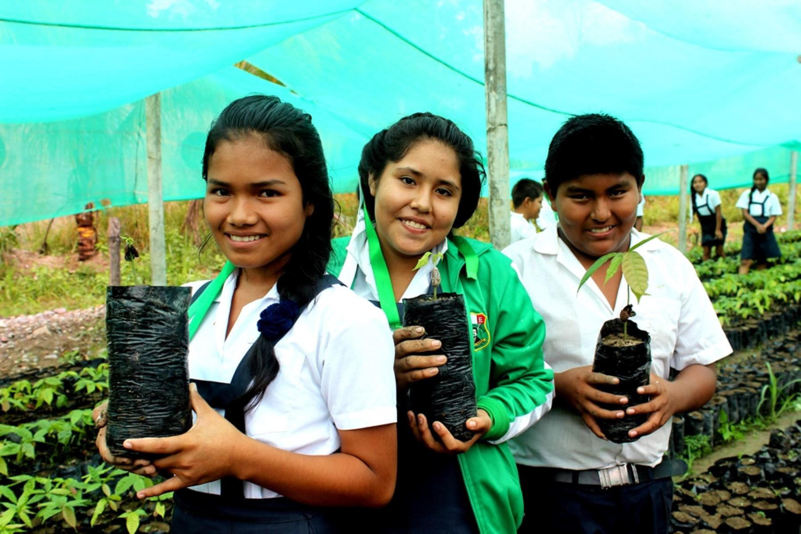
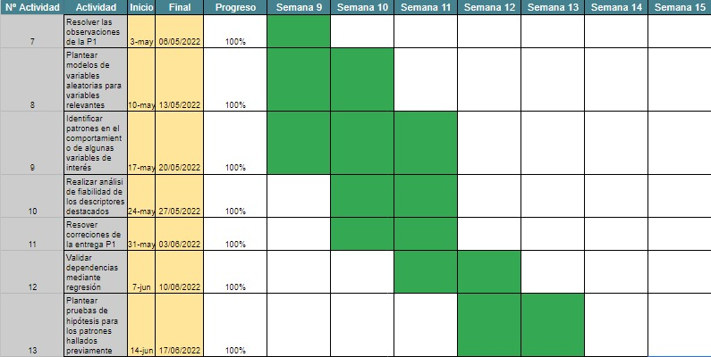
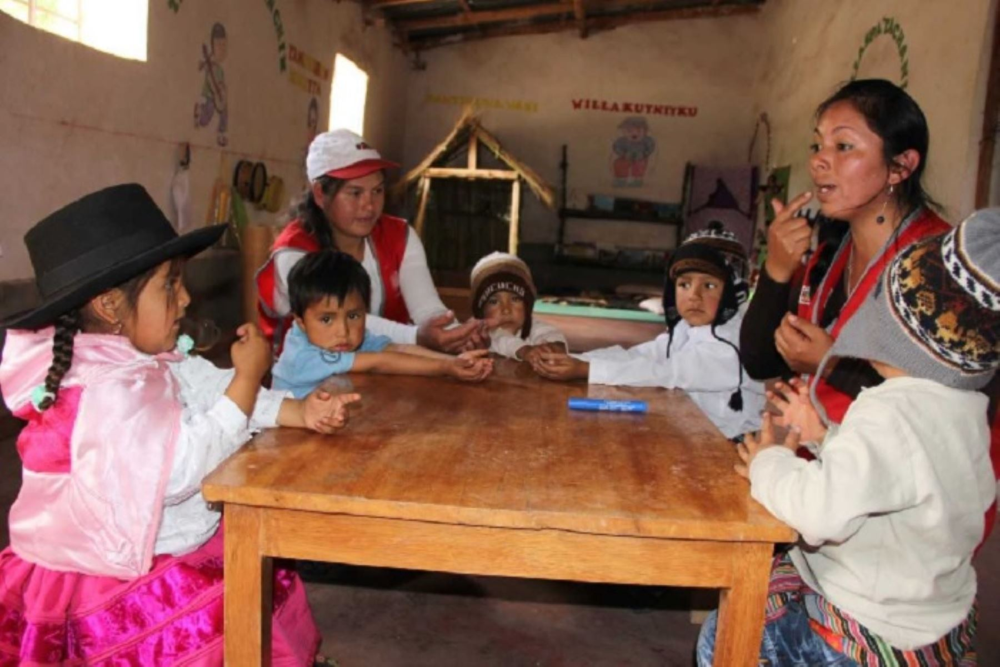
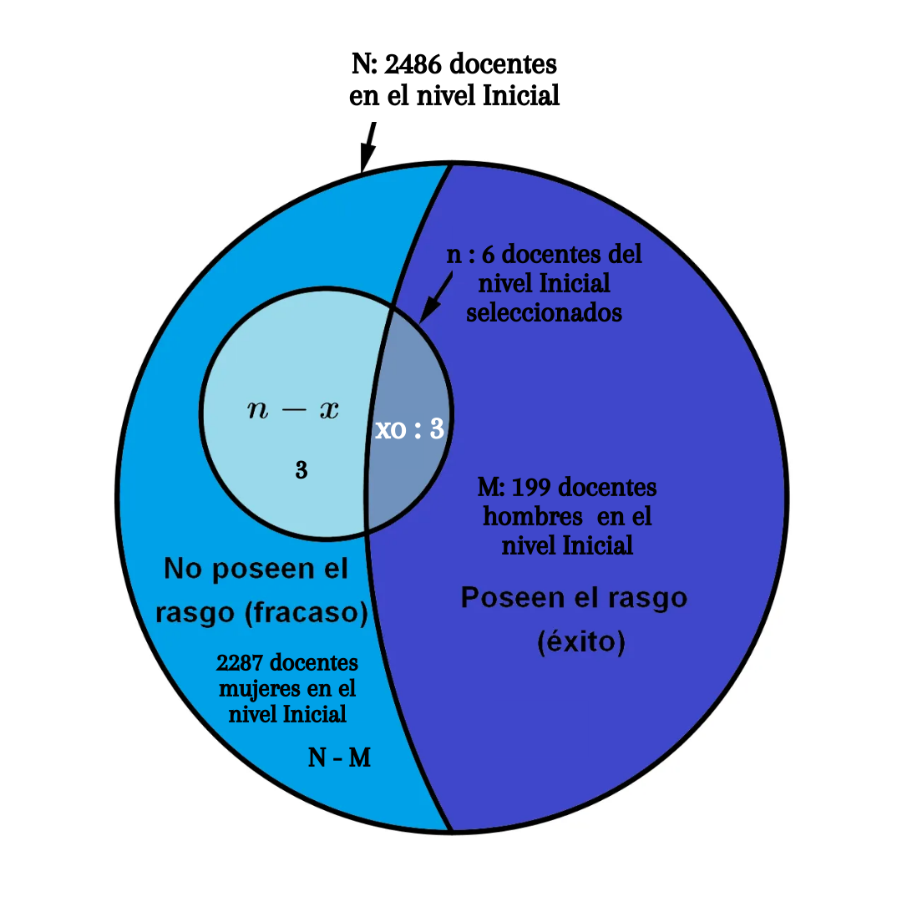

```{r setup, include=FALSE}
knitr::opts_chunk$set(echo = TRUE)
```

## Instalación de los paquetes
```{r}
#lista.paquetes <- c("readr", "dplyr","plyr","tidyverse", "ggthemes", "ggplot2", "scale")
#nuevos.paquetes <- lista.paquetes[!(lista.paquetes %in% installed.packages()[,"Package"])] 
#if(length(nuevos.paquetes)) install.packages(nuevos.paquetes)
#install.packages("modeest")
```

## Lectura de los paquetes

```{r,message=FALSE,results='hold'}
library(readr)
library(plyr)
library(dplyr)
library(tidyverse)
library(ggthemes)
library(ggplot2)
library(scales)
library("modeest")
```

# **INTRODUCCIÓN**  
## Relevancia  
La investigación sobre los logros ambientales de educación básica en el Perú permite un análisis profundo sobre la preocupación de los institutos acerca de la importancia de cuidar el medio ambiente, permitiendo que se puedan desarrollar mejores métodos de aprendizaje y asegurar un futuro con jóvenes más eco-amigables. Hallar estos datos estadísticos permitirá una mejor gestión del ministerio de educación.  
    

## Objetivos  

* Objetivo general:  
    + Interpretar los resultados de las instituciones educativas de cada región del Perú participantes de la evaluación de logros ambientales en el año 2016-2017 realizada por el Sistema de Monitoreo de la Calidad Educativa (SIMON) - MINEDU.  
    
* Objetivos secundarios:  
    + Identificar a las instituciones que demuestren ser escuelas seguras y promotoras de buenas prácticas que contribuyan a la sostenibilidad ambiental.  
    + Difundir la información a través de diagramas que sean fáciles de comprender e interpretar.  

## Planificación
Creamos un diagrama Gantt, que nos permitirá ver el avance de cada entrega que se hará en el ciclo cada uno con su fecha respectiva y grado de complejidad.   

```{r}
#create data frame
data <- data.frame(name = c('Sebastian', 'Milene', 'Lino', 'Andres'), 
start = c(1, 5, 10, 15),
end = c(5, 10, 15, 20),
Activities = c('Relevancia y Variables', 'Proceso de recolección y limpieza de datos', 'Planificación', 'Poblacion, muestra y muestreo')
)

p<- ggplot(data, aes(x=start, xend=end, y=name, yend=name, color=Activities)) + theme_bw()+ geom_segment(size=7) + labs(title='PLANIFICACIÓN', x='Tiempo', y='Integrantes') + scale_colour_manual(values = c('pink','aquamarine', 'black','blue')) + theme_wsj() + theme(axis.title = element_text())
```

# **DATOS**  
## Proceso de recolección de datos   
Una base de datos fidedigna es esencial para garantizar la calidad e integridad del estudio. Para nuestro tema “Logros ambientales en instituciones de educación básica a nivel nacional del año 2017 ” se utilizó una base de datos pública del Repositorio de Datos del Ministerio de Educación. Los datos se encuentran libres para ser utilizados por cualquier persona para promover su difusión y garantizar la transparencia pública. [[Link del Repositorio de MINEDU]](http://datos.minedu.gob.pe/dataset/educación-ambiental )  

## Población, muestra y muestreo  

### Parámetros  

Título: *Determinar los logros ambientales obtenidos por parte de los institutos de educación básica en el Perú en el 2017.*  

Población: *Instituciones de educación básica en el Perú.*  

Muestra: *Instituciones de educación básica del Perú que obtuvieron logros ambientales en el 2017.*   

Unidad muestral: *Instituto de educación básica que obtuvo algún logro ambiental en el 2017.*  

### Tamaño de la muestra:  
```{r}
df <- read.csv("Resultados de la Matriz de Logros Ambientales en instituciones de educación básica 2017.csv") 
dim(df)
```

El tamaño de la muestra es de 20487 instituciones de educación básica en todo el Perú.  

*Explicación:*  
El estudio sobre los datos obtenidos se hizo a través de una encuesta que tomo como muestra a todas las instituciones educativas del Perú que decidieron participar en la matriz por los logros ambientales en el 2017 (20487), la cual se evalúo acorde a las regiones del país a través de un Muestreo aleatorio por conglomerados, de esa manera se podía recolectar la información de cada Instituto Educativo de una forma eficiente y regulada, por lo que se puede afirmar que la información de la base de datos es válida y fiable.  

## Limpieza de datos   

Previo al análisis de data es necesario realizar una limpieza y organización de datos ya que,al no tenerse en consideración puede desencadenar muchos problemas al momento de trabajar con los datos y, más aun si se quiere desarrollar un modelo estadístico.    
Comenzaremos instalando los paquetes y librerías que sean necesarios para la limpieza y lectura del base de datos.   

1. Ahora con el comando `read.csv` leeremos el archivo "Resultados de la Matriz de Logros Ambientales en instituciones de educación básica 2017" que llamaremos **df**.   
```{r}
df<-read.csv("Resultados de la Matriz de Logros Ambientales en instituciones de educación básica 2017.csv")
```
                 
2. Crearemos una nueva base de datos con las variables seleccionadas: 
```{r}
df1<-dplyr::select(df,CODA,IIEE,UGEL,DEPARTAMENTO,PROVINCIA,DISTRITO,NIVEL,GESTION,AREA,EST_H,EST_M,DOC_H,DOC_M,MLA.2016,PUNTAJE.2016,RESP)
```

## Variables   
  |**DESCRIPCIÓN DE VARIABLES**| |   
  |-|-|  
  |CODA|Representa el código de identificación de la institución educativa. Está compuesta por el código modular + anexo|     
  |IIEE|Nombre de la Institución Educativa|  
  |UGEL|Nombre de la Unidad de Gestión de Educación Local (UGEL) que supervisa la institución educativa|  
  |DEPARTAMENTO|Nombre del Departamento donde se ubica la institución educativa|  
  |PROVINCIA|Nombre de la Provincia donde se ubica la institución educativa|  
  |NIVEL|Nivel y modalidad que ofrece la Institución Educativa|  
  |GESTION|Tipo de Gestión del servicio educativo|
  |ÁREA|Área geográfica donde está ubicada la Institución educativa|
  |EST_H|Total de estudiantes hombres|
  |EST_M|Total de estudiantes mujeres|
  |DOC_H|Total de docentes hombres|
  |DOC_M|Total de docentes mujeres|  
  |MLA.2016|Indica si la institución educativa participó en la Matriz de Logros Ambientales - MLA en el año 2016|
  |PUNTAJE.2016|Puntaje obtenido en la MLA 2016|  
  |PUNTAJE.2017|Puntaje obtenido en la MLA 2017|     
  
3. Analizando las variables hay algunos cambios que realizar:     
  + `ï..CODA`: renombrar para que se mas fácil de encontrar y cambiar el tipo de variable de numérico a categórico ya que se trata de un código de identificación.    
  + `NIVEL`: Corregir los valores de la variables.  
  + `GESTION`: Corregir los valores de la variables.  
  + `PUNTAJE.2016`: Esta variable es reconocida como *char* por R. Sin embargo, para el estudio donde será necesario calcular la media, mediana y demás descriptores requerimos convertir la variable en numérico *int* (eliminando el %)  
  + `RESP`: Esta variable es reconocida como *char* por R. Similar al caso de la variable `PUNTAJE.2016` se necesita hacer un cambio de variable a una de tipo numérica. También se cambiara el nombre de variable a `PUNTAJE.2017`.      
```{r,message=FALSE,results='hold'}
#Creamos una base de datos df2 para no "golpear" la base original
df2=df1 
df2[df2=="Básica Alternativa"]<-"Basica Alternativa"
df2[df2=="Básica Especial"]<-"Basica Especial"
df2[df2=="Pública"]<-"Publica"
#Creamos una nueva base de datos "df3"
df2<-rename(df2,CODA=CODA,PUNTAJE.2017=RESP)
df2$PUNTAJE.2016<- as.numeric(sub("%","",as.character(df2$PUNTAJE.2016)))
df2$PUNTAJE.2017<- as.numeric(sub("%","",as.character(df2$PUNTAJE.2017)))
df2$CODA<-as.character(df2$CODA)
```      
                        
4. De la nueva base de datos **df2** revisaremos las variables numéricas y analizar si algún valor debe ser eliminado de la base de datos:    
```{r,message=FALSE,results='hold'}
tabEstH<-table(df2$EST_H)
tabEstM<-(df2$EST_M)
tabDocH<-(df2$DOC_H)
tabDocM<-table(df2$DOC_M)
```
  + Se eliminara los valores -5 y -1 presentes en la variable `DOC_H`  
  + Ademas, de las instituciones que tengan 0 estudiantes (hombres y mujeres) y 0 docentes (hombres y mujeres)          
```{r,message=FALSE,results='hold'}
#Creamos una nueva base de datos DF
df3<-filter(df2, df2$DOC_H!=-5,df2$DOC_H!=-1)
#Cambiar las NA's por 0
df3$EST_H[is.na(df3$EST_H)] <- 0
df3$EST_M[is.na(df3$EST_M)] <- 0
df3$DOC_H[is.na(df3$DOC_H)] <- 0
df3$DOC_M[is.na(df3$DOC_M)] <- 0
#Eliminamos los casos 0 estudiantes y a su vez 0 docentes
df4<-filter(df3, !(df3$EST_H==0 & df3$EST_M==0 & df3$DOC_H==0 & df3$DOC_M==0))
```


5. Por último, corroboraremos que los puntaje obtenidos en ambas evaluaciones se encuentren dentro del rango desde 0 a 100 mediante el comando `summary`.   
```{r}
summary(df4$PUNTAJE.2016)
summary(df4$PUNTAJE.2017)
```
Se puede observar algunos valor atípicos que eliminaremos de nuestra base de datos final puesto que sesgaría nuestro análisis.
```{r}
DF<-filter(df4, (df4$PUNTAJE.2016<=100 & df4$PUNTAJE.2016>=0) | is.na(df4$PUNTAJE.2016) )
```

## Base de datos del trabajo de investigación
  + Nuestra nueva base de trabajo es `DF` con 14334 observaciones y 16 variables:   
```{r,message=FALSE,results='hold'}
#DF
```


# **ANÁLISIS DESCRIPTIVO**   

## **Análisis de variables**   

### Estudiantes:   
Las siguientes variables importantes son “EST_H” y “EST_M”, estos representan la cantidad de alumnos hombres y mujeres, por lo que un análisis posterior podría determinar si el sexo de los estudiantes puede estar relacionado a los logros ambientales que consigue la IE. 
Con los datos recopilados se puede ver que el mínimo de estudiantes que tienen ambos grupos es 0, esto es porque en esa institución en particular es solo para determinado sexo, además que las medianas son similares, teniendo que la mediana de los estudiantes hombres por institución es de 23, mientras que para las mujeres es 22. Además, el promedio de estudiantes hombres es 65.73, que redondeando seria 66 y para las estudiantes sería de 65.75, que redondeando es 66. Por último, el máximo número de alumnos hombres es de 2453, mientras el máximo de estudiantes mujeres es de 2307.

```{r}
summary(DF$EST_H)
summary(DF$EST_M)
```
### Docentes: 
Adicionalmente, se tienen las variables “DOC_H” y “DOC_M”, la cual representa la cantidad de docentes hombres y mujeres, estas variables pueden permitir el análisis de si existe alguna relación con los sexos de los profesores y los logros ambientales que consigue la IE. 
Con los datos recopilados se puede encontrar que el mínimo de docentes hombres y mujeres es 0, del mismo modo, demostrando que en esa institución solo hay de un sexo en particular, por otro lado, el máximo de hombres docentes es de 10167, mientras que de mujeres es de 245. Para la mediana se tiene que para el caso de hombres docentes es 1 y para el caso de mujeres docentes es 2, para el promedio es 4.099, redondeando es 4, y el siguiente promedio es 5.109, redondeando es 5, los promedios son respectivos a hombres docentes y mujeres docentes. 

```{r}
summary(DF$DOC_H)
summary(DF$DOC_M)
```
### MLA.2016  
La siguiente variable que analizar es “MLA.2016”, el cual determina que IE son las que participaron en el año 2016 en la matriz de logros ambientales, esta variable es importante porque permite una comparación directa de las IE que participaron, ya que se puede comparar si estas mejoraron sus logros ambientales después de haber tenido una experiencia previa y como esta experiencia los distingue de las demás IE. 

```{r}
table(DF$MLA.2016)
participoNo <- filter(DF,MLA.2016 == "NO")
participoSi <- filter(DF,MLA.2016 == "SI")
cantparticipoNo<-nrow(participoNo)  
cantparticipoSi <-nrow(participoSi)
total<-nrow(DF) #cantidad de total institutos
p_cantparticipoNo<-round(cantparticipoNo/total*100,2)
p_cantparticipoSi<-round(cantparticipoSi/total*100,2)
plotData <- c(p_cantparticipoNo, p_cantparticipoSi)
decisionParticipacion <- c("No", "Si")
tipo_gestion <- c("Privada", "Publica")
dfParticipacion <- data.frame(Participo = decisionParticipacion, porcentaje=plotData)

ggplot(dfParticipacion,aes(x="",y=porcentaje, fill=Participo) ) +    #11
  ggtitle("Porcentajes IE participes de logros ambientales 2016 ") + 
  geom_bar(width = 0.9, stat="identity",              #12
           position = position_dodge()                #13
           )+  
  
  ylim(c(0,100))+
  labs(x="Participación de la IE", y= "porcentaje") +   
  labs(fill = tipo_gestion)+                                         #14
  
  geom_text(aes(label=porcentaje), vjust=1.6, color="black",    #15
              position = position_dodge(0.9),  size=4.0
            ) +                                            
  
  theme_bw(base_size = 15)
```


### Departamentos    
Asimismo, la siguiente variable categórica a evaluar es el "Departamento". Esta variable comprende todos los departamentos que participaron en el estudio para poder identificar a aquellas regiones que mantienen una activo plan de trabajo académico.
```{r,message=FALSE,results='hold'}
#summary(DF)
#table(DF$DEPARTAMENTO)
#plot(table(DF$DEPARTAMENTO))
#length(DF$DEPARTAMENTO)

convertir<-function(lista){
  datos<-c()
  for (i in 1:length(lista)){datos[i]=lista[i]}
  return(datos)}
valores<-convertir(table(DF$DEPARTAMENTO))

valoresdepa<-round((valores/length(DF$DEPARTAMENTO)*100),2)
nombresdepa<-c("AMAZONAS","ANCASH","APURÍMAC","AREQUIPA","AYACUCHO","CAJAMARCA","CALLAO","CUSCO","HUANCAVELICA","HUANÚCO",
           "ICA","JUNÍN","LA LIBERTAD","LAMBAYEQUE","LIMA", "LORETO","MADRE DE DIOS","MOQUEGUA","PASCO","PIURA","PUNO","SAN MARTÍN","TACNA","TUMBES","UCAYALI")
datosdepa<- data.frame("Departamentos"=nombresdepa,"Porcentajes"=valoresdepa)
datosdepa

ggplot(datosdepa,aes(x="",y=valoresdepa, fill=nombresdepa)) + 
  geom_bar(width = 1, stat="identity", position = position_dodge())+
  ylim(c(0,max(valoresdepa)))+labs(x="Departamento", y= "Porcentaje (%)") + labs(fill = "Departamentos")+
  geom_text(aes(label=Departamentos), vjust=1.5, color="black", position = position_dodge(1),  size=2.5) + theme_bw(base_size = 7)

```

Los resultados mostrados detallan la participación en porcentajes de los departamentos del país, donde tenemos como mayor participante a la región de Lambayeque que tiene una participación de 11.46%, seguido de los departamentos de Cajamarca (9.99%), Piura (7.96%), Huancavelica (7.00%), en contraste con estas regiones se encuentran las regiones de Callao (1.04%) y Madre de Dios (0.1%). Como interpretación de estos resultados podemos inferir que las regiones  más alejadas son las que tienen menor participación y esto pueda deberse a la falta de recurso con las que cuentan y la poca atención de parte del Estado para establecer normas o direccionamiento de fondos sociales. 

# **DESCRIPTORES GRÁFICOS:**  

## **Gráficos de barras**  

### Porcentaje de las instituciones presentes en áreas urbanas y rurales        
Se tiene la variable “ÁREA” la cual define que institutos educativos pertenecen a un área rural o urbana. Este gráfico permite visualizar la cantidad de instituciones educativas (representadas en porcentaje %) participes de los logros ambientales.(CREER, 2018)

```{r,message=FALSE,results='hold'}
tabla_area <- table(DF$AREA)
intitucion_urbana <- filter(DF,AREA == "Urbana")
intitucion_rural <- filter(DF,AREA == "Rural")
tabla_area
cantinsturb<-nrow(intitucion_urbana)  
cantinstpriv <-nrow(intitucion_rural)
tipo_gestion <- c("Privada", "Publica")
total<-nrow(DF) #cantidad total de datos 
p_cantinsturb<-round(cantinsturb/total*100,2)
p_cantinstpriv<-round(cantinstpriv/total*100,2)
plotData <- c(p_cantinsturb, p_cantinstpriv)
tipo_area <- c("Urbana", "Rural")
dfArea <- data.frame(categoria = tipo_area, porcentaje=plotData)

ggplot(dfArea,aes(x="",y=porcentaje, fill=categoria) ) +    #11
  ggtitle("Porcentajes IE por área") + 
  geom_bar(width = 0.9, stat="identity",              #12
           position = position_dodge()                #13
           )+  
  
  ylim(c(0,100))+
  labs(x="Área de la IE", y= "Porcentaje") +   
  labs(fill = "Tipo de área")+
                                         #14
  
  geom_text(aes(label=porcentaje), vjust=1.6, color="black",    #15
              position = position_dodge(0.9),  size=4.0
            ) +                                            
  
  theme_bw(base_size = 15 )
```
* Interpretación:   
    + La cantidad de instituciones presentes en áreas **rurales** es de 7427 establecimientos educativos, los cuales representan **51.96%** del total.  Esta cifra es ligeramente mayor a las 6867 instituciones localizadas en zonas urbanas, las cuales representan **48.04%** del total.  
    + Se puede percibir como avanzo el acceso a la educación en zonas rurales, lo cual es importante de hacer notar ya que el 20.8% de la población del Perú vive en el área Rural (CREER,2018).
    + Sin embargo, el aumento de esta cifra no significa una mejora en la calidad de enseñanza ni un ambiente adecuado de desarrollo. “Lo que indica esto es lo atomizado que está el servicio en la zona rural. Esto es por el difícil acceso que tenemos y la falta de condiciones para que los profesores puedan llegar, que la infraestructura sea apropiada. Son esos los factores que desde el Minedu se tienen que trabajar para crear las condiciones y que los mejores vayan a zonas rurales (Comercio,2019).
    

### Porcentanje de instituaciones privadas y públicas presentes en zonas urbanas y rurales:   
Realizaremos una gráfica de barras **apiladas** mediante el comando `barplot` relacionando las variables `GESTION` y `AREA`.  
```{r}
table(DF$GESTION, DF$AREA)
```
||Rural|Urbano|  
|-|-|-|  
|Privada|16|1019|  
|Pública|7411|5848|  
```{r,message=FALSE,results='hold'}
priv_en_urbana<-round(1019*100/(6867),2)
priv_en_urbana
priv_en_rural<-round(16*100/(7427),2)
priv_en_rural
```
Gráfico de barras apiladas para las variables `GESTION` y `AREA`  
```{r}
table(DF$AREA,DF$GESTION)

tabgestionyarea<-table(DF$GESTION, DF$AREA)
barplot(tabgestionyarea,main="Porcentaje de IE públicas y privadas por área", font= 3,col=c("#F6766D","#00BDC2"),xlab="Tipo de Gestión",axes = FALSE)
legend(x="topright",legend=c("Privada","Pública"),fill = c("#F6766D","#00BDC2"),title="Leyenda")
```
* Interpretación:  
    + Se puede apreciar una diferencia muy marcada entre de cantidad de instituciones privadas presentes en áreas urbanas en comparación a la zonas rurales.  
    + La instituciones privadas en zonas urbanas representan **14.84%** del total.  
    + A diferencia de las instituciones privadas presente en zonas rurales **0.22%**.  
    + Las instituciones educativas privadas tienen como objetivo brindar servicios educativos solventándose por los padres o tutores de los alumnos, pagando una cuota mensual y eventualmente una matrícula que se paga a comienzo de año. El motivo por el  cual no hay muchas instituciones educativas privadas en zonas rurales, es porque en esas zonas la mayoría de padres no cuentan con la capacidad económica de poder darle una educación en un colegio privado a sus hijos. Es por eso que las instituciones privadas no ven conveniente invertir en dichas zonas.
    
## **Mosaicos**  

```{r}
col = c("#F6766D","#00BDC2")
tableMosaico1 <- table(DF$DEPARTAMENTO, DF$NIVEL)
tableMosaico2 <- table(DF$AREA, DF$NIVEL)
tableMosaico3 <- table(DF$GESTION, DF$NIVEL)
tableMosaico4 <- table(DF$MLA.2016, DF$AREA)
#tableMosaico1
#tableMosaico2
#tableMosaico3
#tableMosaico4
mosaicplot(tableMosaico1, color=col, las = 2, off = 10000, main="Mosaico de variable departamento y nivel", xlab="Departamento", ylab = "Nivel")
mosaicplot(tableMosaico2, color=col, las = 2, off = 25, main="Mosaico de variable área y nivel", xlab="Área", ylab = "Nivel")
mosaicplot(tableMosaico3, color=col, las = 2, off = 25, main="Mosaico de variable gestión y nivel", xlab="Gestión", ylab = "Nivel")
mosaicplot(tableMosaico4, color=col, main="Mosaico de variable participación 2016 y área", xlab="Participación 2016", ylab = "Área")
```

Con relación a la gráfica de mosaico de las variables departamento y nivel, se puede determinar que de manera general, el nivel promedio de las instituciones son primaria, siendo excepciones el callao, madre de dios y tacna, que su nivel está centrado en el inicial y también lima que su nivel primaria tiene una participación equivalente a los de su nivel secundaria e inicial. Adicionalmente, se puede recalcar que Lima posee mayor participación dentro de la matriz de logros ambientales, siendo el segundo cajamarca. Finalmente algo que detallar, es que dentro de todos los departamentos, las instituciones educativas que tienen menor participación son las que se componen por el nivel básica alternativa y básica especial.

Analizando la gráfica de mosaico sobre las variables nivel y área, se puede destacar que tanto las educaciones educativas ubicadas en un área rural como las ubicadas en un área urbana presentan una participación equivalente, sin embargo, la mayor cantidad de instituciones educativas dentro de un área rural, en su mayoría son de nivel primaria, mientras que las que son de un área urbana, tanto el nivel de primaria, inicial y secundaria tienen un porcentaje equivalente de participación. 

A partir de la gráfica de mosaico que relaciona la gestión y el nivel de las instituciones educativas, se puede detallar que gran parte de las instituciones que participan dentro de la matriz de logros ambientales son de gestión pública centrada mayormente en el nivel de educación primaria, por el otro lado, el nivel que tiene más representación en las instituciones educativas privadas son los de nivel secundaria.

Teniendo la gráfica de mosaico que relaciona las instituciones educativas que participaron en el 2016 en la matriz de logros ambientales y el área donde se ubica dichas instituciones instituciones, se puede reconocer que más de la mitad de las instituciones que participaron en el 2017 no lo hicieron en el 2016 y que mayormente los que no participaron en el 2016 vienen de un área rural. 


## **Boxplots y medidas de posición**  
El diagrama de cajas o boxplot nos permiten comparar la distribución y visualizarla tendencia central de valores numéricos mediante sus cuartiles (mínimo, primer cuartil, mediana, tercer cuartil y máximo)

### Comparación de los puntajes de los logros ambientales 2017 y 2016   
En este apartado las variables a analizar son `PUNTAJE.2016` y `PUNTAJE.2017`, la cual como su nombre mencionan es la nota que tuvieron las IE en esos respectivos años acorde a los logros ambientales que consiguieron, estas variables generan una comparación directa, ya que se puede analizar si va habiendo una evolución de los logros ambientales por año. 
Con el boxplot se puede determinar que:
- Hay mayor cantidad de datos atípicos en el año 2017.
- Ambos comparten que la mayoría de sus datos atípicos se encuentran en el extremo inferior. 
- El año 2016 presenta un mayor rango de notas tanto en su extremo inferior como superior. 
- El extremo superior del año 2017 es muy cercano al cuartil superior
- El extremo inferior del año 2017 es más cercano a su cuartil inferior a comparación del extremo inferior del año 2016

Además, la mediana de los puntajes del 2017 es mayor a la del 2016, sin embargo para mayor detalle se usa `summary` para encontrar los valores exactos. Exactamente la mediana del puntaje del año 2016 es 69.64 y la mediana del puntaje del año 2017 es 76.00, con esto se muestra que se tiene un aumento de **8.37%** para el año 2017. 

```{r,message=FALSE,results='hold'}
summary(DF$PUNTAJE.2016)#puntaje en el año 2016
summary(DF$PUNTAJE.2017)#puntaje en el año 2017
p2016 <- DF$PUNTAJE.2016
p2017 <- DF$PUNTAJE.2017
round(var(p2016,na.rm=T),2)#varianza 2016
round(sd(p2016,na.rm=T),2)#desviación estándar 2016
round(var(p2017,na.rm=T),2)#varianza 2017
round(sd(p2017,na.rm=T),2)#desviación estándar 2017
```
1. **DESCRIPTORES NUMÉRICOS DE POSICIÓN: PARA LOS PUNTAJES EN LOS LOGROS AMBIENTALES 2016**   
    * Puntajes del año 2016  
        + `Media o Promedio`: El puntaje promedio del evaluación de logros ambientales que obtuvieron las instituciones educativa en el año 2016 fue de **65.09** puntos. Este no es un valor representativo de la muestra, ya que la media se ve influenciada por los valores extremos.  
        + `Mediana`: La mediana de los puntajes obtenidos en el año 2016 fue **69.64** puntos. Lo cual representa que al menos el 50% de instituciones evaluadas en el año 2016 obtuvieron un puntaje como mínimo de 65.09 puntos, es decir, que **2166 instituciones de un total de 4333 centros educativos presentes en la evaluación del año 2016 lograron un puntaje "aceptable"** (mayor a 50 puntos).       
        + `Moda`: El puntaje con mayor frecuencia fue de **75** puntos, es decir, 163 instituciones educativa obtuvieron ese puntaje.  
        + `Rango`: Es el  intervalo entre el valor máximo y mínimo, el cual representa el máximo observado de variación de datos. El rango para el puntaje en el año 2016 es **100**.   
        + `Rango Intercuartil`:Es el  intervalo entre el cuartil 1 y 3, el cual mide la dispersión de un conjunto de datos. El rango intercuartil para el puntaje obtenido en el año 2016 es **53.33**.   
        + `Varianza`: La varianza es una medida de dispersión y representa la variabilidad de un conjunto de datos respecto a su media (cuantifica los errores). La varianza del puntajes obtenidos por las instituciones educativas en el año 2016 es **570.9** puntos^2.  
        + `Desviación estándar`: Una desviación estándar baja indica que la mayor parte de los datos de una muestra tienden a estar agrupados cerca de su media, mientras que una desviación estándar alta indica que los datos se extienden sobre un rango más amplio.Para el puntaje obtenido en el año 2016 la desviación estándar es **23.89**.
        + Gráfica de la moda:  
```{r}
p2016 <- DF$PUNTAJE.2016
#names(which.max(table(p2016))) #puntaje que mas se repitió
barplot(table(p2016), col = c(rep("gray",186),2,rep("gray",600)),main="Moda del puntaje de la matriz de logros ambientales 2016",xlab="PUNTAJES", ylab = "FRECUENCIA")
legend("topright", "Moda", fill = 2)
```    


2. **DESCRIPTORES NUMÉRICOS DE POSICIÓN: PARA LOS PUNTAJES EN LOS LOGROS AMBIENTALES 2017**   
    * Puntajes del año 2017  
        + `Media o Promedio`:  El puntaje promedio del evaluación de logros ambientales que obtuvieron las instituciones educativa en el año 2017 fue de **72.64** puntos. Este no es un valor representativo de la muestra, ya que la media se ve influenciada por los valores extremo por el contrario, la mediana es una aproximación al conjunto de datos.  
        + `Mediana`: La mediana de los puntajes obtenidos en el año 2017 fue **76.00** puntos. Lo cual representa que al menos el 50% de instituciones evaluadas en el año 2016 obtuvieron un puntaje como mínimo de 76 puntos, es decir, que **7147 instituciones de un total de 14294 centros educativos presentes en la evaluación del año 2017 lograron un puntaje "aceptable"** (mayor a 50 puntos). Dicho puntaje fue superior al de la evaluación anterior logros 2016.      
        + `Moda`: El puntaje con mayor frecuencia fue de **100** puntos, donde 1039 instituciones educativa obtuvieron un puntaje excelente, mostrando una mejora significativa en las evaluaciones de logros ambientales.
        + `Rango`: Es el  intervalo entre el valor máximo y mínimo, el cual representa el máximo observado de variación de datos. El rango para el puntaje en el año 2016 es **100**.  
        + `Rango Intercuartil`: Es el  intervalo entre el cuartil 1 y 3, el cual mide la dispersión de un conjunto de datos. El rango intercuartil para el puntaje obtenido en el año 2017 es **29.63**. Dicho rango es mucho menor al RI del 2016, con lo cual se puede inferir que los puntajes son más próximos a la mediana y su representatividad es mayor comparada con la del año 2016.  
        + ``Varianza`: La varianza es una medida de dispersión y representa la variabilidad de un conjunto de datos respecto a su media (cuantifica los errores). La varianza del puntajes obtenidos por las instituciones educativas en el año 2017 es **455.51** puntos^2.    
        + `Desviación estándar`: Una desviación estándar baja indica que la mayor parte de los datos de una muestra tienden a estar agrupados cerca de su media, mientras que una desviación estándar alta indica que los datos se extienden sobre un rango más amplio.Para el puntaje obtenido en el año 2017 la desviación estándar es **21.34**.  
        
```{r}
p2017 <- DF$PUNTAJE.2017
names(which.max(table(p2017))) #puntaje que mas se repitió
```


3. Representación de los **descriptores numéricos de posición** mediante un diagrama de cajas     
```{r}
boxplot(DF$PUNTAJE.2017, DF$PUNTAJE.2016, 
        horizontal = TRUE,
        lwd = 2, 
        col = c("#F6766D","#00BDC2"),   
        ylab = "Año de evaluación",  
        main = "Comparación de los puntajes de los logros ambientales 2017 y 2016",
        notch = TRUE, 
        border = "black",  
        outpch = 25,       
        outbg = "green",   
        whiskcol = "blue", 
        whisklty = 2,     
        lty = 1) 
legend(x="topright",legend=c("2017","2016"),fill = c("#F6766D","#00BDC2"),title="Leyenda")
```

## **Histogramas**    
Creamos la tabla de estudiantes hombres y mujeres por departamentos
```{r}
alumnos <- select(DF, EST_H, EST_M)
T_alumnos <- mutate(alumnos, EST_T = EST_H+EST_M)
#T_alumnos
```


1. **DESCRIPTORES NUMÉRICOS DE POSICIÓN: PARA LOS ESTUDIANTES EN TOTAL**   
Hallamos los descriptores de posición de los estudiantes de todas las instituciones.
```{r,message=FALSE,results='hold'}
#summary(T_alumnos)
mlv(T_alumnos$EST_T, method = "mfv")
var(T_alumnos$EST_T)
sd(T_alumnos$EST_T)
```
* Estudiantes en total por institución  
        + `Media o Promedio`: En promedio la cantidad de estudiantes en las instituciones educativas  fue de **131.5** alumnos. Este no es un valor representativo de la muestra, ya que la media se ve influenciada por los valores extremos.  
        + `Mediana`: La mediana de la cantidad de estudiantes fue de **47** . Lo cual representa que al menos hay 50% de instituciones que cuentan con menos de 47 alumnos.    
        + `Moda`: La cantidad de estudiantes que hubo más repeticiones en las instituciones fueron de **10** individuos.
        + `Rango`: Es el  intervalo entre el valor máximo y mínimo, el cual representa el máximo observado de variación de datos. El rango para la cantidad de estudiantes por institución va desde **0** hasta **3000**.  
        + `Rango Intercuartil`:Es el  intervalo entre el cuartil 1 y 3, el cual mide la dispersión de un conjunto de datos. El rango intercuartil para la cantidad de alumnos en total es **114**.   
        + `Varianza`: La varianza es una medida de dispersión y representa la variabilidad de un conjunto de datos respecto a su media (cuantifica los errores). La varianza en este caso es elevada **53955.07**.  
        + `Desviación estándar`: Una desviación estándar baja indica que la mayor parte de los datos de una muestra tienden a estar agrupados cerca de su media, mientras que una desviación estándar alta indica que los datos se extienden sobre un rango más amplio. Para la cantidad de estudiantes en total por institución la desviación estándar es **232.28**, la cual es bastante alta.
        
Nos podemos dar cuenta que esto se justifica porque la cantidad de alumnos en las instituciones educativas es muy diferente ya que hay varias que son pequeñas y pocas que son grandes. Algunas de estas instituciones son solo de mujeres y hombres, por ello alguno de los valore puede tomar valores de 0 en la gráfica cuando son de un solo sexo.
```{r}
hist(T_alumnos$EST_H, main = "Estudiantes hombres en total por institución", 
     ylab = "Frecuencia", 
     xlab = "Cantidad", 
     col =  c(rep("gray",0),"#00BDC2",rep("gray",600)),
     xlim = range(0, 500), 
     breaks = 500)
```
```{r}
hist(T_alumnos$EST_M, main = "Estudiantes mujeres en total por institución", 
     ylab = "Frecuencia", 
     xlab = "Cantidad", 
     col =  c(rep("gray",0),"#00BDC2",rep("gray",600)),
     xlim = range(0, 500), 
     breaks = 500)
```
```{r}
hist(T_alumnos$EST_T, main = "Estudiantes en total por institución", 
     ylab = "Frecuencia", 
     xlab = "Cantidad", 
     col =  c(rep("gray",1),"#00BDC2",rep("gray",600)),
     xlim = range(0, 500), 
     breaks = 500)
```

## **Diagramas de dispersión y regresión Lineal**   
Muestra la relación entre 2 o más variables numéricas, donde cada punto representa la intersección de ambas variables. Para este caso, analizaremos si existe alguna relación entre las variables `PUNTANJE.2016` y  `PUNTAJE.2017` de las instituciones que participaron de la evaluación de logros ambientales en ambos años(2016 y 2017).
 * Primero seleccionaremos las observaciones cuyo `MLA.2016` es SI, lo que significa es que esas instituciones de participes en los años 2016 y2017.
```{r}
temporal<-filter(DF, MLA.2016=="SI")
puntajes_IE<-select(temporal, PUNTAJE.2016, PUNTAJE.2017)
#puntajes_IE
x<-select(temporal, PUNTAJE.2016)
y<-select(temporal, PUNTAJE.2017)
```
**DESCRIPTORES NUMÉRICOS DE INTERACCIÓN: **   
  
 
* COVARIANZA   
    + Calcularemos la covarianza con mediante comando `cov`. La covarianza es el grado de asociación lineal entre 2 variables.  
    + Si la covarianza (x,y) *positiva* (cuando uno variable crece la otra variable también) las variables tienen una *relación directa*. Caso contrario, si la covarianza (x,y) *negativa* (una variable crece la otra variable decrece) las variables tienen una *relación inversa*. 
    + La covarianza para las variables PUNTANJE.2016 y  PUNTAJE.2017 es 140.5377. Indica que las dos variables tienen una **relación directa**. Sin embargo, el valor en sí no te dice nada pero si el signo, el cual indica la dirección de dispersión (pendiente).      
* CORRELACIÓN   
    + La correlación es una versión estandarizada de la covarianza, valor que se encuentra entre -1 y 1.  
    + Si el valor absoluto es cercano a 1, es decir, una mayor correlación. La interpretación es similar a la covarianza pero a diferencia de esta última, la correlación es INSENSIBLE a la escala.  
    + La **correlación es 0.286**, al ser este valor inferior a 0.75 indica que la relación entre las variables seleccionadas es baja. Lo cual podemos deducir que **no existe una relación entre las variables `PUNTANJE.2016` y  `PUNTAJE.2017`**.  
```{r,message=FALSE,results='hold'}
"covarianza"
cov(x,y)#covarianza
"correlación"
cor(x,y)#correlacion
```    
    
* Diagrama de dispersión de las `PUNTANJE.2016` y  `PUNTAJE.2017`: 
```{r}
plot(x=temporal$PUNTAJE.2016,y=temporal$PUNTAJE.2017,main = "Relación entre los puntajes 2016 y 2017", xlab= "Puntajes del los logros ambientales del 2016",ylab = "Puntajes del los logros ambientales del 2017",las = 1,col = c("#F6766D", "#00BDC2"),axes=FALSE,pch = 20.999,cex.lab = 0.8) 
M2 <- lm(PUNTAJE.2017 ~ PUNTAJE.2016, data = puntajes_IE)
abline(M2, col = "#0E00AC",lwd = 3)
axis(2, at = seq(round(min(y)), round(max(y)), by = 10))
axis(1, at = seq(round(min(x)), round(max(x)), by = 10))
# Añadimos la leyenda
legend("bottomright",legend=c("Puntajes 2016", "Puntajes 2017","Regresión Lineal"),fill =c("#F6766D", "#00BDC2","#0E00AC"))
```

**ECUACIÓN DE LA REGRESIÓN LINEAL: **  
El código precedente usa la función `lm` para ajustar el modelo de regresión lineal.
```{r,message=FALSE,results='hold'}
resultado<-lm(PUNTAJE.2017 ~ PUNTAJE.2016, data = puntajes_IE)
resultado
```
La ecuación lineal es: **y =  57.1028 + 0.2462x**.


# **ANÁLISIS PROBABILÍSTICO**    

## **Delimitación del área de estudio:**  
Para realizar un análisis probabilístico, decidimos delimitar nuestro campo de estudio. Mediante la función "table" se observó que el departamento con mayor participación de instituciones en la matriz de logros ambientales es Lima, ya que en dicho departamento al ser la capital, se encuentra con mayor diversidad de instituciones educativas. Por ello es que dentro de nuestro nuevo campo de estudio, nos cuestionamos que modelos de distribuciones (discreta o continua) se pueden aplicar.  
```{r}
table(DF$DEPARTAMENTO)
```

## **BASE DATOS DE TRABAJO:**  
Nuestra nueva base de trabajo sera la instituciones que participaron de la evaluación de logros ambientales 2017 del departamento de Lima provincia de Lima. La base de datos tiene 1059 centros educativos evaluados. 
```{r,message=FALSE,results='hold'}
DF_lima<- DF %>%  filter(PROVINCIA=="LIMA") 
#DF_lima
```

## **MODELOS PROBABILÍSTICO DISCRETOS**  
### GEOMÉTRICA: 
Para este modelo se realizará a partir de las "PROVINCIAS", en donde se buscará su modelo probabilistico geométrico acorde a los resultados obtenidos.
```{r,message=FALSE,results='hold'}
DF_lima_filtered<- DF_lima %>%  filter(PUNTAJE.2017 > 65) 
dim(DF_lima)[1]
dim(DF_lima_filtered)[1]
porcentaje_exito <- round((dim(DF_lima_filtered)[1]*100)/dim(DF_lima)[1],2)
porcentaje_exito
```
Si se toma que un puntaje satisfactorio tiene que ser mayor al 65, se tiene que el 72.52% de los resultados en la provincia de Lima son satisfactorios, siendo que de los 1059 instituciones educativas que participaron en la matriz de logros ambientales, 768 lograron con éxito un puntaje mayor al 65. 
Por lo que, tomando estos datos en cuenta se puede desarrollar un modelo geométrico que nos puede resolver la siguiente pregunta: ¿Cuál es la probabilidad de obtener el primer instituto con una nota satisfactoria al tercer intento?    

Variable aleatoria:    **𝑿=# de instituciones educativas de la muestra**  

* **¿Cuál es el número esperado de docentes hombres en la muestra?**     
    +  Esperado:              𝑬(𝑿) = 1/p
    +  Varianza:              V(𝑿)  = q/(p^2)
    siendo 'p' la probabilidad de éxito, y 'q' siendo la probabilidad de fracaso
    
```{r}
dgeom(2, 0.7252)
```
Por lo que se tiene como resultado que la probabilidad de obtener el primer instituto con una nota satisfactoria al tercer intento dentro de la provincia de lima es del 5.47%

Si aplicamos este mismo caso pero con otras provincias se tienen los siguientes resultados: 
```{r,message=FALSE,results='hold'}
print("Provincia Paruro")
DF_paruro<- DF %>%  filter(PROVINCIA=="PARURO") #Tiene 4 insitutos educativos
DF_paruro_filtered<- DF_paruro %>%  filter(PUNTAJE.2017 > 65) 
dim(DF_paruro)[1]
dim(DF_paruro_filtered)[1]
porcentaje_exito <- round((dim(DF_paruro_filtered)[1]*100)/dim(DF_paruro)[1],2)
porcentaje_exito
dgeom(2, 1)
print("Provincia Arequipa")
DF_arequipa<- DF %>%  filter(PROVINCIA=="AREQUIPA") #Segundo con mayor cantidad de insitutos educativos en provincia
DF_arequipa_filtered<- DF_arequipa %>%  filter(PUNTAJE.2017 > 65) 
dim(DF_arequipa)[1]
dim(DF_arequipa_filtered)[1]
porcentaje_exito <- round((dim(DF_arequipa_filtered)[1]*100)/dim(DF_arequipa)[1],2)
porcentaje_exito
dgeom(2, 0.412)
#table(DF$PROVINCIA)
```

En el caso de la provincia de Paruro, se tiene que de sus 4 institutos educativos, los 4 tuvieron una nota satisfactoria, por lo que el porcentaje de éxito es del 100%, por lo que, el resultado de la pregunta sería de un 0%, al tener asegurado siempre un éxito por ensayo. 

Y en el caso de la provincia de Arequipa, se tiene que de los 552 instituciones que participarón en el 2017 dentro de la matriz de logros ambientales, solo 227 tuvieron una nota satisfactoria. Dado a esta cantidad de aprobados de puede dar que el porcentaje de éxito para la provincia de arequipa es del 41.12%, si se aplica la misma pregunta con el mismo modelo, se tiene que el porcentaje de conseguir la primera institución educativa al tercer intento en Arequipa es del 14.24%. 

### BINOMIAL NEGATIVA O PASCAL:   
Problema planteado: La institución educativa 2001 TNTE. CRNL. ALFREDO BONIFAZ desea seleccionar (con reposición) un grupo de alumnos para realizar un proyecto ambiental que consiste en recoger basura del Río Rímac ¿Cuál es la probabilidad de que se seleccionen hasta 200 alumnas mujeres de 500 estudiantes?

#### Resumen de la variable ESTUDIANTES 

```{r}
EST_TOTAL<-rowSums(DF_lima[,10:11])
DF_LIMA2<-cbind(DF_lima,EST_TOTAL)
colSums(DF_LIMA2[,c(10,11,17)])
summary(DF_LIMA2$EST_TOTAL)
```
* La cantidad de estudiantes en toda Lima Metropolitana:   --
   
||**Cantidad de estudiantes**|   
|-|-|   
|**HOMBRES**|177621|   
|**MUJERES**|177883|   
|**TOTAL**|355504|

* La **mediana** de estudiantes en Lima Metropolitana es **220**. Al menos 50% de las instituciones tiene 220 estudiantes por colegio.  

Cálculo de estudiantes hombres y mujeres en el nivel Secundaria del distrito de Rímac.
```{r}
DF_LIMA_SECUNDARIA_RIMAC<-filter(DF_lima,NIVEL=="Secundaria"& EST_TOTAL>0, DISTRITO == "RIMAC")
DF_LIMA_SECUNDARIA_RIMAC
```

Seleccionamos la institución que analizaremos:
```{r}
filter(DF_lima,IIEE =="2001 TNTE. CRNL. ALFREDO BONIFAZ")
```
La cantidad de estudiantes de la institución educativa 2001 TNTE. CRNL. ALFREDO BONIFAZ:  
  
||**Cantidad de ESTUDIANTES en secundaria**|   
|-|-|  
|**HOMBRES**|930|   
|**MUJERES**|759|   
|**TOTAL**|1689|   


* **¿Cuál es la probabilidad de la binomial negativa?**     
    +  p: probabilidad de éxito de la población (éxito de mujeres **759/1689**) -->  0.449
    +  z: Número total de estudiantes que se desean evaluar                     -->  500
    +  z-r: Estudiantes hombres (fracaso)                                       -->  300
    +  r: Estudiantes mujeres (éxito)                                           -->  200
 

* **¿Cuál es la probabilidad de que se seleccionen hasta 200 alumnas mujeres de 500 estudiantes en rstudio?**     
    +  Probabilidad:                 𝑷(𝑿=x)= dnbinom(z-r,r,p)  
```{r}
dnbinom(300,200,0.449)
```
* 0,12% 

### HIPERGEOMÉTRICA:  
Para este modelo realizaremos un análisis en variable "DOCENTES"  (`DOC_H` Y `DOC_M`). 
Resumen de la variable DOCENTES
```{r,message=FALSE,results='hold'}
DOC_TOTAL<-rowSums(DF_lima[,12:13])
DF_LIMA<-cbind(DF_lima,DOC_TOTAL)
colSums(DF_LIMA[,c(12,13,17)])
summary(DF_LIMA$DOC_TOTAL)
```
* La cantidad de docentes en toda Lima Metropolitana:   --
   
||**Cantidad de docentes**|   
|-|-|   
|**HOMBRES**|5640|   
|**MUJERES**|13025|   
|**TOTAL**|18665|    

* La **mediana** de docentes en Lima Metropolitana es **11**. Al menos 50% de las instituciones tiene 11 docentes por colegio.  

#### Docentes del nivel Inicial en Lima Metropolitana  

Calculo de docentes hombres y mujeres en el nivel Inicial.
```{r,message=FALSE,results='hold'}
DF_LIMA_INICIAL<-filter(DF_LIMA,NIVEL=="Inicial"& DOC_TOTAL>0)
#DF_LIMA_INICIAL
```

Resumen:
```{r,message=FALSE,results='hold'}
colSums(DF_LIMA_INICIAL[,c(12,13,17)])
summary(DF_LIMA_INICIAL$DOC_TOTAL)
```
* La cantidad de docentes del nivel Inicial en toda Lima Metropolitana:  
  
||**Cantidad de docentes (INICIAL)**|   
|-|-|  
|**HOMBRES**|199|   
|**MUJERES**|2287|   
|**TOTAL**|2486|   

Nuestra matriz indica que en toda Lima Metropolitana hay 2486 docentes en el nivel de INICIAL participantes de la evaluación de logros ambientales en el año 2017. De los cuales, 2287 son docentes mujeres y 199 son docentes hombres. Asimismo, se sabe que la mediana de la cantidad de docentes totales en el nivel inicial es 6 profesores por institución. Por lo cual, se extraerá una muestra de 6 docentes sin reposición. Con ello queremos determinar: ¿Cuál es la probabilidad de que 3 de los 6 docentes seleccionados sean hombres?    

Variable aleatoria:    **𝑿=# de docentes hombres en la muestra**  

* **¿Cuál es la probabilidad de que 3 de los 6 docentes seleccionados sean hombres?**     
    +  probabilidad:                 𝑷(X=xo)=𝒅𝒉𝒚𝒑𝒆𝒓(xo,𝑴,N-M,n)  
    +  n: (tamaño de la muestra)	                                              -->   6   
    + xo: éxitos en la muestra (docentes hombres de la muestra)                 -->	  3  
    +  M: éxitos en la población (docentes hombres en todo el nivel Inicial)    -->  199  
    +  N: población (total de docentes en nivel Inicial)                        --> 2486  
    + N-M: fracasos de la población (docentes mujeres en todo el nivel Inicial)	--> 2287  
{withd=50%}    
    
```{r}
round(dhyper(3,199,2287,6),4)
```
* Interpretación:  
    + La probabilidad de obtener una cantidad equitativa de docentes, hombres (3) y mujeres (3), en el nivel inicial en una muestra de 6 es **0.79 %**.  
    + Este resultado indica que es escasa la presencia masculina de maestros en el nivel inicial por no decir casi nula. Pero, ¿A qué se debe la ausencia de docentes varones en las aulas de educación inicial?. La principal razón son los estereotipos de género en ámbitos laborales que limitan encontrar a hombres en oficios que son catalogados como "trabajos para mujeres" y viceversa.   
    + La educación está fuertemente asociada a las mujeres por las cualidades maternales naturales que poseen. Por lo que, la presencia de docentes varones plantea cierta preocupación en los padres de familias donde se cuestiona si el maestro es un “hombre seguro” para los niños especialmente cuando son pequeños.  
    + Una figura masculina en la educación infantil es igual de positiva que el de una mujer para el desarrollo social del niño. Por eso, en el país con el sistema educativo más avanzado, Finlandia, se implantaron prácticas de discriminación positiva que favorecían la incorporación de varones al entorno docente con el objetivo de conseguir que los alumnos contasen con modelos de ambos sexos.    
    + Como recomendación final, debemos dejar de pensar en hombres y mujeres y centrarnos en las personas como profesionales, independientemente de su género, por el bien de la sociedad (AVC,2011).  
   
### POISSON:  

Problema planteado:  

* **La universidad agraria selecciona un promedio de 60 estudiantes de secundaria por institución del distrito de Rímac al año para ser becados por conseguir logros ambientales. Sabiendo que el número de estudiantes que consiguen logros sigue una distribución de Poisson ¿Cuál es la probabilidad de que se seleccionen 6 alumnos en un mes?**  

Primero convertimos el promedio de 60 alumnos por año a meses... **60/12 = 5 alumnos por mes**  

* **¿Cuál es la probabilidad de la distribución de Poisson?**     
    +  x: Número de ocurrencia dentro de un intervalo definido (alumnos         -->  6  
          seleccionados)                  
    +  λ: Promedio de éxitos en una medida (cantidad que se suelen seleccionar) -->  5  
    
    +  Probabilidad:                 𝑷(𝑿=x)= dpois(x,λ)   
```{r}
dpois(6,5)
```
La probabilidad de que se seleccionen 6 alumnos en un mes es de **14.6%**  

## **MODELOS PROBABILÍSTICO CONTINUA**  

### UNIFORME   
Las edades de los profesores de Lima Metropolitana tiene una distribución uniforme U(30,46).   
a) ¿Qué probabilidad hay de que la edad de un profesor de un colegio privado en zona urbana sea entre 32 y 36 años?  
  
  + X=> Edad de profesores de Lima Metropolitana ... U[30, 46]  
  
  + Se desea P(32<x<36)=(36-32)/(46-30) =0.25   
  
```{r}
punif(36, 30, 46)- punif(32, 30, 46)
```

b) ¿Cuál es la edad que se espera?  
  
  + se pide: E(X)=(a+b)/2=(30+46)/2=38  
  
* c)¿Cuál es su coeficiente de variación?  
  + Coeficiente de Variación:   CV=(Desviación / Media)*100%  
  + Media=E(X)=38  
  + Varianza=V(x)=(b-a)^2/12 =256/12= 21.33 
```{r}
#Desviación
sqrt(21.33)
```
CV = (4.6184/12)*100%    
CV = 38.48%  
  
* INTERPRETACIÓN:  
  + La probabilidad de obtener un/a profesor/a de un colegio privado en zona urbana con edades entre 32 y 36 años es de 25%, ya que según la INEI el 48,5% tiene de 30 a 45 años de edad, 40,6% de 46 a más años y el 10,9% son menores de 30 años.[https://m.inei.gob.pe/](https://m.inei.gob.pe/)  
  + Este resultado indica que hay un mayor porcentaje de profesores/as con edades mayores a 45 años en Lima Metropolitana.  
  
# **CONCLUSIONES**     
* Al comparar los resultados de las instituciones participantes de matriz de logros ambientales de los años 2016 y 2017, se logro visualizar un creciente interés ya que el número de centro educativos presentes en la base de datos aumento en un 30.31%. Asimismo, se observo una incremento (0.91%) en el puntaje obtenido del año 2016 al 2017 lo cual denota una mejora en el desempeño.  
* Mediante los gráficos que se realizaron durante este informe, se pudo determinar que las instituciones educativas que mantienen un tipo de gestión privada no tienen una participación equivalente a comparación de las que tienen una gestión pública. Por otro lado, las I.E que pertenecen a distintas áreas (rural y urbano) si tienen porcentajes similares, denotando que este estudio logro recopilar información de I.E que mayormente son de gestión pública, pero ubicado tanto como en zona urbana como rural. Sin embargo, se espera que con el pasar del tiempo más I.E de gestión privada participen, ya que, al analizar el gráfico de mosaico donde se compara la participación en el 2016 y el área, se ve un incremento en la participación de los I.E ubicado en área urbana, dando por defecto que haya un aumento de los I.E privados.  
* Logramos analizar probabilísticamente las variables discretas y continuas utilizando diferentes métodos de distribución, esto es de utilidad para el proyecto debido a que se puede aproximar a un evento probable cuando hablamos de estudiantes y docentes que consiguen logros en un tiempo determinado.  
* Finalmente podemos concluir que la participación de las I.E tanto públicas como privadas son mayores en Lima en logros ambientales, eso es debido a la centralización del país. Mostrando que no hay una inversión educativa en zonas rurales.  
 


# **BIBLIOGRAFÍA**
* CREER. (2019). Educación Rural en el Perú CIFRAS SOBRE LA EDUCACIÓN RURAL EN EL PERÚ.[http://www.grade.org.pe/creer/educacion-rural-en-el-peru/cifras/](http://www.grade.org.pe/creer/educacion-rural-en-el-peru/cifras/)  
* ACV. (2011). ¿Por qué no hay docentes varones en las aulas de educación infantil?[https://www.elconfidencial.com/alma-corazon-vida/2011-09-06/por-que-no-hay-docentes-varones-en-las-aulas-de-educacion-infantil_583611/](https://www.elconfidencial.com/alma-corazon-vida/2011-09-06/por-que-no-hay-docentes-varones-en-las-aulas-de-educacion-infantil_583611/)  
* Mendoza, S.(2020, 22 julio). «Nadie sabe cuántos colegios hay en el Perú»: una propuesta para integrar la educación. Fondo Editorial de la Universidad del Pacífico. Recuperado 21 de junio de 2022, de [https://fondoeditorial.up.edu.pe/uncategorized/nadie-sabe-cuantos-colegios-hay-en-el-peru-una-propuesta-para-integrar-la-educacion/](https://fondoeditorial.up.edu.pe/uncategorized/nadie-sabe-cuantos-colegios-hay-en-el-peru-una-propuesta-para-integrar-la-educacion/)   
* CEGEP. (2021, March 28). ¿Qué es una institución educativa? CEGEP. Recuperado el 21 de Junio del 2022, de [https://cegepperu.edu.pe/2021/03/27/que-es-una-institucion-educativa/#:%7E:text=Tipos%20de%20gesti%C3%B3n%20de%20las%20instituciones%20educativas&text=1%2D%20Privada%3A,garantizando%20la%20libertad%20y%20pluralidad.](https://cegepperu.edu.pe/2021/03/27/que-es-una-institucion-educativa/#:%7E:text=Tipos%20de%20gesti%C3%B3n%20de%20las%20instituciones%20educativas&text=1%2D%20Privada%3A,garantizando%20la%20libertad%20y%20pluralidad.)   
* Aquino, B. (2018, 16 de Marzo). Los docentes peruanos y el mercado educativo. Educación al Futuro. Recuperado el 22 de Junio del 2022, de [https://educacionalfuturo.com/noticias/los-docentes-peruanos-y-el-mercado-educativo/](https://educacionalfuturo.com/noticias/los-docentes-peruanos-y-el-mercado-educativo/)  


