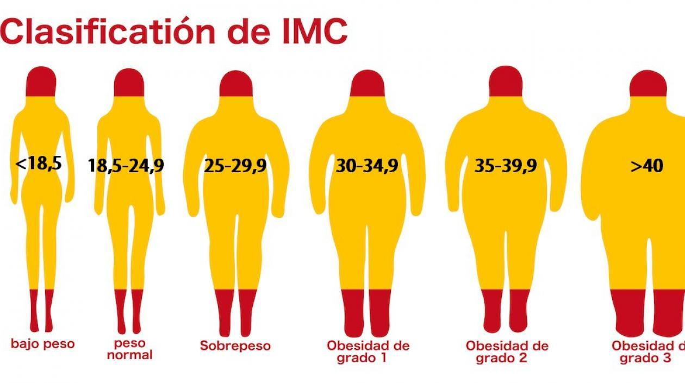

# **TEMA 1: JUEGOS OLIMPICOS RIO 2016 **
<center></center>


# **Introducción**

## **Relevancia**

Los Juegos Olímpicos (JJOO) son la competencia para la cual los deportistas acumulan puntos mediante copas del mundo, juegos de la juventud, copas satélite, etc durante 4 años para así llevar a lo mejor de lo mejor del mundo competir por el oro olímpico. En este trabajo, estudiaremos a los atletas que se clasificaron a los últimos 7 Juegos Olímpicos.


## **Planificación**

libreria
```{r}
library(readr)
library(plyr)
library(dplyr)
library(stringr)
library(tidyverse)
```

```{r}
gantt<- read.csv("ganttfinal.csv")
```

```{r}
today <- as.Date('2022-05-06')
g.gantt<-gather(gantt,"ESTADO","FECHA",4:5)%>%mutate(FECHA=as.Date(FECHA,"%Y.%m.%d"),ACTIVIDAD=factor(ACTIVIDAD),ENCARGADO=factor(ENCARGADO))
ggplot(g.gantt, aes(FECHA, ACTIVIDAD, color=ENCARGADO, group=ITEM))+ geom_line(size=10)+labs(x="FECHAS",y=NULL, title="PLANIFICACIÓN")+ geom_line(alpha = 4, size = 8)+ theme_bw(9)+ geom_text(aes(label = format(FECHA, "%d %b" )), vjust = -0.5, angle = 45, size = 2, color = "black")+ geom_vline(xintercept = today, color = "yellow", size = 2, alpha = 0.5)

```


# **Datos**


## **Recolección de datos**
Proceso de recolección de datos: Los atletas deben pasar por un proceso de identificación en el cual sus parámetros (variables utilizadas en este estudio) son publicadas ya terminadas las pruebas, de aquí obtenemos nuestros datos principales. 
Recolectamos los datos de la siguiente página: 

Decidimos hacerlo de esta manera ya que nos ahorraría una considerable cantidad de tiempo comparado a indagar por separado a cada uno de los atletas individualmente.


## **Población, muestra y muestreo**

**POBLACION:**
Todos los deportistas que participaron durante los Juegos Olímpicos de Río 2016
 
**MUESTRA:**

10498 Deportistas que participaron en los juegos Olímpicos Río 2016 

**MUESTREO**

Dentro de nuestra base de datos se encuentran todos los deportistas partícipes, por lo que se puede decir que se utilizó un censo hecho por los propios organizadores del evento.


## **Variables**


 **VARIABLES** | **TIPOS DE VARIABLE**   |  **RESTRICCIONES**      | 
---------------| ------------------------| ------------------------|
*ID*     | *Categórica Nominal* | *Código de identificación que se le asigna a cada participante*
*Nombre* | *Categórica Nominal* | *Nombre de cada participante*
*Nacionalidad*  | *Categórica Nominal* | *Nombre del país al cual representa*
*Sexo*          | *Categórica Nominal* | *Si es Masculino (M) o si es Femenino (F)*
*Edad*          | *Numérica Discreta * | *Edad del participante , tomando números enteros positivos* 
*Altura*        | *Numérica Continua* |*Números no negativos expresados en metro (Se requiere coma decimal)*
*Peso*          | *Numérica Continua* | *Números no negativos expresados en kilogramos y con coma decimal si en caso el peso no es exacto*
 *IMC*           | *Numérica Continua*  | *Números no negativos expresados en metro (Se requiere coma decimal).*
*Deporte*       | *Categórica Nominal*  | *Todas las disciplinas (28) que se presentaron en esta entrega de los JJOO*
*Oro*           | *Categórica Ordinal*  | *Indica la cantidad de medallas de oro (Número enteros positivos).*
*Plata*         | *Categórica Ordinal*  | *Indica la cantidad de medallas de plata(Número enteros positivos)*
 *Bronce*        |  *Categórica Ordinal* | *Indica la cantidad de medallas bronce (Número enteros positivos)*


## **Limpieza de base de datos**


leemos nuestra base y modificamos el tipo de la variable usando "read_csv" junto a "col_types"

```{r}
datos<-read_csv("juegosrios12.csv",col_types = "ccccnnnncnnn")
datos
```

Cambiamos los nombres de las variables del ingles al español con la funcion "rename"

```{r}
datos<-rename(datos,Nombre=name,Nacionalidad=nationality,Sexo=sex,Edad=age,Estatura=height,Peso=weight,Deporte=sport,Oro=gold,Plata=silver, Bronce=bronze,Id=id )
```

Renombramos los datos de la columna Sexo cambiando  "female" por F y "male" por M

```{r}
sexo_mod<-transmute(datos,Sexo=case_when(Sexo=='female'~'F',Sexo=='male'~'M'))
```

El comando anterior nos arrojo un vector columna de la variable sexo pero modificando el nombre de sus datos, con los siguientes comandos intercambiamos la columna sexo antigua con la columna sexo obtenida con el comando anterior 

```{r}
datos_1<-select(datos,1:3)
datos_2<-select(datos,5:12)
base_mod<-data.frame(datos_1,Sexo=sexo_mod,datos_2)
```

Los datos de la variable deporte se encuentran en ingles, por lo tanto usamos los siguientes códigos para cambiarlo al español. Hacemos uso de los mismos comandos que usamos en la variable sexo 

```{r}
depor_mod<-transmute(base_mod,Deporte=case_when(Deporte=='athletics'~'Atletismo',Deporte=='aquatics'~'Acuáticos',Deporte=='rugby sevens'~'Rugby',Deporte=='football'~'Futbol',Deporte=='volleyball'~'Voleibol',Deporte=='shooting'~'Tiro',Deporte=='boxing'~'Boxeo',Deporte=='equestrian'~'Ecuestre',Deporte=='rowing'~'Remo',Deporte=='judo'~'Judo',Deporte=='cycling'~'Ciclismo',Deporte=='taekwondo'~'Taekwondo',Deporte=='fencing'~'Esgrima',Deporte=='handball'~'Balonmano',Deporte=='badminton'~'Badminton',Deporte=='hockey'~'Hockey',Deporte=='modern pentathlon'~'pentatlón_moderno',Deporte=='table tennis'~'Tenis_de_mesa',Deporte=='canoe'~'Canoa',Deporte=='basketball'~'Baloncesto',Deporte=='golf'~'Golf',Deporte=='archery'~'Tiro con arco',Deporte=='weightlifting'~'Levantamiento_de_pesas',Deporte=='sailing'~'Vela',Deporte=='triathlon'~'Triatlón',Deporte=='tennis'~'Tenis',Deporte=='gymnastics'~'Gimnasia'))

dat_1<-select(base_mod,1:8)
dat_2<-select(base_mod,10:12)

base_new<-data.frame(dat_1,Edad=depor_mod,dat_2)
```

Procedemos a eliminar las observaciones que tengan datos faltantes en cualquiera de las variables 

```{r}
base_new_mod<-filter(base_new,complete.cases(base_new))
base_new_mod
```

**Al principio teníamos un total de 11526 observaciones** y 12 variables, despues de realizar la limpieza **ahora tenemos 10498 observaciones** y la misma cantidad de variables. En total **eliminamos 1028 observaciones** por la falta de algunos datos en las variables de nombre y deporte que son insdispensables para el desarrollo del trabajo.


# **Análisis descriptivo**

**Variable sexo**

**Moda**

```{r}
table_sexo<-table(base_new_mod$Sexo)
table_sexo
```
La moda de la variable sexo es "M" (Masculino) representando a un total de 53,51% del total, entonces podemos decir que participaron mas varones que mujeres.

**Gráfico de barras de sexo**
```{r}
barplot(table_sexo,main="Sexo",col="red",ylab="Cantidad de participantes")
```
Con la gráfica podemos notar que efectivamente la moda es "M" (Masculino), la diferencia de las cantidades no es mucha.

**Variable edad**

**Coeficiente de variación de la variable Edad**
```{r}
coefvariacion<-(sd(base_new_mod$Edad)/mean(base_new_mod$Edad))*100
coefvariacion
```
El valor del coeficiente de variación está **cerca al 10%** por lo que podemos decir que presenta menor dispersión y es casi homogéneo.

**Diagrama de cajas de Edad**
```{r}
boxplot(base_new_mod$Edad,horizontal=TRUE, col="green",xlab="Edad")
```
```{r}
summary(base_new_mod$Edad)
```
La edad mínima de los participantes es de 19 años y la edad maxima es de 67 años, el promedio es de 32,15 años muy cerca a la mediana que es 32 años.

**Moda**
```{r}
table_edad<-table(base_new_mod$Edad)
table_edad
```
**Gráfico de barras de Edad**
```{r}
barplot(table_edad,col = c(rep("grey",13),4,rep("grey",99)),ylab="Cantidad de participantes",xlab="Edad")
legend("topright", "Moda", fill =4)
```
Notamos que La moda es 32 años, lo cual está cerca del promedio de la misma variable.

**Promedio de la variable IMC**

La variable IMC depende de la variable estatura y peso, debido a que para calcularlo se usa la siguiente fórmula **peso/(estatura)^2** donde el peso está en kilogramos y la estatura está en metros.En un futuro esta variable nos ayudará a identicar la condición física de los participantes y como influye en la obtención de medallas en cada tipo de deporte.

```{r}
summary(base_new_mod$IMC)
```
El mínimo y máximo valor de IMC de los particpantes son 13 y 49 respectivamente, tomando como referencia la imagen del **Clasificción de IMC** donde se muestra intervalos para cada condición física de las personas, podemos concluir que hay personas de bajo peso con un IMC de 13 que es menor de 18,5 y personas que tienen obesidad 3 con un IMC 49 que esmayor 40

<center></center>

**Moda**
```{r}
table(base_new_mod$IMC)
```
Podemos ver que **la moda es 22** , eso quiere decir que hay una gran cantidad de participantes que estan en la  clasificación normal según su IMC

**Histograma del IMC**
```{r}
hist(base_new_mod$IMC,main="Indice de masa corporal",ylab="Cantidad de participantes",xlab="IMC",col="lightcyan")
```
Del gráfico podemos concluir que la mayoría de los participantes estan en la clasificación de normal, y que solo hay pocas personas que llegan a los extremos de la casificación.


