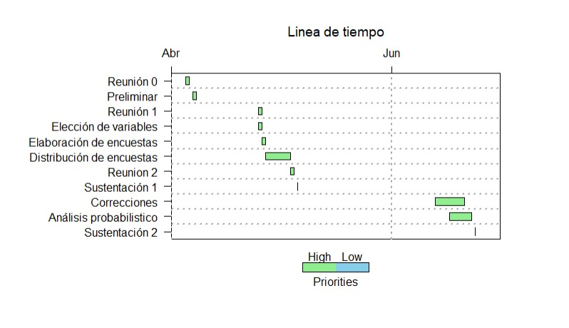

# "Percepción del aprendizaje de idiomas en UTEC"

<center>

{width="500px"}

# **Introducción: **

El mundo cada vez está más globalizado por lo que hay mucha información al alcance de la mano, pero a veces necesitamos información que solo está en inglés u otro idioma. Un ejemplo es la búsqueda de funciones especiales en RStudio, donde la explicación se encuentra en inglés y por lo tanto hoy en día es vital aprender otros idiomas si uno quiere abarcar una amplia fuente de información.

Lo que se quiere lograr a conocer en este estudio estadístico es obtener información de los estudiantes de UTEC sobre el nivel de interés que tienen estos por aprender nuevos idiomas y las preferencias entre los idiomas que desea aprender.

Con las variables planteadas podremos obtener como resultado final si los alumnos de UTEC están interesados en aprender idiomas, lo cual podría llevar a UTEC a abrir cursos de idiomas más largos o tener alianzas con institutos de idiomas para sus alumnos.

# **Planificación: **

{width="1000px"}


# **Datos: **

### *Proceso de recolección de datos: *

El proceso de recolección de datos fue diseñado con un enfoque hacia los estudiantes de UTEC debido a las facilidades que nos generaba reunir los datos y así poder obtener una muestra enfocada en un solo lugar. Posterior se crearon preguntas que nos ayudarían a conseguir información importante para nuestro estudio, luego se pusieron todas las variables en una encuesta virtual mediante la herramienta Google forms, el cual se decidió de esta manera ya que sería más factible llegar a más personas y además así poder contabilizar digitalmente los resultados.

Previniendo que quizás algunas personas ignoren la encuesta debido al poco interés que puedan tener, por esta razón se utilizó la estrategia de agregar a la encuesta un sorteo de audífonos entre todas las personas que llenen la encuesta con el fin de obtener más encuestas.

Una vez terminada la encuesta fueron enviadas a diferentes grupos de WhatsApp, telegram y compañeros de la universidad, al final todas las respuestas son almacenadas en un archivo Excel.

### *Población, muestra y muestreo: *

La población de estudio son los alumnos en el campus de UTEC y nuestra unidad muestral es el alumno de UTEC de cualquier carrera y de cualquier ciclo. El tamaño de la muestra es de 200 alumnos.

Las encuestas fueron enviadas a varios alumnos sin ningún tipo de filtro, se puede determinar que nuestra muestra será un muestreo por conveniencia lo cual causará que la representatividad se vea afectada por factores externos, como la predisposición de los alumnos por llenar la encuesta.

### *Variables: *

-   **Código** (Variable categórica ordinal): Esta variable es para conocer el código de estudiante de los individuos de nuestra muestra.

-   **Ciclo** (Variable categórica ordinal): Esta variable es para conocer en qué ciclo se encuentran los individuos de nuestra muestra, además la mediana de la variable ciclo es 2.

-   **Edad** (Variable numérica continua): Esta variable es para conocer el rango de edad de los individuos de nuestra muestra, además la moda, el mínimo y el máximo de la variable edad es 18, 16 y 18 respectivamente.

-   **Carrera** (Variable categórica nominal): Esta variable es para conocer la carrera de los individuos de nuestra muestra.

-   **Género** (Variable categórica nominal): Esta variable es para conocer el género de los individuos de nuestra muestra.

-   **Idioma de Interés** (Variable categórica nominal): Esta variable es para conocer el idioma de interés que desean estudiar los individuos de nuestra muestra.

-   **Número de centros** (Variable numérica discreta): Esta variable es para conocer cuántos centros de idiomas conocen los individuos de nuestra muestra, además la mediana de la variable número de centros es 3.

-   **Centro de preferencia** (Variable categórica nominal): Esta variable es para conocer el nombre del centro de idiomas donde quiere estudiar los individuos de nuestra muestra.

-   **Costo** (Variable numérica continua): Esta variable es para conocer el costo que estarían dispuestos a pagar en un centro de idiomas los individuos de nuestra muestra

-   **Número de idiomas** (Variable numérica discreta): Esta variable es para conocer cuántos idiomas le gustaría aprender a los individuos de nuestra muestra.

-   **Nivel** (Variable categórica ordinal): Esta variable es para conocer hasta qué nivel de idioma desearían estudiar los individuos de nuestra muestra.

-   **Tiempo** (Variable numérica continua): Esta variable es para conocer cuánto tiempo aparte de las clases le pueden dedicar al estudio de un idioma, además el promedio de la variable tiempo es 93.05.

-   **Importancia** (Variable categórica ordinal): Esta variable es para conocer la importancia que le dan al estudiar otro idioma los individuos de nuestra muestra que tiene una calificación que está en un rango del 1 al 5.

# **Librerías: **

```{r}
library(readr) 
```

```{r}
library(modeest)
```

```{r}
library(dplyr) 
```

```{r}
library(ggplot2)
```

# **Base de datos: **

```{r}
DA <- read_csv("data.csv", col_types = "")
```

```{r}
names(DA)
```

# **Limpieza de datos:**

```{r}
DA %>% rename(Codigo = Código, Genero=Género, `Idioma de Interes` = `¿Qué idioma es de su interés?`, `Numero de centros` = `¿Cuantos centros de idiomas conoces?`, `Centro de preferencia`= `¿En que centro de idiomas le gustaria estudiar?` , `Costo`= `¿Cuanto estaria dispuesto a pagar por un curso de idiomas ?`, `Numero de idiomas`= `¿Cuantos idiomas te gustaria aprender?`    , Nivel= `¿Hasta que nivel de idioma te gustaria llegar?`, Tiempo=`¿Cuánto tiempo  por día aparte de las clases le puedes dedicar al estudio de un idioma (minutos)? Ejm: 60`, Importancia= `Del 1 al 5, donde 1 es nada importante y 5 muy importante ¿Qué tan importante consideras el estudio de idiomas?`)->DD
```

```{r}
names(DD)
```

-   ***Limpieza de datos de la variable Tiempo: ***

```{r}
select(DD,Tiempo)
```

```{r}
DD %>% count(Tiempo)
```

```{r}
DD %>% mutate(Tiempo=
        ifelse(Tiempo %in% c("1","2","3","4","5"),NA,
        ifelse(Tiempo=="50 min","50",
        ifelse(Tiempo=="2 horas semanales",NA,
        ifelse(Tiempo %in% c("120 minutos","2 horas"),"120",
        ifelse(Tiempo %in% c("1 hora","60 min"),"60",
        ifelse(Tiempo %in% c("1:30","1 hora y media","90 min","Diario 90","Máximo una hora y media"),"90",
        ifelse(Tiempo %in% c("30 min","30 minutos","1/2 hora"),"30",Tiempo
        )))))))) ->DL
```

```{r}
tiempo2<-as.numeric(DL$Tiempo)
```

```{r}
DL %>% count(Tiempo)
```

-   ***Limpieza de datos de la variable Idioma de Interés: ***

```{r}
DL %>% count(`Idioma de Interes`)
```

```{r}
DL %>% mutate(`Idioma de Interes`=
        ifelse(`Idioma de Interes` %in% c("Aleman","Alemán"),"Alemán",
        ifelse(`Idioma de Interes` %in% c("japones","Japones","Japonés"),"Japonés",`Idioma de Interes`
        ))) ->DL1
```

```{r}
DL1 %>% count(`Idioma de Interes`)
```

-   ***Limpieza de datos de la variable Centro de preferencia: ***

```{r}
DL1 %>% count(`Centro de preferencia`)
```

```{r}
DL1 %>% mutate(`Centro de preferencia`=
        ifelse(`Centro de preferencia`=="Centro cultural peruano japones", "Centro Cultural Peruano Japonés",
        ifelse(`Centro de preferencia`=="escuela bilingue", "Escuela Bilingue",
        ifelse(`Centro de preferencia`=="istituto italiano di cultura", "Istituto Italiano di Cultura",
        ifelse(`Centro de preferencia` %in% c("Alianza francesa","Alianza Francesa"),"Alianza Francesa",
        ifelse(`Centro de preferencia` %in% c("ninguno","Japones","Ninguno prefiero aprender viendo pelis, musica, y hablando con gente en ingles"),"ninguno",
        ifelse(`Centro de preferencia` %in% c("UP","Centro de Idiomas de la Universidad del Pacifico"),"Centro de Idiomas de la Universidad del Pacifico",`Centro de preferencia` 
               )))))))->DL2
```

```{r}
DL2 %>% count(`Centro de preferencia`)
```

# **Análisis Descriptivo: **

### 1.   **Análisis de la variable Ciclo: **

-   ***Gráfica de la variable Ciclo: **

```{r}

barra_ciclo<- DL2 %>% count(Ciclo) 
cl <-barra_ciclo %>% mutate(Ciclo = factor(Ciclo, level = Ciclo)) %>%  ggplot(aes(Ciclo,n)) + geom_bar(stat = "identity", fill = "wheat1", color = "black") + labs(x = "Ciclo",
     y = "Encuestas", 
     title = "Gráfica de ciclo vs encuestas") 

cl+theme_classic()

```

*En la Gráfica Ciclo vs Encuestas podemos corroborar la moda, además podemos determinar que la primera mitad de nuestras observaciones provienen de alumnos de primer y segundo ciclo. La gráfica es unimodal con un posible sesgo a la derecha, pero este no se ha tomado debido a que es correcto que el ciclo en los encuestados sea diferente. *

```{r}
mfv(DL2$Ciclo, na_rm=TRUE)
```

*Con la moda logramos saber de qué ciclo son los estudiantes que más han llenado nuestra encuesta y las que predominan en nuestra muestra, obteniendo como resultado el 2do ciclo, el cual corroboramos en la Gráfica Ciclo vs Encuestas. *

```{r}
median(DL2$Ciclo)
```

*Con la mediana logramos saber cuál es el punto medio de nuestra variable, en el cual hemos obtenido como resultado el 2do ciclo; además lo hemos utilizamos también para poder definir la variable ciclo. *

### 2. **Análisis de la variable Edad: **

-   ***Gráfica de la variable Edad: ***


```{r}
barra_Edad<- DL2 %>% count(Edad) 
c<-barra_Edad %>% arrange(desc(n)) %>% mutate(Edad = factor(Edad, level = Edad)) %>%  ggplot(aes(Edad,n)) + geom_bar(stat = "identity", fill = "wheat1", color = "black", width = 0.30) + labs(x = "Edad",
     y = "Encuestas",
     title = "                              Gráfica de Género vs Encuestas")
c+theme_classic()
```

*En la gráfica Edad vs Encuestas podemos corroborar que la mediana está situada casi en el centro de la caja por lo que podemos concluir que los datos están agrupados en rangos muy cercanos, obteniendo como resultado una caja con elementos concentrados y dos datos atípicos los cuales se alejan del rango de agrupación. *

```{r}
mfv(DL2$Edad, na_rm=TRUE)
```

*Con la moda logramos saber cuál es la edad común de los estudiantes que más han llenado nuestra encuesta y las que predominan en nuestra muestra, obteniendo como resultado 18, además lo hemos utilizamos también para poder definir la variable Edad. *

```{r}
median(DL2$Edad)
```

*Con la mediana logramos saber cuál es el punto medio de nuestra variable, en el cual hemos obtenido como resultado 19, el cual corroboramos en la Gráfica Edad vs Encuestas llegando a la conclusión que es el 50% del boxplot. *

```{r}
min(DL2$Edad)
max(DL2$Edad)
```

*Con el mínimo y máximo conocemos cuál es el rango de edades que comprende nuestro estudio, obtenemos como resultado 16 y 28 respectivamente, además nos ayuda a definir la variable Edad. *


### 3. **Análisis de la variable carrera: **

-   ***Gráfica de la variable carrera: ***

```{r}
barra_carreras<- DL2 %>% count(Carrera) 
a<-barra_carreras %>% arrange(n) %>% mutate(Carrera = factor(Carrera, level = Carrera)) %>%  ggplot(aes(Carrera,n)) + geom_bar(stat = "identity", fill = "wheat1", color = "black") + labs(x = "Carrera",
     y = "Encuestas",
     title = "     Gráfica de carrera vs encuestas") + coord_flip()
a+theme_classic()

```

*En la Gráfica Carrera vs Encuestas que es un gráfico de barras invertido podemos observar mejor la simetría en cuanto al número de encuestas que se obtuvieron y las carreras de los individuos de nuestra muestra. De los resultados que se obtuvieron se puede deducir que hay más personas de la carrera de ingeniería industrial. *

```{r}
mfv(DL2$Carrera, na_rm=TRUE)
```

*Con la moda logramos saber cuál es la carrera más común de los estudiantes que han llenado nuestra encuesta y las que predominan en nuestra muestra, obteniendo como resultado Ingeniería Industrial, el cual corroboramos en la Gráfica Carrera vs Encuestas. *


### 4. **Análisis de la variable Género: **

-   ***Gráfica de la variable Género: ***

```{r}
barra_genero<- DL2 %>% count(Genero) 
c<-barra_genero %>% arrange(desc(n)) %>% mutate(Genero = factor(Genero, level = Genero)) %>%  ggplot(aes(Genero,n)) + geom_bar(stat = "identity", fill = "wheat1", color = "black", width = 0.30) + labs(x = "Género",
     y = "Encuestas",
     title = "                              Gráfica de género vs encuestas")
c+theme_classic()
```

*En la Gráfica Género vs Encuestas podemos observar que la mayoría de personas que respondieron la encuesta son de género masculino con una frecuencia de 115, posterior se encuentra la cantidad de personas pertenecientes al género femenino con una frecuencia de 79 ; por último, se encuentra la cantidad de personas pertenecientes a otro género que tiene una frecuencia de 1.Realizamos este gráfico porque es importante conocer cuál es el género que predomina la encuesta, es decir, ver si la muestra es representativa con respecto al género. Basándonos en lo mencionado anteriormente llegamos a la conclusión que sí es representativa, aunque existe una pequeña diferencia de 36. *

```{r}
mlv(DL2$Genero, method = "mfv")
```

*Con la moda logramos saber cuál es el género más común de los estudiantes que han llenado nuestra encuesta y las que predominan en nuestra muestra, obteniendo como resultado el género masculino, el cual corroboramos en la Gráfica Género vs Encuestas. *

### 5. **Análisis de la variable Idioma de Interés: **

-   ***Gráfica de la variable Idioma de Interés: ***

```{r}
barra_idiomaDinteres<- DL2 %>% count(`Idioma de Interes`) 
d<-barra_idiomaDinteres %>% arrange(n) %>% mutate(`Idioma de Interes` = factor(`Idioma de Interes`, level = `Idioma de Interes`)) %>%  ggplot(aes(`Idioma de Interes`,n)) + geom_bar(stat = "identity", fill = "wheat1", color = "black") + labs(x = "Idioma de interes",
     y = "Encuestas",
     title = "     Gráfica idioma de interés  vs Encuestas ")+ coord_flip()
d+theme_classic()
```

*En la Gráfica Idioma de interés vs Encuestas que es un gráfico de barras invertido podemos observar que el idioma con más demanda o el preferente de acuerdo con la cantidad de alumnos encuestados es el inglés. Además, la población encuestada tiene una menor preferencia a la elección de aprender el idioma coreano o estudiar tres idiomas (inglés, Quechua y Chino mandarín). *

```{r}
mfv(DL2$`Idioma de Interes`, na_rm=TRUE)
```

*Con la moda logramos saber cuál es el Idioma de interés más común de los estudiantes que han llenado nuestra encuesta y las que predominan en nuestra muestra, obteniendo como resultado el idioma inglés, el cual corroboramos en la Gráfica Encuestas vs Idioma de Interés. *


### 6. **Análisis de la variable Número de Centros: **

-   ***Gráfica de la variable Número de centros: ***

```{r}
barra_Centros<- DL2 %>% count(`Numero de centros`) 
nc<-barra_Centros %>% mutate(`Numero de centros` = factor(`Numero de centros`, level = `Numero de centros`)) %>%  ggplot(aes(`Numero de centros`,n)) + geom_bar(stat = "identity", fill = "wheat1", color = "black", width = 0.3) + labs(x = "Número de centros",
     y = "Encuestas",
     title = "                              Gráfica número de centros vs encuestas")
nc+theme_classic()
```

*En la Gráfica número de centros vs encuestas podemos observar que la gran mayoría de nuestros encuestados conoce 2 centros de idiomas. A todo esto, también se le podría agregar que nuestra gráfica es unimodal. Hemos realizado esta gráfica para percibir la noción de nuestros encuestados acerca de la cantidad de centros que conoce y si es consciente de las diferentes opciones que puede tomar entre los centros de idiomas. *

```{r}
mfv(DL2$`Numero de centros`, na_rm=TRUE)
```

*Con la moda logramos saber cuál es el número de centros más común de los estudiantes que han llenado nuestra encuesta y las que predominan en nuestra muestra, obteniendo como resultado 2, el cual corroboramos en la Gráfica número de Centros vs encuestas. *

```{r}
median(DL2$`Numero de centros`)
```

*Con la mediana logramos saber cuál es el punto medio de nuestra variable, en el cual hemos obtenido como resultado 3, además lo hemos utilizamos también para poder definir la variable Número de Centros. *

### 7. **Análisis de la variable Centro de Preferencia: **

-   ***Gráfica de la variable Centro de Preferencia: ***


```{r}
barra_Preferencia<- DL2 %>% count(`Centro de preferencia`) 
e<-barra_Preferencia %>% arrange(n) %>% mutate(`Centro de preferencia` = factor(`Centro de preferencia`, level = `Centro de preferencia`)) %>%  ggplot(aes(`Centro de preferencia`,n)) + geom_bar(stat = "identity", fill = "wheat1", color = "black") + labs(x = "Centro de preferencia",
     y = "Encuestas",
     title = "   Gráfica encuestas vs centro de preferencia")+ coord_flip()
e+theme_classic()
```

*En la Gráfica Centro de preferencia vs encuestas podemos observar que la cantidad de encuestados que prefieren estudiar en el británico es mucho más notable a diferencia que los otros centros, aludiendo a ello otros centros como Escuela Bilingue, El Cultural, CIPUD y el Centro de Idiomas San Marcos son los menos preferentes por los encuestados. Hemos realizado esta gráfica para percibir la noción de nuestros encuestados acerca de los centros que conoce y si es consciente de las diferentes opciones que puede tomar entre ellos. *

```{r}
mfv(DL2$`Centro de preferencia`, na_rm=TRUE)
```

*Con la moda logramos saber cuál es el Centro de Preferencia más común de los estudiantes que han llenado nuestra encuesta y las que predominan en nuestra muestra, obteniendo como resultado Británico, el cual corroboramos en la gráfica encuestas vs centro de preferencia. *

### 8. **Análisis de la variable Costo: **

-   ***Gráfica de la variable Costo: ***

```{r}
barra_Costo<- DL2 %>% count(Costo) 
fc<-barra_Costo %>% mutate(Costo = factor(Costo, level = Costo)) %>%  ggplot(aes(Costo,n)) + geom_bar(stat = "identity", fill = "wheat1", color = "black", width = 0.3) + labs(x = "Costo",
     y = "Encuestas",
     title = "                                Gráfica costo vs encuestas.")
fc+theme_classic()
```

*En la gráfica costo vs encuestas observamos cual es el monto que predomina que es S/151-S/200 en el cual verificamos la moda. Es decir, que la gran mayoría de la muestra que son más de 60 personas estarían dispuestos a pagar dicho monto. Hemos realizado esta gráfica para tener una visión sobre el presupuesto que los alumnos estarían dispuestos a invertir para acceder al estudio de un idioma y si su situación económica afecta a la elección de está*

```{r}
mfv(DL2$Costo, na_rm=TRUE)
```

*Con la moda logramos saber cuál es el costo más común que están dispuestos a asumir los estudiantes que han llenado nuestra encuesta y la que predomina en nuestra muestra, obteniendo como resultado s/.151 - s/.200, el cual corroboramos en la gráfica costo vs encuestas. Concluimos que el presupuesto de nuestros alumnos encuestados no es suficiente para matricularse en un instituto de idiomas porque el costo de la mensualidad supera los 250 soles sobrepasando lo que estarían dispuestos a pagar. *


### 9. **Análisis de la variable Número de idiomas: **

-   ***Gráfica de la variable Número de idiomas: ***

```{r}
barra_Nidiomas<- DL2 %>% count(`Numero de idiomas`) 
ni<-barra_Nidiomas %>% mutate(`Numero de idiomas` = factor(`Numero de idiomas`, level = `Numero de idiomas`)) %>%  ggplot(aes(`Numero de idiomas`,n)) + geom_bar(stat = "identity", fill = "wheat1", color = "black", width = 0.3) + labs(x = "Número de idiomas",
     y = "Encuestas",
     title = "                            Gráfica número de idiomas vs encuestas")
ni+theme_classic()
```

*En la gráfica número de idiomas vs encuestas observamos cuantos son los idiomas que les interesa estudiar a nuestros encuestados. Se coloco un rango de 1 a 5 idiomas, de los cuales estudiar de 2 a 3 idiomas es el número más habitual y conforman la mayor parte de la elección de la muestra. Esta información es relevante debido a que nos permite conocer que nuestra muestra no solo está interesada en un idioma sino hasta 5 idiomas*


```{r}
mfv(DL2$`Numero de idiomas`, na_rm=TRUE) 
```

*Con la moda logramos saber cuál es el número de idiomas más común de los estudiantes que han llenado nuestra encuesta y la que predomina en nuestra muestra, obteniendo como resultado 3, el cual corroboramos en la Gráfica Número de idiomas vs Encuestas. *


### 10. **Análisis de la variable Nivel: **

-   ***Gráfica de la variable Nivel: ***

```{r}
barra_Aidiomas<- DL2 %>% count(Nivel) 
ai<-barra_Aidiomas %>% arrange(desc(n)) %>% mutate(Nivel = factor(Nivel, level = Nivel)) %>%  ggplot(aes(Nivel,n)) + geom_bar(stat = "identity", fill = "wheat1", color = "black", width = 0.30) + labs(x = "Nivel",
     y = "Encuestados",
     title = "                                           Gráfica nivel vs encuesta ")
ai+theme_classic()
```

**En la Gráfica nivel vs encuesta observamos hasta que nivel nuestra muestra desea estudiar, también nos indica que para ellos los idiomas son importantes. Esta gráfica nos permite medir la determinación que tienen los encuestados por aprender y culminar el aprendizaje de ingles satisfactoriamente. **

```{r}
mfv(DL2$Nivel, na_rm=TRUE) 
```

*Con la moda logramos saber cuál es el Nivel más común que quieren alcanzar al estudiar otro idioma los estudiantes que han llenado nuestra encuesta y la que predomina en nuestra muestra, obteniendo como resultado avanzado, el cual corroboramos en la gráfica nivel vs encuestas. *

### 11. **Análisis de la variable Tiempo: **

-   ***Gráfica de la variable Tiempo: ***

```{r}
barra_tiempo<- DL2 %>% na.omit(tiempo) %>% count(Tiempo) 
ai<-barra_tiempo %>% arrange(desc(n)) %>% mutate(Tiempo = factor(Tiempo, level = Tiempo)) %>%  ggplot(aes(Tiempo,n)) + geom_bar(stat = "identity", fill = "wheat1", color = "black", width = 0.8) + labs(x = "Tiempo",
     y = "Encuestados",
     title = "                                           Gráfica Tiempo vs encuesta ")
ai+theme_classic()
```

*Esta gráfica nos permite ver la disponibilidad de tiempo que tienen los encuestados con respecto al estudio de idiomas. *

```{r}
round(mean(tiempo2,na.rm = TRUE),2)
```

*Con el promedio logramos saber el tiempo que administraran posterior a las clases para estudiar otro idioma los estudiantes que han llenado nuestra encuesta, obteniendo como resultado 93.05; además lo hemos utilizamos también para poder definir la variable Tiempo. *

```{r}
median(tiempo2,na.rm = TRUE)
```

*Con la mediana logramos saber cuál es el punto medio de nuestra variable, en el cual hemos obtenido como resultado 90. *


### 12. **Análisis de la variable Importancia: **

-   ***Gráfica de la variable Importancia: ***

```{r}
fci <- ggplot(data=DL2)+
  geom_bar(aes(Importancia), colour = "black", fill = "wheat1",width = 0.30 ) + labs(x = "Importancia",y = "Encuestas") + ggtitle("                                   Gráfica importancia vs encuestas")
fci +theme_classic()
```

*En la Gráfica Importancia vs Encuestas observamos que la calificación con mayor predominación de la importancia es 5 con más de 50 alumnos interesados. Esto nos indica lo importante que es para las personas el aprendizaje de un idioma. *

```{r}
mfv(DL2$Importancia, na_rm=TRUE) 
```

*Con la moda logramos saber cuál es la importancia más común que le dan a estudiar otro idioma los estudiantes que han llenado nuestra encuesta y la que predomina en nuestra muestra, obteniendo como resultado 5, el cual corroboramos en la gráfica importancia vs encuestas. *


## Análisis de dos variables:

-   **Gráfica género vs número de Idiomas: **

```{r}
mosaicplot(table(DL$Genero,DL$`Numero de idiomas`),col=c("wheat1","burlywood2"), main = "Gráfica género vs número de idiomas")
```

*En la gráfica de género vs número de idiomas podemos corroborar que gran parte del género femenino opta por estudiar 3 idiomas ya que el área que comprende estas variables es mayor, en el género masculino observamos que gran parte opto por el estudio de 2 0 3 idiomas, y en otros géneros corroboramos que no hay una tendencia o moda. *

-   **Gráfica nivel vs género: **

```{r}
mosaicplot(table(DL2$Nivel,DL2$Genero), col=c("wheat1","burlywood2"), main = "Gráfica nivel vs género")
```

*En la gráfica nivel vs género podemos observar que gran parte del género femenino, masculino y otro desean llegar hasta el máximo nivel del idioma que es el avanzado, puesto que podemos apreciar que tanto el área que comprende género femenino con el nivel avanzado, el género masculino con el nivel avanzado y otro género con el nivel avanzado es más grande y se extiende más a comparación que los niveles básico e intermedio. Por esta razón decimos que nuestra muestra tiene preferencia por aprender un idioma hasta el nivel avanzado. *

# **Ejercicios de probabilidad: **

# **Análisis Probabilístico: **

### a. **Análisis Probabilístico de la variable idioma de interés: **

```{r}
par(mar=c(5.1, 12, 4.1, 1))
idioma1<-table(DL2$`Idioma de Interes`)
idioma2<-round(prop.table(idioma1),2)
idioma3<-idioma2[order(idioma2)]
barplot(idioma3, col = c("wheat1"), horiz = TRUE, las = 2, xlim = c(0,0.7), main="Probabilidad de idioma de interes", width = 0.5,cex.names=0.8)
```

*La probabilidad de que los encuestados prefieran los distintos idiomas, es una de las variables principales en nuestro estudio debido a que el análisis realizado se basó en el estudio de idiomas. También podemos analizar de que la ocurrencia de los idiomas tanto para aprender ruso, quechua, Portugués Japonés, italiano, inglés, francés, coreano, chino mandarín y alemán se obtiene hallando la proporcionalidad, dividiendo la cantidad de encuestados que prefieren cierto idioma entre el total de los datos. El cálculo con respecto al idioma de interés permitirá hacer la relación entre las variables que resultan de ella, y se podrá conocer más descripciones acerca del tema planteado que es el aprendizaje de idiomas como por ejemplo la probabilidad de que el primer estudiante encuestado prefiera estudiar inglés. *

### b. **Análisis Probabilístico de la variable importancia: **

```{r}
importancia1<-table(DL2$Importancia)
importancia2<-round(prop.table(importancia1),2)
barplot(importancia2, col = c("wheat1"), main = "Importancia")
```

*La proporcionalidad en el gráfico de importancia, podemos observar el análisis de la ocurrencia del rango de la importancia juntamente con la variación en que esta variable se presente. Por un lado, la accesibilidad para obtener cual es la ocurrencia según la importancia que le dan los estudiantes de nuestro estudio se obtiene hallando la proporcionalidad según el total de los datos. El cálculo con respecto a la importancia permitirá hacer la relación entre las variables que resultan de ella.*

### c. **Análisis Probabilístico de la variable costo:**

```{r}
costo1<-table(DL2$Costo)
costo2<-round(prop.table(costo1),2)
barplot(costo2, col = c("wheat1"), xlim = c(0,5), cex.names=0.6, width = 0.6, las=1, main = "Costo")
```

*En el siguiente gráfico podemos observar la variable costo, esta nos muestra la relación entre el costo que podrían solventar los encuestados para aprender un idioma diferente al español, todo esto en relación con su ocurrencia. Para hallar la ocurrencia, tuvimos que calcular su proporcionalidad con respecto a un todo conjunto (la cantidad de encuestas en total). Este gráfico y los datos que nos brinda nos permite conocer y establecer la relación de probabilidad existente en cuanto al costo. *

### d. **Análisis Probabilístico de la variable número de idiomas: **

```{r}
nidioma1<-table(DL2$`Numero de idiomas`)
nidioma2<-round(prop.table(nidioma1),2)
barplot(nidioma2, col = c("wheat1"), main = " Número de idiomas")
```

*En el siguiente gráfico podemos observar la variable número de idiomas, esta nos muestra la relación entre la cantidad de idiomas que le gustaría aprender a los encuestados en relación con su ocurrencia. Para hallar la ocurrencia, tuvimos que calcular su proporcionalidad con respecto a un todo conjunto (la cantidad de encuestas en total). Este gráfico y los datos que nos brinda nos permite conocer y establecer la relación de probabilidad existente de la cantidad especifica de idiomas a aprender. *

### *DISTRIBUCIÓN BINOMIAL*

### 1. **Análisis probabilístico primer caso: **

Según un reporte sobre la deserción escolar auspiciado por la fundación Bill & Melinga Gates, la probabilidad que un alumno abandone las clases del idioma inglés es del 47%. Si 140 alumnos encuestados están interesados en el idioma inglés. ¿Cuál es la probabilidad que 67 alumnos abandone las clases de inglés?

Se tomo 67 alumnos debido a que un artículo del diario gestión afirma que 48% de jóvenes se matriculan a cursos de inglés lo cual si aplicamos ese porcentaje a nuestros encuestados nos da 67.

Fuente: Saíto, D. D. S. (2020, septiembre 5). Crece a 48% los estudiantes de 25 años a más que aprenden idiomas durante pandemia. Gestión.

_**Justificación: **_
Hemos decidido plantear modelo binomial puesto en este existe dos posibilidades que los alumnos dejen el curso de inglés (éxito) o que los continúen (fracaso), no obstante, podemos repetir el experimento "n" veces.

_**Resolución: **_

**X ->** x (número de éxitos) = Que 67 alumnos abandonen las clases de ingles

**size ->** número total de ensayos = 140

**p ->** probabilidad de éxito = 0.47

**dbinom(x, size, prob)**

```{r}
round(dbinom(67,140,0.47),2)
```

Usando la función de distribución binomial podemos obtener que de nuestros 140 encuestados existe una probabilidad del 7% que 67 alumnos abandonen su curso de inglés.

```{r}
plot(dbinom(c(0:140),140,0.47), xlab="Número de encuestas",ylab="Probabilidad",col="burlywood2")
```

### 2. **Análisis probabilístico segundo caso: **

Una institución que brinda servicios de enseñanza de distintos idiomas se presenta en Utec y desea ofrecer el curso de mayor interés. La institución realiza encuestas, para que los cursos de idiomas puedan ser aperturados deben cumplirse ciertos requisitos:

- **Idioma Inglés: ** 30 personas deben estar interesados y confirmar que les interesa aprender el idioma. 

*¿Cuál es la probabilidad de que al realizar 50 encuestas a alumnos de la carrera Ingeniería Industrial se aperture el curso de inglés? *

_**Justificación: **_
Hemos decidido plantear modelo binomial puesto en este existe dos posibilidades que los alumnos se matriculen al inglés(éxito) o que no se matriculen (fracaso), no obstante, podemos repetir el experimento "n" veces.

_**Resolución: **_

Primero, debemos filtrar a los alumnos de Ingeniería Industrial que les interese el idioma inglés.

```{r}
rIC <- filter(DL2, `Idioma de Interes` == "Inglés", Carrera=="Ingeniería Industrial")
nrow(rIC)
```

Podemos observar que, de nuestra muestra de 204, la probabilidad de encontrar a un alumno que se encuentre interesado en el idioma Inglés y estudie Ingeniería Industrial, será: $P(X) = 45/204$ => $P(X) = 0.22$
considerando X como nuestra variable aleatoria

Entonces podemos definir nuestros términos a trabajar:

- **X ->** variable aleatoria, número de éxito = 30

- **size ->** cantidad de encuestas que desea realizar el instituto = 50

- **p ->** probabilidad de éxito = 22%

**dbinom(x, size, prob)**

```{r}
dbinom(30,50,prob=0.22)
```
**Podemos observar que si solo se encuesta a alumnos de alumnos de Ingeniería Industrial la probabilidad para que se aperture el curso de inglés sería muy bajo. **

### *DISTRIBUCIÓN BINOMIAL NEGATIVA*

### 3. **Análisis probabilístico tercer caso: **

El instituto de idioma Británico se encuentra interesado en buscar nuevos alumnos para sus cursos de inglés, por lo que decide visitar UTEC y entregar volantes a los alumnos, se sabe que su pago mensual regular para inglés es de 270 soles y sus aulas tienen capacidad de 20 personas, si la probabilidad de que un alumno pueda pagar ese monto es 14%, si se entregaron 204 volantes. ¿cuál es la probabilidad de que puedan llenar un aula de 20 alumnos?

_**Justificación: **_
Planteamos el modelo binomial negativo puesto que podremos repetir el experimento aleatorio de Bernoulli tantas veces para obtener el número de éxitos requeridos, donde también hay 2 posibilidades como la binomial de éxito y fracaso.

_**Resolución: **_

**q ->** Número de pruebas falladas hasta encontrar el éxito = 184 alumnos

**size ->** Número de éxitos buscados = 20 alumnos

**p->** probabilidad de éxito = 0.14

**pnbinom (q,size,p)**

```{r}
round(pnbinom((204-20),20,0.14),2)
```
**La probabilidad de que el Británico pueda llenar un aula gracias a sus volantes entregados en UTEC es de 97% una probabilidad muy alta para que un alumno pueda estudiar inglés en su centro de estudios. **


```{r}
plot(c(20:204),pnbinom(c(0:184),20,0.14),col = "burlywood4", xlab = "Número de volantes", ylab = "Probabilidad" )
```

Usando la función acumulativa podemos ver que efectivamente cuando se encuesten a aproximadamente 200 alumnos, ya se habrá tenido a los 20 estudiantes que se requiere para llenar un aula del Británico.

### 4. **Análisis probabilístico cuarto caso: **

Suponga que la Alianza francesa visite UTEC y ofrezca un curso virtual gratis a las personas interesadas en el idioma francés. Para que el curso se lleve a cabo, 14 primeras personas deben confirmar que les interesa aprender francés, pues este es su aforo en clases virtuales. Para este propósito, se realizarán 102 encuestas a los estudiantes, entonces ¿Cuál es la probabilidad de que, al realizar las 102 encuestas, se complete el salón para francés con los primeros 14 alumnos?

_**Justificación: **_
Planteamos el modelo binomial negativo puesto que podremos repetir el experimento aleatorio de Bernoulli tantas veces para obtener el número de éxitos requeridos, donde también hay 2 posibilidades como la binomial de éxito y fracaso.

_**Resolución: **_

**q ->** número de pruebas falladas hasta encontrar el éxito = 88 alumnos

**size ->** Número de éxitos buscados = 14 alumnos

**p ->** probabilidad de éxito = 0.073 

**pnbinom (q,size,p)**


```{r}
round((dnbinom((102-14),14,0.073)),3)
```

Este cálculo probabilístico nos da a conocer que muy probablemente si la Alianza francesa realiza 100 encuestas a estudiantes de Utec no logré llenar las vacantes para abrir un curso virtual gratis de francés, pues la probabilidad es muy cercana a 0. Por lo cual concluimos que debería realizar un mayor número de encuestas.

```{r}
plot(dnbinom(c(0:88),14,0.073),xlab="Número de encuestas",ylab="Probabilidad",col="burlywood4")
```

El análisis mencionado anteriormente se puede comprobar en esta gráfica, pues como vemos el valor de la probabilidad recién incrementa cuando es el número de encuestas es mayor que 50, no obstante, este crecimiento sigue siendo mínimo.

Esto muy probablemente se repita con los demás idiomas estudiados menos con el inglés pues su probabilidad es significativamente mayor a comparación de los demás idiomas.

¿Cuál es el número esperado de encuestas que deberá realizar la alianza francesa para abrir un curso virtual de francés si sabe que la probabilidad de que a una persona le guste aprender francés es de 7,5%?
_**E(X)=k/p**_

```{r}
round(14/0.073,2)
```

*Como vimos anteriormente, se necesitarían realizar más encuestas para encontrar a los primeros 14 interesados en estudiar el idioma francés, entonces en este caso hemos utilizado la esperanza del modelo binomial negativo para hallar justamente cuales serían el número esperado de encuestas, el cual es 186,67, por lo que la alianza francesa debería realizar al menos 187 encuestas para hallar a los 14 primeros estudiantes para dictar el curso. *

### *MODELO HYPERGEOMÉTRICO*

### 5. **Análisis probabilístico quinto caso: **

En la variable nivel tenemos que a 157 personas les gustaría aprender un idioma hasta el nivel avanzado, 4 solo hasta el nivel básico y 43 hasta nivel intermedio. Supongamos que se toman a 102 personas ¿Cuál es la probabilidad de que a 21 estudiantes quieran aprender hasta el nivel intermedio?

_**Justificación: **_
Empleamos el modelo hipergeométrico dado una población, extraemos una muestra la cual contiene la posibilidad de éxito y fracaso, donde la probabilidad de éxito variara conforme se realice los experimentos puesto que es uno de tipo sin reposición.

_**Resolución: **_

**M ->** 43

**N ->** 204

**xo ->** 21

**n ->** 102

**hyper(xo,𝑴,N-M,n)**


```{r}
round(dhyper(21,43,204-43,102),2)
```

La probabilidad de que a la mitad de las personas le interese estudiar hasta el nivel intermedio es de 0.13, es decir es una probabilidad muy baja, probablemente en las encuestas predomine la opción de nivel avanzado. Elegimos la modelo hipergeométrica pues estamos hallando la probabilidad de una muestra de mi población.

### *MODELO GEOMÉTRICO*

### 6. **Análisis probabilístico sexto caso: **

Un centro de idiomas desea brindar cursos de los 11 distintos idiomas entre los cuales se tiene el ruso, quechua, portugués, japonés italiano, inglés, francés, coreano, chino-mandarín y alemán. Por ello desea seleccionar a los primeros 11 alumnos para participar del total de encuestados que es 204, los cuales le den mucha importancia a estudiar idiomas, asimismo dedicarle el tiempo promedio a estudiarlos de la encuesta realizada.

¿Cuál sería la probabilidad de que al hacer la encuesta 11 veces, el primer alumno le de la máxima importancia a estudiar idiomas y también le dedique el promedio del tiempo de estudio resultado de las encuestas?

_**Justificación: **_
Utilizamos el modelo geométrico para saber cuánto es la probabilidad de que obtengamos un caso de éxito, relacionando diversas variables del total de nuestras encuestas. Estos modelos geométricos se utilizan para representar los componentes de un sistema con entidades geométricas como líneas, polígonos o circunferencias de modo que el término modelo se refiere a una representación geométrica generada por el computador o en este caso por Rstudio.

_**Resolución: **_

En un inicio filtrar la cantidad de alumnos que le den una máxima importancia y también le dediquen el tiempo promedio de la encuesta a estudiar idiomas.


```{r}
sum(DL2$Tiempo==mlv(DL2$Tiempo,na.rm=TRUE) & DL2$Importancia==5,na.rm=TRUE)
```

Se hallo la probabilidad según el total de encuestados 0

```{r}
round(sum(DL2$Tiempo==mlv(DL2$Tiempo,na.rm=TRUE) & DL2$Importancia==5,na.rm=TRUE)/nrow(DL2),2)
```

Por último, hallamos la distribución geométrica

**x ->** número de pruebas falladas hasta encontrar el éxito = 10 alumnos

**p ->** probabilidad de éxito = 0.25 

**dgeom(x, p)**


```{r}
round(dgeom(10, 0.25),2)
```

Se planteo la distribución geométrica debido a que en el ejercicio se nos plantea que en un rango de elección de 11 alumnos, se busca el primer éxito en el último intento, para ello:

- Se plantea X = 10 -> ya que se coloca el número de intentos antes de hallar el primer éxito
- Se plantea P=0.25 -> La probabilidad de que el número 11 de selección este dentro de las personas quienes le den mucha importancia a estudiar idiomas y le dediquen el tiempo promedio de la encuesta realizada.


### 7. **Análisis probabilístico séptimo caso: **

El Istituto italiano di Cultura desea brindar un curso gratuito de italiano. Por ello como parte de su política de apertura un aula necesita como mínimo 10 alumnos inscritos, es por esto que deciden seleccionar a 10 alumnos del total de encuestados que es 204, y averiguar si los 10 tienen como preferencia el estudio del idioma italiano en este centro.

¿Cuál sería la probabilidad de que al hacer la encuesta 15 veces, encontremos al primer alumno que quiera estudiar italiano en este centro?

_**Justificación: **_
Utilizamos el modelo geométrico para saber cuánto es la probabilidad de que obtengamos un caso de éxito, relacionando diversas variables del total de nuestras encuestas. Estos modelos geométricos se utilizan para representar los componentes de un sistema con entidades geométricas como líneas, polígonos o circunferencias de modo que el término modelo se refiere a una representación geométrica generada por el computador o en este caso por Rstudio.

_**Resolución: **_

En un inicio filtrar la cantidad de alumnos que quieran estudiar italiano y también tengan como preferencia el Istituto Italiano di Cultura

```{r}
italiano<-filter(DL2, `Idioma de Interes` == "Italiano", `Centro de preferencia` == "Istituto Italiano di Cultura")

nrow(italiano)
```

Se hallo la probabilidad según el total de encuestados:

```{r}
italiano<-filter(DL2, `Idioma de Interes` == "Italiano", `Centro de preferencia` == "Istituto Italiano di Cultura")
round(nrow(italiano)/nrow(DL2),4)

```

Por último, hallamos la distribución geométrica:

Se planteo la distribución geométrica debido a que en el ejercicio se nos plantea que, en un rango de elección de 15 alumnos, se busca el primer éxito en el último intento, para ello:

- Se plantea X = 14 -> ya que se coloca el número de intentos antes de hallar el primer éxito
- Se plantea P= 0.005 -> La probabilidad de que el número 15 de selección este dentro de los alumnos que quieran estudiar italiano en este centro.

**dgeom(x, p)**

```{r}
round(dgeom(14, 0.005),4)
```

*Como vemos nuestra probabilidad al realizar 15 veces la encuesta es casi aproximada al 0, lo cual nos demuestra que la probabilidad de conseguir un solo alumno que quiera estudiar italiano en el Istituto Italiano di Cultura es muy baja. *

# **Conclusiones: **

Luego de analizar la información obtenida en la encuesta se concreta ciertos puntos, que es un estudio conveniente para dar un alcance respecto a la "Percepción del aprendizaje de idiomas en UTEC".

Los idiomas están en un momento de fuerte expansión, la mayor parte de estudiantes de nuestra muestra tiene por objetivo acceder al aprendizaje del idioma inglés, debido a las exigencias del mercado y entorno social.

Efectivamente, de una muestra de 204 estudiantes, los idiomas que tienen un mediano interés de aprender son el francés y chino mandarín, claro estos ya con un porcentaje mediano. Asimismo, los idiomas de mentor interés son japones, ruso, coreano.

De las preferencias de los estudiantes en cuanto al lugar de aprendizaje 73 de nuestros encuestados eligió el Británico, y 62 estudiantes el centro de idiomas de ICPNA. A su vez según sus respuestas ellos le podrían dedicar 120 minutos diarios para estudiar algún idioma y además les gustaría llegar hasta el nivel avanzado.

Y en cuanto a costo del curso, el monto que estarían dispuestos a pagar oscila entre S/ 151.00 a S/ 200.00 soles; sin embargo, cabe mencionar que la cantidad dispuesta a pagar por los encuestados no es suficiente para poder acceder a los centros de estudios que especifican y tampoco podrían acceder a la cantidad de cursos de idiomas que desean aprender.

En relación con la importancia de aprender otro idioma, podemos concluir que, para los encuestados, alumnos de Utec, es muy importante aprender otro idioma distinto a su lengua materna, ya sea para su vida universitaria o laboral, viéndose esto reflejado en una máxima calificación de 5 puntos conferida por nuestros encuestados.


# **Bibliografia: **


*Los cursos de Lengua/Nuestros cursos. (2022). Instituto Italiano de Cultura de Lima. https://iiclima.esteri.it/iic_lima/es/imparare_italiano/i_corsi_di_lingua/calendario

*Soria Saito, D. D. (2020, septiembre 5). Crece a 48% los estudiantes de 25 a 45 años que aprenden idiomas durante pandemia. GESTIÓN. https://gestion.pe/economia/mercados/crece-a-48-los-estudiantes-de-25-a-45-anos-que-aprenden-idiomas-durante-pandemia-noticia/?ref=gesr

*Francesa, A. (2022). Guía del estudiante y condiciones de venta. l’Alliance Francaise de Lima. https://www.aflima.org.pe/wp-content/uploads/2020/08/Guia-del-estudiante-y-condiciones-de-venta-ok.pdf

*La Pontificia Universidad Católica del Perú. (2022). Curso de Portugués no presencial. Idiomas PUCP. https://idiomas.pucp.edu.pe/programas/portugues/curso-de-portugues/

*Pearson. (2021). Cómo reducir la deserción escolar en tu institución de idiomas. Pearson. https://blog.pearsonlatam.com/ingles-para-todos/reducir-la-desercion-escolar


