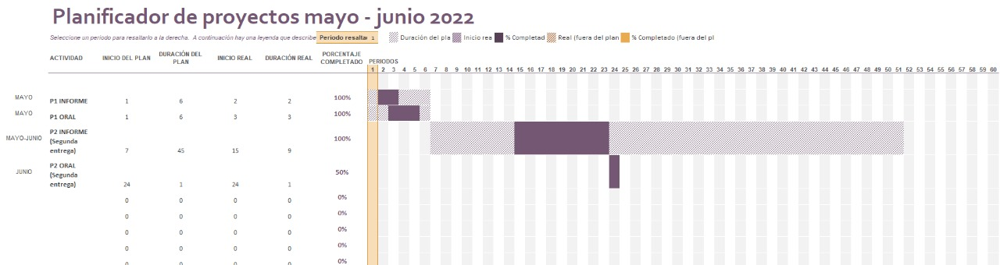

### **Introducción**

Relevancia: Conocer los diferentes gastos que un alumno universitario
tiene al mes e identificar el monto total que emplea el estudiante al
mes. Planificación: 

### **Datos**

Recolección de datos:

Proceso de recolección de datos: Primero se realizó una encuesta con 28
variables. Para que tenga más acogida se utilizó un sorteo a una
discoteca "Valetodo Downtown" La encuesta se mandó por vía correo
electrónico, whatsapp y presencial. Se utilizaron esos medios porque
eran los más accesibles para nosotros, pues no sabíamos por qué medios
más encuestar. Puesto que, no se lograba completar la muestra requerida,
se optó por realizar la encuesta de uno en uno en los pasillos de UTEC.
Se trató de llegar a la población por medio de nuestros conocidos y
amigos. Finalmente se logró completar 204 observaciones.

Población, muestra y muestreo:

La población a estudiar es la comunidad educativa UTEC. Se tomó una
muestra de 204 estudiantes, se trató de hacerla lo más representativa
posible, considerando si los estudiantes son becados o no, la escala de
pago, la carrera y el ciclo. Pero, por motivos de tiempo se utilizó un
muestreo por conveniencia, pues, no teníamos el alcance a todos los
estudiantes. Esto consistió en enviar las encuestas a las personas
cercanas a nosotros, conocidos de conocidos y por último la vía
presencial en los pasillos de la UTEC.

### **VARIABLES:**

+-------------------+----------------+--------------------------------+
| VARIABLE          | TIPO DE        | RESTRICCIONES                  |
|                   | VARIABLE       |                                |
+===================+================+================================+
| Alquiler          | variable       | Números enteros no negativos   |
|                   | numérica,      | en soles.                      |
|                   | discreta       |                                |
+-------------------+----------------+--------------------------------+
| Gastos en pasaje  | variable       | Números enteros no negativos   |
|                   | numérica,      | en soles.                      |
|                   | discreta       |                                |
+-------------------+----------------+--------------------------------+
| Gastos en la      | variable       | Números enteros no negativos   |
| alimentación      | numérica,      | en soles.                      |
|                   | discreta       |                                |
+-------------------+----------------+--------------------------------+
| Pago del Servicio | variable       | Números no negativos.\         |
| de Agua           | numérica,      | en soles.                      |
|                   | continua       |                                |
+-------------------+----------------+--------------------------------+
| Pago del Servicio | variable       | Números no negativos.\         |
| de Luz            | numérica,      | en soles.                      |
|                   | continua       |                                |
+-------------------+----------------+--------------------------------+
| Pago del Servicio | variable       | Números no negativos.\         |
| de Gas Natural    | numérica,      | en soles.                      |
|                   | continua       |                                |
+-------------------+----------------+--------------------------------+
| Mensualidad de la | variable       | Números enteros no negativos   |
| universidad       | numérica,      | en soles.                      |
|                   | discreta       |                                |
+-------------------+----------------+--------------------------------+
| Materiales de     | variable       | Números enteros no negativos   |
| estudio           | numérica,      | en soles.                      |
|                   | discreta       |                                |
+-------------------+----------------+--------------------------------+
| Gastos en         | variable       | Números enteros no negativos   |
| vestimenta        | numérica,      | en soles.                      |
|                   | discreta       |                                |
+-------------------+----------------+--------------------------------+
| Gastos en cursos  | variable       | Números enteros no negativos   |
| extracurriculares | numérica,      | en soles.                      |
|                   | discreta       |                                |
+-------------------+----------------+--------------------------------+
| Gastos en salidas | variable       | Números enteros no negativos   |
|                   | numérica,      | en soles.                      |
|                   | discreta       |                                |
+-------------------+----------------+--------------------------------+
| Gastos en aseo    | variable       | Números enteros no negativos   |
| personal          | numérica,      | en soles.                      |
|                   | discreta       |                                |
+-------------------+----------------+--------------------------------+
| Gastos extras     | variable       | Números enteros no negativos   |
|                   | numérica,      | en soles.                      |
|                   | discreta       |                                |
+-------------------+----------------+--------------------------------+
| Créditos          | variable       | Números enteros                |
| matriculados      | numérica,      | en soles desde 1 a 26          |
|                   | discreta       |                                |
+-------------------+----------------+--------------------------------+
| Carrera           | variable       | Carreras disponibles en la     |
|                   | categórica,    | universidad UTEC               |
|                   | nominal        |                                |
+-------------------+----------------+--------------------------------+
| Ciclo             | variable       | Números enteros                |
|                   | categórica,    | desde 1 a 10                   |
|                   | ordinal        |                                |
+-------------------+----------------+--------------------------------+
| Becado            | variable       | Tiene dos opciones: Si y No    |
|                   | categórica,    |                                |
|                   | nominal        |                                |
+-------------------+----------------+--------------------------------+
| Escala            | variable       | Letras desde A a E             |
|                   | categórica,    |                                |
|                   | nominal        |                                |
+-------------------+----------------+--------------------------------+
| Residencia        | variable       | Tiene dos opciones:            |
|                   | categórica,    | Vivienda alquilada y           |
|                   | nominal        | Vivienda propia                |
+-------------------+----------------+--------------------------------+
| Transporte        | variable       | Tiene tres opciones:           |
|                   | categórica,    | A pie, Bus y                   |
|                   | nominal        | Vehículo propio                |
+-------------------+----------------+--------------------------------+


### **Limpieza de base de datos**

En nuestra base de datos llamada Formulario.csv se usó los criterios de
decisión

- Al comienzo de nuestra encuesta observamos valores erróneos (alejados de la realidad); entonces reconsultamos la fuente a los entrevistados para garantizar un mejor resultado.
- Todos los valores numéricos de los gastos fueron restringidos con números enteros para evitar tener datos sucios numéricos. 
- Restringimos todas las respuestas como obligatorio para no tener datos vacíos. 
- Eliminamos las tres primeras columnas de las variables: marca temporal,
correo y nombres.
- Cambiamos de nombre a todas nuestras variables por nombres cortos para facilitar las interpretaciones en las gráficas. 
- Obtuvimos una base de datos limpia que posteriormente nos facilitará en el análisis de los datos.

#### **Proceso de limpieza de datos**

```{r,echo=FALSE,message=FALSE}
if (!require("readr")) install.packages("readr")
if (!require("ggplot2")) install.packages("ggplot2")
if (!require("dplyr")) install.packages("dplyr")
if (!require("cowplot")) install.packages("cowplot")
if (!require("tidyr")) install.packages("tidyr")
if (!require("psych")) install.packages("psych") 
```


```{r}
library(readr)
```

```{r}
library(ggplot2)
``` 

```{r,message=FALSE,warning=FALSE}
library(dplyr)
```

```{r,message=FALSE,warning=FALSE}
library(cowplot)
```

```{r,message=FALSE,warning=FALSE}
library(tidyr)
```

```{r,message=FALSE,warning=FALSE}
library(psych)
```


Leemos las columnas 4 a 29 de nuestra base de datos

```{r}
Datos <- read_csv("Formulario.csv") %>% select(4:29)
```

Realizamos el cambio de nombre a las variables (El M y S antes de cada una es por mensual y semanal).

```{r echo=FALSE}
Datos <- rename(Datos,Becado = "¿Eres becad@?",Escala ="Colocar tu escala de pago UTEC",M_Alquiler="¿Cuál es el costo  de tu vivienda alquilada?(departamento, habitación, minidepartamento, etc.)?",M_Gasolina= "¿Cuánto gastas en gasolina mensualmente?. Colocar el gasto personal, en caso el gasto lo solvente otra persona, poner 0",S_Alimentacion ="¿Cuánto gastas semanalmente en alimentación? Colocar el gasto personal, en caso el gasto lo solvente otra persona, poner 0",M_Agua="¿Cuánto pagas mensualmente por el servicio de agua de acuerdo a tu recibo? En caso no pagues este servicio colocar 0",M_Luz="¿Cuánto pagas mensualmente por la luz eléctrica de acuerdo a tu recibo? En caso no pagues este servicio colocar 0",Gas_serv="¿Con qué  servicio de gas cuentas?",M_gasN="¿Cuánto pagas mensualmente por el gas natural? (de acuerdo a tu ultimo recibo) En caso no pagues este servicio colocar 0" ,Gas_balon="¿Cuánto pagas por el balón de gas? Colocar el gasto personal, en caso el gasto lo solvente otra persona, poner 0",M_Internte="¿Cuánto pagas mensualmente  por el servicio de internet? En caso no pagues este servicio colocar 0",M_estudio_mat="¿Cuánto gastas mensualmente en tus materiales de estudio?",M_Salud="¿Cuánto gastas mensualmente en salud? En caso no gastes colocar 0",M_AseoPersonal="¿Cuánto gastas mensualmente en aseo personal? Por ejemplo: crema dental, perfume, etc." , Gastos_extras="¿Cuál es el monto de tus gastos extras? Por ejemplo: vestimenta, gastos en entretenimiento o salidas, cuidado personal, etc. Si no tienes considerar 0",M_Presupuesto= "¿Cuál es tu presupuesto mensual? (gasto estimado, teniendo en cuenta los ingresos mensuales)",M_Plataformas_serv=  "¿Cuánto pagas mensualmente  por el servicio de plataformas en internet? Por ejemplo, Netflix, Canva, Disney, Amazon, etc. En caso de no utilizar ninguna plataforma de paga colocar 0",Cant_Cursos_extracurriculares= "¿Cuántos cursos extracurriculares llevas?",M_Cursos_extracurriculares="¿Cuánto gastas mensualmente en cursos extracurriculares? en caso no lleves ninguno colocar 0",Creditos= "Colocar N° de créditos del ciclo", Mensualidad_univ="¿Cuánto pagas la mensualidad de la universidad?" ,Residencia="¿Dónde resides actualmente?",Transporte= "¿Qué medio de transporte usas con frecuencia para trasladarte a UTEC?",Pasaje="¿Cuánto gastas en el pasaje mensualmente?")
```

Incluimos una variable adicional a nuestra base de datos

- Total_gasto : Representa el gasto mensual de un estudiante.

```{r}
Total_gasto_ <- Datos %>% select(M_Alquiler:M_Luz,M_gasN:Gastos_extras,M_Plataformas_serv,M_Cursos_extracurriculares,Mensualidad_univ,M_Gasolina,Pasaje) %>% rowSums()

Datos <- Datos %>% mutate(Total_gasto = Total_gasto_+3*S_Alimentacion)
```


## Analisis Descriptivo

## Descriptores Numéricos

Resumen de los principales gastos. Se han eliminado todos los ceros de la muestra para el resumen

```{r,echo=FALSE,message=FALSE,warning=FALSE}
data_ceros <- Datos %>% filter(S_Alimentacion > 0, M_Agua > 0, M_Luz > 0,
                    M_Internte > 0, M_estudio_mat > 0, M_Salud >0,
                    M_AseoPersonal > 0, Gastos_extras > 0,
                    M_Presupuesto > 0, M_Presupuesto < 20000,Total_gasto < 50000)
tab <- describe(data_ceros) %>% as.data.frame() %>%
       select(-range,-vars,-n,-trimmed,
             -mad,-skew,-kurtosis,-se)
tab <- tab[c(6:8,12:17,27),] 
tab
```


## Alumnos por ciclo

```{r echo=FALSE}
Datos %>% ggplot(aes(as.factor(Ciclo))) +
  geom_bar(fill="steelblue") +
  labs(title="Ciclo de los estudiantes",x="Ciclo",y="Frecuencia")+
  theme(plot.title = element_text(hjust = 0.5))

max_ciclo <- sum(Datos$Ciclo == 2)
max_ciclo
max_ciclo/nrow(Datos)*100
```

La mayoría de alumnos encuestados se encuentra en el 2do ciclo, con un total de 91 alumnos que representan el 45% del total de encuestados.

## Alumnos por carrera

Se muestra la cantidad de alumnos por carrera que fueron encuestados.

```{r echo=FALSE}
Datos %>% group_by(Carrera) %>% summarize(Frecuencia = round(length(Carrera)/204,2)*100) %>%          
          ggplot(aes(y=reorder(Carrera,Frecuencia),x=Frecuencia))+
          geom_col(aes(fill = Frecuencia))+
          geom_text(aes(label = Frecuencia), 
                    hjust=+1.5,color="white",
                    vjust=+0.35,size=3.5)+
          scale_fill_gradient(low="gray",high="steelblue")+
          theme(legend.position = "none")+
          labs(y="Carrera",title = "Porcentaje de alumnos por carrera",
              x="Porcentaje")
```

Los alumnos de Ingeniería Industrial fueron los más consultados, en cuanto a los menos consultados fueron de Administración y Negocios Digitales y Ciencia de Datos. Es coherente dado que la carrera de Ingeniería Industrial tiene la mayor cantidad de alumnado en la universidad y en cuanto a las otras mencionadas son carreras que iniciaron recién en el periodo 2021-1.


## Cantidad de becados

```{r}
Datos %>% group_by(Becado) %>% summarize(Frecuencia =length(Becado)) %>%
          mutate(Porcentaje=round(Frecuencia/sum(Frecuencia),2)) %>% arrange(desc(Frecuencia))
```

Hay 119 alumnos becados y 85 no becados que fueron encuestados.

## Créditos matriculados

```{r echo=FALSE}
Datos %>% group_by(Creditos) %>% summarize(Frecuencia=length(Creditos)) %>% 
          rbind(c(4,0),c(3,0),c(2,0),c(1,0)) %>% arrange(Creditos) %>%
          ggplot(aes(x = as.factor(Creditos),y = Frecuencia)) +
          geom_bar(stat="identity",fill="steelblue") +
          labs(title="Créditos matriculados",x="Créditos",y="Frecuencia")+
          theme(plot.title = element_text(hjust = 0.5))
```

La mayoría de alumnos lleva 20 créditos en un ciclo. La gráfica tiene la forma de una distribución normal.


## Presupuesto 

En el caso del presupuesto, se ha filtrado un alumno que tiene un presupuesto muy alto. Esto se hace para que se obtenga una mejor gráfica

```{r echo=FALSE}
#Valor de presupuesto máximo
max(Datos$M_Presupuesto)
```


```{r echo=FALSE}
Datos %>% filter(M_Presupuesto < 20000) %>%
          ggplot(aes(y=M_Presupuesto,x=Becado))+
          geom_boxplot(fill="steelblue")+
          labs(title="Presupuesto mensual de los alumnos becados y no becados",x="Becado",y="Presupuesto")+
          theme(plot.title = element_text(hjust = 0.5))
```

Observamos que los alumnos becados tienen una menor dispersión en los datos en comparación a los no becados. La mediana del presupuesto de los alumnos becados es mayor al de los alumnos no becados. Esto puede deberse porque los estudiantes becados reciben una mensualidad fija de parte del Estado. 
Los alumnos no becados registran valores atípicos.

## Gasto mensual del alumno

Para hacer una comparación más justa, al gasto total mensual le quitaremos el gasto por mensualidad y el gasto de alquiler.

```{r echo=FALSE,message=FALSE,warning=FALSE}
Datos %>% mutate(Gasto_ = Total_gasto - Mensualidad_univ - M_Alquiler) %>% 
          ggplot(aes(y=Gasto_,x=Becado))+
          geom_boxplot(fill="steelblue")+
          labs(title="Gasto mensual de los alumnos becados y no becados",x="Becado",y="Gasto mensual")+
          theme(plot.title = element_text(hjust = 0.5))
```

Observamos que los alumnos becados tienen menos dispersión en los datos en comparación a los alumnos no becados. La mediana de los alumnos no becados es ligeramente mayor al de los alumnos becados. Ambos grupos presentan valores atípicos

## Gasto de Luz

```{r echo=FALSE,message=FALSE,warning=FALSE}
Datos %>% filter(M_Luz<20000) %>% ggplot(aes(y=M_Luz,x=Becado))+
          geom_boxplot(fill="steelblue")+
          labs(title="Gasto de luz de los alumnos becados y no becados",x="Becado",y="Gasto de luz")+
          theme(plot.title = element_text(hjust = 0.5))
```

La mediana del gasto de luz de los alumnos no becados es de 0. Eso indica que muchos estudiantes no consideraron ese gasto en su presupuesto. En el caso de los estudiantes becados la mediana es mayor.
La dispersion de datos es menor en el caso de los estudiantes becados.

## Gasto de gas natural

```{r echo=FALSE,message=FALSE,warning=FALSE}
Datos %>% filter(M_gasN<20000) %>% ggplot(aes(y=M_gasN,x=Becado))+
          geom_boxplot(fill="steelblue")+
          labs(title="Gasto de gas natural de los alumnos becados y no becados",x="Becado",y="Gasto de gas natural")+
          theme(plot.title = element_text(hjust = 0.5))
```

En ambos grupos de estudiantes la mediana de los datos es 0. Indica que la mayoría de estudiantes no cosideraron este gasto en su presupuesto. Los alumnos no becados tienen varios valores atípicos.


## Gasto de agua

```{r echo=FALSE}
Datos %>% filter(M_Agua<20000) %>% ggplot(aes(y=M_Agua,x=Becado))+
          geom_boxplot(fill="steelblue")+
          labs(title="Gasto de agua de los alumnos becados y no becados",x="Becado",y="Gasto de agua")+
          theme(plot.title = element_text(hjust = 0.5))
```

El 50% a más de los estudiantes de los estudiantes no becados no han considerado el gasto de agua en su presupuesto. Los datos de los alumnos becados están menos dispersos. Ambos presentan valores atípicos.


## Gasto de alimentación

```{r echo=FALSE}
Datos %>% filter(S_Alimentacion<20000) %>% ggplot(aes(y=4*S_Alimentacion,x=Becado))+
          geom_boxplot(fill="steelblue")+
          labs(title="Gasto de alimentacion de los alumnos becados y no becados",x="Becado",y="Gasto de alimentación")+
          theme(plot.title = element_text(hjust = 0.5))
```

Existe mayor dispersión de datos en el caso de alumnos no becados. En ambos hay valores atípicos. La mediana de los gastos de alimentación de alumnos becados es mayor al de los no becados.

## Gasto de Internet

```{r echo=FALSE}
Datos %>% filter(M_Internte<20000) %>% ggplot(aes(y=M_Internte,x=Becado))+
          geom_boxplot(fill="steelblue")+
          labs(title="Gasto de internet de los alumnos becados y no becados",x="Becado",y="Gasto de internet")+
          theme(plot.title = element_text(hjust = 0.5))
```

Así como en casos anteriores, la mediana de los datos de los alumnos no becados es 0. Varios no han considerado los gastos de internet en su presupuesto. Ambos gráficos presentan datos dispersos.

## Gasto en balón de gas


```{r echo=FALSE}
Datos %>% filter(Gas_balon<20000) %>% ggplot(aes(y=Gas_balon,x=Becado))+
          geom_boxplot(fill="steelblue")+
          labs(title="Gasto en balón de gas de los alumnos becados y no becados",x="Becado",y="Gasto en balón de gas")+
          theme(plot.title = element_text(hjust = 0.5))
```

La mediana de los datos de ambos grupos es de 0. Más del 50% de los estudiantes no han considerado los gastos de balón de gas en su presupuesto. Ambos gráficos presentan datos dispersos.

## Gasto de materiales

```{r echo=FALSE}
Datos %>% filter(M_estudio_mat<20000) %>% ggplot(aes(y=M_estudio_mat,x=Becado))+
          geom_boxplot(fill="steelblue")+
          labs(title="Gasto de materiales de los alumnos becados y no becados",x="Becado",y="Gasto de materiales")+
          theme(plot.title = element_text(hjust = 0.5))
```

La dispersión de datos en ambos grupos es baja. La mediana de los gastos de materiales en los alumnos becados es mayor a la del grupo de no becados. Se presentan datos atípicos en los dos grupos.


## Gastos de Salud

```{r echo=FALSE}
Datos %>% filter(M_Salud<20000) %>% ggplot(aes(y=M_Salud,x=Becado))+
          geom_boxplot(fill="steelblue")+
          labs(title="Gasto en salud de los alumnos becados y no becados",x="Becado",y="Gasto en salud")+
          theme(plot.title = element_text(hjust = 0.5))
```

El 50% a más de los estudiantes no becados no han considerado gasto de salud en su presupuesto. Se presentan datos atípicos en los dos grupos.

## Gastos de Aseo Personal

```{r echo=FALSE}
Datos %>% filter(M_AseoPersonal<20000) %>% ggplot(aes(y=M_AseoPersonal,x=Becado))+
          geom_boxplot(fill="steelblue")+
          labs(title="Gasto en Aseo Personal de los alumnos becados y no becados",x="Becado",y="Gasto en Aseo Personal")+
          theme(plot.title = element_text(hjust = 0.5))
```

Los alumnos becados tienen una mediana mayor en gastos de aseo personal en comparación a los no becados. Además que presentan menor dispersión de los datos. Ambos grupos tienen valores atípicos.


## Gastos extras

```{r echo=FALSE}
Datos %>% filter(Gastos_extras<20000) %>% ggplot(aes(y=Gastos_extras,x=Becado))+
          geom_boxplot(fill="steelblue")+
          labs(title="Gastos extras de los alumnos becados y no becados",x="Becado",y="Gastos extras")+
          theme(plot.title = element_text(hjust = 0.5))
```

Ambos grupos presentan poca dispersión de datos. La mediana de ambos grupos es similar en los gastos extras. Presentan pocos valores atípicos.

## Comparación de los tipos de gastos

```{r}
prueba <- gather(data = Datos, key = "tipo", value = "cantidad", c(6:8,10:16))
prueba %>%  filter(cantidad < 750) %>% ggplot(aes(x=reorder(tipo,cantidad),y=cantidad))+
            geom_boxplot(fill="steelblue")+
            labs(title = "Comparación de los tipos de gastos",
                    x="Tipo de gastos",y="Gastos")+
          theme(axis.text.x = element_text(angle = 45, hjust = 1),
                legend.position = "none")
```

Hacemos una comparación de los diferentes tipos de gastos

## Gastos de Agua y Luz

Realizamos una comparación entre los datos de agua y luz y veremos como se comportan. Eliminaremos los datos de luz y agua que sean de 0.

```{r echo=FALSE,message=FALSE,warning=FALSE}
Datos %>% filter(M_Luz > 0, M_Agua > 0) %>% ggplot(aes(M_Luz,M_Agua))+
        geom_point(color="darkblue")+
        #expand_limits(y=0,x=0)+
        labs(title="Gasto de Agua vs Gasto de Luz",x="Luz",
             y="Agua")+
        theme(plot.title = element_text(hjust = 0.5))+
        geom_smooth(method=lm ,se = FALSE, formula = y~x, color="darkred")  
```

En la gráfica la linea roja es la recta de regresión que se ajusta a los datos, este se realiza utilizando geom_smooth porque dentro de sus parámetros se encuentra el parámetro method = lm (linear model).


Hallamos la correlación entre las variables
```{r}
cor(Datos$M_Agua,Datos$M_Luz,use='complete.obs')
```
La correlación es de 0.77. Lo que significa que las variables están fuertemente correlacionadas positivamente.

## Gastos de salud y aseo personal

Realizamos una comparación entre los datos de salud y aseo personal y veremos como se comportan. Eliminaremos los datos de salud y de aseo personal que sean 0.

```{r echo=FALSE,message=FALSE,warning=FALSE}
Datos %>% filter(M_AseoPersonal > 0, M_Salud > 0) %>% ggplot(aes(M_AseoPersonal,M_Salud))+
        geom_point(color="darkblue")+
        labs(title="Gasto de Salud vs Gasto de Aseo Personal",x="Aseo Personal",
             y="Salud")+
        theme(plot.title = element_text(hjust = 0.5))+
        geom_smooth(method=lm ,se = FALSE, formula = y~x, color="darkred")  
```

Hallamos la correlación entre las variables
```{r}
cor(Datos$M_AseoPersonal,Datos$M_Salud,use='complete.obs')
```
La correlación es de 0.2. Lo que significa que las variables tienen una correlación positiva baja. No hay una dependencia lineal entre las variables.


## Análisis Probabilistico

## Carrera
Quisieramos analizar la carrera de la muestra de estudiantes. En particular escogeremos como caso a los estudiantes de Ingeniería Industrial ya que son mayoría en nuestra muestra.

El experimento que proponemos es el siguiente:
Examinar el número de intentos hasta que encontremos al primer estudiante que se encuentre en la carrera de Ingeniería Industrial

De acuerdo a nuestro experimento entonces utilizaremos una distribución geométrica.

Disponemos de 47 estudiantes de Ingeniería Industrial de un total de 204 estudiantes.

El espacio muestral es:
Espacio = {"Estudiante de Industrial","Otra carrera"}

Tenemos las siguientes consideraciones:

- Estudiante de Industrial como caso de éxito.
- Otra carrera como caso de no éxito.

```{r}
##Probabilidad de Exito
p_exito <- sum(Datos$Carrera == "Ingeniería Industrial")/nrow(Datos)
p_exito
```

Variable Aleatoria X = Número de intentos hasta encontrar el primer estudiante de Ingeniería Industrial

$$ X \sim Geom(0.23)$$
Veremos las gráficas de función de masa en la distribución geométrica y de distribución acumulada.

```{r}
data_geom <- data.frame(first = dgeom(0:50,0.23),second = 1:51)
data_geom %>% ggplot(aes(x=second,y=first))+
geom_point(color="steelblue")+
geom_segment( aes(x=second, xend=second, y=0, yend=first), color="grey")+
geom_vline(xintercept = 1/p_exito,linetype="dashed",color="red")+
labs(title="Función de masa de probabilidad en una distribución geométrica",x="X: # Intentos",y="P(X = x)")+
theme(plot.title = element_text(hjust = 0.5))+
annotate("text", x = 44.5, y = 0.2, label = "Esperanza")+
annotate("text", x = 39, y = 0.205, label = "---",color="Red",size=10)
```

```{r}
data_geom <- data.frame(first = pgeom(0:50,0.23),second = 1:51)
data_geom %>% ggplot(aes(x=second,y=first))+
geom_point(color="steelblue")+
geom_segment( aes(x=second, xend=second, y=0, yend=first), color="grey")+
labs(title="Función acumulada de la distribución geométrica",x="X: # Intentos",y="P(X <= x)")+
theme(plot.title = element_text(hjust = 0.5))
```

Valor esperado
```{r}
round(1/p_exito,2)
```
#### Casos de cálculo
¿Cuál es la probabilidad de hallar el primer estudiante de Ingenieria Industrial después de 10 intentos o más ? (P(X > 9)) = 1 - P(X <= 9)

```{r}
1-pgeom(9-1, 0.23)
```
La probabilidad es de un 9.5%

¿Cuál es la probabilidad de hallar el primer estudiante de Ingenieria Industrial a lo más en 5 intentos ? (P(X <= 5))

```{r}
pgeom(5-1, 0.23)
```
La probabilidad es de un 73%.


## Gasto de Alquiler
Quisieramos analizar el gasto de alquiler de los estudiantes. Para ello vamos a reducir nuestra base de datos y consideraremos solo a aquellos estudiantes que viven en una vivienda alquilada. 

```{r}
Datos_2 <- Datos %>% filter(Residencia == "Vivienda alquilada")
```

Crearemos una variable adicional llamado Precio, esta será una variable categórica, la cual tendrá dos valores: Mayor a 1000 y 1000 o menos. De acuerdo a nuestro criterio.

- Mayor: Costo de alquiler mayor a 1000 soles.
- Menor: Costo de alquiler menor o igual a 1000 soles.

```{r}
Datos_2$Precio <- ifelse(Datos_2$M_Alquiler>1000,"Mayor","Menor")
```

Vemos los resultados
```{r}
table(Datos_2$Precio)
```

Nuestra consulta es ¿Cuál es la probabilidad que "x" Estudiantes alquilen una vivienda a un precio menor a 1000 soles de la muestra de 87 estudiantes?
Dada esta consulta utilizaremos una distribución binomial.

El espacio muestral es:
Espacio = {"Alumno que alquile una vivienda a un precio de 1000 soles o menos","Alumno que alquile una vivienda a precio mayor a 1000 soles"}

Realizamos las siguientes consideraciones:

- Alumno que alquile una vivienda a un precio de 1000 soles o menos como caso de éxito.
- Alumno que alquile una vivienda a precio mayor de 1000 soles como caso de no éxito.

```{r}
nrow(Datos_2)
c_e <- sum(Datos_2$Precio == "Menor")/nrow(Datos_2)
##Prob.Exito
c_e
c_ne <- sum(Datos_2$Precio == "Mayor")/nrow(Datos_2)
##Prob. No Éxito
c_ne
```


Variable Aleatoria X = Número de estudiantes que alquilan una vivienda a un precio 1000 soles o menos.

$$ X \sim Bin(87,0.87)$$
Veremos las gráficas de la función de masa de la distribución binomial y de distribución acumulada

```{r}
data_binom <- data.frame(first = dbinom(0:87,87,0.87),second = 0:87)
data_binom %>% ggplot(aes(x=second,y=first))+
geom_point(color="steelblue")+
geom_segment( aes(x=second, xend=second, y=0, yend=first), color="grey")+
geom_vline(xintercept = 87*c_e,linetype="dashed",color="red")+
labs(title="Función de masa de la distribución binomial",x="X: # Éxitos",y="P(X = x)")+
theme(plot.title = element_text(hjust = 0.5))+
annotate("text", x = 14, y = 0.12, label = "Esperanza")+
annotate("text", x = 5, y = 0.121, label = "---",color="Red",size=10)
```

```{r}
data_binom <- data.frame(first = pbinom(0:87,87,0.87),second = 0:87)
data_binom %>% ggplot(aes(x=second,y=first))+
geom_point(color="steelblue")+
geom_segment( aes(x=second, xend=second, y=0, yend=first), color="grey")+
labs(title="Función acumulada de la distribución binomial",x="X: # Éxitos",y="P(X <= x)")+
theme(plot.title = element_text(hjust = 0.5))
```

Valor esperado
```{r}
87*c_e
```

Luego pasaremos a las Preguntas.

#### Casos de Cálculo
¿Cuál es la probabilidad que más de 75 Estudiantes alquilen una vivienda a un precio de 1000 soles o menos de la muestra de 87 estudiantes? (P(X > 75))

```{r}
pbinom(75, size=87, prob=0.87, lower.tail = FALSE)
```
La probabilidad que 75 estudiantes alquilen una vivienda a precio de 1000 soles o menos es de 54%.

¿Cuál es la probabilidad que 7 Estudiantes o menos alquilen una vivienda a un precio mayor a 1000 soles de la muestra de 87 estudiantes?    
Para esta pregunta consideramos el caso de precio mayor a 1000 soles como el caso de éxito.
X ~ Bin(87,0.13) (P(X < 7))

```{r}
pbinom(7, size=87, prob=1-0.87)
```
La probabilidad que 7 estudiantes o menos alquiler una vivienda a un precio mayor a 1000 soles es de 11%


## Gasto mensual total
Analizamos esta variable continua para comprobar si sigue una distribución normal.
Primero hallamos la media y la desviación estandar

```{r}
#Media
mean(Datos$Total_gasto,na.rm=TRUE)
#Desviacion estandar
sd(Datos$Total_gasto,na.rm=TRUE)
```

Elaboramos un gráfico que muestra la función de densidad de la variable

```{r echo=FALSE,message=FALSE,warning=FALSE}
## Total gasto 
Datos %>% ggplot()+
          geom_histogram(aes(x=Total_gasto,y=..density..),fill="Steelblue",alpha=0.5)+
          geom_density(aes(x=Total_gasto,y=..density..),size=1.5,color="red")+
          stat_function(col="Darkgreen",fun = dnorm, n = 101, args = list(mean =        mean(Datos$Total_gasto,na.rm=TRUE), sd = sd(Datos$Total_gasto,na.rm=TRUE)),size=1.5)+
          labs(title="Gasto mensual: Distribución Normal ",x="Gasto mensual",y="Densidad")+
          theme(plot.title = element_text(hjust = 0.5))+
          annotate("text", x = 8500, y = 0.0006, label = "Curva observada")+
          annotate("text", x = 6700, y = 0.00064, label = "__",color="Red",size=10)+
          annotate("text",x = 8500, y = 0.00055, label = "Curva normal teórica")+
          annotate("text",x = 6700, y = 0.00059, label = "__",color="Darkgreen",size=10)
          
```

Como se puede apreciar en el gráfico, la curva observada se ajusta a la curva normal teórica, por lo que vamos a tener en cuenta la distribución normal para modelar nuestra variable de Gasto mensual. Procederemos a hallar la función de densidad teórica.


$$f(x) = 0.00026 \times e^{ -\frac{(x-2371.6)^2}{4879063.2}}$$

#### Casos de cálculo

X: Gasto total mensual de un estudiante

Sea X la variable aleatoria que sigue una distribución normal

$$ X \sim N(2371.6,1561.9)$$
Proponemos los siguientes casos:

- Probabilidad de que un estudiante tenga un gasto mensual mayor a 3000 soles (P(X > 3000))

```{r}
pnorm(3000, mean = 2371.6, sd = 1561.9, lower.tail = F)
```
El 34.4% de los alumnos tienen un gasto mayor a 3000 soles.

- Probablidad de que un estudiante tenga un gasto mensual entre 1000 y 3000 soles ( P(1000 <= X <= 2000))

```{r}
pnorm(3000, mean = 2371.6, sd = 1561.9) - pnorm(1000, mean = 2371.6, sd = 1561.9)
```
El 46.6% de los alumnos tiene un gasto mensual entre 1000 y 3000 soles.


## Conclusiones 
- Los alumnos becados presentan menos dispersión en los datos de gastos en comparación a los alumnos no becados.
- Los alumnos no becados en su mayoría no han considerado gastos de servicios básicos y alquiler en sus presupuestos.
- Existe una correlación positiva fuerte entre los gastos de agua y luz de los estudiantes.
- El 87% de los estudiantes encuestados que viven en una propiedad alquilada pagan un precio de 1000 soles o menos. 
- El gasto mensual de los estudiantes sigue una distribución normal donde el 46.6% de los estudiantes tiene un gasto entre 1000 y 3000 soles.


