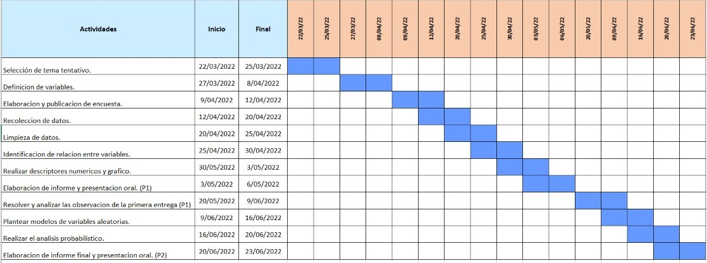

# **"EL USO DE REDES SOCIALES EN LOS ESTUDIANTES DE UTEC"**

## **Introducción**

### Relevancia:
Las redes sociales son un medio de interacción muy común entre jóvenes, más aún entre universitarios que lo destinan con diversos usos, por esta razón nos llamó la atención investigar acerca de ello. 
Nuestro proyecto de investigación se basa en el uso de redes sociales en estudiantes de la universidad de ingeniería y tecnología (UTEC) para conocer el tiempo empleado, la finalidad, ventajas y consecuencias que conlleva su uso. 

**Objetivo principal:**
Investigar el uso de redes sociales entre los estudiante de UTEC, con el fin de analizar la relación que existe entre las variables propuestas por nuestro proyecto.

**Objetivos secundarios:**
1. Determinar la finalidad de uso de Redes sociales que los estudiantes de UTEC poseen.
2. Conocer la red social más frecuente entre los estudiantes y el tiempo empleado.
3. Utilizar descriptores estadísticos para la relación entre variables.

### Planificación:
Realizamos un diagrama de Gantt con las actividades para la elaboracion de nuestro proyecto, respetando las fechas de entrega durante el ciclo para lograr un trabajo ordenado y eficaz.



## **Datos**

### Proceso de recolección de datos:
Para realizar la recolección de datos, creamos una encuesta que cuenta con 13 variables y está dirigida a todos los estudiantes de UTEC. Optamos por realizar nuestra propia encuesta, debido a que estamos buscando una base de datos que se adecue de manera muy específica al propósito de nuestra investigación. Las condiciones en que realizamos esta encuesta fue de manera virtual de una forma rápida y sencilla para los estudiantes, pues la mayoría cuenta con un dispositivo tecnológico para poder realizarla. 
La difusión de esta encuesta fue a través de redes sociales, para ser específicos, WhatsApp y Telegram, haciendo uso de los grupos de estudios de la universidad, siempre tomando en cuenta el no generar spam. Y como estrategia para motivar a los estudiantes a realizar nuestra encuesta, realizaremos un sorteo.

### Población, muestra y muestreo:
+ Población: Estudiantes de UTEC que están cursando el semestre 2022-1.
+ Muestra: Todos los estudiantes de la universidad que tengan entre 15 y 30 años,nuestro tamaño de muestra es de 203 y tiene una representatividad adecuada, a partir de ello trabajamos a través de la recolección de datos para obtener nuestra muestra. 
+ Muestreo: Es un muestreo por conveniencia

### Variables:

| Pregunta formulada |    Variable     |  Tipo de Variable  |                                   Restricciones                                   |                                              Descripción                                               |
|:----------------:|:-----------------:|:----------------:|:----------------:|
|         -        |         Edad      | Numérica discreta|En la pregunta solo se seleccionan alternativas dentro de un rango de 15-30 años.                                            |                                    Indica el ciclo del estudiante.                                  |
|        -         |     Género      | Categórica nominal |    Pregunta cerrada (masculino, femenino y prefiero no decirlo).                              |                                       Indica la pensión de pago.                                       |,
|        -         |   Carrera   |Categórica nominal   |La pregunta era solo de opciones para seleccionar con las carreras de la población estudiada(UTEC).                 |                                  Cantidad de cursos que se matriculó.                                  |
|        -         |     Ciclo      | Categórica ordinal |Solo se seleccionan números enteros con un rango de 1 a 10.             
|¿Cuántos dispositivos tecnológicos tienes para navegar en redes sociales?|    CantiDIS      | Numérica discreta  |          Se expresa con unidades en minutos y debe ser un número entero           |                     Minutos que tarda transportarse desde y hacia el Campus al día                     |
|¿Qué dispositivo usas con mayor frecuencia  para navegar en las redes sociales?| DispoRs| Numérica discreta  |Solo consideramos a un rango de 1 a 5 y se seleccionan.|                 Monto en soles destinado al transporte desde y hacia el campus al día                  |
|¿Cuántas aplicaciones de redes sociales tienes instaladas?|CanAPP   | Numérica discreta |Solo se seleccionan entre Laptop, Celular, Computadora, Tablet y IPad.
|¿Cuál es la red social que usas con más frecuencia?|Rsfav | Categórica nominal |  Se seleccionan de un rango de 1 a 20 aplicaciones. |                                  Grupo al que pertenece el estudiante                                  |
|¿Cuántas horas estudias al día?, fuera de clases| HsFC   | Númerica discreta  | Solo consideramos para seleccionar de un rango de 1 a 5 horas y se seleccionan solo uno.      |
|¿Revisas las redes sociales antes de dormir?|  RevRS  | Categórica nominal |     La pregunta es cerrada porque era solo de opciones.  |
|Aproximadamente, ¿cuántas horas al día dedicas a las redes sociales?|  HorRS  | Numérica discreta  |Solo consideramos para seleccionar de un rango de 1 a 8 horas y se seleccionan solo uno. | 
|¿Te distraes en clase usando alguna red social?| DisCLAS  | Categórica nominal |La pregunta es cerrada.                 |
|¿Con qué fin usas las redes?|   FinRS  | Categórica nominal |Se seleccionan alternativas de una lista                            |


# **Limpieza de datos** 

Antes de dar inicio a nuestra limpieza de datos, realizaremos la lectura de nuestra base de datos para ejecutar todo el trabajo.

```{r,include=FALSE}
library(readr)
library(tidyr)
library(dplyr)
library(modeest)
library(stringr)
library(tidyverse)
library(ggplot2)
DBT <- read_csv("DatosR.csv")
```

Luego de ello, observamos que en nuestra base de datos encontramos dos columnas que no necesitaremos para nuestro estudio, las cuales son la marca temporal y la dirección de correo electrónico. Por ello eliminaremos estas dos columnas de la siguiente formas: 

```{r}
DBT <- DBT[,c(3:15)]#En esta linea de código se están eliminando "Marca temporal" y "Dirección de correo electrónico" 
DBT <- DBT[complete.cases(DBT),]
```

Con la función names, podemos conocer el nombre de todas nuestras variables. 
```{r}
names(DBT)
```

Ahora generada la base de datos de "DatosR" a "DBT" procederemos a la modificación de las variables para poder manejar con mayor facilidad.

```{r}
rename (DBT, 
        Edad = "Edad", 
        Genero = "Género", 
        Carrera = "Carrera", 
        Ciclo = "Ciclo",  
        CantiDIS = "¿Cuántos dispositivos tecnológicos tienes para navegar en redes sociales?", 
        DispoRs = "¿Qué dispositivo usas con mayor frecuencia  para navegar en las redes sociales?", 
        CantiAPP= "¿Cuántas aplicaciones de redes sociales tienes instaladas?", 
        Rsfav = "¿Cuál es la red social que usas con más frecuencia?", 
        HsFC = "¿Cuántas horas estudias al día?, fuera de clases", 
        RevRs = "¿Revisas las redes sociales antes de dormir?",  
        HorRs = "Aproximadamente, ¿cuántas horas al día dedicas a las redes sociales?",DisCLAS = "¿Te distraes en clase usando alguna red social?", 
        FinRs = "¿Con qué fin usas las redes?"
) -> DBT
```

Ahora, realizaremos la verificación de datos y el numero de casos completos e incompletos.
```{r}
sum(is.na(DBT)) #cantidad de datos incompletos de DBT
sum(!is.na(DBT)) # Los datos completos.
sum(complete.cases(DBT[,1:13])) # Los casos completos de la base de datos.
sum(!complete.cases(DBT[,1:13])) # La cantidad de casos incompletos.
```
Limpiamos las variables Carrera y Finalidad de uso (FinRs), mediante su verificación ya que estas cuentan con caracteres no permitidos. 

-> Carrera
```{r include=FALSE}
table(DBT$Carrera)
```

```{r}
DBT$Carrera[DBT$Carrera == "Administración y Negocios digitales"] <- "Administracion y Negocios digitales"
DBT$Carrera[DBT$Carrera == "Bioingeniería"] <- "Bioingenieria"
DBT$Carrera[DBT$Carrera == "Ciencia de la Computación"] <- "Ciencia de la Computacion"
DBT$Carrera[DBT$Carrera == "Ingeniería de la Energía"] <- "Ingenieria de la Energia"
DBT$Carrera[DBT$Carrera == "Ingeniería Industrial"] <- "Ingenieria Industrial"
DBT$Carrera[DBT$Carrera == "Ingeniería Química"] <- "Ingenieria Quimica"
DBT$Carrera[DBT$Carrera == "Ingeniería Mecánica"] <- "Ingenieria Mecanica"
DBT$Carrera[DBT$Carrera == "Ingeniería Mecatrónica"] <- "Ingenieria Mecatronica"
DBT$Carrera[DBT$Carrera == "Ingeniería Civil"] <- "Ingenieria Civil"
DBT$Carrera[DBT$Carrera == "Ingeniería Electrónica"] <- "Ingenieria Electronica"
DBT$Carrera[DBT$Carrera == "Ingeniería Ambiental"] <- "Ingenieria Ambiental"
```
-> FinRS
```{r include=FALSE}
table(DBT$FinRs)
```

```{r}
DBT$FinRs[DBT$FinRs == "Académico"] <- "Academico"
DBT$FinRs[DBT$FinRs == "Académico, Económico"] <- "Academico, Economico"
DBT$FinRs[DBT$FinRs == "Académico, Económico, Entretenimiento"] <- "Academico, Economico, Entretenimiento"
DBT$FinRs[DBT$FinRs == "Académico, Entretenimiento"] <- "Academico, Entretenimiento"
DBT$FinRs[DBT$FinRs == "Académico, Laboral, Económico"] <- "Academico, Laboral, Economico"                             
DBT$FinRs[DBT$FinRs == "Académico, Laboral, Entretenimiento"] <- "Academico, Laboral, Entretenimiento"
DBT$FinRs[DBT$FinRs == "Académico, Social"] <- "Academico, Social"
DBT$FinRs[DBT$FinRs == "Académico, Social, Entretenimiento"] <- "Academico, Social, Entretenimiento"
DBT$FinRs[DBT$FinRs == "Académico, Social, Económico"] <- "Academico, Social, Economico"
DBT$FinRs[DBT$FinRs == "Académico, Social, Económico, Entretenimiento"] <- "Academico, Social, Economico, Entretenimiento"
DBT$FinRs[DBT$FinRs == "Académico, Social,  Entretenimiento"] <- "Academico, Social,  Entretenimiento"
DBT$FinRs[DBT$FinRs == "Académico, Social, Laboral"] <- "Academico, Social, Laboral"
DBT$FinRs[DBT$FinRs == "Académico, Social, Laboral, Económico, Entretenimiento"] <- "Academico, Social, Laboral, Economico, Entretenimiento"
DBT$FinRs[DBT$FinRs == "Académico, Social, Laboral, Entretenimiento"] <- "Academico, Social, Laboral, Entretenimiento"
``` 
--> RevRs
```{r}
table(DBT$RevRs)#Observamos que la variable cuenta con un error en uno de sus caracteres
DBT$RevRs[DBT$RevRs == "Sí"] <- "SI"
```
Como tenemos dos variables con respuesta de opción multiple, usaremos el comando grep para poder separar las respuestas. 
-->Rsfav
```{r}
DBT$WhatsApp <- NA
DBT$Instagram <- NA
DBT$Telegram <- NA
DBT$Tiktok <- NA
DBT$Facebook<- NA
DBT$Twitter <- NA
DBT$Youtube <- NA
DBT$Kwai <- NA
DBT$Discord <- NA

DBT$WhatsApp[grep("WhatsApp", DBT$Rsfav)] <- "Sí"
DBT$Instagram[grep("Instagram", DBT$Rsfav)] <- "Sí"
DBT$Telegram[grep("Telegram", DBT$Rsfav)] <- "Sí"
DBT$Tiktok[grep("Tik tok", DBT$Rsfav )] <- "Sí"
DBT$Facebook[grep("Facebook",DBT$Rsfav)] <- "Sí"
DBT$Twitter[grep("Twitter", DBT$Rsfav)] <- "Sí"
DBT$Youtube[grep("Youtube", DBT$Rsfav)] <- "Sí"
DBT$Kwai[grep("Kwai", DBT$Rsfav)] <- "Sí"
DBT$Discord[grep("Discord",DBT$Rsfav)] <- "Sí"

DBT$WhatsApp[is.na(DBT$WhatsApp)] <- "No"
DBT$Instagram[is.na(DBT$Instagram)] <- "No"
DBT$Telegram[is.na(DBT$Telegram)] <- "No"
DBT$Tiktok[is.na(DBT$Tiktok )] <- "No"
DBT$Facebook[is.na(DBT$Facebook)] <- "No"
DBT$Twitter[is.na(DBT$Twitter)] <- "No"
DBT$Youtube[is.na(DBT$Youtube)] <- "No"
DBT$Kwai[is.na(DBT$Kwai)] <- "No"
DBT$Discord[is.na(DBT$Discord)] <- "No"

```

```{r include=FALSE}
DBT %>% select(WhatsApp)%>% filter(WhatsApp=="Sí") -> graf_Whast
DBT %>% select(Instagram)%>% filter(Instagram=="Sí") -> graf_Insta
DBT %>% select(Telegram)%>% filter(Telegram=="Sí") -> graf_Tele
DBT %>% select(Tiktok)%>% filter(Tiktok=="Sí") -> graf_Tik
DBT %>% select(Facebook)%>% filter(Facebook=="Sí") -> graf_Face
DBT %>% select(Twitter)%>% filter(Twitter=="Sí") -> graf_Tw
DBT %>% select(Youtube)%>% filter(Youtube=="Sí") -> graf_You
DBT %>% select(Kwai)%>% filter(Kwai=="Sí") -> graf_Kw
DBT %>% select(Discord)%>% filter(Discord=="Sí") -> graf_Dis

Redes <-c("WhastApp", "Instagram")
for (i in 1:nrow(graf_Whast)){
  Redes[[length(Redes) + 1]]<-"WhastApp"}
for (i in 1:nrow(graf_Insta)){
  Redes[[length(Redes) + 1]]<-"Instagram"}
for (i in 1:nrow(graf_Tele)){
  Redes[[length(Redes) + 1]]<-"Telegram"}
for (i in 1:nrow(graf_Tik)){
  Redes[[length(Redes) + 1]]<-"Tiktok"}
for (i in 1:nrow(graf_Face)){
  Redes[[length(Redes) + 1]]<-"Facebook"}
for (i in 1:nrow(graf_Tw)){
  Redes[[length(Redes) + 1]]<-"Twitter"}
for (i in 1:nrow(graf_You)){
  Redes[[length(Redes) + 1]]<-"Youtube"}
for (i in 1:nrow(graf_Kw)){
  Redes[[length(Redes) + 1]]<-"Kwai"}
for (i in 1:nrow(graf_Dis)){
  Redes[[length(Redes) + 1]]<-"Discord"}

Redes <- Redes [-c(1,2)]
Redeslevels <- factor(Redes, levels = c("WhastApp","Instagram","Telegram",
                                                   "Tiktok","Facebook","Twitter","Youtube","Kwai","Discord"))
```

--> FinRs
```{r}
DBT$Academico <- NA
DBT$Entretenimiento <- NA
DBT$Laboral <- NA
DBT$Social <- NA
DBT$Economico <- NA

DBT$Academico[grep("Academico", DBT$FinRs)] <- "Sí"
DBT$Entretenimiento[grep("Entretenimiento", DBT$FinRs)] <- "Sí"
DBT$Laboral[grep("Laboral", DBT$FinRs)] <- "Sí"
DBT$Social[grep("Social", DBT$FinRs)] <- "Sí"
DBT$Economico[grep("Economico",DBT$FinRs)] <- "Sí"

DBT$Academico[is.na(DBT$Academico)] <- "No"
DBT$Entretenimiento[is.na(DBT$Entretenimiento)] <- "No"
DBT$Laboral[is.na(DBT$Laboral)] <- "No"
DBT$Social[is.na(DBT$Social)] <- "No"
DBT$Economico[is.na(DBT$Economico)] <- "No"

```

```{r include=FALSE}
DBT %>% select(Academico)%>% filter(Academico=="Sí") -> grafAca
DBT %>% select(Entretenimiento)%>% filter(Entretenimiento=="Sí") -> grafEntre
DBT %>% select(Laboral)%>% filter(Laboral=="Sí") -> grafLab
DBT %>% select(Social)%>% filter(Social=="Sí") -> grafSo
DBT %>% select(Economico)%>% filter(Economico=="Sí") -> grafEco

Fin <-c("Academico", "Entretenimiento")
for (i in 1:nrow(grafAca)){
  Fin [[length(Fin) + 1]]<-"Academico"}
for (i in 1:nrow(grafEntre)){
  Fin [[length(Fin) + 1]]<-"Entretenimiento"}
for (i in 1:nrow(grafLab)){
  Fin [[length(Fin) + 1]]<-"Laboral"}
for (i in 1:nrow(grafSo)){
  Fin [[length(Fin) + 1]]<-"Social"}
for (i in 1:nrow(grafEco)){
  Fin [[length(Fin) + 1]]<-"Economico"}

Fin <- Fin [-c(1,2)]
Finlevels <- factor(Fin, levels = c("Academico","Entretenimiento","Laboral",
                                                   "Social","Economico"))
```

# **Análisis descriptivo** 

## Descriptores numéricos y gráficos: 

### **Edad** 
+ Variable numérica discreta
+ La edad mínima de los estudiantes es de 16 años y la máxima de 28 años. 
+ El edad con más frecuencia es de 18 años. 
+ Gracias a la gráfica del boxplot podemos notar que tenemos 6 datos atípicos que corresponden a edades menores de 18años y mayores de 20 años. 
+ Un cuarto de los estudiantes tienen como máximo 18 años y tres cuartos como máximo 19 años. 
```{r}
barplot(table(DBT$Edad), main = "Edades de los alumnos encuestados", ylab = "Frecuencia", xlab = "Edad", col="lightblue",ylim = c(0,80),space = 0,cex.names = 0.8)
boxplot(DBT$Edad,main="Edades de los alumnos encuestados",col="lightblue",horizontal = T)
summary(DBT$Edad)
```

### **Genero**
+ Variable categórica nominal 
+ La mayoria de encuestados son del género masculino, con 106 estudiantes. 
+ La minoria son del género prefiero no decirlo, con 2 estudiantes. 
+ Con esta variable podemos definir la representatividad de nuestra muestra. 
```{r}
table(DBT$Genero)
```

### **Carrera**
+ Variable categórica nominal
+ Al aplicar la funcion table, podemos determinar que la mayoria de estudiantes son de la carrera de Ingeniería Industrial y la minoria de la carrera Ciencia de datos. 
```{r}
table(DBT$Carrera)
```

### **Ciclo**
+ Variable categórica ordinal 
+ Al aplicar la funcion table, podemos determinar que la mayoria de estudiantes son del segundo ciclo.
+ Solo tenemos un estudiante del octavo ciclo.
```{r}
table(DBT$Ciclo)
```

### **¿Cuántos dispositivos tecnológicos tienes para navegar en redes sociales? - CantiDIS**
+ Variable numérica discreta
+ Con la funcion moda, determinamos cual es el numero de dispositivos mas comunes entre los estudiantes para navegar en las redes sociales, el cual es 2. 
```{r}
mfv(DBT$CantiDIS)
```

### **¿Qué dispositivo usas con mayor frecuencia  para navegar en las redes sociales? - DispoRs** 
+ Variable categórica nominal 
+ Al emplear la funcion table, podemos definir que mas de la mitad de los estudiantes usan el celular como dipositivo para navegar en redes sociales y esto podemos comprobarlo con la grafica que empleamos. 
```{r}
table(DBT$DispoRs)
barplot(table(DBT$DispoRs), col = "lightblue", main = "Dispositivo mas usado",cex.main = 1 ,space = 0.3, ylim = c(0,210),cex.names = 1, cex.axis = 0.8,ylab = "Cantidad de alumnos")   
```

### **¿Cuántas aplicaciones de redes sociales tienes instaladas? - CantiAPP **
+ Variable numérica discreta
+ Gracias a la funcion moda, determinamos que la mayoria de estudiantes tiene 3 aplicaciones instaladas para usar las redes sociales. 
+ El mínimo  de aplicaciones en redes sociales instaladas es 1 y el máximo es 20. 
```{r}
mfv(DBT$CantiAPP)
table(DBT$CantiAPP)
```

### **¿Cuál es la red social que usas con más frecuencia? - Rsfav**
+ Variable categórica nominal
+ Luego de haber usado el comando greep para la separación de datos de nuestra variable (Rsfav), realizamos el siguiente código para poder representar nuestra grafica de frecuencia. 
+ Al analizar la gráfica, se observa que la red social WhatsApp predomina ante las otras redes que se encuentraban en las respuestas, siendo más de la mitad del total de datos, el cual obtuvimos con la función table. 
```{r}
table(Redeslevels)
barplot(table(Redeslevels), space = 0.5,cex.names = 0.7, ylim = c(0,200), col = 'lightblue')
```

### **¿Cuántas horas estudias al día?, fuera de clases - HsFC**
+ Variable numerica discreta
+ Al emplear la función moda, nos resulta que las horas de estudio más comunes entre los estudiantes es de 4 horas, pero al hacer una grafico de barras podemos notar que no es mucha la diferencia entre 4 horas y 5 horas.  
```{r}
mfv(DBT$HsFC)
data_HsFC<-factor(DBT$HsFC , levels = c("1","2","3", "4", "5"),ordered = T)
barplot(table(data_HsFC),col = "lightblue", main = "Horas de estudio fuera de de clase",cex.names = 0.6,space= 0,ylim = c(0,60),cex.main = 0.8)
```
 

### **Aproximadamente, ¿cuántas horas al día dedicas a las redes sociales? - HorRs**
+ Variable numérica discreta
+ Con la funcion table, obtenemos la cantidad de horas dedicadas a las redes sociales con más frecuencia entre los estudiantes. 
```{r}
table(DBT$HorRs)
```

### **¿Te distraes en clase usando alguna red social? - DisCLAS**   
+ Variable categorica nominal 
+ La mayoria de estudiante respondieron "a veces" con respecto a la distraccion en clase con las redes sociales.    
```{r}
data_DisCLAS<-factor(DBT$DisCLAS , levels = c("Siempre","Casi siempre","A veces", "Casi nunca", "Nunca"),ordered = T)
barplot(table(data_DisCLAS),col = "lightblue", main = "Distraccion en clases",cex.names = 0.6,space= 0,ylim = c(0,120),cex.main = 0.8)
```

### **¿Con qué fin usas las redes? - FinRs**
+ Variable categorica nominal
+ La mayoría de estudiante usan las redes sociales con la finalidad de entretenerse.  
```{r}
tablafin <- table(Finlevels)
barplot(tablafin, space = 2.5,cex.names = 0.7, ylim = c(0,180), col="lightblue")
table(Finlevels)
```

# **Gráficos de interacción entre dos variables:**  

## Cantidad de dispositivos  - Horas de uso de redes sociales 
+ Con la grafica podemos definiri que los estudiantes que tienen 3 dispositivos para navegar en redes sociales, emplean 4 horas de uso, esto representa la mayoria.
```{r}
boxplot(DBT$CantiDIS ~ DBT$HorRs, xlab = "Cantidad de dispositivos", ylab = "Horas de uso", col=c("lightblue"),varwidth=TRUE)
```

## Ciclo - Distracción en clases
+ La grafica demuestra que los estudiantes del segundo ciclo presentan mayor distracción ante el uso de redes sociales,  pues en todas las variables presentan una mayor densidad en comparación con los otros ciclos.
```{r}
ggplot(data = DBT) +
  geom_count(aes(Ciclo, DisCLAS))
```

## Género - Horas de estudio, fuera de clases
+ Gracias a la gráfica se puede observar que los estudiantes del género femenino, emplean mas horas al estudio fuera de clases en comparacion al género masculino.  
```{r}
plot(table(DBT$Genero, DBT$HsFC), main="Horas de estudio fuera de clases por género", col = "lightblue")
```

## Cantidad de  aplicaciones - Horas de uso
+ En el grafico podemos observar que los que tiene de a 1 a 8 aplicaciones instaladas le dedican mas tiempo a la redes sociales, incluso podemos notar los datos atípicos que se relacionan con la finalidad de su uso. 
```{r}
boxplot(DBT$HorRs~DBT$CantiAPP, xlab = "Cantidad de aplicaciones", ylab = "Horas de uso", col=c("lightblue"))
```

## Edad - Horas de estudio
+ En el diagrama de cajas podemos observar que los alumnos de 16, 17, 18 y 21 años presentan mayor número de horas que le dedican a sus estudios, mientras que los de 22, 23, 27 y 28 años le  dedican menos horas. También podemos observar que en la edad de 19 y 20 años presentan datos atípicos.

```{r}
boxplot(DBT$HsFC~DBT$Edad, xlab = "Edad", ylab = "Horas de estudio", col=c("lightblue"))
```

# **Análisis probabilístico**
Veremos el histograma de todas nuestras variables numericas.

```{r}
library(Hmisc)
hist.data.frame(DBT)
```

En nuestro análisis probabilístico primero analizaremos la edad de nuestros entrevistados, despues analizaremos la cantidad de aplicaciones que tienen en el celular, la cantidad de horas que emplean para el uso de redes sociales y por último la cantidad de dispositivos que usan para navegar en las redes sociales.

### Modelo de distribución normal 
Variable aleatoria : Edad 

El primer paso para analizar una variable es hacer un histograma de la variable y ver su comportamiento.

```{r}
hist(DBT$Edad, main = "Histograma de Edad", xlab = "Edad", ylab="Número #Estudiantes", col = "lightblue", ylim= c(0,90))
```

Procederemos a quitar los datos atípicos 
```{r}
edadNA <-  filter(DBT,as.integer(Edad)<24)
hist(edadNA$Edad,breaks = 10, main = "Histograma sin datos atípicos", xlab= "Edad", ylab="Número #Estudiantes",ylim= c(0,90), col = "lightblue")
```
Usaremos la funcion descdist para ver a que distribucion conocida se asemeja la variable edad
```{r}
library(fitdistrplus)
```

```{r}
descdist(edadNA$Edad, discrete =TRUE, boot = 1000)
```

Aunque el grafico Cullen and Frey nos sugiere la distribución Poisson o Binomial negativa nosotros modelaremos la variable edad como una normal debido a que no se adihiere a los modelos teoricos de ninguna de las dos distribuciones descritas anteriormente.

Una ves que sabemos que se distribuye normalmente vamos a estimar los parámetros de la variable edad.
Con la funcion fitdist, hallamos el promedio y la desviacion estandar. 
```{r}
fitdist(edadNA$Edad,"norm")
```

Los parámetros de la distribución edad usando el estimador de maxima verosimilitud son los siguientes
$Edad = Norm(18.68,1.25)$

Nosotros sabemos que nuestra distribución es discreta, sin embargo podemos asumir que la edad de los participantes puede ser continua ya que los participantes pueden tener una cantidad de años y una proporcion que representa la cantidad de dias que les falta para el próximo cumpleaños.

Ahora veremos si nuestra distribución teorica se parece a la empírica.

```{r include=FALSE}
x=seq(17,23,by=0.5)
dnorm(x,18.68,1.25)
```

```{r}
hist(edadNA$Edad, freq = FALSE, col = "lightblue", xlab = "Edad", ylab= "Densidad", main = "Histograma de edad")
curve(dnorm(x,17.68,1.25),xlim=c(16,24),col="blue",lwd=2,
      xlab="x",ylab="f(x)",main="Histograma de densidad de la edad",add = TRUE)
```

Ahora nos haremos preguntas para saber sobre la edad de nuestros participantes.

1. ¿Cual es la probabilidad de de la variable aleatoria X ~ Edad del participante sea menor o igual 17?

Esta pregunta corresponde a la probabilidad de que un menor de edad use las redes sociales.
```{r}
pnorm(17,18.68,1.25)
```

2. La probabilidad de que un menor de edad use redes sociales entre nuestros encuestados es de $0.09$

¿Cual es la probabilidad de que un estudiante al azar que use redes sociales tenga entre 20 y 21 años?

```{r}
pnorm(21,18.68,1.25)-pnorm(20,18.68,1.25)
```

### Modelo binomial negativa 
Variable aleatoria : Cantidad de aplicaciones - CantiApp

La variable CantiApp hace referencia a la cantidad de aplicaciones de redes sociales que el encuestado tiene instalada en el celular. Nosotros creemos que esta variable es de relevancia para nuestro estudio debido a que veremos si la cantidad de aplicaciones instaladas tiene una relación con el tiempo que este estudiante pasa en redes sociales. 

Primero veremos en un histograma como se comporta la variable.
```{r}
hist(DBT$CantiAPP, col = "lightblue", xlab = "Cantidad de aplicaciones", ylab = "Frecuencia", main = "Histograma de la cantidad de app", ylim =c(0,100))
```

Como vemos, a primera vista no podemos identificar una distribución clara. Ahora nos ayudaremos de la funcion descdist para ver a que distribución se asemeja la variable cantidad de apps.
```{r}
descdist(DBT$CantiAPP,discrete = TRUE,boot=100)
```

Como podemos observar en el grafico Cullen and Frey, la distribucion de la variable Cantidad de Apps se asemeja a una distribucion binomial negativa. Ahora estimaremos los parametros usando la funcion fitdistr
```{r}
fitdist(DBT$CantiAPP, "nbinom")
```

$Aplicaciones  = nbinom(12.29,5.2)$

Ahora que estimamos los parámetros de la variable vamos a comprar la distribución teórica con la empírica.

```{r}
x1=seq(0,20,by=1)
x2<-dnbinom(x1,size =12.9,mu = 5.2)
```

```{r}
hist(DBT$CantiAPP, freq = FALSE, main = "Histograma de la cantidad de Apps",xlab = "Cantidad de Apps", ylab = "Densidad", col = "lightblue")
points(x2,xlim=c(0,20),col="blue",lwd=5)
```

Como podemos observar, la linea azul representa a la distribucion teorica y se asemeja a la distribucion empirica. Procederemos a hacer las preguntas de interes.

1. ¿Cual es la probabilidad de que una persona tenga 6 aplicaciones instaladas?

```{r}
dnbinom(6,size = 12.9, mu = 5.2)
```

### Modelo distribucion Bernoulli 
variable aleatoria: Instagram 

Instagram es una red social muy popular entre los jóvenes. Según la asociación de Internet de Estados Unidos, 76 % de adolescentes en USA usa Instagram. Vamos a ver la distribución entre los estudiantes encuestados.

```{r}
plot(as.factor(DBT$Instagram), main = "Respuesta a la pregunta ¿Usas Instagram?", col="lightblue")
```

Ahora usaremos la distribución Bernoulli y la frecuencia de cada respuesta para establecer una probabilidad.
```{r}
tablaInsta <- table(as.factor(DBT$Instagram))
probInsta <- tablaInsta/nrow(DBT)
probInsta
```

Definiremos el éxito como 1 <- Usa Instagram  con probabilidad $0.42$ ; 0 <- No usa Instagram con probabilidad $0.57$

$Ber(0.42)$

Ahora nos haremos preguntas de interés usando las distribuciones conocidad que tienen como base los experimentos Bernoulli

1. Si selecciono 20 estudiantes al azar de la muestra, ¿Cual es la probabilidad de que 14 de ellos tengan instalado Instagram?

Esta pregunta es relevante por que 14 seria el 76% de la muestra y este es el indicador relevante en USA.

$P(X=14)$
```{r}
dbinom(14,20,0.42)
```

Como podemos ver, la probabilidad de que 14 alumnos al azar tengan Instagram es 0.008 osea muy baja. La siguiente pregunta de interés es si mas de 14 estudiantes tendrían Instagram instalado.

$P(X>14)$
```{r}
pbinom(14,20,0.42,lower.tail = FALSE)
```

2. La probabilidad de que 14 o más estudiantes en una muestra tengan Instagram es de $0.002$. Para sugerir esto, necesitaríamos pruebas de hipotesis y más analisis para estar 100% seguro, que Instagram entre los estudiantes de UTEC no es tan usado como en USA.

En USA , con los mismos parametros la probabilidad  sería la siguiente. 
```{r}
pbinom(14,20,0.76,lower.tail = TRUE)
```

$P(X>=14) = 0.34$

# **Conclusión**
A travez de este estudio probabilistico se observa como la edad y la cantidad de aplicaciones instaladas influye en el tiempo que los estudiantes le dedican al uso de redes sociales, por ello se pudo concluir que las redes sociales son un medio de comunicación muy importante para los estudiantes en la vida universtaria ya que le emplean mas de una o dos horas de su dia, pero tambien es un factor negativo, ya que es una distracción. 
Tambien podemos concluir que existen muchos estudiantes que usan las redes sociales con una finalidad economica lo que conlleva que le dedican más horas. 

# **Bibliografía**
+ Lumley, Thomas. 2019. “Survey Analysis in R.” Survey Package. http://r-survey.r-forge.r-project.org/survey/index.html 
+ Análisis de variables categóricas con R. (s/f). Github.io. Recuperado el 24 de junio de 2022, de https://biocosas.github.io/R/060_analisis_datos_categoricos.html
+ Gil, C. (22 de abril de 2018) R para profesionales de los datos: una introducción. https://datanalytics.com/libro_r/_main.pdf
+ Gil Bellosta, C. J. (2018, abril 22). R para profesionales de los datos: una introducción. Datanalytics.com. https://datanalytics.com/libro_r/graficos-basicos.html
+ r | Entendiendo la trama de Cullen y Frey | i-Ciencias.com. (2018). iCiencia. https://www.i-ciencias.com/pregunta/145125/entendiendo-la-trama-de-cullen-y-frey
+ Aguilar, I., Berrospi, J., Cárdenas, D., Apaza, C. y Soto, L. (2020) Validación de los modelos de distribución. rpubs.com. https://www.rpubs.com/CAV99/555792
+ Bay, H. B. (2020, 23 junio). RPubs - Estadística de importaciones. RPubs. https://rpubs.com/hbayb/631416


