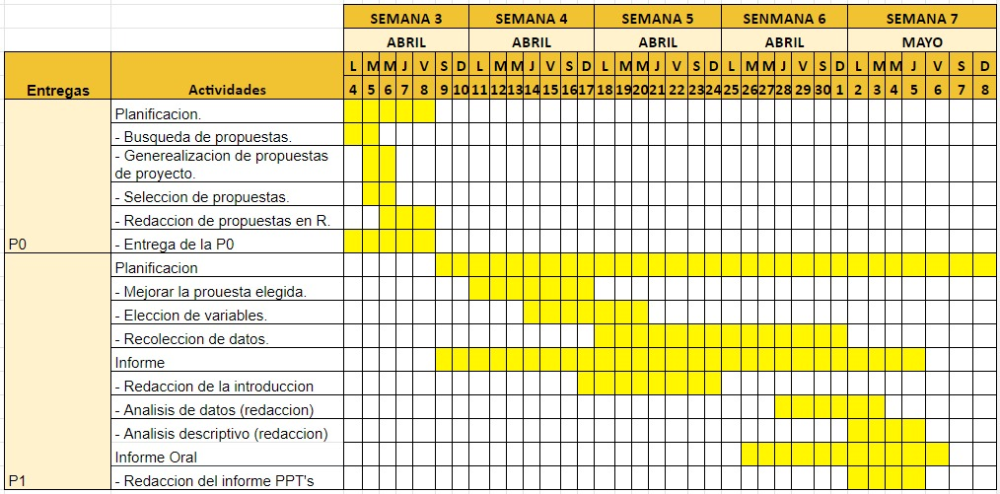

# Introducción

**Relevancia:**

El tema de nuestra investigacion, se encuentra basada es estudiar a los factores externos que influyen en el promedio ponderado de los estudiantes de las universidades de ingenieria del Peru, como lo son la UNI y UTEc. Dicho esto, tomamos relevante este tema, pues basandonos en los factores que intervienen y se involucran, podemos llegar a conclusiones, lo cual ayuda a tener una idea general y no errada con respecto a que no solo el estudiante se enfoca en estudiar, sino tambien en como pequeñas cosas u otras pueden intervenir. 

**Planificación:**



# Datos

**Proceso de recolección de datos:**

***Primer paso:*** Teniendo en claro la población a estudiar, y especificando que el tipo de muestra no debe ser menor a 200 personas entre ambas universidades, procedemos a usar metodologías de encuesta.

***Segundo paso:*** Elaboramos la encuesta con las preguntas propuestas por el grupo.

***Tercer paso:*** Las encuestas hacia la muestra que conforman los estudiantes universitarios de la UNI , serán dadas de forma virtual.

-   *Razón de modalidad de encuesta:* Esto debido a que no sabemos con exactitud el horario y la forma en que dicha universidad está acudiendo de forma presencial, fuera de ello la encuesta virtual, resulta más factible, pues además de tomar menos tiempo que una presencial, se puede llegar de forma eficaz a más contactos.

-   *Estrategias para llegar a la población:* Algunos miembros del grupo, contaban con conocidos en la UNI , por ende se nos hizo más fácil, compartir el link , y pedirles a los mismos, que compartan con el resto de compañeros/as o conocidos, y así llegar a más personas.

-   *Condiciones para realizar la recolección:* Además de tener en cuenta que la muestra debe ser a estudiantes de la UNI, es que debido a las preguntas propuestas, deben pertenecer del 2do ciclo en adelante, para que de esa forma las respuestas, se relacionan, y se llegue al objetivo.

***Cuarto paso:*** Por otro lado, las encuestas hacia la muestra que conforman los estudiantes universitarios de la UTEC, serán dadas de forma Híbrida, es decir, tanto virtual como presencial.

-   *Razón de modalidad de encuesta:* Esto debido a que como alumnos de UTEC, ya contamos con poder acudir a la universidad 100% presencial, por ende nos es más factible hacerlo de esa manera, y en el caso de la encuesta virtual, sería debido a aquellos compañeros que no acuden de forma presencial, puedan responder desde su comodidad virtualmente.

-   *Estrategias para llegar a la población:* De manera presencial, hemos acudido a cierta cantidad de estudiantes a compartirles el link por WhatsApp, para de esa forma corroborar que completan las encuestas con más seguridad, y de manera virtual, a algunos compañeros/as les hemos compartido el link por el mismo medio de comunicación, para complementar la muestra, optando a esta modalidad como segunda opción.

-   *Condiciones para realizar la recolección:* Además de tener en cuenta que la muestra debe ser a estudiantes de la UTEC, es que debido a las preguntas propuestas, deben pertenecer del 2do ciclo en adelante, para que de esa forma las respuestas, se relacionen, y se llegue al objetivo.

**Población, muestra y muestreo:**

***Población:*** La población que escogimos para nuestro estudio fueron los estudiantes de los distintos ciclos(apartir del 2do) de las conocidas "Universidades de ingeniería del Perú": La Universidad Nacional de Ingeniería (UNI) y La Universidad de Ingeniería y Tecnología (UTEC).

***Muestra:*** Nuestra muestra está conformada por 213 estudiantes universitarios, (104) de la Universidad Nacional de Ingeniería (UNI) y (109) de la Universidad de Ingeniería y Tecnología (UTEC).

***Muestreo:*** El muestreo a utilizar es : El muestreo por conveniencia.

**Variables:**

***Edad:***

-   *Definición:* Es lo vivido por una persona u otro ser vivo desde su nacimiento.

-   *Tipo:* Variable Numérica Discreta

-   *Restricción:* Los encuestados deberan marcar una opcion, en un rango del 16 al 33 (años).

***Sexo:***

-   *Definición:* Es el conjunto de las peculiaridades que caracterizan a los individuos de una especie dividiéndolos en masculinos y femeninos.

-   *Tipo:* Variable Categórica Nominal

-   *Restricción:* Elegir entre las 3 opciones dadas en la encuesta "masculino", "femenino" y la opción de "prefiero no decirlo"

***Universidad*** ***:***

-   *Definición:* Institución destinada a la enseñanza superior (aquella que proporciona conocimientos especializados de cada rama del saber), que está constituida por varias facultades y que concede los grados académicos correspondientes.

-   *Tipo:* Variable Categórica Ordinal

-   *Restricción:* Los encuestados deberán ser parte de UNI o UTEC para marcar alguna de estas opciones.

***Carrera***

-   *Definición:* Una carrera universitaria es un conjunto de programas de educación que los estudiantes necesitan completar en una universidad.
    Hay diferentes tipos de títulos en una carrera; entre ellos la licenciatura, una maestría, un doctorado.

-   *Tipo:* Variable Categórica Nominal

-   *Restricción:* Los encuestados deben marcar la carrera universitaria que están estudiando en UTEC o UNI.

***Ciclo:***

-   *Definición:* Es un periodo, lo cual es nombrado según su duración de tiempo, uno de seis meses es llamado semestre, de cuatro meses, cuatrimestre, de tres meses, trimestre,entre otros.

-   *Tipo:* Variable Numérica Discreta

-   *Restricción:* Los encuestados, deberán permanecer del 2do ciclo en adelante, debido a que en una de las preguntas se requiere precisar el promedio ponderado de su ciclo pasado.

***Promedio Ponderado:***

-   *Definición:* Es una forma un poco más compleja de calcular la media, pero de gran utilidad práctica.

-   *Tipo:* Variable Numérica Continua

-   *Restricción:* Colocar los promedios, con dos decimales.

***Número de cursos:***

-   *Definición:* Son aquellos cursos que el estudiante universitario llevará según su elección, de acuerdo al ciclo que le corresponda.

-   *Tipo:* Variable Numérica Discreta

-   *Restricción:* Según investigaciones, y preguntas elaboradas al realizar la encuesta, se colocó a lo mucho 9 cursos como opciones, de las cuales solo deberá escoger una opción.

***Nivel de dificultad de cursos:***

-   *Definición:* Es el grado que los universitarios estiman, según la estadía que van es su respectiva universidad.

-   *Tipo:* Variable Numérica Discreta

-   *Restricción:* En una escala del 1 al 5, deberán escoger según su punto de vista, siendo 1 (muy poco) y 5 (mucho) el grado de dificultad.

***Tiempo de estudio:***

-   *Definición:* Es el tiempo que los estudiantes dedican a sus estudios, fuera de su horario de clases, es decir, donde realizan el aprendizaje de manera autónoma.

-   *Tipo:* Variable Numérica Discreta

-   *Restricción:* Colocar la cantidad de tiempo que dedica al estudio en minutos.

***Factor dificultad (profesores):***

-   *Definición:* Esta variable se consideró con el propósito de conocer si los estudiantes opinan que los docentes hacen difícil su aprendizaje.

-   *Tipo:* Variable Categórica Nominal

-   *Restricción:* Las respuestas son en un rango de 5 con las opciones para marcar de: Totalmente en desacuerdo, En desacuerdo, Ni de acuerdo ni en desacuerdo, De acuerdo y Totalmente de acuerdo.

***Factor dificultad (infraestructura):***

-   *Definición:* Para conocer un sobre como es la infraestructura en las universidades UNI y UTEC, se hace una pregunta categórica con respuestas en un rango de 5 alternativas, desde Totalmente en desacuerdo hasta totalmente de acuerdo.

-   *Tipo:* Variable Categórica Nominal

-   *Restricción:* Se pregunta si considera que la infraestructura de la universidad (aulas, laboratorios, auditorio, etc) favorece en el aprendizaje de los estudiantes y las respuestas de las preguntas son: Totalmente en desacuerdo, En desacuerdo, Ni de acuerdo ni en desacuerdo, De acuerdo y Totalmente de acuerdo.

***Inversión en Laboratorios:***

-   Definición: En esta pregunta se pide la opinión de los estudiantes de ambas universidades (UNI y UTEC) donde se les pregunta si consideran que su universidad invierte lo necesario en implementos, máquinas y material para los distintos laboratorios

-   *Tipo:* Variable Categórica Nominal

-   Restricción: Las opciones de respuesta a marcar son Si y No.

***Inversión en apoyo bienestar:***

-   *Definición:* Mediante la pregunta (¿Crees que tu universidad invierte lo suficiente con respecto al apoyo al bienestar de los estudiantes? (Académica y/o psicológica), se busca conocer el nivel de apoyo académico y psicológico que reciben los alumnos en sus respectivas universidades(UNI y UTEC).

-   *Tipo:* Variable Categórica Nominal

-   *Restricción:* Las únicas opciones disponibles para responder a la pregunta planteada son Si y No.ç

***Calificación de la virtualidad:***

-   *Definición:* En esta parte los estudiantes califican la educación virtual brindada por su universidad durante la pandemia.

-   *Tipo:* Variable Numérica Discreta

-   *Restricción:* se da a elegir un número en un escala del 1 al 5, para la calificación correspondiente.

***Dispositivos Tecnológicos:***

-   *Definición:* Esta opción está adecuada para conocer cuales son los dispositivos electrónicos con los que cuenta el estudiante para poder asistir a sus clases o poder desempeñar ciertas actividades curriculares relacionadas a su desempeño en la universidad (UNI o UTEC).

-   *Tipo:* Variable Categorica Nominal

-   *Restricción:* Se tiene una limitada cantidad de opciones a elegir (Tablet y/o IPad, Celular, Laptop, Computadora o NA)

***Educación en la virtualidad:***

-   *Definición:* Se entiende por educación en línea a aquella en la que los docentes y estudiantes participan en un entorno digital a través de las nuevas tecnologías y de las redes de computadoras, haciendo uso intensivo de las facilidades que proporciona Internet y las tecnologías digitales.

-   *Tipo:* Variable Numérica Discreta

-   *Restricción:* Se da a elegir un número en un escala del 1 al 5, para la calificación correspondiente.

***Apoyo intercambio estudiantil:***

-   *Definición:* Es un programa en el que un estudiante, generalmente en la escuela secundaria, de nivel bachillerato o de educación universitaria, elige residir por un tiempo determinado en otro país para aprender -entre otras cosas- lengua y cultura.

-   *Tipo:* Variable Numérica Discreta

-   *Restricción:* Se da a elegir un número en un escala del 1 al 10, para la calificación correspondiente .

***Medios de transporte (Bus-Ascensor-Escaleras):***

-   *Definición:* Son aquellos medios de transporte con los cuales cuenta cada universidad para ir de un lugar a otro.

-   *Tipo:* Variable Categórica Ordinal

-   *Restricción:* Se dan 3 opciones, de las cuales, el encuestado deberá colocar entre SÍ y No, dependiendo con ello su respectiva universidad.

**Limpieza de base de datos**

```{r}
library(readr)
```

```{r}
library(dplyr)
```

```{r}
P1<- read_csv("Encuesta.csv")
```

```{r}
names(P1)
```

```{r}
P1 %>% rename ( `Edad` = "¿Cuál es su edad? (años)", `Sexo`= "¿Cuál es su sexo?" ,  `Universidad`="¿En qué universidad estudia?",`carrera`="¿Qué carrera universitaria estudia?" , `Ciclo` ="¿En que ciclo se encuentra actualmente?" ,`Promedio_Ponderado`= "¿Cuál fue su promedio ponderado en su ciclo pasado? (colocar 2 decimales)"  ,`Numero_de_Cursos`= "¿Cuántos cursos está llevando actualmente?" ,`Nivel_de_dificultad_de_cursos`= "¿Qué tanta dificultad encuentras en tus cursos?" , `Tiempo_De_estudio`= "¿Cuánto tiempo dedicas al estudio por dia? (en minutos)" ,`Factor_dificultad_de_profesores`= "Indique su grado de satisfacción de acuerdo a las preguntas planteadas. [¿Crees que tus profesores dificultan tu aprendizaje?]", `Factor_dificultad_infraestructura` ="Indique su grado de satisfacción de acuerdo a las preguntas planteadas. [¿Crees que la infraestructura de tu universidad favorece tu aprendizaje?]" , `Inversion_de_laboratorios`= "Indique (Si / No) basados en las preguntas planteadas. [¿Crees que tu universidad invierte lo suficiente en sus laboratorios?]"  , `Inversion_en_apoyo_bienestar`= "Indique (Si / No) basados en las preguntas planteadas. [¿Crees que tu universidad invierte lo suficiente con respecto al apoyo al bienestar de los estudiantes? (Académica y/o psicológica)]", `Calificacion_de_la_virtualidad` = "Durante los ciclos virtuales. ¿Qué tan buena te pareció la  educación brindada por tu universidad?" ,`Educacion_en_virtual`= "¿Con qué dispositivo móvil ( en su mayoría ) accedía a sus clases virtuales?"  ,  `Apoyo_intercambio_estudiantil`="En una escala de 1 al 10. ¿Cuánto consideras que tu universidad apoya en los intercambios estudiantiles?" , `Ascensor` ="¿Que medios de movilización hay en tu universidad? [Ascensor ]"  ,`Bus`=  "¿Que medios de movilización hay en tu universidad? [Bus]",`Escaleras`="¿Que medios de movilización hay en tu universidad? [Escaleras]") -> P12


```

```{r}
names(P12)
```

```{r}
select(P12,Tiempo_De_estudio)
```

```{r}
P12 %>% count(Tiempo_De_estudio)
```

```{r}
P12 %>% mutate(Tiempo_De_estudio=
         ifelse(Tiempo_De_estudio=="150 min", "150",       
         ifelse(Tiempo_De_estudio=="120 min","120",
         ifelse(Tiempo_De_estudio=="30 min","30",
         ifelse(Tiempo_De_estudio=="60 min","60",
         ifelse(Tiempo_De_estudio=="70 min","70",
         ifelse(Tiempo_De_estudio=="90 min","90",
         ifelse(Tiempo_De_estudio=="30 minutos","30",
         ifelse(Tiempo_De_estudio=="120 mnutos","120",
         ifelse(Tiempo_De_estudio=="150 minutos","150",
         ifelse(Tiempo_De_estudio=="180 min", "180",
         ifelse(Tiempo_De_estudio=="190 min", "190", 
         ifelse(Tiempo_De_estudio=="240 min", "240",
         ifelse(Tiempo_De_estudio %in% c("1 h","60 min"),"60",
         ifelse(Tiempo_De_estudio %in% c("1h","60 min"),"60",       
         ifelse(Tiempo_De_estudio %in% c("1 hora","60 min"),"60",
         ifelse(Tiempo_De_estudio %in% c("2 h","120 min"),"120",
         ifelse(Tiempo_De_estudio %in% c("2 horas","120 min"),"120",
         ifelse(Tiempo_De_estudio %in% c("2h","120 min"),"120",
         ifelse(Tiempo_De_estudio %in% c("3 h","180 min"),"180",
         ifelse(Tiempo_De_estudio %in% c("3 h y media","210 min"),"210",
         ifelse(Tiempo_De_estudio %in% c("3 horas","210 min"),"210",
         ifelse(Tiempo_De_estudio %in% c("3 horas diarias","210 min"),"210",
         ifelse(Tiempo_De_estudio %in% c("3h","180 min"),"180",
         ifelse(Tiempo_De_estudio %in% c("4 h","240 min"),"240",
         ifelse(Tiempo_De_estudio %in% c("4 horas","240 min"),"240",
         ifelse(Tiempo_De_estudio %in% c("5 horas","300 min"),"300",
         ifelse(Tiempo_De_estudio %in% c("media hora","30 minutos","1/2 hora"),"30", Tiempo_De_estudio
         )))))))))))))))))))))))))))) ->P13
```

```{r}
P13 %>% count(Tiempo_De_estudio)
```
```{r}
dplyr::select(P13, 2:20) -> P14
dplyr::select(P13, -1)
dplyr::select(P13, Edad:Escaleras)
dplyr::select(P13, ...1)
```

# Descriptores Numéricos

```{r}
library(ggplot2)
```

## CICLO

```{r}

# Para la variable moda, necesitaremos los descriptores moda y desviacion estandar
# Moda
getmode <- function(v) {
   uniqv <- unique(v)
   uniqv[which.max(tabulate(match(v, uniqv)))]
}
table(P14$Ciclo)
```

```{r}
#Desviacion estandar
round(sd(P14$Ciclo, na.rm=TRUE),2)
```

```{r}
ggplot(P14, aes(Ciclo)) +
  geom_bar() +
  labs(title="Ciclo",
       x= "Ciclo",
       y="Frecuencia")+
   scale_x_continuous(breaks=seq(2,10,1))
```

## PROMEDIO PONDERADO

```{r}
#Media / Promedio
round(mean(P14$Promedio_Ponderado, na.rm=TRUE),2)
```

```{r}
#Mediana
round(median(P14$Promedio_Ponderado, na.rm=TRUE),2)
```

```{r}
#Minimo
min(P14$Promedio_Ponderado, na.rm = TRUE)
```

```{r}
#Maximo
max(P14$Promedio_Ponderado, na.rm = TRUE)
```

```{r}
# MOda
getmode <- function(v) {
   uniqv <- unique(v)
   uniqv[which.max(tabulate(match(v, uniqv)))]
}
table(P14$Promedio_Ponderado)
```

```{r}
# Para la variable Promedio ponderado se empleo el Boxplot o diagrama de caja, ya que se requeria que se pueda separar los promedios para cada univeridad, tanto UNI y UTEC.

P12 %>% ggplot(.,aes(P14$Promedio_Ponderado,P14$Universidad,group=P14$Promedio_Ponderado))+geom_boxplot()
```


## EDAD 

```{r}
# Moda
getmode <- function(v) {
   uniqv <- unique(v)
   uniqv[which.max(tabulate(match(v, uniqv)))]
}
table(P14$Edad)
```

```{r}
#Media / Promedio
round(mean(P14$Edad, na.rm=TRUE),2)
```

```{r}
#Mediana
round(median(P14$Edad, na.rm=TRUE),2)
```

```{r}
ggplot(P14, aes(P14$Edad)) +
  geom_bar() +
  labs(title="Gra´fica de Edad",
       x= "Edad",
       y="Frecuencia")+
   scale_x_continuous(breaks=seq(15,31,1))
```

## TIEMPO DE ESTUDIO

```{r}
#Media / Promedio
round(mean(P14$Tiempo_De_estudio, na.rm=TRUE),2)
```

```{r}
#Mediana
round(median(P14$Tiempo_De_estudio, na.rm=TRUE),2)
```

```{r}
#Minimo
min(P14$Tiempo_De_estudio, na.rm = TRUE)
```

```{r}
#Maximo
max(P14$Tiempo_De_estudio, na.rm = TRUE)
```

```{r}
# MOda
getmode <- function(v) {
   uniqv <- unique(v)
   uniqv[which.max(tabulate(match(v, uniqv)))]
}
table(P14$Tiempo_De_estudio)
```

```{r}
ggplot(P14, aes(P14$Tiempo_De_estudio)) +
  geom_bar() +
  labs(title="Gráfica de Tiempo de Estudio",
       x= "Edad",
       y="Frecuencia")+
    coord_flip()
```

## UNIVERSIDAD

```{r}
# MOda
getmode <- function(v) {
   uniqv <- unique(v)
   uniqv[which.max(tabulate(match(v, uniqv)))]
}
table(P14$Universidad)
```

```{r}
ggplot(P14, aes(Universidad, fill = Universidad)) +
  geom_bar() +
  labs(title="Grafica de Universidad",
       x= "Universidad",
       y="Frecuencia")
```
## CARRERA 

```{r}
# MOda
getmode <- function(v) {
   uniqv <- unique(v)
   uniqv[which.max(tabulate(match(v, uniqv)))]
}
table(P14$carrera)
```

```{r}
ggplot(P14, aes(P14$carrera)) +
  geom_bar() +
  labs(title="Grafica de Carreras",
       x= "Carreras de la universidad",
       y="Frecuencia")+
  coord_flip()
```

## SEXO 

```{r}
# MOda
getmode <- function(v) {
   uniqv <- unique(v)
   uniqv[which.max(tabulate(match(v, uniqv)))]
}
table(P14$Sexo)
```

```{r}
ggplot(P14, aes(Sexo, fill = Sexo)) +
  geom_bar() +
  labs(title="Grafica de Género",
       x= "Sexo",
       y="Frecuencia")
```

## NUMERO DE CURSOS

```{r}
# MOda
getmode <- function(v) {
   uniqv <- unique(v)
   uniqv[which.max(tabulate(match(v, uniqv)))]
}
table(P14$Numero_de_Cursos)
```

```{r}
#Mediana
round(median(P14$Numero_de_Cursos, na.rm=TRUE),2)
```

```{r}
#Minimo
min(P14$Numero_de_Cursos, na.rm = TRUE)
```

```{r}
#Maximo
max(P14$Numero_de_Cursos, na.rm = TRUE)
```

```{r}
ggplot(P14, aes(P14$Numero_de_Cursos)) +
  geom_bar() +
  labs(title="¿Cuántos cursos está llevando actualmente?",
       x= "Cantidad de Cursos",
       y="Frecuencia"
       )+
   scale_x_continuous(breaks=seq(1,10,1))

```


## NIVEL DIFICULTAD DE CURSOS

```{r}
# MOda
getmode <- function(v) {
   uniqv <- unique(v)
   uniqv[which.max(tabulate(match(v, uniqv)))]
}
table(P14$Nivel_de_dificultad_de_cursos)
```

```{r}
#Mediana
round(median(P14$Nivel_de_dificultad_de_cursos, na.rm=TRUE),2)
```

```{r}
ggplot(P14, aes(P14$Nivel_de_dificultad_de_cursos)) +
  geom_bar() +
  labs(title="¿Qué tanta dificultad encuentras en tus cursos?",
       x= "Escala del 1 al 5",
       y="Frecuencia"
       )+
   scale_x_continuous(breaks=seq(1,5,1))

```

## INVERSION EN LABORATORIOS

```{r}
# MOda
getmode <- function(v) {
   uniqv <- unique(v)
   uniqv[which.max(tabulate(match(v, uniqv)))]
}
table(P14$Inversion_de_laboratorios)
```
```{r}
ggplot(P14, aes(P14$Inversion_de_laboratorios, fill = P14$Inversion_de_laboratorios)) +
  geom_bar() +
  labs(title="Grafica de Inversion en Laboratorios",
       x= "Inversion en Laboratorios",
       y="Frecuencia")
```

## INVERSION EN APOYO BIENESTAR

```{r}
# MOda
getmode <- function(v) {
   uniqv <- unique(v)
   uniqv[which.max(tabulate(match(v, uniqv)))]
}
table(P14$Inversion_en_apoyo_bienestar)
```

```{r}
ggplot(P14, aes(P14$Inversion_en_apoyo_bienestar, fill = P14$Inversion_en_apoyo_bienestar)) +
  geom_bar() +
  labs(title="Grafica de Inversion en Apoyo Bienestar",
       x= "Apoyo Bienestar psicologico",
       y="Frecuencia")
```


## FACTOR DIFICULTAD (PROFESORES)

```{r}
# MOda
getmode <- function(v) {
   uniqv <- unique(v)
   uniqv[which.max(tabulate(match(v, uniqv)))]
}
table(P14$Factor_dificultad_de_profesores)
```

```{r}
ggplot(P14, aes(P14$Factor_dificultad_de_profesores, fill = P14$Factor_dificultad_de_profesores)) +
  geom_bar() +
  labs(title="Influencia de Docentes",
       x= "Respuestas",
       y="Frecuencia")+
  coord_flip()
  
```

## FACTOR DIFICULTAD (INFRAESTRUCTURA)

```{r}
# MOda
getmode <- function(v) {
   uniqv <- unique(v)
   uniqv[which.max(tabulate(match(v, uniqv)))]
}
table(P14$Factor_dificultad_infraestructura)
```

```{r}
ggplot(P14, aes(P14$Factor_dificultad_infraestructura, fill = P14$Factor_dificultad_infraestructura)) +
  geom_bar() +
  labs(title="Grafica de Infraestructura",
       x= "Punto de vista",
       y="Frecuencia")+
  coord_flip()
```


## EDUCACION EN VIRTUAL

```{r}
# MOda
getmode <- function(v) {
   uniqv <- unique(v)
   uniqv[which.max(tabulate(match(v, uniqv)))]
}
table(P14$Educacion_en_virtual)
```

```{r}
ggplot(P14, aes(P14$Educacion_en_virtual, fill = P14$Educacion_en_virtual)) +
  geom_bar() +
  labs(title="Grafica de Dispositivos",
       x= "Dispositivos",
       y="Frecuencia")
```


## CALIFICACION DE LA VIRTUALIDAD 

```{r}
# MOda
getmode <- function(v) {
   uniqv <- unique(v)
   uniqv[which.max(tabulate(match(v, uniqv)))]
}
table(P14$Calificacion_de_la_virtualidad)
```

```{r}
ggplot(P14, aes(P14$Calificacion_de_la_virtualidad, fill = P14$Calificacion_de_la_virtualidad)) +
  geom_bar() +
  labs(title="Gra´fica de Calificación de la virtualidad",
       x= "Escala de 1 al 5",
       y="Frecuencia")
```

## APOYO INTERCAMBIO ESTUDIANTIL

```{r}
# MOda
getmode <- function(v) {
   uniqv <- unique(v)
   uniqv[which.max(tabulate(match(v, uniqv)))]
}
table(P14$Apoyo_intercambio_estudiantil)
```

```{r}
ggplot(P14, aes(P14$Apoyo_intercambio_estudiantil)) +
  geom_bar() +
  labs(title="Gráfica Apoyo Intercambio Estudiantil",
       x= "Escala del 1 al 10",
       y="Frecuencia"
       )+
   scale_x_continuous(breaks=seq(1,10,1))

```

## BUS

```{r}
# MOda
getmode <- function(v) {
   uniqv <- unique(v)
   uniqv[which.max(tabulate(match(v, uniqv)))]
}
table(P14$Bus)
```

```{r}
ggplot(P14, aes(P14$Bus, fill = P14$Bus)) +
  geom_bar() +
  labs(title="Medio de movilizacion por Bus",
       x= "Eleccion ( SI/No)",
       y="Cantidad de eleccion")
```

## ASCENSOR 

```{r}
# MOda
getmode <- function(v) {
   uniqv <- unique(v)
   uniqv[which.max(tabulate(match(v, uniqv)))]
}
table(P14$Ascensor)
```

```{r}
ggplot(P14, aes(P14$Ascensor, fill = P14$Ascensor)) +
  geom_bar() +
  labs(title="Medio de movilizacion por Ascensor",
       x= "Eleccion ( SI/No)",
       y="Cantidad de eleccion")
```

## ESCALERAS

```{r}
# MOda
getmode <- function(v) {
   uniqv <- unique(v)
   uniqv[which.max(tabulate(match(v, uniqv)))]
}
table(P14$Escaleras)
```

```{r}
ggplot(P14, aes(P14$Escaleras, fill = P14$Escaleras)) +
  geom_bar() +
  labs(title="Medio de movilizacion por Escaleras",
       x= "Eleccion ( SI/No)",
       y="Cantidad de eleccion")
```

#Comparacion de graficos

```{r}
names(P14)
```


```{r}
ggplot(data=P14)+
  geom_point(aes(Ciclo, Promedio_Ponderado))
```
**En el grafico mostrado, podemos observar que la mayor cantidad de muestra de los estudiantes pertenecen al 2do ciclo, ademas de ser en su mayoria quienes obtenieron mayores promedios ponderados**

```{r}
ggplot(data=P14)+
  geom_point(aes(Sexo, carrera)) 
```
**Podemos determinar, que la relacion entre Femenino y masculino, es casi parejo, por ende no se muestra una distincion amplia en la eleccion de carreras, especificamente del genero**

```{r}
ggplot(data=P14)+
  geom_point(aes(Nivel_de_dificultad_de_cursos, Numero_de_Cursos)) 
```
**En el grafico mostrado, podemos observar que la dificultad de los cursos aumenta conforme se lleven más cursos, ya que se emplea mayor tiempo y desarrollo de las clases y trabajos**

```{r}
ggplot(data=P14)+
  geom_point(aes(P14$Factor_dificultad_infraestructura, Promedio_Ponderado)) 
```

**Tal como podemos ver en la gráfica, los estudiantes que tienen un promedio ponderado mas alto tienden a pensar que la infraestructura de su universidad los apoya o sienten que es buena.**


```{r}
ggplot(data=P14)+
  geom_point(aes(Ciclo, Promedio_Ponderado)) # Capa geometrica combinada con capa estetica
```


# Conclusiones

*Tras analizar la informacion obtenida por la encuesta dada a ambas universidades, lo cual se busca saber Factores externos que influyen en el promedio ponderado de los alumnos de la UNI y UTEC".

Podemos determinar que  los estudiantes que tienen un promedio ponderado mas alto tienden a pensar que la infraestructura de su universidad los apoya o sienten que es buena.

Del mismo modo, se nos muestra que la dificultad de los cursos aumenta conforme se lleven más cursos, ya que se emplea mayor tiempo y desarrollo de las clases y trabajos*


