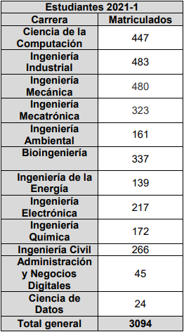

#### Librerías e instalación

```{r setup, include=FALSE, results='hide'}

#Librerías necesarias

paquetes <- c('dplyr','readr','modeest','labelled','expss','robustbase','ggplot2', 'sn')
n.paquetes <- paquetes[!(paquetes %in% installed.packages()[,"Package"])]
if(length(n.paquetes)) install.packages(n.paquetes)

library(dplyr)
library(readr)
library(modeest)
library(labelled)
library(expss)
library(robustbase)
library(ggplot2)
library(sn)
```

## Introducción

### Relevancia 

Con la llegada de la nueva modalidad híbrida en las universidades, específicamente en la UTEC en el ciclo 2022-1, una nueva modalidad de aprendizaje donde se le da la opción al alumno de llevar sus clases de manera presencial o virtual. Gracias a esta opción, el aprendizaje se puede adaptar a las necesidades o los gustos de cada estudiante. Por ello vemos necesario el realizar esta encuesta donde podamos analizar las preferencias y dificultades para poder entender las necesidades colectivas que presenta la comunidad universitaria de la UTEC, permitiendo a los directivos y docentes tener una visión más directa de la realidad que viven sus estudiantes en una modalidad u otra. 

### Objetivos 

+ Analizar las preferencias de los estudiantes sobre ambas modalidades de aprendizaje.
+ Analizar las dificultades que puedan presentar los estudiantes según cada modalidad
+ Analizar los aspectos de la rutina del estudiante que se ven afectados por cada modalidad.
+ Recolectar información útil para poder enfocar de mejor manera las dificultades que puedan tener los estudiantes y encontrarles una solución adecuada.


### Planificación 


## Datos

### Recolección de datos

La recolección de datos se realizó mediante una encuesta, la cual requirió la elaboración de un cuestionario con un número de preguntas menor que 20. El cuestionario fue elaborado de manera que se garantice una tasa de respuestas elevada, y asegurar la calidad de las respuestas. Las encuestas fueron enviadas mediante correo a los estudiantes de la Universidad de Ingeniería y Tecnología (UTEC).

Los datos se cargan del archivo de encuestados, exportado de Google Forms:

```{r}
DF <- read_csv("S1EncuestadosFINAL.csv", locale = locale(encoding="UTF-8"))
```


### Población, muestra y muestreo

Al tratarse de una población extensa, se decidió escoger una muestra de 200 estudiantes de distintas carreras pertenecientes a UTEC, los cuales han sido escogidos por medio de un muestreo estratificado basado en carrera. En base a la siguiente tabla de estudiantes matriculados durante 2021-1, podemos estimar la proporción de muestras que necesitamos de cada carrera:



Se considera que la muestra obtenida (210 encuestas completas) es representativa debido a su proporción respecto a la comunidad de alumnos activos en UTEC. 


### Variables


#### Variable categóricas
+ Preferencia: Refiere a la modalidad de preferencia del encuestado, sea virtual o presencial híbrida.

#### Variables numéricas
+ Horas.de.Estudio: Cantidad de horas de estudio del encuestado, fuera de clases, por semana.
+ Horas.en.Universidad: Cantidad de horas de estancia en la universidad, por semana.
+ Horas.en.Computadora: Cantidad de horas en uso de una laptop o computador, por semana.
+ Horas.en.Grabaciones: Cantidad de horas del encuestado viendo clases grabadas.
+ Horas.Dormir.Virtual = Cantidad de horas de dormir del encuestado en modalidad virtual, por semana.
+ Horas.Dormir.Presencial = Cantidad de horas de dormir del encuestado en modalidad presencial híbrida por semana.
+ Horas.Transporte = Cantidad de horas que el encuestado pasa en medios de transporte para llegar a la universidad.
+ Problemas.Tecnicos = Cantidad de problemas técnicos que el encuestado ha tenido durante un mes.

### Limpieza de base de datos

#### Renombrando variables

Para poder limpiar la data, hay que cambiar el nombre de las variables a algo más sencillo de entender: 
```{r}
names(DF)
```

Empezamos renombrando las variables y agregando etiquetas correspondientes a las preguntas de la encuesta: 
```{r, results='hide'}

DF %>% rename(
  Preferencia = "¿Prefieres el modo hibrido o virtual?",
  Horas.de.Estudio = "¿Cuántas horas en promedio pasas estudiando, fuera de tus clases, a la semana?", 
  Horas.en.Universidad = "¿Cuántas horas en promedio pasas en la universidad a la semana?",  
  Horas.en.Computadora = "¿Cuántas horas en promedio pasas usando la computadora o laptop al día?", 
  Horas.en.Grabaciones = "¿Cuántas horas en promedio pasas revisando grabaciones de clases a la semana?", 
  Horas.Dormir.Virtual = "¿Cuántas horas en promedio duermes al día siguiendo una modalidad virtual?",
  Horas.Dormir.Presencial ="¿Cuántas horas en promedio duermes al día siguiendo una modalidad hibrida?", 
  Horas.Transporte = "¿Cuántas horas en promedio pasas en medios de transporte desde o hacia la universidad al día?", 
  Problemas.Tecnicos = "¿Qué tantos problemas técnicos presentas al mes en clases virtuales?", 
  Calidad.Sonido = "¿Consideras que se escucha bien a los profesores en las clases virtuales?",  
  Calificacion.Clase.Virtual = "¿Qué calificación le das a las explicaciones de tus profesores en la modalidad virtual?",
  Calificacion.Clase.Presencial = "¿Qué calificación le das a las explicaciones de tus profesores en la modalidad presencial?",
  Comodidad.Mascarilla = "¿Te incomoda usar mascarilla?", 
  Contagio.COVID = "¿Te has contagiado de COVID-19 después del periodo de asistencia presencial a la universidad?", 
  Cumplimiento.Reglamento = "¿Consideras que en la universidad se cumplen los reglamentos de bioseguridad?" , 
  Promedio.Virtual = "¿Cuál fue tu promedio en clases virtuales?", 
  Promedio.Presencial = "¿Cuál es tu promedio en clases hibridas hasta ahora?", 
  Dolor =  "¿Has presentado dolores de espalda durante las clases virtuales?",
  Preferencia.Alimentacion = "¿En que modalidad consideras que mantienes una alimentación más sana?",
  Preferencia.Atencion =  "¿En que modalidad consideras que prestas más atención a las clases?",
  Preferencia.Trabajos.Grupales =  "¿En que modalidad consideras que tienes más comodidad trabajando en grupo?", 
  Modalidad.de.Mayor.Estres = "¿En que modalidad consideras que presentas más estrés durante el periodo de estudios?"
) -> DF

```

#### Datos faltantes 
No tenemos muchos datos faltantes, así que aprenderemos a vivir con eso.
```{r}
round(sum(is.na(DF))/(nrow(DF)*ncol(DF))*100,2) 
```

####  Observaciones faltantes 
Es posible eliminar las obs. pero puede ser problemático, así que no lo eliminaremos. 
```{r}
round(sum(!complete.cases(DF))/nrow(DF)*100,2)
```

#### Recategorización de variables

Aquí estamos observando como son nuestras variables. 
```{r}
summary (DF)
```

Las variables de "Tiempo" (Marco temporal en el que se envió las respuestas a la encuesta), "Nombre" y "Correo" no nos sirven. Los vamos a eliminar. 
```{r}
DF$Correo <- NULL
DF$Tiempo <- NULL
DF$Nombre <- NULL
```

Observamos que las variables "Promedio.Presencial" y "Promedio.Virtual" variables categórica, así que las pasamos a numéricas. Cabe resaltar que este proceso también convierte algunos valores no deseados ("No sé", "No tengo", "????") en NAs.
```{r}
DF$Promedio.Presencial %>% as.numeric %>% suppressWarnings -> DF$Promedio.Presencial
DF$Promedio.Virtual %>% as.numeric %>% suppressWarnings -> DF$Promedio.Virtual
```


De las variables "Promedio.Presencial" y "Promedio.Virtual" se eliminan los valores atípicos. Estos los encontramos observando las distribuciones de ambas columnas en diagramas de caja y bigote:
```{r}
DF[,c('Promedio.Presencial', 'Promedio.Virtual')] %>% boxplot(main="Distribuciones de notas promedio", ylab="Nota")

```

En ambos casos, consideramos las notas 0 como nulos (NA) dado que no existe ninguna nota promedio en el intervalo <0; 12>, y casi todos los casos en que se ingresó 0 como nota en alguna de las dos variables, también se ingresó 0 en la otra.
```{r}
DF[replace(DF$Promedio.Presencial == 0, is.na(DF$Promedio.Presencial == 0), FALSE), c('Promedio.Presencial')] <- NA
DF[replace(DF$Promedio.Virtual == 0, is.na(DF$Promedio.Virtual == 0), FALSE), c('Promedio.Virtual')] <- NA
```

Ahora, veremos las columnas correspondientes a las variables de tipo "Horas" (separadas en semanales y diarias):
```{r}

Cols.Horas.Semanales <- c( 'Horas.de.Estudio', 'Horas.en.Universidad', 'Horas.en.Grabaciones' )

DF %>% melt( id.vars=integer(), measure.vars=Cols.Horas.Semanales ) %>% na.omit %>% ggplot( aes( x=variable, y=value ) ) +
  geom_boxplot() + coord_flip() + xlab('Variable en horas') + ylab('Valor') +
  scale_x_discrete( limits=Cols.Horas.Semanales,labels=c('Estudio', 'Universidad', 'Viendo grabaciones'))

Cols.Horas.Diarias <- c('Horas.en.Computadora', 'Horas.Dormir.Virtual', 'Horas.Dormir.Presencial', 'Horas.Transporte')

DF %>% melt( id.vars=integer(), measure.vars=Cols.Horas.Diarias ) %>% na.omit %>% ggplot( aes( x=variable, y=value ) ) +
  geom_boxplot() + coord_flip() + xlab('Variable en horas') + ylab('Valor') +
  scale_x_discrete( limits=Cols.Horas.Diarias,labels=c('En computadora', 'Durmiendo (virtual)', 'Durmiendo (híbrido)', 'Transporte'))


```

Dentro de las variables de horas semanales no hay valores atípicos notable. Por ejemplo, pasar 20 horas a la semana viendo grabaciones no es poco razonable si es que no se asiste a ninguna clase teórica, y pasar 20 horas a la semana en la universidad es posible con ciertos horarios de clase.

Una observación interesante es que hay personas que tienen un total de horas en actividades presenciales diarias mayor que 24:

```{r}

Cols.Horas.Diarias.Presencial <- c('Horas.en.Computadora', 'Horas.Dormir.Presencial', 'Horas.Transporte')
DF$Total.Horas.Diarias <- rowSums(DF[, Cols.Horas.Diarias.Presencial])

DF[DF$Total.Horas.Diarias > 24, c(Cols.Horas.Diarias.Presencial, 'Total.Horas.Diarias')]

```

Estas actividades no son necesariamente secuenciales. Por ejemplo, alguien puede dormir y/o usar su computadora en ciertos medios de transporte, especialmente si el viaje diario es tan largo como 3 a 4 horas por tramo, como sugiere la tabla. Por lo tanto, no se considera eliminar ninguna de estas filas.  
Sin embargo, sí se eliminan las filas que tengan valores nulos en estas columnas, ya que serán claves en el análisis que se realizará posteriormente.

```{r}

DF <- DF[ !is.na(DF$Total.Horas.Diarias), ]
DF$Total.Horas.Diarias <- NULL

```

Debido a un problema en la conversión de tipo de caracteres, es necesario reasignar el valor de "Sí" en la variable de "Cumplimiento.Reglamento" y "Comodidad.Mascarilla".

```{r}
Reg <- DF$Cumplimiento.Reglamento == 'No'
DF[!Reg, c('Cumplimiento.Reglamento')] <- 'Sí'
Reg <- DF$Comodidad.Mascarilla == 'No'
DF[!Reg, c('Comodidad.Mascarilla')] <- 'Sí'
```

## Descriptores

### Descriptores númericos

Algunas variables numéricas fueron seleccionadas debido a que estas son las que más importan analizar para observar el efect del cambio de modalidad sobre el comportamiento y rendimiento de los estudiantes.

#### Descriptores de posición

*Media aritmética*  
```{r}
Cols.Importantes <- DF[, c(
  'Horas.Dormir.Virtual',    #Hora que dormías en virtual
  'Horas.Dormir.Presencial', #Horas que duermes en hibrido
  'Horas.en.Universidad',        #Horas que pasas en la universidad 
  'Horas.en.Computadora',        #Horas que pasas en la laptop 
  'Horas.en.Grabaciones'         #Horas que pasas viendo las grabaciones
)] 

Cols.Importantes %>% colMeans(na.rm = TRUE) %>% round(2)   

```


*Cuantiles, mediana, mínimo y máximo*
```{r}
Cols.Importantes %>% apply(2, function(x) quantile(x, probs = c(0, 0.25, 0.50, 0.75, 1), na.rm = TRUE)) %>% round(2)     
```

*Moda*
```{r}
Cols.Importantes %>% apply(2, function(x) mlv(x, method='mfv', na.rm = TRUE)) %>% round(2)    
```

#### Descriptores de dispersión

*Desviación estandar y varianza* 
```{r}
Cols.Importantes %>% apply(2, function(x) sd(x, na.rm=TRUE)) %>% round(2) -> Desv.Est
Cols.Importantes %>% apply(2, function(x) var(x, na.rm=TRUE)) %>% round(2) -> Var

rbind(Desv.Est, Var)

```

*Rango intercuartil*
```{r}
Cols.Importantes %>% apply(2, function(x) IQR(x, na.rm=TRUE)) %>% round(2) 

```


#### Conclusiones generales de descriptores numéricos

+ Podemos ver que en las variables el rango intercuartil más comun está entre el 2 y el 4 pero en las horas en la Universidad se encuentra en el 8tavo por lo que las personas tienen a ir más horas a la universidad.
+ Vemos que, en promedio, los alumnos pasan 9.3 horas en la universidad, 9.5 horas usando su computadora, 6.6 horas viendo grabaciones, 7.85 horas y 6.87 horas durante la modalidad virtual e hibrida respectivamente.
+ La mitad de los estudiantes estudian entre 6 y 10 horas, se quedan entre 5 y 13 horas semanales. Los estudiantes pasan en su computadora entre 4 y 12 horas usando su computadora y la mitad de ellos la usan entre 8 y 12 por lo que la mayoría de los estudiantes tienen a usar por bastante tiempo su computadora. Los estudiantes pasan entre 2 y 20 horas viendo las repeticiones de las clases semanalmente. La mitad de ellos las ven entre 4 y 8 horas, por lo que la mayoria de estudiantes no suelen pasar mucho tiempo viendo las grabaciones de clases. Los estudiantes pasan entre 4 y 12 horas durmiendo en la modalidad virtual. La mitad de ellos duerme entre 6 y 8 horas durante esta modalidad. En contraste, los estudiantes duermen entre 2 y 10 horas durante la modalidad híbrida (ambos límites son menores). La mitad de ellos también duermen entre 6 y 8 horas durante esta modalidad, pero existe una ligera tendencia a dormir menos dado que la mediana es 6 (en comparación a la mediana de 8 de la modalidad virtual)
+ Vemos que la mayoria de los estudiantes pasan en la universidad 8 horas, pasan 12 horas en su computadora, 6 horas viendo clases grabadas, 8 horas y 6 horas durmiendo en modalida virtual y hibrida respectivamente
+ Vemos que el dato que más destaca es la variación de las horas en la universidad por lo que vemos que los estudiantes suelen tener mucha variedad en sus horarios y las clases que asisten presencialmente. Además de esto en las grabaciones podemos ver otro dato interesante donde vemos que los estudiantes miran de manera variada las grabaciones de las clases.


### Descriptores gráficos


#### ¿Qué modalidad les estresas más? 


```{r}
table(DF$Modalidad.de.Mayor.Estres) %>% as.data.frame %>% mutate(perc = scales::percent(Freq/sum(Freq)), scale=1) %>%
  ggplot(aes(x=Var1, fill=factor(Var1), y=Freq)) +
  geom_bar(stat='identity', color = 'white') +
  geom_text(aes(label = perc), position = position_stack(vjust = 0.5), color='white', size=5) + 
  ggtitle('¿Qué modalidad te causa más estrés?') + guides(fill=guide_legend(title='Modalidad')) +
  scale_fill_brewer(palette='Set2') + xlab(element_blank()) + ylab('Frecuencia')
```

Podemos observar que, en opinión de los alumnos, ambas modalidades causan similar estrés.

#### ¿En qué modalidad prefieren trabajar más de manera grupal? 

```{r}

table(DF$Preferencia.Trabajos.Grupales) %>%  as.data.frame %>% mutate(perc = scales::percent(Freq/sum(Freq)), scale=1) %>% 
  ggplot(aes(x=Var1, fill=factor(Var1), y=Freq)) +
  geom_bar(stat='identity', color = 'white') +
  geom_text(aes(label = perc), position = position_stack(vjust = 0.5), color='white', size=5) + 
  ggtitle('¿En que modalidad tienes más comodidad trabajando en grupo?') + guides(fill=guide_legend(title='Modalidad')) +
  scale_fill_brewer(palette='Set2') + xlab(element_blank()) + ylab('Frecuencia')

```

Con esta gráfica obtenemos que más del 50% de los encuestados prefieren la modalidad híbrida para trabajar grupalmente. 

#### Comodidad de mascarillas

```{r}
table(DF$Comodidad.Mascarilla) %>%  as.data.frame %>% mutate(perc = scales::percent(Freq/sum(Freq)), scale=1) %>% 
  ggplot(aes(x=Var1, fill=factor(Var1), y=Freq)) +
  geom_bar(stat='identity', color = 'white') +
  geom_text(aes(label = perc), position = position_stack(vjust = 0.5), color='white', size=5) +  
  ggtitle("¿Te incomoda usar mascarilla?") + guides(fill=guide_legend(title='Respuesta')) +
  scale_fill_brewer(palette='Set1') + xlab(element_blank()) + ylab('Frecuencia')

```

Con esta gráfica buscamos analizar el porcentaje de alumnos a los que les incomoda la mascarilla. Esto se debe a que la mascarilla puede llegar a causar dolor en las orejas al estar mucho tiempo con ella y esto hace que no se pueda pr3estar atención bien en las clases híbridas. 

#### Cumplimiento del reglamento de salud por parte de la Universidad

```{r}
table(DF$Cumplimiento.Reglamento) %>%  as.data.frame %>% mutate(perc = scales::percent(Freq/sum(Freq)), scale=1) %>% 
  ggplot(aes(x=Var1, fill=factor(Var1), y=Freq)) +
  geom_bar(stat='identity', color = 'white') +
  geom_text(aes(label = perc), position = position_stack(vjust = 0.5), color='white', size=5) + 
  ggtitle('¿Consideras que la universidad cumple con los protocolos de salud?') + guides(fill=guide_legend(title='Respuesta')) +
  scale_fill_brewer(palette='Set1') + xlab(element_blank()) + ylab('Frecuencia')

```

#### Comparaciones entre horas de dormir según modalidad

```{r}
Corr <- cor(x = DF$Horas.Dormir.Virtual , y = DF$Horas.Dormir.Presencial)
plot(x = DF$Horas.Dormir.Virtual, y = DF$Horas.Dormir.Presencial,
     main = "Horas de sueño Virtual vs. Híbrida", xlab = "Horas de sueño Virtual", ylab = "Horas de sueño Híbrido")
abline(lm(DF$Horas.Dormir.Virtual~DF$Horas.Dormir.Presencial), col="red",lwd="3")
text(paste("Correlación:", round(Corr, 2)), x = 5, y = 8)


```
Si bien hay 15 datos dispersos, la data recolectada nos da una correlación de 0.55 entre las horas de sueño del ciclo Hibrido vs las horas de sueño del ciclo Virtual. De modo que es moderada-baja la correlación, pero por lo que es positiva nos da la información que son directamente proporcionales, siendo el rango del Hibrido de 6 a 10 horas de sueño y del Virtual 4 a 12 aproximadamente. 

De la grafica podemos concluir que si bien el número menor de horas de sueño del ciclo Hibrido es de 2 horas más, de la misma forma el numero mayor de horas de sueño del ciclo Virtual son 2 horas más. El ser directamente proporcional significa que la persona que duerme más en una modalidad también duerme más en la otra.

#### Distribuciones de promedios de notas según modalidad

```{r}

DF[,c('Promedio.Presencial', 'Promedio.Virtual')] %>% boxplot(main="Distribuciones de notas promedio", ylab="Nota")

```

Se puede apreciar en la gráfica que tanto como los promedios virtuales e híbridas están entre 15, por lo que se aprecia que no existe ninguna diferencia entre las modalidades, en cuando a las notas estamos hablando. Sin embargo, podemos observar que el promedio virtual supera la nota 18, a diferencia de que el promedio presencial/híbrido, no lo supera. Esto nos da a entender que en la modalidad virtual, los alumnos de UTEC pudieron sobrepasar, como promedio, la califación 18; sin embargo, los de la modalidad virtual/hibrida, se les está complciando un poco para superar esta calificación. 

```{r}
DF[,c('Horas.Dormir.Presencial', 'Promedio.Presencial')] %>% na.omit %>% ggplot(aes(x=factor(Horas.Dormir.Presencial), y=Promedio.Presencial)) + 
  geom_boxplot() + ggtitle('Promedio vs. Horas de sueño (modalidad presencial híbrida)') + xlab('Hora de sueño') + ylab('Promedio')
```

En el caso de la modalidad presencial híbrida, se sabe que los promedios respondidos han disminuido como también las horas de sueño han aumentado, aunque se mantiene cierta tendencia en afirmar que a menos horas de sueño el promedio académico aumenta.

#### Tiempo en el transporte

```{r} 

table(DF$Horas.Transporte) %>%  as.data.frame %>% mutate(perc = scales::percent(Freq/sum(Freq)), scale=1) %>% 
  ggplot(aes(x=Var1, fill=factor(Var1), y=Freq)) +
  geom_bar(stat='identity', color = 'white', show.legend = FALSE) +
  geom_text(aes(label = perc), position = position_stack(vjust = 0.5), color='white', size=2) + 
  ggtitle('Horas de transporte por día') + 
  scale_fill_brewer(palette='Set1') + xlab('Horas de transporte') + ylab('Frecuencia')

```

La mayoría de estudiantes se tardan 2 horas en el transporte. Sin embargo, el tiempo aumenta para los demás encuestados, siendo 4 horas en transporte para mas de 25 personas.

#### Tiempo empleado en ver grabaciones 

```{r}
boxplot(DF$Horas.en.Grabaciones, main = "Horas viendo grabaciones por semana", xlab = "Tiempo (h)", horizontal = TRUE)

```

La gráfica muestra que más de la mitad de estudiantes encuestados emplea más de 5 horas para ver las grabaciones de clase. Esto puede indicar que los alumnos de UTEC no logran concentrarse en las clases virtuales, por ende tienen que dedicar un poco más de tiempo repitiendo las grabaciones; sin embargo, comparándolo con las calificaciones, el tener que ver las grabaciones es un gran refuerzo y avance para lograr tener un mayor promedio ponderado. 


# Análisis probabilístico 

### Análisis descriptivo

Para cada suceso dentro de un espacio muestral de un experimento, la probabilidad de un determinado suceso es la proporción de veces que ocurre dicho suceso respecto del número total de intentos del experimento. A continuación, tenemos las probabilidades de cada valor de las variables númericas.

```{r}

analysisCols <- c("Horas.de.Estudio", "Horas.en.Universidad", "Horas.en.Computadora", "Horas.en.Grabaciones", "Horas.Dormir.Virtual", "Horas.Dormir.Presencial", "Horas.Transporte", "Problemas.Tecnicos", "Calificacion.Clase.Virtual", "Calificacion.Clase.Presencial")

colProbs <- c()

for(col in analysisCols){
  table(DF[,col]) %>% prop.table -> TP
  colProbs <- c(colProbs, TP)
  TP %>% round(digits = 2) %>% data.frame -> DFP 
  colnames(DFP) <- c(col, "Frecuencia")
  print(DFP)
}

```


## Modelos de variables aleatorias 

### Distribuciones normales

#### Distribuciones de promedio

En base a los siguientes histogramas que muestran las distribuciones de los valores de nota promedio (en ambas modalidades):

```{r}

ggplot(DF[!is.na(DF$Promedio.Presencial),], aes(x=Promedio.Presencial)) + geom_histogram(aes(y=..count../sum(..count..)), binwidth=0.95, color="black", fill="white") + 
  geom_vline(aes(xintercept = mean(Promedio.Presencial)), color="blue", linetype="dashed", size=1) +
  ggtitle('Nota promedio en modalidad presencial') + xlab('Nota') + ylab('Frecuencia') 


ggplot(DF[!is.na(DF$Promedio.Virtual),], aes(x=Promedio.Virtual)) + geom_histogram(aes(y=..count../sum(..count..)), binwidth=0.95, color="black", fill="white") + 
  geom_vline(aes(xintercept = mean(Promedio.Virtual)), color="blue", linetype="dashed", size=1) +
  ggtitle('Nota promedio en modalidad virtual (híbrida)') + xlab('Nota') + ylab('Frecuencia') 

```

Buscamos ajustar distribuciones normales a estos histogramas. En ambos casos, hay un sesgo (ligeramente hacia la derecha en la modalidad presencial, y más pronunciado en la modalidad virtual). Tomando los promedios y las desviaciones estándar de estas dos variables, y asignándole un ligero sesgo a cada una de las distribuciones (usando el paquete 'sn', o skew-normal), podemos obtener distribuciones normales bien ajustadas a a las distribuciones reales:

```{r}
nota <- seq(10, 20, 0.1)
dPres <- dsn(nota, xi=mean(DF$Promedio.Presencial, na.rm = TRUE), omega=sd(DF$Promedio.Presencial, na.rm = TRUE), alpha=0.1)
dVirt <- dsn(nota, xi=mean(DF$Promedio.Virtual, na.rm = TRUE), omega=sd(DF$Promedio.Virtual, na.rm = TRUE)/1.1, alpha=0.15)

dfNorm <- data.frame(Nota = nota, Promedio.Presencial = dPres, Promedio.Virtual = dVirt)

ggplot(DF[!is.na(DF$Promedio.Presencial),], aes(x=Promedio.Presencial)) + geom_histogram(aes(y=..count../sum(..count..)), binwidth=0.95, color="black", fill="white") + 
  geom_vline(aes(xintercept = mean(Promedio.Presencial)), color="blue", linetype="dashed", size=1) +
  geom_line(data = dfNorm, aes(x=Nota, y=Promedio.Presencial), color = "red") +
  ggtitle('Nota promedio en modalidad presencial') + xlab('Nota') + ylab('Frecuencia') + ylim(0, 0.3)


ggplot(DF[!is.na(DF$Promedio.Virtual),], aes(x=Promedio.Virtual)) + geom_histogram(aes(y=..count../sum(..count..)), binwidth=0.95, color="black", fill="white") + 
  geom_vline(aes(xintercept = mean(Promedio.Virtual)), color="blue", linetype="dashed", size=1) +
  geom_line(data = dfNorm, aes(x=Nota, y=Promedio.Virtual), color = "red") +
  ggtitle('Nota promedio en modalidad virtual (híbrida)') + xlab('Nota') + ylab('Frecuencia')  + ylim(0, 0.3)


```

Graficando estas dos distribuciones en una sola figura, podemos ver la diferencia:

```{r}

ggplot(data = dfNorm, aes(x=Nota, y=Promedio.Presencial)) + geom_line(aes(x=Nota, y=Promedio.Presencial, colour = "Presencial")) +
  geom_line(aes(x=Nota, y=Promedio.Virtual, colour = "Virtual")) +
  ggtitle('Nota promedio') + xlab('Nota') + ylab('Probabilidad') +
  scale_color_manual(name = "Modalidad", values = c("Presencial" = "red", "Virtual" ="blue"))


```

### Distribuciones binomiales

#### Experimento de preferencia por modalidad híbrida

En vista de que el próximo ciclo 2022-2, la MINEDU decretó que las clases universitarias serán 100% presencial, se requiere saber si la mayoría de los estudiantes de UTEC prefiere la modalidad híbrida. Entonces, se busca saber la probabilidad de que entre por lo menos 150 alumnos de la muestra prefieran la modalidad hibrida.

```{r}
numpref <- sum(DF$Preferencia == "Modo hibrido")
p <- numpref/sum(!is.na(DF$Preferencia))
n <- nrow(DF)
Bp <- 1 - pbinom(149, n, p) # 1 - P(X < 150)


binomNom <- c("Prob. éxito (p)", "Prob. fracaso (1-p)", "Número de experimentos (N)", "Esperanza (E[X])", "P(X >= 150)")
binomVal <- round(c(p, 1-p, n, n*p, Bp), 2)

binomTab <- data.frame(Nom = binomNom, Val = binomVal)
colnames(binomTab) <- c("Parámetro de X~B(N, p)", "Valor")
binomTab
```

De acuerdo con los resultados que obtuvimos, la probabilidad de que más que 150 alumnos prefieran la modalidad híbrida es de 2%.

#### Experimento de dolor de espalda

En base al análisis descriptivo presentado antes, se sabe que la mayoría de estudiantes de UTEC en la modalidad virtual sufre de dolores de espalda. También se sabe que hay una mayor proporción de horas usando computadoras en la modalidad híbrida que en la modalidad presencial. Aunque no se puede establecer causalidad entre estas dos variables, es de interés el hecho de que más personas sufran de dolor físico durante la modalidad híbrida. Entonces, se busca la probabilidad de que una muestra aleatoria contenga una supermayoría (X >= N*2/3 = 9) de personas que presenten dolor en la espalda.

```{r}
r <- 9
p <- 0.73
n <- 15 - r

# exact
pDB <- dnbinom(x = n, size = r, prob = p)

data.frame(x = 0:10, prob = dnbinom(x = 0:10, size = r, prob = p)) %>%
  mutate(Failures = ifelse(x == n, n, "otro")) %>%
ggplot(aes(x = factor(x), y = prob, fill = Failures)) +
  geom_col() +
  geom_text(
    aes(label = round(prob,3), y = prob + 0.01),
    position = position_dodge(0.9),
    size = 4,
    vjust = 0
  ) +
  labs(title = "Probabilidad de r = 9, Exito en x = 15 Intentos",
       x = "Intentos fallidos (x - r)",
       y = "Probabilidad")
```

De la gráfica se desprende que lo mas probable es que se presenten 2 intentos fallidos con un porcentaje de 19,3%, la razón por la cual no es elevado el numero de intentos fallidos es que un 73% de alumnos presenta dolor de espalda que es la mayoría.

# Conclusiones finales


+ Se evidenció que las preferencias de los alumnos reinciden en la modalidad híbrida, sin embargo, consideran a la universidad un espacio seguro que cumple con las principales medidas de seguridad en lo que salud respecta.

+ Si bien en la modalidad híbrida el alumno pierde tiempo al tener que transportarse a la universidad al día (2 horas un 56,8%), este tiempo es mayor al cual el alumno pasa más tiempo viendo las grabaciones de las clases (más de la mitad ve por lo menos 5 horas a la semana).

+ Existen algunos factores que influyen en el promedio académico de un estudiante, como lo son el tiempo de sueño, sin embargo, no todos los alumnos han podido transicionar sus estrategias o distribución de tiempo correctamente a la modalidad virtual, esto está evidenciado en el promedio obtenido.

+ Entre los factores de preferencia del formato híbrido, resalta el uso de grabaciones de las clases pasadas, o las comodidades que presenta el trabajo en grupo de manera remota. Siendo una elección mayor al 50% en los casos mencionados


# Bibliografía 

+ Utec.edu.pe. 2022. UTEC: nuevos espacios en nuestro campus para innovar en educación híbrida. [online] Recuperado el 22 de Junio del 2022, de https://utec.edu.pe/noticias/utec-nuevos-espacios-en-nuestro-campus-para-innovar-en-educacion-hibrida 

+ Educación virtual: Impacto del COVID-19 en la educación en Colombia, l. (2022). Herramienta fortalece educación híbrida en universidades públicas del Perú – UNESCO-IESALC. Recuperado el 24 de Junio del 2022, de https://www.iesalc.unesco.org/2022/03/11/herramienta-fortalece-educacion-hibrida-en-universidades-publicas-del-peru/

+ ¿Qué es la educación híbrida y cuáles son sus ventajas y desventajas? - Blog de InGenio Learning. Blog de InGenio Learning. (2022). Recuperado el 23 de Junio del 2022, de https://ingenio.edu.pe/blog/que-es-la-educacion-hibrida-y-cuales-son-sus-ventajas-y-desventajas/. 

+ Retos y cambios de la educación virtual para el 2022 - Posgrado UTEC Educación. (2022). Recuperado el 24 de Junio del 2022, de  https://posgrado.utec.edu.pe/retos-y-cambios-de-la-educacion-virtual-para-el-2022/

+ Hacia la educación híbrida en las universidades del Perú. (2021). Recuperado el 24 de Junio del 2022, de https://voxpopulialdia.com/2021/12/21/hacia-el-desarrollo-de-la-educacion-hibrida-en-las-universidades-del-peru/#:~:text=En%20la%20educaci%C3%B

+ Educación virtual: origen, ventajas y retos - CEGEP. CEGEP. (2022). Recuperado el 21 de Junio del 2022, de https://cegepperu.edu.pe/2021/01/31/educacion-virtual-origen-ventajas-y-retos/.