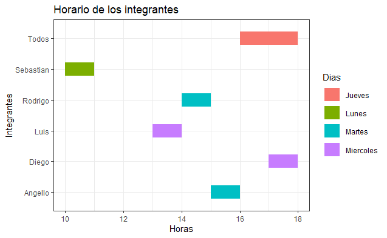

# Introducción

<h3>Análisis de Hábitos de compras por internet</h3>

## Relevancia
Estudiar los hábitos de compra son una práctica importante del marketing. Siendo este último esencial en el crecimiento de una empresa o negocio. Encontrar las tendencias de los consumidores al momento de realizar sus compras (por internet en este caso) es el primer paso para crear una estrategia que permita aumentar las ventas. Las tendencias están relacionadas a distintos factores (sexo, edad, ingresos, ubicación, etc.). Del mismo modo, el estudio de los hábitos de compra facilita hallar el público objetivo para cualquier negocio pues encontraremos preferencias, necesidades, entre otros y sus relación con los factores anteriormente mencionados.  

## Planificación
El grupo que plantea este proyecto se encuentra compuesto por 5 estudiantes. Cada uno con distintos horarios de clase. Es por esto que se planificó horarios asíncronos donde cada uno avanza la parte del proyecto encargada, al menos una vez a la semana. Además, tenemos una reunión de dos horas todos los jueves donde revisamos los avances de cada uno en el documento drive que tenemos compartido entre nosotros. Los horarios de trabajo se ven reflejados en el siguiente diagrama de Gantt. 
Los trabajos repartidos en la reunión grupal deben estar terminados o avanzados (según lo que se acuerde) para la siguiente reunión grupal.  


# Datos

## Proceso de recolección de datos

Se recolectó la data mediante las respuestas de 150 personas jóvenes aproximadamente en una encuesta a través de Google Forms, siendo enviada a 600 personas. Dicha herramienta es  de gran utilidad ya que se pueden hacer las restricciones necesarias para las variables y puede ser compartida solo con enviar el link y siendo de fácil y rápido llenado.

## Población, muestra y muestreo

- Población: Amistades o conocidos jóvenes de los integrantes del grupo.

- Muestra: Amistades o conocidos jóvenes que respondieron la encuesta.

- Muestreo: Se usó muestreo aleatorio simple. De las 600 personas alcanzadas mediante mensajes privados como a grupos. Al final, se obtuvo que su tamaño efectivo es de 150 observaciones aproximadamente.

## Variables
Nombre de variable / tipo de variable / Descripción
Nom / Categórica nominal / Es el nombre y apellidos en letras mayúsculas del encuestado
                Sexo / Categórica nominal / Representa el genero del encuestado {F, M}.
                Edad / Numérica discreta / Toma valores discretos entre 18 y 40 años y es la edad (años cumplidos) del encuestado
                Distrito /Categórica nominal  / Representa el distrito en donde se encuentra viviendo el encuestado (Distritos de Lima)
                Ingresos / Numérica discreta  / Toma valores discretos  de los ingresos de mensuales de la vivienda del encuestado en soles.
                Rubro / Categóricas nominal  / Toma valores del conjunto de alternativas  consideradas en el estudio por parte de los miembros del grupo: {Comida, Productos de uso personal, Productos domésticos, Juegos en línea, Productos electrónicos, Productos informáticos, Movilidad, Eventos, Turismo, Turismo, Entradas} Estos representan los rubros que más consumes de la compras por Internet de manera mensual.
                Medio / Categórica nominal  / Toma valores del conjunto de alternativas  consideradas en el estudio por parte de los miembros del grupo: {Débito o crédito, Paypal, Transferencia bancaria online, Billetera virtual, Monedas virtuales, otro} Cada opción representa un medio de pago por el cual se puede realizar la compra online.
                Dispositivo / Categórica nominal / Medio usado para realizarse la compra online,
                Num_compras / Numérica discreta / Número de compras: Toma valores discretos del número de compras del encuestado durante un mes.
                Monto_compras / Numérica discreta  /  Toma valores discretos del ingreso mensual aproximado del encuestado en soles.
                Tiempo_compras / Numérica continua / Toma valores contínuos con un decimal del tiempo estimado de demora en la compra online en minutos por compra.
                

Total : 10 variables

## Limpieza de base de datos
Empleamos las librerías **readr** y **dplyr**.
```{r}
library(readr)
library(dplyr)
```
Asignamos a la variable **ALA** los resultados de los datos recogidos de nuestra encuesta.

```{r}
ALA <- read_csv("DATOS DE ENCUESTA.csv")
```
Verificamos las especificaciones de las variables, nos percatamos que las variables: “Edad”, “Ingresos de vivienda”, “Número de compras”,” Monto aproximado de compras”,” Promedio de tiempo “; RStudio las detecta como **Categóricas**. A pesar de ello, deberían ser **Numéricas**. Por lo tanto las cambiaremos durante la limpieza de datos.

```{r}
spec(ALA)

```

Cambiamos los nombres de las variables para que nos facilite a la hora de llamar a las variables.

```{r}
ALA %>% rename(  Eliminar = `Marca temporal`,
                Nom =`Nombre y apellidos (MAYUSCULAS SIN TILDE)`,
                Edad = `Edad (años cumplidos)`,
                Distrito = `Distrito en donde vives (Lima) MAYUSCULAS SIN TILDE`,
                Ingresos = `Ingresos de tu vivienda mensuales en soles y sin decimal (ejemplo : 2500)`,
                Rubro = `Rubros que más consumes en tus compras por Internet`,
                Medio = `Medio de pago por el cual se realizo la compra online`,
                Dispositivo =`Medio usado para realizarse la compra online`,
                Num_compras =`Número de compras: (Número entero, ejemplo: 5)`,
                Monto_compras = `Monto aproximado del total de compras (Número entero, ejemplo: 200)`, 
                Tiempo_compras =`Promedio de tiempo (minutos) que se demora en realizar una compra (Por compra unitaria ejemplo 15.5 o 10.6)`) -> ALA
                
```
## VARIABLE NOMBRE:

Los nombres lo pasaremos a **Mayúsculas** para corregir las variaciones entre mayúsculas y minúsculas en los individuos.

```{r}
ALA$Nom <- toupper(ALA$Nom)
```

## VARIABLE EDAD:

La variable Edad nos aparece como una variable **Categórica** , Por ello, la cambiamos a **Numérica**.

```{r}
ALA$Edad <- as.numeric(ALA$Edad)
```

El resultado de convertir a una variable **Numérica** genera un **NA**  si la observación no corresponde con el tipo de variable. Durante esta inspección nos percatamos que un individuo que llenó el cuestionario no hizo seriamente por lo cual optamos por eliminarlo totalmente de la lista.


```{r}
ALA <- ALA[-21,]
```

## VARIABLE DISTRITO:

Corregimos algunos datos en minúsculas eliminando tildes. Asimismo, modificamos algunas observaciones como "smp" a "SAN MARTIN DE PORRES"  debido a que identificamos que la persona escribió las siglas del distrito.

```{r}
ALA$Distrito[ALA$Distrito == "Los Olivos"]<-"LOS OLIVOS"
ALA$Distrito[ALA$Distrito == "Chorrillos"]<-"CHORRILLOS"
ALA$Distrito[ALA$Distrito == "Surquillo"]<-"SURQUILLO"
ALA$Distrito[ALA$Distrito == "Puente piedra"]<-"PUENTE PIEDRA"
ALA$Distrito[ALA$Distrito == "LOZ HOLIVOZ"]<-"LOS OLIVOS"
ALA$Distrito[ALA$Distrito == "Callao Cercado"]<-"CALLAO"
ALA$Distrito[ALA$Distrito == "OLIVOS"]<-"LOS OLIVOS"
ALA$Distrito[ALA$Distrito == "Comas"]<-"COMAS"
ALA$Distrito[ALA$Distrito == "Santiago de Surco"]<-"SANTIAGO DE SURCO"
ALA$Distrito[ALA$Distrito == "San Isidro"]<-"SAN ISIDRO"
ALA$Distrito[ALA$Distrito == "Comas"]<-"COMAS"
ALA$Distrito[ALA$Distrito == "SMP"]<-"SAN MARTIN DE PORRES"
ALA$Distrito[ALA$Distrito == "Surco"]<-"SURCO"
ALA$Distrito[ALA$Distrito == "CALLAO v:"]<-"CALLAO"
ALA$Distrito[ALA$Distrito == "Lima"]<-"CERCADO DE LIMA"
ALA$Distrito[ALA$Distrito == "Los olivos"]<-"LOS OLIVOS"
ALA$Distrito[ALA$Distrito == "Pueblo libre"]<-"PUEBLO LIBRE"
ALA$Distrito[ALA$Distrito == "San Juan de Miraflores"]<-"SAN JUAN DE MIRAFLORES"
ALA$Distrito[ALA$Distrito == "callao"]<-"CALLAO"
ALA$Distrito[ALA$Distrito == "Callao"]<-"CALLAO"
ALA$Distrito[ALA$Distrito == "San Martín de Porres"]<-"SAN MARTIN DE PORRES"
ALA$Distrito[ALA$Distrito == "SAN MARTÍN DE PORRES"]<-"SAN MARTIN DE PORRES"
ALA$Distrito[ALA$Distrito == "CARABYLLO"]<-"CARABAYLLO"
ALA$Distrito[ALA$Distrito == "LOS OLIVOs"]<-"LOS OLIVOS"
```

## VARIABLE INGRESOS:

La variable Ingreso nos aparece como una variable **Categórica** . Por lo tanto, la cambiamos a una variable **Numérica**

```{r}
ALA$Ingresos <- as.numeric(ALA$Ingresos)
```

## VARIABLE TIEMPO_COMPRAS:

Verificamos si existe alguna observación que pueda ser corregida.

```{r}
unique(ALA$Tiempo_compras)
```

Corregimos distintas respuestas eliminando alguna palabra extra como "min" o convirtiendo una unidad de tiempo como segundos a minutos. Asimismo, nos percatamos de algunos errores que pudieron ser de tipeo y los corregimos .

```{r}
ALA$Tiempo_compras[ALA$Tiempo_compras == "6 MIN"]<-"6"
ALA$Tiempo_compras[ALA$Tiempo_compras == "20 mim"]<-"20"
ALA$Tiempo_compras[ALA$Tiempo_compras == "30 s"]<-"0.5"
ALA$Tiempo_compras[ALA$Tiempo_compras == "10 .5"]<-"10.5"
```

Finalmente, debido a que la variable **Tiempo_compras** nos aparece como una variable **Categórica**, la cambiamos a **Numérica**.

```{r}
ALA$Tiempo_compras <- as.numeric(ALA$Tiempo_compras)
```

## VARIABLE NUM_COMPRAS:

Finalmente, debido a que la variable **Tiempo_compras** nos aparece como una variable **Categórica**, la cambiamos a **Numérica**.

```{r}
unique(ALA$Num_compras)
```

Corregimos una respuesta. Para ello, consultamos al encuestado.

Finalmente, debido a que la variable **Num_compras** aparece como **Categórica** es cambiada a una variable **Numérica**.


```{r}
ALA$Num_compras[ALA$Num_compras == "2-3"]<-"2"
ALA$Num_compras <- as.numeric(ALA$Num_compras)
```

## VARIABLE MONTO_COMPRAS:

La variable nos aparece como una variable **Categórica** por lo que la cambiamos a una variable **Numérica**.

```{r}
ALA$Monto_compras <- as.numeric(ALA$Monto_compras)
```

## VARIABLE ELIMINAR:

Eliminamos la variable **Eliminar** la cual es el tiempo de llenado de la encuesta y para el presente estudio es **irrelevante**.

```{r}
ALA$Eliminar<-NULL
```

# Análisis descriptivo

## Análisis de `Preferencia de acuerdo a los tipos de compra por internet`

¿Cuál es el tipo de compra por Internet más frecuente?
```{r}
mfv(ALA$Rubro)
```
Gráfico de barras para ver las distintas frecuencias de tipo de compra por Internet.
```{r}
barplot(table(ALA$Rubro),cex.names = 0.2, ylab="Frecuencia", xlab="Tipo de compra", main="Diversos tipos de compra por internet", col="red")
```
Los tres tipos de compras más frecuentes son la de alimentos, productos de uso personal y productos domésticos.
Es comprensible dado a que todos son productos de primera necesidad a comparación de los demás tipos de productos. 


## Análisis de `Minutos dedicados a la compra por internet`

La variable numérica continua,observemos sus descriptores de posición.

```{r}
mfv(ALA$Tiempo_compras)
```
```{r}
mean(ALA$Tiempo_compras)
```
```{r}
median(ALA$Tiempo_compras)
```
y su forma graficado en un histograma.
```{r}
hist(ALA$Tiempo_compras, xlab = "Minutos dedicados", ylab = "Frecuencia", main = "Minutos dedicados a la compra por internet", col = "grey")
abline(v=median(ALA$Tiempo_compras),col="red",lwd=3) 
abline(v=mean(ALA$Tiempo_compras),col="blue",lwd=3) 

```

La clase modal es menor a 10, lo cual significa que dedican entre 0 y 15 minutos para realizar sus compras, por lo general las personas buscan demorar lo menos posible a la hora de realizar sus compras por Internet.


## Análisis de `Relación entre ingresos y monto de compras`

```{r}
smoothScatter(ALA$Ingresos,ALA$Monto_compras,xlab="Ingresos (soles)",ylab="Montos de compra (soles)",main="Ingresos vs monto de compra")
```
Se necesita más datos para notar que los ingresos y el monto de compra son directamente proporcionales o quizá independientemente de cuánto gana el peruano sigue sin confiar en los métodos de compra por internet.

Verificamos las especificaciones de las variables, nos percatamos que las variables: “Edad”, “Ingresos de vivienda”, “Número de compras”,” Monto aproximado de compras”,” Promedio de tiempo “; RStudio las detecta como **Categóricas**. A pesar de ello, deberían ser **Numéricas**. Por lo tanto las cambiaremos durante la limpieza de datos.

```{r}
spec(ALA)

```

Cambiamos los nombres de las variables para que nos facilite a la hora de llamar a las variables.

```{r}
ALA %>% rename(  Eliminar = `Marca temporal`,
                Nom =`Nombre y apellidos (MAYUSCULAS SIN TILDE)`,
                Edad = `Edad (años cumplidos)`,
                Distrito = `Distrito en donde vives (Lima) MAYUSCULAS SIN TILDE`,
                Ingresos = `Ingresos de tu vivienda mensuales en soles y sin decimal (ejemplo : 2500)`,
                Rubro = `Rubros que más consumes en tus compras por Internet`,
                Medio = `Medio de pago por el cual se realizó la compra online`,
                Dispositivo =`Medio usado para realizarse la compra online`,
                Num_compras =`Número de compras: (Número entero, ejemplo: 5)`,
                Monto_compras = `Monto aproximado del total de compras (Número entero, ejemplo: 200)`, 
                Tiempo_compras =`Promedio de tiempo (minutos) que se demora en realizar una compra (Por compra unitaria ejemplo 15.5 o 10.6)`) -> ALA
                
```
## VARIABLE NOMBRE:

Los nombres lo pasaremos a **Mayúsculas** para corregir las variaciones entre mayúsculas y minúsculas en los individuos.

```{r}
ALA$Nom <- toupper(ALA$Nom)
```

## VARIABLE EDAD:

La variable Edad nos aparece como una variable **Categórica** , Por ello, la cambiamos a **Numérica**.

```{r}
ALA$Edad <- as.numeric(ALA$Edad)
```

El resultado de convertir a una variable **Numérica** genera un **NA**  si la observación no corresponde con el tipo de variable. Durante esta inspección nos percatamos que un individuo que llenó el cuestionario no hizo seriamente por lo cual optamos por eliminarlo totalmente de la lista.


```{r}
which(is.na(ALA$Edad),ALA)
```

```{r}
ALA <- ALA[-21,]
```

## VARIABLE DISTRITO:

Corregimos algunos datos en minúsculas eliminando tildes. Asimismo, modificamos algunas observaciones como "smp" a "SAN MARTIN DE PORRES"  debido a que identificamos que la persona escribió las siglas del distrito.

```{r}
ALA$Distrito[ALA$Distrito == "Los Olivos"]<-"LOS OLIVOS"
ALA$Distrito[ALA$Distrito == "Chorrillos"]<-"CHORRILLOS"
ALA$Distrito[ALA$Distrito == "Surquillo"]<-"SURQUILLO"
ALA$Distrito[ALA$Distrito == "Puente piedra"]<-"PUENTE PIEDRA"
ALA$Distrito[ALA$Distrito == "LOZ HOLIVOZ"]<-"LOS OLIVOS"
ALA$Distrito[ALA$Distrito == "Callao Cercado"]<-"CALLAO"
ALA$Distrito[ALA$Distrito == "OLIVOS"]<-"LOS OLIVOS"
ALA$Distrito[ALA$Distrito == "Comas"]<-"COMAS"
ALA$Distrito[ALA$Distrito == "Santiago de Surco"]<-"SANTIAGO DE SURCO"
ALA$Distrito[ALA$Distrito == "San Isidro"]<-"SAN ISIDRO"
ALA$Distrito[ALA$Distrito == "Comas"]<-"COMAS"
ALA$Distrito[ALA$Distrito == "SMP"]<-"SAN MARTIN DE PORRES"
ALA$Distrito[ALA$Distrito == "Surco"]<-"SURCO"
ALA$Distrito[ALA$Distrito == "CALLAO v:"]<-"CALLAO"
ALA$Distrito[ALA$Distrito == "Lima"]<-"CERCADO DE LIMA"
ALA$Distrito[ALA$Distrito == "Los olivos"]<-"LOS OLIVOS"
ALA$Distrito[ALA$Distrito == "Pueblo libre"]<-"PUEBLO LIBRE"
ALA$Distrito[ALA$Distrito == "San Juan de Miraflores"]<-"SAN JUAN DE MIRAFLORES"
ALA$Distrito[ALA$Distrito == "callao"]<-"CALLAO"
ALA$Distrito[ALA$Distrito == "Callao"]<-"CALLAO"
ALA$Distrito[ALA$Distrito == "San Martín de Porres"]<-"SAN MARTIN DE PORRES"
ALA$Distrito[ALA$Distrito == "SAN MARTÍN DE PORRES"]<-"SAN MARTIN DE PORRES"
ALA$Distrito[ALA$Distrito == "CARABYLLO"]<-"CARABAYLLO"
ALA$Distrito[ALA$Distrito == "LOS OLIVOs"]<-"LOS OLIVOS"
```

## VARIABLE INGRESOS:

La variable Ingreso nos aparece como una variable **Categórica** . Por lo tanto, la cambiamos a una variable **Numérica**

```{r}
ALA$Ingresos <- as.numeric(ALA$Ingresos)
```

## VARIABLE TIEMPO_COMPRAS:

Verificamos si existe alguna observación que pueda ser corregida.

```{r}
unique(ALA$Tiempo_compras)
```

Corregimos distintas respuestas eliminando alguna palabra extra como "min" o convirtiendo una unidad de tiempo como segundos a minutos. Asimismo, nos percatamos de algunos errores que pudieron ser de tipeo y los corregimos .

```{r}
ALA$Tiempo_compras[ALA$Tiempo_compras == "6 MIN"]<-"6"
ALA$Tiempo_compras[ALA$Tiempo_compras == "20 mim"]<-"20"
ALA$Tiempo_compras[ALA$Tiempo_compras == "30 s"]<-"0.5"
ALA$Tiempo_compras[ALA$Tiempo_compras == "10 .5"]<-"10.5"
```

Finalmente, debido a que la variable **Tiempo_compras** nos aparece como una variable **Categórica**, la cambiamos a **Numérica**.

```{r}
ALA$Tiempo_compras <- as.numeric(ALA$Tiempo_compras)
```

## VARIABLE NUM_COMPRAS:

Finalmente, debido a que la variable **Tiempo_compras** nos aparece como una variable **Categórica**, la cambiamos a **Numérica**.

```{r}
unique(ALA$Num_compras)
```

Corregimos una respuesta. Para ello, consultamos al encuestado.

Finalmente, debido a que la variable **Num_compras** aparece como **Categórica** es cambiada a una variable **Numérica**.


```{r}
ALA$Num_compras[ALA$Num_compras == "2-3"]<-"2"
ALA$Num_compras <- as.numeric(ALA$Num_compras)
```

## VARIABLE MONTO_COMPRAS:

La variable nos aparece como una variable **Categórica** por lo que la cambiamos a una variable **Numérica**.

```{r}
ALA$Monto_compras <- as.numeric(ALA$Monto_compras)
```

## VARIABLE ELIMINAR:

Eliminamos la variable **Eliminar** la cual es el tiempo de llenado de la encuesta y para el presente estudio es **irrelevante**.

```{r}
ALA$Eliminar<-NULL
```

# Análisis descriptivo

## Análisis de `Preferencia de acuerdo a los tipos de compra por internet`

¿Cuál es el tipo de compra por Internet más frecuente?
```{r}
mfv(ALA$Rubro)
```
Gráfico de barras para ver las distintas frecuencias de tipo de compra por Internet.
```{r}
barplot(table(ALA$Rubro),cex.names = 0.2, ylab="Frecuencia", xlab="Tipo de compra", main="Diversos tipos de compra por internet", col="red")
```
Los tres tipos de compras más frecuentes son la de alimentos, productos de uso personal y productos domésticos.
Es comprensible dado a que todos son productos de primera necesidad a comparación de los demás tipos de productos. 


## Análisis de `Minutos dedicados a la compra por internet`

La variable numérica continua,observemos sus descriptores de posición.

```{r}
mfv(ALA$Tiempo_compras)
```
```{r}
mean(ALA$Tiempo_compras)
```
```{r}
median(ALA$Tiempo_compras)
```
y su forma graficado en un histograma.
```{r}
hist(ALA$Tiempo_compras, xlab = "Minutos dedicados", ylab = "Frecuencia", main = "Minutos dedicados a la compra por internet", col = "grey")
abline(v=median(ALA$Tiempo_compras),col="red",lwd=3) 
abline(v=mean(ALA$Tiempo_compras),col="blue",lwd=3) 

```

La clase modal es menor a 10, lo cual significa que dedican entre 0 y 15 minutos para realizar sus compras, por lo general las personas buscan demorar lo menos posible a la hora de realizar sus compras por Internet.


## Análisis de `Relación entre ingresos y monto de compras`

```{r}
smoothScatter(ALA$Ingresos,ALA$Monto_compras,xlab="Ingresos (soles)",ylab="Montos de compra (soles)",main="Ingresos vs monto de compra")
```
Se necesita más datos para notar que los ingresos y el monto de compra son directamente proporcionales o quizá independientemente de cuánto gana el peruano sigue sin confiar en los métodos de compra por internet.


Corregimos distintas respuestas eliminando alguna palabra extra como "min" o convirtiendo una unidad de tiempo como segundos a minutos. Asimismo, nos percatamos de algunos errores que pudieron ser de tipeo y los corregimos .

```{r}
ALA$Tiempo_compras[ALA$Tiempo_compras == "6 MIN"]<-"6"
ALA$Tiempo_compras[ALA$Tiempo_compras == "20 mim"]<-"20"
ALA$Tiempo_compras[ALA$Tiempo_compras == "30 s"]<-"0.5"
ALA$Tiempo_compras[ALA$Tiempo_compras == "10 .5"]<-"10.5"
```

Finalmente, debido a que la variable **Tiempo_compras** nos aparece como una variable **Categórica**, la cambiamos a **Numérica**.

```{r}
ALA$Tiempo_compras <- as.numeric(ALA$Tiempo_compras)
```

## VARIABLE NUM_COMPRAS:

Finalmente, debido a que la variable **Tiempo_compras** nos aparece como una variable **Categórica**, la cambiamos a **Numérica**.

```{r}
unique(ALA$Num_compras)
```

Corregimos una respuesta. Para ello, consultamos al encuestado.

Finalmente, debido a que la variable **Num_compras** aparece como **Categórica** es cambiada a una variable **Numérica**.


```{r}
ALA$Num_compras[ALA$Num_compras == "2-3"]<-"2"
ALA$Num_compras <- as.numeric(ALA$Num_compras)
```

## VARIABLE MONTO_COMPRAS:

La variable nos aparece como una variable **Categórica** por lo que la cambiamos a una variable **Numérica**.

```{r}
ALA$Monto_compras <- as.numeric(ALA$Monto_compras)
```

## VARIABLE ELIMINAR:

Eliminamos la variable **Eliminar** la cual es el tiempo de llenado de la encuesta y para el presente estudio es **irrelevante**.

```{r}
ALA$Eliminar<-NULL
```

# Análisis descriptivo

## Análisis de `Preferencia de acuerdo a los tipos de compra por internet`

¿Cuál es el tipo de compra por Internet más frecuente?
```{r}
mfv(ALA$Rubro)
```
Grafico de barras para ver las distintas frecuencias de tipo de compra por Internet.
```{r}
barplot(table(ALA$Rubro),cex.names = 0.2, ylab="Frecuencia", xlab="Tipo de compra", main="Diversos tipos de compra por internet", col="red")
```
La que predomina son los tres tipos de compra mas frecuentes son la de alimentos, productos de uso personal y productos domésticos.
Es comprensible dado a que todos son productos de primera necesidad a comparación de los demás tipos de productos. 

## Análisis de `Minutos dedicados a la compra por internet`

La variable numérica continua,observemos sus descriptores de posición.

```{r}
mfv(ALA$Tiempo_compras)
```
```{r}
mean(ALA$Tiempo_compras)
```
```{r}
median(ALA$Tiempo_compras)
```
y su forma graficado en un histograma.
```{r}
hist(ALA$Tiempo_compras, xlab = "Minutos dedicados", ylab = "Frecuencia", main = "Minutos dedicados a la compra por internet", col = "grey")
abline(v=median(ALA$Tiempo_compras),col="red",lwd=3) 
abline(v=mean(ALA$Tiempo_compras),col="blue",lwd=3) 

```

La clase modal es menor a [10>, lo cual significa que dedican entre 0 y 15 minutos para realizar sus compras, por lo general las personas buscan demorar lo menos posible a la hora de realizar sus compras por Internet.


## Análisis de `Relación entre ingresos y monto de compras`

```{r}
smoothScatter(ALA$Ingresos,ALA$Monto_compras,xlab="Ingresos (soles)",ylab="Montos de compra (soles)",main="Ingresos vs monto de compra")
```
Se necesita más datos para notar que los ingresos y el monto de compra son directamente proporcionales o quizá independientemente de cuánto gana el peruano sigue sin confiar en los métodos de compra por internet.
