```{r setup, include=FALSE}
knitr::opts_chunk$set(echo = FALSE)
library(readr)
library(dplyr)

```


# Introducción

## Relevancia del tema{.smaller}

+ La gamificación de la educación es el uso de las mecánicas de los juegos en el ambiente educativo
+ La educación y los juegos tienen mucho en común.
+ La diferencia se da en cómo se enseñan dichas mecánicas y cómo se recompensa o castiga el aprendizaje de las mismas
+ El objetivo del estudio es analizar la posibilidad de transformar dichas mecánicas, su eficacia y su viabilidad.
 
 <center>

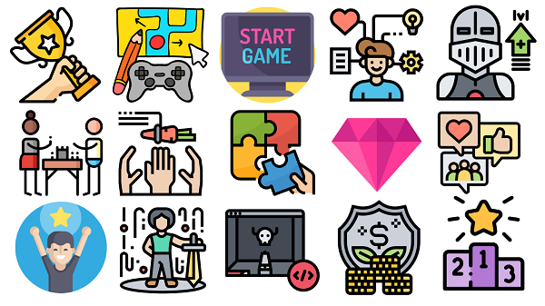

</center>

## Planificación

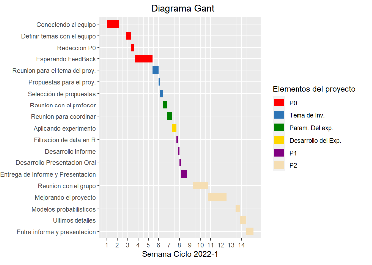


# Datos

## Experiencia 1: PC Building Simulator (juego en STEAM)

<center>

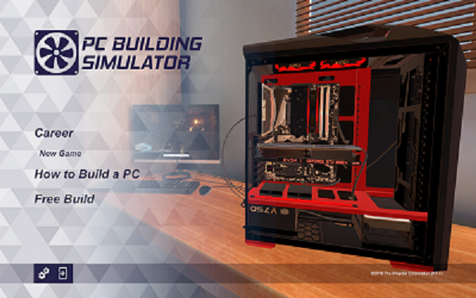 

</center>

## Experiencia 2:  Enseñanza tradicional

<center>


</center>

## Población, muestra y muestreo

- Población: Estudiantes universitarios del Perú.
- Unidad muestral: Estudiante de la Universidad de Ingeniería y Tecnología - UTEC.
- Tamaño de la muestra:  90 estudiantes de UTEC
- Representatividad de la muestra: El tipo de muestreo es el aleatorio simple (MAS)

<center>


</center>


## Variables

<center>


</center>

# Análisis descriptivo

## Encuestados por carrera

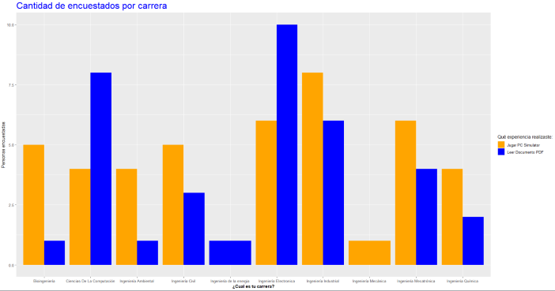

## Experiencia armando computadoras `PDF` {.smaller}


## Experiencia armando computadoras `PC` {.smaller}


## Conocimiento de componentes `PDF` {.smaller}


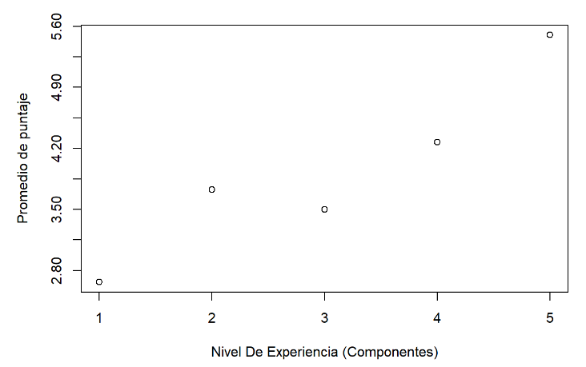

## Conocimiento de componente `PC` {.smaller}

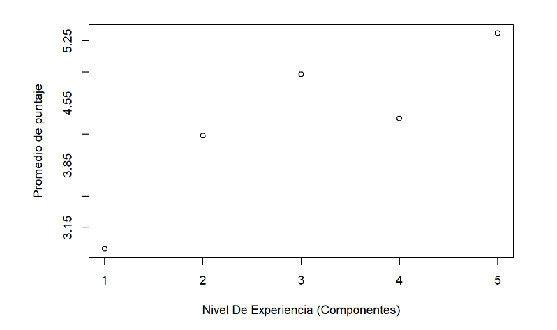

## Puntaje del test final {.smaller}
<center>
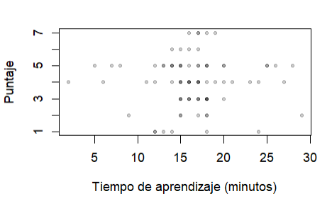
</center>

## Puntaje PDF vs Juego Con NAs
<center>
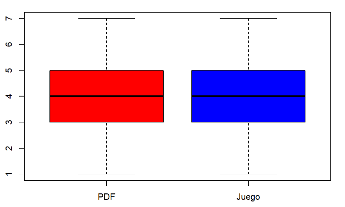
</center>

## Puntaje PDF vs Juego Sin NAs
<center>
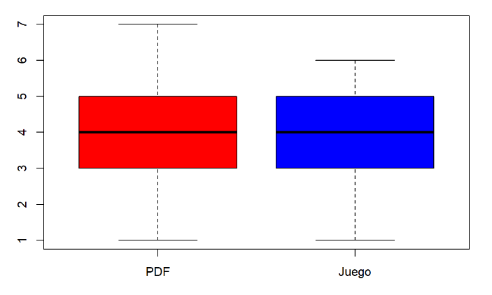
</center>

## Probabilidad Vs Intentos (Modelo Binomial)
<center>
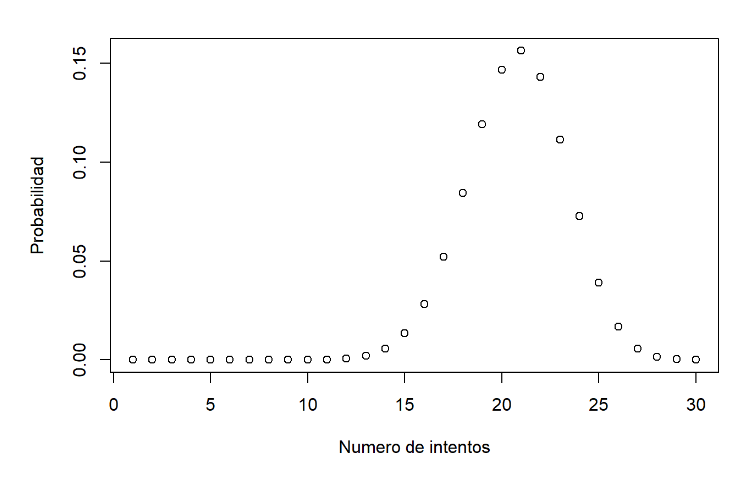
</center>

## Probabilidad Vs Intentos Separado Por Metodo (Modelo Binomial)
<center>
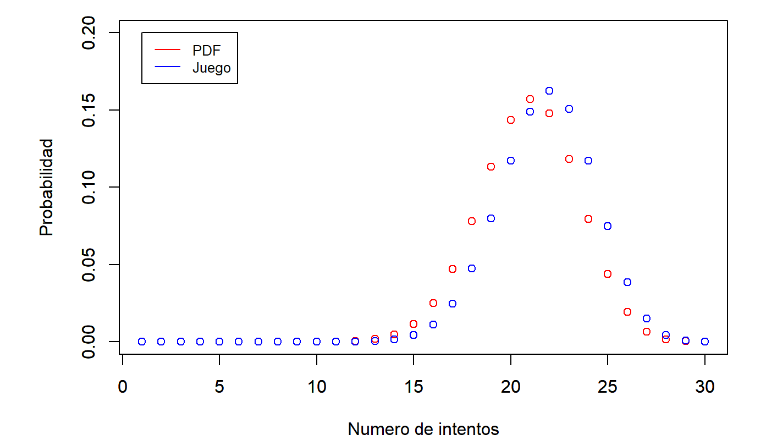
</center>

## Probabilidad Vs Intentos Hasta Fallo (Modelo Geometrico)

<center>
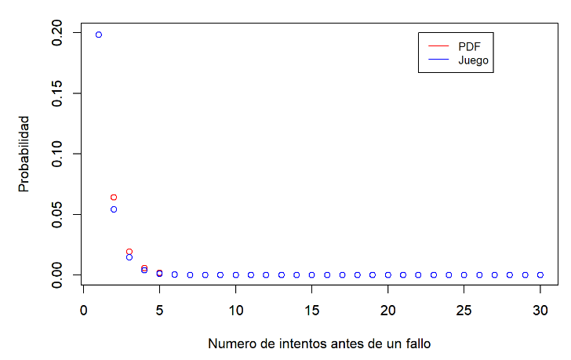
</center>

## Probabilidad Vs Nota (Modelo Poisson)
<center>

</center>


# Gracias
