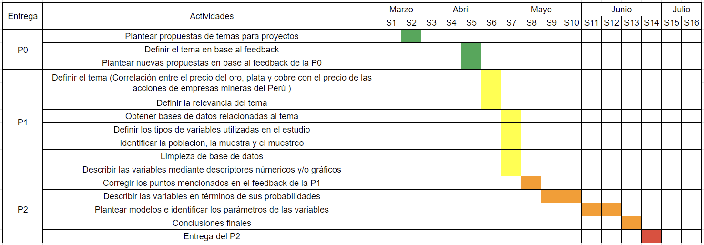

```{=html}
<style type="text/css">
   body{
    font-family: "Helvetica", sans-serif;
    font-size: 16px;
   }
   strong {
    color: #00022e;
   }
   h1, h2 {
    color: #00022e;
   }
  </style>
```
<center>


### **Estadística y Probabilidades**

#### **Correlación entre el precio del oro, plata y cobre con el precio de las acciones de empresas mineras del Perú**


**Introducción** <br> <br> La plata y el cobre son minerales que tienen
valor por el uso y características que tiene, aplicándose en varias
cosas útiles y necesarias para los seres humanos, como equipos
electrodomésticos, equipos electrónicos e incluso joyas. Su alza de
precio depende únicamente del incremento de demanda que tengan estos
materiales, a diferencia del oro.

El patrón oro es un sistema monetario respaldado por oro. En otras
palabras, el valor de cada unidad monetaria está determinado por una
cierta cantidad de oro. Con este sistema, el emisor de la moneda se
asegura que los billetes y monedas emitidos estén respaldados en oro. La
moneda de referencia para el precio del oro es el dólar estadounidense.
Así, cuando el valor del dólar cae, la capacidad de comprar oro aumenta
para quienes pagan en otra moneda. Y viceversa, cuando el dólar está
fuerte, el precio del oro es cada vez menos volátil.

Respecto a las empresas mineras, sus operaciones se centran en la
extracción selectiva de minerales de la corteza terrestre. Dado que la
tierra está concentrada con grandes yacimientos de minerales, muchas
empresas mineras se han beneficiado y aportado a la economía de cada
país. Cuando se trata de la valoración de la empresa, los precios de las
acciones cambian diariamente y precisamente debido a las fuerzas del
mercado, es decir, los precios de las acciones cambian según las fuerzas
de este y, la oferta y la demanda. El precio de los materiales (oro,
plata y cobre) influye directamente en el precio de la acción de empresa
y por ende a la valorización total de la empresa.

Las empresas mineras seleccionadas para el análisis del trabajo son:
Compañía de Minas Buenaventura S.A.A. (BVN), Barrick Gold Corporation
(GOLD), Newmont Goldcorp Corp (NEM), Gold Fields Limited (GFI). <br>
<br> 
**Relevancia** <br>
<br> El estudio es relevante porque busca
analizar la relación que tiene el precio del oro, la plata y el cobre
con el precio de las acciones de las empresas mineras seleccionadas y
ver si este tiene un efecto directo o no. <br> <br>
**Justificación**
<br> <br> 
El motivo principal del desarrollo del proyecto, es el interés
de los participantes por el tema y la relevancia que consideramos que
tiene. La minería en Perú es un sector muy importante dentro de su
economía y las principales empresas que generan riquezas trabajan a
nivel mundial. Por eso mismo consideramos importante entender el
comportamiento que tienen estas empresas respecto al precio de estos
minerales con fines de inversión. El estudio busca aportar conocimiento
respecto al tema y proponer predicciones en base al análisis
estadístico. <br> <br> 
**Factibilidad** 
<br> <br> Consideramos que el
estudio es factible debido a que contamos con bases de datos de empresas
mineras del Perú y del valor del oro, plata y cobre a lo largo de los
años. Con el fin de desarrollar un buen análisis significativo y llegar
a las conclusiones esperadas. <br> <br> 
**Planificación**
<br> <br> 
Para planificar el desarrollo del proyecto hemos optado por hacer uso de un
diagrama de Grantt donde indicaremos las semanas en las que se
entregarán las tareas específicas del proyecto. <br> <br>


------------------------------------------------------------------------

**DATOS**

-   <b>*Recolección de datos*</b>: En el estudio realizado se utilizaran
    las bases de datos de las empresas mineras, la del oro, plata y
    cobre. La página web que proporcionó esta información es Investing,
    una plataforma financiera que ofrece cotizaciones de mercado,
    información sobre acciones, materias primas, etc.

-   <b>*Población Objetivo*</b>: Empresas mineras del Perú

-   <b>*Tipo de Muestreo*</b>: El muestreo es estratificado debido a que
    se utilizara datos según la investigación planteada

-   <b>*Tamaño de la muestra*</b>: 5 años

-   <b>*Unidades Muestrales*</b>: 1233 unidades muestrales


**Variables**:

-   Nombre

-   Fecha

-   Precio de Apertura

-   Precio de Cierre

-   Variacion

------------------------------------------------------------------------

**Tabla - Tipos de Variables**

| Variables          | Tipo                 |
|--------------------|----------------------|
| Nombre             | Categórica → Nominal |
| Fecha              | Numérica → Continua  |
| Precio de Apertura | Numérica → Continua  |
| Precio de Cierre   | Numérica → Continua  |
| Variacion          | Numérica→ Continua   |

------------------------------------------------------------------------

**Limpieza de Datos**

```{r}
library(readr)
library(stringr)
library(quantmod)
library(PerformanceAnalytics)
library(dygraphs)
library(dplyr)
library(corrplot)
```

Cargamos las respuestas en un data frame inicial llamado DF:

```{r}
ORO = read_csv("Au.csv", show_col_types = FALSE);
PLATA = read_csv("PLATA.csv", show_col_types = FALSE);
COBRE = read_csv("COBRE.csv", show_col_types = FALSE);
BVN1 = read_csv("BVN.csv", show_col_types = FALSE);
GOLD1 = read_csv("GOLD.csv", show_col_types = FALSE);
GFI1 = read_csv("GFI.csv", show_col_types = FALSE);
```

Observamos los nombres de los encabezados:

```{r}
names(ORO)
```

Renombrar variables para mejorar nuestro estudio, eliminamos las
variables que no utilizaremos y acomodaremos algunas variables para que
luego se puedan usar:

```{r}
ORO = ORO[ ,c(1, 2, 3,7)]
names(ORO) <- c("Fecha",  "Cierre", "Apertura","Variacion %")
for(i in 1:nrow(ORO)){
  ORO$`Variacion %`[i] = str_sub(ORO$`Variacion %`[i],1,nchar(ORO$`Variacion %`[i])-1)
  x = ORO$`Variacion %`[i]
  a = gsub(",","\\.",x)
  a = gsub("\\,","",x)
  ORO$`Variacion %`[i] = as.numeric(a)/100
  ORO$Cierre[i] = as.numeric(ORO$Cierre[i])*1000
  ORO$Apertura[i]= as.numeric(ORO$Apertura[i])*1000
}


PLATA <- PLATA[ ,c(1, 2, 3, 7)]
names(PLATA) <- c("Fecha",  "Cierre", "Apertura", "Variacion %")
for(i in 1:nrow(PLATA)){
  PLATA$`Variacion %`[i] = str_sub(PLATA$`Variacion %`[i],1,nchar(PLATA$`Variacion %`[i])-1)
  x = PLATA$`Variacion %`[i]
  a = gsub(",","\\.",x)
  a = gsub("\\,","",x)
  PLATA$`Variacion %`[i] = as.numeric(a)/100
    PLATA$Cierre[i] = as.numeric(PLATA$Cierre[i])/1000
    PLATA$Apertura[i]= as.numeric(PLATA$Apertura[i])/1000
}

COBRE <- COBRE[ ,c(1, 2, 3,7)]
names(COBRE) <- c("Fecha",  "Cierre", "Apertura","Variacion %")
for(i in 1:nrow(COBRE)){
  COBRE$`Variacion %`[i] = str_sub(COBRE$`Variacion %`[i],1,nchar(COBRE$`Variacion %`[i])-1)
  x = COBRE$`Variacion %`[i]
  a = gsub(",","\\.",x)
  a = gsub("\\,","",x)
  COBRE$`Variacion %`[i] = as.numeric(a)/100
    COBRE$Cierre[i] = as.numeric(COBRE$Cierre[i])/10000
    COBRE$Apertura[i]= as.numeric(COBRE$Apertura[i])/10000
}


GOLD1 <- GOLD1[ ,c(1, 2, 3, 7)]
names(GOLD1) <- c("Fecha",  "Cierre", "Apertura","Variacion %")
  for(i in 1:nrow(GOLD1)){
    GOLD1$`Variacion %`[i] = str_sub(GOLD1$`Variacion %`[i],1,nchar(GOLD1$`Variacion %`[i])-1)
    x = GOLD1$`Variacion %`[i]
    a = gsub(",","\\.",x)
    a = gsub("\\,","",x)
    GOLD1$`Variacion %`[i] = as.numeric(a)/1000
    GOLD1$Cierre[i] = as.numeric(GOLD1$Cierre[i])/100
    GOLD1$Apertura[i]= as.numeric(GOLD1$Apertura[i])/100
  }

BVN1 <- BVN1[ ,c(1, 2, 3, 7)]
names(BVN1) <- c("Fecha",  "Cierre", "Apertura","Variacion %")
  for(i in 1:nrow(BVN1)){
    BVN1$`Variacion %`[i] = str_sub(BVN1$`Variacion %`[i],1,nchar(BVN1$`Variacion %`[i])-1)
    x = BVN1$`Variacion %`[i]
    a = gsub(",","\\.",x)
    a = gsub("\\,","",x)
    BVN1$`Variacion %`[i] = as.numeric(a)/1000
    BVN1$Cierre[i] = as.numeric(BVN1$Cierre[i])/1000
    BVN1$Apertura[i]= as.numeric(BVN1$Apertura[i])/1000
  }

GFI1 <- GFI1[ ,c(1, 2, 3, 7)]
names(GFI1) <- c("Fecha",  "Cierre", "Apertura","Variacion %")
  for(i in 1:nrow(GFI1)){
    GFI1$`Variacion %`[i] = str_sub(GFI1$`Variacion %`[i],1,nchar(GFI1$`Variacion %`[i])-1)
    x = GFI1$`Variacion %`[i]
    a = gsub(",","\\.",x)
    a = gsub("\\,","",x)
    GFI1$`Variacion %`[i] = as.numeric(a)/100
    GFI1$Cierre[i] = as.numeric(GFI1$Cierre[i])/1000
    GFI1$Apertura[i]= as.numeric(GFI1$Apertura[i])/1000
  
  }

```

Verificamos si hay datos faltantes

```{r}
sum(is.na(ORO))
sum(is.na(PLATA))
sum(is.na(COBRE))
sum(is.na(GOLD1))
sum(is.na(GFI1))
sum(is.na(BVN1))
```


Igualamos el numero de observaciones y fechas:
```{r}
for(i in 1:nrow(GOLD1)){
  if(ORO$Fecha[i] != GOLD1$Fecha[i]){
      ORO = ORO[-c(i), ]
  }
}

for(i in 1:nrow(GOLD1)){
  if(PLATA$Fecha[i] != GOLD1$Fecha[i]){
      PLATA = PLATA[-c(i), ]
  }
}

for(i in 1:nrow(GOLD1)){
  if(COBRE$Fecha[i] != GOLD1$Fecha[i]){
      COBRE = COBRE[-c(i), ]
  }
}


Au = c()
for(i in 1:nrow(GOLD1)){
  if(ORO$Fecha[i] != GOLD1$Fecha[i]){
    Au = c(i ,Au)
  }
}

Ag = c()
for(i in 1:nrow(GOLD1)){
  if(PLATA$Fecha[i] != GOLD1$Fecha[i]){
    Ag = c(i ,Ag)
  }
}

Cu = c()
for(i in 1:nrow(GOLD1)){
  if(COBRE$Fecha[i] != GOLD1$Fecha[i]){
    Cu = c(i ,Cu)
  }
}

Limpio = c(Au, Ag, Cu)


ORO = ORO[-c(Limpio), ]
PLATA = PLATA[-c(Limpio), ]
COBRE = COBRE[-c(Limpio), ]
GFI1 = GFI1[-c(Limpio), ]
BVN1 = BVN1[-c(Limpio), ]
GOLD1 = GOLD1[-c(Limpio), ]
```

Verificamos que tengan el mismo numero de columnas y filas:

```{r}
ncol(ORO)
ncol(PLATA)
ncol(COBRE)
ncol(GOLD1)
ncol(GFI1)
ncol(BVN1)


nrow(ORO)
nrow(PLATA)
nrow(COBRE)
nrow(GOLD1)
nrow(BVN1)
nrow(GFI1)
```

**Descriptores**

-   ***Descriptores Numéricos*** <br>

  Hallamos los descriptores numericos
    que nos ofrece summary **(media, cuartil, mediana, maximo y
    minimo)** en aquellas variables significativas:

```{r}
summary(ORO$Cierre)
summary(as.numeric(ORO$`Variacion %`))
```

```{r}
summary(PLATA$Cierre)
summary(as.numeric(PLATA$`Variacion %`))
```

```{r}
summary(COBRE$Cierre)
summary(as.numeric(COBRE$`Variacion %`))
```
```{r}
summary(GOLD1$Cierre)
summary(as.numeric(GOLD1$`Variacion %`))
```

```{r}
summary(BVN1$Cierre)
summary(as.numeric(BVN1$`Variacion %`))
```

```{r}
summary(GFI1$Cierre)
summary(as.numeric(GFI1$`Variacion %`))
```
-   ***Descriptores Gráficos***

**Gráfica de la variación del precio de las acciones de las empresas mineras** <br>

```{r}
simbolos<-c("GOLD","BVN","GFI")
getSymbols(simbolos, src = 'yahoo', from = "2017-06-01",to = "2022-06-01")
precios.activos <- cbind(Ad(GOLD),Ad(BVN),Ad(GFI))
names(precios.activos) <- c("GOLD","BVN","GFI")
precios.activos %>% dygraph(width=800,height=360, , main = "GOLD - BVN - GFI") %>% dyRangeSelector
```

En esta gráfica podemos observar la variación del precio de las acciones de las empresas mineras seleccionadas. En donde apreciamos que la empresa GOLD se ha mantenido con un precio mayor que las otras dos empresas y que la empresa GFI inicialmente tuvo un crecimiento lento, sin embargo a partir del año 2020 la variación del precio se incrementó logrando sobrepasar el precio de la acción de la empresa BVN. 
<br>

**Gráficas de la variación del precio de los metales** <br>
```{r}
simbolos<-c("GC=F")
getSymbols(simbolos, src = 'yahoo', from = "2017-06-01",to = "2022-06-01")
precios.activos <- cbind(Ad(`GC=F`))
names(precios.activos) <- c("GC=F")
precios.activos %>% dygraph(width=800,height=360, main = "ORO") %>% dyRangeSelector

simbolos<-c("SI=F")
getSymbols(simbolos, src = 'yahoo', from = "2017-06-01",to = "2022-06-01")
precios.activos <- cbind(Ad(`SI=F`))
names(precios.activos) <- c("SI=F")
precios.activos %>% dygraph(width=800,height=360, main = "PLATA") %>% dyRangeSelector

simbolos<-c("HG=F")
getSymbols(simbolos, src = 'yahoo', from = "2017-06-01",to = "2022-06-01")
precios.activos <- cbind(Ad(`HG=F`))
names(precios.activos) <- c("HG=F")
precios.activos %>% dygraph(width=800,height=360, main = "COBRE") %>% dyRangeSelector
```
En estas gráficas podemos observar la variación del precio de los minerales, en donde se puede apreciar que el oro tiene mucho más valor que los otros metales. Como se dijo anteriormente, el oro tiene todo un sistema financiero respaldo que puede justificar su valor para las personas y en las economías de los países, es un metal muy precioso independientemente de su tamaño, por lo que se requiere muy poco de esta sustancia para formar una moneda valiosa. Esto es diferente a los metales utilizados en la antigüedad, como el cobre que es una moneda de cobre requiere una mayor cantidad de material para lograr un alto valor, lo que dificulta el transporte de la moneda.
<br>

<br>

**Matriz de correlación de la variación**
```{r}
Variacion <- PLATA%>% mutate(O = ORO$`Variacion %`, P = PLATA$`Variacion %`, C = COBRE$`Variacion %`, G = GOLD1$`Variacion %`, B = BVN1$`Variacion %`, GF = GFI1$`Variacion %`)

DF <- Variacion[ ,c(5, 6, 7, 8, 9,10)]
colnames(DF)[1:6]<-c("ORO","PLATA", "COBRE","GOLD","BVN","GFI")
DF$ORO = as.numeric(DF$ORO)
DF$PLATA = as.numeric(DF$PLATA)
DF$COBRE = as.numeric(DF$COBRE)
DF$GOLD = as.numeric(DF$GOLD)
DF$BVN = as.numeric(DF$BVN)
DF$GFI = as.numeric(DF$GFI)
Cor<-(cor(DF))
Corr<-(cor(DF))

round(Corr,2)
corrplot.mixed(Corr)
```

<br>

<br>

**Matriz de correlación del precio de cierre**
```{r}
#Cierre
Cierre <- PLATA%>% mutate(O = ORO$Cierre, P = PLATA$Cierre, C = COBRE$Cierre, G = GOLD1$Cierre, B = BVN1$Cierre, GF = GFI1$Cierre)

DS <- Cierre[ ,c(5, 6, 7, 8, 9,10)]
colnames(DS)[1:6]<-c("ORO","PLATA", "COBRE","GOLD","BVN","GFI")
DS$ORO = as.numeric(DS$ORO)
DS$PLATA = as.numeric(DS$PLATA)
DS$COBRE = as.numeric(DS$COBRE)
DS$GOLD = as.numeric(DS$GOLD)
DS$BVN = as.numeric(DS$BVN)
DS$GFI = as.numeric(DS$GFI)
Cor<-(cor(DS))
Corr<-(cor(DS))

round(Corr,2)
corrplot.mixed(Corr)
```

**¿Cuál es el mineral que tiene menor variación?**

Para comparar la variación del precio del valor del oro, plata y cobre, utilizaremos un diagrama de caja (Boxplot).

```{r}

boxplot(  as.numeric(ORO$`Variacion %`)
        , as.numeric(PLATA$`Variacion %`)
        , as.numeric(COBRE$`Variacion %`)
        , main = "Boxplot del oro, plata y cobre"
        , col = c( "yellow", "grey","brown")
        , xlab = "Variación"
        , names = c("Oro", "Plata", "Cobre")
        , horizontal = FALSE
        )
```

En el siguiente gráfico se puede observar la variación de los 3 minerales estudiados (oro, plata y cobre). Vemos que la mediana de los 3 se acerca a 0 y que el mineral con menor variación es el oro y el que tiene más variación es la plata, que además es el que tiene más datos atípicos de los tres. Como se dijo anteriormente, el oro se ve afectado en menor proporción que el resto de metales, Una posible explicación es que el oro en sí es un activo cotizado y se considera un refugio seguro porque tiende a mantener el valor en situaciones volátiles. Asimismo, se ve como una cobertura contra la inflación porque tiende a preservar el valor frente al aumento de precios. Por otro lado, el aumento de la demanda del resto de minerales ha provocado que su precio suba.

<br>

**¿Cuál es la empresa que tiene mayor variación?**
<br>

Para comparar la variación del precio de las acciones de las empresas mineras, utilizaremos un diagrama de caja (Boxplot) que nos pueda mostrar la información necesaria para responder la pregunta. Fue necesario utilizar esta herramienta dos veces, debidos a que la variación de una de las empresas (GFI) era mucho más grande a comparación de las otras dos.

```{r}
boxplot(  as.numeric(BVN1$`Variacion %`)
        , as.numeric(GOLD1$`Variacion %`)
        , main = "Boxplot de las empresas mineras BVN y GOLD"
        , col = c( "light blue", "light green")
        , xlab = "Variación"
        , names = c("BVN", "GOLD")
        , horizontal = FALSE
        )

boxplot(as.numeric(GFI1$`Variacion %`)
        ,main = "Boxplot de la empresa minera GFI"
        , col = c( "orange")
        , xlab = "Variación"
        , names = c("GFI")
        , horizontal = FALSE)
```

En las gráficas de las empresas (BVN, GOLD y GFI) podemos observar la variación de los precios de las acciones de estas empresas y vemos que, al igual que los materiales, la variación tiende a 0. Se puede apreciar también que la empresa BVN tiene datos atípicos más alejados a comparación de la empresa GOLD. Finalmente, también se puede apreciar que la empresa minera GFI es la que más variación estándar tiene de las tres empresas, por lo tanto tiene más variación.
<br>
<br>

Leyenda: <br> 
Promedio = Color negro <br>
Mediana = Color morado <br>
<br>

```{r}
op=par(mfrow=c(2,3))

hist(ORO$Cierre, breaks=10, main="ORO", col=c("yellow"),xlab="Precio cierre",ylab = "Observaciones")
abline(v = mean(as.numeric(ORO$Cierre))  , col ="black", lwd = 2)
abline(v = median(as.numeric(ORO$Cierre)), col = "purple", lwd = 2)


hist(PLATA$Cierre, breaks=10, main = "PLATA",col=c("grey"), xlab="Precio cierre",ylab = "Observaciones")
abline(v = mean(as.numeric(PLATA$Cierre))  , col ="black", lwd = 2)
abline(v = median(as.numeric(PLATA$Cierre)), col = "purple", lwd = 2)


hist(COBRE$Cierre, breaks=10, main = "COBRE",col=c("brown"), xlab="Precio cierre",ylab = "Observaciones")
abline(v = mean(as.numeric(COBRE$Cierre))  , col ="black", lwd = 2)
abline(v = median(as.numeric(COBRE$Cierre)), col = "purple", lwd = 2)


hist(GOLD1$Cierre, breaks=10, main = "GOLD",col=c("light green"), xlab="Precio cierre",ylab = "Observaciones")
abline(v = mean(as.numeric(GOLD1$Cierre))  , col ="black", lwd = 2)
abline(v = median(as.numeric(GOLD1$Cierre)), col = "purple", lwd = 2)

hist(BVN1$Cierre, breaks=10, main = "BVN",col=c("light blue"), xlab="Precio cierre",ylab = "Observaciones")
abline(v = mean(as.numeric(BVN1$Cierre))  , col ="black", lwd = 2)
abline(v = median(as.numeric(BVN1$Cierre)), col = "purple", lwd = 2)


hist(GFI1$Cierre,breaks=10, main="GFI",col=c("orange"), xlab="Precio cierre", ylab = "Observaciones") 
abline(v = mean(as.numeric(GFI1$Cierre))  , col ="black", lwd = 2)
abline(v = median(as.numeric(GFI1$Cierre)), col = "purple", lwd = 2)

par(op)
```
<br> <br>
**Observaciones** <br> <br>
Se realizó esta comparación  de histograma para tener una idea más clara  de  cada variable, se puede observar  de cómo se  puede modelar cada variable como por ejemplo, los precios de cierre de GOLD,BVN y GFI. También se puede observar  los precios de cierre del oro ,plata  y cobre.  Teniendo en cuenta que en la primera gráfica del precio de cierre del oro es una variable aleatoria y por el comportamiento que presenta podemos deducir que es una gráfica binomial. Por otro lado, vemos que el promedio es mayor a la mediana por lo tanto es una gráfica sesgada a la derecha.

La gráfica con relación del precio de cierre de la plata,se observa a simple vista que es una variable aleatoria discreta por ende presenta una gráfica  binomial  y esto tiene una correlación el precio a lo largo del tiempo. De igual manera que en el gráfico anterior al tener el promedio mayor a la mediana es una gráfica sesgada a la derecha.

La gráfica con relación del precio de cierre del cobre  muestra que es una variable aleatoria  discreta según ello nos muestra una gráfica de distribución binomial  ya que implica que las pruebas se realicen en la mismas condiciones es por ello que podemos identificar según los datos que nos proporciona.Al tener su mediana un valor menor al promedio la gráfica se encuentra sesgada a la derecha.

La gráfica con relación del Gold  esta gráfica nos presenta una  variable aleatoria continua por ende nos presenta una gráfica de distribución normal, a igual de  que los demás se identificó según los datos proporcionados.Por otro lado, como la mediana es igual al promedio esta es una gráfica simétrica. 

La gráfica con relación de BVN es una variable aleatoria discreta  que presenta  una distribución binomial de la misma forma esto se obtiene según los datos proporcionados que es respecto al tiempo. Esta gráfica es la única que tiene un su mediana mayor al promedio por lo que es una gráfica sesgada a la izquierda.

La gráfica con relación de GFI  a simple vista nos presenta una variable aleatoria continua por ende nos muestra una distribución  binomial  ya que esto sucede gracias a una correlación  más directa. La gráfica de esta empresa minera al tener su promedio mayor a la mediana se encuentra sesgada a la derecha.

<br>
<br>

**Conclusiones**

-   Mediante los histogramas podemos observar que las gráficas del mineral de oro, plata y cobre y las empresas mineras BVN y GFI presentan un modelo de distribución binomial. Por otro lado, la empresa minera GOLD presenta un modelo de distribución normal.

-   Las gráficas de histograma del oro, plata, cobre y la empresa minera GFI presentan que el promedio es mayor a la mediana, por lo que presentan un sesgo a la derecha. En el caso de la empresa BVN al tener al lado derecho a la mediana y al izquierdo al promedio presenta un sesgo a la izquierda. Por último, la empresa GOLD al tener una diferencia mínima en cuanto a su promedio y mediana, esta gráfica presenta cierta simetría por lo que se puede concluir que los datos son simétricos.

-   En el gráfico de correlación de variación podemos ver como es la relación que existe entre los minerales y las empresas mineras. Podemos concluir que en el caso del oro con las tres empresas mineras presenta un círculo azul lo que indica que existe una correlación positiva, es decir al aumentarse la variación en el precio del oro aumenta también la variación en el valor de la acción de las tres empresas mineras. Este aumento se presenta más en la empresa minera GOLD puesto que el color del cículo más oscuro que las demás empresas.

-   En el gráfico de correlación del precio de cierre vemos que la empresa minera BVN presenta una correlación inversa con los tres materiales, mayormente con el oro y esto se puede deducir por lo oscuro que se encuentra el círculo rojo. Esto significa que si el precio de cierre del mineral de plata disminuye, el precio de cierre de la acción subirá y de igual manera con los demás minerales.

-   En los diagramas de boxplot de las empresas mineras se puede observar como la empresa GFI es la que presenta mayor dispersión en sus datos de la variable variación y en el caso de los minerales(oro, plata y cobre) vemos que el oro es el que presenta la menor variación esto puede deberse principalmente a que el oro es un activo cotizado y se considera un refugio seguro porque tiende a mantener el valor en situaciones volátiles.


**Bibliografía**

Aguilar, J. F. (2021, September 2). Oro. Retrieved from https://economipedia.com/definiciones/oro.html <br> <br> 
Monex. (2022, March 29). Retrieved from https://blog.monex.com.mx/escuela-de-finanzas/por-que-suben-y-bajan-los-precios-de-las-acciones#:~:text=La%20cotizaci%C3%B3n%20de%20las%20acciones <br> <br> 
Pedraza, J. A. (2018, July 7). ¿Qué es y cómo funciona el patrón oro? Retrieved from https://oroinformacion.com/que-es-y-como-funciona-el-patron-oro/#:~:text=El%20patr%C3%B3n%20oro%20es%20un,emitidos%20est%C3%A1n%20respaldados%20por%20oro <br> <br>
Singular Bank. (2022, April 7). ¿Por qué sube y baja el precio del oro? [web log]. Retrieved from https://blog.selfbank.es/por-que-sube-y-baja-el-precio-del-oro/#:~:text=La%20divisa%20de%20referencia%20para,bajo%20y%20es%20menos%20vol%C3%A1til <br> <br>