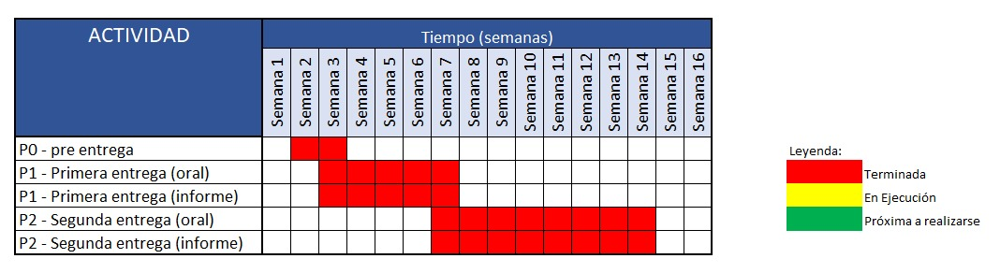

```{r echo=FALSE}
library(readr)
```
```{r echo=FALSE}
P2 <- read_csv("Proyecto_2.csv", col_types = "nccccccccccccnc")
```

## Introducción
+ **Relevancia:**
    La salud mental es el equilibrio entre nosotros, nuestro entorno y nuestro  bienestar emocional, psicológico y social, esto nos afecta a la forma en que pensamos, sentimos y actuamos en el día a día. De a cuerdo con el MINEDU en promedio el 85% de la comunidad educativa superior presenta algún problema de salud mental, siendo el estrés y la ansiedad los más habituales. En el caso de los jóvenes universitarios es un tema de suma importancia que tiene consecuencias directas en el ámbito académico que no siempre se le da la relevancia requerida. 
Es por esta razón que con los datos obtenidos se desea averiguar la relación entre nuestras distintas variables y su efecto sobre el rendimiento académico de los alumnos.

+ **Planificación:**


## Datos
+ **Recolección de datos :**
  + **¿Cómo se obtuvo los datos y por qué se hizo de esa manera? :** 
    
  Para el proceso de recolección de datos se optó por obtener los datos mediante una encuesta, pues era mucho más factible obtener respuestas de diversos estudiantes universitarios de diversas carreras e instituciones universitarias y llegar a los mismos por medio de esta modalidad. Para la recolección de datos se entregó la encuesta a amigos y compañeros de cada uno de los integrantes de este grupo para así obtener la mayor cantidad de respuestas posibles 
    
  + **Condiciones para la recolección de datos**
  
  Las condiciones para la recolección fueron que los entrevistados sean estudiantes universitarios de primer a décimo ciclo de distintas universidades y carreras.
  
  + **Estrategias para llegar a la población**
  
  Para llegar a la población se escogió promocionar la encuesta con un sorteo de 120 soles, para así obtener una gran cantidad de respuestas lo más pronto posible.
  
+ **Población, muestra y muestreo:**
  
  + **Población :** Estudiantes Universitarios de primer a décimo ciclo
  + **Muestra :** 200 Estudiantes Universitarios que cursan entre el primer a décimo ciclo
  + **Muestreo :** Muestreo por Conveniencia
    
+ **Variables :**
  
  + Identidad de género : *Variable tipo categórica nominal, restricción ninguna* 
    
  + Ciclo de estudios : *Variable tipo categórica nominal, restricción entero entre 1 y 10*
    
  + Carrera : *Variable tipo categórica nominal, restricción solo carreras de universidades peruanas* 
    
  + Conocimiento de la salud mental : *variable tipo categórica nominal, restricción  ninguna*
    
  + Evaluación de asesoría psicológica : *variable tipo categórica nominal, restricción ninguna*
    
  + Nivel de efecto en la salud mental por la universidad : *variable tipo categórica nominal,  restricción número entero entre el 1 y 5*
  
  + Fuente de Soporte Emocional : *variable tipo categórica nominal, restricción ninguna*
    
  + Conocimiento de herramientas dadas por la universidad : *variable tipo categórica nominal, restricción ninguna* 
    
  + Nivel de Efecto de la salud mental en el rendimiento académico : *variable tipo categórica nominal, restricción número entero del 1 al 5*
    
  + Nivel de apoyo del entorno : *variable tipo categórica nominal, restricción número entero del 1 al 5*
    
  + Apoyo Personal hacia los estudiantes : *variable tipo categórica nominal, restricción solo personas*  
    
  + Días de falta de sueño a causa de la salud mental : *variable tipo numérica discreta, restricción número entero del 1 al 7*
    
  + Ansiedad : *variable tipo categórica nominal, restricción ninguna*
  
  
+ **Limpieza de base de datos :**

***1. Corregir nombre de las variables*** 
Primero se  analizarán los nombres de la base de datos para cambiarlos o corregirlos posteriormente :
```{r}
names(P2)
```
Se nota que hay variables con nombre erróneo y que deben cambiarse por una mejor redacción, por lo tanto se asigna un mejor nombre a las variables en forma de preguntas, teniendo en cuenta que las tildes o caracteres especiales no son leídas por *Rstudio*.

Nombres a reemplazar para cada variable :

+  "Sexo" → "Género" 
+  "¿Sabes que es la salud mental?" → "Conocimiento de la salud mental" 	
+  "¿En algún momento recibiste o pensaste que necesitabas recibir ayuda profesional de algún psicólogo?" → "Evaluación de asesoría psicológica"
+  "Del 1 al 5 ¿Cuánto crees que la universidad afecta tu salud mental?" → "Nivel de efecto en la salud mental por la universidad"
+  "¿Cuando sientes que tienes problemas de salud mental, con quién acudes?" → "Fuente de Soporte Emocional"
+  "¿Sabes si tu universidad cuenta con buenos recursos que garanticen tu bienestar emocional?" → "Conocimiento de herramientas dadas por la universidad"
+  "Del 1 al 5 ¿Cuánto crees que problemas como la ansiedad/estrés/depresión afecten a tu rendimiento académico?" → "Nivel de Efecto de la salud mental en el rendimiento académico"	
+  "Del 1 al 5 ¿Consideras que el apoyo de tu entorno influye en tu motivación para esforzarte en todo aspecto de tu vida?" → "Nivel de apoyo del entorno"	
+  "¿Tienes amigos/compañeros/familiares que apoyen las decisiones que tomas?" → "Apoyo Personal hacia los estudiantes"
+  "Del 1 al 7 ¿Cuántas veces a la semana presentas problemas para conciliar el sueño?" → "Días de falta de sueño a causa de la salud mental"
+  "¿Tienes la necesidad de evitar las situaciones que generan ansiedad?" → "Ansiedad"

Se utilizará el comando `rename` para así cambiar el nombre respectivamente, para esto se cargará la librería `dplyr` 
```{r echo=FALSE}
library(dplyr)
```
```{r}
P2_limpia <-rename(P2, "Genero" = 'Sexo',"Conocimiento de la salud mental" = '¿Sabes que es la salud mental?',"Evaluación de asesoría psicológica" = '¿En algún momento recibiste o pensaste que necesitabas recibir ayuda profesional de algún psicólogo?', "Nivel de efecto en la salud mental por la universidad" = 'Del 1 al 5 ¿Cuánto crees que la universidad afecta tu salud mental?',"Fuente de Soporte Emocional"='¿Cuándo sientes que tienes problemas de salud mental, con quién acudes?', "Conocimiento de herramientas dadas por la universidad" = '¿Sabes si tu universidad cuenta con buenos recursos que garanticen tu bienestar emocional?',"Nivel de Efecto de la salud mental en el rendimiento académico" = 'Del 1 al 5 ¿Cuánto crees que problemas como la ansiedad/estrés/depresión afecten a tu rendimiento académico?' ,"Nivel de apoyo del entorno" = 'Del 1 al 5 ¿Consideras que el apoyo de tu entorno influye en tu motivación para esforzarte en todo aspecto de tu vida?', "Apoyo Personal hacia los estudiantes"='¿Tienes amigos/compañeros/familiares que apoyen las decisiones que tomas?',  "Días de falta de sueño a causa de la salud mental" = 'Del 1 al 7 ¿Cuántas veces a la semana presentas problemas para conciliar el sueño?',"Ansiedad" = '¿Tienes la necesidad de evitar las situaciones que generan ansiedad?' )
```

# 2. Eliminar Variables innecesarias
```{r}
names(P2_limpia)
```
Luego de corregir el nombre de las variables, se tendrá que eliminar las variables **Marca temporal** y **Dirección de correo electrónico**, pues estas no aportan a nada a la investigación, para eso utilizaremos el comando `select` de la librería dplyr.  
```{r}
P2_limpia <- select(P2_limpia, 'Genero':'Ansiedad')
```
```{r echo=FALSE}
str(P2_limpia)
```

# Análisis descriptivo de una variable

Se analizarán las variables relevantes del estudio en términos de sus descriptores gráficos o numéricos, dependiendo del tipo de variable. El fin del análisis es demostrar algún comportamiento relevante en el estudio.

## Género
+ Tipo de variable: **Categórica**
+ Descriptor gráfico: **Gráfico de barras**
  
La variable **Género** al ser una variable **categórica** se deberá analizar mediante un gráfico de barras, para ello se utilizará el comando `barplot`
```{r echo=FALSE}
IG <- table(P2_limpia$`Genero`)
barplot(IG, main="Cantidad de personas en cada Sexo", 
        xlab = "Género", ylab = "Frecuencias")
```
Información obtenida por la gráfica: 
    
    Mediante el gráfico de barras podemos determinar la cantidad de personas de cada género que han sido participes de la encuesta o estudio, viendo así que presentamos más cantidad de personas que se identifican como género masculino.

## Ciclo de Estudios
+ Tipo de variable: **Categórica**
+ Descriptor gráfico: **Gráfico de barras**
  
La variable **Ciclo de Estudios** al ser una variable **categórica** se deberá analizar mediante un gráfico de barras, para ello se utilizará el comando `barplot`
```{r echo=FALSE}
ciclos <- table(P2_limpia$`Ciclo de Estudios`)
barplot(ciclos, main = "Cantidad de personas en un ciclo",
        xlab = "Ciclo de Estudio", ylab ="Frecuencias")
```
Información obtenida por la gráfica: 
    
    Mediante el gráfico de barras podemos determinar la cantidad de personas que cursan cada ciclo desde el 1° hasta el 10° y que han sido participes de la encuesta o estudio, viendo así que presentamos más cantidad de personas que pertenecen al 3er ciclo.

## Conocimiento de la salud mental

+ Tipo de variable: **Categórica**
+ Descriptor gráfico: **Gráfico de barras**
  
La variable **Conocimiento de la salud mental** al ser una variable **categórica** se deberá analizar mediante un gráfico de barras, para ello se utilizará el comando `barplot`
```{r echo=FALSE}
CSM<-table(P2_limpia$`Conocimiento de la salud mental`)
barplot(CSM, main = "Gráfico de las personas que conocen qué es la salud mental",
        xlab = "Conocimiento de la salud mental", ylab = "Frecuencias")
```
Información obtenida por la gráfica: 
    
    Mediante el gráfico de barras podemos determinar la cantidad de personas que conocen acerca de la salud mental que la gran mayoría de estudiantes universitarios conocen de la existencia del término Salud mental
    
## Evaluación de asesoría psicológica

+ Tipo de variable: **Categórica**
+ Descriptor gráfico: **Gráfico de barras**
  
La variable **Evaluación de asesoría psicológica** al ser una variable **categórica** se deberá analizar mediante un gráfico de barras, para ello se utilizará el comando `barplot`
```{r echo=FALSE}
EAP <- table(P2_limpia$`Evaluación de asesoría psicológica`)
barplot(EAP, main="Personas que han evaluado recibir ayuda profesional",
        xlab = "Evaluación de asesoría psicológica", ylab = "Frecuencias")
```
Información obtenida por la gráfica: 
    
    Mediante el gráfico de barras podemos determinar la cantidad de estudiantes que han evaluado recibir ayuda de algún psicólogo profesional, siendo así, que más de 50 estudiantes lo han evaluado.
    
## Nivel de efecto en la salud mental por la universidad

+ Tipo de variable: **Categórica**
+ Descriptor gráfico: **Gráfico de barras**
  
La variable **Nivel de efecto en la salud mental por la universidad** al ser una variable **categórica** se deberá analizar mediante un gráfico de barras, para ello se utilizará el comando `barplot`
```{r echo=FALSE}
NESMP <- table(P2_limpia$`Nivel de efecto en la salud mental por la universidad`)
barplot(NESMP, main = "Personas que creen que la universidad afecta en su salud mental",
        xlab = "Nivel de efecto en la salud mental por la universidad",
        ylab= "Frecuencias")
```
Información obtenida por la gráfica: 
    
    Mediante el gráfico de barras podemos determinar que una gran cantidad de personas creen que la universidad afecta en su salud mental.
    
## Fuente de soporte Emocional

+ Tipo de variable: **Categórica**
+ Descriptor gráfico: **Gráfico de barras**
  
La variable **Fuente de soporte emocional** al ser una variable **categórica** se deberá analizar mediante un gráfico de barras, para ello se utilizará el comando `barplot`
```{r echo=FALSE, message=FALSE, warning=FALSE}
FSE<-read_csv("FSE.csv")
```
```{r message=FALSE, warning=FALSE, echo=FALSE}
barplot(table(FSE),main="Personas a las que se acude frente a problemas de salud mental",ylim=c(0,51),xlab="Fuente de soporte emocional",ylab="frecuencia",las=1)
```
Información obtenida por la gráfica: 
    
    Mediante el gráfico de barras podemos determinar que una gran la mayoría de estudiantes prefieren acudir más a sus amigos que a sus famliares o buscar la ayuda de un profesional.
    
## Conocimiento de herramientas dadas por la universidad

+ Tipo de variable: **Categórica**
+ Descriptor gráfico: **Gráfico de barras**
  
La variable **Conocimiento de herramientas** al ser una variable **categórica** se deberá analizar mediante un gráfico de barras, para ello se utilizará el comando `barplot`
```{r echo=FALSE}
CH <- table(P2_limpia$`Conocimiento de herramientas dadas por la universidad`)
barplot(CH, main = "Gráfico de personas que conocen de los servicios en su universidad",
        xlab="Conocimiento de herramientas dadas por la universidad", 
        ylab="Frecuencia", )
```
Información obtenida por la gráfica: 
    
    Mediante el gráfico de barras podemos determinar una gran mayoría de estudiantes no se encuentran seguros de conocer si su universidad brinda servicios de ayuda con respecto a la salud mental. 
    
## Nivel de Efecto de la salud mental en el rendimiento académico

+ Tipo de variable: **Categórica**
+ Descriptor gráfico: **Gráfico de barras**
  
La variable **Nivel de efecto de la salud mental en el rendimiento académico** al ser una variable **categórica** se deberá analizar mediante un gráfico de barras, para ello se utilizará el comando `barplot`
```{r echo=FALSE}
NESMRA <- table(P2_limpia$`Nivel de Efecto de la salud mental en el rendimiento académico`)
barplot(NESMRA,main = "Personas que creen que la salud mental afecta el rendimiento académico",
        xlab = "Nivel de efecto de la salud mental en el rendimiento académico",
        ylab = "Frecuencias")
```
Información obtenida por la gráfica: 
    
    Mediante el gráfico de barras podemos determinar una gran mayoría de personas afirman que la universidad afecta totalmente en su rendimiento académico. 
    
## Nivel de apoyo del entorno

+ Tipo de variable: **Categórica**
+ Descriptor gráfico: **Gráfico de barras**
  
La variable **Nivel de apoyo del entorno** al ser una variable **categórica** se deberá analizar mediante un gráfico de barras, para ello se utilizará el comando `barplot`
```{r echo=FALSE}
NAE <- table(P2_limpia$`Nivel de apoyo del entorno`)
barplot(NAE,main = "Cantidad de personas apoyadas ",
        xlab = "Nivel de apoyo del entorno",
        ylab = "Frecuencia",
       )
```
Información obtenida por la gráfica: 
    
    Mediante el gráfico de barras podemos determinar una gran mayoría de personas afirman que el entorno les motiva en algunas áreas de su vida
    
## Apoyo Personal hacia los estudiantes 

+ Tipo de variable: **Categórica**
+ Descriptor gráfico: **Gráfico de barras**
  
La variable **Apoyo personal hacia los estudiantes** al ser una variable **categórica** se deberá analizar mediante un gráfico de barras, para ello se utilizará el comando `barplot`
```{r echo=FALSE}
APE <- table(P2_limpia$`Apoyo Personal hacia los estudiantes`)
barplot(APE,main="Personas que afirman tener apoyo del entorno",
        xlab = "Apoyo personal hacia los estudiantes",
        ylab = "Frecuencias",
        )
```
Información obtenida por la gráfica: 
    
    Mediante el gráfico de barras podemos determinar una gran mayoría de personas afirman tener amigos/compañeros/familiares que apoyen las decisiones que toman
    
## Días de falta de sueño a causa de la salud mental

+ Tipo de variable: **Numérica discreta**
+ Descriptor numérico: **Promedio, mediana, cuantiles, mínimo y máximo**
+ Descriptor gráfico : **Gráfico de  caja**
  
La variable **Días de falta de sueño a causa de la salud mental** al ser una variable **Numérica** se deberá analizar mediante descriptores de posición, para ello se utilizará el comando `summary` y para analizarlo gráficamente se utilizará el comando `boxplot`
```{r echo=FALSE}
summary(P2_limpia$`Días de falta de sueño a causa de la salud mental`)
```
```{r echo=FALSE}
boxplot(P2_limpia$`Días de falta de sueño a causa de la salud mental`, ylab = "Días de la semana")
```
Información obtenida por los descriptores: 
    
    Mediante los descriptores de posición podemos afirmar que en promedio los alumnos no pueden lograr dormir 3.81  días 
    
## Ansiedad

+ Tipo de variable: **Categórica**
+ Descriptor gráfico: **Gráfico de barras**
  
La variable **Ansiedad** al ser una variable **categórica** se deberá analizar mediante un gráfico de barras, para ello se utilizará el comando `barplot`
```{r echo=FALSE}
A<-table(P2_limpia$Ansiedad)
barplot(A,main ="Personas que poseen ansiedad y evitan situaciones que la generen", 
        xlab = "Ansiedad",
        ylab = "Frecuencias")
```
Información obtenida por los descriptores: 
    
    De la gráfica de barras podemos afirmar que hay una gran cantidad de estudiantes que prefieren evitar situaciones que le generen ansiedad.

# Análisis descriptivo de una variable

## Identidad de género y Evaluación de asesoría psicológica

+ Tipos de variables: **Categórica y Categórica**
+ Descriptor: **Tabla de frecuencias**

Resulta relevante conocer si el género de los universitarios tenga alguna relación de comportamiento con la posible evaluación de asesoría psicológica. Se planeo utilizar un mosaico como descriptor gráfico para el análisis de ambas variables, sin embargo sería muy confuso por la cantidad de géneros presentes en el estudio, por lo tanto se optó por una tabla de frecuencias, para ello se utilizará el comando `table`
```{r echo=FALSE}
table(P2_limpia$`Genero`,P2_limpia$`Evaluación de asesoría psicológica`)
```
Información obtenida por el descriptor:

    Del descriptor podemos afirmar que las estudiantes femeninas han evaluado recibir ayuda psicológica de parte de algún profesional.
    
## Género y Conocimiento de herramientas dadas por la universidad

+ Tipos de variables: **Categórica y Categórica**
+ Descriptor: **Tabla de frecuencias**

Resulta importante conocer si el género de los entrevistados tiende a tener una relación de comportamiento entre ambos, por lo tanto se evaluará esta relación por medio de una tabla de frecuencias.
```{r echo=FALSE}
table(P2_limpia$Genero,P2_limpia$`Conocimiento de herramientas dadas por la universidad`)
```
Información obtenida por el descriptor:

    Del descriptor podemos afirmar que los estudiantes masculinos conocen más acerca de las herramientas brindadas por la universidad para la salud mental.
    
## Días de falta de sueño a causa de la salud mental y Apoyo personal

+ Tipos de variables: **Numérica y Categórica**
+ Descriptor: **Diagrama de caja**

Resulta interesante conocer si los días de falta de sueño por problemas psicológicos tengan una relación con el apoyo personal de los estudiantes universitarios.
```{r echo=FALSE}
boxplot(P2_limpia$`Días de falta de sueño a causa de la salud mental`~P2_limpia$`Apoyo Personal hacia los estudiantes`, xlab = "Apoyo Personal", ylab = "Días de falta de sueño a causa de la salud mental", main = "Días de falta de sueño a causa de la salud mental vs Apoyo Personal" )
```
Información obtenida por el descriptor:

    Del gráfico de caja se puede afirmar que los estudiantes que afirman no tener apoyo personal no puedan dormir entre 4 a 5 días a causa de problemas relacionados a la salud mental. 
    
# Análisis Probabilístico
Se analizarán en forma probabilística las variables relevantes del estudio, recordemos que estamos trabajando con probabildades *a priori* 

## Días de falta de sueño a causa de problemas con la salud mental

+ Tipo de variable aleatoria: **Discreta**
+ Distribución escogida: **Binomial**

Para analizar esta variable nos puede resultar útil conocer las probabilidades de no poder dormir entre los 7 días de la semana a causa de problemas psicológicos como ansiedad, depresión, o estrés. A fin de conocer cómo son las probabilidades, se utilizó un diagrama de barras graficando las frecuencias relativas en base a la tabla de frecuencias de los días de falta de sueño utilizando el comando `prop.table`. 

```{r echo=FALSE}
tdias<-table(P2_limpia$`Días de falta de sueño a causa de la salud mental`)
ptdias<-prop.table(tdias)
barplot(ptdias,
        main="Probabilidad de falta de sueño para cada día",
        ylim = c(0,0.177),
        col = "gray")
```
Información obtenida por el gráfico

    Del gráfico podemos conocer que es más probable que un estudiante que posea problemas con salud mental no pueda dormir 3 días  a causa de este problema.
    
Para realizar un análisis de esta variable en término de distribución de probabilidaes podríamos analizar el siguiente caso:

**¿Cuál será la probabilidad de que 40 estudiantes no puedan conciliar un día de sueño?**

+ Experimento: Preguntarle a una persona si debido a problemas con la salud mental no logra dormir. 
+ Éxito: Que la persona diga que no puede dormir.
+ Variable Aleatoria Discreta: Cantidad de días sin poder conciliar el sueño a causa de la salud mental

Para conocer la probabilidad de éxito, podemos utilizar una tabla de frecuencias o una tabla de frecuencias relativas
```{r echo=FALSE}
prop.table(table(P2_limpia$`Días de falta de sueño a causa de la salud mental`))
```
```{r echo=FALSE}
dbinom(x=40,size=79,prob=0.1392405)
```

Distribución binomial para cada un estudiante desde 1 hasta 79, para ello se utilizará la función `plot`
```{r echo=FALSE}
plot(dbinom(c(1:79),79,11/79),
     xlim=c(0,79),
     col="black",
     xlab="Número de éxitos",
     ylab="Distribución Binomial",
     main="Gráfico de la distribución de probabilidades para cada estudiante"
     )
```
```{r echo=FALSE}
plot(dbinom(c(1:79),79,11/79),
     xlim=c(0,20),
     col="black",
     xlab="Número de éxitos",
     ylab="Distribución Binomial",
     main="Gráfico de la distribución de probabilidades para cada estudiante")
```

## Apoyo personal hacia los estudiantes

+ Tipo de variable aleatoria: **Discreta**
+ Distribución escogida: **geométrica**

Para analizar esta variable no resulta relevante conocer las probabilidades de a qué grupo se acude más a menudo. A fin de conocer cómo son las probabilidades, se utilizó un diagrama de barras graficando las frecuencias relativas en base a la tabla de frecuencias de los días de falta de sueño utilizando el comando `prop.table`.
```{r echo=FALSE}
Ftable<-table(FSE)
pFtable<-prop.table(Ftable)
barplot(pFtable)
```
Información obtenida por el gráfico

    Del gráfico de barras ahora podemos determinar que los estudiantes tienden a acudir más a sus amigos que sus familiares, la web o un profesional

Para el complementar con el análisis podemos evaluar el siguiente caso  

**¿Cuál es la probabilidad de existan hasta 40 estudiantes que acuden a sus amigos?**

+ Experimento: Preguntarle a une estudiante si frente algún problema acude a sus amigos
+ Éxito: Qué diga que sí acude
+ variable aleatoria: Número de estudiantes que acuden a sus amigos

Para conocer la probabilidad de éxito se puede hacer una tabla de frecuencias relativas en base a la tabla de frecuencias utilizando la función `prop.table`
```{r echo=FALSE}
print(pFtable)
```
```{r}
r <- 40
x <- 39
p <- 0.401574803
dnbinom(x,r,p)
```
```{r echo=FALSE}
p <- 0.401574803
r=1:40
plot(dnbinom(79-r,r,p),xlab="Número de estudiantes",ylab="Distribución de probabilidad")
```
## Apoyo personal hacia los estudiantes y Días de falta de sueño 

Resulta interesante también conocer si ambas variables **Apoyo personal hacia los estudiantes** y **Días de falta de sueño** presentan un comportamiento notable que se pueda analizar de forma probabilística. Con esa finalidad buscamos conocer las probabilidades de un caso de pares y para ello se usará la función `prop.table` que nos dirá la tabla de frecuencias relativas en base a la table de frecuencias que presenten ambas variables.

```{r echo=FALSE}
AB<-table(P2_limpia$`Apoyo Personal hacia los estudiantes`,P2_limpia$`Días de falta de sueño a causa de la salud mental`)
print(AB)
prop.table(AB)
```
Ahora para finalizar se analizará el último caso 

**Cuál es la probabilidad de que de un grupo de 20 estudiantes que sí recibe apoyo se encuentre a uno que no pueda lograr dormir 7 días**
+ Experimento: Preguntarle a un estudiante que reciba apoyo si no puede dormir entre 1 a 7 días a causa de problemas psicológicos
+ Éxito: Que el estudiante responda que no puede
+ variable aleatoria: Cantidad de días que no pueden dormir a causa de problemas de salud mental
```{r}
p<-0.07792208
x<-19
dgeom(19,p)
```
```{r echo=FALSE}
p<-0.07792208
x<-19
plot(dgeom(1:19,p),xlab="Cantidad de Estudiantes",ylab="Distribución de probabilidad",xlim=c(0,19))
```


