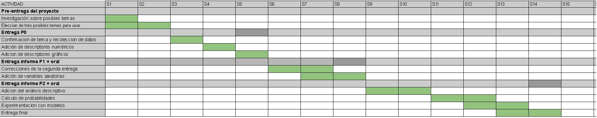

## Introducción

Entre el año 2020 y 2021,  en el Perú se dieron los picos más altos de contagio de Covid 19 debido a la pandemia que se vive hasta la actualidad. Esto dejó consecuencias en los sectores más importantes, pero el que se vio más afectado fue el de salud con el rápido incremento de contagios, personas en cuidados intensivos y pérdidas demográficas. Debido a ello la demanda de oxígeno se incrementó, pues se usa con los pacientes que entran a Unidad de Cuidados Intensivos (UCI).Con este estudio se busca hacer un análisis de cómo fue la disponibilidad de este recurso en el país en el año 2021, analizar la existencia de deficiencias que hubieron, y comparar su disponibilidad entre diferentes localidades del Perú. 

* **¿Es el estudio de interés para la audiencia?**

Sí, el estudio resulta útil en el ámbito sanitario debido a que se puede dar a conocer la variación de la demanda, uso y disponibilidad de este implemento necesario para el tratamiento contra el Covid 19 y otras enfermedades.  Además de lo atravesado durante los últimos 2 años durante la pandemia, el poder conocer el nivel en que se encuentra nuestro sistema de salud es un tema de interés para la audiencia, que en esta ocasión sería el pueblo peruano. 

* **¿Qué información se desea aportar al final del estudio?**

Al final del estudio se espera aportar información sobre qué tan bien preparada y qué tan efectiva fue la respuesta del sistema de salud ante la llegada del COVID 19.

* **Factibilidad de la investigación:**

La investigación es factible pues se obtuvo información de la Superintendencia Nacional de Salud 

- Información por días del consumo y disponibilidad de Oxígeno de los establecimientos de salud públicas, privadas y mixtas a nivel nacional; registrado en el Reporte de Disponibilidad de Oxígeno Medicinal | DU 012-2021 y DS 010-2021-SA

- Reporte de camas UCI y Hospitalización en zona COVID y No COVID Data histórica del Formato F500.2 - Registro de Disponibilidad de Camas de Hospitalización y UCI en zona COVID y No COVID, a nivel nacional y de todos los subsistemas.

* **Marco Teórico (Niveles y categorías)**

- Nivel 1 de atención:
  - Categoría I-1. Puesto de salud, posta de salud o consultorio con profesionales de salud     no médicos.
  - Categoría I-2. Puesto de salud o posta de salud (con médico). Además de los consultorios     médicos (con médicos con o sin especialidad).
  - Categoría I-3. Corresponde a los centros de salud, centros médicos, centros médicos         especializados y policlínicos.
  - Categoría I-4. Agrupan los centros de salud y los centros médicos con camas de              internamiento.
  
- Nivel 2 de atención: 
  - Categoría II-1. El conjunto de hospitales y clínicas de atención general.
  - Categoría II-2. Corresponde a los hospitales y clínicas con mayor especialización.
  - Categoría II-E. Agrupan a los hospitales y clínicas dedicados a la atención                 especializada.

- Nivel 3 de atención:
  - Categoría III-1. Agrupan los hospitales y clínicas de atención general con mayores         unidades productoras de servicios de salud.
  - Categoría III-E. Agrupan los hospitales y clínicas de atención general con mayores        unidades productoras de servicios de salud y servicios en general.
  - Categoría III-2. Corresponden a los institutos especializados.
  
                                                              (ESAN, 2018)

* **Planificación**




## Datos

* **Librerias**

Cargamos las librerías para leer nuestros archivos csv y ejecutar algunos comandos en especifico

```{r, message=FALSE, results='hide'}
library(readr)
library(vctrs)
library(dplyr)
library(modeest)
library(RColorBrewer)
```


### **Recolección de datos:**

Para recolectar la información se hizo un registro de ciertas instituciones de salud durante la pandemia en el año 2021 mediante el método de muestra aleatoria estratificada. Los datos recolectados fueron con respecto a la cantidad de tanques de oxígeno y cantidad de camas con los requisitos necesarios para atender a los pacientes con covid-19 (con ventiladores mecánicos). Para ello se crearon 2 bases de datos (Oxigeno.csv y Camas.csv) que se mostrarán más adelante.

Para realizar este registro se contó con la ayuda del personal de cada Institución que formó parte de la muestra, tomando datos de la Institución a la cual cada uno pertenece para luego juntar todo en una sola base de datos. Se hizo de esta manera debido a la gran cantidad de instituciones que existen y la gran distancia que existe entre ellas, por lo que no se podría haber recolectado información visitando a cada una de ellas.
La base de datos generada será el pilar que permitirá llevar a cabo el trabajo de análisis de datos que se realizará durante el presente proyecto.

**Población Objetivo:** Instituciones de servicio de salud públicas y privadas nacionales.

**Muestra:** 506 Instituciones de servicio de salud públicas y privadas nacionales.

**Tipo de Muestreo:** El tipo de muestreo elegido para la obtención de nuestra muestra, fue el muestreo aleatorio estratificado. Los estratos fueron las instituciones de servicio de salud públicas y privadas de cada región del país. Se les aplicó el muestreo simple para cada uno respectivamente. Para finalmente obtener nuestra muestra de 506 instituciones públicas y privadas nacionales.

**Sesgo:**
Nuestros datos provienen de una base de datos, por lo que tenemos que considerar algunos sesgos presentes:

- Sesgo de extraer registros: Nosotros no recolectamos los datos, por lo que no podemos evidenciar ni garantizar que todos hayan sido registrados de manera correcta.


### **Base de datos Oxígeno**
Cargamos nuestras bases de datos de OXIGENO.csv
```{r, message=FALSE, results='hide', warning=FALSE}
oxigenoS<-read_csv("OXIGENO.CSV")
```
  

* ** Limpieza de Datos **
Ahora se procede a realizar la limpieza de datos para excluir las variables que no requerimos para el estudio. Luego especificamos el tipo de variable a la cual corresponde cada una. Estos nuevos datos se insertan en la variable ‘oxigenoS1’.

```{r eval=TRUE,echo=FALSE, message=FALSE,warning=FALSE}
oxigenoS1<-oxigenoS%>% select(FECHAREGISTRO,NOMBRE,NIVEL,GRUPO,REGION,CIL_TOT_CILINDROS,CIL_VOL_POT_MT3,CIL_NU_CIL_LLEN_INI_DU24,CIL_NU_CIL_REABAST_DU24,CIL_VOL_DISP_M3_DU24,CIL_NU_CIL_CONSUM_CU24,CIL_VOL_M3_CU24)

cols(
  .default = col_double(),
  FECHAREGISTRO = col_double(),
  NOMBRE = col_character(),
  NIVEL = col_double(),
  GRUPO = col_character(),
  REGION = col_character(),
  CIL_TOT_CILINDROS = col_double(),
  CIL_VOL_POT_MT3 = col_double(),
  CIL_NU_CIL_LLEN_INI_DU24 = col_double(),
  CIL_NU_CIL_REABAST_DU24 = col_double(),
  CIL_VOL_DISP_M3_DU24 = col_double(),
  CIL_NU_CIL_CONSUM_CU24 = col_double(),
  CIL_VOL_M3_CU24 = col_double(),
)
```
Ahora se buscará si existen datos duplicados con la función unique()
```{r eval=TRUE,echo=FALSE, message=FALSE,warning=FALSE}
print(paste("Cantidad de observaciones duplicadas:",nrow(oxigenoS1)-nrow(unique(oxigenoS1))))
```
Como se puede ver, hay una gran cantidad de observaciones duplicadas,es decir hubo una deficiencia evidente en cuánto a la recolección de los datos, por los que que se omitirán a estas y se trabajará con una nueva base filtrada bajo este parámetro:

```{r}
OxigenoD <- unique(oxigenoS1)
```

Inspeccionamos la cantidad de datos faltantes y observaciones incompletas dentro de nuestra nueva base de datos.
```{r eval=TRUE,echo=FALSE, message=FALSE,warning=FALSE}
print(paste("Cantidad de datos faltantes: ", sum(is.na(OxigenoD))))
print(paste("Cantidad de observaciones incompletas: ", sum(!complete.cases(OxigenoD))))
```
Ahora calcularemos el porcentaje que representan nuestros datos incompletos en toda la base de datos.
```{r eval=TRUE,echo=FALSE, message=FALSE,warning=FALSE}
Na<-sum(is.na(OxigenoD))
datos<-(nrow(OxigenoD)*ncol(OxigenoD))
print(paste("Porcentaje de datos incompletos (%) : ", round(Na*100/datos,2)))
```
Calculamos la cantidad de datos faltantes por variable para saber si hay variables con mayor cantidad de datos o si están distribuidas de manera equitativa en todas.
```{r eval=TRUE,echo=FALSE, message=FALSE,warning=FALSE}
colSums(is.na(OxigenoD))
```


Podemos notar que la mayor parte de NA's se encuentran en las variables referidos a la Cantidad de cilindros. Dado que tenemos un bajo porcentaje de NA's en nuestra base y un máximo de 1616 observaciones incompletas consideramos pertinente eliminar esas observaciones para manejar data completa y no tener resultados diferenciados por cantidad de observaciones completas.
Con ello construimos nuestra base de datos final 
```{r}
oxigeno1<-na.omit(OxigenoD)
```
Para saber el orden de magnitud que se estima en nuestra base de datos, buscaremos el máximo valor de la variable **Total de cilindros** en la base y lo multiplicaremos por la capacidad de un cilindro de oxigeno grande (8m^3^).
```{r eval=TRUE,echo=FALSE, message=FALSE,warning=FALSE}
cilindros<-max(oxigeno1$CIL_TOT_CILINDROS)
Orden<-(cilindros*8)
print(paste("Volumen máximo de Oxigeno encontrado: ", Orden, "m3"))
          #  print(paste("Porcentaje de datos incompletos (%) : ", round(Na*100/datos,2)))
```
Con este resultado tenemos un panorama de la cantidad máxima de oxígeno disponible en un Centro de Salud y podemos filtrar los datos correspondientes para esta data, es por ello que construimos boxplots para ver con qué datos atípicos nos encontramos. Al realizar Boxplot's, se encontró que en la variable Volumen disponible había un valor atípico de 1.2 * 10^11 por lo que se filtró ese valor ya que se le consideró un error en el registro de datos puesto que no puede haber más oxígeno (m3) que la cantidad hallada anteriormente (20472 m3).
Pero como se podrá apreciar aún siguen habiendo muchos datos "atípicos", que no deben ser considerados una "anomalía", sino que tienen explicación. Lo mismo se presentó en otras variables que ya no se presentarán por no ser de mucha utilidad. En cambio, para graficarlos usaremos histogramas: 
```{r eval=TRUE,echo=FALSE, message=FALSE,warning=FALSE}
Oxigeno<-oxigeno1[oxigeno1$CIL_VOL_DISP_M3_DU24<8000,]
boxplot(Oxigeno$CIL_VOL_DISP_M3_DU24,horizontal = TRUE,main = "Boxplot de la variable Volumen disponible de oxígeno en m^3",xlab="Volumen de oxigeno(m^3)",width = 2/3,pch=20, border=rgb(0,0,0,0.2), col=colors()[c(12)])
```
Para expresarlos usaremos el siguiente histograma: 

```{r eval=TRUE,echo=FALSE, message=FALSE,warning=FALSE}

summary(Oxigeno$CIL_VOL_DISP_M3_DU24)

hist(Oxigeno$CIL_VOL_DISP_M3_DU24,main="Histograma de Volumen Disponible",ylab = "Densidad",xlab="Volumen de oxigeno(m^3^)",probability = TRUE, col=colors()[c(11)])
abline(v = mean(Oxigeno$CIL_VOL_DISP_M3_DU24),col = "blue")
abline(v = median(Oxigeno$CIL_VOL_DISP_M3_DU24),col = "red")
legend(cex = 0.8,x="bottomright", inset = c(0.030, 0.70),legend = c("Promedio","Mediana"),col=c("blue","red"),lty = 1:1,title ="Leyenda",text.font = 4)

```


Ahora, agregamos 2 variables adicionales que relacionan los datos de nuestra base de datos, esto con el fin de determinar la **cantidad de Cilindros que sobran** y la **cantidad del volumen que no se usa por el día**, esto varía dependiendo del hospital, nuestra restricción sera que no puede haber un volumen sobrante negativo pues todo tiene que estar registrado y el sobrante expresa que no se registro bien la cantidad de cilindros o hay inconsistencia.

\- **CIL_SOB_CU24: Cilindros sobrantes llenos de oxígeno por día.**

=> CIL_SOB_CU24 = CIL_NU_CIL_LLEN_INI_DU24 + CIL_NU_CIL_REABAST_DU24 - CIL_NU_CIL_CONSUM_CU24

\- **VOL_OXI_DESP__CU24: Volumen de oxígeno no usado en el día.**

=> VOL_OXI_DESP__CU24 = CIL_VOL_DISP_M3_DU24 - CIL_VOL_M3_CU24
```{r eval=TRUE,echo=FALSE, message=FALSE,warning=FALSE}
Oxigeno<-cbind(Oxigeno,CIL_SOB_CU24 = Oxigeno$CIL_NU_CIL_LLEN_INI_DU24 + Oxigeno$CIL_NU_CIL_REABAST_DU24 - Oxigeno$CIL_NU_CIL_CONSUM_CU24)
Oxigeno<-cbind(Oxigeno,VOL_OXI_DESP_CU24 = Oxigeno$CIL_VOL_DISP_M3_DU24 - Oxigeno$CIL_VOL_M3_CU24)
min(Oxigeno$VOL_OXI_DESP_CU24)
head(Oxigeno)
```
Entonces filtramos nuestra base respecto a los valores negativos y los eliminamos porque esta información representa que no se registro los datos de manera correcta cual sea el caso.
```{r}
Oxigeno<-Oxigeno[Oxigeno$VOL_OXI_DESP_CU24>=0,]
head(Oxigeno)
min(Oxigeno$VOL_OXI_DESP_CU24)

```
Finalmente, luego de la limpieza de datos se muestran gráficas de algunas de nuestras variables:
```{r eval=TRUE,echo=FALSE, message=FALSE,warning=FALSE}

summary(Oxigeno$CIL_VOL_M3_CU24)

hist(Oxigeno$CIL_VOL_M3_CU24,main="Histograma de Cilindros Disponibles al iniciar el día",ylab = "Densidad",xlab="Cantidad de cilindros",probability = TRUE, col=colors()[c(11)])
abline(v = mean(Oxigeno$CIL_VOL_DISP_M3_DU24),col = "blue")
abline(v = median(Oxigeno$CIL_VOL_DISP_M3_DU24),col = "red")
legend(cex = 0.8,x="bottomright", inset = c(0.030, 0.70),legend = c("Promedio","Mediana"),col=c("blue","red"),lty = 1:1,title ="Leyenda",text.font = 4)

```

```{r eval=TRUE,echo=FALSE, message=FALSE,warning=FALSE}

summary(Oxigeno$CIL_NU_CIL_LLEN_INI_DU24)

hist(Oxigeno$CIL_NU_CIL_LLEN_INI_DU24,main="Histograma de Cilindros Llenos al iniciar el día",ylab = "Densidad",xlab="Cantidad de cilindros",probability = TRUE, col=colors()[c(11)])
abline(v = mean(Oxigeno$CIL_VOL_DISP_M3_DU24),col = "blue")
abline(v = median(Oxigeno$CIL_VOL_DISP_M3_DU24),col = "red")
legend(cex = 0.8,x="bottomright", inset = c(0.030, 0.70),legend = c("Promedio","Mediana"),col=c("blue","red"),lty = 1:1,title ="Leyenda",text.font = 4)

```

```{r eval=TRUE,echo=FALSE, message=FALSE,warning=FALSE}

summary(Oxigeno$CIL_NU_CIL_CONSUM_CU24 )

hist(Oxigeno$CIL_NU_CIL_CONSUM_CU24 ,main="Histograma de Cantidad de cilindros consumidos en el día",ylab = "Densidad",xlab="Cantidad de Cilindros",probability = TRUE, col=colors()[c(11)])
abline(v = mean(Oxigeno$CIL_VOL_DISP_M3_DU24),col = "blue")
abline(v = median(Oxigeno$CIL_VOL_DISP_M3_DU24),col = "red")
legend(cex = 0.8,x="bottomright", inset = c(0.030, 0.70),legend = c("Promedio","Mediana"),col=c("blue","red"),lty = 1:1,title ="Leyenda",text.font = 4)

```
Al haberse verificado estos datos mediante Boxplot's anteriormente (en la que se mostró que habían muchísimos "datos atípicos" por lo que ya no se les puede considerar "atípicos"), nos permite deducir que hubieron algunos centros de salud que consumieron mucha más cantidad de oxígeno debido a la gran capacidad que tienen algunos de ellos, que generalmente están ubicados en grandes ciudades. Esto porque la media y la mediana están bastante alejadas de la moda como se mostró en los gráficos, además que presentan valores máximos bastante altos en comparación con los demás datos.

La distancia entre ambos descriptores numéricos (media y mediana) se puede atribuír a la robustez de estos: la media se encuentra significativamente más alejada debido a la influencia de los datos más alejados.

### **Base de datos Camas**


```{r, message=FALSE, results='hide', warning=FALSE}
camas<- read_csv('CAMAS.csv')
```

Se tienen muchas variables por lo que solo filtraremos las que consideramos pertinentes para nuestro estudio, que son las que tienen que ver con las camas ocupadas, camas desocupadas, camas con cámaras de alto flujo, entre otras. Crearemos una nueva base de datos "camas" 
```{r eval=TRUE,echo=FALSE, message=FALSE,warning=FALSE}
Camas1 <- camas %>% select(FECHAREGISTRO,NOMBRE,CATEGORIA,INSTITUCIÓN,GRUPO,SUB_GRUPO,MACROREGIONES,REGION,PROVINCIA,DISTRITO,ZC_UCI_ADUL_COO_CAM_CANULAS,ZC_UCI_ADUL_COO_CAM_SIN_VM,ZC_UCI_ADUL_COO_CAM_CON_VM,ZC_UCI_ADUL_CAM_TOT_OCUP,ZC_UCI_ADUL_CAM_TOT_DISP,ZC_UCI_ADUL_CAM_INOPERATIVOS,ZC_UCI_AACT_COO_CAM_CON_VM, ZC_UCI_AACT_COO_CAM_SIN_VM)
``` 

Ahora se buscará si existen datos duplicados con la función unique()
```{r eval=TRUE,echo=FALSE, message=FALSE,warning=FALSE}
print(paste("Cantidad de observaciones duplicadas:",nrow(Camas1)-nrow(unique(Camas1))))
```
Como se puede ver, hay una gran cantidad de observaciones duplicadas,es decir, hubo una deficiencia evidente en cuánto a la recolección de los datos. Por tal motivo, se omitirán estos y se trabajará con una nueva base filtrada bajo este parámetro:

```{r}
CamasD <- unique(Camas1)
```


Inspeccionamos la cantidad de datos faltantes y observaciones incompletas dentro de nuestra nueva base de datos.
```{r eval=TRUE,echo=FALSE, message=FALSE,warning=FALSE}
print(paste("Cantidad de datos faltantes: ", sum(is.na(CamasD))))
print(paste("Cantidad de observaciones incompletas: ", sum(!complete.cases(CamasD))))
```

Calcularemos el porcentaje que representan nuestros datos incompletos en la base de datos
```{r eval=TRUE,echo=FALSE, message=FALSE,warning=FALSE}
Na2<-sum(is.na(CamasD))
datos2<-(nrow(Camas1)*ncol(CamasD))
print(paste("Porcentaje de datos incompletos : ", round(Na2*100/datos2,2), "%"))
```
Renombramos algunas de nuestras variables para un mejor manejo de datos
```{r eval=TRUE,echo=FALSE, message=FALSE,warning=FALSE}
CamasD<-rename(Camas1,INSTITUCION=INSTITUCIÓN,SUBGRUPO=SUB_GRUPO,CANULADEALTOFLUJO=ZC_UCI_ADUL_COO_CAM_CANULAS,PACIENTECONYSINVENTILACIONMECANICA=ZC_UCI_ADUL_COO_CAM_SIN_VM,PACIENTECONVENTILACIONMECANICA=ZC_UCI_ADUL_COO_CAM_CON_VM,CAMASOCUPADAS=ZC_UCI_ADUL_CAM_TOT_OCUP,CAMASDISPONIBLES=ZC_UCI_ADUL_CAM_TOT_DISP,CAMASINOPERATIVAS=ZC_UCI_ADUL_CAM_INOPERATIVOS,CAMASOCUPADASCONVENTILACIONMECANICA=ZC_UCI_AACT_COO_CAM_CON_VM,CAMASOCUPADASSINVENTILACIONMECANICA=ZC_UCI_AACT_COO_CAM_SIN_VM)
```

Calculamos la cantidad de datos faltantes por variable para saber si hay variables con mayor cantidad de datos o si están distribuidas de manera equitativa en todas
```{r eval=TRUE,echo=FALSE, message=FALSE,warning=FALSE}
colSums(is.na(CamasD))
``` 

Podemos notar que que la mayor parte de NAs se encuentran en las variables cuantitativas, las cuales son las de mayor importancia para nuestro proyecto. Por lo tanto, consideramos pertinente el eliminar esas observaciones para manejar data completa y no tener resultados diferenciados por cantidad de observaciones incompletas.
Construimos nuestra base de datos final 
```{r}
CAMAS2<-na.omit(CamasD)
```

Luego especificamos el tipo de variable para no tener errores.
```{r eval=TRUE,echo=FALSE, message=FALSE,warning=FALSE}
cols(
  .default = col_double(),
  FECHAREGISTRO = col_double(),
  NOMBRE = col_character(),
  CATEGORIA = col_character(),
  INSTITUCION = col_character(),
  GRUPO = col_character(),
  SUBGRUPO = col_character(),
  MACROREGIONES = col_character(),
  REGION  = col_character(),
  PROVINCIA = col_character(),
  DISTRITO = col_character(),
  CANULADEALTOFLUJO = col_double(),
  PACIENTECONYSINVENTILACIONMECANICA = col_double(),
  PACIENTECONVENTILACIONMECANICA = col_double(),
  CAMASOCUPADAS = col_double(),
  CAMASDISPONIBLES = col_double(),
  CAMASINOPERATIVAS = col_double(),
  CAMASOCUPADASCONVENTILACIONMECANICA = col_double(),
  CAMASOCUPADASSINVENTILACIONMECANICA = col_double(),
  
)
```


Quedándonos de esta forma con una nueva cantidad de observaciones
```{r eval=TRUE,echo=FALSE, message=FALSE,warning=FALSE}
print(paste("Cantidad de observaciones actualizada: ", nrow(CAMAS2)))
```

Ahora se realizará un boxplot de la Cantidad de camas ocupadas

```{r eval=TRUE,echo=FALSE, message=FALSE,warning=FALSE}
summary(CAMAS2$  CAMASOCUPADAS ,horizontal)

boxplot(CAMAS2$  CAMASOCUPADAS ,horizontal = TRUE,main = "Cantidad de Camas ocupadas",xlab="Cantidad de camas",width = 2/3,pch=20, border=rgb(0,0,0,0.2), col=colors()[c(12)])
abline(v = mean(CAMAS2$  CAMASOCUPADAS),col = "blue")
abline(v = median(CAMAS2$  CAMASOCUPADAS),col = "red")
legend(cex = 0.8,x="bottomright", inset = c(0.030, 0.70),legend = c("Promedio","Mediana"),col=c("blue","red"),lty = 1:1,title ="Leyenda",text.font = 4)
```
Como se puede apreciar existe una gran cantidad de Centros de Salud que no cuentan con camas UCI, ya que si no tienen ninguna cama ocupada significa que no cuentan con ello. En contraste, lo que nos muestran los datos atípicos es que hay algunos hospitales con gran cantidad de camas ocupadas (hasta 69) lo cual nos indica que al igual que ocurre con los datos de Oxigeno, hay algunos centros de salud, aunque son muy pocos, que tienen gran capacidad de atención y están bien implementados.
A continuación se muestra un Histograma con la cantidad de Camas disponibles:

```{r eval=TRUE,echo=FALSE, message=FALSE,warning=FALSE}

summary(CAMAS2$CAMASDISPONIBLES)

hist(CAMAS2$CAMASDISPONIBLES,main="Histograma de Camas Disponibles",ylab = "Densidad",xlab="Cantidad de camas",probability = TRUE, col=colors()[c(11)])
abline(v = mean(CAMAS2$CAMASDISPONIBLES),col = "blue")
abline(v = median(CAMAS2$CAMASDISPONIBLES),col = "red")
legend(cex = 0.8,x="bottomright", inset = c(0.030, 0.70),legend = c("Promedio","Mediana"),col=c("blue","red"),lty = 1:1,title ="Leyenda",text.font = 4)

```
Como se puede apreciar gran cantidad de centros de salud no contaba con este requisito primordial para el tratamiento de los pacientes en estado grave de salud.

## Variables

### **Base de datos Oxígeno**

|Variables         |      Tipo de variable |  Restricciones | Descriptor 
|------------------|------------------------------|-------------------|-------------|
|Fecha registro|Variable cuantitativa continua| Fecha de registro realizado|La fecha con mayor registros fue el "6/19/2021"|
|Nombre |Variable cualitativa nominal  | Nombre de la institución de servicio de salud|Destaca la IPRESS "CLINICA SAN JUAN DE DIOS"| 
|Nivel  |Variable cualitativa ordinal | Nivel de atención de l IPRESS | Más del 80 % son del nivel 2, un nivel intermedio |
|Grupo  |Variable cualitativa nominal  | Grupo del establecimiento de salud que registra los datos de los cilindros de oxígeno | Destaca el sector de empresas "PÚBLICOS"|
|Región |Variable cualitativa nominal | Región de dónde pertenece la institución de servicio de salud| La mayor cantidad de IPRESS pertenece a la región de Lima|
|Cantidad de Cilindros| Variable cuantitativa discreta| El número total de cilindros llenos y vacíos de cada institución de servicio de salud| El 50% de las IPRESS poseen al menos 40 cilindros (empleamos la mediana como descriptor)|
|Cantidad de cilindros en óptimas condiciones| Variable cuantitativa discreta| Número total de cilindros llenos de cada institución de servicio de salud|Al menos el 50% de IPRESS poseen un total de 360 cilindros en óptimas condiciones|
|Cantidad de Cilindros iniciales|Variable cuantitativa discreta| Número total de cilindros llenos que cuenta el almacén al iniciar el día|La cantidad de cilindros iniciales al reiniciar la jornada es de 19 incluye los nuevos y recargados|
|Cantidad de cilindros recargados|Variable cuantitativa discreta| Número total de cilindros que fueron reabastecidos durante el día| El mínimo de cilindros recargados es 0 y el máximo es de 1530, resultado que pertenece a IPRESS con plantas de oxígeno|
|Volumen disponible (m3)|Variable cuantitativa continua| Es el cálculo en m^3^, considerando el número de cilindros iniciales más lo recargados|La mediana es de 210 m^3^, es decir que el 50% de IPRESS posee al menos 210 m^3^ de oxígeno por día|
|Cantidad de cilindros consumidos| Variable cuantitativa discreta| El número total de cilindros que fueron utilizados en las últimas 24 horas.|Se consume desde un mínimo de 0 cilindros a un máximo de 650 cilindros por día|
|Volumen de los cilindros| Variable cuantitativa continua| Es el cálculo en m^3^ del número total de cilindros consumidos por la capacidad del cilindro|Existen instituciones con 0 m^3^ de oxígeno y otros con un nivel de 6500 m^3^ de oxígeno referentes a IPRESS con plantas de oxígeno|


### **Base de datos Camas**

|Variables  | Restricciones   |  Tipo de Variable      |Descriptor
|------------------|------------------------------|-------------------|
|Fecha de registro| La fecha que se registró al paciente |Variable cuantitativa Continua|la fecha de mayor registro fue el "8/11/2021"|
|Nombre|Toma de todos los nombres de los pacientes registrados|Categórica Nominal|destacan 11 IPRESS con mayor cantidad de camas en atención|
|Categoría|Categoría vigente con la que cuenta el establecimiento de salud que registra los datos de camas|Variable cualitativa ordinal|Destacan las IPRESS de nivel II-1|
|Institución|IPRESS de Perú|Variable cualitativa nominal|La que destaca los servicios ofrecidos por gobiernos regionales|
|Grupo| Grupo de establecimiento de salud que registra los datos de las camas. | Variable cualitativa nominal| La mayor parte de IPRESSS son instituciones publicas.|
|Sub-grupo| Subgrupo del establecimiento de salud que registra los datos de las camas. |  Variable cualitativa nominal| La mayor proveedora es MINSA/GR|
|Región | Toma todas las regiones que tiene la IPRESSS en el Perú |  Variable Categórica Nominal| Mayor cantidad de camas atendidas en la región de La Libertad|
|Provincia |  Toma todas las provincias que tiene la IPRESSS en el Perú|  Variable Categórica Nominal| Centrado en la provincia región Trujillo, donde se encuentra la mayor población de la región|
|Cánula de alto flujo|Es el número de pacientes en oxigenoterapia con equipo de cánula de alto flujo, que se encuentran en UCI Covid19 Adultos.| Variable Discreta |mínimo de 0 internados y máximo de 12, mientras que la media y mediana se ven influenciadas por la alta carencia de estos dispositivos en muchos distritos del país|
|SIN VENTILACIÓN MECÁNICA Y SIN CÁNULA DE ALTO FLUJO  |   Es el número de pacientes sin equipo de cánula de alto flujo, ni ventilación mecánica de cualquier tipo, que se encuentran en UCI Covid19 Adultos.  | Variable cuantitativa Discreta| máximo de 10 camas con dichas características|
|CON VENTILACIÓN MECÁNICA |Es el número de pacientes con ventilación mecánica invasiva y ventilación mecánica no invasiva, que se encuentran en UCI Covid19 Adultos.| Variable Discreta|máximo de 68 camas con dichas características|
|CAMAS OCUPADAS|Es el número de camas ocupadas o en uso por paciente en la UCI ADULTOS|   Variable Discreta|la cantidad máxima de camas UCI ocupadas en nuestra base de datos es de 69|
|CAMAS DISPONIBLES|Es el número de camas libres, o listas o preparadas para ser utilizadas, o que no se encuentran ocupadas; en la UCI ADULTOS| Variable Discreta|baja disponibilidad de camas con una mediana de 0 camas en el 50% de instituciones|
|CAMAS INOPERATIVAS |Es el número de camas INOPERATIVAS (en mantenimiento o averiadas) de la UCI ADULTOS |Variable Discreta| el intervalo de camas inoperativos es de 0 a 17, sin embargo la mayor cantidad de IPRESS poseen operativas la mayoría de sus camas una mediana de 0|
|OCUPADAS CON VENTILACIÓN MECÁNICA|Número de camas ocupadas o en uso por pacientes en 
AMBIENTE DE ATENCIÓN CRÍTICO TEMPORAL|Variable Discreta| la cantidad de camas con ventilación ocupa el intervalo de 0 a 1
30, dependiendo de la ubicación y el nivel de la IPRESS|
|OCUPADAS SIN VENTILACIÓN MECÁNICA|Número de camas ocupadas o en uso por pacientes en ambiente de atención crítico temporal.|Variable Discreta| La data ocupa mayor parte de las regiones fuera de lima las cuales no cuentan con mucho equipamiento, en este caso existen un intervalo de valores de 0 a 100 camas ocupadas|


## Análisis descriptivo

### **Base de datos Oxígeno**

  
**Variable:** Nivel

Dado que es una variable categórica ordinal, nos enfocaremos en saber su frecuencia dentro de nuestra base, pues nos ayudará a determinar qué nivel de salud resalta en nuestro estudio y nos da una visualización de las IPRESS en el Perú

```{r}
HospitalL<-Oxigeno %>% select(NOMBRE,NIVEL)
HospitalL<-HospitalL[vec_unique_loc(HospitalL$NOMBRE),]
tabL<-HospitalL$NIVEL
tabL[which(HospitalL$NIVEL=="Sin Categoría")]<-"Sin Cat."
tabL<-sort(table(tabL))
HospitalLplot<-barplot(tabL,main = "Nivel de las IPRESS en el Perú",ylab="Nivel", xlab = "Frecuencia", horiz = TRUE, col=brewer.pal(n=4, name = "BuGn"), xlim = c(0,500))
text(x = tabL, y = HospitalLplot, label = data.frame(tabL)$Freq, pos = 4)


```
A partir de esta gráfica podemos ver que resalta el nivel 2, correspondiente a un nivel intermedio. En este, se realizan en general consultas médicas, hospitalizaciones, atención de urgencias de especialidades básicas y servicios de diagnóstico. Exite una gran similitud en cuanto a los niveles 1 y 3, pero se diferencian por la calidad de servicio. El número de centros sin categoría podría estar relacionado con pequeñas postas medicas. En conclusión, en nuestro país el nivel .

**Variable:**Grupo

Representa como es la distribución de las IPREES en el Perú, solo hay dos clases, privado y publico.
```{r}
HospitalG<-Oxigeno%>%select(NOMBRE,GRUPO)
HospitalG<-HospitalG[vec_unique_loc(HospitalG$NOMBRE),]
tabG<-sort(table(HospitalG$GRUPO))
HospitalGplot<-barplot(tabG,main = "Grupos de IPRESS en el Perú",ylab="Grupo", xlab = "Frecuencia", xlim=c(0, 350), horiz = TRUE, col=brewer.pal(n=3, name = "BuGn"))
text(x = tabG, y = HospitalGplot, label = data.frame(tabG)$Freq, pos = 4)
```
Se puede concluir que hay mas IPRESS de carácter publico en nuestro país 


Relación: Grupos con nivel de las IPRESS

```{r}
mosaicplot(table(HospitalG$GRUPO,HospitalL$NIVEL),main = "Nivel y Grupo de las  IPRESS",xlab="Grupo",ylab ="Nivel",off = 15,las = 1, col=brewer.pal(n=5, name = "BuGn"),border=rgb(0,0,0,0.2))
```
El mosaico nos muestra de mejor manera la distribución de las IPRESS, concluimos que los niveles que resaltan mas son el 3 y 2, el 2 es el que resalta tanto en publicas como privadas, seguido del 3 , entendemos que las empresas privadas que brindan salud tienen que cumplir con estándares para su funcionamiento, es por ello que no encontramos sin categoría y pocos dentro del nivel 1.

**Variable:**Región
Nos permite saber la distribución de las IPRESS para cada región del Perú.

```{r}
HospitalR<-Oxigeno%>%select(NOMBRE,REGION)
HospitalR<-HospitalR[vec_unique_loc(HospitalR$NOMBRE),]
tabR<-sort(table(HospitalR$REGION))
HospitalRplot<-barplot(tabR,las=1,horiz = 1,main = "Número de IPRESS por región",xlab = "Frecuencia",cex.names = 0.5, xlim = c(0, 170), col=colors()[c(11)])
text(x = tabR, y = HospitalRplot, label = data.frame(tabR)$Freq, pos = 4, cex = 0.7)

```


La región de lima es la que posee mayor cantidad de IPRESS en el pais, esto tiene sentido pues Lima es la capital del pais y poseen la mayor parte de la poblacion, ademas es donde se da el mayor acceso a instrumentos de salud. Además se aprecia la centralización presente en el país, pues la diferencia entre Lima y el resto de departamentos es abismal, como se puede visualizar en la gráfica.

**Variable**:CIL_TOT_CILINDROS / Número "TOTAL" de cilindros

```{r}
summary(Oxigeno$CIL_TOT_CILINDROS)
mfv(Oxigeno$CIL_TOT_CILINDROS)
boxplot(Oxigeno$CIL_TOT_CILINDROS, horizontal = 1, main =  "Cantidad de cilindros total por IPRESS",xlab="Número de cilindros",pch=20,border=rgb(0,0,0,0.2), col=colors()[c(11)])
```

A partir del diagrama de cajas se pudo ver la gran cantidad de datos considertados atípicos. Esto se debe a los diversos centros de salud con poco volumen de oxígeno disponible, algo que se acumula porque ocurre en los tres niveles (1, 2 y 3). Sin embargo, como se aprecia en el siguiente diagrama, no ocurre en igual proporción para todos los niveles: 

```{r}
boxplot(Oxigeno$CIL_TOT_CILINDROS[-which(Oxigeno$NIVEL=="Sin Categoría")] ~ Oxigeno$NIVEL[-which(Oxigeno$NIVEL=="Sin Categoría")], horizontal = 1, main =  "Cantidad de cilindros total por IPRESS",xlab="Volumen(m^3^)", ylab = "Nivel de atención" ,pch=20,border=rgb(0,0,0,0.2), col=colors()[c(11)])

```
Esto demuestra la diferencia en la calidad de recursos con la que cuentan IPRESS de cada nivel. Los diagramas de caja a continuación se presentarán también diferenciando los niveles, para comprender mejor el significado de todos aquellos valores "atípicos". Además, se obviaron las IPRESS sin categoría, pues son muy pocas y no brindan información relevande para la investigación.

La gráfica del boxplot nos muestra que los resultados se encuentran sesgado para la derecha, por lo que si tomamos como descriptor numérico la media, este seria un valor que no represente en su totalidad a los datos por el sesgo que se presenta y la presencia de valores atípicos que si son correctos en nuestro caso. El mejor descriptor de posición sera la mediana y nos indica que el 50% de las IPRESS (en general) posee mas de 40 cilindros de oxígeno por día, y que menos del 50% de IPRESS tiene menos de 40 cilindros por día. La moda nos indica que la gran mayoría de IPRESS en el Perú cuenta con 10 cilindros de oxígeno.También resulta preocupante que el valor de la mediana sea muy cercano a 0, y que aquellos más alejados sean considerados "atípicos".

**Variable:**CIL_VOL_POT_MT3/ Volumen Potencial

```{r}
summary(Oxigeno$CIL_VOL_POT_MT3)
mfv(Oxigeno$CIL_VOL_POT_MT3)
boxplot(Oxigeno$CIL_VOL_POT_MT3[-which(Oxigeno$NIVEL=="Sin Categoría")] ~ Oxigeno$NIVEL[-which(Oxigeno$NIVEL=="Sin Categoría")], horizontal = 1, main =  "Volumen potencial de oxigeno",xlab="Volumen(m^3^)", ylab = "Nivel de atención" ,pch=20,border=rgb(0,0,0,0.2), col=colors()[c(11)])
```
Este análisis es interesante pues debemos tener en cuenta que existen casos en los que no todos los cilindros de oxígeno funcionan.es por ello que esta variable nos ayuda a interpretar que tan cierto es esta afirmación. La gráfica nos muestra un sesgo para la derecha, por lo que usaremos a la mediana como descriptor de posición. Se interpreta que el 50% de IPRESS tienen una capacidad mayor de 350 m^3^ de oxígeno por día, mientras que el otro 50% tiene menor o igual cantidad que ese valor. Lo cual nos muestra la realidad, pues existen IPRESS que no estaban preparadas para el Covid 19.


**Variable:**CIL_NU_CIL_LLEN_INI_DU24/Número de cilindros llenos inicial por día.

```{r}
summary(Oxigeno$CIL_NU_CIL_LLEN_INI_DU24)
mfv(Oxigeno$CIL_NU_CIL_LLEN_INI_DU24)

boxplot(Oxigeno$CIL_NU_CIL_LLEN_INI_DU24[-which(Oxigeno$NIVEL=="Sin Categoría")] ~ Oxigeno$NIVEL[-which(Oxigeno$NIVEL=="Sin Categoría")], horizontal = 1, main =  "Número de cilindros de oxigeno llenos al iniciar el día",xlab="Volumen(m^3)", ylab = "Nivel de atención" ,pch=20,border=rgb(0,0,0,0.2), col=colors()[c(11)])
```

Acá podemos ver que la mitad de las IPRESS inician su dia con numero mayo a 16 cilindros, y que la otra mitad con menor cantidad o igual a 16 cilindros. La moda nos indica que por lo menos la gran mayoría de hospitales inicia el día con al menos 1 cilindro de oxígeno, lo que es preocupante pues ese recurso puede no ser suficiente para el volumen demandado.

**Variable:**CIL_NU_CIL_CONSUM_CU24/Número de “cilindros consumidos”

```{r}
summary(Oxigeno$CIL_NU_CIL_CONSUM_CU24)

boxplot(Oxigeno$CIL_NU_CIL_CONSUM_CU24[-which(Oxigeno$NIVEL=="Sin Categoría")] ~ Oxigeno$NIVEL[-which(Oxigeno$NIVEL=="Sin Categoría")], horizontal = 1, main =  "Número de cilindros de oxigeno al iniciar el día",xlab="Volumen(m^3^)", ylab = "Nivel de atención" ,pch=20,border=rgb(0,0,0,0.2), col=colors()[c(11)])
```
Mas de la mitad de IPRESS consume más de un 1 cilindro aproximadamente y el resto menos de un cilindro por día, esta información también varía pues en ciertos casos se da un mayor incremento del nivel de ventilación y varia el volumen de consumo.

  + **Relación entre variables:**

**Variables:**CIL_VOL_DISP_M3_DU24 y CIL_VOL_M3_CU24

Buscaremos la relación del volumen disponible por día y el volumen de oxígeno que se consumió

```{r}
plot(Oxigeno$CIL_VOL_DISP_M3_DU24,Oxigeno$CIL_VOL_M3_CU24,pch=20,col=rgb(0,0,0,0.2),xlab = "Volumen disponible de oxígeno (m^3^)", ylab = "Volumen consumido de oxígeno (m^3^)", main = "Volumen consumido vs disponible de oxígeno")

cov(Oxigeno$CIL_VOL_DISP_M3_DU24,Oxigeno$CIL_VOL_M3_CU24)
cor(Oxigeno$CIL_VOL_DISP_M3_DU24,Oxigeno$CIL_VOL_M3_CU24)
```
Podemos ver que el el comportamiento de la gráfica se estanca en ciertos valores si trazamos una linea que pase por esos datos, este tendrá un comportamiento logístico, pues si bien se incrementa el volumen de oxígeno, existe un cierto limite de consumo, pues no hay mucho aforo dentro de los centros de salud y esto se relaciona con las camas UCI y equipos de ventilación mecánica, pues no podemos demandar mucho consumo aunque incremente la cantidad de volumen disponible.
La covarianza nos indica la relación que hay relación entre estas dos variables, el signo positivo quiere decir que hay una relación directa.
La correlación si bien es baja, es una creciente.


**Variables:**CIL_SOB_CU24 y CIL_NU_CIL_LLEN_INI_DU24:

Se buscara la relación del número de cilindros que sobran y el de disponibles por día.
En esta gráfica de dispersión podemos observar una tendencia lineal positiva, la covarianza es positiva, indica la relación directa de variables, por otro lado tenemos una correlación cercano a uno, interpretándose como fuerte, entonces la relación es directamente proporcional. En cuanto a su explicación, se basa en que los cilindros que sobran aumentan la cantidad de cilindros que se tiene al iniciar un nuevo día. 
```{r}
plot(Oxigeno$CIL_SOB_CU24,Oxigeno$CIL_NU_CIL_LLEN_INI_DU24,pch=20,col=rgb(0,0,0,0.2),xlab = "Cilindros sobrantes por día",ylab = "Cilindros llenos por día",main = "Cilintros sobrantes vs llenos por día")
abline(lm(Oxigeno$CIL_SOB ~ Oxigeno$CIL_NU_CIL_LLEN_INI_DU24),col="red")

cov(Oxigeno$CIL_SOB_CU24,Oxigeno$CIL_NU_CIL_LLEN_INI_DU24)
cor(Oxigeno$CIL_SOB_CU24,Oxigeno$CIL_NU_CIL_LLEN_INI_DU24)
```


**Variables:**CIL_TOT_CILINDROS y CIL_VOL_POT_MT3

Buscamos realizar este análisis pues se buscaba observar que tan relacionados andan estas variables, si bien es lógico, hay un factor de cilindros en óptimas condiciones para su uso lo cual varia la cantidad potencial de oxígeno que una IPRESS puede tener.tenemos una relación directa entre estas variables y fuerte.

```{r}
plot(Oxigeno$CIL_TOT_CILINDROS[-which(Oxigeno$CIL_TOT_CILINDROS==max(Oxigeno$CIL_TOT_CILINDROS))],Oxigeno$CIL_VOL_POT_MT3[-which(Oxigeno$CIL_TOT_CILINDROS==max(Oxigeno$CIL_TOT_CILINDROS))],pch=20,col=rgb(0,0,0,0.2),xlab = "Total de cilindros",ylab = "Volumen potencial",main = "Volumen potencial vs Total de cilindros")
abline(lm(Oxigeno$CIL_VOL_POT_MT3 ~ Oxigeno$CIL_TOT_CILINDROS),col="red")

cov(Oxigeno$CIL_TOT_CILINDROS,Oxigeno$CIL_VOL_POT_MT3)
cor(Oxigeno$CIL_TOT_CILINDROS,Oxigeno$CIL_VOL_POT_MT3)
```

### **Base de datos Camas**

  + **Análisis descriptivo**
  
**Variable:*Categoría

Esta variable de clasificación que caracteriza a los IPRESS, en base a niveles de complejidad y a características funcionales comunes, que determina su capacidad resolutiva, respondiendo a realidades socio sanitarias similares y diseñadas para enfrentar demandas equivalentes.

```{r}
HOSP2<-Camas1 %>% select(NOMBRE,CATEGORIA)
HOSP2<-HOSP2[vec_unique_loc(HOSP2$NOMBRE),]
h2<-HOSP2$CATEGORIA
h2[which(HOSP2$CATEGORIA=="Sin Categoría")]<-"Sin C."
tab2<-sort(table(h2))
HOSP2plot<-barplot(tab2,main = "Categoría de las IPRESS en el Perú",ylab="Categoría", xlab = "Frecuencia", horiz = TRUE, xlim = c(0, 250), cex.names=0.6, col=brewer.pal(n=9, name = "BuGn"))
text(x = tab2, y = HOSP2plot, label = data.frame(tab2)$Freq, pos = 4, cex = 0.7)

```  

Esta gráfica nos ayuda a determinar la categoría de las IPREES a nivel nacional, podemos ver que resalta la categoría II-1 correspondiente a hospitales y clínicas de atención general, donde se tiene como funciones principales: la promoción, prevención, recuperación, rehabilitación y gestión general.  Exiten una gran similitud en cuanto a las categorías I-4 y III-1, sin embargo se diferencian la correspondencia y actividades que se realizan, siendo I-4, correspondiente a centros de salud de camas de internamiento y III-1 a hospitales y clínicas de atención general. En conclusión, en nuestro pais cuenta con una categoría intermedia con establecimientos de atención general. 

**Variable:**Grupo
Representa como es la distribución de las IPREES en el Perú, solo hay dos clases, privado y publico.
```{r}
GRUPO1<-CAMAS2%>%select(NOMBRE,GRUPO)
GRUPO1<-GRUPO1[vec_unique_loc(GRUPO1$NOMBRE),]
tab1<-sort(table(GRUPO1$GRUPO))
GRUPO1plot<-barplot(tab1,main = "Grupos de IPRESS en el Perú",ylab="Grupo", xlab = "Frecuencia", xlim=c(0, 300), horiz = TRUE, col=brewer.pal(n=4, name = "BuGn"))
text(x = tab1, y = GRUPO1plot, label = data.frame(tab1)$Freq, pos = 4, cex = 0.9)

```
 Esta gráfica nos indica que existen muchos más IPRESS , que pertencen en al sector público.
 
**Relación** Grupos con categoría de las IPRESS

**Variable:**Región
Nos permite saber la distribución de las IPRESS para cada región del Perú.
```{r}
HOSP2<-CAMAS2%>%select(NOMBRE,REGION,CATEGORIA)
HOSP2<-HOSP2[vec_unique_loc(HOSP2$NOMBRE),]
tabb2<-sort(table(HOSP2$REGION))
HOSP2plott<-barplot(tabb2,las=1,horiz = 1,main = "Número de IPRESS por región con camas",xlab = "Frecuencia",cex.names = 0.5, xlim = c(0, 50), col=colors()[c(11)])
text(x = tabb2, y = HOSP2plott, label = data.frame(tabb2)$Freq, pos = 4, cex = 0.7)

```

```{r}
mosaicplot(table(GRUPO1$GRUPO,HOSP2$CATEGORIA),main = "Categoria y Grupo de las  IPRESS",xlab="Grupo",ylab ="Categoria",off = 30,las = 1, col=brewer.pal(n=9, name = "BuGn"),border=rgb(0,0,0,0.2))
```
A partir de este gráfico de mosaico podemos corroborar la información de la anterior base de datos: las IPRESS de nivel 2 (II) son las más abundantes en nuestro país. Comparadas a estas, las de nivel 3 (III) son casi inexistentes y las de nivel 1 (I) también existen en baja proporción, aunque existen más en el sector público. 


## Análisis probabilístico

Calculamos las probabilidades respecto al "NIVEL" de cada IPRESS, los cuales determinan qué tipo de atención brindan. Además, calculamos la probabilidad del tipo de empresa referido al "GRUPO" (privado /público).

Nivel de IPRESS:

```{r}
round(table(Oxigeno$NIVEL)/nrow(Oxigeno),4)
```

La probabilidad de de encontrar IPRESS privadas o publicas varia muy poco, existe una probabilidad del 0.5915 de encontrar una IPRESS perteneciente al sector publico.Por otro lado, existe una probabilidad del 0.4085 de encontrar una empresa privada.

Distribución por región:

```{r}
round(table(Oxigeno$REGION)/nrow(Oxigeno),4)
```

Dentro de la base de datos, resalta mucho Lima, pues es también la que cuenta con mayor cantidad de IPRESS y datos registrados. La probabilidad de que un registro pertenezca a la región de lima es de 0.2992 siendo la mas alta de todas y la región con menor registro corresponde a Moquegua, la cual en tiempos de recolección de los datos aun no contaba con una planta de oxigeno en la zona.

* **Probabilidad condicional:**

```{r}
round(table(Oxigeno$GRUPO,Oxigeno$REGION)/nrow(Oxigeno),4)
```

Estos resultados corresponden a la relación sector o grupo de IPRESS en cada región del Perú. Aplicamos nuestra probabilidad condicional para analizar estas variables.

$P(Privado|Lima)=P(Privado∩Lima)/P(Lima)=0.1954/0.2992 =0.6531$

Esto quiere decir que el complemento de "P(Privado|Lima)" nos debe dar el resultado de las IPRESS pertenecientes al sector publico, si no se diera el caso, nuestras observaciones tendría que ser verificadas de nuevo.

$P(Público|Lima)=P(Público∩Lima)/P(Lima)=0.1038/0.2992 =0.3469$

Para verificar que se cumple la regla, entonces sumamos nuestros resultados del: 

$P(Privado|Lima) + P(Público|Lima)$

```{r}
Condicionalprivado<-0.1954/0.2992
Condicionalpúblico<-0.1038/0.2992
Condicionalprivado+Condicionalpúblico
```

$P(Privado|Lima) + P(Público|Lima)=1$

**VARIABLES ALEATORIAS DISCRETAS**


Ahora hallaremos las probabilidades de encontrar camas Disponibles en los centros de Salud, dependiendo de la región en la que nos encontremos. Para ello filtramos las IPRESS de cada región y que tengan camas disponibles mayores a cero y las dividimos entre la cantidad total de IPRESS. Para hallar la probabilidad de estar en una región $$(P(B))$$ nos basaremos en la cantidad de habitantes en dicha región dividida entre la cantidad total de habitantes en el Perú:
$$
P(A|B) = P (A ∩ B) / P(B)
$$


```{r eval=TRUE,echo=FALSE, message=FALSE,warning=FALSE}
print(paste("Probablidad de encontrar camas Disponibles dado que estás en Lima:", round(((nrow(filter(CAMAS2,REGION == "LIMA"& CAMASDISPONIBLES >  0)) / nrow(CAMAS2) / (8575000/32970000))*100), 2), "%"))
```
```{r eval=TRUE,echo=FALSE, message=FALSE,warning=FALSE}
print(paste("Probablidad de encontrar camas Disponibles dado que  estás en Junin:", round(((nrow(filter(CAMAS2,REGION == "JUNIN"& CAMASDISPONIBLES >  0)) / nrow(CAMAS2) / (1350783/32970000))*100), 2), "%"))
```

```{r eval=TRUE,echo=FALSE, message=FALSE,warning=FALSE}
print(paste("Probablidad de encontrar camas Disponibles dado que  estás en Puno:", round(((nrow(filter(CAMAS2,REGION == "PUNO"& CAMASDISPONIBLES >  0)) / nrow(CAMAS2) / (1415608/32970000))*100), 2), "%"))
```
```{r eval=TRUE,echo=FALSE, message=FALSE,warning=FALSE}
print(paste("Probablidad de encontrar camas Disponibles dado que  estás en LORETO:", round(((nrow(filter(CAMAS2,REGION == "LORETO"& CAMASDISPONIBLES >  0)) / nrow(CAMAS2) / (1039372/32970000))*100), 2), "%"))
```
Ahora hallaremos la probabilidad de NO encontrar camas disponibles dependiendo si estamos en cierta Región. 
```{r eval=TRUE,echo=FALSE, message=FALSE,warning=FALSE}
print(paste("Probablidad de NO encontrar camas dispONIBLES  si estás en Lima:", round((nrow(filter(CAMAS2,REGION == "LIMA"& CAMASDISPONIBLES ==  0))/ nrow(filter(CAMAS2,REGION == "LIMA")))*100, 2), "%"))

```


### Modelo 1: Modelo binomial


Decidimos optar por este modelo ya que nos permitía simular una situación real en la cual se encontraron muchos peruanos durante la pandemia del Covid-19 al ir de hospital en hospital buscando cilindros de oxígeno, cuya demanda estaba por los cielos. Así, establecemos nuestra variable aleatoria discreta:

X~1~ : El hospital tiene más de x cilindros de oxígeno llenos al iniciar el día

```{r}
VarAleat1<- Oxigeno %>%  filter(CIL_NU_CIL_LLEN_INI_DU24>100)
prob1<-nrow(VarAleat1)/nrow(Oxigeno)
prob1
```
Habiendo calculado el porcentaje de hospitales que cuentan con más de 100 cilindros llenos al iniciar el día (X~1~ = 100), podemos hallar la probabilidad de que una persona, habiendo visitado 10 hospitales, encuentre uno que satisfaga lo mencionado: que cuente con más de 100 cilindros por día.
 
$$ P\left(X=x\right)=\begin{pmatrix}n\\ x\end{pmatrix}p^x\left(1-p\right)^{n-x} $$
donde en este caso:
* **x** = 1
* **n** = 10
* **p** = 0.1225

 
```{r}
dbinom(1, 10, prob1)
barplot(dbinom(c(1:5), 10, prob1), ylim = c(0, 1), xlim = c(0, 8), ylab = "Probabilidad", names.arg = c(1:5), xlab = "x", col=brewer.pal(n=5, name = "BuGn"))

```
La probabilidad de que tras visitar 10 hospitales uno cuente con más de 100 cilindros llenos ($$p$$) es relativamente alta (37.78%). Sin embargo, lo que muchas veces ocurre en realidad es que se necesita más de un hospital que cumpla la condición ya que el primero que encontremos puede estar lleno (algo visto muy frecuentemente durante las primeras olas de COVID-19). Para este caso, como se observa en la gráfica, esta probabilidad irá disminuyendo a medida que requiramos encontrar más hospitales que cumplan con lo establecido. 

Resulta importante mencionar que en la situación hipotética presentada se realizaron algunas suposiciones que no necesariamente se cumplen en realidad. Primero, no todos los eventos son equiprobables: algunos hospitales son más recurridos que otros. Además, el parámetro usado (100 cilindros llenos al iniciar el día) puede resultar tanto un número alto para algunas regiones como uno bajo para muchas otras. Por otro lado, bajo este modelo el individuo seguirá visitando 10 hospitales aún si es que ya encontró lo que busca anteriormente.


### Modelo 2: Modelo hipergeométrico

$$P\left(X=x\right)=\frac{\begin{pmatrix}r\\ x\end{pmatrix}\begin{pmatrix}N-r\\ n-x\end{pmatrix}}{\begin{pmatrix}N\\ x\end{pmatrix}}$$

Se pudo visualizar que la mediana es 18 cilindros disponibles al inicio del dia. Por otro lado, también se visualizó en los anteriores gráficos que en la región Lima, hubieron más IPRESS, que en otras regiones. De ello, hallamos que existían mas IPRESS del grupo PÚBLICO, quiénes  presentaban cilindros disponibles al inicio del dia mayor igual que la mediana de esta variable.

```{r}
OXIGENOLIMA <-filter(Oxigeno, REGION=="LIMA",CIL_NU_CIL_LLEN_INI_DU24>=18)
table(OXIGENOLIMA$GRUPO)
```

Teniendo esto en cuenta podemos saber cuántos IPRESS habían de cada NIVEL, que contaban con estas caracteristicas:

```{r}
table(OXIGENOLIMA$GRUPO,OXIGENOLIMA$NIVEL)
```


Teniendo esto en cuenta, se sabe que en la región Lima durante el año 2021 habían 4862 IPRESS del grupo PUBLICO, donde 188 pertenecían al NIVEL 1, 2779  NIVEL 2 y 1895 al NIVEL 3. Nos centraremos en el NIVEL 3. Supongamos que si se saca una muestra aleatoria de 150 IPRESS de este grupo, sin tener que revisar a un IPRESS más de una vez. Calculamos la probabildad de que HASTA 10 IPRESS  sean del NIVEL 2, y que cumplan con estas características:

    - X~2~ : La IPRESS pertenece al Nivel 2
  N: Tamaño de la población, son las 4862 IPRESS del grupo PUBLICO de la región LIMA. 
  n: Tamaño de la muestra, son las 150 IPRESS del grupo PRIVADO de la región LIMA, que será revisadas.
  r: Número de casos exitosos en la población, 2779.
  
  N-r: Número de fracaso. 
  
```{r}
r <-   #Número de casos exitosos en la población.
nr <- 4862- 2779 #Número de FRACASOS en la población (N-r).
n <- 150    #Tamaño de la muestra.
x <- c(0:10)
phyper(x,r,nr,n)
sum(phyper(x,r,nr,n))
barplot(dhyper(x,r,nr,n),
         ylab = "Probabilidad", 
         col = c(12))
```
  
Lo que se demuestra con estas probabilidades es que al elegir hasta 10 IPRESS del NIVEL 2, que cumplan con las caracteristicas mencionadas (que tengan al inicio del día mayor o igual  a 18 cilindros disponibles), son muy bajas. Con esto concluimos que es muy díficil encontrar un conjunto de IPRESS de este grupo, que sean capacitados para recibir y atender a pacientes COVID.

### Modelo 3: Modelo binomial negativo

$$ P\left(X=y\right)=\begin{pmatrix}y-1\\ r-1\end{pmatrix}p^r\left(1-p\right)y-r $$
  - X~3~ = La IPRESS es de carácter público

Sabiendo que la probabilidad de encontrar una IPRESS pública en la ciudad de Lima es aproximadamente del 34.69%.¿Cual es la probabilidad de  encontrar 20 IPRESS de carácter público cuando se realice la inspección de 100 registros en la base de datos?

Para R:
Sintaxis: dnbinom(x - r, r, p)
donde:
x = intentos
r = éxitos
p = probabilidad(éxito)
x - r = fracasos


```{r}

dnbinom(100-20,20,0.3469)

plot(c(20:120),dnbinom(c(0:100),20,0.3469), col = c(12))
```


### Modelo 4: Modelo normal


```{r eval=TRUE,echo=FALSE, message=FALSE,warning=FALSE}
z_95 <- qnorm(0.025,mean = 0,sd=1,lower.tail=FALSE)
```

Se realiza una distribución normal de la Variable Camas Ocupadas asumiendo un intervalo de confianza del 95%, para ver qué tanto se parece la agrupación de los datos a una distribución normal cuando se tiene una gran cantidad. La línea roja vendrá a ser la Gráfica Normal ajustada a nuestros datos, se considera el 95% porque se considerará que 95 de 100 datos obtenidos son verdaderos.

```{r eval=TRUE,echo=FALSE, message=FALSE,warning=FALSE}

hist(CAMAS2$CAMASOCUPADAS,probability = 1,main = "Camas Ocupadas ",xlab = "Cantidad de camas ocupadas", breaks = 50, col = c(11))
xs1<-seq(min(CAMAS2$CAMASOCUPADAS),max(CAMAS2$CAMASOCUPADAS),length=50)
f1<-dnorm(xs1,mean = mean(CAMAS2$CAMASOCUPADAS),sd=sd(CAMAS2$CAMASOCUPADAS))
lines(xs1,f1,col="red")

sd_ocup <- sd(CAMAS2$CAMASOCUPADAS)
error_ocup <- z_95*sd_ocup/(sqrt(length(CAMAS2$CAMASOCUPADAS)))
upper_ocup <- mean(CAMAS2$CAMASOCUPADAS) + error_ocup
lower_ocup <- mean(CAMAS2$CAMASOCUPADAS) - error_ocup
mean_ocup <- mean(CAMAS2$CAMASOCUPADAS)

abline(v=upper_ocup,col="blue")
abline(v=lower_ocup,col="blue")
legend(x="bottomright", inset = c(0.00002, 0.60),
       legend = c("Intervalo de confianza de 95%", "Distriución Normal"),col=c("blue","red"),lty = 1:1,title ="Leyenda",text.font = 4,cex=0.7)
```
Las camas ocupadas según la gráfica mostrada está entre 0 y 20 aproximadamente, por lo que podemos ver que la gran mayoría de IPRESS en el Perú no pasa de 20 camas disponibles.

```{r eval=TRUE,echo=FALSE, message=FALSE,warning=FALSE}

hist(Oxigeno$CIL_VOL_M3_CU24,probability = 1,main = "Cantidad de Oxigeno Disponible",xlab = "Volumen de Oxigeno (m3)", breaks = 50, col = c(11))
xs1<-seq(min(Oxigeno$CIL_VOL_M3_CU24),max(Oxigeno$CIL_VOL_M3_CU24),length=50)
f1<-dnorm(xs1,mean = mean(Oxigeno$CIL_VOL_M3_CU24),sd=sd(Oxigeno$CIL_VOL_M3_CU24))
lines(xs1,f1,col="red")

sd_ocup <- sd(Oxigeno$CIL_VOL_M3_CU24)
error_ocup <- z_95*sd_ocup/(sqrt(length(Oxigeno$CIL_VOL_M3_CU24)))
upper_ocup <- mean(Oxigeno$CIL_VOL_M3_CU24) + error_ocup
lower_ocup <- mean(Oxigeno$CIL_VOL_M3_CU24) - error_ocup
mean_ocup <- mean(Oxigeno$CIL_VOL_M3_CU24)

abline(v=upper_ocup,col="blue")
abline(v=lower_ocup,col="blue")
legend(x="bottomright", inset = c(0.00002, 0.60),
       legend = c("Intervalo de confianza de 95%", "Distriución Normal"),col=c("blue","red"),lty = 1:1,title ="Leyenda",text.font = 4,cex=0.7)
```

Según la gráfica, el oxígeno disponible empieza a decaer cuando se busca una cantidad de más de 500 m^3^ aproximadamente.

```{r eval=TRUE,echo=FALSE, message=FALSE,warning=FALSE}

hist(Oxigeno$CIL_TOT_CILINDROS,probability = 1,main = "Total de Cilindros de Oxigeno",xlab = "Cantidad de Cilindros", breaks = 50, col=c(11))
xs1<-seq(min(Oxigeno$CIL_TOT_CILINDROS),max(Oxigeno$CIL_TOT_CILINDROS),length=50)
f1<-dnorm(xs1,mean = mean(Oxigeno$CIL_TOT_CILINDROS),sd=sd(Oxigeno$CIL_TOT_CILINDROS))
lines(xs1,f1,col="red")

sd_ocup <- sd(Oxigeno$CIL_TOT_CILINDROS)
error_ocup <- z_95*sd_ocup/(sqrt(length(Oxigeno$CIL_TOT_CILINDROS)))
upper_ocup <- mean(Oxigeno$CIL_TOT_CILINDROS) + error_ocup
lower_ocup <- mean(Oxigeno$CIL_TOT_CILINDROS) - error_ocup
mean_ocup <- mean(Oxigeno$CIL_TOT_CILINDROS)

abline(v=upper_ocup,col="blue")
abline(v=lower_ocup,col="blue")
legend(x="bottomright", inset = c(0.00002, 0.60),
       legend = c("Intervalo de confianza de 95%", "Distriución Normal"),col=c("blue","red"),lty = 1:1,title ="Leyenda",text.font = 4,cex=0.7)
```


Como se puede apreciar, los datos tienden a agruparse como una distribución Normal cuando se tiene en gran cantidad.


## Conclusiones

  - La recoleccion de datos no fue la más óptima debido a que hubo gran cantidad de observaciones que estaban repetidas.

  - A lo largo de todas las variables, se pudo reafirmar la diferencia de calidad entre cada uno de los niveles (1, 2 y 3)
  
  -Los datos "atípicos" realmente eran considerados como tales debido a la alta concentración de centros de salud con bajos recursos, principalmente del nivel A
  
  - En Lima, a pesar de contar con más IPRESS que todas la regiones, las probabilidades de encontrar a un IPRESS apto para atender a un paciente COVID, que sea de carácter público y de nivel medio (NIVEL 2), es muy bajo
  
  

**BIBLIOGRAFÍA**

Ministerio de Salud (MINSA). Información por día de Disponibilidad y Consumo de Oxígeno Medicinal a nivel nacional. Recuperado de:
<https://www.datosabiertos.gob.pe/dataset/informaci%C3%B3n-por-d%C3%ADa-de-disponibilidad-y-consumo-de-ox%C3%ADgeno-medicinal-nivel-nacional-v2-desde>

Ministerio de Salud (MINSA). Disponibilidad de camas para atenciones Covid19. Resuperado de: <https://www.datosabiertos.gob.pe/dataset/disponibilidad-de-camas-para-atenciones-covid19>

Ministerio de Salud (MINSA). Qué es una IPRESS. Recuperado de:
<https://www.gob.pe/institucion/minsa/noticias/14866-conoce-mas-sobre-susalud-y-como-protege-los-derechos-en-salud-de-los-peruanos>

ESAN, C. (20 de Marzo de 2018). ¿Cómo funciona la categorización en establecimientos de salud? Obtenido de Conexión ESAN: https://www.esan.edu.pe/conexion-esan/como-funciona-la-categorizacion-en-establecimientos-de-salud


