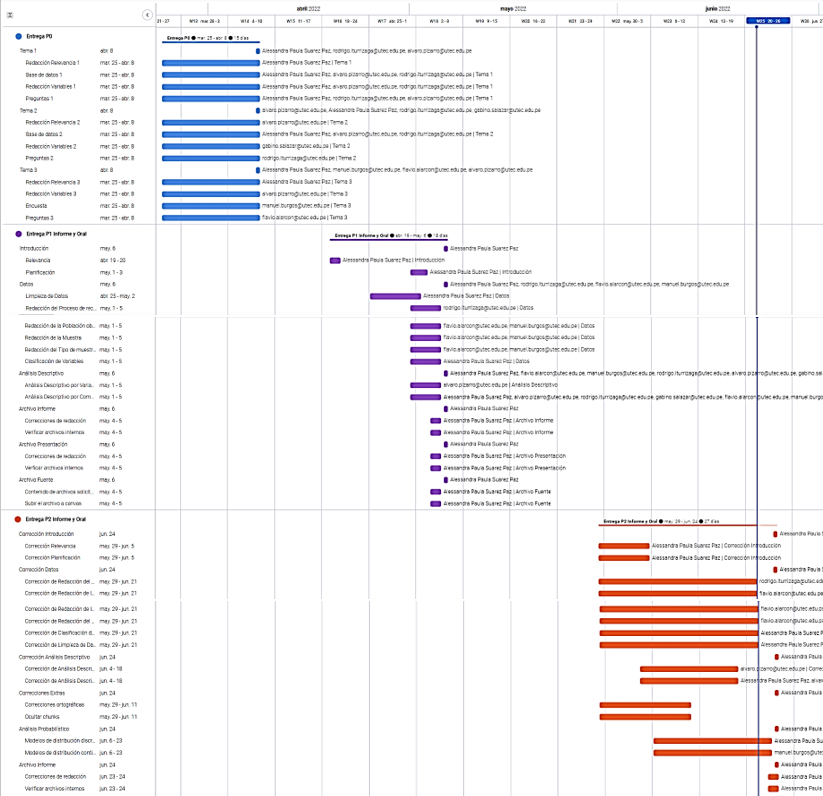
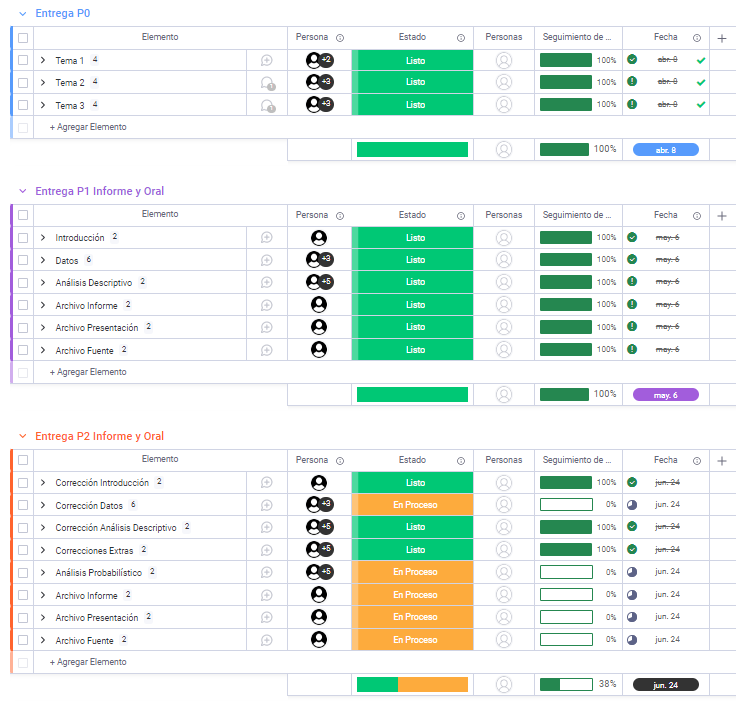
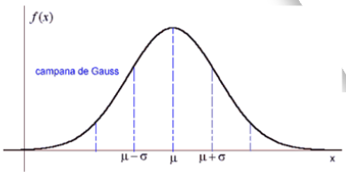
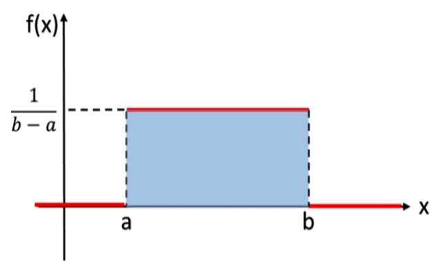
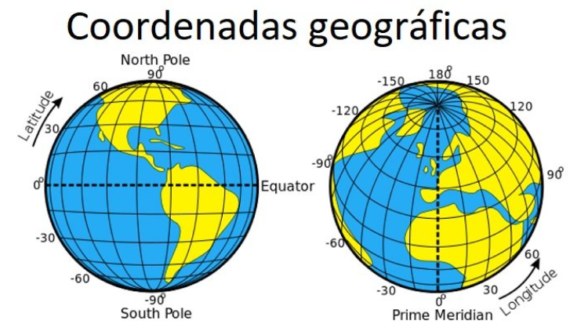

```{r message=FALSE, echo=FALSE, warning=FALSE}
library(readr)
library(dplyr)
library(ggplot2)
library(ggpubr)
library(stringr)
library(modeest)
```

```{r message=FALSE, echo=FALSE, warning=FALSE}
rm(list = ls())
A<-read_csv2("Accidentes.csv")
```

```{r message=FALSE, echo=FALSE, warning=FALSE}
A[A == "N.I."] <- NA

rename(A, CODE_VIA = CODIGO_VÍA) -> A # Se cambia el nombre de la variable CODIGO_VÍA

A %>% select(-FECHA_CORTE) -> A # Se elimina la variable FECHA_CORTE

mutate(A,ANNO=substr(A$FECHA, start = 1, stop = 4))->A    # A$ANNO
mutate(A,MES=substr(A$FECHA, start = 5, stop = 6))->A    # A$MES
mutate(A,DIA=substr(A$FECHA, start = 7, stop = 8))->A    # A$DIA

A %>% select(-FECHA) -> A # Se elimina la variable FECHA

A$ANNO <- as.numeric(A$ANNO)
A$DIA <- as.numeric(A$DIA)
A$FALLECIDOS <- as.numeric(A$FALLECIDOS)
A$HERIDOS <- as.numeric(A$HERIDOS)
A$KILOMETRO <- as.numeric(A$KILOMETRO)

A %>% mutate(MES = 
        ifelse(MES == "01", "ENERO",
        ifelse(MES == "02", "FEBRERO",
        ifelse(MES == "03", "MARZO",
        ifelse(MES == "04", "ABRIL", 
        ifelse(MES == "05", "MAYO", 
        ifelse(MES == "06", "JUNIO", 
        ifelse(MES == "07", "JULIO",
        ifelse(MES == "08", "AGOSTO",
        ifelse(MES == "09", "SETIEMBRE",
        ifelse(MES == "10", "OCTUBRE",
        ifelse(MES == "11", "NOVIEMBRE",
        ifelse(MES == "12", "DICIEMBRE", MES
        ))))))))))))) -> A

mutate(A,HORA2 = format(as.POSIXct(A$HORA,format = "%H:%M"),"%H")) -> A
mutate(A,HORA3 = format(as.POSIXct(A$HORA,format = "%H:%M"),"%M")) -> A
A$HORA2 <- as.numeric(A$HORA2)
A$HORA3 <- as.numeric(A$HORA3)
mutate(A,HORA= HORA2 + HORA3/60)->A 
A$HORA <- round(A$HORA,2)

A %>% select(-HORA2) -> A # Se elimina la variable HORA2
A %>% select(-HORA3) -> A # Se elimina la variable HORA3

A %>% mutate(LATITUD=strtoi(substr(A$LATITUD, start = 1, stop = 3))+strtoi(substr(A$LATITUD, start = 4, stop = 5))/100)->A

A %>% mutate(LONGITUD=strtoi(substr(A$LONGITUD, start = 1, stop = 3))+strtoi(substr(A$LONGITUD, start = 4, stop = 5))/100)->A  

#A %>% count(DEPARTAMENTO)
A %>% mutate(DEPARTAMENTO = 
        ifelse(DEPARTAMENTO == "Arequipa", "AREQUIPA",
        ifelse(DEPARTAMENTO == "Puno", "PUNO",
        ifelse(DEPARTAMENTO == "Cusco", "CUSCO", DEPARTAMENTO
        )))) -> A

```


# I. Introducción

## 1.1 <span style="color:darkblue">Relevancia</span> 

La relevancia del tema radica en el hecho de qué en nuestro país ocurren varios accidentes de tránsito en el día a día y es esencial conocer los datos registrados de estos para saber temas como: dónde ocurren con mayor frecuencia, hora del accidente, el motivo, número de heridos y fallecidos. Esto permitirá identificar los puntos en nuestro territorio en los cuales es de urgencia implementar algún sistema de control, sea este una señalización o semáforo, modificación de personal para que se cubran horarios clave o la modificación de elementos como la calzada, velocidad máxima, etc.

## 1.2 <span style="color:darkblue">Planificación</span>

Para planificar las actividades correspondientes al proyecto del curso de Estadística y Probabilidades se elaboró un diagrama Gantt, el cual es una herramienta gráfica que muestra las actividades respecto al tiempo de dedicación y esfuerzo.


<br />





<br />


<span style="color:darkblue">CRONOGRAMA</span>



<br />


# II. Datos

## 2.1 <span style="color:darkblue"><u>Proceso de recolección de datos </u></span> 
El proceso de recolección de datos se realizó a partir de la búsqueda de una base de datos ya existente, para ello fue necesario indagar en el "Portal Nacional de Datos Abiertos (PNDA)", una plataforma de datos gubernamentales de los cuales el ciudadano es el propietario original, y posteriormente acceder a información pública sobre los accidentes de tránsito ocurridos mensualmente en distintas vías nacionales y departamentales. Asimismo, se agregaron 2 variables a la base de datos, las cuales corresponden a la latitud y longitud de los departamentos donde ocurrieron los accidentes.

## 2.2  <span style="color:darkblue"><u>Población objetivo </u></span>
La población en la que está basado nuestro informe y del cual partiremos para llevar a cabo nuestra investigación son todos los accidentes de tránsito ocurridos en Perú desde el año 2020 hasta el 2021.

## 2.3  <span style="color:darkblue"><u>Muestra </u></span>
Nuestra muestra,es decir la extracción de una parte de la población, son los accidentes de tránsito en el Perú registrados por la PNP y  el CGM, ocurridos desde el año 2020 hasta el 2021.

## 2.4  <span style="color:darkblue"><u>Tipo de muestreo </u></span> 
El tipo de muestreo es no probabilístico, concretamente, se trata del muestreo por conveniencia, ya que tomamos los datos que conseguimos, la representatividad de esta muestra depende de múltiples factores fuera de nuestro control, por ejemplo, el cómo se recolectaron estos datos (el accidente pudo ser reportado por un civil o por un oficial). Sin embargo, la procedencia de los datos es de fiar, debido a que se encuentra en una página del gobierno, como se mencionó anteriormente.

## 2.5  <span style="color:darkblue"><u>Clasificación de variables </u></span> 

### 2.5.1 <u>Variables <span style="color:darkred">**Numéricas**</span></u>

| Variable     | Unidad                      | Tipo             | Restricción                        |
|:------------:|:---------------------------:|:----------------:|:----------------------------------:|
|   FALLECIDOS |número de personas fallecidas|Numérica Discreta	|Número entero no negativo           |
| 	HERIDOS    |número de personas heridas   |Numérica Discreta	|Número entero no negativo           |
|   HORA	     |horas                        |Numérica Continua	|Número decimal de máximo 2 decimales|
|   KILOMETRO  |kilómetros                	 |Numérica Discreta |Número entero no negativo           |
|   LATITUD    |coordenadas decimales        |Numérica Continua	|Número decimal de máximo 2 decimales|
| 	LONGITUD   |coordenadas decimales	       |Numérica Continua	|Número decimal de máximo 2 decimales|

### 2.5.2 <u>Variables <span style="color:darkred">**Categóricas**</span></u>
| Variable       | Tipo              | Opciones                                         |
|:--------------:|:-----------------:|:------------------------------------------------:|
|   ANNO         |Categórica Ordinal |2020 y 2021                                       |
| 	CODE_VIA     |Categórica Nominal |PE-105, AM-103, AR-113, AR-105, PE-22, PE-34A, ...|
|   DEPARTAMENTO |Categórica Nominal |Todos los departamentos del Perú                  |
|   DIA          |Categórica Ordinal |Número entero no negativo                         |
|   MES          |Categórica Ordinal |Todos los meses del año                           |
| 	MODALIDAD    |Categórica Nominal |ATROPELLO, CHOQUE, DESPISTE, ESPECIAL y VOLCADURA |

* Para la variable `CODE_VIA` utilizar la función para contabilizar el contenido . CODE_VIA no tiene una restricción en específico pues es el código de la vía en la que se reportó el accidente de tránsito

```{r message=FALSE, echo=FALSE, warning=FALSE}
A %>% count(CODE_VIA) 
```


## 2.6 <span style="color:darkblue"><u>Data Frame </u></span> 
Para el análisis del `dataframe` y toda su manipulación se importaron las siguientes librerías de soporte.
```{r message=FALSE, warning=FALSE}
library(readr)
library(dplyr)
library(ggplot2)
library(ggpubr)
library(stringr)
library(tidydr)
library(modeest)
```


### 2.6.1 <u>Información general del <span style="color:darkred">**Data Frame**</span></u> 
Antes de iniciar con la evaluación de los datos, es necesario reconocer el tamaño de la muestra. En la base de datos original, los datos del estudio eran 8155 observaciones y 9 variables.Debido al feedback de la pre-entrega del P1, se sugirió aumentar el número de variables cuantitativas continuas como se detalla en el punto "2.1", es por eso que el número de variables aumento en 2: latitud y longitud. Finalmente  el número total de variables obtenidas es 11 con 8155 observaciones.

```{r, warning=FALSE}
nrow(A) #Número de filas
ncol(A) #Número de columnas
```


### 2.5.1 <u>Limpieza de <span style="color:darkred">**Datos**</span></u>

Para empezar con el procedimiento debemos hacer un paso previo. La base de datos que se adjunto para este proyecto incluye una leyenda acerca de los datos de las variables. Esta resalta como aspecto más importante los datos que tienen como información **"N.I."**, lo cual significa que **"no ha sido identificado"**. Es por eso que hemos decidido que esos datos no identificados serán reemplazados por **"NA"**.
 

```{r, warning=FALSE}
A[A == "N.I."] <- NA
```

Hecho esto, se tiene todos los datos no identificados con los `NA` correspondientes, hasta el momento, que sirven para la siguiente parte la limpieza de los datos:

```{r, warning=FALSE}
sum(is.na(A)) #Número de datos faltantes
sum(!is.na(A)) #Número de datos completos
sum(is.na(A)) + sum(!is.na(A)) #Datos totales
sum(complete.cases(A)) #Filas completas
```
```{r, warning=FALSE}
round(sum(is.na(A))*(100/89705),2) #Porcentaje de datos faltantes
round(sum(!is.na(A))*(100/89705),2) #Porcentaje de datos completos
```

En todo encuesta, es probable encontrar datos NA, por tal razón, resulta conveniente realizar de manera preventiva una limpieza de datos para poder procesar la información. En esta investigación, se evitará descartar las observaciones que presenten datos NA, debido al riesgo de reducir el tamaño de la muestra.

<span style="color:blue">Tabla de resumen de las modificaciones a la variable CODIGO_VÍA </span>

Para evitar errores por colocar tildes o caracteres especiales que podrían generar error en el código se hizo el cambio de nombre. 

|Variable original|Variable modificada   |
|:----------------|:--------------------:|
|CODIGO_VÍA       | CODE_VIA             |


<span style="color:blue">Tabla de resumen de las modificaciones de las observaciones que corresponden a la variable Fecha </span>

Para la variable `FECHA` que tenía como formato original: `20200101`, donde los 4 primeros caracteres eran el **año** , los 2 siguientes el **mes** y los dos últimos el **día**. 
Se decidió transformar la variable en tres nuevas: `ANNO`, `MES` y `DIA` para darle un propósito más útil dentro del análisis. 

|Observación original|Observación modificada|
|:-------------------|:--------------------:|
|20200101            | 2020                 |
|20200101            | 01                   |
|20200101            | 01                   |


<span style="color:blue">Tabla de resumen de las modificaciones de las observaciones que corresponden a la variable Mes  </span>

Se decidió hacer el cambio equivalente del mes expresado en número a el mes en palabras para que sea mejor identificado.

|Observación original|Observación modificada|
|:-------------------|:--------------------:|
| 01                 | ENERO                |
| 02                 | FEBRERO              |


<span style="color:blue">Tabla de resumen de las modificaciones de las observaciones que corresponden a la variable Hora </span>

Se decidió realizar el siguiente cambio para que las observaciones pasen a ser de tipo numéricas ya que se estaban representando de forma categórica.

|Observación original|Observación modificada|
|:-------------------|:--------------------:|
|16:30               | 16.5 horas           |

<span style="color:blue">Tabla de resumen de las modificaciones de las observaciones que corresponden a las variables Latitud y Longitud </span>

Se decidió colocar el punto decimal en su lugar correspondiente para las observaciones de ambas variables así como redondear la cifra a 2 decimales

|Observación original|Observación modificada|
|:-------------------|:--------------------:|
| -120464            | -12.05               |
| -770427            | -77.04               |

<span style="color:blue">Tabla de resumen de las modificaciones de las observaciones que corresponden a la variable Departamento </span>

Al utilizar el comando `count`, se halló que habían algunas formas diferentes en las que se habían escrito algunas observaciones de la variable departamento. Por ello, se hizo el siguiente cambio:


|Observación original|Observación modificada|
|:-------------------|:--------------------:|
|Arequipa            | AREQUIPA             |
|Puno                | PUNO                 |
|Cusco               | CUSCO                |


<span style="color:blue"> Recortes finales </span>

Se cambió el tipo de variable, para las variables `FALLECIDOS`, `HERIDOS` y `KILOMETRO`, a numérico ya que RStudio las clasificaba como de tipo carácter.

Finalmente, se eliminó la variable `FECHA_CORTE`y `FECHA` ya que no tenia ningún uso en el estudio.  


<br />


# IV. Análisis descriptivo

## 4.1  <span style="color:darkblue"><u>Análisis Descriptivo por cada variable relevante </u></span>

### 4.1.1 <u>Variables <span style="color:darkred">**Relacionadas al tiempo**</span></u>
En esta sección incluimos todas las variables que nos indican el momento o el instante en el cual ocurrió un accidente. Estas variables han sido separadas con la finalidad de identificar en qué momentos ocurren la mayor cantidad de accidentes o la frecuencia de estos, ya sea por hora, mes, día o año. 


#### <span style="color:darkblue">A) Hora </span>


```{r message=FALSE, echo=FALSE, warning=FALSE}
data.frame("mediana"=median(A$HORA,na.rm=TRUE),
           "media"=mean(A$HORA,na.rm=TRUE),
           "mínimo"=min(A$HORA,na.rm=TRUE),
           "máximo"=max(A$HORA,na.rm=TRUE))

p<-ggplot(data=A, aes(x=HORA)) +
geom_histogram(col='black', fill='blue',bins=24, na.rm=TRUE )+
xlab('\nHoras') + ylab('Frecuencia\n') + ggtitle('      Horas en las que ocurrieron accidentes en el 2020 y 2021\n') +
theme( plot.title = element_text(color="black", size=14, face="bold.italic"))+
scale_x_continuous(breaks = seq(0, 24, by = 1))+
scale_y_continuous(breaks = seq(0, 550,25))
#+geom_vline(aes(xintercept = mean(A$HORA,na.rm=TRUE),color = "media"),size = 1)+
#geom_vline(aes(xintercept = median(A$HORA,na.rm=TRUE),color = "mediana"),size = 1)+
#scale_color_manual(
     #name = "Leyenda",
     #values = c(
      # mediana = "orange",
       #media = "red"
     #)
   #)
p
```


En este Gráfico 1 se logra apreciar un histograma en el cual aparecen las 24 horas del día y la cantidad de accidentes que ocurrieron en dichas horas.
La variable hora es una variable numérica continua y por ello estamos utilizando intervalos con un histograma, estos intervalos van de **una hora a otra hora**.  Visualmente podemos ver en este gráfico 1 que **entre las 17-18 horas** han ocurrido más accidentes ,luego le sigue las **6-7** y después, sigue las **7-8 horas**; lo cual tiene relación con la hora punta en nuestro país.


#### <span style="color:darkblue">B) Mes </span>
```{r message=FALSE, echo=FALSE, warning=FALSE}

p2 <-ggplot(data=A, aes(x = test)) +
  geom_bar(width=1, colour="black", fill="blue" )+coord_flip()+scale_y_continuous(breaks = seq(0, 1000,50))+ xlab('\nMeses\n') + ylab('\nFrecuencia') + ggtitle('Frecuencia de accidentes por meses en los años 2020 y 2021\n ') + theme( plot.title = element_text(color="black", size=14, face="bold.italic"))
test <- factor(A$MES,levels = c("ENERO","FEBRERO","MARZO","ABRIL", "MAYO", "JUNIO","JULIO","AGOSTO","SETIEMBRE","OCTUBRE","NOVIEMBRE","DICIEMBRE")) 
p2
```


En esta gráfica se pueden apreciar todos los meses del año y la cantidad de accidentes que ocurrieron en este. Con la variable Mes al ser una variable cualitativa solo es pertinente hallar su moda, siendo esta el **mes de ENERO como el mes con más accidentes **de tránsito en los años 2020 y 2021 con 961, seguido por agosto (861) y setiembre (828). Por el lado opuesto tenemos a los meses de **octubre y noviembre con menor cantidad de accidentes **ocurridos con 430 y 387 accidentes respectivamente. Estos datos se pueden apreciar tanto en el diagrama de barras como en la tabla de frecuencias.


```{r message=FALSE, echo=FALSE, warning=FALSE}
xz <- select(A, MES, ANNO)
XZ2<- filter(xz, ANNO == 2020)
XZ3 <- table(XZ2$MES)
p3 <- ggplot(data=XZ2, aes(x=test))+geom_bar(width=1, colour="black", fill="blue")+coord_flip()+scale_y_continuous(breaks = seq(0, 550,25)) + xlab('\nMeses\n') + ylab('\nFrecuencia') + ggtitle('        Frecuencia de accidentes en meses del año 2020\n ') + theme( plot.title = element_text(color="black", size=14, face="bold.italic"))
test <- factor(XZ2$MES,levels = c("ENERO","FEBRERO","MARZO","ABRIL", "MAYO", "JUNIO","JULIO","AGOSTO","SETIEMBRE","OCTUBRE","NOVIEMBRE","DICIEMBRE"))
p3

```


Esta gráfica a diferencia de la anterior muestra los datos de los accidentes en cada mes **solo en el año 2020**. Podemos ver la moda se mantiene constante en el mes de enero por muy poco con 501, seguido por febrero con 500, a solo una unidad de diferencia. Mientras que los que tienen **menor cantidad de accidentes son mayo y abril **con 139 y 109 accidentes.

```{r message=FALSE, echo=FALSE, warning=FALSE}
xz <- select(A, MES, ANNO)
XZ2<- filter(xz, ANNO == 2021)
XZ3 <- table(XZ2$MES)
XZ3
p4 <- ggplot(data=XZ2, aes(x=test))+geom_bar(width=1, colour="black", fill="blue")+coord_flip()+scale_y_continuous(breaks = seq(0, 600,25)) + xlab('\nMeses\n') + ylab('\nFrecuencia') + ggtitle('        Frecuencia de accidentes en meses del año 2021\n ') + theme( plot.title = element_text(color="black", size=14, face="bold.italic"))
test <- factor(XZ2$MES,levels = c("ENERO","FEBRERO","MARZO","ABRIL", "MAYO", "JUNIO","JULIO","AGOSTO","SETIEMBRE","OCTUBRE","NOVIEMBRE","DICIEMBRE"))
p4
```


Esta, tercera gráfica, nos indica los datos recopilados a lo largo de los meses pero esta vez en el año 2021. Aqui ya podemos apreciar como la moda que determinamos al inicio ha cambiado y ahora el mes que se repite con **mayor frecuencia es Agosto** con 562 accidentes, seguido por setiembre con 493. Lo interesante en esta gráfica es que **enero ya no se encuentra entre los meses con más accidentes** y **abril se mantiene aún como el mes con menos accidentes** con 385.

#### <span style="color:darkblue">C) Día </span>
```{r message=FALSE, echo=FALSE, warning=FALSE}
data.frame("moda"= mfv(A$DIA,na_rm=TRUE),
           "mínimo"= min(A$DIA,na.rm=TRUE),
           "máximo"=max(A$DIA,na.rm=TRUE))
table(A$DIA)

x <- table(A$DIA)
p5 <-ggplot(data=A, aes(x = DIA)) +
  geom_bar(width=1, colour="black", fill="blue") + xlab('\nDía\n') + ylab('\nFrecuencia\n') + ggtitle('        Frecuencia de accidentes ocurridos en un determinado día\n ') + theme( plot.title = element_text(color="black", size=14, face="bold.italic")) +scale_x_continuous(breaks = seq(1, 31, by = 1))+scale_y_continuous(breaks = seq(0, 350,20))
p5

```


El gráfico de barras muestra la frecuencia en la que ocurrieron los accidentes en relación al día del mes. Al ser una variable cualitativa es útil este tipo de gráficos

La moda que hemos identificado es **el día 23, conviertiendo a este en el día con más accidentes del mes** con 320; seguido por el día 8 con 318. y por el lado opuesto, el día 31 es el día donde ocurrieron menos accidentes, este dato rapidamente es cuestionado pues no todos los meses tienen 31 días. Es por ello que si tenemos en cuenta esto, **17 y 3 son los días con menos accidentes** con 218 y 221 accidentes.


### 4.1.2 <u>Variable <span style="color:darkred">**Departamento**</span></u>
La variable lugar nos indica el departamento del Perú donde ocurrió el accidente registrado. Es importante para analizar en dónde ocurren más frecuentemente los accidentes.


```{r message=FALSE, echo=FALSE, warning=FALSE}
#data.frame("moda"=mfv(A$DEPARTAMENTO,na_rm=TRUE))
x <- table(A$DEPARTAMENTO)
#table(A$DEPARTAMENTO)
x2 <- filter(A, is.na(DEPARTAMENTO)==F)
p6 <-ggplot(data=x2, aes(x=test2))+geom_bar(width=1, colour="black", fill="blue")+coord_flip()+scale_y_continuous(breaks = seq(0, 1600,100))+xlab("Departamento\n")+ylab("\nFrecuencia\n")+ggtitle(' Accidentes por departamento durante el 2020 y 2021\n') +theme( plot.title = element_text(color="black", size=14, face="bold.italic"))
test2 <- factor(x2$DEPARTAMENTO,levels = c("LIMA","AREQUIPA","JUNIN","ANCASH","PUNO","ICA","CAJAMARCA","CUSCO","LAMBAYEQUE","LA LIBERTAD","PIURA","SAN MARTIN","APURIMAC","MADRE DE DIOS","HUANUCO","AYACUCHO","MOQUEGUA","UCAYALI","AMAZONAS","TACNA","LORETO","PASCO","HUANCAVELICA","TUMBES","CALLAO"))
p6
```

Se presenta un gráfico de barras con los departamentos y la frecuencia en la que ocurrieron accidentes en ellos.

En este gráfico podemos notar visualmente y en primera instancia como indiscutiblemente **Lima es el departamento con mayor cantidad de accidentes** de tránsito ocurridos durante el 2020 y 2021 de todo el Perú con 1558 accidentes registrados.


### 4.1.3 <u>Variable <span style="color:darkred">**Modalidad**</span></u>
```{r message=FALSE, echo=FALSE, warning=FALSE}
data.frame("Moda"= mfv(A$MODALIDAD, na_rm=TRUE))
x<-table(A$MODALIDAD)
x
A2<-filter(A, is.na(MODALIDAD)==F)
p7 <-ggplot(data=A2, aes(x=test2))+geom_bar(width=1, colour="black", fill="blue")+geom_text(aes(label = ..count..), stat = "count", vjust = -0.5, colour = "black")+scale_y_continuous(breaks = seq(0, 4050,250)) + xlab('\nModalidad\n') + ylab('\nFrecuencia\n') + ggtitle('Frecuencia de accidentes ocurridos por una determinada modalidad\n ') + theme( plot.title = element_text(color="black", size=14, face="bold.italic"))


test2 <- factor(A2$MODALIDAD,levels = c("VOLCADURA","ESPECIAL","ATROPELLO", "CHOQUE", "DESPISTE"))
p7

```


Se muestra un gráfico de barras con la relación de modalidad del accidente y frecuencia de cuánto ocurrió.

La modalidad más comúnes son **CHOQUE Y DESPISTE** con 3623 y 3829 respectivamente. 

### 4.1.4 <u>Variable <span style="color:darkred">**Año**</span></u>

```{r message=FALSE, echo=FALSE, warning=FALSE}
p8 <-ggplot(data=A, aes(x=ANNO))+geom_bar(colour="black", fill="blue")+geom_text(aes(label = ..count..), stat = "count", vjust = -0.5, colour = "black")+scale_y_continuous(breaks = seq(0, 4500,250))+scale_x_continuous(breaks = seq(2020, 2021))+xlab("Años")+ylab("Frecuencia")+ggtitle('                       Número de accidentes en cada año') +theme( plot.title = element_text(color="black", size=14, face="bold.italic"))
p8
```


La variable año es una variable discontinua y por ello ha sido agrupado en un gráfico de barras. Gracias a la visualización de este gráfico 8, podemos notar como en estos 2 años el número de accidente de tránsito *no varía mucho*, pese a que en 2020 estalló la pandemia y en el 2021, esta misma ya se estaba apaciguando.


## 4.2  <span style="color:darkblue"><u>Análisis Descriptivo por combinación de variables </u></span>

En el estudio se desarrollarán diferentes tipos de gráficos como histograma, boxplot, gráficos de barras, tablas de frecuencia y diagramas de dispersión. Cada gráfico representará la relación entre ciertas variables y nos permitirá presentar información de una forma más sencilla.

### 4.2.1 <u>Relación entre <span style="color:darkred">**los departamento y meses que ocurrieron los accidentes**</span></u>


En la **tabla de frecuencias** se puede observar la distribución entre los departamentos y meses en el año en que ocurrieron los accidentes. Con esta relación se puede saber específicamente en qué departamento y mes ocurrieron más cantidad de accidentes de tránsito así como cuando y donde ocurrió la menor cantidad.


<br />


```{r message=FALSE, echo=FALSE, warning=FALSE}
tabla1 <- table(A$MES,A$DEPARTAMENTO)
data.frame(tabla1)
```


<br />


Como se puede apreciar la `tabla1` tiene muchos datos que se entienden si se les pone especial atención. Sin embargo, no es muy amigable de interpretar. Es por eso que se creo una `tabla2`, en donde se ve la cantidad de accidentes que ocurrieron en el mes de Enero en cada departamento ya que según el apartado B del punto 4.1.1 , en el mes de Enero ocurrió la mayor cantidad de accidentes.


```{r message=FALSE, echo=FALSE, warning=FALSE}
A1 <- filter(A, A$MES == "ENERO" )
tabla2 <- table(A1$MES,A1$DEPARTAMENTO)
tabla2
```


La tabla denota a simple vista que durante el mes de **Enero** en el departamento de **Lima** ocurrieron mayor cantidad de accidentes de tránsito. Se obtuvo una cifra de **191**.

Asimismo se realizó una tercera tabla `tabla3` en la que se muestra la cantidad de accidentes que ocurrieron durante el mes de Abril en los 2 últimos años en cada departamento porque durante ese mes ocurrió la menor cantidad de accidentes. 


```{r message=FALSE, echo=FALSE, warning=FALSE}
A2 <- filter(A, A$MES == "ABRIL")
tabla3 <- table(A2$MES, A2$DEPARTAMENTO)
tabla3
```


La tabla3 muestra explícitamente que durante el mes de Abril en el departamento de Tumbes ocurrió la menor cantidad de accidentes ya que se dio únicamente un accidente en aquel departamento durante ese mes. 


### 4.2.2 <u>Relación entre el <span style="color:darkred">**número de Heridos y la modalidad del Accidente ocurrido**</span></u>


```{r message=FALSE, echo=FALSE, warning=FALSE}
b <- A %>%
  ggplot(aes(x = reorder(MODALIDAD,HERIDOS), y = HERIDOS)) +
  geom_boxplot(outlier.colour = "blue")+coord_flip() + labs(x = "\nModalidad del Accidente\n", y = "\nHeridos en el accidente") +      ggtitle("    NÚMERO DE HERIDOS VS MODALIDAD DEL ACCIDENTE\n")  
b + theme(
plot.title = element_text(color="black", size=14, face="bold.italic"),
axis.title.x = element_text(size=13),
axis.title.y = element_text(size=13)
)


```


Hemos decidido realizar un **diagrama de cajas** para poder visualizar la distribución del número de heridos según la modalidad y los datos atípicos que se pueden rescatar de estos. Podemos observar que la gran mayoría de accidentes, independientemente de la modalidad, terminan con entre 0 a 2 heridos, esto debido a la posición de los cuartiles en la gráfica. Además nos podemos percatar que las modalidades **despiste** y **choque** son las que cuentan con heridos más frecuentemente, y que a su vez también son las que cuentan con más casos de accidentes de gran magnitud y de muchos heridos, como podemos determinar por los outliers y su distancia de la caja, creemos que esto pasa debido a que son las modalidades de accidentes más comunes que suelen sufrir los buses de pasajeros.


```{r message=FALSE, echo=FALSE, warning=FALSE}
b1 <- A %>% filter(is.na(MODALIDAD)==F) %>%
  group_by(MODALIDAD) %>%
  summarize(TOTALHERIDOS = sum(HERIDOS, na.rm = TRUE)) %>%
  ggplot(aes(x = reorder(MODALIDAD, TOTALHERIDOS), y = TOTALHERIDOS)) +
  geom_col(fill="blue") +
  labs(x = "\nModalidad del accidente", y = "\nNúmero de heridos\n") + ggtitle(" CANTIDAD DE HERIDOS POR MODALIDAD DEL ACCIDENTE\n")
b1 + theme(plot.title = element_text(color="black", size=14, face="bold.italic")) + scale_y_continuous(breaks=seq(0,5500,300))

```


Realizamos un gráfico de barras totalizando el número de heridos por modalidad de accidente, de esta gráfica podemos rescatar que las modalidades *despiste* y *choque* cuentan con un total de heridos mucho mayor a comparación del resto de modalidades, que en la muestra extraída no pasan de 300, por lo que es comprensible el número y la magnitud de casos atípicos de la gráfica anterior.


### 4.2.3 <u>Relación entre la <span style="color:darkred">**cantidad de Fallecidos por Hora del accidente**</span></u>


Filtrando los datos en fallecidos y hora
```{r}
fallecidos_por_hora <- select(A, FALLECIDOS, HORA)
```


Hallando la cantidad de datos faltantes en Fallecidos como en Horas
```{r message=FALSE, echo=FALSE, warning=FALSE}
sum(is.na(fallecidos_por_hora$HORA)) # Faltantes para Hora
sum(complete.cases(fallecidos_por_hora)) # Total de datos completos
nrow(fallecidos_por_hora) #Total de datos 
sum(is.na(fallecidos_por_hora$FALLECIDOS)) #Faltantes para fallecidos
```

Debido a que existen solo 3 casos vacíos de fallecidos, reemplazaremos este valor por cero, porque para esa hora si hubo un accidente, pero no hubo muertos; mientras que para los 88 datos faltantes de la hora, realizaremos dos casos, el primero será cuando se eliminen dichas horas y otro cuando se reemplace por la media para ver su variación. Para todo este análisis consideraremos las horas del día en 24 horas.

Reemplazando los datos vacíos de Fallecidos por cero "0"
Los valores "NA" de la variable Fallecidos los reemplazaremos por un cero

```{r}
fallecidos_por_hora$FALLECIDOS[is.na(fallecidos_por_hora$FALLECIDOS)] = 0
```

Eliminando datos faltantes de Hora y hallando la mediana:

Aqui eliminaremos los valores "NA" de la variable Hora para calcular la media de estos valores y posteriormente reemplazarlo en los datos iniciales de nuestra data

```{r}
Limpio_Fallecidos <- na.omit(fallecidos_por_hora)
mediana_hora = round(mean(Limpio_Fallecidos$HORA),2)
```

Reemplazando datos Faltantes por la media en Fallecidos y ordenando de manera creciente con respecto a la hora:


```{r}
fallecidos_por_hora$HORA[is.na(fallecidos_por_hora$HORA)] = mediana_hora # Reemplazar datos NA por la media en la hora
ordenado_datos <- arrange(fallecidos_por_hora, HORA) # Ordenando de menor a mayor
```

### Graficando primero los datos obtenidos de datos no agrupados

```{r message=FALSE, echo=FALSE, warning=FALSE}
t <- ggplot(data = fallecidos_por_hora,aes(x = HORA, y=FALLECIDOS)) 

t + geom_point(size = 3, aes(colour = FALLECIDOS))+
  geom_hline(yintercept = mean(fallecidos_por_hora$FALLECIDOS),colour = "red",size=1)+
  theme(plot.title = element_text(hjust = 0.5, color = "black", size = 14, face ="bold.italic"))+
  theme(legend.background = element_rect(fill="lightyellow",colour="black",size=0.5))+
  scale_x_continuous(breaks = seq(0,24, by = 2))+scale_y_continuous(breaks = seq(0,39,3))+
  labs(x = "Horas transcurridas", y = "Cantidad de Fallecidos", title = "Fallecidos reportados en todos los accidente reportados")
round(mean(fallecidos_por_hora$FALLECIDOS)) #media redondeado al entero
max(fallecidos_por_hora$FALLECIDOS) #mayor cantidad de fallecidos en un accidente
```


Esta gráfica nos indica que la mayor cantidad de personas que no murieron en un accidente a una cierta hora son la mayoría debido a la media de sus valores siendo igual a cero y que su valor máximo de fallecidos es una valor de 33 personas que está aproximadamente entre las 4 y 6 horas; ahora graficaremos los datos agrupados de acuerdo a la hora del accidente de manera acumulativa para tener una mejor distribución en el gráfico.


### Ordenando y graficando los datos acumulativos
```{r message=FALSE, echo=FALSE, warning=FALSE}
grupo_acumulativo = aggregate(FALLECIDOS ~ HORA, data = ordenado_datos, FUN = sum) #Ordenado

w <- ggplot(data = grupo_acumulativo,aes(x = HORA, y=FALLECIDOS)) 
w + geom_point(size = 3, aes(colour = FALLECIDOS, ))+
  geom_hline(yintercept = mean(grupo_acumulativo$FALLECIDOS),colour = "red",size=1)+
  theme(plot.title = element_text(hjust = 0.5, color = "black", size = 14, face ="bold.italic"))+
  theme(legend.background = element_rect(fill="lightyellow",colour="black",size=0.5))+
  scale_x_continuous(breaks = seq(0,24, by = 2))+scale_y_continuous(breaks = seq(0, 50,4))+
  labs(x = "Horas transcurridas", y = "Cantidad de Fallecidos", title = "Cantidad de Fallecidos Acumulados a una Determinada Hora")
round(mean(grupo_acumulativo$FALLECIDOS)) #media redondeado al entero
max(grupo_acumulativo$FALLECIDOS) #mayor cantidad de fallecidos en un accidente
```


Notamos una mejor distribución y que la media aumentó de 0 a 2 fallecidos en promedio al día en nuestro rango de mes establecido y que la mayor cantidad de muertes que se dieron en una determinada hora fueron de 48 personas. 
```{r message=FALSE, echo=FALSE, warning=FALSE}
select(filter(grupo_acumulativo, FALLECIDOS == max(grupo_acumulativo$FALLECIDOS)),HORA,FALLECIDOS)
```


Y que este gráfico muestra una mejor distribución de fallecidos acumulativos para ciertas horas específicas de acuerdo a fallecidos acumulativas a una determinada hora en común apreciada en la siguiente tabla


```{r message=FALSE, echo=FALSE, warning=FALSE}
grupo_acumulativo
```

Eliminaremos los que tengan cero fallecidos para tener una mejor apreciación de la cantidad de fallecidos en una determinada hora donde por lo menos hubo una muerte y lo graficamos

```{r message=FALSE, echo=FALSE, warning=FALSE}
Porlomenos_unmuerto <- grupo_acumulativo[grupo_acumulativo$FALLECIDOS != 0,]

dead <- ggplot(data = Porlomenos_unmuerto,aes(x = HORA, y=FALLECIDOS)) 
dead + geom_point(size = 2, aes(colour = FALLECIDOS, ))+
  theme(plot.title = element_text(hjust = 0.5, color = "black", size = 14, face ="bold.italic"))+
  theme(legend.background = element_rect(fill="lightyellow",colour="black",size=0.5))+
  scale_x_continuous(breaks = seq(0,24, by = 2))+scale_y_continuous(breaks = seq(1, 50,4))+
  labs(x = "Horas transcurridas", y = "Cantidad de Fallecidos", title = "Fallecidos Acumulados desde la primera muerte")+stat_smooth(aes(fill = FALLECIDOS), method = "lm", formula = y ~ x + I(x^2))
```


Añandiendole a este gráfico una correlación lineal para saber la tendencia a la que nuestra variable fallecidos va adquieriendo en el transcurso del tiempo de las horas, por lo que calculando su varianza entre estas dos variables, podremos comprobar dicho comportamiento

```{r message=FALSE, echo=FALSE, warning=FALSE}
cov(grupo_acumulativo$FALLECIDOS, grupo_acumulativo$HORA)
```


Resulta una covarianza negativa y mayor que la unidad en valor absoluto, porque tienen una fuerte relación de diferencia, ya que si una variable va aumentando, la otra variable puede como no puede aumentar de forma radical.
Finalmente realizaremos una agrupación en intervalos de 6 horas y sumando la cantidad de fallecidos en cada intervalo, luego al momento de graficarlo notaremos la frecuencia en un rango de tiempo donde hay una mayor ocurrencia de accidentes con fallecidos a cierta hora.

### Calculamos acumulada de fallecidos en determinados intervalos y lo mostranos en una tabla
```{r message=FALSE, echo=FALSE, warning=FALSE}
P6 <- rbind(colSums(select(filter(grupo_acumulativo, HORA >= 0 & HORA <=6), contains("FALLECIDOS"))),
            colSums(select(filter(grupo_acumulativo, HORA > 6 & HORA <=12), contains("FALLECIDOS"))),
            colSums(select(filter(grupo_acumulativo, HORA > 12 & HORA <=18), contains("FALLECIDOS"))),
            colSums(select(filter(grupo_acumulativo, HORA > 18 & HORA <=24), contains("FALLECIDOS")))
            )
HORA <- c("[0;6)","[6;12)","[12;18)","[18;24)")
hora <- matrix(c(HORA),nrow = 4, ncol = 1)
P6 = cbind(P6,HORA)
P6
```


### Graficamos la tabla
```{r message=FALSE, echo=FALSE, warning=FALSE}
final <- data.frame(HORA = c("[0;6)","[6;12)","[12;18)","[18;24)"), 
FALLECIDOS = c(colSums(select(filter(grupo_acumulativo, HORA >= 0 & HORA <=6),contains("FALLECIDOS"))),
colSums(select(filter(grupo_acumulativo, HORA > 6 & HORA <=12), contains("FALLECIDOS"))),
colSums(select(filter(grupo_acumulativo, HORA > 12 & HORA <=18), contains("FALLECIDOS"))),
colSums(select(filter(grupo_acumulativo, HORA > 18 & HORA <=24), contains("FALLECIDOS")))))

grafico_total <- ggplot(final,aes(HORA,FALLECIDOS),colour = "blue")

grafico_total +geom_col(fill="blue",color="blue",size=1)+theme_bw() + scale_y_continuous(breaks = seq(0, 390,30))+geom_text(aes(label = FALLECIDOS), vjust=1.5,color="white")+
theme(plot.title = element_text(hjust = 0.5, color = "black", size = 14, face ="bold.italic"))+
  labs(x = "Intervalo de 6 Horas", y = "Cantidad de Fallecidos Totales", title = "Fallecidos Acumulados en Intervalos de Hora")
```


Este gráfico nos representa las cantidades totales de fallecidos en 4 intervalos de hora, mostrando que entre las 12 y 18 horas se reportaron una gran cantidad de fallecidos para nuestro tiempo de estudio y reportándose la menor cantidad entre las horas 18 y 24 con una cantidad de 316 fallecidos


### 4.2.4 <u>Relación entre el <span style="color:darkred">**Kilómetro y la Hora en que ocurrieron los accidente**</span></u>


En la siguiente imagen se puede observar la Vista general de la relación entre Km y hora ya que esta presenta gran cantidad de datos.Y es por eso que se observará una gran dispersión de los datos. Lo que se puede rescata de la gráfica es que en la mayoria de horas durante los primeros 400km ocurren mayor cantidad de accidentes de trámnsito ya que en ese sector se ve gran concentración de la data.

```{r message=FALSE, echo=FALSE, warning=FALSE}
AC00 <- select(A, 1,4)

a <- ggplot(data = AC00, aes(x=HORA, y = KILOMETRO))+ geom_violin(fill = "blue")
a + xlim(0,24) + 
  labs(
    x = "\nHora del accidente", 
    y = "Kilómetro\n", 
    title = "Gráfica Kilómetro vs Hora del accidente\n") + 
  theme(plot.title = element_text(hjust = 0.5, color = "black", size = 14, face = "bold.italic"))
```


En la gráfica podemos ver dónde se acumulan la mayoría de los accidentes. Se aprecia que hay una mayor acumulación en los primeros kilómetros y entre las horas que las personas están más activas. Aunque suene lógico decir que los accidentes suelen ocurrir en las horas que la mayoría de gente está despierta, tambien se puede ver que ocurren accidentes a altas horas de la noche y en la madrugada.

Tambien queda definir con mayor exactitud en qué horas son más frecuentes estos accidentes. Para eso analizaremos descriptores numéricos:

#### Promedio

- Hora:
```{r , warning=FALSE}
mean(A$HORA, na.rm= TRUE)
```


- Kilómetro:
```{r , warning=FALSE}
mean(A$KILOMETRO, na.rm = TRUE)
```

#### Moda

- Hora:

```{r , warning=FALSE}
mH <- mfv(A$HORA, na_rm = TRUE)
mH
```

- Kilómetro:

```{r , warning=FALSE}
mKm <- mfv(A$KILOMETRO, na_rm = TRUE)
mKm
```


Con esto podemos darnos cuenta que la hora más frecuente es a las 7am. Por su parte, los kilómetros tienen 2 valores frecuentes, los cuales son 4 y 8.


Debido a que las horas se organizan de las 0:00 horas hasta las 24 horas, el orden del histograma se guiará respecto a ese orden


```{r message=FALSE, echo=FALSE, warning=FALSE}
AC05 <- select(A, HORA)
e5 <- ggplot(data=AC05, aes(x = HORA))
e5 + geom_histogram(color = "Black", fill = "blue", binwidth = 1) +
  labs(
    x = "\nHora del accidente",
    y = "\nFrecuencia\n",
    title = "\nFrecuencia de accidentes a una determinada hora\n"
  ) + theme(plot.title = element_text(hjust = 0.5, color = "black", size = 14, face = "bold.italic")) +
  #geom_vline(xintercept = mH, color = "red")
  geom_vline(aes(xintercept = mH,color = "moda"),size = 1)+
scale_color_manual(
     name = "Leyenda",
     values = c(
    moda = "red"
     )
   )
```
---------------------------------------------------------
La gráfica de la hora podemos ver que la moda está ubicada en 7, esto puede deberse a que esta es la hora cuando la gente está en camino a trabajar o a estudiar. La mayoría coincide en horas de trabajo y estudio, las empresas, tiendas, universidades, etc. empiezan sus jornadas a esta hora aproximadamente.


```{r message=FALSE, echo=FALSE, warning=FALSE}
AC06 <- select(A, KILOMETRO)
e6 <- ggplot(data=AC06, aes(x = KILOMETRO))
e6 + geom_histogram(color = "black", fill = "blue") + 
  labs(
    x = "\nKilómetro",
    y = "Frecuencia\n",
    title = "Frecuencia de accidentes a un determinado kilómetro\n"
  ) + theme(plot.title = element_text(hjust = 0.5, color = "black", size = 14, face = "bold.italic"))+scale_y_continuous(breaks = seq(0, 1800,200))
```

Esta gráfica de kilómetros podemos observar dónde ocurren la mayor cantidad de accidentes, en este caso ocurren en los primeros kilómetros de la carretera. Esto puede ocurrir ya que la mayor concentración de carros está cerca de la ciudad, más que en el trayecto, es decir, en la misma carretera. Entonces, a mayor concentracón de vehículos, es más probable que colisionen entre sí.

```{r}
#Reducida
e6 + geom_histogram(color = "black", fill = "blue", binwidth = 1) +
  labs(
    x = "\nKilómetro",
    y = "Frecuencia\n",
    title = "Frecuencia de accidentes durante los 10 primeros kilómetros\n"
  ) + theme(plot.title = element_text(hjust = 0.5, color = "black", size = 14, face = "bold.italic"))+scale_y_continuous(breaks = seq(0, 60,5))+
  xlim(0,11)+geom_vline(xintercept = mKm, color = "red") + geom_vline(aes(xintercept = 4,color = "moda"),size = 1)+
scale_color_manual(
     name = "Leyenda",
     values = c(
    moda = "red"
     )
   ) +
  geom_vline(xintercept = 8, color = "red", size = 1)
```
----------------------------

Para una mejor observación de la gráfica en conjunto con su descriptor numérico, en este caso la moda, se ha recortado la gráfica de tal manera que esta sea más perceptible con el propósito de ver mejor cuáles son los valores. Se puede notar que existen 2 modas, por eso mismo, podemos decir que es bimodal, los valores son 4 y 8. Esto nos brinda una confirmación de lo anterior, que la mayor cantidad de accidentes ocurren en los primeros kilómetros


#### Analizaremos el signo que aparece en la covarianza

```{r , warning=FALSE}
AC001 <- na.omit(AC00)
km<- select(AC001, KILOMETRO)
hora<- select(AC001, HORA)
cov(km, hora)
```

Por el signo, podríamos decir que, mientras una de las variables aumenta, la otra disminuye; sin embargo, primero hay que saber el valor de la correlación para llegar a una idea más sólida sobre la relación entre kilómetro y hora.


#### Correlación

```{r}
cor(km, hora)
```

La correlación, en valor absoluto, es un número menor a 0.2, ciertamente podemos decir que es un valor muy cercano a 0. Entonces, podemos decir que es una relación neutra.


# V. Análisis probabilístico

La variable aletoria es una función que asigna un valor numérico al resultado de un experimento aleatorio.

## 5.1  <span style="color:darkblue"><u>Modelo de distribuación de probabilidad discretos</u></span>

### 5.1.1 <u>Distribución <span style="color:darkred">**Binomial**</span></u>

La variable aleatoria discreta binomial $n,p$, si $\mathbb X$, cuenta el número de éxitos al realizar un número $n$ de experimentos Bernoulli independientes, con una probabilidad fija de $p$.


$$P_{\mathbb X}(X=x)={n\choose x}p^{x}(1-p)^{n-x}$$
Donde la esperanza del mismo es $E{\mathbb X}=np$ 
y su varianza es $np(1-p)$


<br />


En el siguiente proyecto tomaremos la variable `KILOMETRO` para determinar un modelo binomial. Supongamos que se toma una muestra de 40 accidentes que se han registrado con todos sus datos completos, es decir, sin valores NA en sus datos. Y queremos hallar la probabilidad de que 15 de ellos hayan ocurrido en un kilómetro menor al 120.


<br />


Previo a esto, para hallar la probabilidad de que un accidente ocurra en un kilómetro menor a 120, se modifica el Dataframe(A) de tal forma que se eliminen todas las observaciones que se encuentren incompletas. Como se observa en el siguiente chunk, el tamaño de la muestra se reduciría a 7597 filas.

```{r, warning=FALSE}
A_Limpios<-A[complete.cases(A),] #Datos con observaciones completas
```

Posteriormente se creará una tabla. Esta contiene a todos los accidentes ocurridos en kilómetros menores a 120.
```{r message=FALSE, echo=FALSE, warning=FALSE}
A5 <- filter(A_Limpios, A_Limpios$KILOMETRO < 120)
tabla4 <- table(A5$KILOMETRO)
data.frame(tabla4)
```
Luego, se halla la cantidad de accidentes ocurridos en un kilómetro menor a 120 mediante una sumatoria de frecuencias.
```{r, warning=FALSE}
sum(tabla4) # total de accidentes ocurridos en un kilómetro menor a 120 
```
Asimismo, hallamos el total de accidentes ocurridos con todas sus observaciones completas así como el total de accidentes ocurridos en un kilómetro mayor o igual a 120.
```{r, warning=FALSE}
length(A_Limpios$KILOMETRO) # total de accidentes ocurridos con todas sus observaciones completas
A6 <- 7597 - sum(tabla4) # total de accidentes ocurridos en un kilómetro mayor o igual a 120
A6
```

$P(X<120)$

Sería de la siguiente manera:
```{r, warning=FALSE}
round(sum(tabla4)/7597,2) # probabilidad de que haya ocurrido un accidente en un km menor al 120
round(A6/7597,2) # probabilidad de que haya ocurrido un accidente en un km mayor al 120
```
 Donde:
 
 Evento: Accidente en kilómetro < 120
 
 x: Kilómetro en que ocurrió el accidente
 
 **Éxito** -> accidentes ocurridos en un kilómetro menor al 120.
 
 **Fracaso** -> accidentes ocurridos en un kilómetro mayor o igual al 120.
 
 n = 40 -> número de intentos 
 
 p = 0.45 -> la probabilidad de éxito en cada intento
 
 x = 15 -> son los éxitos esperados
 
 
 
 
```{r, warning=FALSE}
pbinom(15,40,0.45)
```

Finalmente, se obtiene como resultado que la probabilidad de que 15 accidentes ocurran en un kilómetro menor al 120 de una muestra de 40 accidentes ocurridos entre los kilómetros 0 al 1814 es de 0.21 .

Eso quiere decir que, debido a que la cantidad de éxitos esperados es baja, la probabilidad de que ocurra el evento también lo es y es por eso que al calcular la probabilidad de que ocurran 15 accidentes en un kilómetro mayor o igual a 120. La probabilidad es mayor ya que hay ligeramente más cantidad de accidentes ocurridos de a partir del kilómetro 40 en adelante. Como se puede ver a continuación. 


```{r, warning=FALSE}
pbinom(15,40,0.45, lower.tail = FALSE)
```


## 5.2  <span style="color:darkblue"><u>Modelos de distribuación de probabilidad continuos</u></span>

### 5.2.1 <u>Modelo <span style="color:darkred">**de distribución Normal**</span></u>

Una variable aleatoria X, de tipo continuo, se dice que sigue una distribución normal si su función de densidad es:


<br />





<br />


Donde µ y σ son la mediana y la desviación estándar respectivamente.Un ejemplo que se podría dar respecto a este tipo de distribución es el siguiente:


Las personas pasan por la carretera durante las 24 horas del día, ya sea por trabajo, viaje, movilización, etc. Esto implica que los accidentes pueden ocurrir en cualquier momento; sin embargo, hay diferentes probabilidades para diferentes momentos del día. En este caso consideraremos que la hora sigue una distribución normal.
Calcularemos la probabilidad de que ocurra un accidente entre las 6pm (18:00 horas) y las 9pm (21:00 horas)

Lo primero que necesitamos sería la mediana, la cual es la siguiente:

```{r , warning=FALSE}
#Mediana
med <- mean(A$HORA, na.rm= TRUE)
med
```


Posteriormente, la desviación estándar:

```{r , warning=FALSE}
#Desviación estandar
desv <- sd(A$HORA, na.rm= TRUE)
desv
```


Finalmente, se calculará la distribución normal. Para esto se requiere de un rango de valores, por lo tanto será así: $P(X<21)-P(X<18)$

```{r , warning=FALSE}
#Distribución normal P(x=<21) - P(x=<18)
m_normal <- pnorm(c(21,18), mean = med, sd = desv)
m_normal
```


Restamos las probabilidades que salen, las cuales corresponden a 21 horas y 18 horas respectivamente:
```{r , warning=FALSE}
0.9006282 - 0.7897500
```


### 5.2.2 <u>Modelo <span style="color:darkred">**de distribución Uniforme**</span></u>

<p style="font-size: 20px">El modelo uniforme de una variable aleatoria continua es aquel que apartir de  un intervalo dado ya sea de tiempo,espacio,etc definido por la misma variable aleatoria, se quiere hallar un cálculo probabilístico en un intervalo más reducido,esto ya que se especifica que el evento sucede en dicho intervalo y como cada valor en el intervalo tiene la misma probabilidad se tendrá el siguiente cálculo probabilístico en "f(x)" visto en el siguiente gráfico a base de x ,representando  los valores de la variable aleatoria continua . .</p></li></ul>

<div style="text-align: center;">

</div>

## Planteamiento


La longitud es una variable considerada continua ya que toma cualquier valor dentro del rango cartográfico establecido el cual es de 0^o^  a 180^o^,pero como  nuestra data se basa en datos adquiridos en el Perú este ya tiene un rango o intervalo establecido más específico el cual es desde 68.65^o^ a 81.34^o^ oeste ,representado según como tenemos los valores de -81.34 a -68.65. 
Esto nos permitirá plantear un modelo uniforme a base de ese intervalo más específico.

<div style="text-align: center;">

</div>

## Problema

## Gráfica
```{r message=FALSE, echo=FALSE, warning=FALSE}
-81.34->a
-68.65->b
f.dens <- 1 / (b -a)
altura <- f.dens
x <- c(a, b) # -81.34, -68.65
 y <- c(altura, altura) # 0.08
datos <- data.frame(x, y)

ggplot(datos) + 
  geom_area(aes(x = x, y = y),
            fill = 'blue') +
  xlim(-180, 180) +ylab("")+
  ggtitle(label = "Distribución uniforme continua de la Longitud donde ocurrieron los accidentes", subtitle = paste("f(x) = ",round(f.dens,2)))
```


La probabilidad a partir del intervalo base es de 0.08 aproximadamente

## Además

Es decir cada valor dentro del intervalo tiene practicamente esa probabilidad.
De aquí se pueden hacer cálculos probabilísticos de intervalos más reducidos que estén contenidos en el base.
Por ejemplo;
La probabilidad de que los accidentes hayan sucedido segun la latitud desde los 80^o^ hasta más al oeste,es decir desde -80  hasta valores más negativos pero limitado por el intervalo base.

```{r message=FALSE, echo=FALSE, warning=FALSE}
-80->b1
x2 <- c(a, b1)
y2 <- c(altura, altura)
datos$x2 <- x2
datos$y2 <- y2
```


En la siguiente gráfica vemos  el intervalo más específico delimitado previamente sobrepuesto por sobre el intervalo base, haciendo un acercamiento delimitado el eje x.

## Gráfica
```{r}
ggplot(datos) + 
  geom_area(aes(x = x, y = y),
            fill = 'blue') +
  geom_area(aes(x = x2, y = y2),
            fill = 'red') +theme_classic()+
  xlim(-90, -50) +
  ggtitle(label = "Distribución uniforme continua,Longitud(evento)", subtitle = paste("f(x) = ",round(f.dens,2)))+ ylab("")
```

<p style="font-size: 16px">Finalmente el resultado probabilístico del evento mencionado es de 0.11 es decir esa es la probabilidad de que se tengan accidentes en longitudes más al oeste de 80^o^ ,considerando como base el intervalo de espacio que vendría a ser la longitud.
</p></li></ul>

# VI. Bibliografía 

Gerencia de Estudios y Normas. (2021, 22 diciembre). Accidentes de tránsito en carreteras 2020–2021 – [Sutran]. Plataforma Nacional de Datos Abiertos. https://www.datosabiertos.gob.pe/dataset/accidentes-de-tr%C3%A1nsito-en-carreteras/resource/3398beff-8440-4343-a54d-0911d11dfcd5


