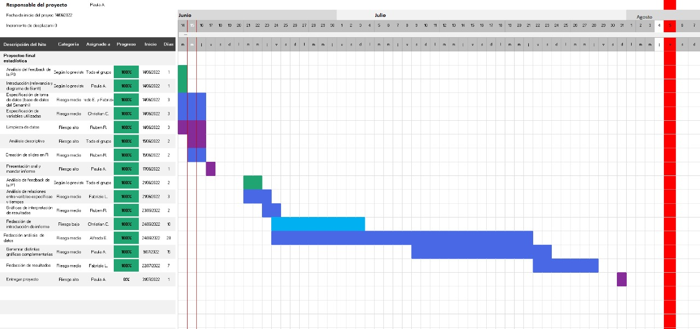

## <b style = color:#1C5F9E>Introducción:</b>

+ #### <b style = color:#1C5F9E>**Relevancia:**</b>
  - El tema elegido relaciona contaminantes ambientales en  distintas horas del día en la zona de Lima Metropolitana. Este tema es importante para el público debido a que algunos de estos contaminantes son un riesgo para la salud si se encuentra en exceso. Además, la presentación de estos datos fomenta conciencia ambiental.
  - El objetivo general es mostrar a los lectores los comportamientos de contaminantes que abundan en cada distrito de Lima Metropolitana en desde el 2014 al 2019 y, a la vez, mostrar el aumento o reducción de estos.
  - Los objetivos específicos son: Analizar si existe alguna relación entre las partículas PM10 y PM2.5, evaluar el año con menor y mayor tasa de contaminación en Lima Metropolitana, identificar y analizar el contaminante con mayor cantidad en el año que hubo mayor contaminación.

+ #### <b style = color:#1C5F9E>**Planificación (Diagrama de Gantt):**</b>
{width=1350 height=450}

## <b style = color:#1C5F9E>Datos:</b>

+ #### <b style = color:#1C5F9E>**Referencia:**</b>
  - [Base de datos](https://docs.google.com/spreadsheets/d/1dFhv_Qi3MiXIAnTtyDlFioBTnNLsWjXu/edit?usp=sharing&ouid=115924494288115927210&rtpof=true&sd=true) extraído de [datosabiertos.gob.pe](https://www.datosabiertos.gob.pe/dataset/datos-horarios-de-contanimantes-del-aire-en-lima-metropolitana-servicio-nacional-de)

+ #### <b style = color:#1C5F9E>**Recolección de datos:**</b>
  - Para el estudio se trabajará con una base de datos confiable publicada por el Servicio Nacional de Meteorología e Hidrología del Perú (Senamhi). Tiene como propósito generar y proveer información y conocimiento meteorológico, hidrológico y climático de manera confiable, oportuna y accesible en beneficio de la sociedad peruana.

+ #### <b style = color:#1C5F9E>**Población, muestra y muestreo:**</b>
  - La población a estudiar es la calidad del aire de Lima Metropolitana, lo cual abarca en todo este departamento. 
Nuestra muestra son los 10 distritos donde se tiene registro de los principales contaminantes atmosféricos existentes.
El tipo de muestreo a realizar es muestreo aleatorio estratificado, pues nuestra población depende del número de habitantes de un determinado

+ #### <b style = color:#1C5F9E>**Variables:**</b>

Las variables categóricas mencionadas no tiene sentido hacer operaciones con ellas ni usar descriptores numéricos. Además, estas variables nos servirán solo de identificación del tiempo y lugar, por ejemplo, hallar la cantidad de una sustancia en un cierto día, mes, año, estación y código de estación. La variable de Código de la estación y Estación nos ayuda para la identificación del lugar; mientras que la variable de Año, Mes, Día y Hora nos ayuda para la identificación del tiempo.

Con respecto a las variables numéricas nos ayudarán a saber la cantidad de cierto contaminante (unidades microgramos por metro cúbico [ug/m3]) que se encuentra en el ambiente. Al ser todos numéricos continuos será de mucha utilidad usar descriptores numéricos: El mínimo y máximo nos ayudará a saber el contaminante que más predomina en un lugar a un determinado tiempo al igual que el contaminante que menos predomina. Usaremos también la media o promedio para cada variable de los contaminantes para analizar qué tan grave es la contaminación de cada sustancia.

  - **Código de la estación** (Categórica Nominal): Serie de números que representan un distrito.
  - **Estación** (Categórica Nominal): Distrito y debe encontrarse en Lima Metropolitana.
  - **Año** (Categórica Nominal): Año en el cual se está haciendo la investigación, su restricción es los años entre 2014 y 2019. 
  - **Mes** (Categórica Nominal): Mes en el cual se está haciendo la investigación, su restricción es desde 1 al 12 (meses totales del año).
  - **Día** (Categórica Nominal): Día en el cual se está haciendo la investigación, su restricción es desde 1 al 31 (Mayor número de días en un mes).
  - **Hora** (Categórica Nominal): Hora en el cual se está haciendo la investigación, su restricción es desde 0 a 23 (horas totales en un día).

  - **PM 10** (Numérica Continua): Partículas pequeñas dispersas en la atmósfera que tienen un diámetro menor a 10 micrómetros. Además, los valores están medidos en unidades microgramos por metro cúbico (ug/m3), lo cual viene a ser la densidad. Su restricción es que debe tomar datos del 0 a 800 (rango realista de ug/m3 en el ambiente).
  - **PM 2.5** (Numérica Continua): Partículas pequeñas dispersas en la atmósfera que tienen un diámetro menor a 2.5 micrómetros. Además, los valores están medidos en unidades microgramos por metro cúbico (ug/m3), lo cual viene a ser la densidad. Su restricción es que debe tomar datos del 0 a 800 (rango realista de ug/m3 en el ambiente).
  - **SO2** (Numérica Continua): Es un gas incoloro, cuyo olor es irritante (Dióxido de azufre) y está presente en la atmósfera y es un contaminante . Su restricción es que debe tomar datos del 0 a 800 (rango realista de ug/m3 en el ambiente)
  - **NO2** (Numérica Continua): Es un gas tóxico y amarillento (Dióxido de nitrógeno) que está presente en la atmósfera y es un contaminante. Su restricción es que debe tomar datos del 0 a 800 (rango realista de ug/m3 en el ambiente). 
  - **O3** (Numérica Continua): Es un gas inestable (Ozono) que está presente en la atmósfera y es un contaminante. Su restricción es que debe tomar datos del 0 a 800 (rango realista de ug/m3 en el ambiente).
  - **CO** (Numérica Continua): Es un gas incoloro e inodoro (Monóxido de carbono) que está presente en la atmósfera y es un contaminante. Su restricción es que debe tomar datos del 0 a 800 (rango realista de ug/m3 en el ambiente).
  
  
  
Estas variables nos ayudarán a saber la cantidad de cierto contaminante (unidades microgramos por metro cúbico [ug/m3]) que se encuentra en el ambiente. Al ser todos numéricos continuos será de mucha utilidad usar descriptores numéricos: El mínimo y máximo nos ayudará a saber el contaminante que más predomina en un lugar a un determinado tiempo al igual que el contaminante que menos predomina. Usaremos también la media o promedio para cada variable de los contaminantes para analizar qué tan grave es la contaminación de cada sustancia.


```{r, echo = FALSE, eval=FALSE}
library(readr)
library(dplyr)
library(ggplot2)
# library(forcats)
```
+ #### <b style = color:#1C5F9E>**Limpieza de base de datos**</b>

1) Asignación a nuestra base de datos una variable
2) Eliminar las variables "Código", "Día" y "Hora"
3) Cambio de nombre de las variables
4) Actualizar el nombre de las variables
5) Filtrar los años para solo trabajar desde 2014 hasta 2019
```{r,echo = TRUE, eval=FALSE}
BD<-read_csv("base_datos.csv", col_types ="ccccccnnnnnn")
BD %>% select(2,3,4,7,8,9,10,11,12)->BD
BD %>% rename(Estacion = ESTACION,
  Anio = ANO,
  Mes = MES,
  PM_10 = `PM 10`,
  PM_25 = `PM 2.5`) -> DF1
names(DF1)
DF1<-DF1 %>% filter(Anio>=2014, Anio<2020)
```


## <b style = color:#1C5F9E>Análisis descriptivo:</b>

+ #### <b style = color:#1C5F9E>**Descriptores numéricos**</b>

Tabla de descriptores numéricos que serán de utilidad para tener una idea rápida y principal con respecto al comportamiento de los contaminantes. Posteriormente también se utilizarán los promedios y desviaciones estándares para casos hipoteticos en variables aleatorias. A simple vista se puede ver cómo el contaminante con mayor presencia es el CO y la partícula  PM 10.
```{r,echo = FALSE, eval=TRUE}
Table <- read.csv("base_datos.csv")
Table <-   dplyr::filter(Table, ANO>2013,ANO<2020)
dplyr::select(Table, 7:12)->Table

dn <- matrix(0, 4, 6)
colnames(dn) <- c("PM_10", "PM_25", "SO2", "NO2","O3","CO")
rownames(dn) <- c("Promedio", "Min", "Max","Desviación estándar")
#Promedio
for(i in 1:6){dn[1:1,i]<- mean(Table[1:509640,i],na.rm = TRUE)}
#Mínimo
for(i in 1:6){dn[2:2,i]<- min(Table[1:509640,i],na.rm = TRUE)}
#Máximo
for(i in 1:6){dn[3:3,i]<- max(Table[1:509640,i],na.rm = TRUE)}
for(i in 1:6){dn[4:4,i]<- sd(Table[1:509640,i],na.rm = TRUE)}
dnn <-data.frame(dn)
dnn
#rmarkdown::paged_table(dnn)
```

+ #### <b style = color:#1C5F9E>**Descriptores gráficos-columnas**</b>
Análisis a base de las cantidades de contaminantes por estación donde se pueden obtener conclusiones gráficas a simple vista.

```{r,echo = FALSE, eval=TRUE}

df_SO2 = DF1 %>%
  group_by(Estacion) %>%
  summarize(value = sum(SO2,na.rm=TRUE))
df_SO2 %>%
ggplot(aes(x = fct_reorder(Estacion, value), y = value)) +
  geom_col(fill=c("#88CCEE", "#CC6677", "#DDCC77", "#117733", "#332288", "#AA4499", 
                             "#44AA99", "#999933", "#882255", "#661100" ))  + coord_flip() + labs(title= "Cantidad de SO2 por estación", y = "Cantidad SO2 (ug/m3)",x="Estación")


```

```{r,echo = FALSE, eval=TRUE}
df_NO2 = DF1 %>% group_by(Estacion) %>% summarize(value =sum(NO2,na.rm=TRUE))

df_NO2 %>%ggplot(aes(x = fct_reorder(Estacion, value), y = value)) +
  geom_col(fill=c("#88CCEE", "#CC6677", "#DDCC77", "#117733", "#332288", "#AA4499", 
                             "#44AA99", "#999933", "#882255", "#661100" ))  + coord_flip() + labs(title= "Cantidad de NO2 por estación",y = "Cantidad NO2 (ug/m3)",x="Estación")
```

```{r,echo = FALSE, eval=TRUE}
df_O3 = DF1 %>% group_by(Estacion) %>% summarize(value =sum(O3,na.rm=TRUE))

df_O3 %>%ggplot(aes(x = fct_reorder(Estacion, value), y = value)) +
  geom_col(fill=c("#88CCEE", "#CC6677", "#DDCC77", "#117733", "#332288", "#AA4499", 
                             "#44AA99", "#999933", "#882255", "#661100" ))  + coord_flip() + labs(title= "Cantidad de O3 por estación",y = "Cantidad O3 (ug/m3)",x="Estación")
```

```{r,echo = FALSE, eval=TRUE}

df_CO = DF1 %>% group_by(Estacion) %>% summarize(value =sum(CO,na.rm=TRUE))

df_CO %>%ggplot(aes(x = fct_reorder(Estacion, value), y = value)) +
  geom_col(fill=c("#88CCEE", "#CC6677", "#DDCC77", "#117733", "#332288", "#AA4499", 
                             "#44AA99", "#999933", "#882255", "#661100" ))  + coord_flip() + labs(title= "Cantidad de CO por estación",y = "Cantidad CO (ug/m3)",x="Estación")
```
##### <b style = color:#000000>**Distrito que presenta mayor tipo de contaminante:**</b>
    - SO2: Santa Anita
    - NO2: Ate
    - O3: Campo de Marte
    - CO: Ate

##### <b style = color:#000000>**Distrito que presenta menor tipo de contaminante:**</b>
    - SO2: San Martín de Porres
    - NO2: Carabayllo
    - O3: Puente Piedra
    - CO: Campo de Marte

## <b style = color:#1C5F9E>Análisis de objetivos</b>

+ #### <b style = color:#1C5F9E>**Patrones - Relación entre PM 10 y PM 2.5**</b>

Utilizamos el gráfico de gg_smooth para poder analizar si las partículas presentan algún tipo de correlación notoria, la cual en caso se encuentre, también utilizaremos la correlación de Pearson para poder hallar el nivel de correlación específica, aquello teniendo en cuenta la variación de datos.
<center>


{width=350 height=450}


</center>

```{r,echo = FALSE, eval=TRUE}
suppressWarnings(print(ggplot(DF1,aes(x=PM_10, y=PM_25)) + geom_point() + geom_smooth() + labs(x="PM10 (ug/m3)",y="PM25 (ug/m3)",title = "Correlación entre PM10 y PM25") + theme(plot.title.position = "plot")))

cor.test(DF1$PM_10,DF1$PM_25,method = "pearson")
```
+ #### <b style = color:#1C5F9E>**Año con mayor contaminación**</b>

Gracias al gráfico de columnas se puede ver claramente cómo el año con mayor contaminación total fue en 2018, según estudios incluso en ese año Lima se posicionó en la 22 ciudad que emitía mayor contaminación.

```{r,echo = FALSE, eval=TRUE}
#Separando la DF1 por año
df2014<-DF1 %>% filter(Anio==2014)
df2015<-DF1 %>% filter(Anio==2015)
df2016<-DF1 %>% filter(Anio==2016)
df2017<-DF1 %>% filter(Anio==2017)
df2018<-DF1 %>% filter(Anio==2018)
df2019<-DF1 %>% filter(Anio==2019)
#Sumando cada contaminante por año
SO2_anios<-c(
  colSums(df2014[,6], na.rm = TRUE),
  colSums(df2015[,6], na.rm = TRUE),
  colSums(df2016[,6], na.rm = TRUE),
  colSums(df2017[,6], na.rm = TRUE),
  colSums(df2018[,6], na.rm = TRUE),
  colSums(df2019[,6], na.rm = TRUE))

NO2_anios<-c(
  colSums(df2014[,7], na.rm = TRUE),
  colSums(df2015[,7], na.rm = TRUE),
  colSums(df2016[,7], na.rm = TRUE),
  colSums(df2017[,7], na.rm = TRUE),
  colSums(df2018[,7], na.rm = TRUE),
  colSums(df2019[,7], na.rm = TRUE))

O3_anios<-c(
  colSums(df2014[,8], na.rm = TRUE),
  colSums(df2015[,8], na.rm = TRUE),
  colSums(df2016[,8], na.rm = TRUE),
  colSums(df2017[,8], na.rm = TRUE),
  colSums(df2018[,8], na.rm = TRUE),
  colSums(df2019[,8], na.rm = TRUE))

CO_anios<-c(
  colSums(df2014[,9], na.rm = TRUE),
  colSums(df2015[,9], na.rm = TRUE),
  colSums(df2016[,9], na.rm = TRUE),
  colSums(df2017[,9], na.rm = TRUE),
  colSums(df2018[,9], na.rm = TRUE),
  colSums(df2019[,9], na.rm = TRUE))

#creando un vector de años en rango de 2014-2019
Anios<-c(2014:2019)
#Calculando el total de contaminante por año
cts_anio<-data.frame(SO2_anios,NO2_anios,O3_anios,CO_anios)
total<-c(rowSums(cts_anio[,1:4]))
cts_anio<-data.frame(Anios,SO2_anios,NO2_anios,O3_anios,CO_anios,total)
ggplot(cts_anio, aes(Anios,total))+
geom_col(fill=c("#88CCEE", "#CC6677", "#DDCC77", "#117733", "#332288","#AA4499"))+ 
labs(x="Años",y="Cantidad total de contaminantes (ug/m3)",title = "Contaminacion por año en (ug/m3)") + theme(plot.title.position = "plot")
```

+ #### <b style = color:#1C5F9E>**Contaminante en mayor cantidad en año encontrado**</b>

Mediante el gráfico se puede apreciar a simple vista cómo el CO es el contamminante predominante en el ambiente, aquello es debido a que las emisiones de monoxido de carbono suelen darse por numerosos medios de transporte y empresas que tienen como sede principal el departamento de Lima.
```{r,echo = FALSE, eval=TRUE}
cantidad<-cts_anio %>% filter(Anios==2018)
cantidad%>% select(2:5)->cts_2018
cantidad<-t(cts_2018)
cts<-c("SO2","NO2", "O3","CO")
cts_2018<-data.frame(cts,cantidad)
#v %>% barplot()
ggplot(cts_2018, aes(cts,cantidad))+
geom_col(fill=c("#88CCEE", "#CC6677", "#DDCC77", "#117733"))+ 
labs(x="Contaminantes",y="Cantidad total de contaminantes (ug/m3)",title = "Cantidad de cada contaminantes en 2018") + theme(plot.title.position = "plot")
```


## <b style = color:#1C5F9E>Análisis probabilístico</b>

En base a la información provista por el Servicio Nacional de Meteorología e Hidrología del Perú (SENAMHI) y el Instituto Nacional de Estadística e Informática (INEI) se tiene establecidos distintos rangos de microgramos por metro cúbico no dañinos para la salud ciudadana, dado a que un aumento incontrolado de estos contaminantes puede causar un rango de consecuencias negativas variando desde infecciones respiratorias hasta posibles casos de cáncer al pulmón debido a largos períodos de exposición.

Teniendo en cuenta las medidas de calidad del aire establecidas y los resultados obtenidos por el análisis probabilístico, es pertinente tratar con posibles casos con el contaminante que se encuentra en mayor cantidad, el CO. Aquel contaminante puede causar tanto severas intoxicaciones en el cuerpo humano o incluso desmayos y muertes. 

Por otro lado también es pertinente trabajar con posibles casos involucrando las partículas, haciendo énfasis en la partícula 10 dado a que esta es la más dañina para la salud humana, causando severos problemas cómo 

Como punto final, el SENAMHI cuenta con 10 estaciones en las cuales se realiza dichas actividades como el monitoreo de la calidad del aire. Es por ello que analizaremos los respectivos, en especial en los que hay mayor contaminación


#### <b style = color:#1C5F9E>**Análisis de modelos de variables aleatorias continuas**</b>


+ ##### <b style = color:#000000>**Distribución normal**</b>

Las partículas e tamaño 10 ug/m3 son un posible riesgo al igual que el resto de contaminantes, por ello el SENAMHI implementó un rango de 100 ug/m3 máximo para mantener la calidad del ambiente. Calcular la probabilidad de que la cantidad de PM 10 esté dentro del rango establecido como apto, en otras palabras, que no representa riesgo para la salud, sabiendo que la media de PM10 es 80.25 y su desviación estándar es 52.78749.

 - x=100(acumulado)
 - promedio=80.25
 - desviación estándar=52.78

$P(X<=100)$

```{r,echo = FALSE, eval=TRUE}
pnorm(100,mean=80.25,sd=52.78749)
```
```{r,echo = FALSE, eval=TRUE}
curve(dnorm(x,80.25,52.78),xlim=c(0,200), xlab="Dato de PM 10(ug/m3)",ylab="Probabilidad",main="Función de Densidad de PM 10")
abline(v=100,col="#332288")
```

Justificación:
Es importante saber qué tan contaminado están dichos lugares con esa partícula, ya que el PM10 tiene efectos negativos en los pulmones como dificultad para respirar e irritación en las vías respiratorias, así que saber dicha probabilidad nos ayudaría saber qué tan vulnerable puede estar la gente de ese lugar.Analizando el resultado obtenido, se puede concluir que la probabilidad de que los niveles de PM 10 se mantengan en su rango es mayor del 60%.

+ ##### <b style = color:#000000>**Distribución uniforme**</b>


El rango el contaminante CO va aproximadamente entre 900 a 6000, sin embargo el SENAMHi decretó que para tener una calidad de aire estable se debe encontrar en un máximo de 3000 ug/m3, calcular la probabilidad de que en el ambiente limeño haya menos de la cantidad establecida.

 - x=3000 (acumulado)
 - mínimo=900
 - máximo=6000

$P(X<=3000)$

```{r,echo = FALSE, eval=TRUE}
punif(3000,min=900,max=6000,lower.tail = TRUE)
```
```{r,echo = FALSE, eval=TRUE}
curve(dunif(x,900,6000),from=0,to=7000, xlab="Dato de CO 10(ug/m3)",ylab="Probabilidad",main="Función de Densidad de CO")
abline(v=3000,col="#332288")
```

Justificación:
Es de vital importancia saber cómo se estan presentando los niveles de partícula 10 en el ambiente, dado que en Lima son las partículas que se encuentran en mayor cantidad y generan riesoas a largo plazo para la salud al acumularse en los pulmones o tractos respiratorios.
En base al dato obtenido, se ve que solo hay probailidad deñ 40% de que no pase los rangos de calidad ambiental, por lo que debemos implementar nuevas medidas pra lograr ello.

+ ##### <b style = color:#000000>**Distribución exponencial**</b>

Como si vió anteriormente, las particulas también presentan un grave riesgo para la salud ciudadana, siendo las más dañina de ellas la PM 2.5 dado a su diminuto tamaño, teniendo en cuenta que su media es de 26,84 aproximadamente, calcule caso hipotéico donde los niveles sobrepasen los 30 ug/m3 y pongan en riesgo la salud de los ciudadanos.

 - x=30(acumulado)
 - lambda=1/26.84

$P(26,84<=x)$

```{r,echo = FALSE, eval=TRUE}
pexp(30,1/26.84, lower.tail=F)
```
```{r,echo = FALSE, eval=TRUE}
curve(dexp(x,rate=1/26.84,log=F),from=0,to=50, xlab="Dato de PM 2.5(ug/m3)",ylab="Probabilidad",main="Función de Densidad de PM 2.5")
abline(v=30,col="#332288")
```
Justificación: La partícula 2.5 presenta el mayor riesgo entre todas las partículas para el bienestar ciudadano, por ello es de vital importancia saber cuando se encuentra sobrepasando del rango establecido para poder implementar soluciones para remediarlo. En base al dato obtenido de que la probabilidad que pase el nivel establecido de 32% nos da la idea que Lima se esta manteniendo al rango pero sería bueno implementar ciertas soluciones o concientizar a la población para que este nivel no aumente.


#### <b style = color:#1C5F9E>**Probabilidades de ocurrencia**</b>

##### <b style = color:#000000>**1) Hallar la probabilidad de que el PM10 supere el 250 en el distrito de ATE**</b>


```{r,echo = FALSE, eval=FALSE}
nrow(DF1 %>% filter(Estacion == "ATE", PM_10 >250))
table(DF1$Estacion[DF1$Estacion=="ATE"])
```

```{r,echo = FALSE, eval=TRUE}
PO1<-nrow(DF1 %>% filter(Estacion == "ATE", PM_10 >250))/table(DF1$Estacion[DF1$Estacion=="ATE"])
paste("La probabilidad es de", round(PO1,4))
paste("En porcentaje es ", round(PO1*100,2),"%")
```

Justificación:
Es importante analizar distritos cuyas cantidades de partículas contaminantes sean mayores que los estándares de calidad de aire, ya que pueden haber veces en el que esté menos contaminado o más de lo común, así que hallar su probabilidad de que la cantidad de PM10 sea mayor que los estándares ayudará a saber qué tan común es que ATE esté muy contaminado con dicha partícula


##### <b style = color:#000000>**2) Hallar la probabilidad de que el CO y NO2 superen el rango permitido en Campo de Marte en el año 2018**</b>


$P(CO|CampoMarte2018)*P(NO2|CampoMarte2018)$

- Rango permitido de CO en Campo de Marte: 0 a 800
- Rango permitido de NO2 en Campo de Marte: 0 a 800

```{r,echo = FALSE, eval=FALSE}
DF1 %>% filter(Estacion == "CAMPO DE MARTE",Anio=="2018") %>% arrange(CO) #Mínimo 
DF1 %>% filter(Estacion == "CAMPO DE MARTE",Anio=="2018") %>% arrange(desc(CO)) #Máximo
DF1 %>% filter(Estacion == "CAMPO DE MARTE",Anio=="2018") %>% arrange(NO2) #Mínimo 
DF1 %>% filter(Estacion == "CAMPO DE MARTE",Anio=="2018") %>% arrange(desc(NO2)) #Máximo

```

```{r}
PO2<-(1-punif(800,min=23.0,max=3065.9))*(1-punif(800,min=0.1,max=79.4))
paste("La probabilidad es de", round(PO2,4))
paste("En porcentaje es ", round(PO2*100,2),"%")
```
Justificación: Es de gran importancia ver los comportamientos y posibles relaciones entre contaminantes en distintas zonas, especialmente ne las más y menos contaminadas. Teniendo el cuenta el resultado 0 realizando un rápido análisis se puede concluir que este se dio debido a que se registró que el gas NO2 tiene como máximo, según la base de datos, 79.4 ug/m3 en Campo de Marte el año 2018.


##### <b style = color:#000000>**3) Hallar la probabilidad de que el CO supere los 800 ug/m3 en Campo de Marte en el año 2018**</b>


```{r}
PO3<-1-punif(800,min=23.0,max=3065.9)
paste("La probabilidad es de", round(PO3,4))
paste("En porcentaje es ", round(PO3*100,2),"%")
```
Justificación:
Además de analizar los distritos más contaminados por los 2 gases contaminantes que más abundan, es importante también analizar distritos que se consideren los menos contaminados, en este caso Campo de Marte. Tomando en cuenta el resultado, la probabilidad de que supere los 800 es 74.47% lo que quiere decir que la probabilidad es muy alta. 


## <b style = color:#1C5F9E>Bibliografía</b>

- Dante, E., Bonett, C., Aguilar, A. S., Franco, J. R., Castillo, M. F., & Chihuán, J. V. (2020). Gob.Pe. https://www.inei.gob.pe/media/MenuRecursivo/boletines/10-informe-tecnico-estadisticas-ambientales-set-2020.pdf

- Metropolitana, L. (n.d.). Gob.Pe. Retrieved June 23, 2022, from https://www.senamhi.gob.pe/load/file/03201SENA-64.pdf

- ©PRTR-España. (n.d.). Partículas PM10. Ministerio de Agricultura, alimentación y medio ambiente. Retrieved June 23, 2022, from https://prtr-es.es/particulas-pm10,15673,11,2007.html

- INEI (2020) Estadísticas Ambientales https://www.inei.gob.pe/media/MenuRecursivo/boletines/10-informe-tecnico-estadisticas-ambientales-set-2020.pdf
  
- Triada (n.d.) https://www.triada.com.pe/noticias/vivir-frente-al-campo-de-marte-mejora-tu-salud/

- Decreto Supremo (2001) https://www.minam.gob.pe/calidadambiental/wp-content/uploads/sites/22/2013/10/D.S.-N%c2%ba-074-2001-PCM.pdf


