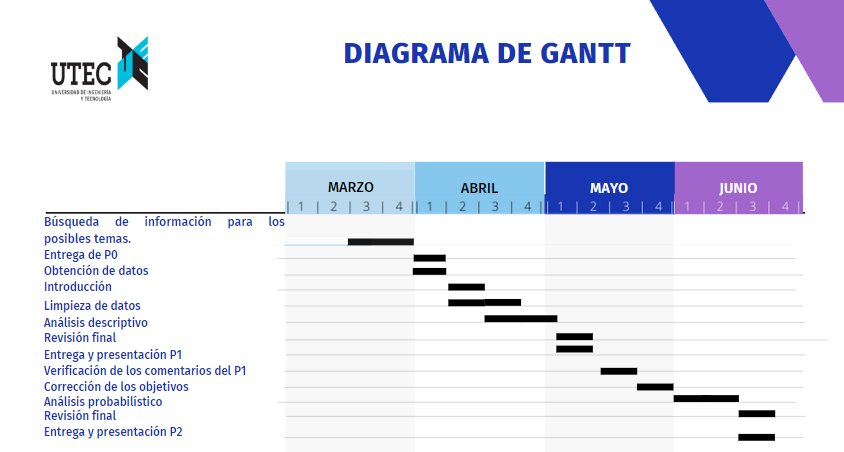

# Introducción

## Importancia y justificación

Se desea explorar una serie de ordenadores portátiles (laptops), para mostrar la importancia de hacerse de conocimientos al obtener o comprar una laptop, ya que según su características pueden realizar o no, ciertas tareas, por lo que suelen variar también los precios de estos equipos. Muchas personas compran equipos pero al no tener en cuenta lo antes mencionado pueden terminar estafados, malgastar su dinero o no estar satisfechos con el producto.

El uso de las laptops ya eran importantes por su autonomía y portabilidad pero después por las circunstancias de la pandemia, ha crecido su importancia para distintas actividades remotas, lo que hace necesario que las personas conozcan que tipo de laptop les beneficiaría para realizar sus actividades.

## Objetivos

### Objetivo Principal

Brindar a la población estudiantil algunas nociones básicas sobre las especificaciones que deben tomar en cuenta al adquirir una laptop y además determinar que marca tiene mayor demanda en el mercado.

### Objetivos Sescundarios

- Analizar las  características de las diferentes marcas de laptops.

- Diferenciar las características de las diferentes marcas y obtener cual de las marcas es la que tiene mayor demanda.

## Planificación

### Factibilidad

<p style="text-align: justify;">Para validar la factibilidad del proyecto en el tiempo, se realizó un diagrama de Gantt con las actividades a realizarse y sus tiempos límite.</p>  

</br>
```{r echo=FALSE, out.width = '100%'}

```
</br>

# Datos

## Proceso de recolección de datos

### ¿Cómo se obtuvieron los datos?

Los datos se obtuvieron de Kaggle, parte de un proyecto de Google LLC para formar una comunidad de científicos de datos y aprendizaje donde se publica diverso material incluido dataset de uso libre a todo aquel que desee trabajarlo, estos están calificados de acuerdo a su confiabilidad.

### ¿Por qué se hizo de esa forma?

Usamos la mencionada página de dataset por el tema de proyecto, tendríamos que buscar distintos ordenadores portátiles que se vendan en tiendas y recolectar toda la información necesaria para nuestras variables completando una considerable muestra, al no tener los recursos para realizar ese proyecto, recurrimos a buscar una base de datos de confianza que es la que estamos trabajando.

### Condiciones para realizar la recolección y estrategia para la muestra

Como antes mencionada, la página que es constantemente revisada, da puntaje de confiabilidad de los dataset de distintos temas que son subidos a la plataforma, por eso decidimos en lo posible buscar una base de datos que mayor puntuada estuviera y que al mismo tiempo pudiera satisfacer nuestras necesidades de variables, a parte nos brindaba ciertos datos que de otra manera nos hubiésemos resultado difícil conseguir como la puntuación del público a un producto, también que nos diera una base diversa de distintas marcas de ordenadores los cuales hacen sus diferentes versiones de equipos para según apreciaciones en las variables que se explicará más adelante trabajar la data.

## Población, muestra y muestreo

### Población de estudio

En este caso nuestra población de estudio serán los ordenadores portátiles.

### Unidad muestral

Distintas laptops de marcas variadas que fabrican este producto obtenida de un dataset, el tamaño de la muestra obtenida inicialmente es de 896 ejemplares.

### Tipo de muestreo

Muestreo aleatorio simple. Mediante una aplicación de extensión de chrome que permite el análisis de distintas páginas web se recopiló la información sobre los distintos equipos por marcas de ordenador, información luego evaluada con puntuación máxima.

## Variables

### Variables totales del dataset obtenido

| Nombre de Variable | Descripción | Tipo de Variable |
|---------------------|--------|-------------|
| brand | marca de laptop | categórica nominal |
| model | modelo de laptop | categórica nominal |
| processor_brand | marca del procesador | categórica nominal |
| processor_name | nombre del procesador | categórica nominal |
| processor_gnrt | generación de procesador| categórica nominal |
| ram_gb | capacidad del procesador | numérica continua |
| ram_type | tipo de ram | categórica nominal |
| ssd | capacidad disco solido | numérica discreta |
| hdd | capacidad disco duro | numérica discreta |
| os | sistema operativo | categórica nominal |
| os_bit | arquitectura del sistema| categórica nominal |
| graphic_car_gb | capacidad de la tarjeta gráfica | númerica discreta |
| weight | peso de laptop | numérica continua |
| display_size | tamaño de pantalla| numérica continua |
| warranty | garantia | categórica nominal |
| touchscreen | pantalla táctil | categórica nominal |
| msoffice | msoffice instalado| categórica nominal |
| latest_price | último precio de lista | numérica continua |
| old_price | anterior precio de lista | numérica continua |
| discount | descuento| numérica continua |
| star_rating | promedio de valoración | numérica continua |
| ratings | rating o valoración | numérica discreta  |
| reviews | número de reseñas| numérica discreta |

### Variables que se escogen para el desarrollo de la investigación

| Nombre de Variable | Descripción | Tipo de Variable |
|---------------------|--------|-------------|
| brand | marca de laptop | categórica nominal |
| processor_brand | marca del procesador | categórica nominal |
| processor_name | nombre del procesador | categórica nominal |
| ram_gb | capacidad del procesador | numérica continua |
| ssd | capacidad disco solido | numérica discreta |
| hdd | capacidad disco duro | numérica discreta |
| os_bit | arquitectura del sistema| categórica nominal |
| graphic_car_gb | capacidad de la tarjeta gráfica | numérica discreta |
| warranty | garantía | categórica nominal |
| touchscreen | pantalla táctil | categórica nominal |
| old_price | anterior precio de lista | numérica continua |
| discount | descuento | numérica continua |
| star_rating | promedio de valoración | numérica continua |

## Limpieza de base de datos

### Base de datos

Instalación de las librerías, si no posee la librería, solo debe retirar el símbolo de numeral de adelante de la librería a descargar.

```{r}
#install.packages("readr")
#install.packages("dplyr")
#install.packages("vctrs")
#install.packages("stringr")
#install.packages("ggplot2")
#install.packages("plyr")
#install.packages("crosstable")
```

Cargar las librerías para leer los datos.

```{r}
library(readr)
library(dplyr)
library(vctrs)
library(stringr)
library(ggplot2)
library(plyr)
library(crosstable)
```

Base de datos laptops:

```{r}
laptops <- read_csv("Laptop.csv")
```

Revisión de variables de la base de datos laptops para ver si R las describe correctamente.

```{r}
glimpse(laptops)
```

Tomamos las variables de trabajo:

```{r}
laptops %>% select(brand,processor_brand,processor_name,ram_gb,ssd,hdd,os_bit,graphic_card_gb,warranty,Touchscreen,old_price,discount,star_rating) -> my_laptops
```

Revisión de agrupación de las variables seleccionadas. 

```{r}
glimpse(my_laptops)
```

Hacemos un resumen de datos de la variables para el correcto seguimiento de nuestra base de datos.

```{r}
summary(my_laptops)
```

Limpiamos los valores que no vayamos a trabajar explicados en las partes de variables.

Después convertiremos a factor y a numérico las variables según correspondan.

Revisaremos los datos dentro la variable marca del procesador mediante la función unique().

```{r}
unique(my_laptops$processor_brand)
```

Encontramos datos más allá del tipo de marca de procesador a trabajar, entonces buscaremos solo quedar con la marca "Intel" y "AMD".

```{r}
my_laptops <- my_laptops[my_laptops$processor_brand=="Intel" | my_laptops$processor_brand=="AMD",]
```

Visualizaremos que ahora solo estamos quedando con las marcas que deseábamos.

```{r}
unique(my_laptops$processor_brand)
```

Revisión de la marca nombre del procesador para conocer las categorías.

```{r}
unique(my_laptops$processor_name)
```

Ubicamos los indices en número de muestra sobre datos con error de guardado, obtendremos dicho indice mediante la función which().

```{r}
a <- which(my_laptops$processor_name == "i7")
b <- which(my_laptops$processor_name == "i5")
c <- which(my_laptops$processor_name == "Core m3")
d <- which(my_laptops$processor_name == "5")
a
b
c
d
```

Luego hacemos un bucle for() aprovechando las variables en las que han sido guardados los índices para hacer la normalización de los datos en la variable.

```{r}
for (i in a) { my_laptops$processor_name[i] = "Core i7" }
for (i in b) { my_laptops$processor_name[i] = "Core i5" }
for (i in c) { my_laptops$processor_name[i] = "Core i3" }
for (i in d) { my_laptops$processor_name[i] = "Ryzen 5" }
```

Ahora vamos a quedarnos como dato dentro de la variable nombre de procesador solo a los tipos de procesador del tipo Core identificado para Intel y Ryzen identificado para AMD.

```{r}
my_laptops <- my_laptops[my_laptops$processor_name == "Core i3" | my_laptops$processor_name == "Core i5" | my_laptops$processor_name == "Core i7" | my_laptops$processor_name == "Core i9" | my_laptops$processor_name == "Ryzen 3" | my_laptops$processor_name == "Ryzen 5" | my_laptops$processor_name == "Ryzen 7" | my_laptops$processor_name == "Ryzen 9",]
```

Observamos el trabajo completo de la normalización y limpieza de datos de la variable.

```{r}
unique(my_laptops$processor_name)
```

Revisión de la variable tipo de arquitectura de software, coincide en lo esperado, la producción del día de hoy solo se da en 64 y 32 bit para marcas de confianza que brindan el producto.

```{r}
unique(my_laptops$os_bit)
```

Revisión de la variable garantía, se ve como lo esperado, se ve representado la variable categórica por unos números.

```{r}
unique(my_laptops$warranty)
```

Un buen producto siempre lleva una garantía del mismo, si no posee, por razones lógicas se pierde la confianza. Procedemos a eliminar los equipos que no tengan nada de garantía.

```{r}
my_laptops <- my_laptops[my_laptops$warranty > 0,]
```

Ahora mediante las funciones head() y tail() con 15 muestras observaremos con detenimiento a la variable ssd, pues esta quedando como requisito tener este sistema como requisito.

```{r}
head(my_laptops, n = 15)
tail(my_laptops, n = 15)
```

Observamos laptops que no poseen ssd, por lo que también las debemos de aislar de nuestra base de datos.

```{r}
my_laptops <- my_laptops[my_laptops$ssd > 0,]
```

```{r}
my_laptops <- my_laptops[my_laptops$old_price > 0,]
```

```{r}
my_laptops <- my_laptops[my_laptops$star_rating > 0,]
```

Hacemos otra observación nuevamente, en donde se puede apreciar las variables ahora en orden.

```{r}
head(my_laptops,n=15)
tail(my_laptops,n=15)
```

Usamos la función ncol() y nrow() para ver con exactitud la cantidad de variables y muestras con las que estamos trabajando.

```{r}
ncol(my_laptops)
nrow(my_laptops)
```

Este final de normalización de datos nos da a entender de que la muestra aleatoria simple hizo su trabajo y por tantas páginas web observadas que existen, por las razones de la investigación es posible llegar a estos datos.

Las variables según R no coinciden con las analizadas así que utilizaremos la función factor() para cambiar a categórica y la función is.numeric() para cambiar a variable numérica como corresponda.

```{r}
my_laptops$brand <- factor(my_laptops$brand)
my_laptops$processor_brand <- factor(my_laptops$processor_brand)
my_laptops$processor_name <- factor(my_laptops$processor_name)
my_laptops$os_bit <- factor(my_laptops$os_bit)
my_laptops$warranty <- factor(my_laptops$warranty)
my_laptops$Touchscreen <- factor(my_laptops$Touchscreen)
my_laptops$ram_gb <- as.numeric(my_laptops$ram_gb)
```

Ahora observaremos que están correctamente establecido el tipo de variable.

```{r}
glimpse(my_laptops)
```

### Limpieza de la base de datos de valores faltantes

Revisamos que cantidad de datos faltantes existe en la base de datos.

```{r}
NAs<-sum(is.na(my_laptops))
NAs
```

Obtenemos la cantidad de observaciones incompletas en la base de datos.

```{r}
sum(!complete.cases(my_laptops))
```

Hacemos el calculo correspondiente a la cantidad de datos faltantes en porcentaje en el dataset.

```{r}
round((NAs*100/(nrow(my_laptops)*ncol(my_laptops))),2)
```

Observaremos la cantidad de datos faltantes por variable, y en que grado les afecta.

```{r}
colSums(is.na(my_laptops))
```

De lo visto anteriormente, los datos faltantes son 13 y es extremadamente pequeño en la base de datos, también componen a un única muestra de las 340 obtenidas.

Debido a lo anteriormente explicado, es pertinente eliminar la observación incompleta pues no nos dará información alguna de ninguna de las variables. El resultado lo guardaremos en el dataframe que tendrá de nombre **"my_laptops_utec"**.

```{r}
my_laptops_utec <- my_laptops[complete.cases(my_laptops),]
```

Ahora el dataframe resultante se muestra a continuación.

```{r}
head(my_laptops_utec,n=15)
head(my_laptops_utec,n=15)
```

# Análisis Descriptivo

## Variables Categóricas

### Variable Marca de la Computadora Portátil

Tenemos la función table() para ver la cantidad de veces que aparece un elemento. Esta función la usaremos para ver la moda.

```{r}
cat("------------------------------------------------------ Moda ------------------------------------------------------")
table(my_laptops_utec$brand)
```

Podemos apreciar por parte de ASUS gran parte de las observaciones aunque hay números algo cercanos, por lo que usaremos un gráfico de barras para apreciar como se comporta la moda, usaremos el gráfico de barras por que es una cantidad de variables significativas.

```{r}
ggplot(my_laptops_utec, aes(x = brand)) +                     
  geom_bar(width=0.5, colour="black", fill="salmon") +      
  labs(x="Marca de Laptop",y= "Frecuencia")  +                            
  ylim(c(0,100)) +                           
  ggtitle("Diagrama de barras")  +
  theme_bw(base_size = 12) +                  
  geom_text(aes(label=..count..), stat='count',
            position=position_dodge(0.9), vjust=-0.5, size=5.0) + 
  facet_wrap(~"Variable Marca")
```

Podemos observar una multimodalidad por parte de las marcas ASUS, DELL, HP y Lenovo, esto demuestra también representatividad en la base de datos, y se puede verificar en forma empírica, si nosostros nos acercamos a emporios comerciales donde vendadn ordenadores portátiles, estos cuatro antes mencionados serán los más abundantes.

Ahora para ver el tipo de procesador, veremos en primera instancia la moda.

```{r}
cat("--- Moda ---")
table(my_laptops_utec$processor_brand)
```

De forma empírica también podemos comprobar la supremacía de los dos procesadores vistos, Intel y AMD en cualquier emporio comercial que visites.

```{r}
ggplot(my_laptops_utec, aes(x = processor_brand)) +                     
  geom_bar(width=0.3, colour="blue", fill="salmon") +      
  labs(x="Tipo de procesador",y= "Frecuencia")  +                            
  ylim(c(0,300)) +                           
  ggtitle("Diagrama de barras")  +
  theme_bw(base_size = 12) +                  
  geom_text(aes(label=..count..), stat='count',
            position=position_dodge(0.9), vjust=-0.5, size=5.0) + 
  facet_wrap(~"Variable Tipo de Procesador")
```

El core i para Intel y Ryzen para AMD son las marcas diseñadas para alto rendimiento que tienen, apreciaremos la moda en esta variable.

```{r}
cat("----------------------------- Moda -----------------------------")
table(my_laptops_utec$processor_name)
```

Se ve a primera vista unimodalidad solo para esta variable.

```{r}
ggplot(my_laptops_utec, aes(x = processor_name)) +                     
  geom_bar(width=0.5, colour="blue", fill="green") +      
  labs(x="Nombre del procesador",y= "Frecuencia")  +                            
  ylim(c(0,150)) +                           
  ggtitle("Diagrama de barras")  +
  theme_bw(base_size = 12) +                  
  geom_text(aes(label=..count..), stat='count',
            position=position_dodge(0.9), vjust=-0.5, size=5.0) + 
  facet_wrap(~"Variable Nombre de Procesador")
```

Ya se nota de manera sencilla que esta variable es unimodal para el core i5 dentro de los suyos y unimodal en Ryzen 5 para su mismo grupo.

Observación de la moda de arquitectura de sistemas operativos.

```{r}
cat("- Moda -")
table(my_laptops_utec$os_bit)
```

Esta bien pronunciada la moda a arquitecturas de 64 bits. Usaremos un diagrama de barras para observar la diferencia de cantidad de datos distintos en la variable. El uso del color ha sido por por contraste, se vea la gran cantidad de uno sobre el otro.

```{r}
ggplot(my_laptops_utec, aes(x = os_bit)) +                     
  geom_bar(width=0.4, colour="black", fill="grey") +      
  labs(x="Arquitectura del Sistema Operativo",y= "Frecuencia")  +                            
  ylim(c(0,350)) +                           
  ggtitle("Diagrama de barras")  +
  theme_bw(base_size = 12) +                  
  geom_text(aes(label=..count..), stat='count',
            position=position_dodge(0.9), vjust=-0.5, size=5.0) + 
  facet_wrap(~"Variable Arquitectura del Sistema Operativo")
```

Observación de la moda para la variable garantía.

```{r}
cat("--- Moda ---")
table(my_laptops_utec$warranty)
```

Esta de forma de representación numérica, pero la moda sin duda se encuentra en un año de garantía que es tomada como una garantía normal. Usaremos un gráfico de barras pues a pesar de tener pocas variables hay valores bastantes tan pequeños que en otros gráficos como el paste se vería como valor despreciable.

```{r}
ggplot(my_laptops_utec, aes(x = warranty)) +                     
  geom_bar(width=0.5, colour="black", fill="grey") +      
  labs(x="Nombre del procesador",y= "Frecuencia")  +                            
  ylim(c(0,350)) +                           
  ggtitle("Diagrama de barras")  +
  theme_bw(base_size = 12) +                  
  geom_text(aes(label=..count..), stat='count',
            position=position_dodge(0.9), vjust=-0.5, size=5.0) + 
  facet_wrap(~"Variable Nombre de Procesador")
```

Revisión de la varible funcionalidad táctil

```{r}
cat("- Moda -")
table(my_laptops_utec$Touchscreen)
```

Solo tenemos dos opciones que aunque es unimodal, ambas tienen valor significativo. Esto coincide con observación empírica de centros de venta de laptops. En este caso usaremos un gráfico de pastel por las pocas variables, los colores usados serán por contraste, el hecho es por el beneficio de las funcionalidades táctiles que recién esta siendo apreciada.

```{r}
ggplot(my_laptops_utec, aes(x = Touchscreen)) +                     
  geom_bar(width=0.5, colour="blue", fill="skyblue") +      
  labs(x="Funcionalidad Táctil",y= "Frecuencia")  +                            
  ylim(c(0,350)) +                           
  ggtitle("Diagrama de barras")  +
  theme_bw(base_size = 12) +                  
  geom_text(aes(label=..count..), stat='count',
            position=position_dodge(0.9), vjust=-0.5, size=5.0) + 
  facet_wrap(~"Variable Funcionalidad Táctil")
```

## Funciones de Correcta Definición

Estableceremos las funciones de cuartiles y otros según las definiciones correctas.

### Cálculo de la mediana

```{r}
medians <- function(variables) {
   utec <- sort(variables)
   len <- length(utec)
   if (len == 0) { return(NA) }
   if (len %% 2 != 0) { return( utec[round(len/2)+1] ) }
   return( c(utec[len/2],utec[(len/2)+1]) )
}
```

### Calculo de los cuartiles

Usa la función anterior para el cálculo del segundo cuartil.

```{r}
cuartils <- function(variables,number) {
   if(number == 2) { medians(variables) }
   utec <- sort(variables)
   len <- length(utec)
   if (len == 0) { return(NA) }
   position <- (number/4) * len
   if (number == 0) { return( utec[1] ) }
   if (number == 4) { return( utec[position] ) }
   if (len %% 4 != 0) {
      if (position > round(position)) { return( utec[round(position)+1] ) }
      return ( utec[round(position)] )
   }
   return( c(utec[position],utec[position+1]) )
}
```

### Rango

```{r}
ranks <- function(variables) {
   return (max(variables)-min(variables))
}
```

### Rango Intercuartil

```{r}
ranks_intercuartils <- function(variables) {
   first <- cuartils(variables,1)
   third <- cuartils(variables,3)
   return (third - first)
}
```

## Variables Numéricas

### Variable Capacidad de la memoria Ram

```{r}
element <- my_laptops_utec$ram_gb
```

Descriptores de Posición

```{r}
cat(" Media  -------> ",round(mean(element),2),"\n")
cat(" Minimo  ------> ",min(element),"\n")
cat(" 1er Cuartil  -> ",cuartils(element,1),"\n")
cat(" Mediana  -----> ",cuartils(element,2),"\n")
cat(" 3er Cuartil  -> ",cuartils(element,3),"\n")
cat(" Máximo  ------> ",max(element),"\n")
```

```{r}
cat("----  Moda  ----")
table(my_laptops_utec$ram_gb)
```

Descriptores de dispersión

```{r}
cat(" Rango  ---------------> ",ranks(element),"\n")
cat(" Varianza  ------------> ",var(element),"\n")
cat(" Desviación estándar  -> ",sd(element),"\n")
cat(" Rango Intercuartil  --> ",ranks_intercuartils(element),"\n")
```

De nuestros descriptores numéricos podemos apreciar de nuestros valores mínimo y máximo tenemos un rango pequeño en los cuales llegamos a tener casos atípicos al tener muy poca presencia, analizando los cuartiles, del primero al segundo tiene un 25% de los elementos con valor igual a 8GB, siendo este muy abundante siendo corroborado por la moda en la cual esos 8GB tiene 222 casos, también esto se visualiza en la desviación estándar, ya que al ser baja nos esta indicando aglomeración de los datos cerca a la media, nuestra varianza la podemos considerar pequeña, no se mueve tanto la media de cada valor de nuestra variable.

```{r}
cantidad <- factor(element)

ggplot(my_laptops_utec, aes(x = cantidad)) +                     
  geom_bar(width=0.5, colour="blue", fill="white") +      
  labs(x="Memoria Ram",y= "Frecuencia")  +                            
  ylim(c(0,250)) +                           
  ggtitle("Diagrama de barras")  +
  theme_bw(base_size = 12) +                  
  geom_text(aes(label=..count..), stat='count',
            position=position_dodge(0.9), vjust=-0.5, size=5.0) + 
  facet_wrap(~"Variable Capacidad de Memoria Ram")

```

La gráfica nos ayuda a corroborar el análisis de los datos y así será para cada variable.

### Variable de Capacidad de memoria de SSD

```{r}
element <- my_laptops_utec$ssd
```

Descriptores de Posición

```{r}
cat(" Media  -------> ",round(mean(element),2),"\n")
cat(" Minimo  ------> ",min(element),"\n")
cat(" 1er Cuartil  -> ",cuartils(element,1),"\n")
cat(" Mediana  -----> ",cuartils(element,2),"\n")
cat(" 3er Cuartil  -> ",cuartils(element,3),"\n")
cat(" Máximo  ------> ",max(element),"\n")
```

```{r}
cat("----  Moda  ----")
table(my_laptops_utec$ssd)
```

Descriptores de dispersión

```{r}
cat(" Rango  ---------------> ",ranks(element),"\n")
cat(" Varianza  ------------> ",var(element),"\n")
cat(" Desviación estándar  -> ",sd(element),"\n")
cat(" Rango Intercuartil  --> ",ranks_intercuartils(element),"\n")
```

Tenemos un rango muy amplio, lo que nos va diciendo que varía en bastante proporción los datos, ahora el segundo y tercer cuartil tienen el mismo valor, por lo que aquel valor, se aglomera una buena parte en dicha posición, más no la mayoría la muestra pues la desviación estándar posee valor muy grande, la varianza también nos esta indicando que los valores de la variable están muy dispersos de la media, la moda es los 512 GB y queda extremadamente atípico el poseer 2048 GB de almacenamiento SSD.

```{r}
cantidad <- factor(element)

ggplot(my_laptops_utec, aes(x = cantidad)) +                     
  geom_bar(width=0.5, colour="blue", fill="green") +      
  labs(x="Memoria SSD",y= "Frecuencia")  +                            
  ylim(c(0,250)) +                           
  ggtitle("Diagrama de barras")  +
  theme_bw(base_size = 12) +                  
  geom_text(aes(label=..count..), stat='count',
            position=position_dodge(0.9), vjust=-0.5, size=5.0) + 
  facet_wrap(~"Variable Capacidad de Memoria SSD")
```

### Variable de almacenamiento HDD

```{r}
element <- my_laptops_utec$hdd
```

Descriptores de Posición

```{r}
cat(" Media  -------> ",round(mean(element),2),"\n")
cat(" Minimo  ------> ",min(element),"\n")
cat(" 1er Cuartil  -> ",cuartils(element,1),"\n")
cat(" Mediana  -----> ",cuartils(element,2),"\n")
cat(" 3er Cuartil  -> ",cuartils(element,3),"\n")
cat(" Máximo  ------> ",max(element),"\n")
```

```{r}
cat("-- Moda --")
table(my_laptops_utec$hdd)
```

Descriptores de dispersión

```{r}
cat(" Rango  ---------------> ",ranks(element),"\n")
cat(" Varianza  ------------> ",var(element),"\n")
cat(" Desviación estándar  -> ",sd(element),"\n")
cat(" Rango Intercuartil  --> ",ranks_intercuartils(element),"\n")
```

Los valores desde el mínimo hasta el tercer cuartil posee un valor de cero y cosa que también se aprecia en el rango intercuartil, la moda lo corrobora mostrando que posee casi toda la muestra pero esta aglomeración esta alejada de la media y es lo que nos indica la desviación estándar, la varianza nos dice de la misma forma que nuestros valores están completamente alejados de la media en forma muy colosal.

```{r}
cantidad <- factor(element)

ggplot(my_laptops_utec, aes(x = cantidad)) +                     
  geom_bar(width=0.3, colour="black", fill="orange") +      
  labs(x="Memoria SSD",y= "Frecuencia")  +                            
  ylim(c(0,350)) +                           
  ggtitle("Diagrama de barras")  +
  theme_bw(base_size = 12) +                  
  geom_text(aes(label=..count..), stat='count',
            position=position_dodge(0.9), vjust=-0.5, size=5.0) + 
  facet_wrap(~"Variable Capacidad de Memoria SSD")
```

### Variable capacidad de tarjeta gráfica.

```{r}
element <- my_laptops_utec$graphic_card_gb
```

Descriptores de Posición

```{r}
cat(" Media  -------> ",round(mean(element),2),"\n")
cat(" Minimo  ------> ",min(element),"\n")
cat(" 1er Cuartil  -> ",cuartils(element,1),"\n")
cat(" Mediana  -----> ",cuartils(element,2),"\n")
cat(" 3er Cuartil  -> ",cuartils(element,3),"\n")
cat(" Máximo  ------> ",max(element),"\n")
```

```{r}
cat("------  Moda  ------")
table(my_laptops_utec$graphic_card_gb)
```

Descriptores de dispersión

```{r}
cat(" Rango  ---------------> ",ranks(element),"\n")
cat(" Varianza  ------------> ",var(element),"\n")
cat(" Desviación estándar  -> ",sd(element),"\n")
cat(" Rango Intercuartil  --> ",ranks_intercuartils(element),"\n")
```

Los valores no están tan alejados pues el rango es 8, que se puede considerar bastante pequeño; desde el mínimo hasta la mediana se tiene valor de cero, la desviación estándar nos indica que dicha aglomeración esta muy cerca de la media; la varianza nos da información de poca separación de los datos de la media; nuestra variable en conforme su valor aumenta, su cantidad presente suele disminuir.

```{r}
cantidad <- factor(element)

ggplot(my_laptops_utec, aes(x = cantidad)) +                     
  geom_bar(width=0.5, colour="blue", fill="pink") +      
  labs(x="Memoria SSD",y= "Frecuencia")  +                            
  ylim(c(0,300)) +                           
  ggtitle("Diagrama de barras")  +
  theme_bw(base_size = 12) +                  
  geom_text(aes(label=..count..), stat='count',
            position=position_dodge(0.9), vjust=-0.5, size=5.0) + 
  facet_wrap(~"Variable Capacidad de Memoria SSD")
```

### Variable Precio Original

El valor de una rupia india es de 20,24 INR equiparable a 1 PEN (sol peruano).

```{r}
element <- my_laptops_utec$old_price/20.24
```

Descriptores de Posición

```{r}
cat(" Media  -------> ",round(mean(element),2),"\n")
cat(" Minimo  ------> ",min(element),"\n")
cat(" 1er Cuartil  -> ",cuartils(element,1),"\n")
cat(" Mediana  -----> ",cuartils(element,2),"\n")
cat(" 3er Cuartil  -> ",cuartils(element,3),"\n")
cat(" Máximo  ------> ",max(element),"\n")
```

```{r}
cat("-----------------------------------------------------------  Moda  -----------------------------------------------------------")
table(my_laptops_utec$old_price)
```

Descriptores de dispersión

```{r}
cat(" Rango  ---------------> ",ranks(element),"\n")
cat(" Varianza  ------------> ",var(element),"\n")
cat(" Desviación estándar  -> ",sd(element),"\n")
cat(" Rango Intercuartil  --> ",ranks_intercuartils(element),"\n")
```

En nuestros valores de precio, estos tienen amplios margenes de diferencia notorios en el rango, nuestra varianza al ser demasiado grande nos da a entender que nuestros precios son extremadamente disparejos y bastante alejados de la media, la desviación estándar al estar demasiado alta, nos brinda la información de casi ninguna aglomeración, el rango intercuartil en esta variable es bastante amplia, por lo que tenemos datos muy variados, esto también lo podemos verificar a partir de la moda, la cual es practicamente muy diversa en elemento por elemento, por lo que lo mejor sería agrupar en intervalos.

```{r}
boxplot(element, horizontal = TRUE, main = "Boxplot de la variable 'Precio'",xlab="Precio Original (Soles)",pch=20,border=rgb(0,0,0,0.2))
```

```{r}
Precio <- element
hist(Precio, breaks = 15, main = "Variable Precio", ylab = "Frecuencia")
```

En intervalos de 1000 soles podemos verificar que gran parte de los precios rondan de 2000 a 4000 soles con atípicos de grandes precios.

#### Variable Descuento

```{r}
element <- my_laptops_utec$discount
```

Descriptores de Posición

```{r}
cat(" Media  -------> ",round(mean(element),2),"\n")
cat(" Minimo  ------> ",min(element),"\n")
cat(" 1er Cuartil  -> ",cuartils(element,1),"\n")
cat(" Mediana  -----> ",cuartils(element,2),"\n")
cat(" 3er Cuartil  -> ",cuartils(element,3),"\n")
cat(" Máximo  ------> ",max(element),"\n")
```

```{r}
cat("-----------------------------------------------------------  Moda  -----------------------------------------------------------")
table(my_laptops_utec$discount)
```

Descriptores de dispersión

```{r}
cat(" Rango  ---------------> ",ranks(element),"\n")
cat(" Varianza  ------------> ",var(element),"\n")
cat(" Desviación estándar  -> ",sd(element),"\n")
cat(" Rango Intercuartil  --> ",ranks_intercuartils(element),"\n")
```

En esta variable, tenemos un rango considerable como algo pequeño, la varianza si llega a indicar que nuestro valores están bastante alejados de la media, la desviación es pequeña, por lo que existe una aglomeración cerca a la media, o bastante cantidad de elementos están muy cerca a ella, el rango intercuartil corrobará este al ser bastante pequeño, los valores deben repetirse en varias posiciones.

```{r}
boxplot(my_laptops_utec$discount, horizontal = TRUE, main = "Boxplot de la variable 'Descuento'",xlab="Descuento (%)",pch=20,border=rgb(0,0,0,0.2))
```

### Variable Ranking de Estrellas.

```{r}
element <- my_laptops_utec$star_rating
```

Descriptores de Posición

```{r}
cat(" Media  -------> ",round(mean(element),2),"\n")
cat(" Minimo  ------> ",min(element),"\n")
cat(" 1er Cuartil  -> ",cuartils(element,1),"\n")
cat(" Mediana  -----> ",cuartils(element,2),"\n")
cat(" 3er Cuartil  -> ",cuartils(element,3),"\n")
cat(" Máximo  ------> ",max(element),"\n")
```

```{r}
cat("----------------------------------------  Moda  ----------------------------------------")
table(my_laptops_utec$star_rating)
```

Descriptores de dispersión

```{r}
cat(" Rango  ---------------> ",ranks(element),"\n")
cat(" Varianza  ------------> ",var(element),"\n")
cat(" Desviación estándar  -> ",sd(element),"\n")
cat(" Rango Intercuartil  --> ",ranks_intercuartils(element),"\n")
```

Aquí vemos que es unimodal a primera vista para la valoración en intervalos de entero a entero de 4 a 5. Y nuestra hipótesis fue correcta, gran parte de las valoraciones son muy positivas, pero la escasez de baja puntuación no la podemos eliminar pues nos hablará de baja calidad de ciertos productos.

```{r}
boxplot(my_laptops_utec$star_rating, horizontal = TRUE, main = "Boxplot de la variable 'Puntuación de Estrellas'",xlab="Puntuación de Estrellas",pch=20,border=rgb(0,0,0,0.2))
```

El boxplot confirma lo pensado, suele haber una alta satisfacción de productos pero sería bueno observar que productos tienen bajo reconocimiento.

# Análisis Bivariado

Hacemos un análisis de correlación grupal para nuestras variables númericas.

```{r}
cor(select_if(my_laptops_utec, is.numeric))
```

Nos esta indicando que existe pocas variables que tienen una correlación de algo débil a fuerte.

## Variable Memoria SSD vs Memoria Ram

```{r}
plot(my_laptops_utec$ssd,my_laptops_utec$ram_gb)
```
```{r}
cor(my_laptops_utec$ram_gb,my_laptops_utec$ssd)
```

Una correlación algo débil, pero aún así tiene un pequeño pronunciamiento, de todas formas, no podemos definir una relación directa entre ambas variables

## Variable Precio Original vs Variable Memoria de Tarjeta Gráfica

```{r}
plot(my_laptops_utec$old_price,my_laptops_utec$graphic_card_gb)
```

```{r}
cor(my_laptops_utec$old_price,my_laptops_utec$graphic_card_gb)
```

Esta comparación aunque algo también más marcada como se ve en el gráfico, aún hay valores que la mantienen algo débil a la correlación, por lo que nos deja a tampoco poder darle una relación directa segura a las variables.

## Variable Memoria Ram vs Variable Precio Original

```{r}
plot(my_laptops_utec$ram_gb,my_laptops_utec$old_price)
```

```{r}
cor(my_laptops_utec$ram_gb,my_laptops_utec$old_price)
```

En esta se presenta un buen crecimiento hacia arriba, bastante proporcional y el seguimiento de una diagonal, debido a la correlación la cual aquí ya es bastante fuerte, se puede establecer una relación directa en el cual se puede interpretar que mientras la cantidad de memoria aumente, el costo de laptop también lo hará.

## Variable Memoria SSD vs Variable Precio Original

```{r}
plot(my_laptops_utec$ssd,my_laptops_utec$old_price)
```

```{r}
cor(my_laptops_utec$ssd,my_laptops_utec$old_price)
```

La gráfica nos presenta una buena nacionalización, una correlación fuerte númerica, por lo que hay una relación directa proporcional del incremento de la memoria de almacenamiento SSD y el precio del producto.

# Análisis Probabilístico

## Distribución binomial

### Variable Precio

Convertimos los precios de Rupias indias a Soles peruanos.

```{r}
inr_to_pen <- 0.048
cambio <- my_laptops_utec$old_price*inr_to_pen
```

Calculemos la probabilidad de que menos de 40 laptops de una muestra de 100, estas valgan menos de 3000 soles.

```{r}
p <- sum(cambio<3000)/nrow(my_laptops_utec)
cat(" Caso de éxito de un costo menor a 4000 soles -> ",p)
```

```{r}
probabilidad <- 0
for (i in 0:39) {
   probabilidad <- probabilidad + dbinom(i,100,p)
}
cat(" Menos de 39 de 100 con precio de S/.4000 ->",probabilidad)
```

### Variable Marca de Laptop

Calculemos la probabilidad de que más de 70 laptops de una muestra de 130, no sean de la marca HP.

```{r}
p <- sum(my_laptops_utec$brand!="HP")/nrow(my_laptops_utec)
cat(" Caso de éxito de una marca de laptop distinta a 'HP' -> ",p)
```

```{r}
probabilidad <- 0
for (i in 71:130) {
   probabilidad <- probabilidad + dbinom(i,130,p)
}
cat(" Más de 70 de 130 sean distintas de la marca HP ->",probabilidad)
```

## Distribución geométrica

### Funcionalidad de Pantalla Táctil

Calculemos la probabilidad de que a la 13va laptop revisada esta recién tenga funcionalidad de pantalla táctil.

La probabilidad de encontrar marcas que no sean Asus hasta el quinto intento.

```{r}
p <- sum(my_laptops_utec$Touchscreen=="Yes")/nrow(my_laptops_utec)
cat(" Caso de éxito de una laptop con funcionalidad de pantalla táctil -> ",p)
```

Nuestra probabilidad se realiza sobre 12 casos fallidos y el siguiente con éxito.

```{r}
dgeom(x = 12,prob = p)
```

### Variable Nombre de Procesador

Calculamos la probabilidad de que a la 25va laptop revisada esta recién sea Core i7 o Ryzen 5. Son casos independientes.

```{r}
p <- (sum(my_laptops_utec$processor_name=="Core i7")+sum(my_laptops_utec$processor_name=="Ryzen 5"))/nrow(my_laptops_utec)
cat(" Caso de éxito de una laptop que tenga un procesador con Core i7 o Ryzen 5 -> ",p)
```

La probabilidad haber fallado 24 veces en la busqueda hasta encontrar en la 25va vez un Core i7 o un Ryzen 5.

```{r}
dgeom(x = 24,prob = p)
```

## Distribución de Poison

### Variable de Tipo de Procesador

```{r}
muestra <- sum(my_laptops_utec$processor_brand=="AMD")
cat(" Cantidad de laptops de procesador AMD en la muestra ->",muestra)
```

En una tienda de venta de laptops. La venta de 87 laptops con procesador AMD se venden en 2 días. En 16 días, calcule la probabilidad de vender entre 700 y 750 laptops con el procesador mencionado.

Lambda
2 días --> Vende 87
16 días --> Vende 696

```{r}
probabilidad <- 0
for (i in 701:749) {
   probabilidad <- probabilidad + dpois(i,696)
}
cat("La probabilidad de vender 701 a 749 laptops con procesador AMD ->",probabilidad)
```

### Variable Memoria de Tarjeta Gráfica

```{r}
muestra <- sum(my_laptops_utec$graphic_card_gb==6)
cat(" Cantidad de laptops con memoria de tarjeta gráfica de 6GB ->",muestra)
```

En una fábrica se ensamblan 14 laptops con tarjeta gráfica de 6GB en 5 días. En 20 días, calcule la probabilidad de que se ensamblen de 10 a 35 laptops con la memoria de tarjeta mencionada.

Lambda

5 días --> Producen 14
20 días --> Producen 56

```{r}
probabilidad <- 0
for (i in 10:35) {
   probabilidad <- probabilidad + dpois(i,56)
}
cat("La probabilidad de emsablaje de 10 a 35 laptops con memoria de Tarjeta gráfica de 6GB ->",probabilidad)
```

# Variables Aleatorias

Vemos la cantidad de elementos totales, solo para recordar que usaremos a nuestra muestra como el experimento aleatorio.

```{r}
nrow(my_laptops_utec)
```

## Variable Descuento

Calcular la probabilidad de obtener entre 26 y 57 considerando a nuestra muestra como el experimento aleatorio, a sus datos como el dominio y el rango como sus cantidad de apariciones en la data.

```{r}
cantidad <- 0
for (i in 26:57) {
   cantidad <- cantidad + sum(my_laptops_utec$discount==i)/nrow(my_laptops_utec)
}
cantidad
```

## Variable Garantía

De la misma forma que lo anterior tomando a la muestra de experimento aleatorio, el dominio y rango igualmente al caso anterior, ahora ver la probabilidad de obtener uno o tres años de garantía. Recordando que es caso independiente. 

```{r}
cantidad <- sum(my_laptops_utec$warranty=="2")/nrow(my_laptops_utec) + sum(my_laptops_utec$warranty=="3")/nrow(my_laptops_utec)
cantidad
```

## Variable Ranking de Estrellas

El experimento aleatorio será diseñado al igual que los ejemplos anteriores, ahora ver la probabilidad de encontrar calificaciones de estrellas por encima del 3.0 hasta llegar al 4.0.

```{r}
ranking <- my_laptops_utec$star_rating*10 
```

Estamos transformado los decimales a enteros para conveniencia de un recorrido del ciclo for, no alterará el experimento pues la respuesta de la función seguirá siendo la misma.

```{r}
cantidad <- 0
for (i in 31:40) {
   cantidad <- cantidad + sum(ranking==i)/nrow(my_laptops_utec)
}
cantidad
```
