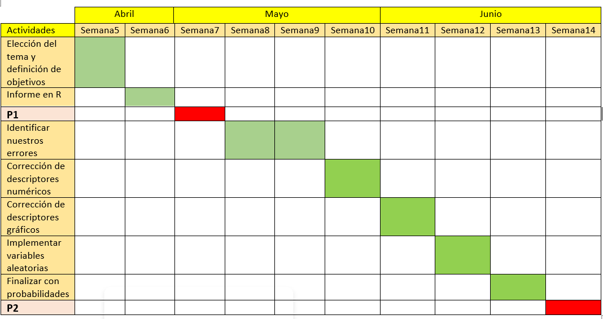
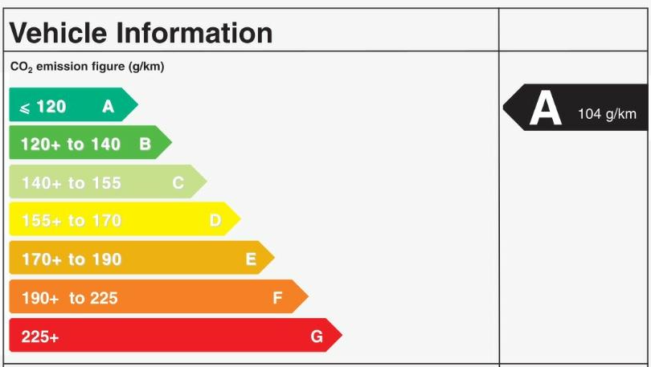

### Librerías a utilizar

```{r}
library(readr)
library(dplyr)
library(ggplot2)
```

# Introducción

Se posee una base de datos sobre las emisiones de dióxido de carbono (CO~2~) emitidas por vehículos circulantes dentro del territorio canadiense, con la finalidad de obtener la relación entre las características de los vehículos y la cantidad  de dióxido de carbono  que estos emiten dentro del territorio canadiense. Ademas, este estudio estadístico puede ser de mucha ayuda para las organizaciones que buscan reducir el cambio climático, aplicando conclusiones y dando soluciones dentro de nuestro país, ya que los modelos de vehículos expuestos en el archivo presente son modelos comúnmente vendidos en el Perú.

## Objetivo:

Determinar cuáles de las variables influyen en la emisión de dióxido de carbono a través de la base de datos automovilístico del país de Canadá, utilizando el tipo de combustible que se utiliza y las 4 marcas automovilísticas más utilizadas en Canadá.

Para ello, se requiere los siguientes objetivos específicos:

### Objetivos específicos: 

- Determinar la marca de auto que produce una mayor emisión de CO~2~.

- Encontrar la relación entre el el nivel de emisión de CO~2~ y el consumo de combustible en los diversos recorridos.

- Determinar la probabilidad de que el CO~2~ emitido al ambiente supere el valor normal aceptable.

- Determinar en que recorrido la probabilidad de que el consumo de combustible sea mayor de los estándares.

### Planificación

Para realizar este trabajo, se dividió las tareas de la siguiente manera:



### Datos

El proceso de recolección de datos se dio a partir de una base de datos [Emisiones de Dioxido de Carbono por Vehiculos en Canada](https://www.kaggle.com/datasets/debajyotipodder/co2-emission-by-vehicles), en dicha base de datos se encuentra las siguientes variables descriptivas:

### Variables:
+-----------------------+-------------+--------------+-----------------+
| Variable              | Clase       | Tipo         |Restricción      |              
+-----------------------+-------------+--------------+-----------------+
| Compañía              | categórica  | nominal      |Tipo carácter    |              
+-----------------------+-------------+--------------+-----------------+
| Clase                 | Categórica  | nominal      |Tipo carácter    |              
+-----------------------+-------------+--------------+-----------------+
| Tamaño de la maquina  | Numérica    | continua     |Natural positivo |                  
+-----------------------+-------------+--------------+-----------------+
| Cilindros             | Numérica    | discreta     |Entero positivo  |     
+-----------------------+-------------+--------------+-----------------+
| Transmisión           | Categórica  | nominal      |Tipo carácter    |
+-----------------------+-------------+--------------+-----------------+
|Tipo de combustible    | Categórica  | nominal      |X,Y,E,D y N      |              
+-----------------------+-------------+--------------+-----------------+
| Consumo en ciudad de  |Numérica     | continua     |Racional         |              
| combustible (L/100 km)|             |              |Positivo         |              
+-----------------------+-------------+--------------+-----------------+
|Consumo de combustible |Numérica     | continua     |Racional         |              
|en carretera (L/100 km)|             |              |Positivo         |              
+-----------------------+-------------+--------------+-----------------+
| Peine de consumo de   |Numérica     | continua     |Racional         |              
| combustible (L/100 km)|             |              |Positivo         |              
+-----------------------+-------------+--------------+-----------------+
| Peine de consumo de   |Numérica     | continua     |Racional         |              
| combustible (mpg)     |             |              |Positivo         |              
+-----------------------+-------------+--------------+-----------------+
| Emisiones de CO2(g/km)|Numérica     | continua     |Racional Positivo|              
+-----------------------+-------------+--------------+-----------------+

### Poblacion:

- Vehículos circulantes en Canadá.

### Muestra: 

- Vehículos circulantes en Canadá seleccionados de forma aleatoria.

### Muestreo: 

- Base de datos recolectada por el gobierno canadiense a partir de una toma de muestreo aleatorio.

```{r}
c1 <- read_csv("co2.csv")
View(c1)
```

# 1. Limpieza de datos

Para realizar nuestra investigación, lo que debemos hacer es seleccionar los carros de marcas: CHEVROLET, TOYOTA, HYUNDAI Y KIA. Para ello, se realizó lo siguiente:

```{r}
c2 <- filter(c1,c1$Make == "TOYOTA" |c1$Make == "HYUNDAI"|c1$Make == "KIA"|c1$Make=="CHEVROLET")
c2 <-filter(c2, c2$`Vehicle Class`=="COMPACT"|c2$`Vehicle Class`=="FULL-SIZE"|c2$`Vehicle Class`=="MID-SIZE"|c2$`Vehicle Class`== "SUV - STANDARD"| c2$`Vehicle Class`=="SUV - SMALL")
View(c2)
```
Luego, se eliminó el modelo de los autos.Para ello se hizo lo siguiente:
```{r}
c2 <- select(c2, -Model)
```
Ahora, con la base de datos formada, se realizó la observación de casos completos.
```{r}
nrow(c2) - sum(complete.cases(c2))
```

Con ello, se obtuvo que todos los datos están completos en el data frame.Por último, se realizará un cambio en el nombre de las variables de la base de datos, c2. Para ello, se realizó lo siguiente:
```{r}
rename(c2, "Marca" = 'Make',"Clase" = 'Vehicle Class',"Tamaño del motor(L)" = 'Engine Size(L)',"Cilindros" = 'Cylinders',"Transmision" = 'Transmission',"Combustible" = 'Fuel Type',"Consumo en ciudad(L/100km)" = 'Fuel Consumption City (L/100 km)',"Consumo en carretera(L/100km)"='Fuel Consumption Hwy (L/100 km)',"Consumo total(L/100 km)"='Fuel Consumption Comb (L/100 km)',"Emision de CO2 (g/km)"='CO2 Emissions(g/km)', "Consumo de combustible(mpg)" = 'Fuel Consumption Comb (mpg)') -> c2
```

Además, para laborar con las variables Clase y transmisión, se hará un renombre a los datos de las variables clase y transmisión.

Para la variable Clase, se renombró lo siguiente:
```{r}
c2$Clase[c2$Clase=="COMPACT"] <- "Compacto"
c2$Clase[c2$Clase=="FULL-SIZE"] <- "Grande"
c2$Clase[c2$Clase=="MID-SIZE"] <- "Intermedio"
c2$Clase[c2$Clase=="SUV - SMALL"] <- "Mediano"
c2$Clase[c2$Clase=="SUV - STANDARD"] <- "Promedio"
```

Para la variable Transmisión, se renombró lo siguiente:
```{r}
c2$Transmision[c2$Transmision=="A4"] <- "A"
c2$Transmision[c2$Transmision=="A5"] <- "A"
c2$Transmision[c2$Transmision=="A6"] <- "A"
c2$Transmision[c2$Transmision=="A8"] <- "A"
c2$Transmision[c2$Transmision=="A9"] <- "A"
c2$Transmision[c2$Transmision=="A10"] <- "A"
c2$Transmision[c2$Transmision=="AM6"] <- "AM"
c2$Transmision[c2$Transmision=="AM7"] <- "AM"
c2$Transmision[c2$Transmision=="AS5"] <- "AS"
c2$Transmision[c2$Transmision=="AS6"] <- "AS"
c2$Transmision[c2$Transmision=="AS7"] <- "AS"
c2$Transmision[c2$Transmision=="AS8"] <- "AS"
c2$Transmision[c2$Transmision=="AS9"] <- "AS"
c2$Transmision[c2$Transmision=="AV"] <- "AV"
c2$Transmision[c2$Transmision=="AV10"] <- "AV"
c2$Transmision[c2$Transmision=="AV6"] <- "AV"
c2$Transmision[c2$Transmision=="AV7"] <- "AV"
c2$Transmision[c2$Transmision=="M5"] <- "M"
c2$Transmision[c2$Transmision=="M6"] <- "M"
```

Para renombrar los tipos de combustibles:

```{r}
c2$Combustible[c2$Combustible=="D"] <- "Diesel"
c2$Combustible[c2$Combustible=="Z"] <- "G. premium"
c2$Combustible[c2$Combustible=="X"] <- "G. regular"
c2$Combustible[c2$Combustible=="E"] <- "Etanol"
c2$Combustible[c2$Combustible=="N"] <- "Gas natural"
```

-funciones a usar:
```{r}
r <- function(x){
    return(round(x,digits = 2)) #funcion para redondear a 2 decimales
}
```

```{r}
cv <- function(x, ...){
  return(sd(x, ...)/mean(x, ...))
}
```
```{r}
mode <- function(x) {
   return(as.numeric(names(which.max(table(x)))))
}
```

Con estos cambios, se empezará a trabajar con la base de datos.

### Análisis descriptivo

Para esta sección, se realizará el análisis de cada variable y luego se buscará la relación entre estas. 
Para ello, se hará uso de los correspondientes descriptores tanto numéricos como gráficos.

# 2. Descriptores numericos y descriptores gráficos

### Variable "Marca"

Esta variable se refiere a la marca del vehículo. Para ello se encuentran los vehículos de marca HYUNDAI, KIA, TOYOTA Y CHEVROLET.

```{r}
table(c2$Marca)
```
```{r}
r(prop.table(table(c2$Marca))*100)

```

Con respecto a la variable "Marca", tenemos el siguiente gráfico:

```{r}
barplot(prop.table(table(c2$Marca)), main = "Marcas de vehículos", xlab="Marca de vehículo", ylab = "Frecuencia relativa", ylim = c(0.00,0.40),col= c("blue","red","green","orange"))
```

Se obtiene CHEVROLET es la marca con mayor cantidad de vehículos, ocupando un 34.13% del total con 316 vehículos, le sigue HYUNDAI con un 22.25%, KIA con un 18.68% y TOYOTA con un 24.95%.

### Variable "Clase"

Esta variable nos indica el tamaño del vehículo.

```{r}
table(c2$Clase)
```
```{r}
r(prop.table(table(c2$Clase))*100)
```

Con respecto a la variable "Clase de vehículos", tenemos el siguiente gráfico:

```{r}
barplot(prop.table(table(c2$Clase)),  main = "Clase de vehículos", xlab = "Clase de vehículo", ylab = "Frecuencia relativa", col=c("orange","yellow","blue","red","green")) 

```

Se obtiene que el tamaño del vehículo más usado es el SSM(vehículo mediano), ocupando un 26.89% del total con 249 vehículos y el modelo menos usado es el FS(vehículo grande), ocupando un 12.31% del total con 114 vehículos.

### Variable "Transmision"

La variable transmisión indica la forma en que se lleva el movimiento a las llantas. 

Donde las letras y el número significan lo siguiente:

-A: Automático

-AM: Manual automatizado

-AV: Vehículos autónomos

-AS: Automático con cambio seleccionado

-M: Manual

-Número: Número de marchas (del 3-10).

```{r}
table(c2$Transmision)
```
```{r}
r(prop.table(table(c2$Transmision))*100)
```

Con respecto a la variable "Transmisión", tenemos el siguiente gráfico:

```{r}
barplot(prop.table(table(c2$Transmision)), main = "Transmisión", xlab = "Transmisión", ylab = "Frecuencia relativa",col=c("orange","yellow","blue","red","green"))
legend(x = "topright", legend = c("Automático", "Manual automatizado","Autónomo","Automático seleccionado","Manual"), fill = c("orange","yellow","blue","red","green"), 
       title = "Leyenda")
```

Se obtiene que el vehículo de transmisión que ocupa un mayor porcentaje de total es el AS(Automático con cambio seleccionado)con un 46.22% del total con 428 vehículos y el vehículo de transmisión menos usado es el AM(manual automatizado) con un 4.86% del total con 45 vehículos.

### Variable "Combustible"

Esta variable nos indica el tipo de combustible utilizado.

Donde:

-G. regular: Gasolina regular.

-G. premium: Gasolina premium.

-Gas nat.: Gas natural.

```{r}
table(c2$Combustible)
```
```{r}
r(prop.table(table(c2$Combustible))*100)
```

Con respecto a la variable "Tipo de combustible", tenemos el siguiente gráfico:

```{r}
barplot(prop.table(table(c2$Combustible)), main = "Tipo de combustible", xlab = "Combustible", ylab="Frecuencia relativa", ylim = c(0.00,1.00), col=c("black","green2","gray","brown","blue4"))
```

Se obtiene que el combustible mas usado entre los vehículos es la gasolina regular con un 89.31% del total en 827 vehículos y el combustible menos usado gas natural con un 0.11% del total en solo 1 vehículo.

### Variable "Tamaño del motor(L)"

Esta variable indica el tamaño del motor (L) del vehículo.

```{r}
r(mode(c2$`Tamaño del motor(L)`)) #moda
r(mean(c2$`Tamaño del motor(L)`)) #media
r(median(c2$`Tamaño del motor(L)`)) #mediana
r(IQR(c2$`Tamaño del motor(L)`, na.rm = TRUE)) #rango intercuantil
r(min(c2$`Tamaño del motor(L)`)) #mínimo
r(max(c2$`Tamaño del motor(L)`)) #máximo
r(range(c2$`Tamaño del motor(L)`)) #rango
(6.2-1.4) #rango
r(sd(c2$`Tamaño del motor(L)`)) #desviación estándar
r(cv(c2$`Tamaño del motor(L)`, na.rm = T)) #coeficiente de variación 
r(var(c2$`Tamaño del motor(L)`)) #varianza
```

Con respecto a la variable "Tamaño del motor(L)", tenemos el siguiente histograma:

```{r}
hist(c2$`Tamaño del motor(L)`, breaks= c(1,2,3,4,5,6,7), main="Tamaño del motor (L)", xlab="Tamaño del motor", ylab="Frecuencia relativa", col=c("orange"))
```

Encontramos que el motor de tamaño de 2.0 L es el mas usado por ende esta sería nuestra moda. El motor de 1.4 L es el mínimo y el motor de 6,2 L es el máximo. La media de los motores es de 2.63 L y la mediana se centra en los motores de 2L lo que indica la posición central. La variable es unimodal.

### Variable "Cilindros"

Esta variable indica los cilindros que tiene el vehículo para quemar el combustible.

```{r}
r(mode(c2$Cilindros)) #moda
r(mean(c2$Cilindros)) #media
r(median(c2$Cilindros)) #mediana
r(IQR(c2$Cilindros, na.rm = TRUE)) #rango interarticular
r(min(c2$Cilindros)) #mínimo
r(max(c2$Cilindros)) #máximo
r(range(c2$Cilindros)) #rango
(8-4)#rango
r(sd(c2$Cilindros)) #desviación estándar
r(cv(c2$Cilindros, na.rm = T)) #coeficiente de variación 
r(var(c2$Cilindros))#varianza
```

Con respecto a la variable "Cilindros", tenemos el siguiente gráfico:

```{r}
barplot(prop.table(table(c2$Cilindros)), main = "Cantidad de cilindros", xlab = "Cilindros", ylab="Frecuencia relativa", ylim = c(0.00,1.00), col=c("green","red","blue"))
```

Encontramos que la mayoría de los vehículos poseen 4 cilindros, siendo su mediana este mismo valor y solo pocos vehículos poseen 8 cilindros. Asimismo su media o valor promedio es de 4.83 cilindros en los vehículos.

### Variable "Consumo en Ciudad(L/100 km)"

Esta variable nos indica la cantidad de combustible consumido de un vehículo en la ciudad. Esto se expresa mediante las unidades "L/100 km".  

```{r}
r(mode(c2$`Consumo en ciudad(L/100km)`)) #moda
r(mean(c2$`Consumo en ciudad(L/100km)`)) #media
r(median(c2$`Consumo en ciudad(L/100km)`)) #mediana
r(IQR(c2$`Consumo en ciudad(L/100km)`, na.rm = TRUE)) #rango interarticular
r(min(c2$`Consumo en ciudad(L/100km)`)) #mínimo
r(max(c2$`Consumo en ciudad(L/100km)`)) #máximo
r(range(c2$`Consumo en ciudad(L/100km)`)) #rango
(22.3-4.2)#rango
r(sd(c2$`Consumo en ciudad(L/100km)`)) #desviación estándar
r(cv(c2$`Consumo en ciudad(L/100km)`, na.rm = T)) #coeficiente de variación 
r(var(c2$`Consumo en ciudad(L/100km)`))#varianza
```

Para esta variable tenemos el siguiente histograma:

```{r}
hist(c2$`Consumo en ciudad(L/100km)`, breaks = c(0,2.5,5,7.5,10,12.5,15,17.5,20,22.5,25),main ="Histograma del consumo de combustible en la ciudad (L/100km)", xlab = "Consumo de combustible en la ciudad(L/100km)", ylab = "Frencuencia relativa", col = c("orange"))
```

Se obtiene que por un recorrido de 100km en la ciudad, la cantidad empleada de combustible con mayor frecuencia es de 9.4 L/100km, el consumo máximo alcanza los 22.3 L/100km y la mínima es de  4.2 L/100km. Asimismo, la media o valor promedio es de 10.84 L/100km y la posición central(mediana) esta entorno a 10 L/100km de consumo de combustible en la ciudad. 

### Variable "Consumo en carretera(L/100 km)"

Esta variable nos indica la cantidad de combustible consumido de un vehículo en la carretera. Esto se expresa mediante las unidades "L/100 km".

```{r}
r(mode(c2$`Consumo en carretera(L/100km)`)) #moda
r(mean(c2$`Consumo en carretera(L/100km)`)) #media
r(median(c2$`Consumo en carretera(L/100km)`)) #mediana
r(IQR(c2$`Consumo en carretera(L/100km)`, na.rm = TRUE)) #rango interarticular
r(min(c2$`Consumo en carretera(L/100km)`)) #minimo
r(max(c2$`Consumo en carretera(L/100km)`)) #maximo
r(range(c2$`Consumo en carretera(L/100km)`)) #rango
(15.7-4.0)#rango
r(sd(c2$`Consumo en carretera(L/100km)`)) #desviación estándar
r(cv(c2$`Consumo en carretera(L/100km)`, na.rm = T)) #coeficiente de variación 
r(var(c2$`Consumo en carretera(L/100km)`))#varianza
```

Para esta variable tenemos el siguiente histograma:

```{r}
hist(c2$`Consumo en carretera(L/100km)`,main ="Histograma del consumo de combustible por carretera(L/100km)" , xlab = "Consumo de combustible en la carretera (L/100km)", ylab = "Frencuencia relativa", col = c("yellow"))
```

Se obtiene que por un recorrido de 100km en carretera, el consumo empleado de combustible con mayor frecuencia es de 6.3 L/100km, el consumo máximo alcanza los 15.7 L/100km y la mínima es de 4 L/100km. Asimismo, la media o valor promedio es de 8.03 L/100km y la posición central(mediana) esta entorno a 7.6 L/100km de consumo de combustible por carretera. 

### Variable "Consumo total (L/100 km)"

Esta variable nos indica la cantidad de combustible consumido de un vehículo en total. Esto se expresa mediante las unidades "L/100 km".

```{r}
r(mode(c2$`Consumo total(L/100 km)`)) #moda
r(mean(c2$`Consumo total(L/100 km)`)) #media
r(median(c2$`Consumo total(L/100 km)`)) #mediana
r(IQR(c2$`Consumo total(L/100 km)`, na.rm = TRUE)) #rango interarticular
r(min(c2$`Consumo total(L/100 km)`)) #min
r(max(c2$`Consumo total(L/100 km)`)) #max
r(range(c2$`Consumo total(L/100 km)`)) #rango
(19.4-4.1)#rango
r(sd(c2$`Consumo total(L/100 km)`)) #desviación estándar
r(cv(c2$`Consumo total(L/100 km)`, na.rm = T)) #coeficiente de variación 
r(var(c2$`Consumo total(L/100 km)`))#varianza
```

Para esta variable tenemos el siguiente histograma:

```{r}
hist(c2$`Consumo total(L/100 km)`, breaks = c(0,2.5,5,7.5,10,12.5,15,17.5,20), main ="Histograma del consumo de combustible total (L/100 km)" , xlab = "Consumo de combustible total (L/100 km)", ylab = "Frencuencia relativa", col = c("green"))
```

Se obtiene que por un recorrido de 100km en total, el consumo empleado de combustible con mayor frecuencia es de 8.3 L/100km, el consumo máximo alcanza los 19.3 L/100km y la mínima es de 4.1 L/100km. Asimismo, la media o valor promedio es de 9.57 L/100km y la posición central(mediana) esta entorno a 8.85 L/100km de consumo de combustible total.


### Variable "Consumo de combustible(mpg)"

Esta variable nos indica la cantidad de combustible consumido en millas por galón(mpg).

```{r}
r(mode(c2$`Consumo de combustible(mpg)`)) #moda
r(mean(c2$`Consumo de combustible(mpg)`)) #media
r(median(c2$`Consumo de combustible(mpg)`)) #mediana
r(IQR(c2$`Consumo de combustible(mpg)`, na.rm = TRUE)) #rango interarticular
r(min(c2$`Consumo de combustible(mpg)`)) #min
r(max(c2$`Consumo de combustible(mpg)`)) #max
r(range(c2$`Consumo de combustible(mpg)`)) #rango
(69-15)#rango
r(sd(c2$`Consumo de combustible(mpg)`)) #desviación estándar
r(cv(c2$`Consumo de combustible(mpg)`, na.rm = T)) #coeficiente de variación 
r(var(c2$`Consumo de combustible(mpg)`))#varianza
```

Para esta variable tenemos el siguiente histograma:

```{r}
hist(c2$`Consumo de combustible(mpg)`,main ="Histograma del consumo de combustible (mpg)" , xlab = "Consumo de combustible(mpg)", ylab = "Frencuencia relativa", col = c("pink"))
```

Se obtiene que la cantidad de combustible en mpg con mayor frecuencia es de 34 mpg, el consumo máximo alcanza 69 mpg y su consumo mínimo es de 15 mpg. Asimismo, la media o valor promedio es de 32.02 mpg y la posición central(mediana) esta entorno a 32 mpg de consumo.

### Variable "Emision de CO~2~ (g/km)"

Esta variable nos indica la cantidad de CO2 emitido en (g/100km). 

```{r}
r(mode(c2$`Emision de CO2 (g/km)`)) #moda
r(mean(c2$`Emision de CO2 (g/km)`)) #media
r(median(c2$`Emision de CO2 (g/km)`)) #mediana
r(IQR(c2$`Emision de CO2 (g/km)`, na.rm = TRUE)) #rango interarticular
r(min(c2$`Emision de CO2 (g/km)`)) #min
r(max(c2$`Emision de CO2 (g/km)`)) #max
r(range(c2$`Emision de CO2 (g/km)`)) #rango
(386-96)#rango
r(sd(c2$`Emision de CO2 (g/km)`)) #desviación estándar
r(cv(c2$`Emision de CO2 (g/km)`, na.rm = T)) #coeficiente de variación 
r(var(c2$`Emision de CO2 (g/km)`))#varianza
```

Para esta variable se realizó el siguiente histograma:

```{r}
hist(c2$`Emision de CO2 (g/km)`, breaks= c(50,100,150,200,250,300,350,400), main =" Histogra de Emisión de CO2(g/km)" , xlab = "Emisión de CO2 (g/100km)", ylab = "Frencuencia relativa", col = c("red"))
```

Se obtiene que la cantidad de CO~2~ emitida con mayor frecuencia es de 184 g/100km. La cantidad máxima emitida alcanza 386 g/km y la cantidad mínima es de 96 g/km. Asimismo, la media o valor promedio de emisión de CO~2~ es de 218.04 g/km y la posición central(mediana) esta entorno a 207 g/km de emisión de CO~2~.

## 2.1 Descriptores de interaccion entre variables

### Marca vs Emisión de CO~2~ (g/km):

Nos preguntamos:

¿Cual sera la marca de vehículo que emite una mayor cantidad de CO~2~? Asimismo, ¿Cual emite una menor cantidad de CO~2~ (g/km)?

Para ello, relacionamos la marca del vehículo y la cantidad de CO~2~ emitada (g/km), con el fin de saber estas incógnitas. Para ello, se realizó el siguiente boxplot:

```{r}
boxplot(c2$`Emision de CO2 (g/km)`~ c2$Marca, main= "Emisión de Co2 vs Marca de vehículo", xlab= "Marca de vehículo", ylab = "Emisión de CO2 (g/km)", col= c("blue","red","green","orange"))
```

- Se obtiene que la marca CHEVROLET emite una mayor cantidad de CO~2~, ya que esta presenta una mayor concentración de CO~2~ con 105(g/km), que va desde 190(g/km) a 295(g/km) de emisión de CO~2~. Así también, se tiene como máximo un 386 (g/km) de emisión de CO~2~ y un mínimo de 125(g/km). Su posición central o mediana esta entorno a 225(g/km) de CO~2~ emitido.

- La marca que genera una menor emisión de CO~2~ es HYUNDAI, ya que esta presenta una menor concentración de CO~2~ con 55(g/km),que va desde 180(g/km) a 235(g/km) de emisión de CO~2~. Así también, se tiene como máximo un 310(g/km) de CO~2~ emitido y un mínimo de de 110(g/km)de CO~2~ emitido.Su posición central o mediana esta entorno a 200(g/km) de CO~2~ emitido. 


### Tipo de combustible vs Emisión de CO~2~ (g/km)

Nos preguntamos:

¿Cual sera el tipo de combustible que emite una mayor cantidad de CO~2~? Asimismo, ¿Cual emite una menor cantidad de CO~2~ (g/km)?

Para ello, relacionamos el tipo de combustible y la cantidad de CO~2~ emitido (g/km), con el fin de saber estas incógnitas. Para ello, se realizó el siguiente boxplot:

```{r}
boxplot(c2$`Emision de CO2 (g/km)`~ c2$Combustible, main= "Emisión de CO2 (g/100km) vs Tipo de combustible", xlab= "Tipo de combustible", ylab = "Emisión de CO2 (g/km)", col= c("blue","red","green","orange","pink"))
```

- Se obtiene que el combustible "Gasolina premium" emite una mayor cantidad de CO~2~, ya que esta presenta una mayor concentración de CO~2~ con 100(g/km), que va desde 225(g/km) a 325(g/km) de emisión de CO~2~. Así también, se tiene como máximo un 386(g/km) de CO2 emitido y un mínimo de 210(g/km). Su posición central o mediana esta entorno a 290(g/km) de co~2~ emitido.

- El combustible que genera una menor emisión de CO~2~ es el "gas natural", ya que esta presenta una menor concentración de CO~2~ con 5(g/km),que va desde 210(g/km) a 215(g/km) de emisión de CO~2~.Así también, se tiene como máximo un 215(g/km) de CO~2~ emitido y un mínimo de de 210(g/km)de CO~2~ emitido.Su posición central o mediana esta entorno a 212.5(g/km) de CO~2~ emitido. 


### Relación entre la cantidad del CO~2~ y el consumo de combustible por carretera

Nos preguntamos:

¿Existirá una relación entre la cantidad de CO~2~ (g/km) emitida y el consumo en carretera(L/100km)?

Para ello realizamos el siguiente diagrama de dispersión:

```{r}
plot(x = c2$`Consumo en carretera(L/100km)`,y = c2$`Emision de CO2 (g/km)`,main="Emisión de CO2 vs Consumo de combustible en la carretera (L/100 km)", xlab="Consumo de combustible en la carretera (L/100 km)", ylab="Emisión de CO2(g/km)")
```

Gráficamente, podemos observar una relación lineal entre las variables. Para confirmar ello, podemos hacer uso de la correlación. Si esta es cercana a 1, quiere decir que existe una relación directamente proporcional.

```{r}
r(cor(c2$`Consumo en carretera(L/100km)`,c2$`Emision de CO2 (g/km)`))
```

Se obtiene que la correlación es de 0.91, siendo este un valor muy cercano 1, lo que quiere decir que existe una relación directamente proporcional y que mayor consumo de combustible por carretera habrá una mayor emisión de CO~2~.


### Relación entre la cantidad del CO~2~ y el consumo de combustible en la ciudad

Nos preguntamos:

¿Existirá una relación entre la cantidad de CO~2~ (g/km) emitida y el consumo de combustible en la ciudad(L/100km)?

Para ello realizamos el siguiente diagrama de dispersión:

```{r}
plot(x = c2$`Consumo en ciudad(L/100km)`,y = c2$`Emision de CO2 (g/km)`, main="Emisión de CO2 vs Consumo de combustible en la ciudad (L/100 km)", xlab= "Consumo de combustible en la ciudad (L/100 km)", ylab="Emisión de CO2(g/km)")
```

Gráficamente, podemos observar una relación lineal entre las variables. Para confirmar ello, podemos hacer uso de la correlación. Si esta es cercana a 1, quiere decir que existe una relación directamente proporcional.

```{r}
r(cor(c2$`Consumo en ciudad(L/100km)`,c2$`Emision de CO2 (g/km)`))
```

Se obtiene que la correlación es de 0.92, siendo este un valor muy cercano 1, lo que quiere decir que si existe una relación directamente proporcional entre ambas variables y que a mayor consumo de combustible en la ciudad habrá una mayor emisión de Co2.


### Relación entre la cantidad del CO~2~ y el consumo de combustible en un recorrido total

Nos preguntamos:

¿Existirá una relación entre la cantidad de CO~2~ (g/km) emitida y el consumo de combustible en recorrido total(L/100km)?

Para ello realizamos el siguiente diagrama de dispersión:

```{r}
plot(x = c2$`Consumo total(L/100 km)`,y = c2$`Emision de CO2 (g/km)`, main="Emisión de CO2 vs Consumo de combustible en la ciudad (L/100 km)", xlab= "Consumo de combustible en la ciudad (L/100 km)", ylab="Emisión de CO2(g/km)")
```

Gráficamente, podemos observar una relación lineal entre las variables. Para confirmar ello, podemos hacer uso de la correlación. Si esta es cercana a 1, quiere decir que existe una relación directamente proporcional.

```{r}
r(cor(c2$`Consumo total(L/100 km)`,c2$`Emision de CO2 (g/km)`))
```

Se obtiene que la correlación es de 0.93, siendo este un valor muy cercano 1, lo que quiere decir que si existe una relación directamente proporcional entre ambas variables y que a mayor consumo de combustible en recorrido total, habrá una mayor emisión de Co2.


# 3. Variables aleatorias y analisis probabilístico

## Distribucion Binomial - Variable aleatoria discreta

Se sabe que el vehículo que produce una mayor emisión de CO~2~ (g/km) es el CHEVROLET y que los combustible mas contaminante en primer lugar es la "gasolina premium" y en segundo lugar la "gasolina regular". 

```{r}
nrow(filter(c2,Marca == "CHEVROLET" & Combustible == "G. premium" ))
nrow(filter(c2,Marca == "CHEVROLET" & Combustible == "G. regular" ))
nrow(filter(c2,Marca == "CHEVROLET" & Combustible == "G. regular" )) + nrow(filter(c2,Marca == "CHEVROLET" & Combustible == "G. premium" ))
```

Obtenemos mediante una filtración que 258 vehículos CHEVROLET usan ambos combustibles contaminantes, de los cuales 29 usan "gasolina premium" y 229 usan "gasolina regular".

A continuación realizaremos un experimento aleatorio, para responder nuestra siguiente pregunta: ¿Cual es la probabilidad que "x" vehículos CHEVROLET usen el combustible gasolina regular, de nuestra muestra total de 258 vehículos que usan ambos combustibles.

Espacio = {vehiculo CHEVROLET  que usan gasolina Z, vehiculo CHEVROLET  que usan gasolina X}

```{r}
#probabilidad de exito(teorica)
pb_exito <- (nrow(filter(c2,Marca == "CHEVROLET" & Combustible == "G. regular" )))/nrow(c2)
r(pb_exito)
```

Se obtuvo que la probabilidad de que "x" vehículos CHEVROLET usen combustible "gasolina regular" es de 0.25.

--> BINOMIAL

x: n° de vehículos CHEVROLET que usan combustible gasolina regular

$$ Y \sim Bin(258,0.25)$$
Realizamos una gráfica de distribución binomial:

```{r}
x <- 0:100
Probabilidad <- dbinom(x=x, size=258, prob=0.25)
plot(x=x, y=Probabilidad, xlab = "n° de vehiculos", yline = "Probabilidad", 
     type='h', las=1, lwd=2)+abline(v=258*0.24, col="red", lwd=3)
legend("topright",c("Esperanza"),fill=c("red"))

```
```{r}
n = 258
p = 0.24
Esperanza<- (n*p)
Esperanza
```

Nuestro valor promedio esperado es que 61.92 vehículos CHEVROLET usen el combustible gasolina regular.

#### Cálculo de probabilidades para distibución binomial:

- 1. ¿Cuál es la probabilidad que más de 60 vehículos CHEVROLET usen combustible "gasolina regular" de una muestra de 258 vehículos ?

De los datos anteriores, sabemos que nuestra probabilidad de éxito de que un CHEVROLET use "gasolina regular" es de p = 0.25.

```{r}
r(pbinom(60,size = 258, prob =  0.25, lower.tail = FALSE ))#x>60 estrictamente
```

La probabilidad que mas de 60 vehículos CHEVROLET usen combustible "gasolina regular" es de 0.71.

- 2. ¿Cuál es la probabilidad que más de 10 vehículos CHEVROLET usen combustible "gasolina premium" de una muestra de 258 vehículos?

```{r}
#probabilidad de éxito teórica
pb2_exito <- (nrow(filter(c2,Marca == "CHEVROLET" & Combustible == "G. premium" )))/nrow(c2)
r(pb2_exito)
```

La probabilidad de éxito de que más de 10 vehículos CHEVROLET usen combustible "gasolina premium" es de 0.03.

```{r}
r(pbinom(10,size = 258, prob =  0.03, lower.tail = FALSE ))#x>10 estrictamente
```

La probabilidad que más de 10 vehículos CHEVROLET usen combustible gasolina regular es de 0.16, esta probabilidad es baja debido a que la cantidad de vehículos que usan "gasolina premium" es de solo 41 de un total de 926 vehículos.

## Distribucion Geometrica - Variable aleatoria discreta

Queremos analizar el tipo de combustible que usan los vehículos. En particular tomaremos como caso el combustible "gasolina regular" ya que este es el combustible mas usado en nuestra muestra y el segundo combustible que emite una mayor cantidad de CO~2~ (g/km). El experimento sera modelado mediante una distribución geométrica. Para ello, vamos a examinar el numero de repeticiones hasta que encontremos a un vehículo que use este combustible. 

```{r}
table(c2$Combustible)
```

- Disponemos de 827 vehículos que usan este combustible de 926 vehículos en total.

- Espacio muestral = ("Combustible gasolina regular","otro combustible")

Realizamos las siguientes consideraciones: 

- Vehículos que usan combustible gasolina regular como caso de "ÉXITO"

- Otro combustible usado por los vehículos como caso de "FRACASO"

```{r}
#probabilidad de exito(teorica)
p_exito <- r(sum(c2$Combustible == "X")/nrow(c2))
p_exito
```

Tenemos 0.89 como probabilidad de éxito.

--> Modelando Distribución Geométrica

Y: N° de intentos hasta encontrar el primer vehículo que use combustible gasolina regular

$$ Y \sim Geom(0.89)$$
Realizamos una gráfica de distribución geométrica:

```{r}
x <- 0:10  
Probabilidad <- dgeom(x=x, prob=0.89)
plot(x=x, y=Probabilidad, xlab = "n° de intentos", yline = "Probabilidad", 
     type='h', las=1, lwd=6)+abline(v= 1/.89, col="red", lwd=3)
legend("topright",c("Esperanza"),fill=c("red"))
```

Podemos inferir del gráfico que la probabilidad para pequeños "n° de intentos" es alta, debido a que nuestro éxito por vehículo  que usa el  combustible "gasolina regular" es de p = 0.89 y también se puede visualizar que a partir del tercer intento la probabilidad de encontrar el primer vehículo que use combustible "gasolina regular" es casi nula, esto se debe a que la mayoría de vehículos usa este combustible por ende su probabilidad de que salgan en el primer intento es sumamente mayor a comparación de que salga en un tercer intento . 

- Esperanza 

```{r}
p = 0.8930886
Esperanza_geo<-r((1/p))
Esperanza_geo

```

Nuestro valor promedio esperado es que después de aproximadamente 1.12 intento, se encuentre un vehículo CHEVROLET que use el combustible gasolina regular. 

#### Cálculo de Probabilidades para distribución geométrica:

- 1. El combustible que emite mayor cantidad de CO~2~ es la "gasolina premium". Para ello nos hacemos la siguiente pregunta: ¿Cual es la probabilidad de hallar el primer vehículo que use "gasolina premium" después de 10 intentos o mas?

```{r}
table(c2$Combustible)
```

Disponemos de 41 vehículos que usan este combustible de 926 vehículos en total.

- Espacio muestral = ("Combustible gasolina premium","otro combustible")

Realizamos las siguientes consideraciones: 

- Vehículos que usan combustible gasolina premium como caso de "EXITO"

- Otro combustible usado por los vehículos como caso de "FRACASO"

Hallando probabilidad de éxito:

```{r}
#probabilidad de exito(teorico)
p_exito <- r(sum(c2$Combustible == "Z")/nrow(c2))
p_exito
```

La probabilidad de éxito es de 0.04.

- Nos piden que hallemos: P(X>10) 

```{r}
r(1-pgeom(10-1, 0.04))
```

La probabilidad de que después de 10 intentos encontremos aun vehículo que use el combustible "gasolina premium" es de 0.66 y conforme a que salga después de mas intentos su probabilidades ira disminuyendo.

- 2. El vehículo que mas Co2 emite es el CHEVROLET Y el que menos emisión produce es el HYUNDAI, de un total de 926 coches. Para ello, nos hacemos las siguientes pregunta: ¿Cual es la probabilidad de hallar el primer vehículo CHEVROLET después de 5 intentos o mas? ¿Cual es la probabilidad de hallar el primer vehículo HYUNDAI después de 5 intentos o mas? 

```{r}
table(c2$Marca)
```

--> Para CHEVROLET:

```{r}
#probabilidad de exito(teorico)
p_exito <- r(sum(c2$Marca =="CHEVROLET")/nrow(c2))
p_exito
```

El vehículo CHEVROLET tiene una probabilidad de éxito de 0.34 en salir.

Nos piden que hallemos: P(X>5) 

```{r}
r(1-pgeom(5-1, 0.34))
```

-- Para HYUNDAI:

```{r}
#probabilidad de exito(teorico)
p_exito <- r(sum(c2$Marca =="HYUNDAI")/nrow(c2))
p_exito
```

El vehiculo HYUNDAI tiene una probabilidad de éxito de 0.22 en salir.

Nos piden que hallemos: P(X>5) 

```{r}
r(1-pgeom(5-1, 0.22))
```


Si comparamos ambas probabilidades, nos damos cuenta que la probabilidad de que después de 5 intentos se encuentre un CHEVROLET es 0.13, la cual es menor a comparación de HYUNDAI que tiene una mayor probabilidad con 0.23. En el caso de la baja probabilidad de CHEVROLET se debe a que la gran mayoría usa esta marca de vehículo, por ende esta tiene un probabilidad mayor de salir en un primer intento, a que salir en un quinto intento o más. En el caso de HYUNDAI su probabilidad de salir después de 5 intentos es mayor con 0.23, esto de debe a que esta marca tiene una menor cantidad de vehículos a comparación de CHEVROLET, por ello su probabilidad es un poco más alta.

## Distribucion Normal - Variable aleatoria continua

### Emisión de CO~2~ (g/km)

Analizaremos esta variable continua, hallando su media y desviación estándar:

```{r}
r(mean(c2$`Emision de CO2 (g/km)`, na.rm = T))
```
```{r}
r(sd(c2$`Emision de CO2 (g/km)`, na.rm = T))
```

Elaboramos un gráfico que nos muestra la función de densidad de la variable.

```{r}
hist(c2$`Emision de CO2 (g/km)`, breaks = 50,freq = FALSE, main = "Emision de Co2: Distribucion normal", xlab = "Emision de Co2(g/km)", col = "yellow")
lines(density(c2$`Emision de CO2 (g/km)`, na.rm = TRUE), col = "red", lwd = 2)
curve(dnorm(x,mean(c2$`Emision de CO2 (g/km)`, na.rm = TRUE), sd(c2$`Emision de CO2 (g/km)`, na.rm = TRUE)),lwd = 2, col = "blue", add = T)
legend("topleft", c("curva observada", "curva normal teórica"),lty = 1, lwd = 2, col = c("red", "blue"), bty = "n", cex = 0.8)
```

Como se puede observar el gráfico muestra una curva observada que se ajusta ciertamente a la curva normal teórica. 

##### Caso de probabilidad 

Sea X la variable aleatoria que sigue una distribución normal:
$$ X \sim N(218.04,54.78)$$

Según la guía: "Conducir de forma sostenible para reducir la huella de carbono" de LowCVP, una asocian del Reino Unido, nos dice que el valor aceptable de emisión de CO~2~ producido por vehículo debe ser de 120(g/km) y que el valor critico de emisión es de 225(g/km) a mas. Por ello, en el siguiente caso se calculara la probabilidad de que el Co2 producido sea mayor a 225(g/km), para saber que tanto porcentaje de vehículos emiten mayor cantidad de CO~2~.




Se propone el siguiente caso:

- 1. ¿Cual es la probabilidad de que el CO~2~ emitido sea mayor a 225(g/km)?

```{r}
r(pnorm(225, mean = 218.04, sd = 54.78, lower.tail = F))
```

Esto quiere decir que el 45% de los vehículo, emiten una cantidad critica de CO~2~ mayor a 225(g/km), lo cual estaría siendo es un porcentaje medio de vehículos, que estarían generando este tipo de contaminación al ambiente.


Según la investigaciones automotrices un vehículo normal debe consumir entre 6 a 8 litros por cada 100 kilómetros, por lo que un coche emite una media de 143.52 gramos de CO~2~ por cada 100 km , lo que viene a ser 143 gramos  de CO2 por cada 100 kilómetros recorrido. Si establecemos un valor de consumo de 10 (L/100km) como máximo, tanto por carretera, ciudad y recorrido total, encontraremos en cual de estos 3 recorridos se genera una emisión de CO~2~ mayor al del valor normal. Para ello, analizaremos estas tres variables y estableceremos la probabilidad de que se consuma combustible mayor a 10(L/100km) en cada uno de estos tres recorridos.


### Consumo de combustible por carretera(L/100km)

Analizaremos esta variable continua, hallando su media y desviacion estándar:

```{r}
median(c2$`Consumo en carretera(L/100km)`)
```

```{r}
r(mean(c2$`Consumo en carretera(L/100km)`))
```
```{r}
r(sd(c2$`Consumo en carretera(L/100km)`))
```

Elaboramos un grafico que nos muestra la función de densidad de la variable:

```{r}
hist(c2$`Consumo en carretera(L/100km)`, breaks = 0:20,freq = FALSE, main = "Consumo de combustible por carretera: Distribucion normal", xlab = "Consumo por carretera(L/100km)", col = "yellow")
lines(density(c2$`Consumo en carretera(L/100km)`, na.rm = TRUE), col = "red", lwd = 2)
curve(dnorm(x,mean(c2$`Consumo en carretera(L/100km)`, na.rm = TRUE), sd(c2$`Consumo en carretera(L/100km)`, na.rm = TRUE)),lwd = 2, col = "blue", add = T)
legend("topleft", c("curva observada", "curva normal teórica"),lty = 1, lwd = 2, col = c("red", "blue"), bty = "n", cex = 0.8)
```

Como se puede observar el gráfico muestra una curva observada que se ajusta ciertamente a la curva normal teórica. 

##### Caso de probabilidad 

Sea X la variable aleatoria que sigue una distribución normal:
$$ X \sim N(8.03,2.13)$$
Se propone el siguiente caso:

- 1. ¿Cual es la probabilidad de que el consumo de combustible por carretera  sea mayor a 10(L/100km)?

```{r}
r(pnorm(10, mean = 8.03, sd = 2.13, lower.tail = F))
```

Esto quiere decir que el 18% del consumo de combustible por carretera es mayor a 10(L/100km).


### Consumo de combustible en la ciudad(L/100Km)

Analizaremos esta variable continua, hallando su media y desviación estándar:

```{r}
r(mean(c2$`Consumo en ciudad(L/100km)`, na.rm = T))
```

```{r}
r(sd(c2$`Consumo en ciudad(L/100km)`, na.rm = T))
```

Elaboramos un gráfico que nos muestra la función de densidad de la variable:

```{r}
hist(c2$`Consumo en ciudad(L/100km)`, breaks = 0:24,freq = FALSE, main = "Consumo de combustible en ciudad: Distribucion normal", xlab = "consumo en ciudad(L/100km)", col = "orange")
lines(density(c2$`Consumo en ciudad(L/100km)`, na.rm = TRUE), col = "red", lwd = 2)
curve(dnorm(x,mean(c2$`Consumo en ciudad(L/100km)`, na.rm = TRUE), sd(c2$`Consumo en ciudad(L/100km)`, na.rm = TRUE)),lwd = 2, col = "blue", add = T)
legend("topleft", c("curva observada", "curva normal teórica"),lty = 1, lwd = 2, col = c("red", "blue"), bty = "n", cex = 0.8)
```

Como se puede observar el gráfico muestra curva observada que se ajusta ciertamente a la curva normal teórica. 

Sea X la variable aleatoria que sigue una distribucion normal:

$$ X \sim N(10.83,3.43)$$
Se propone el siguiente caso:

- 1. ¿Cual es la probabilidad de que el consumo de combustible por ciudad  sea mayor a 10(L/100km)?

```{r}
r(pnorm(10, mean = 10.83, sd = 3.43, lower.tail = F))
```

Esto quiere decir que el 60% del consumo de combustible por ciudad es mayor a 10(L/100km)

Hasta el momento, haciendo una comparación entre la probabilidades obtenidas tanto por consumo en carretera y ciudad podemos observar que hay un mayor consumo de gasolina a partir de 10(L/100km) en ciudad con una probabilidad de 0.6 a comparación de la probabilidad de 0.18 por carretera. Podemos decir a través de esto que se emite mayor CO~2~ cuando los vehículos transitan por ciudad ya que se consume mas gasolina de lo normal, el cual el consumo debe ser menor a 10(L/100km).

### Consumo total(L/100km)

```{r}
r(mean(c2$`Consumo total(L/100 km)`, na.rm = T))
```
```{r}
r(sd(c2$`Consumo total(L/100 km)`, na.rm = T))
```

Elaboramos un gráfico que nos muestra la función de densidad de la variable:

```{r}
hist(c2$`Consumo total(L/100 km)`, breaks = 0:20,freq = FALSE, main = "Consumo de combustible total: Distribucion normal", xlab = "Consumo total(L/100km)", col = "gray")
lines(density(c2$`Consumo total(L/100 km)`, na.rm = TRUE), col = "red", lwd = 2)
curve(dnorm(x,mean(c2$`Consumo total(L/100 km)`, na.rm = TRUE), sd(c2$`Consumo total(L/100 km)`, na.rm = TRUE)),lwd = 2, col = "blue", add =T)
legend("topleft", c("curva observada", "curva normal teórica"),lty = 1, lwd = 2, col = c("red", "blue"), bty = "n", cex = 0.8)
```

Como se puede observar el gráfico muestra una curva observada que se ajusta ciertamente a la curva normal teórica. 

Sea X la variable aleatoria que sigue una distribución normal:

$$ X \sim N(9.57,2.83)$$
Se propone el siguiente caso:

- 1. ¿Cual es la probabilidad de que el consumo de combustible en total sea mayor a 10(L/100km)?

```{r}
r(pnorm(10, mean = 9.57, sd = 2.83, lower.tail = F))
```

Esto quiere decir que el 44% del consumo de combustible en total es mayor a 10(L/100km).


Analizando las 3 probabilidades sea consumo de combustible  mayor de 10 (L/100km), tanto por carretera, ciudad y el total, se llego a observar que el consumo por ciudad presenta una probabilidad mayor con 0.6, el consumo total nos da una probabilidad de 0.44 y el consumo por carretera nos da una probabilidad de 0.18. Por lo tanto, se llega a la conclusión que el consumo de combustible es mayor en la ciudad, presentando este un 60% del total, esto quiere decir que los autos emiten una gran cantidad CO~2~ a partir de 10(L/100km) en la ciudad.


# Conclusiones

- Se encontró una relación entre la marca de carros y la emisión de CO~2~. Se encuentra que la marca "CHEVROLET" presenta los carros que más emiten CO~2~ respecto a los analizados.

- Se observó que existe una relación lineal entre el consumo de combustible tanto en ciudad, carretera y total con la emisión de CO~2~. Siendo que, mientras más consumo de combustible haya en uno de estos recorridos, mayor será la emisión de CO~2~.

 - Los vehículos que transitan por "recorrido en ciudad", consumen una mayor cantidad de combustible por encima del valor estándar, siendo su probabilidad de 0.6, lo que quiere decir que un 60% de combustible consumido se gasta en este recorrido. Esto quiere decir que por este recorrido se estaría emitiendo mayor CO~2~.
 
- Se obtuvo como resultado de probabilidad de 0.45 para el CO~2~ emitido mayor al valor normal, esto quiere que el 45% de los vehículos emiten una cantidad crítica de CO~2~ mayor a 225(g/km),

# Bibliografía

- Asociación Automotriz del Perú. (2016). RANKING DE LAS 10 MARCAS DE AUTOMÓVILES MÁS VENDIDAS EN NOVIEMBRE. 2022, de AAP Sitio web: https://aap.org.pe/ranking-de-las-10-marcas-de-automoviles-mas-vendidas-en-noviembre/

- Asociación Automotriz del Perú. (2016). Venta e Inmatriculación de Vehículos Nuevos . 2022, de AAP Sitio web: https://aap.org.pe/estadisticas/ventas_inmatriculaciones_vehiculos_nuevos/

- Luis Reyes. (2021). Cómo calcular el CO2 a partir del consumo?: Diésel vs. gasolina vs. GLP vs. GNC vs. electricidad. 2022, de autonoción Sitio web:                                                                     https://www.autonocion.com/calcular-el-co2-a-partir-del-consumo/

- M.Sc. Ing. Jaime Navía Téllez. (2021). Determinación de las emisiones adicionales de dióxido de carbono en vehículos livianos. 2022, de Sociedad de Ingenieros de Bolivia Sitio web: https://www.sib.org.bo/actividad/articulos/item/711-determinacion-de-las-emisiones-adicionales-de-dioxido-de-carbono-en-vehiculos-livianos.html#:~:text=Un%20veh%C3%ADculo%20liviano%20de%20combusti%C3%B3n,que%20tengan%20una%20calidad%20aceptable.

- Sistema Nacional de Información Ambiental. (2016). Vehículos por cada mil habitantes Indicadores Nacionales >>. 2022, de Ministerio del Ambiente Sitio web:                                                                                  https://sinia.minam.gob.pe/indicador/966

- U.S departament of Energy. (2021). Seleccionando el octanaje adecuado de gasolina. 2022, de EPA Sitio web: https://www.fueleconomy.gov/feg/esoctane.shtml/


