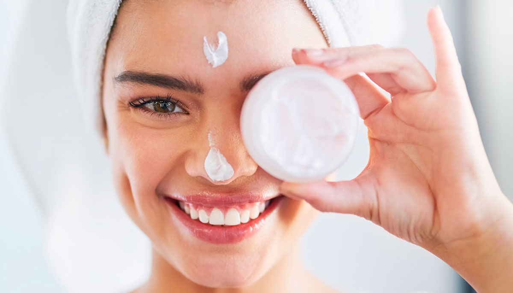
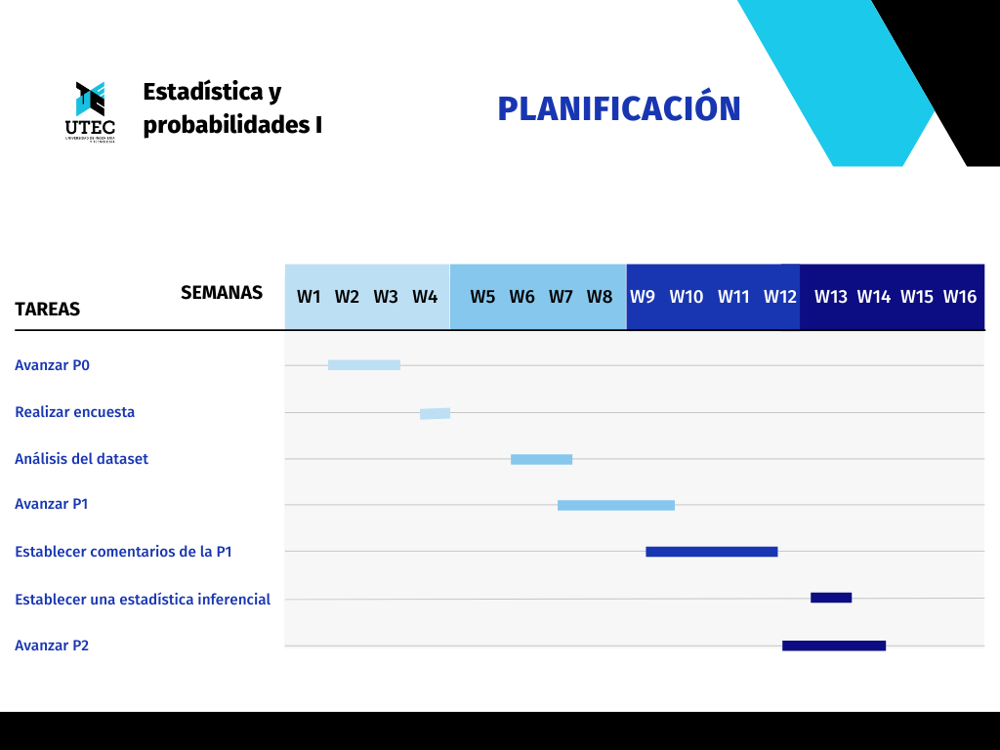
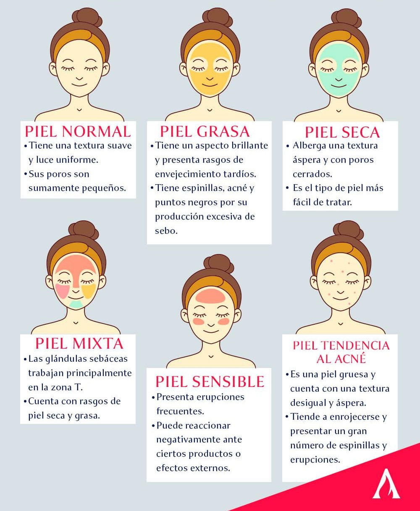

# El cuidado de la piel en adolescentes y jóvenes limeños de 15 a 24 años. 

******

## Introducción 

### Relevancia 
El estudio busca analizar la cultura del cuidado de la piel en adolescentes y jóvenes limeños entre 15 y 24 años. Este es relevante debido a que el estado de la piel se encuentra directamente vinculado a la calidad de vida y salud de la población.


### Objetivos 

Mediante nuestro estudio buscamos dimensionar y evaluar la cultura del cuidado de la piel en jóvenes; esta última se encuentra ligada a la salud y calidad de vida de nuestra población en estudio.

#### Carga de librerías

```{r}
# Package names
packages <- c("readr","dplyr","ggplot2", "tidyverse")

# Install packages not yet installed
installed_packages <- packages %in% rownames(installed.packages())
if (any(installed_packages == FALSE)) {
  install.packages(packages[!installed_packages])
}

# Packages loading
invisible(lapply(packages, library, character.only = TRUE))
```

### Planificación




## Datos

### 1. Proceso de recolección de datos 
Los datos del presente proyecto se obtuvieron a partir de encuestas online mediante Google Forms. Las condiciones para que la población realizara la encuesta fueron que la persona resida en Lima y se encuentre en un rango etario de 15 a 24 años. Como estrategia para la recolección se datos, se compartió el link de la encuesta mediante correo electrónico y redes sociales para alcanzar el mínimo de observaciones requeridas. 


### 2. Población, muestra y muestreo
La **población de estudio** son jóvenes limeños de 15 a 24 años. La **unidad muestral** son universitarios que respondieron la encuesta realizada hasta el día 05 de Mayo de 2022. El tamaño de la muestra está conformado por 269 observaciones. Se realizó un muestreo por conveniencia. 

Se analizará la **representitividad** según el sexo de los encuestados. De acuerdo con el último censo realizado en 2017, la población limeña está conformada por 718 324 hombres y 725 044 mujeres. Un total de 1 443 368 personas. Por lo tanto, el porcentaje de la población por sexo es:

* Hombres: 49,767%

* Mujeres: 50,233%


En el caso de la base de datos, el porcentaje de la población por sexo es:

* Hombres: 57,2

* Mujeres: 41,6%

La muestra **no es representativa** pues se realizó un muestreo por conveniencia, factor que afecta directamente a la representatividad de la muestra.

### 3. Variables 


##### Edad
La variable __Edad__ es de tipo _numérica discreta_, indica la cantidad de años cumplidos del individuo y su restricción es que es un entero entre 15 y 24.


##### Sexo 
La variable __Sexo__ es de tipo _categórica nominal_, refiere al sexo del individuo y su restricción es que puede tomar 2 valores: "Masculino" y "Femenino".


##### Lavado/Día
La variable __Lavado/Día__ es de tipo _numérica discreta_, define la cantidad de veces que la persona lava su rostro al día en promedio y su restricción es que es un entero positivo.


##### Bloqueador/Día

La variable __Bloqueador/Día__ es de tipo _numérica discreta_, define la frecuencia de uso de bloqueador al día y su restricción es que es un entero positivo o 0.


##### Productos
 
La variable __Productos__ es de tipo _categórica nominal_, refiere a los tipos de productos usados para el cuidado de la piel y su restricción es que solo puede tomar valores tipo carácter.


##### Jabón
La variable __jabón__ es de tipo _categórica nominal_, refiere al jabón utilizado para el lavado de rostro y su restricción es que puede tomar 5 valores: "Jabón de rostro", "Jabón dematológico de rostro", "Jabón de cuerpo", "Jabón de ropa" y "Limpiador facial.


##### Dermatólogo/Año

La variable __Dermatólogo/Año__ es de tipo _numérica discreta_, define la frecuencia de asistencia al dermatólogo y su restricción es que es un entero positivo o 0.


##### Piel
La variable __Piel__ es de tipo _categórica nominal_, refiere al tipo de piel que posee el individuo y su restricción es que puede tomar 6 valores: "Piel grasa", "Piel seca", "Piel normal", "Piel mixta", "Piel sensible" y "Piel con tendencia al acné".



##### Marca 
La variable __Marca__ es de tipo _categórica nominal_, refiere a la marca de cuidado de la piel más usada por el individuo y su restricción es que puede tomar valores tipo carácter. 


##### Agua
La variable __Agua__ es de tipo _numérica discreta_, define la cantidad de agua ingerida por el individuo durante el día en litros y su restricción es que es un real positivo.


##### Enfermedad
La variable __Enfermedad__ es de tipo _categórica nominal_, describe qué enfermedades dermatológicas posee el individuo y su restricción es que puede tomar valores tipo caracter. 

### Limpieza de base de datos

#### Carga de archivo

```{r}
DF <- read_csv("cuidadoPiel.csv")
```
#### Procedimiento para la limpieza

No se considerará la fecha de realización de la encuesta, ni tampoco el nombre de usuario (correo) del encuestado, puesto que la encuesta es general.

```{r}
DF = DF[,3:13]
```

Renombramos las columnas por nombres de variables que se puedan leer de mejor manera.

```{r}
DF = rename(DF, `Lavado/Día`=`¿Cuántas veces lavas tu rostro al día?`, `Bloqueador/Día` = `¿Cuántas veces al día utilizas bloqueador solar?`, Producto = `¿Qué producto de cuidado de la piel utilizas con mayor frecuencia?`, Jabón = `¿Qué tipo de jabón utilizas para lavar tu rostro?`, `Dermatólogo/Año` = `¿Cuántas veces visitas al dermatólogo en el año?`, Piel = `¿Qué tipo de piel tienes?`, Marca = `¿Cuál es la principal marca de cuidado de la piel que más utilizas?`, Agua = `¿Cuánta agua en litros consumes durante el día en promedio?`, Enfermedad = `Marca la enfermedad o trastorno que presentes.`)
```

Para poder realizar una limpieza de datos vamos a aplicar la función *_table()_* para así visualizar los distintos valores

__Sexo:__
Para el estudio, establecimos que la variable _Sexo_ es una variable categórica que puede tomar solo 2 valores: "Masculino" y "Femenino".
```{r}
DF$Sexo[DF$Sexo == "No binario"] <- NA
DF$Sexo[DF$Sexo == "No especifica"] <- NA
table(DF$Sexo)
```

__Lavadas de rostro:__
Al dato ^"^No me acuerdo^"^  lo anulamos de la database, puesto que no define una cantidad exacta.
```{r}
DF$`Lavado/Día`[DF$`Lavado/Día` == "No me acuerdo"] <- NA
table(DF$`Lavado/Día`)
```
__Bloqueador/Día:__
Los datos que indican una constancia se decidió colocarlos como valor nulo, puesto que no se sabe con certeza un valor específico de usos de bloqueador por día.
```{r}
DF$`Bloqueador/Día`[DF$`Bloqueador/Día` == "Cada que salgo de casa"] <- NA
DF$`Bloqueador/Día`[DF$`Bloqueador/Día` == "Solo cuando salgo"] <- NA
DF$`Bloqueador/Día`[DF$`Bloqueador/Día` == "Todos"] <- NA
table(DF$`Bloqueador/Día`)
```
__Producto:__
Se encontraron datos que representan nulidad, por ello lo agrupamos en Ninguno. Luego, a los datos que no especifican con certeza el producto con mayor uso se les colocó valor nulo. Por último, existen valores que son equivalentes a otros, entonces se les agrupa en el dato con mayor frecuencia entre ambos.
```{r}
DF$Producto[DF$Producto == "ninguno"] <- "Ninguno"
DF$Producto[DF$Producto == "No uso productos"] <- "Ninguno"
DF$Producto[DF$Producto == "nada"] <- "Ninguno"
DF$Producto[DF$Producto == "Casi todas que menciono"] <- NA
DF$Producto[DF$Producto == "No me dejaba escoger varios :( pero son bloqueador, serum, exfoliante, agua termal y una crema medicada"] <- NA
DF$Producto[DF$Producto == "Crema anti-acné"] <- "Crema hidratante"
DF$Producto[DF$Producto == "Jabón y agua"] <- "Jabón"
DF$Producto[DF$Producto == "Limpiador"] <- "Crema hidratante"
table(DF$Producto)
```
__Jabón:__
Existen diversos datos que tienen propiedades similares a datos que desde un inicio se han presentado en la encuesta, entonces se decide integrar estos valores en a los datos presentados en la encuesta original.
```{r}
DF$Jabón[DF$Jabón == "Bolívar"] <- "Jabón de ropa"
DF$Jabón[DF$Jabón == "jabón de avena"] <- "Jabón de rostro"
DF$Jabón[DF$Jabón == "jabón de glicerina para bebes"] <- "Jabón glicerina"
DF$Jabón[DF$Jabón == "Johnson Baby(rosado)"] <- "Jabón de rostro"
DF$Jabón[DF$Jabón == "Jabon normal"] <- "Jabón de cuerpo"
DF$Jabón[DF$Jabón == "antes de pandemia, todos. durante pandemia, jabón del normal."] = "Jabón de cuerpo"
table(DF$Jabón)
```
__Dermatólogo:__
Frecuencia de asistencia al dermatólogo del encuestado. Existen datos que indican textualmente una inasistencia al dermatólogo, por lo que se les asigna el valor de 0 asistencias al dermatólogo.
```{r}
DF$`Dermatólogo/Año`[DF$`Dermatólogo/Año` == "Ninguna"] = 0
DF$`Dermatólogo/Año`[DF$`Dermatólogo/Año` == "Ninguno"] = 0
DF$`Dermatólogo/Año`[DF$`Dermatólogo/Año` == "No fui"] = 0
DF$`Dermatólogo/Año`[DF$`Dermatólogo/Año` == "Ninguno, ¿Se tenía que ir?"] = 0
table(DF$`Dermatólogo/Año`)
```

__Marca:__
Se realiza un arreglo en los nombres propios de cada marca. Además que existen datos que expresan nulidad, entonces se les agrupa a Ninguno.
```{r}
table(DF$Marca)
DF$Marca[DF$Marca == "Asepsia"] = "Asepxia"
DF$Marca[DF$Marca == "Ninguna"] = "Ninguno"
DF$Marca[DF$Marca == "Nada xd"] = "Ninguno"
DF$Marca[DF$Marca == "Protex jehe"] = "Protex"
DF$Marca[DF$Marca == "ISDIN"] = "Isdin"
DF$Marca[DF$Marca == "Mary kay"] = "Mary Kay"
DF$Marca[DF$Marca == "cetaphil"] = "Cetaphil"
table(DF$Marca)
```
__Agua:__
Existen datos que expresan una cantidad incierta. En el caso de los dos datos menores a un litro se decide establecer un valor que tenga sentido, el expresar una cantidad menor a un 1 litro y el hecho de haber consumido agua es ciertamente un valor entre 0 y 1. Y se coloca una media entre estas 2 cantidades, puesto que no hay ningún indicador exprese una tendencia.
```{r}
DF$Agua[DF$Agua == "Menos de 1 litro"] = 0.5
DF$Agua[DF$Agua == "Menos de un litro"] = 0.5
table(DF$Agua)
```

__Enfermedad:__
Hay datos que tienen similitud a otros, por lo que se decide agrupar estos con los datos con mayor frecuencia.
```{r}
DF$Enfermedad[DF$Enfermedad == "puntos negros, con poco acné"] = "Acné"
DF$Enfermedad[DF$Enfermedad == "Piel ultrasensible, alergia atópica"] = "Dermatitis atópica"
DF$Enfermedad[DF$Enfermedad == "porosidad"] = "Rosácea"
table(DF$Enfermedad)
```

Una vez realizado los cambios y mostrar los valores de algunas columnas, se puede determinar que ahora sí hay una base de datos *limpia.* En caso de gestión de nulos, se omitiran al realizar los cálculos, puesto que son mínimos en cada variable.

## Análisis descriptivo

Para el análisis de **variables numéricas** optamos por realizar **histogramas**, **boxplots** y el cálculo de los principales descriptores numéricos de posición y de dispersión. Por otro lado, para el análisis de **variables categóricas** optamos por realizar **barplots**.


**Edad:** Edad de la persona en años.  → Numérica discreta
```{r}
hist(DF$Edad, main="Histograma de la variable Edad",xlab="Edad",ylab="Frecuencia absoluta")
```
```{r}
boxplot(DF$Edad, ylab="Edad en años", main="Boxplot de la variable Edad")
```

Cálculo de descriptores numéricos:
```{r}
summary(DF$Edad)
```
**Descriptores numéricos de dispersión**

Desviación estándar:
```{r}
sd(DF$Edad)
```
Coeficiente de variación:
```{r}
sd(DF$Edad)/mean(DF$Edad)
```
Observamos que el valor es pequeño, lo que indica que los valores no se alejan mucho de la _media_.


**Sexo:**  Sexo del individuo → Categórica nominal

```{r}
barplot(table(DF$Sexo), ylim=c(0,180), main = "Gráfico de barras de la variable Sexo")
```

**Lavado:** Define la cantidad de veces que la persona lava su rostro al día en promedio  → Numérica discreta
Para el análisis de esta variable, realizamos un **histograma** con intervalos _cerrados a la izquierda_.
```{r}
hist(as.numeric(DF$`Lavado/Día`),right=FALSE,freq=TRUE,main="Histograma de Lavado de rostro al día",xlab="Cantidad de lavadas de rostro",ylab="Frecuencia absoluta")
```

Cantidad de veces que los encuestados lavan su rostro en promedio.
```{r}
mean(as.numeric(DF$`Lavado/Día`), na.rm = T)
```

Asimismo, realizamos un boxplot para visualizar los principales **descriptores numéricos**.

```{r}
boxplot(as.numeric(DF$`Lavado/Día`), main="Boxplot de la varaible de Lavado/Día")
```

#### ANÁLISIS:
- En promedio los encuestados lavan su rostro 2.66 veces al día. Según expertos en el área de dermatología como Caren Campbell y Sara Hogan, es recomendable lavar el rostro al menos 2 veces al día. Sin embargo, cuando se realiza ejercicio o se utiliza maquillaje, es necesario lavar el rostro para evitar impurezas. Entonces, concluimos que los encuestados tienen un buen hábito de lavado de rostro en promedio. 

- Al realizar el boxplot observamos que los valores superiores a 4 e iguales a 0 son considerados atípicos. Es decir, la mayoría lava su rostro entre 1 a 3 veces al día. 


**Bloqueador:** Frecuencia de uso de bloqueador al día → Numérica discreta
```{r}
hist(as.numeric(DF$`Bloqueador/Día`),right=FALSE,breaks=c(0,1,2,3,4,5),freq=TRUE,main="Histograma de uso de bloqueador por día",xlab="Número de aplicaciones de bloqueador por día",ylab="Frecuencia absoluta")
```

```{r}
boxplot(as.numeric(DF$`Bloqueador/Día`), main="Boxplot de la variable Bloqueador/Día")
```

Promedio de uso de bloqueador al día
```{r}
mean(as.numeric(DF$`Bloqueador/Día`), na.rm=T)
```


#### ANÁLISIS:
- El bloqueador es un producto de cuidado de la piel esencial debido a que los rayos UV son la principal causa de enfermedades crónicas y envejecimiento dérmico. Francisca Daza, dermatóloga especializada en el cuidado del rostro, recomienda utilizar bloqueador al menos dos veces al día, en la mañana y al medio día. Sin embargo, el promedio de la variable $Bloqueador/Día$ es 0,58. Es decir, en promedio, la población encuestada no utiliza bloqueador ni siquiera una vez. Por lo tanto, la piel de los encuestados se encuentra propensa a envejecer. 


**Cuidado:** Tipos de productos usados para el cuidado de la piel → Categórica nominal
```{r}
round(table(DF$Producto)*100/nrow(DF),2)
```

#### ANÁLISIS:
- El 30.86% de la población no utiliza productos para el cuidado de su piel. 
- El producto de la piel más utilizado es la crema hidratante pues el 30.48% de los encuestados utiliza este producto.


**Jabón:** Jabón utilizado para el lavado de rostro → Categórica nominal
```{r}
barplot(table(DF$Jabón),legend.text=T,names.arg = F,col=c("yellow","white","orange","grey","brown","lightblue","black"),ylim=c(0,120), main = "Gráfico de barras de la variable Jabón", ylab="Frecuencia absoluta")
```
```{r}
table(DF$Jabón)
```


#### ANÁLISIS:
- Según la moda de la variable 'Jabón', el jabón más utilizado por la población encuestada es el $Jabón de rostro$ común. Es decir, la mayoría de encuestados no utiliza un jabón específico para su tipo de piel. 
- También, al realizar un table, podemos apreciar que un gran número de personas utiliza jabón de cuerpo, el cuál puede llegar a ser muy agresivo para la piel del rostro.


**Dermatólogo:** Frecuencia de asistencia al dermatólogo → Numérica discreta
Analizamos las frecuencias absolutas mediante un histograma, considerando las clases __cerradas a la izquierda__:
```{r}
hist(as.numeric(DF$`Dermatólogo/Año`),right=FALSE,breaks=c(0,1,2,3,4,5,6),freq=TRUE,main="Histograma de Asistencias al Dermatólogo por año",xlab="Número de asistencias por año",ylab="Frecuencia absoluta")
```

```{r}
boxplot(as.numeric(DF$`Dermatólogo/Año`), main= "Boxplot de la variable Dermatólogo/Año")
```

Por otro lado, también es conveniente analizar la densidad, para entender la distribución de las asistencias al Dermatólogo:
```{r}
hist(as.numeric(DF$`Dermatólogo/Año`),right=FALSE,breaks=c(0,1,2,3,4,5,6),freq=FALSE,ylim=c(0,0.5),main="Histograma de Asistencias al Dermatólogo por año",xlab="Número de asistencias por año",ylab="Densidad")
```

Media de asistencias al dermatólogo por año:
```{r}
mean(as.numeric(DF$`Dermatólogo/Año`), na.rm=T)
```

#### ANÁLISIS:
-  Según la media y como se puede apreciar en el histograma, la población encuestada no asiste al dermatólogo frecuentemente. Esto implica que los individuos no puedan recibir un diagnóstico de sus enfermedades. 


**Piel :** Tipo de piel que posee el individuo → Categórica nominal
```{r}
barplot(table(DF$Piel),legend.text=T,names.arg = F,col=c("yellow","white","orange","grey","brown","lightblue"),ylim=c(0,100), main = "Gráfico de barras de la variable Piel", ylab = "Frecuencia absoluta")
```

#### ANÁLISIS:
- La variable $Piel$ es bimodal, siendo sus modas piel grasa y piel mixta.


**Marca:** Marcas de cuidado de la piel conocidas por el individuo → Categórica nominal
En el caso de la variable _Marca_, realizar 
```{r}
table(DF$Marca)
```

#### ANÁLISIS:
- La marca más conocida por los individuos encuestados es Nivea. 


**Agua:** Define la cantidad de agua ingerida por el individuo durante el día → Numérica discreta
```{r}
hist(as.numeric(DF$Agua),ylab="Frecuencia absoluta",xlab="Cantidad de agua consumida al día (L)", main = "Histograma de la variable Agua")
```
La media de la variable Agua es:
```{r}
median(as.numeric(DF$Agua), na.rm=T)
```

#### ANÁLISIS:
- La media de la cantidad de agua en litros consumida por la población es 2 L y se encuentra sesgada a la derecha. 

**Enfermedad:** Describe qué enfermedades dermatológicas posee el individuo → Categórica nominal
Se puede observar a través de la tabla que la variable es bimodal.
```{r}
table(DF$Enfermedad)
barplot(table(DF$Enfermedad),names.arg=F, ylab="Frecuencia absoluta", main= "Gráfico de barras de la variable Enfermedad",col=c("orange","purple","pink","yellow","black","grey","brown"))
legend(x = "center", legend = c("Acné","Dematitis atópica", "Herpes Labial", "Hipotiroidismo", "Melasma facial", "Ninguno", "Rosácea"), fill = c("orange","purple","pink","yellow","black","grey","brown"), border = "black", cex = 1)
```

#### ANÁLISIS
La enfermedad de la piel más común entre la población encuestada es el acné. Sin embargo, otra gran parte no presenta ninguna enfermedad cutánea. 


## Análisis bivariado

#### Relación entre las variables 'Agua' y 'Sexo'

U.S. National Academies of Sciences, Engineering, and Medicine determinaron que la cantidad adecuada de agua ingerida diariamente es 3.7 litros para los hombres y 2.7 litros para las mujeres. A continuación, se analiza la relación entre la cantidad de agua en litros ingerida por cada sexo.

```{r}
tempSexoF = filter(DF, Sexo == "Femenino")
tempSexoM = filter(DF, Sexo == "Masculino")
hist(as.numeric(tempSexoM$Agua), freq = F, col = rgb(0.528,0.808,0.922, alpha = 0.7), xlab = "Consumo de agua diario (L)", ylab = "Densidad", main = "Relación entre Agua y Sexo", ylim = c(0,0.5))
grid(nx = NA, ny = NULL, lty = 2, col = rgb(0,0,0, alpha = 0.8), lwd = 1)
hist(as.numeric(tempSexoF$Agua), freq = F, add = T, col = rgb(1, 0.753, 0.796, alpha = 0.7))
legend(x = "topright", legend = c("Mujeres", "Hombres"), fill = c("pink", "skyblue"), border = "black", cex = 1.5)
```

Además hallamos la media de litros de agua ingeridos por cada sexo:
```{r}
round(mean(as.numeric(DF[DF$Sexo == 'Femenino',]$Agua), na.rm=T), 2)
round(mean(as.numeric(DF[DF$Sexo == 'Masculino',]$Agua), na.rm=T), 2)
```


#### ANÁLISIS
Del análisis se concluye que ambos sexos se encuentran por debajo de la media recomendada. Esto es un indicador de falta de cuidado de la piel debido a que una buena hidratación conlleva al equilibrio de los niveles de agua en la piel y al fortalecimiento de la barrera protectora. 


#### Relación lavado de rostro entre mujeres y hombres.
Acá se analizará las tendencias entre el lavado de cara por sexo. Como se puede ver se aplicó un histograma con su respectivo color indicando el sexo. Se puede observar que  existen pocos hombres que tienen un mayor hábito de lavarse el rostro, mientras que las mujeres suelen lavarse con mayor costumbre.
```{r}
tempSexoF = filter(DF, Sexo == "Femenino")
tempSexoM = filter(DF, Sexo == "Masculino")
hist(as.numeric(tempSexoM$`Lavado/Día`), freq = F, col = rgb(0.528,0.808,0.922, alpha = 0.7), xlab = "Número de lavado diario", ylab = "Densidad", main = "Relación entre el lavado entre mujeres y hombres", ylim = c(0,0.5))
grid(nx = NA, ny = NULL, lty = 2, col = rgb(0,0,0, alpha = 0.8), lwd = 1)
hist(as.numeric(tempSexoF$`Lavado/Día`), freq = F, add = T, col = rgb(1, 0.753, 0.796, alpha = 0.7))
legend(x = "topright", legend = c("Mujeres", "Hombres"), fill = c("pink", "skyblue"), border = "black", cex = 1.5)
```
```{r}
round(mean(as.numeric(DF[DF$Sexo == 'Femenino',]$`Lavado/Día`), na.rm=T), 2)
round(mean(as.numeric(DF[DF$Sexo == 'Masculino',]$`Lavado/Día`), na.rm=T), 2)
```

#### ANÁLISIS
Analizando el histograma de frecuencias y las medias de la variable Lavado/Día para ambos sexos, determinamos que el sexo masculino tiende a lavarse el rostro con mayor frecuencia que el femenino. Esto se ve reflejado además con los datos atípicos evidentes en el histograma.

#### Relación entre variable Piel y Sexo

Para analizar esta relación, realizamos un diagrama de mosaico:
```{r}
mosaicplot(table(DF$Piel,DF$Sexo), main="Mosaico de las variables Piel y Sexo")
```

#### ANÁLISIS
- Entre los individuos con $Piel con tendencia al acné$ y $Piel grasa$ el sexo masculino es prevalente.
- Entre los individuos con $Piel mixta$ y $Piel sensible$ el sexo femenino es el prevalente.
- Entre los individuos con $Piel normal$ y $Piel seca$ se presenta una distribución relativamente equitativa entre ambos sexos.

## Relación entre variables numéricas

Particularmente, es adecuado es realizar un diagrama de dispersión y establecer los valores de correlación, covarianza y la recta de regresión lineal. Para ello vamos a realizar una función para poder encontrar las correlaciones que existen entre nuestras variables numéricas
```{r}
graficar <- function(X, Y, xname, yname, ...){

  plot(X, Y, xlab=xname, ylab=yname, pch=20, col = rgb(0,0,0,0.2))

  abline(lm(Y ~ X), ..., col = "red")

  legend("topright", legend=round((cor(X, Y, use = "pairwise.complete.obs")),2) )

}
```

Luego de varias pruebas, se han podido identificar 2 gráficos que tienen una cierta correlación.


Como se puede ver a continuación, la correlación entre las variables $Lavado de rostro$ y $Dermatólogo/Año$ viene a ser 0.1928297, esto indica que existe una tendencia de **ligero** aumento que a mayor cantidad de lavado del rostro, los usuarios asisten con mayor frecuencia al dermatólogo. 
```{r}
graficar(as.numeric(DF$`Lavado/Día`), as.numeric(DF$`Dermatólogo/Año`), xname = "Lavado", yname = "Dermatólogo", main="Gráfica de dispersión de las variables Lavado/Día y Dermatólogo/Año")

```
Por otro lado, al analizar las variables $Bloqueador/Día$ y $Dermatólogo/Año$ la correlación viene a ser 0.3401199, esto indica que existe una tendencia de aumento **casi fuerte** que a mayor cantidad de usos del bloqueador al día, los usuarios asisten con mayor frecuencia al dermatólogo.
```{r}
graficar(as.numeric(DF$`Bloqueador/Día`), as.numeric(DF$`Dermatólogo/Año`), xname = "Bloqueador/Día", yname="Dermatólogo", main="Gráfica de dispersión de las variables Bloqueador/Día y Dermatólogo")
```

Estos valores de correlación nos sugieren que para a mayor higiene personal (ligada a la aplicación de bloqueador y al lavado de rostro), las personas suelen acudir a un especialista para un mejor tratado.


## ANÁLISIS DE VARIABLES ALEATORIAS


Se tomaron las 3 variables aleatorias discretas **Bloqueador/Día**, **Dermatólogo/Año** y **Lavado/Día** para determinar tres eventos distintos. A continucación, se mostrarán las gráficas de distribución de probabilidad de las variables mencionadas respectivamente. Se optó por una distribución binomial y en torno a la densidad se defina algún evento. Las densidades de las gráficas indican para una binomial, no hay alguna otra distribución que ayuden con la densidad.

```{r echo=FALSE}
par(mfrow=c(1,2))
Bloqueador = table(as.numeric(DF$`Bloqueador/Día`))
Dermatologo = table(as.numeric(DF$`Dermatólogo/Año`)) #Se omite tilde al nombre de la variable
Lavado = table(as.numeric(DF$`Lavado/Día`))


barplot(Bloqueador, lwd = 2,
     main = "Distribución de Bloqueador/Día",
     xlab = "Número de usos", ylab = "Frecuencia absoluta")
plot(Bloqueador/269, lwd = 2, type="s",
     main = "Distribución de Bloqueador/Día",
     xlab = "Número de usos", ylab = "F(x)")
abline(v=mean(as.numeric(DF$`Bloqueador/Día`), na.rm = T), col="red", lwd=2)
legend("topright", "Media",
       lty = 1, lwd = 2, col = "red", bty = "o",inset = 0.03,
       cex = 1.2)

barplot(Dermatologo, lwd = 2,
     main = "Distribución de Dermatólogo/Año",
     xlab = "Número de visitas", ylab = "Frecuencia absoluta")
plot(Dermatologo/269, lwd = 2, type= "s",
     main = "Distribución de Dermatólogo/Año",
     xlab = "Número de visitas", ylab = "F(x)")
abline(v=mean(as.numeric(DF$`Dermatólogo/Año`), na.rm = T), col="red", lwd=2)
legend("topright", "Media",
       lty = 1, lwd = 2, col = "red", bty = "o",inset = 0.03,
       cex = 1.2)

barplot(Lavado, lwd = 2,
     main = "Distribución de Lavado/Día",
     xlab = "Número de lavados", ylab = "Frecuencia absoluta")
plot(Lavado/269, lwd = 2, type = "s",
     main = "Distribución de Lavado/Día",
     xlab = "Número de lavados", ylab = "F(x)")
abline(v=mean(as.numeric(DF$`Lavado/Día`), na.rm = T), col="red", lwd=2)
legend("topright", "Media",
       lty = 1, lwd = 2, col = "red", bty = "o",inset = 0.03,
       cex = 1.2)
```

Definición de eventos:

**Variable Dermatólogo/Año**

**E:** Una dermatólogía desea saber cuál es la probabilidad en la que al menos la mitad de 100 encuestados al azar han acudido por lo menos una vez al dermatólogo.

```{r}
prob = sum(dbinom(50:100, 100, 0.53))
round(prob,2)
```
La probabilidad en la que 50 a más personas hayan acudido entre los 100 encuestados es de 0.76


**Variable Lavado/Día**


**E:** Una grupo de 5 amigos en el estudio dicen que **todos** se han lavado la cara al menos luego del desayuno, almuerzo y cena, es decir, 3 veces al día, ¿qué tan cierto es esto?

Primero obtenemos las densidades de cada número de lavados
```{r}
round(Lavado/269,3)
```
Nos interesa definir el evento lavarse la cara 3 veces al día. Para esto sumaremos las probabilidades de 0, 1 y 2 veces la cara al día. Esto resulta en el siguiente evento:

- Una persona se lava la cara al menos 3 veces al día con una probabilidad de 0.51

```{r}
round(dbinom(5,5,0.51),3)
```

De acuerdo al estudio, existe un 0.035 de probabilidad que el grupo de amigos esté diciendo la verdad.

**Otro evento**

**E:** De acuerdo a especialistas recomiendan los 3 siguientes aspectos, lavarse la cara no más de 3 veces es lo recomendable, utilizar como mínimo 1 vez bloqueador solar sin necesidad de exponerse al sol al día y por lo menos acudir al dermatólogo 1 vez al año. Por el otro lado, todas las variables presentadas son unimodales. Con esta información se definarán los 3 siguientes eventos: 

Obtenemos las tablas con su respectiva frecuencia relativa de las vartiables **Bloqueador/Día**, **Dermatólogo/Año** y **Lavado/Día** respectivamente.
```{r}
round(Bloqueador/269,3)
round(Dermatologo/269,3)
round(Lavado/269,3)
```

- Una persona se aplica bloqueador al menos 1 vez con una frecuencia relativa de 0.442
 
- Una persona no acude al dermatólogo en ninguna ocasión durante un año con una probabilidad de 0.472 

- Una persona se asea el rostro de 4 a más veces al día con una probabilidad de 0.174

Se desea brindar una exposición a todos los 269 personas del estudio acerca de los hábitos de higiene que tiene la población limeña, para ello se decidirá obtener a un grupo de 150 personas y se les explica las recomendaciones de los especialistas. Utilizando los eventos previamente definidos, ¿cuál es la probabilidad que al menos la mitad de las 150 personas cumpla con lo recomendado por los especialistas?
```{r}
round(sum(dbinom(75:150,150,0.442))*sum(dbinom(75:150,150,0.528))*sum(dbinom(75:150,150,0.826)),3)
```

Como se puede observar, al realizar tal demostración, para que al menos la mitad de las 150 personas para la demostración cumplan las 3 recomendaciones de los especialistas es de 0.069


### Distribución de la variable Agua:

**Variable Agua**
Considerando que las probabilidades de la variable $Agua$ están dadas por una distribución de Poisson. Establecemos los siguientes eventos:


```{r echo=FALSE}
par(mfrow=c(1,2))

plot(table(as.numeric(DF$Agua))/269, ylim=c(0,7/10), main="Gráfico distribuida de agua", xlab="Consumo de agua diaria (L)", ylab="Frecuencia relativa", type="l")
lines(density(as.numeric(DF$Agua)), col="blue")
lines(dpois(0:20, 1.3), col="red",lwd=2,type="h")

legend("topright", c("Esquema Poisson", "Densidad", "Variable Agua"),
       lty = 1, lwd = 2, col = c("red", "blue", "black"), bty = "n",
       cex = 0.8)

plot(dpois(0:7, 1.3),type="h", lwd = 3, col = "red", ylab="P(X=x)", xlab="Número de eventos", main="Gráfica Poisson")
legend("topright", c(" (Lambda=1.3)"),
       lty = 0, lwd = 0, col = c("red"), bty = "n",
       cex = 1.5)
```

**E1:** Seleccionamos una persona al azar de nuestra población, ¿cuál es la probabilidad de que beba entre 1 a 3 L de agua al día?
```{r}
round((ppois(3, 1.3) - ppois(1,1.3)),2)
```

La probabilidad que una persona beba entre 1 a 3L diarios de agua es de 0.33


**E2:** Seleccionamos una persona al azar de nuestra población, ¿cuál es la probabilidad de que beba 2L de agua al día?
```{r}
round(dpois(2,1.3),2)
```
La probabilidad en la que una persona beba 2L de agua diaria es de 0.23


### Distribución de la variable Agua en el sexo masculino

```{r echo=FALSE}
par(mfrow=c(1,2))

plot(table(as.numeric(tempSexoM$Agua))/154, ylim=c(0,7/10), main="Gráfica distribuida de agua(M)", xlab="Consumo de agua diaria (L)", ylab="Frecuencia relativa", lwd=3, type="l")

lines(dpois(0:20, 1.43), col="red",lwd=2,type="h")
legend("topright", c("Esquema Poisson", "Variable Agua"),
       lty = 1, lwd = 2, col = c("red" , "black"), bty = "n",
       cex = 0.8)

plot(dpois(0:20, 1.43),type="h", lwd = 3, col = "red", ylab="P(X=x)", xlab="Número de eventos", main="Gráfica Poisson")
legend("topright", c(" (Lambda=1.43)"),
       lty = 0, lwd = 0, col = c("red"), bty = "n",
       cex = 1.5)
```

Sabiendo que un hombre debe ingerir 3 L de agua diariamente, ¿cuál es la probabilidad de que un varón cumpla con el estándar?
```{r}
round(ppois(3, 1.43, lower.tail = F),2 )
```

Los hombres tienen una probabilidad de 0.06 de cumplir con la condición indicada.

## Distribución de la variable Agua en el sexo femenino
```{r echo=FALSE}
par(mfrow=c(1,2))

plot(table(as.numeric(tempSexoF$Agua))/112, ylim=c(0,7/10), main="Gráfico distribuida de agua (F)", ylab="Frecuencia relativa", xlab="Consumo de agua diario (L)", type="l", lwd=3)

lines(dpois(0:20, 1.2), col="red",lwd=2,type="h")

legend("topright", c("Esquema Poisson", "Variable Agua"),
       lty = 1, lwd = 2, col = c("red", "black"), bty = "n",
       cex = 0.8)

plot(dpois(0:7, 1.2),type="h", lwd = 3, col = "red", ylab="P(X=x)", xlab="Número de eventos", main="Gráfica Poisson")
legend("topright", c(" (Lambda=1.2)"),
       lty = 0, lwd = 0, col = c("red"), bty = "n",
       cex = 1.5)
```

Sabiendo que una mujer debe ingerir 2 L de agua diariamente, ¿Cuál es la probabilidad de que cumpla con el estándar?
```{r}
round(ppois(2,1.2, lower.tail = F),2 )
```

Existe un 0.12 de probabilidad en que las mujeres encuestadas están en buenas condiciones al consumir agua.


## BIBLIOGRAFÍA


+ Beni, S. (4 de enero de 2022). How Often Do You Actually Need to Wash Your Face? Here's What Top Dermatologists Say. Prevention. https://www.prevention.com/beauty/skin-care/a38636075/how-often-should-you-wash-your-face

+ Errázuriz, Y. (9 de julio de 2020). ¿Cuántas veces al día debemos aplicarnos bloqueador solar?. La Tercera. https://www.latercera.com/paula/cuantas-veces-al-dia-debemos-aplicarnos-bloqueador-solar/

+ Laderer, A. (9 de julio de 2020). Here's why you should be washing your face twice a day. Insider. https://www.insider.com/guides/beauty/how-often-should-you-wash-your-face

+ Mayo Clinic (14 de octubre de 2020). Water: How much should you drink every day?. Mayo Clinic. https://www.mayoclinic.org/healthy-lifestyle/nutrition-and-healthy-eating/in-depth/water/art-20044256


