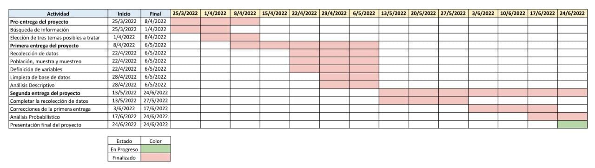

```{r}
if(!require(readr)){
  install.packages("readr")
   library(readr)
}else{
  library(readr)
}

if(!require(dplyr)){
  install.packages("dplyr")
   library(dplyr)
}else{
  library(dplyr)
}

if(!require(graphics)){
  install.packages("graphics")
   library(graphics)
}else{
  library(graphics)
}
```

```{r}
redondeo <- function(x){
  return(round(x, digits = 2))
}
```

```{r}
cv <- function(x){
        return(sd(x, na.rm=TRUE)/mean(x, na.rm=TRUE))
      }
```

# Introducción

## Relevancia

Los alumnos universitarios están constantemente superando retos durante toda su carrera, por lo que, la habilidad de solucionar problemas se vuelve indispensable. Nuestro proyecto busca medir esta habilidad y encontrar si está relacionada con las diferentes variables de estudio como la carrera universitaria. Para medir esta habilidad utilizamos rompecabezas topológicos, específicamente los rompecabezas de alambres. Ya que estos muestran una dificultad mayor, debido a que no solo busca que la persona separe las piezas, sino que además que las vuelva a unir como estaban originalmente. Esto último requiere que la persona entienda cómo encontró la solución de separar las piezas, para poder realizar la unión de las mismas. Lo que demuestra el nivel de la persona para solucionar el problema.

## Planificación



# Datos

## Recolección de datos:

Para la recolección de datos se utilizaron encuestas y, debido a la naturaleza de nuestro estudio, estas se realizaron de manera presencial con el encuestado en el mismo campus de UTEC. Para ello nos dirigimos, principalmente, a los pisos 6 y 11, ya que ahí es donde se encuentran la mayoría de alumnos con disponibilidad para realizar la encuesta.

Como parte de la encuesta se les explicaba en qué consiste el estudio y se les mostraba la posición inicial y final de los rompecabezas para que se dieran una idea de cómo estos se resuelven. Las encuestas duran entre 10 y 20 minutos aproximadamente y todos los rompecabezas deben ser separados y unidos exitosamente.

## Población, muestra y muestreo

- Población: Población son los alumnos de UTEC

- Muestra: Nuestra muestra consiste de alumnos de UTEC que estén cursando el ciclo 2022-2

- Muestreo: Para nuestro proyecto se hizo un muestreo por conveniencia.

## Variables:
Las variables que se tuvieron en cuenta para nuestro estudio son las siguientes:

- Año de ingreso: Variable categórica ordinal que indica el año en que el alumno ingresó a la universidad. Se representa con el año y el ciclo de ingreso, por ejemplo: *2018-2* .

- Carrera profesional: Variable categórica nominal que indica la carrera profesional del alumno. Su restricción es que no puede ser una carrera universitaria que no sea enseñada en la UTEC.

- Sexo: Variable categórica nominal que indica el genero de los alumnos. Su restricción es que tiene que ser sexo biológico (hombre o mujer).

- Edad: Variable numérica discreta que indica la edad de los alumnos. Su restricción es que sea un número no negativo.

- Separación rompecabezas 1: Variable numérica continua que indica el tiempo, en segundos, de resolución del rompecabezas 1. Su restricción es que sea un número no negativo.

- Separación rompecabezas 2: Variable numérica continua que indica el tiempo, en segundos, de resolución del rompecabezas 2. Su restricción es que sea un número no negativo.

- Separación rompecabezas 3: Variable numérica continua que indica el tiempo, en segundos, de resolución del rompecabezas 3. Su restricción es que sea un número no negativo.

- Unión rompecabezas 1: Variable numérica continua que indica el tiempo, en segundos, de unión del rompecabezas 1. Su restricción es que sea un número no negativo.

- Unión rompecabezas 2: Variable numérica continua que indica el tiempo, en segundos, de unión del rompecabezas 2. Su restricción es que sea un número no negativo.

- Unión rompecabezas 3: Variable numérica continua que indica el tiempo, en segundos, de unión del rompecabezas 3. Su restricción es que sea un número no negativo.

## Limpieza de base de datos:

La encuestas se hicieron utilizando la herramienta *Google Formularios* (Google forms), la cual puede exportar las respuestas a un archivo Excel para después descargarlo como archivo csv. Además, esta herramienta permite que las respuestas puedan ser rellenadas por el encuestado o marcadas.

Para poder evitar errores en los datos se tomó en cuenta lo siguiente:

- Variable sexo, carrera universitaria y año de ingreso:

  Las respuestas para estos datos solo se pueden marcar. Para el caso de sexo, las opciones son dos: hombre o mujer. Para carrera universitaria, se muestran todas las carreras que la UTEC actualmente enseña. Y para el año de ingreso se muestran los años y ciclos desde 2017-1 hasta 2022-1.

- Variable separación y unión de rompecabezas:

  Para estos datos se toma el tiempo con el cronómetro del celular y se hace el ingreso de la información en la sección correspondiente.

Por último, cuando se termina de rellenar todos los campos de la encuesta se hace una revisión de estas para verificar que hayan sido llenadas correctamente antes de enviar la encuesta a la base de datos.

Ahora pasamos a ver los datos faltantes y a determinar el tamaño de la muestra efectiva:

- Cargamos la base de datos a nuestro entorno de trabajo en la data frame `DatosProyecto`.

```{r}
DatosProyecto <- read_csv("DatosDeProyecto.csv")
nrow(DatosProyecto)
```
- Quitamos la columna *Marca temporal* (Esta columna viene por defecto de *Google Formularios*)
```{r}
DatosProyecto$`Marca temporal` <- NULL
```

- Quitamos los paréntesis de los nombres de las variables.

```{r}
DatosProyecto<-rename(DatosProyecto, Correo = `Correo (de la universidad)`, Sexo = `Sexo(Biológico)`, Edad = `Edad(número)`, Ciclo = `Ciclo (número)`)
```

- Revisamos que los alumnos encuestados no hayan hecho la encuesta más de una vez.

```{r}
n_distinct(DatosProyecto$Correo) - nrow(DatosProyecto)
```

- Revisamos la cantidad de datos faltantes.

```{r}
sum(is.na(DatosProyecto))
```


Como nuestra base de datos no presenta datos faltantes y, como consecuencia, no presenta observaciones incompletas, además de que ningún encuestado participó más de una vez. El data frame limpio es `DatosProyecto`

# Análisis descriptivo


## Univariado

### Variable `Separación_R1`

```{r}
medianaR1 <- redondeo(median(DatosProyecto$Separación_R1))
mediaR1 <- redondeo(mean(DatosProyecto$Separación_R1))
iqrR1 <- redondeo(IQR(DatosProyecto$Separación_R1))
minR1 <- redondeo(min(DatosProyecto$Separación_R1))
maxR1 <- redondeo(max(DatosProyecto$Separación_R1))
varR1 <- redondeo(var(DatosProyecto$Separación_R1))
sdR1 <- redondeo(sd(DatosProyecto$Separación_R1))
```

Esta variable numérica presenta un valor mínimo y máximo de `r minR1` y `r maxR1` segundos, respectivamente. Como consecuencia presenta un  rango de `r maxR1-minR1` segundos .Además su mediana, de valor `r medianaR1` segundos, se encuentra cercana a su media, de valor `r mediaR1` segundos. Por otro lado, su rango intercuartil tiene un valor de `r iqrR1` segundos. También presenta una desviación estándar de `r sdR1` segundos y una varianza de `r varR1` segundos cuadrados. 

```{r}
boxplot(DatosProyecto$Separación_R1, horizontal = T,  main= "Boxplot de Separación R1", xlab="Segundos(s)")
legend("bottom",legend = c("media" ,"mínimo", "máximo"), lty = c(1,1,1), col = c("blue","red","green"), title = "descriptores")
abline(v=min(DatosProyecto$Separación_R1), col= "red")
abline(v=max(DatosProyecto$Separación_R1), col= "green")
abline(v=mean(DatosProyecto$Separación_R1), col="blue")
```

En conclusión, esta variable presenta un grado alto de dispersión, ya que el rango intercuartil es pequeño en comparación al rango, además de que la desviación estándar también lo indica. Por otro lado, los descriptores de posición indican un sesgo a la derecha, el cual se ve reflejado en la gráfica.

### Variable `Separación_R2`

Separacion R2:

```{r}
medianaR2 <- redondeo(median(DatosProyecto$Separación_R2))
mediaR2 <- redondeo(mean(DatosProyecto$Separación_R2))
iqrR2 <- redondeo(IQR(DatosProyecto$Separación_R2))
minR2 <- redondeo(min(DatosProyecto$Separación_R2))
maxR2 <- redondeo(max(DatosProyecto$Separación_R2))
varR2 <- redondeo(var(DatosProyecto$Separación_R2))
sdR2 <- redondeo(sd(DatosProyecto$Separación_R2))
```

Esta variable numérica presenta un valor mínimo y máximo de `r minR2` y `r maxR2` segundos, respectivamente. Como consecuencia presenta un  rango de `r maxR2-minR2` segundos .Además su mediana, de valor `r medianaR2` segundos, se encuentra un poco alejada de su media, de valor `r mediaR2` segundos. Por otro lado, su rango intercuartil tiene un valor de `r iqrR2` segundos. También presenta una desviación estándar de `r sdR2` segundos y una varianza de `r varR2` segundos cuadrados. 


```{r}
boxplot(DatosProyecto$Separación_R2, horizontal = T , main= "Boxplot de Separación R2", xlab="Segundos(s)")
legend("bottom",legend = c("media" ,"mínimo", "máximo"), lty = c(1,1,1), col = c("blue","red","green"), title = "descriptores")
abline(v=min(DatosProyecto$Separación_R2), col= "red")
abline(v=max(DatosProyecto$Separación_R2), col= "green")
abline(v=mean(DatosProyecto$Separación_R2), col="blue")
```

En conclusión, esta variable presenta un grado alto de dispersión, ya que el rango intercuartil es pequeño en comparación al rango, además de que la desviación estándar también lo indica. Por otro lado, los descriptores de posición indican un sesgo a la derecha, el cual se ve reflejado en la gráfica.

### Variable `Separación_R3`

```{r}
medianaR3 <- redondeo(median(DatosProyecto$Separación_R3))
mediaR3 <- redondeo(mean(DatosProyecto$Separación_R3))
iqrR3 <- redondeo(IQR(DatosProyecto$Separación_R3))
minR3 <- redondeo(min(DatosProyecto$Separación_R3))
maxR3 <- redondeo(max(DatosProyecto$Separación_R3))
varR3 <- redondeo(var(DatosProyecto$Separación_R3))
sdR3 <- redondeo(sd(DatosProyecto$Separación_R3))
```

Esta variable numérica presenta un valor mínimo y máximo de `r minR3` y `r maxR3` segundos, respectivamente. Como consecuencia presenta un  rango de `r maxR3-minR3` segundos .Además su mediana, de valor `r medianaR3` segundos, se encuentra un poco alejada de su media, de valor `r mediaR3` segundos. Por otro lado, su rango intercuartil tiene un valor de `r iqrR3` segundos. También presenta una desviación estándar de `r sdR3` segundos y una varianza de `r varR3` segundos cuadrados. 

```{r}
boxplot(DatosProyecto$Separación_R3, horizontal = T , main= "Boxplot de Separación R3", xlab="Segundos(s)")
legend("bottom",legend = c("media" ,"mínimo", "máximo"), lty = c(1,1,1), col = c("blue","red","green"), title = "descriptores")
abline(v=min(DatosProyecto$Separación_R3), col= "red")
abline(v=max(DatosProyecto$Separación_R3), col= "green")
abline(v=mean(DatosProyecto$Separación_R3), col="blue")
```

En conclusión, esta variable presenta un grado alto de dispersión, ya que el rango intercuartil es pequeño en comparación al rango, además de que la desviación estándar también lo indica. Por otro lado, los descriptores de posición indican un sesgo a la derecha, el cual se ve reflejado en la gráfica.

### Variable `Unión_R1`

```{r}
medianaU1 <- redondeo(median(DatosProyecto$Unión_R1))
mediaU1 <- redondeo(mean(DatosProyecto$Unión_R1))
iqrU1 <- redondeo(IQR(DatosProyecto$Unión_R1))
minU1 <- redondeo(min(DatosProyecto$Unión_R1))
maxU1 <- redondeo(max(DatosProyecto$Unión_R1))
varU1 <- redondeo(var(DatosProyecto$Unión_R1))
sdU1 <- redondeo(sd(DatosProyecto$Unión_R1))
```

Esta variable numérica presenta un valor mínimo y máximo de `r minU1` y `r maxU1` segundos, respectivamente. Como consecuencia presenta un  rango de `r maxU1-minU1` segundos .Además su mediana, de valor `r medianaU1` segundos, se encuentra alejada de su media, de valor `r mediaU1` segundos. Por otro lado, su rango intercuartil tiene un valor de `r iqrU1` segundos. También presenta una desviación estándar de `r sdU1` segundos y una varianza de `r varU1` segundos cuadrados. 

```{r}
boxplot(DatosProyecto$Unión_R1, horizontal = T , main=  "Boxplot de Unión_R1", xlab="Segundos(s)")
legend("bottom",legend = c("media" ,"mínimo", "máximo"), lty = c(1,1,1), col = c("blue","red","green"), title = "descriptores")
abline(v=min(DatosProyecto$Unión_R1), col= "red")
abline(v=max(DatosProyecto$Unión_R1), col= "green")
abline(v=mean(DatosProyecto$Unión_R1), col="blue")
```

En conclusión, esta variable presenta un grado alto de dispersión, ya que el rango intercuartil es pequeño en comparación al rango, además de que la desviación estándar también lo indica. Por otro lado, los descriptores de posición indican un sesgo a la derecha, el cual se ve reflejado en la gráfica.

### Variable `Unión_R2`

```{r}
medianaU2 <- redondeo(median(DatosProyecto$Unión_R2))
mediaU2 <- redondeo(mean(DatosProyecto$Unión_R2))
iqrU2 <- redondeo(IQR(DatosProyecto$Unión_R2))
minU2 <- redondeo(min(DatosProyecto$Unión_R2))
maxU2 <- redondeo(max(DatosProyecto$Unión_R2))
varU2 <- redondeo(var(DatosProyecto$Unión_R2))
sdU2 <- redondeo(sd(DatosProyecto$Unión_R2))
```

Esta variable numérica presenta un valor mínimo y máximo de `r minU2` y `r maxU2` segundos, respectivamente. Como consecuencia presenta un  rango de `r maxU2-minU2` segundos .Además su mediana, de valor `r medianaU2` segundos, se encuentra un alejada a su media, de valor `r mediaU2` segundos. Por otro lado, su rango intercuartil tiene un valor de `r iqrU2` segundos. También presenta una desviación estándar de `r sdU2` segundos y una varianza de `r varU2` segundos cuadrados. 

```{r}
boxplot(DatosProyecto$Unión_R2, horizontal = T , main= "Boxplot de Unión_R2", xlab="Segundos(s)")
legend("bottom",legend = c("media" ,"mínimo", "máximo"), lty = c(1,1,1), col = c("blue","red","green"), title = "descriptores")
abline(v=min(DatosProyecto$Unión_R2), col= "red")
abline(v=max(DatosProyecto$Unión_R2), col= "green")
abline(v=mean(DatosProyecto$Unión_R2), col="blue")
```

En conclusión, esta variable presenta un grado alto de dispersión, ya que el rango intercuartil es pequeño en comparación al rango, además de que la desviación estándar también lo indica. Por otro lado, los descriptores de posición indican un sesgo a la derecha, el cual se ve reflejado en la gráfica.

### Variable `Unión_R3`

```{r}
medianaU3 <- redondeo(median(DatosProyecto$Unión_R3))
mediaU3 <- redondeo(mean(DatosProyecto$Unión_R3))
iqrU3 <- redondeo(IQR(DatosProyecto$Unión_R3))
minU3 <- redondeo(min(DatosProyecto$Unión_R3))
maxU3 <- redondeo(max(DatosProyecto$Unión_R3))
varU3 <- redondeo(var(DatosProyecto$Unión_R3))
sdU3 <- redondeo(sd(DatosProyecto$Unión_R3))
```

Esta variable numérica presenta un valor mínimo y máximo de `r minU3` y `r maxU3` segundos, respectivamente. Como consecuencia presenta un  rango de `r maxU3-minU3` segundos .Además su mediana, de valor `r medianaU3` segundos, se encuentra un alejada un poco alejada de su media, de valor `r mediaU3` segundos. Por otro lado, su rango intercuartil tiene un valor de `r iqrU3` segundos. También presenta una desviación estándar de `r sdU3` segundos y una varianza de `r varU3` segundos cuadrados. 

```{r}
boxplot(DatosProyecto$Unión_R3, horizontal = T , main= "Boxplot de Unión_R3", xlab="Segundos(s)")
legend("bottom",legend = c("media" ,"mínimo", "máximo"), lty = c(1,1,1), col = c("blue","red","green"), title = "descriptores")
abline(v=min(DatosProyecto$Unión_R3), col= "red")
abline(v=max(DatosProyecto$Unión_R3), col= "green")
abline(v=mean(DatosProyecto$Unión_R3), col="blue")
```

En conclusión, esta variable presenta un grado alto de dispersión, ya que el rango intercuartil es pequeño en comparación al rango, además de que la desviación estándar también lo indica. Por otro lado, los descriptores de posición indican un sesgo a la derecha, el cual se ve reflejado en la gráfica.
.

### Variable `Sexo`

```{r}
ch <- nrow(filter(DatosProyecto, DatosProyecto$Sexo == "Hombre")) 
cm <- nrow(filter(DatosProyecto, DatosProyecto$Sexo == "Mujer"))
```

```{r}
barplot(table(DatosProyecto$Sexo), main="Variable Sexo", ylab="Cantidad")
```

Podemos observar que en nuestra muestra hay `r ch` hombres y `r cm` mujeres, en otras palabras, el `r ch/200*100`% son hombres mientras que el `r cm/200*100`% son mujeres.


### Variable `Carrera`

```{r}
maxC<-max(table(DatosProyecto$Carrera))
x<- table(DatosProyecto$Carrera) 
color = c("blue","red","orange","purple","green","yellow", "light blue")
op<-par( mar= c(5,4,4,2)+5)
barplot(x, ylab="Personas", ,main="Carreras", col= color, horiz=FALSE, cex.names = 0.7, ylim=c(0,40),las=2, space = 1)
abline(h=maxC)
par(op)
```
Se observa que la carrera de Ingeniería Mecatrónica está presente con mayor frecuencia dentro de nuestra muestra. Esta frecuencia es de `r maxC`veces. Aunque se observa que la variable carrera es multimodal debido a que las demás carreras presentan una concurrencia cercana a la Ingeniera Mecatrónica.

### Variable `Edad`

```{r}
MedianaEdad <- round(median(DatosProyecto$Edad),2)
iqrEdad <- round(IQR(DatosProyecto$Edad),2)
minEdad <- min(DatosProyecto$Edad)
maxEdad <- max(DatosProyecto$Edad)
varEdad <- round(var(DatosProyecto$Edad),2)
sdEdad <- round(sd(DatosProyecto$Edad),2)
rangoEdad <- range(DatosProyecto$Edad)
```

La edad mínima dentro de los alumnos encuestados es `r minEdad` años, la edad máxima es `r maxEdad` años, por lo que el rango de la variable edad es de `r maxEdad-minEdad`, presenta una mediana de `r MedianaEdad` años con un rango intercuartil de `r iqrEdad` año, el valor de su desviación estándar es `r sdEdad` años y una varianza de `r varEdad` años cuadrados

```{r}
boxplot(DatosProyecto$Edad, horizontal = T , main= "Boxplot de Edades", xlab="años")
legend("bottom",legend = c("media" ,"mínimo", "máximo"), lty = c(1,1,1), col = c("blue","red","green"), title = "descriptores")
abline(v=min(DatosProyecto$Edad), col= "red")
abline(v=max(DatosProyecto$Edad), col= "green")
abline(v=mean(DatosProyecto$Edad), col="blue")
```


En conclusión, esta variable presenta un grado bajo de dispersión ya que el rango intercuartil está relativamente cercano al rango en cuanto a valor. Además, la desviación estándar indica un grado bajo de dispersión. Por otro lado, los descriptores de posición indican un sesgo a la derecha, el cual se ve reflejado en la gráfica.

### Variable `AñoDeIngreso`


```{r}
barplot(table(DatosProyecto$AñoDeIngreso), main = "Frecuencia de Años de ingreso", horiz = 1, cex.names = 1, las=1, xlab= "Frecuencia")
```

Se puede observar que la gran mayoría de los encuestados han ingresado a la universidad entre los años 2021 y 2022.


## Bivariado

### Variables `Sexo` y `Carreras`

```{r}
op<-par( mar= c(5,4,4,2), oma=c(0,0,0,0)+1.5)
col = c("blue","red","orange","purple","green","yellow", "light blue")
mosaicplot(DatosProyecto$Sexo ~ DatosProyecto$Carrera, main ='Sexo vs Carreras', color=col, xlab = 'Carreras', ylab='Sexo', cex.axis=0.6 ,las=1)
par(op)
```

En esta gráfica de mosaico entre la variable "Sexo" y "Carrera", se puede observar que hay mayor cantidad de hombres en las carreras de Ciencia de la Computación, Ingeniería Civil, Ingeniería Mecatrónica e Ingeniería Química. Por otro lado, hay mayor cantidad de mujeres en las carreras de Bioingeniería, Ingeniería Ambiental e Ingeniería Industrial.

### Variables `Separación_R1` y `Unión_R1`

```{r}
covSU1 <- cov(DatosProyecto$Separación_R1, DatosProyecto$Unión_R1)
corSU1 <- cor(DatosProyecto$Separación_R1, DatosProyecto$Unión_R1)
```

```{r}
plot(DatosProyecto$Separación_R1, DatosProyecto$Unión_R1, main= "Separación R1 vs Unión R1",xlab="Separación R1 (Segundos)", ylab="Unión R1 (Segundos)") 
abline(lm(DatosProyecto$Separación_R1 ~ DatosProyecto$Unión_R1), col="red")
```

La correlación, de valor `r corSU1`, nos indica un bajísimo grado de relación entre el tiempo de separación y el tiempo de unión del rompecabezas uno. Esto se puede observar en la gráfica que relaciona estas dos variables.

### Variables `Separación_R2` y `Unión_R2`

```{r}
covSU2 <- cov(DatosProyecto$Separación_R2, DatosProyecto$Unión_R2)
corSU2 <- cor(DatosProyecto$Separación_R2, DatosProyecto$Unión_R2)
```

```{r}
plot(DatosProyecto$Separación_R2, DatosProyecto$Unión_R2, main= "Separación R2 vs Unión R2",xlab="Separación R2 (Segundos)", ylab="Unión R2 (Segundos)") 
abline(lm(DatosProyecto$Separación_R2 ~ DatosProyecto$Unión_R2), col="red")
```

La correlación, de valor `r corSU2`, nos indica un bajo grado de relación entre el tiempo de separación y el tiempo de unión del rompecabezas dos. Esto se puede observar en la gráfica que relaciona estas dos variables.

### Variable `Separación_R3` y `Unión_R3`

```{r}
covSU3 <- cov(DatosProyecto$Separación_R3, DatosProyecto$Unión_R3)
corSU3 <- cor(DatosProyecto$Separación_R3, DatosProyecto$Unión_R3)
```

```{r}
plot(DatosProyecto$Separación_R3, DatosProyecto$Unión_R3, main= "Separación R3 vs Unión R3",xlab="Separación R3 (Segundos)", ylab="Unión R3 (Segundos)") 
abline(lm(DatosProyecto$Separación_R3 ~ DatosProyecto$Unión_R3), col="red")
```

La correlación, de valor `r corSU3`, nos indica un bajo grado de relación entre el tiempo de separación y el tiempo de unión del rompecabezas dos. Esto se puede observar en la gráfica que relaciona estas dos variables.

### Variable `Carrera` y  `Separación_R1`

```{r}
op<-par( mar= c(5,4,4,2)+2.5, oma=c(0,0,0,0)+1.5)
boxplot(DatosProyecto$Separación_R1 ~ DatosProyecto$Carrera, main =  "Boxplot indexado de separación R1 por carreras", xlab = "Tiempo (Segundos)", ylab = "", horizontal = T, cex.axis = 0.6, las = 1, varwidth=T)
par(op)
```
```{r}
cv(filter(DatosProyecto, DatosProyecto$Carrera=="Ingeniería Química")$Separación_R1)
cv(filter(DatosProyecto, DatosProyecto$Carrera=="Ingeniería Mecatrónica")$Separación_R1)
cv(filter(DatosProyecto, DatosProyecto$Carrera=="Ingeniería Industrial")$Separación_R1)
cv(filter(DatosProyecto, DatosProyecto$Carrera=="Ingeniería Civil")$Separación_R1)
cv(filter(DatosProyecto, DatosProyecto$Carrera=="Ingeniería Ambiental")$Separación_R1)
cv(filter(DatosProyecto, DatosProyecto$Carrera=="Ciencia de la computación")$Separación_R1)
cv(filter(DatosProyecto, DatosProyecto$Carrera=="Bioingeniería")$Separación_R1)
```
Podemos observar que el coeficiente de variación de Pearson es mayor para la carrera de Bioingeniería, es decir, es la que presenta una mayor variación entre sus datos. A pesar de que a simple vista podríamos decir que la carrera de Ciencia de la computación es la que presenta mayor variación.


### Variable `Carrera` y `Separación_R2`
```{r}
op<-par( mar= c(5,4,4,2)+2.5, oma=c(0,0,0,0)+1.5)
boxplot(DatosProyecto$Separación_R2 ~ DatosProyecto$Carrera, main =  "Boxplot indexado de separación R2 por carreras", xlab = "Tiempo (Segundos)", ylab = "", horizontal = T, cex.axis = 0.6, las = 1, varwidth=T)
par(op)
```
```{r}
cv(filter(DatosProyecto, DatosProyecto$Carrera=="Ingeniería Química")$Separación_R2)
cv(filter(DatosProyecto, DatosProyecto$Carrera=="Ingeniería Mecatrónica")$Separación_R2)
cv(filter(DatosProyecto, DatosProyecto$Carrera=="Ingeniería Industrial")$Separación_R2)
cv(filter(DatosProyecto, DatosProyecto$Carrera=="Ingeniería Civil")$Separación_R2)
cv(filter(DatosProyecto, DatosProyecto$Carrera=="Ingeniería Ambiental")$Separación_R2)
cv(filter(DatosProyecto, DatosProyecto$Carrera=="Ciencia de la computación")$Separación_R2)
cv(filter(DatosProyecto, DatosProyecto$Carrera=="Bioingeniería")$Separación_R2)
```
Podemos observar que el coeficiente de variación de Pearson es mayor para la carrera de Ingeniería Industrial, es decir, es la que presenta una mayor variación entre sus datos. A pesar de que a simple vista podríamos decir que la carrera de Ciencia de la computación es la que presenta mayor variación.

### Variable `Carrera` y `Separación_R3`

```{r}
op<-par( mar= c(5,4,4,2)+2.5, oma=c(0,0,0,0)+1.5)
boxplot(DatosProyecto$Separación_R3 ~ DatosProyecto$Carrera, main =  "Boxplot indexado de separación R3 por carreras", xlab = "Tiempo (Segundos)", ylab = "", horizontal = T, cex.axis = 0.6, las = 1, varwidth=T)
par(op)
```
```{r}
cv(filter(DatosProyecto, DatosProyecto$Carrera=="Ingeniería Química")$Separación_R3)
cv(filter(DatosProyecto, DatosProyecto$Carrera=="Ingeniería Mecatrónica")$Separación_R3)
cv(filter(DatosProyecto, DatosProyecto$Carrera=="Ingeniería Industrial")$Separación_R3)
cv(filter(DatosProyecto, DatosProyecto$Carrera=="Ingeniería Civil")$Separación_R3)
cv(filter(DatosProyecto, DatosProyecto$Carrera=="Ingeniería Ambiental")$Separación_R3)
cv(filter(DatosProyecto, DatosProyecto$Carrera=="Ciencia de la computación")$Separación_R3)
cv(filter(DatosProyecto, DatosProyecto$Carrera=="Bioingeniería")$Separación_R3)
```
Podemos observar que el coeficiente de variación de Pearson es mayor para la carrera de Ciencia de la computación, es decir, es la que presenta una mayor variación entre sus datos.

### Variable `Carrera` y `Unión_R1`
```{r}
op<-par( mar= c(5,4,4,2)+2.5, oma=c(0,0,0,0)+1.5)
boxplot(DatosProyecto$Unión_R1 ~ DatosProyecto$Carrera, main =  "Boxplot indexado de unión R1 por carreras", xlab = "Tiempo (Segundos)", ylab = "", horizontal = T, cex.axis = 0.6, las = 1, varwidth=T)
par(op)
```
```{r}
cv(filter(DatosProyecto, DatosProyecto$Carrera=="Ingeniería Química")$Unión_R1)
cv(filter(DatosProyecto, DatosProyecto$Carrera=="Ingeniería Mecatrónica")$Unión_R1)
cv(filter(DatosProyecto, DatosProyecto$Carrera=="Ingeniería Industrial")$Unión_R1)
cv(filter(DatosProyecto, DatosProyecto$Carrera=="Ingeniería Civil")$Unión_R1)
cv(filter(DatosProyecto, DatosProyecto$Carrera=="Ingeniería Ambiental")$Unión_R1)
cv(filter(DatosProyecto, DatosProyecto$Carrera=="Ciencia de la computación")$Unión_R1)
cv(filter(DatosProyecto, DatosProyecto$Carrera=="Bioingeniería")$Unión_R1)
```
A simple vista, la gráfica sugiere que la carrera Bioingeniería presenta una mayor variación. Pero podemos observar que los coeficientes de variación de Pearson son similares para las carreras de Ingeniería Mecatrónica y Bioingeniería, por lo que estas carreras presentan una variación similar entre sus datos.

### Variable `Carrera` y `Unión_R2`

```{r}
op<-par( mar= c(5,4,4,2)+2.5, oma=c(0,0,0,0)+1.5)
boxplot(DatosProyecto$Unión_R2 ~ DatosProyecto$Carrera, main =  "Boxplot indexado de unión R2 por carreras", xlab = "Tiempo (Segundos)", ylab = "", horizontal = T, cex.axis = 0.6, las = 1, varwidth=T)
par(op)
```
```{r}
cv(filter(DatosProyecto, DatosProyecto$Carrera=="Ingeniería Química")$Unión_R2)
cv(filter(DatosProyecto, DatosProyecto$Carrera=="Ingeniería Mecatrónica")$Unión_R2)
cv(filter(DatosProyecto, DatosProyecto$Carrera=="Ingeniería Industrial")$Unión_R2)
cv(filter(DatosProyecto, DatosProyecto$Carrera=="Ingeniería Civil")$Unión_R2)
cv(filter(DatosProyecto, DatosProyecto$Carrera=="Ingeniería Ambiental")$Unión_R2)
cv(filter(DatosProyecto, DatosProyecto$Carrera=="Ciencia de la computación")$Unión_R2)
cv(filter(DatosProyecto, DatosProyecto$Carrera=="Bioingeniería")$Unión_R2)
```
En este caso podemos observar que las carreras de Ingeniería Industrial, Ingeniería Civil y Ciencia de la computación presentan un coeficiente de variación de Pearson similares. Estas tres carreras presentan una variación en sus datos mayor a las demás.

### Variable `Carrera` y `Unión_R3`

```{r}
op<-par( mar= c(5,4,4,2)+2.5, oma=c(0,0,0,0)+1.5)
boxplot(DatosProyecto$Unión_R3 ~ DatosProyecto$Carrera, main =  "Boxplot indexado de unión R3 por carreras", xlab = "Tiempo (Segundos)", ylab = "", horizontal = T, cex.axis = 0.6, las = 1, varwidth=T)
par(op)
```
```{r}
cv(filter(DatosProyecto, DatosProyecto$Carrera=="Ingeniería Química")$Unión_R3)
cv(filter(DatosProyecto, DatosProyecto$Carrera=="Ingeniería Mecatrónica")$Unión_R3)
cv(filter(DatosProyecto, DatosProyecto$Carrera=="Ingeniería Industrial")$Unión_R3)
cv(filter(DatosProyecto, DatosProyecto$Carrera=="Ingeniería Civil")$Unión_R3)
cv(filter(DatosProyecto, DatosProyecto$Carrera=="Ingeniería Ambiental")$Unión_R3)
cv(filter(DatosProyecto, DatosProyecto$Carrera=="Ciencia de la computación")$Unión_R3)
cv(filter(DatosProyecto, DatosProyecto$Carrera=="Bioingeniería")$Unión_R3)
```
Podemos observar que la carrera de Ingeniería Química presenta una mayor coeficiente de variación de Pearson en comparación a las demás carreras, por lo que esta carrera presenta una mayor variación en sus datos.

## Variables aleatorias

### Variable `Carrera`

Antes de pasar al planteamiento de los modelos de distribución de las variables de interés, tenemos que conocer a la población. Para esto utilizaremos la información sobre la cantidad de alumnos matriculados totales y cantidad de alumnos matriculados por carrera. Esta información fue obtenida de la página de UTEC, en el apartado de "transparencia UTEC" en la sección de "Número de alumnos postulantes, ingresantes, matriculados y egresados" (https://utec.edu.pe/ver-mas-de-transparencia).

Como podremos observar, no poseemos esta información para este año. Pero sí tenemos esta información de años anteriores, por lo que se utilizará la media de los datos para aproximar a los datos que podríamos tener este año.

Descargamos la base de datos sobre la información de los alumnos:
```{r}
AlumnosMatriculados <- read_csv("AlumnosMatriculados.csv")
```

Calculamos el promedio del total y el promedio de la cantidad de matriculados a cada carrera

```{r}
totalMatriculados <- round(mean(AlumnosMatriculados$Total))
matriculadosCS <- round(mean(AlumnosMatriculados$`Ciencia de la computación`))
matriculadosIndustrial <- round(mean(AlumnosMatriculados$`Ingeniería Industrial`))
matriculadosMecánica <- round(mean(AlumnosMatriculados$`Ingeniería Mecánica`))
matriculadosMecatronica <- round(mean(AlumnosMatriculados$`Ingeniería Mecatrónica`))
matriculadosAmbiental <- round(mean(AlumnosMatriculados$`Ingeniería Ambiental`))
matriculadosBio <- round(mean(AlumnosMatriculados$Bioingeniería))
matriculadosEnergía <- round(mean(AlumnosMatriculados$`Ingeniería de la Energía`))
matriculadosElectronica <- round(mean(AlumnosMatriculados$`Ingeniería Electrónica`))
matriculadosQuimica <- round(mean(AlumnosMatriculados$`Ingeniería Química`))
matriculadosCivil <- round(mean(AlumnosMatriculados$`Ingeniería Civil`))
matriculadosAND <- round(mean(AlumnosMatriculados$`Administración y Negocios Digitales`))
matriculadosCD <- round(mean(AlumnosMatriculados$`Ciencia de Datos`))
```

Desta manera obtenemos que la cantidad total aproximada de alumnos matriculados en este ciclo es de `r totalMatriculados` y la cantidad de alumnos matriculados por carrera en este ciclo son:

  - Ciencia de la computación: `r matriculadosCS` alumnos.
  - Ingeniería Industrial: `r matriculadosIndustrial` alumnos.
  - Ingeniería Mecánica: `r matriculadosMecánica` alumnos.
  - Ingeniería Mecatrónica: `r matriculadosMecatronica` alumnos.
  - Ingeniería Ambiental: `r matriculadosAmbiental` alumnos.
  - Ingeniería Bioingeniería: `r matriculadosBio` alumnos.
  - Ingeniería Energía: `r matriculadosEnergía` alumnos.
  - Ingeniería Electrónica: `r matriculadosElectronica` alumnos.
  - Ingeniería Química: `r matriculadosQuimica` alumnos.
  - Ingeniería Civil: `r matriculadosCivil` alumnos.
  - Administración y Negocios Digitales: `r matriculadosAND` alumnos.
  - Ciencia de Datos: `r matriculadosCD` alumnos.
  
Ahora analicemos qué características tiene esta variable, lo principal es que es discreta, y como consecuencia, los experimentos que se hagan sobre esta variable se pueden modelar con distribuciones para variables aleatorias discretas. Por otro lado, podemos observar que solo puede tomar 12 valores, los cuales son las distintas carreras que la UTEC ofrece.

Para poder plantear qué tipo de modelo sigue esta variable necesitamos entender qué modelos definitivamente no sigue.

- Modelo Bernoulli, Binomial, Binomial negativo, Geométrica

Esta variable no se puede modelar de esta forma porque la probabilidad de éxito y fracaso va  cambiando cada vez que se obtiene un resultado, esto significa que estos modelos tienen implícito el hecho que los eventos simples se toman con reemplazo. Esto es importante porque las encuestas realizadas tienen la restricción de que un alumno no pueda ser encuestado más de una vez.  

De esta manera concluimos que esta variable se puede modelar con una distribución hipergeométrica para cada carrera.

$$X_i \sim Hiper(N, n_i, k)$$
Donde *X~i~* hace referencia a la cantidad de alumnos que deseamos ver de una carrera *i*. Esta *i* toma valores del espacio equiprobable $R = \{1,2,3,4,5,6,7,8,9,10,11,12\}$ donde cada número está asociado a una carrera. Además, *N* hace referencia a la cantidad total de alumnos encuestados. Por otro lado,*n~i~* hace referencia a la cantidad de alumnos encuestados de la carrera *X~i~*. Por último, *k* hace referencia a una cantidad al azar de alumnos elegidos de nuestra tabla de datos.

Se realizará la comparativa de la distribución hipergeométrica entre nuestra población y la muestra. Para esto se calculará la probabilidad de encontrar desde un alumno hasta el total de alumnos de una determinada carrera de nuestra muestra, es decir una hipergeométrica desde 1 hasta el total de alumnos de la carrera. Y se hará su gráfica respectiva, además se añadirá a esta gráfica una línea que sigue la distribución anterior pero para la población.
 
```{r}
op <- par(mfrow=c(2,4), cex.main = 1)

# Ciencia de la computación
plot(dhyper(1:nrow(filter(DatosProyecto, DatosProyecto$Carrera=="Ciencia de la computación")), nrow(filter(DatosProyecto, DatosProyecto$Carrera=="Ciencia de la computación")),
200-nrow(filter(DatosProyecto, DatosProyecto$Carrera=="Ciencia de la computación")),
nrow(filter(DatosProyecto, DatosProyecto$Carrera=="Ciencia de la computación"))),
main = "Ciencia de la computación", col= rgb(0,0,1), 
pch= 16,
xlab = "Cant. alumnos a observar",
ylab = "Probabilidad")
lines(dhyper(1:nrow(filter(DatosProyecto, DatosProyecto$Carrera=="Ciencia de la computación")), matriculadosCS,
totalMatriculados - matriculadosCS,
nrow(filter(DatosProyecto, DatosProyecto$Carrera=="Ciencia de la computación"))), col="red")

# Ingeniería Industrial
plot(dhyper(1:nrow(filter(DatosProyecto, DatosProyecto$Carrera=="Ingeniería Industrial")), nrow(filter(DatosProyecto, DatosProyecto$Carrera=="Ingeniería Industrial")),
200-nrow(filter(DatosProyecto, DatosProyecto$Carrera=="Ingeniería Industrial")),
nrow(filter(DatosProyecto, DatosProyecto$Carrera=="Ingeniería Industrial"))),
main = "Ingeniería Industrial", col= rgb(0,0,1), 
pch= 16,
xlab = "Cant. alumnos a observar",
ylab = "Probabilidad")
lines(dhyper(1:nrow(filter(DatosProyecto, DatosProyecto$Carrera=="Ingeniería Industrial")), matriculadosIndustrial,
totalMatriculados - matriculadosIndustrial,
nrow(filter(DatosProyecto, DatosProyecto$Carrera=="Ingeniería Industrial"))), col="red")

# Ingeniería Mecatrónica
plot(dhyper(1:nrow(filter(DatosProyecto, DatosProyecto$Carrera=="Ingeniería Mecatrónica")), nrow(filter(DatosProyecto, DatosProyecto$Carrera=="Ingeniería Mecatrónica")),
200-nrow(filter(DatosProyecto, DatosProyecto$Carrera=="Ingeniería Mecatrónica")),
nrow(filter(DatosProyecto, DatosProyecto$Carrera=="Ingeniería Mecatrónica"))),
main = "Ingeniería Mecatrónica", col= rgb(0,0,1), 
pch= 16,
xlab = "Cant. alumnos a observar",
ylab = "Probabilidad")
lines(dhyper(1:nrow(filter(DatosProyecto, DatosProyecto$Carrera=="Ingeniería Mecatrónica")), matriculadosMecatronica,
totalMatriculados - matriculadosMecatronica,
nrow(filter(DatosProyecto, DatosProyecto$Carrera=="Ingeniería Mecatrónica"))), col="red")

# Ingeniería Ambiental
plot(dhyper(1:nrow(filter(DatosProyecto, DatosProyecto$Carrera=="Ingeniería Ambiental")), nrow(filter(DatosProyecto, DatosProyecto$Carrera=="Ingeniería Ambiental")),
200-nrow(filter(DatosProyecto, DatosProyecto$Carrera=="Ingeniería Ambiental")),
nrow(filter(DatosProyecto, DatosProyecto$Carrera=="Ingeniería Ambiental"))),
main = "Ingeniería Ambiental", col= rgb(0,0,1), 
pch= 16,
xlab ="Cant. alumnos a observar",
ylab = "Probabilidad")
lines(dhyper(1:nrow(filter(DatosProyecto, DatosProyecto$Carrera=="Ingeniería Ambiental")), matriculadosAmbiental,
totalMatriculados - matriculadosAmbiental,
nrow(filter(DatosProyecto, DatosProyecto$Carrera=="Ingeniería Ambiental"))), col="red")

# Bioingeniería
plot(dhyper(1:nrow(filter(DatosProyecto, DatosProyecto$Carrera=="Bioingeniería")), nrow(filter(DatosProyecto, DatosProyecto$Carrera=="Bioingeniería")),
200-nrow(filter(DatosProyecto, DatosProyecto$Carrera=="Bioingeniería")),
nrow(filter(DatosProyecto, DatosProyecto$Carrera=="Bioingeniería"))),
main = "Bioingeniería", col= rgb(0,0,1), 
pch= 16,
xlab = "Cant. alumnos a observar",
ylab = "Probabilidad")
lines(dhyper(1:nrow(filter(DatosProyecto, DatosProyecto$Carrera=="Bioingeniería")), matriculadosBio,
totalMatriculados - matriculadosBio,
nrow(filter(DatosProyecto, DatosProyecto$Carrera=="Bioingeniería"))), col="red")

# Ingeniería Civil
plot(dhyper(1:nrow(filter(DatosProyecto, DatosProyecto$Carrera=="Ingeniería Civil")), nrow(filter(DatosProyecto, DatosProyecto$Carrera=="Ingeniería Civil")),
200-nrow(filter(DatosProyecto, DatosProyecto$Carrera=="Ingeniería Civil")),
nrow(filter(DatosProyecto, DatosProyecto$Carrera=="Ingeniería Civil"))),
main = "Ingeniería Civil", col= rgb(0,0,1), 
pch= 16,
xlab = "Cant. alumnos a observar",
ylab = "Probabilidad")
lines(dhyper(1:nrow(filter(DatosProyecto, DatosProyecto$Carrera=="Ingeniería Civil")), matriculadosCivil,
totalMatriculados - matriculadosCivil,
nrow(filter(DatosProyecto, DatosProyecto$Carrera=="Ingeniería Civil"))), col="red")

# Ingeniería Química
plot(dhyper(1:nrow(filter(DatosProyecto, DatosProyecto$Carrera=="Ingeniería Química")), nrow(filter(DatosProyecto, DatosProyecto$Carrera=="Ingeniería Química")),
200-nrow(filter(DatosProyecto, DatosProyecto$Carrera=="Ingeniería Química")),
nrow(filter(DatosProyecto, DatosProyecto$Carrera=="Ingeniería Química"))),
main = "Ingeniería Química", col= rgb(0,0,1), 
pch= 16,
xlab = "Cant. alumnos a observar",
ylab = "Probabilidad")
lines(dhyper(1:nrow(filter(DatosProyecto, DatosProyecto$Carrera=="Ingeniería Química")), matriculadosQuimica,
totalMatriculados - matriculadosQuimica,
nrow(filter(DatosProyecto, DatosProyecto$Carrera=="Ingeniería Química"))), col="red")
par(op)
```

Podemos observar que esta variable Carrera de nuestra muestra sigue una distribución semejante a la de nuestra población cuando esta es hipergeométrica. Con esto concluimos que la variable Carrera sigue una distribución hipergeométrica.


### Variable `Separación_R1` 

Esta variable es continua por lo que la densidad nos dará información sobre qué modelo de distribución se asemeja ella.
```{r}
hist(DatosProyecto$Separación_R1, breaks = 30,freq = F, xlab= "intervalo de tiempo", ylab="Frecuencia", main="Densidad de Separación R1")
lines(density(DatosProyecto$Separación_R1))
curve(dgamma(x, mediaR1^2 / sdR1^2, mediaR1/sdR1^2),add=T, col= "red")
legend("topright", legend = c("función de densidad de la variable" , "función de densidad gamma"), lty = c(1,1), col = c("black","red"), title = "descriptores")
```

Podemos observar que la gráfica de la densidad de esta variable sigue una distribución gamma con parámetros $\alpha$ de valor `r mediaR1^2 / sdR1^2` y $\lambda$ `r mediaR1/sdR1^2`.

### Variable `Separación_R2` 

Esta variable es continua por lo que la densidad nos dará información sobre qué modelo de distribución se asemeja ella.
```{r}
hist(DatosProyecto$Separación_R2, breaks = 30,freq = F, xlab= "intervalo de tiempo", ylab="Frecuencia", main="Densidad de Separación R2")
lines(density(DatosProyecto$Separación_R2))
curve(dgamma(x, mediaR2^2 / sdR2^2, mediaR2/sdR2^2),add=T, col= "red")
legend("topright", legend = c("función de densidad de la variable" , "función de densidad gamma"), lty = c(1,1), col = c("black","red"), title = "descriptores")
```

Podemos observar que la gráfica de la densidad de esta variable sigue una distribución gamma con parámetros $\alpha$ de valor `r mediaR2^2 / sdR2^2` y $\lambda$ `r mediaR2/sdR2^2`.

### Variable `Separación_R3` 

Esta variable es continua por lo que la densidad nos dará información sobre qué modelo de distribución se asemeja ella.
```{r}
hist(DatosProyecto$Separación_R3, breaks = 30,freq = F, xlab= "intervalo de tiempo", ylab="Frecuencia", main="Densidad de Separación R3")
lines(density(DatosProyecto$Separación_R3))
curve(dgamma(x, mediaR3^2 / sdR3^2, mediaR3/sdR3^2),add=T, col= "red")
legend("topright", legend = c("función de densidad de la variable" , "función de densidad gamma"), lty = c(1,1), col = c("black","red"), title = "descriptores")
```

Podemos observar que la gráfica de la densidad de esta variable sigue una distribución gamma con parámetros $\alpha$ de valor `r mediaR3^2 / sdR3^2` y $\lambda$ `r mediaR3/sdR3^2`.

### Variable `Unión_R1` 

Esta variable es continua por lo que la densidad nos dará información sobre qué modelo de distribución se asemeja ella.

```{r}
hist(DatosProyecto$Unión_R1, breaks = 30,freq = F, xlab= "intervalo de tiempo", ylab="Frecuencia", main="Densidad de Unión_R1")
lines(density(DatosProyecto$Unión_R1))
curve(dgamma(x, mediaU1^2 / sdU1^2, mediaU1/sdR1^2),add=T, col= "red")
legend("topright", legend = c("función de densidad de la variable" , "función de densidad gamma"), lty = c(1,1), col = c("black","red"), title = "descriptores")
```

Podemos observar que la gráfica de la densidad de esta variable sigue una distribución gamma con parámetros $\alpha$ de valor `r mediaU1^2 / sdU1^2` y $\lambda$ `r mediaU1/sdU1^2`.

### Variable `Unión_R2` 

Esta variable es continua por lo que la densidad nos dará información sobre qué modelo de distribución se asemeja ella.

```{r}
hist(DatosProyecto$Unión_R2, breaks = 30,freq = F, xlab= "intervalo de tiempo", ylab="Frecuencia", main="Densidad de Unión_R2")
lines(density(DatosProyecto$Unión_R2))
curve(dgamma(x, mediaU2^2 / sdU2^2, mediaU2/sdR2^2),add=T, col= "red")
legend("topright", legend = c("función de densidad de la variable" , "función de densidad gamma"), lty = c(1,1), col = c("black","red"), title = "descriptores")
```

Podemos observar que la gráfica de la densidad de esta variable sigue una distribución gamma con parámetros $\alpha$ de valor `r mediaU2^2 / sdU2^2` y $\lambda$ `r mediaU2/sdU2^2`.

### Variable `Unión_R3` 

Esta variable es continua por lo que la densidad nos dará información sobre qué modelo de distribución se asemeja ella.

```{r}
hist(DatosProyecto$Unión_R3, breaks = 30,freq = F, xlab= "intervalo de tiempo", ylab="Frecuencia", main="Densidad de Unión_R3")
lines(density(DatosProyecto$Unión_R3))
curve(dnorm(x, mediaU3, sdU3),add=T, col= "red")
legend("topright", legend = c("función de densidad de la variable" , "función de densidad normal"), lty = c(1,1), col = c("black","red"), title = "descriptores")
```

Podemos observar que la gráfica de la densidad de esta variable sigue una distribución normal con parámetros $\mu$ de valor `r mediaU3` y $\sigma$ `r sdU3`.

