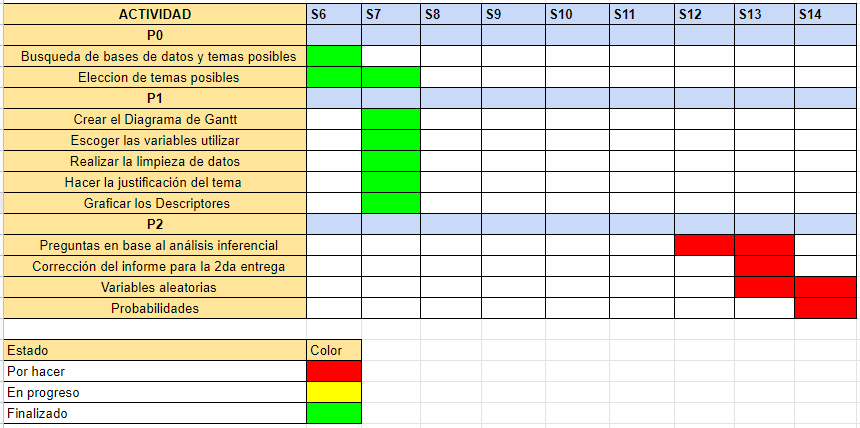

{width="20%"}

------------------------------------------------------------------------

## **Introducción**

------------------------------------------------------------------------

### Descripción del Proyecto y Justificación

Los hábitos saludables son difíciles de desarrollar y, a menudo, requieren un cambio de mentalidad. Pero si está dispuesto a hacer sacrificios para mejorar su salud, el impacto puede ser de gran alcance, independientemente de su edad, sexo o capacidad física. Adoptar hábitos nuevos y más saludables puede mejorar sus ánimos y estilo de vida. Los nuevos hábitos, como una alimentación saludable y actividad física regular, también pueden ayudarlo a controlar su peso y tener más energía.

Hoy en día los hábitos saludables, se han ido dejando muy de lado, y el incremento en el uso de la tecnología y conexiones remotas, ha impulsado el sedentarismo en gran porcentaje de nuestra sociedad. Con el siguiente proyecto buscamos brindar información sobre el nivel de impacto que tienen ciertos hábitos saludables en el rendimiento de una persona a lo largo del día, así como su influencia en la salud en general para alcanzar una mejor calidad de vida.

### Factibilidad

Para cumplir con todas las especificaciones de las entregas, realizamos el siguiente diagrama de Gantt. En él se visualiza de forma más gráfica el progreso a realizar por entregable.

{width="70%"}

### Objetivos

#### **Objetivo Principal**

Determinar la relación entre el rendimiento, la salud y la práctica de ciertos hábitos saludables.

#### **Objetivos Específicos**

-   Describir el nivel diario de estrés por rango de edad.
-   Determinar la existencia de la diferencia entre el grado de estrés en hombres y mujeres.
-   Determinar la relación entre el grado de estrés y el grado de suficiencia.
-   Analizar la consecuencia emocional del estrés en la vida diaria.
-   Determinar la correlación entre los parámetros estudiados y el estrés diario.

### Preguntas de investigación

1\. ¿Qué rango de edad es la que siente más estrés?

2\. ¿El grado de estrés de las mujeres es diferente al de los varones?

3\. ¿Existe una relación entre el grado de suficiencia y el grado de estrés?

4\. ¿Existe una relación entre el grado de estrés y la frecuencia en la que se trata mal a una persona?

5\. ¿Existe una relación entre los parámetros estudiados y el estrés diario?

------------------------------------------------------------------------

## **Database**

------------------------------------------------------------------------

### Proceso de recolección

Los datos obtenidos provienen de una base de datos publica. La estructura del conjunto de datos es la siguiente. Cada fila corresponde a una encuesta y para cada uno, se especifican las siguientes variables:

\- **Timestamp:** Fecha en que se completó la encuesta (en dd/mm/yyyy)

\- **FRUITS_VEGGIES:** cantidad de frutas y verduras ingeridas en un día

\- **DAILY_STRESS:** cantidad de estrés experimenta típicamente todos los días (escala del 1 al 5).

\- **PLACES_VISITED:** cantidad de ciudades visitadas.

\- **CORE_CIRCLE:** cantidad de amigos cercanos.

\- **SUPPORTING_OTHERS:** cantidad de personas ayudadas a lograr una mejor vida.

\- **SOCIAL_NETWORK:** cantidad de personas con las que interactúa típicamente en un día.

\- **ACHIEVEMENT:** cantidad de logros.

\- **DONATION:** cantidad de veces en las que donó tiempo o dinero.

\- **BMI_RANGE:** rango de índice de masa corporal (IMC).

\- **TODO_COMPLETED:** qué tan bien completa la lista semanal de tareas (en escala del 1 al 10).

\- **FLOW:** horas en estado de "flow" alcanzadas en un día típico.

\- **DAILY_STEPS:** cantidad de pasos caminados diariamente (en miles).

\- **LIVE_VISION:** cantidad de años visualizados claramente en el futuro.

\- **SLEEP_HOURS:** horas de sueño.

\- **LOST_VACATION:** días de vacaciones perdidas al año.

\- **DAILY_SHOUTING:** frecuencia con la que se grita o maltrata a alguien.

\- **SUFFICIENT_INCOME:**grado de suficiencia para cubrir los gatos básicos de vida (1 siendo insuficiente y 2 suficiente)

\- **PERSONAL_AWARDS:** cantidad de reconocimientos recibido a lo largo de la vida.

\- **TIME_FOR_PASSION:** cantidad de horas diarias dedicadas a lo que le apasiona.

\- **WEEKLY_MEDITATION:** cantidad de veces meditadas a la semana.

\- **AGE:** grupo de edad.

\- **GENDER:** género

\- **WORK_LIFE_BALANCE_SCORE:** puntuación de balance proporcionada por un algoritmo.

### Población, muestra y muestreo

**Población**

La población de la encuesta trata de personas(hombres y mujeres) adultas con edades de 26 a 36 años, de 36 años 50 y de 50 a mas.

**Muestra**

Para la muestra de esta investigación, de las 15972 encuestas se decidió elegir 500 personas, aleatoria-mente con la condición de que la cantidad de la muestra sea mitad de genero masculino y mitad de genero femenino. Para así tener una muestra representativa sobre el estrés y los hábitos saludables en los adultos, tanto hombres como mujeres.

**Muestreo**

El muestreo realizado en la investigación es un muestreo estratificado, la población la hemos dividido en 2 grupos homogéneos, 1 de hombres y otro de mujeres. En cada estrato hemos hecho un muestreo aleatorio simple, hasta obtener 250 observaciones de cada uno.

------------------------------------------------------------------------

## **Carga de Archivos**

------------------------------------------------------------------------

```{r,include=FALSE}
# Lista de paquetes a usar
paquetesUsar <- c("tidyverse", "readr", "raster", "prettydoc",  "knitr","funModeling","Hmisc","chron","lubridate","modeest","ggplot2","dplyr","descr","vcd","kableExtra","ggrepel","car","corrplot")

# Instalar paquetes no instalados
paquetesInstalar <- paquetesUsar %in% rownames(installed.packages())
if (any(paquetesInstalar == FALSE)) {
  install.packages(paquetesUsar[!paquetesInstalar],repos = "http://cran.us.r-project.org")
}
```

```{r,include=FALSE}
invisible(lapply(paquetesUsar, library, character.only = TRUE))
```

```{r,include=FALSE}
library(tidyverse)
library(readr)
library(knitr)
library(funModeling)
library(raster)
library(Hmisc)
library(chron)
library(lubridate)
library(prettydoc)
library(ggplot2)
library(modeest)
library(dplyr)
library(descr)
library(vcd)
library(kableExtra)
library(corrplot)

options(knitr.kable.NA = '')
```

```{r}
# Leemos el archivo
healthy<- read_csv('Healthy_Habits.csv', col_names = TRUE,  locale = readr::locale(encoding = "UTF-8"))
```

### Variables relevantes

#### **Numéricas**

#### _Numéricas Continuas_

| Variables               | **Definición**                                                                                                                          |
|----------------------------|--------------------------------------------|
| LIVE_VISION             | Cantidad de años de vida por delante, donde el encuestado tiene una visión clara.                                                       |
| DAILY_STEPS             | Cantidad de pasos diarios en miles.                                                                                                     |
| WORK_LIFE_BALANCE_SCORE | Puntaje de vida balanceada calculado por un algoritmo en el dataset. Un mayor puntaje, en teoría significa un mayor balance en tu vida. |

#### _Numéricas Discretas_

| Variables        | **Definición**                                               |
|-------------------------|-----------------------------------------------|
| FRUITS_VEGGIES   | Cantidad de frutas o vegetales que consume al día            |
| CORE_CIRCLE      | Cuantas personas son muy cercanas                            |
| FLOW             | Cuantas horas sueles concentrarte en tus actividades         |
| ACHIEVEMENT      | De cuantos logros notables estas orgulloso                   |
| DAILY_SHOUTING   | Cuantas personas sueles insultar diariamente                 |
| TIME_FOR_PASSION | Cuantas horas dedicas diariamente a hacer lo que te apasiona |

#### **Categóricas**

#### _Categóricas Ordinales_

| Variables      | **Definición**                                      |
|----------------|-----------------------------------------------------|
| AGE            | Edad en rango de los encuestados                   |
| DAILY_STRESS   | Que tanto estrés experimentas diariamente           |
| TODO_COMPLETED | Que tan bien completas tu "to-do list" semanalmente |

#### _Categóricas Nominales_

| Variables | Definición                          |
|-----------|-------------------------------------|
| GENDER    | Genero del encuestado               |
| Timestamp | Fecha en que se realizo la encuesta |

## Limpieza de datos

### Consideraciones para la eliminación de observaciones
Dado que la base de datos originalmente contaba con observaciones con datos incompletos, buscamos eliminarlas para así poder establecer relaciones de la forma más certera posible.

```{r}
healthy$DAILY_STRESS <- as.numeric(healthy$DAILY_STRESS)
healthy <- healthy[complete.cases(healthy),]
knitr::kable(df_status(healthy,print_results=FALSE),caption="Resumen de las variables")
```

```{r,include=FALSE}
summary(healthy)
```

------------------------------------------------------------------------

## **Descriptores Numéricos**

------------------------------------------------------------------------

#### Variable LIVE_VISION
```{r, include=TRUE}
summary(healthy$LIVE_VISION)
```

**Descriptores de Dispersión**
```{r, include=TRUE}
sd(healthy$LIVE_VISION,na.rm=TRUE)
var(healthy$LIVE_VISION,na.rm=TRUE)
cv(healthy$LIVE_VISION,na.rm=TRUE)
```

**Descriptor De Posición**
```{r, include=TRUE}
mean(healthy$LIVE_VISION,na.rm=TRUE)
```

Según los descriptores de dispersión, la desviación estándar es de 3.23 años con respecto a la media de 3.75 años proyectados, y el coeficiente de variación entre la desviación estándar con la media es de 86.11%, por lo que la cantidad de años proyectados entre entre encuestado y encuestado no difieren mucho entre sí, centrándose en aproximadamente 3.75 años proyectados, lo cual se representa mejor usando la media como medida de tendencia central, dado que la cantidad de años proyectados por las personas siguen una distribución normal, es decir, tienden a un valor determinado.

#### Variable DAILY_STEPS
```{r, include=TRUE}
summary(healthy$DAILY_STEPS)
```

**Descriptores de Dispersión**
```{r, include=TRUE}
sd(healthy$DAILY_STEPS,na.rm=TRUE)
var(healthy$DAILY_STEPS,na.rm=TRUE)
cv(healthy$DAILY_STEPS,na.rm=TRUE)
```

**Descriptor De Posición**
```{r, include=TRUE}
mean(healthy$DAILY_STEPS,na.rm=TRUE)
```

Según los descriptores de dispersión, la desviación estándar es de 2.89 mil pasos con respecto a la media de 5.70 mil pasos al día, y el coeficiente de variación entre la desviación estándar con la media es de 50.65%, por lo que la cantidad de pasos al día entre entre encuestado y encuestado no difieren mucho entre sí, centrándose en aproximadamente en 5.70 mil pasos al día, lo cual se representa mejor usando la media como medida de tendencia central, dado que la cantidad de pasos al día saludable siguen una distribución normal, es decir, tienden a un valor determinado.

#### Variable WORK_LIFE_BALANCE_SCORE
```{r, include=TRUE}
summary(healthy$WORK_LIFE_BALANCE_SCORE)
```

**Descriptores de Dispersión**
```{r, include=TRUE}
sd(healthy$WORK_LIFE_BALANCE_SCORE,na.rm=TRUE)
var(healthy$WORK_LIFE_BALANCE_SCORE,na.rm=TRUE)
cv(healthy$WORK_LIFE_BALANCE_SCORE,na.rm=TRUE)
```

**Descriptor De Posición**
```{r, include=TRUE}
mean(healthy$WORK_LIFE_BALANCE_SCORE,na.rm=TRUE)
```

Según los descriptores de dispersión, la desviación estándar es de 45.02 puntos en vida balanceada con respecto a la media de 666.75 de puntaje, y el coeficiente de variación entre la desviación estándar con la media es de 6.75%, por lo que la puntuación de vida balanceada entre entre encuestado y encuestado no difieren mucho entre sí, centrándose en aproximadamente 666.75 puntos de vida balanceada, lo cual se representa mejor usando la media como medida de tendencia central, dado que la puntuaciones de vida saludable siguen una distribución normal, es decir, tienden a un valor determinado.

#### Variable FLOW
```{r, include=TRUE}
summary(healthy$FLOW)
```

**Descriptores de Dispersión**
```{r, include=TRUE}
sd(healthy$FLOW,na.rm=TRUE)
var(healthy$FLOW,na.rm=TRUE)
cv(healthy$FLOW,na.rm=TRUE)
```

**Descriptor De Posición**
```{r, include=TRUE}
mean(healthy$FLOW,na.rm=TRUE)
```

Según los descriptores de dispersión, la desviación estándar es de 2.35 horas en estado de flow con respecto a la media de 3.19 horas, y el coeficiente de variación entre la desviación estándar con la media es de 73.79%, por lo que las horas diarias de flow entre encuestado y encuestado no difieren mucho entre sí, centrándose en aproximadamente 3.19 horas en estado de flow, lo cual se representa mejor usando la media como medida de tendencia central, dado que la cantidad de horas de flow siguen una distribución normal, es decir, tienden a un valor determinado.

#### Variable BMI_RANGE
```{r, include=TRUE}
summary(healthy$BMI_RANGE)
```

**Descriptores de Dispersión**
```{r, include=TRUE}
sd(healthy$BMI_RANGE,na.rm=TRUE)
var(healthy$BMI_RANGE,na.rm=TRUE)
cv(healthy$BMI_RANGE,na.rm=TRUE)
```

**Descriptor De Posición**
```{r, include=TRUE}
mean(healthy$BMI_RANGE,na.rm=TRUE)
```

Según los descriptores de dispersión, la desviación estándar es de 0.49 en el BMI con respecto a la media de 1.41 del BMI, y el coeficiente de variación entre la desviación estándar con la media es de 34.87%, por lo que los valores del BMI entre encuestado y encuestado no difieren mucho entre sí, centrándose en aproximadamente 1.41 BMI, lo cual se representa mejor usando la media como medida de tendencia central, dado que los distintos BMI siguen una distribución normal, es decir, tienden a un valor determinado.

#### Variable ACHIEVEMENT
```{r, include=TRUE}
summary(healthy$ACHIEVEMENT)
```

**Descriptores de Dispersión**
```{r, include=TRUE}
sd(healthy$ACHIEVEMENT,na.rm=TRUE)
var(healthy$ACHIEVEMENT,na.rm=TRUE)
cv(healthy$ACHIEVEMENT,na.rm=TRUE)
```


**Descriptor De Posición**
```{r, include=TRUE}
mean(healthy$ACHIEVEMENT,na.rm=TRUE)
```

Según los descriptores de dispersión, la desviación estándar es de 2.75 logros alcanzados con respecto a la media de 4 logros alcanzados, y el coeficiente de variación entre la desviación estándar con la media es de 68.88%, por lo que la cantidad de logros alcanzados entre encuestado y encuestado no difieren mucho entre sí, centrándose en aproximadamente 4 logros alcanzados, lo cual se representa mejor usando la media como medida de tendencia central, dado que la cantidad de logros alcanzados siguen una distribución normal, es decir, tienden a un valor determinado.

#### Variable WEEKLY_MEDITATION
```{r, include=TRUE}
summary(healthy$WEEKLY_MEDITATION)
```

**Descriptores de Dispersión**
```{r, include=TRUE}
sd(healthy$WEEKLY_MEDITATION,na.rm=TRUE)
var(healthy$WEEKLY_MEDITATION,na.rm=TRUE)
cv(healthy$WEEKLY_MEDITATION,na.rm=TRUE)
```

**Descriptor De Posición**
```{r, include=TRUE}
mean(healthy$WEEKLY_MEDITATION,na.rm=TRUE)
```

Según los descriptores de dispersión, la desviación estándar es de 3.01 sesiones de meditación por semana con respecto a la media de 6.233 sesiones por semana, y el coeficiente de variación entre la desviación estándar con la media es de 48.39%, por lo que la cantidad de sesiones de meditación por semana entre encuestado y encuestado no difieren mucho entre sí, centrándose en aproximadamente 6 sesiones por semana, lo cual se representa mejor usando la media como medida de tendencia central, dado que la cantidad de sesiones por semana siguen una distribución normal, es decir, tienden a un valor determinado.

#### Variable SLEEP_HOURS
```{r, include=TRUE}
summary(healthy$SLEEP_HOURS)
```

**Descriptores de Dispersión**
```{r, include=TRUE}
sd(healthy$SLEEP_HOURS,na.rm=TRUE)
var(healthy$SLEEP_HOURS,na.rm=TRUE)
cv(healthy$SLEEP_HOURS,na.rm=TRUE)
```

**Descriptor De Posición**
```{r, include=TRUE}
mean(healthy$SLEEP_HOURS,na.rm=TRUE)
```

Según los descriptores de dispersión, la desviación estándar es de 1.199 horas de sueño con respecto a la media de 7 horas de sueño, y el coeficiente de variación entre la desviación estándar con la media es de 17.02%, por lo que las horas de sueño entre encuestado y encuestado no difieren mucho entre sí, centrándose en aproximadamente las 7 horas, lo cual se representa mejor usando la media como medida de tendencia central, dado que las horas de sueño siguen una distribución normal, es decir, tienden a un valor determinado.

------------------------------------------------------------------------

## **Descriptores Gráficos**

------------------------------------------------------------------------

### Variables Cualitativas

Se dibujan las variables cualitativas relevantes:

```{r}
#layout
df<-healthy
layout(matrix(c(1,1,1,2,2,2,1,1,1,2,2,2,3,3,3,4,4,4,3,3,3,4,4,4), nrow = 4, ncol = 6, byrow = TRUE))

barplot(table(df$TODO_COMPLETED),col = "#2271b3", main = "Distribución de Todo Completed")

barplot(table(df$SUFFICIENT_INCOME),col = c("#9bcec9", "#e0ffff"), main = "Distribución de Ingreso Suficiente", horiz = TRUE)

barplot(table(df$GENDER),col = c("#dfdfdf", "#ffffbf"), main = "Distribución de Género", horiz = TRUE)

barplot(table(df$DAILY_STRESS),col = "#7d92a5", main = "Distribución de Daily Stress")


```

### Variables Cuantitativas

Se dibujan las variables cuantitativas relevantes

```{r}

#layout
layout(matrix(c(1,1,1,2,2,2,1,1,1,2,2,2,3,3,3,4,4,4,3,3,3,4,4,4), nrow = 4, ncol = 6, byrow = TRUE))

barplot(table(df$ACHIEVEMENT),col = "#B2DCB2", main = "Distribución de Logros", xlab = 'Logros')

barplot(table(df$SLEEP_HOURS),col = "#7d2181", main = "Distribución de Horas de Sueño")

barplot(table(df$DAILY_SHOUTING),col = "#ff8000", main = "Distribución de Daily Shouting",xlab='Daily Shouting')

barplot(table(df$FLOW),col = "#00aae4", main = "Distribución de Flow", xlab='Flow Hours')
```

------------------------------------------------------------------------

## **Detección de Patrones**

------------------------------------------------------------------------

```{r,include=FALSE}
mode <- function(x) {
   return(as.numeric(names(which.max(table(x)))))
}
```

### Edad vs estrés diario

De la inspección visual de la gráfica, percatamos que más del 50% de datos de los encuestados está entre 21 a 50 años de edad. 

Se determinó mediante los descriptores numéricos de media, mediana y moda que el rango de edad que sufre más estrés es del grupo de 36 a 50 años de edad.

```{r}
#layout(matrix(c(1,1,1,2,2,2,1,1,1,2,2,2,3,3,3,4,4,4,3,3,3,4,4,4), nrow = 2, ncol = 6, byrow = TRUE))
edad<-prop.table(table(healthy$AGE))

# Barplot
barplot(edad[c(4,1:3)],xlab="Edad (años)",ylab="Densidad", main="Diagrama de barras del rango de edad")

# Boxplot Indexado
boxplot(healthy$DAILY_STRESS~healthy$AGE,main="Estrés vs Edad" ,ylab="Estrés Diario", xlab="Edad (años)")

```

\n La media, mediana  y moda son obtenidas de la variable *Daily stress* en relación a la variable *Age*.

```{r}
healthy %>% group_by(AGE) %>% summarise(Media=round(mean(DAILY_STRESS),2),Mediana=median(DAILY_STRESS),Moda=mode(DAILY_STRESS))
```


### Género vs Estrés diario
De la inspección visual de la gráfica, percatamos que hay un mayor porcentaje de mujeres que de hombres.

Se determinó mediante las gráficas y los descriptores numéricos de media, mediana y moda que las mujeres sienten más estrés que los hombres.

```{r Género y estrés}
genero<-prop.table(table(healthy$GENDER))
layout(matrix(c(1,1,1,2,2,2,1,1,1,2,2,2,3,3,3,4,4,4,3,3,3,4,4,4), nrow = 4, ncol = 6, byrow = TRUE))
#barplot
barplot(genero,xlab="Género",ylab="Densidad", main="Diagrama de barras de género",col = c("#FFB6C1","#1E90FF"))
# Boxplot Indexado
boxplot(healthy$DAILY_STRESS~healthy$GENDER, ylab="Estrés Diario", xlab="Género",col = c("#FFB6C1","#1E90FF"))
# Mosaico
mosaicplot(table(healthy$AGE,healthy$GENDER),col = c("#FFB6C1","#1E90FF"))
mosaicplot(table(healthy$GENDER,healthy$DAILY_STRESS),ylab="Estres diario",col=c("#F5DEB3","#CDBA96","#EE8262","#CD7054","#8B4C39","#8B0000"))
```

\n\ La media, mediana  y moda son obtenidas de la variable *DAILY_STRESS* en relación a la variable *GENDER*.

```{r}
healthy %>% group_by(GENDER) %>% summarise(Media=round(mean(DAILY_STRESS),2),Mediana=median(DAILY_STRESS),Moda=mode(DAILY_STRESS))
```

### Meditación Semanal vs Eficiencia

De la inspección visual, notamos una relación lineal entre las variables *Weekly Meditation* y *Todo Completed*.

En el gráfico observamos una correlación lineal positiva de 0.18, y es lo esperado, pues mientras más tiempo dedique uno a la meditación, estará menos sobrecargado a la hora de hacer sus labores diarias.

```{r Meditación vs Eficiencia}
cor(healthy$WEEKLY_MEDITATION,healthy$TODO_COMPLETED)
layout(matrix(c(1,1,1,2,2,2,1,1,1,2,2,2,3,3,3,4,4,4,3,3,3,4,4,4), nrow = 4, ncol = 6, byrow = TRUE))

# Mosaico
mosaicplot(table(healthy$WEEKLY_MEDITATION,healthy$TODO_COMPLETED), main = "Mosaico Meditación y Eficiencia" ,col=c("#fafa6e","#c8f073","#97e47d","#65d689","#27c695","#00b59e","#00a4a2","#0091a2","#007e9c","#006c91","#005981","#1f476e","#2a3658"),cex=0.8)

# Boxplot Indexado
boxplot(healthy$WEEKLY_MEDITATION~healthy$TODO_COMPLETED, xlab="Eficiencia", ylab="Meditación")

```

\n\ La media, mediana  y moda son obtenidas de la variable *Todo completed* en relación a la variable *Weekly meditation* .
```{r}
healthy %>% group_by(WEEKLY_MEDITATION) %>% summarise(Media=round(mean(TODO_COMPLETED),2),Mediana=median(TODO_COMPLETED),Moda=mode(TODO_COMPLETED))
```

### Horas de Sueño vs Estrés diario

De la inspección visual, notamos una relación lineal entre las variables *Sleep Hours* y *Daily Stress*.

En el gráfico observamos una correlación lineal positiva de 0.18, y es lo esperado, pues mientras menos tiempo descansemos, más agotados y frustrados estaremos durante el día.

```{r Horas de Sueño vs Estrés Diario}
cor(healthy$SLEEP_HOURS,healthy$DAILY_STRESS)
layout(matrix(c(1,1,1,2,2,2,1,1,1,2,2,2,3,3,3,4,4,4,3,3,3,4,4,4), nrow = 4, ncol = 6, byrow = TRUE))

# Gráfico de Barras
barplot(table(healthy$SLEEP_HOURS,healthy$DAILY_STRESS),col=c("#fafa6e","#c8f073","#97e47d","#65d689","#27c695","#00b59e","#00a4a2","#0091a2","#007e9c","#006c91","#005981","#1f476e","#2a3658"),xlim=c(0,18),legend.text=T,args.legend = list(x=18,inset=c(-15,0),cex=0.8))

# Mosaico
mosaicplot(table(healthy$SLEEP_HOURS,healthy$DAILY_STRESS), main = "Mosaico estrés diario por género",col=c("#fafa6e","#c8f073","#97e47d","#65d689","#27c695","#00b59e","#00a4a2","#0091a2","#007e9c","#006c91","#005981","#1f476e","#2a3658"),cex=0.8)

# Boxplot Indexado
boxplot(healthy$SLEEP_HOURS~healthy$DAILY_STRESS, xlab="Estrés Diario", ylab="Horas de Sueño", main = "Boxplot Relación entre el estré diario y las horas de sueños")

```

\n\ La media, mediana  y moda son obtenidas de la variable *Sleep Hours* en relación a la variable *Daily Stress*.
```{r}
healthy %>% group_by(DAILY_STRESS) %>% summarise(Media=round(mean(SLEEP_HOURS),2),Mediana=median(SLEEP_HOURS),Moda=mode(SLEEP_HOURS))
```

### Redes Sociales vs Círculo Social

De la inspección visual, notamos una relación lineal entre las variables *Social Network* y *Core Circle*.

En el gráfico observamos una correlación lineal positiva de 0.18, y es lo esperado, pues mientras más tiempo dedique uno interactuar en las redes, estará estará más informado sobre sus amigos y familiares.

```{r corrpnvssg}
cor(healthy$SOCIAL_NETWORK,healthy$CORE_CIRCLE)
layout(matrix(c(1,1,1,2,2,2,1,1,1,2,2,2,3,3,3,4,4,4,3,3,3,4,4,4), nrow = 4, ncol = 6, byrow = TRUE))
# Gráfico de Barras
barplot(table(healthy$SOCIAL_NETWORK,healthy$CORE_CIRCLE),col=c("#fafa6e","#c8f073","#97e47d","#65d689","#27c695","#00b59e","#00a4a2","#0091a2","#007e9c","#006c91","#005981","#1f476e","#2a3658"),xlim=c(0,18),legend.text=T,args.legend = list(x=18,inset=c(-15,0),cex=0.8))

# Mosaico
mosaicplot(table(healthy$SOCIAL_NETWORK,healthy$CORE_CIRCLE),col=c("#fafa6e","#c8f073","#97e47d","#65d689","#27c695","#00b59e","#00a4a2","#0091a2","#007e9c","#006c91","#005981","#1f476e","#2a3658"),cex=0.8)

# Boxplot Indexado
boxplot(healthy$SOCIAL_NETWORK~healthy$CORE_CIRCLE, xlab="Círculo de amigos", ylab="Redes Sociales")

# Digrama de dispersión
smoothScatter(df$SOCIAL_NETWORK,df$CORE_CIRCLE,pch=".")

```

\n\ La media, mediana  y moda son obtenidas de la variable *Social network* en relación a la variable *Core circle*.
```{r}
healthy %>% group_by(SOCIAL_NETWORK) %>% summarise(Media=round(mean(CORE_CIRCLE),2),Mediana=median(CORE_CIRCLE),Moda=mode(CORE_CIRCLE))
```

### Estrés vs Insultos Diarios

```{r redes sociales vs insultos diarios}
ESTRES_DIARIO=healthy$DAILY_STRESS
INSULTOS_DIARIO=healthy$DAILY_SHOUTING
boxplot(ESTRES_DIARIO ~ INSULTOS_DIARIO, main = "Boxplot Estrés diario vs Insultos diarios")

```

Podemos observar al realizar los boxplot, que la cantidad de insultos diarios mayor, cuenta con valores de estrés diarios con mediana mas altas(valor de 4). La caja de rango intercuartil es mayormente elevada relacionando la mayor cantidad de insultos diarios, con el nivel máximo de estrés diario. En los valores 6 y 7 podemos notar que la mediana esta pegada a la caja de rango, esto es posiblemente debido a la aparición de datos atípicos mostrados con un punto. No hemos considerado que sean errores, ya que es posible que una persona pueda tener un mal carácter a pesar no tener un nivel de estrés elevado, y nos permite deducir que existen casos donde personas con poco estrés tiendan a tener un mal trato al igual que personas con mucho estrés acumulado, sin embargo es algo no pasa frecuentemente.

La media, mediana  y moda son obtenidas de la variable *Daily shouting* en relación a la variable *Daily stress*.
```{r}
healthy %>% group_by(DAILY_STRESS) %>% summarise(Media=round(mean(DAILY_SHOUTING),2),Mediana=median(DAILY_SHOUTING),Moda=mode(DAILY_SHOUTING))
```

```{r}
layout(matrix(c(1,1,1,2,2,2,1,1,1,2,2,2,3,3,3,4,4,4,3,3,3,4,4,4), nrow = 2, ncol = 6, byrow = TRUE))
hist(x = ESTRES_DIARIO, main = "Histograma de Estrés diario")
hist(x = INSULTOS_DIARIO, main = "Histograma de Insultos diarios")
```

La frecuencia de los datos en el estrés diario vemos que existe una mayor cantidad de estrés medio, el valor de 3. Muy pocos personas consideran no tener estrés. En cuanto a la frecuencia de insultos la mayor cantidad de de frecuencia esta entre 0 y 2 insultos.

```{r}
estres_diario = table(ESTRES_DIARIO,INSULTOS_DIARIO)
mosaicplot(estres_diario,col=c("#fafa6e","#c8f073","#97e47d","#65d689","#27c695","#00b59e","#00a4a2","#0091a2","#007e9c","#006c91","#005981","#1f476e","#2a3658"),main = "Mosaico Cantidad de insultos diarios vs horas de estrés diario")
```

Con este gráfico tabla queda mas claro que la población con un mayor estrés diario tiende un presentar un peor comportamiento que aquellos que tienen un menor nivel de estrés.

-   Sentimiento de realización vs Stress Diario El gráfico tiene una correlación lineal negativa de 0.11. Entonces a pesar de que la influencia no es marcada, se puede observar que el grup las personas con el menor sentimiento de realización (0), tiene una mayor proporción de personas con la mayor sensación de estrés diario (5). Por otro lado, las que poseen el máximo sentimiento de realización (10) tienen una mejor proporción de personas que no presentan estrés.

```{r}
mosaicplot(table(healthy$ACHIEVEMENT,healthy$DAILY_STRESS),col=c("#fafa6e","#c8f073","#97e47d","#65d689","#27c695","#00b59e","#00a4a2","#0091a2","#007e9c","#006c91","#005981","#1f476e","#2a3658"),cex=0.8, xlab = 'ACHIEVEMENT', ylab= 'DAILY STRESS',main = "Mosaico estrés diario vs grado de realización")
```

------------------------------------------------------------------------

## **Análisis Probabilístico**

------------------------------------------------------------------------

### Variables Aleatorias

Para realizar el análisis probabilístico de la muestra se determinaron los siguientes modelos de variables aleatorias para las variables:

#### Grado de Estrés _Geométrica_

La variable aleatoria **Grado de Estrés** cuenta las personas son necesarias seleccionar para encontrar a una que experimente al menos 4 horas de estrés durante el día, es decir, que tenga un alto grado de estrés. Trabaja como un modelo geométrico. Por ejemplo:

La municipalidad de Barranco hace un estudio en donde busca saber el grado de estrés de sus habitantes. Para ello, hace una encuesta donde se busca saber la probabilidad de que la quinta persona encuestada tenga *4 horas a más* de *estrés* al día
```{r}
estres_filtrado =  filter(healthy, ESTRES_DIARIO >= 4)
probability = nrow(estres_filtrado)/nrow(healthy)
probability1 = nrow(estres_filtrado)/nrow(healthy) #Probabilidad de que una persona tenga 4 horas a más de estrés al día.
dgeom(5-1, probability)
```

Entonces:

$$
\require{siunitx}
\begin{aligned}
\mathbb{X}\sim\mathsf{Geo}(p)&\\\\

\text{La función de masa de probabilidad es:}\\
p_{\mathbb{X}}(x)=&(1-p)^{x-1}p\\\\
\color{red}{\underbrace{\overset{1}{\fbox{F}}\overset{2}{\fbox{F}}\overset{3}{\fbox{F}}\cdots\overset{x-1}{\fbox{F}}}_{\text{x-1 fracasos}}}\color{blue}{\overset{x}{\underset{\underset{\underset{\mathbb{X}}{\text{primer éxito}}}{\uparrow}}{\fbox{E}}}}
\end{aligned}
$$


```{r include=FALSE}
coloresbarra<-colores <- c(rep("blue",3), rep("red",23))
```

```{r fig.height=4, fig.width=10}
coloresbarra<-colores <- c(rep("blue",5), 'red')
barplot(dgeom(0:5,prob=probability1),names.arg=c(0:5),main="Función de masa de probabilidad de la variable X", 
     ylab="Probabilidad", xlab="Número de alumnos con un nivel de estrés mayor a 4",col=coloresbarra, cex.main = 0.8,
     cex.axis=0.8,cex.names=0.8,cex.lab=0.8, space = T, xlim = c(0,25)) 
```


#### Nivel de Satisfacción _Binomial_

La variable aleatoria **Nivel de Satisfacción** cuenta las personas que presentan una mayor satisfacción en sus carreras, considerando dedicarse 2 horas a más en lo que les apasiona, y trabaja con un modelo binomial. Por ejemplo:

UTEC busca saber qué tanto sus estudiantes disfrutan su carrera. Para ello, hace un estudio donde se busca saber la probabilidad de que al seleccionar 5 estudiantes al azar, al menos 3 dediquen *2 horas a más al día a sus pasiones*.

```{r}
passion_filtrado =  filter(healthy, TIME_FOR_PASSION >= 2)
probability = nrow(passion_filtrado)/nrow(healthy)#fragmento de código que nos permitirá saber la probablidad de que una persona dedique 2 horas a más a sus pasiones al día.
pbinom(3, 5, probability, lower.tail = FALSE)
```

$$P[\mathbb{X}\geq2]=\sum_{i=2}^{5}P[\mathbb{X}=i]=1-\sum_{i=0}^{1}P[\mathbb{X}=i]=1-P[\mathbb{X}<2]$$.


#### Concentración diaria _Binomial_

La variable aleatoria **Concentración diaria** cuenta las personas que presentan mayor concentración en su tiempo de estudio, encontrándose más de 4 horas al día en estado de flow. Trabaja con un modelo binomial. Por ejemplo:

UTEC busca saber el *grado de concentración de sus estudiantes*. Para ello, hace un experimento donde selecciona a 10 personas al azar y se busca que *al menos 5 superen las 4 horas en estado de flow al día*.

```{r}
flow_filtrado =  filter(healthy, FLOW > 4)
probability = nrow(flow_filtrado)/nrow(healthy)#fragmento de código que nos permitirá saber la probablidad de que una persona pase más de 4 horas al día en estado de flow.

pbinom(5, 10, probability, lower.tail = FALSE)
```

$$P[\mathbb{X}>4]=\sum_{i=5}^{10}P[\mathbb{X}=i]=1-\sum_{i=0}^{4}P[\mathbb{X}=i]=1-P[\mathbb{X}\leq4]$$

### Reglas Probabilísticas

Para determinar que _reglas probabilísticas_ ocurren en cada situación, podemos determinar eventos en una de las variables aleatorias. En este caso usaremos el **Grado de Estrés _Binomial_**:

Podemos establecer _Eventos Mutuamente Excluyentes_ como "Bajo Grado de Estrés" y "Alto Grado de Estrés". Puesto que, si para nosotros "Bajo Grado de Estrés" representa a las personas con menos de 4 horas de estrés durante el día, y un Alto Grado de Estrés a las personas que tienen al menos 4 horas de estrés durante el día, un ensayo de éxito / fracaso no puede determinar a alguien con Alto y Bajo Grado de estrés al mismo tiempo.

Por lo que la **Regla de Multiplicación** sería:

$$
\require{siunitx}
\begin{aligned}
P(A∩B)=0\\\\
\end{aligned}
$$
Dado que no hay una probabilidad de que ambos eventos ocurran de manera simultánea, su probabilidad conjunta es 0.

La **Regla de la Suma** sería:

$$
\require{siunitx}
\begin{aligned}
P(A∪B)=P(A)+P(B)\\\\
\end{aligned}
$$
Podemos ver que la probabilidad de unión de los eventos se encuentra solo sumando las probabilidades de ambos eventos, dado que no tienen probabilidad conjunta.

La **Probabilidad Condicional** sería:

$$
\require{siunitx}
\begin{aligned}
P(A|B)=0\\\\
\end{aligned}
$$
Notamos como la probabilidad de que que se dé A cuando B ya ha ocurrido, o viceversa, es de 0.

Sin embargo, si decidimos establecer _Eventos Independientes_, como "Bajo Grado de Estrés en Experimento 1" y "Bajo Grado de Estrés en Experimento 2", tenemos lo siguiente:

La **Regla de la Multiplicación** ahora si tendría un valor distinto de 0:

$$
\require{siunitx}
\begin{aligned}
P(A∩B)=P(A)P(B)\\\\
\end{aligned}
$$

```{r include=TRUE}
# Donde la probabilidad de A y B sería la misma:
nrow(filter(healthy, ESTRES_DIARIO < 4))/nrow(healthy)
```

Debido a que ambos sucesos si pueden darse de manera simultánea, solo hace falta multiplicar sus probabilidades para encontrar su probabiilidad conjunta.

La **Regla de la Suma** sería:

$$
\require{siunitx}
\begin{aligned}
P(A∪B)=P(A)+P(B)+P(A∩B)\\\\
\end{aligned}
$$
Podemos ver que la probabilidad de unión de los eventos se encuentra sumando tanto las probabilidades de ambos eventos, como su probabilidad conjunta.

Mientras que, la  **Probabilidad Condicional** sería:

$$
\require{siunitx}
\begin{aligned}
P(A|B)=P(A)\\\\
\end{aligned}
$$
Notamos como la probabilidad de que que se dé A cuando B ya ha ocurrido, es exactamente la probabilidad de A, puesto que B no influye en su desarrollo.
