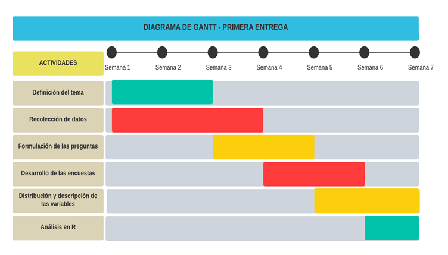

<CENTER>


</CENTER>

# 1.Introducción

El tiempo de los estudiantes en el traslado hacia la universidad podría afectar el buen desempeño académico

### Relevancia

Desde el año 2020 se vienen realizando actividades académicas remotas en la UTEC. Debido a ello, muchos de los estudiantes han encontrado mayor facilidad en tomar las clases virtuales desde la comodidad de sus hogares. Sin embargo, el regreso a la presencialidad ha despertado preocupación en nosotros, pues, para la puntualidad es necesaria una planificación en cuanto al tiempo de traslado (ida y vuelta). 
Muchos alumnos que vienen de los diferentes departamentos del país, recién buscan establecerse cerca a la universidad para poder participar en los laboratorios o vivir la experiencia de la presencialidad. Con esta modalidad se tendrá que manejar un horario más complejo. Es así que nace el dilema de cómo influye el tiempo de traslado en el desempeño académico y qué importancia sobre la puntualidad han notado hasta el momento.

### Planificación

En el siguiente diagrama se puede observar el orden de los objetivos que se trabajó durante las primeras semanas del semestre, en el cual se señala cada actividad con el respectivo tiempo de avance.

<CENTER>



</CENTER>

### Factibilidad

Para llevar a cabo nuestra encuesta apuntaremos a la población objetivo que serán los estudiantes de la Universidad de Ingeniería y Tecnología (UTEC), a los cuales se les pedirá completar una encuesta virtual vía Google Forms. Se seleccionará un tamaño de muestra de 200 personas.

# 2.Datos

### Recolección de datos

El objetivo de nuestro estudio es observar si el tiempo de traslado del hogar a la universidad afecta de alguna manera al desempeño académico de los estudiantes. En base a nuestro objetivo se optó por la realización de una encuesta en Google Forms, en la cual se podría obtener información valiosa de cada estudiante respecto a su desempeño y a las variables relacionadas con el traslado. 

En primer lugar se ejecutó una reunión y se establecieron las variables necesarias para el estudio,luego se establecieron las limitaciones de las variables en donde fuera necesario, y al último, se colocaron ejemplos de la respuesta esperada en algunos ítems para un mejor entendimiento y facilitar la respuesta del encuestado. Finalmente, el equipo realizó una última revisión y se pasó a compartir la encuesta por redes sociales y también se aplicó de manera presencial. Cabe especificar que en ambos casos se llenó el mismo formulario. Además, se trató de recolectar las respuestas de universitarios de segundo ciclo en adelante (dado que ellos ya cuenta con una variable que describe su desempeño académico) y que asistieron de manera híbrida.

### Población, muestra y muestreo

La población de este estudio son los estudiantes de la Universidad de Ingeniería y Tecnología (UTEC). Se usará un total de 200 alumnos de UTEC , entre ellos incluimos a los estudiantes de la Universidad de Ingeniería y Tecnología (UTEC) que están cursando desde el segundo ciclo hasta los alumnos de décimo ciclo. No incluimos a los de primer ciclo porque aún no tienen un promedio. El muestreo es por conveniencia.

### Variables de interés (14 variables a estudiar)

Nuestra base de datos contiene 14 variables de interés para el estudio, de las cuales # son Cualitativas nominales, # Cualitativas ordinales y # Numéricas discretas.

|Variables|Descripción de la variable |Tipo de variable|Restricción|
|:------------------|:-------|:---------------:|:---------------|
|Edad|Edad del estudiante|Numérica discreta|No hubo restricción|
|Sexo|Sexo del estudiante|Categórica nominal|Binario|
|Ciclo|Ciclo del estudiante|Categórica ordinal|No se tomó en cuenta a los de primer ciclo porque no tienen promedio|
|Promedio|Promedio de que obtuvo durante el ciclo anterior|Numérica continua|Ingresar valores entre 0 y 20|
|ZonaResidencia|Zona de dónde procede el estudiante|Categórica nominal |Solo para estudiantes con residencia en Lima Metropolitana|
|Ttrasladomin|Tiempo que les toma en llegar a la universidad en minutos|Numérica continua |Ingresar la cantidad en minutos|
|HoraEntrada|Hora a la que llega usualmente a la universidad diariamente|Categórica nominal |Considerar el sistema de 24 horas|
|HoraSalida|Hora a la que sale usualmente a la universidad| Categórica nominal|Considerar el sistema de 24 horas|
|TipoTransporte|Si se traslada en transporte público o privado| Categórica nominal|Publico o privado|
|Congestion|Como percive la congestión vehicular a la hora de trasladarse hacia la universidad|Categórica nominal|No hubo restricción|
|HorasAutoestudio |Horas de estudio por semana|Numérica discreta |Ingresar la cantidad en horas|
|DiasAlaU|Cantidad de días que van a la universidad por semana|Numérica discreta|El mínimo era 1 día y el máximo 7 días|
|GastoTraslado|Gasto de traslado  en soles de ida y vuelta por día hacia la universidad |Numérica continua|Ingresar el gasto en soles|
|SegmentacionEconomica|La segmentación del estudiante|Categórica Ordinal|Cinco escalas|


### Limpieza de base de datos

```{r Paquetes necesarios, include=FALSE}
# Aplicamos una lógica para instalar paquetes en caso de no estar instalado
lista.paquetes <- c("readr", "funModeling","dplyr","knitr") # En este vector se escriben los paquetes que deseamos cargar
nuevos.paquetes <- lista.paquetes[!(lista.paquetes %in% installed.packages()[,"Package"])] # almacena paquetes no instalados
if(length(nuevos.paquetes)) install.packages(nuevos.paquetes) # instala si no está instalado
```

```{r Lectura de Datos, results='hide',message=FALSE}
library(readr)

DF <- read_csv("Tiempo de traslado VS Desempeño académico - Respuestas de formulario 1.csv")
```

#### Inconvenientes encontrados:
- Se encontró información con NA’s, alumnos de primer ciclo omitieron la pregunta de promedio obtenido el ciclo anterior
- Algunos alumnos confundieron horas de estudio por día en lugar de semana
- Algunos alumnos a la hora de completar horas de entrada o salida no consideraron el sistema de 24 horas
- Algunos alumnos completaron la variable de gasto en soles en el traslado hacia la universidad incluyendo la palabra soles o el simbolo S/.
- Algunos alumnos colocaron decimales incoherentes en el tiempo de traslado como 10,001 o 10,1

#### Se resolvió de la siguiente forma:
- Renombrar las variables para tener más manejo en las demás cálculos
- Se eliminaron algunas variable con información irrelevante para el estudio como por ejemplo, Marca temporal, correo y nombre
- Se usó la variable nombre para 
- Se preguntó a los estudiantes para cambiar la hora de estudios de diario a semanal, también sobre su residencia y tiempo de traslado
- Se consultó por correo a los alumnos que no consideraron el sistema de 24 horas al completar horas de entrada y salida, y modificar el valor


```{r Cambio Nombre a las variables, echo=FALSE, results='hide',message=FALSE}
colnames(DF) <- c("MarcaT","Correo","Nombres","Edad","Sexo","Ciclo","Promedio","ZonaResidencia","Ttrasladomin","HoraEntrada","HoraSalida","DiasAlaU","TipoTransporte","Congestion","GastoTraslado","SegmentacionEconomica","HorasAutoestudio")

```

```{r Borrar datos No Usados,echo=FALSE, results='hide',message=FALSE}
DF$MarcaT <- NULL
DF$Correo <- NULL
DF$Nombres <- NULL

```

```{r Limpieza de zona de residencia,echo=FALSE, results='hide',message=FALSE}
DF$ZonaResidencia[DF$ZonaResidencia %in% c("Barranco")]<-"Lima tradicional"
DF$ZonaResidencia[DF$ZonaResidencia %in% c("Huancayo")]<-"Lima Sur"
```

```{r Limpieza de tiempo de traslado,echo=FALSE, results='hide',message=FALSE}
DF$Ttrasladomin[DF$Ttrasladomin %in% c("10.1")] <- '10'
DF$Ttrasladomin[DF$Ttrasladomin %in% c("11")] <- '10'
DF$Ttrasladomin[DF$Ttrasladomin %in% c("10.001")] <- '10'
```

```{r Limpieza de Gastos,echo=FALSE, results='hide',message=FALSE}
DF$GastoTraslado[DF$GastoTraslado %in% c("6 soles")]<-"6"

DF$GastoTraslado[DF$GastoTraslado %in% c("S/.10", "10 soles")]<- '10'

DF$GastoTraslado[DF$GastoTraslado %in% c("0 voy caminando")]<- '0'

DF$GastoTraslado[DF$GastoTraslado %in% c("S/. 8","8 soles" )]<- '8'

DF$GastoTraslado[DF$GastoTraslado %in% c("S/ 5", "5 soles")]<- '5'

DF$GastoTraslado[DF$GastoTraslado %in% c("30 soles")]<- '30'

DF$GastoTraslado[DF$GastoTraslado %in% c("1 sol")]<- '1'

```


# 3.Análisis descriptivo

## Descriptores Numéricos

### Edad

#### Mediana , Media y Moda

```{r, echo=FALSE, message=TRUE}
Moda <- function(x) {
  DatosSinNulos <- na.omit(unique(x))
  tabulado <- tabulate(match(x, DatosSinNulos))
  DatosSinNulos[tabulado == max(tabulado) ]
}

median(DF$Edad, na.rm=TRUE)
mean(DF$Edad, na.rm=TRUE)
Moda(DF$Edad)
```


### Ciclo

#### Mediana , Moda y cuartiles

```{r, echo=FALSE, message=TRUE}

median(DF$Ciclo, na.rm=TRUE)
Moda(DF$Ciclo)
quantile(as.numeric(DF$Ciclo),na.rm = TRUE)
```

### Promedio

#### Media, Mediana , Moda, Cuartiles, min, max
```{r , echo=FALSE, message=TRUE}
summary(DF$Promedio)
quantile(as.numeric(DF$Promedio),na.rm = TRUE)
```

### Zona de residencia

#### Moda
```{r, echo=FALSE, message=TRUE}
Moda(DF$ZonaResidencia)
```

### Tiempo de traslado en minutos del hogar a la universidad

#### Media, Mediana , Moda, Cuartiles, min, max

```{r , echo=FALSE, message=TRUE}
summary(DF$Ttrasladomin)
quantile(as.numeric(DF$Ttrasladomin),na.rm = TRUE)
```

### Hora usual de entrada a la universidad

#### Moda
```{r, echo=FALSE, message=TRUE}
Moda(DF$HoraEntrada)
```

### Hora usual de salida de la universidad

#### Moda
```{r, echo=FALSE, message=TRUE}
Moda(DF$HoraSalida)
```

### Cantidad de días que van a la universidad por semana

#### Mediana , Media y Moda

```{r, echo=FALSE, message=TRUE}
median(DF$DiasAlaU, na.rm=TRUE)
mean(DF$DiasAlaU, na.rm=TRUE)
Moda(DF$DiasAlaU)
```

#### RANGO

```{r, echo=FALSE, message=TRUE}
range(DF$DiasAlaU,na.rm = TRUE)

```

#### Varianza

```{r, echo=FALSE, message=TRUE}
var(DF$DiasAlaU,na.rm = TRUE)

```


#### Desviación Estándar

```{r, echo=FALSE, message=TRUE}
sd(DF$DiasAlaU,na.rm = TRUE)

```

#### Rango Intercuartílico

```{r,echo=FALSE, message=TRUE}
IQR(DF$DiasAlaU,na.rm = TRUE)

```


### Tipo de transporte

#### Moda
```{r, echo=FALSE, message=TRUE}
Moda(DF$TipoTransporte)
```

### Magnitud de congestión vehicular

#### Moda

```{r, echo=FALSE, message=TRUE}
Moda(DF$Congestion)
```

### Gasto de traslado S/.(ida y vuelta) por día

#### Media, Mediana , Moda, Cuartiles, min, max
```{r , echo=FALSE, message=TRUE}
summary(DF$GastoTraslado)
quantile(as.numeric(DF$GastoTraslado),na.rm = TRUE)
```

### Segmentación económica

#### Moda

```{r, echo=FALSE, message=TRUE}
Moda(DF$SegmentacionEconomica)
```

### Horas de autoestudio por semana

#### Mediana , Media y Moda

```{r, echo=FALSE, message=TRUE}
median(DF$HorasAutoestudio, na.rm=TRUE)
mean(DF$HorasAutoestudio, na.rm=TRUE)
Moda(DF$HorasAutoestudio)
```

## Descriptores Gráficos 

-	EDAD

```{r Diagrama edad, echo=FALSE, message=TRUE}
stripchart(DF$Edad, method = "jitter", col=5, pch = 19,main = "Diagrama de edad",xlab = "Edades", ylab = "Frecuencia Relativa" )

```

-	SEXO

```{r Grafico Torta, echo=FALSE, message=TRUE}
pie(table(DF$Sexo), labels = paste(c(42.1,57.9),"%"),col = c("pink","lightblue"),clockwise = TRUE, main = "Grafico de Sexo")

legend("topleft", legend = c("Masculino","Femenino"), fill =c("lightblue","pink"))
```

-	CICLO

```{r Grafico de barra, echo=FALSE, message=TRUE}
barplot(table(DF$Ciclo), main = "Grafico de Ciclos",xlab = "Ciclos", ylab = "Frecuencia", ylim = c(0,70))
```

-	PROMEDIO DEL CICLO PASADO

```{r, echo=FALSE, message=TRUE}
hist(DF$Promedio, breaks = 100, xlab = "Notas", ylab = "Frecuencia Relativa", main="Histograma de Promedio", col = "red", probability = TRUE)
```

## Patrones

-	**GASTO DE TRASLADO VS TIEMPO DE TRASLADO**

```{r , echo=FALSE, message=TRUE}
smoothScatter(as.numeric(DF$GastoTraslado), DF$Ttrasladomin, xlab='Gasto en traslado', ylab= 'Tiempo de traslado(min)', main="GASTO DE TRASLADO VS TIEMPO DE TRASLADO")
```

A simple vista encontramos una tendencia a crecer entre ambas variables, además, los datos resultan ser más densos al comienzo.


#### Covarianza

```{r , echo=FALSE, message=TRUE}

round(cov(as.numeric(DF$GastoTraslado),as.numeric(DF$Ttrasladomin)),2)
```
#### Correlacion

```{r , echo=FALSE, message=TRUE}
round(cor(as.numeric(DF$GastoTraslado),as.numeric(DF$Ttrasladomin)),2)
```

Observamos que la covarianza es positiva, por lo tanto, cuando una de las variables crece o aumente la otra también.Esto tiene sentido, ya que, al pasar mayor tiempo viajando a la universidad, se realiza más gasto. Lo mismo podríamos decir de la correlación, resulta positiva y al no estar considerablemente cercana a 1, decimos que el grado de relación no es tan alto.

-	**HORAS DE ESTUDIO VS PROMEDIO**

```{r , echo=FALSE, message=TRUE}
plot(DF$HorasAutoestudio,DF$Promedio, ylab = "Promedio", xlab = "Horas de estudio", col = 'purple',main="HORAS DE ESTUDIO VS PROMEDIO")
```

#### Covarianza
```{r, echo=FALSE, message=TRUE}
round(cov(as.numeric(DF$HorasAutoestudio),DF$Promedio),2)
```


#### Correlación
```{r, echo=FALSE, message=TRUE}
round(cor(as.numeric(DF$HorasAutoestudio),DF$Promedio),2)
```

La covarianza es positiva por lo que la relacion entre las variables es creciente, es decir, cuando una aumenta la otra también. Es lógico debido a que si un estudiante dedica más tiempo a estudiar, obtendrá mejor promedio.

-	**HORA DE ENTRADA VS CONGESTIÓN**

```{r, echo=FALSE, message=TRUE}
mosaicplot(table(DF$HoraEntrada,DF$Congestion),col=c("slategray3","orange","mediumorchid1"),main="Hora de entrada VS nivel de congestión")
```

De la gráfica podemos observar que la congestión moderada se percibe en las primeras horas (7 a 9 hrs)


