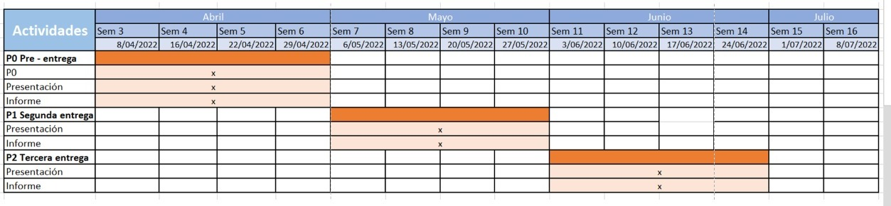

```{r}
if(!require(readr)){install.packages('readr')}
if(!require(dplyr)){install.packages('dplyr')}
if(!require(ggplot2)){install.packages('ggplot2')}
if(!require(modeest)){install.packages('modeest')}
if(!require(modeest)){install.packages('MASS')}
library(readr)
library(dplyr)
library(ggplot2)
library(modeest)
library(MASS)
```

```{r}
DF <- read_csv("datos2.csv")
```

Eliminamos la variable que nos dice la hora que resolvieron la encuesta
```{r}
DF_sinMC <- DF %>% dplyr::select(!`Marca temporal`)
```

Nos quedamos con las encuestas útiles. porque las otras no nos sirven. (no cumplen nuestro propósito)
```{r}
DF_filtrado <- DF_sinMC %>% filter(`Si ya llevaste el curso de "Estadística y Probabilidades I" o no es la 1ra vez que lo llevas responde "Sí", caso contrario responde "No"`=='Sí')
```

```{r}
DFC <- DF_filtrado %>% dplyr::select(!`Si ya llevaste el curso de "Estadística y Probabilidades I" o no es la 1ra vez que lo llevas responde "Sí", caso contrario responde "No"`)
```

Renombramiento:
```{r}
DFC %>% rename(
  sexo = Sexo,
  estado_curso = `Aprobaste, desaprobaste o te retiraste del curso durante ese ciclo?`,
  carrera = `¿En qué carrera estabas cuando cursaste el curso? (USA EL SIGUIENTE FORMATO: ingenieria *tu_carrera*) (TODO EN MINÚSCULAS Y SIN TILDE)`,
  ciclo = `¿En qué ciclo te encontrabas cuando cursaste el curso?`,
  estado_animo = `¿Cómo te sentías anímicamente de manera regular durante el semestre en el cual tomaste el curso? (Tu estado de ánimo)`,
  vive_solo = `¿Vivías solo durante ese ciclo académico? (vivir independientemente)`,
  sufrio_enfermedad = `¿Sufriste de alguna enfermedad durante ese periodo académico?`,
  sociable = `¿Qué tan activamente social fuiste durante ese periodo académico?`,
  anho = `¿En qué año cursaste el curso? (ejem: 2017)`,
  edad = `¿Qué edad tenías cuando cursaste el curso? (poner solo el valor numérico, ejem: 19)`,
  cant_hrs_ejercicio = `¿Cuántas horas de actividad física realizabas semanalmente? (poner solo el valor numérico, ejem: 5.5)`,
  cant_hrs_extraestudio = `¿Cuántas horas extraacadémicas  semanales le dedicabas al curso? (excluyendo las mentorías, asesorías y clases) (poner solo el valor numérico, ejem: 5.5)`,
  cant_hrs_ocio = `¿Cantidad de horas recreativas semanales? (Ejemplo: salir con amigos, ir al cine, videojuegos, etc.) (poner solo el valor numérico, ejem: 4)`,
  can_cursos = `¿Cuántos cursos llevabas durante ese ciclo académico?(incluyendo el curso de estadística) (poner solo el valor numérico, ejem: 5)`,
  cant_comidas = `¿Cuántas veces al día comías? (poner solo el valor numérico, ejem: 3)`
) -> DFN
```

Funciones útiles

```{r}
round2 = function(x) round(x, digits = 2)
ordenar.ordinal = function(ordinal, orden) factor(as.factor(ordinal), levels = orden)
```


```{r}
DFN
```

# Introducción

## Relevancia

El presente tema es relevante debido a que se relaciona con el reto universitario, uno de los desafíos más importantes para los jóvenes. En esta oportunidad, aterrizamos en el curso de Estadística y probabilidades I (EyP I) de la UTEC, curso el cual es general, es decir, que llevan todas las carreras en dicha universidad. Más específicamente, nos enfocaremos en las variables que intervienen en éxito o fracaso al cursar el curso en cuestión. Antes de empezar con lo demás, se debe aclarar que con éxito nos referimos a aquellos estudiantes que lograron aprobar el curso, y con fracaso, a aquellos estudiantes que no aprobaron o se retiraron.

## Planificación
```{r echo=FALSE,  fig.align='center', out.width='100%'}

```

# Datos

## Recolección de datos

Para obtener los datos realizamos una encuesta usando Google Forms. La encuesta fue entregada a los estudiantes de UTEC. La encuesta es válida para estudiantes que ya llevaron el curso de Estadística y Probabilidades I mínimo una vez (aprobándolo, desaprobándolo o retirándose). La encuesta fue difundida por distintos medios como grupos de WhatsApp de la universidad, servidores de discord, grupos de telegram, amigos de la universidad, etc.
 
Cabe mencionar que se realiza un filtro dentro de la encuesta con una pregunta de SÍ y NO que valida o invalida la encuesta (de acuerdo a nuestra condición sobre haber llevado el curso previamente). De esta manera, realizamos un tipo de Muestreo Aleatorio Simple (MAS) con las restricciones necesarias.

## Población, muestra y muestreo

La población son todos los estudiantes de UTEC.
La muestra son los estudiantes de UTEC que ya llevaron el curso de Estadística y Probabilidades I, mínimo una vez.
El muestreo es MAS (muestreo aleatorio simple). Puesto que, del conjunto de estudiantes UTEC, obtenemos de forma aleatoria nuestras encuestas y filtramos las que no cumplen con nuestra restricción sobre ya haber llevado el curso previamente.

## Variables

|Variable               |Tipo                   |Restricción                                    |
|:----------------------|:----------------------|:----------------------------------------------|
|carrera                |Categórica nominal     |Dentro del rango de carreras de la universidad |
|sexo                   |Categórica nominal     |2 posibles valores                             |
|ciclo                  |Categórica ordinal     |Dentro del rango 2 a 9                         |
|estado_animo           |Categórica ordinal     |Dentro del rango establecido                   |
|vive_solo              |Categórica nominal     |Pregunta de SI o NO                            |
|sociable               |Categórica ordinal     |Dentro del rango establecido                   |
|sufrio_enfermedad      |Categórica nominal     |Pregunta de SI o NO                            |
|año                    |Numérica discreta      |Rango dentro de los últimos 4 años             |
|edad                   |Numérica discreta      |Natural positivo                               |
|cant_hrs_ejercicio     |Numérica continua      |Natural positivo                               |
|cant_hrs_extraestudio  |Numérica continua      |Natural positivo                               |
|cant_hrs_ocio          |Numérica continua      |Natural positivo                               |
|can_cursos             |Numérica discreta      |Natural positivo                               |
|cant_comidas           |Numérica discreta      |Natural positivo                               |
|estado_curso           |Categórica nominal     |Dentro del rango establecido                   |


## Limpieza de base de datos

Después de la carga de la base de datos, denominado como "DF", acudimos a nuestra pregunta filtro (Si ya llevaron el curso marcan SI y la respuesta es válida, caso contrario se elimina) y hacemos uso del comando "select" de la pregunta filtro donde la respuesta es válida, lo asignamos a un nuevo Data Frame "DFN" y tenemos el nuevo data frame con respuestas de estudiantes que ya han llevado el curso de Estadística y Probabilidades 1 mínimo una vez.

# Análisis descriptivo

## Variable 'Sociable'

Qué tan sociable fue el estudiante durante el transcurso del curso de EyP I.

```{r}
# usamos factor para establecer el orden.
DFN$sociable = factor(as.factor(DFN$sociable), levels = c('No sociable','No muy sociable','Sociable','Muy sociable'))
```
```{r}
barplot(table(DFN$sociable), main='Sociabilidad durante el curso', xlab = 'Sociabilidad', ylab = 'Frecuencia', col='darkmagenta')

barplot(prop.table(table(DFN$sociable)), main='Sociabilidad durante el curso', xlab = 'Sociabilidad', ylab = 'Proporción', col='darkmagenta')

round(prop.table(table(DFN$sociable)),2)
```
Observamos que en proporción tenemos un 43% de personas que se consideraron no muy sociables y un 41% de personas que se consideraron sociables cuando pasaron por el curso. El restante 7% y 9% corresponden a los que se consideraron no sociables y muy sociables respectivamente. Esta proporción nos indican que la mayoría de los estudiantes eran al menos un poco sociables, lo que significa que son estudiantes con buena capacidad para comunicarse con los demás y este aspecto en el curso, es bastante relevante, ya que gran porcentaje de la nota del curso se basa en un proyecto en equipo. Por ende, es bastante útil saber qué tan sociables eran los estudiantes, pues influye en su éxito o fracaso en el curso.

## Variable 'Año'

En qué años los estudiantes llevaron el curso de EyP I.

```{r}
paste('Año minimo: ', min(DFN$anho))
paste('Año maximo: ', max(DFN$anho))
paste('Rango: ', max(DFN$anho)-min(DFN$anho), 'años')
paste('Rango intercuartil:', IQR(DFN$anho), 'año')
paste('Mediana: ', round(median(DFN$anho),2))
paste('Promedio: ', round(mean(DFN$anho),2))
paste('Desviación estandar: ', round(sd(DFN$anho),2))
paste('Coeficiennte de variación: ', round(sd(DFN$anho)/mean(DFN$anho),5))
```

```{r}
boxplot(DFN$anho, col = 'darkmagenta', main='Año el que el estudiante llevo el curso', xlab='Año')
abline(h=median(DFN$anho), col='red')
legend("right", 
       legend = "median", 
       fill = 'red')
af <- mean(DFN$anho) ## promdeio
bf <- median(DFN$anho) ## mediana
cf <- sd(DFN$anho) ## deviacion estandar
df <- var(DFN$anho) ##  variacion
ef <- (sd(DFN$anho) / mean(DFN$anho) ) * 100  ## coeficiente de variacion
ff <- range(DFN$anho)
cat("La media es:", af,"La mediana es:", bf,"La desviación estandar es:", cf,"La varianza es:", df,"El coeficiente de variación es:", ef,"El rango es:", ff)
```
Observamos que más del 50% de estudiantes se encuentran entre el año 2020 y 2021. Con algunos datos atípicos pero reales. Además, el hecho de que descriptores como la media o mediana indiquen un año, es útil para poder afirmar que justamente en ese año o en los demás, han existido ciertos factores que influyeron en el éxito o fracaso de los estudiantes. 
```{r}
hist(DFN$anho, prob = TRUE,
     main = "Año el que el estudiante llevo el curso",xlab="Año", ylab = "Densidad", col="darkmagenta")
x <- seq(min(DFN$anho), max(DFN$anho), length = 40)
f <- dnorm(x, mean = mean(DFN$anho), sd = sd(DFN$anho))
lines(x, f, col = "red", lwd = 2)

abline(v=mean(DFN$anho), col='red')
abline(v=median(DFN$anho), col='blue')
legend('topleft', legend=c('mean','median'), fill=c('red','blue'))

h <- hist(DFN$anho,ylim=c(0,100), main="Año el que el estudiante llevo el curso", xlab="Año", ylab="Frecuencia", col="darkmagenta")
text(h$mids,h$counts,labels=h$counts, adj=c(0.5, -0.5))
abline(v=mean(DFN$anho), col='red')
abline(v=median(DFN$anho), col='blue')
legend('topleft', legend=c('mean','median'), fill=c('red','blue'))
ag <- mean(DFN$anho) ## promdeio
bg <- median(DFN$anho) ## mediana
cg <- sd(DFN$anho) ## deviacion estandar
dg <- var(DFN$anho) ##  variacion
eg <- (sd(DFN$anho) / mean(DFN$anho) ) * 100  ## coeficiente de variacion
fg <- range(DFN$anho)
cat("La media es:", ag,"La mediana es:", bg,"La desviación estandar es:", cg,"La varianza es:", dg,"El coeficiente de variación es:", eg,"El rango es:", fg)
```

Observamos que la mayoría de estudiantes pertenecen entre los años 2020 y 2021 y que esta sesgada a la izquierda

## Variable 'Edad'

Edad en la que los estudiantes llevaron el curso de EyP I.

```{r}
paste('Edad minimo: ', min(DFN$edad))
paste('Edad maximo: ', max(DFN$edad))
paste('Rango: ', max(DFN$edad)-min(DFN$edad), 'años')
paste('Rango intercuartil:', IQR(DFN$edad), 'año')
paste('Mediana: ', round(median(DFN$edad),2))
paste('Promedio: ', round(mean(DFN$edad),2))
paste('Desviación estandar: ', round(sd(DFN$edad),2))
paste('Coeficiennte de variación: ', round(sd(DFN$edad)/mean(DFN$edad),2))
```

```{r}
boxplot(DFN$edad, col = 'darkmagenta', main='Edad de los estudiantes', ylab='Edad')
abline(h=median(DFN$edad), col='red')
legend("right", 
       legend = "median", 
       fill = 'red')
ah <- mean(DFN$edad) ## promdeio
bh <- median(DFN$edad) ## mediana
ch <- sd(DFN$edad) ## deviacion estandar
dh <- var(DFN$edad) ##  variacion
eh <- (sd(DFN$edad) / mean(DFN$edad) ) * 100  ## coeficiente de variacion
fh <- range(DFN$edad)
cat("La media es:", ah,"La mediana es:", bh,"La desviación estandar es:", ch,"La varianza es:", dh,"El coeficiente de variación es:", eh,"El rango es:", fh)
```
Observamos que más del 50% de estudiantes tienen entre 17 y 19 años. Con algunos datos atípicos pero reales. Esta variable es relevante por el hecho que podemos saber que en cierto rango de edades, pueden existir más aprobados que desaprobados o retirados, y aspectos relacionados con la edad como la madurez son también determinantes en el éxito o fracaso de los estudiantes.

```{r}
hist(DFN$edad, prob = TRUE,
     main = "Edad de los estudiantes",xlab="Edad", ylab = "Densidad", col="darkmagenta")
x <- seq(min(DFN$edad), max(DFN$edad), length = 40)
f <- dnorm(x, mean = mean(DFN$edad), sd = sd(DFN$edad))
lines(x, f, col = "red", lwd = 2)

abline(v=mean(DFN$edad), col='red')
abline(v=median(DFN$edad), col='blue')
legend('topleft', legend=c('mean','median'), fill=c('red','blue'))

h <- hist(DFN$edad,ylim=c(0,60), main="Edad de los estudiantes", xlab="Edad", ylab="Frecuencia", col="darkmagenta")
text(h$mids,h$counts,labels=h$counts, adj=c(0.5, -0.5))
abline(v=mean(DFN$edad), col='red')
abline(v=median(DFN$edad), col='blue')
legend('topleft', legend=c('mean','median'), fill=c('red','blue'))
ai <- mean(DFN$edad) ## promdeio
bi <- median(DFN$edad) ## mediana
ci <- sd(DFN$edad) ## deviacion estandar
di <- var(DFN$edad) ##  variacion
ei <- (sd(DFN$edad) / mean(DFN$edad) ) * 100  ## coeficiente de variacion
fi <- range(DFN$edad)
cat("La media es:", ai,"La mediana es:", bi,"La desviación estandar es:", ci,"La varianza es:", di,"El coeficiente de variación es:", ei,"El rango es:", fi)
```

## Variable 'Carrera'

Carrera de los estudiantes que llevaron el curso de EyP I.

Limpieza de datos:

```{r}
DFN$carrera[DFN$carrera == 'ambiental'] <- 'Ing. Ambiental'
DFN$carrera[DFN$carrera == 'ingenieria ambiental'] <- 'Ing. Ambiental'
DFN$carrera[DFN$carrera == 'bioingenieria'] <- 'Bioingeniería'
DFN$carrera[DFN$carrera == 'Bioingenieria'] <- 'Bioingeniería'
DFN$carrera[DFN$carrera == 'ciencia de datos'] <- 'Ciencia de Datos'
DFN$carrera[DFN$carrera == 'ciencia de la computacion'] <- 'Computer Science'
DFN$carrera[DFN$carrera == 'ciencia de la computación'] <- 'Computer Science'
DFN$carrera[DFN$carrera == 'ciencias de la computacion'] <- 'Computer Science'
DFN$carrera[DFN$carrera == 'computer science'] <- 'Computer Science'
DFN$carrera[DFN$carrera == 'cs'] <- 'Computer Science'
DFN$carrera[DFN$carrera == 'civil'] <- 'Ing. Civil'
DFN$carrera[DFN$carrera == 'ingenieria civil'] <- 'Ing. Civil'
DFN$carrera[DFN$carrera == 'Ingeniería civil'] <- 'Ing. Civil'
DFN$carrera[DFN$carrera == 'electronica'] <- 'Ing. Electrónica'
DFN$carrera[DFN$carrera == 'ingenieria electronica'] <- 'Ing. Electrónica'
DFN$carrera[DFN$carrera == 'ingeniera electronica'] <- 'Ing. Electrónica'
DFN$carrera[DFN$carrera == 'Energia'] <- 'Ing. de la Energía'
DFN$carrera[DFN$carrera == 'ingenieria de la energia'] <- 'Ing. de la Energía'
DFN$carrera[DFN$carrera == 'iindustrial'] <- 'Ing. Industrial'
DFN$carrera[DFN$carrera == 'industrial'] <- 'Ing. Industrial'
DFN$carrera[DFN$carrera == 'ingeniera industrial'] <- 'Ing. Industrial'
DFN$carrera[DFN$carrera == 'ingenieria industria'] <- 'Ing. Industrial'
DFN$carrera[DFN$carrera == 'ingenieria industrial'] <- 'Ing. Industrial'
DFN$carrera[DFN$carrera == 'Ingenieria Industrial'] <- 'Ing. Industrial'
DFN$carrera[DFN$carrera == 'ingenieria de quimica'] <- 'Ing. Química'
DFN$carrera[DFN$carrera == 'ingenieria quimica'] <- 'Ing. Química'
DFN$carrera[DFN$carrera == 'quimica'] <- 'Ing. Química'
DFN$carrera[DFN$carrera == 'quimicxa'] <- 'Ing. Química'
DFN$carrera[DFN$carrera == 'ingenieria mecanica'] <- 'Ing. Mecánica'
DFN$carrera[DFN$carrera == 'Ingeniería Mecánica'] <- 'Ing. Mecánica'
DFN$carrera[DFN$carrera == 'mecanica'] <- 'Ing. Mecánica'
DFN$carrera[DFN$carrera == 'ingenieria mecatronica'] <- 'Ing. Mecatrónica'
DFN$carrera[DFN$carrera == 'Ingenieria mecatronica'] <- 'Ing. Mecatrónica'
DFN$carrera[DFN$carrera == 'INGENIERIA MECATRONICA'] <- 'Ing. Mecatrónica'
DFN$carrera[DFN$carrera == 'mecatronica'] <- 'Ing. Mecatrónica'
DFN$carrera[DFN$carrera == 'Mecatronica'] <- 'Ing. Mecatrónica'

```

```{r}

barplot(table(DFN$carrera), main='Carrera de los estudiantes', ylab = 'Frecuencia', col='darkmagenta', las=2)
barplot(prop.table(table(DFN$carrera)), main='Carrera de los estudiantes', ylab = 'Proporción', col='darkmagenta', las=2)
round(prop.table(table(DFN$carrera)),2)
```
En base a esto, se puede observar que el mayor número de estudiantes que respondieron la encuesta pertenecen a la carrera de Ingeniería Mecánica. Y que el menor número de estudiantes pertenecen a la carrera de Ciencia de Datos. 

##  Variable 'sexo'

Sexo de los estudiante que llevaron el curso de EyP I.

```{r}
barplot(table(DFN$sexo), main='Sexo de los estudiantes', ylab = 'Frecuencia', col='darkmagenta', las=1)
barplot(prop.table(table(DFN$sexo)), main='Sexo de los estudiantes', ylab = 'Proporción', col='darkmagenta', las=1)
round(prop.table(table(DFN$sexo)),2)
```
En este caso, se ve que la mayor parte de encuestados son hombres, representando el 66% del total.

##  Variable 'Ciclo'

Ciclo de los estudiantes cuando llevaron el curso de EyP I.

```{r}
barplot(table(DFN$ciclo), main='Ciclo de los estudiantes', ylab = 'Frecuencia', col='darkmagenta', las=1)
barplot(prop.table(table(DFN$ciclo)), main='Ciclo de los estudiantes', ylab = 'Proporción', col='darkmagenta', las=1)
round(prop.table(table(DFN$ciclo)),2)
```
De acuerdo a lo presentado, el ciclo en el que la mayor parte de encuestados llevó el curso EyP I, es en el ciclo III (39%), y tiene mucho sentido con la realidad, puesto que en el III ciclo es donde la mayoría de carreras tiene el curso en su malla curricular.


## Variable 'cant_hrs_ejercicio'

Cantidad de horas de ejercicio de los estudiantes cuando llevaron el curso de EyP I.

```{r}
paste('Hora mínima: ', min(DFN$cant_hrs_ejercicio))
paste('Hora máxima: ', max(DFN$cant_hrs_ejercicio))
paste('Rango: ', max(DFN$cant_hrs_ejercicio)-min(DFN$cant_hrs_ejercicio), 'horas')
paste('Mediana: ', round(median(DFN$cant_hrs_ejercicio),2))
paste('Promedio: ', round(mean(DFN$cant_hrs_ejercicio),2))
paste('Desviación estándar: ', round(sd(DFN$cant_hrs_ejercicio),2))
paste('Coeficiente de variación: ', round(sd(DFN$cant_hrs_ejercicio)/mean(DFN$cant_hrs_ejercicio),2))
```

```{r}
boxplot(DFN$cant_hrs_ejercicio, col = 'darkmagenta', main='Cantidad de horas de ejercicio', ylab='Horas')
abline(h=median(DFN$cant_hrs_ejercicio), col='red')
legend("right", 
       legend = "median", 
       fill = 'red')
```

```{r}
hist(DFN$cant_hrs_ejercicio,
main="Cantidad de horas de ejercicio",
xlab="Horas",
ylim=c(0,1),
ylab="Densidad",
col="darkmagenta",
freq=FALSE
)
abline(v=mean(DFN$cant_hrs_ejercicio), col='red')
abline(v=median(DFN$cant_hrs_ejercicio), col='blue')
legend('topleft', legend=c('mean','median'), fill=c('red','blue'))

h <- hist(DFN$cant_hrs_ejercicio,ylim=c(0,60), main="Cantidad de horas de ejercicio", xlab="Horas", ylab="Frecuencia", col="darkmagenta")
text(h$mids,h$counts,labels=h$counts, adj=c(0.5, -0.5))
abline(v=mean(DFN$cant_hrs_ejercicio), col='red')
abline(v=median(DFN$cant_hrs_ejercicio), col='blue')
legend('topleft', legend=c('mean','median'), fill=c('red','blue'))
h <- hist(DFN$cant_hrs_ejercicio,freq=FALSE, main="Cantidad de horas de ejercicio",ylim=c(0,0.2), xlab="Horas", ylab="Densidad", col="darkmagenta")
text(h$mids,h$counts,labels=h$counts, adj=c(0.5, -0.5))
abline(v=mean(DFN$cant_hrs_ejercicio), col='red')
abline(v=median(DFN$cant_hrs_ejercicio), col='blue')
legend('topleft', legend=c('mean','median'), fill=c('red','blue'))
lines(density(DFN$cant_hrs_ejercicio),col="red",lwd=2)
curve(dnorm(x,mean=mean(DFN$cant_hrs_ejercicio),sd=sd(DFN$cant_hrs_ejercicio)), from=0,to=20, 
      add=TRUE, col="blue", lwd=2)
```
Gracias a esto, podemos afirmar que el promedio de horas de ejercicio de todos los encuestados es de 5 horas. Teniendo como 15 horas el máximo y 0 horas el mínimo.

## Variable 'cant_hrs_extraestudio'

Cantidad de horas de ejercicio de los estudiantes cuando llevaron el curso de EyP I.

```{r}
paste('Hora mínima: ', min(DFN$cant_hrs_extraestudio))
paste('Hora máxima: ', max(DFN$cant_hrs_extraestudio))
paste('Rango: ', max(DFN$cant_hrs_extraestudio)-min(DFN$cant_hrs_extraestudio), 'horas')
paste('Mediana: ', round(median(DFN$cant_hrs_extraestudio),2))
paste('Promedio: ', round(mean(DFN$cant_hrs_extraestudio),2))
paste('Desviación estándar: ', round(sd(DFN$cant_hrs_extraestudio),2))
paste('Coeficiente de variación: ', round(sd(DFN$cant_hrs_extraestudio)/mean(DFN$cant_hrs_extraestudio),2))
```

```{r}
boxplot(DFN$cant_hrs_extraestudio, col = 'darkmagenta', main='Cantidad de horas de estudio', ylab='Horas')
abline(h=median(DFN$cant_hrs_extraestudio), col='red')
legend("right", 
       legend = "median", 
       fill = 'red')
```
En base a este gráfico, podemos afirmar que existe un dato atípico que es de 20 horas de estudio a la semana. 


```{r}
hist(DFN$cant_hrs_extraestudio,
main="Cantidad de horas de estudio",
xlab="Horas",
ylim=c(0,1),
ylab="Densidad",
col="darkmagenta",
freq=FALSE
)
abline(v=mean(DFN$cant_hrs_extraestudio), col='red')
abline(v=median(DFN$cant_hrs_extraestudio), col='blue')
legend('topleft', legend=c('mean','median'), fill=c('red','blue'))

h <- hist(DFN$cant_hrs_extraestudio,ylim=c(0,60), main="Cantidad de horas de estudio", xlab="Horas", ylab="Frecuencia", col="darkmagenta")
text(h$mids,h$counts,labels=h$counts, adj=c(0.5, -0.5))
abline(v=mean(DFN$cant_hrs_extraestudio), col='red')
abline(v=median(DFN$cant_hrs_extraestudio), col='blue')
legend('topleft', legend=c('mean','median'), fill=c('red','blue'))

h <- hist(DFN$cant_hrs_extraestudio,freq = FALSE,ylim=c(0,0.15), main="Cantidad de horas de estudio", xlab="Horas", ylab="Frecuencia", col="darkmagenta")
text(h$mids,h$counts,labels=h$counts, adj=c(0.5, -0.5))
abline(v=mean(DFN$cant_hrs_extraestudio), col='red')
abline(v=median(DFN$cant_hrs_extraestudio), col='blue')
legend('topleft', legend=c('mean','median'), fill=c('red','blue'))
lines(density(DFN$cant_hrs_extraestudio),col="red",lwd=2)
curve(dnorm(x,mean=mean(DFN$cant_hrs_extraestudio),sd=sd(DFN$cant_hrs_extraestudio)), from=0,to=20, 
      add=TRUE, col="blue", lwd=2)

```
Asimismo, el promedio de horas de estudio de los encuestados sería de 6.38 horas. En adición, el mayor número de horas de estudio es de 20, y el menor es de 0.

## Variable 'cant_hrs_ocio'

Cantidad de horas de ocio de los estudiantes cuando llevaron el curso de EyP I.

```{r}
paste('Hora mínima: ', min(DFN$cant_hrs_ocio))
paste('Hora máxima: ', max(DFN$cant_hrs_ocio))
paste('Rango: ', max(DFN$cant_hrs_ocio)-min(DFN$cant_hrs_ocio), 'horas')
paste('Mediana: ', round(median(DFN$cant_hrs_ocio),2))
paste('Promedio: ', round(mean(DFN$cant_hrs_ocio),2))
paste('Desviación estándar: ', round(sd(DFN$cant_hrs_ocio),2))
paste('Coeficiente de variación: ', round(sd(DFN$cant_hrs_ocio)/mean(DFN$cant_hrs_ocio),2))
```

```{r}
boxplot(DFN$cant_hrs_ocio, col = 'darkmagenta', main='Cantidad de horas de ocio', ylab='Horas')
abline(h=median(DFN$cant_hrs_ocio), col='red')
legend("right", 
       legend = "median", 
       fill = 'red')
```
Gracias a este boxplot, podemos darnos cuenta de que existen 4 horas de ocio.

```{r}
hist(DFN$cant_hrs_ocio,
main="Cantidad de horas de ocio",
xlab="Horas",
ylim=c(0,1),
ylab="Densidad",
col="darkmagenta",
freq=FALSE
)
abline(v=mean(DFN$cant_hrs_ocio), col='red')
abline(v=median(DFN$cant_hrs_ocio), col='blue')
legend('topleft', legend=c('mean','median'), fill=c('red','blue'))

h <- hist(DFN$cant_hrs_ocio,ylim=c(0,100), main="Cantidad de horas de ocio", xlab="Horas", ylab="Frecuencia", col="darkmagenta")
text(h$mids,h$counts,labels=h$counts, adj=c(0.5, -0.5))
abline(v=mean(DFN$cant_hrs_ocio), col='red')
abline(v=median(DFN$cant_hrs_ocio), col='blue')
legend('topleft', legend=c('mean','median'), fill=c('red','blue'))

h <- hist(DFN$cant_hrs_ocio,freq = FALSE, main="Cantidad de horas de ocio",ylim=c(0,0.15), xlab="Horas", ylab="Densidad", col="darkmagenta")
text(h$mids,h$counts,labels=h$counts, adj=c(0.5, -0.5))
abline(v=mean(DFN$cant_hrs_ocio), col='red')
abline(v=median(DFN$cant_hrs_ocio), col='blue')
legend('topleft', legend=c('mean','median'), fill=c('red','blue'))
lines(density(DFN$cant_hrs_ocio),col="red",lwd=2)
curve(dnorm(x,mean=mean(DFN$cant_hrs_ocio),sd=sd(DFN$cant_hrs_ocio)), from=0,to=25, 
      add=TRUE, col="blue", lwd=2)
```
Por otro lado, podemos visualizar, que el promedio de horas de ocio de los encuestados es de 6.18 horas. Y también, se sabe que el máximo de número de horas de cantidad de ocio es es de 25 horas y el mínimo es de 0.

## Variable "cant_cursos"

Cantidad de cursos que llevaron los estudiantes cuando llevaron el curso de EyP I.

```{r}
paste('Mínimo de cursos: ', min(DFN$can_cursos))
paste('Máximo de cursos: ', max(DFN$can_cursos))
paste('Rango: ', max(DFN$can_cursos)-min(DFN$can_cursos), 'cursos')
paste('Rango intercuartil:', round(IQR(DFN$can_cursos)), 'curso')
paste('Mediana: ', round(median(DFN$can_cursos),2))
paste('Promedio: ', round(mean(DFN$can_cursos),2))
paste('Desviación estándar: ', round(sd(DFN$can_cursos),2))
paste('Coeficiente de variación: ', round(sd(DFN$can_cursos)/mean(DFN$can_cursos),2))
```
```{r}
boxplot(DFN$can_cursos, col = 'darkmagenta', main='Cantidad de cursos', ylab='Cursos')
abline(h=median(DFN$can_cursos), col='red')
legend("right", 
       legend = "median", 
       fill = 'red')
ab <- mean(DFN$can_cursos) ## promdeio
bb <- median(DFN$can_cursos) ## mediana
cb <- sd(DFN$can_cursos) ## deviacion estandar
db <- var(DFN$can_cursos) ##  variacion
eb <- (sd(DFN$can_cursos) / mean(DFN$can_cursos) ) * 100  ## coeficiente de variacion
fb <- range(DFN$can_cursos)
cat("La media es:", ab,"La mediana es:", bb,"La desviación estandar es:", cb,"La varianza es:", db,"El coeficiente de variación es:", eb,"El rango es:", fb)
```
#cat("rango es igual a:", a, "la suma de rango + promedio es:", a+b)


```{r}
hist(DFN$can_cursos, prob = TRUE,
     main = "Cantidad de cursos",xlab="Cursos", ylab = "Densidad", col="darkmagenta")
x <- seq(min(DFN$can_cursos), max(DFN$can_cursos), length = 40)
f <- dnorm(x, mean = mean(DFN$can_cursos), sd = sd(DFN$can_cursos))
lines(x, f, col = "red", lwd = 2)

abline(v=mean(DFN$can_cursos), col='red')
abline(v=median(DFN$can_cursos), col='blue')
legend('topleft', legend=c('mean','median'), fill=c('red','blue'))

h <- hist(DFN$can_cursos,ylim=c(0,60), main="Cantidad de cursos", xlab="Cursos", ylab="Frecuencia", col="darkmagenta")
text(h$mids,h$counts,labels=h$counts, adj=c(0.5, -0.5))
abline(v=mean(DFN$can_cursos), col='red')
abline(v=median(DFN$can_cursos), col='blue')
legend('topleft', legend=c('mean','median'), fill=c('red','blue'))
ac <- mean(DFN$can_cursos) ## promdeio
bc <- median(DFN$can_cursos) ## mediana
cc <- sd(DFN$can_cursos) ## deviacion estandar
dc <- var(DFN$can_cursos) ##  variacion
ec <- (sd(DFN$can_cursos) / mean(DFN$can_cursos) ) * 100  ## coeficiente de variacion
fc <- range(DFN$can_cursos)
cat("La media es:", ac,"La mediana es:", bc,"La desviación estandar es:", cc,"La varianza es:", dc,"El coeficiente de variación es:", ec,"El rango es:", fc)
```
Además, se evidencia que el promedio de cursos que llevan los encuestados es de 5.62. Como también, el máximo número de cursos es de 8, mientras que el mínimo es de 4 y se puede afirmar que es sesgada para la izquierda.

## Variable 'cant_comidas'

Cantidad de comidas de los estudiantes cuando llevaron el curso de EyP I.

Transformamos la variable de "char" a "double"
```{r}
DFN$cant_comidas[DFN$cant_comidas== "3-4"] <- "4"
DFN$cant_comidas <- as.numeric(as.character(DFN$cant_comidas))
```


```{r}
paste('Mínimo de comidas: ', min(DFN$cant_comidas))
paste('Máximo de comidas: ', max(DFN$cant_comidas))
paste('Rango: ', max(DFN$cant_comidas)-min(DFN$cant_comidas), 'comidas')
paste('Rango intercuartil:', round(IQR(DFN$cant_comidas)), 'comida')
paste('Mediana: ', round(median(DFN$cant_comidas),2))
paste('Promedio: ', round(mean(DFN$cant_comidas),2))
paste('Desviación estándar: ', round(sd(DFN$cant_comidas),2))
paste('Coeficiente de variación: ', round(sd(DFN$cant_comidas)/mean(DFN$cant_comidas),2))

```
```{r}
boxplot(DFN$cant_comidas, col = 'darkmagenta', main='Cantidad de comidas', ylab='Comidas')
abline(h=median(DFN$cant_comidas), col='red')
legend("right", 
       legend = "median", 
       fill = 'red')
ad <- mean(DFN$cant_comidas) ## promdeio
bd <- median(DFN$cant_comidas) ## mediana
cd <- sd(DFN$cant_comidas) ## deviacion estandar
dd <- var(DFN$cant_comidas) ##  variacion
ed <- (sd(DFN$cant_comidas) / mean(DFN$cant_comidas) ) * 100  ## coeficiente de variacion
fd <- range(DFN$cant_comidas)
cat("La media es:", ad,"La mediana es:", bd,"La desviación estandar es:", cd,"La varianza es:", dd,"El coeficiente de variación es:", ed,"El rango es:", fd)
```
```{r}
hist(DFN$cant_comidas, prob = TRUE,
     main = "Cantidad de comidas",xlab="Comidas", ylab = "Densidad", col="darkmagenta")
x <- seq(min(DFN$cant_comidas), max(DFN$cant_comidas), length = 40)
f <- dnorm(x, mean = mean(DFN$cant_comidas), sd = sd(DFN$cant_comidas))
lines(x, f, col = "red", lwd = 2)

abline(v=mean(DFN$cant_comidas), col='red')
abline(v=median(DFN$cant_comidas), col='blue')
legend('topleft', legend=c('mean','median'), fill=c('red','blue'))

h <- hist(DFN$cant_comidas,ylim=c(0,100), main="Cantidad de comidas", xlab="Comidas", ylab="Frecuencia", col="darkmagenta")
text(h$mids,h$counts,labels=h$counts, adj=c(0.5, -0.5))
abline(v=mean(DFN$cant_comidas), col='red')
abline(v=median(DFN$cant_comidas), col='blue')
legend('topleft', legend=c('mean','median'), fill=c('red','blue'))
ae <- mean(DFN$cant_comidas) ## promdeio
be <- median(DFN$cant_comidas) ## mediana
ce <- sd(DFN$cant_comidas) ## deviacion estandar
de <- var(DFN$cant_comidas) ##  variacion
ee <- (sd(DFN$cant_comidas) / mean(DFN$cant_comidas) ) * 100  ## coeficiente de variacion
fe <- range(DFN$cant_comidas)
cat("La media es:", ae,"La mediana es:", be,"La desviación estandar es:", ce,"La varianza es:", de,"El coeficiente de variación es:", ee,"El rango es:", fe)
```

Se puede evidenciar que el número de comidas promedio de todos los encuestados es de 3.39 al día. Adicionalmente, el máximo número de comidas es de 5 y el mínimo es de 2 y no tiene un sesgo para la derecha ni para la izquierda.

## Variable 'estado_curso'

Estado final del curso de los estudiantes al llevar el curso de EyP I.

```{r}
barplot(table(DFN$estado_curso), main='Estado final del curso', xlab = 'Estado', ylab = 'Frecuencia', col='darkmagenta')

barplot(prop.table(table(DFN$estado_curso)), main='Estado final del curso', xlab = 'Estado', ylab = 'Proporción', col='darkmagenta')

round(prop.table(table(DFN$estado_curso)),2)
```
Entonces, se puede ver que la mayor parte de los encuestados terminaron aprobando el curso, representando este el 63%.

### Variable "Estado_animo"

Esta variable nos muestra de como se sentía anímicamente de manera regular durante el ciclo académico en el cuál tomó el curso de EyP I (el estado de ánimo).
```{r}
DFN$estado_animo = factor(as.factor(DFN$estado_animo), levels = c('Triste o deprimido','Mal','Normal','Bien', 'Excelente'))
```


```{r}
barplot(table(DFN$estado_animo), main='Estado de ánimo de los estudiantes', ylab = 'Frecuencia', col='darkmagenta', las=1)
barplot(prop.table(table(DFN$estado_animo)), main='Estado de ánimo de los estudiantes', ylab = 'Proporción', col='darkmagenta', las=1)
round(prop.table(table(DFN$estado_animo)),2)
```

Se observa que la gran parte de estudiantes que estaba llevando el curso, anímicamente se sentía "Normal" (que esta en una proporción del 43%) y "Bien" (en un proporción del 28%), la menor parte se sentía triste o deprimido (es el 6% del total).

## Variable "vive_solo"

Esta variable nos da una perspectiva de, si el alumno o estudiante vivía solo o acompañado en el ciclo regular académico cuando llevaba el curso de EyP I.

```{r}
barplot(table(DFN$vive_solo), main='Vivir independientemente', ylab = 'Frecuencia', col='darkmagenta', las=1)
barplot(prop.table(table(DFN$vive_solo)), main='Vivir independientemente', ylab = 'Proporción', col='darkmagenta', las=1)
round(prop.table(table(DFN$vive_solo)),2)
```
Se puede observar que la proporción de vivir solo y no vivir solo es del 34% y 66%, y sacando conclusiones de la gráfica, se puede afirmar que más de la mitad de estudiantes, ya sea masculino o femenino no vivían solos (pudieran vivir con algún familiar, padres, etc.).

## variable "sufrio_efermedad"

Esta variable nos da información de las condiciones de salud en la que se encontraba el alumno al llevar el curso de EyP I, es decir, si sufrió alguna enfermedad o no.

```{r}
barplot(table(DFN$sufrio_enfermedad), main='Sufrió alguna enfermedad', ylab = 'Frecuencia', col='darkmagenta', las=1)
barplot(prop.table(table(DFN$sufrio_enfermedad)), main='Sufrió alguna enfermedad', ylab = 'Proporción', col='darkmagenta', las=1)
round(prop.table(table(DFN$sufrio_enfermedad)),2)
```
Se observa que la mayoría de alumnos no sufrió alguna enfermedad, siendo exactos en una proporción del 60%, mientras que el 40% de alumnos padeció de alguna enfermedad.


# Relaciones entre variables


```{r}
boxplot(DFN$cant_hrs_extraestudio~DFN$estado_animo, col='darkmagenta', ylab = 'Horas', xlab = 'Estado de ánimo', main='Horas de estudio vs. Estado de ánimo')
abline(h=median(DFN$cant_hrs_extraestudio), col='red')
legend("topleft", 
       legend = "median", 
       fill = 'red')
```
Aquí podemos observar que que aparentemente las personas con mejor estado de ánimo estudian más horas que el promedio. Sucede lo opuesto con las personas que tenían un peor estado de ánimo.

```{r}
boxplot(DFN$cant_hrs_ejercicio~DFN$estado_animo, col='darkmagenta', ylab = 'Horas', xlab = 'Estado de ánimo', main='Horas de ejercicio vs. Estado de ánimo')
abline(h=median(DFN$cant_hrs_ejercicio), col='red')
abline(h=mean(DFN$cant_hrs_ejercicio), col='blue')
legend("topleft", 
       legend = c("mean",'median'), 
       fill = c('blue','red'))
```
Observamos que las personas con estado de ánimo "Triste o deprimido" o "mal" realizan menos horas de ejercicio que el promedio.

```{r}
dispersionc = function(name, xlabel, ylabel, x, y, a = c("red", "blue", "green", "purple", "orange", "brown", "yellow", "black")){
  plot(x, y, main = name, xlab = xlabel, ylab = ylabel, pch = 20)

}

```

```{r}
boxplot(DFN$cant_hrs_ocio~DFN$can_cursos, col='darkmagenta', ylab = 'Horas', xlab = 'Cantidad de cursos', main='Horas de ocio vs. cantidad de cursos')
abline(h=median(DFN$cant_hrs_ocio), col='red')
abline(h=mean(DFN$cant_hrs_ejercicio), col='blue')
legend("topright", 
       legend = c("mean",'median'), 
       fill = c('blue','red'))
dispersionc("Relación entre horas de ocio y Cantidad de cursos", "Cantidad de cursos", "Horas", DFN$can_cursos,DFN$cant_hrs_ocio)
resultados<-lm(DFN$cant_hrs_ocio ~ DFN$can_cursos, DFN)
abline(resultados)
cov(DFN$can_cursos,DFN$cant_hrs_ocio)
cor(DFN$can_cursos,DFN$cant_hrs_ocio)

```
Observamos que los estudiantes que llevan mas cursos, tienen menos horas de ocio, a comparación de aquellos que llevan menos cursos. En donde, se puede ver que llegan a más de 15 horas de ocio.

```{r}
boxplot(DFN$cant_hrs_ejercicio~DFN$can_cursos, col='darkmagenta', ylab = 'Horas', xlab = 'Cantidad de cursos', main='Horas de ejercicio vs. cantidad de cursos')
abline(h=median(DFN$cant_hrs_ejercicio), col='red')
abline(h=mean(DFN$cant_hrs_ejercicio), col='blue')
legend("topright", 
       legend = c("mean",'median'), 
       fill = c('blue','red'))
dispersionc("Relación entre horas de ejercicios y Cantidad de cursos", "Cantidad de cursos", "Horas", DFN$can_cursos,DFN$cant_hrs_ejercicio)
resultados<-lm(DFN$cant_hrs_ejercicio ~ DFN$can_cursos, DFN)
abline(resultados)
cov(DFN$can_cursos,DFN$cant_hrs_ejercicio)
cor(DFN$can_cursos,DFN$cant_hrs_ejercicio)

```
Se observa que los que llevan más cursos (a partir de 6) tienden a realizar menos horas de ejercicio que el promedio. Por ejemplo, vemos que los estudiantes que llevan 4 cursos realizan alrededor de 14 horas de ejercicio, mientras que el máximo de aquellos que llevan 8 cursos es alrededor de 7 horas.

```{r}
boxplot(DFN$cant_hrs_extraestudio~DFN$can_cursos, col='darkmagenta', ylab = 'Horas', xlab = 'Cantidad de cursos', main='Horas de extra estudio vs. cantidad de cursos')
abline(h=median(DFN$cant_hrs_extraestudio), col='red')
abline(h=mean(DFN$cant_hrs_ejercicio), col='blue')
legend("topleft", 
       legend = c("mean",'median'), 
       fill = c('blue','red'))
dispersionc("Relación entre horas de extra estudio y Cantidad de cursos", "Cantidad de cursos", "Horas", DFN$can_cursos,DFN$cant_hrs_extraestudio)
resultados<-lm(DFN$cant_hrs_extraestudio ~ DFN$can_cursos, DFN)
abline(resultados)
cov(DFN$can_cursos,DFN$cant_hrs_extraestudio)
cor(DFN$can_cursos,DFN$cant_hrs_extraestudio)

```
Se observa que los estudiantes con mayor cantidad de cursos realizan menos horas de ejercicio que el promedio. Además, los estudiantes que llevan 4 o 5 cursos estudian más horas que el promedio.

```{r}
ss <- table(DFN$estado_animo,DFN$vive_solo)
mosaicplot(ss, main='Vivir solo vs. Estado de ánimo', col=c('darkmagenta','lightblue'))
```
Observamos que la mayoría de estudiantes que se sienten "Bien" o "Excelente", no viven solos. Mientras que, los que viven solos en proporción, muy pocos se siente "Bien" o "Excelente".

# Análisis Probabilístico

Primero analizamos nuestras variables continuas, que son:
- cantidad de horas de ejercicio
- cantidad de horas de extra estudio
- cantidad de horas de ocio

Sospechamos la presencia de una distribución normal y exponencial.

```{r}
is_exponential <- function(x) {
  fit1 <- fitdistr(x, "exponential")
  hist(x, prob = T)
  curve(dexp(x, rate = fit1$estimate[1]), from = 0, col = "red", add = TRUE)
  lines(density(x), lwd=2, col='blue')
}
is_exponential_s <- function(x) {
  fit1 <- fitdistr(x, "exponential")
  hist(x, freq = FALSE, breaks = 100, xlim = c(0, quantile(x, 0.99)))
  curve(dexp(x, rate = fit1$estimate[1]), from = 0, col = "red", add = TRUE)
  lines(density(x), lwd=2, col='blue')
}
```

Creamos una función que ajuste la variable a una distribución exponencial (que tenga la forma, pero no necesariamente que cumpla con la distribución). Luego, gráficas la curva de densidad en rojo y azul. La de color azul es la real, y la de rojo es la curva de densidad que debería tener nuestra variable si siguiera una distribución exponencial.

```{r}
is_exponential(DFN$cant_hrs_ejercicio) # nop
is_exponential(DFN$cant_hrs_extraestudio) # nop
is_exponential(DFN$cant_hrs_ocio) # nop

is_exponential_s(DFN$cant_hrs_ejercicio) # nop
is_exponential_s(DFN$cant_hrs_extraestudio) # nop
is_exponential_s(DFN$cant_hrs_ocio) # nop

```

Vemos similitud entre las curvas de densidad. Sin embargo, al aumentar la cantidad de breaks, es claro que ninguna variable sigue la distribución exponencial.

```{r}
is_normal <- function(x) {
  fit1 <- fitdistr(x, "normal")
  para <- fit1$estimate
  hist(x, prob = T)
  curve(dnorm(x, para[1], para[2]), col = 2, add =T)
  lines(density(x), lwd=2, col='blue')
  rug(jitter(x))
  shapiro.test(x)
}
```

Ahora analizamos nuestra variables continuas para confirmar o no si siguen una distribución normal. Para esto creamos una función similar a la mostrada con las distribuciones exponenciales.

```{r}
is_normal(DFN$cant_hrs_ejercicio) # nop
is_normal(DFN$cant_hrs_extraestudio) # nop
is_normal(DFN$cant_hrs_ocio) # nop
```
Aquí es mucho mas claro que no siguen una distribución normal con tan solo mirar las gráficas. Sin embargo, también realizamos unos test de Shapiro-Wilk para determinar la normalidad de las variables. Observamos que el p-value obtenido en las 3 variables es menos a 0.05, este test nos dice que si la variables obtiene una valor mayor a 0.05 entonces se puede ajustar a una distribución normal. En este caso, ninguna variables supera ese valor. Por lo que, ninguna sigue una distribución normal.

## Variable aleatoria - estado_curso ~ Bernoulli (p) 

**P** = (probabilidad de aprobar el curso)

**q** = (probabilidad de NO aprobar el curso)

### Justificación:
Uno de los objetivos de nuestro estudio es calcular las proporciones de aprobados y no aprobados en el curso de Estadística y Probabilidades I. Por lo que, esta misma se puede interpretar en términos de una variable aleatoria discreta Bernoulli. En base a esto, podríamos extrapolar el problema y ajustarlo a una distribución Bernoulli o una hipergeométrica.

```{r}
aux <- DFN[!is.na(DFN$estado_curso),] # removemos NA de estado_curso
Bervar <- aux$estado_curso # asignamos la columna estado_curso a una variable
# transformamos las variables a numeros por facilidad
Bervar[Bervar=="Aprobado"]<-1 
Bervar[Bervar=="Desaprobado"]<-0
Bervar[Bervar=="Retirado"]<-0
```

Nuestro rango es: 0 y 1

Siendo 0 NO aprobar el curso y 1 SI aprobar el curso.

```{r}
total <- sum(table(Bervar))
unos <- sum(as.numeric(Bervar[Bervar==1]))
ceros <- total-unos
p <- unos/total
q <- ceros/total
E_x <- p
vari <- p*q
sd <- sqrt(vari)

total
unos
ceros
p
q
E_x
vari
sd
```

$$P(X=0) = q = 1-p = 0.43678164 \\
P(X=1) = p = 0.5632184 \\
\mu = E[x]=p=0.5632184 \\ 
\sigma^2=pq=0.2460034 \\
\sigma= \sqrt{pq}=0.4959873$$ 

Lo más importante de la variable aleatoria vista es el calculo de **p**, la probabilidad de éxito (aprobar el curso), que podemos usar en nuevas distribuciones.

## Variable aleatoria - cant_comida y estado_curso Binomial (n, p)

**Xo** = Número de estudiantes que aprobaron el curso de estadística y probabilidades I habiendo comido más de 3 veces al día

**p** = (probabilidad de aprobar el curso habiendo comido más de 3 veces al día)

**n** = número de éxitos

### justificiación:
Es posible calcular qué cantidad de alumnos que en general hayan comido más de 3 veces al día han aprobado el curso 
```{r}
Binvar1 <- aux$estado_curso
```

El rango va desde 0 a n.

```{r}
p_bin <- function(x){ # probabilidad de que X=x
 result <- choose(total, x)*p^x*q^(total-x)
 return(result)
}
E_x <- total*p
vari <- total*p*q
sd <- sqrt(vari)

total
unos
p
E_x
vari
sd
```
## Variable aleatoria - estado_curso ~  Binomial(n,p) 

**Xo** = Número de estudiantes que aprobaron el curso de estadística y probabilidades I

**p** = (probabilidad de aprobar el curso)

**n** = número de éxitos

### Justificación:
Podemos sacar experimentos interesantes con la Binomial. Por ejemplo, podemos calcular la probabilidad que más de la mitad de los estudiantes aprueben el curso de EyP por cada año evaluado. (la probabilidad de aprobar cambia por ciclo académico, como no tenemos información del ciclo académico pero si del año en que fue llevado el curso, lo calculamos por año)

```{r}
Binvar <- aux$estado_curso
filter(DFN, anho>2020)
```

El rango va desde 0 a n.

```{r}
p_bin <- function(x){ # probabilidad de que X=x
 result <- choose(total, x)*p^x*q^(total-x)
 return(result)
}
E_x <- total*p
vari <- total*p*q
sd <- sqrt(vari)

total
unos
p
E_x
vari
sd
```

$$P(X=0) = q = 1-p = 0.43678164 \\
P(X=1) = p = 0.5632184 \\
\mu =E[x]=np=98 \\ 
\sigma^2=npq=42.8046 \\
\sigma= \sqrt{npq}=6.542522$$ 

Una observación es que el valor esperado de personas que aprobaron el curso coincide con el número actual de personas que aprobaron el curso de EyP I.

### Experimentos: 

Procedemos a separar por grupos según los años 2019, 2020 y 2021, porque en los otros años no se cuenta con suficiente data.

```{r}
DFN_2019 <- filter(DFN, anho==2019)
DFN_2020 <- filter(DFN, anho==2020)
DFN_2021 <- filter(DFN, anho==2021)

aux_2019 <- DFN_2019[!is.na(DFN_2019$estado_curso),] # removemos NA de estado_curso
aux_2020 <- DFN_2020[!is.na(DFN_2020$estado_curso),] # removemos NA de estado_curso
aux_2021 <- DFN_2021[!is.na(DFN_2021$estado_curso),] # removemos NA de estado_curso

Binvar_2019 <- aux_2019$estado_curso
Binvar_2020 <- aux_2020$estado_curso
Binvar_2021 <- aux_2021$estado_curso

Binvar_2019[Binvar_2019=="Aprobado"]<-1 
Binvar_2019[Binvar_2019=="Desaprobado"]<-0
Binvar_2019[Binvar_2019=="Retirado"]<-0

Binvar_2020[Binvar_2020=="Aprobado"]<-1 
Binvar_2020[Binvar_2020=="Desaprobado"]<-0
Binvar_2020[Binvar_2020=="Retirado"]<-0

Binvar_2021[Binvar_2021=="Aprobado"]<-1 
Binvar_2021[Binvar_2021=="Desaprobado"]<-0
Binvar_2021[Binvar_2021=="Retirado"]<-0

total_2019 <- sum(table(Binvar_2019))
unos_2019 <- sum(as.numeric(Binvar_2019[Binvar_2019==1]))
p_2019 <- unos_2019/total_2019

total_2020 <- sum(table(Binvar_2020))
unos_2020 <- sum(as.numeric(Binvar_2020[Binvar_2020==1]))
p_2020 <- unos_2020/total_2020

total_2021 <- sum(table(Binvar_2021))
unos_2021 <- sum(as.numeric(Binvar_2021[Binvar_2021==1]))
p_2021 <- unos_2021/total_2021

```

Para 2019
```{r}
1-pbinom(total_2019/2, total_2019, p_2019)
```

Para 2020
```{r}
1-pbinom(total_2020/2, total_2020, p_2020)
```

Para 2021
```{r}
1-pbinom(total_2021/2, total_2021, p_2021)
```

Sospechamos que conforme pasan los años la probabilidad de aprobar el curso de EyP 1 disminuye. Sin embargo, no podemos hacer una suposición tan fuerte porque hay variables que no se toman en cuenta. Por ejemplo, la cantidad de estudiantes que tenemos información por año, no es igual, como vemos.

```{r}
total_2019
total_2020
total_2021
```
Cada vez tenemos mas personas. Quiza eso influye con el valor calculado, lo que podemos hacer es sacar una muestra aleatoria sin reemplazo de forma que todos tengan la misma muestra.

```{r}
# 22 para que coincida con 2019
experimento <- function(){
newBinvar_2020 <- sample(Binvar_2020, size = 22, replace = F)
newBinvar_2021 <- sample(Binvar_2021, size = 22, replace = F)

newtotal_2020 <- sum(table(newBinvar_2020))
newunos_2020 <- sum(as.numeric(newBinvar_2020[newBinvar_2020==1]))
newp_2020 <- newunos_2020/newtotal_2020

newtotal_2021 <- sum(table(newBinvar_2021))
newunos_2021 <- sum(as.numeric(newBinvar_2021[newBinvar_2021==1]))
newp_2021 <- newunos_2021/newtotal_2021

a <- 1-pbinom(total_2019/2, total_2019, p_2019)
b <- 1-pbinom(newtotal_2020/2, newtotal_2020, newp_2020)
c <- 1-pbinom(newtotal_2021/2, newtotal_2021, newp_2021)
rsl <- c(a,b,c)
return(rsl)
}
```

Podríamos repetir el experimento y ver como varia
```{r}
rec <- replicate(10, experimento()) # aqui podriamos sacar el promedio

mean(rec[1,])
mean(rec[2,])
mean(rec[3,])
```

Como vemos, realmente no hay algún indicio de que el curso se ponga mas difícil conforme pase el tiempo, pero podemos decir que las probabilidades de pasar el curso son menores que en 2019.

Adicionalmente, las probabilidades del año 2019 se mantiene constante porque ese año tiene la menor cantidad de muestras, y ajustamos el tamaño de las muestras del 2020 y 2021 a la del 2019. La otra opción sería un muestra aún más pequeña pero reducir la cantidad de datos no es muy bueno.


## Variable aleatoria - estado_curso ~  Hipergeométrica (E,F,n) 
**Xo** = Número de éxitos en la muestra
**M** = Cantidad de éxitos totales
**N-M** = Cantidad de fracasos totales
**n** = Número de la muestra

### Justificación:
A diferencia de la binomial, aquí no hay reposición en la muestra y la selección es por grupos, lo cual podría dar una mejor aproximación de los valores esperados de cantidad de aprobados y desaprobados.

```{r}
Hypervar <- aux$estado_curso
```

### Experimentos

Si tenemos un total de 174 personas encuestadas, tenemos que 98 aprobaron y 76 desaprobaron el curso de EyP I. Si extraemos grupos de tamaño 40 (correspondiente a un salón de clase) sin reposición. ¿Cuál es la probabilidad de que apruebe más de la mitad de ese grupo?

```{r}
# escojemos 40 porque es el tamaño promedio de estudiantes en un salón de clase
n <- 40
M<-98
N<-174
1-phyper(n/2, 98, 76, n)
esperado <- n*M/N
varianza <- n*(M/N)*(1-M/N)
sd <- sqrt(varianza)
esperado
varianza
sd
```
$$P(X>40/2)=0.7698738 \\
\mu=22.52874 \\
\sigma^2=9.840137 \\
\sigma=3.136899$$

La probabilidad que más de la mitad de un salón apruebe el curso de EyP I es del 77% aproximadamente.


# Bibliografía

- Fernández, Á (17 de Noviembre de 2017) Ajuste de Distribuciones: ejemplo de Delignette-Muller and Dutang 2015. Universidad de Alcalá, España.
- PennState Eberly College of Science (s.f.) Hypergeometric Distribution. https://online.stat.psu.edu/stat414/lesson/7/7.4


