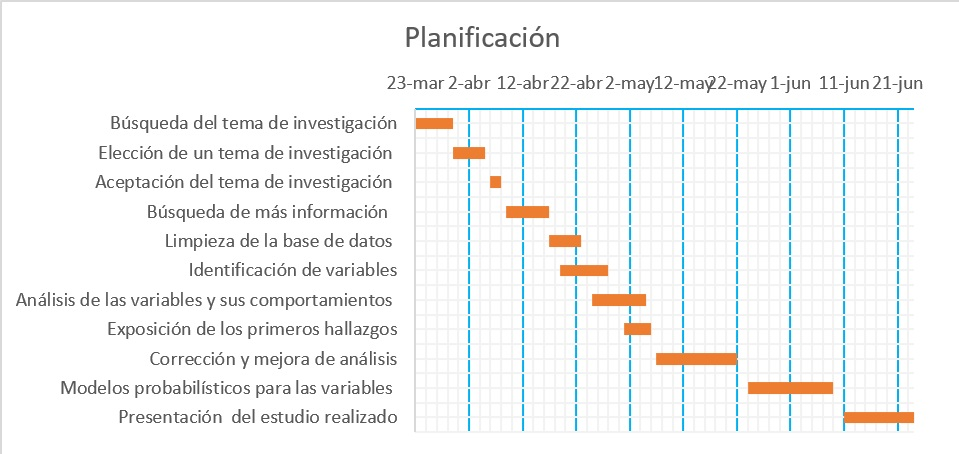

{width=800 height=300}  

#  **Integrantes**
+-----------------------------------------+-----------------+----------------------------+
|       **Apellidos y Nombres**           |    **Código**   |        **Carrera**         |
+=========================================+=================+============================+
| **Mauricio Alexandre Castro Sanchez**   | **201910365**   | **Ingeniería Industrial**  |
+-----------------------------------------+-----------------+----------------------------+
|**Jhefferson Gabriel Paredes Cornado**   | **202020120**   | **Ingeniería Industrial**  |
+-----------------------------------------+-----------------+----------------------------+
|**Esthefany Mirella Anchante Altamirano**| **202120079**   | **Ingeniería Industrial**  |
+-----------------------------------------+-----------------+----------------------------+
|  **Jadil Arat Valdez Arone**            | **202110673**   |   **Ingeniería Civil**     |
+-----------------------------------------+-----------------+----------------------------+


```{r,eval = FALSE,echo=FALSE}

library(readr)
library(dplyr)
library(ggplot2)
require(reshape)
require(tidyverse)
library(plotly)
library(psych)
library(corrplot)
library(treemap)

DT161 <- read_csv("DT16.csv")

 
DT151 <- read_csv("DT15.csv")


DT162 <- data.frame(filter(DT161,DT161$`Medida Promedio en Matemática`!="-" ))

DT152 <- data.frame(filter(DT151,DT151$`Medida Promedio en Matemática`!="-" ))


DT162$comp <- as.integer(DT162$Código.Geografico %in% DT152$Código.Geografico)
DT152$comp <- as.integer(DT152$Código.Geografico %in% DT162$Código.Geografico)


DT16 <- data.frame(filter(DT162,DT162$comp!=0 ))

DT15 <- data.frame(filter(DT152,DT152$comp!=0 ))

DT16<-select(DT16,-comp)
DT15<-select(DT15,-comp)


```

```{r,eval = FALSE,echo=FALSE}
DT16$`Cobertura.IE` <- as.numeric(DT16$`Cobertura.IE`)
DT16$Medida.Promedio.en.Lectura <- as.numeric(DT16$Medida.Promedio.en.Lectura)
DT16$Medida.Promedio.en.Matemática <- as.numeric(DT16$Medida.Promedio.en.Matemática)
DT15$`Cobertura.IE` <- as.numeric(DT15$`Cobertura.IE`)
DT15$Medida.Promedio.en.Lectura <- as.numeric(DT15$Medida.Promedio.en.Lectura)
DT15$Medida.Promedio.en.Matemática <- as.numeric(DT15$Medida.Promedio.en.Matemática)
```


```{r,echo = FALSE,}
M_Region<- sample(c("SUR","NORTE","ORIENTE", "LIMA","CENTRO"), size =length(DT16$DISTRITO), replace = TRUE)
DT16 <-cbind(DT16,M_Region)

DT16$M_Region[DT16$REGION == "LIMA PROVINCIA"] <- "LIMA"
DT16$M_Region[DT16$REGION == "LIMA METROPOLITANA"] <- "LIMA"
DT16$M_Region[DT16$REGION == "CALLAO"] <- "LIMA"
DT16$M_Region[DT16$REGION == "LA LIBERTAD"] <- "NORTE"
DT16$M_Region[DT16$REGION == "PIURA"] <- "NORTE"
DT16$M_Region[DT16$REGION == "LAMBAYEQUE"] <- "NORTE"
DT16$M_Region[DT16$REGION == "ÁNCASH"] <- "NORTE"
DT16$M_Region[DT16$REGION == "CAJAMARCA"] <- "NORTE"
DT16$M_Region[DT16$REGION == "TUMBES"] <- "NORTE"
DT16$M_Region[DT16$REGION == "AMAZONAS"] <- "ORIENTE"
DT16$M_Region[DT16$REGION == "LORETO"] <- "ORIENTE"
DT16$M_Region[DT16$REGION == "SAN MARTÍN"] <- "ORIENTE"
DT16$M_Region[DT16$REGION == "UCAYALI"] <- "ORIENTE"
DT16$M_Region[DT16$REGION == "AREQUIPA"] <- "SUR"
DT16$M_Region[DT16$REGION == "CUSCO"] <- "SUR"
DT16$M_Region[DT16$REGION == "MADRE DE DIOS"] <- "SUR"
DT16$M_Region[DT16$REGION == "MOQUEGUA"] <- "SUR"
DT16$M_Region[DT16$REGION == "PUNO"] <- "SUR"
DT16$M_Region[DT16$REGION == "TACNA"] <- "SUR"
DT16$M_Region[DT16$REGION == "APURÍMAC"] <- "CENTRO"
DT16$M_Region[DT16$REGION == "AYACUCHO"] <- "CENTRO"
DT16$M_Region[DT16$REGION == "HUANCAVELICA"] <- "CENTRO"
DT16$M_Region[DT16$REGION == "HUÁNUCO"] <- "CENTRO"
DT16$M_Region[DT16$REGION == "ICA"] <- "CENTRO"
DT16$M_Region[DT16$REGION == "JUNÍN"] <- "CENTRO"
```


```{r,echo = FALSE}
M_Region<- sample(c("SUR","NORTE","ORIENTE", "LIMA","CENTRO"), size =length(DT16$DISTRITO), replace = TRUE)
DT15 <-cbind(DT15,M_Region)

DT15$M_Region[DT15$REGION == "LIMA PROVINCIA"] <- "LIMA"
DT15$M_Region[DT15$REGION == "LIMA METROPOLITANA"] <- "LIMA"
DT15$M_Region[DT15$REGION == "CALLAO"] <- "LIMA"
DT15$M_Region[DT15$REGION == "LA LIBERTAD"] <- "NORTE"
DT15$M_Region[DT15$REGION == "PIURA"] <- "NORTE"
DT15$M_Region[DT15$REGION == "LAMBAYEQUE"] <- "NORTE"
DT15$M_Region[DT15$REGION == "ÁNCASH"] <- "NORTE"
DT15$M_Region[DT15$REGION == "CAJAMARCA"] <- "NORTE"
DT15$M_Region[DT15$REGION == "TUMBES"] <- "NORTE"
DT15$M_Region[DT15$REGION == "AMAZONAS"] <- "ORIENTE"
DT15$M_Region[DT15$REGION == "LORETO"] <- "ORIENTE"
DT15$M_Region[DT15$REGION == "SAN MARTÍN"] <- "ORIENTE"
DT15$M_Region[DT15$REGION == "UCAYALI"] <- "ORIENTE"
DT15$M_Region[DT15$REGION == "AREQUIPA"] <- "SUR"
DT15$M_Region[DT15$REGION == "CUSCO"] <- "SUR"
DT15$M_Region[DT15$REGION == "MADRE DE DIOS"] <- "SUR"
DT15$M_Region[DT15$REGION == "MOQUEGUA"] <- "SUR"
DT15$M_Region[DT15$REGION == "PUNO"] <- "SUR"
DT15$M_Region[DT15$REGION == "TACNA"] <- "SUR"
DT15$M_Region[DT15$REGION == "APURÍMAC"] <- "CENTRO"
DT15$M_Region[DT15$REGION == "AYACUCHO"] <- "CENTRO"
DT15$M_Region[DT15$REGION == "HUANCAVELICA"] <- "CENTRO"
DT15$M_Region[DT15$REGION == "HUÁNUCO"] <- "CENTRO"
DT15$M_Region[DT15$REGION == "ICA"] <- "CENTRO"
DT15$M_Region[DT15$REGION == "JUNÍN"] <- "CENTRO"
```
#  **Introducción**

## **Diagrama de Gantt**

 


## **Relevancia :**  
La relevancia de este estudio es alta ya que con los resultados que se obtienen en los censos se podrá saber como va evolucionando el sector educativo. En nuestro país a diferencia de otros países del mundo se sabe que la calidad educativa no es muy alta por lo que es de suma importancia realizar estos estudios a los alumnos para saber como se están desarrollando académicamente.

## **Factibilidad:**
En este estudio nos enfocaremos en los estudiantes de segundo grado de primaria,de acuerdo con los resultados que se obtuvieron en el censo del año 2015 y 2016 se podrá tener una visión más clara de los como van los estudiantes en cada distritos.

#  **Datos**

## **Recopilación de datos:**

Esta base de datos fue recopilada por el Ministerio de educación en el año 2015 y 2016, y posteriormente publicado en el año 2018.Para la recolección de datos se tomó un examen el cual media los conocimientos de matemáticas y lectura, de los estudiantes de segundo grado de primaria,cuarto grado de primaria y segundo grado de secundaria, Este examen fue tomado en algunas fechas específicas en casi todos los colegios del Perú durante el horario en el que se dictaban las clases, esto para poder llegar a casi la totalidad de estudiantes. Las notas van desde  0 a 1000, y se agrupaba a los estudiantes de la siguiente forma según sus resultados.


## **Población, muestra y muestreo:**

Población : Estudiantes del segundo grado de primaria de los diferentes distritos del Perú. 

Muestra : La muestra corresponde a los estudiantes de segundo grado de primaria y su tamaño es de 571 224 estudiantes de todo el Perú.

Muestreo  : En este caso se utilizó un muestreo estratificado, ya que la  muestra corresponde a los resultados obtenidos por los estudiantes de segundo grado de primaria  


## **Variables**


+-----------------------------------+-----------------------+
|           Variables               |        Tipo           |        
+===================================+=======================+
|CODGEO                             | Categórica - nominal  |                   
+-----------------------------------+-----------------------+
|REGION                             | Categórica - nominal  | 
+-----------------------------------+-----------------------+
|PROVINCIA                          | Categórica - nominal  |                   
+-----------------------------------+-----------------------+
|DISTRITO                           | Categórica - nominal  |                 
+-----------------------------------+-----------------------+
|Cobertura ie                       | Numérica   - continua |                   
+-----------------------------------+-----------------------+
|Cobertura estudiantes              | Numérica   - continua |                   
+-----------------------------------+-----------------------+
|Medida promedio en Lectura         | Númerica   - continua |                  
+-----------------------------------+-----------------------+
|Medida promedio en Matemática      | Númerica   - continua | 
+-----------------------------------+-----------------------+
|M_Region                           | Categórica - nominal  |
+-----------------------------------+-----------------------+


## **Análisis descritivo** 

###***Macro Region vs Distritos**

```{r,echo = FALSE}
x <- table(DT16$M_Region)

barplot(x, xlab ="Macro Regiones", ylab = "Frecuencia" , main = "Frecuencia de distritos por cada Macro region",col=rainbow(5, alpha=.6))
```
### **Macro Region vs promedio de Matematica** 
```{r,echo = FALSE}

boxplot(DT16$Medida.Promedio.en.Matemática  ~ DT16$M_Region, xlab="Macro Regiones", ylab = "Promedio en Matemática", col = 5)
abline (h = mean(DT16$Medida.Promedio.en.Matemática), col = 'red', lwd = 2)
abline (h = 638, col = 'blue', lwd = 2)
legend(x = "top", legend = c("Media = 587", "Nota de Nivel satisfactorio >638"), fill = c("red", "blue"), 
       title = )
```


### **Evolucion de la cobertura de estudiantes entre los años 2015 y 2016**

```{r,eval = FALSE,echo=FALSE}
round(mean(DT15$Cobertura.Estudiantes , na.rm=T),2)
round(median(DT15$Cobertura.Estudiantes , na.rm=T),2)
rango <- max(DT15$Cobertura.Estudiantes , na.rm=T) - min(DT15$Cobertura.Estudiantes , na.rm=T)
round(rango, digits=2)
round(var(DT15$Cobertura.Estudiantes , na.rm=T), digits=2)
round(sd(DT15$Cobertura.Estudiantes , na.rm=T), digits=2)
round(IQR(DT15$Cobertura.Estudiantes , na.rm=T), digits=2)
round(sd(DT15$Cobertura.Estudiantes , na.rm=T)/mean(DT15$Cobertura.Estudiantes , na.rm=T), digits=2)
```
```{r,eval = FALSE,echo=FALSE}
round(mean(DT16$Cobertura.Estudiantes , na.rm=T),2)
round(median(DT16$Cobertura.Estudiantes , na.rm=T),2)
rango <- max(DT16$Cobertura.Estudiantes , na.rm=T) - min(DT16$Cobertura.Estudiantes , na.rm=T)
round(rango, digits=2)
round(var(DT16$Cobertura.Estudiantes , na.rm=T), digits=2)
round(sd(DT16$Cobertura.Estudiantes , na.rm=T), digits=2)
round(IQR(DT16$Cobertura.Estudiantes , na.rm=T), digits=2)
round(sd(DT16$Cobertura.Estudiantes , na.rm=T)/mean(DT16$Cobertura.Estudiantes , na.rm=T), digits=2)
```

Descriptores Numéricos      |        2015            |       2015            | 
----------------------------|------------------------|-----------------------|
Media                       |       95.65            |         96.75         |
Mediana                     |      96.4              |         96.4          |
Rango                       |       20               |         20            |
Varianza                    |       16.41            |        16.41          |
Desviación Estándar         |       4.05             |        4.05           |
Rango Intercuartil       	  |      	5.45             |        5.45           |
Coeficiente de Variación    |       0.04             |          0.04          |

```{r,echo=FALSE}
par(mfrow = c(1, 2))

# Los siguientes gráficos se combinarán
hist(DT15$Cobertura.Estudiantes, main = "Cobertura de estudiantes 2015", xlab="Porcentaje",ylab="Frecuencia",col="green") # Izquierda
abline (v = mean(DT15$Cobertura.Estudiantes), col = 'red', lwd = 2)
abline (v = median(DT15$Cobertura.Estudiantes), col = 'blue', lwd = 2)
legend(x = "topleft", legend = c("Media = 95.65 ", "Mediana = 96.4"), fill = c("red", "blue"), 
       title = )

hist(DT16$Cobertura.Estudiantes, main = "Cobertura de estudiantes 2016", xlab="Porcentaje",ylab="Frecuencia",col="green") # Derecha
abline (v = mean(DT16$Cobertura.Estudiantes), col = 'red', lwd = 2)
abline (v = median(DT16$Cobertura.Estudiantes), col = 'blue', lwd = 2)
legend(x = "topleft", legend = c("Media = 96.75", "Mediana = 97.6"), fill = c("red", "blue"), 
       title = )
```


### **Promedio de lectura VS Promedio de Matematica en el 2015 y 2016**

```{r,echo = FALSE,warning=FALSE}
DT <- DT15[, 7:8]

pairs.panels(DT,
             histogram = FALSE,
             smooth = FALSE,      # Si TRUE, dibuja ajuste suavizados de tipo loess
             scale = TRUE,      # Si TRUE, escala la fuente al grado de correlación
             main='Matriz de dispersión 2015',
          density = TRUE,     # Si TRUE, añade histogramas y curvas de densidad
             ellipses = FALSE,    # Si TRUE, dibuja elipses
             method = "pearson", # Método de correlación (también "spearman" o "kendall")
             pch = 21,           # Símbolo pch
             lm = TRUE,         # Si TRUE, dibuja un ajuste lineal en lugar de un ajuste LOESS
             cor = TRUE,         # Si TRUE, agrega correlaciones
             jiggle = FALSE,     # Si TRUE, se añade ruido a los datos
             factor = 2,         # Nivel de ruido añadido a los datos
             #hist.col = 4,       # Color de los histogramas
             stars = TRUE,       # Si TRUE, agrega el nivel de significación con estrellas
             ci = TRUE) 

```


```{r,echo = FALSE,warning=FALSE}
DT <- DT16[, 7:8]

pairs.panels(DT,
             histogram = FALSE,
             smooth = FALSE,      # Si TRUE, dibuja ajuste suavizados de tipo loess
             scale = TRUE,      # Si TRUE, escala la fuente al grado de correlación
             main='Matriz de dispersión 2016',
          density = TRUE,     # Si TRUE, añade histogramas y curvas de densidad
             ellipses = FALSE,    # Si TRUE, dibuja elipses
             method = "pearson", # Método de correlación (también "spearman" o "kendall")
             pch = 21,           # Símbolo pch
             lm = TRUE,         # Si TRUE, dibuja un ajuste lineal en lugar de un ajuste LOESS
             cor = TRUE,         # Si TRUE, agrega correlaciones
             jiggle = FALSE,     # Si TRUE, se añade ruido a los datos
             factor = 2,         # Nivel de ruido añadido a los datos
             #hist.col = 4,       # Color de los histogramas
             stars = TRUE,       # Si TRUE, agrega el nivel de significación con estrellas
             ci = TRUE) 


```


## **Análisis probabilistico**  

```{r,echo = FALSE}
dibujar<-function(archivo,titulo,xs){
x<-archivo
hist(x,freq=FALSE,main=titulo,xlab=xs,breaks=30)
lines(density(x),col="red",lwd=2)
b<-mean(x)
a<-sd(x)
c<-median(x)

curve(dnorm(x,mean=b,sd=a),from=400,to=750,
            add=TRUE,col="blue",lwd=2)
legend(x = "topright", legend = c("Curva real","Curva teórica(Normal)",paste("Media =", round(b)),paste("Mediana =", round(c)))
       , fill = c("red", "blue","green","yellow"), 
       title = )
abline (v = mean(archivo), col = 'green', lwd = 2)
abline (v = median(archivo), col = 'yellow', lwd = 2)

}
```

### **Variable: Medida Promedio en Lectura de los años 2015 y 2016**


```{r,echo = FALSE}
par(bg="grey98")
dibujar(DT15$Medida.Promedio.en.Lectura,"2015","Media Lectura")
dibujar(DT16$Medida.Promedio.en.Lectura,"2016","Media Lectura")
```

```{r}
calcular_pnorm<-function(archivo,numero){
  1-pnorm(numero,median(archivo),sd(archivo))
}
```
Comparamos la probabilidad de los estudiantes en satisfactorio Lectura(promedio>583) en los años 2015 y 2016

```{r}
calcular_pnorm(DT16$Medida.Promedio.en.Lectura,583)
calcular_pnorm(DT15$Medida.Promedio.en.Lectura,583)
```

### **Variable: Medida Promedio en Matematica de los años 2015 y 2016**

```{r,echo = FALSE}

dibujar(DT15$Medida.Promedio.en.Matemática,"2015","Media Matemática")


```
```{r,echo = FALSE}
dibujar(DT16$Medida.Promedio.en.Matemática,"2016","Media Matemática")
```


Comparamos la probabilidad de los estudiantes en satisfactorio matemática(promedio>638) en los años 2015 y 2016

```{r}
calcular_pnorm(DT16$Medida.Promedio.en.Matemática,638)
calcular_pnorm(DT15$Medida.Promedio.en.Matemática,638)
```


