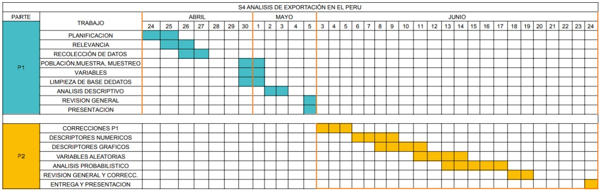

---
title: "Análisis de las exportaciones del Perú al Mundo"
output:
  html_document:
    toc: yes
    df_print: paged
  html_notebook:
    toc: yes
    toc_float:
      collapsed: no
      smooth_scroll: no
    number_sections: yes
    theme: yeti
  pdf_document:
    toc: yes
---  

# **Introducción**  

## Relevancia  

Consideramos relevante el análisis de las exportaciones del Perú, debido a que creemos que sería de gran interés para la población peruana. El análisis está delimitado desde el año 2016 al 2021 y en dos sectores en específico: el sector 9 y 10. Además, se realizará una comparación con los países vecinos que vienen a ser los países latinoamericanos y con ello deseamos poder demostrar que nuestro país puede exportar más que solo materias primas.

Otra razón por la que lo consideramos relevante es que la concentración de este estudio está más ligado a la tecnología. Los sectores económicos elegidos son ‘Computadoras, telecomunicaciones, productos electrodomésticos’ y ‘Componentes electrónicos’ que vienen a ser el sector 9 y 10 respectivamente. Usaremos la definición de sectores que tiene la ITC (en español se le conoce como el Centro de Comercio Internacional) para poder compararnos con los otros países latinoamericanos. También decidimos elegir los últimos 6 años (2016-2021) ya que nos brindan datos más actualizados y más cercanos al sector tecnológico.

### Objetivo Principal  

- Brindar conocimientos sobre la preparación del Perú frente a otros países de Latinoamérica.
- Impulsar en nuevas ideas de emprendimiento tecnológico en base a las estadísticas que resulten del análisis.
- Evaluar una posible alianza con otro país que contenga el área más demandada.

### Objetivos Específicos  

1) Analizar las diferencias que existen entre las exportaciones de los países latinoamericanos relacionadas a los sectores 9 y 10 para poder dar una idea sobre cuáles productos tecnológicos hay que priorizar su producción.  
 
2) Evaluar e identificar si es posible realizar alguna alianza con otro país dentro de los sectores 9 y 10.  

### Unicidad de nuestro proyecto  

Con todo lo mencionado anteriormente, estaríamos haciendo algo diferente a la base de datos obtenida desde la fuente _**Trade Map**_  porque aplicaremos las siguientes operaciones que, a lo largo del informe, se irán explicando con mayor detalle los propósitos que tienen:

- Cálculo del VCR por año *(Indica la ventaja de exportación)*   
- Normalización del VCR *(Indica la ventaja de exportación)*  
- Identificación de las posibles alianzas *(A través de los resultados de comparación)*
- Identificación de nuestros sectores tecnológicos *(Filtrar nuestra base de datos por sectores tecnológicos)*  

Como resultado, aumentaremos la relevancia de nuestro análisis, ya que, serviría para motivar a la población peruana a conocer lo que mueve la demanda externa y para que pueda realizar una mejor toma de decisiones.  

## Planificación

Para poder realizar esté análisis de forma eficiente, se creó el siguiente plan: 

  


# **Datos**  

## Recolección de datos  

Las bases de datos que utilizamos en nuestro análisis fueron conseguidas y creadas a partir de las siguientes plataformas:  

- El **Trade map** es una plataforma que proporciona datos recopilados de exportaciones, importaciones y entre otros indicadores de cada país que sea parte de la ONU.
- El **Trade Staddistics** es una plataforma que proporciona la relación entre los productos que existen y el sector al cual pertenecen a partir de varios códigos que representan cada uno de ellos.  

**Base de datos** |**Nombre asignado**|**Descripción**|**Link referencial de proveniencia**
:---|:---|:---|:---
Base de datos de los paises | [Pais]_exportaciones.csv  | Tenemos todas las exportaciones de cada país | https://www.trademap.org/Index.aspx  
Base de datos del mundo | Mundo_exportaciones.csv  | Tenemos todas las exportaciones que se realizaron en todo el mundo | https://www.trademap.org/Index.aspx  
Relacion por sectores | Conversion_sectores | Nos brinda la relación entre producto y sector | https://unstats.un.org/unsd/trade/classifications/correspondence-tables.asp  

## Población, muestra y muestreo  

**Población** |**Muestra**|**Muestreo**|
:-|:-|:---
Las exportaciones por año de los países que se encuentran en el Trade Map (ONU)  | Las exportaciones de los países latinoamericanos en los años 2016-2021 en los sectores 9 y 10. | Referenciando a las base de datos, son vía muestreo estratificado ya que la población está agrupada por países y sectores económicos.

## Variables  

Para la base de datos :  

1) `BD[ País ]`

  **Nombre variable** |**Tipo de variable**
  :---|:---
  _codigo_  | Categórica nominal  
  _descripcion_ | Categórica nominal  
  _valor_exportado [ 2016 : 2021 ]_ | Numérica Continua  

Notas:  
```
- `BD[País]` --> En la parte encerrada `[]` va el nombre del pais con mayúscula al inicio.
```  

2) `Mundo_exportaciones`:  

  **Nombre variable** |**Tipo de variable**
  :---|:---
  _codigo_  | Categórica nominal  
  _descripcion_ | Categórica nominal  
  _valor_exportado [ 2016 : 2021 ]_ | Numéricas Continuas  

3) `Conversion_sectores`:   

  **Nombre variable** |**Tipo de variable**
  :---|:---
  _codigo_partida_  | Categórica nominal  
  _codigo_sector_ | Categórica nominal  

## Limpieza de base de datos  

### Extracción de los datos  

- Extraemos la base de datos desde la carpeta `Data_base`:  

```{r warning=FALSE}
# Librerias requeridas
library(readr)
library(dplyr)

# De la relacion de sectores
Sectores <- read_csv("Data_base/Conversion_sectores.csv")

# De las exportaciones por país
Sectores <- read_csv("Data_base/Conversion_sectores.csv")
BDArgentina <- read_csv("Data_base/Argentina_exportaciones.csv")
BDBolivia <- read_csv("Data_base/Bolivia_exportaciones.csv")
BDBrasil <- read_csv("Data_base/Brasil_exportaciones.csv")
BDChile <- read_csv("Data_base/Chile_exportaciones.csv")
BDColombia <- read_csv("Data_base/Colombia_exportaciones.csv")
BDCostaRica <- read_csv("Data_base/Costa_rica_exportaciones.csv")
BDCuba <- read_csv("Data_base/Cuba_exportaciones.csv")
BDEcuador <- read_csv("Data_base/Ecuador_exportaciones.csv")
BDElSalvador <- read_csv("Data_base/El_salvador_exportaciones.csv")
BDGuatemala <- read_csv("Data_base/Guatemala_exportaciones.csv")
BDHonduras <- read_csv("Data_base/Honduras_exportaciones.csv")
BDMexico <- read_csv("Data_base/Mexico_exportaciones.csv")
BDNicaragua <- read_csv("Data_base/Nicaragua_exportaciones.csv")
BDParaguay <- read_csv("Data_base/Paraguay_exportaciones.csv")
BDPeru <- read_csv("Data_base/Peru_exportaciones.csv")
BDRepDominicana <- read_csv("Data_base/Rep_dominicana_exportaciones.csv")
BDUruguay <- read_csv("Data_base/Uruguay_exportaciones.csv")
BDVenezuela <- read_csv("Data_base/Venezuela_exportaciones.csv")
BDMundo <- read_csv("Data_base/Mundo_exportaciones.csv")

```  


### Limpieza de los datos  

#### **La relación por sectores**  

- Modificamos las variables por una que podamos manejar:  

```{r}
LimpiezaConversionSectores <- function(Sectores){
  colnames(Sectores)[1] <- "codigo_partida"
  colnames(Sectores)[2] <- "codigo_sector"
  return(Sectores)
}
```

- Aplicación de la función

```{r}
Sectores <-LimpiezaConversionSectores(Sectores)
```

#### Los **países** y el **Mundo**  

- Seleccionamos solamente los valores de código de partida, la descripción y las exportaciones desde 2016 y 2021.  

- Añadimos a cada tabla el código de sector (Limitado entre los 3 primeros dígitos)  

  - Esto se hace debido a que la relación por sectores son respecto a los 3 primero dígitos.  
  
- Reemplazamos los datos vacíos (NAs) por 0.  

```{r}
# Creación de la función
LimpiezaBD <-  function(BaseDatosPais,Sectores){
  #Eliminar total -->  BDPeru <- BDPeru[!(BDPeru$Código=="TOTAL"),]
  BaseDatosPais<-BaseDatosPais[!(BaseDatosPais$Código=="TOTAL"),]
  
  #Cambiar los Codigos una nueva variable --> colnames(BDPeru)[1] <- "codigo_partida"
  colnames(BaseDatosPais)[1] <- "codigo_partida"
  
  #Cambiar el descripción del producto a descripcion --> colnames(BDPeru)[2] <- "descripcion"
  colnames(BaseDatosPais)[2] <- "descripcion"
  
  #Cambiar la exportacion a valor_exportado, generalizar esta parte
  colnames(BaseDatosPais)[17] <- "valor_exportado_2016"
  colnames(BaseDatosPais)[18] <- "valor_exportado_2017"
  colnames(BaseDatosPais)[19] <- "valor_exportado_2018"
  colnames(BaseDatosPais)[20] <- "valor_exportado_2019"
  colnames(BaseDatosPais)[21] <- "valor_exportado_2020"
  colnames(BaseDatosPais)[22] <- "valor_exportado_2021"
  
  #Delimitar 2016-2021 --> BDPeru <- select(BDPeru, c(1,2,17,18,19,20,21,22))
  BaseDatosPais <- select(BaseDatosPais, c(1,2,17,18,19,20,21,22))
  
  #Relacionar BaseDatosPais con Sectores
  BaseDatosPais <- merge(x=BaseDatosPais,y=Sectores, by= "codigo_partida")
  
  #Mover la variable Conversion_sectores a la izquierda 
  corte1 <- select(BaseDatosPais, 1:2)
  corte2 <- select(BaseDatosPais, 9)
  corte3 <- select(BaseDatosPais, 3:8)
  BaseDatosPais <- cbind(corte1,corte2,corte3)
  
  #Eliminar los cortes
  corte1 <- NULL
  corte2 <- NULL
  corte3 <- NULL
  
  # Reemplazar todos los NA por 0
  BaseDatosPais[is.na(BaseDatosPais)] <- 0
  
  # En la columna codigo_sector solo escoger los 3 primeros valores del string
  BaseDatosPais[,3] <- substr(BaseDatosPais[,3],1,3)

  return(BaseDatosPais)
}
```  

##### Aplicación de la función  

```{r}
BDArgentina  <- LimpiezaBD(BDArgentina,Sectores)
BDBolivia    <- LimpiezaBD(BDBolivia,Sectores)
BDBrasil     <- LimpiezaBD(BDBrasil,Sectores)
BDChile      <- LimpiezaBD(BDChile,Sectores)
BDColombia   <- LimpiezaBD(BDColombia,Sectores)
BDCostaRica  <- LimpiezaBD(BDCostaRica,Sectores)
BDCuba       <- LimpiezaBD(BDCuba,Sectores)
BDEcuador    <- LimpiezaBD(BDEcuador,Sectores)
BDElSalvador <- LimpiezaBD(BDElSalvador,Sectores)
BDGuatemala  <- LimpiezaBD(BDGuatemala,Sectores)
BDHonduras   <- LimpiezaBD(BDHonduras,Sectores)
BDMexico     <- LimpiezaBD(BDMexico,Sectores)
BDNicaragua  <- LimpiezaBD(BDNicaragua,Sectores)
BDParaguay   <- LimpiezaBD(BDParaguay,Sectores)
BDPeru       <- LimpiezaBD(BDPeru,Sectores)
BDRepDominicana <- LimpiezaBD(BDRepDominicana,Sectores)
BDUruguay    <- LimpiezaBD(BDUruguay,Sectores)
BDVenezuela  <- LimpiezaBD(BDVenezuela,Sectores)

colnames(BDMundo)[1] <- "Código" # esta linea de código es necesario
BDMundo  <- LimpiezaBD(BDMundo,Sectores)
```

Habiendo realizado lo dicho anteriormente, limpiamos la base de datos con la que vamos a trabajar.  

# **Análisis descriptivo**  

## Descriptores  

A continuación se mostrarán los estudios de la base de datos de nuestro país (Perú) y del mundo ya que son los que más nos interesan. Cabe aclarar lo siguiente:

  - Perú: Para identificar nuestras ventajas en los sectores económicos.  
  
  - Mundo: Para conocer lo conocer su comportamiento de exportaciones.  
  
### Variables Numéricas  

**Variable** |**Descripción**
:-|:---
*valor_exportaciones_[2015:2020]* | Son las exportaciones que se realizaron entre los años [2015-2020].  

#### **Perú**  

##### Rangos - Mínimos - Máximos  

```{r}
# Para el calculo de la moda
mode <- function(x) {
   return(as.numeric(names(which.max(table(x)))))
}
# Función  
range_min_max <- function(base_datos){
  variable <- c("valor_exportado_2016","valor_exportado_2017",
                "valor_exportado_2018","valor_exportado_2019",
                "valor_exportado_2020","valor_exportado_2021")
  contador <- 4
  Minimo <- c()
  Maximo <- c()
  for (i in variable){
    Minimo <- c(Minimo,min(filter(base_datos)[,contador]))
    Maximo <- c(Maximo,max(filter(base_datos)[,contador]))
    contador <- contador+1
  }
  Rango <- c(Maximo - Minimo)
  
  tabla_datos <- data.frame(variable,Minimo,Maximo, Rango)
  return (tabla_datos)
}
```

Resultado:  

```{r}
range_min_max(BDPeru)
```

**Conclusión: **

*A través de estos resultados se puede observar que el rango estadístico llega a ser el mismo que el máximo. Esto debido a que en todos los años hay productos en las cuál no se exporta y su valor es 0 (el mínimo).*  

##### Rangos Intercuartiles  

La función que utilizaremos será la siguiente:  

```{r}
#Tabla de los rangos intercuartiles

Quintiles<- function(base_datos){
  variable <- c("valor_exportado_2016","valor_exportado_2017",
                "valor_exportado_2018","valor_exportado_2019",
                "valor_exportado_2020","valor_exportado_2021")
  contador <- 4
  PrimerQuintil <- c()
  TercerQuintil <- c()
  IQR <- c()
  for (i in variable){
    PrimerQuintil <- c(PrimerQuintil,quantile(base_datos[,contador],c(0.25)))
    TercerQuintil <- c(TercerQuintil,quantile(base_datos[,contador],c(0.75)))
    IQR <- c(IQR,IQR(base_datos[,contador]))
    contador <- contador+1
  }
  
  tabla_datos <- data.frame(variable,PrimerQuintil,TercerQuintil,IQR)
  return (tabla_datos)
}

```  

```{r}
Quintiles(BDPeru)
```

**Conclusión: **

*Como podemos observar, la gran mayoría de los datos en nuestro estudio se centra entre $3000-4500$ (Rango aproximado), pese a tener una gran diferencia con los datos atípicos podemos observar la dispersión de los datos.*  

##### Media - Moda - Mediana:  

```{r}
# Función
media_moda_mediana <- function(base_datos){
  variables <- c("valor_exportado_2016","valor_exportado_2017",
                 "valor_exportado_2018","valor_exportado_2019",
                 "valor_exportado_2020","valor_exportado_2021")
  contador <- 4
  Media <- c()
  Moda <- c()
  Mediana <- c()
  for (i in variables){
    Media <- c(Media,mean(filter(base_datos)[,contador]))
    Moda <- c(Moda,mode(filter(base_datos)[,contador]))
    Mediana <- c(Mediana,median(filter(base_datos)[,contador]))
    
    contador <- contador+1
  }
  retorno <- data.frame(variables,Media,Moda,Mediana)
  return (retorno)
}
```

```{r}
media_moda_mediana(BDPeru)
```

**Conclusión:  **

En base a los resultados se puede decir que:  

- *El tipo de sesgo la cuál muestran los datos es sesgada a la derecha.*

  - Esto debido a que la (Moda < Mediana < Media)
   
 _**''Por lo tanto se puede deducir que hay asimetría positiva, es decir los valores están más separados de la media hacia la derecha.''**_  
 
###### Grafico Sesgado a la derecha  

- A modo de ejemplo, a continuación se mostrarán los datos respecto a su densidad, para observar la gráfica de sesgo.  

Función:  

```{r}
grafico_sesgo <- function(base_datos){
  hist(base_datos$valor_exportado_2016,main="Tipo de sesgo", col="blue", xlab = "exportaciones", freq = F)
  curve(dnorm(x, mean(base_datos$valor_exportado_2016), sd = sd(base_datos$valor_exportado_2016)),
      col = "red", 
      lwd= 2,
      las = 1, # Etiquetas alineadas horizontalmente
      ann = FALSE, # Sin títulos en los ejes
      xaxp = c(-15, 15, 5),  # Marcas del eje x
      ylim = c(0,0.00020), # Límites del eje
      yaxs = "i", add=TRUE) # Estilo del eje y, ajustado a los lí
  
}
```  

```{r}
grafico_sesgo(BDPeru)
```

**Conclusión: **  

Efectivamente, gran parte de los datos se encuentran sesgados hacia la derecha.  

##### Varianza - Desv. Estándar - Coef. Variación:  

```{r}
#Función
varianza_coef_dv <- function(base_datos){
  variables <- c("valor_exportado_2016","valor_exportado_2017",
                 "valor_exportado_2018","valor_exportado_2019",
                 "valor_exportado_2020","valor_exportado_2021")
  contador <- 4
  Varianza <- c()
  Desv_Estandar <- c()
  Coef_Variacion <- c()
  for (i in 2016:2021){
    Varianza <- c(Varianza,var(filter(base_datos)[,contador]))
    Desv_Estandar <- c(Desv_Estandar,sd(filter(base_datos)[,contador]))
    Coef_Variacion <- c(Coef_Variacion, 
                        (sd(filter(base_datos)[,contador])/
                           mean(filter(base_datos)[,contador])))
    
    contador <- contador+1
  }
  
  retorno <- data.frame(variables,Varianza,Desv_Estandar,Coef_Variacion)
  return (retorno)
}
```  

```{r}
varianza_coef_dv(BDPeru)
```


**Conclusión: **   

- Varianza

  - *Se puede apreciar que los valores que toma la varianza son demasiado grandes la cuál podemos inferir que hay mucha dispersión en los datos.*

- Desviación estándar:

  - *De igual manera que la varianza, se puede inferir la dispersión que existe en los datos*  
  
- Coeficiente de Variación: 

  - *Los valores superan el valor del rango normal (0,1) la cual también nos afirma la dispersión de los datos.*  

_**''Por lo tanto se puede decir que contamos con una base de datos relativamente dispersos''**_  

  

#### Descriptores gráficos (Numérica)  

Se implementó:

- Diagrama de cajas  
- Histogramas  
- Diagrama de dispersión  

Funciones a usar:  

- Gráfica de cajas:

  - Se calcula el Boxplot sin realizar ninguna modificación a la base de datos. 
  
```{r}
boxplots_general <- function (base_datos){
  boxplot(base_datos$valor_exportado_2016
        , base_datos$valor_exportado_2017
        , base_datos$valor_exportado_2018
        , base_datos$valor_exportado_2019
        , base_datos$valor_exportado_2020
        , base_datos$valor_exportado_2021
        , main = "Boxplots de Exportaciones por Año"
        , col = c("lightgreen", "skyblue", "purple", "yellow", "darkred", "blue")
        , ylab = "Cantidad Dolares"
        , names = c( "2016", "2017", "2018", "2019", "2020","2021")
        , xlab = "Años"
        )
}
```

- Gráfica de cajas restringida:

  - Restringimos entre el rango intercuartil (IQR), debido a la existencia de muchos datos atípicos.  
  - *La razón por la cuál separamos los grandes valores, es que al tener una base de datos muy dispersa, contamos con datos atípicos.*  
  
  - *En este caso, lo usaremos para ver en dónde se concentran la grande parte de los datos, ya que de por sí las grandes exportaciones no deben ser eliminadas.*  
  
```{r}
grafica_cajas <- function (base_datos){
  boxplot(base_datos$valor_exportado_2016
            [base_datos$valor_exportado_2016 >= 
                quantile(base_datos$valor_exportado_2016,c(0.25)) 
                                    & base_datos$valor_exportado_2016<= 
                                      quantile(base_datos$valor_exportado_2016,c(0.75))],
          
          base_datos$valor_exportado_2017
            [base_datos$valor_exportado_2017 >= 
                quantile(base_datos$valor_exportado_2017,c(0.25)) 
                                    & base_datos$valor_exportado_2017<= 
                                      quantile(base_datos$valor_exportado_2017,c(0.75))],
          
          base_datos$valor_exportado_2018
            [base_datos$valor_exportado_2018 >= 
                quantile(base_datos$valor_exportado_2018,c(0.25)) 
                                    & base_datos$valor_exportado_2018<= 
                                      quantile(base_datos$valor_exportado_2018,c(0.75))],
          
          base_datos$valor_exportado_2019
            [base_datos$valor_exportado_2019 >= 
                quantile(base_datos$valor_exportado_2019,c(0.25)) 
                                    & base_datos$valor_exportado_2019<= 
                                      quantile(base_datos$valor_exportado_2019,c(0.75))],
          
          base_datos$valor_exportado_2020
            [base_datos$valor_exportado_2020 >= 
                quantile(base_datos$valor_exportado_2020,c(0.25)) 
                                    & base_datos$valor_exportado_2020<=
                                      quantile(base_datos$valor_exportado_2020,c(0.75))],
          
          base_datos$valor_exportado_2021
            [base_datos$valor_exportado_2021 >= 
                quantile(base_datos$valor_exportado_2021,c(0.25)) 
                                    & base_datos$valor_exportado_2021<=
                                      quantile(base_datos$valor_exportado_2021,c(0.75))]
        , main = "Exportaciones por Año"
        , col = c("lightgreen", "skyblue", "purple", "yellow", "darkred", "blue")
        , ylab = "Cantidad Dólares"
        , names = c("2016", "2017", "2018", "2019", "2020","2021")
        , xlab = "Años"
        )
}

```

- Gráfica de dispersión  

```{r}
grafica_dispersion <- function(base_datos){
  plot(base_datos$valor_exportado_2016,
       base_datos$valor_exportado_2021,
       pch=1, col="green", main="Diagrama de Dispersión: 2016-2021",
       xlab = "Exportaciones 2016", ylab = "Exportaciones 2021",
       abline(lm(BDPeru$valor_exportado_2016 ~ BDPeru$valor_exportado_2021),col="red")
       )
}
```

```
A lo largo del estudio, se irán mostrando más descriptores conforme los resultados 
obtenidos.
```  

- Histograma

  - Se muestra las exportaciones totales en cada sector.  `

##### Perú  

- Boxplots de las exportaciones:  

```{r}
boxplots_general(BDPeru)
```

**Conclusión: **

*Como mencionamos anteriormente, la cantidad de datos atípicos es demasiado grande, tanto así, que no nos permite tener un mejor estudio de nuestros datos. Además, de por sí se puede observar la diferencia entre la concentración de los datos y los datos atípicos.*  

- Gráfica de cajas restringido:  

```{r}
grafica_cajas(BDPeru)
```

**Conclusión:**  

-*Podemos ver que la mediana no se vió afectada en ninguno de los casos, ya que, aproximadamente es igual a los resultados obtenidos anteriormente*. 

-*Al hacer esta restricción, los extremos se vieron muy afectados. Pero, como se mencionó anteriormente, tratamos de ver mejor la concentración de los datos separando los datos atípicos.*  

- Diagrama de Dispersión

*Para nuestro estudio, vamos a comparar la intensidad de relación entre las variables `Exportaciones 2016 y 2021`*

```{r}
grafica_dispersion(BDPeru)
```

```{r}
correlacion <- cor(BDPeru$valor_exportado_2016,BDPeru$valor_exportado_2021)
coef_determinacion <- round((correlacion^2)*100)
correlacion
coef_determinacion
```
**Conclusión:**  

- *Como podemos ver, existe una correlación positiva entre ambas variables, es decir que las exportaciones fueron creciendo en lo largo de los años, en otras palabras, mientras más crecía las exportaciones en el 2016, más creciente serán en el 2021*  

- *La relación lineal es muy buena, ya que la correlación se acerca a 1, con porcentaje de variación del $84$ %*  

##### Mundo  

- Boxplots de las exportaciones:  

```{r}
boxplots_general(BDMundo)
```

**Conclusión: ** 

*Como podemos ver, la existencia de datos datos atípicos es menor a comparación del estudio de Perú.*

- Gráfica de cajas restringido:  

```{r}
grafica_cajas(BDMundo)
```

**Conclusión:**  

*De igual manera, el comportamiento el rango intercuartil aquí es más grande, esto debido a que existen otros países que se enfocan más en la exportación los sectores mencionados*  

- Diagrama de Dispersion
```{r}
grafica_dispersion(BDMundo)
```
```{r}
correlacion <- cor(BDMundo$valor_exportado_2016,BDMundo$valor_exportado_2021)
coef_determinacion <- round((correlacion^2)*100)

correlacion
coef_determinacion
```

**Conclusión:**

*La correlación es más fuerte, es decir, gran parte de los datos están muy concentrados. La correlación existente es de igual manera positiva ya que es más cercano a 1. Además el porcentaje de variación es $93$ %, la cual nos indica que es mucho mejor el ajuste del modelo de los datos*  

### Variables Categóricas

- Para todos los `Paises` y el `Mundo` tenemos:  

**Variable** |**Descripción**
:-|:---
_descripcion_   | Debido a que estamos analizando todas las exportaciones hechas en el país hay que tener precisión al presentar la actividad exportadora por lo que describir las misma es inevitable  
_codigo_partida_ | Es el código de identificación del producto la cual es diferente en otros productos  
_codigo_sector_   | Indica el sector al cuál pertenece el producto  

- Para la `relación de sectores` tenemos:  

**Variable** |**Descripción**
:-|:---
_codigo_partida_ | Es necesario que cada actividad de exportación se diferencie de las otras y, así mismo, se diferencie a un nivel internacional, por lo cual, se hace uso de una nomenclatura establecida internacionalmente para la mercancía llamada ‘HS 2017’.  
_codigo_sector_   | Es una clasificación estándar de comercio internacional impuesto por la ONU.   

#### Descriptores gráficos (Categórica)  

**A lo largo del estudio se mostrarán los descriptores.**  

Funciones a usar:  

- Gráfico de Pastel

Se usará para los pesos de las exportaciones en cada valor del sector elegido desde el 2016-2021  

# **Realce de la Investigación**  

## Conocimientos previos  

### Sectores elegidos  

- Mostramos los sectores tecnológicos elegidos para nuestra investigación:  

  
  
<center>_**Referencia:**_ [Libro Trade Map](chrome-extension://efaidnbmnnnibpcajpcglclefindmkaj/https://tradecompetitivenessmap.intracen.org/Documents/TradeCompMap-Trade%20Performance%20Index-Technical%20Notes-EN.pdf)</center>  

- Creación de las siguientes tablas:  

```{r}
ProductosSector9 <- c("OFFICE MACHINES",
                      "AUTOMATC. DATA PROC. EQUIP",
                      "PARTS,FOR OFFICE MACHINS", 
                      "TELEVISION RECEIVERS ETC",
                      "RADIO-BROADCAST RECEIVER",
                      "SOUND RECORDER, PHONOGRPH",
                      "TELECOMM.EQUIP.PARTS NES")
codeSector9  <- c("751","752","759","761","762","763","764")

ProductosSector10 <- c("ELECTPOWER MACHNY.PARTS",
                       "ELEC.SWITCH.RELAY.CIRCUT",
                       "ELECTR DISTRIBT.EQPT NES",
                       "ELECTRO-MEDCL,XRAY EQUIP",
                       "DOM.ELEC,NON-ELEC.EQUIPT",
                       "TRANSISTORS,VALVES,ETC.",
                       "ELECTRIC.MACH.APPART.NES")
codeSector10 <- c("771","772","773","774","775","776","778")

DFSector9 <- data.frame(Productos=ProductosSector9,codigo_sector=codeSector9)
DFSector10 <- data.frame(Productos=ProductosSector10,codigo_sector=codeSector10)
```
### Indice VCR  

- LLamado _**Ventaja comparativa revelada**_, nos permite conocer la ventaja que tiene nuestro país respecto a la exportación de un producto. Para su cálculo se hace uso de la siguiente fórmula:  

$$ VCR\;= \;  \frac{{\frac{X^i_k}{X^i}}}{{\frac{X_k}{X}}} $$  

Donde:  
```
i = Representa al país
k = El producto (Exportaciones en ese producto)

- El numerador corresponde a la cantidad exportaciones del producto por pais.
- El denominador corresponde a la cantidad exportaciones del producto de todo el mundo.
```  
Variable|Descripción
:--|:---
$$ X^i_k $$ |  Exportaciones de un producto `k` realizadas por un país `i`.|  
$$ X^i $$   | Exportaciones totales realizadas por un país `i`.
$$ X_k $$   | Exportaciones de un producto `k` realizadas en todo el mundo.
$$ X $$     | Exportaciones totales realizadas en todo el mundo.

Para verificar la ventaja comparativa que tiene el país:  

- Si el resultado nos sale un valor mayor que 1, se puede decir que el país tiene una ventaja de exportación de ese producto.  

### Normalización VCR  

Para poder realizar una comparación, normalizamos el índice de VCR.  

$$ NVCR\;= \;  \frac{{VCR - 1 }}{{VCR + 1}}  \qquad  \text{donde:  VCR = Es el índice de VCR calculada en un país.} $$  

Este valor no retorna un valor entre (-1:1) para poder realizar la comparación.  

Dónde:  

```
De [-1,0) : El país no tiene ventaja de exportación en el producto
De (0,1] : El país si tiene ventaja de exportación en tal producto.
```  

## Aplicación del análisís  

- Función para realizar el gráfico de barras por sector:  

```{r}
export_Sector <- function(BDPais,sector){
  años <- c("2016","2017","2018","2019","2020","2021")
  exportaciones <- c()
  for (anio in 2016:2021) {
    sumexport <- 0
    if (sector==9){
      for (code in codeSector9) {
        sumexport <- sum(filter(BDPais,codigo_sector==code)[,anio-2012])
      }
      exportaciones <- c(exportaciones,sumexport)
    }
    
    else{
      for (code in codeSector10) {
        sumexport <- sum(filter(BDPais,codigo_sector==code)[,anio-2012])
      }
      exportaciones <- c(exportaciones,sumexport)
    }
  }
  plot(años,exportaciones,type = "h")
}

```

- Función para realizar el cálculo del VCR y NVCR por país:  

```{r}
ResultadoPais <- function(BDPais,sector){
  DFSector <- data.frame()
  if(sector==9){
        DFSector <- DFSector9
        codeSector <- codeSector9
  }
  else{
        DFSector <- DFSector10 
        codeSector <- codeSector10
  }
  
  contador <- 4

  for (anio in 2016:2021) {
    X <- sum(BDMundo[,contador])
    X_i  <- sum(BDPais[,contador]) 
    aniovector <- c()
    for (codigo_sect in codeSector) {
      X_k   <- sum(filter(BDMundo,codigo_sector==codigo_sect)[,contador])
      X_i_k <- sum(filter(BDPais, codigo_sector==codigo_sect)[,contador])
      VCR_producto <- ((X_i_k/X_i)/(X_k/X))
      NVCR <- (VCR_producto-1)/(VCR_producto+1)
      aniovector <- c(aniovector,NVCR)
      }
    DFSector <- data.frame(DFSector, anio=aniovector)
    contador <- contador+1
  }

  colnames(DFSector)[3] <- "2016"
  colnames(DFSector)[4] <- "2017"
  colnames(DFSector)[5] <- "2018"
  colnames(DFSector)[6] <- "2019"
  colnames(DFSector)[7] <- "2020"
  colnames(DFSector)[8] <- "2021"
  
  return(DFSector)
}
```

- Función para realizar el cálculo del VCR y NVCR de todos los países:

```{r}
ResultadoGeneral <- function(BDPais){
  filaPais <- c()
  for (sector in 9:10) {
    DFSector <- data.frame() 
    codeSector <- c()
    columnaBD <- 4 
    
    if(sector==9){
        DFSector <- DFSector9
        codeSector <- codeSector9
      }
    else{
        DFSector <- DFSector10 
        codeSector <- codeSector10
      }
    
    for (anio in 2016:2021) { 
      X   <- sum(BDMundo[,columnaBD]) 
      X_i <- sum(BDPais[,columnaBD])
      aniovector <- c() 
      
      for (codigo_sect in codeSector) {
        X_k   <- sum(filter(BDMundo,codigo_sector==codigo_sect)[,columnaBD])
        X_i_k <- sum(filter(BDPais,codigo_sector==codigo_sect)[,columnaBD])
        VCR_producto <- ((X_i_k/X_i)/(X_k/X))
        NVCR <- (VCR_producto-1)/(VCR_producto+1)
        aniovector <- c(aniovector,NVCR)
        }
      DFSector <- data.frame(DFSector, anio=aniovector)
      columnaBD <- columnaBD+1
    }
    
  
    NVCR_promedio <- c()
    for (i in 1:7) {
      NVCR_promedio <- c(NVCR_promedio,sum(DFSector[i,3:8])/6) #
    }
    DFSector <- data.frame(DFSector,NVCR_promedio=NVCR_promedio) #
    
    aniostotring <- 2016
    for (columna in 3:8) {
      colnames(DFSector)[columna] <- as.character(aniostotring)
      aniostotring <- aniostotring+1
    }
    
    SX_NVCR <- mean(DFSector[,9])
    filaPais <- c(filaPais,SX_NVCR)
  }
  return(filaPais)
}
```
### Perú (Cálculos)

#### Calculo de VCR (Sector 9)  

*Cálculamos el VCR por cada producto del sector 9, y luego de ello calculamos la normalización para la comparación.*  

Exportaciones realizadas en el sector:  

**Gráfico de barras**  

```{r}
export_Sector(BDPeru,9)
```

**Conclusión:**

*Como se puede observar en el siguiente histograma.*  

##### NVCR SECTOR 9

- En la siguiente tabla se observa los NVCRs por año, luego de ello se le aplica una aproximación para identificar la ventaja.  

```{r}
ResultadoPais(BDPeru,9)
```

Resultado final:

El promedio de VCRs en todos los sectores.

```{r}
ResultadoGeneral(BDPeru)[1]
```

```
Aplicando una aproximación a la normalización del cálculo de VCR obtendremos la competencia que tiene el país en este sector.
```
##### Gráfica del comportamiento  

- Función a usar:  

```{r}
comportamiento_VCR <- function(base_datos){
  anios2016_2021 <- c("2016","2017","2018","2019","2020","2021")
  valores <- c()
  contador <- 3
  for (i in 1:6){
    valores <- c(valores , sum(base_datos[,contador])/length(base_datos[,contador]))
    contador <- contador+1
  }
  plot(anios2016_2021,valores, main = "Diagrama de comportamiento",type ="b")
}

```

Comportamiento de los índices en Perú SECTOR 9: 

```{r}
comportamiento_VCR(ResultadoPais(BDPeru,9))

```

#### Calculo de VCR (Sector 10)  

*Cálculamos el VCR por cada producto del sector 10, de igual manera que el sector 9 calculamos la normalización.*   

Exportaciones realizadas en el sector:  

```{r}
export_Sector(BDPeru,10)
```

**Conclusión:**  

Lo que se puede deducir a partir del histograma es que:  

Función para el cálculo del VCR:

```{r}
ResultadoPais(BDPeru,10)
```

Resultado final: 

El VCR final, será el promedio de todos los NVCRs a lo largo de los años.  

```{r}
ResultadoGeneral(BDPeru)[2]
```

**Conclusión: **  

*A través del resultado se puede decir que en el sector 10, no contamos con una buena ventaja de exportación*  

##### Gráfica del comportamiento  

```{r}
comportamiento_VCR(ResultadoPais(BDPeru,10))
```

**Conclusión**:  

*Como ya mencionado anteriormente, en el sector 10 no contamos con ventaja comparativa de exportación y esto se puede observar en la siguiente gráfica ya que todos los valores están por debajo de 0*  

#### Comportamiento de Sectores vs Exportaciones totales 

_**Gráfico de Pasteles**_  

Como se pudo observar, existen grandes diferencias en las exportaciones ente los 2 sectores. Para una mejor vista de estas exportaciones se muestra un gráfico de pasteles donde se observa las exportaciones totales a lo largo de los últimos 6 años.  

Función:  

```{r}
r<- function(n){
  return(round(n,2))
}
grafpastel <- function(BDPais){
  colores <- c("purple","orange","blue","yellow","green","skyblue","pink")
  
  exportaciones9 <- c()
  for (code in codeSector9) {
    sumexport <- 0
    for (anio in 2016:2021) {
      sumexport <- sum(filter(BDPais,codigo_sector==code)[,anio-2012])
    }
    exportaciones9 <- c(exportaciones9,sumexport)
  }
  exportaciones9porcentaje <-r((exportaciones9/sum(exportaciones9))*100)
  etiqueta9 <- paste(exportaciones9porcentaje,"%",sep = " ")
  pie(exportaciones9porcentaje,labels = etiqueta9,clockwise= TRUE, col=colores, main= "Porcentaje de exportaciones 2016-2021 - Sector 9")
  legend("topright",c("751-OFFICE MACHINES",
                    "752-AUTOMATC. DATA PROC. EQUIP",
                    "759-PARTS,FOR OFFICE MACHINS",
                    "761-TELEVISION RECEIVERS ETC",
                    "762-RADIO-BROADCAST RECEIVER",
                    "763-SOUND RECORDER, PHONOGRPH",
                    "764-TELECOMM.EQUIP.PARTS NES"),cex=0.5,fill=colores)
  legend("bottomleft",etiqueta9,cex=1,fill=colores)
  
  
  exportaciones10 <- c()
  for (code in codeSector10) {
    sumexport <- 0
    for (anio in 2016:2021) {
      sumexport <- sum(filter(BDPais,codigo_sector==code)[,anio-2012])
    }
    exportaciones10 <- c(exportaciones10,sumexport)
  }
  exportaciones10porcentaje <- r((exportaciones10/sum(exportaciones10))*100)
  etiqueta10 <- paste(exportaciones10porcentaje,"%",sep = " ")
  pie(exportaciones10porcentaje,labels = etiqueta10,clockwise= TRUE, col=colores, main= "Porcentaje de exportaciones 2016-2021 - Sector 10")
  legend("topright",c("771-ELECTPOWER MACHNY.PARTS",
                    "772-ELEC.SWITCH.RELAY.CIRCUT",
                    "773-ELECTR DISTRIBT.EQPT NES",
                    "774-ELECTRO-MEDCL,XRAY EQUIP",
                    "775-DOM.ELEC,NON-ELEC.EQUIPT",
                    "776-TRANSISTORS,VALVES,ETC.",
                    "778-ELECTRIC.MACH.APPART.NES"),cex=0.5,fill=colores)
  legend("bottomleft",etiqueta10,cex=1,fill=colores)
}
```

Gráfico Pastel de las exportaciones:  

```{r}
grafpastel(BDPeru)
```

**Conclusión: **  

- En el sector 9 el product que se exportó más es el sector _**AUTOMATC. DATA PROC. EQUIP - 752**_ .

- En el sector 10 el product que se exportó más es el sector _**ELECTRIC.MACH.APPART.NES" - 778**_ .

## Resultados  

Tenemos la competencia que tiene cada país respecto a cada sector:  

Función :  

```{r}
Argentina    <- ResultadoGeneral(BDArgentina)
Bolivia      <- ResultadoGeneral(BDBolivia)
Brasil       <- ResultadoGeneral(BDBrasil)
Chile        <- ResultadoGeneral(BDChile)
Colombia     <- ResultadoGeneral(BDColombia)
CostaRica    <- ResultadoGeneral(BDCostaRica)
Cuba         <- ResultadoGeneral(BDCuba)
Ecuador      <- ResultadoGeneral(BDEcuador)
ELSalvador   <- ResultadoGeneral(BDElSalvador)
Guatemala    <- ResultadoGeneral(BDGuatemala)
Honduras     <- ResultadoGeneral(BDHonduras)
Mexico       <- ResultadoGeneral(BDMexico)
Nicaragua    <- ResultadoGeneral(BDNicaragua)
Paraguay     <- ResultadoGeneral(BDParaguay)
Peru         <- ResultadoGeneral(BDPeru)
RepDominicana<- ResultadoGeneral(BDRepDominicana)
Uruguay      <- ResultadoGeneral(BDUruguay)
Venezuela    <- ResultadoGeneral(BDVenezuela)

BDResultados <- rbind(Peru,Argentina,Bolivia,Colombia,Brasil,Chile,CostaRica,Cuba,Ecuador,ELSalvador,Guatemala,Honduras,Mexico,Nicaragua,Paraguay,RepDominicana,Uruguay,Venezuela)

colnames(BDResultados)[2] <- "S10_NVCR"
colnames(BDResultados)[1] <- "S9_NVCR"
```

Resultados:  

```{r}
BDResultados
```

```
S9_NVCR = El cálculo de NVCR en el sector 9.
S9_NVCR = El cálculo de NVCR en el sector 10.
```  

## Conclusiones Investigación  

En base a los resultados obtenidos  

- Perú es un mediano exportador de tecnologías del sector 9 con un índice de VCR igual a 0.166, pero en el sector 10 no poseemos tanta ventaja.  

- A diferencia de otros países latinoamericanos, Perú logra sobresalir con el sector 9.  

- Casi todos los países de Latinoamérica no tienen una ventaja comparativa en el sector tecnológico, ya que, la gran mayoría se encuentra en el rango (-1,0).  

- Si quisiéramos buscar una alianza para mejorar nuestras exportaciones, Es conveniente poder realizar un convenio con:  

  - En el sector 9:  
    - México y Paraguay se encuentran con mayor ventaja, con un índice de 0.86 y 0.32 respectivamente.  
    
  - En el sector 10:  
    - Nos favorece poder contar con México ya que tiene un índice de 0.89.  

```
Cabe recalcar:  
- Buscamos de hallar la manera de aprovechar el tratado de Libre Comercio que tenemos con algunos países vecinos.
```

# **Análisis Probabilístico**  

```
- Se puede hallar la probabilidad de realizar un convenio  
```

## Variables aleatorias  


**Variable**| **Modelo**|**Proveniencia** |**Probabilidad** 
:-|:-|:--|:--
S9_NVCR  | El modelo acoplado a la variable, es la distribución  *Hipergeométrica `X ~ Hyper(N,k,n)`*, dónde el éxito `X = Encontrar países competitivos fronterizos con Perú` |LA variable es calculada a lo largo del estudio y se muestra en la sección:  _**Resultados**_ |*¿Cuál es la probabilidad de que almenos 2 países adyacentes al Perú sean competitivos en el sector 9?*
exportaciones_[2017:2021] | El modelo acoplado a las variables, es la distribución  *Poisson `X ~ Poi(x.L)`*, donde se va a trabajar con intervalos de tiempo que son lo años y el éxito es `X = Incrementar hasta 2% en el sector 10 ` |La variable se encuentra en la base de datos obtenida directamente desde la fuente Trade Map| *¿Cuál es la probabilidad de que en los próximos 5 años  la media de las exportaciones del Perú frente a Uruguay, se incremente hasta un 2% en el sector 10?.*
S9_NVCR y S10_NVCR| El modelo es una Es una distribución *Binomial `X ~ Bin(n,p)`* donde el *éxito* es  poder realizar convenio en el sector 9 y 10, y la población total n es igual a los países a comprar `n=17` | La variable se encuentra en la base de datos obtenida directamente desde la fuente Trade Map | *¿Cuál es la probabilidad de poder realizar al menos 3 convenios con otros países que exporten mejor en el sector 9 y 10 tomando en cuenta el VCR?*  
S9_NVCR y S10_NVCR| El modelo es una es una distribución *Binomial negativa`X ~ nBin(x,k,p)`* donde el *éxito* es  que el Perú esté encima de por lo menos 3 países.| La variable se encuentra en la base de datos obtenida directamente desde la fuente Trade Map | *¿Cuál es la probabilidad de que el Perú este por encima de al menos 5 países en el sector 9 y 10 a nivel de exportaciones según el VCR?*  


1) **¿Cuál es la probabilidad de que almenos 2 países adyacentes al Perú sean competitivos en el sector 9?**  

- Tenemos 17 países  
- 5 son adayecentes a Perú y el resto no  
- Se selecciona la posibilidad de 2 países aptos  
- Según los resultados se tienen 3 países que son aptos en el sector 9  

```{r}
x <- 2
n <- 3
N <- 17
M <- 5
round(dhyper(x,M,N-M,n),2)
```
**Entonces:**  

La probabilidad de que almenos 2 países sean competitivos en el sector 9 es de un $18$%.  

Esperanza:  
```{r}
 n * ( M / N )
```
Varianza:  
```{r}
n * ( M / N) * ( 1 - (M / N))
```


2) **¿Cuál es la probabilidad de que en los próximos 5 años  la media de las exportaciones del Perú frente a Uruguay, se incremente hasta un 2% en el sector 10?.**  

En los últimos 5 años, la media de exportacion de Perú  ha sido 24% más que la media de exportación de Uruguay en el Sector 10(*Se demuestra en el cálculo de lambda*). 

Función: *Retorna la media de los exportaciones en los últimos 5 años
```{r}
sumExportaciones <- function(BDPais,sector){
  exportaciones <- c()
  for (anio in 2016:2021) {
    sumexport <- 0
    if (sector==9){
      for (code in codeSector9) {
        sumexport <- sum(filter(BDPais,codigo_sector==code)[,anio-2012])
      }
      exportaciones <- c(exportaciones,sumexport)
    }
    
    else{
      for (code in codeSector10) {
        sumexport <- sum(filter(BDPais,codigo_sector==code)[,anio-2012])
      }
      exportaciones <- c(exportaciones,sumexport)
    }
  }
  
  return (sum(exportaciones[2:6])/5)
}
```


```{r}
mediaPeru <- sumExportaciones(BDPeru,10)
mediaUruguay <- sumExportaciones(BDUruguay,10)
mediaPeru
mediaUruguay
```

```{r}
# Probabildad de que Perú exporta más que uruguay
lambda <- round(100-((mediaPeru-mediaUruguay)*100)/mediaPeru )
# Peru exporta un tanto porcentaje mas que uruguay
x <- 26 # 24%+2%
round(ppois(x,lambda),2)
```

En base a los resultados, existe un 70% de probabilidad, de que en los próximos 5 años se incremente hasta 2% en el sector 10  

Esperanza:  
```{r}
lambda
```
Varianza:  
```{r}
lambda
```

3) **¿Cuál es la probabilidad de poder realizar al menos 3 convenios con otros países que exporten mejor en el sector 9 y 10 tomando en cuenta el VCR?**  

Sector 9:  
```{r}
x <- 3 # exito deseado
n <- 17 # Poblacion total
p <- 1/17 # solamente un pais es posible candidato para el convenio
round(dbinom(x,n,p),2)
```
Esperanza:  
```{r}
 n * p
```
Varianza:  
```{r}
n * p * (1-p)
```

Sector 10:  
```{r}
x <- 3 # exito deseado
n <- 17 # Poblacion total
p <- 4/17 # 4 un paises Exportan mas que perú
round(dbinom(x,n,p),2)
```
Esperanza:  
```{r}
 n * p
```
Varianza:  
```{r}
n * p * (1-p)
```

4) **¿Cuál es la probabilidad de que el Perú este por encima de al menos 5 países en el sector 9 y 10 a nivel de exportaciones según el VCR?**  

Sector 9:  

```{r}
y <- 4 
k <- 15 # Este por encima de 3 países
p <- 15/17 # 1(por que esta por encima de un solo país)  
pnbinom(y,k,p) 
```

Esperanza:  
```{r}
 (k * (1-p)) / p
```
Varianza:  
```{r}
(k * (1-p)) / (p^2)
```

Sector 10:  

```{r}
y <- 4 
k <- 13 # Este por encima de 3 países
p <- 13/17 # 1(por que esta por encima de un solo país)  
pnbinom(y,k,p) 
```

Esperanza:  
```{r}
 (k * (1-p)) / p
```
Varianza:  
```{r}
(k * (1-p)) / (p^2)
```

# **Bibliografía**  

- International Trade Centre (ITC. (2020). Trade Map - Trade statistics for international business development. Trademap.org. https://www.trademap.org/Index.aspx  

- Correspondence Tables - United Nations Statistics Division. (2017). Un.org. https://unstats.un.org/unsd/trade/classifications/correspondence-tables.asp

- de, C. (2009, June 29). Ventaja comparativa revelada. Wikipedia.org; Wikimedia Foundation, Inc. https://es.wikipedia.org/wiki/Ventaja_comparativa_revelada  

- Ventajas comparativas reveladas · Fundar. (2021).  
Fundar. https://www.fund.ar/glosario/ventajas-comparativas-reveladas/  

- Precauciones a la hora de normalizar datos en Data Science. (2018, October 31). Think Big.  
https://empresas.blogthinkbig.com/precauciones-la-hora-de-normalizar/  

- Esperanza matemática - Definición, qué es y concepto | Economipedia. (2022). Economipedia.  
https://economipedia.com/definiciones/esperanza-matematica.html  

- Rubén Sánchez Sancho. (2022). El paquete dplyr | Programación en R. Gitbooks.io. https://rsanchezs.gitbooks.io/rprogramming/content/chapter9/dplyr.html  
- Sáez, A. (2018, August 14). Breve introducción a la librería readr. Infinitos Contrastes; Infinitos Contrastes.  
https://imalexissaez.github.io/2018/08/14/breve-introduccion-a-la-libreria-readr/  
