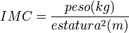

# **Introducción**

## Relevancia

Debido a la importancia que tiene la alimentación, especialmente en los universitarios, quienes necesitan sus capacidades físicas y mentales al máximo para poder realizar todas sus actividades educativas, y en vista al progresivo regreso a clases de forma híbrida y los cambios rutinarios que los estudiantes han realizado para participar en estas, el presente estudio busca conocer cómo es la alimentación de los estudiantes de UTEC en el 2022. De esta manera, podremos identificar los patrones de alimentación y, de encontrarse, los factores que conllevan a una mala alimentación.


## Planificación

Para esta parte, generamos un diagrama de Gantt para especificar los plazos planteados para las entregas de las partes del proyecto. Se detallan las diferentes tareas que tuvieron que cumplirse.  


# **Datos**

## Recolección de datos

Los datos se obtuvieron mediante la realización de una encuesta virtual difundida a través de mensajes en redes sociales a distintos grupos estudiantiles y conocidos de los integrantes del grupo. Se eligió recolectar la información mediante una encuesta virtual dadas las facilidades que implica y además porque permitiría conocer la tendencia actual en cuanto a la alimentación de los estudiantes. Adicionalmente, si bien la estrategia principal fue mandar mensajes a través de redes sociales, también planteamos la idea de, en caso no alcancemos los 200 encuestados mínimos en la semana anterior a la entrega, iríamos a la universidad a encuestar presencialmente. Sin embargo, como se llegó a la meta antes del tiempo esperado, no fue necesario. Las restricciones de la encuesta fueron las siguientes:

- Restringirla para que solo pudiera realizarse con el correo institucional.  
- No difundirla con profesores u otro tipo de personal de la universidad. 

## Población, muestra y muestreo

Dado que la investigación busca conocer los hábitos de alimentación de los estudiantes de UTEC que cursan el ciclo 2022-1, las consideraciones que se tuvieron para realizar el trabajo fueron las siguientes:

- Población: Todos los estudiantes de UTEC que cursan el ciclo 2022-1.   
- Muestra: Los 200 estudiantes de UTEC encuestados que cursan el ciclo 2022-1.  
- Tamaño de muestra: 200 universitarios de UTEC que cursan el ciclo 2022-1.  
- Unidad muestral: Cada universitario de UTEC encuestado que cursa el ciclo 2022-1  
- Tipo de muestreo: Muestreo no probabilístico, por conveniencia.

Respecto al tipo de muestreo elegido, dado que la difusión se realizó a través de redes sociales, en grupos en los que no necesariamente está todo el alumnado, hay que considerar que existe un número de alumnos que no tienen posibilidades de ser encuestados. Cabe destacar que, esto no se hizo con la finalidad de generar algún tipo de sesgo, sino como solución a la indicación de no enviar la encuesta a través de correos a todos los alumnos.
Con respecto a la representatividad de la muestra, es posible afirmarla ya que, además de que los datos se obtuvieron con la mayor aleatoriedad posible, los resultados obtenidos muestran tendencias con un significado real, tal es el caso de las carreras de los encuestados, aspecto que se detalla más adelante.

## Variables

- Carrera: Variable categórica nominal que corresponde al nombre de una de las carreras que se pueden cursar en UTEC en el ciclo 2022-1.
- NumCursos: Variable numérica discreta. Es un número entero mayor o igual a 0 que se refiere al número de cursos siendo llevados en el ciclo 2022-1.
- Peso: Variable numérica continua. Es un número real mayor o igual a 0 que se refiere al peso en kilogramos del alumno.
- Altura: Variable numérica continua. Es un número real mayor o igual a 0 que se refiere a la altura en metros del alumno.
- CalidAlimentacion: Variable categórica ordinal. Cadena de caracteres limitada a las respuestas "buena, regular y mala" y que se refiere a la calidad de alimentación que los alumnos consideran que llevan.
- FactorAlimentacion: Variable categórica nominal. Cadena de caracteres limitada a las respuestas "económico, tiempo, gustos o ideología, social y condición medica" y que se refiere al factor más importante que el alumno considera para seleccionar su almuerzo.
- Desayuno: Variable categórica nominal. Cadena de caracteres limitada a las respuestas "lácteos, frutas o jugos, cereales, pan con algún complemento, avena, comida recalentada, huevos, tocino o ambos y no desayuno" y que se refiere al alimento más importante que el alumno ingiere en su desayuno.
- HoraAlmuerzo: Variable categórica ordinal. Se refiere a una hora entre las 10 y 20 horas. A pesar de estar expresado como un número, no actúa como tal.
- TipoAlmuerzo: Variable categórica nominal. Cadena de caracteres limitada a las respuestas "comida rápida, comida casera, comida de la cafetería y comida de los exteriores (restaurantes)" y que se refiere al tipo del almuerzo que el alumno consume.
- LugarAlmuerzo: Variable categórica nominal. Variable categórica nominal. Cadena de caracteres limitada a las respuestas "casa, cafetería de la universidad, restaurantes y calle" y que se refiere al lugar en el que el estudiante almuerza.
- NumFrutas: Variable numérica discreta. Es un número entero mayor o igual a 0 que se refiere a la cantidad de frutas que el alumno ingiere en un solo día.
- LitAgua: Variable numérica continua. Es un número real mayor o igual a 0 que se refiere a la cantidad de litros de agua que el alumno bebe en un solo día.
- TazasCafe: Variable numérica discreta. Es un número entero mayor o igual a 0 que se refiere a la cantidad de tazas de café consumidas por el alumno en una semana.
- ComidaChatarra: Variable numérica discreta. Es un número entero mayor o igual a 0 que se refiere al número de días a la semana en los que el estudiante consume comida chatarra.
- Problema: Variable categórica nominal. Cadena de caracteres sin restricciones que corresponde a un trastorno alimenticio del alumno.

## Limpieza de base de datos

Para limpiar las variables hay que considerar aquellas en las que las preguntas que se realizaron en la encuesta permitían que se ingresara un valor numérico o un texto (NumCursos, Peso, Estatura, NumFrutas, LitAgua, TazasCafe, ComidaChatarra, HoraAlmuerzo y Problema). Respecto a las demás variables, dado que corresponden a preguntas de selección única, no hay problemas de datos atípicos o valores vacíos. La mecánica a realizar fue emplear tablas en el caso de las variables de tipo categórica, para apreciar la diversidad de datos y homogeneizarlos (mayúsculas y minúsculas, signos de puntuación, tildes, textos sin sentido o coherencia, etc.). Por otro lado, respecto a las variables numéricas, se usaron diagramas de caja para identificar los datos atípicos irreales y convertirlos a NA (Las observaciones que tenían valores NA no fueron descartadas, se trabajó con ellas gracias al uso del comando na.rm=TRUE cada vez que fue necesario). Cabe resaltar que dentro de la base de datos no se encontraron datos faltantes.

```{r echo=FALSE}
rm(list=ls())
knitr::opts_chunk$set(echo = FALSE)
library(readr) #Apertura de librería readr
library(dplyr) #Apertura de librería dplyr
BD <- read_csv("Proyecto.csv", col_types = "ccnnnccccccnnnnc") # Lectura del archivo
BD <- BD[,2:16] # Eliminación de la columna generada por google forms
BD <- rename(BD, Carrera = '¿Qué carrera estudias?', NumCursos = '¿Cuántos cursos estas llevando en este ciclo?', Peso = 'Peso en kilogramos.', Altura = 'Altura en centímetros', CalidAlimentacion = '¿Cómo consideras que estas llevando tu alimentación?', FactorAlimentacion = '¿Qué razones influyen al momento de alimentarte?', Desayuno = '¿Qué alimento es primordial en su desayuno habitual?', HoraAlmuerzo = '¿Cuál es la hora en la que sueles almorzar normalmente? (Ingrese una hora entera en el formato de 24 horas) Por ejemplo, si colocas "14", significará las 2:00pm', TipoAlmuerzo = 'Normalmente, ¿Qué sueles almorzar?.', LugarAlmuerzo='¿Dónde almuerzas?', NumFrutas = '¿Cuántas frutas consumes al día?', LitAgua= '¿Cuántos litros de agua consumes al día?', TazasCafe = '¿Cuántas tazas de café consumes a la semana?', ComidaChatarra = 'Aproximadamente, ¿Cuántos días a la semana comes comida chatarra?', Problema = 'En el caso de haber padecido algún problema alimenticio, nos apoyaría que nos digas cuál es. Cabe recalcar que esta encuesta es totalmente anónima, en pocas palabras, no registramos correos ni nombres.') #Renombrado de las variables

# Limpieza de la variable Peso tras el uso de boxplot
BD$Peso[BD$Peso > 300] <- NA
# Limpieza de la variable Altura tras el uso de boxplot
BD$Altura[BD$Altura < 100] <- NA
# Limpieza de la variable HoraAlmuerzo tras el uso de table
BD$HoraAlmuerzo[BD$HoraAlmuerzo=="1"]<-NA
BD$HoraAlmuerzo[BD$HoraAlmuerzo=="1415"]<-NA
BD$HoraAlmuerzo[BD$HoraAlmuerzo=="2"]<-NA
BD$HoraAlmuerzo[BD$HoraAlmuerzo=="4"]<-NA
BD$HoraAlmuerzo[BD$HoraAlmuerzo=="6"]<-NA
BD$HoraAlmuerzo[BD$HoraAlmuerzo=="7"]<-NA
BD$HoraAlmuerzo[BD$HoraAlmuerzo=="8"]<-NA
BD$HoraAlmuerzo[BD$HoraAlmuerzo=="9"]<-NA
BD$HoraAlmuerzo[BD$HoraAlmuerzo=="13.00"]<-"13"
# Limpieza de la variable Problema tras el uso de tabla
BD$Problema[BD$Problema=="anemia"]<-"Anemia"
BD$Altura = BD$Altura/100
BD$Problema[BD$Problema=="Anorexia nerviosa."]<-"Anorexia nerviosa"
BD$Problema[BD$Problema=="Ansiedad por comer"]<-"Ansiedad"
BD$Problema[BD$Problema=="Bulimia nerviosa."]<-"Bulimia nerviosa"
BD$Problema[BD$Problema=="gastritis"]<-"Gastritis"
BD$Problema[BD$Problema=="gastritis"]<-"Gastritis"
BD$Problema[BD$Problema=="nada"]<-"Ninguna"
BD$Problema[BD$Problema=="Ningúna"]<-"Ninguna"
BD$Problema[BD$Problema=="Ninguno"]<-"Ninguna"
BD$Problema[BD$Problema=="No"]<-"Ninguna"
BD$Problema[BD$Problema=="No padezco o he padecido de ninguna enfermedad."]<-"Ninguna"
BD$Problema[BD$Problema=="Nose, solo me duele y ya"]<-"Ninguna"
BD$Problema[BD$Problema=="Trastorno de rumiación."]<-"Trastorno de rumiación"
BD$Problema[BD$Problema=="Transtorno de rumiación"]<-"Trastorno de rumiación"
BD$Problema[BD$Problema=="Tuve diabetes , no  si te sirva v:"]<-"Diabetes"
BD$Problema[BD$Problema=="Transtorno por atracon y bulimia"]<-"Trastorno por atracón"
BD$Problema[BD$Problema=="Trastorno alimentario compulsivo."]<-"Trastorno alimentario compulsivo"

BD$Problema[BD$Problema=="Trastorno por evitación de alimento."]<-"Trastorno por evitación de alimentos"
```

# **Análisis descriptivo**    

## Carrera

```{r echo=FALSE}
Carreras <- select(BD,1)

barplot(table(Carreras$Carrera),main="Encuestados según carrera", ylab = "Frecuencias", las = 2, col = 'skyblue')
```

En base a este último gráfico, entendemos que la moda de las carreras es la Ingeniería Industrial. Así mismo, podemos afirmar, en base a la gráfica, que la muestra es representativa. Esto se debe a que presenta datos que se relacionan con valores reales (Pocos encuestados en Ingeniería de la Energía, Ciencia de Datos y Administración, que se debe, en parte, a que estas son carreras nuevas en la universidad; la mayoría de encuestados es de Ingeniería Industrial, que suele ser la ingeniería con mayor número de estudiantes).


## Peso y Altura

```{r echo=FALSE}
range(BD$Peso, na.rm = TRUE)
range(BD$Altura, na.rm = TRUE)

sd(BD$Peso, na.rm = TRUE)
sd(BD$Altura, na.rm = TRUE)

plot(BD$Peso)
plot(BD$Altura)
plot(BD$Altura~BD$Peso)

Peso <- select(BD, 3)
Altura <- select(BD, 4)
#which(!complete.cases(BD$Peso))
#which(!complete.cases(BD$Altura))
Altura[167,1] <- NA
Peso[23, 1] <- NA
Peso[181, 1] <- NA
pesoyaltura <- data.frame(Peso, Altura)
pesoyaltura <-pesoyaltura[complete.cases(pesoyaltura), ]

cor(pesoyaltura$Peso, pesoyaltura$Altura)

resultados <- lm(pesoyaltura$Peso~pesoyaltura$Altura,data = pesoyaltura)
resultados
```

Respecto al peso y a la altura, observamos que sus rangos son relativamente grandes, por lo que los datos están bastante dispersos (55 y 0.4 respectivamente). Ello lo confirmamos hallando sus desviaciones estándar (11.82 y 0.09 respectivamente), donde se evidencia que la separación de la media es considerable en ambos casos, y también observando sus gráficas. Asimismo, tampoco es posible identificar una conexión clara en ambas variables al graficarlas por separado. Sin embargo, al enfrentarlas en un gráfico de tipo plot, se puede apreciar que, aparentemente, existe una relación directa entre ambas. Para determinar ello, hallamos la correlación. Esta adquiere un valor de 0.63, lo que nos indica que la relación no es fuerte (<0.75). 

```{r echo=FALSE}
plot(pesoyaltura$Altura, pesoyaltura$Peso, main = "Peso vs. Altura", xlab = "Altura", ylab="Peso")
abline(resultados, col = "red")
```

A pesar de ello, dado que la relación directa existe, decidimos estimar cómo cambiaba el peso en función a la altura de los estudiantes, obteniendo la última gráfica mostrada (empleamos regresión lineal). De esta gráfica, se puede apreciar cómo los valores de peso y altura de los alumnos oscilan alrededor de la recta que marca el valor del peso estimado dependiendo de la altura. Dicha recta podría servir para estimar un peso, pero, dado que la relación entre variables no es fuerte, no es un dato demasiado confiable en cuanto a su exactitud (Peso = -76.65 + 0.85*Altura).

Dejando de lado nuestra estimación con regresión lineal, la forma de poder analizar el peso adecuado de una persona según su altura es por medio del Índice de Masa Corporal. Esta medida fue creada por el estadístico belga L.A.J. Quetelet y su fórmula es la siguiente:



```{r echo=FALSE}
# Dado que el IMC ideal es de 21.8, usamos la fórmula anterior para calcular el peso ideal de los estudiantes según su altura teniendo en cuenta dicho valor de IMC.
PesoIdealSegunIMC <- (21.8 * BD$Altura *  BD$Altura)

plot(BD$Peso, PesoIdealSegunIMC, xlab="Peso real (kg)", ylab = "Peso ideal según estatura (kg)", main = "Comparación entre el peso real y peso ideal")

abline (0,1, col="red")
```
Como la gráfica presenta una acumulación significativa cerca a la pendiente, podemos notar que existe una buena cantidad de estudiantes que mantienen un peso adecuado según su altura. Sin embargo, si analizamos los datos debajo de la línea que se encuentran muy alejados, podemos notar un cierto número de estudiantes con sobrepeso.


## Calidad de alimentación 

```{r echo=FALSE}
barplot(table(BD$CalidAlimentacion),main="Calidad de alimentación",col="lightblue", ylab = "Frecuencias")
```

Consultamos a los estudiantes sobre su perspectiva con respecto a su alimentación. En base a la gráfica, notamos que la mayoría (moda) la considera regular y una cantidad más corta, pero muy importante, mala. Recordando que somos estudiantes, resulta importante manejar hábitos buenos para poder rendir al máximo, ya que podríamos experimentar un desgaste energético de no ser así.


## Desayuno  

```{r echo=FALSE}
Desayunos <- select(BD,7)

barplot(table(Desayunos$Desayuno),main="Alimento primordial del desayuno",ylab = "Frecuencias", col = 'skyblue', las = 2)

```


La moda en esta variable es la opción de un pan con algún complemento; en segundo lugar, a las frutas y lácteos; y, en tercer lugar, cereales. En base a ello, notamos un patrón saludable en algunos estudiantes, ya que, según estudios, los principales componentes que deben consumirse en el desayuno de estudiantes son algún lácteo, fruta o cereal. Sin embargo, un preocupante número de 20 personas no desayuna, lo que puede traer repercusiones en sus estudios.


## HoraAlmuerzo  

```{r echo=FALSE}
barplot(table(BD$HoraAlmuerzo), main="Hora de almuerzo", ylab = "Frecuencia", xlab = "Hora", col = 'skyblue')
```

Según Cleves (2021), las horas adecuadas para comer se encuentran en el intervalo de 13 a 15 horas. Respecto a los datos mostrados, los estudiantes almuerzan, en su mayoría, a las 13 horas, siendo esta la moda. A este horario le siguen las 14 y 15 horas como los horarios más frecuentes de almuerzo, cosa que está dentro de lo recomendado. Por el contrario, vemos datos como el de las 10 y 11 horas que se alejan bastante, aunque se reducen a solo a 3 estudiantes.

## TipoAlmuerzo y FactorAlmuerzo

```{r echo=FALSE}
TipoAlmuerzoo <- select(BD,9)
TipoAlmuerzoo$TipoAlmuerzo[TipoAlmuerzoo$TipoAlmuerzo=="Comida casera"]<- "Casera"
TipoAlmuerzoo$TipoAlmuerzo[TipoAlmuerzoo$TipoAlmuerzo=="Comida de la cafetería"]<- "Cafetería"
TipoAlmuerzoo$TipoAlmuerzo[TipoAlmuerzoo$TipoAlmuerzo=="Comida de los exteriores (restaurantes)"]<- "Restaurante"
TipoAlmuerzoo$TipoAlmuerzo[TipoAlmuerzoo$TipoAlmuerzo=="Comida rápida"]<- "Rápida"
TipoAlmuerzoo$TipoAlmuerzo[TipoAlmuerzoo$TipoAlmuerzo=="Restaurante"]<- "Rest"
TipoAlmuerzoo$TipoAlmuerzo[TipoAlmuerzoo$TipoAlmuerzo=="Rest"]<- "Rest      "
TipoAlmuerzoo$TipoAlmuerzo[TipoAlmuerzoo$TipoAlmuerzo=="Rest      "]<- "Rest             "

mosaicplot(table(BD$FactorAlimentacion,TipoAlmuerzoo$TipoAlmuerzo), main='Factores que condicionan los tipos de almuerzo',col=c("yellow","blue","red", "green"))
```
```{r}
table(BD$LugarAlmuerzo)
```

Asimismo, podemos identificar los factores que condicionan el tipo de almuerzo de los estudiantes. El grupo con mayor cantidad de personas es quienes comen comida casera debido al tiempo.


## NumFrutas

```{r echo=FALSE}
summary(BD$NumFrutas)
boxplot(BD$NumFrutas, main = "Cantidad de fruta al día", ylab = "Frecuencias", xlab = "Cantidades de frutas", col = "skyblue")
```

En la encuesta, encontramos que, a pesar de que cerca de 30 alumnos no consumen ninguna fruta al día, lo que puede estar afectando a su estabilidad emocional sin darse cuenta. Por otra parte, un 50% de los encuestados comen por lo menos dos frutas al día, y un 75% de ellos, por lo menos una (observamos los cuartiles 2 y 3). Lo que es un indicio positivo. Por otra parte, son solo 3 los alumnos que ingieren más de 3 frutas por día. Por la gráfica, podemos observar que la concentración de datos está entre 1 y 2 frutas. Mientras que la media es 1.785, los puntos extremos están entre 0 y 6 frutas.

## Litros de agua

```{r echo=FALSE}
boxplot(BD$LitAgua, col = "sky blue", main = "Relación de litros de agua", ylab = "Litros")
```

Hablando ahora de los litros de agua, beber cierta cantidad de litros de agua al día es una buena práctica saludable, siendo 2 litros la cantidad que se recomienda. Podemos observar que un 25% alcanza esos 2 litros, sin embargo, no podemos dejar de notar lo positivo que es que más de 75% de los alumnos encuestados beben por lo menos 1 litro de agua al día (Valores obtenidos observando los cuartiles 1 y 3).

## TazasCafe  

```{r echo=FALSE}
smoothScatter(BD$NumCursos,BD$TazasCafe, main = "Relación entre la cantidad de cursos y tazas de cafe",xlab="Número de cursos", ylab = "Tazas de cafe al día")
```

Notamos que los estudiantes que llevan 6 cursos son quienes más café consumen. Esto puede deberse a las cantidades de trabajos que manejan. Además, evidenciamos una cierta tendencia entre los estudiantes que llevan de 2 a 6 cursos. Sin embargo, esta parece haber llegado a su punto de quiebre desde los estudiantes que llevan 7 cursos.

## Comida Chatarra

```{r echo=FALSE}
summary(BD$ComidaChatarra)
```

En este caso, observamos que más del 50% de estudiantes consumen comida chatarra 2 veces a la semana y que la cantidad máxima es de 7. Esto indicaría con certeza que existen alumnos que almuerzan al menos una vez al día este tipo de alimento por cada día de la semana, cosa que no es saludable.

## Problema  

```{r echo=FALSE}
table(BD$Problema)
```

Por último, buscamos conocer las usuales enfermedades/trastornos alimenticios que los alumnos encuestados padecieron. Cabe recordar que la encuesta fue totalmente anónima para evitar incomodar a los encuestados. Del resumen de resultados, vemos que la moda, con una frecuencia de 163, indica que los alumnos no padecen ninguna enfermedad o trastorno alimenticio. Sin embargo, 11 pasaron por un trastorno por evitación de alimentos, 5 estudiantes han padecido gastritis, 4 padecieron bulimia nerviosa y 3 sufrieron del trastorno de rumiación. Además, en las otras enfermedades detectadas, al menos se manifestó una persona por cada una. Esto significa que 38 personas han padecido de algún tipo de estas enfermedades.

# **Análisis probabilistico**    

## Factores de Alimentación

En el ámbito universitario, existen factores que influyen el tipo de almuerzo que un alumno escoge. Nuestra investigación se enfoca principalmente en 5 tipos (condición médica, económica, gustos o ideologías, social y tiempo) cuya distribución de frecuencias y probabilidades de ocurrencia se resumen en la siguiente tabla:
```{r}
FFA<- as.data.frame(table(BD$FactorAlimentacion))
PorceFA<- data.frame(FFA$Freq/2)
FDA <- cbind(FFA, PorceFA/100)
FDA <- rename(FDA, Probabilidad = 'FFA.Freq.2',Frecuencia='Freq')
FDA
```
En base a dichas probabilidades de ocurrencia, podemos hallar lo siguiente:
```{r}
sum(0.425, 0.21)
```
De acuerdo a Medwave (2011), el factor más influyente en la alimentación universitaria y que a su vez puede representar un gran problema es el tiempo. Ello se correlaciona con los resultados pues la probabilidad de ocurrencia de dicho factor es la mayor, 0.425, es decir, aproximadamente 43 de cada 100. Asimismo, otro factor que puede resultar un problema resulta el económico, pues se prioriza por sobre la calidad de la alimentación, siendo la suma de probabilidades de estos dos factores 0.635, que es de casi 64 personas por cada 100.


## Tipo de almuerzo  

Muchas veces por el tiempo u otros factores decidimos comer un tipo de almuerzo, no necesariamente adecuado. Como estudiantes, las energías del cuerpo están en constante agotamiento; por ello, el almorzar una comida saludable permite seguir con los quehaceres del día. La distribución de frecuencias y en probabilidades de ocurrencia de los tipos de almuerzo que suelen comer los alumnos se pueden observar en la siguiente tabla:
```{r echo=FALSE}
FrecAlmuerzo <- as.data.frame(table(BD$TipoAlmuerzo))
Porcentajes2 <- data.frame(FrecAlmuerzo$Freq/2)
E <- cbind(FrecAlmuerzo, Porcentajes2/100)
E <- rename(E, Probabilidad = 'FrecAlmuerzo.Freq.2')
E
```
En base a esta tabla, nos es útil calcular lo siguiente:
```{r}
1 - 0.805
```
De acuerdo con Núñez(2021), comer en casa resulta, en la mayoría de los casos, más sano que comer fuera por el tamaño de las porciones y la cantidad de calorías. En vista de ello nos es útil calcular la probabilidad de que un alumno coma fuera de casa, lo que implica que su alimentación corre riesgo de verse perjudicada. Entonces, aproximadamente 20 de cada 100 estudiantes son los que estarían en riesgo. 


## Factor de alimentación y Tipo de almuerzo 

La alimentación de los estudiantes depende mucho de los factores de su entorno como su economía, tiempo, gustos, etc. Por esta razón, suele almorzar ciertos tipos de almuerzo que son buenos o malos para su salud.

```{r}
nrow(filter(BD,FactorAlimentacion == "Tiempo" ,TipoAlmuerzo=="Comida rápida"))/200
```
En conclusión de 1 a 2 de cada 100 universitarios la falta tiempo influye en que almuerzan comida rápida.

## Calidad de alimentación

Es importante conocer la perspectiva de la persona acorde a lo que consume ya que así podríamos determinar si las personas están conscientes de lo que consumen en su vida diaria.
```{r}
BR<- as.data.frame(table(BD$CalidAlimentacion))
PorceBR<- data.frame(BR$Freq/2)
PO<- cbind(BR, PorceBR/100)
PO<- rename(PO,Probabilidad = 'BR.Freq.2', Frecuencia='Freq')
PO
```
De acuerdo con nuestra tabla:

```{r}
1-(0.08)
```

Podemos determinar que una muy pocas personas consideran mala su alimentación que son 16, entonces para determinar el porcentaje de personas que consideran su alimentación buena y regular es de 92%.


## Comida chatarra por semana   

Luego de haber confirmado que existe una cantidad de alumnos que almuerza comida chatarra y los factores a los que mayormente se debe esto, averiguaremos qué tan seguido se consumen estas comidas, ya sea en el desayuno, almuerzo o cena. Según Orjuela (2017), la comida chatarra puede generar diversos problemas nutricionales y metabólicos.
```{r}
FC<- as.data.frame(table(BD$ComidaChatarra))
PFC<- data.frame(FC$Freq/2)

FCA <- cbind(FC, PFC/100)
FCA <- rename(FCA, Probabilidad = 'FC.Freq.2',Frecuencia='Freq')
FCA
```
Proceso de identificación del modelo:  

En base a dicha tabla y a las frecuencias de cada uno de los eventos, pudimos asociar esta variable a un modelo geométrico. Ello estaría en función de la variable aleatoria X, que determina el número de intentos hasta obtener a un alumno que consuma comida chatarra 0, 1 o 2 días, que es el éxito para este caso. Se consideró de 0 a 2 días porque, según Agurto, Espinoza, Damaso, Artega y Panduro (2020), se afirma que las personas que no consumen comida chatarra más de 2 veces a la semana no tienden a presentar cálculos en la vesícula. Teniendo eso en cuenta y gracias a la tabla, definimos que la probabilidad de éxito es de 0.695, de tal manera que la notación quedaría de la siguiente manera:

**Geo(0.695)**

Para poder demostrar que el modelo es el correcto se gráfica el histograma y se compara con la gráfica teórica del modelo para verificar su validez. Se observa una similitud entre estos.

```{r}
hist (BD$ComidaChatarra ,xlab='Comida chatarra', main = 'Distribucion observada de comida chatarra a la semana', prob = T)
lines(density(BD$ComidaChatarra), lwd = 2, col = 'red')
legend("topleft", c("Distribucion"),
       lty = 1, lwd = 2, col = c("red"), bty = "n",
       cex = 0.8)
plot(0:7,dgeom(-1:6,0.29), main = 'Distribucion (Geometrica) teorica')
```

Casos de cálculo:  

La buena alimentación mientras uno está estudiando tiene que ser rica en hierro para el óptimo desarrollo cognitivo. En caso haya un consumo excesivo de azúcar y grasa, esto puede afectar negativamente la memoria. Por ello, para que no afecte mucho nuestra alimentación la comida chatarra debe ser consumida a lo mucho 10%. Considerando la cantidad de veces por semana que comemos (desayuno, almuerzo y cena) por 7 días, estaría en promedio de 2 veces por semana. En nuestra base de datos, tenemos que la probabilidad de que un alumno consuma menos o igual de 2 veces a la semana comida chatarra es de 0.695. Para este caso, buscaremos la probabilidad de que el número de ensayos para conseguir el primer éxito sea uno, considerando que deseamos conocer el resultado de una forma rápida.

Los resultados obtenidos:

```{r}
dgeom(0,0.695)
```

La probabilidad es de 0.7, lo cual nos indica que es bastante probable que en la primera selección encontremos a un alumno que no tienda a padecer de cole litiasis (cálculos en la vesícula), ya que consume aceptables cantidades de comida chatarra.

## Cantidad de frutas por día  

En función a lo que se consiguió a través de la base de datos, podemos apreciar las frecuencias de cada uno de los eventos de esta variable y sus porcentajes de ocurrencia en la siguiente tabla:
```{r}
FNF<- as.data.frame(table(BD$NumFrutas))
PorceNF<- data.frame(FNF$Freq/2)
NF <- cbind(FNF, PorceNF/100)
NF <- rename(NF, Probabilidad = 'FNF.Freq.2',Frecuencia='Freq')
NF
```

Esta variable representa la cantidad de frutas al día consumidas por los estudiantes siendo una numérica discreta. Según la teoría nos indica que esta variable sigue un modelo de distribución Binomial negativa, según la revista Financial food (2021) ”3 de cada 10 personas consumen más frutas”. Para ello se va a determinar el número de intentos hasta conseguir 3 estudiantes que consumen dos frutas por día. Sus parámetros X~ BinNeg(3, 0.4), donde 3 es el número de éxitos y 0.4 es la probabilidad de ocurrencia.

Además, se puede corroborar la identificación del modelo binomial negativo al graficar un histograma de la cantidad de frutas al día y la del modelo teórico. Se logra observar una similitud entre ambas, lo cual confirma lo planteado.

```{r}
hist(BD$NumFrutas, main='Distribución observada de frutas al día', xlab = 'Número de frutas consumidas', prob = TRUE)

plot(0:7,dnbinom(0:7,3,0.4),xlab='Número de frutas consumidas',main = 'Distribución (Binomial Negativa) teórica')
```

Casos de cálculo:

El consumo de frutas diarias nos aportan vitaminas, minerales, fibra y diferentes compuestos beneficiosos para el organismo así como la prevención de enfermedades y el consumo diario debe ser de 2 raciones de frutas frescas (2022, Ifobae S.A.). De manera que los universitarios requieren de vitaminas provenientes de las frutas para mantener una buena salud durante sus actividades académicas. Por tal motivo, conoceremos qué tan probable es encontrar hasta 3 universitarios que se preocupen por su salud ingiriendo 2 frutas al día  ya que según  en 10 ensayos simulando un grupo de 10 amigos.

Resultados obtenidos:

```{r}
round(pnbinom(7,3,0.4),2)
```
Concluimos que en un grupo de 10 habría una probabilidad de 0.83 de encontrar a hasta 3 personas que al menos se preocupan de consumir 2 frutas por día.

## Número de Cursos

Al llevar un estudiante mayor número de cursos la preocupación de rendirlos a todos puede apartar la preocupación o consideración de la alimentación. La siguiente tabla muestra las frecuencias de cada evento de la variable y sus probabilidades de ocurrencia:

```{r echo=FALSE}
FrecCursos <- as.data.frame(table(BD$NumCursos))
PorcentajesCursos <- data.frame(FrecCursos$Freq/2)
Ncursos<- cbind(FrecCursos, PorcentajesCursos/100)
Ncursos <- rename(Ncursos, Probabilidad = 'FrecCursos.Freq.2')
Ncursos
```

## Cantidad de cursos

Proceso de identificación de modelo:   
En base a la tabla anterior, podemos relacionar esta variable a una distribución binomial. La variable aleatoria X identifica la cantidad de personas que llevan ciertas cantidades de cursos en el ciclo. El modelo que sigue es binomial, ya que para encontrar unos éxitos en cierta cantidad de ensayos. Los parámetros serán binom(30, 0.18), donde 30 será el número de intentos debido a una simulación de la mitad de un salón de clases en la universidad y 0.18 la probabilidad de encontrar personas con menos de 5 cursos (media de la variable aleatoria).
**X~Bin(n,p)**
Para poder demostrar que el modelo es el correcto se gráfica el histograma y se compara con el plot para verificar su validez. Se observa una similitud entre estos.
```{r}
hist(BD$NumCursos, xlab="Cantidad de Cursos", main = "Distribucion observada de cantidad de cursos", prob = T)
lines(density(BD$NumCursos), lwd = 2, col = 'red')
legend("topleft", c("Distribucion"),
       lty = 1, lwd = 2, col = c("red"), bty = "n",
       cex = 0.8)
plot(0:8,dbinom(0:8,30,0.18),main = "Distribucion (Binomial) teorica",xlab='Cantidad de cursos')
```
Caso de cálculo:
Por lo visto en el proyecto se sabe que uno de los factores que más afectan la alimentación de los estudiantes es el tiempo. De esto se concluye que la cantidad de cursos y el tiempo libre de los estudiantes es inversamente proporcional. Por lo tanto, podremos conocer qué tan probable es encontrar 50 personas que lleven menos de 5 cursos, tomando en cuenta nuestra muestra de 200. Asumimos que tenemos una probabilidad de 0.18 de encontrar a alguien con cursos menores al promedio. Buscamos 50 personas ya que esta simularía a un salón de clases.
Resultado obtenido:
```{r}
pbinom(50,200,0.18)
``` 
Dado que el resultado es 0.9948913, es muy probable encontrar a 50 personas dentro de las 200 que llevan menos de 5 cursos tomando en cuenta p = 018.
  
## Tazas de café  

```{r}

Caf<- as.data.frame(table(BD$TazasCafe))
PorceCaf<- data.frame(Caf$Freq/2)
NCafe <- cbind(Caf, PorceCaf/100)
NCafe <- rename(NCafe, Probabilidad = 'Caf.Freq.2',Frecuencia='Freq')
NCafe
```

Proceso de identificación del modelo:

La variable aleatoria X2 representa la cantidad de tazas de café que consumen los estudiantes de lunes a domingo. Según la teoría, es posible darse cuenta que la variable sigue el modelo Poisson para calcular el número éxitos. Esta distribución está denotada por X 2~Pois(lambda), siendo lambda la media de la variable tazas de café, valor que calcularemos a continuación.

Esperado: E(X2) =  2.94

```{r}
mean(BD$TazasCafe, na.rm = T)
```

En vista de ello, completamos la expresión:

**X2~Pois(2.94) **

Además, se puede corroborar la identificación del modelo Poisson al graficar un histograma de tazas de café y la distribución teórica del modelo. Se logra observar una similitud entre ambas, lo cual confirma el modelo planteado.
```{r}
hist(BD$TazasCafe, main='Distribución observada de tazas de café a la semana', xlab = 'Tazas de café', prob = TRUE)

lines(density(BD$TazasCafe), lwd = 2, col = 'red')
legend("topright", c("Curva Observada"),
       lty = 1, lwd = 2, col = c("red"), bty = "n",
       cex = 0.8)

plot(0:23,dpois(0:23, lambda = mean(BD$TazasCafe)), main = 'Distribución (Poisson) teórica')

```

Casos de cálculo:

La cafeína sirve como estimulante del cerebro. Esto significa que ayuda a mantenerse despierto a altas horas de la noche mientras se trabaja o estudia. Sin embargo, su consumo de forma descontrolada y excesiva puede ocasionar problemas de salud a largo plazo. En este caso, la variable se utilizará para analizar la existencia de buenos o malos hábitos alimenticios respecto al consumo de cafeína. Gotteland (2007) nos menciona que las personas que consumen nueve tazas de café a la semana tienen riesgo a padecer alguna enfermedad como la cirrosis.

Los resultados obtenidos:

Calcularemos la probabilidad de que los estudiantes estén en riesgo de padecer alguna enfermedad por el consumo excesivo de esta bebida.
```{r}
1 - ppois(9, lambda = mean(BD$TazasCafe)) + dpois(9, lambda = mean(BD$TazasCafe))
```
La probabilidad de que en 7 días se tomen más de 9 tazas de café colocando en riesgo la vida de los estudiantes es demasiado baja. Esta es de 0.0033.


## Tazas de café y cantidad de cursos

En este caso, deseamos conocer el hábito de tomar café en los estudiantes con poca carga académica, quienes llevan menos de 4 cursos, con el fin de poder analizar una posible existencia de dependencia a la cafeína, ya que quienes cursan una menor cantidad de materias no necesitan un consumo elevado de este. Si se sabe que un alumno consume más de 7 tazas de café a la semana, ¿cuál es la probabilidad de que lleve menos de 4 cursos? 

```{r}
round((nrow(filter(BD, TazasCafe > 7, NumCursos<4 ))/200)/ppois(7, mean(BD$TazasCafe), lower.tail = FALSE),2)
```

La probabilidad de que el alumno consuma más de 7 tazas de café dado que cursa a lo más de cuatro cursos es de 0.94.  


## Peso (kg)
La distribución en porcentajes de los pesos de los estudiantes agrupándolos en intervalos de 5.5 se puede apreciar en la siguiente tabla:
```{r echo=FALSE}
FrecPeso <- as.data.frame(table(Peso=factor(cut(BD$Peso, breaks=10))))
FrecPeso[["Porcentajes"]] <-with(FrecPeso, Freq/sum(FrecPeso$Freq))
FrecPeso
```
Proceso de identificación del modelo:

En base a dicha tabla, podemos notar que hay presencia de un cierto patrón, lo que nos permitió asociar esta variable a una distribución normal. En este caso, la variable aleatoria X representa el peso de los estudiantes encuestados. Esta variable se adapta a una distribución normal, cuyos parámetros están dados por la siguiente expresión: X~N (media de la variable, varianza de la variable). Estos parámetros son calculados a continuación:

Esperado: E(X) = 64.12
```{r}
round(mean(BD$Peso, na.rm=T),2)
```
Varianza: V(X) = 139.61
```{r}
round(var(BD$Peso, na.rm=T),2)
```

En vista de ello, completamos la expresión:

**X~N(64.12412, 139.612)**

Se puede corroborar la identificación del modelo normal al graficar un histograma de la variable aleatoria y una curva teórica del modelo. Se logra observar una similitud entre ambas, lo cual confirma el modelo planteado.

```{r}
hist(BD$Peso,breaks=10, freq=FALSE, main="Histograma de peso", xlab="Peso (kg)", col="green")
lines(density(BD$Peso, na.rm=TRUE),col="red",lwd=3)
curve(dnorm(x, mean(BD$Peso,na.rm=TRUE), sd(BD$Peso,na.rm=TRUE)), lwd = 2, col = "blue", add = T)
legend("topright", c("curva observada", "curva (normal) teórica"),
       lty = 1, lwd = 2, col = c("red", "blue"), bty = "n",
       cex = 0.8)
```

Casos de cálculo:

El uso de la distribución normal para representar esta variable nos permite identificar qué tan probable es que el peso de un estudiante sea mayor o menor a un determinado valor, identificando así existen casos de obesidad o sobrepeso en función del posterior análisis de la altura, e identificando también las probabilidades de que los estudiantes se encuentren dentro de un rango de peso aceptable de acuerdo al IMC.

## Altura (m) 

De manera referencial y para poder apreciar la distribución porcentual de las alturas, la siguiente tabla nos muestra agrupados en intervalos de 0.4:
```{r echo=FALSE}
FrecAltura <- as.data.frame(table(Altura=factor(cut(BD$Altura, breaks=10))))
FrecAltura[["Porcentajes"]] <-with(FrecAltura, Freq/sum(FrecAltura$Freq))
FrecAltura
```

En base a dichas probabilidades referenciales, asociamos la altura, al igual que el peso, a una distribución normal.
  
Proceso de identificación del modelo:

En este caso, la variable aleatoria Y representa la altura de los estudiantes encuestados. Esta variable se adapta a una distribución Normal, cuyos parámetros están dados por la siguiente expresión: Y~N(media de la variable, varianza de la variable). Estos parámetros son calculados a continuación:

Esperado: E(Y) = 1.66
```{r}
round(mean(BD$Altura, na.rm=T),2)
```
Varianza: V(Y) = 0.01
```{r}
round(var(BD$Altura, na.rm=T),2)
```

En vista de ello, completamos la expresión:

**X~N(1.655, 0.00770736) **

Se puede corroborar la identificación del modelo normal al graficar un histograma de las alturas y una curva teórica del modelo. Se logra observar una similitud entre ambas, lo cual confirma el modelo planteado.

```{r}
hist(BD$Altura,breaks=10, freq=FALSE, main="Histograma de altura", xlab="Altura (m)", col="green")
lines(density(BD$Altura, na.rm=TRUE),col="red",lwd=3)
curve(dnorm(x, mean(BD$Altura,na.rm=TRUE), sd(BD$Altura,na.rm=TRUE)), lwd = 2, col = "blue", add = T)
legend("topright", c("curva observada", "curva (normal) teórica"),
       lty = 1, lwd = 2, col = c("red", "blue"), bty = "n",
       cex = 0.8)
```

Casos de cálculo:

El uso de la distribución normal para representar esta variable nos permite identificar la probabilidad de que la altura de un estudiante sea mayor o menor a un determinado valor. Esta variable servirá para ser comparada con el peso, tal y como se muestra a continuación. 

## Peso y Altura

Teniendo en cuenta el IMC y la altura media de los encuestados, 1.66, el peso debería estar alrededor de los 60 kg +/- 4 kg para estar dentro del rango saludable. Con dicha información, ¿Cuál sería la probabilidad de que una persona tenga sobrepeso o déficit de alimentos sabiendo que su diferencia de altura respecto a la media es +/- 0.4m? Se analizan los valores cerca a la altura media para que el valor de su IMC no discrepe mucho y el sobrepeso o déficit de alimentación para obtener la probabilidad de que un alumno esté en riesgo nutricional.

```{r}
((nrow(filter(BD,Peso > 64 ,Altura<=1.7))/200)-(nrow(filter(BD,Peso > 64 ,Altura<=1.620))/200))/(pnorm(1.7, 1.655, 0.00770736) - pnorm(1.62, 1.655, 0.00770736))
```
La probabilidad sería de 0.15, lo que nos indica que aproximadamente 15 de cada 100 alumnos cuya altura es cercana a la media, 1.66, tienen algún problema con su peso. Ya sea por déficit o por sobrepeso, siendo este un número considerable.  

## Comida chatarra y peso  

Según Peña (2020), el peso de una persona está muy ligado a la genética, o sea, no va a engordar demasiado si su genética no se lo permite. Además, se sabe que al comer comida chatarra el peso corporal aumenta dramáticamente. 
Si nos ponemos en el segundo caso ¿Cuál es la probabilidad de seleccionar 50 personas de la muestra las cuales tengan peso mayor a 90 kg y coman más de 4 veces comida chatarra a la semana? Se escogió la cantidad de 50 alumnos para conocer la probabilidad de que la cuarta de un salón sean candidatos a padecer sobrepeso. Se toma 90kg porque según nuestra data la persona con mayor altura es de 1.87 metros por lo tanto según el IMC estaría en un rango de sobrepeso. Tomando a partir de 90 kg como sobrepeso sin importar la altura.
```{r}
nrow(filter(BD, Peso > 90, ComidaChatarra > 4))/200
```
```{r}
dbinom(50,200,0.005)
```
Por lo tanto, se concluye que las personas de nuestra muestra que consumen más de 4 veces a la semana comida chatarra no son muy más propensas a tener sobrepeso, dejando a un lado la genética que los envuelve. 

Referencias:

El Universal (2018 ,26 enero).¿Cuántas frutas debes comer al día?. Fernanda Alvarado.
https://www.eluniversal.com.mx/menu/cuantas-frutas-debes-comer-al-dia 

Martin Gotteland. (2007, 23 marzo). Scielo. Scientific Electronic Library Online. https://www.scielo.cl/scielo.php?pid=S0717-75182007000200002&script=sci_arttext

Revista Gastrohnup Año 2013 Volumen 15 Número 2: 20-27 (mayo-junio)Hernández, A. (2022, 22 junio). Beneficios de la fruta para tu salud. 
WebConsultas. https://www.webconsultas.com/dieta-y-nutricion/higiene-alimentaria/saber-comprar/comprar-fruta/beneficios-3101

Rubén Ernesto Orjuela. (2017, marzo). ¿Qué es la comida chatarra? Asociación Colombiana de Educación al Consumidor. https://aprendiendoaserpapaz.redpapaz.org/wp-content/uploads/2018/08/Que_es_comida_chatarra.pdf

Secretaria de salud de Aguascalientes. (2017). ISSEA - Infosalud. Calcula tu Índice de Masa Corporal. https://www.issea.gob.mx/calculaimc.html


Financial food (septiembre, 2021)Tres de cada 10 personas consumen más frutas y hortalizas desde el inicio de la crisis sanitaria.
https://financialfood.es/tres-de-cada-10-personas-consumen-mas-frutas-y-hortalizas-desde-el-inicio-de-la-crisis-sanitaria/ 
¡Empieza tu día con un buen desayuno! (2019b, junio 25). PuntoEdu PUCP. https://puntoedu.pucp.edu.pe/noticia/empieza-tu-dia-con-un-buen-desayuno/

Peña, A. (2020, 5 enero). Así es como influye realmente la genética en nuestro organismo. alimente.elconfidencial.com. https://www.alimente.elconfidencial.com/bienestar/2020-01-07/como-influyen-genes-organismo-adelgazar_2392311/#:%7E:text=La%20gen%C3%A9tica%20determina%20el%20peso,por%20ejemplo%2C%20por%20nuestra%20conducta.

Gutiérrez, M. F. (2022, 10 mayo). El factor económico es el culpable de una mala alimentación. Revista Pesquisa Javeriana. https://www.javeriana.edu.co/pesquisa/el-factor-economico-es-el-culpable-de-una-mala-alimentacion/

Rodríguez, R. L. (2022, 7 marzo). Conoce la hora adecuada para consumir alimentos. Mejor con Salud. https://mejorconsalud.as.com/conoce-hora-adecuada-consumir-alimentos/

EL TIEMPO (2021, 29 Julio)¿Cuáles son las horas recomendables para comer y tener una dieta saludable? Casa Editorial NIT. 860.001.022-7.
https://www.eltiempo.com/vida/a-que-hora-es-recomendable-comer-dieta-saludable-606661#:~:text=Expertos%20recomiendan%20almorzar%20entre%20la%201%20p.%20m.%20y%20las%203%20p.%20m.&text=De%20acuerdo%20con%20Cleves%2C%20es,evitar%20problemas%20como%20el%20reflujo
.
Andrea Núñez-Torrón Stock (2021, 22 septiembre).Comer mucho fuera de casa o pedir a diario comida a domicilio está relacionado con más riesgos para la salud, según un nuevo estudio. Business Insider.
https://www.businessinsider.es/comer-fuera-casa-relacionado-problemas-salud-935225

Infobae (2021, 22 Marzo) Según un estudio de Harvard, comer 2 frutas y 3 verduras al día garantiza una vida más larga
https://www.infobae.com/america/ciencia-america/2021/03/02/segun-un-estudio-de-harvard-comer-2-frutas-y-3-verduras-al-dia-garantiza-una-vida-mas-larga/ 

Claudia Troncoso, Carlos Doepking, Eduardo Silva(2011, Mayo). ¿Es importante la alimentación para los estudiantes universitarios?. Revista Biomédica Revisada Por Pares. MEDwave
https://www.medwave.cl/link.cgi/Medwave/Estudios/Investigacion/5034

Morales Lupayante, Elisa (2022). Consumir comida rápida: posibles riesgos. Revista Mejor con Salud. Revista Biomédica Revisada Por Pares
https://mejorconsalud.as.com/los-riesgos-de-consumir-comida-rapida/


Agurto, E., Espinoza, C, Damaso, B., Arteaga, K. y Panduro, V. (2020). Estado nutricional, actividad física y consumo de comida chatarra asociados a colelitiasis en huánuco. Estudio de casos y controles. Universidad Nacional Hermilio Valdizán. https://www.scielo.cl/scielo.php?pid=S2452-45492020000600535&script=sci_arttext


