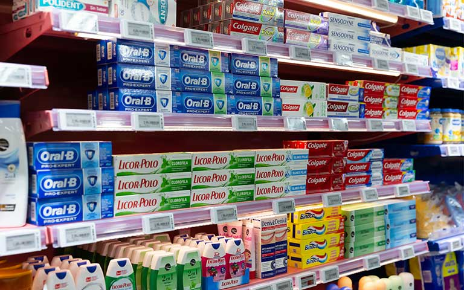
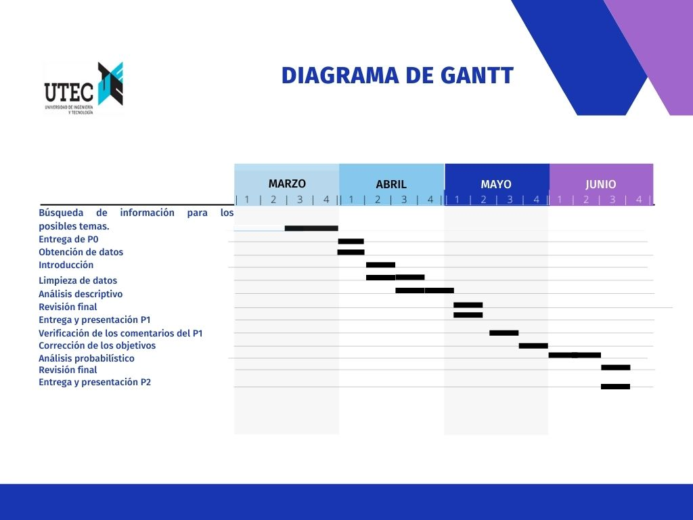
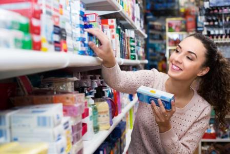

{align="right" width=25%}
<br>
<br>
<br>
<br>
<br>
<br>


<b style = 'color : green; font-size : 25px ; font-family : Amasis MT Pro Black'>**Principales factores que influyen en la compra de dentífricos en las personas de 18 a 30 años, en Lima Metropolitana durante el primer semestre del 2022.**
</b>

<center>

{width=70%}

</center>

</b>

## I. Introducción
 
### 1.1 Relevancia

Según la ingeniera civil de industrias Denisse Faúndez “La familia es la unidad social de mayor influencia en la conducta de sus miembros, particularmente en lo que tiene relación a conducta de consumo”(2018). En base a ello resulta factible estudiar dicha influencia en jóvenes universitarios en el caso de la compra de pasta dental.

### 1.2 Planificación

Para organizar la realización del proyecto se elaboró un diagrama de Gantt, de manera que, se pueda apreciar graficamente las actividades planeadas y el tiempo que se dedicará a su elaboración. Se utilizó la aplicación Miro.com para la elaboración del diagrama:




### 1.3 Antedecentes

### FACUS GROUP

* Análisis y Resultados del FOCUS GROUP para pastas dentales, es un informe estadístico desarrollado en la ciudad de Piura que pretende determinar la preferencia que presenta una marca de dentífricos respecto a otra; y las ventajas y desventajas que se encuentran en cada una, a través de un plan de marketing denominado FOCUS GROUP con la finalidad de recopilar información de un segmento representativo del mercado de las pastas dentales, para ello se tomó una muestra de 10 participantes, 4 mujeres y 6 varones estudiantes de la universidad Alas Peruanas de entre 17 y 22 años, tras dicho estudio se concluyó que la pasta más asequible por su publicidad, variedad y sabor fue Colgate con un 40% .

Alberca, K., Jabo, E., Jiménez Y.,  Marrufo N., Rivas E & Sánchez W. (2018).  Análisis y resultados del focus group para pastas dentales. Recuperado el 02 mayo 2022, de: [link](https://www.academia.edu/36904076/Focus_Group_-_Pastas_Dentales)

### Compañia peruana de estudios de mercado y opinión pública

* La compañía peruana de estudios de mercado y opinión pública realizó un estudio de mercado con una muestra de 2542 personas de 11 años a más en Lima Metropolitana, a partir de una base de datos única, analizando el consumo de productos, marcas y servicios en forma interrelacionada con el consumo de medios y con aspectos cualitativos del consumidor. Concluyendo que un 41.4% utilizaba una pasta dental de marca Kolinos, el 37.5% de marca Colgate, el 36.6% de marca Dento y que el 56% de la población adquiere este producto en bodegas.

Compañía peruana de estudios de mercado y opinión pública. (2007). Multimix de consumo productos de cuidado personal: crema dental, champú [link](https://cpi.pe/images/upload/paginaweb/archivo/23/200702_INFORME_CHAMPU_CREMADENTAL.pdf)

### Como influye la públicidad en el uso de las pastas dentales

* En la ciudad de México, se realizó un estudio de la influencia de la publicidad en el uso de las pastas dentales con una muestra de 120 consumidores distribuida en tres diferentes tipos de tiendas comerciales cada una con un enfoque distinto de clase social. Tras el estudio se encontró una prevalencia del 90% donde la pasta dental “COLGATE” fué la de mayor consumo, encontrando sólo un 10% de otras. Siendo así que un 41% de las personas encuestadas influye mucho la publicidad para el consumo de las pastas dentales. Por ello se concluyó que en la mayoría de la población que ve la televisión la publicidad es uno de los principales factores determinantes para el uso de la pasta dental así como el precio y  la calidad  han influido en la preferencia  de su compra. 

Almanza, I., Bravo, Y., Flores, G., Godinez, D & Trejo, N. (S. F). Cómo influye la publicidad en el uso de las pastas dentales [link](https://cpi.pe/images/upload/paginaweb/archivo/23/200702_INFORME_CHAMPU_CREMADENTAL.pdf)

### 1.4 Contexto

En la actualidad, existen diversas marcas que se enfocan en la salud dental por lo que existe una gran variedad de opciones tanto en marcas nacionales como internacionales que cuentan con una fuerte presencia en el mercado peruano. Dentro de estas marcas tenemos a Colgate, Oral B, Kolynos, Binaca, Corega y Dento. En primer lugar, tenemos como marca nacional Dento que es una de las mejores opciones tanto en calidad y precio, puesto a que suele ser comprada por ser factible y estar al alcance de todos. En segundo lugar, tenemos a Colgate que es reconocida por ser una marca internacional y por el tipo de publicidad y marketing que ofrece. Asimismo, tenemos a Oral B que es competencia directa de Colgate, ambas marcas están muy bien posicionadas en el mercado y suelen tener un alto porcentaje de venta por lo que constantemente buscan mejorar. Por otro lado, tenemos a las marcas Kolynos, Binaca que son reconocidas en menor escala que Colgate y Oral B pero al igual que la marca Dento cuenta con precios más accesibles. 

<center>

{width=50%}

</center>

### 1.5 Preguntas de investigación


|          **Preguntas**        |            **Hipótesis**        |   **Variables Clave**  | 
|:---------------------------|:---------------------------:|:------------------:|
|¿Existe una relación directa entre el precio de un dentrifico y el lugar de residencia de los consumidores para acseder a una marca de dentrifico?| Una  marca de destrificos impone el precio de su marca según las zonas de venta | Costo / Residencia |
|¿Se encuentra relación entre las zonas específicas de Lima Metropolitana y la adquisición de una marca determinada de dentrificos? | Las marcas de dentrifico se encuentran con mayor disponibilidad en lugares de alto desarrollo económico de la ciudad. | Residencia / Marca |
| ¿Cuál es el nivel de diferencia entre el género y la frecuencia de cepillado? | Existe una marcada diferencia entre la frecuencia de cepillado según el género del consumidor | Género / Cepillado dental diario |
|¿El vivir con los padres puede determinar la marca de dentrificos usada por el cnsumidor encuestado? | Los consumidores con una relación más cercanas a sus padres, por tendencia adquieren un dentrifico por influencia. | Vive con padres / Marca || ¿Las edades de los consumidores se ve relacionada con el motivo de compra de una marca de dentrificos? | Los consumidores según su edad prefieren comprar una determinada marca de dentrificos según recomendaciones de conocidos, influencia de propagandas o por el costo de los mismos | Edad / Motivo / Costo |
|¿Dónde se encuentran las mayores presentaciones de públicidad en Lima metropolitana son las que acceden en mayor numero a la marca promocionada? | Los medios publicitarios influyen en la decisión de compra de los consumidores. | Motivo / Residencia |
| ¿El vivir en un entorno familiar influye de manera indirecta en el consumo de una marca de dentrificos determinanda? | Los consumidores que pertenecen de manera directa al vinculo familiar no relaizan las compras de su marca de dentrifico, por lo que existe una influencia indirecta muy carcada respecto al uso de una marca especifica | Vive con padres / Compra personal|


### 1.6 Objetivos: 
* Determinar las marcas de dentífricos que tuvieron un alto índice de consumo por parte de la población de Lima metropolitana. 

* Analizar las preferencias de nuestra población de Lima metropolitana al adquirir un dentífrico. 

* Identificar los tipos de dentífricos que prefieren las personas de 18 a 30 años en Lima metropolitana. 

* Determinar los factores que influyen en la selección de las marcas de dentífricos por parte de la población de Lima metropolitana.

* Verificar a través de la data las variables que determinan la selección del uso de distintos dentífricos por parte de nuestra población en Lima metropolitana. 

* Clasificar las marcas de dentífrico más consumidas hasta los menos consumidos por parte de la población de 18 a 30 años en Lima metropolitana. 

* Identificar la frecuencia de limpieza bucal de nuestra población en Lima metropolitana.


## Datos

### 2.1 Proceso de recolección de datos

Dentro de la recolección de datos optamos por realizar una encuesta en donde se obtuvo información detallada sobre nuestro tema. Asimismo, esta información es de gran ayuda debido a que nuestro proyecto depende directamente de esta data. En primer lugar, los métodos empleados para la recolección de datos fue distribuirla vía Whatsapp, subirla a un excel que nos brindó la organización SWE y pedirles presencialmente a los alumnos de UTEC que nos apoyaran completando la encuesta. Por otro lado, seleccionamos estos métodos ya que se nos hace más factible al momento de recolectar los datos debido a que no podríamos enviarla vía correo debido a que estaba prohibido. En segundo lugar, optamos por delimitar el tema para así abarcar un tema específico y que no sea generalizado. De igual manera, al haber escogido a personas que cumplan con las caracteristicas entre 18 a 30 y que sean residentes de lima metropolitano para poder tener variables convenientes para nuestro estudio.

[Link de Encuesta](https://forms.gle/Ex5UpkCmsYh2Y8KD7)

### 2.2 Población

La población del estudio se encuentra compuesta por 210 consumidores con edades entre los 18 y 30 años, residentes en Lima Metropolitana.

### 2.3 Muestra

Nuestra muestra representativa es de 200 consumidores

### 2.4 Muestreo

Muestreo no aleatorio intensional, Mediante este método, nos encaragamos de elegir segun nuestros alcances a los sujetos que formaran parte de nuestra muestra.

### 2.5 Variables


|         **Descripción**         |        **Variable**        | **Tipo de Variable** | **Restricciones** |
|:---------------------------|:------------------:|:------------------:|:------------------:|
| Género con el que se identifica el consumidor| Género | Categorica ordinal |  Masculino, Femenino |
| Lugar donde recide el consumidor en Lima Metropolitana | Residencia | Categorica ordinal | Lima norte, este, moderna, sur, callao, antigua |
| Situación dentro del ambito familiar actualmente | Vive con padres |Categorica ordinal | Si, No |
| Situacion de compra de una marca de dentrificos | Compra personal | Categorica ordinal | Si, No |
| Nivel de educación culminada por el consumidos | Instrucción | Categorica ordinal | Secundaria completa, Superior Universitario completo/incompleto, Superior Técnico completo/incompleto |
|Marca de dentrifico utilizado actualmente por el consumidor | Marca | Categorica nominal| |
| Años cumplidos de los consumidores | Edad |Numérica Discreta | Un real positivo entre 18 y 30| Precio de una marca de dentrifico| Costo | Numérica discreta | Un real positivo |
| Frecuencia de veces con las que un consumidor de dentrificos se cepilla los dientes | Cepillado dental diario | Numérica Continua | Un real positivo |

### 2.6 Limpieza de datos

**Instalando y cargando librerias**

```{r}
# list.of.packages <- c("readr", "knitr","expss","DT", "tidyr","flextable","moments","janitor","dplyr","ggplot2", "ggpubr","gmodels","stringr","modeest")
# new.packages <- list.of.packages[!(list.of.packages %in% installed.packages()[,"Package"])]
# if(length(new.packages)) install.packages(new.packages)
```

```{r}
library(stringr)
library(readr)
library(knitr)
library(expss)
library(tidyr)
library(flextable)
library(moments)
library(janitor)
library(dplyr)
library(ggplot2)
library(ggpubr)
theme_set(theme_pubr())
library(gmodels)
library(modeest)
```


**Lectura de Data:**
```{r}
Encuesta <- read_csv("Encuestas.csv")
```

**Eliminacion de columna inecesaria**
```{r}
Encuesta %>% select(-1) -> Encuesta # Se elimina la columna que indica la hora de llenado de la encuesta
```

**Renombrar las variables**
```{r}
Encuesta <- rename(Encuesta, Edad = 'Edad (Años cumplidos)  Ejemplo.- 18', Nivel_de_instrucción = "Nivel de instrucción", Residencia = "Lugar de residencia", Vive_Con_Padres = "¿Actualmente vives con tus padres?", Marca_Dentrifico = "¿Qué dentífrico utilizas con más frecuencia?", Compra_Personal = "¿Realizas personalmente la compra de tu dentífrico?", Motivo = "¿Cuáles son los motivos que predominan al momento de decidir que dentífrico comprar?", Costo = "¿Cuál es el costo del dentífrico que usas?(ejemplo: S/. 1)", Cepillado_dental_diario = "¿Cuántas veces al día te cepillas los dientes?", Cambio_en_dentrifico = "¿En algún momento cambiaste o consideraste cambiar de dentífrico?" )
```

**Verificando si se realizo el cambio de variable**
```{r}
names(Encuesta)
```

**Verificar que tipos de datos tenemos por variable**
```{r}
summary(Encuesta)
```

**Limpiando Datos**
```{r}
## Cambiamos una respuesta larga por una mas corta

Encuesta %>% mutate(Motivo = 
                   ifelse(Motivo =="Identificar la crema dental con la que me siento comoda que es colgate total 12","Comodidad con el dentrífico", Motivo)) -> Encuesta

table(Encuesta$Motivo)
```

**Limpiando un dato incoherente en la variable motivo**
```{r}
filter(Encuesta, Encuesta$Motivo != "Dureza") -> Encuesta
```

**Eliminamos un dato absurdo en la variable cepillado al dia**
```{r}
filter(Encuesta, Encuesta$Cepillado_dental_diario != "16") -> Encuesta
```
**Eliminamos un dato absurdo en la variable costo**
```{r}
filter(Encuesta, Encuesta$Costo != 75 ) -> Encuesta
```
**Cambiamos el nombre de un dato erróneo**
```{r}
Encuesta %>% mutate(Marca_Dentrifico = 
        ifelse(Marca_Dentrifico == "Colgate 12", "Colgate", Marca_Dentrifico
        )) -> Encuesta
```


# DESCRIPTORES NUMÉRICOS

## Variables categóricas:
El único descriptor númerico para estas variables tenemos la moda.

De las diversas variables categóricas se eligieron las 3 más importantes:

```{r}
cat('Moda en la marca de dentríficos: ',mfv(Encuesta$Marca_Dentrifico),'\n')
cat('Moda del lugar de residencia: ',mfv(Encuesta$Residencia),'\n')
cat('Moda del motivo por el cual compran un dentrífico: ',mfv(Encuesta$Motivo),'\n')
```

## Variables numéricas:
Para estas variables no hay restricción en el uso de descriptores numéricos.

### Variable Edad:

```{r}
boxplot(Encuesta$Edad, ylab = "Edades")
```
```{r}
cat('Moda: ',mfv(Encuesta$Edad),'\n' )
cat('Mediana: ',median(Encuesta$Edad),'\n' )
cat('Media: ',mean(Encuesta$Edad),'\n')
cat('Rango: ',range(Encuesta$Edad),'\n' )
cat('Rango intercuartil: ',round(IQR(Encuesta$Edad),2),'\n')
```

Interpretación: Se observa que hay datos atípicos y en su distribución de datos presenta un sesgo a la derecha debido a que la media es mayor a la mediana.


### Variable Costo:

```{r}
boxplot(Encuesta$Costo, ylab = "Costo (S/)")
```
```{r}
cat('Moda: ',mfv(Encuesta$Costo),'\n' )
cat('Mediana: ',median(Encuesta$Costo),'\n' )
cat('Media: ',mean(Encuesta$Costo),'\n')
cat('Rango: ',range(Encuesta$Costo),'\n' )
cat('Rango intercuartil: ',round(IQR(Encuesta$Costo),2),'\n')
```

Interpretación: No existe datos atípicos para esta variable y en su distribución de datos presenta un sesgo hacía la izquierda debido a que la mediana es mayor que la media.


# DESCRIPTORES GRÁFICOS

- Objetivo 1:

### Determinar las marcas de dentífricos que tuvieron un alto índice de consumo por parte de la población de Lima metropolitana. 

```{r}
barplot(table(Encuesta$Marca_Dentrifico),col=c("royalblue","seagreen","purple","grey"), main="Frecuencia de uso por marca de dentríficos",ylab="Frecuencia",xlab="Marcas de dentríficos")
```

Conclusión: Como podemos observar se ve que la marca que tiene un mayor índice de consumo en Lima Metroplitana es la marca Colgate, la segunda más consumida es la marca Oral B. Por último, la menos consumida es la marca Natura.

- Objetivo 2:

### Determinar los factores que influyen en la selección de las marcas de dentífricos por parte de la población de Lima metropolitana 

```{r}
g = ggplot(Encuesta, aes(Residencia, fill=Motivo) ) +
  labs(title = "Motivo de preferencia vs Zona de Lima Metropolitana")+ylab("") +
  theme(plot.title = element_text(size = rel(2), colour = "black"))

g+geom_bar(position="dodge") + scale_fill_manual(values = alpha(c("orange", "blue", "red", "green", "purple","royalblue","seagreen","yellow","grey"), 1)) +
  theme(axis.title.x = element_text(face="bold", size=10))
```

Conclusión: Se puede observar en el gráfico que las personas en Lima Moderna, Lima Antigua y Lima Sur las personas compran un dentrífico debido a la recomendación de sus conocidos. En Lima Este las peronas se ven influenciados por la propaganda y el marketing. Mientras que en Lima Norte es debido a decisones familiares y costo del dentrífico.


- Objetivo 3:
### Identificar los tipos de dentífricos que prefieren las personas de 18 a 30 años en Lima metropolitana. 

```{r}
qplot(Encuesta$Marca_Dentrifico, Encuesta$Edad, data=Encuesta, geom=c("boxplot","jitter"), fill=Encuesta$Marca_Dentrifico, xlab = "Marca de dentrífico", ylab = "Edad", main = "                             Marca de dentrífico vs Edad")
```

Conclusión: Se observa en la gráfica que la marca Colgate es usada mayormente por las personas entre 18 a 20 años, se puede observar que presenta un sesgo hacia la derecha, además de presentar datos atípicos. 

- Objetivo 4:
### Verificar a través de la data las variables que determinan la selección de distintos dentífricos de nuestra población de acuerdo a su género en Lima metropolitana. 

```{r}
tabla2 <- table(Encuesta$Marca_Dentrifico,Encuesta$Género)
mosaicplot(tabla2, col = c(4:6), main = "Gráfico de mosaico de Género y Marca de dentrífico")
```

Conclusión: De acuerdo a la gráfica se puede observar que el género femenino prefiere comprar la marca Colgate y Oral B. Mientras que el género masculino prefiere la marca Dento y Binaca.


- Objetivo 5:
### Identificar el costo de acuerdo a la residencia de la población.
```{r}
qplot(Encuesta$Residencia, Encuesta$Costo, data=Encuesta, geom=c("boxplot","jitter"), fill=Encuesta$Residencia)
```

Conclusión: Se puede observa en el gráfico que el costo en Lima Moderna es mayor. Mientras que en Lima Oeste el costo es menor pero hay una es mayor la desviación.


# Análisis probabilístico:

```{r}
DF <- Encuesta
```

```{r}
DF <- rename(DF, Marca = 'Marca_Dentrifico')
```

```{r}
DF %>% mutate(Residencia = 
        ifelse(Residencia == "Callao", "CA: Callao", 
        ifelse(Residencia == "Lima antigua", "LA: Lima Antigua", 
        ifelse(Residencia == "Lima este", "LE: Lima Este", 
        ifelse(Residencia == "Lima moderna", "LM: Lima Moderna",
        ifelse(Residencia == "Lima norte", "LN: Lima Norte", 
        ifelse(Residencia == "Lima sur", "LS: Lima Sur", Residencia
        ))))))) -> DF
```

```{r}
DF %>% mutate(Marca = 
        ifelse(Marca == "Binaca", "BI: Binaca",
        ifelse(Marca == "Colgate", "CO: Colgate",
        ifelse(Marca == "Corega", "CR: Corega",
        ifelse(Marca == "Deliplus", "DE: Deliplus",
        ifelse(Marca == "Dento", "DN: Dento",
        ifelse(Marca == "Kolynos", "KO: Kolynos",
        ifelse(Marca == "Natura", "NT: Natura",
        ifelse(Marca == "Oral B", "OB: Oral B", Marca
        ))))))))) -> DF
```

```{r}
DF %>% mutate(Motivo = 
        ifelse(Motivo == "Calidad", "CL: Calidad", 
        ifelse(Motivo == "Cantidad de fluoruro en el dentífrico", "CFl: Cantidad de fluoruro en el dentífrico", 
        ifelse(Motivo == "Comodidad con el dentrífico", "CD: Comodidad con el dentrífico",
        ifelse(Motivo == "Decisiones familiares", "DF: Decisiones familiares", 
        ifelse(Motivo == "El costo del dentífrico", "CtD: El costo del dentífrico", 
        ifelse(Motivo == "La propaganda y el marketing", "PM: La propaganda y el marketing", 
        ifelse(Motivo == "La recomendación de conocidos", "RD: La recomendación de conocidos", 
        ifelse(Motivo == "Odontólogo", "OD: Odontólogo",
        ifelse(Motivo == "Sabor", "SA: Sabor", Motivo
        )))))))))) -> DF
```


## Tabla 1 (Motivo - Marca):

Objetivo: Determinar las probabilidades que determinan los motivos de compra y la marca.

```{r}
DF %>% tabyl(Motivo,Marca,show_na = TRUE) %>%  adorn_totals("col") %>%
   adorn_totals("row") %>%
  flextable() %>% autofit()
```

### Preguntas:
- ¿Cuál es la probabilidad de que compre Colgate?

P(CO) = 80/204
```{r}
round(80/204,4)
```
- ¿Cuál es la probabilidad de que compre por decisiones familiares?

P(DF) = 47/204
```{r}
round(47/204,4)
```

- ¿Cuál es la probabilidad de que compre por la calidad de dentrífico o por el sabor?

P(CL) + P(SA) = 2/204 + 5/204
```{r}
round(2/204 + 5/204,4)
```

- Determinar la probabilidad de que compre colgate y que lo decida por la propaganda y marketing

P(CO ∩ PM) = 17/204
```{r}
round(17/204,4)
```
- ¿Cuál es la probabilidad de que compre Oral B y sea por decisiones familiares o compre Colgate y sea por la recomendación de conocidos?

P(OB ∩ DF) + P(CO ∩ RD) = 14/204 +28/204
```{r}
round(14/204 +28/204,4)
```

## Tabla 2 (Residencia - Marca):

Objetivos: Determinar las probabilidades que determina la residencia para la compra de determinada marca.

```{r}
DF %>% tabyl(Marca,Residencia,show_na = TRUE) %>%  adorn_totals("col") %>%
   adorn_totals("row") %>%
  flextable() %>% autofit()
```

### Preguntas:

- ¿Cuál es la probabilidad que compre Deliplus o Dento?
P(DE) + P(DN) = 14/204 + 21/204
```{r}
round(14/204 + 21/204,4)
```
- ¿Cuál es la probabilidad que pertenezca a Lima Moderna?

P(LM) = 86/204
```{r}
round(86/204,4)
```

- ¿Cuál es la probabilidad que pertenezca a Lima Norte y compre Kolynos?

P(LN ∩ KO) = 6/204
```{r}
round(6/204,4)
```
- Dado que pertenece a Lima Este. ¿Cuál es la probabilidad que compre de la marca colgate?

P(CO/LE) = P(CO ∩ LE)/ P(LE) = (17/204)/(37/204) = 17/37
```{r}
round(17/37,4)
```

- Dado que pertenece a Lima Moderna. ¿Cuál es la probabilidad que compre Dento u Oral B?
P(DN/LM) + P(OB/LM) = P(DN ∩ LM)/ P(LM) + P(OB ∩ LM)/ P(LM) = 11/86 + 19/86
```{r}
round(11/86 + 19/86,4)
```


# Modelos probabilísticos:

## Modelo binomial para variable Motivo

Objetivo: Plantear un modelo probabilístico de acuerdo con un modelo de comportamiento de la variable motivo de acuerdo con la recomendación de compra.

Proceso de identificación:

La variable Motivo es una variable aleatoria discreta ya que puede tomar un número finito de valores numerables. 
Por lo cual se consideró realizar el modelo de distribución binomial, para ello la agrupación en 
2 categorías para esta variable, tanto en éxito y fracaso.
De los cuales tenemos:

Éxito: Personas que compran un dentrífico por la recomendación de un conocido.
Fracaso: {Calidad, Cantidad de fluoruro en el dentífrico,	Comodidad con el dentífrico, Decisiones familiares, El costo del dentífrico, La propaganda y el marketing, Odontólogo, Sabor}

Para realizar la selección de la muestreo se realizó lo siguiente selección aletoria para determinar la muestra a estudiar:

Selección aleatoria:

```{r}
Muestra <- sample_n(Encuesta,size=10)
Muestra
```

```{r}
ggplot(Muestra, aes(Motivo)) +
  geom_bar(fill = "#0073C2FF") +
  theme_pubclean()
```

- Posteriormente a la selección de la muestra (Muestro) definimos nuestros parámetros para realizar el modelo probabalístico. Donde:

p = La probabilidad de éxito 
```{r}
Recomendacion <- Encuesta %>% filter(Motivo == "La recomendación de conocidos")
(p = nrow(Recomendacion)/nrow(Encuesta))
```

n= 10
p= 0.318627451 = 0.3286

X: N° de personas que compran un dentrífico por la recomendación de un conocido.

Del cual su rango estará definido por:
Rx = {0,1,2,...,10}

A partir de ello podemos establecer el *Modelo binomial*:

X~B(n=10, p=0.3186)

- Gráfica de función de probabilidad para La compra de dentrifico por recomendación de un conocido:

```{r}
plot(dbinom(x=0:10, size =20, prob = 0.32),lwd=4,type='h', xlab='x', ylab='Probabilidad', main = "Función de probabilidad binomial para la recomendaciones de dentrífico")
```

- Casos de cálculos:

1. ¿Que tan probable que la mitad o más compren un dentrifico por la recomendación de un conocido?

P(X>=5) = 0.06248243

```{r}
1-pbinom(4,10,0.32)
```

2. ¿Cuál es el valor esperado del número personas compren un dentrífico por la recomendación de un conocido?

Esperanza = np

```{r}
(Ex1 = 10*0.3186)
```

- Resultados obtenidos: 

A partir de la función de probabilidad par la variable Motivo se pudo observar que es correcto el análisis obtenido, ya que podemos obtener la probabilidad en un determinado recorrido con la función. Además la esperanza calculada si se aproxima a la cantidad de la muestra seleccionada.

## Modelo hipergeométrico - Marca

Objetivo: Plantear un modelo probabilístico de acuerdo al modelo de comportamiento de la variable marca de dentrífico en Oral B.

Proceso de identificación:

La variable Motivo es una variable aleatoria con un tamaño de población finita(N), además presenta características mutuamente excluyentes. 
Por lo cual se consideró realizar el modelo de distribución hypergeométrico en el cual se estableció que la característica a estudiar es la marca Oral B.

- Definimos nuestros parámetros para realizar el modelo probabalístico. Donde:

N = Tamaño de la población
M = Número de exitos pertenecientes a la categoría de éxito
n = Tamaño de la muestra

- Por tanto, establecemos valores de los parámetros:

N = 204
M = 47
n = 20

```{r}
OralB <- Encuesta %>% filter(Marca_Dentrifico == "Oral B")
nrow(OralB)
```

```{r}
# Muestra aleatoria simple
Muestra <- sample_n(Encuesta,size=20)
Muestra
```

X: N° de personas que compran la marca de dentrífico Oral B

Del cual su rango estará definido por:
Rx = {0,1,2,...,20}

A partir de ello podemos establecer el *Modelo hipergeométrico*:
X~H(N=204,M=47,n=20) 

- Gráfica de función de probabilidad para la Marca Oral B:
```{r}
plot(dhyper(x=0:20,m=47,n=157,k=20),lwd=4,type='h', xlab='x', ylab='Probabilidad', main = "Función de probabilidad de las marca Oral B")
```

1. ¿Qué tan probable que la mitad o más usen Oral B?

H(X>=10) = 0.001089863
```{r}
1-phyper(10,47,157,20)
```

2. ¿Cuál es el valor esperado del número personas compren la marca Oral B?

Esperanza = (nM)/N = 5

```{r}
(Ex2 = 20*47/204)
```

- Resultado obtenidos:

Al realizar una selección sin reposición para nuestra variable Marca, si se llego a obtener la función de probabilidad para esta distribución, ya que se pudo calcular sus respectivos parámetros. Además la esperanza para dicha distribución es la adecuada de acuerdo a la muestra seleccionada.

## Modelo Geométrico - Residencia

Objetivo: Detenerminar la probabilidades hasta obtener un primer exito para la variable residencia en Lima Moderna

Proceso de identificación:

La variable Residencia es una variable aleatoria discreta ya que puede tomar una determinada cantidad de valores numerables.
Por lo cual se consideró realizar el modelo de distribución geométrica, para ello se agrupo en 2 categorías para esta variable, tanto en éxito y fracaso.
De los cuales tenemos:

Éxito: La persona resida en Lima Moderna
Fracaso: {Callao, Lima antigua, Lima este, Lima norte y Lima Sur}

- Debido que presenta un comportamiento de distribución geométrico presenta los siguinetes parámetros:

p = Probabilidad de éxito para cada enayo

```{r}
GeoResidencia <- Encuesta %>% filter(Residencia == "Lima moderna")
(p = nrow(GeoResidencia)/nrow(Encuesta))
```

p= 0.42156863 = 0.4215

X: N° de personas pertenecientes a Lima Moderna

Del cual su rango estará definido por:
Rx = {0,1,2,3,4,...,k}

A partir de ello podemos establecer el *Modelo geométrico*:

X~G(0.4215)

- Gráfica de función de probabilidad para los residentes en Lima Moderna:
```{r}
plot(dgeom(x=1:10,prob=0.4215),lwd=3,type='h', xlab='x', ylab='Probabilidad', main = "Función de probabilidad de las personas en Lima Metropolitana")
```

1. ¿Cuál es la probabilidad de que se obtenga el primer residente de Lima Moderna en la quinta prueba?

G(X=5) = 0.0472075
```{r}
dgeom(4,0.4215)
```

2. ¿Cuál es el valor esperado del número personas residentes en Lima Moderna?

Esperanza = 1/p = 2

```{r}
(Ex3 = 1/0.4215)
```

- Resultado Obtenidos:

Al realizar una selección sin reposición para nuestra variable Marca, si se llego a obtener la función de probabilidad para esta distribución, ya que se pudo calcular sus respectivos parámetros. Además la esperanza para dicha distribución es la adecuada de acuerdo a la muestra seleccionada.
obtenerla es luego de 2 ensayos.


