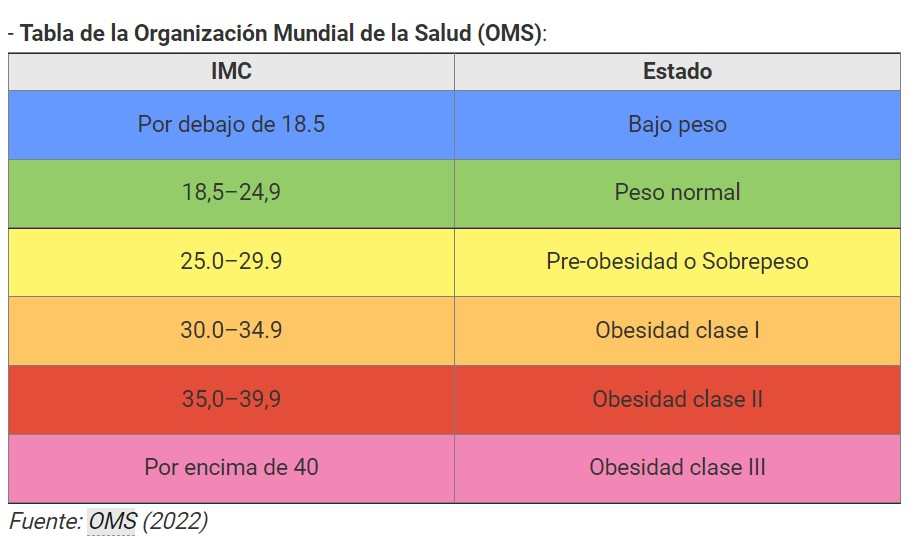

{width="100%"}

## **Título del trabajo**

  Estimación de la cantidad de estudiantes  de 2do a 6to ciclo en UTEC (Lima-Barranco) que presentan sobrepeso y su  nfluencia en su rendimiento académico. Mayo, 2022.

## **Introducción**

### **Relevancia**
La pandemia ha generado graves efectos en diferentes ámbitos de nuestra vida, sobre todo en la salud. A raíz de la cuarentena, las instituciones académicas optaron por una modalidad virtual en donde los alumnos se conectaban mediante dispositivos electrónicos desde sus casas asistiendo a sus clases online. Este nuevo estilo de vida generó sedentarismo y una mala alimentación causando una enfermedad compleja que en los últimos años ha incrementado, nos referimos a la obesidad. Esta no solo indica un  número en la balanza, sino que causa problemas respiratorios, diabetes, sueño, entre otros que son perjudiciales para el desempeño académico. Es por ello, que creemos crucial conocer este tipo de información para determinar si la obesidad afecta el rendimiento académico en los estudiantes de UTEC y la cantidad de estudiantes que padecen de esta enfermedad compleja.

### **Planificación**

#### **Objetivos**

Según la problemática de nuestro tema a investigar hemos planteado los siguientes objetivos:

* Realizar un diagrama de cajas o boxplot para las variables *peso*, *estatura*, *promedio de notas* , *dieta* y *tiempo de estudio*.
* Calcular los descriptores numéricos como la media, mediana, varianza y coeficiente de variación de las variables *peso*, *estatura*, *promedio de notas*  y *tiempo de estudio*.
* Re-codificar las variable *promedio de notas* y *dieta* para convertir a una variable discreta.
* Realizar boxplot indexados de la variable *promedio de notas* y *dieta*
*  Realizar las tablas de contingencia de la variable *promedio de notas* y *dieta*
* Determinar el IMC según el peso de los estudiantes del segundo al sexto ciclo de UTEC. Mayo, 2022.
* Realizar las tablas de contingencia de la variable *promedio de notas* y *IMC*

* Identificar a los alumnos por género con sobrepeso del segundo al sexto ciclo de UTEC. Mayo, 2022.

* Identificar el género predominante según las categorías del IMC de los estudiantes del segundo al sexto ciclo de UTEC. Mayo, 2022

* Determinar la correlación entre el promedio de los alumnos con sobrepeso del segundo al sexto ciclo de UTEC. Mayo, 2022.

* Comparar si las opiniones acerca de la obesidad de los alumnos es acorde a la realidad según los resultados obtenidos. Mayo, 2022.


#### **Factores**

***¿Cuáles son los principales factores que influyen del sobrepeso hacia el rendimiento académico de los estudiantes de 2do a 6to ciclo de UTEC?*** 

Los principales factores que influyen en el sobrepeso u obesidad son causados por los efectos del sedentarismo. Ejemplos claros de estos efectos son:  la falta de una vida saludable, los desarreglos en las comidas al día, ingesta desproporcionada de “fast food” que no solo daña la salud de nuestro organismo sino que también puede perjudicar la autoestima y el rendimiento académico de los estudiantes. Este último es reflejado en las notas obtenidas de los alumnos indicando una relación entre su rendimiento académico con los estragos de esta enfermedad compleja.Mayo, 2022.

#### **Factibilidad**

Se obtendrán los datos a través de la encuesta para poder obtener los datos personales, la encuesta se realizará a 220 estudiantes de UTEC DE 2do a 6to ciclo de manera aleatoria con un formato virtual (google form) que se enviará al correo u otras plataformas favoritas.

#### **Aportes**

* Zuniga Jara, S., Pizarro Díaz, R., Escudero López, M., & Honores Marín, G. (2018, abril). Rendimiento Académico Universitario y Conductas Alimentarias. SciELO - Scientific electronic library online. Recuperado 3 de mayo de 2022, de [https://www.scielo.cl/scielo.php?script=sci_arttext&pid=S0718-50062018000200057](https://www.scielo.cl/scielo.php?script=sci_arttext&pid=S0718-50062018000200057)  

* De Hernán Herrera, V. (2016). Efecto de la obesidad en el rendimiento académico,[grado de magíster de economía]. Universidad de Chile.
[https://repositorio.uchile.cl/bitstream/handle/2250/143992/Herrera%20Velásquez%20Hernán.pdf?sequence=1&isAllowed=y](https://repositorio.uchile.cl/bitstream/handle/2250/143992/Herrera%20Velásquez%20Hernán.pdf?sequence=1&isAllowed=y)

* De  Elizabeth Espinoza, H. (2017). Estado nutricional y rendimiento académico de los estudiantes de obstetricia de la Universidad Nacional de Huancavelica,[tesis para título profesional de obstetra]. Universidad Nacional de Huancavelica.
[https://repositorio.unh.edu.pe/bitstream/handle/UNH/1362/TP%20-%20UNH%20OBST.%200043.pdf?sequence=1&isAllowed=y](https://repositorio.unh.edu.pe/bitstream/handle/UNH/1362/TP%20-%20UNH%20OBST.%200043.pdf?sequence=1&isAllowed=y)


## **Datos**

### **Recolección de datos**

**Enlace a cuestionario**

[Cuestionario - El sobrepeso y su relación con el desempeño académico](https://docs.google.com/forms/d/e/1FAIpQLSfsO6kWtYdnx-hMpc7YcFtkBnKBTbJ5Q5wRuYpqbXy6MrKAMg/viewform)

En primer lugar se realizará una plantilla para la encuesta considerando la mejor forma de medición de las variables; es decir, buscar las respuestas posibles para poder plasmarla en la encuesta como alternativas y así facilitar la limpieza de datos.

En segundo lugar, terminada la plantilla se realizará una reevaluación  y será creada en el formato google encuestas agregando imágenes y una breve descripción, ya que debido a la coyuntura de la pandemia este método es la mejor vía de comunicación a distancia permitiéndonos evitar el trabajo presencial de encuestar persona por persona.

Luego, la encuesta será enviada por los correos electrónicos de los estudiantes de 2do a 6to ciclo, para ello se busca los cursos que generalmente corresponden a los alumnos de 2do a 6to ciclo habitualmente, y al acceder a la lista de  participantes que cursan estas materias se les puede incitar a completar y difundir la encuesta. Por otro lado, en las salas zoom de las mentorías de dichos cursos se difundirá el enlace como mensaje en el chat, también se publicará en las vías de difusión de las redes sociales (estados de WhatsApp, stories en Instagram).

#### **Evidencias de la difusión de encuestas**

{width="15%"} {width="15%"} {width="15%"} {width="15%"}


### **Población, muestra y muestreo**

Para la población de estudio tomamos en cuenta a los estudiantes de UTEC que estén cursando de segundo a sexto ciclo; en el cuál, un estudiante de UTEC  representa a la unidad muestral al cumplir con los requisitos mencionados previamente. El tamaño de la muestra para nuestro estudio es de 200 observaciones como mínimo, la representatividad se demuestra en base a la cantidad información que obtuvimos, realizada a través de una encuesta respondida voluntariamente por los estudiantes de segundo a sexto ciclo de UTEC, el cual nos indica que nuestro muestreo es probabilístico y usamos un muestreo aleatorio simple (MAS).

### **Variables**
```{r}
variables <- data.frame(variables = c('Edad','Genero','Peso','Estatura','Ciclo','Promedio', 'Tiempo de estudio', 'Desayunos a la semana', 'Hora de desayuno', 'Almuerzos a la semana', 'Hora de almuerzo', 'Cantidad de veces que cena a la semana','Hora de cena', 'Comida Rápida', 'Vegano','Sobrepeso','Carrera que estudia','Cantidad de cursos','Cambio horas', 'Dolores','Hábitos alimenticios', 'Deporte', 'Dieta'),
tipo = c('Cuantitativa (Discreta)','Cualitativa (Nominal)','Cuantitativa (Continua)','Cuantitativa (Continua)','Cuantitativa (Ordinal)','Cuantitativa (Continua)','Cuantitativa (Continua)','Cuantitativa (Discreta)','Cualitativa (Nominal)','Cuantitativa (Discreta)','Cualitativa (Nominal)','Cuantitativa (Discreta)','Cualitativa (Nominal)','Cualitativa (Nominal)','Cualitativa (Nominal)','Cualitativa (Nominal)','Cualitativa (Nominal)','Cuantitativa (Discreta)','Cuantitativa (Continua)','Cuantitativa (Continua)','Cuantitativa (Continua)','Cuantitativa (discreta)','Cuantitativa Discreta'),
Restricciones=c('tiene que ser un entero no negativo','solo puede escoger una opción de las dos disponibles','tiene que ser un entero no negativo mayor a 40','tiene que ser un entero no negativo mayor 140 cm','tiene que ser un entero no negativo mayor que 1 y menor que 7','tiene que ser un entero no negativo menor que 20','tiene que ser un entero no negativo','tiene que ser un entero no negativo menor o igual que 7','tiene que ser un rango de tiempo menor a las 11:00 am','tiene que ser un entero no negativo menor o igual que 7','tiene que ser un rango de tiempo menor a las 4:00 pm','tiene que ser un entero no negativo menor o igual que 7','tiene que ser un rango de tiempo menor a las 11:00 pm','solo puede escoger una opción de las dos disponibles','solo puede escoger una opción de las dos disponibles','solo puede escoger una opción de las dos disponibles','tiene que ser una carrera disponible en la universidad','tiene que ser un entero no negativo','tiene que ser un entero no negativo que represente una escala de menor a mayor','tiene que ser un entero no negativo que represente una escala de menor a mayor','tiene que ser un entero no negativo que represente una escala de menor a mayor','tiene que ser un entero no negativo que represente una escala de menor a mayor','tiene que ser un entero no negativo que represente una escala de menor a mayor'))
variables
```
### **Limpieza de base de datos**
Al llegar a las 215 observaciones, el primer paso a realizar fue la descarga de los datos en formato *.csv* desde Excel. Luego, creamos un nuevo proyecto donde realizaremos el trabajo con los archivos correspondientes; de esta manera, podremos colocar el archivo descargado en la misma carpeta para utilizar de manera adecuada el RStudio.

Antes de realizar el análisis de datos, instalamos la librería “readr”, para poder leer el archivo “encuesta_p1.csv”, y así poder tener mejor organización de la información. Luego, usamos la función “str” que nos permite visualizar como el RStudio lee los tipos de variable para examinar si lo que nos retorna el R es correcto, y así poder empezar con la limpieza de datos. 

Para empezar con nuestra limpieza de datos, eliminamos las variables que no fueron factores determinantes en nuestro estudio y se crearon por defecto en la plataforma de la encuesta *Google Forms*. Estas son: correo electrónico y marca temporal.En un siguiente plano de la limpieza de datos, usamos la función “is.na()”, para saber si hay datos faltantes; del mismo modo, aplicamos la función “!complete.cases()” que nos indica si hay casos faltantes. En nuestro caso no tuvimos ni datos ni casos faltantes; asi que, procedimos con la limpieza, descargamos la librería “dplyr”, para poder usar funciones como “names()”, que nos retornaba como estaban escritas las variables. Observamos que los nombres de las variables eran muy largos, generando sobre carga de trabajo al momento de extraer información a partir de ellos;es por ello que, utilizamos la función “rename()” encargada de renombrar las variables a nombres más cortos con el fin de un eficiente manejo de la información.

Todo este procedimiento lo hicimos en “DD” que almacena los datos del archivo *.csv*. Luego, redirigimos la información a “DDL”, pero con la diferencia de las dos variables innecesarias de “DD”. A continuación, los valores de las distintas variables deben de ser limpiados, para esto usamos la función “unique()” que nos permite conocer todas las formas posibles de escritura de determinadas variables. Hicimos este procedimiento con todas las variables y observamos que para cada variable, los valores tenían una sola forma de escritura; sin embargo, al corroborar esto usamos otra función, la cual es “table()” en conjunto con las funciones “group_by()” y “summarise(n=n())”, que como resultado nos devuelve una tabla que contiene los valores de la variable escogida y la frecuencia que representan, corroborando que no hay un valor por forma de escritura repetido.

Finalmente, para verificar que no haya datos incoherentes usamos la función “filter()” donde indicamos que solo nos retornen los casos completos de los valores que cumplan con las condiciones apropiadas. Por ejemplo: la variable edad debe representar a estudiantes mayores o igual a 18 años; del mismo modo, las variables horas de estudio mayor a 0, ya que no puede existir un número negativo, estatura mayor igual a 140 cm y menor igual a 250 cm; por último, el peso mayor a igual de 40 kg.

##### ***Cargando librerías para la limpieza de datos***
```{r}
library(readr)
library(dplyr)
library(car)
library(ggplot2)
```

```{r}
DD<-read.csv("encuesta_p1.csv",header=T,sep=',')
```

##### ***Tipo de variables de RStudio***
```{r}
str(DD)
```

##### ***Limpieza de la base de datos***

```{r}
#datos faltantes?
sum(is.na(DD))
sum(!is.na(DD))
#casos completos?
sum(complete.cases(DD))
sum(!complete.cases(DD))
```
##### ***Usaremos la función rename***
```{r}
names(DD)
```

```{r}
DD<- rename(DD, tiempo= 'Marca.temporal',correo= 'Dirección.de.correo.electrónico',edad='Edad..aÃ.os.cumplidos.',genero= 'Genero',peso='Peso..Kg...usar.decimales...Ej..76.42..solo.cifra.numerica.',estatura='Talla..cm..Ej..175..solo.cifra.numÃ.rica.',polo='Talla.de.polo',carrera='Carrera.que.estudia',ciclo='NroÂ..de.Ciclo',cursos='Cantidad..de.cursos.que.lleva.actualmente',promedio='Ingrese.su.promedio.ponderado.exacto.de.la.carrera..actual..Ej..15.28.',t_estudio='Cantidad.de.tiempo.que.estudia.en.la.semana.fuera.de.la.Universidad..En.horas....Ej..3.5',desayuno='Â.Con.que.frecuencia.desayuna..a.la.semana...Solo.respuesta.numÃ.rica.del.1.al.7.',desayuno_intervalo='Â.En.que.rango.de.horas.suele.desayunar...Ej..8.00...8.30..am.',almuerzo='Â.Con.que.frecuencia.almuerza..a.la.semana...Solo.respuesta.numÃ.rica.del.1.al.7.',almuerzo_intervalo='Â.En.que.rango.de.horas.suele.almorzar...Ej..13.30.14.00.pm..',cena='Â.Con.que.frecuencia.cena..a.la.semana...Solo.respuesta.numÃ.rica.del.1.al.7.',cena_intervalo='Â.En.que.rango.de.horas.suele.cenar...Ej..19.30...20.00.pm.',cambio_rango='Â.quÃ..tan.seguido.cambias.tu.rango.de.horas.de.almuerzo..desayuno.y.o.cena.a.la.semana.',dolores='Â.QuÃ..tan.seguido.sufres.de.dolores.en.el.estómago..molestias..gastritis.o.dolor.de.cabeza.',habitos_alimenticios='Â.Del.1.al.5..QuÃ..tanto.crees.que.influyen.tus.hÃ.bitos.alimenticios.en.tus.calificaciones.',comida_rapida='Â.Suele.comer.comida.rapida.',deporte='Â.Del.1.al.5.que.tan.seguido.practicas.algún.deporte.o.haces.ejercicios.',vegano='Â.Es.vegano.',sobrepeso='Â.Tienes.Sobrepeso.',dieta='Â.Del.1.al.5.quÃ..tan.saludable.crees.que.es.tu.dieta.')
names(DD)
```
##### ***Limpieza de datos***
```{r}
(DDL<-DD[,3:26])# DE ESTA MANERA DESCARTAMOS LAS VARIABLES DE MARCA TEMPORAL Y CORREO QUE FUERON AGREGADAS POR EL DOCUMENTO DE FORMS POR DEFECTO
```
##### ***Verificar variables***
```{r}
unique(DDL$edad)# Permite conocer todas las formas en las que se escribio la variable edad
unique(DDL$genero)
unique(DDL$peso)
unique(DDL$estatura)
unique(DDL$polo)
unique(DDL$carrera)
unique(DDL$ciclo)
unique(DDL$cursos)
unique(DDL$promedio)
unique(DDL$t_estudio)
unique(DDL$desayuno)
unique(DDL$desayuno_intervalo)
unique(DDL$almuerzo)
unique(DDL$almuerzo_intervalo)
unique(DDL$cena)
unique(DDL$cena_intervalo)
unique(DDL$cambio_rango)
unique(DDL$dolores)
unique(DDL$habitos_alimenticios)
unique(DDL$comida_rapida)
unique(DDL$deporte)
unique(DDL$vegano)
unique(DDL$sobrepeso)
unique(DDL$dieta)
# CON ESTO CORROBORAMOS QUE POR CADA VARIABLE SOLO HAY UNA FORMA DE ESCRITURA

```
##### ***Segunda verificación de variables***
```{r}
#edad
table(DDL$edad)
DDL %>% group_by(edad) %>% summarise(n=n())
#estatura
table(DDL$estatura)
DDL %>% group_by(estatura) %>% summarise(n=n())
table(DDL$genero)
DDL %>% group_by(genero) %>% summarise(n=n())
table(DDL$peso)
DDL %>% group_by(peso) %>% summarise(n=n())
table(DDL$polo)
DDL %>% group_by(polo) %>% summarise(n=n())
table(DDL$carrera)
DDL %>% group_by(carrera) %>% summarise(n=n())
table(DDL$ciclo)
DDL %>% group_by(ciclo) %>% summarise(n=n())
table(DDL$cursos)
DDL %>% group_by(cursos) %>% summarise(n=n())
table(DDL$promedio)
DDL %>% group_by(promedio) %>% summarise(n=n())
table(DDL$t_estudio)
DDL %>% group_by(t_estudio) %>% summarise(n=n())
table(DDL$desayuno)
DDL %>% group_by(desayuno) %>% summarise(n=n())
table(DDL$desayuno_intervalo)
DDL %>% group_by(desayuno_intervalo) %>% summarise(n=n())
table(DDL$almuerzo)
DDL %>% group_by(almuerzo) %>% summarise(n=n())
table(DDL$almuerzo_intervalo)
DDL %>% group_by(almuerzo_intervalo) %>% summarise(n=n())
table(DDL$cena)
DDL %>% group_by(cena) %>% summarise(n=n())
table(DDL$cambio_rango)
DDL %>% group_by(cambio_rango) %>% summarise(n=n())
table(DDL$habitos_alimenticios)
DDL %>% group_by(habitos_alimenticios) %>% summarise(n=n())
table(DDL$vegano)
DDL %>% group_by(vegano) %>% summarise(n=n())
table(DDL$sobrepeso)
DDL %>% group_by(sobrepeso) %>% summarise(n=n())
#CON ESTO COMPROBAMOS QUE PARA CADA VALOR DE UNA VARIABLE NO HAY UNA FORMA DE ESCRITURA DISTINTA
```

##### ***Convirtiendo la estatura de cm a metros***
```{r}
DDL$estatura<-(DDL$estatura)/100
```

##### ***Eliminando dato atípico en promedio***
```{r}
DDL <-filter(DDL,edad>=18 & peso>=40 & estatura>=1.40 & estatura<=2.50 & t_estudio>=0 & promedio>0)
```


## **Análisis descriptivo**

Cada variable relevante debe tener una descripción con descriptores numéricos o gráficos aprendidos en clase. La idea es describir la variable de manera relevante, ofreciendo detalles que permitan entender su estructura y los **patrones** que puedan tener. Es fundamental recordar que las variables podrían podrían obtener diferentes descriptores. En el caso de utilizar descriptores gráficos, se debe prestar especial atención a todos los detalles, desde la relevancia de la gráfica para el tipo de variable hasta selección de escala, ejes, unidades, leyenda, título descriptivo y manejo apropiado del color. El resultado final debe ser una gráfica descriptiva que transmita efectivamente la información y patrones relevantes observables en la muestra de la variable. Presentar las figuras de mérito (descriptores apropiados para cada variable o combinación de variables) que describen de la mejor manera posible los datos obtenidos.


#### **Número de datos completos y casos completos**

Verificamos si nuestro base de datos DDL tiene datos faltantes y casos faltantes.Luego de realizar el comando *sum(is.na())* y *sum(!complete.cases())* tenemos 0 datos faltantes y 0 casos completos.

```{r}
sum(is.na(DDL))
sum(!complete.cases(DDL))
```
#### **Descriptores númericos**

**Variable: PESO(Kg)**

Realizamos una caja de boxplot para la variable peso. Se observa que se tiene un dato atípico, entonces obtener la media o promedio para este variable no será un descriptor de posición adecuado. 

```{r}
boxplot(DDL$peso,data = DDL,ylab="peso(Kg)",col=c("pink"),main="diagrama de cajas de Peso(Kg)")
```

Utilizando el comando *median()* se obtiene la mediana 65kg, esto quiere decir que al menos la mitad de los encuestados tienen  peso mayores o iguales a 65 kg.

```{r}
median(DDL$peso)
```
El coeficiente de variación(cv) es una medida de dispersión que se expresa en porcentaje, y se obtiene a partir de la desviación estándar y promedio. Para nuestra variable peso el cv es de 17.51%, esto nos indica que nuestros datos son heterogéneos.
```{r}
# Varianza
var(DDL$peso)
# Desviación estándar
sd(DDL$peso)
# Coeficiente de variación
(sd(DDL$peso)/mean(DDL$peso))*100

```
```{r}
summary(DDL$peso)
```
**Variable: ESTATURA(m)**


Realizamos una caja de boxplot para la variable Estatura. Se observa que no hay datos atípicos, entonces obtener la media y media es adecuado. 

```{r}
boxplot(DDL$estatura,ylab="estatura(m)",main="Diagrama de cajas de Estatura")
```

Utilizamos el comando *summary* para obtener media, mediana, valor mínimo, valor máximo

```{r}
summary(DDL$estatura)
```
Se observa que la media y la mediana son casi iguales. Entonces a partir de la mediana podemos decir que al menos la mitad de los encuestados tienen una estatura mayor o igual a 1.69 metros.

El coeficiente de variación es de 5.17%, esto quiere decir que los datos son homogéneos
```{r}
# Varianza
var(DDL$estatura)
# Desviación estándar
sd(DDL$estatura)
# Coeficiente de variación
(sd(DDL$estatura)/mean(DDL$estatura))*100
```

**Variable: PROMEDIO DE NOTAS**

El diagrama de cajas nos muestra que tenemos 3 datos atípicos, entonces para esta variable la mediana es el descriptor mas adecuado antes que la media.

```{r}
boxplot(DDL$promedio,ylab="notas",main = "Diagrama de cajas variable Promedio")

```

Con el comando *summary* se obtiene el valor minimo, valor máximo, mediana,etc. Pra nuestra variable promedio de notas la mediana es de 14.78, esto quiere decir que al menos la mitad de los encuestados tienen nota mayor igual a 14.78.
```{r}
summary(DDL$promedio)
``` 
El coeficiente de variación (CV) es de 11.65%, esto quiere decir que los datos para la variable promedio tiene una distribución homogénea
```{r}
# Varianza
var(DDL$promedio)
# Desviación estándar
sd(DDL$promedio)
# Coeficiente de variación
(sd(DDL$promedio)/mean(DDL$promedio))*100
```

***Histograma del Promedio de notas***

```{r}
#coeficiente de asimetria
(3*(mean(DDL$promedio)-median(DDL$promedio)))/sd(DDL$promedio)

#histograma
hist(DDL$promedio,ylab = "frecuencia",xlab="notas",adj=0.5,main = "histograma del promedio de notas ",col = "orange")

```
El histograma tiene una distribución simétrica, esto se puede confirmar calculando el coeficiente de asimetria que resulta 0.05 que esta dentro del rango de [-0.05,0.05] para considerarse simétrica.

***Recodificando la variable promedio***

La variable promedio tiene un valor mínimo de nota 9 y un valor máximo de nota 19.55.
Crearemos una nueva variable promedio2 que obtendrá de la recodificación de la variable promedio de la siguiente manera: [9;10.45]-> desaprobado, [10.5;12.99]-> aprobado prom bajo, [13;15.99]->aprobado prom normal y [16;20]->aprobado prom alto

```{r}
library(car)
DDL$promedio2 <-car::recode(DDL$promedio,"9:10.45='desaprobado';10.5:12.99='promedio bajo';13:15.99='promedio normal';16:20='promedio alto'")
```


**Variable: Tiempo de estudio(horas)**


Se observa a partir del diagrama de cajas se tiene 12 datos atípicos, para este variable lo mas adecuado es utilizar la mediana antes que la media.
```{r}
boxplot(DDL$t_estudio,ylab="tiempo de estudio en horas", main="Diagrama de cajas variable tiempo de estudio")
```
Luego de aplicar nuestro comando *summary* se observa la mediana y media distan muchísimo, esto debido a la cantidad de datos atípicos. Entonces a partir de la mediana podemos decir que al menos la mitad de los encuestados estudian como máximo 6 horas.

```{r}
summary(DDL$t_estudio)
```
```{r}
hist(DDL$t_estudio,main="histograma tiempo de estudio",ylab="Cantidad de alumnos",xlab="Tiempo de estudio (horas)")

```


Se observa que el coeficiente de variación es 95.64%, los datos distribuidos son muy heterogéneos debido ,esa alto porcentaje se debe a lacantidad de datos atípicos.Ademas en el histograma se puede observar que esta sesgada a la  derecha.
```{r}
# Varianza
var(DDL$t_estudio)
# Desviación estándar
sd(DDL$t_estudio)
# Coeficiente de variación
(sd(DDL$t_estudio)/mean(DDL$t_estudio))*100
```

**Variable: dieta**
```{r}
library(car)
DDL$dieta2 <-car::recode(DDL$dieta,"1:2='mala dieta';3:3.9='dieta regular';4:5 ='buena dieta'")
```

```{r}
boxplot(DDL$promedio~DDL$dieta2,ylab = "promedio de notas",xlab="tipo de dieta",main="boxplot notas-dieta",col=c("white","yellow","orange"))
```
Se observa en el diagrama de cajas o boxplot el grupo de encuestados que tiene una buena dieta tienen una mayor mediana en el promedio de notas y el grupo que tiene una mala dieta tiene una media en el promedio de notas mas baja.


```{r}
library(gmodels)
CrossTable(DDL$dieta2,DDL$promedio2, prop.r=F,prop.c=F, prop.t=F, prop.chisq=F,dnn=c("TIPO DE DIETA","PROMEDIO DE NOTAS"),format = "SAS")

```
```{r}

dieta <-c(rep("buena dieta",4),rep("dieta regular",4),rep("mala dieta",4))
notas<-rep(c("desaprobado[0-10.4]","promedio alto [16-20]","promedio bajo[10.5-12.9]","promedio normal[13-15.9]"),3)
f1<-c(0,26,1,46,2,25,11,70,0,7,6,17)
d<-data.frame(dieta,notas,f1)
```
```{r}
ggplot(d,aes(x=dieta, y=f1, fill=notas))+ geom_bar(position = "stack", stat = "identity")+ theme_minimal() + labs(title = "Tipo de dieta--notas") + ylab("cantidad alumnos")+xlab("Tipo de dieta")
```

```{r}
library(ggplot2)
ggplot(d,aes(x=dieta, y=f1, fill=notas))+ geom_bar(position = "fill", stat = "identity")+ theme_minimal() + labs(title = "Tipo de dieta--notas") + ylab("cantidad alumnos")+xlab("Tipo de dieta") 
```
En el gráfico de barras se observa que la mayor cantidad de los alumnos encuestados tienen una dieta regular y la minoría tiene una mala dieta,ademas en los tres grupos la mayoría tiene un promedio normal seguido por los que tienen promedio alto y por ultimo los que tienen promedio bajo, pero las proporciones en cada grupo son diferentes, por ejemplo los alumnos que tienen una mala dieta y promedio bajo proporcionalmente es mayor que en los demas grupos.

### **Objetivo 1**

##### **Determinar el IMC según el peso de los estudiantes del segundo al sexto ciclo de UTEC. Mayo, 2022.**

El Indice de Masa Corporal es una razón aritmética entre la masa y la estatura de un apersona. Esta razon tiene la siguiente formula matemática $IMC=\frac{Peso(Kg)}{Estatura(m)^2}$

Obtenemos la variable IMC a partir  de las variables Peso y estatura 
```{r}
library(dplyr)
DDL$IMC <- round((DDL$peso)/(DDL$estatura**2),2)
select(DDL,estatura,peso,IMC)
```

**Variable: IMC**


```{r}
boxplot(DDL$IMC,ylab="IMC",main="Boxplot IMC")
```
```{r}
summary(DDL$IMC)
```
En el diagrama de cajas del IMC se observa que hay 3 datos atípicos, estos datos no afectan en el cálculo de la mediana y media como se observa luego de utilizar el comando *summary* la media(23.31) y la mediana(23.32) son muy parecidos.

```{r}
# Varianza
var(DDL$IMC)
# Desviación estándar
sd(DDL$IMC)
# Coeficiente de variación
(sd(DDL$IMC)/mean(DDL$IMC))*100
```
La coeficiente de variación(CV) homogénea muestra también que la variable IMC esta distribuido homogéneamente, ya que tiene un valor  13.18% menor a 15% para que sea homogénea.


***Histograma del IMC***
```{r}
max(DDL$IMC)
min(DDL$IMC)
hist(DDL$IMC,freq=F,ylab = "frecuencia",xlab="indice de masa corporal",adj=0.5,main = "histograma indice de masa corporal ",col = "orange")

```

Se observa que el histograma del IMC a simple vista tiene una distribución simétrica. El coeficiente de asimetria(CA) que tiene la siguiente relación $CA=\frac{3\cdot(media-mediana)}{desviacion Estandar}$ nos indica como se distribuyen los datos. Si CA se encuentra dentro del rango $[-0.05,0.05]$ se dice que tiene una distribución simétrica.
```{r}
(3*(mean(DDL$IMC)-median(DDL$IMC)))/sd(DDL$IMC)
```
Luego de calcular el coeficiente de asimetria(CA) para el el IMC es -0.0059, esto nos confirma lo que vimos a simple vista en el histograma del IMC que tiene distribución simétrica.


### **Objetivo 2**
##### **Identificar a los alumnos por género con sobrepeso y obesidad del segundo al sexto ciclo de UTEC. Mayo, 2022.**

##### ***Re-codificando la variable IMC según la tabla de la OMS que se encuentra en la siguiente imagen***



```{r}
DDL$IMC2 <-car::recode(DDL$IMC,"0:18.49='peso bajo';18.5:24.99='peso normal';25:29.99='sobrepeso';30:40='obesidad'",levels = c('peso bajo','peso normal','sobrepeso','obesidad'))
```

```{r}
dato_sobrepeso<-filter(DDL,IMC2=="sobrepeso" | IMC2 =="obesidad")
table(dato_sobrepeso$genero,dato_sobrepeso$IMC2)
genero <-c(rep("Hombre",2),rep("Mujer",2))
peso<-rep(c("obesidad","sobrepeso"),2)
fr<-c(3,37,0,13)
dat<-data.frame(genero,peso,fr)
```
```{r}
library(ggplot2)
ggplot(dat,aes(x=genero, y=fr, fill=peso))+ geom_bar(position = "fill", stat = "identity")+ theme_minimal() + labs(title = "Cantidad de alumnos con sobrepeso y obesidad") + ylab("cantidad alumnos")+xlab("genero") # + geom_text(aes(label=fr))
```

### **Objetivo 3**
#### **Identificar el género predominante según las categorías del IMC de los estudiantes del segundo al sexto ciclo de UTEC. Mayo, 2022.**

##### ***Re-codificando la variable IMC***
```{r}
DDL$IMC2 <-car::recode(DDL$IMC,"0:18.49='peso bajo';18.5:24.99='peso normal';25:29.99='sobrepeso';30:40='obesidad'")
```

##### ***Tabla cruzada de contingencia de genero y IMC2***
```{r}
table(DDL$genero,DDL$IMC2)
```
##### ***Crearemos una dataframe a partir de la tabla anterior***
```{r}
genero <- c(rep("Hombre",4),rep("Mujer",4))
imc<-rep(c("obesidad","peso bajo","peso normal","sobrepeso"),2) 
frecuencia <- c(3,7,96,37,0,2,53,13)
dato1<- data.frame(genero,imc,frecuencia)
dato1
```

##### ***Realizando gráfica de barras a partir del dataframe dato1***

```{r}
library(ggplot2)
ggplot(dato1,aes(x=imc, y=frecuencia, fill=genero))+ geom_bar(position = "dodge", stat = "identity")+ theme_minimal() + labs(title = "Cantidad de alumnos por IMC") + ylab("cantidad alumnos")+xlab("Indice de Masa Corporal") + geom_text(aes(label=frecuencia))
```
##### **Realizando boxplot indexados de las variables promedio y IMC2***
```{r}
boxplot(DDL$promedio~DDL$IMC2,col=c("orange","white","gray","yellow"),ylab="promedio de notas",xlab="Indice de masa corporal",main="Promedio-IMC")
```
Se puede observar a partir del diagrama de cajas indexado que los alumnos que tienen obesidad,sobrepeso y peso bajo tienen una mediana de notas mas baja que los alumnos con peso normal

##### ***Tabla cruzada de contingencia de promedio2 y IMC2***

```{r}

library(gmodels)
CrossTable(DDL$promedio2,DDL$IMC2, prop.r=F,prop.c=F, prop.t=F, prop.chisq=F,dnn=c("NOTAS","IMC"),format = "SAS")

```

##### ***Crearemos una dataframe a partir de la tabla anterior***
```{r}
promedio <- c(rep("desaprobado[0-10.4]",4),rep("promedio alto [16-20]",4),rep(" promedio bajo[10.5-12.9] ",4),rep("promedio normal[13-15.9]",4))
imc<-rep(c("obesidad","peso bajo","peso normal","sobrepeso"),4) 
frecuencia <- c(1,0,0,1,1,3,41,13,0,1,12,5,1,5,96,31)
dato2<- data.frame(promedio,imc,frecuencia)
dato2
```
##### ***Realizando gráfica de barras a partir del dataframe dato1***
```{r}
library(ggplot2)
ggplot(dato2,aes(x=imc, y=frecuencia, fill=promedio))+ geom_bar(position = "dodge", stat = "identity")+ theme_minimal() + labs(title = "Cantidad de alumnos por IMC") + ylab("cantidad alumnos")+xlab("Indice de Masa Corporal") 
```

### **Cuarto objetivo**
##### **Determinar la correlación entre el promedio de los alumnos con IMC del segundo al sexto ciclo de UTEC. Mayo, 2022.**

***Calculamos las covarianza y la correlación***
```{r}
cov(DDL$IMC,DDL$promedio)
cor(DDL$IMC,DDL$promedio)
```

***La correlación entre el promedio de notas de los alumnos y el Indice de Masa Corporal es -0.026, esto nos dice que no habria una relacion entre estas variables, ademas el diagrama de dispersión nos confirma esta aseveración ya que no se puede observar que sigue un patrón definido la variable Notas con IMC ***

```{r}
plot(DDL$IMC,DDL$promedio,ylab="Nota promedio de cada alumno",xlab="Indice de masa corporal",main = "Diagrama de dispersion nota-Imc")
```


### **Quinto objetivo**
#### **Comparar si las opiniones acerca de la obesidad de los alumnos es acorde a la realidad según los resultados obtenidos. Mayo 2022.**

```{r}
library(dplyr)
dato_sobrepeso2<-filter(DDL,IMC2=="sobrepeso" | IMC2 =="obesidad")%>%select(genero,sobrepeso,IMC2)
dato_sobrepeso2
table(dato_sobrepeso2$sobrepeso,dato_sobrepeso2$IMC2)
respuesta<-c(rep("NO",2),rep("SI",2))
peso22<-rep(c("obesidad","sobrepeso"),2)
f <- c(0,12,3,38)
dta <- data.frame(respuesta,peso22,f)
```


```{r}
library(ggplot2)
ggplot(dta,aes(x=peso22, y=f, fill=respuesta))+ geom_bar(position = "dodge", stat = "identity")+ theme_minimal() + xlab("Resultados de IMC") + ylab("Número de alumnos") + geom_text(aes(label = f)) + labs(title = "Realidad vs. Respuestas de los alumnos")
```
En esta gráfica de barras se observa que 12 alumnos que tenían sobrepeso contestaron que no tenían sobrepeso.

## **Análisis Probabilístico**

A partir de las tablas de contingencia de ***promedio de notas*** en relación al  ***IMC*** y, el ***promedio de notas*** respecto al ***tipo de dieta*** desarrolladas en el análisis descriptivo planteamos una serie de eventos y utilizamos propiedades axiomáticas, que nos ayudará a determinar si el sobrepeso y el tipo de dieta influyen en el rendimiento académico.

### **Relación y Justificación de las variables**

- ***"Promedio de notas"-"IMC"***: 
La variable "IMC" es una variable derivada según un cálculo utilizando las variables peso y estatura. Esta al ser un variable cuantitativa se recategorizó según una tabla de la OMS en las categorías de:"peso bajo", "peso normal", "sobrepeso" y "obesidad".Con respecto a la variable "Promedio de notas" también fue recategorizado según las notas obtenidas de la siguiente manera: "desaprobado" de 0 a 10.4, "aprobado promedio bajo" de 10.5 a 12.99, "aprobado promedio normal" de 13 a 15.99 y "aprobado promedio alto" de 16 a 20.

- La variable IMC representa al "Indicador de masa corporal"; el cual, mediante un estudio científico ha sido categorizado en una tabla determinada. Al conocer la condición de la persona encuestada podremos saber si esta se encuentra en sobrepeso o no. Al relacionarlo con la variable "Promedio de notas" nos daremos cuenta si esta influye en un incremento o una disminución en el rendimiento académico.

- ***"Promedio de notas"-"Tipo de dieta"***: 
Del mismo modo que en la relación de variables anterior, la variable "Promedio de Notas" tendrá el mismo comportamiento. Para el siguiente par de relación de variables, la variable "Tipo de Dieta" está categorizada de la siguiente manera: "buena dieta", "dieta regular" y "mala dieta".

- Este par fue elegido ya que, al tener un menú tan variado de alimentos en nuestro país es importante saber si el estilo de vida resulta influyente al desenvolverse en los estudios. Gracias a esta par de variables, sabremos si la mala alimentación altera de manera perjudicial el rendimiento académico según la variable de "Promedio de Notas" en los estudiantes de UTEC.

### **Probabilidades Axiomáticas**

Según el par de variables escogidas construimos las siguientes tablas de contingencia:

#### **Tabla de contingencia "IMC" - "Promedio de Notas"**

```{r}
library(gmodels)
CrossTable(DDL$promedio2,DDL$IMC2, prop.r=F,prop.c=F, prop.t=F, prop.chisq=F,dnn=c("NOTAS","IMC"),format = "SAS")
```

*A partir de la tabla de contingencia anterior, se obtuvo una población de 211 estudiantes. Si escogemos al azar un estudiante de este grupo calculamos los siguientes eventos planteados:*

**1)¿Cuál es la probabilidad de que un estudiante tenga promedio normal?**

evento A={Estudiante tenga promedio normal}

*n(A)* = 133

*ntotal* = 211 (total de estudiantes)

**P(A) = n(A)/total estudiantes** = 133/211

*P(A)* = 0.630331
     
**2)¿Cuál es la probabilidad de que un estudiante tengo sobrepeso?**

evento A = {Estudiante tenga sobrepeso}

*n(A)* = 50

*ntotal* = 211 (total de estudiantes)

**P(A)=n(A)/ntotal** = 50/211

*P(A)* = 0.23696
    
    
**3)¿Cuál es la probabilidad de que un estudiante tenga un promedio alto y a la vez peso normal?**

evento A={Estudiante tenga promedio alto}

evento B={estudiante tenga peso normal}

**P(A∩B)=n(A∩B)/ntotal**

***Según tabla de datos***

n(A∩B)= 41

ntotal= 211 (total de estudiantes)

*P(A∩B)* = 41/211

*P(A∩B)* = 0.194312
  
**4)¿Cuál es la probabilidad de que un estudiante tenga un promedio bajo, si se sabe que tiene sobrepeso?**

evento A={Estudiante tenga promedio bajo}

evento B={Estudiante tenga sobrepeso}

**P(A/B)=P(A∩B)/P(B)**

***Según tabla de datos***

*numero_total* = 211 (total de estudiantes)

**n(A∩B)** = 5

***Según ejercicio 2***

*P(B)*= 0.23696

*Hallando probabilidad*

*P(A/B)* = (5/211)/0.23696= 0.023696/0.23696

*P(A/B)* = 0.1

##### ***Resultados***

Si bien es cierto, 6 de cada 10 alumnos de UTEC tiene un promedio normal (13 a 15.99) y existe una población menor 

Luego de obtener los resultados de las probabilidades, concluimos que 6 de cada 10 alumnos en Utec tienen un promedio normal (13 a 16). Casi un 24% de la población encuestada tiene sobrepeso por los alimentos o malos hábitos que estos practican. Según los cálculos obtenidos, el sobrepeso no influye de una mala forma en el rendimiento académico.

#### **Tabla de contingencia "Promedio de Notas" - "Tipo de Dieta"**

```{r}
library(gmodels)
CrossTable(DDL$dieta2,DDL$promedio2, prop.r=F,prop.c=F, prop.t=F, prop.chisq=F,dnn=c("TIPO DE DIETA","PROMEDIO DE NOTAS"),format = "SAS")
```

**1)¿Cuál es la probabilidad que un estudiante tenga buena dieta?**

evento A = {Estudiante con buena dieta}

*P(A)* = *n(A)*/ntotal

***Según tabla de datos***

*n(A)* = 73
ntotal=211 (total de estudiantes)

*P(A)*=73/211

*P(A)*=0.34597

**2)¿Cuál es la probabilidad que un estudiante tenga una mala dieta y a la vez tenga un promedio alto?**

evento A = {Estudiante con mala dieta}

evento B = {Estudiante con promedio alto}

*P(A∩B)* = *n(A∩B)*/ntotal

*Según tabla de datos*

*n(A∩B)* = 7

*ntotal* = 211 (total de estudiantes)

*P(A∩B)* = 7/211

*P(A∩B)* = 0.033175
      
**3)¿Cuál es la probabilidad que un estudiante tenga promedio bajo, si se sabe que tiene una buena dieta?**

evento A={Estudiante con promedio bajo}

evento B={Estudiante con buena dieta}

**P(A/B)=P(A∩B)/P(B)**

*Según tabla de datos*

*n(A∩B)* = 1 

ntotal = 211 (total de estudiantes)

***Según ejercicio 1***

*P(B)* = 0.34597

**P(A/B)=P(A∩B)/P(B)= (n(A∩B)/ntotal)/P(B)**

*P(A/B)* = (1/211)/0.34597 

*P(A/B)* = 0.013698


**4)¿Cuál es la probabilidad de que un estudiante tenga una promedio bajo, si se sabe que tiene una dieta mala?**

evento A = {estudiante que tenga un promedio bajo}

evento B = {estudiante que tiene dieta mala}

*P(A/B)=P(A∩B)/P(B)=n(A∩B)/n(B)*

***Según tabla de datos***

*n(A∩B)* = 6
*n(B)* = 18

*P(A∩B)* = 6/18=0.3333333

Luego de calcular las probabilidades de los eventos planteados se observa que la probabilidad que un estudiante que tenga nota bajo sabiendo que tiene una dieta mala es 0.3333333 y la probabilidad que un estudiante tenga nota bajo sabiendo que tiene un a dieta buena es 0.013698. Entonces si un alumno tiene una mala dieta es más probable que tenga una nota baja que un alumno que tiene una buena dieta.


### **Modelos de Distribución de Probabilidad**

#### ***Modelo de Distribución Normal***

```{r}
hist(DDL$IMC, freq=F)
lines(density(DDL$IMC),lwd=2,col="red")
summary(DDL$IMC)
```
La variable IMC, sigue un modelo NORMAL, porque la media y la moda son casi iguales; además, se observa que en la gráfica solo hay una moda.

X: indice de masa corporal(unidades)
X tiene N(23.31,σ^2=9.449),  σ=3.073


Obtenemos un muestreo aleatorio de 60 personas, sin repeticiones y mostramos la tabla de valores
```{r}
M1 <- DDL[ sample ( nrow (DDL), size = 60 ),]

summary(M1$IMC)
```
n=60
X̅: Indice de masa corporal promedio de una muestra de 60 personas(unidades)
X̅ tiene N(23.31,0.157)  ,DEMM= σ=0.3968
 *V(X)/n=0.157*

##### **Casos de Cálculo**

**1)Nos interesa saber que si al igual que el sobrepeso, también podría haber una semejante cantidad de estudiantes con bajo peso. De esta manera, se podrá determinar un cambio de hábitos.
Si se toma en cuenta a todos los encuestados.¿Cuál es la probabilidad de que tengamos un peso bajo; es decir, tener un IMC como máximo de 18.5 según la OMS?**
P(X<=18.5)
```{r}
#pnorm(X,E(X), sqrt(V(X)))
pnorm(18.5,23.31,3.073)
```
*La probabilidad de que un estudiante tenga peso bajo en nuestra encuesta es de 0.058*

**2)Del total de encuestados . ¿Cuál es la probabilidad de que tengamos obesidad o sobrepeso, es decir tener como mínimo un IMC de 25?**
P(X̅>=25)= 1-P(X̅<=25)
```{r}
1-pnorm(25,23.31,3.073)
```
*La probabilidad de que un estudiante tenga obesidad o sobrepeso en nuestra encuesta es de 0.291, por lo tanto es valido decir que la probabilidad de tener obesidad o sobrepeso es mayor que la probabilidad de tener bajo peso*

*Por lo tanto las recomendaciones de hábitos serian para reducir su IMC,como cambiar sus alimentos por una dieta saludable,evitando comidas chatarras, o comidas altas en carbohidratos que incrementan su peso*


3)Nos interesa saber si al sacar una muestra aleatoria de 60 personas, cuantas personas podria tener obesidad o sobrepeso, para conocer el grado de la situación.

Del total de encuestados se toma una poblacion aleatoria de 60 personas. ¿Cual es la probabilidad de que tengamos obesidad o sobrepeso, es decir tener como minimo un IMC de 25?
P(X̅>=25)= 1-P(X̅<=25)
```{r}
1-pnorm(25,23.31,0.3968)
```
*La probabilidad de que un estudiante de una muestra de 60 personas tenga obesidad o sobrepeso es de 0.0000102, como la probabilidad es mínima, consideramos que la situació no es muy grave ya que,son pocos los alumnos que se ven afectados*

4)Nos interesa saber cuantas personas en nuestra encuesta tienen sobrepeso u obesidad si nos dieran como dato que no tienen peso bajo, para poder saber en promedio la cantidad de estudiantes que sufre pueden sufir problemas debido a sus altos indices de IMC.

Del total de encuestados.¿Cual es la probabilidad de que una persona tenga sobrepeso o obesidad, si se sabe que no tiene peso bajo?, según la IMC.
P(X>=25/X>=18.5)= P(X>=25)/P(X>=18.5)= 1-P(X<=25)/1-P(X<=18.5)
```{r}
(1-pnorm(25,23.31,3.073))/(1-pnorm(18.5,23.31,3.073))
```
*La probabilidad de que tenga obesidad o sobrepeso, teniendo en cuenta que no tiene peso bajo es 0.309, entonces se puede deducir que los estudiantes con esa condición, que podrían sufrir problemas son relativamente pocos.*

5)Nos interesa saber el valor del IMC, que se encuentra al medio de los datos obtenidos en nuestra encuesta para conocer el rango.
En que rango del IMC se encuentra la mediana, si se sabe que está ubicada en el 50% de los datos
P50=P(X<=K)=0.5 ---->K=?

```{r}
qnorm(0.50,23.31,3.073)
```
*Según la IMC, el valor de la mediana que es 23.31 se encuentra en el rango de "peso normal", entonces hay valores del IMC, mayores y menores a 23.31*

#### ***Modelo de Distribución Binomial***

#Descripción
utilizamos el modelo binomial para saber cuantas personas en una muestra podrían presentar sobrepeso y asemejarlo a un caso real,así identificar la situación en la que nos encontramos y saber cuanta ayuda necesita las personas de la muestra.
X numero de estudiantes que tienen sobrepeso según su IMC(indice de masa corporal)
Rx={0,1,2,3,4,5,6,7,8,9,10}
X~B(n=10, p=0.2369668)
N= población de la encuesta = 211
n = cantidad de repeticiones con idénticas condiciones (muestra) = 10
#muestra 
```{r}
library(dplyr)
Muestra <- sample_n(DDL,size=10)
Muestra
```
Tabla de probabilidades

```{r}
ord1 <- table(DDL$IMC2)
tabla1 <- prop.table(ord1)
tabla1
# Probabilidad de éxito
p <- nrow(p_sbrp)/nrow(DDL) 
p
1-p
```
p = probabilidad de personas con sobrepeso (éxito) = 0.2369668
1-p = probabilidad de personas sin sobrepeso =  0.7630332

```{r}
# solo de muestra
Rx <- c(0,1,2,3,4,5,6,7,8,9,10)
X0 = round(dbinom(0,10,0.2369668),2)
X1 = round(dbinom(1,10,0.2369668),2)
X2 = round(dbinom(2,10,0.2369668),2)
X3 = round(dbinom(3,10,0.2369668),2)
X4 = round(dbinom(4,10,0.2369668),2)
X5 = round(dbinom(5,10,0.2369668),2)
X6 = round(dbinom(6,10,0.2369668),2)
X7 = round(dbinom(7,10,0.2369668),2)
X8 = round(dbinom(8,10,0.2369668),2)
X9 = round(dbinom(9,10,0.2369668),2)
X10 = round(dbinom(10,10,0.2369668),2)
Y <- c(X0,X1,X2,X3,X4,X5,X6,X7,X8,X9,X10)
Datos1 <- data.frame(Rx,Y)
Datos1
plot(dbinom(x=0:10,size=10,prob=0.2369668),lwd=4,type='h', xlab='x', ylab='Probabilidad', main = "Función de probabilidad binomial para personas con Sobrepeso")
```

6) Nos interesa saber la probabilidad de que en una muestra aleatoria de 10 personas 10 personas tengan obesidad, para conocer que tan probable es que todas las personas puedan tener un alto IMC.
P(X=10)
```{r}
dbinom(10,10,0.2369668)
```
La probabilidad de que 10 de 10 personas de nuestra muestra tengan sobrepeso  es de 5.583095e-07 por lo tanto, se deduce que es muy poco probable todos en la muestra tengan problemas por tener un alto IMC


7) Nos interesa saber la probabilidad de que en una muestra aleatoria de 10 personas mas de la mitad tengan obesidad, para conocer que tan probable es que todas la mayoría de personas puedan tener un alto IMC.
P(X>5)=1-P(X<=5)
```{r}
1- pbinom(5,10,0.2369668)
```
La probabilidad de que mas de la mitad de las 10 personas de nuestra muestra tengan sobrepeso  es de 0.0151201 por lo tanto, se deduce que es muy poco probable de que 9 tengan puedan tener problemas por tener un alto IMC.


8) Nos interesa saber la probabilidad de que en una persona tenga  sobrepeso y promedio bajo para saber si es probable que tenga dificultades en los cursos si ta,bien tiene sobrepeso y poder ver una relación.

***sobrepeso P(sobrepeso) de la población***
```{r}
tabla1 # tabla de probabilidades de las categorías del IMC2 del total

p1 <- nrow(p_sbrp) / nrow(DDL) # probabilidad de personas con sobrepeso del total
p1
```

***Notas de promedio bajo P(promedio notas bajo) de la población***
```{r}
tabla2 # tabla de probabilidades de las notas del total
p2 = nrow(prom14) / nrow(DDL) # probabilidad de personas con notas de 14
p2
```
***utilizando el diagrama del árbol**
```{r}
p_sbrp <-filter(DDL,IMC2 == 'sobrepeso')
p_sbrp
asbrp <- nrow(p_sbrp)/nrow(DDL)#promedio de personas con sobrepeso
prom14sbrp <-filter(p_sbrp,promedio2=='promedio bajo')
prom14sbrp
a <- nrow(prom14sbrp)/nrow(p_sbrp)#promedio de personas con promedio bajo  y con sobrepeso


p_norm <-filter(DDL,IMC2 == 'peso normal')
p_norm
bnorm<- nrow(p_norm)/nrow(DDL)#promedio de personas con peso normal
prom14norm <-filter(p_norm,promedio2=='promedio bajo')
prom14norm
b <-nrow(prom14norm)/nrow(p_norm)#promedio de personas con promedio bajo con peso normal


p_psbaj <-filter(DDL,IMC2 == 'peso bajo')
p_psbaj
cpsbaj<- nrow(p_psbaj)/nrow(DDL)#promedio de personas con peso bajo
prom14psbaj <-filter(p_psbaj,promedio2=='promedio bajo')
prom14psbaj
c <-nrow(prom14psbaj)/nrow(p_psbaj)#promedio de personas con promedio bajo y con peso bajo


p_obs <-filter(DDL,IMC2 == 'obesidad')
p_obs
dobs<- nrow(p_obs)/nrow(DDL)#promedio de personas con obesidad
prom14obs <-filter(p_obs,promedio2=='promedio bajo')
prom14obs

d <-nrow(prom14obs)/nrow(p_obs)#promedio de personas con nota bajo y con obesidad

tabla1

tablaprom1 <- c(dobs,cpsbaj,bnorm,asbrp)#personas
tablaprom1
tablaprom2 <- c(d,c,b,a)# promedio de nota baja
tablaprom2

P14 <- dobs*d + cpsbaj*c+bnorm*b+asbrp*a
P14

```


```{r}
# P(A/B) = P(A)* ( P(A∩B)/P(B) )
# P(14/sobrepeso) =P(14 del total) * P(sobrepeso del total ∩ 14 de sobrepeso)/ 14 del total 

P <-  P14*( (asbrp*a)/P14 )
P

```
La probabilidad de que las personas  tengan sobrepeso y promedio bajo es de  0.02369668 por lo tanto, se deduce que es muy poco probable de que si tienes sobrepeso puedas tener un promedio de notas bajo.y se puede comprobar en nuestra tabla de contingencia.
***Tabla de contingencia ***

```{r}
library(gmodels)

CrossTable(DDL$promedio2,DDL$IMC2,prop.r=F,prop.c=F,prop.chisq=F)

```
#### ***Modelo de distribución Geométrica***

Utilizamos el modelo geométrica porque nos permite predecir el primer caso de sobrepeso registrado para poder plantear un plan de atención a la primera persona registrada,y tener una idea de la situación en la que se encuentra los estudiantes.

X: cantidad de ensayos hasta encontrar el primer estudiante con sobrepeso

X tiene G(p=0.2369668)

p=probabilidad de que un estudiante tenga sobrepeso (éxito)=0.2369668

```{r}
# solo de muestra
Rx <- c(0,1,2,3,4,5,6,7,8,9,10)
X0 = round(dgeom(0,0.2369668),2)
X1 = round(dgeom(1,0.2369668),2)
X2 = round(dgeom(2,0.2369668),2)
X3 = round(dgeom(3,0.2369668),2)
X4 = round(dgeom(4,0.2369668),2)
X5 = round(dgeom(5,0.2369668),2)
X6 = round(dgeom(6,0.2369668),2)
X7 = round(dgeom(7,0.2369668),2)
X8 = round(dgeom(8,0.2369668),2)
X9 = round(dgeom(9,0.2369668),2)
X10 = round(dgeom(10,0.2369668),2)
Y <- c(X0,X1,X2,X3,X4,X5,X6,X7,X8,X9,X10)
Datos2 <- data.frame(Rx,Y)
Datos2
plot(dgeom(x=0:10,prob=0.2369668),lwd=4,type='h', xlab='x', ylab='Probabilidad', main =  "Función de probabilidad geométrica para personas con Sobrepeso")
```


9) Nos interesa saber la probabilidad de que en nuestra entrevista exactamente sea la segunda persona quien tenga sobrepeso registrado por primera vez, para asegurar que tenemos a la segunda persona con sobrepeso y poder enfocarnos en esa persona, aconsejarle e informarle su estado.

si se escoge al azar a personas de la entrevista ¿Cual es la probabilidad de que la segunda persona recolectada de la entrevista sea la primera encontrada que tenga sobrepeso ?

P(X=2)=dgeom(1,0.23696682)

```{r}
dgeom(1,0.23696682)
```

La probabilidad de que la segunda persona recolectada registre sobrepeso por primera vez es  baja, entonces no debemos esperar a que esa persona tenga sobrepeso por primera vez y debemos buscar mas probabilidades para saber cuando encontraríamos de manera mas segura a una persona con sobrepeso por primera vez


9) Nos interesa saber la probabilidad de que después de escoger a 5 personas puedan tener sobrepeso registrado por primera vez, así asegurar que las primeros 5 no tendrán registro sobrepeso por primera vez, entonces la persona que se encargara de la primera charla encomendada a la persona con sobrepeso sabrá si debe prepararse mas o menos aparir de la probabilidad

si se escoge al azar a personas de la entrevista ¿Cuál es la probabilidad de que a partir de la 5ta persona recolectada de la entrevista se encuentre el primer estudiante con sobrepeso tenga sobrepeso ?

P(X>5) = 1 - P(x<= 5) 
```{r}
1 - pgeom(4,0.23696682)
```
La probabilidad de que a partir de la 5ta persona se encuentre a la persona que registre sobrepeso por primera vez es baja 0.3389797, por lo tanto la persona no debe estar más preparada de lo adecuado.

10) si se escoge al azar a personas de la entrevista ¿Cual es la probabilidad de que a partir de la 1era persona (no incluye la primera) recolectada de la entrevista sea la primera encontrada que tenga sobrepeso ?
P(X>=2)=1-(X<=1)
```{r}
1 - pgeom(0,0.23696682)
```
Después de la comparación, deducimos que la persona debe estar más preparada desde el inicio, ya que es más probable que entre las primeras personas que escogíamos puedan tener  sobrepeso por primera vez en nuestro registro.

## **Bibliografías**

-Tabla de IMC 2022 de la OMS (mujeres y hombres adultos). (s. f.). ENTERAT.COM. https://www.enterat.com/salud/imc-indice-masa-corporal.php

-Introducción a la probabilidad y estadística (R. M. Jorge Humberto, Trad.; 13.a ed.). (s. f.). Cengage Learning. https://www.fcfm.buap.mx/jzacarias/cursos/estad2/libros/book5e2.pdf


