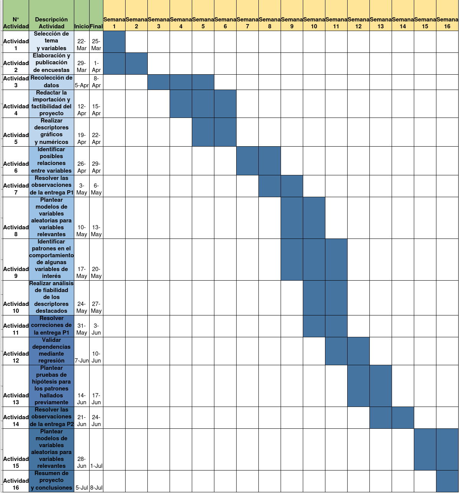
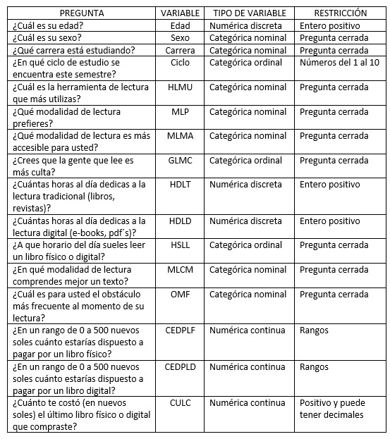

```{r,include=FALSE}
if(!require(readr)) {install.packages("readr")}
if(!require(dplyr)) {install.packages("dplyr")}
if(!require(tidyr)) {install.packages("tidyr")}
if(!require(modeest)) {install.packages("modeest")}
library(readr)
library(dplyr)
library(tidyr)
library(modeest)
library(stringr)
DF <- read.csv("DatosEncuestaLectura.csv")
```

```{r,include = FALSE}
DF <- DF[,c(2:17)]
DF <- DF[complete.cases(DF),]
```

```{r,include=FALSE}
names(DF)
if(!require(ggplot2)) {install.packages("ggplot2")}
if(!require(psych)) {install.packages("psych")}
if(!require(car)) {install.packages("car")}
library(ggplot2)
library(car)
library(psych)
```

```{r,include=FALSE}
r <- function(x){
  return(round(x,2))
}
```

```{r,include=FALSE}
rename(DF,
       Edad=Â.Cual.es.su.edad.,
       Sexo=Â.Cual.es.su.sexo.,
       Carrera=Que.carrera.esta.estudiando,
       Ciclo=En.que.ciclo.de.estudio.se.encuentra.este.semestre,
       HLMU=Cual.es.la.herramienta.de.lectura.que.mas.utilizas,
       MLP=Que.modalidad.de.lectura.prefieres,
       MLMA=Que.modalidad.de.lectura.es.mas.accesible.para.usted,
       GLMC=Crees.que.la.gente.que.lee.es.mas.culta,
       HDLT=`Cuantas.horas.al.dia.dedicas.a.la.lectura.tradicional..libros..revistas.`,
       HDLD=`Cuantas.horas.al.dia.dedicas.a.la.lectura.digital..eBooks..pdf.s.`,
       HSLL=A.que.horario.del.dia.sueles.leer.un.libro.fisico.o.digital,
       MLCM=En.que.modalidad.de.lectura.comprendes.mejor.un.texto,
       OMF=Cual.es.para.usted.el.obstaculo.mas.frecuente.al.momento.de.su.lectura,
       CEDPLF=En.un.rango.de.0.a.500.nuevos.soles.cuanto.estarias.dispuesto.a.pagar.por.un.libro.fisico,
       CEDPLD=En.un.rango.de.0.a.500.nuevos.soles.cuanto.estarias.dispuesto.a.pagar.por.un.libro.digital,
       CULC=Cuanto.te.costo..en.nuevos.soles..el.ultimo.libro.fisico.o.digital.que.compraste) -> DF
```

```{r,include=FALSE}
str(DF)
```

# **Introducción**
## Relevancia
Nuestro proyecto busca dar a conocer las diferencias entre la lectura digital y tradicional, para que los estudiantes de UTEC puedan acceder de una mejor manera a  la información y así facilitar su estudio durante toda su carrera universitaria. El avance de la tecnología ha cambiado nuestra forma de aprender durante estos dos últimos años de pandemia, nos hemos visto con la obligación de estar más conectado al mundo de la tecnología, y por ende utilizar más información extraída de la misma y ya no depender de la búsqueda información tradicional (libros, revistas, etc.), por lo que nuestro estudio se enfocara en comparar la  lectura tradicional con la virtual en diversos aspectos. Se trabajará en base a 200 estudiantes de la universidad UTEC mediante encuestas realizadas por Google Forms.     

**Objetivo general:**     
Entender e interpretar la percepción de los universitarios sobre la lectura digital y virtual de acuerdo a la estructura y patrones que proporcionan las variables elegidas.  

**Objetivos secundarios:**    
1. Conocer las diferencias entre la lectura digital y tradicional, asimismo determinar patrones que puedan ayudar a entender el comportamiento de los estudiantes acerca del tema.  
2. Contribuir con una retroalimentación acerca de cómo pueden mejorar el servicio de la biblioteca física y virtual a la universidad en base a el análisis y comparación de variables.  

## Planificación
Creamos nuestro diagrama de Gantt con las actividades que realizaremos para cada entrega en el transcurso del ciclo, considerando la fecha en rangos de acuerdo al grado de complejidad.  

  

# **Datos**  
## Proceso de recolección de datos  
Los datos se obtuvieron por medio de encuestas virtuales de Google Forms, ya que nos permite descargar toda la data recolectada directamente en formato '.csv', listo para poder trabajar  en Rstudio, la única condición que tuvimos al momento de la recolección fue que el individuo estudie en UTEC y nos centramos en personas que tengan desde 16 hasta 35 años de edad, ya que consideramos que las personas que han nacido en este rango de edad han crecido con igual influencia de lecturas tradicional como digital.

## Población, muestra y muestreo
La población definida para este estudio son todas los estudiantes de UTEC que estan cursando el semestre 2022-1, nuestra muestra son todos los estudiantes de la universidad que tengan entre 16 y 35 años, consideramos que nuestra muestra tiene una representatividad adecuada, ya que en la universidad existen personas en el rango de edad que escogimos, además la universidad pone a disposición del estudiante ambos tipos de lecturas pues en la biblioteca se puede acceder a lecturas tradicionales y en la biblioteca virtual a  lecturas digitales,evitando así algún tipo de sesgo de selección. Finalmente se concluye que nuestro tipo de muestreo es por juicio, ya que nuestra muestra en un sector de la población seleccionada por nosotros por las razones ya explicadas.

## Variables  
Las variables elegidas para nuestro proyecto constan de preguntas propuestas, estas son las siguientes:  
  

## Limpieza de base de datos    
Carrera:  
```{r,include=FALSE}
table(DF$Carrera)
```
```{r}
DF$Carrera[DF$Carrera == "Administración y Negocios digitales"] <- "Administracion y Negocios digitales"
DF$Carrera[DF$Carrera == "Bioingeniería"] <- "Bioingenieria"
DF$Carrera[DF$Carrera == "Ciencia de la Computación"] <- "Ciencia de la Computacion"
DF$Carrera[DF$Carrera == "Ingeniería de la Energía"] <- "Ingenieria de la Energia"
DF$Carrera[DF$Carrera == "Ingeniería Industrial"] <- "Ingenieria Industrial"
DF$Carrera[DF$Carrera == "Ingeniería Química"] <- "Ingenieria Quimica"
DF$Carrera[DF$Carrera == "Ingeniería Mecánica"] <- "Ingenieria Mecanica"
DF$Carrera[DF$Carrera == "Ingeniería Mecatrónica"] <- "Ingenieria Mecatronica"
DF$Carrera[DF$Carrera == "Ingeniería Civil"] <- "Ingenieria Civil"
DF$Carrera[DF$Carrera == "Ingeniería Electrónica"] <- "Ingenieria Electronica"
DF$Carrera[DF$Carrera == "Ingeniería Ambiental"] <- "Ingenieria Ambiental"
```
MLP:  
```{r,include=FALSE}
table(DF$MLP)
```
```{r}
DF$MLP[DF$MLP == "Tradicional o clásica"] <- "Tradicional o clasica"
```
MLMA:  
```{r,include=FALSE}
table(DF$MLMA)
```
```{r}
DF$MLMA[DF$MLMA == "Tradicional o clásica"] <- "Tradicional o clasica"
```
GLMC:  
```{r,include=FALSE}
table(DF$GLMC)
```
```{r}
DF$GLMC[DF$GLMC == "Sí, definitivamente"] <- "Si, definitivamente"
DF$GLMC[DF$GLMC == "Sí, es un poco más culta que los que no leen"] <- "Si, es un poco mas culta que los que no leen"
```
MLCM:  
```{r,include=FALSE}
table(DF$MLCM)
```
```{r}
DF$MLCM[DF$MLCM == "Tradicional o clásica"] <- "Tradicional o clasica"
```
HSLL:  
```{r,include=FALSE}
table(DF$HSLL)
```
```{r}
DF$HSLL[DF$HSLL == "Mañana"] <- "Mañana"
```
CULC:  
```{r,include=FALSE}
table(DF$CULC)
```
```{r}
DF$CULC[DF$CULC == "0.00"] <- NA
DF$CULC[DF$CULC == "0"] <- NA
DF$CULC[DF$CULC == "56 soles"] <- "56"
DF$CULC[DF$CULC == "Regalo"] <- NA
DF$CULC[DF$CULC == "Regalo "] <- NA
DF$CULC[DF$CULC == "No"] <- NA
DF$CULC[DF$CULC == "Nada"] <- NA
DF$CULC[DF$CULC == "Gratis"] <- NA
DF$CULC[DF$CULC == "85 soles"] <- "85"
DF$CULC[DF$CULC == "30 soles "] <- "30"
DF$CULC[DF$CULC == "20 so"] <- "20"
DF$CULC[DF$CULC == "25$"] <- "25"
```

```{r}
DF2 <- DF[complete.cases(DF),] #DF con casos completos
DF2$CEDPLF[DF2$CEDPLF == "0 - 100"] <- 50
DF2$CEDPLF[DF2$CEDPLF == "100 - 200"] <- 150
DF2$CEDPLF[DF2$CEDPLF == "200 - 300"] <- 250
DF2$CEDPLF[DF2$CEDPLF == "300 - 400"] <- 350
DF2$CEDPLF[DF2$CEDPLF == "400 - 500"] <- 450

DF2$CEDPLD[DF2$CEDPLD == "0 - 100"] <- 50
DF2$CEDPLD[DF2$CEDPLD == "100 - 200"] <- 150
DF2$CEDPLD[DF2$CEDPLD == "200 - 300"] <- 250
DF2$CEDPLD[DF2$CEDPLD == "300 - 400"] <- 350
DF2$CEDPLD[DF2$CEDPLD == "400 - 500"] <- 450

```

# **Análisis descriptivo**  
En esta sección abarcaremos el análisis y búsqueda de patrones entre nuestras variables del estudio.  

**Regla de Sturges**  
```{r}
n_int <- round(1 + log(x=207,base=2))
n_int
```  
## Descriptores numéricos y gráficos de la variables del estudio: 
**Edad**    
+ Variable numérica discreta.  
+ La edad mínima de los encuestados es de 16 y la máxima de 26 años.  
+ Al menos la mitad de los encuestados tienen como máximo 19 años.  
+ Al menos un cuarto de estudiantes tienen como máximo 18 años y tres cuartos como máximo, 20 años.  
+ La edad más común es de 18 años.  
+ Podemos notar que existen 3 datos atípicos que corresponden a edades superiores a 23 años.  
```{r echo=FALSE}
barplot(table(DF$Edad), main = "Edades de los alumnos encuestados", ylab = "Frecuencia", xlab = "Edad", col="lightgreen",ylim = c(0,80),space = 0,cex.names = 0.8)
boxplot(DF$Edad,main="Edades de los alumnos encuestados",col="lightblue",horizontal = T)
summary(DF$Edad)
```  
**Sexo**  
+ Variable Categórica nominal  
+ La mayorías de alumnos encuestados son hombres.  
+ Esta variable nos ayuda a identificar la representatividad de la muestra.  
```{r echo=FALSE}
barplot(table(DF$Sexo),ylim = c(0,120),col = c("lightblue","darkblue"),space=0,main = "Sexo de los alumnos")
```  

**¿Cuál es la herramienta de lectura que más usas?**       
+ Variable Categórica Nominal.  
+ La herramienta de lectura más utilizada es "Laptop o PC".  
```{r echo=FALSE}
barplot(table(DF$HLMU), col = "lightgreen", main = "Herramientas de lectura que más usan",cex.main = 0.8 ,space = 2.5, ylim = c(0,150),cex.names = 0.7, cex.axis = 0.5)
```  

**¿Qué modalidad de lectura prefieres?**     
+ Variable Categórica Nominal  
+ Los alumnos encuestados prefieren la lectura tradicional o clásica.  
```{r echo=FALSE}
data_MLP<-factor(DF$MLP,levels = c("Tradicional o clasica","Ambas","Digital o virtual"),ordered = T)
barplot(table(data_MLP),col = "lightgreen", main = "Modalidad de lectura preferida",cex.main = 0.8 ,space = 0, ylim = c(0,140),cex.names = 0.7, cex.axis = 0.7)
```  

**¿Crees que la gente que lee es más culta?**  
+ Variable Categórica ordinal  
+ La mayoría de alumnos encuestados opina que "la gente que lee si es un poco más culta que los que no leen".  
```{r echo=FALSE}
data_GLMC<-factor(DF$GLMC,levels = c("No creo que tenga que ver","Si, es un poco mas culta que los que no leen","Si, definitivamente"),ordered = T)
barplot(table(data_GLMC),col = "lightgreen", main = "Crees que la gente que lee es más culta",cex.names = 0.6,space= 0,ylim = c(0,100),cex.main = 0.8)
```  

**¿Cuántas horas al día dedicas a la lectura tradicional?**  
+ Variable Numérica discreta.   
+ Como mínimo los participantes de la encuesta dedican cero horas al día y como máximo 12 horas.   
+ En promedio le dedican a la lectura tradicional 1.68 horas y al menos la mitad de alumnos dedica 1 hora solamente.   
+ Un cuarto de los estudiantes le de dedican 1 hora a la lectura tradicional y al menos tres cuartos de estudiantes le dedican 2 horas.   
+ La mayoría de estudiantes dedican 1 hora a la lectura tradicional.  
```{r echo=FALSE}
boxplot(DF$HDLT, horizontal = T, col = "lightblue",main="Horas al día que dedica a la lectura tradicional")
summary(DF$HDLT)
```  

**¿Cuántas horas al día dedicas a la lectura digital?**    
+ Variable Numérica discreta.   
+ Como mínimo los participantes de la encuesta dedican cero horas al día y como máximo 15 horas a la lectura digital.   
+ En promedio le dedican a la lectura digital 2.51 horas y al menos la mitad 2 horas solamente.   
+ Un cuarto de los estudiantes le dedican 1 hora a la lectura digital y al menos tres cuartos de estudiantes le dedican 3 horas.     
+ La mayoría de estudiantes dedican 2 horas a la lectura digital.  
```{r echo=FALSE}
boxplot(DF$HDLD, horizontal = T, col = "lightblue",main="Horas al día que dedica a la lectura digital")
summary(DF$HDLD)
```  

**¿A qué horario del día sueles leer un libro físico o digital?**    
+ Variable Categórica Ordinal.        
+ La mayoría de alumnos suelen leer en la noche.   
```{r echo=FALSE}
data_HSLL<-factor(DF$HSLL,levels = c("Mañana","Tarde","Noche"),ordered = T)
barplot(table(data_HSLL),col = "lightgreen", main = "Horario que suelen leer en promedio",cex.main = 0.7 ,space = 0, ylim = c(0,140),cex.names = 0.8, cex.axis = 0.7)
```  

**¿En que modalidad de lectura comprendes mejor un texto?**     
+ Variable Categórica Nominal.    
+ Son más los encuestados que comprenden mejor en la lectura clásica.    
```{r echo=FALSE}
data_MLCM<-factor(DF$MLCM,levels = c("Tradicional o clasica","Ambas","Digital o virtual"),ordered = T)
barplot(table(data_MLCM),col = "lightgreen", main = "Modalidad de lectura comprende mejor un texto",cex.main = 0.8 ,space = 0, ylim = c(0,140),cex.names = 0.7, cex.axis = 0.7)
```  

**¿Cuál es para usted el obstáculo más frecuente al momento de su lectura?**    
+ Variable Categórica Nominal.   
+ Son más los estudiantes que se distraen por culpa de ruidos o sonidos.   
```{r echo=FALSE}
barplot(table(DF$OMF), col = rainbow(6),legend.text = rownames(table(DF$OMF)),args.legend = list(x = "topright",inset = c(0.25, -0.001)), main = "Obstáculo más frecuente al momento de la lectura",names.arg= FALSE,cex.main = 0.8 ,ylab = "Numero de alumnos",space = 0, ylim = c(0,150),cex.names = 0.7, cex.axis = 0.6)
```  

**¿En un rango de 0 a 500 nuevos soles cuánto estarías dispuesto a pagar por un libro físico?**    
+ Variable Numérica Continua.  
+ Son más los alumnos que están dispuestos a pagar entre 0-100 soles.   
```{r echo=FALSE}
barplot(table(DF$CEDPLF),space = 0, main = "Cuánto estarías dispuesto a pagar por un libro físico",ylim = c(0,140),cex.axis = 0.7,cex.names = 0.7,cex.main = 0.8,col = "lightgreen",xlab = "Costo en Nuevos Soles")
```  

**¿En un rango de 0 a 500 nuevos soles cuánto estarías dispuesto a pagar por un libro digital?**  
+ Variable Numérica Continua.  
+ Son más los alumnos que están dispuestos a pagar entre 0-100 soles.
```{r echo=FALSE}
barplot(table(DF$CEDPLD),space = 0, main = "Cuánto estarías dispuesto a pagar por un libro digital",ylim = c(0,200),cex.axis = 0.7,cex.names = 0.7,cex.main = 0.8,col = "lightgreen", xlab = "Costo en Nuevos Soles")
```  

**¿Cuánto te costó (en nuevos soles) el último libro físico o digital que compraste?**  
+ Variable númerica continua   
+ El precio del último libro más común entre los usuarios de la Universidad fue entre 0 y 50 nuevos soles.  
```{r echo=FALSE}
hist(as.numeric(DF2$CULC),breaks = n_int,col = "lightgreen", main = "Costo del último libro físico o digital que compró",ylab = "Frecuencia",xlab = "Costo en Nuevos Soles",ylim = c(0,120),cex.main = 0.8)
boxplot(as.numeric(DF2$CULC),horizontal = T, col = "lightblue", main = "Costo del último libro físico o digital que compró",cex.main = 0.8)
```  

## Relación entre dos variables:    
**Edad - Comprensión según modalidad de lectura**    
+ En la mayoría de edades la modalidad de lectura que más se comprende es la tradicional.      
+ En la mayoría de edades, la modalidad con menos comprensión es la digital.     
+ En esta gráfica observamos que a pesar de haber tenido 200 encuestados, se evidencia que la mayoría de encuestados pertenecen a las edades entre 18-20 años.   
```{r echo=FALSE}
barplot(table(DF$MLCM,DF$Edad),space = 0,main="Indicador de Comprensión Lectora de acuerdo a la Edad",xlab="Edad",ylab="Cantidad",col=c("darkgreen","green","lightgreen"), ylim=c(0,80))
legend(x="topright",title="Leyenda",legend=c("Ambos","Digital","Tradicional"),fill=c("darkgreen","green","lightgreen"))
boxplot(DF$Edad,main="Edad de los encuestados",col="lightblue",horizontal = T)
```  

**Modalidad de lectura más accesible - Modalidad de lectura preferida**      
+ las personas que tienen más acceso a la lectura digital, prefieren la lectura tradicional.    
+ las personas que tiene más acceso a la lectura tradicional, prefieren la lectura tradicional.    
+ Las personas con igual accesibilidad a ambas modalidades de lectura, prefieren ambas.    
```{r echo=FALSE}
mosaicplot(table(DF$MLMA,DF$MLP),main='Modalidad de lectura más accesible vs modalidad preferida',col=c("dark blue","light blue",'blue'),xlab = 'Accesibilidad',ylab = 'Preferido',las=1)
```  

**Sexo - Herramienta que más utilizan**      
+ La mayoría de personas que prefieren laptop o pc son hombres.      
+ La mayoría de personas que prefieren tablets o eReaders son mujeres.    
+ Se puede concluir del gráfico que las herramientas digitales tanto en hombre como mujeres son las más utilizadas. Esto se puede relacionar con las gráficas de la variables MLMA(Modalidad de lectura más accesible), ya que nos indican que la modalidad de lectura más accesible es la digital.    
+ Al haber más demanda de aparatos digital la universidad UTEC debería reforzar o priorizar las redes wi-fi, incluso ampliar el ancho de banda.  
```{r echo=FALSE}
mosaicplot(DF$HLMU~DF$Sexo,las=2,main="Herramienta que más utilizan",col= c("lightblue","darkblue"),ylab="Sexo",xlab="Herramientas")
```  

**Horas - Ciclo**    
+ Según el gráfico podemos determinar que la mayor cantidad de horas de lectura es del 5to ciclo.    
+ Asimismo encontramos algunos valores atípicos para estudiantes del 3er ciclo, esto representa algunas diferencia respecto al promedio de sus compañeros.  
+ Se determina que el ciclo que lee menos es el 9no, pero esto está sujeto a que hay minoría de alumnos encuestados en la muestra.      
```{r,echo=FALSE}
boxplot((DF$HDLT+DF$HDLD)~DF$Ciclo,cex.names = 0.7, cex.axis = 0.7,xlab="Ciclo",ylab = "Promedio de horas de lectura al día",main="Horas empleadas en la lectura por cada ciclo",col=palette("Set 2"),varwidth=T)
```  

## Modelos de Regresión:  

**1. Relación entre Horas de lectura tradicional y Horas de lectura digital**  
+ La gráfica de regresión nos muestra una relación lineal muy baja, lo que se comprueba con los valores de covarianza y correlación.  
```{r,echo=FALSE}
plot(DF2$HDLT, DF2$HDLD, pch = 19,cex.axis = 0.7, main = "Relación entre Horas de lectura tradicional y Horas de lectura digital", xlab="Hora lectura tradicional",ylab="Hora lectura digital")
abline(lm(DF2$HDLD ~ DF2$HDLT), col = "red", lwd = 2)
lines(lowess(DF2$HDLT, DF2$HDLD), col = "blue", lwd = 2)
```

Covarianza:  
```{r,echo=FALSE}
r(cov(DF2$HDLT, DF2$HDLD))
```

Correlación:    
```{r,echo=FALSE}
r(cor(DF2$HDLT, DF2$HDLD))
```


**2. Relación entre Costo que estaría dispuesto a pagar por un libro digital y Cantidad de horas de lectura digital**  
+ La gráfica de regresión nos muestra una relación lineal muy baja, lo que se comprueba con los valores de covarianza y correlación de 0.11 y 0.1 respectivamente.  
```{r,echo=FALSE}
data_CEDPLD<-factor(DF2$CEDPLD,levels = c("50","150","250","350","450"),ordered = T)

plot(as.numeric(data_CEDPLD), DF2$HDLD, pch = 19,cex.main =0.7 ,cex.axis = 0.7,main = "Relación entre Costo que estaría dispuesto a pagar por un libro digital vs. Cantidad de horas de lectura digital", xlab="Costo que estaría dispuesto a pagar por un libro digital",ylab="Hora lectura digital")
abline(lm(DF2$HDLD ~ as.numeric(data_CEDPLD)), col = "red", lwd = 2)
lines(lowess(as.numeric(data_CEDPLD), DF2$HDLD), col = "blue", lwd = 2)

```

Covarianza:  
```{r,echo=FALSE}
r(cov(as.numeric(data_CEDPLD), DF2$HDLD))
```

Correlación:    
```{r,echo=FALSE}
r(cor(as.numeric(data_CEDPLD), DF2$HDLD))
```

**3. Relación entre Costo que estaría dispuesto a pagar por un libro físico y Cantidad de horas de lectura tradicional**  
+ La gráfica de regresión nos muestra una relación lineal muy baja, lo que se comprueba con los valores de covarianza y correlación de 0.07 y 0.05 respectivamente.  
```{r,echo=FALSE}
data_CEDPLF<-factor(DF2$CEDPLF,levels = c("50","150","250","350","450"),ordered = T)

plot(as.numeric(data_CEDPLF), DF2$HDLT, pch = 19,cex.main =0.7 ,cex.axis = 0.7, main = "Relación entre Costo que estaría dispuesto a pagar por un libro físico y Horas de lectura tradicional", xlab="Costo que estaría dispuesto a pagar por un libro físico",ylab="Hora lectura tradicional")
abline(lm(DF2$HDLT ~ as.numeric(data_CEDPLF)), col = "red", lwd = 2)
lines(lowess(as.numeric(data_CEDPLF), DF2$HDLT), col = "blue", lwd = 2)

```

Covarianza:  
```{r,echo=FALSE}
r(cov(as.numeric(data_CEDPLF), DF2$HDLT))
```

Correlación:    
```{r,echo=FALSE}
r(cor(as.numeric(data_CEDPLF), DF2$HDLT))
```

# **Variables aleatorias**    
Luego de analizar mediante gráficos y descriptores numéricos nuestra  encuesta, procederemos a realizar modelos de distribución en variables discretas con  la muestra obtenida de 206 estudiantes, ya que ahora el equipo de investigación de estadística desea conocer  las probabilidades de la modalidad de lectura con mayor acceso, el horario  preferencia para la lectura, la herramienta más utilizada para la lectura, costo a pagar por un libro digital o  físico y la cantidad de horas empleadas en la lectura tradicional o digital en distintos modelos.

## Modelo Geométrico:   

**Problema:**    
De la variable de tipo categórica nominal, herramienta más utilizada de lectura (HLMU) de los estudiantes se concluye que 40 estudiantes usan celular, 127 laptop o PC, 27 libros o cuadernos y 12 tablet o eReaders.    
```{r,echo=FALSE}
table(DF$HLMU)
```

a)¿Cuál es la probabilidad de que el quinto estudiante encuestado, responda por primera vez que las herramientas de lectura que más utiliza son libros y cuadernos?   
$$k=4, p=0.1311$$    
Donde:  
k: Número de intentos hasta obtener el éxito por primera vez  
p: Probabilidad de éxito  
```{r}
r(dgeom(4,0.1311))
```  

**Respuesta:**    
La probabilidad de que el quinto estudiante encuestado responda por primera vez que las herramientas de lectura que más utiliza sean libros y cuadernos es 0.07 que indica un 7%.  

**Justificación:**  
+ Se utilizó la variable HLMU debido a que esta indica la cantidad de estudiantes que prefieren una determinada herramienta de lectura tales como celular, laptop o PC, libros o cuadernos y tablet o eReaders.  
+ Se utilizó el modelo geométrico debido a que obtenemos k número de fracasos hasta obtener el éxito por primera vez (4 estudiantes) y la probabilidad de éxito (p_éxito = 0.1311).  
 
**Análisis Probabilístico:**  
+ Hallaremos el esperado de la variable HLMU para saber que herramienta de lectura es la más utilizada.  
$$ Esperado=1/0.1311=7.63 $$  
+ De acuerdo al esperado, es más probable que el  séptimo u octavo encuestado, señale que prefiere usar Cuadernos y Libros.  
+ La mayoría de estudiantes encuestados prefieren la herramienta de lectura Laptop o PC de la encuesta.   

## Modelo Binomial Negativo:  

**Problema 1:**    
De  la variable de tipo categórica nominal, modalidad de lectura más accesible (MLMA) para los estudiantes encuestados,  donde se concluye que  la mayoría  tiene acceso solo a la lectura digital con un valor de 68.45%, un 12.14%  accede  solo a la lectura tradicional y un 19.42% tiene acceso a ambas.    
```{r,echo=FALSE}
a<-table(DF$MLMA)
a
round(prop.table(a)*100,2)
```

a)¿Qué tan probable es que por lo menos 150 estudiantes tengan mayor acceso únicamente a lectura digital? 

$$y=56, k =150, p(éxito)=0.684$$      
Donde:    
y: Número de fracasos  
k: Cantidad de éxitos  
p: Probabilidad de éxito  
```{r}
r(pnbinom(56,150,0.684))
```  
**Respuesta:**    
La probabilidad de que por lo menos 150 estudiantes tengan mayor acceso a la lectura digital es 0.1 lo que indica un 10%.  

**Justificación:**  
+ Se utilizó la variable MLP debido a que esta indica la cantidad de estudiantes que tienen acceso a  una determinada modalidad de lectura entre lectura tradicional, lectura digital o ambas.    
+ Se utilizó el modelo Binomial Negativo debido a que obtenemos k éxitos (150 estudiantes que prefieran únicamente la lectura digital) de x numero de ensayos (206 estudiantes) y la probabilidad de éxito (p_éxito = 0.684).   

**Análisis Probabilístico:**    
+ Hallaremos el esperado de la variable MLMA para saber que modalidad de lectura es la más accesible.  
$$ Esperado=150/0.684=219.3 $$  
+ Hasta encuestar a 219 personas es más probable que  150 de ellos tengan mayor acceso a la lectura digital o virtual.    
+ De los porcentajes según nuestra encuesta se concluye que la mayoría tiene mayor acceso a una lectura digital, mientras que una minoría  a la lectura tradicional.    

**Problema 2:**    
Elegimos las variables de tipo numérica continua, el costo en nuevos soles que estarían dispuestos a pagar los alumnos por un libro físico (CEDPLF) y digital (CEDPLD), respectivamente. Consideramos los siguientes datos:  
Para CEDPLF que 127 estudiantes están dispuestos a pagar de 0 a 100 soles, 58 de 100 a 200, 15 de 200 a 300, 2 de 300 a 400 y 4 de 400 a 500.  
```{r,echo=FALSE}
table(DF$CEDPLF)
```  
a)¿Cuál es la probabilidad de que un grupo de 4 estudiantes se encuentre a 2 estudiantes que estén dispuestos a pagar entre 100 a 200 soles por un libro físico?   
$$y=2, k=2, p=58/206=0.2816$$  

Donde:     
y: Número de fracasos hasta obtener k éxitos    
k: Número de éxitos en los n ensayos       
p: Probabilidad de éxito  

```{r}
r(dnbinom(2,2,0.2816))
```
**Respuesta:**   
La probabilidad que  en un grupo de  4 estudiantes, dos de ellos estén dispuestos a pagar entre 100 a 200 soles por un libro físico es  de 0.12 o sea  un 12%.  

**Justificación:**  
+ Se utilizó la variable CEDPLF debido a que esta indica la cantidad de estudiantes que están dispuestos a pagar en soles por un libro físico entre rangos de 0 a 100 soles, de 100 a 200, de 200 a 300, de 300 a 400 y de 400 a 500.  
+ Se utilizó el modelo Binomial Negativo debido a que obtenemos k número de éxitos de los n ensayos (2 estudiantes), y número de fracasos hasta obtener k éxitos (2 fracasos) y  la probabilidad de éxito (p_éxito = 0.2816).  

```{r,echo=FALSE}
table(DF$CEDPLD)
```   
b)¿Cuál es la probabilidad de que un grupo de 4 estudiantes se encuentre a 2 estudiantes que esten dispuestos a pagar entre 100 a 200 soles por un libro digital?       
$$y=2, k=2, p=0.0874$$     
Donde:  
y: número de fracasos hasta obtener k éxios   
k: Número de éxitos en los n ensayos        
p: Probabilidad de éxito       
```{r}
r(dnbinom(2,2,0.0874))
```
**Respuesta:**  
La probabilidad  de que de un grupo de 4 estudiantes se encuentre a 2 estudiantes  que estén dispuestos a pagar entre 100 a 200 soles por un libro digital es  de 0.02 o sea  2%.  

**Justificación:**  
+ Se utilizó la variable CEDPLD debido a que esta indica la cantidad de estudiantes que están dispuestos a pagar en soles por un libro digital entre rangos de 0 a 100 soles, de 100 a 200, de 200 a 300, de 300 a 400 y de 400 a 500.   
+ Se utilizó el modelo Binomial Negativo debido a que obtenemos k número de éxitos de los n ensayos (2 estudiantes), y número de fracasos hasta obtener k éxitos (2 fracasos) y  la probabilidad de éxito (p_éxito = 0.0874).   

**Análisis probabilístico:**  
+ Por lo tanto, se puede concluir que la mayor cantidad de estudiantes están dispuestos a pagar de 100 a 200 soles por un libro físico que por un libro digital.    

## Modelo Hipergeométrico:   

**Problema:**    
Para este problema tomamos a la variable de tipo categórica ordinal, horario de lectura para un libro físico o digital (HSLL) para los estudiantes encuestados  se concluye que 33 estudiantes leen en la mañana, 63 en la tarde y 110 en la noche.     
```{r,echo=FALSE}
table(DF$HSLL)
```
a)Supongamos que se toma a 30 de ellos para realizar un sorteo. ¿Cuál es la probabilidad que 10 estudiantes lean en la mañana?  
$$ M=33, N=206, xo=10, n=30 $$     
Donde:  
M: Cantidad total de éxitos en la población   
N: Población   
xo: Número de éxitos en la muestra   
n: Cantidad de la muestra    
```{r}
r(dhyper(10,33,206-33,30))
```  
**Respuesta:**  
La probabilidad  de que 10 estudiantes lean en la mañana es de 0.01 que es  el 1%.  

**Justificación:**  
+ Se utilizó la variable HSLL debido a que esta indica la cantidad de estudiantes que prefieren un determinado horario de lectura entre mañana, tarde o noche.      
+ Se utilizó el modelo Hipergeométrico debido a que obtenemos M cantidad total de éxitos (33 estudiantes), N la población (206 estudiantes), xo número de éxitos en la muestra (10 estudiantes) y n cantidad de la muestra (30 estudiantes).  

**Análisis Probabilístico:**  
+ Hallaremos el esperado de la variable HSLL para saber el horario de lectura preferido.  
$$ Esperado=30*(33/206)=4.81$$  
+ Es más probable que  5 estudiantes lean en la mañana  de una muestra de 30 estudiantes.  
+ De los porcentajes  se concluye que la mayoría prefiere leer en la noche según nuestra encuesta.  

## Modelo Poisson:  

**Problema:**    
Para este problema elegimos las variables de tipo numérica discreta, la cantidad de horas que se dedica  a una lectura digital (HDLD) y a una lectura tradicional(HDLT). Consideramos los siguientes datos:
El promedio de éxitos al leer más de 5 horas un libro digital es 3.8571  
Tabla de frecuencias absolutas de la cantidad de Horas de lectura digital   
```{r,echo=FALSE}
table(DF$HDLD)
```
a)¿Cuál es la probabilidad de que 2 estudiantes lleguen a leer más de 5 horas al día un libro digital? Sabiendo que el promedio de alumnos que leen más de 5 horas al día  un libro digital es 3.8571 y sigue una distribución Poisson.  

Hallando Landa(L):  
```{r,echo=FALSE}
r((9+10+2+3+1+1+1)/7)
```

$$x=2, L=3.8571$$
x: Número de éxitos  en la unidad de medida  
L: Promedio de éxitos en la unidad de medida  
```{r}
r(dpois(2,3.8571))
```
**Respuesta:**  
La probabilidad de que 2 alumnos lean más de 5 horas al día un libro digital es 0.16 o sea un 16%.  

**Justificación:**  
+ Se utilizó la variable HDLD debido a que esta indica la cantidad de horas  que los estudiantes emplean al leer un libro digital y va  desde las 0 horas hasta las 15 horas.  
+ Se utilizó el modelo Poisson debido a que obtenemos L promedio de alumnos que leen más de 5 horas(3.8571) y x  número de éxitos en la  unidad de medida (2 estudiantes).  
+El promedio de éxitos al leer más de 5 horas un libro tradicional es 3.8571.  

Tabla de frecuencias absolutas de la cantidad de Horas de lectura física  
```{r,echo=FALSE}
table(DF$HDLT)
```
b)¿Cuál es la probabilidad de que 2 estudiantes lleguen a leer más de 5 horas al día un libro físico? sabiendo que el promedio de alumnos que leen más de 5 horas al día un libro físico es 2.3333 y sigue una distribución Poisson.  

Hallando Landa(L):  
```{r,echo=FALSE}
r((8+2+1+1+1+1)/6)
```

$$x=2, L=2.3333$$  
x: Número de éxitos  en la unidad de medida  
L: Promedio de éxitos en la unidad de medida  
```{r}
r(dpois(2,2.3333))
```
**Respuesta:**  
La probabilidad de que 2 alumnos lean más de 5 horas al día un libro físico es 0.26 o sea un 26%.   

**Justificación:**  
+ Se utilizó la variable HDLT debido a que esta indica la cantidad de horas  que los estudiantes emplean al leer un libro tradicional y va  desde las 0 horas hasta las 12 horas.    
+ Se utilizó el modelo Poisson debido a que obtenemos L promedio de alumnos que leen más de 5 horas un libro tradicional (2.3333) y x  número de éxitos en la  unidad de medida (2 estudiantes).    

**Análisis Probabilistico:**    
+ Es más probable que los estudiantes le dediquen mayor cantidad de horas a leer un libro tradicional que un libro digital.  

# **Conclusiones y recomendaciones finales**  
Una vez realizado el análisis estadístico y probabilístico sobre la percepción de los estudiantes de UTEC acerca de la modalidad de lectura digital y tradicional, se concluye que:

1.La encuesta nos muestra que los estudiantes prefieren la lectura tradicional; sin embargo, se notó mayor accesibilidad hacía la lectura digital, principalmente debido a la virtualidad en la educación superior del Perú por el covid-19. En base a esta premisa, es pertinente recomendar a la universidad UTEC mejorar el ancho de banda del Internet.   

2.El horario preferido de lectura de los estudiantes de UTEC es el nocturno, por lo que se recomienda a la biblioteca de la universidad mejorar la iluminación cálida y añadir filtros de luz azul para reducir el cansancio visual en las laptops.  

3.Las horas promedio que leen los estudiantes por día, en modalidad digital es de 2 horas y en tradicional es de 1 hora, por lo tanto se recomienda a la universidad reajustar plazos de devolución de los libros en la biblioteca y dar más plazos a estudiantes al momento de asignar actividades relacionadas a la lectura.  

4.De acuerdo a la probabilidad de la variable de la herramienta de lectura que más utilizan los estudiantes de UTEC, se determinó que son más usadas las herramientas digitales, siendo que uno de cada diez estudiantes aproximadamente usan más "libros y cuadernos", mientras que el resto de opciones pertenecen a la forma digital. Se puede evidenciar una gran brecha entre ambas opciones, por ello se busca implementar aparatos tecnológicos como tablets o eReaders en la biblioteca de la universidad.  

**FIN** 

