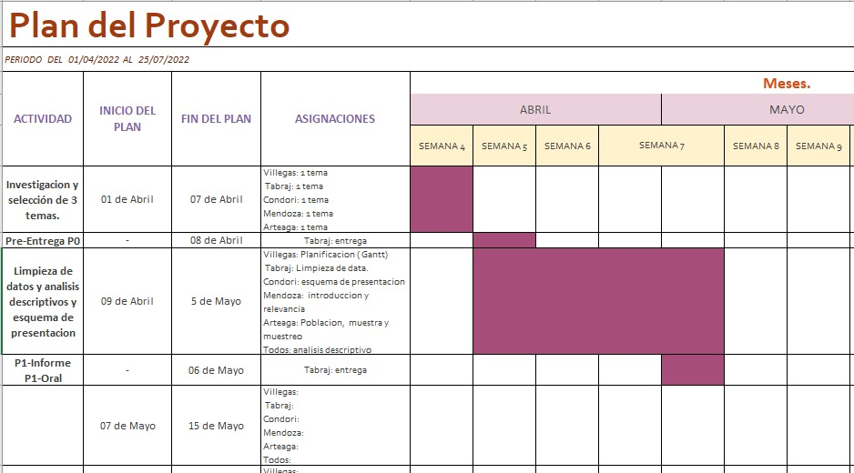

# **Objetivos:**  
  + Objetivos generales:
    - Conseguir información mediante un análisis estadístico sobre las deficiencias estructurales en los centro educativos para las personas                 discapacitadas en el departamento de Tumbes en el año 2012.
    
  + Objetivos específicos: 
    - Determinar la discapacidad dominante en la población de Tumbes.
    - Determinar la mayor carencia infraestructura de las instituciones educativas en Tumbes.
    - Establecer la relación entre infraestructura educativa y limitaciones por dicacidad.
    - Determinar que grupo etario es el predominante según las variables establecidas.

  
# **Introducción:**
+ **Relevancia:**    
La educación es un elemento primordial en el desarrollo de cada persona y por ello, no tiene distinción de religión, raza, sexo, situación económica, discapacidades, etcétera. Es en este último punto donde existe una marcada situación de abandono por parte del Estado e Instituciones educativas, quienes deberían brindar un servicio completo al educando para garantizar su completa formación . Las principales barreras se encuentran en la infraestructura de las instituciones, es decir, no cuentan con los espacios y equipos necesarios para la atención de una persona discapacitada.  

  
+ **Planificación:** 
{withd=100%}


# **Datos**  
  + **Proceso de recolección de datos:**   
  La base de datos utilizada es publica y fue obtenida por medio de la Encuesta Nacional Especializada Sobre Discapacidad (ENEDIS) 2012 [Instituto     Nacional de Estadística e Informática - INEI], debido a que esta facilita una base de datos precisa es decir,es acorde con nuestro tema de investigación, así como, amplia y confiable. La encuesta nacional fue realizada entre los meses de Julio del 2012 y marzo del 2013 a los 24 departamentos del Perú y a la provincia constitucional del Callao. Se uso como estrategia la entrevista directa mediante el llenado de un cuestionario dirigido hacia las personas discapacitadas.  

  + **Población, muestra y muestreo:**
  La población, en este caso, serian las personas discapacitadas de Tumbes y la muestra fue escogida estratégica mente por la base de datos del INEI donde se considero como Universo las personas con discapacidad a nivel nacional. La muestra, por este criterio selectivo, será igual a la población delimitada por INEI donde se trabajará con 37524 observaciones y 113 variables, el cual fue obtenida mediante la aplicación del muestreo estratificado donde se considero como criterio el tamaño de vivienda, así como tratar de cubrir la mayor parte de la poblacion, ya sea rural o urbano, las 3 regiones. 

  + **Descripción de variables:**  
  
    + Edad: variable numérica discreta, cuya restricción es que sea un numero entero no negativo  

    + Sexo: variable categórica nominal, cuya restricción es que sea "M"(masculino) o "F"(femenino)  

    + Limitaciones(variable categórica nominal): Sus restricciones son que sean "SI" o "NO" y se dividen en:   
      + Limitación_para_moverse 
      + Limitación_visual
      + Limitación_comunicativa
      + Limitación_auditiva
      + Limitación_comprensiva
      + Limitación_para_relacionarse
      + Padece_enfermedad_crónica
    + Asistencia a un centro o programa de educación: variable categórica nominal,cuya restricción es que sea    "SI" o "NO"  

    + Razones por la inasistencia a un centro o programa educativo: variable categórica nominal,cuya restricción es que elijas entre:  
        + Trabajo   
        + Falta de dinero  
        + No desea  
        + El estudio es difícil  
        + Distancia  
        + Malos profesores  
        + Falta de condiciones  
        + Inseguridad  
        + Mala infraestructura, entre otros.                                         
    + Aparatos o elementos que posee la institución educativa(variable categórica nominal): Sus restricciones son que sean "SI" o "NO" y se dividen en:
      + Profesores especializados
      + Computadoras especializados
      + Libros brayle
      + Libros hablados
      + Lenguaje de señas
  
  
  + **Limpieza de base de datos:**
  En primer lugar, tenemos que filtrar los datos al departamento de Tumbes, debido a que es nuestra población objetivo. Luego hay que tener en cuenta las variables mas relevantes en materia de estructura en la educación debido a que, la encuesta hecha por INEI cubre mucho aspectos sobre la discapacidad por lo que, eliminamos las variables que no serian utilizadas para esta investigación, ademas cambiamos los nombres de las variables con ayuda del diccionario de la data, así como las respuestas a nuestra conveniencia para poder hacer los gráficos requeridos.

# **Análisis Descriptivo:**

  + Previamente debemos importar las librerías necesarias para el análisis descriptivos, como también hacer el cambio de nombre de los datos de sexo y todos aquellos que su respuesta sea "SI" y "NO".
```{r}
library(readr)
library(plyr)
library(dplyr)
library(tidyr)
library(tidyverse)

DDTumbes <- read.csv("BD_Tumbes_PCD.csv")
DDTumbes$X <- NULL
DDTumbes$SEXO[DDTumbes$SEXO == "2"] <- "F"
DDTumbes$SEXO[DDTumbes$SEXO == "1"] <- "M"
DDTumbes[DDTumbes == "2"] <- "No"
DDTumbes[DDTumbes == "1"] <- "Si"
DDTumbes$EDAD[DDTumbes$EDAD == "No"] <- 2
DDTumbes$EDAD[DDTumbes$EDAD == "Si"] <- 1

DDTumbes
```

Para comenzar analizaremos la edad y sacaremos sus descriptores:
```{r}
edad <- as.numeric(DDTumbes$EDAD)
edad <- sort(edad, decreasing = FALSE)
summary(edad)
barplot(table(edad[1008:1900]), col = c(4,rep("gray", 4)))
```
 + Entonces podemos asegurar que la moda de edad es decir el dato mas repetido es la edad 64 y el promedio general de edad en  la data es 52.81 , los datos extremos son 0 y 98 años de edad.
 
 
```{r}
barplot(table(DDTumbes$SEXO),main = "Cantidad de encuestados por sexo",col = "orange")
```
    + De este gráfico podemos afirmar que contestaron la encuesta mas mujeres que varones  

A continuación, veremos las posibles diferencias que  existir entre las personas que presentan limitaciones para caminar, limitaciones visuales, limitaciones comunicativas, limitaciones auditivas y limitaciones comprensivas y las que no presentan estas limitaciones.
 
+ *MOSAICO DE LIMITACIONES PARA MOVERSE POR ETAPAS DE DESARROLLO*   
Para poder dividir a la variable edades por etapas de desarrollo, vamos a usar etiquetas con diferentes rangos para poder determinar en que etapa esta cada persona.

```{r}
etiquetas<-cut(as.numeric(DDTumbes$EDAD) , breaks = c(0,5,13,17,35,64,98), labels = c("I","N","A", "ADJ", "AD" ,"AN"), right = TRUE, ordered_result = TRUE )

cort_edad<-data.frame(DDTumbes$EDAD, etiquetas)
table(cort_edad$etiquetas)
```
+---------------------------------------+-----------------+----------------------------+
|**ETAPAS DE DESARROLLO(ETIQUETA)**     |**RANGO EN AÑOS**|**NUMERO DE PERSONAS**      |
+=======================================+=================+============================+
| Infante (I)                           | [0 - 5] años    |    47 personas             |
+---------------------------------------+-----------------+----------------------------+
| Niño (N)                              |   [6 - 13] años | 132 personas               |
+---------------------------------------+-----------------+----------------------------+
|  Adolescente (A)                      | [14 - 17] años  | 80 personas                |
+---------------------------------------+-----------------+----------------------------+
|Adulto Joven (ADJ)                     | [18 - 35] años  | 261 personas               |
+---------------------------------------+-----------------+----------------------------+
|    Adulto (AD)                        | [36 - 64] años  |678 personas                |
+---------------------------------------+-----------------+----------------------------+
|    Anciano(AN)                        |  [65 - 98] años |  737 personas              |
+---------------------------------------+-----------------+----------------------------+


```{r}

tedad = (cort_edad)*100/1935
rtedad = round(tedad,2)

pie(rtedad,labels = rtedad, main ="PROPORCIÓN DE LA MUESTRA POR ETAPAS DE DESARROLLO", col = c("pink","lightblue","orange","grey","lightgreen","yellow"))
legend(x = "bottomright", legend = c("I: Infante","N: Niño","A: Adolecente", "ADJ: Adulto joven", "AD: Adulto" ,"AN: Anciano"), fill = c("pink","lightblue","orange","grey","lightgreen","yellow"),title = "Categoria")

```


```{r}
mosaicplot(table(DDTumbes$LIMITACIÓN_PARA_MOVILIZARSE, cort_edad$etiquetas), main = "LIMITACIONES PARA MOVERSE POR ETAPAS", ylab="Categoria",xlab="Limitacion para movilizarse" ,color=c("pink","lightblue","orange","grey","lightgreen","yellow") )
legend(x = "bottomright", legend = c("I: Infante","N: Niño","A: Adolecente", "ADJ: Adulto joven", "AD: Adulto" ,"AN: Anciano"), fill = c("pink","lightblue","orange","grey","lightgreen","yellow"),title = "Categoria")
```

En el caso de las limitaciones para movilizarse, las personas con esta condición en su mayoría pertenecen a los adultos y Ancianos encuestados, de lo contrario para los Adolescentes, Niños y bebes esta limitación es menor en número.

+ *MOSAICO DE LIMITACIONES VISUALES POR ETAPAS DE DESARROLLO*  
```{r}

mosaicplot(table(DDTumbes$LIMITACIÓN_VISUAL, cort_edad$etiquetas), main = "LIMITACIONES VISUALES POR ETAPAS", ylab="Categoria",xlab="Limitacion visual" ,color=c("pink","lightblue","orange","grey","lightgreen","yellow") )
legend(x = "bottomright", legend = c("I: Infante","N: Niño","A: Adolecente", "ADJ: Adulto joven", "AD: Adulto" ,"AN: Anciano"), fill = c("pink","lightblue","orange","grey","lightgreen","yellow"),title = "Categoria")

```


En el gráfico superior podemos notar de acuerdo a la clasificación que se realizó que las personas que presentan esta limitación visual son parte del grupo de Ancianos y Adulto. Asimismo, observamos que la afectación de esta limitación se presenta en menor medida en los bebes y Niños. Esto quiere decir que a mayor edad las limitaciones visuales son mayores en número.


+ *MOSAICO DE LIMITACIONES COMUNICATIVAS POR ETAPAS DE DESARROLLO*   
```{r}

mosaicplot(table(DDTumbes$LIMITACIÓN_COMUNICATIVA, cort_edad$etiquetas), main = "LIMITACIONES COMUNICATIVAS POR ETAPAS", ylab="Categoria",xlab="Limitacion comunicativa" ,color=c("pink","lightblue","orange","grey","lightgreen","yellow") )
legend(x = "bottom", legend = c("I: Infante","N: Niño","A: Adolecente", "ADJ: Adulto joven", "AD: Adulto" ,"AN: Anciano"), fill = c("pink","lightblue","orange","grey","lightgreen","yellow"),title = "Categoria")
```

Lo que respecta a las limitaciones comunicativas estas están mejor representadas por las personas Adultos jóvenes y casi uniformemente para los demás grupos. Lo peculiar de esta grafica es que podemos observar que los Adultos y Ancianos son los que menos presentan estas limitaciones comunicativas

+ *MOSAICO DE LIMITACIONES AUDITIVAS POR ETAPAS DE DESARROLLO*   
```{r}
mosaicplot(table(DDTumbes$LIMITACIÓN_AUDITIVA, cort_edad$etiquetas), main = "LIMITACIONES AUDITIVAS POR ETAPAS", ylab="Categoria",xlab="Limitacion para auditiva" ,color=c("pink","lightblue","orange","grey","lightgreen","yellow") )
legend(x = "bottom", legend = c("I: Infante","N: Niño","A: Adolecente", "ADJ: Adulto joven", "AD: Adulto" ,"AN: Anciano"), fill = c("pink","lightblue","orange","grey","lightgreen","yellow"),title = "Categoria")

```

En este caso, las limitaciones auditivas son representadas en su mayor medida por los Ancianos seguido de los Adultos. Pero, aun así, los grupos que no tienen estas limitaciones son estas mismas. Por otro lado, se observa que los Niños e Infantes son los que menos afectados se presentan.

+ *MOSAICO DE LIMITACIONES COMPRENSIVAS POR ETAPAS DE DESARROLLO*   

```{r}
mosaicplot(table(DDTumbes$LIMITACIÓN_COMPRENSIVA, cort_edad$etiquetas), main = "LIMITACIONES COMPRENSIVAS POR ETAPAS", ylab="Categoria",xlab="Limitacion comprensiva" ,color=c("pink","lightblue","orange","grey","lightgreen","yellow") )
legend(x = "bottom", legend = c("I: Infante","N: Niño","A: Adolecente", "ADJ: Adulto joven", "AD: Adulto" ,"AN: Anciano"), fill = c("pink","lightblue","orange","grey","lightgreen","yellow"),title = "Categoria")
```
Para el caso de las limitaciones comprensivas no se nota una diferencia con la cantidad de personas que no padecen de esta dificultad. Pero existe una ligera diferencia en donde los hombres son mayores y es en aquel grupo que si presenta estas limitaciones comprensivas.
Cabe resaltar que las personas que no padecen de alguna dificultad en un gráfico mostrado no quieren decir que no presente las demás limitaciones.


  
+ *BARPLOT DE LENGUAJE DE SEÑAS*  
```{r}
  DDTumbes$LENGUAJE_SEÑAS[DDTumbes$LENGUAJE_SEÑAS == "3"] <- "No Sabe"
  barplot(table(DDTumbes$LENGUAJE_SEÑAS), main = "¿La institucion cuenta con personal que maneje el lenguaje de señas?", col ="skyblue")
```
En la mayoría de instituciones educativas de Tumbes no se cuenta con personal qu maneje el lenguaje de señas esto impide el buen aprendizaje de los alumnos con discapacidad auditiva pues este lenguaje es la manera en la que comprende y aprenden de mejor manera.

  
+ *BARPLOT DE LIBROS BRAILE*  
```{r}
  DDTumbes$LIBROS_BRAILE[DDTumbes$LIBROS_BRAILE == "3"] <- "No Sabe"
   barplot(table(DDTumbes$LIBROS_BRAILE), main = "¿La institucion cuenta con libros braile?", col ="skyblue")
```
Los libros braile son la principal forma en la que las personas con discapacidad visual puedan continuar con sus aprendizajes pero vemos que las instituciones no toman en cuenta ello con el pico de respuestas que tenemos en esta gráfica en la que su moda es que no se cuenta con libros braile en la institución.


+ *BARPLOT DE SERVICIOS HIGIENICOS PARA DISCAPACITADOS*  
```{r}
  DDTumbes$SERVICIOS_HIGIENICOS_DISCAPACITADOS[DDTumbes$SERVICIOS_HIGIENICOS_DISCAPACITADOS == "9"] <- "No Sabe"
   barplot(table(DDTumbes$SERVICIOS_HIGIENICOS_DISCAPACITADOS), main = "¿Su institucion cuenta con servicios higienicos para personas discapacitadas?", col ="skyblue")
```
Vemos en esta gráfico un pico donde la mayoría de encuestados observan que no se cuenta con baños para personas discapacitadas esto genera una incomodidad en las personas discapacitadas y dificultad para que puedan usar los servicios higiénicos

+ *BARPLOT DE BARANDAS DE SEGURIDAD*   

```{r}
  DDTumbes$BARANDAS_SEGURIDAD[DDTumbes$BARANDAS_SEGURIDAD == "9"] <- "No Sabe"
   barplot(table(DDTumbes$BARANDAS_SEGURIDAD), main = "¿Su institucion cuenta con barandas de seguridad?", col = c("royalblue","chartreuse","orange1"))
```
En este barplot vemos que nuestra población encuestada en la base de datos observa que en sus instituciones no se cuenta con barandas de seguridad por lo que esta seria su moda, esto perjudica a las personas con problemas de visión puesto que no tienen como guiarse al caminar o bajar las escaleras pudiendo generar un accidente.


# **Descriptores numéricos:**

```{r}
BD <- read_csv("BD_TUMBES2.csv")
BD
```

* **Promedio:**
```{r}
mean(BD$Edad)
```
    -  Entonces sabemos que el promedio de la edad es 52.81
    
```{r}
mean(BD$INGRESO_PRINCIPAL, na.rm = T)
```
    -  El promedio del Ingreso principal es de 1175.25
    
* **Desviación estándar:**     
```{r}
sd(BD$Edad)
```
    -  La desviación estándar de la edad es de 24.66  

* **Varianza:**
```{r}
var(BD$Edad)
```
    -  La varianza de la edad es de 608.161
    
* **Coeficiente de variación:** 
```{r}
(sd(BD$Edad)/mean(BD$Edad))*100
```
    -  El coeficiente de variación de la edad es de 46.7%, cuyo valor señala que el grado de dispersión con respecto la media es alta por lo que los valores serán dispersos.

* **Correlación:**
```{r}
SUELDO_HORASTRABAJO <- data.frame(Sueldo = BD$INGRESO_PRINCIPAL, Horas_de_trabajo = BD$HORAS_TRABAJÓ_A_LA_SEMANA)
SUELDO_HORASTRABAJO %>% filter(!is.na(Sueldo), !is.na(Horas_de_trabajo)) -> SUELDO_HORASTRABAJO_SINNA
cor(SUELDO_HORASTRABAJO_SINNA$Sueldo, SUELDO_HORASTRABAJO_SINNA$Horas_de_trabajo)
```
    -  El valor de la correlación entre el sueldo y la horas de trabajo es de 0.67, por lo que se interpreta que la dirección de la asociación es directa e indica que el grado de asociación es moderada.
    
# **Descriptores gráficos:**  
* **Gráfico de dispersión:** 

```{r}
regresion <- lm(SUELDO_HORASTRABAJO_SINNA$Horas_de_trabajo~SUELDO_HORASTRABAJO_SINNA$Sueldo,data=SUELDO_HORASTRABAJO_SINNA)
plot(SUELDO_HORASTRABAJO_SINNA$Sueldo , SUELDO_HORASTRABAJO_SINNA$Horas_de_trabajo, xlab = "Sueldo", ylab = " Horas de trabajo a la semana")
abline(regresion)
SUELDO_HORASTRABAJO_SINNA %>% filter(SUELDO_HORASTRABAJO_SINNA$Sueldo < 3000) -> SUELDO_HORASTRABAJO_SINNA
SUELDO_HORASTRABAJO_SINNA %>% filter(SUELDO_HORASTRABAJO_SINNA$Horas_de_trabajo < 200) -> SUELDO_HORASTRABAJO_SINNA
plot(SUELDO_HORASTRABAJO_SINNA$Sueldo , SUELDO_HORASTRABAJO_SINNA$Horas_de_trabajo, xlab = "Sueldo", ylab = " Horas de trabajo a la semana")
abline(regresion)
```
* **Histograma:** 
```{r}
hist(BD$INGRESO_PRINCIPAL ,main = "Histograma de Ingresos", ylab = "Frecuencia", col = "lightblue",breaks = 15, xlab = "Ingresos")
Ingresos_menor4000 <- filter(BD, BD$INGRESO_PRINCIPAL < 4000)
hist(Ingresos_menor4000$INGRESO_PRINCIPAL ,main = "Histograma de Ingresos", ylab = "Frecuencia", col = "lightblue",breaks = 15, xlab = "Ingresos")
```
    -  Gracias a este histograma podemos ver que bastantes personas discapacitadas no tienen un sueldo mayor a 1500 soles
    
* **Diagrama de caja:**

```{r}
boxplot(BD$HORAS_TRABAJÓ_A_LA_SEMANA,col= "green", main = "HORAS DE TRABAJO A LA SEMANA")
HorasTrabajo_menor200 <- filter(BD, BD$HORAS_TRABAJÓ_A_LA_SEMANA < 200)
boxplot(HorasTrabajo_menor200$HORAS_TRABAJÓ_A_LA_SEMANA,col= "green", main = "HORAS DE TRABAJO A LA SEMANA")
```
    - Podemos ver que bastantes personas discapacitadas trabajan alrededor de 40 horas y algunos valores atípicos que señalan a trabajar hasta 120 horas semanales.  

 
# **Variables aleatorias:**      
* **Distribución uniforme discreta:**  
Declaramos: X = número de mujeres encuestadas  
características:
  - Numero finito de valores:
  Observamos la variable **sexo** en donde el numero de mujeres es:
```{r}
table(BD$Sexo)[2]
```
  RanX = {0,1,2,3,4,5,6.......,980}
  - Misma probabilidad:
  P(X = x) = 1/n = 1/981

```{r}
dunifdisc<-function(x, min=0, max=980) ifelse(x>=min & x<=max & round(x)==x, 1/(max-min+1), 0)
plot(0:980,dunifdisc(0:980),type="h", lty  = 3, lwd  = 3, pch = 16, xlab="x",ylab="P(X=x)", 
     main="Función de Probabilidad", col=terrain.colors(15), ylim = c(0,0.0015))
```

Problema:  ¿Cual es la probabilidad de encuestar a lo más 600 mujeres?
Piden: P(X<=600)

```{r}
punifdisc<-function(q, min=0, max=980) ifelse(q<min, 0, ifelse(q>=max, 1, (floor(q)-min+1)/(max-min+1)))
round(punifdisc(600),2)
```
La probabilidad de entrevistar a lo mas 600 mujeres es 0.61.

* **Distribución Pascal o Binomial Negativa:**  
El gobierno regional de Tumbes desea hacer una encuesta sobre las limitaciones de sus ciudadano y se tomara en cuenta una base de datos ya existente donde se sabe que de los 1936 encuestados. ¿Cual es la probabilidad de que se necesiten 15 encuestas para encontrar a la décima persona con discapacidad visual?

Variable aleatoria: 
Y = número de encuestas hasta encontrar la décima persona con discapacidad visual
Piden: P(Y=15) con K = 10
Recordar: Rstudio considera la cantidad de fracasos -> 5
P(exito) = P(encontrar una persona con discapacidad visual)

```{r}
table(BD$LIMITACIÓN_VISUAL)
```
```{r}
911/1936
```

P(éxito) = 0.4705579  

Respuesta:

```{r}
dnbinom(5,10,0.4705579)
```
La probabilidad de que se necesiten 15 encuestas para encontrar a las décima persona con limitación visual es de 0.044.

* **Distribución Hipergeometrica:**
Una Institución del Estado ubicado en Lima (MEDICA) ha seleccionado una muestra aleatoria de 200 personas discapacitadas de la base de datos *BD_TUMBES*. ¿Cual es la probabilidad de encontrar por lo menos 110 personas con limitación para movilizarse? 

variable aleatoria: W = numero de personas con limitacion para movilizarse    
Piden: P(W >= 110) = P(W > 109)
Tamaño de muestra: n = 500
Población:  
```{r}
nrow(BD)
```
Población: N = 1936

Numero de éxitos: M
```{r}
table(BD$LIMITACIÓN_PARA_MOVILIZARSE)
```
M = 1096

Numero de fracasos: N - M  
N - M = 840  

Respuesta:
```{r}
phyper(109, 1096, 840, 200, lower.tail = F)
```
La probabilidad de encontrar por lo menos 110 personas con limitacion para movilizarse es de 0.71


# **Conclusiones**
  + Luego de hacer el análisis de la data , llegamos a la conclusión que en el Perú exactamente en Tumbes se tiene muchas          deficiencias en la parte estructural en las instituciones educativas debido a que no cuentan con lo necesario para tener       entre sus aulas a las personas que tienen alguna discapacidad y debido a eso muchas personas discapacitadas no se sienten      cómodos en los colegios y hasta deciden salirse por falta de material hecho para ellos.