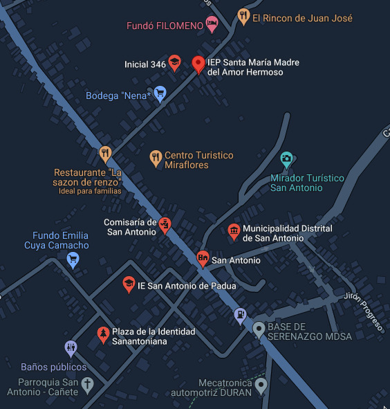

```{r, echo=FALSE, results='hide'}
#Library installation and loading

#List libraries
Library_list <- c("readr", "dplyr", "ggplot2", "tidyverse", "rgl", "haven", "DescTools")

library("pacman")
#Install and load wrapper
p_load(Library_list, character.only = TRUE)

```


```{r,echo=FALSE}
# FUNCIONES

Distribucion_binomial <- function(n,prop) {
    tabla = as.data.frame(0:n) %>%
    mutate(dbinom(0:n, n, prop))
    names(tabla) = c("exitos", "probabilidad")
    return(tabla)
}

Distribucion_hypergeometrica <- function(x,M,N,n){
    tabla = as.data.frame(0:x) %>%
    mutate(dhyper(0:x,M,N,n))
    names(tabla) = c("n_casos", "probabilidad")
    return(tabla)
}

```

## Segunda entrega del proyecto de Estadística y probabilidades I

## Tema:
# Relación entre densidad estudiantil y rendimiento academica por distrito
## INTRODUCCIÓN
### Relevancia
El objetivo de este estudio es determinar si la cantidad de alumnos en un determinado centro educativo afecta de forma positiva o negativa el rendimiento académico de los alumnos. Para ello, estudiaremos el resultado de las pruebas censales realizadas por el gobierno en el año 2016 y la cantidad de colegios por distrito en el mismo año.
### Planificación
A continuación, presentaremos un diagrama de Gantt para el mejor entendimiento de la repartición de actividades para la realización de este trabajo.


```{r, echo=FALSE}
# Diagrama de Gantt
gantt <- read_csv("Gantt_P1.csv", show_col_types = FALSE)

Integrantes <- unique(gantt$Integrante)
Actividades <- unique(gantt$Actividad)

gantt <- gather(gantt, "Estado", "Fecha", 4:5) %>% mutate(Fecha = as.Date(Fecha, "%m/%d"), Integrante = factor(Integrante, Integrantes[length(Integrantes):1]), Actividad = factor(Actividad, Actividades))

ggplot(gantt, aes(Fecha, Integrante, color = Actividad, group = Item)) +
  geom_line(size = 4) +
  labs(x = "fechas", y = NULL, title = "Gantt entrega #1")
```

## DATOS
### Recolección de datos

#### Sobre nuestra base de datos original (P1)

En la entrega anterior:
*Tras analizar nuestra nueva variable “Número de alumnos por colegio promedio” pudimos observar que la cantidad de datos atípicos era extrema. Pensamos que esto es debido a una gran cantidad de errores en nuestra base de datos original “Resultados_Distrital_2doSecundaria.csv”. Originalmente pensamos que la baja cantidad de alumnos en múltiples distritos era normal debido a que el tamaño de los distritos era pequeño, ademas, había una variable llamada “Cobertura estudiantil” lo que nos llevo a tomar en alta estima la fiabilidad del estudio.*
En la presente entrega haremos uso de la base de datos original, esto es debido a que la que usamos en un principio ya había sido tratada y modificada.

Después de una amplia investigación, se encontró una base de datos acerca de los resultados de la evaluación censal de estudiantes de segundo de secundaria en el año 2016.
Cada entrada de dicha base de datos representaba los resultados por alumno; sin embargo, a nosotros nos interesa estudiar los distritos de Perú, por lo que agrupamos la base de datos en función del distrito. A continuación, procedimos a limitar nuestra población, restringiéndola a los  distritos de los 4 departamentos con **Mayor aporte al PBI**, esto hace referencia a los departamentos con mayor movimiento económico y que tienen mayor desarrollo; al tener una mejor economía frente a otros departamentos. Esta afirmación proviene de la teoría del capital humano que indica que el nivel de ingresos depende del nivel educativo de uno.
Al utilizar las bases de datos oficiales del gobierno peruano, la fiabilidad de sus procesos de recolección es alta. Debido a que, son cifras verídicas y verificadas, porque recolectan elementos tangibles de la realidad y no opiniones o datos personales que suelen ser adulterados por la propia fuente. Como cantidad de colegios, alumnos por cada institución educativa, resultados de exámenes, entre otros.

```{r, echo=FALSE, message=FALSE}
# PBI Ranking
PBI_ranking <- read_csv("PBI_PERU.csv", show_col_types = FALSE)
PBI_ranking <- PBI_ranking[c(2:28), ]
PBI_ranking$`2016P/` <- gsub(" ", "", PBI_ranking$`2016P/`)
PBI_ranking$`2016P/` <- as.numeric(PBI_ranking$`2016P/`)
PBI_ranking <- select(PBI_ranking, Departamentos, `2016P/`) 
PBI_ranking <- arrange(PBI_ranking, desc(`2016P/`))
PBI_ranking <- head(PBI_ranking, 8)
```

```{r, message=FALSE, echo=FALSE}
#Carga de base de datos original
#ECE_2S2016 = Evaluación_Censal_Estudiantes_2S_2016
suppressMessages(ECE_2S2016 <- read_sav("Evaluacion_Censal_Estudiantes_2S_2016.sav"))
```

```{r, message=FALSE, echo=FALSE}
ECE_2S2016 = filter(ECE_2S2016, Departamento == 'AREQUIPA' | Departamento == 'LIMA' | Departamento == 'CALLAO' | Departamento == 'CUSCO')

# Agrupamos los distritos
Muestra = ECE_2S2016 %>%
    group_by(Departamento,Provincia,Distrito) %>%
    summarise(
        N_escuelas = length(unique(ID_IE)),
        N_alumnos = (ID_IE = n()),
        Promedio_L = mean(grupo_L, na.rm = T),
        Promedio_M = mean(grupo_M, na.rm = T),
        Promedio_HGE = mean(grupo_HGE, na.rm = T),
        N_hombres = sum(sexo == "0"),
        N_mujeres = sum(sexo == "1"),
        colegios_estatales = sum(Gestion2 == 1),
        colegios_rurales = sum(Gestion2 == 2),
        zonas_urbanas = sum(Area == 1),
        zonas_rurales = sum(Area == 2),
        indice_socioeconomico = mean(as.numeric(ise),na.rm = T))

```

```{r, message=FALSE, echo=FALSE}
# Número de distritos por departamento
Dist_por_Dep = Muestra %>%
  group_by(Muestra$Departamento) %>%
  summarise(
    n_dist = (Distrito = n())
  )
```

### Población, muestra y muestreo
#### Población
Todos los distritos del Perú en el 2016

#### Muestra y unidad muestral
Los distritos de los 4 departamentos con mayor aporte al PBI(Lima, Callao, Cusco, Arequipa)
El tamaño de nuestra muestra (los 4 departamentos con mayor aporte al PBI) es de 370 observaciones.

```{r, message=FALSE, echo=FALSE}
cat(nrow(Muestra))
```

La muestra es representativa porque toma en cuenta todos los distritos dentro de los departamentos elegidos. 

#### Muestreo
Es un muestreo no probabilístico por juicio. El juicio empleado son los  departamentos con mayor aporte al PBI nacional del 2016, esto porque sabemos que los departamentos líderes en el aporte del PBI nacional son los departamentos con mejor economía.


### Variables
| Variable | Tipo | Restricciones |
|----------|------|---------------|
|Departamento|Categórica nominal|4 regiones con mayor PBI|
|Provincia|Categórica nominal|Provincias de las regiones elegidas|
|Distrito|Categórica nominal|Distritos de las provincias elegidas|
|N_escuelas|Numérica discreta|$x \in N [0, 300]$|
|N_alumnos|Numérica discreta|$x \in N [0, 20000]$|
|Promedio_L|Numérica continua|$x \in R [0, 4]$|
|Promedio_M|Numérica continua|$x \in R [0, 4]$|
|Promedio_HGE|Numérica continua|$x \in R [0, 4]$|
|N_hombres|Numérica discreta|$x \in N [0, 20000]$|
|N_mujeres|Numéricxa discreta|$x \in N [0, 20000]$|
|colegios_estatales|Numéricxa discreta|$x \in N [0, 20000]$|
|colegios_rurales|Numéricxa discreta|$x \in N [0, 20000]$|
|zonas_urbanas|Numéricxa discreta|$x \in N [0, 20000]$|
|zonas_rurales|Numéricxa discreta|$x \in N [0, 20000]$|
|indice_socioeconomico|Numérica continua|$x \in R [0, 4]$|
|alumnos_por_colegio|Numérica discreta|$x \in R [0, 300]$|
|Promedio_Total|Numérica continua|$x \in R [0, 20]$|
|nivel_socioeconomico|categorica ordinal|4 niveles|


### Limpieza de base de datos

#### Datos faltantes

```{r, message=FALSE, echo=FALSE}
# Número de NA
lima_provincia_NA = nrow(filter(Muestra, (Provincia == 'LIMA') & is.na(indice_socioeconomico)))
cat(
  "NA en total: ",
  sum(is.na(Muestra)),'\n',
  "NA en la variable ISE: ",
  sum(is.na(Muestra$indice_socioeconomico)),'\n',
  "N° NA fuera de Lima: ",
  nrow(filter(Muestra, (Provincia != 'LIMA') & !is.nan(indice_socioeconomico))),'\n',
  "N° NA en Lima provincia: ",
  lima_provincia_NA,
  sep = '')
```
Podemos observar que todos nuestros NA están en la variable "nivel socioeconomico" y dentro de esa variables todos los NA, a excepción de 3 están fuera de la Provincia de Lima.
Esta variable la ignoraremos de momento más no la eliminaremos con la esperanza de realizar un análisis en el subconjunto de la provincia Lima.

#### Datos atipicos

Posteriormente, creamos un código que itera por cada una de nuestras variables numéricas y determina cuales son las atípicas en extremo; sin embargo, al estar trabajando con una población tan diversa como la de lima, solo estamos imprimiendo el dato mas atípico para cada variable junto con el distrito al que corresponde.

<div style="display:flex">

<p style="padding-left:20px">Como podemos observar, el distrito de San Juan de Lurigancho esta presente como el dato mas atípico para la gran mayoría de variables.
Esto es debido a que SJL es, por una gran diferencia, el distrito mas poblado de Lima, por ello tiene sentido que le correspondan datos tan elevados.
Por otro lado, podemos observar que en el distrito de San antonio solo hay 1 colegio con 212 alumnos, esto es debido a que en dicho distrito solo hay 1 colegio con nivel de secundaria.</p>
</div>

```{r echo=FALSE, message=FALSE}
par(mfrow=c(2, 2))
# Atipic vars
for (var_name in variable.names(Muestra)[-c(1, 2, 3, 15)]) {
  
  
  
    is_atipic <- FALSE
    v <- get(x = var_name, pos = Muestra)
    upper_lim <- quantile(v, 0.75, names = F) + 3 * IQR(v)
    
    lower_lim <- quantile(v, 0.25, names = F) - 3 * IQR(v)
    
    max_atipic <- NULL
    min_atipic <- NULL
    
    for (x in v) {
      if (x < lower_lim | x > upper_lim) {
        
        is_atipic = TRUE
        if (x > upper_lim) {
          max_atipic <- max(c(max_atipic, x))
        }
        else{
          
          min_atipic <- min(c(min_atipic, x))
        }
        
      }
    }
    
    if ( !(is.null(max_atipic))) {
      atipic_n <- (which(v == max_atipic))
      message(var_name)
      message(Muestra$Distrito[atipic_n])
      message(max_atipic)
    }
    if ( !(is.null(min_atipic))) {
      atipic_n <- (which(v == min_atipic))
      message(var_name)
      message(Muestra$Distrito[atipic_n])
      message(min_atipic)
    }
    
    if (is_atipic == TRUE ) {
      boxplot(v , main = var_name, xlab=Muestra$Distrito[atipic_n])
    }
    
}
```

#### Agregando variables derivada
A continuación vamos a agregar 2 variables que no estaban presentes en nuestra base de datos en un principio: El número de alumnos por colegio y el promedio aritmético de las 3 materias evaluadas.

```{r, echo=FALSE}
# Agregar variables derivadas a la Muestra

Muestra <- Muestra %>%
  mutate(alumnos_por_colegio = N_alumnos / N_escuelas) %>%

  mutate(Promedio_Total = round(5*(Promedio_L + Promedio_M + Promedio_HGE) / 3, 3)) %>%
  
  

mutate(nivel_socioeconomico = case_when(
    indice_socioeconomico <= -0.40572 ~ "muy bajo",
    indice_socioeconomico <= 0.42023 ~ "bajo",
    indice_socioeconomico <= 1.11248 ~ "medio",
    indice_socioeconomico > 1.11248 ~ "alto"
  ))

```

## ANÁLISIS DESCRIPTIVO
A continuación, presentaremos los distintos descriptores gráficos y numéricos para nuestras variables mas importantes.
### Alumnos por colegio


```{r, echo=FALSE, message=FALSE, out.width="65%", out.height="50%", out.width="60%", out.extra='style="float:right; padding:10px"'}
# Número de alumnos por colegio para cada distrito
plot(Muestra$alumnos_por_colegio, xlab = "Distritos", ylab = "Alumnos por colegio", main = "Número de alumnos por colegio promedio", xaxt='n')
```

Empezaremos mostrando 2 datos. En primer lugar, tenemos un diagrama de puntos que corresponde al número de colegios promedio para cada distrito de manera independiente.


 En segundo lugar, tenemos el promedio de alumnos por colegio para toda la muestra. Estos datos son diferentes debido a que el número de colegios es diferente para cada distrito.
 
```{r, echo=FALSE, message=FALSE}
# Promedio alumnos por colegio de toda la muestra
cat(sum(sum(Muestra$N_alumnos) / sum(Muestra$N_escuelas)))
```


<div style="clear:both">
</div>


```{r, echo=FALSE, message=FALSE, out.width="65%", out.height="50%", out.width="60%", out.extra='style="float:right; padding:10px"'}
counts <- table(Muestra$Departamento)
barplot(counts, main = "Distritos por departamento",
   xlab = "Departamento",
   ylab = "Número de distritos") 

```

### Número de distritos por departamento

Para esta variable, presentaremos un gráfico de barras. Esta variable es relevante porque delimita el rango de observaciones que utilizaremos en el estudio. En la gráfica se puede apreciar cuántos distritos posee cada departamento. Ademas, podemos observar que la moda es lima con 153 de frecuencia, esto corresponde a 0.41 de nuestras observaciones.
```{r, echo=FALSE, message=FALSE}
moda_lima = Mode(Muestra$Departamento)
cat(
  moda_lima,
  attr(moda_lima, "freq") / nrow(Muestra))
```

<div style="clear:left">
</div>

```{r, echo=FALSE, message=FALSE, out.extra='style="float:right"', out.height="30%", out.width="55%"}
ggplot(Muestra, 
       aes(x = Departamento, 
           y = N_alumnos)) +
  geom_bar(stat = "identity") +
  labs(y="Número alumnos")
```


<div style="padding-top:100px">
A continuación, mostramos la relación entre el número de alumnos y los departamentos a los que pertenecen
Se puede observar que lima tiene la mayor concentración de población, lo que tiene sentido al sera la capital de nuestro país.
</div>


```{r, echo=FALSE, message=FALSE}
cat(sd(Muestra$N_alumnos))

```

<div style="clear:both">
</div>

### Relación entre las calificaciones de las 3 materias evaluadas
```{r include=FALSE}
   options(rgl.useNULL = TRUE)
   rgl::setupKnitr(autoprint = TRUE)
```
Ahora podremos apreciar la correlación entre las 3 materias de estudio: HGE, Matemáticas y Comprensión lectora. Presentaremos un gráfico en 3D para su mejor visualización y entendimiento, y vemos que tienen una relación lineal.
```{r, echo=FALSE, message=FALSE}
cor(Muestra[, c(6, 7, 8)])
plot3d(Muestra$Promedio_L, Muestra$Promedio_M, Muestra$Promedio_HGE,
       xlab = "Lectura", ylab="Matematica", zlab="HGE")
```


```{r, echo=FALSE, message=FALSE, out.extra='style="float:right"', out.height="40%", out.width="70%"}
sin_lima = filter(Muestra, Departamento != "LIMA")
ggplot(sin_lima, 
       aes(x = Departamento, 
           y = N_alumnos)) +
  geom_bar(stat = "identity") +
  labs(y="Número alumnos")
```

A continuación, graficaremos el número de alumnos por distrito a excepción de lima, esto es debido a que sabemos que lima tiene el mayor número de alumnos, distritos y colegios.

```{r, echo=FALSE, message=FALSE}
par(mfrow=c(1,2))
plot((
  Muestra$alumnos_por_colegio), 
  Muestra$Promedio_Total,
  xlab = "Alumnos por colegio",
  ylab = "Calificación promedio",
  main = "Muestra total")
pocos_alumnos = filter(Muestra, alumnos_por_colegio < 100)
plot((
  pocos_alumnos$alumnos_por_colegio),
  pocos_alumnos$Promedio_Total,
  xlab = "Alumnos por colegio",
  ylab = "Calificación promedio",
  main = "Alumnos por Colegio > 100")
cat(
  cor(Muestra$alumnos_por_colegio, Muestra$Promedio_Total),
  cor(pocos_alumnos$alumnos_por_colegio, pocos_alumnos$Promedio_Total),
  sep = "               "
)
```


```{r, echo=FALSE, message=FALSE, out.extra='style="float:left"'}
table_sexos = table(ECE_2S2016$Departamento, ECE_2S2016$sexo)
#0 -> hombre
#1 -> mujer
colnames(table_sexos) = c("hombre", "mujer")
mosaicplot(table_sexos, xlab = "Departamentos", ylab = "Sexo", main = "Sexos por departamento")
```


<div style="padding-top:50px">Algo que nos pareció interesante seria comparar la cantidad de mujeres y hombres en la muestra, como resultado, podemos apreciar que las cantidades son muy similares, con una diferencia de tan solo 2229 alumnos.

```{r, echo=FALSE}
cat(sum(table_sexos[c(1, 2, 3, 4)]) - sum(table_sexos[c(5, 6, 7, 8)]))
```


<div style="clear:both">
#### Descriptores de disperción
</div>

Vamos a calcular la desviación estándar y otros descriptores de interés para nuestras 2 variables mas importantes

##### Alumnos por colegio promedio

```{r, echo=FALSE, message=FALSE,}

cat(
  
  "Desviación estandar: ",
  sd(Muestra$alumnos_por_colegio),'\n',
  
  "Promedio: ",
  mean(Muestra$alumnos_por_colegio),'\n',
  "Cabe menciónar que esta variable podria no ser la esperada debido a que, como se menciono previamente, no todos los distritos tienen el mismo número de colegios",'\n',
  "Mediana: ",
  median(Muestra$alumnos_por_colegio),'\n',
  "Moda: ",
  Mode(Muestra$alumnos_por_colegio),'\n',
  sep = ''
  
)


```

##### Promedio total
```{r, echo=FALSE, message=FALSE}

cat(
  
  "Desviación estandar: ",
  sd(Muestra$Promedio_Total),'\n',
  "Promedio: ",
  mean(Muestra$Promedio_Total),'\n',
  "Mediana: ",
  median(Muestra$Promedio_Total),'\n',
  "Moda: ",
  Mode(Muestra$Promedio_Total),'\n',
  sep = ''
)
  
```


# P2

### Diagrama de Gantt

```{r, echo=FALSE, message=FALSE}
# Diagrama de Gantt P2
gantt2 <- read_csv("Gantt_P2.csv", show_col_types = FALSE)

Integrantes <- unique(gantt2$Integrante)
Actividades <- unique(gantt2$Actividad)

gantt2 <- gather(gantt2, "Estado", "Fecha", 4:5) %>% mutate(Fecha = as.Date(Fecha, "%m/%d"), Integrante = factor(Integrante, Integrantes[length(Integrantes):1]), Actividad = factor(Actividad, Actividades))

ggplot(gantt2, aes(Fecha, Integrante, color = Actividad, group = Item)) +
  geom_line(size = 4) +
  labs(x = "fecha", y = NULL, title = "gantt")
```

## Análisis probabilistico

### Distribución Binomial

```{r, echo=FALSE, message=FALSE}
#Dbinom
prop_exito1 = sum(Muestra$Promedio_Total >= 11) / nrow(Muestra)

Dist_por_Prov = filter(ECE_2S2016, Departamento == 'AREQUIPA' | Departamento == 'LIMA' | Departamento == 'CALLAO' | Departamento == 'CUSCO') %>%
  group_by(Departamento,Provincia) %>%
  summarise(
    Distritos = length(unique(Distrito)),
    Promedio_L = mean(grupo_L, na.rm = T),
    Promedio_M = mean(grupo_M, na.rm = T),
    Promedio_HGE = mean(grupo_HGE, na.rm = T),
    Promedio_Total = round(5*(Promedio_L + Promedio_M + Promedio_HGE) / 3, 3) )

promedio_dist_por_provincia = round(mean(Dist_por_Prov$Distritos))

d1 = Distribucion_binomial(promedio_dist_por_provincia,prop_exito1)
plot_bin1 = ggplot(
  d1,
  aes(x = exitos,y = probabilidad)) +
  geom_bar(stat = "identity") +
  geom_text(aes(label = round(probabilidad,3)), vjust = -0.5) +
  ggtitle("Probabilidad de que N distritos tenga promedio aprobatorio")+
  labs(x="Distritos aprobados")
```

<ul>
  <li><h5>Variable aleatoria de bernoulli: Distrito con promedio aprobatorio</h5></li>
  
```{r, echo=FALSE, message=FALSE}
cat(prop_exito1)
```

  <li><h5>Variable aleatoria: Número de distritos aprobados</h5></li>
  <p>Elegimos esta variable debido a que nuestro estudio se centra, en gran medida, en las calificaciones obtenidas por los alumnos de secundaria</p>
  <p>Nuestra muestra en la distribución binomial es de 12 distritos debido a que este es el promedio de distritos por provincia</p>
```{r, message=FALSE, echo=FALSE}
cat(promedio_dist_por_provincia)
```

```{r, message=FALSE, echo=FALSE}
plot_bin1
```

  <li><h5>Variable aleatorio: N° de distritos según su nivel SEC</h5></li>
  <p>Usamos esta variable para proveer información sobre el nivel económico de los alumnos y comprender como es que difieren los distritos lima.</p>
  <p>Una vez más, hicimos uso de 12 distritos por el mismo motivo que antes</p>

```{r, echo=FALSE, out.extra='style="float:left"', out.height="50%", out.width="50%"}
Prov_lima = Muestra %>%
  filter(Provincia == "LIMA")

T = table(Prov_lima$nivel_socioeconomico) / nrow(Prov_lima)

for (i in names(T)) {
  par(mfcol = c(2,1))
  d2 = Distribucion_binomial(promedio_dist_por_provincia, T[i])
  
  print(ggplot(d2,aes(x = exitos,y = probabilidad)) +
    geom_bar(stat = "identity") +
    geom_text(aes(label = round(probabilidad,3)), vjust = -0.5) +
    xlab(i))
  
}
```
Como podemos ver, las 4 tablas corresponden a cada uno de los niveles socioeconomicos, además, calculamos la probabilidad de que un distrito elegido sea de determinado nivel socioeconomico, esto fue calculado como un éxito de Bernoulli
```{r, echo=FALSE, message=FALSE}
print(T)
```


<br>
<br>

```{r, echo=FALSE, message=FALSE}

m = max(Dist_por_Prov$Promedio_Total)
M = which(Dist_por_Prov$Promedio_Total == m)
L = Dist_por_Prov[M,]$Distritos
Dist_mayor_promedio = Dist_por_Prov[M,]

d3 = Distribucion_hypergeometrica(12, L, nrow(Muestra) - L, 12)
Arequipa_plot = ggplot(d3,aes(x = n_casos,y = probabilidad)) + 
  geom_bar(stat = "identity") + 
  geom_text(aes(label = round(probabilidad,3)),vjust = -0.5) +
  labs(x ="N° de distritos de Arequipa")

```

<li><h5>Variable aleatoria: Distribución Hypergeometrica</h5></li>
<p>En nuestra muestra Arequipa es la provincia con mayor promedio total</p>
<p>Cabe mencionar que esta difiere de lo mencionado previamente debido a que ahora estamos trabajando con el promedio de las provincias y no de los distritos.
```{r, echo=FALSE, message=FALSE}
print(unlist(Dist_mayor_promedio))
```
Por ello, vamos a calcular la probabilidad de que, en una muestra de 12 distritos, n sean de arequipa.


```{r, echo=FALSE}
print(Arequipa_plot)
```


</ul>


```{r,echo=FALSE}
Q=quantile(Muestra$alumnos_por_colegio)
Q1=13.16667
Q2=28
Q3=43.63654
nalumnos_q1=nrow(filter(Muestra, alumnos_por_colegio>=Q1, Promedio_Total>=11))
nalumnos_q2=nrow(filter(Muestra, alumnos_por_colegio>=Q2, Promedio_Total>=11))
nalumnos_q3=nrow(filter(Muestra, alumnos_por_colegio>=Q3, Promedio_Total>=11))

P_exito_1=nalumnos_q1/nrow(Muestra)
P_exito_2=nalumnos_q2/nrow(Muestra)
P_exito_3=nalumnos_q3/nrow(Muestra)

cat(
  "Probabilidad de aprobar si el numero de alumnos promedio es mayor al primer, segundo y tercer quartil, respectivavmente:\n",
  P_exito_1,'\n',
  P_exito_2,'\n',
  P_exito_3,'\n',
  sep = '')


```


