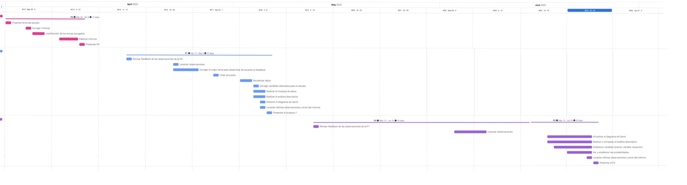
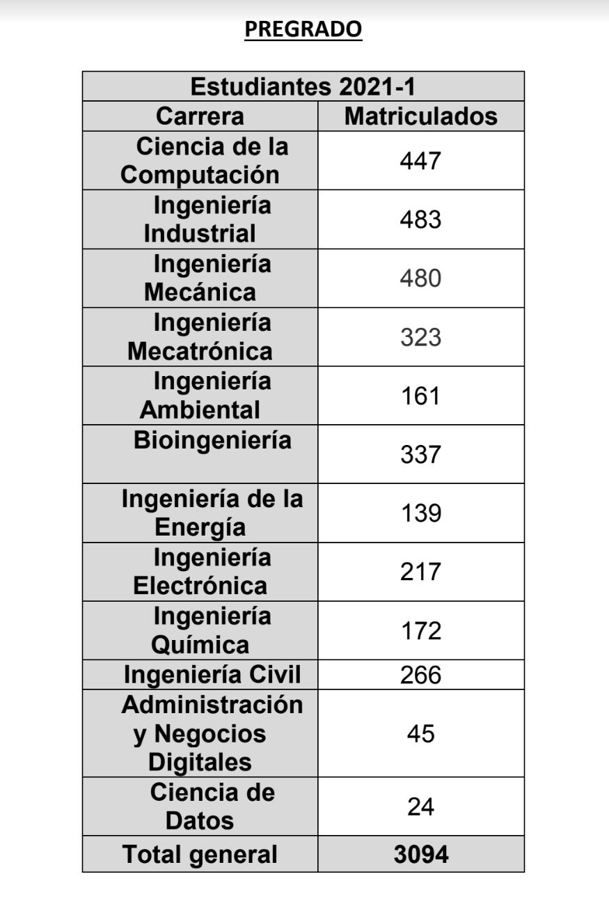
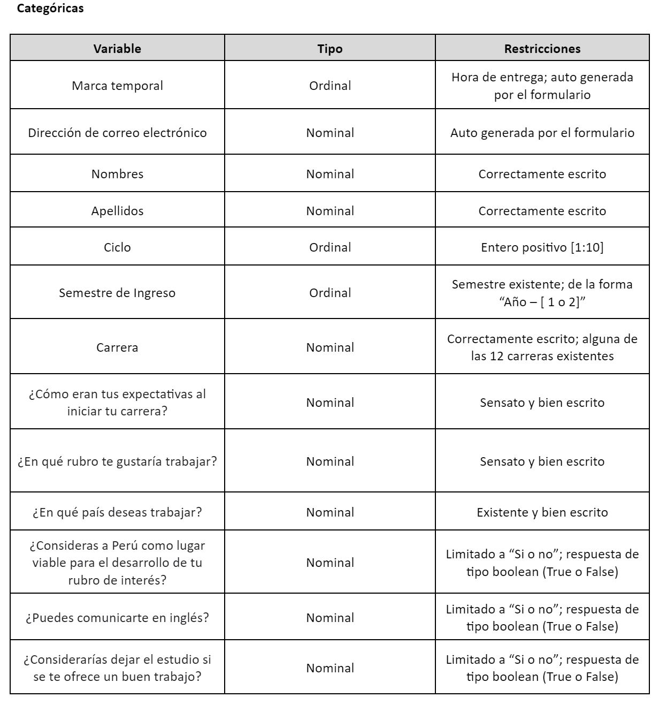
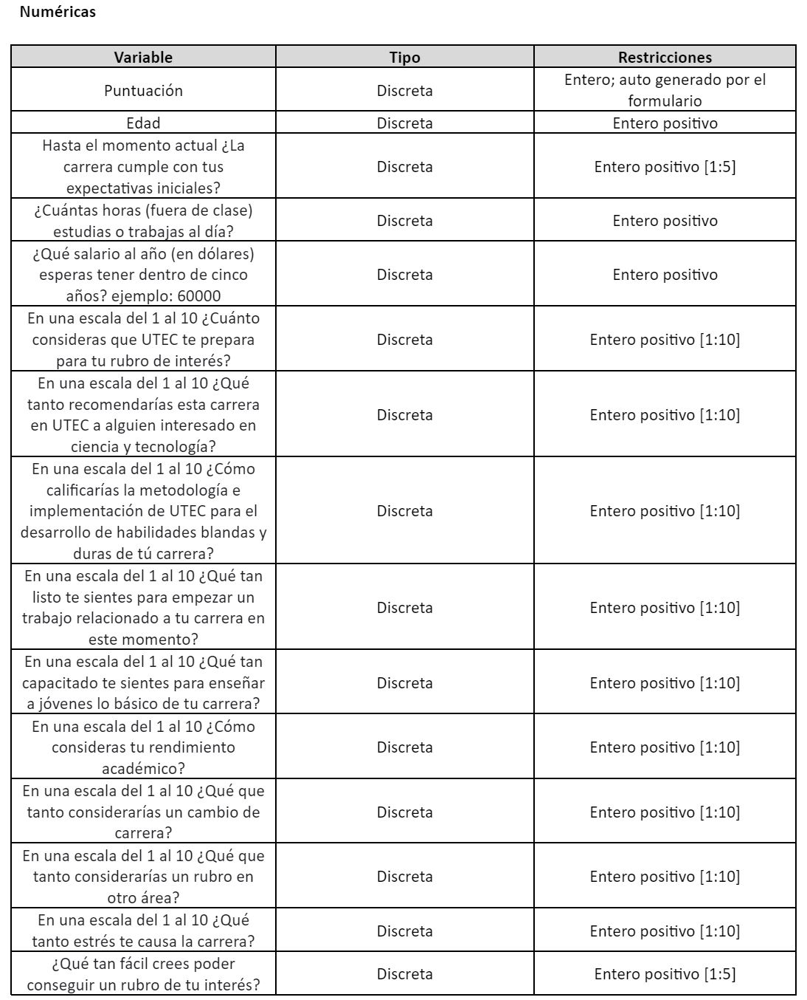
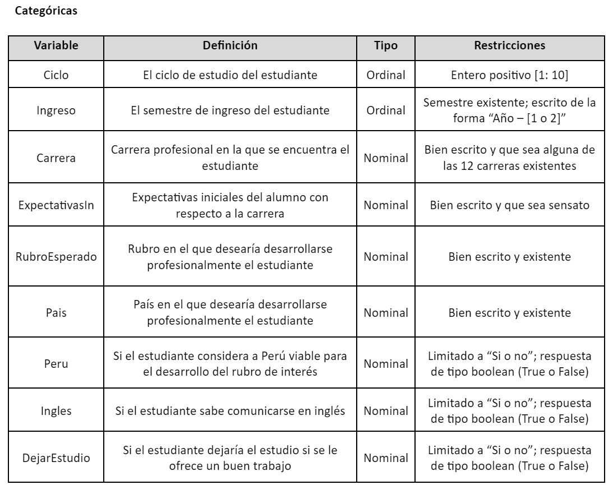

```{r configuracion, include=FALSE}
# knitr::opts_chunk$set(echo = FALSE, message = FALSE, results = "hide")
knitr::opts_chunk$set(echo = TRUE)
```

## Introducción

A manera de verificar la importancia, relevancia y viabilidad del estudio presentado, en esta sección se discute y plantea el enfoque y propósito del mismo, y además se presenta una planificación de lo trabajado hasta el momento, y una cierta predicción de lo que se hará a futuro.

### Relevancia e importancia

Los estudiantes, guiados por su conocimiento e interés, crean una percepción sobre su carrera y desarrollo profesional, guiándolos a perseguir los rubros más atractivos y mejor pagados; y dicha realidad no puede dejarse desatendida. Por ello, es que este estudio propone y ofrece una vista sencilla y comprensible de la realidad, tanto de estudio como laboral, de la carrera profesional Ciencia de la Computación. Más aún, adquiere relevancia y valor al proporcionar información y conocimiento necesario para una buena gestión y toma de decisiones, permitiéndole, tanto a instituciones como alumnos, saber en qué dirección apuntar y en qué temas enfocare. Cabe mencionar que aunque el estudio está enfocado en la Universidad de Ingeniería y Tecnología, la información fácilmente puede ser usada en ámbitos similares.

### Planificación y factibilidad

A manera de entender y presentar el desarrollo del estudio hasta el momento, e incluso planificar los tiempos y medidas para las siguientes entregas, se han desarrollado diferentes gráficos que consignan los tiempos empleados para cada tarea, la participación de cada integrante. De esta forma se comprende los métodos y estrategias empleadas.



## Objetivos

Se pretende dejar en claro, evidentemente, cuáles son los propósitos de estudio, y finalmente que aspectos vamos a describir, analizar, diseccionar y finalmente presentar. Ello, además, para darle cierto orden y formalidad a la investigación.

### Principal

La vitalidad y esencia de este estudio reside en obtener una visión clara y precisa sobre la percepción, tanto de estudio como laboral, de los estudiantes de pregrado de la Universidad de Ingeniería y Tecnología acerca de la carrera profesional Ciencia de la Computación. Con los datos e información obtenida, se pretende analizar y entender el desempeño de los alumnos, y ver hacía qué rubros y regiones, de la carrera en mención, apuntarán como profesionales. ¿En qué dirección va Ciencia de la Computación?

### Secundarios

* Analizar la relación entre los aspectos personales de los alumnos y el rubro de interés
* Determinar la importancia del conocimiento del idioma inglés en la toma de decisiones profesionales
* Determinar cómo varían las expectativas iniciales de los alumnos con respecto a la carrera
* Determinar en qué medida Perú resulta un país viable para el desarrollo de Ciencia de la Computación
* Determinar el nivel de preparación que ofrece la Universidad de Ingeniería y Tecnología
* Analizar en qué medida el desempeño y esfuerzo de un alumno puede influir en su percepción de la carrera y futuro profesional

## Datos

El propósito de esta sección es declarar y mostrar todo el proceso y requerimientos previos que conllevarán al procesamiento de información, y posteriormente al análisis descriptivo. Básicamente, entre todo lo consignado, se revisará el pilar de esta investigación; es decir, quiénes son los individuos que elegimos estudiar y finalmente cómo logramos llegar a estos.

### Recolección de datos

Dicho proceso se realizó a través de encuesta o formulario, que finalmente permitió un estudio personalizado y adaptado al agrado de los autores; también, no se logró conseguir una base de datos existente que se relacionara con el estudio. Como requisito mínimo, las variables debían tener la siguiente distribución: 3 continuas, 3 discretas y 4 cualitativas. Por ello, primero se declararon las variables, y luego se plantearon preguntas que permitieran recolectar los datos para cada una de las variables. Se consignaron en su mayoría preguntas con opciones de respuesta, y en las que no, se especificó cómo contestar; ello para que los datos sean representativos, y que la limpieza no sea muy tediosa. Una vez así, comenzó la recolección de información.

Para llegar a la población se hizo uso de la tecnología; básicamente un formulario online. Se envió un correo masivo a la comunidad estudiantil de pregrado de la Universidad de Ingeniería y Tecnología, y además dicho formulario fue reenviado a distintos grupos y asociaciones de los respectivos alumnos. También, dada la nueva medida del aforo al 100% en dicha universidad, fue posible acercarse personalmente a los alumnos, haciendo uso de un código QR para facilitar el acceso al formulario. Este proceso se detuvo y acabó al llegar a las 132 observaciones.

## Población objetivo

Viene a ser la comunidad estudiantil de pregrado de la Universidad de Ingeniería y Tecnología matriculada en el semestre 2022-1. Observando la base de datos de los alumnos matriculados en el semestre 2021-1, podemos decir que la población tiene un tamaño similar, alrededor de 3100 alumnos.




## Unidad Muestral

Resultar ser, sencillamente, un estudiante de pregrado de la Universidad de Ingeniería y Tecnología matriculado en el semestre 2022-1.

## Tipo de muestreo

Teniendo en cuenta los limitados recursos y el poco interés de las personas en completar el formulario o encuesta, el proceso ha sido tedioso. El muestreo ideal sería estratificado, pero teniendo en cuenta lo anterior, se tuvo que elegir no probabilístico, del tipo por conveniencia; es decir, “agarrar lo que hay”. Básicamente se tiene los registros de los alumnos que, generosamente, decidieron completar el formulario; estos llegan a ser 132.

Entonces, la representatividad de la muestra podría ponerse en duda. Sin embargo, a continuación veremos como esta le es mayoritariamente fiel a la población; y el error de muestreo sirve para justificar ello. Básicamente, esto último representa un margen de error, y se calcula con z∙ n (para mayor información: {r}[click](https://bit.ly/3kJx6UF) ); entonces, con una población de tamaño 3100, una muestra de 132, y un nivel de confianza de 90%, dicho error resulta del 7,03%, un porcentaje pequeño y aceptable. Por ejemplo, si cierto indicador resultara del 60%, el verdadero valor estaría entre 52,97% y 67,03%. Además, se tiene aproximadamente 4.26% de la población en observaciones, con registros ciertamente distribuidos por ciclos, carreras, edades, entre otros. Todo ello nos indica que, aunque el muestreo no sea probabilístico, la información es relevante y representativa, y por tanto la muestra también lo es.

## Variables de estudio iniciales

Básicamente aquí se consignan todas las variables resultantes del formulario empleado y previas a la limpieza de la base de datos; ello para comprender satisfactoriamente el procesamiento de información. Inicialmente, tenemos 28 variables.





## Librerías

Para el trabajo se usan diferentes librerías. El código se encarga de instalar los paquetes en caso no se encuentren instalados. Luego se cargan las librerías.

### Carga de Librerias

```{r}
lista.paquetes <- c("readr", "dplyr", "knitr", "corrplot", "stringr", "ggplot2")
nuevos.paquetes <- lista.paquetes[!(lista.paquetes %in% installed.packages()[,"Package"])]
if(length(nuevos.paquetes)) install.packages(nuevos.paquetes)
```


```{r cargar_librerias, include=FALSE}
library(knitr)
library(readr)
library(dplyr)
library(corrplot)
library(stringr)
library(ggplot2)
```

### Carga de datos

```{r}
DF <- read_csv("DatosEncuesta.csv")
```

## Limpieza de datos

### Nombres de las variables

Se vuelven a nombrar las variables para que al momento de acceder a la información, esta sea fácil de acceder.

```{r}
colnames(DF)
```
```{r}
colnames(DF) <- c(
  "Marca", "Correo", "Puntuacion", "Nombres", "Apellidos", "Edad", "Ciclo", "Ingreso", "Carrera", "ExpectativasIn", "ExpectativasFin", "RubroEsperado", "Pais", "Peru", "Ingles", "Tarea", "Salario", "Preparacion1", "Preparacion2", "Preparacion3", "Capacitacion1", "Capacitacion2", "Capacitacion3", "Rechazo1", "Rechazo2", "Rechazo3", "FacilidadRubro", "DejarEstudio"
  )
colnames(DF)
```

### Consideraciones para la eliminacion de variables

Para reducir la complejidad del trabajo se eliminan aquellas variables que no serán útiles al estudio de forma de que sea mas simple y fácil de entender.

### Limpieza de datos no útiles

```{r}
DF <- DF[!(DF$Nombres == "2"), ]
```

```{r}
str_to_title(DF$Nombres)
str_to_title(DF$Apellidos)
```

### Borrado de variables innecesarias

Las variables **Marca** y **Puntuacion** son variables que nos provee el Google Forms pero no son necesarias para el propósito de nuestro trabajo, de una misma manera no se necesitan los nombres, apellidos o correos.

```{r}
DF <- select(DF, -Marca, -Correo, -Puntuacion, -Nombres, -Apellidos)
```

### Respuestas ambiguas o incorrectas

Por razones de tiempo no nos es factible preguntarle a cada fuente a que se referían con sus respuestas. Por lo tanto, eliminamos aquellas que no se pueden interpretar como ninguna de las opciones que se han respondido y aquellas que hacen referencia a otra respuesta son añadidas a esa respuesta. Por ejemplo: "*Conseguir un título*" entraría dentro de "*Graduarme*"

```{r}
DF$ExpectativasIn[DF$ExpectativasIn %in% "Todas"] <- NA
DF$ExpectativasIn[DF$ExpectativasIn %in% "Apreder lo suficiente de computación para ser director general en Google"] <- "Encontrar un trabajo"
DF$ExpectativasIn[DF$ExpectativasIn %in% "Título"] <- "Graduarme en 5 años"
unique(DF$ExpectativasIn)
```

En torno a los rubros esperados se toma la misma posición que antes para remover aquellas variables que no pueden ser interpretadas y se agrupan rubros del mismo área dentro de la misma respuesta. Por ejemplo: "*Biomedicina de prótesis*" entra dentro de "*Biomedicina*".

```{r}
DF$RubroEsperado[DF$RubroEsperado %in% c("Cyberseguridad", "Pentesting")] <- "Ciberseguridad"
DF$RubroEsperado[DF$RubroEsperado %in% "Biomedica(protesis)"] <- "Biomedicina"
DF$RubroEsperado[DF$RubroEsperado %in% c("Aun no lo sé", "Estructuras")] <- NA
DF$RubroEsperado[DF$RubroEsperado %in% "Automatización de procesos"] <- "Automatización"
DF$RubroEsperado[DF$RubroEsperado %in% "Data Scientist"] <- "Big Data"
DF$RubroEsperado[DF$RubroEsperado %in% c("Nuevos modelos geométricos en la construccion", "Construcción de obras viales")] <- "Construcción"
DF$RubroEsperado[DF$RubroEsperado %in% "Director general de Google o computación cuántica en IBM, y uso de AI"] <- "Inteligencia Artificial"
DF$RubroEsperado[DF$RubroEsperado %in% "energías renovables"] <- "Energías renovables"
DF$RubroEsperado[DF$RubroEsperado %in% "gestión y supervisión de proyectos"] <- "Gestión y supervisión de proyectos"
DF$RubroEsperado[DF$RubroEsperado %in% "farmacología"] <- "Farmacología"
unique(DF$RubroEsperado)
```

De forma similar se limpia la variable del **país** de rubro esperado en donde se eliminan las respuestas que no se pueden interpretar. 

```{r}
DF$Pais[DF$Pais %in% c("Cualquier pais,lo importante es hacer lo que me gusta ganando bien", "Otro")] <- NA
unique(DF$Pais)
```

En el caso de algunas variables existen respuestas que no son posibles dentro del contexto de la pregunta. Tal como estudiar *más de 24* horas al día. En este caso, se identifican las respuestas que superan a este valor y se eliminan. 

```{r}
DF$Tarea <- ifelse(DF$Tarea >= 24, NA, DF$Tarea)
unique(DF$Tarea)
```

En términos del **salario** anual, se borran aquellas entradas en donde el número no es un salario posible. En este caso eliminamos aquellos salarios que sean *menor a 500* dólares anuales. Por ejemplo, 2 o 5.

```{r}
DF$Salario <- ifelse(DF$Salario < 500, NA, DF$Salario)
unique(DF$Salario)
```

### Creacion de las variables Continuas

Para nuestro estudio hicimos preguntas separadas en grupos, las cuales entran dentro de tres categorías: **Preparación** en UTEC, **Capacitación** Actual y **Rechazo** a la Carrera. Para conseguirlas se consigue la media de las respuestas.

**Preparación** en UTEC

```{r}
Preparacion <- c()
for (x in 1:nrow(DF)) {
  Preparacion <- append(Preparacion, (DF$Preparacion1[x] + DF$Preparacion2[x] + DF$Preparacion3[x]) / 3)
}
rm(x)
```

**Capacitación** Actual

```{r}
Capacitacion <- c()
for (x in 1:nrow(DF)) {
  Capacitacion <- append(Capacitacion, (DF$Capacitacion1[x] + DF$Capacitacion2[x] + DF$Capacitacion3[x]) / 3)
}
rm(x)
```

**Rechazo** a la Carrera

```{r}
Rechazo <- c()
for (x in 1:nrow(DF)) {
  Rechazo <- append(Rechazo, (DF$Rechazo1[x] + DF$Rechazo2[x] + DF$Rechazo3[x]) / 3)
}
rm(x)
```

### Borrado de Columnas Inncesesarias

Ya que se crearon las variables de **Preparación**, **Capacitación** y **Rechazo**, ya no se necesitan las variables de donde vienen estas y pueden ser desechadas.

```{r}
DF <- select(DF, -Preparacion1, -Preparacion2, -Preparacion3, -Capacitacion1, -Capacitacion2, -Capacitacion3, -Rechazo1, -Rechazo2, -Rechazo3)
DF <- cbind(DF, Preparacion)
DF <- cbind(DF, Capacitacion)
DF <- cbind(DF, Rechazo)
```

### Variables de Estudio Finales




## Preguntas e Hipótesis

1. Pregunta: ¿Aquellos estudiantes que se sientan mas preparados y capacitados en su carrera, son menos propensos a rechazar esta?
  + Respuesta: Evidentemente sí, mientras más preparado y capacitado está un alumno en su carrera, se siente más tranquilo y seguro sobre lo que estudia y realiza día a día; entonces es poco probable que rechace su carrera.
2. Pregunta: ¿Los rubros de mayor interés serán considerados por los alumnos como accesibles y sencillos para conseguir un trabajo?
  + Respuesta: Es posible. Dentro de los criterios que los alumnos usen para definir en qué rubro quieren desarrollarse puede figurar la facilidad para obtener un trabajo. Si esta es baja, puede llegar a motivarlos e interesarlos.
3. Pregunta: ¿Los alumnos se sentirán más capacitados y hábiles en su desarrollo profesional mediante se vuelvan mayores?
  + Respuesta: Es muy probable. Uno normalmente ingresa a la universidad verdaderamente joven, y en un inicio no se siente muy hábil, ya que recién está comenzando a familiarizarse y aprender. Mediante se vuelven mayores y van atravesando los ciclos académicos, cada vez poseen más práctica y conocimiento, y por tanto se sentirán más capacitados.
4. Pregunta: ¿Influirá el conocimiento de inglés en la decisión de desarrollarse profesionalmente en cierto país?
  + Respuesta: Sin duda influye. Los alumnos conocedores del idioma se sienten seguros acerca de países donde se habla esta lengua, mientras los que no, evidentemente, optarán por otras regiones en las que sí puedan comunicarse y desarrollarse de forma óptima.
5. Pregunta: ¿En qué medida varían las expectativas iniciales?
  + Respuesta: Que las expectativas iniciales se mantengan es muy poco probable, eso sí; pero en qué medida varían es un poco más complejo. Digamos que mientras más amplia sea la expectativa, variará menos, mientras más rígida y estática sea, variará más.

## Análisis Descriptivo

```{r}
colors <- c("#78fa6e", "#00e888", "#00d2a3", "#00bcb9", "#00a4c9", "#008bcf", "#0071ca", "#0056b8", "#003a9b", "#151976")
```

Descriptores numéricos de las variables continuas

**Preparación**

```{r}
mean(Preparacion)
median(Preparacion)
sd(Preparacion)
```

En general, los alumnos se siente bien preparados. Incluso tomando en cuenta la desviación estándar, los alumnos no suelen tener una preparación menor a 5 (baja).

**Capacitación**

```{r}
mean(Capacitacion)
median(Capacitacion)
sd(Capacitacion)
```

Comparada a la **preparación**, los alumnos se consideran un poco menos capacitados como para trabajar o enseñar pero de igual forma, la media y la mediana indican que su nivel esta del lado alto pero teniendo en cuenta la desviación estándar, existen alumnos que estarían debajo de 5 (no se sienten muy hábiles en esta área)

**Rechazo**

```{r}
mean(Rechazo)
median(Rechazo)
sd(Rechazo)
```

Del **rechazo** se puede concluir que los alumnos se mantienen neutrales en cuanto su gusto a la carrera. Tendiendo en cuenta la desviación estándar, existe una relación saludable entre el estudiante y la **carrera**. 

Aquí se presentan gráficos que demuestran la relación que hay entre las variables continuas. Se puede observar la línea de regresión además de otro gráfico con solo los estudiantes de Ciencias de la Computación solo con los puntos azules.

```{r}
cs <- DF[DF$Carrera == "Ciencias de la Computación", ]
g <- ggplot(DF, aes(x = Capacitacion, y = Rechazo)) + geom_point(size = 3, col = ifelse(DF$Carrera == "Ciencias de la Computación", "blue", "black")) + geom_smooth(method = "lm", col = "firebrick")
g + xlim(c(2, 9.9)) + ylim(c(0, 9.9))
csg <- ggplot(cs, aes(x = Capacitacion, y = Rechazo)) + geom_point(size = 3, col = "blue") + geom_smooth(method = "lm", col = "firebrick")
csg
```
```{r}
g <- ggplot(DF, aes(x = Capacitacion, y = Preparacion)) + geom_point(size = 3, col = ifelse(DF$Carrera == "Ciencias de la Computación", "blue", "black")) + geom_smooth(method = "lm", col = "firebrick")
g
csg <- ggplot(cs, aes(x = Capacitacion, y = Preparacion)) + geom_point(size = 3, col = "blue") + geom_smooth(method = "lm", col = "firebrick")
csg
```
```{r}
g <- ggplot(DF, aes(x = Preparacion, y = Rechazo)) + geom_point(size = 3, col = ifelse(DF$Carrera == "Ciencias de la Computación", "blue", "black")) + geom_smooth(method = "lm", col = "firebrick")
g
csg <- ggplot(cs, aes(x = Preparacion, y = Rechazo)) + geom_point(size = 3, col = "blue") + geom_smooth(method = "lm", col = "firebrick")
csg
```
Uso de la librería *corrplot* para analizar las correlaciones de las variables continuas

```{r}
DFN <- data.matrix(Preparacion)
DFN <- cbind(DFN, Capacitacion)
DFN <- cbind(DFN, Rechazo)
M <- cor(DFN, use = "pairwise.complete.obs")
colnames(M) = c("Preparacion", "Capacitacion", "Rechazo")
rownames(M) = c("Preparacion", "Capacitacion", "Rechazo")
corrplot(M)
```

Se puede observar de ambos los gráficos de dispersión y el gráfico usando corrplot que no existen correlaciones muy fuertes entre las variables. Aún así, vale la pena destacar que hay un poco de relación positiva entre la capacitación del estudiante y el **rechazo**, y la **preparación** del estudiante y su **capacitación**.

Boxplot Salarios Esperados de los estudiantes dentro de cinco años sin datos atípicos

```{r}
Q <- quantile(DF$Salario, probs=c(.25, .75), na.rm = TRUE)
iqr <- IQR(DF$Salario, na.rm = TRUE)
up <-  Q[2]+1.5*iqr
low<- Q[1]-1.5*iqr
salarioSinAti<- subset(DF$Salario, DF$Salario > (Q[1] - 1.5*iqr) & DF$Salario < (Q[2]+1.5*iqr))
is.numeric(salarioSinAti)
boxplot(salarioSinAti)
```

Se puede observar que existe un rango amplio para el bigote del boxplot. Esto puede deberse a que algunos encuestados han respondido su **salario** como mensual (aunque se especificó anual) o porque el salario que estos han pensado esta basado en el salario de otro país.

Barplot de las **expectativas iniciales** mas comunes para los estudiantes

```{r}
legtext = c("Aprender algo relevante para el futuro", "Dedicarle mas tiempo al estudio", "Encontrar un trabajo", "Graduarme en 5 años")
barplot(table(DF$ExpectativasIn), las = 3, xaxt = "n", col = colors)
legend("top",legtext, cex=0.8, col = colors, pch = 15)
```

Para cada de estos grupos, se puede encontrar el descriptor numérico de las medias de si se cumplieron las **expectativas iniciales**

```{r}
s1 <- DF[DF$ExpectativasIn == "Aprender algo relevante para el futuro", ]
mean(s1$ExpectativasFin, na.rm = TRUE)

s1 <- DF[DF$ExpectativasIn == "Dedicarle mas tiempo al estudio", ]
mean(s1$ExpectativasFin, na.rm = TRUE)

s1 <- DF[DF$ExpectativasIn == "Encontrar un trabajo", ]
mean(s1$ExpectativasFin, na.rm = TRUE)

s1 <- DF[DF$ExpectativasIn == "Graduarme en 5 años", ]
mean(s1$ExpectativasFin, na.rm = TRUE)
```

De estas medias podemos concluir que las expectativas en general se mantienen. Especialmente la expectativa de aprender algo relevante que es la que mas se mantiene del grupo. Suponemos ello ya que esta expectativa es medio ambigua y relativamente fácil de satisfacer. 

**Expectativas Finales** de los Estudiantes

```{r}
round((mean(DF$ExpectativasFin) / 5) * 100, 2)
```

Se extraen los 10 **rubros** mas populares entre todos los respondidos

```{r}
rubroTabla <- table(DF$RubroEsperado)
top10 <- ifelse(rubroTabla > 3, rubroTabla, NA)
top10 <- top10[!is.na(top10)]

legtext <- c("Administrador de Base de Datos", "Aprendizaje de Maquina", "Ciberseguridad", "Construcción", "Desarrollador de Juegos", "Desarrollador de Software", "Desarrollador de Web", "Ingeniero de Hardware", "Inteligencia Artificial", "Minería de Datos")

barplot(top10, las = 3, xaxt = "n", col = colors, main = "Los 10 rubros mas populares")
legend("topleft",legtext, cex=0.8, col = colors, pch = 15)
```

Se destaca que dentro de los **rubros** de Ciencias de la Computación, los mas populares entre los estudiantes de UTEC están relacionados a Inteligencia Artificial, Aprendizaje de Máquina o Desarrollo de Software. 

De estos rubros se analiza que tan fácil creen los estudiantes que es para ellos encontrar un trabajo.

```{r}
top10df <- DF[DF$RubroEsperado == "Administrador de Base de Datos"
              | DF$RubroEsperado == "Aprendizaje de Maquina"
              | DF$RubroEsperado == "Ciberseguridad"
              | DF$RubroEsperado == "Construcción"
              | DF$RubroEsperado == "Desarrollador de Juegos"
              | DF$RubroEsperado == "Desarrollador de Software"
              | DF$RubroEsperado == "Desarrollador de Web"
              | DF$RubroEsperado == " Ingeniero de Hardware"
              | DF$RubroEsperado == "Inteligencia Artificial"
              | DF$RubroEsperado == "Minería de Datos", 
              ]
top10df <- na.omit(top10df)
table(top10df$RubroEsperado)
legtext <- c("Administrador de Base de Datos", "Aprendizaje de Maquina", "Ciberseguridad", "Construcción", "Desarrollador de Juegos", "Desarrollador de Software", "Desarrollador de Web", "Ingeniero de Hardware", "Inteligencia Artificial", "Minería de Datos")
boxplot(top10df$FacilidadRubro~top10df$RubroEsperado, top10df, las = 3, col = colors, main = "Facilidad en rubro de preferencia", ylab = "Escala de poco a mucho", xlab = "Rubros Esperados", xaxt = "n")
legend("bottomleft", legtext, cex = 0.4, col = colors, pch = 16)
```

Del el gráfico se puede extraer que ningún rubro se considera muy complicado de conseguir ni muy fácil. No necesariamente los rubros mas populares son los mas sencillos, de hecho para todos se considera moderadamente complicado sencillos.

De forma similar se pueden visualizar los **salarios** esperados de los estudiantes basados en su **semestre de ingreso**.

```{r}
salariossinAtidf <- DF[DF$Salario > (Q[1] - 1.5*iqr) & DF$Salario < (Q[2]+1.5*iqr), ]
salariossinAtidf <- na.omit(salariossinAtidf)
plot(as.factor(salariossinAtidf$Ingreso), salariossinAtidf$Salario, las = 3, ylab = "Salario Esperado US$", xlab = "", main = "Relacion Semestre de Ingreso y Salario Esperado", col = colors)
```

Del gráfico, concluimos que mientras mas reciente el semestre de ingreso, menor es el salario esperado. Esto pude deberse a que los cachimbos no tienen tanta experiencia laboral como aquel que esta en los últimos ciclos y por tanto visualiza una mejor paga en su trabajo.

Los **países** esperados para trabajar comparado con la cantidad de estudiantes que se pueden **comunicar en inglés**

```{r}
barplot(table(DF$Ingles, DF$Pais), las = 3, legend.text = TRUE,  cex.names = 0.7, cex.axis = 0.7, main = "Pais de rubro deaseado teniendo en cuenta el ingles", ylab = "Cantidad", col = c("blue", "yellow"))
```
Se puede observar cuales son los países mas populares. Entre ellos esta, Estados Unidos, Canadá, España, Japón y Perú. También se puede observar cuantos de los estudiantes que seleccionaron cada país consideran que pueden comunicarse en inglés. Como es de esperarse, en países de habla hispana como España existe un mayor porcentaje de estudiantes que no se comunican en inglés mientras que en países en donde si se habla tales como Canadá y Reino unido, el porcentaje de aquellos que si se comunican en su idioma es mayor.


**Horas de trabajo** o estudio de los estudiantes por **ciclo**

```{r}
promediosTarea <- aggregate(DF$Tarea,list(DF$Ciclo),mean, na.rm = TRUE, na.action = NULL)
cicloV <- c(1, 2, 3, 4, 5, 6, 7, 8, 9)
plot(cicloV, promediosTarea$x, xlab = "Ciclo", ylab = "Horas", main = "Horas de trabajo o estudio de los estudiantes por ciclo", col = "red", pch = 16, type = "b")
```

Se puede observar una tendencia para los estudiantes a reducir su trabajo con los ciclos ya que al principio os estudiantes suelen dedicarle mas tiempo al estudio. Aún así, cuando llegan a ciclos en donde se encuentran con retos tales como en el octavo ciclo (proyecto pre-profesional), el tiempo dedicado a la universidad o trabajo fuera de clase aumenta.

Análisis de las **horas de trabajo o estudio** de los estudiantes

```{r}
mean(DF$Tarea, na.rm = TRUE)
median(DF$Tarea, na.rm = TRUE)
sd(DF$Tarea, na.rm = TRUE)
```

En comparación con la mediana, los ciclos 2-7 tienen un distinguible cantidad menor de tiempo dedicada. Además, el promedio es mayor a la media por lo que podemos asumir que el gráfico esta sesgado a la derecha. 

Mosaico sobre que tan viable se considera **Perú** como país para desarrollar un rubro versus si se puede **comunicar en inglés**

```{r}
mosaicplot(DF$Ingles~DF$Peru, col = c("red", "blue"), main = "Peru como pais de desarrollo y conocimiento de ingles", ylab = "¿És peru viable para tu rubro?", xlab = "Comunicación en ingles")
```
Sorprendentemente, aquellos estudiantes que no consideran a Perú como un país para desarrollar su rubro, no se comunican en inglés tanto como los que si lo consideran.

Comparación de **Capacitación** y **Edad**

```{r}
g <- ggplot(DF, aes(x = Edad, y = Capacitacion)) + geom_point(size = 3) + geom_smooth(method = "lm", col = "firebrick")
g
```

Comparación de **Preparacion** y **Edad**

```{r}
g <- ggplot(DF, aes(x = Edad, y = Preparacion)) + geom_point(size = 3) + geom_smooth(method = "lm", col = "firebrick")
g
```

Comparación de **Rechazo** y **Edad**

```{r}
g <- ggplot(DF, aes(x = Edad, y = Rechazo)) + geom_point(size = 3) + geom_smooth(method = "lm", col = "firebrick")
g
```
De los gráficos propuestos se puede concluir que la relación prominente es aquella de la **Capacitación** relacionada con la **Edad**. Osea, que aquellos estudiantes que son mayores, se sienten mas capacitados en torno a su carrera. Para los otros gráficos la tendencia es relativamente pequeña como para concluir que no existe ninguna relación entre estas variables. A lo más se podría decir que la **edad** y el **rechazo** conllevan una pequeña relación.

Comparación **Rubro de Preferencia** por **Ciclo**

```{r}
g <- ggplot(top10df, aes(x = Ciclo, y = RubroEsperado)) + geom_point(size = 3)
g + xlim("1", "2", "3", "4", "5", "6", "7", "8", "9", "10")
```
Se puede observar de la gráfica cuales son los **rubros** mas constantes en los diferentes **ciclos** por ejemplo como *Desarrollo de Software* o *Desarrollo de Juegos* esta presente en todos los **ciclos** menos en el octavo. Parece haber un interés en los **rubros** una vez los estudiantes llegan al **ciclo** en donde estos son introducidos a la carrera.

Relación **Horas de Estudio** y **Rechazo**

```{r}
boxplot(DF$Tarea~DF$Rechazo, xlab = "Rechazo (1-10)", ylab = "Horas de Estudio/Trabajo", main = "Horas de Estudio dado el Rechazo")
```

Se puede observar que cuanto uno **rechaza** la carrera no tiene mucha relación con las **horas de estudio** que tienen los estudiantes. Para aquellos que dicen tener un **rechazo** de 10, parece haber mas **horas de trabajo** en promedio pero esto puede ser debido a que algunos alumnos que han llenado la encuesta han seleccionado la respuesta máxima para cada pregunta.

Relación **Horas de estudio** y **Capacitación**

```{r}
boxplot(DF$Tarea~DF$Capacitacion, xlab = "Capacitación (1-10)", ylab = "Horas de Estudio/Trabajo", main = "Horas de Estudio dada la Capacitación")
```
Al igual que con la comparación del **rechazo** no parece haber ningún tipo de correlación entre que tan **capacitado** esta un estudiante y cuantas **horas de trabajo** pone cada día para sus estudios. Si se ve que aquellos que han marcado un 10 en la **capacitación** suelen tener mas **horas de estudio** lo cual es entendible pero como dijimos para la gráfica anterior, hubieron alumnos que contentaron lo máximo posible en todas las preguntas de la encuesta. 

## Análisis Probabilístico

## Probabilidades

### Horas Adecuadas de Estudio/Trabajo

Evento: Los estudiantes de UTEC tienen un número de horas de estudio al día

Se determina que los alumnos que tiene entre cuatro y seis horas diarias de estudio tienen horas apropiadas de carga académica (Castillo, 2021). Buscamos la probabilidad de que los estudiantes de UTEC tengan las horas adecuadas de carga académica, es decir: $P(\text{Horas adecuadas de estudio})$

```{r}
horasApropiadas <- filter(DF, Tarea >= 4 & Tarea <= 6)
probTarea <- round(nrow(horasApropiadas)/nrow(DF), 2)
probTarea
```

Análogamente, también calculamos la probabilidad de que los alumnos no tengan las horas adecuadas de carga académica. Es decir: $1 - P\text{ o } \bar{P}$

```{r}
1 - probTarea
```

Se puede apreciar gráficamente a los alumnos que le dedican horas adecuadas de estudio a la carrera.

```{r}
DF$HA <- ifelse(DF$Tarea <= 6 & DF$Tarea >= 4, "Si", "No")
barplot(prop.table(table(DF$HA)), xlab = "Horas Adecuadas de Estudio", ylab = "Probabilidad", col = c("red", "blue"))
```

### ¿Se mantienen las expectativas?

Evento: Los estudiantes de UTEC tienen expectativas iniciales de la carrera que pueden cambiar durante el transcurso de esta.

Sabemos que si han respondido mas de 2 en la pregunta sobre si se mantienen sus expectativas iniciales, estas se mantienen o incluso superan a las que tenían al inicio de la carrera. De este modo, buscamos la probabilidad de que UTEC cumpla o supere las expectativas de un alumno, es decir: $P(\text{Las expectativas iniciales se cumplen o superan})$

```{r}
DF$EM <- ifelse(DF$ExpectativasFin > 2, 1, 0)
probExpectativas <- round(sum(DF$EM, na.rm = TRUE) / nrow(DF), 2)
probExpectativas
```

Dentro de la encuesta se respondió en que se basaban las expectativas iniciales de los alumnos.

```{r}
unique(DF$ExpectativasIn)
```

Sabiendo los resultados de esta variable, se puede calcular las expectativas dado una de las respuestas que dieron los estudiantes. 

$P(A|B)$ donde A: Las expectativas iniciales se cumplen o superan. B: La expectativa inicial era "Dedicarle mas tiempo al estudio".

```{r}
DF$ExpecInterseccion <- ifelse(DF$ExpectativasFin > 2 & DF$ExpectativasIn == "Dedicarle mas tiempo al estudio", 1, 0)
DF$ExpecInicial <- ifelse(DF$ExpectativasIn == "Dedicarle mas tiempo al estudio", 1, 0)
round(( sum(DF$ExpecInterseccion, na.rm = TRUE) / nrow(DF) ) / (sum(DF$ExpecInicial, na.rm = TRUE) / nrow(DF) ), 2)

```
De igual modo se pueden calcular las probabilidades condicionales con las otras expectivas iniciales:

$P(A|B)$ donde A: Las expectativas iniciales se cumplen o superan. B: La expectativa inicial era "Graduarme en 5 años".

```{r}
DF$ExpecInterseccion <- ifelse(DF$ExpectativasFin > 2 & DF$ExpectativasIn == "Graduarme en 5 años", 1, 0)
DF$ExpecInicial <- ifelse(DF$ExpectativasIn == "Graduarme en 5 años", 1, 0)
round(( sum(DF$ExpecInterseccion, na.rm = TRUE) / nrow(DF) ) / (sum(DF$ExpecInicial, na.rm = TRUE) / nrow(DF) ), 2)
```
$P(A|B)$ donde A: Las expectativas iniciales se cumplen o superan. B: La expectativa inicial era "Aprender algo relevante para el futuro".

```{r}
DF$ExpecInterseccion <- ifelse(DF$ExpectativasFin > 2 & DF$ExpectativasIn == "Aprender algo relevante para el futuro", 1, 0)
DF$ExpecInicial <- ifelse(DF$ExpectativasIn == "Aprender algo relevante para el futuro", 1, 0)
round(( sum(DF$ExpecInterseccion, na.rm = TRUE) / nrow(DF) ) / (sum(DF$ExpecInicial, na.rm = TRUE) / nrow(DF) ), 2)
```

$P(A|B)$ donde A: Las expectativas iniciales se cumplen o superan. B: La expectativa inicial era "Encontrar un trabajo".

```{r}
DF$ExpecInterseccion <- ifelse(DF$ExpectativasFin > 2 & DF$ExpectativasIn == "Encontrar un trabajo", 1, 0)
DF$ExpecInicial <- ifelse(DF$ExpectativasIn == "Encontrar un trabajo", 1, 0)
round(( sum(DF$ExpecInterseccion, na.rm = TRUE) / nrow(DF) ) / (sum(DF$ExpecInicial, na.rm = TRUE) / nrow(DF) ), 2)
```

Como se puede observar, aquellas expectativas iniciales menos específicas como "Dedicarle mas tiempo al estudio" o "Aprender algo relevante para el futuro" son mas fáciles de mantener que aquellas como "Encontrar un trabajo". De igual modo, en todos los casos la mayoría de las expectativas de los alumnos se mantienen o superan.

### Rubro mas popular

Evento: Los estudiantes de UTEC tiene un rubro en mente en el que prefieren trabajar una vez acabada la carrera.

Sabemos que el rubro mas popular entre los alumnos es "Inteligencia Artificial".

Determinamos la probabilidad de que uno de los alumnos tenga como preferencia "Inteligencia Artificial" como rubro esperado, es decir $P(\text{El alumno tiene en mente "Inteligencia Artificial" como rubro esperado})$.

```{r}
DF$AI <- ifelse(DF$RubroEsperado == "Inteligencia Artificial", 1, 0)
round(sum(DF$AI, na.rm = TRUE) / nrow(DF), 2)
```

De todas formas, existen otros rubros que fueron muy populares entre los estudiantes. Entre ellos están "Aprendizaje de Maquina" y "Desarrollador de Juegos". Se puede calcular de que un estudiante tenga uno de estos dos, o "Inteligencia Artificial" como rubro esperado como: $P(A\cup B\cup C)$. Donde: A: El estudiante tiene como rubro esperado "Inteligencia Artificial", B: El estudiante tiene como rubro esperado "Aprendizaje de Máquina", C: El estudiante tiene como rubro esperado "Desarrollador de Juegos".

```{r}
DF$RubrosUnion <- ifelse(DF$RubroEsperado == "Inteligencia Artificial" | DF$RubroEsperado == "Aprendizaje de Maquina" | DF$RubroEsperado == "Desarrollador de Juegos", 1, 0)
round((sum(DF$RubrosUnion, na.rm = TRUE)) / nrow(DF), 2)
```

Como se puede observar, la probabilidad de que un estudiante este interesado por uno de estos rubros es caso la mitad, 0.49.

### Perú como país de desarollo para rubro

Evento: Los alumnos de UTEC tiene en mente un país en donde pueden desarrollar su rubro esperado.

Dadas las diferentes respuestas en la variable de **País Esperado** se puede encontrar la probabilidad de que el país esperado sea Perú, es decir: $P(\text{Elige a Perú como país para desarrolla su rubro esperado})$.

```{r}
DF$PeruEsperado <- ifelse(DF$Pais == "Perú", 1, 0)
probPeru <- round(sum(DF$PeruEsperado, na.rm = TRUE) / nrow(DF), 2)
probPeru
```
Como se puede observar, el 0.15 de alumnos consideran a Perú como el país para desarrollar su rubro. Esta probabilidad se puede analizar con la condición de que los alumnos no pueden comunicarse en inglés. $P(A|B)$. Donde: A: El alumno elige a Perú como país para desarrollar su rubro esperado. B: El alumno no puede comunicarse en inglés.

```{r}
DF$PeruInterseccion <- ifelse(DF$Pais == "Perú" & DF$Ingles == "No", 1, 0)
DF$InglesProb <- ifelse(DF$Ingles == "No", 1, 0)
probAdadoB <- ( sum(DF$PeruInterseccion, na.rm = TRUE) / nrow(DF) ) / ( sum(DF$InglesProb, na.rm = TRUE) / nrow(DF) )
round(probAdadoB, 2)
```

La probabilidad sigue siendo baja, lo que nos indica que no necesariamente tiene mucha importancia el poder comunicarse en inglés al momento de tomar la decisión de si Perú es un buen lugar para desarrollar los rubros esperados de los estudiantes.

Para comparar, la probabilidad de que un estudiante elija a Estados Unidos como país de rubro esperado dado que sabe hablar inglés es mayor ya que no muchos estudiantes elegirían un país en donde no se suele hablar español sino ingles sin saber ingles es mas baja. Para ellos veamos la probabilidad de que un estudiante elija a Estados Unidos como país para desarrollar su rubro esperado dado que si puede comunicarse en inglés, es decir: $P(A|B)$. Donde: A: Un estudiante elija a Estados Unidos como país para desarrollar su rubro esperado, B: El estudiante puede comunicarse en inglés.

```{r}
DF$EstadosUnidosInterseccion <- ifelse(DF$Pais == "Estados Unidos" & DF$Ingles == "Sí", 1, 0)
DF$InglesProbSi <- ifelse(DF$Ingles == "Sí", 1, 0)
round(( sum(DF$EstadosUnidosInterseccion, na.rm = TRUE) / nrow(DF) ) / ( sum(DF$InglesProbSi, na.rm = TRUE) / nrow(DF) ), 2)
```
En este caso se puede visualizar que la probabilidad es mas alta, indicando que comunicarse en inglés es de mayor importancia cuando se elije a Estados Unidos como país para desarrollar su rubro esperado.

$P(B|A)$ Donde: A: El alumno elige a Perú como país para desarrollar su rubro esperado. B: El alumno no puede comunicarse en inglés.

Para resolver esta probabilidad se usa la Formula de Bayes.

```{r}
DF$PeruInterseccion <- ifelse(DF$Pais == "Perú" & DF$Ingles == "Sí", 1, 0)
DF$InglesProb <- ifelse(DF$Ingles == "No", 1, 0)
probNoIngles <- (sum(DF$InglesProb, na.rm = TRUE) / nrow(DF))
probBdadoComplemento <- ( sum(DF$PeruInterseccion, na.rm = TRUE) / nrow(DF) ) / ( sum(DF$InglesProbSi, na.rm = TRUE) / nrow(DF) )
probComplemento <- sum(DF$InglesProbSi, na.rm = TRUE) / nrow(DF)

round((probAdadoB * probNoIngles) / (probAdadoB * probNoIngles +  probBdadoComplemento * probComplemento ), 2)
```

Vemos por el resultado que es probable que uno de cada cuatro alumnos que no pueden comunicarse en inglés teniendo en cuenta que luego eligen a Perú como lugar para desarrollar su rubro esperado. Esto nos indica que es posible que al elegir a Perú como país para desarrollar su rubro, el aprender el inglés no es de suma importancia para ellos.

### Un buen futuro salarial para el alumno

Una forma de visualizar si los estudiantes ven un buen futuro para ellos es el salario que esperan tener dentro de los primeros cinco años tras terminar la carrera.

Evento: Los estudiantes se imagina el salario que tendrán después de los primeros cinco años tras terminar la carrera.

Buscamos la probabilidad de que este sea un salario moderadamente alto, osea un mínimo de 50.000 dólares anuales. $P(\text{El salario esperado por el estudiante es mayor o igual a 50.000})$

```{r}
DF$buenSalario <- ifelse(DF$Salario >= 50000, 1, 0)
round(sum(DF$buenSalario, na.rm = TRUE) / nrow(DF), 2)
```

Se puede observar que la probabilidad de que un estudiante espere un salario mínimo de 50.000 dolares anuales tras cinco años de terminar su carrera es un poco mas de un tercio, 36%.

Se va a comparar el estimado salario que tienen los estudiantes basado en como calificaron en las variables de **Preparación** **Capacitación** y **Rechazo**.

Para estas variables dependemos del resultado numérico de nuestro análisis. Para la variable Preparación, un resultado de seis o mayor indica que el estudiante se siente preparado. Para la variable Capacitación, un resultado de seis o mayor indica que el estudiante se siente capacitado. Para la variable rechazo consideramos que un bajo rechazo a la carrera es un resultado de cuatro o menor.

$P(A|B)$ Donde: A: El estudiante espera un salario mayor o igual a 50.000 dólares anuales tras cinco años de acabar su carrera, B: El estudiante siente que la universidad lo ha preparado bien.

```{r}
DF$SalPrep <- ifelse(DF$Salario >= 50000 & DF$Preparacion >= 6, 1, 0)
DF$PrepMayor6 <- ifelse(DF$Preparacion >= 6, 1, 0)
round((sum(DF$SalPrep, na.rm = TRUE) / nrow(DF)) / (sum(DF$PrepMayor6, na.rm = TRUE) / nrow(DF)), 2)
```

$P(A|B)$ Donde: A: El estudiante espera un salario mayor o igual a 50.000 dólares anuales tras cinco años de acabar su carrera, B: El estudiante siente que la universidad lo ha capacitado bien.

```{r}
DF$SalCap <- ifelse(DF$Salario >= 50000 & DF$Capacitacion >= 6, 1, 0)
DF$CapMayor6 <- ifelse(DF$Capacitacion >= 6, 1, 0)
round((sum(DF$SalCap, na.rm = TRUE) / nrow(DF)) / (sum(DF$CapMayor6, na.rm = TRUE) / nrow(DF)), 2)
```

$P(A|B)$ Donde: A: El estudiante espera un salario mayor o igual a 50.000 dólares anuales tras cinco años de acabar su carrera, B: El estudiante no siente rechazo por su carrera.

```{r}
DF$SalRech <- ifelse(DF$Salario >= 50000 & DF$Rechazo <= 4, 1, 0)
DF$RechMenor4 <- ifelse(DF$Rechazo <= 4, 1, 0)
round((sum(DF$SalRech, na.rm = TRUE) / nrow(DF)) / (sum(DF$RechMenor4, na.rm = TRUE) / nrow(DF)), 2)
```
Se puede observar que existe una probabilidad entre el 0.35 y 0.4 de que un estudiante piense de su salario futuro como bueno dado que se siente, preparado, capacitado y no rechaza a su carrera.

### Desarrollo en el extranjero

Evento: Los alumnos de UTEC tiene en mente un país en donde pueden desarrollar su rubro esperado.

Dadas las diferentes respuestas en la variable de **País Esperado** se puede encontrar la probabilidad de que el país esperado no sea Perú, es decir: $P(\text{No elige a Perú como país para desarrolla su rubro esperado})$.

Recordamos que la probabilidad de que un alumno elija a Perú como país para desarrollar su rubro es 0.15. Se puede calcular la probabilidad de que un alumno elija un país en el extranjero para desarrollar su rubro restándole a 1 la probabilidad.

```{r}
probExtranjero = 1 - probPeru
probExtranjero
```

```{r}
barplot(prop.table(table(!DF$Pais == "Perú")), names = c("Perú", "Extranjero"), col = c("red", "blue"), ylab = "Probabilidad")
```


La mayoría de los alumnos prefiere viajar al extranjero para desarrollar su rubro.

## Variables Aleatorias

### Horas Adecuadas de Estudio/Trabajo

Si UTEC quiere calcular la probabilidad de que la mayoría de sus estudiantes estén estudiando las horas adecuadas, ¿cuál es la probabilidad de que por lo menos más de la mitad de los estudiantes se encuentren en dicho rango de horas?

Variable Aleatoria: $\mathbb{X}$: Número de estudiantes que tienen horas apropiadas de estudio sobre el conjunto de 132 estudiantes.

Usamos el modelo binomial: $\mathbb{X} \sim Bin(132, 0.52)$ y determinamos $P(\mathbb{X} > 66)$

```{r}
round(pbinom(.5*(nrow(DF)), size = nrow(DF), prob = probTarea, lower.tail = FALSE), 2)
```
Como se puede observar, hay una probabilidad del 0.65 de que una cantidad mayoritaria de alumnos les dedique las horas recomendadas de estudio para la carrera. La mayoría de los alumnos están bien encaminados.

Adicionalmente, para ver la distribución de esta probabilidad, se puede observar el siguiente gráfico.

```{r}
coloresbarra<-colores <- c(rep("light blue",125), 'red')
barplot(pbinom(0:132, size = nrow(DF), prob = probTarea, lower.tail = FALSE), names.arg = c(0:132), main = "Función de masa acumulada de la variable X de que más de x alumnos tengan horas adecuadas", ylab = "Probabilidad Acumulada", xlab = "Número de estudiantes", col = coloresbarra,
     cex.axis=0.8, cex.names=0.8, cex.lab=0.8, cex.main=0.8, space = FALSE)
abline(v = 66, lwd = 2, col = "red")
legend('topright',legend="Probabilidad acumulada mas de la mitad de alumnos tenga las horas adecuadas",col="red",lwd=2,cex=0.4)
```

Se puede observar que la probabilidad acumulada de que hasta 52 estudiantes cumplan con las horas adecuadas de estudio esta cerca al 100% y de ahí empieza el decremento.

### ¿Se mantienen las expectativas?

Para UTEC, es útil saber sobre aquellos estudiantes que no están satisfechos con la educación para así aprender de ellos en que aspectos se puede mejorar. Aún así, el número de aquellos alumnos que entran en este grupo es la minoría por lo cual es poco usual encontrarte con muchos alumnos así. ¿Cuál es la probabilidad de que se necesiten 10 alumnos para encontrar 3 de los cuales sus expectativas no se han mantenido?

Se define una variable aleatoria $\mathbb{X}$ que cuenta el número de experimentos Ber($p$), independientes y con $p$ fija, necesarios para lograr $n$ éxitos. Donde un éxito es las expectativas de un estudiante no se mantengan.

Variable Aleatoria: $\mathbb{X}$: Número de expectativas de estudiantes que no se han mantenido o superado. 

Recordamos que la probabilidad de que un estudiante mantenga o supere sus expectativas es 0.92 por lo tanto, que no mantenga o las supere sera 1 - 0.92, osea 0.08.

Usamos el modelo binomial negativo: $\mathbb{X} \sim BinNeg(3, 0.08)$ y determinamos $P(\mathbb{X} = 3)$

```{r}
choose(10 - 1, 3 - 1) * ((1 - 0.08)^(10 - 3) * (0.08^3))
round(dnbinom(x = 7, size = 3, prob = 1 - 0.92), 2)
```

```{r}
coloresbarra<-colores <- c(rep("light blue",125), 'red')
barplot(dnbinom(x = 0:47, size = 3, prob = 1 - 0.92), names.arg = c(3:50), main = "Función de masa  de la variable X expectativas no mantenidas para tres estudiantes", ylab = "Probabilidad", xlab = "Número de estudiantes", col = coloresbarra,
     cex.axis=0.8, cex.names=0.8, cex.lab=0.8, cex.main=0.9, space = FALSE)
abline(v = 7, lwd = 3, col = "red")
abline(v = 23, lwd = 3, col = "blue")
legend('topright',legend=c("Probabilidad de que se necesiten 10 alumnos para encontrar 3", "Probabilidad de que se necesiten 26 alumnos para encontrar 3"),col=c("red", "blue"),lwd=2,cex=0.45)
```

Como se puede observar de la gráfica, si UTEC quiere intervenir en una clase para encontrar exactamente a 3 estudiantes de los cuales sus expectativas no se han mantenido, la mejor chance es interrumpir en un aula con 26 alumnos.

### Rubro mas popular

Es importante para la universidad conocer cual es el rubro de mayor interés para sus alumnos para así organizar workshops o aumentar el énfasis en el área. Se sabe que el rubro de interés mas popular es Inteligencia Artificial, pero ¿cual es la probabilidad de que encuentre a un estudiante con este interés la quinta vez que se le pregunta a alguien?

Se define una variable aleatoria $\mathbb{X}$ que cuenta el número de experimentos Ber($p$), independientes y con $p$ fija, necesarios para lograr el primer éxito.

Variable Aleatoria: $\mathbb{X}$: Número de estudiantes no interesados en Inteligencia Artificial como rubro antes de encontrar el que si.

Usamos el modelo geométrico: $\mathbb{X} \sim Geo(0.27)$  y determinamos $P(\mathbb{X} = 5)$

```{r}
round(dgeom(x = 4, prob = 0.27), 2)
```

La probabilidad de encontrar el estudiante con el interés en el quinto intento es 0.08.

Usamos el siguiente gráfico para visualizar las probabilidades en un número de intentos.

```{r}
barplot(dgeom(x = 0:20, prob = 0.27), names.arg = c(1:21), main = "Función de masa  de la variable X estudiantes para encontrar a alguien interesado en Inteligencia Artifical", ylab = "Probabilidad", xlab = "Número de estudiantes", col = coloresbarra,
     cex.axis=0.8, cex.names=0.8, cex.lab=0.8, cex.main=0.76, space = FALSE)
abline(v = 4, lwd = 3, col = "red")
legend('topright',legend="Probabilidad de que se necesiten 5 alumnos",col="red",lwd=2,cex=0.75)
```

### Perú como país de desarollo para rubro

Los convenios de la universidad son importantes para proveer a estudiantes una experiencia internacional. Estos son populares especialmente si es que el estudiante desea trabajar en su país de destino. Aún así, muchos alumnos prefieren quedarse en Perú para desarrollar su rubro. ¿Cuál es la probabilidad de que finalmente se encuentre con un alumno que desee quedarse en el país preguntado a un total de 7 alumnos?

Se define una variable aleatoria $\mathbb{X}$ que cuenta el número de experimentos Ber($p$), independientes y con $p$ fija, necesarios para lograr el primer éxito.

Variable Aleatoria: $\mathbb{X}$: Número de estudiantes no interesados quedarse a trabajar en Perú antes de encontrar el que si.

Usamos el modelo geométrico: $\mathbb{X} \sim Geo(0.15)$  y determinamos $P(\mathbb{X} = 7)$

```{r}
round(dgeom(x = 6, prob = 0.15), 2)
```

La probabilidad de encontrar el estudiante que quiere quedarse en el séptimo intento es 0.06.

Usamos el siguiente gráfico para visualizar las probabilidades en un número de intentos.

```{r}
barplot(dgeom(x = 0:25, prob = 0.15), names.arg = c(1:26), main = "Función de masa  de la variable X estudiantes para encontrar a alguien interesado en quedarse en Perú", ylab = "Probabilidad", xlab = "Número de estudiantes", col = coloresbarra,
     cex.axis=0.8, cex.names=0.6, cex.lab=0.8, cex.main=0.76, space = FALSE)
abline(v = 6, lwd = 3, col = "red")
legend('topright',legend="Probabilidad de que se necesiten 7 alumnos",col="red",lwd=2,cex=0.75)

```

Como se puede observar, la probabilidad de encontrar al estudiante decrece mientras mas preguntas, lo que indica que es algo rápido de averiguar.

### Desarrollo en el extranjero

A UTEC le interesa saber que tan popular es estudiar en el extranjero para definir con que empresas aliarse para las prácticas pre-profesionales con tal de mejorar el desarrollo de los alumnos. Si se tuviese un auditorio con 132 alumnos y se eligiera aleatoriamente a 10, ¿cuál es la probabilidad de que mas de la mitad tengan en mente irse al extranjero?

Sea la variable aleatoria $\mathbb{X}$ que cuenta el número de alumnos que quieren irse a trabajar al extranjero que se obtienen al extraer $k$ alumnos de un auditorio con $N$ alumnos de los cuales $n$ son alumnos que quieren irse al extranjero para trabajar.

Variable Aleatoria: $\mathbb{X}$: Número de estudiantes no interesados en quedarse a trabajar en Perú.

Se encuentra el número de estudiantes que prefieren estudiar en el extranjero. Tomar en cuenta que aquellos N.A. no son contados.

```{r}
table(!DF$Pais == "Perú")
```


Usamos el modelo hipergeométrico: $\mathbb{X} \sim Hiper(132, 110, 10)$ y determinamos $P(\mathbb{X} > 5)$

```{r}
round(phyper(5, 110, 22, 10, lower.tail = FALSE), 2)
```

La probabilidad de que la mayoría de los alumnos desean trabajar en el extranjero es de 99%, muy alta. Si se les preguntara a todos los alumnos, seria prácticamente unánime que la mayoría prefiere trabajar en el extranjero.

```{r}
barplot(phyper(0:10, 110, 22, 10, lower.tail = FALSE), names.arg = c(0:10), main = "Función de probabilidad acumulada de la variable X que mas de x estudiantes no esten interesados en quedarse a atrabajar en Perú", ylab = "Probabilidad acumulada", xlab = "Número de estudiantes", col = coloresbarra,
     cex.axis=0.8, cex.names=0.6, cex.lab=0.8, cex.main=0.6, space = FALSE)
abline(v = 6, lwd = 3, col = "red")
legend('topright',legend="Probabilidad acumulada de que hayan 6 alumnos",col="red",lwd=2,cex=0.55)
```

### Preparación, Capacitación y Rechazo

Evento: Los alumnos tienen un valor de preparación, capacitación y rechazo basado en las variables del dataframe **Preparación**, **Capacitación** y **Rechazo**.

#### Preparación

Se tiene interés por saber si el nivel de preparación de los alumnos es alto. En la variable se considera un nivel alto de preparación significativo si es mayor a 5. Entonces, ¿cuál es la probabilidad de que el nivel de preparación de los alumnos sea mayor a 5?

Variable Aleatoria: $\mathbb{X}$: el valor de preparación que tiene un alumno.

$\mathbb{X}$ sigue una distribución normal con parámetros $\mu$ (su media) y $\delta$ (su desviación estándar).

Usamos el modelo normal: $\mathbb{X} \sim N(7.94, 1.47)$ y determinamos $P(\mathbb{X} > 5)$

```{r}
PrepMedia <- mean(DF$Preparacion)
PrepDS <- sd(DF$Preparacion)
round(pnorm(5, mean = PrepMedia, sd = PrepDS, lower.tail = FALSE), 2)
```

El resultado es reconfortante. La gran mayoría de los alumnos se sienten seguros de su preparación en la carrera. Es algo que brinda confianza y seguridad para la universidad y con lo que se pueden obtener muy buenos resultados.

Para ver la distribución de la probabilidad se encuentra el siguiente gráfico.

```{r}
x2 <- c(5, seq(5,10,length=100),10)
y2 <- c(0, dnorm(seq(5,10,length=100), mean = PrepMedia, sd = PrepDS), 0)
curve(dnorm(x, mean = PrepMedia, sd = PrepDS), from=0, to=10, ylab = "Probabilidad", xlab = "Preparación")
polygon(x2, y2, col = "#FFCCCC", border = "red", lwd = 3)
text(x = 8, y = 0.05, 'P(x > 5)' ,cex = 0.9)
```

#### Capacitación

Se necesita conocer la opinión de aquellos alumnos que no se sienten ni muy capacitados ni poco capacitados. No es una situación alarmante tener una opinión neutra pero la cantidad de estudiantes que entren en este rango puede mostrar si es que se tendría que repensar los métodos de enseñanza. Entonces, ¿cuál es la probabilidad de que los estudiantes tengan un valor entre 4 y 6 de capacitación? Una opinión sobre su capacitación neutra.

Variable Aleatoria: $\mathbb{X}$: el valor de capacitación que tiene un alumno.

$\mathbb{X}$ sigue una distribución normal con parámetros $\mu$ (su media) y $\delta$ (su desviación estándar).

Usamos el modelo normal: $\mathbb{X} \sim N(6.52, 1.76)$ y determinamos $P(\mathbb{X} <= 5)$

```{r}
CapMedia <- mean(DF$Capacitacion)
CapDS <- sd(DF$Capacitacion)
round(pnorm(6, mean = CapMedia, sd = CapDS) - pnorm(4, mean = CapMedia, sd = CapDS), 2)
```

La probabilidad de que un estudiante este en este rango es significante pero no es una cifra tan grande como para ser preocupante para la universidad.

Para ver la distribución de la probabilidad se encuentra el siguiente gráfico.

```{r}
x2 <- c(4, seq(4,6,length=100), 6)
y2 <- c(0, dnorm(seq(4,6,length=100), mean = CapMedia, sd = CapDS), 0)
curve(dnorm(x, mean = CapMedia, sd = CapDS), from=0, to=10, ylab = "Probabilidad", xlab = "Capacitación")
polygon(x2, y2, col = "#FFCCCC", border = "red", lwd = 3)
text(x = 5, y = 0.05, 'P(4 < x <= 6)' ,cex = 0.9)
```

La universidad quiere saber si los estudiantes mantienen una relación saludable con la carrera. En la variable rechazo, un número menor a 5 significa que el rechazo por la carrera no esta latente. Entonces, ¿cuál es la probabilidad de que el nivel de rechazo sea como máximo 5?

Variable Aleatoria: $\mathbb{X}$: el valor de rechazo que tiene un alumno.

$\mathbb{X}$ sigue una distribución normal con parámetros $\mu$ (su media) y $\delta$ (su desviación estándar).

Usamos el modelo normal: $\mathbb{X} \sim N(5.59, 1.78)$ y determinamos $P(\mathbb{X} <= 5)$

```{r}
RechMedia <- mean(DF$Rechazo)
RechDS <- sd(DF$Rechazo)
round(pnorm(5, mean = RechMedia, sd = RechDS), 2)
```

Es medio preocupante de que la probabilidad de estudiantes sin rechazo sea un poco baja. Implica que los estudiantes no tienen una relación muy saludable con la carrera.

Para ver la distribución de la probabilidad se encuentra el siguiente gráfico.

```{r}
x2 <- c(seq(0,5,length=100),5)
y2 <- c(dnorm(seq(0,5,length=100), mean = RechMedia, sd = RechDS),0)
curve(dnorm(x, mean = RechMedia, sd = RechDS), from=0, to=10, ylab = "Probabilidad", xlab = "Rechazo")
polygon(x2, y2, col = "#FFCCCC", border = "red", lwd = 3)
text(x = 4, y = 0.05, 'P(x <= 5)' ,cex = 0.9)
```

## Hallazgo más importante

Siguiendo el objetivo principal de este estudio, es decir, ver hacía que rubros y regiones apuntan los estudiantes como profesionales de Ciencia de la Computación, se ha hallado que el área de mayor interés entre los alumnos es **Inteligencia Artificial**, con un deseo latente por desarrollarla en los **Estados Unidos de América**. Entendemos que este hallazgo es sumamente relevante ya que dicho rubro está íntimamente relacionado con el desarrollo sostenible (Casal, 2021), y vemos que a los alumnos les interesa combatir el impacto medioambiental, por lo que debe ser aprovechado. Con ello se recomendaría implementar charlas, talleres y cursos donde los alumnos puedan profundizar sus intereses en este rubro que promete mucho y apunta hacia la sostenibilidad. Adicionalmente, sería ideal realizar ello con entidades y profesionales estadounidenses, por el gran deseo de desarrollarse en el respectivo país.
 
También, solo por la sorpresa que significó, parece conveniente mencionar que se halló que quienes no consideran a Perú como un país viable para su rubro de interés, no son en mayoría quienes logran desenvolverse en el idioma inglés. Uno esperaría que la confianza de desenvolverse en un país foráneo proviene del conocimiento de la lengua más distribuida a lo largo del planeta, pero sorprendentemente ese no es el caso.

## Cierre y Conclusiones

Básicamente, a través de este estudio e investigación se logra entender, comprender y visualizar la realidad y percepción de los alumnos de la Universidad de Ingeniería y Tecnología acerca de la carrera profesional Ciencia de la Computación. A través de todo el proceso, se han tratado aspectos simples como población y muestreo, hasta prácticas más complicadas como análisis descriptivo y de probabilidades. Básicamente, se ha intentado presentar cada una de las variables relevantes de forma amigable, sencilla y práctica, para luego entender más de su comportamiento con el hallazgo de probabilidades, el planteamiento de variables aleatorias y el uso de las respectivas distribuciones. De ello vemos como factores temporales, espaciales y, sobre todo personales influyen fuertemente en la toma de decisiones, el desempeño e incluso en la percepción y confianza que uno tiene sobre su futuro y desarrollo profesional.
 
En sí, vemos que Ciencia de la Computación es una carrera compleja, que apunta hacia muchos lados y, evidentemente, compleja para decidir la dirección ideal. Cada estudiante la percibe de forma particular y subjetiva, y ello normalmente no es notado por las entidades responsables. Este proyecto da especial atención a esto, por lo que consideramos que permite mejorar el entendimiento y visión sobre dicha carrera. Finalmente, como se mencionó en un inicio, proporciona buena y confiable información para una buena gestión y toma de decisiones, permitiendo saber a qué panorama mirar y qué futuro esperar.

## Bibliografía

Castillo, B. (2021, 28 de abril). Estas son las horas que deberías dedicar al estudio según el tipo de estudiante que eres. DIRECTORIO UNIVERSITARIO. https://guiauniversitaria.mx/estas-son-las-horas-que-deberias-dedicar-al-estudio-segun-el-tipo-de-estudiante-que-eres/

Casal, J. (2021, 10 de mayo). Inteligencia Artificial y Desarrollo Sostenible. Kabel. https://www.kabel.es/inteligencia-artificial-y-desarrollo-sostenible/

