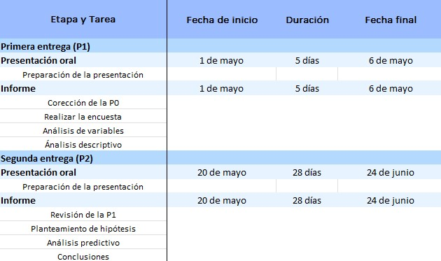

# Introducción

## Relevancia

Es necesario para cualquier centro educativo entender la perspectiva de sus alumnos respecto a este. Teniendo en cuenta que desde el inicio de la pandemia y su posterior época de recuperación económica, tenemos que la deserción universitaria en Lima alcanzó casi el 30%. Según el MINEDU, antes de la pandemia, la tasa de interrupción de estudios universitarios fue de 12.6% en el ciclo 2019-2 y posteriormente, ante la llegada del COVID-19, aumentó a 18.3% para el semestre 2020-1. A su vez, teniendo en cuenta que la retención del alumnado es uno de los factores más importantes en los que se puede centrar cualquier centro educativo, este estudio también puede ayudar a entender la opinión de los alumnos frente a su universidad y encontrar posibles áreas de mejora.

## Planificación

**Objetivos**

*Objetivo general*:

Identificar los posibles factores de deserción que posean los alumnos de pre-grado desde primer a noveno ciclo en el periodo académico 2022-1.

*Objetivos específicos*:

1.  Obtener la media, mediana y moda de las edades de los encuestados.

2.  Encontrar una relación entre la edad de los encuestados y sus deseos de retirarse de la universidad.

3.  Revisar la relación entre los deseos de retirarse de la universidad y motivos por los cuales lo harían.

4.  Hallar una relación entre la cantidad de horas de sueño promedio y los índices de desgaste emocional.

5.  Revisar la relación entre tener como posible motivo de deserción los altos y costos y la escala de pago en la que se encuentra el o la estudiante.

6.  Establecer una relación entre personas que si desertarían o tal vez desertarían en base a su desgaste emocional y promedio ponderado.

**Tabla**



**Diagrama de Grant**

```{r}
data <- data.frame(Entrega = c('P1', 'P1', 'P1', 'P1', 'P2', 'P2', 'P2'),
Inicio = c("28/04", "01/05", "04/05","06/05", "15/06", "19/06", "24/06"),
Fin = c("29/04", "03/05", "05/05","06/05", "17/06", "20/06", "24/06"),
Actividad = c("Planteamiento de la P1", "Difundir la encuesta", "Procesamiento de los datos","Presentación oral", "Planteamiento de hipótesis", "Análisis y conclusiones finales", "Presentación final"))

data$Inicio <- as.Date(data$Inicio,'%d/%m')
data$Fin <- as.Date(data$Fin,'%d/%m')

if(!require(ggplot2)){install.packages('ggplot2')}
ggplot(data, aes(x=Inicio, xend=Fin, y=Entrega, yend=Entrega, color=Actividad)) +
  geom_segment(size=8)+ theme(axis.text.x = element_text(angle = 90, vjust = 0.5, hjust=1),legend.position='top',legend.title=element_text(size=8), legend.text=element_text(size=7))+  scale_x_date(date_breaks = "3 day", date_minor_breaks = "1 week", date_labels = "%d/%m") 
```

# Datos

## Proceso de recolección de datos

Al ser este un estudio en donde la información se obtendrá mediante encuestas, lo primero que se hizo fue difundir mediante las redes sociales de los integrantes del grupo, en estados de ***WhatsApp e Instagram***, compartiendo el link del forms y explicando de manera breve que es lo que buscamos con este trabajo. Mediante esta primera parte de la difusión logramos alcanzar un 40% de nuestro objetivo (200 encuestados). Después para conseguir más respuestas procedimos a encuestar al alumnado cuando se disolvió el método de ingreso a la universidad mediante grupos divididos por apellidos. Se encuestó a estudiantes que se encontraban en el piso 6 y piso 1, además de otros alumnos que comparten cursos los miembros del equipo, mediante lo cual alcanzamos el 75% de nuestra meta. Finalmente, decidimos volver a difundir la encuesta a personas que comparten los mismos talleres extracurriculares (clubs) que los integrantes.

## Población, muestra, y muestreo

**Población**

Nuestra población es de todos los estudiantes que se encuentran en UTEC estudiando un pre-grado desde primer a noveno ciclo en el periodo 2022-1.

**Muestra**

Nuestra muestra obtenida fue de *203* alumnos de pre-grado de la UTEC, consistente de alumnos que van desde el primer al noveno ciclo de las doce (12) carreras brindadas por la UTEC para el pre-grado con edades que oscilan desde los 16 hasta los 42 años.

**Tamaño de error muestral**

Tomando de referencia el censo realizado en el periodo académico 2021-1 tenemos que en la Universidad de Ingeniería y Tecnología (UTEC) se encuentran cursando *3475* alumnos de pre-grado. Teniendo una muestra de *203* alumnos y recordando la fórmula para obtener el error muestral **( puntuación z \* (desviación estándar / raíz del tamaño de la muestra) )** podemos realizar dos evaluaciones. La primera, teniendo en consideración que se quiera un nivel de confianza de *95* nos dejaría un error margen de error de 6.68%. La segunda prueba por hacer es teniendo en consideración un nivel de confianza de *85*, lo que nos daría un margen de error de 4.90%. Viendo que el nivel de confianza más apropiado es la de 95, pero que nuestro margen de error excede el 5% podemos realizar la observación de que nuestro tamaño de muestra debería de ser de mínimo ***346*** para lograr un margen de error de 5% en un nivel de confianza de 95 y de dicha manera obtener una encuesta más representativa.

**Muestreo**

El tipo de muestreo que hemos utilizado para esta investigación es el ***muestreo por conveniencia***. Lo anterior debido a que, siendo la población de la universidad extensa, se prefirió que no sea totalmente aleatorio por la alta cantidad de tiempo que requiere, por lo que se optó por tomar como conjunto muestral a jóvenes del entorno cercano a los investigadores, es decir, gente con la que se comparte clases, círculo amical, compañeros de actividades extracurriculares y estudiantes que frecuentan lugares en común con los integrantes del grupo.

## Variables

Lo que hicimos primero fue separar las variables en base a la información que nos brindaban, esto fue en: General, Desempeño académico, Aspecto Financiero, Salud, Emocional y Deserción.

**General** :

```{r}
General <- read.csv("Variables_Generales.csv")
General
```

**Desempeño académico** :

```{r}
Academico <- read.csv("Variables_Academicas.csv")
Academico
```

**Aspecto Financiero** :

```{r}
Financiero <- read.csv("Variables_Economicas.csv")
Financiero
```

**Salud** :

```{r}
Salud <- read.csv("Variables_Salud.csv")
Salud
```

**Emocional** :

```{r}
Emocional <- read.csv("Variables_Emocionales.csv")
Emocional
```

**Deserción** :

```{r}
Desercion <- read.csv("Variables_Desercion.csv")
Desercion
```

## Limpieza de base de datos

Lo primero que podríamos hacer es realizar una inicialización de las librerías que necesitaremos para trabajar en nuestro informe:

```{r, message=FALSE}
library(readr)
library(dplyr)
```

Lo segundo que hicimos fue realizar un pre-procesamiento de la data obtenida de la encuesta y llevada a un documento de Google:

```{r}
DF0 <- read_csv("Datos_Iniciales.csv")
```

En el anterior archivo csv se utilizó un pre-procesamiento manual de parte de los miembros del grupo para la modificación de las columnas *'Selecciona las frases que te identifican esta semana'*, '*¿Con qué sentimientos te identificas antes de dar un examen, PC, o test semanal?*' y '¿*Con qué sentimientos te identificas en la época de parciales?*'

Dicho procesamiento fue realizado en base a lo previamente especificado en la parte de **Variables - Emocional**, en donde se le había realizado una designación inicial a las oraciones y sentimientos. Por lo que una vez modificado el archivo nos quedamos con lo siguiente:

```{r}
library("readr")
DF <- read_csv("Datos_Finales.csv")
```

Lo siguiente que hacemos es verificar el estado de nuestras variables, es decir, revisar si R lee los datos de la manera que queremos que lo haga

```{r}
spec(DF)
```

Teniendo que los únicos datos que se deberían de limpiar son: "Género", "Promedio ponderado", "Lo gastado en asesorías", "Horas de sueño promedio" y "Motivos por los que se dejaría la universidad", empezaremos a hacer la limpieza en dicho orden. Por lo cual les cambiamos el nombre para proceder con un manejo más sencillo de estas:

```{r}
DF %>% rename (Gen = Género
               , Prom = `Promedio ponderado`
               , Asesorías = `¿Cuánto has gastado en asesorías adicionales para tus cursos este ciclo?`
               , Sueño = `¿Cuántas son tus horas de sueño promedio?`
               , Motivos = `Si la respuesta anterior es sí, ¿Por qué motivos?`)
```

Ya procediendo con la limpieza de los datos tenemos lo siguiente:

*Género*:

```{r}
DF$Género[DF$Género == "no binario"] <- "No Binario"
DF$Género[DF$Género == "No binario"] <- "No Binario"
```

```{r}
DF$Género <- gsub("16", "", DF$Género)
DF$Género[DF$Género == ""] <- NA
```

Comprobamos que nuestra limpieza haya sido efectiva mediante:

```{r}
unique(DF$Género)
```

*Promedio ponderado*:

```{r}
unique(DF$`Promedio ponderado`)
class(DF$`Promedio ponderado`)
```

Nos damos cuenta que nuestra variable ha sido considerada como un *character*, por lo que procedemos a su cambio y consiguiente limpieza:

```{r}
DF$`Promedio ponderado` <- gsub("00", "", DF$`Promedio ponderado`)
DF$`Promedio ponderado` <- gsub("20", "", DF$`Promedio ponderado`)
```

```{r}
DF$`Promedio ponderado`[DF$`Promedio ponderado` == ""] <- NA
```

```{r}
DF$`Promedio ponderado`[DF$`Promedio ponderado` == "15."] <- "15"
```

```{r}
DF$`Promedio ponderado`<- as.numeric(DF$`Promedio ponderado`)
```

Y volvemos a verificar nuestros datos con un:

```{r}
unique(DF$`Promedio ponderado`)
class(DF$`Promedio ponderado`)
```

*Gasto en asesorías*:

```{r}
unique(DF$`¿Cuánto has gastado en asesorías adicionales para tus cursos este ciclo?`)
class(DF$`¿Cuánto has gastado en asesorías adicionales para tus cursos este ciclo?`)
```

Para esta variable encontramos algunos datos extremadamente atípicos que pueden representarse de un mejor manera mediante una gráfica:

```{r}
plot(DF$`¿Cuánto has gastado en asesorías adicionales para tus cursos este ciclo?`, ylab = "Gastos en asesorías (S./)", xlab="Frecuencia", main="Gastos en asesorías")
```

Por lo que nos damos cuenta que hay que realizar una limpieza un poco más intensiva:

```{r}
DF$`¿Cuánto has gastado en asesorías adicionales para tus cursos este ciclo?`[DF$`¿Cuánto has gastado en asesorías adicionales para tus cursos este ciclo?` == "10000"] <- "0"
DF$`¿Cuánto has gastado en asesorías adicionales para tus cursos este ciclo?`[DF$`¿Cuánto has gastado en asesorías adicionales para tus cursos este ciclo?` == "0.5"] <- "0"
DF$`¿Cuánto has gastado en asesorías adicionales para tus cursos este ciclo?`[DF$`¿Cuánto has gastado en asesorías adicionales para tus cursos este ciclo?` == "1"] <- "0"
DF$`¿Cuánto has gastado en asesorías adicionales para tus cursos este ciclo?`[DF$`¿Cuánto has gastado en asesorías adicionales para tus cursos este ciclo?` == "2"] <- "0"
DF$`¿Cuánto has gastado en asesorías adicionales para tus cursos este ciclo?`[DF$`¿Cuánto has gastado en asesorías adicionales para tus cursos este ciclo?` == "3"] <- "0"
DF$`¿Cuánto has gastado en asesorías adicionales para tus cursos este ciclo?`[DF$`¿Cuánto has gastado en asesorías adicionales para tus cursos este ciclo?` == "4"] <- "0"
DF$`¿Cuánto has gastado en asesorías adicionales para tus cursos este ciclo?`[DF$`¿Cuánto has gastado en asesorías adicionales para tus cursos este ciclo?` == "00"] <- "0"
```

Después procedemos a realizar el cambio de carácter a numérico:

```{r}
DF$`¿Cuánto has gastado en asesorías adicionales para tus cursos este ciclo?`<- as.numeric(DF$`¿Cuánto has gastado en asesorías adicionales para tus cursos este ciclo?`)
```

Verificamos que hayamos hecho nuestra limpieza de una manera adecuada:

```{r}
unique(DF$`¿Cuánto has gastado en asesorías adicionales para tus cursos este ciclo?`)
class(DF$`¿Cuánto has gastado en asesorías adicionales para tus cursos este ciclo?`)
```

*Sueño*:

```{r}
unique(DF$`¿Cuántas son tus horas de sueño promedio?`)
```

```{r}
DF$`¿Cuántas son tus horas de sueño promedio?` <- gsub("0", "", DF$`¿Cuántas son tus horas de sueño promedio?`)
DF$`¿Cuántas son tus horas de sueño promedio?` <- gsub("1", "", DF$`¿Cuántas son tus horas de sueño promedio?`)
DF$`¿Cuántas son tus horas de sueño promedio?`[DF$`¿Cuántas son tus horas de sueño promedio?` == "6.5"] <- "6.3"
DF$`¿Cuántas son tus horas de sueño promedio?`[DF$`¿Cuántas son tus horas de sueño promedio?` == "4.5"] <- "4.3"
```

```{r}
DF$`¿Cuántas son tus horas de sueño promedio?`[DF$`¿Cuántas son tus horas de sueño promedio?` == ""] <- NA
```

Finalmente cambiamos el valor de la variable de caractér a numérico y verificamos que hayamos hecho el procedimiento correcto:

```{r}
DF$`¿Cuántas son tus horas de sueño promedio?`<-as.numeric(DF$`¿Cuántas son tus horas de sueño promedio?`)
```

```{r}
unique(DF$`¿Cuántas son tus horas de sueño promedio?`)
class(DF$`¿Cuántas son tus horas de sueño promedio?`)
```

*Motivos de deserción*:

Procesamos todos los datos que se deban limpiar y los cambiamos:

```{r}
DF$`Si la respuesta anterior es sí, ¿Por qué motivos?`[DF$`Si la respuesta anterior es sí, ¿Por qué motivos?` == "Marque no"] <- "No dejaría la universidad"
DF$`Si la respuesta anterior es sí, ¿Por qué motivos?`[DF$`Si la respuesta anterior es sí, ¿Por qué motivos?` == "Respondí que no"] <- "No dejaría la universidad"
DF$`Si la respuesta anterior es sí, ¿Por qué motivos?`[DF$`Si la respuesta anterior es sí, ¿Por qué motivos?` == "."] <- "No dejaría la universidad"
DF$`Si la respuesta anterior es sí, ¿Por qué motivos?`[DF$`Si la respuesta anterior es sí, ¿Por qué motivos?` == "Ninguno."] <- "No dejaría la universidad"
DF$`Si la respuesta anterior es sí, ¿Por qué motivos?`[DF$`Si la respuesta anterior es sí, ¿Por qué motivos?` == "Marque no :)"] <- "No dejaría la universidad"
DF$`Si la respuesta anterior es sí, ¿Por qué motivos?`[DF$`Si la respuesta anterior es sí, ¿Por qué motivos?` == "respondí no"] <- "No dejaría la universidad"
DF$`Si la respuesta anterior es sí, ¿Por qué motivos?`[DF$`Si la respuesta anterior es sí, ¿Por qué motivos?` == "No la considero dejar"] <- "No dejaría la universidad"
DF$`Si la respuesta anterior es sí, ¿Por qué motivos?`[DF$`Si la respuesta anterior es sí, ¿Por qué motivos?` == "No dejare"] <- "No dejaría la universidad"
DF$`Si la respuesta anterior es sí, ¿Por qué motivos?`[DF$`Si la respuesta anterior es sí, ¿Por qué motivos?` == "No pienso dejar la universidad"] <- "No dejaría la universidad"
DF$`Si la respuesta anterior es sí, ¿Por qué motivos?`[DF$`Si la respuesta anterior es sí, ¿Por qué motivos?` == "No lo dejaría"] <- "No dejaría la universidad"
DF$`Si la respuesta anterior es sí, ¿Por qué motivos?`[DF$`Si la respuesta anterior es sí, ¿Por qué motivos?` == "Ninguno"] <- "No dejaría la universidad"
DF$`Si la respuesta anterior es sí, ¿Por qué motivos?`[DF$`Si la respuesta anterior es sí, ¿Por qué motivos?` == "No"] <- "No dejaría la universidad"
DF$`Si la respuesta anterior es sí, ¿Por qué motivos?`[DF$`Si la respuesta anterior es sí, ¿Por qué motivos?` == "No pienso en ello"] <- "No dejaría la universidad"
DF$`Si la respuesta anterior es sí, ¿Por qué motivos?`[DF$`Si la respuesta anterior es sí, ¿Por qué motivos?` == "no"] <- "No dejaría la universidad"
DF$`Si la respuesta anterior es sí, ¿Por qué motivos?`[DF$`Si la respuesta anterior es sí, ¿Por qué motivos?` == "Puse no"] <- "No dejaría la universidad"
DF$`Si la respuesta anterior es sí, ¿Por qué motivos?`[DF$`Si la respuesta anterior es sí, ¿Por qué motivos?` == "-"] <- "No dejaría la universidad"
DF$`Si la respuesta anterior es sí, ¿Por qué motivos?`[DF$`Si la respuesta anterior es sí, ¿Por qué motivos?` == "Nada"] <- "No dejaría la universidad"
DF$`Si la respuesta anterior es sí, ¿Por qué motivos?`[DF$`Si la respuesta anterior es sí, ¿Por qué motivos?` == "no considero dejar la universidad"] <- "No dejaría la universidad"
DF$`Si la respuesta anterior es sí, ¿Por qué motivos?`[DF$`Si la respuesta anterior es sí, ¿Por qué motivos?` == "Dije no xd"] <- "No dejaría la universidad"
DF$`Si la respuesta anterior es sí, ¿Por qué motivos?`[DF$`Si la respuesta anterior es sí, ¿Por qué motivos?` == "Ninguna"] <- "No dejaría la universidad"
DF$`Si la respuesta anterior es sí, ¿Por qué motivos?`[DF$`Si la respuesta anterior es sí, ¿Por qué motivos?` == "deporte"] <- "Deporte"
DF$`Si la respuesta anterior es sí, ¿Por qué motivos?`[DF$`Si la respuesta anterior es sí, ¿Por qué motivos?` == "No hay ingles"] <- "No hay inglés"
DF$`Si la respuesta anterior es sí, ¿Por qué motivos?`[DF$`Si la respuesta anterior es sí, ¿Por qué motivos?` == "NO"] <- "No dejaría la universidad"
DF$`Si la respuesta anterior es sí, ¿Por qué motivos?`[DF$`Si la respuesta anterior es sí, ¿Por qué motivos?` == "La respuesta anterior fue \"No\""] <- "No dejaría la universidad"
DF$`Si la respuesta anterior es sí, ¿Por qué motivos?`[DF$`Si la respuesta anterior es sí, ¿Por qué motivos?` == "No, porque me gusta la universidad"] <- "No dejaría la universidad"
DF$`Si la respuesta anterior es sí, ¿Por qué motivos?`[DF$`Si la respuesta anterior es sí, ¿Por qué motivos?` == "No planeo dejar la"] <- "No dejaría la universidad"
DF$`Si la respuesta anterior es sí, ¿Por qué motivos?`[DF$`Si la respuesta anterior es sí, ¿Por qué motivos?` == "a"] <- "No dejaría la universidad"
DF$`Si la respuesta anterior es sí, ¿Por qué motivos?`[DF$`Si la respuesta anterior es sí, ¿Por qué motivos?` == "Ya voy a terminar la carrera, falta poco"] <- "No dejaría la universidad"
DF$`Si la respuesta anterior es sí, ¿Por qué motivos?`[DF$`Si la respuesta anterior es sí, ¿Por qué motivos?` == "Seguir luchando por mis sueños"] <- "No dejaría la universidad"
```

Después comprobamos si es que realizamos la limpieza correctamente con:

```{r}
unique(DF$`Si la respuesta anterior es sí, ¿Por qué motivos?`)
```

# Análisis descriptivo

Con la data ya limpia y corregida, podemos proceder a realizar nuestro análisis descriptivo de las distintas variables que resulten más importantes para nuestra investigación y relacionarlas.

## Media, mediana y moda de edad

Con esto podemos encontrar la tendencia de los alumnos de la universidad que respondieron nuestra encuesta.

```{r}
mode <- function(x) {
   return(as.numeric(names(which.max(table(x)))))
}
```

```{r}
media <- mean(DF$Edad)
edadSort <- sort(DF$Edad)
mediana <- median(edadSort)
moda <- mode(DF$Edad)

titulo <- "Histograma de las edades de los alumnos"
subtitulo <- paste("Media =",round(media,2), " Mediana =",mediana, " Moda =",moda)

ggplot(data = DF, mapping = aes(x=Edad)) +
  geom_histogram(bins=50) +
   ggtitle(titulo, subtitle = subtitulo) +
  xlab('Edades') + ylab('Frecuencia') +
  geom_vline(aes(xintercept = media,
                  color = "media"),
              linetype = "dashed",
              size = 1)  +
   geom_vline(aes(xintercept = mediana,
                  color = "mediana"),
              linetype = "dashed",
              size = 1) +
   geom_vline(aes(xintercept = moda,
                  color = "moda"),
              linetype = "dashed",
              size = 0.5) 
```

Dentro de nuestros datos, encontramos que tenemos una media de edad de 19.05 años, además de una media de 18 años y una moda con la misma cantidad.

## Relación edad con si busca retirarse de la universidad

```{r}
DF_desertar <-filter(DF, DF$`¿Considerarías dejar la universidad?` != "No")
plot(factor(DF_desertar$`¿Considerarías dejar la universidad?`), DF_desertar$Edad, xlab = "Elección", ylab = "Edad", main = "Edades de alumnos que piensan desertar de la universidad")
```

**Análisis**

Con esta gráfica podemos apreciar que el querer retirarse de la universidad, reside principalmente entre las edades de 18 a 20 años, que es la edad donde se cursan los primeros semestres normalmente.

## Relación entre desertar de la universidad y motivos.

```{r}
DF_mod <- filter(DF, DF$`¿Considerarías dejar la universidad?` !="No" & DF$`Si la respuesta anterior es sí, ¿Por qué motivos?` != "No dejaría la universidad")

Desertar <- table(DF_mod$`¿Considerarías dejar la universidad?`,DF_mod$`Si la respuesta anterior es sí, ¿Por qué motivos?`)

colnames(Desertar) <- c("Alto nivel de dificultad", "Altos costos","Cansancio", "Circunstancias familiares","Deporte", "Desgaste emocional","No hay inglés", "Todo" )

x <-barplot(Desertar, las = 2, xaxt="n", col=c("red", "yellow"), main = "Motivos para desertar de la universidad")

text(cex=0.7, x=x, y=-1, colnames(Desertar), xpd=TRUE, srt=45, pos=2)
legend(x = "topright", legend = c("Tal vez", "Sí"), fill=c("yellow", "red"), title="¿Desertará?")
```

**Análisis**

Con esta gráfica, podemos concluir que existe una relación clara, entre el "Desgaste emocional" y "Altos costos" con relación a las probabilidades de que los alumnos si piensen en retirarse. Por otro lado para los que están en la opción de "Tal vez" se puede apreciar el mismo comportamiento.

## Relación de horas de sueño con el desgaste emocional

Al momento de realizar las entrevistas y revisar la data inicial pudimos observar que existe un problema con el desgaste emocional, por lo que podríamos relacionarlo con las horas de sueño de cada alumno.

```{r}
DF_dormir <- filter(DF, DF$`Si la respuesta anterior es sí, ¿Por qué motivos?` == "Desgaste emocional")

hist(DF_dormir$`¿Cuántas son tus horas de sueño promedio?`, main = "Horas de sueño de alumnos con desgaste emocional", ylab = "Densidad", xlab = "Horas de sueño", col = "lightcyan", freq = F)
lines(density(DF_dormir$`¿Cuántas son tus horas de sueño promedio?`), lwd = 2, col = 'blue')
```

```{r}
mode(DF$`¿Cuántas son tus horas de sueño promedio?`)
```

**Análisis**

De primera estancia se puede ver como el promedio de horas de sueño se debería de localizar entre las 5 a 7 horas de sueño promedio, a su vez, obteniendo la moda podemos darnos cuenta que el valor que más se repite, tal y como se muestra en el gráfico, son 6 horas de sueño como valor que más fue repetido. Analizando el gráfico encontramos, que los alumnos que mencionan un desgaste emocional y lo pueden tomar como razón para retirarse de la universidad, no duermen la cantidad de horas correctas que va de 7 a 8 horas, por lo que podemos marcar una relación entre la poca cantidad de horas que duermen a querer retirarse de la universidad. Además podemos darnos cuenta que la mayoría de los estudiantes duermen entre 5 y 6 horas, situación que no es beneficiosa para la salud.

## Relación de altos costos con escala de pago

```{r}
DF_pago <- filter(DF, DF$`Si la respuesta anterior es sí, ¿Por qué motivos?` == "Altos costos")
DF_pago <- table(DF$`¿Cuentas con algún tipo de Beca?`, DF$`¿En qué escala de pago te encuentras?`)
barplot(DF_pago , ylab = "Cantidad de alumnos", xlab = "Escala de pago", col = c("red", "yellow"), main="Alumnos por escala que consideran un pago alto")
legend(x = "topright", legend = c("Sí", "No"), fill=c("yellow", "red"), title="¿Tiene beca?")
```

**Análisis**

A primera vista,se tiene que la moda de las Escalas de pago de los alumnos es la "E". Dentro del gráfico se puede apreciar, que la mayoría de alumnos que colocó que los precios de su escala son muy altos, en su mayoría pertenecen a la escala "E", además de que en una gran cantidad no disponen de una beca dentro de la universidad. Por otro lado, la cantidad de alumno en la escala "C" que consideran el coste de su pago como muy alto, y que no disponen de una beca, es casi el total.

## Relación de desgaste emocional con promedio ponderado

Dándonos cuenta que el número en cuanto a promedios ponderados que más se repite entre los encuestados podemos proceder a realizar una gráfica para revisar si se cumple la relación de que la mayor cantidad de alumnos tiene promedios cercanos a la moda.

```{r}
mode(DF$`Promedio ponderado`)
```

```{r}
DF_prom <- filter(DF, DF$`Si la respuesta anterior es sí, ¿Por qué motivos?` == "Desgaste emocional" & DF$`¿Considerarías dejar la universidad?` != "No")
DF_prom <- table(DF_prom$`¿Considerarías dejar la universidad?`,cut(DF_prom$`Promedio ponderado`, breaks = c(10, 12, 14, 16, 18)))
barplot(DF_prom, ylab = "Cantidad de alumnos", xlab = "Promedios ponderados", col = c("red", "yellow" ), main = "Promedios ponderados de alumnos que piensan desertar")
legend(x = "topright", legend = c("Tal vez", "Sí"), fill=c("yellow", "red"), title="¿Desertará?")
```

Pudimos darnos cuenta que, efectivamente, la mayor cantidad de alumnos poseen un promedio ponderado cercano a la moda obtenida. De igual manera, podemos relacionar la relevancia de lo obtenido en la gráfica con el grado de dificultad que se le considera a los cursos

```{r}
mode(DF$`Grado de dificultad promedio de los cursos de este ciclo`)
mean(DF$`Grado de dificultad promedio de los cursos de este ciclo`)
```

Teniendo que el promedio y la moda de la dificultad promedio son parecidos, podemos proceder a realizar otra gráfica que se encargue de evaluar lo mismo que la anterior, pero considerando el grado de dificultad que consideran los estudiantes respecto a los cursos a los que se matricularon este ciclo en vez del promedio ponderado.

```{r}
DF_prom <- filter(DF, DF$`Si la respuesta anterior es sí, ¿Por qué motivos?` == "Desgaste emocional" & DF$`¿Considerarías dejar la universidad?` != "No")
DF_prom <- table(DF_prom$`¿Considerarías dejar la universidad?`,cut(DF_prom$`Grado de dificultad promedio de los cursos de este ciclo`, breaks = c(2, 4, 6, 8, 10)))
barplot(DF_prom, col = c("red", "yellow"), ylab = "Cantidad de alumnos", xlab = "Grado de dificultad de los cursos matriculados", main = "Dificultad de cursos de alumnos que piensan desertar")
legend(x = "topright", legend = c("Tal vez", "Sí"), fill=c("yellow", "red"), title="¿Desertará?")
```

**Análisis** En cuanto a esta relación de ambas variables del primer gráfico, segmentamos las notas para una mayor facilidad de interpretación. Por lo que, encontramos que en gran mayoría de los alumnos con promedio de 14 a 16, tienen un mayor desgaste emocional, pudiendo concluir que esto es debido a un sobre-esfuerzo que deben realizar para alcanzar dicho promedios.Para el segundo gráfico pudimos observar que de todos los alumnos que marcaron que se retirarían debido al Desgaste Emocional, la mayoría considera que la dificultad de los cursos; en una escala del 1 al 10, siendo 1 fácil y 10 muy difícil; van por sobre el 6.

# Análisis probabilístico

## Variables aleatorias conocidas (Modelos teóricos)

**Variable: Edad**

Consideremos que queremos elegir 45 estudiantes al azar, considerando que en UTEC las aulas son en su mayoría de 45 estudiantes. Planteamos como caso de éxito el hecho de que los estudiantes elegidos sean mayores de edad (+18), ya que de acuerdo a nuestra muestra, son quienes participaron más en nuestra encuesta.

La probabilidad de que tengan de 18 años, para nuestro caso sería de 79/203, equivalente a 0.389 aproximadamente. Entonces el **Modelo Binomial** se vería de la siguiente manera:

X -\> número de estudiantes mayores de 18 años en una aula de 45 alumnos

$$\mathbb{X}\sim \mathbb {Bin}(203,0.389)$$

n -\> número de muestras (45 encuestados)

p -\> probabilidad de que la persona seleccionada tenga 18 años a más (79/203)

**Ejemplo:** Si queremos saber la probabilidad de que por lo menos 23 de ellos sean mayores de edad (+18) podemos plantear lo siguiente:

```{r}
pbinom(22, size = 45, prob = 0.329, lower.tail = FALSE)
```

**Variable: Deseo de deserción**

Consideremos que queremos elegir a 100 estudiantes al azar, aproximadamente el número de personas que circulan en el Piso 6. Planteamos como caso de éxito el hecho de que **SÍ** consideren desertar, ya que es el tema de interés de nuestro estudio, puede plantearse con un **Modelo Binomial**.

La probabilidad de que hayan respondido **SÍ**, para nuestro caso sería de 39/203, equivalente a 0.192 aproximadamente. Entonces el **Modelo Binomial** se define de la siguiente manera:

X -\> Número de alumnos que SÍ decidirían desertar en un conjunto de 100 estudiantes del Piso 6

$$\mathbb{X}\sim \mathbb {Bin}(100,0.192)$$

n -\> número de muestras (100 encuestados)

p -\> probabilidad de que la persona seleccionada SÍ desee desertar (79/203)

La probabilidad de que hayan respondido **SÍ o TAL VEZ**, para nuestro caso sería de 110/203, equivalente a 0.542 aproximadamente. Entonces el **Modelo Binomial** se vería de la siguiente manera:

X -\>Número de alumnos que **SÍ o TAL VEZ** decidirían desertar en un conjunto de 100 estudiantes del Piso 6.

$$\mathbb{X} \sim \mathbb {Bin}(100,0.542)$$

n -\> número de muestras (100 encuestados)

p -\> probabilidad de que la persona seleccionada **SÍ o TAL VEZ** desee desertar (110/203)

**Ejemplo:** queremos saber la probabilidad de que por lo menos 30 de ellos deseen o se planteen desertar para SÍ y para SÍ y TAL VEZ

Para el caso de que **SÍ** estén seguros de desertar:

```{r}
pbinom(29, size =100, prob = 0.192, lower.tail = FALSE)
```

Para el caso de **SÍ** estén seguros o de que **TAL VEZ** consideren desertar:

```{r}
pbinom(29, size =100, prob = 0.542, lower.tail = FALSE)
```

**Variable: Satisfacción con Rutina diaria**

Consideremos que queremos saber cuanto nos demoraríamos en encontrar a alguien que esté completamente satisfecho con su rutina diaria (que hayan marcado un 5 de 5 en satisfacción en nuestra encuesta para la pregunta de "¿Qué tan satisfecho te encuentras con tu rutina actual?") planteando dicha situación como caso de éxito, ya que dicha situación sería la óptima para un alumno universitario que desea estar bien organizado con sus cursos. De dicha manera es que podemos plantear un **Modelo Geométrico.**

La probabilidad de que si están totalmente conformes con sus rutinas es sabiendo que solo 5/203 personas, aproximadamente 0.01, marcaron que se sentían completamente satisfechos con sus rutinas diarias. Entonces nuestro **Modelo Geométrico** se plantearía de la siguiente manera:

X -\> Número de intentos hasta que se detecte a un alumno que haya marcado 5 de 5 en satisfacción completa con su rutina diaria en un grupo de 50 personas

$$\mathbb{X}\sim \mathbb {Geo}(50,0.009)$$

x -\> Cantidad de personas en el grupo

p -\> Probabilidad de que hayan marcado un 5 en la escala de satisfacción

**Ejemplo:** Queremos saber la probabilidad de que no se necesiten probar más de 51 personas (aproximadamente una cuarta parte de la cantidad de personas encuestadas) para encontrar a una persona que esté completamente satisfecha con su rutina diaria actual.

```{r}
dgeom(x=51, prob = 0.01)
```

**Variable: Horas de sueño**

Consideremos que queremos elegir 50 estudiantes al azar, considerando la cantidad de personas que se encuentran en total en la sala de estudios de la UTEC en el Piso 1. Planteamos como caso de éxito el hecho de que duerman entre 6 y 8 horas, ya que estas son un número de horas de sueño apropiadas, podemos plantear un **Modelo Uniforme Continuo**.

La probabilidad de que duerman entre 6 y 8 horas, para nuestro caso sería 136/203, equivalente a 0.662 aproximadamente, entonces el **Modelo Uniforme Continuo** se vería de la siguiente manera:

X -\>Estudiantes que duermen entre 8 y 6 horas entre un grupo de 50 estudiantes en la sala de estudio del Piso 1

$$
F(X) = P(x\leq X) = \begin{cases} & 0\text{ si } X< 2 \\ & \int_{6}^{8}\frac{1}{12-2} \mathit{ dx} = \frac{6-2}{12-2}\text{ si } 2\leq 8\leq 12\\  & 1\text{ si } X\geq 12\end{cases}
$$

min -\> 2 horas

max -\> 12 horas

intervalo -\> 8 - 6 horas

\$\$f(x) = 1/(12-2)\$\$

\$\$P(X) = P(6\\leq x\\leq 8) = \\int\_{6}\^{8}\\frac{1}{10} {dx}\$\$

**Ejemplo:** Queremos saber la probabilidad de que cierta cantidad de alumnos tiene horas de sueño saludables que se encuentran en un intervalo de entre 6 y 8 horas

```{r}
punif(q = 8, min = 2, max = 12) - punif(q = 6, min = 2, max = 12)
```

**Variable: Consideración de altos costos**

Consideremos que queremos elegir a 80 estudiantes al azar, aproximadamente el número de personas que almuerzan en la cafetería de la UTEC. Planteamos como caso de éxito el hecho de que ***SÍ*** consideran que los precios son altos, ya que es uno de los temas de interés de nuestro estudio. Esto podría plantearse con un **Modelo Binomial**.

La probabilidad de que hayan respondido ***SÍ***, para nuestro caso sería de 165/203, equivalente a 0.813 aproximadamente. Entonces el **Modelo Binomial** se vería de la siguiente manera:

X -\> Número de alumnos que SÍ consideran que los precios para las pensiones son altos en un conjunto de 80 estudiantes en el comedor

$$\mathbb{X} \sim \mathbb {Bin}(80,0.813)$$

n -\> número de muestras (80 encuestados)

p -\> probabilidad de que la persona seleccionada ***SÍ*** considera altos precios (165/203)

**Ejemplo:** Queremos saber la probabilidad de que por lo menos 60 de ellos no estén conformes con los altos precios

```{r}
pbinom(59, size =80, prob = 0.813, lower.tail = FALSE)
```

## Variables aleatorias desconocidas (Modelos prácticos)

**Probabilidad de unión**

Calcular la probabilidad de entrevistar al décimo alumno que sea hombre o que duerma menos de 6 horas, en la entrevista número 15 o antes.

Obtenemos la probabilidad de que sean hombres.

```{r}
DF1 <- na.omit(DF)
probHombres <- filter(DF1, DF1$Género == "Hombre")
probHombres <- nrow(probHombres)/nrow(DF1) 
probHombres
```

Obtenemos la probabilidad de que duerman 6 horas.

```{r}
probHoras <- filter(DF1, DF1$`¿Cuántas son tus horas de sueño promedio?` < 6)
probHoras <- nrow(probHoras)/nrow(DF1)
probHoras
```

Ahora, al ser sucesos independientes, ya que se puede volver a entrevistar a la misma persona, por lo que no se reduce la muestra, la probabilidad de la unión sería la siguiente:

$$P(A \cup B) = P(A) + P(B) - P(A \cap B)$$

Calculamos la probabilidad de la unión.

```{r}
probIntersec <- probHombres * probHoras
probUnion <- probHombres + probHoras -probIntersec
probUnion
```

Obtenemos la probabilidad de que el décimo alumno cumpla con ser hombre o que duerma menos de 6 horas, en la entrevista 15 o antes.

Definimos nuestra variable aleatoria:

\$\mathbb{X} : \$Número de reuniones necesarias para entrevistar al décimo alumno que sea hombre o duerma menos de 6 horas

Definimos nuestra distribución

$$\mathbb{X} \sim BinNeg(10, 0.67) $$ Calculamos la probabilidad para:

$$P[\mathbb{X} \leq 15]$$

```{r}
probEntrevistas <- pnbinom(5, size = 10, prob = probUnion, lower.tail = T)
porcentaje <- probEntrevistas * 100
cat(round(porcentaje,2),"%")
```

Obtenemos una probabilidad del 62.68% de entrevistar al décimo alumno hombre o que duerma menos de 6 horas en la entrevista 15 o menos.

**Probabilidad de intersección**

Planteamos lo siguiente, al entrevistar a 30 alumnos de nuestra muestra cual es la probabilidad de que 10 alumnos tengan un promedio menor a 15 y que consideren retirarse ("Tal vez" o "Sí") de la universidad.

En primer lugar, probaremos que los sucesos son independientes.

```{r}
DF1 <- na.omit(DF)
menor15 <- filter(DF1, DF1$`Promedio ponderado` < 15)
probNota <- nrow(menor15)/nrow(DF1)

retirar <- filter(DF1, DF1$`¿Considerarías dejar la universidad?` != "No")
probRetirar <- nrow(retirar)/nrow(DF1)

cond1 <- probNota * probRetirar

probCond <- filter(DF1, DF1$`Promedio ponderado` < 15, DF1$`¿Considerarías dejar la universidad?` != "No")
probCond <- nrow(probCond)/nrow(DF1)
cond2 <- probCond
cat(cond1, " != ", cond2)
```

Comprobamos que son sucesos independientes. Además, dentro de nuestro experimentos, se puede volver a entrevistar a la misma persona.

Calculamos la probabilidad de que la nota sea menor que quince.

```{r}
menor15 <- filter(DF1, DF1$`Promedio ponderado` < 15)
probNota <- nrow(menor15)/nrow(DF1)
probNota
```

Calculamos la probabilidad de que se quieran retirar de la universidad. Al ser eventos disjuntos, podemos calcular la probabilidad al quitar los "No". $$ P(A \cup B) = P(A) + P(B)$$

```{r}
retirar <- filter(DF1, DF1$`¿Considerarías dejar la universidad?` != "No")
probRetirar <- nrow(retirar)/nrow(DF1)
probRetirar
```

Luego, al ser sucesos independientes, podemos calcular su probabilidad de intersección de la siguiente forma. $$ P(A \cap B) = P(A) * P(B)$$

Donde:

-   A = Probabilidad de que el promedio ponderado sea menor a 15

-   B = El alumno considera retirarse de la universidad

Calculamos la intersección:

```{r}
probIntersec <- probNota*probRetirar
probIntersec
```

Luego definimos nuestra variable aleatoria \$\mathbb{X} : \$Cantidad de alumnos con promedio ponderado menor a 15 y que duerman menos de 6 horas en 30 entrevistas

La cual se distribuya binomialmente: $$\mathbb{X} \sim Bin(30, 0.19)$$ Ahora, planteamos La probabilidad. $$P[\mathbb{X} = 10 ]$$ Calculamos:

```{r}
binomial <- pbinom(10, size = 30, probIntersec)
porcentaje <- binomial*100
cat(round(porcentaje,2),"%")
```

Por lo que, para este experimento encontramos que es casi 100% certero.

**Probabilidad condicional**

$$P(A|B) = \frac{P(A \cap B)}{P(B)}$$

a)  Halle la probabilidad de que un estudiante pertenezca al tercer ciclo si estudia ingeniería química. (El cumplimiento de este experimento lo llamaremos éxito)

b)  Halle la probabilidad de que necesitemos tomar 2 estudiantes aleatoriamente para encontrar nuestro primer éxito.

```{r}
#Para resolver "a":
## Como sabemos que la fórmula para hallar una probabilidad condicional es: P(A|B)=P(A ∩ B)/P(B), tomaremos A=Estudiante del tercer ciclo, y B=Estudiante de Ingeniería Química.
### Para hallar P(A ∩ B) aplicamos la siguiente función:
table(General$Carrera, General$Ciclo)
### Así encontramos la cantidad de encuestados que estudian Ingeniería química y se encuentra en tercer ciclo (19), y lo dividiremos entre el total de encuestados para obtener dicha probabilidad.
P1<- 19/203
###Ahora hallaremos P(B) mediante la siguiente función:
round(table(General$Carrera)/nrow(General),digits=2)
### Así obtendremos que la probabilidad de que un encuestado pertenezca a la carrera de Ingeniería química es de 0.11
P2<- 0.11
##Ya solo queda despejar en P(A|B)=P(A ∩ B)/P(B):
P<- round(P1/P2, digits = 2)
P
```

```{r}
#Para resolver "b":
##Nos percatemos que nos piden aplicar el modelo geométrico, por lo que simplemente debemos de aplicar la función:
round(dgeom(x=1, prob=P), digits = 2)
```

**Probabilidad Total**

$$P(a) = \sum P(b_i)*P(a|b_i)$$

a)  Si a partir de las personas las cuales respondieron que no considerarían dejar la universidad se realizan diferentes sorteos dependiendo a la escala que pertenezcan con las siguientes probabilidades de ganarlos: A -\> 70% B -\> 50% C -\> 30% D -\> 10% E -\> 3% ¿Cuál es la probabilidad de ganar el sorteo en el que participen? (El cumplimiento de este experimento lo llamaremos éxito).

b)  Calcule la probabilidad de que se requieran tomar 20 estudiantes de manera aleatoria para conseguir 3 éxitos.

```{r}
#Para resolver "a":
##Como sabemos que estamos trabajando con probabilidad total, utilizaremos la ecuación: P(a) = Σ P(bi) * P(a | bi). Donde primero debemos encontrar la probabilidad de cada escala para todos aquellos que no piensen retirarse de la universidad, para ello aplicamos:
table(General$Â.ConsiderarÃ.as.dejar.la.universidad., General$Â.En.quÃ..escala.de.pago.te.encuentras.)
##Entonces podemos definir lo siguiente:
PNoA <- round(8/203, digits = 2)
PNoB <- round(9/203, digits = 2)
PNoC <- round(16/203, digits = 2)
PNoD <- round(18/203, digits = 2)
PNoE <- round(42/203, digits = 2)
##Ahora lo que haremos será simplemente despejar en nuestra ecuación P(a) = Σ P(bi) * P(a | bi):
PP <- round(PNoA*0.7 + PNoB*0.5 + PNoC*0.3 + PNoD*0.1 + PNoE*0.03, digits = 3)
PP
```

```{r}
#Para resolver "b":
##Simplemente aplicamos nuestra función para distribución del tipo binomial negativa
round(dnbinom(x=17, size=3, prob=0.087), digits = 2)
```

# Conclusiones

## Conclusiones respecto al análisis

Podemos darnos cuenta de 5 cosas principales a partir de este estudio.

1.  **Primera conclusión:** La gran mayoría de las personas que si desearían desertar o que no niegan que puedan hacerlo en algún momento son de ciclos menores, por lo menos lo que se puede interpretar según sus edades. También teniendo que gran parte de nuestra muestra son personas de 18 años, es posible llegar a interpretar que al ser gente joven de ciclos menores los que no estarían opuestos a desertar se traduciría a que al no haber formado todavía una conexión con la universidad y tampoco estar avanzados en sus carreras no se oponen a volver a empezar desde cero.

2.  **Segunda conclusión:** El mayor motivo por el cual el alumnado se iría de la universidad es por el desgaste emocional que esta le ocasiona a sus alumnos. Estos nos confirma que una de las variables más importantes que pueden aportarle información relevante e interesante a nuestro estudio son las que describen la situación emocional de los alumnos, es decir, la de "Sentimientos antes de quizzes, tareas o entregas", "Sentimientos en parciales", "Sentimientos positivos la ultima semana" y la variable de "Sentimientos negativos la ultima semana".

3.  **Tercera conclusión:** Teniendo como principal potencial causa de deserción el *Desgaste emocional* que sienten los alumnos, podemos darnos cuenta que existe una relación casi directa entre las personas que sienten mayores emociones negativas, las correspondientes a un desgaste emocional, a su vez también son aquellas que tienen un horario de sueño corto. Por lo que podríamos decir que el cansancio tanto físico como psicológico pueden ser factores determinantes de la decisión de los alumnos de cambiarse de centro educativo,

4.  **Cuarta conclusión:** Dándonos cuenta que como segunda más alta posible causa de deserción se encuentra *Altos costos*, podemos darnos cuenta que la mayoría de alumnos que seleccionaron dicha opción se encuentran en la categoría de pago E, justamente la categoría con la menor pensión, en la cual también un poco más de la mitad de alumnos no cuentan con beca.

5.  **Quinta conclusión:** Podemos apreciar una relación entre el índice de desgaste emocional y los promedios ponderados de los alumnos, pero hubieron cosas interesantes a la hora de analizar dicha información. Se pudo observar que la mayoría de personas con promedios altos (entre 16 y 18) no consideran sentir tanto desgaste emocional a comparación de otros alumnos que tienen un promedio más normal (entre 14 y 16). Respecto a lo anterior podríamos decir que un posible causante de dicha diferencia podría ser el nivel de organización que utilizan los alumnos con mejores ponderados.A su vez, también encontramos un patrón respecto a cómo la gran mayoría de alumnos que consideraría abandonar la universidad considera que los cursos en los que se encuentra matriculados son de alta o muy alta dificultad.

## Conclusiones respecto al trabajo

A lo largo del desarrollo de nuestro proyecto hemos recaudado varios aprendizajes los cuales nos han sido de suma importancia. Por un lado, y el aprendizaje más notorio, hemos aprendido a utilizar el programa "RStudio", del cual la mayoría de nosotros no teníamos ni idea de su funcionalidad; sin embargo, ahora lo conocemos casi a la perfección. También, hemos aprendido a limpiar nuestras fuentes de datos, cosa que nos permite facilitar el análisis final de nuestras encuestas, a su vez comprendimos de lo importante que es contar con precisión a la hora de realizar cuestionarios, pues sin esta, las respuestas pueden ser muy variadas y hasta obtener respuestas sin relación a lo que se requería. Finalmente, el uso de histogramas, diagramas de barras, etc., nos permitió aprender la función de cada uno de estos, cómo utilizarlos y en qué contextos, además de analizarlos correctamente.

En particular contamos con cuatro retos a lo largo del desarrollo de nuestro proyecto. En primer lugar, se nos hizo complicado el llegar al número de observaciones mínimas de nuestro cuestionario, respetando las normas de spam a través del correo académico, para superar este problema nos vimos forzados a encuestar a nuestros compañeros presencialmente dentro del campus. En segundo lugar, para ciertos incisos dentro del proyecto, no contábamos con los conocimientos necesarios acerca de "RStudio" como para desarrollarlos correctamente; sin embargo, con ayuda de nuestro profesor y realizar una ardua investigación con ayuda de Internet, logramos expandir nuestros conocimientos y concluir sin mayor inconveniente nuestro trabajo.  Finalmente, contamos con el problema de la disponibilidad, pues cada uno contaba con un horario sumamente distinto, lo que dificultaba muchas veces el poder encontrar un espacio para reunirnos y de cierta forma también ya que no todos los integrantes asistían de forma regular al campus, pero, logramos encontrar un espacio en el que al menos la mayoría del equipo estaba disponible. A su vez, contamos con ciertos inconvenientes durante la realización del proyecto, los cuales no pudimos resolver, al menos no por completo. En primera instancia, como ya mencionamos previamente, fue muy complicado encontrar espacios en los que todos los integrantes del grupo estén disponibles, a causa de factores tanto académicos como no académicos, lo cual retuvo un poco el desarrollo del trabajo. También, un problema que de cierta forma le quita fiabilidad a nuestra investigación es el hecho de no haber podido obtener un error muestral menor al 5%. Por último, un integrante de nuestro grupo optó por retirarse del curso, factor que intensificó de cierta forma la carga de trabajo del resto de integrantes.

Para finalizar, vemos relevante mencionar que logramos cumplir con todos nuestros objetivos propuestos al inicio de nuestra investigación. Obtuvimos la media, mediana y moda de las edades de los encuestados;encontramos una relación entre la edad de los encuestados y sus deseos de retirarse de la universidad; revisamos la relación entre los deseos de retirarse de la universidad y motivos por los cuales lo harían; hallamos una relación entre la cantidad de horas de sueño promedio y los índices de desgaste emocional; revisamos la relación entre tener como posible motivo de deserción los altos y costos y la escala de pago en la que se encuentra el o la estudiante; establecimos una relación entre personas que si desertarían o tal vez desertarían en base a su desgaste emocional y promedio ponderado.
