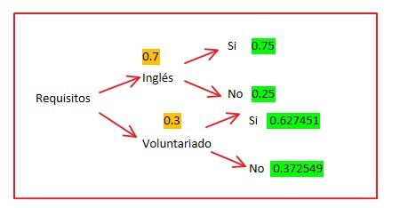
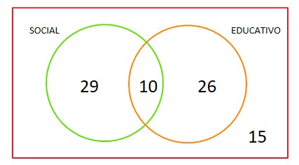

# **Introducción**

## Relevancia

El tema es de suma importancia, debido a que tenemos un cambio de malla relativamente reciente, en la cual se establecieron nuevos requisitos para culminar la carrera. Entre ellos se encuentran la acreditación del nivel B1 de inglés al llegar a los 100 créditos académicos y el cumplimiento de 36 horas de voluntariado. Estos requisitos fomentan un mayor desarrollo en aspectos académicos y personales. Asimismo, estos han generado un impacto en los estudiantes a la hora de organizar su tiempo no solo para sus cursos, sino también para los requisitos con el fin de cumplirlos.

## Planificación

Se presenta un plan, realizado en un diagrama Gantt, para llevar a cabo el trabajo:

```{r}

#1. Instalación automática de librerías:

if(!require(readr)){install.packages('readr')}
if(!require(tidyverse)){install.packages('tidyverse')}
if(!require(ggplot2)){install.packages('ggplot2')}
if(!require(plyr)){install.packages('plyr')}
if(!require(tidyr)){install.packages('tidyr')}
if(!require(stringr)){install.packages('stringr')}

#2. Lectura del archivo csv:

gantt <- read.csv("Gantt.csv", h=T)
gantt

#3. Creación de vectores de las actividades del trabajo y partes del mismo:

actividades <- c("Planificación del proyecto","Definición de tema","Selección de variables","Creación de encuesta","Difusión de encuesta","Redacción de la relevancia del proyecto","Descripción de la población, muestra y muestreo del estudio","Descripción del proceso de recolección de datos","Descripción de las variables utilizadas","Limpieza de la base de datos","Selección de descriptores gráficos y numéricos para las variables", "Presentación en RStudio","Entrega del incentivo","Corrección de partes de la PG1","Análisis probabilístico del estudio","Presentación en RStudio")

partes <- c("Proyecto PG1","Pre entrega PG0","Encuesta","Proyecto PG2")

#4. Configuración de columnas para crear el gráfico :

g.gantt <- gather(gantt, "state", "date", 4:5) %>% mutate(date = as.Date(date,"%d/%m/%Y"), Actividades=factor(actividades[length(actividades):1]), Partes(Partes, partes))

#5. Creación del gráfico:

ggplot(g.gantt, aes(date, Actividades, color = Partes, group=Item))+ theme(axis.text.x = element_text(angle = 90, vjust = 0.5, hjust=1),legend.position='top',legend.title=element_text(size=8), legend.text=element_text(size=7))+ geom_line(size = 5)+ labs(x="Fechas", y=NULL, title="Planificación del proyecto") + scale_x_date(date_breaks = "7 day", date_minor_breaks = "1 week", date_labels = "%d.%m") 
```

# **Datos**

## Proceso de recolección de datos:

Para recolectar datos, en primer lugar, creamos un formulario de Google. Esto se realizó manera grupal con la participación de cada uno de los integrantes de nuestro grupo. Durante esto, procuramos poner preguntas con respuestas para marcar y en algunos casos, selección múltiple, esto con el fin de reducir significativamente el sesgo. Asimismo, colocamos restricciones en cada una de las preguntas y consideramos la opción "Otro" en caso el encuestado no se encontrara a gusto con las opciones propuestas. 

Después de esto, comenzamos a compartir las encuestas, teniendo en cuenta nuestro público objetivo. Como incentivo para el llenado ofrecimos el sorteo de un balde de KFC. Este se realizará al culminar la primera entrega del proyecto. Durante el proceso de llenado recurrimos a la difusión por redes sociales, siendo la más usada WhatsApp. Por este medio compartimos las encuestas con compañeros. También recurrimos a las encuestas presenciales en algunos puntos de la universidad, algunos de estos fueron el piso 1, 2 y 6. Para las encuestas presenciales utilizamos un código QR, el cual mostraba directamente al enlace del formulario al ser escaneado.

## Población, muestra y muestreo

La población en estadística se refiere al grupo o conjunto de elementos que se va a estudiar. Los elementos que forman parte de la población tienen características en común, representando su totalidad plena, lo que se distingue de la muestra. En nuestra investigación, la población de estudio son los estudiantes universitarios de la Universidad de Ingeniería y Tecnología, nuestra población es finita, porque sí determinar el total de los elementos que la componen y, a partir de ello, podemos definir la muestra que nos servirá para completar y realizar el estudio.

La muestra forma parte de la población; es decir, es un subconjunto de ella y representa adecuadamente a los datos totales. En  nuestro caso, la muestra está definida solo por los estudiantes de UTEC que se encuentran matriculados en la malla 2021, porque nuestro estudio se basa especialmente en los estudiantes de esa malla. El tamaño de la muestra es de 204, siendo todos estudiantes de la Universidad de Ingeniería y Tecnología que pertenecen a la malla 2021 y que, por lo tanto, deben de cumplir los requisitos que se piden.

El tipo de muestreo empleado es el muestreo deliberado, crítico o por juicio. Esto se debe a que se seleccionó la muestra en base al propósito del estudio, el cual es analizar el impacto de los requisitos de la malla 2021 en los estudiantes de UTEC. Como ese era el propósito se seleccionó especificamente a los estudiante de la malla 2021.

## Variables

| Variables  | Definición  | Tipo | Restricción |
|:--------------:|:-------:|:-----------:|:-----------:|
| Ciclo | Ciclo que está cursando el estudiante | Categórica Ordinal | Cuenta con 10 alternativas cada una correspondiente a los ciclos del 1 al 10 y está limitado a solo marcar 1 | 
| Créditos_aprobados | Cantidad de créditos que ya aprobó el estudiante | Numérica Discreta | Solo se pueden ingresar números enteros |
| Requisitos | Consulta si tienen conocimiento de los requisitos de la malla 2021 | Categórica nominal | Cuenta con 2 opciones y está limitado a solo marcar 1 |
| Voluntariado | Consulta si ha realizado voluntariados | Categórica nominal | Cuenta con 2 opciones y está limitado a solo marcar 1 |
| Nivel_inglés | Nivel de inglés que tiene el alumno | Categórica Ordinal | Cuenta con 4 opciones y esta limitado a solo marcar 1 |
| Estudios_inglés | Consulta si el alumno actualmente estudia inglés | Categórica nominal | Cuenta con 2 opciones y está limitado a solo marcar 1 |
| Horas_inglés | Hora de disponibilidad a la semana para que estudie inglés | Numérica Discreta | Solo se pueden ingresar números enteros |
| Horas_voluntariado | Cantidad de horas de voluntariado que ya realizaron | Numérica Discreta | Solo se pueden ingresar números enteros |
| Presupuesto_inglés | Presupuesto mensual que el alumno tiene para estudiar inglés | Numérica Discreta | Solo se pueden ingresar números enteros |
| Género | Género del alumno | Categórica nominal | Cuenta con 2 opciones y está limitado a solo marcar 1 |
| Carrera | Carrera del alumno | Categórica nominal | Cuenta con 12 opciones y está limitado a solo marcar 1 |
| Tipos_voluntariado | Tipos de voluntariados que ha realizado | Categórica nominal | Cuenta con 9 opciones y es de opción múltiple |


## Limpieza de base de datos


1. **Lectura del archivo csv en RStudio:**  

```{r message = FALSE}
library(readr)
BD<-read_csv("Base_de_datos.csv",col_types = "cccccnccncccccccnnccccc") 
BD

```

2. **Cambio de nombre de las variables:**  
Se cambia el nombre de las variables para mantener un orden al momento de codificar y para evitar futuros errores

```{r}
names(BD)
```
```{r}
library(dplyr)
```

```{r}

BDC<- rename(BD, Malla = `¿En qué malla te encuentras actualmente?`, 
             Dirección_de_correo_electónico = `Dirección de correo electrónico`,
             Ciclo = `Ciclo:`,
             Código = `Código (Ej: 202120652):`, 
             Créditos_aprobados = `¿Cuántos créditos aprobados tienes acumulados hasta el momento? (Coloca solo el valor numérico. Ej: 30)`, 
             Voluntariado = `¿Has realizado algún voluntariado?`, 
             Horas_voluntariado = `Hasta el momento, ¿cuántas horas de voluntariado has realizado? (Coloca solo el valor numérico. Ej: 9)`, 
             Tipos_voluntariado = `En caso sí hayas realizado voluntariado, ¿qué tipos de voluntariado has realizado?`, 
             Motivos_voluntariado = `¿Cuáles son los motivos por los que has realizado voluntariado en algún ciclo?`, 
             Motivos_no_voluntariado = `¿Cuáles son los motivos por los que NO has realizado voluntariado en algún ciclo?`,
             Nivel_inglés = `¿Cuál es tu nivel de inglés?`, 
             Estudios_inglés = `¿Te encuentras estudiando inglés?`, 
             Motivos_inglés = `¿Cuáles son los motivos por los que estudias o estudiaste inglés?`,
             Motivos_no_inglés = `¿Cuáles son los motivos por los que NO estudias o NO estudiaste inglés?`, 
             Disponibilidad_inglés = `¿Cuántas horas dispones para estudiar inglés a la semana? (Coloca solo el valor numérico. Ej: 5)`, 
             Presupuesto_inglés = `¿Cuál es el presupuesto mensual que tienes para estudiar inglés? (Coloca solo el valor numérico entero en soles. Ej: 270)`, 
             Género = `Género:...20`, 
             Carrera = `Carrera:`,
             Requisitos =`¿Conoces los requisitos de la nueva malla 2021?`,
             Lograr_Requisitos = `¿Crees lograr completar este requisito al llegar a los 100 créditos?`)

```

3. **Filtrado de la muestra de la población:**  
Se filtra para obtener a los estudiantes de la Malla 2021, porque esa es la muestra del estudio

```{r}

BDC1<- filter(BDC, Malla == "Malla 2021")
BDC1

```

4. **Selección de las variables relevantes de la base de datos:**  
Se seleccionan las variables que será útiles para el desarrollo del estudio

```{r}
BDC2<- select(BDC1,Malla, Ciclo, Código, Créditos_aprobados,Requisitos, Voluntariado, Horas_voluntariado, Tipos_voluntariado, Motivos_voluntariado, Motivos_no_voluntariado, Nivel_inglés, Estudios_inglés, Motivos_inglés, Motivos_no_inglés, Disponibilidad_inglés, Presupuesto_inglés,Lograr_Requisitos, Género, Carrera)
BDC2
```

5. **Corrección de la variable código:**  
Se corrige la variable código. Algunas respuestas involucran un número de dígitos incorrecto al del código de estudiante, así que estas respuestas serán corregidas colocando NA

```{r}
library("stringr") 
```

```{r}

BDC3<-mutate(BDC2,Códcor=Código)
BDC3[3,4]
which(str_length(BDC3$Códcor) < 9)
which(str_length(BDC3$Códcor) > 9)
cod_diferente_9dig <- which(str_length(BDC3$Códcor) < 9 | str_length(BDC3$Códcor) > 9)
cod_diferente_9dig
range(BDC3$Códcor, na.rm = TRUE)
BDC3[cod_diferente_9dig,17] <- NA

```

5. **Corrección de la variable horas de voluntariado:**  
Se corrige la variable horas de voluntariado. Algunos de los encuestados respondieron que sí realizaban voluntariado, pero cuando se pregunto la cantidad de horas del mismo, colocaron 0. Asimismo, algunos encuestados respondieron que NO realizaban voluntariado, pero cuando se pregunto cantidad de horas del mismo, colocaron un número mayor a 0. Por ello, se verifica y corrige esto.

```{r}

#Celdas: #199 17 #90 17
BDC4<-mutate(BDC3,Volcor=Voluntariado)
BDC51<-mutate(BDC4, Volcor = case_when(Horas_voluntariado > 0 ~ "Sí", Horas_voluntariado == 0 ~ "No"))
BDC51

```
```{r}

BDC5 <- subset(BDC51, select = c(Ciclo,Créditos_aprobados,Requisitos,Volcor,Nivel_inglés,Estudios_inglés,Disponibilidad_inglés,Horas_voluntariado,Presupuesto_inglés,Género,Carrera,Tipos_voluntariado,Motivos_no_voluntariado,Motivos_no_inglés))
BDC5

```

Finalmente, se puede afirmar que la base de datos está limpia. Esto se debe a que ahora ya es posible realizar los gráficos necesarios para el desarrollo del estudio. Asimismo, hay coherencia en cuanto a las respuestas obtenidas. 


# **Análisis descriptivo**

Encuestamos un total de 234 estudiantes de UTEC de los cuales 204 se encuentran estudiando con la Malla 2021 y, del mismo modo, 30 de ellos están estudiando con la Malla 2018. De estos resultados seleccionamos a los estudiantes que estudian con la Malla 2021 como la muestra del estudio. Asimismo, la unidad muestral fue cada uno de los estudiantes de dicha Malla. Ahora, realizaremos el análisis descriptivo de las variables obtenidas considerando a la muestra mencionada.


```{r}
table(BDC$Malla)
frec<- c(30,204)
frec

if(!require(plotrix)){install.packages('plotrix')}

pie3D(frec, labels=frec, col= c("yellow", "blue"))
legend("topleft", legend = c("Malla 2018", "Malla 2021"), fill =  c("yellow", "blue"))
title("Representación de alumnos encuestados")
```

## **Univariado *(Análisis por variable)***

### <span style="color:blue"> **Variable *Carrera*** </span>

**Descriptores numéricos:**

- Moda

```{r}
frecuencias_carrera <- data.frame(table(BDC5$Carrera))
frecuencias_carrera

moda_carrera <- frecuencias_carrera[which.max(frecuencias_carrera$Freq),1]
moda_carrera
```

**Descriptor gráfico:**

```{r}
library(ggplot2)

colors1 <- c("#ffe6f8", "#ffd9f4", "#efc3e2","#ffb3d1","#ff92b0", "#e26e84", "#ed4f74","#ed4f74","#c93858", "#a7203e", "#850026", "#48010f")

ggplot(BDC5, aes(x = `Carrera`)) + geom_bar() + coord_flip() + geom_bar(fill = colors1, colour = "black") + labs(x = "Carrera",y = "Número de encuestados") + ggtitle("Carrera vs Número de encuestados") + geom_text(aes(label=..count..), stat='count', position=position_dodge(0.0),vjust= 0, hjust= -0.3, size=4.0)

```
**Análisis:**

Como se observa, tanto en los descriptores numéricos como gráficos, la mayor cantidad de estudiantes de la malla 2021 que completaron la encuesta son de la carrera de Ingeniería Industrial, siendo 49 en total. De este modo, se determina que *la moda* es Ingeniería Industrial. Asimismo, solo 3 y 1 estudiantes de las carreras de Ciencia de datos y Administración y Negocios Digitales respectivamente completaron la encuesta, esto se debe a que ambas carreras son nuevas en la universidad, por lo que no se encontraron muchos estudiantes de dichas carreras.

### <span style="color:blue"> **Variable *Ciclo*** </span>

**Descriptores numéricos:**

- Moda

```{r}
frecuencias_ciclo <- data.frame(table(BDC5$Ciclo))
frecuencias_ciclo

moda_ciclo <- frecuencias_ciclo[which.max(frecuencias_ciclo$Freq),1]
moda_ciclo
```

**Descriptor gráfico:**

```{r}
Fciclo<-factor(BDC5$Ciclo)
tabciclo<-table(BDC5$Ciclo)

colors2 <- c("#d3e545","#e9f663","#f1f986", "#f9fca6", "#ffffc6","#ffffc6","#efefb6")

barp<- barplot(tabciclo, main="Gráfico de barras de Ciclo",col=colors2,xlab = "Ciclo", ylab = "Frecuencia absoluta",ylim=c(0,140))
text(barp, tabciclo + 7, labels = tabciclo)
abline(v = moda_ciclo,col= "red", lwd=2)
legend("topright",bty= "n", legend = c("Moda"),col = c("red"),lwd =2, lty= 1:2)
```
**Análisis:**

Para la variable ciclo, como se puede observar en los descriptores numéricos y gráficos, la *moda* es el ciclo 3, porque fueron 131 los alumnos de este ciclo que respondieron la encuesta. Podemos afirmar que una de las razones por las que la moda es el ciclo 3 es que la mayoría de los integrantes del grupo se encuentran en dicho ciclo, por lo que la encuesta tuvo una mayor llegada para los estudiantes de dicho ciclo.


### <span style="color:blue"> **Variable *Créditos aprobados*** </span>

**Descriptores numéricos:**

- Mínimo, mediana, media y máximo

```{r}
summary(BDC5$Créditos_aprobados)
```

- Moda

```{r}
frecuencias_creditos <- data.frame(table(BDC5$Créditos_aprobados))
frecuencias_creditos

moda_creditos <- frecuencias_creditos[which.max(frecuencias_creditos$Freq),1]
moda_creditos
```
**Descriptor gráfico:**

```{r}
boxplot(BDC5$Créditos_aprobados, col="lightsalmon", horizontal = FALSE , xlab ="Créditos aprobados")
```
**Análisis:**

En este caso observamos que en *promedio* los estudiantes de la malla 2021 aprobaron 36 créditos. Esto quiere decir que todavía no deben acreditar el nivel de inglés B1, porque este se acredita al llegar a los 100. Sin embargo, es necesario que estén trabajando en dicho requisito, debido a que están próximos a tener que cumplirlo. La *mediana* es 38, esta se aprecia en el gráfico como una línea negra. A partir de ambos descriptores, podemos afirmar que la variable analizada está sesgada a la izquierda. En la gráfica también es posible apreciar ello, pues el ancho de la caja es menor después de la mediana. Por otro lado, el *mínimo* de créditos aprobados por los estudiantes es 0 y el *máximo* es 98, lo cual se debe a que algunos encuestados fueron de 1er ciclo y otros de ciclo superiores. Esto también generó algunos datos atípicos, pues en el gráfico se aprecian cerca de 10 datos que son demasiado grandes y 1 dato que es muy pequeño en comparación con los otros datos. Asimismo, la *moda* es 40 créditos, esto concuerda con el hecho de que la moda para la variable ciclo sea el ciclo 3, pues los estudiantes de este ciclo actualmente tienen apróximadamente 40 créditos aprobados.


### <span style="color:blue"> **Variable *Requisitos*** </span>

**Descriptor gráfico:**

```{r}
Frequisitos<-factor(BDC5$Requisitos)
tabrequi<-table(BDC5$Requisitos)
tabrequi
barp<- barplot( tabrequi,main="Gráfico de barras de Requisitos",col=c("pink"),xlab = "Requisitos", ylab = "Frecuencia absoluta",ylim=c(0,140))
text(barp, tabrequi + 7, labels = tabrequi)
```

**Análisis:**

Esta gráfica representa la cantidad de alumnos que tienen conocimiento sobre los 2 requisitos de la malla 2021: estudios de inglés y participación en voluntariados. Se observa que de los 204 alumnos de la Malla 2021 que fueron encuestados, 128 alumnos sí sabían y 76 alumnos no tenían conocimiento de ello.


### <span style="color:blue"> **Variable *Voluntariado*** </span>

**Descriptor gráfico:**

```{r}
Fvolu<-factor(BDC5$Volcor)
tabvolu<-table(BDC5$Volcor)

barp<- barplot(tabvolu, main="Gráfico de barras de Voluntariado", col=c("slategray2"), xlab = "Voluntariado", ylab = "Frecuencia absoluta", ylim=c(0,140))

text(barp, tabvolu + 7, labels = tabvolu)

```
**Análisis:**

En este gráfico se está representado la cantidad de alumnos que ya están realizando o realizaron voluntariados. Se observa que 130 alumnos no han hecho voluntariado y 74 ya lo hicieron o lo están realizando actualmente.


### <span style="color:blue"> **Variable *Tipos de voluntariado*** </span>

**Descriptor numéricos:**

- Moda

```{r}
tipo_vol<-str_split_fixed(BDC5$Tipos_voluntariado, ", ",5)
tipo_vol[tipo_vol == ""] <- "NA"

frecuencias_tiposvol <- data.frame(table(tipo_vol,exclude=c("NA")))
frecuencias_tiposvol

moda_tiposvol <- frecuencias_tiposvol[which.max(frecuencias_tiposvol$Freq),1]
moda_tiposvol
```

**Descriptor gráfico:**

```{r}

legtext <- c("Otros", "V. Ambiental", "V. Comunitario","V. Cultural","V. Integración social", "V. Deportivo", "V. Educativo", "V. Internacional","V. Social")

colors <- c("#0f5c1d", "#008845", "#33a760", "#54c67d", "#73e69b","#97f9b6","#bbfcce", "#ddfee7", "#e2feea")

barplot(table(tipo_vol,exclude=c("NA")), las = 3, xaxt = "n", col = colors, main = "Tipos de voluntariado")
legend("topleft",legtext, cex=0.8, col = colors, pch = 15)
```
**Análisis:**

Para la variable tipos de voluntariado, la moda es Voluntariado Social. Esto demuestra que la preferencia de los estudiantes de la Malla 2021 en cuanto a tipos de voluntariado a realizar es el Voluntariado Educativo.


### <span style="color:blue"> **Variable *Estudios inglés*** </span>

**Descriptor gráfico:**

```{r}
Fing<-factor(BDC5$Estudios_inglés)
tabing<-table(BDC5$Estudios_inglés)
tabing

barp<- barplot( tabing,main="Gráfico de barras de Estudios de inglés",col=c("plum1"),xlab = "Estudios de inglés", ylab = "Frecuencia absoluta",ylim=c(0,170))
text(barp, tabing + 7, labels = tabing)
```

**Análisis:**

En este gráfico se está representado la cantidad de alumnos que se encuentran estudiando inglés. Se observa que 153 alumnos no están estudiando inglés y 51 sí lo están haciendo.

### <span style="color:blue"> **Variable *Presupuesto inglés*** </span>

**Descriptores numéricos:**

- Mínimo, mediana, media y máximo

```{r}
summary(BDC5$Presupuesto_inglés)
```

- Desviación estándar

```{r}
round(sd(BDC5$Presupuesto_inglés, na.rm=TRUE),2)
```

- Coeficiente de variación

```{r}
round((sd(BDC5$Presupuesto_inglés, na.rm=TRUE)/mean(BDC5$Presupuesto_inglés, na.rm=TRUE))*100,2)
```

**Descriptor gráfico:**

```{r}
boxplot(BDC5$Presupuesto_inglés, col="#ffb99c", horizontal = FALSE , xlab ="Presupuesto de inglés")
```

**Análisis:**

El presupuesto *mínimo* de los estudiantes para estudiar inglés es S/. 0, esto quiere decir que hay estudiantes que no están estudiando inglés actualmente. De igual forma, el presupuesto *máximo* de los estudiantes para estudiar inglés es S/. 2000. Podemos observar que existen 2 datos atípicos relacionados a presupuestos superiores a S/. 1000. Por otro lado, el presupuesto *promedio* de los estudiantes es S/. 164. Asimismo, como *cuartil 1* tenemos que el máximo presupuesto del 25% de los menores presupuestos es 0 o el mínimo presupuesto del 75% de los mayores presupuestos es 0. Como *cuartil 3* tenemos que el máximo presupuesto del 75% de los menores presupuestos es 255 o el mínimo presupuesto del 25% de los mayores presupuestos es 255. Por último, se puede afirmar que los datos obtenidos de presupuesto para estudios de inglés son heterogéneos debido a que se obtuvo un 122.78% como coeficiente de variación.


### <span style="color:blue"> **Variable *Horas de voluntariado*** </span>

**Descriptores numéricos:**

- Mínimo, mediana, media y máximo

```{r}
summary(BDC5$Horas_voluntariado)
```

- Desviación estándar

```{r}
round(sd(BDC5$Horas_voluntariado, na.rm=TRUE),2)
```
- Coeficiente de variación

```{r}
round((sd(BDC5$Horas_voluntariado, na.rm=TRUE)/mean(BDC5$Horas_voluntariado, na.rm=TRUE))*100,2)
```

**Descriptor gráfico:**

```{r}
boxplot(BDC5$Horas_voluntariado, col="#a3f864", horizontal = FALSE , xlab ="Horas voluntariados")
```
**Análisis:**

Vemos que el número de horas máximo de voluntariado que realizaron los estudiantes es 200 y el número de horas mínimo es 0. Como cuartil 1 tenemos que las horas máximas de voluntariado del 25% de las menores horas de voluntariado es 0 o las horas máximas de voluntariado del 75% de las menores horas de voluntariado es 0. Como cuartil 3 tenemos que las horas máximas de voluntariado del 75% de las menores horas de voluntariado es 12 o las horas máximas de voluntariado del 25% de las menores horas de voluntariado es 12. Podemos señalar que los datos obtenidos de horas de voluntariado realizadas por los estudiantes son altamente heterogéneos debido a que se obtuvo un 209.87% como coeficiente de variación. Este dato también nos permite afirmar que la media pierde su valor para esta variable.

### <span style="color:blue"> **Variable *Horas inglés*** </span>

**Descriptores numéricos:**

- Mínimo, mediana, media y máximo

```{r}
summary(BDC5$Disponibilidad_inglés)
```

- Desviación estándar

```{r}
round(sd(BDC5$Disponibilidad_inglés, na.rm=TRUE),2)
```
- Coeficiente de variación

```{r}
round((sd(BDC5$Disponibilidad_inglés, na.rm=TRUE)/mean(BDC5$Disponibilidad_inglés, na.rm=TRUE))*100,2)
```

**Descriptor gráfico:**

```{r}
boxplot(BDC5$Disponibilidad_inglés, col="yellow", horizontal = FALSE , xlab ="Disponibilidad de estudio de inglés")
```
**Análisis:**

Concluimos que el número de horas máximo que disponen los estudiantes para estudiar inglés es 15 y el número de horas mínimo es 0. Esto se puede dar por diversos factores, entre ellos la carga académica que lleva cada estudiante. Algunos estarían llevando cursos pesados en el ciclo, así que es más complicado disponer tiempo para realizar otras actividades, como estudiar inglés. Como cuartil 1 tenemos que las horas máximas de estudios de inglés del 25% de las menores horas de estudios inglés es 0. Como cuartil 3 tenemos que las horas máximas de voluntariado del 75% de las menores horas de voluntariado es 4. Asimismo, podemos afirmar que los datos obtenidos de horas de disponibilidad para estudios de inglés son variables debido a que se obtuvo un 102.71% como coeficiente de variación. Para finalizar, podemos decir que la variable es simétrica, debido a que el ancho de la caja es igual antes y después de la mediana.

### <span style="color:blue"> **Variable *Motivos no voluntariado*** </span>

**Descriptores numéricos:**

- Moda

```{r}
tipo_movno<-str_split_fixed(BDC5$Motivos_no_voluntariado, ", ", 5)
tipo_movno[tipo_movno == ""] <- "NA"

frecuencias_movno <- data.frame(table(tipo_movno,exclude=c("NA")))
frecuencias_movno

moda_movno <- frecuencias_movno[which.max(frecuencias_movno$Freq),1]
moda_movno
```
**Descriptor gráfico:**

```{r}
legtext <- c("Desconfianza", "Falta de compromiso","Falta de tiempo","Miedo a malas experiencias","No hay voluntariados de mi interés","Otros","Trabajo gratis")

colors <- c("#a4250d", "#c84019", "#ec5a26", "#ff7a3d", "#ff9c5b","#ffbd7a","#ffdc99")

barplot(table(tipo_movno,exclude=c("NA")), las = 3, xaxt = "n", col = colors, main = "Motivos para no hacer voluntariado")
legend("topright",legtext, cex=0.8, col = colors, pch = 15)

```
**Análisis:**

Se aprecia que la razón más recurrente por la que los estudiantes no hacen voluntariado es la falta de tiempo. Asimismo, otra de las razones más votadas es que los estudiantes consideran que no hay voluntariados de su interés.


### <span style="color:blue"> **Variable *Motivos no inglés*** </span>

**Descriptores numéricos:**

- Moda

```{r}
tipo_ingnomov<-str_split_fixed(BDC5$Motivos_no_inglés, ", ", 5)
tipo_ingnomov[tipo_ingnomov == ""] <- "NA"

frecuencias_ingnomov <- data.frame(table(tipo_ingnomov,exclude=c("NA","Me encuentro estudiando inglés")))
frecuencias_ingnomov

moda_ingnomov <- frecuencias_ingnomov[which.max(frecuencias_ingnomov$Freq),1]
moda_ingnomov
```
**Descriptor gráfico:**

```{r}
legtext <- c("Falta de dinero", "Falta de tiempo","No me interesa","Otros")

colors <- c("#6c82c6", "#8b9fe6", "#abb9f8", "#c8d0fa")

barplot(table(tipo_ingnomov,exclude=c("NA")), las = 3, xaxt = "n", col = colors, main = "Motivos para no estudiar inglés")
legend("topright",legtext, cex=0.8, col = colors, pch = 15)

```

**Análisis:**

Se aprecia que la razón más recurrente por la que los estudiantes no estudian inglés es la falta de tiempo. Asimismo, otra de las razones para esto es la falta de dinero.


## **Bivariado *(Relación entre variables)***

### <span style="color:blue"> **Nivel de inglés vs. género** </span>

```{r}
mosaicplot(BDC5$Nivel_inglés ~ BDC5$Género, col=colorRampPalette(c('darkseagreen1','chartreuse3'))(4), main="Género vs. Nivel de inglés",xlab="Nivel de inglés",ylab="Género")
```
En el gráfico se observa la relación entre el nivel de inglés y el género de los estudiantes. A partir de esto se pueden sacar las siguientes conclusiones:

- Hay una mayor cantidad de hombres con un nivel avanzado de inglés.
- La mayoría de estudiantes, tanto hombres como mujeres, están en un nivel básico de inglés.
- Hay una mayor cantidad de mujeres con un nivel intermedio de inglés.
- Hay mayor cantidad de estudiantes mujeres que no ha iniciado estudios de inglés, por lo que no tiene ningún nivel en este idioma.

### <span style="color:blue"> **Presupuesto de inglés vs. disponibilidad de inglés** </span> (Regresión lineal y covarianza)

```{r}
plot(BDC5$Presupuesto_inglés ~ BDC5$Disponibilidad_inglés, col = "blue",xlab ="Disponibilidad para estudios de inglés",ylab = "Presupuesto para estudios de inglés")
```

- **Regresión lineal**

```{r}
datosregr<- data.frame("X"=BDC5$Disponibilidad_inglés,"Y"=BDC5$Presupuesto_inglés)
datosregr
resultados<-lm(datosregr$Y~datosregr$X,data=datosregr)
resultados
```
La ecuación de regresión lineal es la siguiente:

$$Y = 111.23 + 18.46X$$

Ahora, tomaremos en cuenta esta ecuación y realizaremos nuevamente la gráfica:

```{r}
tablita<-data.frame("X"=BDC5$Disponibilidad_inglés,"Y"=BDC5$Presupuesto_inglés,"Y-estimado"=111.23 + 18.46*BDC5$Disponibilidad_inglés)

tabconerrores<-data.frame("X"=BDC5$Disponibilidad_inglés,"Y"=BDC5$Presupuesto_inglés,"Y-estimado"=111.23 + 18.46*BDC5$Disponibilidad_inglés,"e"=BDC5$Presupuesto_inglés-(111.23 + 18.46*BDC5$Disponibilidad_inglés))

plot(datosregr$X,datosregr$Y,xlab="Disponibilidad para estudios de inglés",ylab="Presupuesto para estudios de inglés", col="blue")
abline(resultados, col="red")
```

- **Covarianza**

```{r}
cov(datosregr$X,datosregr$Y)
```
Al ser $cov > 0$, hay una tendencia ascendente: a medida que la disponibilidad para estudiar inglés aumenta, se asignará una mayor presupuesto para estudiar este idioma.


- **Coeficiente de correlación**

```{r}
cor(datosregr$X,datosregr$Y)
```

Como $r=0.8155751 > 0$ significa que el modelo de regresión lineal no es bueno, pero la relación es directa.

- **Coeficiente de determinación**

```{r}
((cor(datosregr$X,datosregr$Y))**2)*100
```

El 7.24% de las variaciones en el presupuesto para estudiar inglés son explicadas por el modelo de regresión, es decir, el modelo de regresión no es bueno porque las dos variables no tienen mucha relación lo que impide visualizar una tendencia en la gráfica.

### <span style="color:blue"> **Voluntariado vs. Estudios inglés** </span>

```{r}
mosaicplot(BDC5$Estudios_inglés ~ BDC5$Volcor, col=colorRampPalette(c('khaki1','gold3'))(4), main="Voluntariado vs. Estudios de inglés",xlab="¿Estudias inglés?",ylab="¿Haces voluntariado?")
```
Del gráfico se pueden sacar las siguientes conclusiones:

- La mayoría de los estudiantes NO está estudianto inglés ni haciendo voluntariado; es decir, NO están cumpliendo los requisitos. Una de las razones puede ser el hecho de que la mayoría de los estudiantes que respondieron la encuesta son de 3er ciclo, por lo que al no estar tan próximos de cumplir los 100 créditos, estos no están preocupados por cumplir los requisitos que son necesarios al llegar a este número de créditos.

- Son pocos los estudiantes que realizan voluntariado y estudian inglés, por lo que están cumpliendo los requisitos que solicita la Malla 2021.

### <span style="color:blue"> **Horas voluntariado vs. Género** </span>

```{r}
boxplot(BDC5$Horas_voluntariado ~ factor(BDC5$Género), xlab = "Género", ylab = "Horas de voluntariado", col =colorRampPalette(c('plum2','blue'))(5), main = "Horas de voluntariado vs. Género")
legend(x = "topright", legend = c("Femenino", "Masculino"), fill =colorRampPalette(c('plum2','blue'))(5),title = "Leyenda")
```
Del gráfico se pueden sacar las siguientes conclusiones:

- Se aprecian muchos valores atípicos, tanto en hombres como mujeres. Esto quiere decir que las horas de voluntariado que han realizado los estudiantes de ambos géneros son muy variadas.
- El valor máximo de horas de voluntariado es 200 en el género femenino y 135 en el género masculino 

### <span style="color:blue"> **Requisitos vs. Voluntariado** </span>
```{r}
mosaicplot(BDC5$Requisitos ~ BDC5$Volcor, col=colorRampPalette(c('light blue','chartreuse3'))(4), main="Requisitos vs Realizado voluntariado",xlab="¿Conoces los requisitos?",ylab="¿Has realizado voluntariado?")
```
- Mas de la mitad de los encuestados sí conocen los requisitos , pero la mayoría de ellos no ha realizado ningún voluntariado.
- De los encuestados que respondieron que no conocen los requisitos, más de la mitad no ha realizado voluntariado y solo unos pocos encuestados sí ha realizado voluntariado.


### <span style="color:blue"> **Requisitos vs. Estudios Inglés** </span>

```{r}
mosaicplot(table(BDC5$Requisitos,BDC5$Estudios_inglés),xlab="¿Conoces los requisitos de la malla 2021 ?",ylab="¿Estudias inglés?", col=4:5, main = "Requisitos vs Estudios de inglés")
```
- La mayoría de los estudiantes conoce los requisitos de la malla 2021, pero a pesar de eso observamos que más de la mitad de los mismos no está estudiando inglés actualmente. Esto se debe a la falta de tiempo, tal como se comentó en el análisis de la variables Motivos no inglés.
- Son menos de la mitad los estudiantes que no conocen los requisitos de la malla 2021.
- Son pocos los estudiantes que no conocen los requisitos, pero sí están estudiando inglés. Ante esto, podemos decir que algunos estudiantes estudian inglés motivados no especialmente por el hecho de cumplir el requisito solicitado, sino son motivos externos los que los han llevado a estudiar un segundo idioma.

### <span style="color:blue"> **Créditos aprobados vs. Nivel de inglés** </span>

```{r}
ggplot(data = BDC5, aes(x = Nivel_inglés, y = Créditos_aprobados)) + stat_boxplot(geom = "errorbar",width = 0.1) +
       geom_boxplot(fill = "#4271AE", colour = "#1F3552",alpha = 0.9, outlier.colour = "red") +
       scale_y_continuous(name = "Créditos aprobados") + 
       scale_x_discrete(name = "Nivel de inglés") +
       ggtitle("Relación de créditos aprobados con nivel de inglés") + 
       theme(axis.line = element_line(colour = "black",size = 1))
```
- Se puede apreciar que las medianas los cuatro boxplots son muy cercanas, y que existen personas con nivel de inglés avanzado con mayor número de créditos que los demás.
- Se observa que el o los alumnos con menor crédito no poseen un nivel de inglés.
- Entre el quartil tres y uno de los alumnos con nivel de inglés intermedio y avanzado son similares, encontrándose entre los 23 y 45 aproximadamente. Lo que indica que la mayoría de alumnos con niveles de inglés superior no llegan ni a los 50 créditos.


# **Análisis probabilístico**

Variables consideradas para realizar el análisis probabilístico:

| Variables  | Definición  | Tipo | Restricción |
|:--------------:|:-------:|:-----------:|:-----------:|
| Créditos_aprobados | Cantidad de créditos que ya aprobó el estudiante | Numérica Discreta | Solo se pueden ingresar números enteros |
| Requisitos | Consulta si tienen conocimiento de los requisitos de la malla 2021 | Categórica nominal | Cuenta con 2 opciones y está limitado a solo marcar 1 |
| Voluntariado | Consulta si ha realizado voluntariados | Categórica nominal | Cuenta con 2 opciones y está limitado a solo marcar 1 |
| Nivel_inglés | Nivel de inglés que tiene el alumno | Categórica Ordinal | Cuenta con 4 opciones y esta limitado a solo marcar 1 |
| Estudios_inglés | Consulta si el alumno actualmente estudia inglés | Categórica nominal | Cuenta con 2 opciones y está limitado a solo marcar 1 |
| Horas_inglés | Hora de disponibilidad a la semana para que estudie inglés | Numérica Discreta | Solo se pueden ingresar números enteros |
| Horas_voluntariado | Cantidad de horas de voluntariado que ya realizaron | Numérica Discreta | Solo se pueden ingresar números enteros |
| Presupuesto_inglés | Presupuesto mensual que el alumno tiene para estudiar inglés | Numérica Discreta | Solo se pueden ingresar números enteros |
| Carrera | Carrera del alumno | Categórica nominal | Cuenta con 12 opciones y está limitado a solo marcar 1 |
| Tipos_voluntariado | Tipos de voluntariados que ha realizado | Categórica nominal | Cuenta con 9 opciones y es de opción múltiple |

## **Introducción a las probabilidades:**

### <span style="color:blue"> **Ejemplos de *Eventos independientes*** </span> 

Hallar la probabilidad de la disponibilidad de horas de los estudiantes, sabiendo que la primera fila de la tabla que se muestra a continuación es la cantidad de horas que tienen disponibles y la segunda fila es la cantidad de alumnos.

```{r}
table(BDC5$Disponibilidad_inglés)
```
- Probabilidad para 0 horas:
```{r}
59/204
```

- Probabilidad para 1 hora:

```{r}
19/204
```

- Probabilidad para 2 horas:

```{r}
37/204
```

- Probabilidad para 3 horas:

```{r}
14/204
```

- Probabilidad para 4 horas:
```{r}
27/204
```

- Probabilidad para 5 horas:

```{r}
16/204
```

- Probabilidad para 6 horas:
```{r}
11/204
```

- Probabilidad para 7 horas:

```{r}
5/204
```

- Probabilidad para 8 horas:

```{r}
6/204 
```

- Probabilidad para 10 horas:

```{r}
7/204
```

- Probabilidad para 12 horas:
```{r}
1/204
```

- Probabilidad para 14 horas:

```{r}
1/204
```

- Probabilidad para 15 horas:

```{r}
1/204
```

### <span style="color:blue"> **Ejemplos de *Probabilidad total y Teorema de valles*** </span> 

Los alumnos de UTEC de la malla 2021 deben cumplir 2 requisitos al llegar a los 100 créditos académicos. El primero es realizar 36 horas de voluntariado y el segundo es tener un nivel de inglés B1.

Los resultados con respecto a si los estudiantes se encuentran estudiando inglés son los siguientes:

```{r}
table(BDC5$Estudios_inglés)
```

Asimismo, los resultados con respecto a si han realizado o se encuentran realizando voluntadiao se muestran a continuación:

```{r}
table(BDC5$Volcor)
```

De aquí tenemos que:

```{r}
153/204 * 100
51/204 * 100
128/204 * 100
76/204 * 100
```
{height=height, width=width}  

- El 75% de los estudiantes no estudia inglés
- El 25% de los estudiantes estudia inglés
- El 62.7451% de los estudiantes no realizó voluntariado
- El 37.2549% de los estudiantes si realizó voluntariado

Con la información que se tiene y suponiendo que al llegar a los 100 créditos los estudiantes sí cumplieron los requisitos de inglés y voluntariado en proporción al 70% y 30% respectivamente.

**¿Cuál es la probabilidad de haber cumplido con éxito los requisitos?**

```{r}
0.25*0.7+0.372549*0.3
```
**¿Cuál es la probabilidad de no haber cumplido con éxito los requisitos?**

```{r}
0.75*0.7+0.627451*0.3
```

**De no haber tenido éxito, ¿cuál es la probabilidad de haber cumplido el requisito de inglés?**

```{r}
(0.75*0.7)/0.7132353
```

**Si tuvo éxito, ¿cuál es la probabilidad de haber cumplido el requisito de inglés?**

```{r}
(0.25*0.7)/0.2867647
```

### <span style="color:blue"> **Ejemplos de *Probabilidad condicional*** </span> 

Si de las respuestas obtenidas se toma una muestra de 80 personas, entre las cuales 39 personas mencionaron que realizaron voluntariado social, 36 mencionaron que realizaron voluntariado educativo y 15 personas que indicaron que no realizaron ninguno de estos voluntariados.

{height=height, width=width}  

```{r}
tipo_vol<-str_split_fixed(BDC5$Tipos_voluntariado, ", ",5)
tipo_vol[tipo_vol == ""] <- "NA"
frecuencias_tiposvol <- data.frame(table(tipo_vol,exclude=c("NA")))
frecuencias_tiposvol
```


**¿Cual es la probabilidad de que al tomar a un estudiante al azar, haya realizado los dos tipos de voluntariado?**

```{r}
(10/80)/((29+10+26)/80)
```

**¿Cuál es la probabilidad de que al seleccionar a un estudiante que no hizo voluntariado educativo, haya hecho voluntariado social?**

```{r}
(29/80)/((29+2)/80)
```

### <span style="color:blue"> **Ejemplos de *Combinatorias*** </span> 

**Ejemplo 1:**

De cuantas maneras se puede seleccionar a 6 alumnos del total de alumnos de la muestra.

```{r}
choose(204,6)
```
**RESPUESTA:** Se pueden seleccionar de 92944609660 maneras.

**Ejemplo 2:**

Del total de la muestra determinar la cantidad de varones y mujeres, en la que se quiere determinar 4 parejas de las cuales, la mujeres estudien inglés y los varones no estudien inglés.

```{r}
BD <-filter(BDC5,Género == "Femenino",Estudios_inglés == "Sí")
table(BD$Género)

BD1 <-filter(BDC5,Género == "Masculino",Estudios_inglés == "No")
table(BD1$Género)

# Sabiendo que hay 27 mujeres que estudian ingles y 72 varones que no estudian inglés:

choose(27,4)*choose(72,4)
```

**RESPUESTA:** Se determina que se pueden formar 18055264500 parejas

### <span style="color:blue"> **Ejemplos de *Permutación*** </span> 

**Ejemplo 1:**

12 de los alumnos que están en tercer ciclo irán a realizar un voluntariado y se ha contratado una movilidad, ¿de cuántas maneras se puede ordenar a este grupo de alumnos?

```{r}
factorial(12)
```
**RESPUESTA:** Se puede ordenar de 479001600 formas.

**Ejemplo 2:**

En UTEC se realiza una clase demostrativa del programa de estudios de inglés "Conversa Academics". Para esto se dispone de 20 cupos; 10 alumnos de la malla 2021 que no estudian inglés deciden ir a esta clase, ya que se han interesado por estudiar inglés, ¿de cuántas formas se pueden acomodar en el aula el día de la clase?

```{r}
factorial(20)/factorial(10)
```
**RESPUESTA:** Se pueden acomodar de 670442572800 formas.


## **Modelos de distribución**

### <span style="color:blue"> **Variable *Nivel de inglés* (Distribución hipergeométrica)** </span>

En una universidad de 204 estudiantes Se seleccionan 30 para dictar una clase de inglés y al menos 1/5 de los seleccionados deben tener nivel de inglés intermedio. ¿Cual es la probabilidad que al seleccionar 30 estudiantes al azar, 6 sean nivel intermedio?

**Datos:**  

- M = número total de estudiantes nivel intermedio 32  

- N = total de estudiantes 204  

- n = número de estudiantes que no sean de nivel intermedio. 172 

- x0 = 6  

- k = 30  

```{r}
(dhyper(6,32,172,30))*100
```

**Resultado:**

La probabilidad que 6 estudiantes sean de nivel intermedio es del 15.67%

**Justificación:**

- Se utilizó la variable nivel_inglés porque indica el nivel de inglés de los estudiantes, dividiéndolos en básico, intermedio, avanzado y ninguno.  
- Se utilizó la distribución hipergeométrica ya que tenemos el total, el número total de éxitos(32), el número total de fracasos(172) y el número de éxitos(6). 

Calculando la esperanza: 

```{r}
30*(32/204)
```
Se espera que al extraer 30 estudiantes 5 sean de nivel intermedio, lo que es más probable que obtener 6 alumnos del mismo nivel. 

 
### <span style="color:blue"> **Variable *Carrera* (Distribución Binomial negativa)** </span>

Necesitamos seleccionar a los ganadores del sorteo de 2 baldes de KFC. Para ello necesitamos conocer la probabilidad de que los alumnos ganadores sean estudiantes de la carrera de ingeniería ambiental.

- Éxito: Estudiantes que se encuentren cursando la carrera de ingeniería ambiental
- Fracaso: Estudiantes que no se encuentren cursando la carrera de ingeniería ambiental

**Datos:**

- X = # de sorteos realizados hasta obtener k éxitos

- P(éxito) = 37 (# estudiantes de ingeniería ambiental) / 204 (# total de estudiantes)

- k = 2 ganadores de la carrera de ingeniería ambiental


```{r}
X = 9
k = 2
total = 204
CO = 37
Pe = CO/total

round(choose(X-1, k-1)*(Pe^k)*((1-Pe)^(X-k)),2)
```

Con el comando "dnbinom":

```{r}
round(dnbinom(X-k, k, Pe),2)
```
**Justificación**

- Se utilizó la distribución binomial negativa porque tenemos el número de intentos realizados, el número de éxitos que queremos y la probabilidad de salir un estudiante de la carrera de ingeniería ambiental.

**Análisis del Resultado**

Utilizando la esperanza de la distribución binomial negativa para hallar el número de fracasos esperados:
```{r}
(2*0.8186)/0.1814
```


```{r}
dnbinom(9,2,Pe)
```

El número de fracasos esperados es 9, pero al momento de sacar la probabilidad con este valor, notamos que es menor la probabilidad utilizando 9 fracasos que 7, eso quiere decir que en este caso muestra solo un promedio de las posibles alternativas, y como las probabilidades más altas se concentran entre el 1 y 8 y las de menor probabilidad son de 10 hasta 204, su esperado tiende a estar entre 9 y 10.


### <span style="color:blue"> **Variable *Requisitos* (Distribución Geométrica)** </span>

En total fueron encuestados 204 estudiantes de UTEC, de los cuales 128 de ellos mencionaron que sí conocían los requisitos de la malla 2021, ¿cuál es la probabilidad que el quinto encuestado no conozca los requisitos de la malla 2021?

- Éxito: No conozca los requisitos de la malla 2021
- Fracaso: Conozca los requisitos de la malla 2021

**Datos:**

- P(x)= (#de casos favorables/#casos posibles)

- # Casos favorables = 204 - 128 = 76

- # Casos posibles = 204

- P(x) = 76/204 = 0.37 = 37% 

- # de fracasos = 4

```{r}
#Utilizamos el comando dgeom y multiplicamos por 100 para hallar la probabilidad:
dgeom(4 ,0.37)*100
```

**Resultado**

- La probabilidad de que el 5to encuestado no conozca los requisitos de la malla 2021 es de 5.82%.

**Justificación**

- En este caso utilizamos la distribución geométrica porque nos piden la probabilidad cuando ocurre solo un caso de éxito que en este caso es éxito (no conocer los requisitos de la malla 2021).

**Análisis con el Resultado**

```{r}
1/0.37
```
Gracias al valor esperado, podemos concluir que es más probable que los alumnos no sepan de los requisitos desde antes del 5to encuestado, lo que refleja un alto desconocimiento sobre estos requisitos.


# **Bibliografía**

Coder, R. (2020, June 4). BOXPLOT en R (Diagrama de Cajas y Bigotes) [GUÍA COMPLETA]. R CODER. https://r-coder.com/boxplot-en-r/

RPubs - Mosaic Plot Visualisation. (n.d.). Rpubs.com. Retrieved November 25, 2022, from https://rpubs.com/tskam/mosaic_plot

RPubs - Diagrama de Dispersión y Regresión en R. (n.d.). Rpubs.com. Retrieved November 25, 2022, from https://rpubs.com/MSiguenas/97848