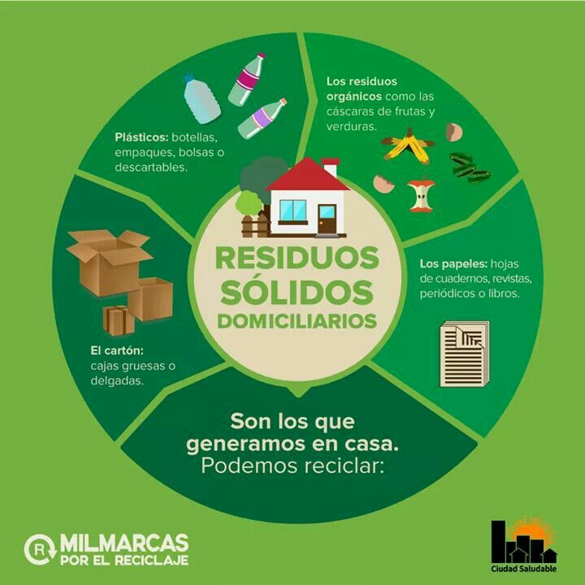
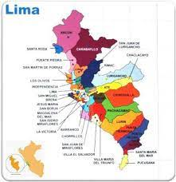

```{r echo=FALSE}
DF<-read.csv("Data1.csv")
```
# <span style="color:black"> __Proyecto__  </span> 
<div style="text-align: justify">
__Título:__ NIVELES DE CONTAMINACIÓN DEL MEDIO AMBIENTE GENERADO POR LOS RESIDUOS SÓLIDOS DOMICILIARIOS  
  
__Título corto:__ Contaminacion por los residuos solidos domiciliarios 
<div/>  

<center>
{width="width" height="height"}
</center> 

## __Paquetes y librerías que utilizaremos __  

```{r}
#install.packages("readr")
library(readr)
#install.packages("plyr")
library(plyr)
#install.packages("dplyr")
library(dplyr)
#install.packages("ggplot2") 
library(ggplot2)
#install.packages("modest")
library(modeest)
#install.packages("nortest")
library(nortest)
```


## __1. Introducción__
### <span style="color:blue"> 1.1 Relevancia: </span>  

El tema de la contaminación por los **RESIDUOS SÓLIDOS DOMICILIARIOS**,
es de mucha relevancia, ya que nos permitirá conocer la cantidad de
basura que se genera al día y a su vez sabremos el impacto que le genera
al medio ambiente.  

### <span style="color:blue"> 1.2. Objetivos </span>  

#### __1.2.1 General:__

-	Analizar las variables que influyen en los niveles de contaminación por los residuos domiciliarios.

#### __1.2.2 Específicos:__

-	Determinar el factor principal de las causas del problema propuesto.
-	Identificar las posibles soluciones para disminuir la contaminación.
-	Interpretar que relación tienen entre sí las variables expuesto, mediante los descriptores estadísticos (numéricos y gráficos).
-	Comparar las diferencias que tienen las diferentes variables con sus respectivas funciones.
-	Plantear situaciones que conlleven a tener una mejor persuasión en las conclusiones.
-	Verificar si los distintos niveles están bien empleados para comprobar los resultados.e. De este modo, las personas comenzaran a ser más
consientes del daño y las consecuencias que traerán consigo. Por ultimo,
las personas comenzaran a ser más maduros al darse cuenta del estado
actual del ambiente comenzando a reciclar y conocer los lugares que se
encuentran más contaminados.  


### <span style="color:blue"> 1.3. Preguntas obligatorias: </span>  
¿Es el estudio de interés para la audiencia?  

-  Si, ya que el tema permite informar a la audiencia de los impactos ambientales durante la pandeía.       Por otra parte, permite              y tomar conciencia en el tema ambiental.

¿Qué información se desea aportar al final del estudio?  

-  Al final del estudio se desea aportar una información relevante, con respecto a lo que está locurriendo   en el medio ambiente y así
   conocer los problemas ambientales y los recursos que más se está contaminando.

¿Es posible llegar a la información que se propone de manera específica y concreta?  

-   Si, ya que en la base de datos que está en internet y con toda la información que se tiene, si se puede llegar y también hace posible la     interpretación del tema escogido.
   
   
## __2. Planificacion:__  
-   Para la planificación del proyecto se tuvo que usar algunas funciones y
  librerías para poder hacer el modelo, donde permite mostrar los trabajos
  que se llevaron en los plazos coherentes.  
  Leemos la base Datos **Data1.cvs**  
  
### <span style="color:blue"> 2.1. Base de datos </span>  

```{r}

DF<- read_csv("data1.csv")
DF
```

## __3. RECOLECCIÓN DE DATOS:__ 

<div style="text-align: justify">
La recolección de los datos fue a través de una encuesta realizada en Google Forms: [NIVELES DE CONTAMINACIÓN DEL MEDIO AMBIENTE GENERADO POR LOS RESIDUOS SÓLIDOS DOMICILIARIOS](https://docs.google.com/forms/d/e/1FAIpQLSdzlZPQLeiwuQL_SEPYLJ0urKKFbWP59tEf9AMt97oZIsTFZA/viewform?usp=sf_link), al cual estubo con acceso libre para tener mayor participacion y certeza de las respuestas.
<div/> 
### <span style="color:blue"> 3.1 ¿Cómo se obtuvo los datos? </span>
 
-   Los datos se obtuvieron por medio de encuestas virtuales de Google
    Forms, donde planteamos preguntas de opción múltiple como abiertas a
    medida que iban respondiendo cada vez íbamos obteniendo más data al
    punto de llegar a la cantidad de encuestas solicitadas.  

### <span style="color:blue"> 3.2 ¿Por qué se hizo la recolección de datos de esa manera? </span>    

-   Se realizo la recolección de datos de esa manera por que nos permite
    descargar toda la data recolectada directamente en formato
    '.csv',listo para poder trabajar en Rstudios.

### <span style="color:blue"> 3.3 ¿Cuáles fueron las condiciones para realizar la recolección? </span>

-   Las condiciones para realizar la recolección de datos fue que nos
    centramos en personas que tengan desde 16 hasta 70 años de edad,
    puesto que en este rango de edad consideramos que la persona tiene
    conocimiento de los ***NIVELES DE CONTAMINACIÓN DEL MEDIO AMBIENTE
    GENERADO POR LOS RESIDUOS SÓLIDOS DOMICILIARIOS*** .  
    
### <span style="color:blue"> 3.4 ¿Qué estrategias consideraron para llegar a la población y todo lo relevante para esta parte? </span>

-   Las estrategias que consideramos para llegar a la población fue la
    siguientes: Al momento de completar la encuesta de manera aleatorio
    sorteamos un premio en manera de recompensa por apoyarnos así
    pudimos llegar a la cantidad de encuestas solicitada sin ningún
    inconveniente.  
    
-   Para la recolección de datos, la encuesta que elaboramos en grupo fue
    enviada a los diversos distritos de Lima. Además, fueron enviadas y
    compartidas por redes sociales.  
    
-   Tuvimos que contactarnos con los vecinos de Lima para que den su 
    opinión acerca del nivel de contaminación de residuos sólidos
    domiciliarios.  
    
-   Evitamos compartir la encuesta con personas que están fuera de Lima, ya
    que no era nuestro objetivo.  
      
-   Acudimos a encuestar de manera presencial algunos estudiantes de UTEC y
    personas fuera de la universidad.

## __4. Marco teórico__   

### <span style="color:blue"> 4.1. Población </span>  

#### __4.1.1 Población objetivo:__

- La población que se estudio son los ciudadanos de las provincias de Lima.
  
#### __4.1.2 Unidad Muestral:__  

* La unidad muestral es cada ciudadano de las distintas provincias de Lima : 
  + Carabayllo  
  + Ate 
  + Barranco  
  + Breña
  + Callao
  + Jesús María
  + Cercado de Lima
  + Chorrillos
  + Cieneguilla
  + Comas
  + Magdalena del Mar
  + La Molina 
  + Lince
  + Los Olivos
  + Lurín
  + Rimac
  + Miraflores
  + Pachacamac 
  + Pueblo Libre
  + Puente Piedra 
  + San Martin de Porres 
  + San Borja
  + San Isidro
  + San Juan de Lurigancho
  + San Juan de Miraflores
  + Villa el Salvador
  + San Miguel
  + Santa Anita
  + Santiago de Surco
  + Ventanilla
  + Villa Maria del Triunfo
    
#### __4.1.3 Tamaño de la muestra:__  
-   El tamaño de la muestra es el siguiente:Se
    obtuvo 211 observación para el estudio del proyecto.
    
#### __4.1.4 Tipo de muestreo:__  
-   El tipo del muestreo de los datos obtenidos es
    **Probalilistico sistemático**,porque el estudio realizado fue de
    manera aleatoria, al cual se seleccionó un primer elemento de manera
    aleatoria.Esto se hizo gracias a una encuesta virtual donde se
    contacto a personas que viven en diferentes distritos.

<center>

{width="width" height="height"}
</center>


### <span style="color:blue"> 4.2. Variables </span> 


|                                        |                    |                                                                                            |                                                             |
|----------------------------------------|--------------------|---------------------------------------------------------------------------------------------|-------------------------------------------------------------|
| **Variables**                          | **Tipo**           | **Restricciones**                                                                           | **Descripcion**                                             |
| **Edad**                               | Numérica Discreta  | La edad considerarse es mayores que 16 y menores que 60 años                                | Indica la Edad del participante.                            |
| **Genero**                             | Categoría Nominal  | En la encuesta solo se considero los dos géneros "MASCULINO" Y "FEMENINO"                   | Indica el Genero del participante.                          |
| **Lugar**                              | Categoría Nominal  | Solo se considera los distritos de Lima                                                     | Lugar de residencia de participante.                        |
| **Residuos**                           | Categórica Nominal | SI y NO                                                                                     | Indica si entiendo el concepto de residuos solidos.         |
| **NivelContaminacion**                 | Numérica discreta  | Se midió en una escala del 1 al 10                                                          | Indica el nivel de contaminacion del Lugar donde reside.    |
| **FrecuenciaResiduos**                 | Categórica Nominal | Se considero lo siguiente, nunca,casi siempre y siempre                                     | Indica si es localidad esxiste basura en calles y con que frecuancias|
| **MaterialReciclado**                  | Categórica Nominal | Botellas plásticas,papeles, plásticas,ropas,cartón                                          | Indica el material que mas recicla en las comunidades       |
| **DesechoContaminante**                | Categórica Nominal | Se considera plásticos, residuos orgánicos, orgánicos, metales,residuos tóxico              | Indica el material mas desechado a la basura por los particpantes    |
| **MaterialMasContaminante**            | Categórica Nominal | Se toma como consideración que solo se use letras como respuestas mas no números            |Indica el material mas desechado a la basura por los participantes pero un solo objeto escrito en solo letras |
| **BasuraEnKG**                         | Numérica Discreta  | Solo números,1 al 20 como máximo                                                            | Indica la cantidad de basura desechada en kg      |
| **FrecuenciaRecolector**               | Categórica Nominal | Una a dos veces por semana, Tres a cuatro veces por semana, Cinco o seis por,todo los dias. | Indica la frecuencia con el que pasa el carro recolector de basura |
| **MayorContaminate**                   | Categórica Nominal | Se tuvo la restricción de 4 opciones,múltiples(Las ciudades, Fabricas, Automóviles, otros)  | Indica el mayor causante de contaminación en el planeta   |
| **NIVEL DE CONOCIMIENTO DEL** **TEMA** | Numérica Discreta  | Las respuestas tiene un rango de 1 a 5.                                                     | Indica el nivel de conocimiento sobre el tema     |       |
| **Conciencia**                         | Categórica Nominal | SI y NO                                                                                     | Indica el cambio de conciencia y si podría hacer algo a favor del planeta para salvarlo   |

## __5. Limpieza de datos__  

### <span style="color:blue"> 5.1. corrección de tabla </span>  

#### __5.1.1 Leemos la extensión .csv__
-   Los datos fueron guardados en un **DataFrame** llamado DF.
```{r}
DF
```
#### __5.1.2. Identificamos nuestras variables__
```{r}
names(DF)
```

#### __5.1.3. Eliminamos las variables que no son utiles para nuestro proyecto __
```{r}
DF$`Marca temporal` <- NULL 
DF$`Digite su correo.` <- NULL 
DF$`Dirección de correo electrónico` <- NULL 
DF$`¿cual consideras que es el material  mas reciclado ?` <- NULL 
```
#### __5.1.3.1. Mostramos las variables nuevamente__ 
```{r}
names(DF)
```
#### __5.1.4. Cambiamos nombre a nuestras variables para que se han mas faciles de trabajar__ 

```{r}
DF %>% rename(Edad = `¿Qué edad tiene? ejemplo: (18)`, Genero = `Género`, Lugar = `¿En qué distrito de Lima vive? ejemplo: Barranco`, Residuos = `¿Entiende usted el significado de residuos sólidos domiciliarios (basura)?`, NivelContaminacion = `Del 1 al 10 señale el nivel de contaminación en tu localidad , siendo 1 un lugar sin contaminación y 10 un lugar con mucha contaminación`,  FrecuenciaResiduos = `Al salir de su hogar ¿Con qué frecuencia  encuentran basura acumulada?`, DesechoContaminante = `¿Qué tipo de material desecha usted en la basura?`, MaterialMasContaminante = `¿Qué tipo de material consideras que es el más desechado? Ejemplo: (bolsas)`, BasuraEnKG = `Cantidad en kg aproximado de basura que desechan a diario. Ejemplo: (4)`, FrecuenciaRecolector = `¿Con qué frecuencia pasa el carro recolector de basura?`, MayorContaminate = `¿Quiénes creen que contamina más el ambiente?`, ConocimientoDelTema = `¿Tienes conocimiento acerca de prevención de contaminación?`, NivelConocimiento = `De 0 a 5 que tan informado está de este tema. Donde 0 es bajo y 5 es alto, siendo 0 no informado y 5 muy informado`, Conciencia = `El Minam recuerda que la ciudadanía cumple un rol fundamental para impulsar el consumo responsable y reducir la generación de residuos sólidos. En el Perú, se genera un promedio de 21 mil toneladas de residuos municipales al día, producidas por los 30 millones de habitantes. Lo que equivale a 0.8 kilogramos de generación de residuos por persona al día.\nHabiendo leído esta información ,aceptarías un cambio en tu manera de pensar con el propósito de tomar conciencia y reducir  estas cifras.`) -> DF

```
#### __5.1.4.1 Mostramos la nueva base de datos con sus nuevas variables renombradas__

```{r}
names(DF)
```
### <span style="color:blue"> 5.2. Corrección de datos en tablas </span> 

#### __5.2.1. Datos faltantes__  
-   Como observamos no tenemos datos faltantes en nuestra data a si que no es necesario rellenar o crregir con NA.


```{r}
sum(is.na(DF))
```

#### __5.2.2. observaciones incompletas__    
-   No encontramos observaciones incompletas.
```{r}
sum(!complete.cases(DF))
```
 
### <span style="color:blue"> 5.3. Limpieza de datos por variables </span> 

Señalamos que varias varibles no son necesarias de corregir porque en la recolección de datos estos fueron de caracter obligaatori marcar a diferencia de algunas variables que se dejaron a liberta de redaccion:

+ Edad
+ Lugar
+ BasuraEnKg


#### __5.3.1. Limpiamos datos de la variable Edad__  

```{r}
summary(DF$Edad)
```
- No hay datos que corregir son variables numéricas en un rango de 16 a 60 años ademas no hay letras ni datos imaginarios o inexistentes, no  retiramos nada se quedara así.  

#### __5.3.2. Limpiamos datos de la variable Lugar__  

```{r}
table(DF$Lugar)
```
- Observamos que hay variables mal escrita pero se sobrentiende asi que cambiamos los nombres de las variables.
```{r}
DF$Lugar[DF$Lugar == "Chorilllos"] <- "Chorrillos"
DF$Lugar[DF$Lugar == "Chorillos"] <- "Chorrillos"
DF$Lugar[DF$Lugar == "Villa María del Triunfo"] <- "Villa Maria del Triunfo"
DF$Lugar[DF$Lugar == "Villa María triunfo"] <- "Villa Maria del Triunfo"
DF$Lugar[DF$Lugar == "Surco"] <- "Santiago de Surco"
DF$Lugar[DF$Lugar == "San Martín de Porres"] <- "San Martin de Porres"
DF$Lugar[DF$Lugar == "Villa El Salvador"] <- "Villa el Salvador"
DF$Lugar[DF$Lugar == "Cercado"] <- "Cercado de Lima"
DF$Lugar[DF$Lugar == "Pueblo libre"] <- "Pueblo Libre"
DF$Lugar[DF$Lugar == "Lima"] <- "Cercado de Lima"
table(DF$Lugar)

```
#### __5.3.3. Limpiamos datos de la variable BasuraEnKG__  
```{r}
table(DF$BasuraEnKG)
```
cambiamos los nombres de las variables: 

+ solo trabajaremos con partes enteras para mayor manejo de variables
+ se le dará paso al entero más cercano(0.3 pasara a  1)
+ en el caso de que esten en un rango se le pondra el primero (7 a 8  kg pasara a 7)
```{r}
DF$BasuraEnKG[DF$BasuraEnKG == "(1) kg"] <- "1"
DF$BasuraEnKG[DF$BasuraEnKG == "10 kilos"] <- "10"
DF$BasuraEnKG[DF$BasuraEnKG == "2 kilos"] <- "2"
DF$BasuraEnKG[DF$BasuraEnKG == ".2"] <- "2"
DF$BasuraEnKG[DF$BasuraEnKG == "1 kg"] <- "1"
DF$BasuraEnKG[DF$BasuraEnKG == "2kg"] <- "2"
DF$BasuraEnKG[DF$BasuraEnKG == "3 o 4"] <- "3"
DF$BasuraEnKG[DF$BasuraEnKG == "3kg"] <- "3"
DF$BasuraEnKG[DF$BasuraEnKG == "5 kg"] <- "5"
DF$BasuraEnKG[DF$BasuraEnKG == "5k"] <- "5"
DF$BasuraEnKG[DF$BasuraEnKG == "5kg "] <- "5"
DF$BasuraEnKG[DF$BasuraEnKG == "7 a 8 kilos"] <- "7"
DF$BasuraEnKG[DF$BasuraEnKG == "5kg"] <- "5"
DF$BasuraEnKG[DF$BasuraEnKG == "Menos de 1"] <- "1"
DF$BasuraEnKG[DF$BasuraEnKG == "Un cuarto"] <- "1"
DF$BasuraEnKG[DF$BasuraEnKG == "Uno"] <- "1"
DF$BasuraEnKG[DF$BasuraEnKG == "0.5"] <- "1"
DF$BasuraEnKG[DF$BasuraEnKG == "1/2 kg"] <- "1"
DF$BasuraEnKG[DF$BasuraEnKG == "1k"] <- "1"
DF$BasuraEnKG[DF$BasuraEnKG == "2 k"] <- "2"
DF$BasuraEnKG[DF$BasuraEnKG == "0.3"] <- "1"
DF$BasuraEnKG[DF$BasuraEnKG == "1/2 kilo"] <- "1"
DF$BasuraEnKG[DF$BasuraEnKG == "1.5"] <- "2"
DF$BasuraEnKG[DF$BasuraEnKG == "3 beses por semana"] <- "1"
DF$BasuraEnKG[DF$BasuraEnKG == "4k"] <- "4"
DF$BasuraEnKG[DF$BasuraEnKG == "3 kg"] <- "3"
DF$BasuraEnKG[DF$BasuraEnKG == "juntamos casi 3 o 4 kilos"] <- "3"
DF$BasuraEnKG[DF$BasuraEnKG == "7.5"] <- "8"
DF$BasuraEnKG[DF$BasuraEnKG == "1kg"] <- "1"
DF$BasuraEnKG[DF$BasuraEnKG == "medio kilo"] <- "1"
DF$BasuraEnKG[DF$BasuraEnKG == "2 kg"] <- "2"
table(DF$BasuraEnKG)

```

### <span style="color:blue"> 5.4. DATA LIMPIA </span> 
```{r}
DF
```
   
## __6. Analisis Descriptivo__

### <span style="color:blue"> 6.1 Medidas de descirpcion </span>  

#### __6.1.1 Edad__  

##### Medidas de tendencia central
* Media, mediana ,minimo ,maximo y cuartiles
```{r echo=FALSE}
summary(DF$Edad)
```
* Moda 
```{r echo=FALSE}
table(DF$Edad)
mfv(DF$Edad)
```

##### Descriptores de dispersión  
* Rango
```{r echo=FALSE}
Rango1 = (max(DF$Edad) - min(DF$Edad))
Rango1
```
* Rango intercuartil  
```{r echo=FALSE}
IQR(DF$Edad)
```
* Varianza    
```{r echo=FALSE}
var(DF$Edad)
```
* Desviación estándar   
```{r echo=FALSE}
sd(DF$Edad)
```
* Coeficiente de variación
```{r echo=FALSE}
sd(DF$Edad)/mean(DF$Edad)
```

##### _Análisis_
<div style="text-align: justify">
Podemos apreciar que la  mínima edad es **16**, la maxima edad es **60**d; asimismo apreciamos que la mediana es de **20**, la media *24.78* podemos decir que la mayoria de gente en nustra encuesta tiene al rededor de 20 a 25 años en promedio ,Gracias al rango, podemos concluir que Edad varían desde el mínimo al máximo valor y estan dispersos , esto se ve reflejado en la varianza y la desviación estándar.
<div/> 

#### __6.1.2. Nivel de contaminacion__ 

##### Medidas de tendencia central
* Media, mediana ,minimo ,maximo y cuartiles
```{r echo=FALSE}
summary(DF$NivelContaminacion)
```
* Moda 
```{r echo=FALSE}
table(DF$NivelContaminacion)

mfv(DF$NivelContaminacion)

```
##### Descriptores de dispersión  
* Rango
```{r echo=FALSE}
Rango1 = (max(DF$NivelContaminacion) - min(DF$NivelContaminacion))
Rango1
```
* Rango intercuartil  
```{r echo=FALSE}
IQR(DF$NivelContaminacion)
```
* Varianza    
```{r echo=FALSE}
var(DF$NivelContaminacion)
```
* Desviación estándar   
```{r echo=FALSE}
sd(DF$NivelContaminacion)
```
* Coeficiente de variación
```{r echo=FALSE}
sd(DF$NivelContaminacion)/mean(DF$NivelContaminacion)
```
##### _Análisis_
<div style="text-align: justify">
En promedio el nivel de contaminacion segun las personas encuestadas es de 5.90 , sin embargo, recordemos que los niveles de contaminación van desde 1 a 10, tenemos una varianza de 4.97 y una desviación de 2.23, por lo tanto afirmamos que los datos con respecto al nivel de contaminación está disperso. 
<div/> 

#### __6.1.3. Basura en Kg__  

##### Medidas de tendencia central
* Media, mediana ,minimo ,maximo y cuartiles
```{r echo=FALSE}

#la variables la reconocio como un char asi que lo convertimos a numerica para seguir trabajando 
summary(as.numeric(DF$BasuraEnKG))
```

* Moda 
```{r echo=FALSE}
table(DF$BasuraEnKG)
mfv(as.numeric(DF$BasuraEnKG))
```
##### Descriptores de dispersión  
* Rango
```{r echo=FALSE}
Rango1 = (max(as.numeric(DF$BasuraEnKG)) - min(as.numeric(DF$BasuraEnKG)))
Rango1
```
* Rango intercuartil  
```{r echo=FALSE}
IQR(as.numeric(DF$BasuraEnKG))
```
* Varianza    
```{r echo=FALSE}
var(as.numeric(DF$BasuraEnKG))
```
* Desviación estándar   
```{r echo=FALSE}
sd(as.numeric(DF$BasuraEnKG))
```
* Coeficiente de variación
```{r echo=FALSE}
sd(DF$BasuraEnKG)/mean(DF$BasuraEnKG)
```

##### _Análisis_
<div style="text-align: justify">
Podemos apreciar que el maximo numero en Kg de la basura botada es de 15 y el minimo es de 0.2kg, en promedio las personas desechan 3.15kg de basura y dada la moda podemos afirmar que la mayoria de personas desecha 2Kg de basura; segun nuestra varianza y desviación podemos decir que nuestros datos no están muy dispersos.  
<div/> 

#### __6.1.4. Nivel de conocimiento__  

##### Medidas de tendencia central
* Media, mediana ,minimo ,maximo y cuartiles
```{r echo=FALSE}
summary(DF$NivelConocimiento)
```
* Moda 
```{r echo=FALSE}
table(DF$NivelConocimiento)
mfv(DF$NivelConocimiento)
```
##### Descriptores de dispersión  
* Rango
```{r echo=FALSE}
Rango1 = (max(DF$NivelConocimiento) - min(DF$NivelConocimiento))
Rango1
```
* Rango intercuartil  
```{r echo=FALSE}
IQR(DF$NivelConocimiento)
```
* Varianza    
```{r echo=FALSE}
var(DF$NivelConocimiento)
```
* Desviación estándar   
```{r echo=FALSE}
sd(DF$NivelConocimiento)
```
* Coeficiente de variación
```{r echo=FALSE}
sd(DF$NivelConocimiento)/mean(DF$NivelConocimiento)
```
##### _Análisis_
<div style="text-align: justify">
El promedio del nivel de conocimiento segun las personas encuestadas es de 3.49, considerando que el mínimo es de 0 y el maximo es de 5.
<div/> 


### <span style="color:blue"> 6.2 Descriptores gráficos </span> 

#### __6.2.1. Edad__ 

<div style="text-align: justify">
EDAD:Permite analizar edades estaban más involucrados en el tema de la CONTAMINACIÓN DEL MEDIO AMBIENTE GENERADO POR LOS RESIDUOS SÓLIDOS DOMICILIARIOS.A la vez se visualiza por el comando *table* que la mayoría de personas con 18 años fueron los más encuestados.    
En la gráfica se puede ver que la edad que más participó en la encuesta son las edades que son menores a 30 y hubo menos participación por parte de las edades de 40 a 60. 
<div/> 

```{r}
table(DF$Edad)
```
##### Histograma para la variable Edad 
```{r}
ggplot(DF) +
  aes(x = Edad) +
  geom_histogram(bins = 30L, fill = "#112446") +
  theme_minimal()

```
##### grafico de normal para la variable Edad
```{r}
qqnorm(DF$Edad)
qqline(DF$Edad)
```


##### Grafcio de desnidad para la variable Edad
```{r}
ggplot(DF) +
  aes(x = Edad) +
  geom_density(adjust = 1L, fill = "white") +
  theme_minimal()
```

#### __5.2.2. Genero __ 

<div style="text-align: justify">
En la gráfica se puede ver que hay más mujeres que hombres, de tal manera se puede decir que en la encuesta realizada la participación de sexo femenino a sido mayor que del sexo masculino.
<div/> 
```{r}
table(DF$Genero)
```
##### Histograma para la variable Genero
```{r}
ggplot(DF) +
  aes(x = Genero) +
  geom_bar(fill = "#112446") +
  theme_minimal()
```

#### __5.2.3. Lugar__ 

<div style="text-align: justify">
Se puede observar en la siguiente gráfica que el lugar más contaminado es Barranco, pero se debe resaltar que la mayoría de nuestros encuestados se ubican en este distrito que da cómo resultado lo que se muestra en la tabla, también que en los distritos de Breña,Ventanilla,Rimac y San Miguel son los lugares menos contaminados según la gráfica pero como vemos fueron pocas personas los encuestados en aquellos lugares.
<div/>
```{r}
table(DF$Lugar)
```

```{r}
ggplot(DF) +
  aes(y = Lugar) +
  geom_bar(fill = "#112446") +
  theme_minimal()
```


#### __5.2.4. Nviel de contaminacion__ 

<div style="text-align: justify">
Como observamos en la siguiente gráfica de acuerdo en la localidad de dónde viva la persona encuestamos por niveles, se presentó que 1 sería un lugar sin contaminación y el 10 un lugar muy contaminado, en los resultados en la tabla concluimos que la mayoría de los distritos de Lima se encuentran en el *Nivel 7* por lo que se deduce que hay una clara contaminación de residuos domiciliarios alta en la localidad de nuestros encuestados.
<div/> 

```{r}
table(DF$NivelContaminacion)
```
##### Histograma para la varible Nivel de contaminacion

```{r}
ggplot(DF) +
  aes(x = NivelContaminacion) +
  geom_histogram(bins = 30L, fill = "#112446") +
  theme_minimal()
```
##### Grafico de Densidad para la varible Nivel de contaminacion
```{r}
ggplot(DF) +
  aes(x = NivelContaminacion) +
  geom_density(adjust = 1L, fill = "white") +
  theme_minimal()
```
##### grafico de normal para la variable Nivel de contaminacion
```{r}
qqnorm(DF$NivelContaminacion)
qqline(DF$NivelContaminacion)
```

#### __5.2.5. Frecuencia de Residuos __ 

<div style="text-align: justify">
Se realizara un gráfico de barra 
En esta gráfica de barras se mostrará con que frecuencia las personas encuentran basura en la calle al salir de casa. De tal modo se le hizo la pregunta de:
Al salir de su hogar  ¿Con qué frecuencia  encuentran basura acumulada?
<div/> 
Al salir de su hogar  ¿Con qué frecuencia  encuentran basura acumulada?

```{r}
table(DF$FrecuenciaResiduos)
```
Como se puede observa la gráfica, se ve que las personas al salir de su casa *casi siempre* encuentra basura acumulada en el por el lugar donde vive.
```{r}
ggplot(DF) +
  aes(x = FrecuenciaResiduos) +
  geom_bar(fill = "#112446") +
  theme_minimal()
```


#### __5.2.6. Material más Contaminante__ 

<div style="text-align: justify">
En la siguiente gráfica se observa la frecuencia del material más contaminado en los distritos de Lima y se concluye que las bolsas son muy utilizas como desechadas, y a la ves la ropa, restos de alimentos, residuos orgánicos, empaques entre otros no se suele desechar mucho a comparación con las *bolsas*.
<div/>
```{r}
table(DF$MaterialMasContaminante)
```

```{r}
ggplot(DF) +
  aes(
    y = MaterialMasContaminante
  ) +
  geom_bar() + geom_bar(fill = "#112446") + 
  scale_fill_hue(direction = 1) +
  theme_minimal()
```


#### __5.2.7. BasuraEnKG__ 

<div style="text-align: justify">
En la siguiente gráfica se observa que la mayoría de nuestros encuestados desechan 2 Kg de basura al día, y dos personas desechan 7 kg de basura al día, se concluye que en un rango de 2 a 5 kg se suele botar los desechos. 
<div/> 

```{r}
table(DF$BasuraEnKG)
```
##### Histograma para la variable Basura en kg

```{r}
ggplot(DF) +
  aes(x = BasuraEnKG) +
  geom_bar(fill = "#112446") +
  theme_minimal()
```

##### Grafico de Densidad para la variable Basura en kg
```{r}
ggplot(DF) +
  aes(x = BasuraEnKG) +
  geom_density(adjust = 1L, fill = "white") +
  theme_minimal()
```
##### grafico de normal para la variable Basura en KG
```{r}
qqnorm(as.numeric(DF$BasuraEnKG))
qqline(as.numeric(DF$BasuraEnKG))
```


## __7. descriptores graficos entre dos variables__

### <span style="color:blue"> 7.1 Entre dos categóricas </span>

#### Género y concoimiento del tema   
<div style="text-align: justify">
De la gráfica de observa que existen más varones que no tienen conocimiento acerca de la contaminación.
Más del 80% de ambos sexos tienen conocimiento acerca de la contaminación
<div/> 

* Tabla cruzada de las dos variables 
```{r}
Tabla1=table(DF$ConocimientoDelTema,DF$Genero)
Tabla1
```

```{r}
mosaicplot(table(DF$Genero,DF$ConocimientoDelTema),main="Conocimiento del tema según el género" ,color=c("indianred2","#112446"))
```
### <span style="color:blue"> 7.2 Entre una categórica y una numérica </span> 
#### Basura en Kg y Lugar  
<div style="text-align: justify">
Se observa de la gráfica que los distritos que más basura generan son San Juan de Miraflores y Barranco
, La Molina y Chorrillos. Asi mismo los distritos que menos generan basura son Lince, San Miguel, Jesús María y Breña.

+ Estos datos pueden cambiar porque la cantidad de personas por distrito no es equitativa.   
<div/> 
```{r}
DF$BasuraEnKG = as.numeric(DF$BasuraEnKG)
```

* Tabla cruzada de las dos variables 
```{r}
Tabla2=table(DF$Lugar,DF$BasuraEnKG)
Tabla2
```

```{r}
ggplot(DF) +
  aes(x = BasuraEnKG, y = Lugar) +
  geom_col(fill = "#112446") +
  theme_minimal()
```

#### Nivel de Contaminación y Lugar  

<div style="text-align: justify">
Esta es una gráfica de cajas según el nivel de contaminación para cada distrito se observa que los datos más dispersos son los del distrito de barranco y el más sesgado hacia la izquierda sería Santiago de surco, es decir la mayoría de personas en ese distrito dicen tener un nivel alto de contaminación.
<div/>  

* Tabla cruzada de las dos variables 
```{r}
Tabla2=table(DF$Lugar,DF$NivelContaminacion)
Tabla2
```

```{r}
ggplot(DF) +
  aes(x = NivelContaminacion, y = Lugar) +
  geom_boxplot(fill = "#112446") +
  theme_minimal()
 
```


### <span style="color:blue"> 7.3 Entre dos numéricas y su regresion lineal</span>  

####  Nivel de contaminacion Y Basura en kg 

* Correlación
```{r echo=FALSE}
cor<- cov(DF$BasuraEnKG, DF$NivelContaminacion)/(sd(DF$BasuraEnKG)*sd(DF$NivelContaminacion))
round(cor,3)
```
* Covarianza:
```{r echo=FALSE}
round(cov(DF$BasuraEnKG,DF$NivelContaminacion),3)  
```
* Tabla cruzada de las dos variables 
```{r}
Tabla3=table(DF$BasuraEnKG,DF$NivelContaminacion)
Tabla3
```

* Digrama de dispersion
```{r}
ggplot(DF) +
  aes(x = NivelContaminacion, y = BasuraEnKG) +
  geom_jitter(size = 1.7) +
  theme_classic()
```


<div style="text-align: justify">
De los descriptores numéricos de interacción, podemos apreciar que la covarianza es  se aproxima a 1, lo cual nos indicaría que cuando la cantidad de basura al dia influye en el nivel de contaminacion.la relacion se aprxima a cero tiene una correlación positiva debil, además en el gráfico  no se puede hallar una línea de tendencia; por lo cual podemos deducir  que **NO** tienen una buena relación.
<div/> 


####  Conocimiento del tema Y Basura en kg  

* Correlación
```{r echo=FALSE}
cor<- cov(DF$BasuraEnKG, DF$NivelConocimiento)/(sd(DF$BasuraEnKG)*sd(DF$NivelConocimiento))
round(cor,3)
```
* Covarianza:
```{r echo=FALSE}
round(cov(DF$BasuraEnKG,DF$NivelConocimiento),3)  
```
* Tabla cruzada de las dos variables 
```{r}
Tabla4=table(DF$BasuraEnKG,DF$NivelConocimiento)
Tabla4
```

* Diagrama de dispersion
```{r}
ggplot(DF) +
  aes(x = BasuraEnKG, y = NivelConocimiento) +
  geom_jitter(size = 1.7) +
  theme_minimal()
```
<div style="text-align: justify">
Se observa de la gráfica de dispersión que no existe patrón entre el nivel de contaminación y la basura en kilogramos
<div/> 

####  Conocimiento del tema Y Edad  

* Correlación
```{r echo=FALSE}
cor<- cov(DF$Edad, DF$NivelConocimiento)/(sd(DF$BasuraEnKG)*sd(DF$Edad))
round(cor,3)
```
* Covarianza:
```{r echo=FALSE}
round(cov(DF$Edad, DF$NivelConocimiento),3)  
```
* Tabla cruzada de las dos variables 
```{r}
Tabla5=table(DF$NivelConocimiento,DF$Edad)
Tabla5
```

* Diagrama de dispersion
```{r}
ggplot(DF) +
  aes(x = NivelConocimiento, y = Edad) +
  geom_jitter(size = 1.7) +
  theme_minimal()
```
<div style="text-align: justify">
La siguiente gráfica, nos muestra que las personas tiene un nivel de conocimiento con respecto al tema encuestado además quienes aseguran tener mayor conocimiento son de 15 a 30 años.
<div/> 


## __8. Analisis probabilistico__

### <span style="color:blue"> 8.1 Género </span> 
<div style="text-align: justify">
*Justificación:*El Genero  es una variable aleatoria discreta. Manejaremos esta variable con el modelo discreto binomial. 
Siendo el éxito que la entrevista sea femenino (F):  se dice que la probabilidad de que un encuestado en nuestro informe sea hombre 
es de 92/211 y de ser mujer 119/211.
```{r}
table(DF$Genero)
```
Cual es la probabilidad al agarrar un grupo de 40 personas estas sean 7 mujeres. 

**K= UN EXITO**
N=
* k = 7  
* n = 40  
* p = 0.56 
*Variable aleatoria:* x = # de éxitos, que sean 7 mujeres.
*Probabilidad:* P(F) = dbinom(1,152,0.56)
```{r}
dbinom(7,40,0.56)
```
+ La probabilidad sería 5.51*10^7.
*El esperado*   
E(x)=n*p
```{r}
n<-40  
p<-0.56
E<-n*p
E
```
+ El esperado sería 22.4.


### <span style="color:blue"> 8.2 Frecuencia en que tiran la basura </span>  

En el grupo de encuestados se sabe que tienen una probabilidad de 0,06 de la frecuencia de siempre desechar los 
residuos en un día, 
Calcular la probabilidad de que sea necesario encuestar sólo la mitad de personas  y que 20 digan con que frecuencia de 
siempre botan los residuos domiciliarios.

```{r}
table(DF$FrecuenciaResiduos, useNA='always')
```
x= 20 encuestados digan con que frecuencia de siempre botan sus residuos.
P(éxito)-> 13/211=0.06

```{r}
r=20
k=100
p=0.06

plot(pnbinom(0:k-r,r,p),col="orange",xlab="Frecuencia en que tiran la basura",
ylab="Probalidad Binomial Negativa",main = "   MODELO BINOMIAL NEGATIVO DE FRECUENCIA DE RESIDUOS")
```
### <span style="color:blue"> 8.3 Basura en Kg </span> 
Proviene de un experimento aleatorio que posee solo dos posibilidades: éxito y fracaso, pero que se repetirá 𝑛 veces.(Exito: Lo que nos piden)
Datos: n,       𝑃(é𝑥𝑖𝑡𝑜)=𝑝,  𝑃(𝑓𝑟𝑎𝑐𝑎𝑠𝑜)=𝑞   (p+q=1)
Variable aleatoria:    𝑿=# 𝒅e é𝒙𝒊𝒕𝒐𝒔, 𝒆𝒏 𝒍𝒐𝒔 𝒏  𝒆𝒏𝒔𝒂𝒚𝒐𝒔.

Se sabe que en la población de encuestados existe la probabilidad de un 38/211 de 5 kg del desecho de basura, 
```{r}
table(DF$BasuraEnKG)
```

Si de 100 encuestados tomamos a 8 persona. ¿Calcular la probabilidad de que esas 8 personas desechen la cantidad de 5kg de basura?
X= # de personas que desechen la cantidad de 5 Kg de basura.

```{r}
n=8
k=100
p=38/211

plot(dbinom(n,0:k,p),col = "green",xlab = "Basura en Kg",ylab = "Probabilidad Binomial" ,main = "MODELO BINOMIAL - Basura (kg)")
```
### <span style="color:blue"> 8.4 Nivel de conocimiento: </span> 

Se tiene interés por saber el nivel de conocimiento de los encuestados es alto. En la variable se considera alto su nivel de conocimiento si es menor a 4.¿ Cuál sería la probabilidad de que el nivel de conocimiento sea menor a 4?
Variable Aleatoria:  X=#nivel de conocimiento
X sigue una distribución normal con parámetros  μ (su media) y δ (su desviación estándar).
```{r}
NivMedia <- mean(DF$NivelConocimiento)
NivDS <- sd(DF$NivelConocimiento)
round(pnorm(4, mean = NivMedia, sd = NivDS, lower.tail = FALSE), 2)
```

Se llega a inferir que la gran mayoría no conoce mucho sobre el tema de la contaminación de los residuos domiciliarios.
```{r}
x2 <- c(seq(0,4,length=100),4)
y2 <- c(dnorm(seq(0,4,length=100), mean = NivMedia, sd = NivDS),0)
curve(dnorm(x, mean = NivMedia, sd = NivDS), from=0, to=10, ylab = "Probabilidad", xlab = "Nivel de Conocimiento")
polygon(x2, y2, col = "#FFCCCC", border = "purple", lwd = 3)
text(x = 4, y = 0.05, 'P(x <= 4)' ,cex = 0.9)
```


### <span style="color:blue"> 8.5 Concepto </span>
En los encuestados se desea seleccionar una muestra aleatoria de 115 personas que conozcan el concepto de los residuos sólido. ¿Cuál es la probabilidad de encontrar por lo menos 96 personas que si sepan del tema.
+ Variable aleatoria: Y= # de personas que si sepan del tema.  
+Piden: P(Y>=96)->P(Y>95) 
```{r}
nrow(DF)
```
Población: N=211
M= Número de éxitos
```{r}
table(DF$Residuos)
```
M=203
Número de fracasos: N-M
N-M=8

Se utilizara el tipo de Modelo hipergeometrica ya que es un experimento aleatorio  donde se extrae una muestra de n elementos sin reposición, de una población de N elementos, que contiene solo dos tipos de elementos llamados Exito y Fracaso,siendo M la cantidad de ÉXITOS.


q = El valor hasta donde acumula. 
m = Cantidad de éxitos en la población
n = Cantidad de fracasos en la población
k = Tamaño de la muestra

*1 - phyper(q, m, n, k)*
```{r}
phyper(95,203,8, 115, lower.tail = F)
```
La probabilidad de encontrar por lo menos 96 personas que si sepan es la gran mayoría de la población sobre el concepto de los residuos sólidos.


## __9. Parámetros de estudio del proyecto__

○ Nivel de confianza: 95%  
○ Significancia: 5%  
○ Tamaño de la muestra: 211 observaciones  
○ Variables: 14 


## __10. conclusiones__

<div style="text-align: justify">
○ Del estudio se deduce según a las probabilidades mostradas, que la mayoría de nuestros encuestados conocen mucho sobre el concepto de los desechos de residuos domiciliarios ya que según la encuesta, más de la mitad si sabe sobre el tema.  
○ Se aprecia que en nivel de conocimiento nuestros encuestados, en la gran mayoría no sabe mucho sobre el tema ya que se demostró en la gráfica anteriormente a la vez se sabe que el nivel se encuentra entre el 3 a 4.  
○ Además, se supo que las personas desechan la basura en promedio de 5 Kg al día lo cuál nos dan a entender que desechamos un gran porcentaje de basura y contaminamos al medio ambiente.  
○ También se infiere que el recolector de basura en frecuencia pasa casi siempre por los domicilios de acuerdo a las probabilidades mostradas.
○ Se deduce que la mayoría de los distritos de Lima se encuentran en el Nivel 7 del nivel de contaminación lo cuál se infiere que hay una clara contaminación de residuos domiciliarios alta en la localidad de nuestros encuestados.
<div/>

# INTEGRANTES:  

+---------------------------------------+----------+---------------+
|**Nombres**                            |**codigo**|**Porcentaje** |
|                                       |          |**de Trabajo** |              
+---------------------------------------+----------+---------------+
|#### Alvarez Ccopa Jose Luis           |201810066 |    100%       |
+---------------------------------------+----------+---------------+
|#### Peralta Ayala Jefferson Smith     |202120429 |    100%       |
+---------------------------------------+----------+---------------+
|#### Condori Fernandez Leyla Isabel    |202120175 |    100%       |
+---------------------------------------+----------+---------------+


# citas textuales :  

+ RPubs - Cuartiles y percentiles. (n.d.). Rpubs.com. Retrieved November 25, 2022, from https://rpubs.com/RicardoVen17/668084

+ Hernández, F., & Usuga, O. (2021, July 26). 9 Tablas de frecuencia. Github.Io. https://fhernanb.github.io/Manual-de-R/tablas.html

+ Hernández, F., & Correa, J. C. (2020, October 30). 4 Gráficos para variables cualitativas. Github.Io. https://fhernanb.github.io/Graficos-con-R/cuali.html

+ 


