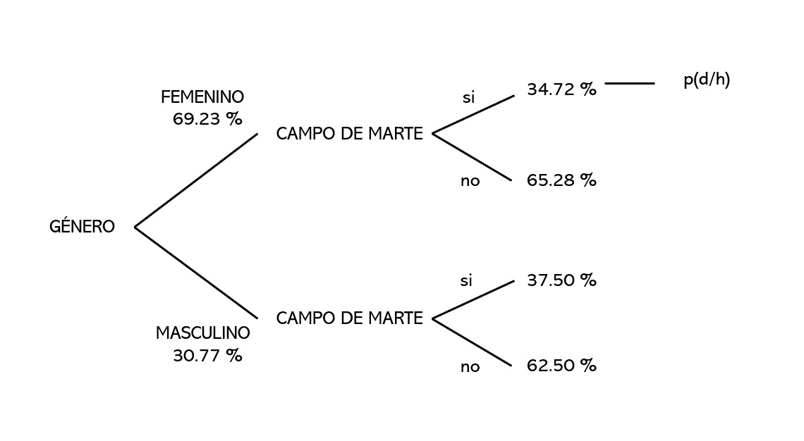
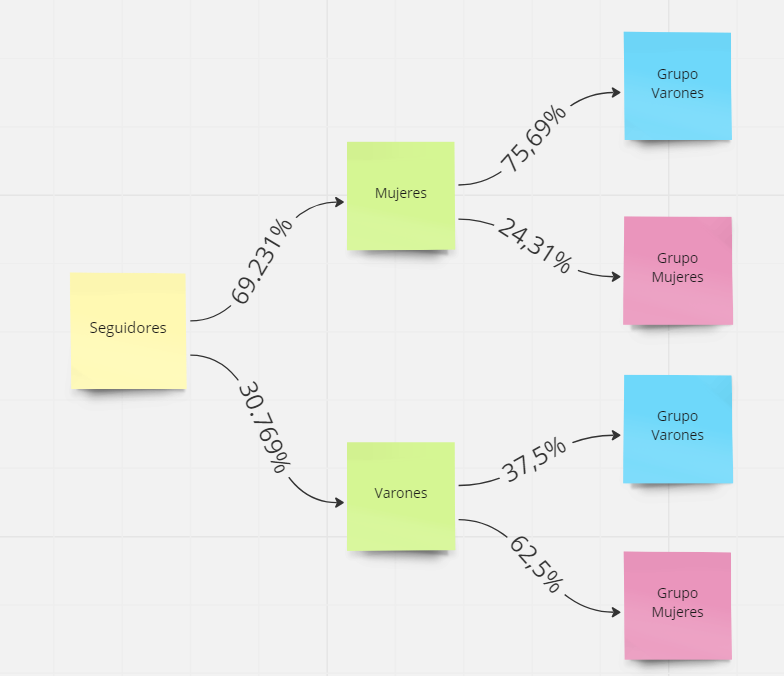

# Estudio de Mercado de la Comunidad K-POP en Lima Metropolitana

# Introducción

## Relevancia

Según estudios y datos obtenidos de la  Federación Internacional de la Industria Fonográfica (Ifpi) la industria musical de Corea del Sur ha logrado superar a otros países ocupando el puesto 5 a nivel mundial en 2005. Así, el Perú es uno de los países que se suman a la acogida de este género en los últimos años. Es posible conocer a partir de estudios anteriores la preferencia por determinados grupos, por ejemplo, BTS concentra el 93% de menciones en redes sociales en Perú, seguidamente existe una tendencia hacia la banda femenina BLACK PINK. Además,por lo general, la comunidad K-Pop que impone estas tendencias está conformada por jóvenes que a su vez forman parte de fan bases para conseguir visibilidad masiva en redes (Fernando Vega, 2019).

La relevancia de este proyecto radica en el hecho que el K-POP es uno de los géneros más acogidos actualmente. En 2019 los ingresos obtenidos a partir de streaming de este género ascendieron en un 47%. En nuestro país el K-Pop también se encuentra en apogeo, Perú aparece en la posición 11 y se ha convertido en el tercer país en América Latina con mayor contenido relacionado a este género musical en redes sociales (Twitter). Además, por lo general, los fans del K-POP tienen la tendencia de interesarse más por la cultura asiática. Por tanto, el presente tema resulta relevante ya que mediante un estudio de mercado será posible conocer la demanda que ofrece esta comunidad para el surgimiento de emprendimientos asociados al género, asi como entender el perfil de los seguidores del K-POP permitirá conocer por qué productos se inclina este público para una mejor oferta. 

## Planificación

Hemos representado las actividades que hemos realizado cada semana mediante un diagrama de Gantt:

```{r}
#Especificamos  las Actividades que realizamos

data_1 <- data.frame(Actividad = c("Plantear propuestas", "Identificación de las variables", "Recolección de datos", "Descripción de variables mediante descriptores", "Identificación del comportamiento de las variables", "Identificación de los patrones en las variables", "Reconocimiento de relaciones entre variables", "Validación de dependencias", "Postulación de hipótesis","Inferencia del comportamiento de las variables","Conclusiones e interpretaciones","Entrega de la P1","Plantemiento de Objetivos","Planteamiento de las Variables para las probabilidades","Planteamiento de Problemas Probabilisticos","Resolucion de Problemas Probabilisticos","Conclusiones respecto a los resultados obtenidos","Entrega de la P2"),

#Especificamos las semanas en las cuales se trabajo cada actividad                   
start = c(1, 3, 5, 6,6,6,6,6,6,7,7,7,9,10,11,12,13,14),
end = c(3, 5, 7, 7,7,7,7,7,7,8,8,8,10,11,12,13,14,15),

#Especificamos a que entrega pertenece
shift_type = c('PG0', 'PG0', 'PG1', 'PG1','PG1','PG1','PG1','PG1','PG1','PG1','PG1','PG1','PG2','PG2','PG2','PG2','PG2','PG2')
)
data_1
```

```{r}
#instalamos y cargamos el ggplot2
if(!require(ggplot2)){install.packages('ggplot2')}

#Creamos el diagrams de Gantt, donde visualizaremos el comienzo y termino de cada actividad.
ggplot(data_1, aes(x=start, xend=end, y=Actividad, yend=Actividad, color=shift_type)) +
  theme_bw()+ 
  geom_segment(size=6) + 
  labs(title='Planificación', x='Semanas', y='Actividades')
```
## Datos

### Proceso de recolección

Realizamos el proceso de recoleccion de datos mediante una encuesta realizada en google forms,esta encuesta fue difundida por redes sociales entre las cuales se encuentran Grupos de Whatsapp, Grupos de Telegram y Facebook orientados al género del Kpop en Lima, elegimos este medio debido a que las redes sociales son el medio de comunicación con mayor alcance en la actualidad.Al ver que las encuestas no subian de manera significativa, decidimos incluir un premio via sorteo, para las personas que rellenen nuestra encuesta.

<center></center>
<center>.png)</center>

Despues de aplicar estas dos estrategias y ver que las encuestas tampoco subian, decidimos realizar el proceso de recoleccion de manera presencial, el cual se desarrollo en la universidad UTEC, en donde ofrecimos dulces a las estudiantes que escaneen el codigo QR que los redirigia a nuestra encuesta.

<center></center>


**El Proceso de recoleccion se realizo del 20 al 28 de septiembre del 2022.**


### Poblacion de Estudio
La población en estudio se encuentra delimitada por la comunidad seguidora de K-Pop en Lima Metropolitana, Perú.

### Muestra
La muestra se encuentra conformada por 212 personas, las cuales se consideran seguidores de este género musical y habitan en Lima Metropolitana. 

### Tipo de muestreo
Se realizó un muestreo por conveniencia, y por lo tanto la muestra no es representativa, pues no hubo de por medio un proceso aleatorio para la selección de la muestra. La mayoría de las personas que conforman la muestra son estudiantes de UTEC (seguidores del género) que se encontraban dispuestos a completar la encuesta, en consecuencia existe un sesgo de selección.

## Variables
Explicamos cada variable presente en el estudio mediante la siguiente tabla:

|Pregunta|Variable|Tipo de variable|Restricciones|
|:----------------:|:----------:|:----------:|:------------:|
|¿Sigues el género del K-pop?|Seguidor |Categórica Nominal |Sí y No|
|¿Cuál es tu género?|Genero |Categórica Nominal |Femenino y Masculino |
|¿Cuál es tu edad?|Edad|Numérica Discreta |Número entero mayor a 0 |
|¿Desde hace cuántos años sigue el K-Pop? |Seguimiento |Numérica Discreta |Número entero mayor a 0 |
|¿Cuál es su grupo favorito? |Grupo_Favorito|Categórica Nominal |Ninguna |
|¿Cuál es el género de los integrantes de tu grupo favorito? |Genero_Grupo|Categórica Nominal |Masculino y Femenino|
|¿Formas parte de un fanclub? |FanClub|Categórica Nominal |Si y No|
|¿En qué lugar sueles encontrarte con otros fans? |Lugar_Fanclub|Categórica Nominal |Ninguna|
|¿Qué medio sueles utilizar con mayor frecuencia para informarte del mundo del K-pop?  |Medio_informacion |Categórica Nominal |Ninguna |
|¿Cuánto tiempo al día le dedicas a informarte sobre el grupo o artista que sigues? |Tiempo_dedicado |Numérica continua |Número mayor a 0 |
|¿Qué artículos relacionados al K-Pop compras o comprarías? |Gusto_productos |Categórica Nominal |Ninguna |
|¿Cuánto de dinero (S/.) estás dispuesto a pagar por un producto relacionado al K-Pop? |Presupuesto_producto |Numérica continua |Ninguna |
|¿Usualmente, mediante qué medio adquieres estos artículos? |Medios_adquisicion |Categórica Nominal |Tienda en línea y tienda física |
|¿Cuán importante consideras el K-POP en tu vida? |Importancia_Kpop |Numérica Discreta|Número natural entre 1 y 5|
|¿Alguna vez te haz sentido excluido por formar parte de esta comunidad? |Exclucion |Categórica nominal |Si y No |
|¿Qué te motiva a consumir contenido de K-pop? |Motivacion|Categórica Nominal |Ninguna |
|¿Qué sientes al escuchar K-pop?  |Sentimiento_Kpop |Categórica Nominal |Ninguna |


## Limpieza de Datos


1. Instalamos y cargamos las librerias :

Comenzamos Instalando los paquetes que usaremos:
# ```{r}
# install.packages("readr")
# install.packages("dplyr")
# install.packages("VennDiagram")
# install.packages("fastGraph")
# ```

Cargamos las librerias: 

```{r}
library(readr)
library(dplyr)
library(VennDiagram)
library(fastGraph)
```

Luego cargamos el archivo en formato cvs

```{r}
Kp <- read_csv("Estudio de mercado sobre la comunidad Seguidora de K-Pop (respuestas) - Respuestas de formulario 1(1).csv")
``` 

2. Analisis de los datos

Ahora vemos el numero de observaciones y variables de nuestra data antes de pasar por la limpieza de datos. 

```{r}
nrow(Kp)
ncol(Kp)
dim(Kp)
```
Ahora veremos los tipos de variables 

```{r}
str(Kp)
summary(Kp)
```

Observamos que solo tenemos 5 variables numericas y 14 variables categoricas, sin embargo para este estudio solo utilizaremos 12 variables categoricas 

Pasamos a ver cuantas cuantas casillas incompletas y datos faltantes hay en el dataframe

```{r}
sum(is.na(Kp))
```
```{r}
sum(!complete.cases(Kp))
```
Observamos que existen 1605 datos incompletos y 150 casos incompletos 


3. Renombrando las variables y limpiando la tabla

Previo a empezar con la limpieza de datos renombraremos el nombre de los datos 
usando el comando names observamos el nombre de cada variable y la renombraremos a una que nos sea mas facil de manipular 

```{r}
names(Kp)
```

**NO DEBE TENER** tildes, caracteres especiales y espacios 
Para poder comparar nuestro avance crearemos un clon de nuestra base de datos 
```{r}
Kpp = Kp
```

Utilizando el comando rename cambiamos nuestras variables 
```{r}
Kpp <- rename(Kpp,marca="Marca temporal", Seguidor = '1. ¿Sigues el genero del K-pop?', Genero = '2. ¿Cuál es tu género? Coloque el que figure en su DNI.', Edad='3. Edad (descrita en años):', Seguimiento= '4. ¿Desde hace cuantos años sigues el K-POP ?  Ejemplo: 10', GrupoFav = '5. ¿Cuál es tu grupo favorito? Especificar solo uno. Ejemplo: Stray Kids', Genero_Grupo = '6. Los integrantes del grupo que sigues son de género:' , FanClub = '7. ¿Formas parte de un fanclub?\n\nFanclub: Organización de fans que realizan actividades para difundir el grupo/idol que sigue.', Lugar_FanClub = '8. ¿En que lugar sueles encontrarte con otros fans?',Medio_infor = '9. ¿Qué medio sueles utilizar con mayor frecuencia para informarte del mundo del K-pop?', Tiempo_dedicado = '10. ¿Cuánto tiempo al día le dedicas a informarte sobre el grupo o artista que sigues? Responder en horas. Ejemplo: 5', Gusto_productos = '11. ¿Qué artículos relacionados al K-Pop compras o comprarías?',Presupuesto_prod = '12. ¿Cuánto de dinero (S/.) estás dispuesto a pagar por un producto relacionado al K-Pop?',Medios_adquisicion = '13. ¿Usualmente, mediante qué medio adquieres estos artículos?', Importancia = '15. ¿Cuán importante consideras el K-POP en tu vida?',Exclusion = '16. ¿Alguna vez te haz sentido excluido por formar parte de esta comunidad?', Motivacion = '17. ¿Qué te motiva a consumir contenido de K-pop?',Sentimiento_Kpop='18. ¿Qué sientes al escuchar K-pop?',marca='Marca temporal',direccion='Dirección de correo electrónico')
```


```{r}
names(Kpp)
```

Ahora solo eliminamos la primera y ultima columnas, cuyos datos no son de importancia para este estudio. 

```{r}
Kpp <- select(Kpp, -marca, -direccion)
```

Por ultimo borramos todos los casos incompletos. 

```{r}
Kpp <- na.omit(Kpp)
```


4. correcion de variables 

Ahora que la tabla esta lista podemos hacer una limpieza por variable. 


4.1. Grupos

```{r}
unique(Kpp$GrupoFav)
```
No esta correcto, procedemos a limpiar, pero antes observamos que hay un grupo que no corresponde a nuestro estudio. 

```{r}
filter(Kpp, GrupoFav=="Neffex")
```
```{r}
which(Kpp$GrupoFav=="Neffex")
```
Ahora que sabemos la fila procedemos a borrarla

```{r}
Kpop <- Kpp[-177,]
```

Procedemos a limpiar las respuestas.
 
```{r}
Kpop %>% mutate(GrupoFav=
        ifelse(GrupoFav %in% c("BTS","Bangtan", "Mi grupo favorito era BTS.","Bts","Bts, the rose, momoland, mamaoo, VAV, Stray kids, etc","BTS,EXO",
"Bangtan Sonyeondan (BTS)💜","Bts pave the way","bTsS","BTS💜","Bts, txt, ,ateez, itzy, stray kids,","bts","BTS, EXO, STRAY KIDS, TXT"), "BTS",
        ifelse(GrupoFav == "skz y ive" ,"SKZ",
        ifelse(GrupoFav %in% c("Blackpink","Black pinck","BLACKPINK","BlackPink","Black Pink","Black pink - f(x)","black pink","Black pink","Blacpink"),"BlackPink",
        ifelse(GrupoFav %in% c("Twice","TWICE", "twice","Twice y Red Velvet"),"Twice",
        ifelse(GrupoFav %in% c("Straykids","Stray Kids","STRAY KIDS","Stray kids"),"StrayKids",
        ifelse(GrupoFav == "ONEUS","Oneus",
        ifelse(GrupoFav %in% c("EXO","Exo"),"EXO",
        ifelse(GrupoFav == "ATEEZ","Ateez",
        ifelse(GrupoFav %in% c("Bug bang","Big bang","Big Bang"),"BigBang",
        ifelse(GrupoFav %in% c("Red Velvet","Red velvet"),"RedVelvet",
        ifelse(GrupoFav %in% c("Tomorrow by together ,bts" ,"TXT","Txt"),"TXT",
        ifelse(GrupoFav == "The Rose","TheRose",
        ifelse(GrupoFav == "iKON","Ikon",
        ifelse(GrupoFav %in% c("Shinee" ,"SHINee"),"Shinee",
        ifelse(GrupoFav == "Girls Generation","GirlsGeneration",GrupoFav )))))))))))))))) -> Kpop
``` 

4.2 Lugar
```{r}
unique(Kpop$Lugar_FanClub)
```


Limpiando la variable "lugar" 

```{r}
Kpop %>% mutate(Lugar_FanClub=
        ifelse(Lugar_FanClub %in% c("No me reúno :\"(" ,"no me dejan ir a juntas ☹️","En ningún lugar","No pertenezco a un club de fans","Mediante redes sociales","No asisto a reuniones presenciales","En Cines, No asisto a reuniones presenciales","Campo de Marte, Fiestas tematicas de K-POP, En Cines, En Cafes, En centros comerciales, No asisto a reuniones presenciales, Alameda 28 de Julio","No asisto a reuniones presenciales, Alameda 28 de Julio","En Cafes, No asisto a reuniones presenciales"),"No asisto a reuniones presenciales",Lugar_FanClub
               ))->Kpop
```

exportamos a formato excel nuestra base de datos

```{r}
library(openxlsx)
```


```{r}
write.xlsx(Kpop,"Kpop.xlsx")
```


```{r}
summary(Kpop)
```

Luego de dividir en columnas las variables con opciones multiples tenemos la siguiente base de datos_limpia.

```{r}
KP <- read.csv("Kpop_final.csv")
```

```{r}
summary(KP)
```


## Análisis Descriptivo
Antes de empezar a hacer el analisis planteamos como objetivos:

### Objetivo General

Realizar un estudio de mercado sobre el K-Pop con el propósito de conocer la demanda de la comunidad seguidora de este género a partir de datos como su edad , género, sus grupos favoritos, lugares de encuentro más frecuentes, motivación para consumir contenido K-Pop y sus sensaciones al momento de escucharlo. 

### Objetivo secundarios 

1. Determinar la preferencia en los encuestados grupos kpop en relación con su género y edad con el fin con el propósito de realizar un mapeo de nuestra población.

2. Determinar los productos y los lugares con mayor frecuencia de reuniones de seguidores de grupos kpop en relación con su edad, género y presupuesto con el propósito de brindar a nuevos emprendimientos posibles lugares donde poder ubicarse.

3. Determinar los medios más usados de esta comunidad por los cuales se enteran de eventos kpop con el propósito de brindar a nuevos emprendimientos un panorama de cuáles son los medios de información por los cuales se pueden difundir sus productos.


Procedemos a realizar la instalacion y carga de las librerias a utilizar.


```{r}
library(modeest)
library(dplyr)
```

Nombramos las siguientes funciones:
```{r}
redondear<-function(x){
  result<-round(x,2)
  return(result)
}

Numericos<-function(X){
  return(list(Min=redondear(min(X,na.rm=T)),
              Max=redondear(max(X,na.rm=T)),
              Moda=redondear(mfv(X,na_rm = T)),
              Media=redondear(mean(X,na.rm = T )), 
              Mediana=redondear(median(X, na.rm = T)), 
              Desviacion=redondear(sd(X,na.rm=T)), 
              Varianza=redondear(var(X,na.rm = T)),
              CV=redondear((sd(X,na.rm=T)/mean(X,na.rm=T)))))
}
```

En base al primer objetivo secundario planteamos  los siguientes graficos:

Realizamos una tabla de doble entrada de la edad y Genero de los seguidores:

```{r}
tapply(KP$Edad,KP$Genero, mean)
```
Realizamos un grafico de barras para poder visualizarlo graficamente:

```{r}
Genero_Edad<-table(KP$Genero,KP$Edad)
Genero_Edad
barplot(Genero_Edad,main = "Cantidad de Personas por Edad segun el Genero",xlab = "Edad",ylab = "Cantidad de personas", col=c("pink","blue"))
legend(x = "topright", legend = c("Femenino", "Masculino"), fill = c("pink", "blue"), 
       title = "Genero")
```
Según los resultados de la primera gráfica podemos observar lo siguiente, en las cifras significativas sin importar la edad hay una predominación de población de género femenino a comparación de los de genero masculino. Recomendamos a futuros emprendimientos averiguar formas de atraer publico masculino o especializarse en productos kpop para mujeres. 


Realizamos un boxplot que nos ayudara a representar la edad promedio de un seguidor

```{r eval=TRUE, echo=FALSE, message=FALSE, warning=FALSE, out.width = '80%'}
boxplot(KP$Edad,horizontal = TRUE,main="Edad de los seguidores de Kpop",xlab="Años",col="khaki1")
abline(v=mean(KP$Edad,na.rm=TRUE),col="darkgoldenrod4",lwd=2)

```
Pero si queremos ser especificos tenemos:
```{r}
tapply(KP$Edad,KP$Genero,mean)
```
Edad de los seguidores de kpop
Según los resultados de la gráfica podemos observar lo siguiente:
•	La media se encuentre entre 18 y 19
•	La mediana se aproxima a 19 
•	El primer cuantil es 17 
•	El tercer cuantil es 20
•	El IQR es igual a 3
Podemos deducir que la gran mayoría de nuestra población está en etapa de adultez temprana, los futuros emprendimientos deberán tenerlo en cuenta.


Por otro lado,en base al Segundo objetivo secundario planteamos los siguientes gráficos:

Verificamos la variable Presupuesto_prod
```{r}
mapply(Numericos, list(Presupuesto_productos=KP$Presupuesto_prod))

```

Hallamos un dato que se encuentra muy alejado de la realidad, procedemos a eliminarlo

```{r}
m<-max(KP$Presupuesto_prod)
i<-which(KP$Presupuesto_prod==m)
KP <- KP[-i,]
```

Realizamos un boxplot que nos ayudara a representar el presupuesto promedio de un seguidor
```{r eval=TRUE, echo=FALSE, message=FALSE, warning=FALSE, out.width = '85%'}
boxplot(KP$Presupuesto_prod, horizontal = TRUE,main="Distribución de presupuesto para la adquisicion de un producto", xlab="Presupuesto por adqusicion de producto (soles)",col="yellow")
abline(v=mean(KP$Presupuesto_prod,na.rm=TRUE),col="chocolate4",lwd=2)
```

```{r}
hist(KP$Presupuesto_prod,breaks=30,col="lightgray",main="Distribución del presupuesto gastado",ylab="densidad",xlab="Presupuesto (soles)",prob=TRUE)
abline(v=median(KP$Presupuesto_prod),col="red",lwd=2) 
abline(v=mean(KP$Presupuesto_prod),col="blue",lwd=2) 
legend(200,0.012,legend=c("Mediana","Media"),lwd=2,col=c("red","blue")) 

#hist: sirve para graficar un histograma, "col" se utiliza para dar color al histograma, "main" = título, "ylab" = eje y, "xlab" = eje x, 
#abline: permite colocar una linea en el histograma
#legend: leyenda, indicando primero posición por coordenadas, declaración de nombres,ancho de línea y colores
```
Según los resultados de la grafica podemos observar lo siguiente:
•	La media se encuentre entre 100 y 200
•	La mediana se aproxima a 100
•	El primer cuantil es aproximadamente 70
•	El tercer cuantil es aproximadamente 190
•	El IQR es igual a aproximadamente 120

Según los números los números observados se recomienda a los futuros emprendimientos colocar precios dentro de esos valores para atraer la mayor cantidad de clientes posibles.


Realizamos un conteo de los fanaticos que asisten a cada lugar:

```{r}
sum(KP$Campo.de.Marte=="si")
sum(KP$Campo.de.Marte=="no")
```

```{r}
sum(KP$Fiestas=="si")
sum(KP$Fiestas=="no")
```

```{r}
sum(KP$Cines=="si")
sum(KP$Cines=="no")
```

```{r}
sum(KP$Cafe=="si")
sum(KP$Cafe=="no")
```

```{r}
sum(KP$CentroComercial=="si")
sum(KP$CentroComercial=="no")
```

```{r}
sum(KP$Alameda28=="si")
sum(KP$Alameda28=="no")
```

```{r}
sum(KP$No.asiste=="si")
sum(KP$No.asiste=="no")
```

Realizamos un grafico en base a los datos obtenidos
```{r}
library(ggplot2)
  
# creating a dummy dataset
Cantidad_de_personas <- c(74,41,20,26,22,27,94)
  
Lugar_reunion <- c("C.Marte","F.Tematicas","Cines","Cafes","C.Comercial","A.28 de Julio","NA")
  
# creating data frame 
circle <- data.frame(Lugar_reunion,Cantidad_de_personas)
  
# creating plot using the above data
ggplot(circle, aes(Lugar_reunion,Cantidad_de_personas,fill=Lugar_reunion)) +
  geom_bar(stat="identity", position = "dodge") + 
  labs(title="Cantidad de personas por lugar de encuentro")
```
Según los resultados de la gráfica observamos una gran cantidad de personas de nuestra población no asiste a reuniones con otros grupos. Dentro de los lugares favoritos para reunirse campo de marte es el preferido por nuestra población, seguido de las fiestas temáticas. Por último, se observa que no hay predominancia dentro del resto de lugares. Como recomendación a futuros emprendimientos y tratar de ubicarse cerca al campo de marte. 


En base al Tercer Objetivo Secundario:

Realizamos un conteo de los medios que utilizan los fanaticos:

```{r}
sum(KP$television=="si")
sum(KP$television=="no")
```

```{r}
sum(KP$PaginasWeb=="si")
sum(KP$PaginasWeb=="no")
```

```{r}
sum(KP$Redes=="si")
sum(KP$Redes=="no")
```

```{r}
sum(KP$youtube=="si")
sum(KP$youtube=="no")
```

```{r}
sum(KP$radio=="si")
sum(KP$radio=="no")
```

```{r}
sum(KP$circulo=="si")
sum(KP$circulo=="no")
```

```{r}
sum(KP$paneles=="si")
sum(KP$paneles=="no")
```


Realizamos un grafico en base a los datos obtenidos
```{r}
library(ggplot2)
  
# creating a dummy dataset
Cantidad_de_personas <- c(13,65,181,122,7,45,2)
  
Medios_utilizados <- c("Televisión","Paginas_Web","Redes","Youtube","Radio","Circulo","Paneles")
  
# creating data frame 
circle <- data.frame(Medios_utilizados,Cantidad_de_personas)
  
# creating plot using the above data
ggplot(circle, aes(Medios_utilizados,Cantidad_de_personas,fill=Medios_utilizados)) +
  geom_bar(stat="identity", position = "dodge") + 
  labs(title="Cantidad de personas por medio utilizado")
```
Según los resultados obtenidos que la mayor parte de nuestra población se informa a través de alguna red social. Por lo tanto, como recomendación para futuros emprendimientos se sugiere hacer campañas a través de redes para llegar a una mayor parte de la comunidad kpop y así poder difundir sus productos.


### Casos especiales

Adicional a los objetivos planteados, también es importante conocer la principal razón por la que un fan de K_pop sigue a sus Idols dentro de esta comunidad. Para ello, se hizo uso del siguiente gráfico de barras: 

```{r}
library(ggplot2)
  
# creating a dummy dataset
Porcentaje <- c(175,108,10,51)/nrow(KP)
  
Influencia <- c("Contenido_musical","Personalidad_idols","Influencia_terceros","Atraccion_idols")
  
# creating data frame 
circle <- data.frame(Porcentaje,Influencia)
  
# creating plot using the above data
ggplot(circle, aes(Influencia, Porcentaje,fill=Influencia)) +
  geom_bar(stat="identity", position = "dodge") + 
  labs(title="Ínfluencia en el la decisión de ser seguidor o no de K_pop ")
  
```

Como se puede observar en el gráfico de barras, claramente una de las razones por las que una persona se hace seguidor de K_pop es por el contenido musical de sus Idols (82.367%) al mismo tiempo que la personalidad de estos (51.462%). Muy poco o nada tiene que ver la influencia de terceros en esta toma de decisión pues tan solo un 4.56% de los encuestados posee como influencia principal este ítem.


```{r eval=TRUE, echo=FALSE, message=FALSE, warning=FALSE}

barplot(table(KP$Tiempo_dedicado),cex.names = 1,las=1,ylim = c(0,100),main = "Tiempo dedicado a Informarse sobre su grupo favorito",xlab = "Numero de horas",ylab = "Numero de personas", col=c("mediumvioletred","blue","red","skyblue","green"))->hh
text(hh,table(KP$Tiempo_dedicado)+2.5, labels = table(KP$Tiempo_dedicado))
```

En base a este grafico podemos deducir que el mayor numero de personas dedican por lo menos 1 hora a informarse sobre el genero K-POP.

```{r}
mean(KP$Tiempo_dedicado)
```
Siendo el promedio de horas dedicadas de 2,16 horas.

Analizando los siguientes datos

```{r}
summary(lm(KP$Importancia~KP$Edad))
```
Esto nos indica que no hay una relacion directa entre el nivel de importancia y la edad de un seguidor de K-POP, por tanto el nivel de importancia varia de forma aleatoria a la edad que un seguidor posea.

Finalmente, se decidió analizar el nivel de importancia que tiene el K_pop en los seguidores de este género. Así, se hizo un gráfico de mozaico para analizar esta característica de esta población: 

```{r eval=TRUE, echo=FALSE, message=FALSE,warning=FALSE}
mosaicplot(table(KP$Genero,KP$Importancia),main="Importancia del K-pop por género",cex=0.6,las=1,col=c("orchid","darkolivegreen3","orange2","tomato","blue"))
```

Del gráfico claramente se observa que, en comparación a varones,  un mayor porcentaje de mujeres seguidoras de K_pop atribuyen a este género un nivel de importancia 5. Por otro lado, respecto al comportamiento de los seguidores de K_pop, en comparación a las de género femenino, un mayor porcentaje de varones seguidores de K_pop atribuye a este género un nivel de importancia de 2.  

# Analisis Probabilistico

## Objetivos

Los objetivos planteados para trabajar la parte probabilistica del proyecto son:

- Determinar los productos y los lugares con mayor frecuencia de reuniones de seguidores de grupos kpop en relación con género y presupuesto con el propósito de brindar a nuevos emprendimientos posibles lugares donde poder ubicarse.

- Determinar los medios más usados de esta comunidad por los cuales se enteran de eventos kpop con el propósito de brindar a nuevos emprendimientos un panorama de cuáles son los medios de información por los cuales se pueden difundir sus productos.

## Preguntas de Probabilidades

En base a los datos recolectados, podemos plantear las siguientes preguntas a analizar:

Antes de empezar necesitamos conocer el numero de varones y mujeres seguidoras de k-Pop.

### Porcentaje de mujeres y varones presentes en el estudio
```{r}
DF1<-data.frame(table(KP$Genero))
```

```{r}
P_muj=DF1[1,2]/(DF1[1,2]+DF1[2,2])

cat('El porcentaje de mujeres del total de encuestados es ',P_muj*100,'%. Por otro lado, el porcentaje de varones del total de encuestados es ',(1-P_muj)*100,'%')
```
Estos resultados pueden ser plasmados en el siguiente gráfico: 
```{r}
redondear(table(KP$Genero)/nrow(KP))-> Genero
xx<-barplot(Genero,las=1,ylim = c(0,1),main = "Genero de la población K-pop",xlab = "Género",ylab = "Frecuencia", col=c("pink","blue","orange")) 
text(xx, Genero+.06, labels = Genero)
```

Con estos valores, se procede a realizar el análisis probabilístico: 

## SIMPLE

#### 1. Dado que el 69.23% de seguidores del género K-POP son del género femenino, se desea saber cuán probable es que un seguidor de K_pop perteneciente a este género use como medio principal de información Youtube.

```{r}
DF_MI<-data.frame(table(KP$Genero,KP$youtube))
P_MY=DF_MI[3,3]/(DF_MI[3,3]+DF_MI[1,3])
cat('La probabilidad de que un seguidor de K_pop perteneciente al genero femenino use como medio principal de informacion Youtube es',P_MY*100,'%. Asi, el ',(1-P_MY)*100,'% de ellas prefiere otros medios de informacion')
```
#### 2. Dado que el 30.63% de seguidores de K_pop son de género masculino, se desea saber cuán probable es que este no asista a ningún lugar de encuentro.

```{r}
KP %>% mutate(No.asiste=
        ifelse(No.asiste %in% c("n"), "no",No.asiste
         )) -> KP
```

```{r}
DF_NE<-data.frame(table(KP$Genero,KP$No.asiste))
P_NE=DF_NE[2,3]/(DF_NE[2,3]+DF_NE[4,3])
cat('La probabilidad de que un seguidor de K_pop masculino no asista a ningun lugar de encuentro es: ',P_NE*100,'%')
```
## UNION

#### 3. Se desea conocer qué tan probable es que un seguidor de K_pop prefiera informarse sobre su grupo favorito por medio de redes sociales o youtube. 

```{r}
A<-filter(KP,Redes=="si")
B<-filter(KP,youtube=="si")
C<-filter(A,youtube=="si")

nrow(A)
nrow(B)
nrow(C)
nrow(KP)
```
```{r}
library(VennDiagram)
```

```{r}
grid.newpage()
draw.pairwise.venn(area1=round(nrow(A)*100/nrow(KP),digits = 2),
                   area2=round(nrow(B)*100/nrow(KP),digits = 2),
                   cross.area=round(nrow(C)*100/nrow(KP),digits = 2),
                   col = 'red',
                   lty="blank",
                  fill = c("red","blue"),
                  category = c("Redes Sociales","Youtube"),
                  cex = 1,
                	cat.cex = 1,
                  cat.just=list(c(0.5, -2), c(0.5, -2)),
                  ind = TRUE)

```

```{r}
cat('La probabilidad de que un seguidor de K_pop prefiera informarse sobre su grupo favorito por medio de redes sociales o youtube es : 96.63 %, lo que indica que un 3.37% de los encuestados no prefiere ninguno de estos dos medios para informarse respecto a la cultura K_pop')
```

## INTERSECCION

#### 4. En base a nuestro estudio obtuvimos que el grupo más seguido es BTS, por ello queremos saber qué tan probable es que un seguidor de BTS, se reúna en campo de marte y en un Centro Comercial.

```{r}
KP_BTS<-filter(KP,GrupoFav=='BTS')
FIL<-KP_BTS %>% filter(Campo.de.Marte=='si'& CentroComercial=='si')
CM<-filter(KP,Campo.de.Marte=='si')
CC<-filter(KP,CentroComercial=='si')
```

```{r}
grid.newpage()
draw.pairwise.venn(area1=round(nrow(CM)*100/nrow(KP),digits = 2),
                   area2=round(nrow(CC)*100/nrow(KP),digits = 2),
                   cross.area=round(nrow(FIL)*100/nrow(KP),digits = 2),
                   col = 'red',
                   lty="blank",
                  fill = c("pink","green"),
                  category = c("C.Marte","C.Comercial"),
                  cex = 1,
                	cat.cex = 1,
                  cat.just=list(c(-3, 1), c(2, 1)),
                  ind = TRUE)

```


# CASOS DE TEOREMA DE BAYES


### PROBLEMA 1

  Un comerciante al informarse sobre el gran apogeo que tiene la cultura de K-POP en el Perú desea       montar una tienda de negocio en el campo de    marte. El comerciante sl buscar informacion sobre si era    rentable montar un negocio en ese lugar, encuentra un estudio de mercado realizado por    estudiantes     de UTEC, en el cual mencionan que de un grupo de 208 seguidores del genero K-POP, el 69.231% eran      mujeres y el 30.769% eran      varones, ademas en el estudio mencionan que 25.77% de mujeres prefieren ir    al campo de marte a reunirse con otros Fans, mientras que el 62.5%      de varones prefieren ir a otros     lugares a eunirse con otros Fans.Considerando los datos anteriormente mostrados el comerciante desea
  conocer :

  a) ¿Cual es la probabilidad de que las mujeres opten por ir al campo de marte a reunirse?
  b) Si se escogiera un seguidor al azar ¿cual seria la probabilidad de que no quiera reunirse en el campo de marte?
  c) ¿Cual seria la probabilidad de que por lo menos 80 personas desearan ir al campo de marte?
   
Lo primero que se hará es plantear el diagrama de árbol para tener una visión mas clara de los datos

<center></center>

### Item a.

Como se puede observar en este diagrama, el porcentaje de mujeres que hay p(m) es el 69.23 % (0.6923),asimismo observamos que el porcentaje de mujeres que asisten al campo de marte p(m|c) es el 34.72 %(0.3472).

```{r}
p_m = 0.6923
p_mc = 0.3472
```

Para poder obtener la probabilidad planteada tendremos que multiplicar los dos valores obtenidos:
```{r}
prob_1=p_m*p_mc
prob_1
```

```{r}

cat('Es asi que obtenemos que la probabilidad que una seguidora de K-Pop opte como lugar de encuentro el Campo de Marte es del',prob_1*100,"%")
```

### Item b

A travez del diagrama podemos obtener que el 69.231% son mujeres y que de este grupo el 65.28% no prefiere reunirse en el campo de marte, por otro lado tambien observamos que el 30.769% son varones y que el 62.5% de ellos no prefieren reunirse en el campo de marte.

```{r}
p_m=0.69231
p_mnc=0.6528
p_h=0.30769
p_hnc=0.625
```

Para poder obtener la probabilidad planteada tendremos que multiplicar la probabilidad en mujeres y sumarla con la de varones.

```{r}
prob_2=(p_m*p_mnc)+(p_h*p_hnc)
prob_2
```

```{r}
cat('Es asi que obtenemos que la probabilidad de escoger al azar un seguidor de K-Pop que no opte como lugar de encuentro el Campo de Marte es del',prob_2*100,"%")
```
### Item c

Para empezar debemos hallar la probabilidad de que un seguidor quiera reunirse en el campo de marte, para ello recolectamos los datos del diagrama del árbol:

```{r}
p_m=0.6923   # seguidoras mujeres
p_mc=0.3472  # seguidoras mujeres que desean ir al campo de marte
p_h=0.3077   # seguidores varones
p_hc=0.3750  # seguidores varones que desean ir al campo de marte
```

Para poder obtener la probabilidad planteada tendremos que multiplicar la probabilidad en mujeres y sumarla con la de varones.

```{r}
prob_3=(p_m*p_mc)+(p_h*p_hc)
prob_3
```
Ahora que tenemos la probabilidad, utilizaremos distribución binomial para obtener la probabilidad planteada:
```{r}
n=208 # numero de encuestados
x=80  # Nos piden x<= 80
prob_4=pbinom(x,n,prob_3)
prob_4
```

```{r}
cat('Es asi que obtenemos que la probabilidad de que al menos 80 seguidores de K-Pop opten como lugar de encuentro el Campo de Marte es del',prob_4*100,"%")
```
A través del ultimo resultado podemos plantear el siguiente gráfico:

```{r}
shadeDist(80,"dbinom",208,0.3557541)
```
En el grafico podemos observar la distribucion binomial de la probabilidad planteada.

## PROBLEMA 2

   Un grupo de estudiantes de UTEC, quiere realizar un emprendimiento, pero no sabe cual, para ello 
   realizan una busqueda de informacion sobre estudios de mercados realizados en Lima. Es asi como encuentran un estudio de mercado realizado            sobre la comunidad Kpop en Lima,los estudiantes les parece interesante el tema por lo eligen.Para empezar ellos deciden comprar productos             relacionados al genero de los grupos de Kpop,entonces revisan el proyecto a profundidad y obtenienen que de 208 encuestados el 69.231% eran mujeres    y el 30.769% eran varones, por otro lado tambein    mencionan que el porcentaje de mujeres que siguen un grupo conformado por varones es del 75.69%    y que el porcentaje de varones que siguen a un grupo de mujeres es del 62.5%.
   
   En base a la información planteada los estudiantes desean saber :
   
   a) Si se escogiera una persona al azar,*¿Cuál es la probabilidad que esta persona siga a un grupo conformado por mujeres?*
   
   b) Cual es la probabilidad que 15 seguidoras o mas sigan a un grupo conformado por varones.
   
   c) Cual es la probabilidad que mas de 20 personas pero menos de 80, siguen a un grupo conformado por varones.

Lo primero que se hará es plantear el diagrama de árbol para tener una visión mas clara de los datos

<center></center>

### Item a

A travez del diagrama podemos obtener que el 69.231% son mujeres y que de este grupo el 24.31% siguen a un grupo conformado por mujeres, por otro lado también observamos que el 30.769% son varones y que el 62.5% siguen a un grupo conformado por mujeres.

```{r}
p_m=0.69231
p_mm=0.6528
p_h=0.30769
p_hm=0.625
```

Para poder obtener la probabilidad planteada tendremos que multiplicar la probabilidad en mujeres y sumarla con la de varones.

```{r}
prob_5=(p_m*p_mm)+(p_h*p_hm)
prob_5
```

```{r}
cat('Es asi que obtenemos que la probabilidad de escoger al azar un seguidora de K-Pop que siga a un grupo conformado por mujeres es del',prob_5*100,"%")
```

### Item b

Para empezar debemos hallar la probabilidad de que un seguidora siga a un grupo conformado por varones:

```{r}
p_m=0.6923   # seguidoras mujeres
p_mm=0.6528  # seguidoras mujeres que desean ir al campo de marte
```

Para poder obtener la probabilidad planteada tendremos que multiplicar los dos valores dados.

```{r}
prob_6=p_m*p_mm
prob_6
```

Ahora que tenemos la probabilidad, utilizaremos distribucion binomial para obtener la probabilidad plateada:
```{r}
n=208 # numero de encuestados
x=91 # Nos piden P(x>= 91)
# Esto es igual a 1 - P(x<= 90)
prob_7=1 - pbinom(x-1,n,prob_6)
prob_7
```

```{r}
cat('Es asi que obtenemos que la probabilidad de que al menos 15 seguidores o mas de K-Pop sigan a un grupo conformado por varones es del',prob_7*100,"%")
```

Utilizaremos un grafico para poder representar mejor la distribucion binomial

```{r}
shadeDist(90,"dbinom",208,prob_6,lower.tail = F)
```

### Item c

Para empezar debemos hallar la probabilidad de que una persona siga a un grupo conformado por varones:

```{r}
p_m=0.69231
p_mh=0.7569
p_h=0.30769
p_hh=0.375
```

Para poder obtener la probabilidad planteada tendremos que sumar la probabilidad en varones y mujeres.

```{r}
prob_8=p_m*p_mh + p_h*p_hh
prob_8
```

Ahora que tenemos la probabilidad, utilizaremos distribucion binomial para obtener la probabilidad plateada:
```{r}
probabilidad=prob_8
n=208 # numero de encuestados
# Nos piden P(21<=x<=79)
# Esto es igual a P(x<=79) - P(x<=20)
#Consideramos 21 y 79 dentro de la inecuacion ya que nos piden mas de 20 y menos de 80, seindo asi que
# que no se consideran estos valores.
prob_9=pbinom(79,n,probabilidad) - pbinom(20,n,probabilidad)
prob_9
```

```{r}
cat('Es asi que obtenemos que la probabilidad de que mas de 20 seguidores de K-Pop y menos de 80 seuidores de K-Pop sigan a un grupo conformado por varones es del',prob_9*100,"%")
```

Para apreciar mejor la distribucion binomial lo pondremos en un grafico.
```{r}
shadeDist(c(20,79),"dbinom",208,prob_8, lower.tail = F)
```

# Casos adicionales

Para poder determinar si la variable aleatoria edad puede ser modelada por un modelo normal se tuvo el criterio de observación de su gráfico y de la simulitud o cercanía de sus valores de la media, la mediana y la moda.

```{r eval=TRUE, echo=FALSE, message=FALSE,warning=FALSE}
Descrip<-function(X){
  return(list('Media    '=round(mean(X,na.rm = TRUE ),2), 'Mediana   '=round(median(X, na.rm = TRUE),2), 'Moda    '=as.numeric(names(which(table(X)==max(table(X)))))))}
```

```{r eval=TRUE, echo=FALSE, message=FALSE,warning=FALSE}
mapply(Descrip, list('Edad del seguidor (año)'=KP$Edad))
```

Los valores que son más frecuentes o que tienen más probabilidad de aparecer están alrededor de la media.

```{r eval=TRUE, echo=FALSE, message=FALSE,warning=FALSE, out.width = '90%'}
hist(KP$Edad, breaks=20, freq = FALSE, main="Histograma de edad de seguidores de K_pop",xlab="Edad (años)",ylab = "Densidad",col = "lightblue")
curve(dnorm(x, mean(KP$Edad), sd = sd(KP$Edad)), # Función dnorm a evaluar
      10, 26, 140, # Límites de x y nº de valores a evaluar
      col = "red", 
      las = 1, # Etiquetas alineadas horizontalmente
      ann = FALSE, # Sin títulos en los ejes
      xaxp = c(10, 80, 10),  # Marcas del eje x
      ylim = c(0,0.05), # Límites del eje
      yaxs = "i", add = TRUE) # Estilo del eje y, ajustado a los límites
points(KP$Edad, dnorm(KP$Edad, mean(KP$Edad), sd = sd(KP$Edad)), ylab = "f(x)", pch = 20,  lwd = 1, col = "navyblue")

```

* Apreciamos que la mayoría de los datos están concentrados entre 17 y 20.

* Los valores de la media, moda y mediana son parecidos, por lo cual la variable se distribuye de manera casi simétrica.


Finalmente, las variables que al parecer se aproximan a un modelo exponencial son los años de seguimiento al género Kpop (Seguimiento) y la y el tiempo dedicado por los seguidores de este género para informarse respecto a a todo lo referente de sus Idols (Tiempo_Dedicado), para poder corroborar una modelación adecuada compararemos el parámetro lambda con el valor máximo de la función de densidad

```{r eval=TRUE, echo=FALSE, message=FALSE,warning=FALSE}
Descrip2<-function(X){
  return(list('Lambda'=round(1/mean(X,na.rm = TRUE ),4)))}
```

```{r eval=TRUE, echo=FALSE, message=FALSE,warning=FALSE}
mapply(Descrip2, list('Consumo mensual'=KP$Seguimiento, 'Inversión'=KP$Tiempo_dedicado))
```
```{r eval=TRUE, echo=FALSE, message=FALSE, warning=FALSE,  out.width = '90%'}

op=par(mfrow=c(1,2))

#-----------------------------------

hist(KP$Seguimiento, breaks=10, freq = FALSE, main="Años de seguimiento",xlab="(años)",ylab = "Densidad", col="olivedrab1")
curve(dexp(x, 1/mean(KP$Seguimiento,na.rm = TRUE)),
      0, 60, 170, 
      col = "red", 
      las = 1, 
      ann = FALSE, 
      xaxp = c(0, 100, 10),  
      ylim = c(0,0.1), 
      yaxs = "i", add = TRUE)
points(KP$Seguimiento, dexp(KP$Seguimiento, 1/mean(KP$Seguimiento,na.rm = TRUE)), ylab = "f(x)", pch = 20,  lwd = 1, col = "green4")

#------------------------------------
lamda_inversion = 1/mean(KP$Tiempo_dedicado)
hist(KP$Tiempo_dedicado, breaks=20, freq = FALSE, main="Tiempo para informarse",xlab="horas",ylab = "Densidad", col="khaki")
curve(dexp(x, 1/mean(KP$Tiempo_dedicado)), 
      0, 600, 2000, 
      col = "red", 
      las = 1, 
      ann = FALSE, 
      xaxp = c(0, 50, 10), 
      ylim = c(0,0.1), 
      yaxs = "i", add = TRUE) 
points(KP$Tiempo_dedicado, dexp(KP$Tiempo_dedicado, lamda_inversion), ylab = "f(x)", pch = 20,  lwd = 1, col = "goldenrod4")

par(op)
```
### Observaciones de la variable "años de seguimiento al género"

* Al hallar el lambda del histograma muestra se obtuvo un alto nivel de parecido a una distribución exponencial con un lambda igual a 0.1820.

* Una discordancia con el modelo exponencial es que una variable exponencial tiende al infinito, pero en este los años de seguimiento  es finito (nadie puede seguir al género por infinitos años)

### Observaciones de la variable "tiempo para informarse sobre el género"

* Al hallar el lambda del histograma muestra se obtuvo un alto nivel de parecido a una distribución exponencial con un lambda igual a 0.4622.

* Una discordancia con el modelo exponencial es que una variable exponencial tiende al infinito, pero en este el tiempo para informarse al día sobre el género  es finito (nadie puede seguir al género por infinitos años)


## Bibliografía

El modelo económico del K-pop, la industria cultural que se toma al mundo. (s/f). Diario La República. Recuperado el 30 de septiembre de 2022, de (https://www.larepublica.co/ocio/el-modelo-economico-detras-del-k-pop-2828863)

El Kpop, un fenómeno impactante en las redes sociales de Perú. (s/f). Com.pe. Recuperado el 30 de septiembre de 2022, de (https://www.businessempresarial.com.pe/el-kpop-un-fenomeno-impactante-en-las-redes-sociales-de-peru/)


