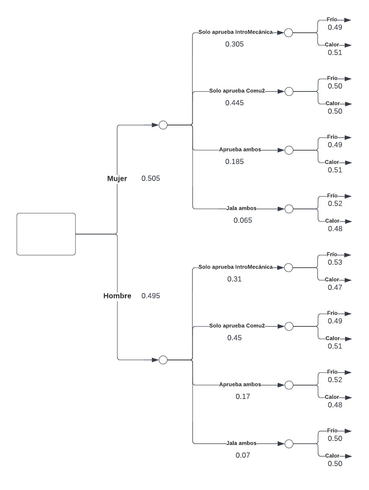
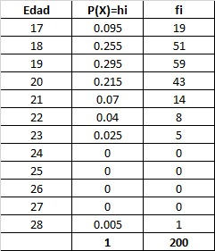

# **1. Introducción**:

## 1.1 Relevancia: 

El clima presenta diversos efectos en las personas. Esto puede variar su comportamiento, así como el rendimiento que tiene frente a las actividades que realiza. En tal sentido, se busca evaluar el impacto que tiene la misma frente al rendimiento académico de los estudiantes de UTEC. De esa forma, se pueden tomar decisiones respecto a los resultados y buscar o mantener las medidas frente a los diversos cambios de clima. Un estudio de la universidad de Harvard mostró que el calor afecta el rendimiento de los estudiantes, alegando que induce a una concentración más baja (BBC, 2018) ([enlace del estudio](https://www.bbc.com/mundo/noticias-44316754)).Este proyecto se encarga de analizar los posibles factores que alteran los resultados académicos en los estudiantes de la UTEC dado que la ubicación del campus está sometida a diferentes variaciones climáticas a lo largo del año. La información climática se tomó del software [Power Larc Nasa](https://power.larc.nasa.gov/data-access-viewer/). En primer lugar se escogieron 2 cursos de diferentes áreas: Introducción a la Mecánica (Ciencias) y Comunicación 2 (Humanidades). Con la elección de curso, se buscó en el sílabus de cada una de ellas las fechas de las evaluaciones, tanto el parcial como el final. La fecha del parcial de ambas evaluaciones fue el 09/05/2022, y la fecha del final fue el 04/07/2022. A partir de esa información, se buscó en el software la temperatura correspondiente, teniendo así que para el parcial se tuvo un 19°C y para el final un 13°C. Nuestros objetivos son los siguientes :

## 1.2 Objetivos Generales: 

- Determinar el efectos de la climatología (frío y calor) en el Desempeño Académico de los estudiantes de la Universidad de Ingeniería y Tecnología

- Determinar los factores que influyeron en  las evaluaciones de 2 cursos de diferentes áreas: Introducción a la Mecánica (Ciencias) y Comunicación 2 (Humanidades)en los estudiantes de la Universidad de Ingeniería y Tecnología

- Analizar la temperatura correspondiente al rendir sus evaluaciones parciales y finales en cursos de Ciencias y Humanidades de los estudiantes de la Universidad de Ingeniería y Tecnología

## 1.3 Objetivos Específicos: 

- Comparar las notas tanto del parcial como del final en los estudiantes de la Universidad de Ingeniería y Tecnología

- Determinar la referencia del Clima para dar una evaluación en los estudiantes de la Universidad de Ingeniería y Tecnología

- Determinar cómo afecta el calor en la concentración en los estudiantes de la Universidad de Ingeniería y Tecnología

- Determinar cómo afecta el frío en la concentración  en los estudiantes de la Universidad de Ingeniería y Tecnología

- Determinar las medidas para enfrentar el frío en una evaluación en los estudiantes de la Universidad de Ingeniería y Tecnología

- Determinar las medidas para enfrentar el calor en una evaluación  en los estudiantes de la Universidad de Ingeniería y Tecnología

- Determinar las sensaciones que genera el calor en una evaluación en los estudiantes de la Universidad de Ingeniería y Tecnología

- Determinar las sensaciones que genera el frío en una evaluación en los estudiantes de la Universidad de Ingeniería y Tecnología

## 1.4 Planificación: 

División de tareas de acuerdo a las capacidades de cada integrante mediante un diagrama de Gantt.

```{r}
if(!require(ggplot2)){install.packages('ggplot2')} 
```
<center><H3><FONT COLOR="black">..................................................................................................................</FONT></H3></center>

# **2.Datos**:

## 2.1 Proceso de recolección de datos:

+  Primero establecimos el público objetivo para nuestro estudio, en este caso nuestra encuesta fue dirigida a los estudiantes del tercer ciclo, quienes ingresaron en el año 2021-2.

+  Luego nos enfocamos en elaborar las preguntas de acuerdo al tema que vamos a investigar. Una vez elaboradas las preguntas, establecimos 18 variables para nuestro estudio y mediante la herramienta de google forms creamos nuestro formulario.

+  Compartimos el formulario por medio de las redes sociales (whatsapp y telegram), tanto en los grupos como en nuestros contactos. Con el fin de llegar a los 200 encuestados, nuestro grupo decidió utilizar la estrategia de sortear s/. 100 logrando así obtener 206 formularios llenados.

+  Finalmente, todos los datos obtenidos lo exportamos en un archivo excel para luego continuar con la limpieza de datos.

## 2.2 Población, muestra y muestreo :

+ **Población de estudio:** Estudiantes de UTEC con matrícula vigente en el año 2022-2

+ **Unidad muestral:** Estudiantes de tercer ciclo de UTEC ingresantes en el año 2021-2 que pertenecen a diferentes carreras.

+ **Tamaño de la muestra:** 200 estudiantes del tercer ciclo

+ **Tipo de muestreo:** El tipo de muestreo que se seleccionó fue no probabilístico por conveniencia  

## 2.3 Variables:
+ Variables de estudio
    + |Variable | Tipo        | Escala      | Restricción |
|---------------|-------------|-------------|-------------|
|Edad (E)|Numérica|Discreta|Solo se puede digitar números enteros positivos entre 15 y 30
|Género (G)|Categórica|Nominal| Solo puede marcar las opciones dadas
|Carrera (C)|Categórica|Nominal|Solo puede marcar las opciones dadas
|Nota del examen parcial de comunicación (NPC)|Numérica|Discreta|Solo se puede digitar números positivos entre 0 y 20
|Nota del examen final de comunicación (NFC)|Numérica|Discreta|Solo se puede digitar números positivos entre 0 y 20
|Concentración en calor (CC)|Categórica|ordinal|Solo se puede elegir una opción de la escala 
|Concentración en frío (CF)|Categórica|ordinal|Solo puede marcar las opciones dadas
|Medidas en frío (MF)|Categórica|Nominal|Solo se digita texto máximo 10 palabras
|Medidas en calor (MC)|Categórica|Nominal|Solo se digita texto máximo 10 palabras
|Nota del examen parcial de Introducción a la Mecánica (NPIM)|Numérica |Discreta|Solo se puede digitar números positivos entre 0 y 20
|Nota del examen final d e Introducción a la Mecánica (NFIM)|Numérica |Discreta|Solo se puede digitar números positivos entre 0 y 20
|Preferencia de clima (PC)|Categórica|Nominal|Solo elegir dos dos opciones entre “Frío o calor"
|Mejora de estudio con calefacción (MEC)|Categórica|ordinal|Solo se puede elegir una opción de la escala 
|Mejora de estudio con aire acondicionado (MEA)|Categórica|ordinal|Solo se puede elegir una opción de la escala 
|Sensación con calor (SC)|Categórica|ordinal|Solo se digita texto máximo 10 palabras
|Sensación con frío (SF)|Categórica|ordinal|Solo se digita texto máximo 10 palabras
|Toma examen de comunicación en universidad (TECU)|Categórica|Nominal |Solo se puede elegir dos opciones entre “si o no"
|Toma examen de Intro a la mecánica  en universidad (TEIMU)|Categórica|Nominal|Solo se puede elegir dos opciones entre “si o no"

## 2.4 Limpieza de base de datos:

+ Para la instalación de paquetes, usamos el siguiente comando para asegurar que cualquier máquina pueda compilarlo:

"if(!require()){install.packages('')}"

+ Luego, llamamos a las respectivas librerías:

```{r}
library(readr)
library(dplyr)
library(modeest)
library(ggplot2)
library(DescTools)
library(tidyverse)
library(ggthemes)
library(descr)
library(fastGraph)
```

+ Posteriormente, introducimos nuestra base de datos al R:

```{r}
Clima<- read_csv("Datos.csv")

```

+ Ahora detectamos si se tienen datos incompletos en la data. Además, verificamos si la tenemos todos los datos completos:
```{r}
sum(is.na(Clima)) #is.na() -> este comando detecta los datos incompletos; sum -> sumar

sum(!is.na(Clima)) #!is.na() -> es la negación de is.na, es decir, indica los datos completos. 
```

+ Al descargar la data del forms, por defecto crea una variable llamada "Marca Temporal". Como esa variable no aporta al estudio, lo eliminamos:

```{r}
Clima %>% select(-1) -> Clima1
```

+ A continuación, verificamos los nombres de las variables:

```{r}
names(Clima1)
```
+ Como los nombres son muy largos, los renombramos a palabras clave:

```{r}
colnames(Clima1)[1:18] <- c("E","C","G","CC","CF","MC","MF","PC","MEA","MEC","SC","SF","TEIMU","NPIM","TECU","NFIM","NPC","NFC")
```

+ Asimismo, nuestro estudio solo contempla a las personas que hayan dado su examen parcial en la Universidad. Para ello, filtramos la información y eliminamos las observaciones que no cumplan con dicho requisito:

```{r}
Clima1[Clima1$TEIMU=="Si", ] -> Clima2
```

+ Por otro lado, verificamos que los datos no tengan valores repetidos. De tenerlos los cambiamos. Iniciamos con las notas del parcial de intro a mecánica:

```{r}
unique(Clima2$NPIM) 
```

```{r}
Clima2 %>% mutate(NPIM=
         ifelse(NPIM=="07","7",
         ifelse(NPIM=="09","9",
         ifelse(NPIM=="14.5","15",  
         ifelse(NPIM=="08","8", 
         ifelse(NPIM %in% c("0000","00"),"0", NPIM
         )))))) -> Clima2
```

+ Luego, con las notas del final de intro a mecánica:

```{r}
unique(Clima2$NFIM) 
```

```{r}
Clima2 %>% mutate(NFIM=
         ifelse(NFIM=="09","9",
         ifelse(NFIM=="03","3",
         ifelse(NFIM=="05","5",
         ifelse(NFIM %in% c("0000","00"),"0", NFIM
         ))))) -> Clima2
```

+ Luego, con las notas del parcial de comunicación:

```{r}
unique(Clima2$NPC) 
```

```{r}
Clima2 %>% mutate(NPC=
         ifelse(NPC=="08","8",
         ifelse(NPC=="12.","12",
         ifelse(NPC=="00","0", NPC
         )))) -> Clima2
```

+ Luego, con las notas del final de comunicación:

```{r}
unique(Clima2$NFC) 
```

```{r}
Clima2 %>% mutate(NFC=
         ifelse(NFC=="00","0", NFC
         )) -> Clima2
```

+ Asimismo, verificamos que las variables correspondan a su tipo respectivo:

```{r}
str(Clima2)
```
+ Como las notas están en tipo char, los cambiamos a tipo int:

```{r}
Clima2$NPIM= as.numeric(Clima2$NPIM)
Clima2$NFIM= as.numeric(Clima2$NFIM)
Clima2$NPC= as.numeric(Clima2$NPC)
Clima2$NFC= as.numeric(Clima2$NFC)
```

En resumen, se realizó una limpieza exhaustiva, analizando cada fila y columna, tomando días para el grupo la limpieza de datos para tener buenos resultados en el análisis y descripción de cada una de las variables.

<center><H3><FONT COLOR="black">..................................................................................................................</FONT></H3></center>

# **3. Análisis descriptivo **:

## 3.1. Descriptores numéricos:

Primero realizaremos un análisis univariado de nuestras variables a estudiar, esto con el fin de evitar sesgos y verificar si tenemos datos atípicos para que a partir de ello sacar nuestros descriptores.

### a. Edad:

```{r}
 boxplot(Clima2$E, 
        main = "GRAFICO 1:  Edad",horizontal = TRUE,
        boxwex = 0.5,col="lightblue")
```

Observamos que existe 1 dato atípico. Esto es normal dado que en un colectivo de estudiantes no necesariamente los que llevan un curso general son jóvenes. En este caso, la edad atípica es de 28 años. La mayoría se conglomera entre los 19 años

```{r}
cat('Moda:',round(Mode(Clima2$E),2),'\n')
cat('Mediana:',round(median(Clima2$E),2),'\n') 
cat('Desviación Estándar:',round(sd(Clima2$E),2),'\n')
cat('Rango:',round(range(Clima2$E),2),'\n') 
cat('Rango Intercuartil:',round(IQR(Clima2$E),2),'\n') 
cat('Coeficiente de Variación:', round((sd(Clima2$E)/mean(Clima2$E))*100,2),'\n')
```

Podemos ver que a partir de lo realizado el 68% de los encuestados tiene una edad mayor o igual que 19 y el 32.2  menor a este número. La mayor parte de encuestados tiene 19 años de edad. Asimismo, podemos ver el coeficiente de variación es 7.87 por lo que los datos son homogéneos. En resumen, se podría decir que los datos tienen poca variabilidad.

```{r}
hist1<-hist(Clima2$E,
            main="GRAFICO 2: Edad de los estudiantes de UTEC",
            col=rainbow(8),xlab="Edad",
            ylab="Frecuencia") 
abline(v=mean(Clima2$E),   
       col="orange",    
       lwd=3)        
abline(v=median(Clima2$E),
       col="blue",
       lwd=3)
abline(v=19,    
       col="red",
       lwd=3)
```

### b. Nota del examen parcial de Comunicación:

```{r}
 boxplot(Clima2$NPC, 
        main = "GRAFICO 3:  Notas del Parcial de Comunicación",horizontal = TRUE,
        boxwex = 0.5,col="orange")
```

A partir de lo realizado existen 2 datos atípicos. Esto quiere decir existe 2 notas bajas en comparación con las demás, lo cual es viable porque se está trabajando con notas de estudiantes que si pueden llegar a tener las notas que tienen números atípicos, por lo que no lo eliminamos pero ya no determinaremos la media ya que no sería una medida adecuada.

```{r}
cat('Moda:',round(Mode(Clima2$NPC),2),'\n')
cat('Mediana:',round(median(Clima2$NPC),2),'\n') 
cat('Desviación Estándar:',round(sd(Clima2$NPC),2),'\n')
cat('Rango:',round(range(Clima2$NPC),2),'\n') 
cat('Rango Intercuartil:',round(IQR(Clima2$NPC),2),'\n') 
cat('Coeficiente de Variación:', round((sd(Clima2$NPC)/mean(Clima2$NPC))*100,2),'\n')
```

A partir de lo realizado podemos mencionar que la mitad de los encuestados tienen una nota mayor o igual que 15 y la otra mitad, mayor a este número. La mayor parte de encuestados tiene 16 de nota. Asimismo, podemos ver que las notas no varían mucho respecto a su media, por lo que las notas de los estudiantes de UTEC tienden a estar agrupados cerca de su media. Además, el coeficiente de variación es 38.14 . En resumen, los datos tienen poca variabilidad.

```{r}
hist1<-hist(Clima2$NPC,
            main="GRAFICO 4: Nota examen parcial de Comunicación",
            col=rainbow(8),xlab="Notas del Parcial",
            ylab="Frecuencia") 
#abline(v=mean(Clima2$NPC),  #abline es sola para graficar 
       #col="red",    #el color  que sera
       #lwd=3)        #el grosor de la linea 
abline(v=median(Clima2$NPC),
       col="red",
       lwd=3)
abline(v=16,   #para la moda pones V de valor y defrente el numero de la moda ya que no hay una funcion para hallar la moda 
       col="blue",
       lwd=3)
```

### c. Nota del examen final de Comunicación:

```{r}
 boxplot(Clima2$NFC, 
        main = "GRAFICO 5: Nota del examen final de Comunicación",horizontal = TRUE,
        boxwex = 0.5,col="pink")
```

Existen 2 datos atípicos (0 y 6). Esto quiere decir que existe 2 notas bajas en comparación con las demás notas. Además, esto es viable porque se está trabajando con notas de estudiantes que, si pueden llegar a tener esas calificaciones que tienen números atípicos, por lo que no lo eliminamos, pero ya no determinaremos la media ya que no sería una medida adecuada.

```{r}
cat('Moda:',round(Mode(Clima2$NFC),2),'\n')
#cat('Media:',round(mean(Clima2$NFC),2),'\n')
cat('Mediana:',round(median(Clima2$NFC),2),'\n') 
cat('Desviación Estándar:',round(sd(Clima2$NFC),2),'\n')
cat('Rango:',round(range(Clima2$NFC),2),'\n') 
cat('Rango Intercuartil:',round(IQR(Clima2$NFC),2),'\n') 
cat('Coeficiente de Variación:', round((sd(Clima2$NFC)/mean(Clima2$NFC))*100,2),'\n')
```

A partir de lo realizado podemos mencionar que los encuestados tienen una nota igual que 15. Asimismo, podemos ver que las notas no varían mucho respecto a su media, por lo que las notas de los estudiantes de UTEC tienden a estar agrupados cerca de su media. Además, el coeficiente de variación es 37.59. En resumen, los datos tienen poca variabilidad.

```{r}
hist1<-hist(Clima2$NFC,
            main="GRAFICO 6: Nota examen final de Comunicación",
            col=rainbow(8),xlab="Notas del final",
            ylab="Frecuencia") 
abline(v=mean(Clima2$NFC),  #abline es sola para graficar 
       col="red",    #el color  que sera
       lwd=3)        #el grosor de la linea 
abline(v=median(Clima2$NFC),
       col="blue",
       lwd=3)
abline(v=15,   #para la moda pones V de valor y defrente el numero de la moda ya que no hay una funcion para hallar la moda 
       col="orange",
       lwd=3)
```

### d. Nota del examen parcial de Introducción a la Mecánica:

```{r}
 boxplot(Clima2$NPIM, 
        main = "GRAFICO 7: Nota del parcial de Introducción",horizontal = TRUE,
        boxwex = 0.5,col="lightgreen")
```

No existe  datos atípicos. Esto quiere decir que no existe observaciones que están alejadas del resto, por lo que en los descriptores numéricos podemos considerar a la media.

```{r}
cat('Moda:',round(Mode(Clima2$NPIM),2),'\n')
cat('Media:',round(mean(Clima2$NPIM),2),'\n')
cat('Mediana:',round(median(Clima2$NPIM),2),'\n') 
cat('Desviación Estándar:',round(sd(Clima2$NPIM),2),'\n')
cat('Rango:',round(range(Clima2$NPIM),2),'\n') 
cat('Rango Intercuartil:',round(IQR(Clima2$NPIM),2),'\n') 
cat('Coeficiente de Variación:', round((sd(Clima2$NPIM)/mean(Clima2$NPIM))*100,2),'\n')
```

A partir de lo realizado podemos mencionar que el valor representativo de la Nota del examen parcial es de 9.56. La mitad de los encuestados tienen una nota del examen parcial mayor o igual a 11 y la otra mitad, menor a este número. La mayor parte de encuestados tuvo una nota de 0. Asimismo, los datos obtenidas respecto a esta variable son homogéneos ya que el coeficiente de variación es 56.31 por lo no existe  mucha variabilidad entre ellos.

```{r}
hist1<-hist(Clima2$NPIM,
            main="GRAFICO 8: Nota examen parcial de Introducción a la Mecánica",
            col=rainbow(8),xlab="Notas del parcial",
            ylab="Frecuencia") 
abline(v=mean(Clima2$NPIM),  #abline es sola para graficar 
       col="red",    #el color  que sera
       lwd=3)        #el grosor de la linea 
abline(v=median(Clima2$NPIM),
       col="pink",
       lwd=3)
abline(v=0,   #para la moda pones V de valor y defrente el numero de la moda ya que no hay una funcion para hallar la moda 
       col="blue",
       lwd=3)
```

### e. Nota del examen final de Introducción a la Mecánica:

```{r}
 boxplot(Clima2$NFIM, 
        main = "GRAFICO 9: Nota del examen final de Introducción Mecanica",horizontal = TRUE,
        boxwex = 0.5,col="purple")
```

No existe datos atipicos. Esto quiere decir que no existe observaciones que están alejadas del resto de los demás, por lo que en los descriptores numéricos podemos considerar a la media.

```{r}
cat('Moda:',round(Mode(Clima2$NFIM),2),'\n')
cat('Media:',round(mean(Clima2$NFIM),2),'\n')
cat('Mediana:',round(median(Clima2$NFIM),2),'\n') 
cat('Desviación Estándar:',round(sd(Clima2$NFIM),2),'\n')
cat('Rango:',round(range(Clima2$NFIM),2),'\n') 
cat('Rango Intercuartil:',round(IQR(Clima2$NFIM),2),'\n') 
cat('Coeficiente de Variación:', round((sd(Clima2$NFIM)/mean(Clima2$NFIM))*100,2),'\n')
```

El valor representativo de la nota del examen final es de 9.06. La mitad de los encuestados tienen una nota del examen final  mayor o igual a 10 y la otra mitad, menor a este número. La mayor parte de encuestados tuvo una nota de 0. Asimismo, los datos obtenidas respecto a esta variable son homogéneos ya que el coeficiente de variación es 62.95 por lo no existe  mucha variabilidad entre ellos.

```{r}
hist1<-hist(Clima2$NFIM,
            main="GRAFICO 10: Nota examen final de Introducción a la Mecánica",
            col=rainbow(8),xlab="Notas del parcial",
            ylab="Frecuencia") 
abline(v=mean(Clima2$NFIM),  #abline es sola para graficar 
       col="black",    #el color  que sera
       lwd=3)        #el grosor de la linea 
abline(v=median(Clima2$NFIM),
       col="red",
       lwd=3)
abline(v=0,   #para la moda pones V de valor y defrente el numero de la moda ya que no hay una funcion para hallar la moda 
       col="blue",
       lwd=3)
```

## 3.2. Descriptores gráficos:

### a. Nota del examen parcial de Introducción a la Mecánica:

```{r}
boxplot(Clima2$NPIM ~ Clima2$G , ylab = "NPIM", xlab = "Género", col=colorRampPalette(c('pink','red'))(5),main=" GRAFICO 11: Notas Examen Parcial de Intro a la Mecánica Vs Género")
legend(x = "topright", legend = c("Femenino", "Masculino"), fill =colorRampPalette(c('pink','red'))(5), 
       title = "Leyenda")
```

Esto es un boxplot indexado. En ella se evidencia que un mayor número de varones aprobó el examen parcial de Introducción a la Mecánica a comparación de las mujeres, quienes además fueron las que obtuvieron la nota más alta. Asimsimo, la caja para los varones es simétrica mientras que para las mujeres es una asimétrica negativa, es decir los datos se concentran en la parte superior.

### b. Nota del examen parcial de Comunicación 2 por Género:

```{r}
boxplot(Clima2$NPC ~ Clima2$G , ylab = "Notas del examen Parcial de Comunicación ", xlab = "Género", col=colorRampPalette(c('pink','lightgreen'))(5),main="GRAFICO 12: Notas del examen Parcial de Comunicación Vs Género")
legend(x = "topright", legend = c("Femenino", "Masculino"), fill =colorRampPalette(c('pink','lightgreen'))(5), 
       title = "Leyenda")
```

De acuerdo a la gráfica, se evidencia que un mayor número de mujeres aprobó el examen parcial de comunicación a comparación de los hombres. Sin embargo, las mujeres tiene una alta presencia en la zona de notas aprobatorias, donde además son las que tuvieron la mejor nota.Asimismo su distribución es asimétrica negativa, mientras que la de los hombres es simétrica.

### c. Nota del examen final de Introducción a la Mecánica por Género: 

```{r}
boxplot(Clima2$NFIM ~ Clima2$G , ylab = "Notas del Examen final de Introducción ", xlab = "Género", col=colorRampPalette(c('pink','lightgreen'))(5),main="GRAFICO 13: Notas del examen final de Introducción Vs Género")
legend(x = "topright", legend = c("Femenino", "Masculino"), fill =colorRampPalette(c('pink','lightgreen'))(5), 
       title = "Leyenda")
```

De acuerdo a la gráfica, se evidencia que un mayor número de mujeres desaprobó el examen parcial de Introducción a la Mecánica a comparación de los hombres. En términos generales, son los hombres quienes obtuvieron las mejores notas en dicha evaluación, quienes además tienen una distribución simétrica y las mujeres una asimétrica negativa.

### d. Nota del examen final de Comunicación 2 por Género:

```{r}
boxplot(Clima2$NFC ~ Clima2$G , ylab = "Notas del examen Final de Comunicación ", xlab = "Género", col=colorRampPalette(c('pink','blue'))(5),main="GRAFICO 14: Notas del examen Final de Comunicación Vs Género")
legend(x = "topright", legend = c("Femenino", "Masculino"), fill =colorRampPalette(c('pink','blue'))(5), 
       title = "Leyenda")
```

De acuerdo a la gráfica, se evidencia que un mayor número de mujeres aprobó el examen parcial de comunicación a comparación de los hombres, quienes además obtuvieron las mejores notas en dicha evaluación.En este caso los hombres tienen una distribución asimétrica negativa y las mujeres una simétrica.

### e. Preferencia del Clima para dar una evaluación vs Género:

```{r}
mosaicplot(table(Clima2$PC,Clima2$G),
           col=c("pink","sky blue"),
           main="GRAFICO 15: Preferencia del Clima para dar una evaluación vs Género")
```

Esta es un gráfica de tipo mosaico que combina 2 variables categóricas. Se evidencia que el calor afecta más el desempeño académico en varones que las mujeres. Sin embargo, en épocas de frío la tendencia cambia. Este comportamiento se correlaciona con las notas pues las mujeres tuvieron mejores resultados en los parciales (cuando hacía calor) y los hombres en los finales (cuando hacia frío).

### f. Cómo afecta el calor en la concentración:

```{r}
val_1 <- Clima2 %>% 
  group_by(CC) %>% 
  count() %>% 
  ungroup() %>% 
  mutate(val_1=`n`/sum(`n`) * 100) 
  
ggplot(val_1, aes(x=1, y=val_1, fill=CC)) +
        geom_bar(stat="identity") +
        geom_text(aes(label = paste0(round(val_1,1),"%")), 
                  position = position_stack(vjust = 0.5)) +
        coord_polar(theta = "y") + 
        theme_void()+labs(x = "Medidas en frío",
     y = "Frecuencia", title =" GRAFICO 16: Cómo afecta el calor en la concentración ")
           
```

De los encuestados, un gran porcentaje afirma que puede lidiar con el calor y que no afecta de forma significativa en su concentración al rendir una evaluación:

### g. Cómo afecta el frio en la concentración:

```{r}
val_2 <- Clima2 %>% 
  group_by(CF) %>% 
  count() %>% 
  ungroup() %>% 
  mutate(val_2=`n`/sum(`n`) * 100) 
  
ggplot(val_2, aes(x=1, y=val_2, fill=CF)) +
        geom_bar(stat="identity") +
        geom_text(aes(label = paste0(round(val_2,1),"%")), 
                  position = position_stack(vjust = 0.5)) +
        coord_polar(theta = "y") + 
        theme_void()+labs(x = "Medidas en frío",
     y = "Frecuencia", title =" GRAFICO 17: Cómo afecta el frío en la concentración ")
```

De los encuestados, un gran porcentaje afirma que puede lidiar con el frío y que no afecta de forma significativa en su concentración al rendir una evaluación

### h. Medidas para enfrentar el frío en una evaluación:

```{r}
val_3<- Clima2%>% count(`MF`) 
d<-val_3 %>% arrange(n) %>% mutate(`MF` = factor(`MF`, level = `MF`)) %>%  ggplot(aes(`MF`,n)) + geom_bar(stat = "identity", fill = "#DE6950", color = "black") + labs(x = "Medidas en frío",
     y = "Frecuencia", title = "GRAFICO 18 : Medidas para enfrentar el frío en una evaluación")+ coord_flip()
d+theme_classic() 
```

Para enfrentar el frío en épocas de evaluación, una gran mayoría usa abrigo, mientras que un número reducido disfruta de ella.

### i. Medidas para enfrentar el calor en una evaluación:

```{r}
val_4<- Clima2%>% count(`MC`) 
d<-val_4 %>% arrange(n) %>% mutate(`MC` = factor(`MC`, level = `MC`)) %>%  ggplot(aes(`MC`,n)) + geom_bar(stat = "identity", fill = "#A0577E", color = "black") + labs(x = "Medidas en calor",
     y = "Frecuencia", title = "GRAFICO 19 : Medidas para enfrentar el calor en una evaluación")+ coord_flip()
d+theme_classic() 
```

Para enfrentar el calor en épocas de evaluación, una gran mayoría toma agua helada, mientras que un número reducido tiene que tolerarla.

### j. Sensaciones que genera el calor en una evaluación:

```{r}
val_5 <- Clima2 %>% 
  group_by(SC) %>% 
  count() %>% 
  ungroup() %>% 
  mutate(val_5=`n`/sum(`n`) * 100) 
  
ggplot(val_5, aes(x=1, y=val_5, fill=SC)) +
        geom_bar(stat="identity") +
        geom_text(aes(label = paste0(round(val_5,1),"%")), 
                  position = position_stack(vjust = 0.5)) +
        coord_polar(theta = "y") + 
        theme_void()+labs(x = "Medidas en frío",
     y = "Frecuencia", title =" GRAFICO 20: Sensaciones que genera el calor en una evaluación ")
```

A una gran mayoría, el calor les genera sueño durante una evaluación, lo cual puede afectar en su desempeño en la misma.

### k. Sensaciones que genera el frio en una evaluación:

```{r}
val_6 <- Clima2 %>% 
  group_by(SF) %>% 
  count() %>% 
  ungroup() %>% 
  mutate(val_6=`n`/sum(`n`) * 100) 
  
ggplot(val_6, aes(x=1, y=val_6, fill=SF)) +
        geom_bar(stat="identity") +
        geom_text(aes(label = paste0(round(val_6,1),"%")), 
                  position = position_stack(vjust = 0.5)) +
        coord_polar(theta = "y") + 
        theme_void()+labs(x = "Medidas en frío",
     y = "Frecuencia", title =" GRAFICO 21: Sensaciones que genera el frio en una evaluación ")
```

A una gran mayoría, el frío también les genera sueño durante una evaluación, lo cual puede afectar en su desempeño en la misma. Sin embargo, un gran número disfruta de ella a comparación del calor.

## 3.3. Modelos de Regresión:

### a. Relación entre la Edad y la Nota del examen Parcial de Intro a la Mecánica:

```{r}
plot(Clima2$E,Clima2$NPIM,main = "Gráfico 22: Relación entre la Edad y la Nota del examen Parcial de Intro a la Mecánica", xlab= "Edad", ylab= "Notas", col= "red",pch=20)
resultado <- lm(Clima2$NPIM~Clima2$E)

round(cor(Clima2$E,Clima2$NPIM, use = "complete.obs"),digits=2)
summary(resultado)

```

La correlación entre ambas variables es de 0.19 lo que nos indica que es una correlación muy baja. En este caso observamos que nuestra ecuación sería y=0.66∗x-3.15. Además la tendencia que sigue el gráfico nos da ha entender que mientras mayor sea la edad mayor es la NPIM.

### b. Relación entre la Edad y la Nota del examen Final de Introducción a la Mecánica:

```{r}
plot(Clima2$E,Clima2$NFIM,main = "Gráfico 23: Relación entre la Edad y la Nota del examen Final de Intro", xlab= "Edad", ylab= "Notas", col= "red",pch=20)
resultado <- lm(Clima2$NFIM~Clima2$E)

round(cor(Clima2$E,Clima2$NFIM, use = "complete.obs"),digits=2)
summary(resultado)

```

La correlación entre ambas variables es de 0.2 lo que nos indica que es una correlación muy baja. En este caso observamos que nuestra ecuación sería y=0.75∗x-5.33. Además la tendencia que sigue el gráfico nos da ha entender que mientras mayor sea la edad mayor es la NFIM.

### c. Relación entre la Edad y la Nota del examen Parcial de Comu2:

```{r}
plot(Clima2$E,Clima2$NPC,main = "Gráfico 24: Relación entre Edad y Nota del examen Parcial de Comu", xlab= "Edad", ylab= "Notas", col= "red",pch=20)
resultado <- lm(Clima2$NPC~Clima2$E)

round(cor(Clima2$E,Clima2$NPC, use = "complete.obs"),digits=2)
summary(resultado)

```

La correlación entre ambas variables es de 0.16 lo que nos indica que es una correlación muy baja. En este caso observamos que nuestra ecuación sería y=0.56∗x+2.75. Además la tendencia que sigue el gráfico nos da ha entender que mientras mayor sea la edad mayor es la NPC.

### d. Relación entre la Edad y la Nota del examen Final de Comu2:

```{r}
plot(Clima2$E,Clima2$NFC,main = "Gráfico 25: Relación entre Edad y Nota del examen Final de Comu", xlab= "Edad", ylab= "Notas", col= "red",pch=20)
resultado <- lm(Clima2$NFC~Clima2$E)

round(cor(Clima2$E,Clima2$NFC, use = "complete.obs"),digits=2)
summary(resultado)
```

La correlación entre ambas variables es de 0.12 lo que nos indica que es una correlación muy baja. En este caso observamos que nuestra ecuación sería y=0.40∗x+5.96. Además la tendencia que sigue el gráfico nos da ha entender que mientras mayor sea la edad mayor es la NFC.

<center><H3><FONT COLOR="black">..................................................................................................................</FONT></H3></center>

# **4.Análisis  probabilístico **:

## 4.1 Probabilidades

Para el análisis de probabilidades se va a hacer uso de los axiomas. Para ello se va a recurrir a las tablas de doble entrada para el respectivo cálculo.

### a. Probabilidades para variables categóricas

En este caso vamos a analizar la preferencia del clima para rendir una evaluación frente a las carreras que hay en UTEC. 

**Tabla 1**

```{r}
crosstab(Clima2$`C`,Clima2$`PC`,plot=FALSE)
```
A partir de esta tabla se puede hacer muchos análisis que permitan conocer comportamientos los cuales son modelados mediante probabilidades. En este caso se plantea el siguiente caso:

- ¿Cuál es la probabilidad que un estudiante no sea de la carrera de Mecatrónica ni prefiera rendir su examen cuando hace calor?

C: Preferencia realizar el examen cuando hace calor
L1: Mecatrónica

$P(C^c ∩ L^c )$

$P(C^c ∩ L^c )= P(C ∪ L)^c$

$P(C^c ∩ L^c )= 1 - P(C ∪ L)$

$P(C^c ∩ L^c )= 1 - (43/200+37/200- 4/200)$

$P(C^c ∩ L^c )= ?$

Se obtiene el siguiente resultado:

```{r}
1- (43/200+37/200- 4/200)
```

### b. Probabilidades para variable numérica y categórica

Para realizar el análisis de las variables numéricas agruparemos y categorizamos algunas de estas, como por ejemplo las notas de los examenes parciales y finales del curso de introducción y comunicación en intervalos para poder trabajarlos con mayor facilidad en análisis posteriores. Para lograr eso realizaremos lo siguiente: 
Primero agrupamos las notas en intervalos:

```{r}
Clima2 %>% mutate(NFIM =
      ifelse(NFIM %in% c("0", "1", "2", "3", "4", "5", "6", "7", "8", "9","10"), "0-10",
      ifelse(NFIM %in% c("11", "12", "13", "14", "15"), "11-15",
      ifelse(NFIM %in% c("16", "17", "18", "19", "20"), "16-20",NFIM
     )))) -> Clima2
Clima2 %>% count(NFIM)
```

Luego ordenamos:

```{r}
Clima2$NFIM <- factor(Clima2$NFIM, levels = c("0-10", "11-15", "16-20"), ordered = TRUE)
```
Una vez con ello realizamos la tabla:

**Tabla 2**

```{r}
CrossTable(Clima2$NFIM,Clima2$PC, prop.r=F,
prop.c=F, prop.t=F, prop.chisq=F)
```

Con esta información planteamos la siguiente pregunta:

- ¿Cuál es la probabilidad de que el alumno prefiera rendir su examen en el frío o  apruebe el examen final de Introducción a la Mecánica?

Para resolverlo se plante lo siguiente;

$P(F)$ Cuando prefieren rendir su examen cuando hace frío 
$P(a)$ Intervalo de notas de 0 - 10
$P(b)$ Intervalo de notas de 11 - 15
$P(c)$ Intervalo de notas de 16 - 20

$P(F)+P(b)+P(c)−P(F∩b)−P(F∩c)$

Con lo que se obtiene:

```{r}
cat(round(0.53+(81/200)+(17/200)-(41/200)-(7/200),2),'\n') 
```

### c. Teorema de bayes

Para el análisis del Teorema de Bayes se realizó el siguiente esquema:



**Problema**:

En una evaluación cabe la posibilidad de aprobar 1 solo curso, 2 de ellos, ambos o jalar todos. En este caso se analiza los cursos de Intro a la Mecánica y Comu2, donde cada una de ellas se rindió en periodos diferentes: una en época de frío y el otro en época de calor. Además, sumarle a ello que el análisis se hará de forma independiente para cada género (hombre y mujer) Es por ello que para analizar los diversos casos se usa el teorema de Bayes.

Las preguntas a analizar son:

- ¿Cuál es la probabilidad de que ambos géneros aprueben ambos cursos en época de frío?

```{r}
round((0.505*0.185*0.49 + 0.495*0.17*0.52),4)
```

- ¿Cuál es la probabilidad de que ambos géneros aprueben ambos cursos en época de calor?

```{r}
round((0.505*0.185*0.51 + 0.495*0.17*0.48),4)
```

Con ambos resultados verificamos que la probabilidad de aprobar ambos cursos en época de frío para ambos géneros es mayor a comparación de cuando hace calor con 0.0895 contra 0.088 respectivamente. Esto indica, que la época de frío es un buen momento para obtener mejores resultados, aunque la diferencia es mínima.

<center><H3><FONT COLOR="black">..................................................................................................................</FONT></H3></center>

# **5. Modelos Probabilisticos**:

## 5.1 Distribuciones aleatorias discretas:

Para que una distribución sea discreta tiene que cumplirse que sus parámetros de éxito estén estandarizados, es decir, que cuando se replique nuestro experimento en otros contextos, los resultados muestren las mismas tendencias. Dado que es un experimento que antes no se ha realizado, no tenemos ningun dato estandarizado. No podemos suponer que nuestros casos de éxito serán las mismas si se replica nuestro estudio. Por ello, no podemos usar los modelos conocidos de distribuciones aleatorias discretas. Sin embargo, en lugar de ello podemos crear una función de distribución y hacer nuestro análisis de partir de ella.

### a. Función de Distribución:

**Problema:**

Se tienen diversas edades dentro de nuestro estudio, los cuáles conforman el 200 de nuestra muestra. Lo habitual es que alumnos del 3er ciclo tengan edades menor a los 21 años. Sin embargo, tambien se presentan casos donde estudiante sobrepasan esa límite. Por ello nos planteamos:

- ¿Cuál es la probabilidad de que las edades de los alumnos que se encuentran en el 3er ciclo de nuestro estudio tengan menos de 21 años?

$X$ Representa la edad de los alumnos de nuestra muestra del 3er ciclo

Para ello, usamos la siguiente tabla:



Entonces, sumando las probabilidades se tiene:

```{r}
round(0.095+0.255+0.295+0.215,2)
```

Además se puede determinar cuántos tienen 21 o más años:

```{r}
1 - round(0.095+0.255+0.295+0.215,2)
```

**Respuesta:**

La probabilidad de que la edad sea menor a 21 años es de 0.86, y que sea mayor o igual a 21 años es de 0.14. Eso quiere decir que la gran mayoría de las personas de nuestro estudio son jóvenes.

**Justificación:**

- Se creó este modelo dado que no podemos aplicar los modelos de distribución discretas conocidas. Esto porque no se tiene la certeza de que nuestros valores de éxito serán las mismas cuando se replique nuestro experimento bajo las mismas condiciones en otros contextos.

## 5.2. Distribuciones aleatorias continua:

### a. Distribución Normal:

**Problema:**

La variable nota se modela dentro de una distribución continua. El examen final de Comu2 se dio en un periodo donde hacia frio, por lo que con esta prueba se quiere saber la probabilidad de tener una nota aprobatoria cuando el clima sea frio. Por ello se plantea:

- ¿Cuál es la probabilidad de que la nota del examen final de Comu2 esté entre 11 a 20, sabiendo que la media es de 13.7 y la desviación estándar es 5.15?

$X$ Representa la nota del examen final de Comu2

Entonces se establece el modelo con los valores:

$X ∼ N(µ = 13.7, σ2 = 5.15)$
 
Donde los parámetros son:

$P(11 < X < 20)$

**Respuesta:**

```{r}
round(pnorm(20, 13.7, 5.15) - pnorm(11, 13.7, 5.15),2)
```

Por lo tanto, la probabilidad de aprobar el examen final de Comu2, lo que implica aprobar en época de frío, es de 0.59. Dicho valor muestra de que la tendencia a aprobar es más probable.

**Justificación:**

- Para emplear la distribución normal es importante que la media sea del mismo valor que la moda y la mediana. En este caso se cumple dicha condición.

```{r}
cat('Moda:',round(Mode(Clima2$NFC),2),'\n')
cat('Media:',round(mean(Clima2$NFC),2),'\n')
cat('Mediana:',round(median(Clima2$NFC),2),'\n')
```

Sin embargo, nótese que la moda y mediana son las mismas (15), mientras que la media se acerca mucho a dicho valor (13.7). Dado que la proximidad es muy grande, tomamos que los 3 valores son semejantes entre si. Sin embargo, es recomendable que para que este análisis sea más pertinente los 3 valores sean idénticas.


<center><H3><FONT COLOR="black">..................................................................................................................</FONT></H3></center>

# **6. Conclusiones**:

- Se evidencia que la tendencia a obtener mejores notas se da en el periodo de frio a comparación de calor. Ello se complementa con el estudio de referencia, pues indica que tomar evaluaciones en condiciones de altas temperaturas produce bochorno e incomodidad, por lo que los resultados en notas puede verse afectada. La misma conclusión fue la que obtuvimos en nuestro estudio.

- El calor afecta más el desempeño académico en varones que las mujeres. Sin embargo, en épocas de frío la tendencia cambia. Este comportamiento se correlaciona con las notas pues las mujeres tuvieron mejores resultados en los parciales (cuando hacía calor) y los hombres en los finales (cuando hacia frío).

- Es recomendable usar una muestra más grande para que la distribución, probabilidades, y análisis descriptivo abarque la totalidad de datos. Esto permite tener aproximaciones más exactas.

- La estadística permite hacer predicciones, por lo que se puede tomar nuestro estudio como punto de partida para poder generalizar resultados y verificar si realmente el clima afecta en el rendimiento de una evaluación en estudiantes. De esta forma, se pueden tomar medidas que permitan el confort de los estudiantes y tengan mejores resultados.
