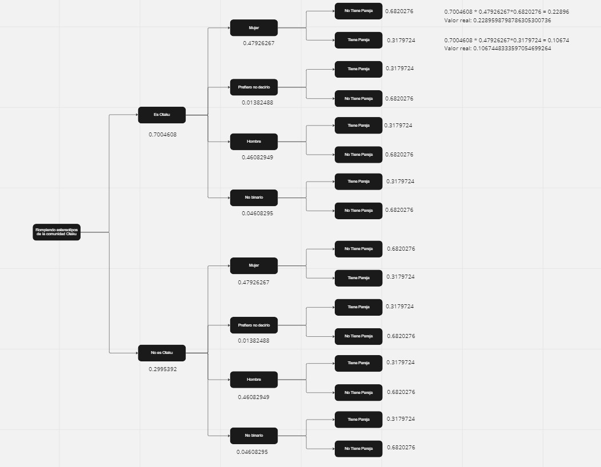

# **1. Introducción:**

## Relevancia

<p style="text-align: justify;">

Los estereotipos son negativos, positivos o neutros, pero en cualquier caso marcan los roles que puede desempeñar una persona en un grupo social generando en muchos casos situaciones de desigualdad y discriminación. Por ejemplo, socialmente, a los "otakus" se les asocia con la imagen de personas que no se asean hasta personas introvertidas e incluso "agresivas". Estos prejuicios podría ocasionar que sea excluido de grupos de trabajo o que tenga que renunciar a sus preferencias con tal de ser aceptado por el entorno que no comparte los mismos gustos.

</p>

```{r, eval=TRUE, message=FALSE}
# Instalar ggplot2 si no está instalado
if(! require(ggplot2)){install.packages("ggplot2")}
```


# **2. Datos:**

## Proceso de recolección de datos

<p style="text-align: justify;">

La recolección de datos se realizó mediante la elaboración de una encuesta en google forms. Al ser esta una herramienta virtual, nos da la facilidad de encuestar tanto de forma presencial, como virtual

</p>

<p style="text-align: justify;">

El proceso que se llevó a cabo para la obtención de los datos fue el siguiente:

</p>

1.  <p style="text-align: justify;">

    Primero, se redactaron las preguntas y se diseñó la encuesta de tal forma que la cantidad de errores al ser respondidas sea lo menor posible. De esta forma, el análisis y los resultados no serán influenciados negativamente.

    </p>

2.  <p style="text-align: justify;">

    Una vez terminada la encuesta, durante tres semanas, los integrantes del grupo asistieron a zonas donde los otakus asisten con mayor frecuencia para poder llevar a cabo la recolección de datos.

    </p>

3.  <p style="text-align: justify;">

    Al mismo tiempo, se compartió el enlace de la encuesta en grupos de facebook, whatsapp u otras redes, para poder tener un mayor alcance y obtener más respuestas en menos tiempo.

    </p>

## Población, muestra y muestreo

a)  *Población:*

    <p style="text-align: justify;">

    En este caso nuestra población son todas aquellas personas de Lima que se consideren fanáticos del anime o que en algún momento lo fueron sean o no parte de la comunidad Otaku y que residan en la ciudad de Lima.

    </p>

b)  *Muestra y Muestreo:*

    <p style="text-align: justify;">

    A continuación podemos apreciar los lugares en los que se recolectó la información y la cantidad que se logró recolectar por cada medio además de su relevancia:

    </p>

-   Centro Comercial - 50 encuestas realizadas
-   Alameda 28 de Julio - 30 encuestas realizadas
-   Recolección virtual - 123 encuestas realizadas

## Variables

| **N°** |  **Variable**   | **Tipo de variable** |
|:------:|:---------------:|:--------------------:|
|   1    |      Sexo       |       Nominal        |
|   2    |      Edad       |       Discreta       |
|   3    |     Altura      |       Continua       |
|   4    |   Escolaridad   |       Ordinal        |
|   5    |    Distrito     |       Nominal        |
|   6    |      Otaku      |       Nominal        |
|   7    |     Año_fan     |       Nominal        |
|   8    |  Genero_anime   |       Nominal        |
|   9    |     Clasico     |       Nominal        |
|   10   | Cantidad_horas  |       Continua       |
|   11   | Cantidad_anime  |       Discreta       |
|   12   |      Manga      |       Nominal        |
|   13   |      Ducha      |       Ordinal        |
|   14   | Caracteristica  |       Nominal        |
|   15   |     Pareja      |       Nominal        |
|   16   |     Madurez     |       Nominal        |
|   17   |     Deporte     |       Nominal        |
|   18   | Cabello_pintado |       Nominal        |
|   19   |   Ropa_anime    |       Ordinal        |
|   20   |   Interaccion   |       Nominal        |
|   21   |    Reuniones    |       Ordinal        |
|   22   |   Festivales    |       Nominal        |
|   23   |  Genero_musica  |       Nominal        |

## Limpieza de base de datos

<p style="text-align: justify;">

Antes de realizar cualquier modificación al data frame, debemos instalar y cargar las librerías necesaria para poder leer y modificar el archivo .csv

</p>

```{r, eval=TRUE, message=FALSE}
# Instalar y cargar librería "readr" y "dplyr"
if(! require(readr)){install.packages("readr")}
if(! require(dplyr)){install.packages("dplyr")}
```

```{r, eval=TRUE, message=FALSE}
# Cargar el archivo .csv en una variable
DF <- read_csv("Estereotipos.csv")
head(DF)
```

<p style="text-align: justify;">

A continuación, se mencionaran los criterios usados para limpiar de tal forma que a realizar el análisis descriptivo, los errores sean mínimos:

</p>

-   *Eliminacón de columna innecesaria:*

    <p style="text-align: justify;">

    El data frame original contiene una columna que muestra el momento en el que se relleo la encuesta, esta variable es innecesaria para el análisis descriptivo posterior; es por eso, que debe ser eliminada.

    </p>

```{r, eval=TRUE, echo=FALSE}
# Eliminación de la columna de tiempo
DF1 <- DF[, -1]
head(DF1)
```

-   *Cambio de los encabezados:*

    <p style="text-align: justify;">

    Originalmente, el archivo .csv que se usó como data frame tenía como encabezado las preguntas realizadas durante la encuesta, debido a ello es que se optó por cambiarlos por nombres de variables que faciliten el manejo de los datos dentro del ambiente de RStudio.

    </p>

```{r, eval=TRUE, echo=TRUE}
# Identificar los nombres de los encabezados
colnames(DF1)
```

```{r, eval=TRUE, echo=TRUE}
# Cambiar encabezados
DF1 <- rename(DF1, Sexo = 'Género', Edad = 'Edad', Altura = 'Altura', Escolaridad = 'Escolaridad', Distrito = '¿En qué distrito de Lima vives actualmente?', Otaku = '¿Te considerás otaku?', Año_Fan = '¿Desde que año empezaste a ver animes?', Genero_Anime = 'Género Favorito de Anime', Clasico = '¿Cuál es tu anime clásico favorito?', Cantidad_Horas = '¿Cuantás horas de anime ves al día?', Cantidad_Anime = '¿Cuantós animes ves en un mes?', Manga = '¿Lees mangas?', Caracteristica = '¿Te consideras extrovertido o introvertido?', Ducha = '¿Qué tan frecuentemente tomas una ducha?', Pareja = '¿Tienes pareja?', Madurez = '¿Te consideras una persona madura?', Deporte = '¿Realizas algun deporte?',Cabello_Pintado = '¿Alguna vez te has pintado el cabello?', Ropa_Anime = '¿Con qué frecuencia usas ropa relacionada al anime?', Interaccion = '¿Cómo prefieres interactuar con las personas?', Reuniones = '¿Con que frecuencia sales a fiestas o reuniones sociales?', Festivales = '¿Participas de festivales de Anime?', Genero_Musica = '¿Qué género de música escuchas?')
```

```{r, eval=TRUE, echo=TRUE}
# Corroborar el cambio
colnames(DF1)
```

-   *Correción de los datos de las variables:*

    <p style="text-align: justify;">

    Clásico es una variable que contiene datos sobre el nombre del anime clásico favorito de la persona encuestada. Al ser una pregunta abierta, la persona redacta dicha respuesta, debido a ello hay personas que usan mayúsculas y otras no por lo que se generan datos repetidos pero a la vez diferentes.

    </p>

<p style="text-align: justify;">

En primer lugar, se corregiran los datos en la variable *Año_Fan* ya que se pueden observar muchas formas en la que se da a entender que la persona encuestada no ve animes.

</p>

```{r, eval=TRUE, echo=TRUE}
DF1 %>% count(Año_Fan)
```

```{r, eval=TRUE, echo=TRUE, message=FALSE}
DF1 %>% mutate(Año_Fan = 
        ifelse(Año_Fan %in% c("0", "De hecho no miro, pero algunos si pero no soy otaku", "Ninguno", "No lo soy", "No soy fan", "No soy fan, sólo lo veo como cualquier otra serie", "No tengo", "No veo animes."), "Nunca",
        ifelse(Año_Fan %in% c("Hace 2 años"), "2020", Año_Fan
        ))) -> DF1
```

```{r, eval=TRUE, echo=TRUE}
DF1 %>% count(Año_Fan)
```

<p style="text-align: justify;">

También, se deben corregir los datos de los nombres de los animes obtenidos al preguntar sobre cuál es el anime clásico favorito de la persona en cuestión.

</p>

```{r, eval=TRUE, echo=TRUE}
DF1 %>% count(Clasico)
```


```{r, eval=TRUE, echo=TRUE, message=FALSE}
DF1 %>% mutate(Clasico = 
        ifelse(Clasico %in% c("Attack of titans", "attack on titan", "Attack on titan", "SNK"), "Shingeki no Kyojin",
        ifelse(Clasico %in% c("Boku no hero academia", "Boku no hero academy", "My Hero Academia"), "Boku no Hero Academy",
        ifelse(Clasico %in% c("Candi"), "Candy",
        ifelse(Clasico %in% c("cero", "Zero no Tsikaima"), "Zero no Tsukaima",
        ifelse(Clasico %in% c("code geass", "Code gueass"), "Code Geass",
        ifelse(Clasico %in% c("death note", "Death note"), "Death Note",
        ifelse(Clasico %in% c("Digimón", "digimon"), "Digimon",
        ifelse(Clasico %in% c("Dragon ball", "Dragón ball", "Dragón Ball", "Dragón boll", "dragonball"), "Dragon Ball",
        ifelse(Clasico %in% c("Dragon ball z", "Dragón ball Z", "Dbz"), "Dragon Ball Z",
        ifelse(Clasico %in% c("Full metal Alchemist", "Full Metal Alchemist", "Fullmetal alchemist"), "Fullmetal Alchemist",
        ifelse(Clasico %in% c("gintama"), "Gintama",
        ifelse(Clasico %in% c("great teacher onizuka"), "Great teacher onizuka",
        ifelse(Clasico %in% c("haikyuu", "Haikyuu"), "Haikyu",       
        ifelse(Clasico %in% c("Hunter Hunter", "hunter x hunter"), "Hunter x Hunter",       
        ifelse(Clasico %in% c("inuyasha"), "Inuyasha",
        ifelse(Clasico %in% c("jojo's bizarre adventure","Jojos"), "JoJo's Bizarre Adventure",
        ifelse(Clasico %in% c("Los Súper Campeones","Los Súper Campeones", "Los super campeones"), "Captain Tsubasa", 
        ifelse(Clasico %in% c("naruto"), "Naruto",
        ifelse(Clasico %in% c("Naruto Shipuden"), "Naruto Shippuden",
        ifelse(Clasico %in% c("Neon Genesis Evangelion"), "Evangelion",       
        ifelse(Clasico %in% c("once pice", "one piece", "One piece", "one piece y dragón ball"), "One Piece",
        ifelse(Clasico %in% c("parasyte"), "Parasyte",       
        ifelse(Clasico %in% c("Picachu", "Pokémon"), "Pokemon", 
        ifelse(Clasico %in% c("saber mationette j to x"), "Saber Marionette J to X",       
        ifelse(Clasico %in% c("Sailor moon", "Saylor moon", "Saylor Moon"), "Sailor Moon",
        ifelse(Clasico %in% c("sakura card captors"), "Sakura Card Captor",
        ifelse(Clasico %in% c("shigatsu wa kimi no uso", "Shigatsu wa kimi no uso", "Shigatsu wa Kimi no uso", "Shigatsu Wa Kimi no Uso"), "Shigatsu wa Kimi no Uso",
        ifelse(Clasico %in% c("Tokyo ghoul", "Tokio Ghoul", "Tokyo goul"), "Tokyo Ghoul",
        ifelse(Clasico %in% c("Your lie in april"), "Your lie in April",
        ifelse(Clasico %in% c("Yugioh"), "Yu-Gi-Oh",
        ifelse(Clasico %in% c("re main"), "Re-Main", 
        ifelse(Clasico %in% c("Cowboy bebop, Fullmetal alchemist, Elfen lied"), "Cowboy Bebop",
        ifelse(Clasico %in% c("another"), "Another",
        ifelse(Clasico %in% c("español"), "Español",
        ifelse(Clasico %in% c("N.A", "ninguno", "Ninguni", "No tengo", "No tengo anime favorito", "No tengo."), "Ninguno", Clasico
        )))))))))))))))))))))))))))))))))))) -> DF1
```

```{r, eval=TRUE, echo=TRUE}
DF1 %>% count(Clasico) 
```

# **4. Análisis descriptivo:**

-   Para poder realizar el analisis con los descriptores numericos sera necesario convertir las variables a sus tipos correctos utilizando los siguientes comando convertiremos "Año_Fan" y "Cantidad_Horas" de Character a Numeric

```{r}
DF1$Año_Fan <- as.numeric(DF1$Año_Fan)
DF1$Cantidad_Horas <- as.numeric(DF1$Cantidad_Horas)
```

-   Ademas debemos eliminarlos datos atipicos como "0" en la variable "Año_Fan" para que no se vean afectados los resultados, reduciendo nuestras observaciones de 217 a 202.

```{r}
DF1 <- DF1[DF1$Año_Fan!=0,]
```

-   A continuacio se muestra el resumen de las variables indicando sus tipos respectivos

```{r}
summary(DF1)
```

## ***Edad promedio - Boxplot***

```{r, eval=TRUE, echo=TRUE}
summary(DF1$Edad)
```

-   ¿Existirá correlacion lineal entre el año en el que empezaron a ver anime con respecto a la edad?

```{r}
plot(DF1$Año_Fan, DF1$Edad)
summary(lm(DF1$Año_Fan~DF1$Edad))
```

***Conclusión:***A partir del analisis de los datos ofrecidos por R\^2 = 36.8% no podemos afirmar que exista dicha relacion a pesar de lo que se puede ver en la grafica de dispersion

```{r, eval=TRUE, echo=TRUE}
boxplot(DF1$Edad,col="gray", main="Edades de los encuestados", ylab="Años")
abline(h=mean(DF1$Edad),col="red",lwd=2)
```

***Conclusión:*** En el gráfico se puede observar la media de la edad de las personas encuestadas, que está representada por la línea roja. Debido a que el dataframe presenta algunos datos atípicos, no nos podemos guiar por el promedio realizado, para esta ocasión es mejor prestarle atención a la media, la cual es de *`r round(mean(DF1$Edad),2)`* años.


## ***Porcentaje - Pie***

```{r, eval=TRUE, echo=TRUE}
a = table(DF1$Otaku)
a
```

```{r, eval=TRUE, echo=TRUE}
pie(a, col=c("white","red"), main="Te consideras otaku?")
```

```{r, eval=TRUE, echo=TRUE}
b = table(DF1$Otaku, DF1$Sexo)
b
```

```{r, eval=TRUE, echo=TRUE}
barplot(b, col=c("yellow","blue"),main="¿Eres otaku? VS Género",xlab="Género",ylab="¿Eres otaku?")
```

```{r, eval=TRUE, echo=TRUE}
round(b/rowSums(b)*100,digits=2)
```

***Conclusión:*** Revisando la tabla "b" podemos ver que en general, la mayoría no se considera otaku, esto sin importar el género de la persona encuestada. Al mismo tiempo, revisando la tabla de porcentajes, podemos notar que dentro del grupo que no se considera otaku, el *48.68 %* es hombre.

## ***Comparación entre 2 grupos de variables - Barplot***

```{r}
tabla1 <- table(DF1$Sexo,as.numeric(DF1$Cantidad_Horas))
                                   
barp <- barplot(tabla1,beside=TRUE, col =c("#B3EE3A", "#FFA54F","honeydew3","darkslategray"),
      main = "Horas que ven anime al día por Género",
      xlab = "Horas al día",ylab = "Frecuencia",ylim=c(0,50))

legend('topright', legend=rownames(tabla1), bty='n',
       fill=c("#B3EE3A", "#FFA54F","honeydew3","darkslategray"))
text(barp, tabla1 + 2, labels = tabla1)
```

***Conclusión:*** Como sé puede observar es falso el estereotipo de "los fans de anime ven todo el tiempo anime". Con este gráfico se evidencia que un grupo no ve animes a diario. Mientras que las personas que den 1 hora diaria en su mayoria son hombres. En el caso de las 2 horas diarias las mujeres son las más predispuestas. Se podria concluir que los fans de anime hombres (47) están dispuestos a usar 1 hora diaria a ver animes, mientras que las mujeres (40) prefieren ver más de 2 horas diarias.

## ***Comparacion de frecuencia - Barplot***

```{r}
tabla2 <- table(DF1$Otaku[DF1$Sexo=="Femenino"],DF1$Ducha[DF1$Sexo=="Femenino"])
barp2 <- barplot(tabla2, beside =TRUE,col=c("khaki1","khaki3"),
        xlab="Frecuencia de ducha",
        names.arg = c("1 vez a\n la semana", "2 veces a\n la semana", "cada 2 días", "cada 1 día", "todos los días"),
        main="Frecuencia de Duchas en Mujeres\nDependiendo si son o no Otakus", legend.text = rownames(tabla2), ylim=c(0,45))
text(barp2, tabla2 + 2, labels = tabla2)

tabla3 <- table(DF1$Otaku[DF1$Sexo=="Masculino"],DF1$Ducha[DF1$Sexo=="Masculino"])
barp3 <- barplot(tabla3, beside =TRUE,col=c("aquamarine1","aquamarine3"),
        xlab="Frecuencia de ducha",
        names.arg = c("2 veces a\n la semana", "cada 2 días", "cada 1 día", "todos los días"),
        main="Frecuencia de Duchas en Hombres\nDependiendo si son o no Otakus", legend.text = rownames(tabla2), ylim=c(0,45))
text(barp3, tabla3 + 2, labels = tabla3)
```

***Conclusión:*** El 45% de mujeres se bañan dejando un dia. En el caso de los Hombres el 46% se bañan todos los días. Además que los que se bañan con menos frecuencia durante la semana, son aquellos que no son otakus. Lo curioso es que las mujeres otakus se bañan como minimo cada 2 días a la semana.

# ***Probabilidades***

## ***Caso 1:***

De la variable *Otaku* sabemos que las probabilidades son las siguientes:
```{r, eval=T, echo=F}
table(DF1$Otaku)/nrow(DF1)
```

```{r, eval=TRUE, echo=F}
P_O = 0.2995392
P_NO = 0.7004608
```

Luego obtenemos las probabilidades de las frecuencias con las que se duchan:
```{r, eval=T, echo=F}
table(DF1$Otaku,DF1$Ducha)/rowSums(table(DF1$Otaku,DF1$Ducha))
```

```{r, eval=TRUE, echo=F}
P_O_ND = 0.000000
P_NO_ND = 0.01315789
P_O_RD = 0.03076923
P_NO_ND = 0.002631579
```

<p style='text-align: justify;'> *Conclusión:* La probabilidad de que un entrevistado que se considera otaku no se bañe es *`r round(P_O_ND)`* </p>


## ***Caso 2:***{.flexbox .vcenter}
Tenemos una poblacion de mas de 200 personas, calcular la probabilidad de que al escoger una al azar esta sea mujer, otaku y que ademas se encuentre en una relación

{width="600px"}

**Conclusión:** La porbabilidad de que se cumplan estas condiciones es 0.1067 que representa un 10.67%

## ***Caso 3:***

+ En la entrevista se encuestaron a 217 personas de las cuales 65 se consideran otakus y el resto no.  Si queremos seleccionar un grupo de 10 entrevistados, escogidos al azar y con reposición. Se define la variable aleatoria X como el número de entrevistados que se considera otaku. Determinar la función de probabilidad de X.
Además, sabiendo que un estereotipo asociado a esta comunidad es que no realizan ningún tipo actividad física y que la probabilidad de que alguno de los entrevistados realice deporte es 0.54. ¿Qué tan probable es que un entrevistado que se considera otaku realice deporte?


SOLUCIÓN:
- Se tienen 202 personas y se seleccionan 10 como muestra
- 65 se consideran otaku y 137 no
- La variable X es el número de entrevistados que se considera otaku de los 10 escogidos. Rango -> {0,1,2,3,4,5,6,7,8,9,10}


```{r}
# PARTE A:
# Función de probabilidad de X
# Caso que X sea 0
n0 = (choose(65, 0)*choose(137, 10))/choose(202, 10)
n0
# Caso que X sea 1
n1 = (choose(65, 1)*choose(137, 9))/choose(202, 10) 
n1
# Caso que X sea 2
n2 = (choose(65, 2)*choose(137, 8))/choose(202, 10)
n2
# Caso que X sea 3
n3 = (choose(65, 3)*choose(137, 7))/choose(202, 10)
n3
# Caso que X sea 4
n4 = (choose(65, 4)*choose(137, 6))/choose(202, 10)
n4
# Caso que X sea 5
n5 = (choose(65, 5)*choose(137, 5))/choose(202, 10)
n5
# Caso que X sea 6
n6 = (choose(65, 6)*choose(137, 4))/choose(202, 10)
n6
# Caso que X sea 7
n7 = (choose(65, 7)*choose(137, 3))/choose(202, 10)
n7
# Caso que X sea 8
n8 = (choose(65, 8)*choose(137, 2))/choose(202, 10)
n8
# Caso que X sea 9
n9 = (choose(65, 9)*choose(137, 1))/choose(202, 10)
n9
# Caso que X sea 10
n10 = (choose(65, 10)*choose(137, 0))/choose(202, 10)
n10

# PARTE B
# Probabilidad de que por lo menos 1 de los 10 escogidos se considere otaku
n1
# Probabilidad que un escogido haga deporte 0.54
PD = 0.54
# Probabilidad de que un encuestado se considera otaku y haga deporte
PE_HD = n1 * 0.54
PE_HD
```

# Modelo de una variable

Para el caso de la variable "Otaku" podemos determinar que en todos los ensayos se tendran siempre 2 posibles escenarios: si es Otaku y no es Otaku que seran nuestro exito y fracaso, respectivamente. Cabe resaltar que se realizaron 217 ensayos identicos en los que las posibles respuestas eran las mismas, pero los ensayos eran independientes

la probabilidad de exito será (p): 0.2995392 y el "n" será 217.

Teniendo esta valores y cumpliendo las condiciones de una distribucion binomial cual sera la probabilidad de que en una muestra de 24 ensayos 5 sean Otaku


```{r}
install.packages("fastGraph", repos = "http://cran.us.r-project.org")
library(fastGraph)
shadeDist(5,"dbinom",24,0.2995392)
```