<center> {width=80% height=60%} </center>

# Introduccion

Un estudiante universitario se enfrenta a muchos retos desde su primer ciclo, y no todos están satisfechos con sus resultados.

Diversos autores sustentan que los estudiantes ingresan en la universidad carentes de hábitos de estudio y en el transcurso de su formación universitaria muchos de ellos no los desarrollan, lo cual afecta a su rendimiento académico. No poseen técnicas adecuadas para leer y tomar apuntes, para distribuir el tiempo, y además carecen de concentración. En general, 30 de 65 hábitos de estudio no son aplicados por los estudiantes, ya que no elaboran preguntas de estudio ni un listado de palabras que desconocen previamente, no leen el material que analizarán en clase, no hacen apuntes, tienen dificultades para concentrarse y no organizan su tiempo de estudio. El 41% de estudiantes universitarios manifiestan que su planificación para el estudio es insuficiente (Zárate-Depraect et al., 2018)

Como se sabe, elegir un buen ambiente de estudio es un hábito de estudio. La organización de nuestro espacio hace que nos concentremos mejor y podamos estudiar de manera más efectiva. Uno de nosotros como estudiante tiene complicaciones para concentrarse debido a que encuentran espacios ocupados en la universidad. Aquello, lo obliga a estudiar en el comedor, donde encuentra bulla y se siente incómodo. Por ello, prefiere estudiar en su casa, solo. 

A partir de ello, nos cuestionamos si actualmente todos los estudiantes de UTEC presentan con aquella dificultad, si prefieren estudiar en casa o en la universidad, cómo son sus espacios de estudio, entre otras cosas. </p>


## Relevancia

Nosotros como estudiantes sabemos que además de la planificación y organización, se necesita un lugar cómodo para que la concentración y el rendimiento académico sea mayor. Pero, también es importante saber que cada estudiante se siente cómodo en distintos lugares cuando estudia. Ya sea rodeado de personas que están estudiando o solos. Por lo que consideramos que el espacio de estudio es un factor muy importante para que su rendimiento académico sea grato y su concentración mejore.


## Planificación

```{r echo=FALSE}
library(plan)
library(dplyr)
library(tidyr)
library(tidyverse)
library(ggplot2)
library(DescTools)
```
```{r echo=FALSE}
gantt <- data.frame(Actividad=c("Plantear tema", "Consultar a la profesora", "Seleccionar variables", "Realizar informe", "Elaborar de encuesta", "Corregir observaciones", "Encuestar", "Limpiar datos", "Elaborar analisis descriptivo", "Elaborar descriptores", "Elaborar presentacion", "Practicar exposicion","Corregir descriptores","Mejorar interpretacion","Analisis probabilistico","Elaborar presentacion", "Practicar exposicion"), 
                 Comienzo=c("2022-08-24", "2022-08-26", "2022-08-30", "2022-08-26", "2022-09-12", "2022-09-16", "2022-09-17", "2022-09-25", "2022-09-27","2022-09-27","2022-09-27","2022-09-29","2022-10-05","2022-10-10","2022-10-16","2022-10-28","2022-11-10"),
                 Termino=c("2022-08-27", "2022-08-30", "2022-08-31", "2022-09-02", "2022-09-15", "2022-09-17", "2022-09-24", "2022-09-26", "2022-09-29", "2022-09-29","2022-09-29","2022-09-30","2022-10-09","2022-10-16","2022-10-22","2022-11-04","2022-11-17"), 

                 Etapa=c("Pre-entrega","Pre-entrega","Pre-entrega","Pre-entrega", "Recoleccion datos","Recoleccion datos","Recoleccion datos", "Elaboracion P1-Informe","Elaboracion P1-Informe","Elaboracion P1-Informe", "Entrega final P1","Entrega final P1","Elaboracion P2-Informe","Elaboracion P2-Informe","Elaboracion P2-Informe","Entrega final P2","Entrega final P2" ))
```
```{r echo=FALSE}
head(gantt)
```
```{r echo=FALSE}
gantt <- gantt %>% 
  mutate(Comienzo = as.Date(Comienzo), Termino = as.Date(Termino))
```
```{r echo=FALSE}
gantt_tidy <- gantt %>% 
  gather(key=date_type, value=date, -Actividad, -Etapa)
```
```{r echo=FALSE}
ggplot() +
  geom_line(data=gantt_tidy, mapping=aes(x=Actividad, y=date, color=Etapa), size=6) +
  coord_flip() 
```


# Datos

## Recolección de datos
  <p> <b style = 'color : cadetblue; font-size: 16px;'> a. Primer paso: </b> Los datos fueron recolectados a través de una encuesta en Google Forms, y lo primero que se hizo fue contabilizar e identificar las variables con las cuales se iba a trabajar, luego se crearon las preguntas delimitadas para que nuestra audiencia pueda responder de manera concisa, y con una menor cantidad de errores. Se verificó que las preguntas estén bien planteadas y posteriormente esta se publicó para su respectivo llenado. </p>
  
  <p> <b style = 'color : cadetblue; font-size: 16px;'> b. Segundo paso: </b> Razón de modalidad de encuesta: Elegimos usar Google Forms, ya que nuestra audiencia tiene un mejor manejo de este, así evitamos que se cometan errores por parte de ellos. </p>
 
* **Condiciones para realizar la recolección:** El tipo de muestra era mínimo 200 personas y la muestra debía ser de estudiantes de UTEC. Nosotros consideramos a estudiantes mayores de segundo ciclo, para lograr conseguir la relación deseada y se llegue al objetivo. </p> 
* **Estrategias para llegar a la población:** Empezamos compartiendo el link por WhatsApp, para corroborar que completen las encuestas con más seguridad. La recolección era lenta, entonces decidimos aplicar estrategias como *imprimir códigos QR*, con imágenes y frases llamativas, para pegarlos en partes accesibles de la universidad (ascensores, baño y pasillos). Sin embargo, el llenado de las encuestas aún seguía siendo lento, por lo cual buscamos una estrategia más atractiva, que era *entregar algún incentivo* (chupetín o galleta) a las personas que la rellenaban. De esta manera llegamos a la cantidad requerida de datos.</p>

* **Información relevante:** Cabe mencionar que el entregar algún incentivo a nuestra audiencia, no significa que nuestros datos puedan estar sesgados, ya que tratamos que el llenado de nuestra encuesta sea lo correcto, guiándolos de una manera idónea.</p>


## Población, muestra y muestreo
La población de estudio son ***los alumnos de la UTEC***, de segundo a décimo ciclo. El primer ciclo no está incluido porque en una de nuestras preguntas más relevantes queremos conocer el promedio ponderado acumulado de su carrera, pero ellos aún no culminan el ciclo uno.
La unidad de nuestra muestra son los estudiantes de UTEC, la cual tiene una población o tamaño de muestra de ***246***.


## Variables

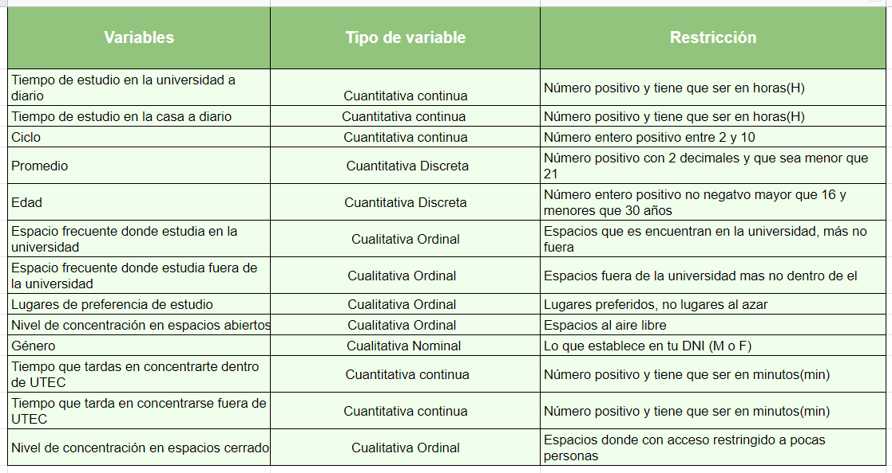

## Limpieza de base de datos

```{r echo=TRUE}
library(readxl)
DataBase <- read_excel("DataBase.xlsx")
View(DataBase)
```

```{r echo=TRUE}
PG= DataBase 
summary(PG)
names(PG)
```

- Renombramos las variables para facilitar su acceso
```{r echo=TRUE}
PG <-rename(PG,N_Piso6='Nivel de concentración en espacios abiertos [Piso 6: áreas fuera de los salones]',N_Piso11='Nivel de concentración en espacios abiertos [Piso 11]',N_MAC='Nivel de concentración en espacios abiertos [MAC (Museo de Arte Contemporáneo)]',N_Biblioteca='Nivel de concentración en espacios cerrados [Biblioteca (UTEC)]',N_Cubiculo='Nivel de concentración en espacios cerrados [Cubículo (UTEC)]',N_Piso1='Nivel de concentración en espacios cerrados [Sala de estudio en el piso 1 (UTEC)]',N_Aulas_libres='Nivel de concentración en espacios cerrados [Aulas libres (UTEC)]',N_Comedor='Nivel de concentración en espacios cerrados [Comedor (UTEC)]',N_Biblioteca_externa='Nivel de concentración en espacios cerrados [Biblioteca externa ]',N_Habitacion='Nivel de concentración en espacios cerrados [Habitación (casa)]',N_Sala='Nivel de concentración en espacios cerrados [Sala del hogar]', edad='Edad (en años)', genero='Género', preferencia='Lugar de preferencia de estudio', tiempo_u='Tiempo de estudio en la universidad a diario (en horas)', tiempo_casa='Tiempo de estudio en la casa a diario (en horas)',cubiculo='cubículo',biblioteca_u='biblioteca...10', sala_estudio ='sala de estudio', piso11='piso 11',piso6='piso 6',aulas='aulas libres', concentracion_u='Tiempo que tardas en concentrarte dentro de UTEC (en minutos)',bibliteca_ex='biblioteca...18', oficina='oficina de estudios',concentracion_casa= 'Tiempo que tarda en concentrarse fuera de UTEC (en minutos)')
```

- Cambiamos por un "no" a las celdas vacías
```{r echo=TRUE}
#Los espacios más frecuentes donde estudia en la universidad
PG <- mutate_at(PG, c("comedor", "cubiculo","biblioteca_u","sala_estudio","piso11","aulas","piso6"), ~replace(., is.na(.), "no"))
```
```{r echo=TRUE}
#Los espacios más frecuentes donde estudia fuera de la universidad
PG <- mutate_at(PG, c("habitacion", "sala","bibliteca_ex","oficina","mac"), ~replace(., is.na(.), "no"))
```
```{r echo=TRUE}
# Esta funcion sirve para todas las variables, pero esta vez aplica para Niveles de concentracion
PG[is.na(PG)]="No estudio en este espacio"
```
```{r echo=TRUE}
write.csv(PG, "DatoLimpio.csv")
```
```{r echo=TRUE}
summary(PG)
```

El renombramiento de variables se realizo con éxito, no existen celdas vacías y se comprobó los cambios en la Data actual(PG). Por lo tanto, nuestra base de datos está limpia.

# Análisis descriptivo

### Variable ciclo
```{r echo=FALSE}
moda <- Mode(PG$Ciclo)
paste("La moda de la variable ciclo es ", moda)
```
- Se concluye que la mayoría de ellos pertenecen al tercer ciclo.

```{r echo=FALSE}
mediana <- median(PG$Ciclo)
paste("Al menos la mitad de estudiantes es de ciclo", mediana)
```

```{r echo=FALSE}
plot(PG$Ciclo, col=c("lightblue"),
     main="Gráfico N° 1: Numero de ciclo de los estudiantes de la UTEC", 
     xlab="Cantidad de estudiantes (frecuencia)",
     ylab="Ciclo")

```
- Análisis: El gráfico muestra que nuestra población de estudio obtuvo más encuestados del ciclo tres. Por ello, se puede llamar moda.


### Variable Espacio frecuente donde estudia en la universidad

Hacemos los gráficos de los espacios por separado, donde estudia con más frecuencia, contabilizando los que respondieron "No" y "Si".
Objetivo: Identificar la preferencia de los estudiantes por cada espacio de estudio.

* Gráfico de la subvariable comedor
```{r echo=FALSE}
ggplot(PG, aes(PG$comedor)) +
  geom_bar(width=0.5, colour="deeppink2", fill="deeppink2") +
  labs(title="Gráfico N° 2: Frecuencia de estudio en el comedor",
       x= "Elección", 
       y="Frecuencia"
       )
```
**Análisis:** Como podemos apreciar en el gráfico se muestra el número de estudiantes que prefiere estudiar en el comedor. En el cual se aprecia que los estudiantes no prefieren estudiara en dicho espacio y prefieren otros espacios de estudios.


* Gráfico de la subvariable cubículo
```{r echo=FALSE}
ggplot(PG, aes(cubiculo)) +
  geom_bar(width=0.5, colour="olivedrab1", fill="paleturquoise3") +
  labs(title="Gráfico N° 3: Frecuencia de estudio en el cubículo",
       x= "Elección", 
       y="Frecuencia"
       )
```
**Análisis:** Se muestra a través de la gráfica la cantidad de estudiantes que prefieren estudiar en los cubículos. Por los que podriamos decir que concurren mas en otros lugares como la biblioteca.


* Gráfico de la subvariable biblioteca_u

```{r echo=FALSE}
ggplot(PG, aes(biblioteca_u)) +
  geom_bar(width=0.5, colour="red", fill="red") +
  labs(title="Gráfico N° 4: Frecuencia de estudio en la Biblioteca ",
       x= "Elección", 
       y="Frecuencia"
       )
```

**Análisis:** Se muestra a través de la gráfica la cantidad de estudiantes que prefieren estudiar en la Biblioteca. En consecuencia determinamos que la gran mayoría de estudiantes prefiere estudiar en dicho espacio de estudio.


* Gráfico de la subvariable sala_estudio
```{r echo=FALSE}
ggplot(PG, aes(sala_estudio)) +
  geom_bar(width=0.5, colour="yellow", fill="yellow") +
  labs(title="Gráfico N° 5: Frecuencia de estudio en la Sala de estudio",
       x= "Elección", 
       y="Frecuencia"
       )
```
**Análisis:** La sala de estudio no es un espacio muy concurrido por muchos estudiantes(175), ello puede deberse a que según las encuestas, la mayoría (136) prefieren estudiar a solas, es decir aislados ya que se concentran mejor. Los demás estudiantes, probablemente no van a dicho ese espacio por factores externos como la capacidad de la sala de estudio o porque no es de su preferencia.


* Gráfico de la subvariable piso11
```{r echo=FALSE}
ggplot(PG, aes(PG$piso11)) +
  geom_bar(width=0.5, colour="blue", fill="blue") +
  labs(title="Gráfico N° 6: Frecuencia de estudio en el Piso 11",
       x= "Elección", 
       y="Frecuencia"
       )
```
**Análisis:** El piso 11, áreas abiertas,no es un espacio frecuentado por los estudiantes para estudiar. Esto evidencia que muy pocos son los que le gusta estudiar en espacios abiertos.

*  Gráfico de la subvariable piso6
```{r echo=FALSE}
ggplot(PG, aes(PG$piso6)) +
  geom_bar(width=0.5, colour="green", fill="green") +
  labs(title="Gráfico N° 7: Frecuencia de estudio en el Piso 6",
       x= "Elección", 
       y="Frecuencia"
       )
```
**Análisis:** El piso 6, a diferencia de los espacios, sala de estudio y piso 11, es más concurrido para estudiar.


* Gráfico de la subvariable aulas
```{r echo=FALSE}
ggplot(PG, aes(aulas)) +
  geom_bar(width=0.5, colour="azure", fill="azure3") +
  labs(title="Gráfico N° 8: Frecuencia de estudio en aulas",
       x= "Elección", 
       y="Frecuencia"
       )
```
**Análisis:** Se puede observar lo contrario a piso 6, pues ahora la mayor parte de los estudiantes encuestados tienen la frecuencia de estudiar en aulas.


###  Variable Espacio frecuente donde estudia fuera de la universidad

```{r echo=FALSE}
table(PG$habitacion)
table(PG$sala)
table(PG$bibliteca_ex)
table(PG$oficina)
table(PG$mac)
```

```{r echo=FALSE}
ggplot(PG, aes(habitacion)) +
  geom_bar(width=0.5, colour="gold", fill="gold")+
  labs(title="Gráfico N° 9: Frecuencia de estudio en la habitacion",
       x= "Aceptacion", 
       y="Frecuencia"
       )
```
**Análisis:** En caso sea el lugar a elegir uno externo a la universidad, logramos observar que la gran mayoria tiene una frecuencia grande (205 de 246 estudiantes) de estudiar en su habitación. Por lo que se puede decir que tiene más concurrencia que otros lugares fuera de UTEC.

```{r echo=FALSE}
ggplot(PG, aes(sala)) +
  geom_bar(width=0.5, colour="lightgreen", fill="lightgreen")+
  labs(title="Gráfico N° 10: Frecuencia de estudio en la sala",
       x= "Aceptacion", 
       y="Frecuencia"
       )
```
```{r echo=FALSE}
ggplot(PG, aes(bibliteca_ex)) +
  geom_bar(width=0.5, colour="grey3", fill="grey3")+
  labs(title="Gráfico N° 11: Frecuencia de estudio en la Biblioteca Externa",
       x= "Aceptacion", 
       y="Frecuencia"
       )
```
**Análisis:** La mayoría de los encuestados prefieren estudiar en un espacio que no sea una biblioteca externa a la universidad, ya que si hay una mayoría que prefiere estudiar dentro de la biblioteca en UTEC.

```{r echo=FALSE}
ggplot(PG, aes(oficina)) +
  geom_bar(width=0.5, colour="sandybrown", fill="sandybrown")+
  labs(title="Gráfico N° 12: Frecuencia de estudio en la oficina",
       x= "Aceptacion", 
       y="Frecuencia"
       )
```
**Análisis:** El triple de los encuestados no prefieren estudiar en una oficina, en comparación a los que si lo prefieren. Pero si hay una gran preferencia que estudia dentro de su habitación.

```{r echo=FALSE}
ggplot(PG, aes(mac)) +
  geom_bar(width=0.5, colour="moccasin", fill="moccasin")+
  labs(title="Gráfico N° 13: Frecuencia de estudio en el MAC",
       x= "Aceptacion", 
       y="Frecuencia"
       )
```
**Análisis:** Menos de 25 encuestados prefieren estudiar en el MAC.Y la proporción de esta es similar al piso 11.


### Variable Tiempo que tarda en concentrarte dentro de la UTEC  
```{r echo=FALSE}
moda <- Mode(PG$concentracion_u)
paste("La moda es ", moda)
```
- Significa que la mayoría de alumnos tardan en concentrarse 10 minutos dentro de la UTEC.

```{r echo=TRUE}
summary(PG$concentracion_u)
```

```{r echo=FALSE}

minimo <- min(PG$concentracion_u)
paste("El tiempo minimo en que un alumno logra concentrarse dentro de la UTEC es ", minimo, "minuto")

maximo <- max(PG$concentracion_u)
paste("El tiempo maximo en que un alumno logra concentrarse dentro de la UTEC es ", maximo, "minutos")
```
```{r echo=FALSE}
table(PG$concentracion_u)
```
- En la primera fila de la Gráfico se observan el tiempo en minutos que uno logra concentrarse en UTEC y en la segunda fila la cantidad de alumnos que se tardan aquel tiempo. Por ejemplo, la primera columna nos indica que 4 alumnos se concentran en un minuto.

```{r echo=FALSE}
mediana <- median(PG$concentracion_u)
paste("Al menos la mitad tarda", mediana,"minutos en concentrarse")

ds <- round(sd(PG$concentracion_u, na.rm=TRUE),2)
paste("Los datos de tiempo de concentracion en la universidad se alejan entre si un tiempo de",ds, "minutos")
```
- La desviación estándar mide la variabilidad dentro de una misma muestra. En nuestro caso, con respecto a la media, los datos no están tan dispersos.

```{r echo=FALSE}
boxplot(PG$concentracion_u, col=c("orange"),
     main="Gráfico N° 14: Tiempo que tarda en concentrarse dentro de la UTEC",
     xlab="Tiempo en minutos",
     ylab="Cantidad de estudiantes")
```
**Análisis:** En este gráfico observamos que la mediana se encuentra dentro de la caja, situada en el centro.

### Variable Tiempo de estudio en la universidad a diario (tiempo_u)
```{r echo=FALSE}
media<-mean(PG$tiempo_u)
paste("La cantidad de horas promedio de estudio en la universidad es de", round(media,2),"horas diarias")
```
```{r echo=FALSE}
mediana<-median(PG$tiempo_u)
paste("Al menos la mitad estudia", mediana,"horas diarias en la universidad")
```
```{r echo=FALSE}
moda<-Mode(PG$tiempo_u)
paste("La mayoria estudia en la universidad", moda,"horas diarias")
```
```{r echo=FALSE}
maximo<-max(PG$tiempo_u)
paste("El tiempo máximo de estudio en la universidad es de", maximo,"horas diarias")
```
```{r echo=FALSE}
minimo<-min(PG$tiempo_u)
paste("El timepo minimo de estudio en la universidad es de", minimo,"horas diarias")
```
```{r echo=FALSE}
desviacion<-sd(PG$tiempo_u)
paste("Los datos de tiempo de estudio en la universidad se alejan entre si un tiempo de",round(desviacion,4), "horas diarias")
```
```{r echo=FALSE}
hist(PG$tiempo_u, main = " Gráfico N° 15: Histograma de tiempo de estudio en la universidad a diario",
     xlab = "Tiempo (horas)",
     ylab = "Frecuencia",
     col = "red",
     border = "black",
     xlim = c(0, 14),
     ylim = c(0, 80))

```
Análisis: En el gráfico notamos que los estudiantes estudian en un intervalo de tiempo, pero como podemos ver hay mas estudiantes que estudia 2 horas

```{r,echo=FALSE}
boxplot(PG$tiempo_u,ylab="tiempo",xlab="Estudiantes",main = "Gráfico N° 16: Gráfico de tiempo",prob=TRUE,col="lightgreen",pch=20)
```
**Análisis:** Una gran mayoria de estudiantes frecuentan diferentes espacios de estudio en la universidad para estudiar entre 2 a 4 horas diarias, además su mediana esta en ese intervalo.

### Variable edad
```{r}
media<-mean(PG$edad)
paste("la media de la variables edad es", round(media,4),"años")

mediana<-median(PG$edad)
paste("la mediana de la variables edad es", mediana,"años")

moda<- Mode(PG$edad)
paste("la moda de la variables edad es", moda,"años")

maximo<-max( PG$edad)
paste("el valor máximo de la variables edad es", maximo,"años")

minimo<-min(PG$edad)
paste("el valor mínimo de la variables edad es", minimo,"años")

```
```{r}
hist(PG$edad, main = "Gráfico N° 17: Histograma de Edad",
     xlab = "Edad (años cumplidos)",
     ylab = "Frecuencia",
     col = "cadetblue",
     border = "black",
     xlim = c(16, 30),
     ylim = c(0, 100))
```

**Análisis:** En el gráfico podemos obeservar al cantidad de veces que se repite(frecuencia) la edad de los estudiantes, también podemos decir que hay mas estudiantes entre los 18 a 20 años que rellenaron la encuesta.


### Variable Promedio
```{r echo=FALSE}
moda = Mode(PG$Promedio)
paste("La mayoría de estudiantes tiene un promedio ponderado ", moda)
```


```{r echo=FALSE}
paste("- El promedio de la variable promedio es", round(mean(PG$Promedio), 4))
```

```{r echo=FALSE}
paste("- El valor mínimo de la variable es ",min(PG$Promedio))
```

```{r echo=FALSE}
paste("- El valor máximo de la variable es ",max(PG$Promedio))
```

```{r echo=FALSE}
boxplot(PG$Promedio, main='Grafica N° 18: Promedio ponderado acumulado de utecsinos', xlab='Frecuencia',ylab='Notas', border = "black", col = rgb(1, 0, 0, alpha = 0.4))
```
**Análisis:** Se puede observar que existen 2 datos *atípicos*. También se observa que la mediana se encuentra dentro de la caja y se encuentra entre los valores 14 y 16.

### Variable Niveles de concentración en espacios abiertos
```{r echo=FALSE}
ggplot(PG, aes(N_Piso6)) +
  geom_bar(width=0.5, colour="darkorchid2", fill="darkorchid2")+
  labs(title="Gráfico N° 19: Nivel de concentracion en el Piso 6",
       x= "Escala", 
       y="Frecuencia"
       )
```
**Análisis:** Una minoría opta por estudiar en el piso 6, al aire libre. Cada vez vez que lo hacen su nivel de concentración es regular, seguido de la escala bueno.

```{r echo=FALSE}
ggplot(PG, aes(N_Piso11)) +
  geom_bar(width=0.5, colour="darkgoldenrod3", fill="darkgoldenrod3")+
  labs(title="Gráfico N° 20: Nivel de concentracion en el Piso 11",
       x= "Escala", 
       y="Frecuencia"
       )
```
**Análisis:** Los que optan por estudiar en este ambiente tiene un nivel de concentración regular.

```{r echo=FALSE}
ggplot(PG, aes(N_MAC)) +
  geom_bar(width=0.5, colour="darkseagreen1", fill="darkseagreen1")+
  labs(title="Gráfico N° 21: Nivel de concentracion en MAC",
       x= "Escala", 
       y="Frecuencia"
       )
```

**Análisis:** Los que optan por estudiar en el MAC requieren un esfuerzo extra para concentrarse en un nivel regular.Muy pocos son los que logran un nivel bueno de concentración. 

### Variable Género
```{r echo=FALSE}
moda = Mode(PG$genero)
paste("Moda: ",moda)
```
La moda permite conocer qué género se encuesto más. En este caso, la mayoría son del género masculino con 163.


```{r echo=FALSE}
Gráfico <- table(PG$genero)
Gráfico
```
Esta tabla contabiliza la cantidad de masculino y femenino que está presente en género.


```{r echo=FALSE}
barplot(Gráfico, beside = TRUE, las=1, main='Gráfico N° 22: Gráfico de la variable Género',
        xlab='Género', ylab='Cantidad de alumnos',
        col = c("mistyrose","lightblue"),
        ylim = c(0, 200))
```
Se verifica lo hallado en la moda, pues el género masculino predomina en los encuestados.


### Variable Tiempo de estudio en casa a diario
Debido a que el tiempo es una variable cuantitativa, medido en horas, utilizamos los descriptores numéricos.
```{r echo=FALSE}
paste("Mediana: ", median(PG$`tiempo_casa`, na.rm = TRUE))
```
Al menos la mitad de estudiantes estudian en casa alrededor de 3 horas diariamente.
```{r echo=FALSE}
paste("Promedio: ", mean(PG$tiempo_casa, na.rm = TRUE))
```
Se observa que el promedio de horas que estudian es de 3.2 hora

```{r echo=FALSE}
paste("Moda: ", Mode(PG$tiempo_casa, na.rm = TRUE))
```
La mayoría de estudiantes tiende a estudiar 2 horas diarias en su casa.

```{r echo=FALSE}
boxplot(PG$`tiempo_casa`, main = "Gráfico N° 23: Tiempo de estudio en casa", xlab = "Tiempo (horas)",
     ylab = "Frecuencia", col = "brown",
     border = "orange")
```

**Análisis:** Mediante la gráfica de bigotes o caja, se presencia tres valores atípicos, pues se encuentran distantes de la caja. Además podemos observar que la mediana es 3, puesto que existe una raya negra justo en el medio de la caja, por tanto, la distribución de datos es simétrica.

### Variable Lugares preferencia de estudio
```{r echo=FALSE}
Gráfico1 <- table(PG$'preferencia')
view(Gráfico1)
```
Puesto que son variables cualitativas, empleamos un gráfico de barras, para identificar las preferencias de espacios para estudiar.

```{r echo=FALSE}
barplot(Gráfico1, main= 'Gráfico N° 24: Lugares de prefeerencia de estudio',xlab='preferencia',
        ylab='Frecuencia absoluta', las=3)
```

**Análisis:** Observamos que la mayoría de estudiantes(129) prefieren estudiar en la UTEC, en segundo lugar les gusta estudiar en casa(117) y una minoría prefiere estudiar en espacios abiertos fuera de la UTEC(9).

### Variable Tiempo en obtener concentración fuera de UTEC
```{r echo=FALSE}
paste("Al menos la mitad de estudiantes tardan", median(PG$concentracion_casa, na.rm = TRUE) ,"minutos para concentrarse en estudiar en un espacio externo a la UTEC")

paste("Los estudiantes tardan en promedio", round(mean(PG$concentracion_casa, na.rm = TRUE),2)," minutos aproximadamente en concentrase en un espacio fuera de UTEC")

paste("Moda: ",Mode(PG$concentracion_casa, na.rm = TRUE))
```

```{r echo=FALSE}
boxplot(PG$concentracion_casa, main = "Gráfico N° 25: Tiempo en concentrarse fuera de UTEC",
        xlab='Frecuencia',
        ylab='Tiempo en minutos')
```

**Análisis:** Hay tres valores atípicos, pues estos se aprecian distantes de la caja. En adición, la distribución es simétrica pues la raya negra se encuentra justo en el centro de la gráfica de caja, indicando que la mediana efectivamente es 15

### Variable Niveles de concentración en espacios cerrados
```{r echo=FALSE}
ggplot(PG, aes(N_Piso1)) +
  geom_bar(width=0.5, colour="green", fill="indianred2") +
  labs(title="Gráfico N° 26: Nivel de concentracion en el piso 1",
       x= "Escala", 
       y="Frecuencia"
)
```

En este caso, el nivel *Regular* presenta mayor frecuencia (moda), por ende se determina que la mayoria de nuestros encuestados se concentra regularmente en el piso 1.

```{r echo=FALSE}
ggplot(PG, aes(N_Comedor)) +
  geom_bar(width=0.5, colour="purple2", fill="slategray2") +
  labs(title="Gráfico N° 27: Nivel de concentracion en el comedor",
       x= "Escala", 
       y="Frecuencia"
       )
```

El nivel de concentración *Regular* presenta mayor frecuencia (moda), por ende estudiar en el comedor no es tan viable pues concentrarse ahí puede tardar.
```{r echo=FALSE}
ggplot(PG, aes(N_Biblioteca_externa)) +
  geom_bar(width=0.5, colour="springgreen2", fill="yellow2") +
  labs(title="Gráfico N° 28: Nivel de concentracion en una biblioteca externa",
       x= "Escala", 
       y="Frecuencia"
)
```

En este caso, se muestra que entre las 6 opciones, el nivel *Regular* presenta mayor frecuencia (moda), por ende se determina que la mayoria de encuestados se concentra regularmente en una biblioteca externa.

```{r echo=FALSE}
ggplot(PG, aes(N_Sala)) +
  geom_bar(width=0.5, colour="royalblue2", fill="salmon1") +
  labs(title="Gráfico N° 29: Nivel de concentracion en la sala",
       x= "Escala", 
       y="Frecuencia"
       )
```

Se observa que la categoria *Regular* presenta mayor frecuencia (moda). Se concluye que la mayoria de encuestados se concentran regularmente en la sala.
```{r echo=FALSE}
ggplot(PG, aes(N_Biblioteca)) +
  geom_bar(width=0.5, colour="red", fill="skyblue") +
  labs(title="Gráfico N° 30: Nivel de concentracion en la biblioteca",
       x= "Escala", 
       y="Frecuencia"
       )
```

Se muestra que entre las 6 niveles de concentración, *Bueno* presenta mayor frecuencia (moda), por ende se determina que la mayoría de estudiantes se concentran más en la biblioteca.

```{r echo=FALSE}
ggplot(PG, aes(N_Cubiculo)) +
  geom_bar(width=0.5, colour="blue", fill="aquamarine3") +
  labs(title="Gráfico N° 31: Nivel de concentracion en los cubiculos",
       x= "Escala", 
       y="Frecuencia"
       )
```

El nivel *Bueno* presenta mayor frecuencia (moda), entonces estudiar en los cubiculos es muy viable, ya que concentrase es más fácil.

```{r echo=FALSE}
ggplot(PG, aes(N_Aulas_libres)) +
  geom_bar(width=0.5, colour="coral", fill="burlywood2") +
  labs(title="Gráfico N° 32: Nivel de concentracion en las aulas libres",
       x= "Escala", 
       y="Frecuencia"
)
```

En este otro caso, *Bueno* presenta mayor frecuencia (moda), por ende se concluye que la mayoria de estudiantes se concentra más en las aulas libres.

```{r echo=FALSE}
ggplot(PG, aes(N_Habitacion)) +
  geom_bar(width=0.5, colour="violetred2", fill="thistle3") +
  labs(title="Gráfico N° 33: Nivel de concentracion en la habitacion",
       x= "Escala", 
       y="Frecuencia")
```
El nivel *Bueno* es la consideración que presenta mayor frecuencia (moda), por ende se determina que la mayoria de encuestados se concentran mejor en su habitación.

```{r echo=FALSE}
ggplot(PG, aes(N_Biblioteca)) +
  geom_bar(width=0.5, colour="olivedrab1", fill="paleturquoise3") +
  labs(title="Gráfico N° 34: Nivel de concentracion en la biblioteca de UTEC",
       x= "Escala", 
       y="Frecuencia"
       )
```

El nivel de concentración de mayor frecuencia(moda) es la categoria *Bueno*, por ende se determina que la mayoria de estudiantes se concentran mejor en la Biblioteca de UTEC.

# Analisis de dos o más variables

### Tiempo que tarda en concentrarse fuera de UTEC VS. Tiempo que tardas en concentrarte dentro de UTEC

```{r echo=FALSE}
plot(x = PG$concentracion_casa, y = PG$concentracion_u, main = "Gráfico N° 35: Edad por nivel educativo", 
     xlab = "Tiempo de concentración en la Universidad", ylab = "Tiempo de concentración fuera de la Universidad", 
     col = c("green3", "orange3"))
```
Se observa que el tiempo de concentración de los estudiantes es de al menos 20 minutos cuando estudian en un espacio de la universidad o externo a ella.

## Gráfico de Ciclo vs. Promedio
```{r}
plot(x = PG$Ciclo, y = PG$Promedio, 
     main = "Gráfico N° 36: Ciclo - Promedio", xlab = "ciclo", ylab = "promedio")
# Nuestra intención fue saber el promedio ponderado de los estudiantes por ciclo.
```

## Tiempo de estudio en la universidad VS. Tiempo de estudio en casa
```{r}
smoothScatter(PG$tiempo_casa, PG$tiempo_u, transformation = function(x) x ^ 0.4,
              main = "Gráfico N° 37: Tiempo de estudio en la universidad VS Tiempo de estudio en casa", xlab = "Tiempo en la Universidad", ylab = "Tiempo en casa",
              colramp = colorRampPalette(c("#000099", "#00FEFF", "#45FE4F",
                                           "#FCFF00", "#FF9400", "#FF3100")))
```

**Análisis:** Con frecuencia la mayoría de estudiantes dedican 2 horas de estudio en la universidad y en casa

## Percentiles
```{r}
percentil <- quantile(PG$'concentracion_casa', probs = c(0.10, 0.30, 0.50, 0.70, 0.90), type = 7)
percentil[1]
percentil[2]
percentil[3]
percentil[4]
percentil[5]
```

```{r echo=FALSE}
library(expss)
```

# Analisis probabilístico

## Axiomas

<p> <b style = 'color : cadetblue; font-size: 17px;'> a. Ejercicio 1: </b>
<div>
<p style = 'text-align:center;'>

</p>
</div>


Debido a que piden por la probabilidad de que se de un caso u otro, se trataría de una probabilidad de eventos mutuamente excluyentes cumpliéndose el siguiente axioma: 

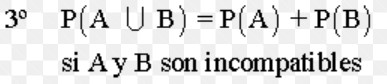{width=50%}
a) Realizamos una tabla cruzada para observar la frecuencia de estudiantes que tienen una edad de 16 años y los que tienen 29 años.

```{r,echo=FALSE}
as.datatable_widget(PG %>%
    tab_cells(edad) %>%
    tab_cols(total(), `concentracion_u`) %>%
    tab_stat_cases(label = "Casos") %>%
    tab_stat_cpct(label = "% casos") %>%
    tab_pivot(stat_position = "inside_columns"))
```


b)Observamos que 2 de 246 estudiantes tienen 16 años, la probabilidad seria 2/246
c)Observamos que 1 de 246 estudiantes tienen 29 años, la probabilidad seria 1/246


d)Los estudiantes que demoran en concentrarse 10 minutos son 57 de 246, siendo la probabilidad 57/246.
*Por defecto los que no se concentran en 10 minutos seria 189 de 246 estudiantes, siendo la probabilidad 189/246.


e) Por último  multiplicamos la probabilididad de tener 16 años con probabilidad de concentrarse en 10 minutos 
```{r}
P_1=(2/246)*(57/246)
P_1
```


f) Multiplicamos la probabilididad de tener 29 años con probabilidad de concentrarse en 10 minutos 

```{r}
P_2=(1/246)*(57/246)
P_2
```

g) Aplicamos el axioma 3 de eventos mutuamente excluyentes
```{r}
P_1+P_2
```

**Conclusión:**
Los estudiantes que tienen 16 y 29 años son pocos, y a ello se suma la baja probabilidad de que uno u otro se pueda concentrar en 10 minutos en algún espacio de la universidad, con una probabilidad de 0.0028= 0.2%, debiéndose a factores externos, como ruido, dificultad para encontrar un espacio adecuado, entre otros. 
Asimismo también decimos que la probabilidad de que un estudiante mas joven(16 años) se concentren en 10 minutos es más alta que la de un estudiante con mayor edad (29 años). Asociándose con la plasticidad cerebral del estudiante según la edad.


<p> <b style = 'color : cadetblue; font-size: 17px;'> b. Ejercicio 2: </b>

<div>
<p style = 'text-align:center;'>

</p>
</div>

a)Calculamos el tiempo máximo de estudio en la universidad
```{r}
#tiempo maximo de estudio en la universidad
max(PG$tiempo_u)
#el tiempo maximo es de 12 horas

```


b) Realizamos una tabla cruzada para observar la frecuencia de estudiantes que estudian 12 horas en relación con su promedio.
```{r}

as.datatable_widget(PG %>%
                      
    tab_cells(tiempo_u) %>%
      
    tab_cols(total(), `Promedio`) %>%
    tab_stat_cases(label = "Casos") %>%
    tab_stat_cpct(label = "% casos") %>%
    tab_pivot(stat_position = "inside_columns"))


```


c)Calculamos el tiempo máximo de estudio en casa
```{r}
#tiempo maximo de estudio en la casa
max(PG$tiempo_casa)
#el tiempo maximo es de 12 horas
```


d) Realizamos una tabla cruzada para observar la frecuencia de estudiantes que estudian 12 horas en casa en relación con su promedio.
```{r echo=FALSE}
as.datatable_widget(PG %>%
    tab_cells(tiempo_casa) %>%
    tab_cols(total(), `Promedio`) %>%
    tab_stat_cases(label = "Casos") %>%
    tab_stat_cpct(label = "% casos") %>%
    tab_pivot(stat_position = "inside_columns"))

```


**PROBABILIDAD:**

###### Probabilidadd de que estudie mas tiempo en casa y tenga un promedio mayor a 16 
EL tiempo máximo de estudio semanal es de 12 horas de un estudiante 
Solo son 2 estudiantes de un total de 246 estudiantes encuestados que estudian 12  horas en casas, es decir la probabilidad es de 2/246
Además de estos de estudiantes se debe obtener la probabilidad de que tengan un promedio ponderado mayor a 16, solo hay un estudiante con un promedio 16.98 que cumple con esta condición. entonces la probabilidad es 1/2 
su intersección seria 

```{r}
p_casa=2/246 *1/2
p_casa
```


Lo mismo cumple con estudiantes que estudian mas  en la universidad 
```{r}
p_uni=2/246 *1/2
p_uni
```


Siendo la intersección, estudiar tanto en universidad y en casa teniendo un promedio mayor a 16 es:
$$P(casa)*P(universidad)= 0.0000165$$

```{r}
p_uni*p_casa
```

*CONCLUSIÓN: *
La probabilidad de que exista "Un estudiante todo terreno" es muy baja siendo de 0.0000165, pues es complicado que un estudiante pueda tener la capacidad de adaptarse a dos lugares totalmente diferentes casa y universidad y logre obtener un buen rendimiento académico.Por otro lado también se concluye que estudiar por muchas horas en la universidad y en casa no necesariamente confirma un buen rendimiento académico.


<p> <b style = 'color : cadetblue; font-size: 17px;'> c. Ejercicio 3: </b>

<div>
<p style = 'text-align:center;'>

</p>
</div>

Un alumno de 10mo ciclo de la UTEC:

```{r}
#Estudiantes de 10mo ciclo: E_10
E_10 = 5
#Total de estudiantes: T_E
T_E = 246
#Un alumno de 10mo ciclo de UTEC: A_10
A_10 = choose(5,1)/T_E
A_10
```
Probabilidad de encontrar alumnos de un nivel bueno de concentración estudiando el piso 6:

```{r}
#Nivel bueno de concentración estudiando el piso 6: NB_P6
NB_P6 = 62
#Total de estudiantes: T_E
T_E = 246
#Probabilidad de encontrar alumnos de un nivel bueno de concentración estudiando el piso 6: P_NB_P6
PNB_P6 = (NB_P6)/(T_E)
PNB_P6
```

Probabilidad de encontrar alumnos de un nivel bueno de concentración estudiando el piso 11:

```{r}
#Nivel bueno de concentración estudiando el piso 11: NB_P11
NB_P11 = 45
#Total de estudiantes: T_E
T_E = 246
#Probabilidad de encontrar alumnos de un nivel bueno de concentración estudiando el piso 11: P_NB_P11
PNB_P11 = (NB_P11)/(T_E)
PNB_P11
```
Probabilidad de encontrar alumnos de un nivel bueno de concentración estudiando el MAC:

```{r}
#Nivel bueno de concentración estudiando el MAC: NB_MAC
NB_MAC = 39
#Total de estudiantes: T_E
T_E = 246
#Probabilidad de encontrar alumnos de un nivel bueno de concentración estudiando el MAC: P_NB_P11
PNB_MAC = (NB_MAC)/(T_E)
PNB_MAC
```

CASOS:

- Probabilidad de que un alumno escogido al azar de 10mo ciclo encuestado logre un nivel bueno de concentración estudiando en el piso 6: P_N1
```{r}
P_N1 = A_10 *  PNB_P6
P_N1
```


- Probabilidad de que un alumno escogido al azar de 10mo ciclo encuestado logre un nivel bueno de concentración estudiando en el piso 11:
```{r}
P_N2 = A_10 *  PNB_P11
P_N2
```


- Probabilidad de que un alumno escogido al azar de 10mo ciclo encuestado logre un nivel bueno de concentración estudiando en el MAC:
```{r}
P_N3 = A_10 *  PNB_MAC
P_N3
```

ENTONCES:
Uniremos los casos pues nos piden la Probabilidad de que ocurra o en el piso 6 o en el piso 11 o en el MAC

```{r}
#Asi: P_N1 U P_N2 U P_N3
#Se realiza la suma respectiva:
Probabilidad = (P_N1) + (P_N2) + (P_N3)
RESPUESTA = round(Probabilidad, digits = 3); RESPUESTA
```

**Conclusión:**
 
Con este ejercicio queríamos respondernos a cuánta probabilidad exite que un estudiante que ya esta por finalizar la etapa universitaria se concentre con un nivel bueno en espacios abiertos como el piso 6, 11 o en el MAC, lo que nos dió como resultado una probabilidad muy pequeña como se pudo observar, por lo que concluimos que en estos espacios abiertos la concentración de los alumnos del 10mo ciclo no es el adecuado.

<p> <b style = 'color : cadetblue; font-size: 16px;'> d. Ejercicio 4: </b>

<div>
<p style = 'text-align:center;'>
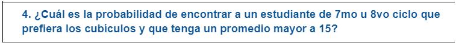
</p>
</div>

- **Tabla de genero vs ciclo**


```{r echo=FALSE}

as.datatable_widget(PG %>%
    tab_cells(genero) %>%
    tab_cols(total(), Ciclo) %>%
    tab_stat_cases(label = "Casos") %>%
    tab_stat_cpct(label = "% casos") %>%
    tab_pivot(stat_position = "inside_columns"))
```


- **Cubículo vs Ciclo**

```{r echo=FALSE}
as.datatable_widget(PG %>%
    tab_cells(Ciclo) %>%
    tab_cols(total(), cubiculo) %>%
    tab_stat_cases(label = "Casos") %>%
    tab_stat_cpct(label = "% casos") %>%
    tab_pivot(stat_position = "inside_columns"))
```


- **Tabla de Ciclo vs Promedio**


```{r echo=FALSE}
as.datatable_widget(PG %>%
    tab_cells(Promedio) %>%
    tab_cols(total(), Ciclo) %>%
    tab_stat_cases(label = "Casos") %>%
    tab_stat_cpct(label = "% casos") %>%
    tab_pivot(stat_position = "inside_columns"))
```


<div>
<p style = 'text-align:center;'>
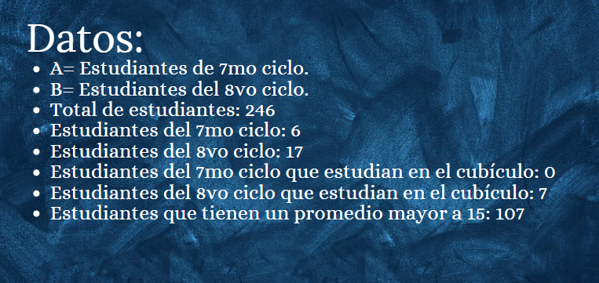
</p>
</div>

```{r}
# hallamos la probabilidad de la unión de ambos.
# P(A u B)
((choose(6,1)/246)*(0/(choose(6,1))))*(107/246)+((choose(17,1)/246)*(7/(choose(17,1))))*(107/246)

```
Nuestra probabilidad es conocer la finalidad de que un estudiante estudie en la zona de cubículos y que tenga un promedio mayor a 15. Esto también nos da a conocer el lugar donde prefieren estudiar los alumnos del 7mo y 8vo ciclo.


<p> <b style = 'color : cadetblue; font-size: 16px;'> e. Ejercicio 5: </b>

<div>
<p style = 'text-align:center;'>

</p>
</div>

<div>
<p style = 'text-align:center;'>

</p>
</div>

Nos pide:

$$P(T) = P(A) ∩ P(B) ∩ P(C)$$


Además, 119 estudiantes de 246 tienen un promedio menor a 15 (pm) $$P(pm) = 119/246$$


* Probabilidad para un estudiante de ciclo 2 → P(A):
```{r}
c2 = 52/246
p2= 26/52
pm = 119/246
p_ciclo2 = c2*p2*pm
p_ciclo2
```
* Probabilidad para un estudiante de ciclo 3 → P(B):
```{r}
c3 = 99/246
p3= 38/99
pm = 119/246
p_ciclo3 = c3*p3*pm
p_ciclo3
```
* Probabilidad para un estudiante de ciclo 4 → P(C):
```{r}
c4 = 32/246
p4= 14/32
pm = 119/246
p_ciclo4 = c4*p4*pm
p_ciclo4
```
* **Probabilidad final  → P(T)**
```{r}
p_ciclo2+p_ciclo3+p_ciclo4
```

**Conclusión:**
Ya que aproximadamente solo el 15.3% de estudiantes de 2do, 3ero o 4to ciclo prefieren estudiar en el 6to piso y tienen un promedio menor a 15, podemos concluir que los espacios abiertos no favorecen tanto en cuanto al promedio a los alumnos de ciclos como 2do, 3ro o 4to. Además, si estudian es un espacio cerrado, existe más posibilidad de concentración y mejor promedio.

## Teorema de Bayes

<p> <b style = 'color : cadetblue; font-size: 16px;'> f. Ejercicio 6: </b>


<div>
<p style = 'text-align:center;'>
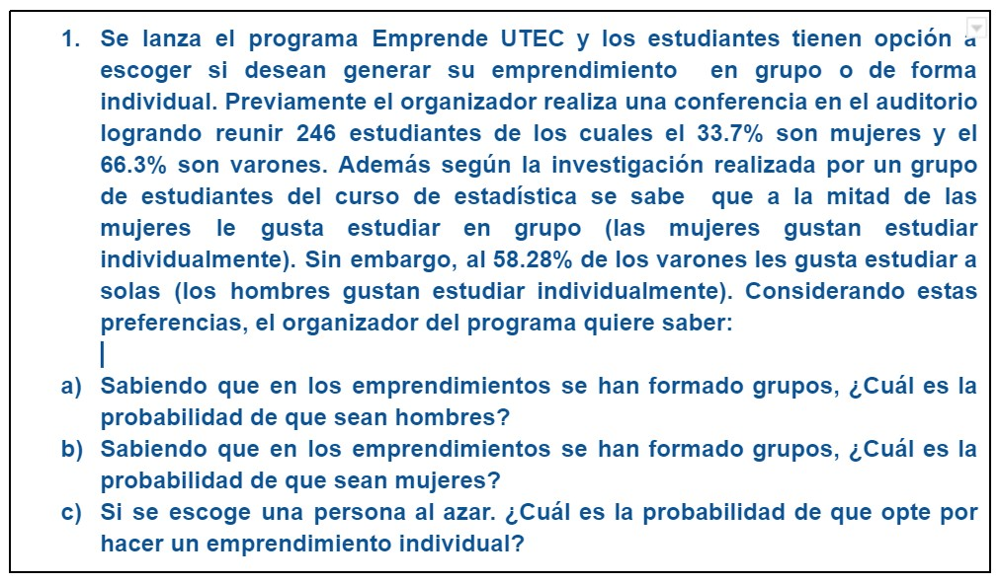
</p>
</div>

* 1. Realizamos el diagrama de árbol para organizar los datos correctamente.

<div>
<p style = 'text-align:center;'>
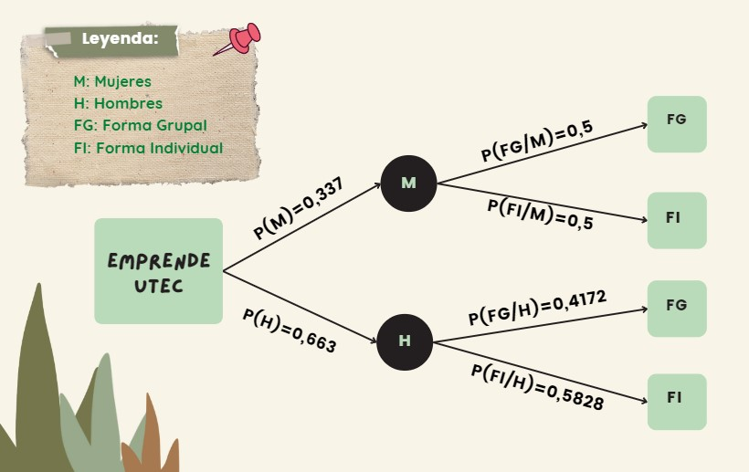
</p>
</div>


* Puesto que se trata de un caso condicional, utilizamos el Teorema de Bayes, representado por la siguiente expresión:

<div>
<p style = 'text-align:center;'>
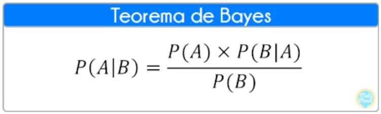
</p>
</div>

* Probabilidad de formarse grupos
P(FG) = (P(M) x P(FG/M)) + (P(H) x P(FG/H))
```{r}
mujeres=0.337
hombres=0.663
FG_M=0.5
FG_H=0.4172
#Probabilidad de que se formen emprendimientos grupales P(FG)
FG=(mujeres*FG_M)+(hombres*FG_H)
FG
```

a)Probabilidad de que los hombres opten por hacer un emprendimiento grupal.

* Probabilidad de que los hombres formen grupo,es una intersección:
```{r}
interseccion_h=hombres*FG_H
interseccion_h
```
* Aplicamos Teorema de Bayes

<div>
<p style = 'text-align:center;'>
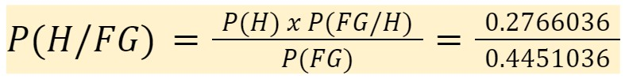
</p>
</div>

* Probabilidad que de los emprendimientos grupales formados, sean de hombres

```{r}
P_h_FG=interseccion_h/FG
P_h_FG
```

**CONCLUSIÓN:**

De los emprendimientos grupales formados, la probabilidad que sean hombres es alta de un 62.14%.


b)Probabilidad de que las mujeres opten por hacer un emprendimiento grupal.

* Puesto que se trata de un caso condicional, utilizamos el Teorema de Bayes.
* Previamente se calculó la probabilidad de que se formen grupos P(FG)
```{r}
FG
```
* Probabilidad de que las mujeres formen grupo, la cual es una intersección:

```{r}
interseccion_m=mujeres*FG_M
interseccion_m
```
* Aplicamos el teorema de Bayes:

<div>
<p style = 'text-align:center;'>
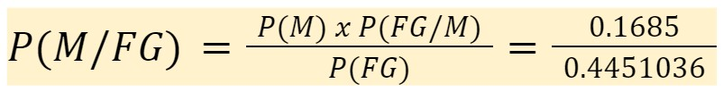
</p>
</div>

* Probabilidad de que las mujeres opten por hacer un emprendimiento grupal
```{r}
P_m_FG=interseccion_m/FG
P_m_FG
```

**CONCLUSIÓN:**
La probabilidad  de que las mujeres decidan hacer un emprendimiento grupal está por debajo del 50%. La probabilidad es del 37.86%.
 
c) Probabilidad de escoger una persona al azar y que opte por formar emprendimiento individual.

* Ello sería la probabilidad de que se formen grupos P(FG)
```{r}
FI_M=0.5
FI_H=0.5828
(mujeres*FI_M)+(hombres*FI_H)
```
* La probabilidad de esa persona escogida al azar y que forme un emprendimiento individual es de 55.49%


<p> <b style = 'color : cadetblue; font-size: 16px;'> g. Ejercicio 7: </b>


<div>
<p style = 'text-align:center;'>
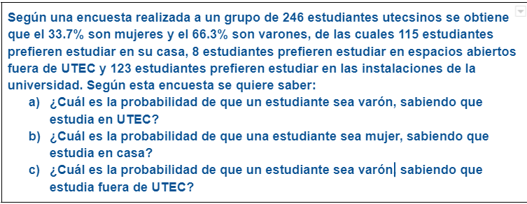
</p>
</div>

- **Tabla cruzada de Género vs Preferencia: **
```{r}
as.datatable_widget(PG %>%
    tab_cells(genero) %>%
    tab_cols(total(), preferencia) %>%
    tab_stat_cases(label = "Casos") %>%
    tab_stat_cpct(label = "% casos") %>%
    tab_pivot(stat_position = "inside_columns"))
```

**Diagrama de Bayes: **

<div>
<p style = 'text-align:center;'>
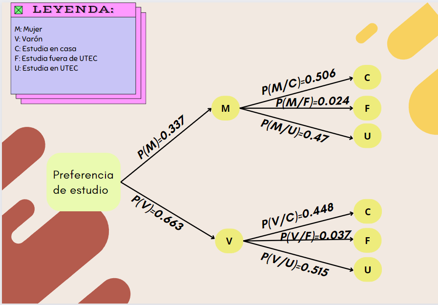
</p>
</div>


* **a) ¿Cuál es la probabilidad de que un estudiante sea varón, sabiendo que estudia en UTEC?**

$$P\left(V\:|\:U\right)\:=\:\frac{\left(P\left(U\:|\:V\right)\cdot \:P\left(V\right)\right)}{P\left(U\right)}$$
```{r}
(0.515*0.663)/(0.515*0.663+0.47*0.337)
```

* **b) ¿Cuál es la probabilidad de que una estudiante sea mujer, sabiendo que estudia en casa?**

$$P\left(M\:|\:C\right)\:=\:\frac{\left(P\left(C\:|\:M\right)\cdot \:P\left(M\right)\right)}{P\left(C\right)}$$

```{r}
(0.506*0.337)/(0.337*0.506+0.448*0.663)
```

* **c) ¿Cuál es la probabilidad de que un estudiante se varón, sabiendo que estudia fuera de UTEC?**

$$P\left(V\:|\:F\right)\:=\:\frac{\left(P\left(F\:|\:V\right)\cdot \:P\left(V\right)\right)}{P\left(F\right)}$$
```{r}
((0.037*0.663))/(0.037*0.663+0.024*0.337)
```

**Conclusión:** La finalidad de sacar estas probabilidades es para conocer donde prefieren estudiar los estudiantes de UTEC a la que realizamos la encuesta y así poder tener una idea general de todos los estudiantes. Con los datos obtenidos y desarrollado la probabilidad de en cada lugar llegamos a la conclusión de que los estudiantes prefieren estudiar en UTEC.


## Distribuciones 

### Variables aleatorias discretas

<p> <b style = 'color : cadetblue; font-size: 16px;'> Variable edad </b>

Encontramos que 67 estudiantes de los 246 encuestados tienen 18 años (la mayoría de nuestros encuestados). Entonces, planteamos como caso de éxito que los estudiantes tengan un nivel *bueno* de concentración en el piso 6.

**¿Cuál es la probabilidad de que al menos 10 estudiantes de 18 años de edad presenten un nivel bueno de concentración en el piso 6?**

**Datos: **
Probabilidad de que presenten un nivel bueno de concentración en el piso 6 → 62/246 = 0.25203

**Distribución:** $$ Binomial: X∼ B(n=67;p=0.25203) $$

👀 Donde: 

$$ P(X≥10) → 1 − P(X ≤ 9)$$
```{r}
1 - pbinom(9,67,0.25)
```


```{r}
library(fastGraph)
```

**Gráfico de la probabilidad con distribución Binomial:**
```{r}
shadeDist(9,"dbinom",67,0.25,lower.tail = F)
```


### Variables aleatorias continuas

<p> <b style = 'color : cadetblue; font-size: 18px;'> Variable promedio : </b>

```{r}
library(rriskDistributions)
```


```{r}
fit.cont(PG$Promedio)
```
<div>
<p style = 'text-align:center;'>

</p>
</div>

```{r}
paste("Promedio: ", mean(PG$Promedio))
paste("Varianza: ",var(PG$Promedio))
paste("Desviación estándar: ",sd(PG$Promedio))
```

En una encuesta realizada a los estudiantes de la universidad UTEC se obtiene los promedios ponderados el cual siguen una distribución normal con media 14.86638 y desviación estándar de 1.728802. ¿Cual es la probabilidad de que un estudiante tenga un promedio superior a 15?

```{r}
1-pnorm(15,14.86638,1.728802)
```

**Justificación para la variable promedio: **

Para corroborar o comprobar que esta variable de tipo cuantitativa tenga algún tipo de distribución uniforme, es necesario que su gráfica tenga las características adecuadas de cumplimiento de pertenecer a una distribución, y como se puede observar en las gráficas que pudimos obtener, esta variable puede representar una distribución de tipo Normal, logística, Gamma y Weibull. En este caso hemos elegido la distribución normal para poder plantear nuestra pregunta que explicaremos en este informe, ya que nos parece importante analizarlo.

<p> <b style = 'color :cadetblue; font-size: 18px;'> Variable Tiempo de concentración: </b>


```{r}
fit.cont(PG$concentracion_u)
```
<div>
<p style = 'text-align:center;'>

</p>
</div>

```{r}
fit.cont(PG$concentracion_casa) #se abre otra ventana con los datos de la imagen insertada
```

<div>
<p style = 'text-align:center;'>
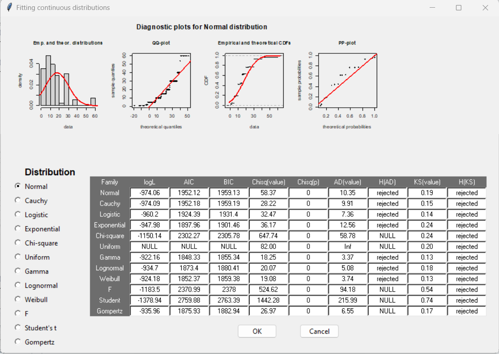
</p>
</div>

**Justificación de la razón de que no podemos usar distribución: ** 
Mediante la librería *rriskDistributions* pudimos comprobar de forma eficiente si las variables presentan un tipo de distribución.  
Las variables tiempo en que tarda en concentrarse un estudiante dentro de la universidad UTEC y tiempo en que tarda en concentrarse fuera de UTEC no se asemejan a ninguna de las distribuciones continuas, por lo que podríamos afirmar que no es posible formular un ejercicio con esta variable.


# Bibliografía 
Zárate-Depraect, N. E., Soto-Decuir, M. G., Martı́nez-Aguirre, E. G., Castro-Castro, M. L., Garcı́a-Jau, R. A., & López-Leyva, N. M. (2018). Hábitos de estudio y estrés en estudiantes del área de la salud. FEM: Revista de La Fundación Educación Médica, 21(3), 153–157. <http://scielo.isciii.es/scielo.php?script=sci_arttext&pid=S2014-98322018000300007&nrm=iso>
