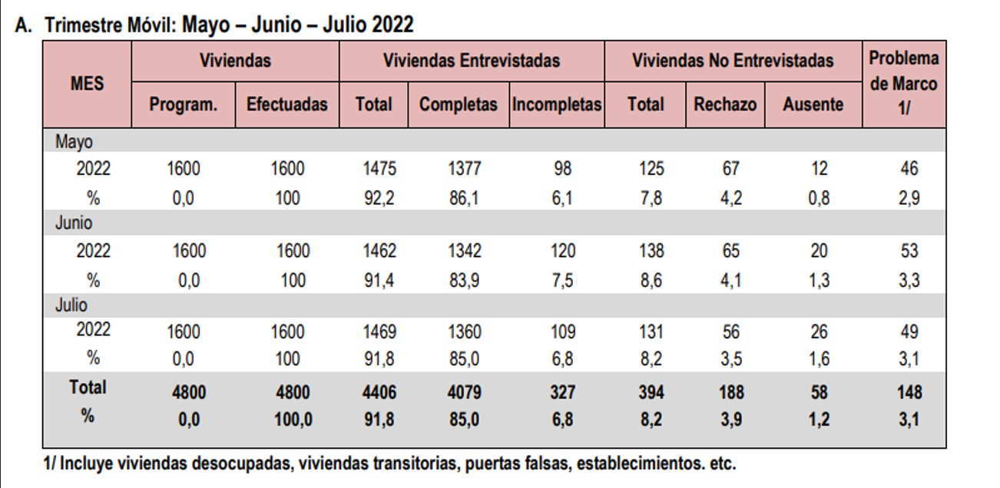

## Índice

1. Tema del estudio / Justificación.
2. Recolección de datos.
3. Información relevante.

## **1. Tema del estudio / Justificación**

### Planificación

[Aquí va su diagrama de gantt]

### Tema investigado

*Encuesta sobre la Situación de Empleabilidad* | *Encuesta Permanente de Empleo*

(*MAYO - JUNIO - JULIO 2022*)


### Relevancia del estudio

- La importancia de investigar acerca de las características del empleo e ingresos de la población activa en las áreas de Lima Metropolitana y el Callao nos permiten observar su evolución y desarrollo a través del tiempo.

### **Planificación**
```{r}
remove.packages("rlang")
install.packages("rlang")
library(rlang)
```

```{r}
library(reshape2)
library(ggplot2)

tasks <- c("Presentación Oral PG3","Presentacion 2 en slides","Redaccion de informe 2","Analisis probabilistico","Presentacion Oral PG1","Presentacion en slides","Redaccion de informe", "Analisis del feedback Pg1", "Analisis descriptivo","Limpieza de datos","Especifacion de variables","Especificacion de toma de datos","Introduccion, relevancia y diagrama", "Analisis del feedback Pg0")
dfr <- data.frame(
  name        = factor(tasks, levels = tasks),
  start.date  = as.Date(c("2022-11-18","2022-11-14", "2022-11-11", "2022-10-03", "2022-09-30", "2022-09-28", "2022-09-28", "2022-09-28","2022-09-26", "2022-09-26","2022-09-19", "2022-09-19", "2022-09-08", "2022-09-09")),
  end.date    = as.Date(c("2022-11-19", "2022-11-17", "2022-11-14", "2022-11-11","2022-09-30", "2022-09-30", "2022-09-30", "2022-09-30", "2022-09-28", "2022-09-28", "2022-09-23", "2022-09-23", "2022-09-15", "2022-09-16")),
  is.critical = c(FALSE, FALSE, FALSE, FALSE, TRUE, TRUE, TRUE, TRUE, TRUE, TRUE, TRUE, TRUE, TRUE, TRUE)
)
mdfr <- melt(dfr, measure.vars = c("start.date", "end.date"))

ggplot(mdfr, aes(value, name, colour = is.critical)) + 
  geom_line(size = 6) +
  xlab(NULL) + 
  ylab(NULL)
```


## **2. Recolección de datos**

### Manera de obtención de datos

Toda la información utilizada por el grupo durante el proyecto fue obtenida mediante la búsqueda de una base de datos en internet, con la cual encontramos y rescatamos una fuente del INEI ([Catálogo - Base de Datos](https://www.inei.gob.pe/media/difusion/apps/#p=7)) ([Base de Datos](http://iinei.inei.gob.pe/microdatos/index.htm)).


### ¿Por qué se realizó de esa forma?
Se realizó de esta forma debido a que nuestra profesora nos aconsejó tomar ideas más innovadoras, las cuales puedan ayudarnos a realizar un mejor proyecto de investigación. Además, analizaríamos datos reales del lugar de estudio. De esta forma, optamos por rescatar una base de datos.

### Condiciones y estrategias
La principal condición que debíamos cumplir era conseguir una base de datos que cumpliera mínimo con 200 observaciones. En nuestro caso, conseguimos una con más de 15000 casos, por lo que se nos hizo sencillo cumplir ese requisito.

### POBLACIÓN, MUESTRA Y MUESTREO
Antes que nada, es importante mencionar que esta investigación se viene efectuando desde el año 2001 y esta es dividida por trimestres. 
  <u>2.2.1. Población determinada</u>
  Para este estudio, se consideró como población a investigar al conjunto de domicilios         particulares y sus ocupantes con residencia habitual situados en las áreas de Lima Metropolitana y Callao.
	<u>2.2.2. Tamaño de la muestra</u>
	En esta fracción de la investigación que hemos tomado (Mayo - Junio - Julio, 2022) se investigaron 4800 viviendas. Cabe resaltar que se estudiaron 1600 viviendas mensuales, las cuales fueron distribuídas en 400 conglomerados donde se seleccionaron 4 residencias.
	Es relevante señalar que en esta encuesta continua al año se estudian 19200 domicilios particulares.
	<u>2.2.2.1. Efectividad de la muestra</u>
		Como mencionamos anteriormente, la muestra estipulada fue de 4800 viviendas durante el trimestre, sin embargo, la cantidad real de residencias entrevistadas fue de 4406 (91,8%). 
Esto se puede apreciar en el cuadro a continuación:

<u>2.2.3. Tipo de Muestreo</u>

Con el fin de obtener resultados representativos en relación a la población, se seleccionó a la muestra en base a ciertos criterios. 
Previamente al conjunto muestral elegido, se dividió a la población en estratos socioeconómicos. De esta manera, se determinó que el tipo de muestreo fue probabilístico estratificado, ya que se dividió a la población en segmentos homogéneos basados en su nivel socioeconómico y se seleccionó aleatoriamente los objetos de investigación dentro de estos.
Se podría decir lo mismo con los casos encuestados en la muestra, ya que se eligieron 4 viviendas aleatorias en 400 conglomerados de residencias.

### VARIABLES

Variables Cuantitativas:

- Continuas:

    + Ingreso mensual total: Número entero. No negativo

- Discretas:

    + Edad: Cantidad de años completos cumplidos


Variables Cualitativas:

- Ordinales:

    + Nivel educativo aprobado: [Sin Nivel | Inicial | Primaria Incompleta | Primaria Completa | Secundaria Incompleta | Secundaria Completa | Superior No Universitaria Incompleta | Superior No Universitaria Completa | Superior Universitaria Incompleta | Superior Universitaria Completa]

- Nominales:

    + Género: [Hombre | Mujer]
    
    + Parentesco con el jefe del hogar: [Jefe/Jefa | Esposa(o)/Compañera(o) | Hijo(a)/Hijastro(a) | Yerno/Nuera | Nieto/a | Padres/Suegros | Hermano/a | Otros parientes  | Trabajador/a del hogar | Pensionista | Otros No Parientes]
    
    + Se encuentra ausente del hogar 30 días o más: [Sí | No]
    
    + Cuenta con un empleo fijo: [Sí | No]
    
    + Desempeño en su ocupación principal: [Empleador o patrono | Trabajador Independiente | Empleado | Obrero | Trabajador familiar No remunerado | Trabajador del hogar | Otro]
    
    + ¿Para quién trabajó el entrevistado en su ocupación principal?: [Fuerzas Armadas, Policía Nacional del Perú (militares) | Administración Pública | Empresa Pública | Empresas especiales de servicios (SERVICE) | Empresa o patrono privado | Otro]
    
    + Cuenta con un negocio propio: [Sí | No]
    
    + Cantidad de trabajadores de su empresa: [Menos de 100 personas | De 100 a más personas]
    
    + Realiza horas extra: [Sí | No]
    
    + Frecuencia de pago/sueldo: [Practicante | Diaria | Semanal | Quincenal | Mensual]
    
    + Tiene actividad secundaria: [Sí | No]
    
    + Lengua Materna: [Quechua | Aymara | Otra lengua nativa | Castellano | Portugués | Otra lengua extranjera | ES SORDO MUDO(A) / MUDO(A) | Lengua de señas peruanas]
    
    + Indicador de condición de actividad: [Ocupado | Desocupado abierto | Desocupado oculto | No PEA]
    
    + Cultura/Etnia: [Quechua | Aymara | Nativo o indígena de la Amazonía | Negro/Mulato/Zambo/Afro peruano | Blanco | Mestizo | Otro | NO SABE]
    


## **3. Algunos Datos Relevantes**

- ***Sobre el estudio***

Esta investigación se viene efectuando *desde el año 2001* y esta es dividida por trimestres. 

- ***Población***

Conjunto de domicilios particulares y sus ocupantes con residencia habitual situados en las áreas de Lima Metropolitana y Callao.

- ***Muestra***

4800 viviendas (1600 viviendas encuestadas mensualmente).

## **4. Nuestros objetivos**

- Entender la situación de empleo de los pobladores de Lima Metropolitana y Callao, a través de un análisis estadístico riguroso.


## **5. Limpieza de Datos**

1) Primero instalamos y cargamos las librerías ```readr``` y ```dplyr```.
```{r,echo = FALSE, eval=TRUE}
if(!require("readr")){
  install.packages("readr")
  }
if(!require("dyplr")){
  install.packages("dyplr")
  }
library(readr)
library(dplyr)
```

2) Leemos el archivo que utilizamos, es decir, nuestra base de datos y lo guardamos en la variable ```DD```.
```{r,echo = FALSE, eval=TRUE}
DD <- read.csv("DataFrame-Proyecto.csv",header=T, sep=',')
```

3) Los datos están representados por números, por lo cual, cambiaremos a su valor real.
```{r,echo = FALSE, eval=TRUE}

DD %>% mutate(p103 = 
        ifelse(p103 == 1, "Jefe(a)",
        ifelse(p103 == 2, "Esposa(o)",
        ifelse(p103 == 3,"Hijo(a)/Hijastro(a)",
        ifelse(p103 == 4, "Yerno/Nuera",
        ifelse(p103 == 5, "Padres/Suegros",
        ifelse(p103 == 6, "Otros parientes",
        ifelse(p103 == 7, "Trab.Hogar",
        ifelse(p103 == 8, "Pensionista",
        ifelse(p103 == 9, "OtrosNoParientes",
        ifelse(p103 == 10, "Nieto/a",
        ifelse(p103 == 11, "Hermano/a",p103
        )))))))))))) -> DD

DD %>% mutate(p104 = 
        ifelse(p104 == 1, "Sí",
        ifelse(p104 == 2, "No",p104
        ))) -> DD

DD %>% mutate(p105 = 
        ifelse(p105 == 1, "Sí",
        ifelse(p105 == 2, "No",p105
        ))) -> DD

DD %>% mutate(p106 = 
        ifelse(p106 == 1, "Sí",
        ifelse(p106 == 2, "No",p106
        ))) -> DD

DD %>% mutate(p107 = 
        ifelse(p107 == 1, "Masculino",
        ifelse(p107 == 2, "Femenino",p107
        ))) -> DD

DD %>% mutate(p109a = 
        ifelse(p109a == 1, "Sin Nivel",
        ifelse(p109a == 2, "Incial",
        ifelse(p109a == 3,"Prim.Incompleta",
        ifelse(p109a == 4, "Prim.Completa",
        ifelse(p109a == 5, "Sec.Incompleta",
        ifelse(p109a == 6, "Sec. Completa",
        ifelse(p109a == 7, "S.N.U.Incompleta",
        ifelse(p109a == 8, "S.N.U.Completa",
        ifelse(p109a == 9, "S.U.Incompleta",
        ifelse(p109a == 10, "S.U.Completa",p109a
        ))))))))))) -> DD

DD %>% mutate(p201 = 
        ifelse(p201 == 1, "Sí",
        ifelse(p201 == 2, "No",p201
        ))) -> DD

DD %>% mutate(p202 = 
        ifelse(p202 == 1, "Sí",
        ifelse(p202 == 2, "No",p202
        ))) -> DD

DD %>% mutate(p203 = 
        ifelse(p203 == 1, "Sí",
        ifelse(p203 == 2, "No",p203
        ))) -> DD

DD %>% mutate(p2041 = 
        ifelse(p2041 == 1, "Sí",
        ifelse(p2041 == 2, "No",p2041
        ))) -> DD

DD %>% mutate(p2042 = 
        ifelse(p2042 == 1, "Sí",
        ifelse(p2042 == 2, "No",p2042
        ))) -> DD

DD %>% mutate(p2043 = 
        ifelse(p2043 == 1, "Sí",
        ifelse(p2043 == 2, "No",p2043
        ))) -> DD

DD %>% mutate(p2044 = 
        ifelse(p2044 == 1, "Sí",
        ifelse(p2044 == 2, "No",p2044
        ))) -> DD

DD %>% mutate(p2045 = 
        ifelse(p2045 == 1, "Sí",
        ifelse(p2045 == 2, "No",p2045
        ))) -> DD

DD %>% mutate(p2046 = 
        ifelse(p2046 == 1, "Sí",
        ifelse(p2046 == 2, "No",p2046
        ))) -> DD

DD %>% mutate(p2047 = 
        ifelse(p2047 == 1, "Sí",
        ifelse(p2047 == 2, "No",p2047
        ))) -> DD

DD %>% mutate(p2048 = 
        ifelse(p2048 == 1, "Sí",
        ifelse(p2048 == 2, "No",p2048
        ))) -> DD

DD %>% mutate(p2049 = 
        ifelse(p2049 == 1, "Sí",
        ifelse(p2049 == 2, "No",p2049
        ))) -> DD

DD %>% mutate(p20410 = 
        ifelse(p20410 == 1, "Sí",
        ifelse(p20410 == 2, "No",p20410
        ))) -> DD

DD %>% mutate(p20410 = 
        ifelse(p20410 == 1, "Sí",
        ifelse(p20410 == 2, "No",p20410
        ))) -> DD

DD %>% mutate(p20411 = 
        ifelse(p20411 == 1, "Sí",
        ifelse(p20411 == 2, "No",p20411
        ))) -> DD

DD %>% mutate(p206 = 
        ifelse(p206 == 1, "Empleador o patrono",
        ifelse(p206 == 2, "Trabajador Independiente",
        ifelse(p206 == 3,"Empleado",
        ifelse(p206 == 4, "Obrero",
        ifelse(p206 == 5, "Trabajador familiar No remunerado",
        ifelse(p206 == 6, "Trabajador del hogar",
        ifelse(p206 == 7, "Otro",p206
        )))))))) -> DD

DD %>% mutate(P206AA = 
        ifelse(P206AA == 1, "FFAA/PNP",
        ifelse(P206AA == 2, "AdminPública",
        ifelse(P206AA == 3,"EmpresaPública",
        ifelse(P206AA == 4, "SERVICE",
        ifelse(P206AA == 5, "EmpresaPrivada",
        ifelse(P206AA == 6, "Otro",P206AA
        ))))))) -> DD

DD %>% mutate(p207a = 
        ifelse(p207a == 1, "Menos de 100 personas",
        ifelse(p207a == 2, "De 100 y más personas",p207a
        ))) -> DD

DD %>% mutate(p209bb = 
        ifelse(p209bb == 1, "Sí",
        ifelse(p209bb == 2, "No",p209bb
        ))) -> DD

DD %>% mutate(p209h = 
        ifelse(p209h == 1, "Sí",
        ifelse(p209h == 2, "No",p209h
        ))) -> DD

DD %>% mutate(p209ee = 
        ifelse(p209ee == 1, "Sí",
        ifelse(p209ee == 2, "No",p209ee
        ))) -> DD

DD %>% mutate(p210 = 
        ifelse(p210 == 0, "Practicante",
        ifelse(p210 == 1, "Diaria",
        ifelse(p210 == 2, "Semanal",
        ifelse(p210 == 3, "Quincenal",
        ifelse(p210 == 4, "Mensual",p210
        )))))) -> DD

DD %>% mutate(p212e = 
        ifelse(p212e == 1, "No Tiene actividad secundaria",
        ifelse(p212e == 0, "Sí Tiene actividad secundaria",p212e
        ))) -> DD

DD %>% mutate(p213 = 
        ifelse(p213 == 1, "Sí",
        ifelse(p213 == 2, "No",p213
        ))) -> DD

DD %>% mutate(p214 = 
        ifelse(p214 == 1, "Buscó establecer su propio negocio",
        ifelse(p214 == 2, "Reparando sus activos (local, máquina, equipo)",
        ifelse(p214 == 3, "Esperando el inicio de un trabajo dependiente",
        ifelse(p214 == 4, "Estudiando",
        ifelse(p214 == 5, "Quehaceres del hogar",
        ifelse(p214 == 6, "Vivía de su pensión o jubilación u rentas",
        ifelse(p214 == 7, "Enfermo o incapacitado",
        ifelse(p214 == 8, "Servicio Militar voluntario",
        ifelse(p214 == 9, "Otro",p214
        )))))))))) -> DD

DD %>% mutate(p215 = 
        ifelse(p215 == 1, "Sí",
        ifelse(p215 == 2, "No",p215
        ))) -> DD

DD %>% mutate(p216 = 
        ifelse(p216 == 1, "Sí",
        ifelse(p216 == 2, "No",p216
        ))) -> DD

DD %>% mutate(p217 = 
        ifelse(p217 == 1, "No hay trabajo",
        ifelse(p217 == 2, "Se cansó de buscar",
        ifelse(p217 == 3,"Por su edad",
        ifelse(p217 == 4, "Falta de experiencia",
        ifelse(p217 == 5, "Sus estudios no le permiten",
        ifelse(p217 == 6, "Los quehaceres del hogar no le permiten",
        ifelse(p217 == 7, "Razones de Salud",
        ifelse(p217 == 8, "Falta de capital",
        ifelse(p217 == 9, "Otro",
        ifelse(p217 == 10, "Ya encontró trabajo",
        ifelse(p217 == 11, "Si buscó trabajo",p217
        )))))))))))) -> DD

DD %>% mutate(p218 = 
        ifelse(p218 == 0, NA,
        ifelse(p218 == 1, "Empleador/patrono",
        ifelse(p218 == 2, "AgenciaEmpleo/BolsaTrabajo",
        ifelse(p218 == 3,"Amigos/Parientes",
        ifelse(p218 == 4, "Sólo leyó avisos",
        ifelse(p218 == 5, "Otro",
        ifelse(p218 == 6, "No hizo nada para conseguir trabajo",
        ifelse(p218 == 7, "Búsqueda a través de INTERNET",p218
        ))))))))) -> DD

DD %>% mutate(p220 = 
        ifelse(p220 == 1, "Sí",
        ifelse(p220 == 2, "No",p220
        ))) -> DD

DD %>% mutate(p222 = 
        ifelse(p222 == 1, "ESSALUD",
        ifelse(p222 == 2, "SEGURO PRIVADO",
        ifelse(p222 == 3, "AMBOS",
        ifelse(p222 == 4, "OTRO",
        ifelse(p222 == 5, "NO AFILIADO",
        ifelse(p222 == 6, "SIS",p222
        ))))))) -> DD

DD %>% mutate(P224 = 
        ifelse(P224 == 1, "Quechua",
        ifelse(P224 == 2, "Aymara",
        ifelse(P224 == 3,"NativoAmazonía",
        ifelse(P224 == 4, "Afro peruano",
        ifelse(P224 == 5, "Blanco",
        ifelse(P224 == 6, "Mestizo",
        ifelse(P224 == 7, "Otro",
        ifelse(P224 == 8, "NO SABE",P224
        ))))))))) -> DD

DD %>% mutate(P225 = 
        ifelse(P225 == 1, "Quechua",
        ifelse(P225 == 2, "Aymara",
        ifelse(P225 == 3,"OtraNativa",
        ifelse(P225 == 4, "Castellano",
        ifelse(P225 == 5, "Portugués",
        ifelse(P225 == 6, "OtraExtranjera",
        ifelse(P225 == 7, "SORDO/MUDO(A)",
        ifelse(P225 == 8, "SEÑAS PERUANAS",P225
        ))))))))) -> DD

DD %>% mutate(ocu200 = 
        ifelse(ocu200 == 1, "Ocupado",
        ifelse(ocu200 == 2, "Desocup. abierto",
        ifelse(ocu200 == 3, "Desocup. oculto",
        ifelse(ocu200 == 4, "No PEA",ocu200
        ))))) -> DD

```

4) Borramos las variables inservibles
```{r,echo = FALSE, eval=TRUE}
DD %>% select(-103) -> DD
DD %>% select(-90,-89,-88,-87,-86,-85,-84,-73,-72,-64,-34,-14) -> DD
```

5) Cambiamos el nombre de las variables
```{r,echo = FALSE, eval=TRUE}
DD <- rename(DD, Parent.JefeHogar = "p103", EsMiembroHogar = 'p104', masde30diasAus. = 'p105', Sexo = 'p107', Edad = 'p108', NivelEduc.Aprob. = 'p109a', AnioEstud.Aprob. = 'p109b', GradoEstud.Aprob. = 'p109c', Codigo = 'p200n', Cod.Informante = 'p200i', PeriodoInic.Dia = 'p200a', PeriodoInic.Mes = "p200b", PeriodoInic.Año = "p200bb", PeriodoFin.Dia = "p200c", PeriodoFin.Mes = "p200d", PeriodoFin.Año = "p200dd", DiaNacimiento= "p200e", MesNacimiento = "p200f", AnioNacimiento = "p200g", TrabajoSem.Ant. = "p201", EmpleoFijo = "p202", NegocioPropio = "p203", OfreceServicio = "p2042", Neg.Propio.Familiar = "p2041", Elaborayvende = "p2043",VendeProd.BellezaModa = "p2044", Practicas = "p2045", HogarParticular = "p2046", Fabricador = "p2047", Trab.Campo = "p2048", Ayud.Fam.Gratis = "p2049", Otros = "p20410", LaborArtesanal = "p20411", OcupacionPrinc. = "p204a", SectorLaboral = "p205a", DesempeñoOcup. = "p206", Empleador = "P206AA", Cant.Trabajadores = "p207a", Num.Trabjadores = "p207b", DiaOcup.Prin.= "p208b1", MesOcup.Prin. = "p208b2", AnioOcup.Prin. = "p208b3", Hrs.Trab.Domingo = "p209a", Hrs.Trab.Lunes ="p209b", Hrs.Trab.Martes = "p209c", Hrs.Trab.Miercoles = "p209d", Hrs.Trab.Jueves = "p209e",Hrs.Trab.Viernes  = "p209f", Hrs.Trab.Sábado = "p209g", HrsTrabSem.Pasada. = "p209t", HrsTrabComun = "p209bb", RealizaHrsExtra = "p209h", BuscaTrabSemPasada = "p209ee", Frec.Pago = "p210", Ingr.MonetarioDep. = "p211a", Ingr.EspecieDep. = "p211b", Ingr.MonetarioIndep. = "p212a", Ingr.EspecieIndep. = "p212b",Act.Secundaria = "p212e", BusquedaTrabajo = "p213", AccionesBusqueda= "p214", DeseoDeTrabajar = "p215", Trabajo.Momentáneo = "p216", CausaDeDesempleo = "p217", ViasBusqueda = "p218", Sem.BusquedaTrab. = "p219", Trab.Anterior = "p220", Seguro = "p222", Cultura  = "P224", LenguaMaterna = "P225", CondicionActividad = "ocu200", IngrMensualTot= "ingtot", IngrMensualPrin = "ingprin", ResidenteHabitual = "resident")#alt+96

names(DD)
```

6) Nos interesa las variables:

    - Sexo
    - Edad
    - Parent.JefeHogar
    - masde30diasAus.
    - NivelEduc.Aprob.
    - EmpleoFijo
    - DesempeñoOcup.
    - NegocioPropio
    - Empleador
    - Cant.Trabajadores
    - RealizaHrsExtra
    - Frec.Pago
    - Act.Secundaria
    - LenguaMaterna
    - CondicionActividad
    - Cultura
    - IngrMensualTot

7) Hacemos una nueva Data Frame con las variables que de verdad nos interesan y lo renombramos
```{r,echo = FALSE, eval=TRUE}
NDF <- data.frame(DD$Sexo, DD$Edad, DD$Parent.JefeHogar, DD$masde30diasAus., DD$NivelEduc.Aprob., DD$EmpleoFijo, DD$DesempeñoOcup., DD$NegocioPropio, DD$Empleador, DD$Cant.Trabajadores, DD$RealizaHrsExtra, DD$Frec.Pago, DD$Act.Secundaria, DD$LenguaMaterna, DD$CondicionActividad, DD$Cultura, DD$IngrMensualTot)
names(NDF)
```

```{r,echo = FALSE, eval=TRUE}
NDF <- rename(NDF, Genero = "DD.Sexo", Edad = "DD.Edad", ParentescoJefeHogar = "DD.Parent.JefeHogar", AusenteMas30dias = "DD.masde30diasAus.", NivelEducativoAprobado = "DD.NivelEduc.Aprob.", EmpleoFijo = "DD.EmpleoFijo", DesempeñoOcupacional = "DD.DesempeñoOcup.", NegocioPropio = "DD.NegocioPropio", Empleador = "DD.Empleador", Cant.Trabajadores = "DD.Cant.Trabajadores", RealizaHorasExtras = "DD.RealizaHrsExtra", FrecuenciaPago = "DD.Frec.Pago", ActividadSecundaria = "DD.Act.Secundaria", LenguaMaterna = "DD.LenguaMaterna", CondicionActividad = "DD.CondicionActividad", Cultura = "DD.Cultura", IngresoMensualTotal = "DD.IngrMensualTot"  )
```


## **6. ¡Resultados!**

### TABLAS

Hacemos una tabla a cada variable

Realizamos una tabla a cada variable
```{r,echo = FALSE, eval=TRUE}
table(NDF$Genero)
NDF %>% group_by(Genero) %>% summarise(n=n())

table(NDF$EmpleoFijo)
NDF %>% group_by(EmpleoFijo) %>% summarise(n=n())

table(NDF$Edad)
NDF %>% group_by(Edad) %>% summarise(n=n())

table(NDF$ParentescoJefeHogar)
NDF %>% group_by(ParentescoJefeHogar) %>% summarise(n=n())

table(NDF$AusenteMas30dias)
NDF %>% group_by(AusenteMas30dias) %>% summarise(n=n())

table(NDF$NivelEducativoAprobado)
NDF %>% group_by(NivelEducativoAprobado) %>% summarise(n=n())

table(NDF$DesempeñoOcupacional)
NDF %>% group_by(DesempeñoOcupacional) %>% summarise(n=n())

table(NDF$NegocioPropio)
NDF %>% group_by(NegocioPropio) %>% summarise(n=n())

table(NDF$Empleador)
NDF %>% group_by(Empleador) %>% summarise(n=n())

table(NDF$Cant.Trabajadores)
NDF %>% group_by(Cant.Trabajadores) %>% summarise(n=n())

table(NDF$RealizaHorasExtras)
NDF %>% group_by(RealizaHorasExtras) %>% summarise(n=n())

table(NDF$FrecuenciaPago)
NDF %>% group_by(FrecuenciaPago) %>% summarise(n=n())

table(NDF$ActividadSecundaria)
NDF %>% group_by(ActividadSecundaria) %>% summarise(n=n())

table(NDF$LenguaMaterna)
NDF %>% group_by(LenguaMaterna) %>% summarise(n=n())

table(NDF$CondicionActividad)
NDF %>% group_by(CondicionActividad) %>% summarise(n=n())

table(NDF$Cultura)
NDF %>% group_by(Cultura) %>% summarise(n=n())

table(NDF$IngresoMensualTotal)
NDF %>% group_by(IngresoMensualTotal) %>% summarise(n=n())

```

Algunas tablas dobles: 
```{r,echo = FALSE, eval=TRUE}
ftable(NDF$Genero,NDF$EmpleoFijo)
```
```{r,echo = FALSE, eval=TRUE}
ftable(NDF$Genero,NDF$DesempeñoOcupacional)
```
```{r,echo = FALSE, eval=TRUE}
summary(NDF$IngresoMensualTotal)
ftable(IngresoMensualTotal=factor(cut(NDF$IngresoMensualTotal, breaks = 361)),NDF$Genero)
```

Algunas tablas triples:
```{r,echo = FALSE, eval=TRUE}
ftable(NDF$Edad,NDF$Genero,NDF$CondicionActividad)
```
```{r,echo = FALSE, eval=TRUE}
ftable(NDF$EmpleoFijo,NDF$Empleador,NDF$AusenteMas30dias)
```

### GRÁFICOS

- **PARA LAS VARIABLES NUMÉRICAS:**

+ **Variable Edad**
```{r,echo = FALSE, eval=TRUE}
boxplot(NDF$Edad)
```
La variable EDAD no tiene datos atípicos y sus observaciones tiene datos que van entre 15 y 60 años.
Es decir, se ha encuestado a personas que se encuentran en ese rango de edad.

```{r}
mean(na.omit(NDF$Edad))
sd(na.omit(NDF$Edad))
```
Extremo superior: 98
Extremo inferior: 2
Cuartil inferior: 17
Cuartil superior: 55
Mediana: 35,4

```{r,echo = FALSE, eval=TRUE}
hist(NDF$Edad, breaks= 5,col = "purple",border = "green",main="HISTOGRAMA DE EDAD",xlab="Edades (años)")
```


+ **Variable Ingreso mensual total**
```{r,echo = FALSE, eval=TRUE}
boxplot(NDF$IngresoMensualTotal)
```

La variable Ingreso mensual total tiene muchos datos atípicos. Esto quiere decir que el ingreso mensual de los encuestados no guardan mucha relación. Sin embargo podemos notar que hay más personas que tienen un ingreso mensual bajo y a medida que suben los datos atípicos, en número de personas es menor.

```{r}
mean(na.omit(NDF$IngresoMensualTotal))
sd(na.omit(NDF$IngresoMensualTotal))
min(na.omit(NDF$IngresoMensualTotal))
max(na.omit(NDF$IngresoMensualTotal))
```
Mediana: 1723.644
Desviación estándar: 1818.962
Mínimo valor:0
Máximo valor:36100

Volvemos a hacer el Boxplot eliminando algunos datos atípicos para tener un mejor panorama entre las personas que si guardan relación.
```{r,echo = FALSE, eval=TRUE}
boxplot(NDF$IngresoMensualTotal[-c(1367,12931,1482,11722,6499,327,1861,6919,12058,984,1558,1559,1857,3508, 11715, 12135, 12203, 13377,1689, 12055, 12097,2510,1840,  6863,  6897 , 7056, 11358, 12012,1518,  1862,  1867,  1875,  2127,  6793,  7531,  7734 ,11813 ,11951 ,11968,1357 ,1566,12204,881, 12042,14629,5337,1842,11247)])
```
En este boxplot, hemos dejado aquellos datos atípico que llegan hasta 10000 soles. Y con ello haremos un histograma. 
Podremos notar que la variable Ingresos Mensuales Totales tiene un distribución exponencial.
```{r}
hist(NDF$IngresoMensualTotal[-c(1367,12931,1482,11722,6499,327,1861,6919,12058,984,1558,1559,1857,3508, 11715, 12135, 12203, 13377,1689, 12055, 12097,2510,1840,  6863,  6897 , 7056, 11358, 12012,1518,  1862,  1867,  1875,  2127,  6793,  7531,  7734 ,11813 ,11951 ,11968,1357,1566,12204,881, 12042,14629,5337,1842,11247)],breaks = 6, col = "blue", xlab = "Ingreso Mensual Total (soles)", main = "HHISTOGRAMA DE INGRESOS MENSUALES")
```
```{r}
max(na.omit(NDF$IngresoMensualTotal[-c(1367,12931,1482,11722,6499,327,1861,6919,12058,984,1558,1559,1857,3508, 11715, 12135, 12203, 13377,1689, 12055, 12097,2510,1840,  6863,  6897 , 7056, 11358, 12012,1518,  1862,  1867,  1875,  2127,  6793,  7531,  7734 ,11813 ,11951 ,11968,1357 ,1566,12204,881, 12042,14629,5337,1842,11247)]))

mean(na.omit(NDF$IngresoMensualTotal[-c(1367,12931,1482,11722,6499,327,1861,6919,12058,984,1558,1559,1857,3508, 11715, 12135, 12203, 13377,1689, 12055, 12097,2510,1840,  6863,  6897 , 7056, 11358, 12012,1518,  1862,  1867,  1875,  2127,  6793,  7531,  7734 ,11813 ,11951 ,11968,1357 ,1566,12204,881, 12042,14629,5337,1842,11247)]))
sd(na.omit(NDF$IngresoMensualTotal[-c(1367,12931,1482,11722,6499,327,1861,6919,12058,984,1558,1559,1857,3508, 11715, 12135, 12203, 13377,1689, 12055, 12097,2510,1840,  6863,  6897 , 7056, 11358, 12012,1518,  1862,  1867,  1875,  2127,  6793,  7531,  7734 ,11813 ,11951 ,11968,1357 ,1566,12204,881, 12042,14629,5337,1842,11247)]))
min(na.omit(NDF$IngresoMensualTotal[-c(1367,12931,1482,11722,6499,327,1861,6919,12058,984,1558,1559,1857,3508, 11715, 12135, 12203, 13377,1689, 12055, 12097,2510,1840,  6863,  6897 , 7056, 11358, 12012,1518,  1862,  1867,  1875,  2127,  6793,  7531,  7734 ,11813 ,11951 ,11968,1357 ,1566,12204,881, 12042,14629,5337,1842,11247)]))
max(na.omit(NDF$IngresoMensualTotal[-c(1367,12931,1482,11722,6499,327,1861,6919,12058,984,1558,1559,1857,3508, 11715, 12135, 12203, 13377,1689, 12055, 12097,2510,1840,  6863,  6897 , 7056, 11358, 12012,1518,  1862,  1867,  1875,  2127,  6793,  7531,  7734 ,11813 ,11951 ,11968,1357 ,1566,12204,881, 12042,14629,5337,1842,11247)]))
```
En este caso, con las modificaciones hechas tenemos los siguientes datos:

Mediana: 1635.879
Desviación estándar: 1436.769
Mínimo valor:0
Máximo valor:10000 

Para trabajar mejor ello, crearemos un vector de ingresos mensuales que no tenga datos perdidos ni atípicos. Además, hemos reemplazado los datos atípicos mayores a 10 000 por ese mismo valor.

```{r}
#Nuevos datos de Ingreso Mensual
IMT<-replace(NDF$IngresoMensualTotal,NDF$IngresoMensualTotal>10000,10000)
```
+ Correlación entre estas variables

```{r,echo = FALSE, eval=TRUE}
NDF %>% 
  ggplot(aes(x = Edad,
             y = IMT)) +
  geom_point() +
  geom_abline(intercept = 10,
              slope = 0.1,
              col = "blue")+
  geom_vline(xintercept = 50, col = "red") 
```
En este gráfico de dispersión no hay una línea de regresión creciente ni decreciente, pero se puede notar que entre las edades de 25 y 75 se encuentran los salarios más altos. Y que la relación entre las variables sigue una línea vertical hacia arriba.


- **PARA LAS VARIABLES CATEGÓRICAS:**

+ **Variable Sexo**
Para tener una idea de la proporción de personas con género masculino o femenino realizaremos un gráfico de barras.
```{r,echo = FALSE, eval=TRUE}
barplot(table(NDF$Genero), col = c("skyblue","pink"), legend.text = c("Masculino","Femenino"),main = "Género",ylim = c(0,10000))
```

Nos interesa relacionar la variable Género con la variable Ingreso Mensual Total
```{r}
install.packages("dplyr")
```
```{r}
library("dplyr")
```
Filtramos el dataframe para no contar los datos perdidos.

```{r}
D <- filter(NDF,Genero == "Masculino")
D <- rbind(D, filter(NDF, Genero == "Femenino"))

```


```{r}
D %>%
  ggplot(aes(Genero, IngresoMensualTotal)) +
  geom_boxplot() + # caja y bigote
  labs(x = "Género", y = "Ingreso mensual (Soles)") + lims(y = c(0,10000))
```
Notamo que el genero masculino tiene un mayor promedio de ingresos mensual a diferencia del género femenino. Y que el género femenino tiene el menor valor de ingresos mensuales.

+ **Variable Empleo Fijo**

Realizamos un gráfico de barras para ver una proporción del empleo fijo.

```{r,echo = FALSE, eval=TRUE}
barplot(table(NDF$EmpleoFijo),col = c("red","green"),ylim = c(0,5000), main = "Empleo fijo")
```
```{r}
E <- filter(D,EmpleoFijo == "Sí")
No <- filter(D,EmpleoFijo == "No")
E <- rbind(E,No)

```
Relacionamos el género con el empleo fijo para saber qué genero tiene mayor tendencia a tener un trabajo estable.

```{r}
E %>%
  ggplot(aes(x = EmpleoFijo, fill = Genero)) +
  geom_bar() +
  labs(x = "Empleo Fijo", fill = "Género") 
```
Notamos que las personas que no tiene un empleo fijo, en su mayoría son mujeres. Por otro lado, para las personas ue sí lo tienen, no varía mucho según el género.

+ **Variable Empleador**
Nos interesa saber que tipo de empleador genera más empleo en la población.

```{r}
Emplea <- filter(NDF, Empleador == "AdminPública")
Emplea <- rbind(Emplea, filter(NDF,Empleador == "EmpresaPrivada"))
Emplea <- rbind(Emplea, filter(NDF,Empleador == "EmpresaPública"))
Emplea <- rbind(Emplea, filter(NDF,Empleador == "FFAA/PNP"))
Emplea <- rbind(Emplea, filter(NDF,Empleador == "SERVICE"))
```


```{r,echo = FALSE, eval=TRUE}
ggplot(data = Emplea,
       mapping = aes(x = Empleador, fill = factor(1))) + geom_bar(position = "stack", stat = "count")  +
  labs(title = 'EMPLEADORES',
       fill = '',
       x = 'Empleador',
       y = 'Frecuencia')
```
Notamos que las empresas privadas son las que generan mayor empleo a la población y la que menos empleo genera es la empresa pública, es decir, del Estado.

```{r}
Frec <- filter(NDF, FrecuenciaPago == "Diaria")
Frec <- rbind(Frec, filter(NDF,FrecuenciaPago == "Mensual"))
Frec <- rbind(Frec, filter(NDF,FrecuenciaPago == "Quincenal"))
Frec <- rbind(Frec, filter(NDF,FrecuenciaPago == "Semanal"))
```

- **Variable Frecuencia de Pago**

También, analizaremos cual es la frecuencia del salario de las personas económicamente activa.

```{r,echo = FALSE, eval=TRUE}
ggplot(data = Frec,
       mapping = aes(x = FrecuenciaPago, fill = factor(1))) + geom_bar(position = "stack", stat = "count")  +
  labs(title = 'FRECUENCIA DE PAGO',
       fill = '',
       x = '',
       y = 'Frecuencia')
```
Del gráfico, concluimos que en su mayoría, las personas reciben su salario mensualmente. Y en su minoría, diariamente.

+ **Variable Nivel Educativo Aprobado**

```{r}
Niv <- filter(NDF, NivelEducativoAprobado == "Inicial")
Niv <- rbind(Niv, filter(NDF,NivelEducativoAprobado == "Prim.Incompleta"))
Niv <- rbind(Niv, filter(NDF,NivelEducativoAprobado == "Prim.Completa"))
Niv <- rbind(Niv, filter(NDF,NivelEducativoAprobado == "Sec.Incompleta"))
Niv <- rbind(Niv, filter(NDF,NivelEducativoAprobado == "Sec. Completa"))
Niv <- rbind(Niv, filter(NDF,NivelEducativoAprobado == "S.N.U.Incompleta"))
Niv <- rbind(Niv, filter(NDF,NivelEducativoAprobado == "S.N.U.Completa"))
Niv <- rbind(Niv, filter(NDF,NivelEducativoAprobado == "S.U.Incompleta"))
Niv <- rbind(Niv, filter(NDF,NivelEducativoAprobado == "S.U.Completa"))
```


```{r}
ggplot(data = Niv,
       mapping = aes(x = NivelEducativoAprobado, fill = factor(1))) + geom_bar(position = "stack", stat = "count")  +
  labs(title = 'Nivel Educativo Aprobado',
       fill = '',
       x = 'Nivel Educativo',
       y = 'Frecuencia Relativa') +
  theme(axis.text = element_text(size=8)) + theme(axis.text = element_text(angle = 40)) +theme(axis.text = element_text(color='blue'))
```
Notamos que las mayoría de personas encuestadas tiene Secundaria Completa. 

Ahora relacionaremos el nivel educativo con el empleo fijo
```{r}
NE <- filter(Niv, EmpleoFijo == "Sí")
NE <- rbind(NE, filter(Niv, EmpleoFijo== "No"))
```


```{r}
NE %>%
  ggplot(aes(x = NivelEducativoAprobado, fill = EmpleoFijo)) +
  geom_bar() +
  labs(x = "Nivel Educativo", fill = "Empleo Fijo") +
  theme(axis.text = element_text(size=8)) + theme(axis.text = element_text(angle = 40)) +theme(axis.text = element_text(color='magenta4')) + lims(y = c(0,1530))
```
De ello, podemos tener muchas conclusiones. Una de ellas, que las personas que no han terminado su secundaria son las que no tiene un empleo fijo en su mayoría, mientras que las que sí, tienden a tener empleo fijo.

Ahora relacionaremos la variable **Lengua Materna** con el ingreso mensual total.

```{r}
LI <- filter(NDF,LenguaMaterna == "Quechua")
LI <- rbind(LI, filter(NDF, LenguaMaterna == "Aymara"))
LI <- rbind(LI, filter(NDF, LenguaMaterna == "OtraNativa"))
LI <- rbind(LI, filter(NDF, LenguaMaterna == "Castellano"))
LI <- rbind(LI, filter(NDF, LenguaMaterna == "Portugués"))
LI <- rbind(LI, filter(NDF, LenguaMaterna == "OtraExtranjera"))
LI <- rbind(LI, filter(NDF, LenguaMaterna == "SORDO/MUDO(A)"))
LI <- rbind(LI, filter(NDF, LenguaMaterna == "SEÑAS PERUANAS"))
Li <- filter(LI, IngresoMensualTotal < 10001)
```

```{r}
Li %>%
  ggplot(aes(LenguaMaterna, IngresoMensualTotal)) +
  geom_boxplot() + # caja y bigote
  labs(x = "Género", y = "Ingreso mensual (Soles)") 
```

Concluimos que las personas con lenguas extranjeras tienen un mayor promedio de ingreso mensual. Y las personas con lengua materna aymara y sordomudas tiene el menor promedio de ingresos.


## **Análisis Probabilístico**

### Pregunta 1
- ¿Cuál es la probabilidad de que una persona que tiene secundaria completa tenga empleo fijo?
+ Variables aleatorias:
  * Número de personas con secundaria completa
  * Número de personas con empleo fijo

Trabajando con muestra efectiva
```{r}
tabla1<-table(NDF$NivelEducativoAprobado,NDF$EmpleoFijo)
#table(NDF$NivelEducativoAprobado,NDF$EmpleoFijo)
prop.table(tabla1, 1)
tabla2 <- tabla1/15609
tabla2
tabla1
```
```{r}
#Evento A: persona que tiene secundaria completa tenga empleo fijo
n_A <- NDF %>% select(NivelEducativoAprobado,EmpleoFijo) %>% filter(complete.cases(.)) %>% filter(NivelEducativoAprobado=="Sec. Completa",EmpleoFijo=="Sí") %>% nrow()

#Espacio Muestral: Persona que tiene secundaria completa
n_E <- NDF %>% select(NivelEducativoAprobado,EmpleoFijo) %>% filter(complete.cases(.)) %>% filter(NivelEducativoAprobado=="Sec. Completa") %>% nrow()

# Probabilidad de que una persona que tiene secundaria completa tenga empleo fijo
n_A/n_E
```

### Pregunta 2
- ¿Cuál es la probabilidad de que una persona que tenga una lengua materna diferente al castellano tenga un ingreso mensual mayor a 1500 la de una persona que hable castellano?
+ Variables aleatorias:
  * Número de personas con lengua materna diferente al castellano
  * Número de personas con el castellano de lengua materna
  * Número de personas con un ingreso mensual mayor a 1500

Trabajando CON muestra efectiva
```{r}
#ESPACIO MUESTRAL - Cantidad de personas que no hablan castellano y tienen ingreso mensual
n_E<-NDF %>% select(LenguaMaterna,IngresoMensualTotal) %>% filter(complete.cases(.)) %>%  filter(LenguaMaterna!="Castellano") %>% nrow()
paste("n(E)=",n_E)

#Cantidad de personas que no hablan castellano y tienen ingreso mensual MAYOR A 1500
n_A<-NDF %>% select(LenguaMaterna,IngresoMensualTotal) %>% filter(complete.cases(.)) %>% filter(LenguaMaterna!="Castellano",IngresoMensualTotal>1500) %>% nrow()
paste("n(A)=",n_A)

#Probabilidad de que una persona que tenga una lengua materna diferente al castellano tenga un ingreso mensual mayor a 1500
paste("P(A)=",n_A/n_E)
```

### Pregunta 3

- ¿Cuál es la probabilidad de que una persona, que tiene como empleador a una administración pública, tenga educación superior universitaria completa?
+ Variables aleatorias:
  * Número de personas con una administración pública como empleador
  * Número de personas con educación superior universitaria completa

```{r}
# ESPACIO MUESTRAL - Cantidad de personas que tiene como empleador a una administracion publica
n_E<-NDF %>% select(Empleador) %>% filter(Empleador=="AdminPública") %>% nrow()
paste("n(E)=",n_E)

# Cantidad de personas que tiene como empleador a una administracion publica y tiene educacion superior universitaria completa
n_A<-NDF %>% select(Empleador,NivelEducativoAprobado) %>% filter(complete.cases(.)) %>% filter(Empleador=="AdminPública",NivelEducativoAprobado=="Sup.Uni.Completa") %>% nrow()
paste("n(A)=",n_A)

# Probabilidad de que una persona, que tiene como empleador a una administración pública, tenga educación superior universitaria completa
paste("P(A)=",n_A/n_E)
```

### Pregunta 4

- ¿Cuál es la probabilidad de que un afroperuano tenga como empleador a una empresa privada?(y que su sueldo sea mayor al promedio)
+ Variables aleatorias
  * Número de personas de étnia afroperuana
  * Número de personas con una empresa privada como empleador
  * Número de personas con sueldo mayor al promedio

```{r}
#Numero de persona afroperuana - ESPACIO MUESTRAL:
n_E<-NDF %>% filter(Cultura=="Afro peruano") %>% nrow()

#Numero de personas afroperuanas que tienen como empleador a una empresa privada
n_A<-NDF %>% filter(Cultura=="Afro peruano",Empleador=="EmpresaPrivada") %>% nrow()

#Probabilidad de que una persona afroperuana tenga como empleador a una empresa privada
P_A<-n_A/n_E

#Numero de personas afroperuanas que tienen un sueldo mayor al promedio
n_B<-NDF %>% filter(Cultura=="Afro peruano",IngresoMensualTotal>mean(IngresoMensualTotal,na.rm=TRUE)) %>% nrow()

#Probabilidad de que una persona afroperuana tenga un sueldo mayor al promedio
P_B<-n_B/n_E

#RESPUESTA:

#probabilidad de que un afroperuano tenga como empleador a una empresa privada?(y que su sueldo sea mayor al promedio)
P<-P_A*P_B

paste("La probabilidad de que un afroperuano tenga como empleador a una empresa privada y que su sueldo sea mayor al promedio es", P)
```

### Pregunta 5

- ¿Cuál es la probabilidad de que una persona de genero femenino tenga un ingreso mensual mayor al promedio del género masculino?
+ Variables aleatorias
  * Número de personas de género femenino
  * Número de personas de género masculino

```{r,echo = FALSE, eval=TRUE}
#espacio muestral
E<-NDF %>% select(Genero, IngresoMensualTotal) %>% filter(complete.cases(.),Genero == "Mujer") %>% nrow()

k<-NDF %>% select(Genero, IngresoMensualTotal) %>% filter(complete.cases(.),Genero == "Hombre")
promedio<-mean(k$IngresoMensualTotal)

#Casos favorables
C<-NDF %>% select(Genero, IngresoMensualTotal) %>% filter(complete.cases(.),Genero == "Mujer",IngresoMensualTotal>promedio) %>% nrow()

P<-C/E

paste("La probabilidad de que una persona de genero femenino tenga un ingreso mensual mayor al promedio del género masculino es", round(P,2))
```

#Análisis de modelos de variables aleatoria discretas

## Distrubucion hipergeométrica
  
Para erradicar la tasa de desempleo, el Ministerio de Trabajo ha planteado una convocatoria para generar una mayor    empleabilidad en el sector público, por lo que se aprueban finalmente a 100 seleccionados entre hombres y mujeres de 30 años. ¿Cuál es la probabilidad de que al menos el 50% de los seleccionados sea mujer menor a 30 años?

r=#mujeres
nr=Numero total-r
n=100
x>=50

```{r}
#Numero total 
N=NDF %>% select(Edad,Genero) %>% filter(Edad==30,complete.cases(.)) %>% nrow()
# Numero de mujeres con 30 años de edad
r=NDF %>% select(Edad,Genero) %>% filter(Edad==30,Genero=="Mujer") %>% nrow()
nr=N-r
n=100
x<-c(50:100)

barplot(dhyper(x,r,nr,n), xlab = "Mujeres seleccionadas", col = "purple")

paste("La probabilidad de que al menos el 50% de los seleccionados sean mujeres menores a 30 años es", phyper(49,r,nr,n,F)
)
```

## Distribución binomial

Se realizo un Censo Nacional el año 2018 en todo Lima Metropolitana, en donde se obtuvo que el ...% de jefes de familia es hombre, si se escojen 10 jefes de familias al azar , cual es el porcentaje de que al menos 5 sean jefes hombres en el Perú?
x>=5

```{r}
#Porcentaje de jefes hombres en la base de DATOS:
EM=NDF %>% select(ParentescoJefeHogar) %>% filter(complete.cases(.),ParentescoJefeHogar=="Jefe(a)") %>% nrow() #total de jefes
CE=NDF %>% select(ParentescoJefeHogar,Genero) %>% filter(complete.cases(.),ParentescoJefeHogar=="Jefe(a)",Genero=="Hombre") %>% nrow() #total de jefes hombres

porcentaje<-(CE/EM)*100
p<-porcentaje/100
n<-10

x<-c(5:10)

barplot(dbinom(x,n,p))
```

## Distribución binomial

Se realizo un Censo Nacional el año 2018 en todo Lima Metropolitana, en donde se obtuvo que el ...% de jefes de familia es hombre, si se escojen 10 jefes de familias al azar , cual es el porcentaje de que al menos 5 sean jefes hombres en el Perú?

x>=5

```{r}
P<-pbinom(4,n,p,F)
paste("El porcentaje de jefes hombre es", porcentaje,"%")
paste("La probabilidad de que al menos 5 sean jefes")
paste("hombres en el Perú es", P)
```


## Distribucion Exponencial

## GRAFICA DEL INGRESO MENSUAL

```{r echo = FALSE, eval=TRUE, message=FALSE}
install.packages("agricolae")
```


```{r echo = FALSE, eval=TRUE, message=FALSE}
library(agricolae)
library(ggplot2)
library(dplyr)
library(fastGraph)
```
*MEDIA DEL INGRESO MENSUAL*

```{r}
IngresoMensualT_ <- NDF %>%
  select(IngresoMensualTotal) %>% filter(complete.cases(.)) %>% filter(IngresoMensualTotal <= 10000)
```

```{r echo = FALSE, eval=TRUE, message=FALSE}
# Histograma
IngresoMensualT_ %>%
  ggplot( aes(x= IngresoMensualTotal)) +
    geom_density(fill="#69b3a2", color="#e9ecef", alpha=0.9)

IngresoMensualT_ %>%
ggplot( aes(x = IngresoMensualTotal)) + 
        geom_histogram(color = "black", fill = "#69b3a2", alpha = 0.9, bins = 20)

```

Según Ipsos los niveles socioeconómicos se pueden determinar mediante el nivel de Ingreso promedio, los cuales son, NSE A: S/12 600, NSE B: S/7 020, NSE C: S/3 970, NSE D: S/2 480, NSE E: S/1300 ¿Cuál es la probabilidad que una persona se encuentre entre los niveles socieconómicos E Y C ? en base a la encuesta nacional del empleo de nuestra base de datos.

$1300 < x < 3970$

```{r echo = FALSE, eval=TRUE, message=FALSE}
media<-sapply(IngresoMensualT_, mean, na.rm = TRUE) #Promedio o media
#sd<-sapply(IngresoMensualT_, sd, na.rm = TRUE) #Desviacion estandar
lambda <- 1/media
NSE_C<-3970
NSE_E<-1300
  
P<-pexp(NSE_C,lambda)-pexp(NSE_E,lambda)

paste("La probabilidad de que una persona se encuentre entre los niveles económicos E y C es",round(P,2))
```

```{r echo = FALSE, eval=TRUE, message=FALSE}

#FUNCION
# rate: parámetro lambda
# lb: límite inferior del área
# ub: límite superior del área
# acolor: color del área
# ...: argumentos adicionales a ser pasados a la función lines
exp_area <- function(rate = 1, lb, ub, acolor = "lightgray", ...) {
    x <- seq(0, 10000, 0.01) 
    
    if (missing(lb)) {
       lb <- min(x)
    }
    if (missing(ub)) {
        ub <- max(x)
    }

    x2 <- seq(lb, ub, length = 100)    
    plot(x, dexp(x, rate = rate), type = "n", ylab = "P(X=x)")
   
    y <- dexp(x2, rate = rate)
    polygon(c(lb, x2, ub), c(0, y, 0), col = acolor)
    lines(x, dexp(x, rate = rate), type = "l", ...)
}
```

```{r echo = FALSE, eval=TRUE, message=FALSE}
# Graficando el modelo exponencial
exp_area(rate = lambda, lb = NSE_E, ub = NSE_C, acolor = "red")
text(4, 0.05, "36.91%", col = "white", cex = 1.2)
```


