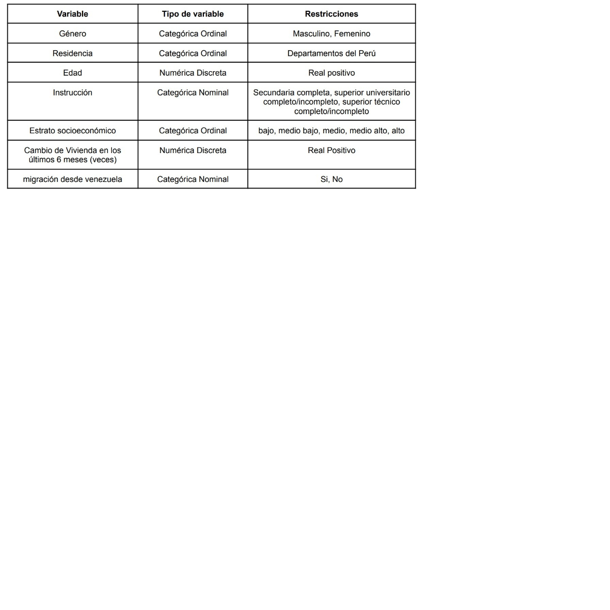
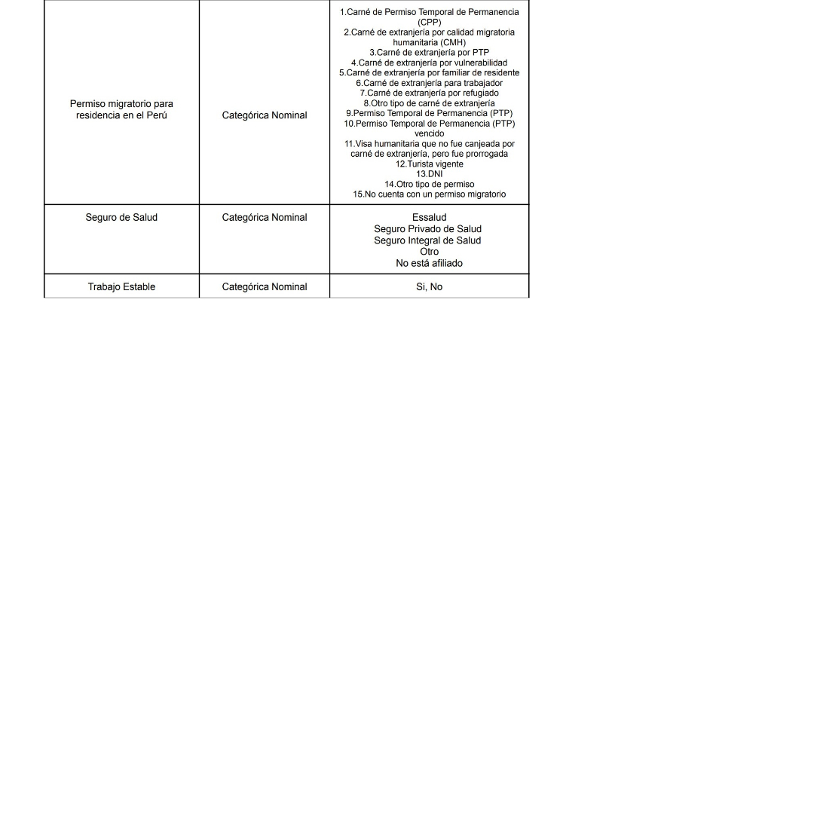
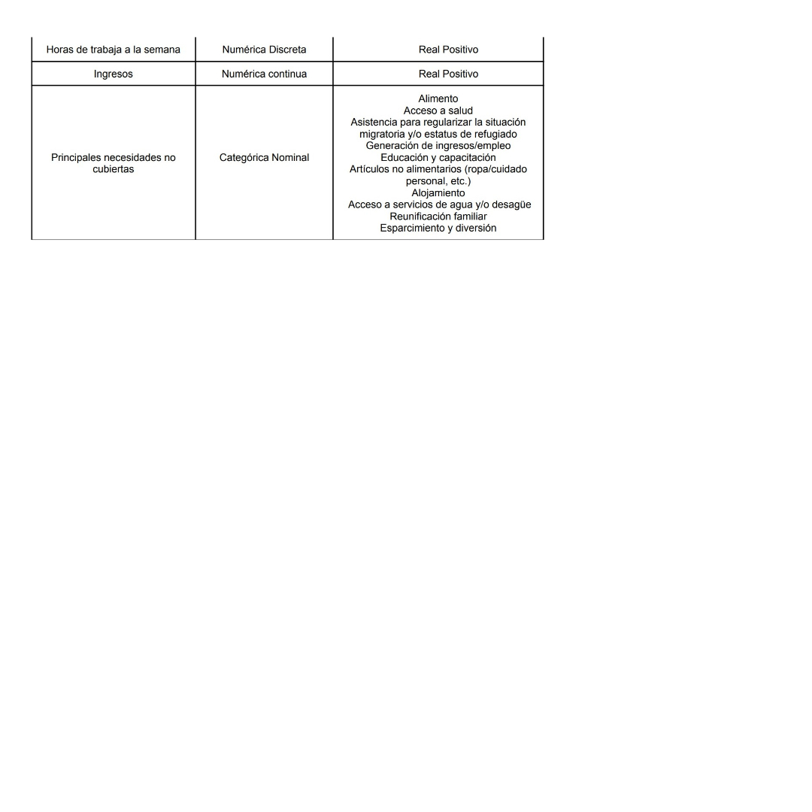

```{r echo=FALSE, message=FALSE, warning=FALSE}
# Instalación y apertura de librerías
library(naniar)
library(readr)
library(dplyr)
library(ggplot2)
library(ggthemes)

```

## [Las principales necesidades de la migración venezolana, en el Perú desde principios del año 2022 hasta la actualidad.]{style="color:darkcyan"} {.build}

## <span style="color:darkcyan">Introducción<span> {.build}

<b style = 'color : darkcyan; font-size : 30px ; font-family : Amasis MT Pro Black'>**Relevancia**</b>

<span style="color:black">En los últimos años, la situación que afrontó la población venezolana situada en el Perú ha ido cambiando respecto a la del año 2018, ya sea por fenómenos globales como el covid-19 o factores como la carencia de alimentos, medicinas, productos de primera necesidad, aumento de la inseguridad ciudadana, etc. Por otro lado, se sabe que el inicio de la pandemia fue una de las potenciales razones para que se produzca la migración hacia países vecinos como lo es Colombia, Ecuador o Perú. Es por ello, que a través de este estudio seremos capaces de adquirir información actualizada de la población venezolana en el Perú, por lo que el presente proyecto mostrará las necesidades más relevantes en base al perfil educativo, las condiciones de salud, empleabilidad,etc.

<b style = 'color : darkcyan; font-size : 30px ; font-family : Amasis MT Pro Black'>**Planificación**</b>
De acuerdo a la planificación, consideramos que las reuniones serían los fines de semana para verificar el respectivo avance del proyecto, de tal manera que podemos observar que 3 personas nos encargamos de la limpieza de datos de las 9 bases, y las otras 2 se encargaron de reestructurar el código y elaborar el análisis para la presentación. Asimismo, de acuerdo a la disponibilidad de todo el grupo, coordinamos para realizar una reunión general para poder ver el avance total del proyecto.

## <span style="color:darkcyan">Planificación<span> {.build}

```{r echo=FALSE, message=FALSE, warning=FALSE}
data <- data.frame(name = c('A ', 'B ', 'C ', 'D ', 'E ', 'F ', 'G ', 'H ','I ','J '),

start = c("S02", "S02", "S03", "S05", "S05", "S04", "S03", "S07","S08","S07"),
end = c("S03", "S03", "S04","S06", "S07", "S06","S07","S08","S14","S14"),
Actividades = c(' Tema del proyecto', ' P0', ' Recoleccion de Datos', ' Población, muestra y muestreo', 'Descriptores y Variables', ' Limpieza de Datos', ' P1', ' Corrección de P1 - Código |  Informe',' Variables Aleatorias',' P2')
)

ggplot(data, aes(x=start, xend=end, y=name, yend=name, color=Actividades)) +
  theme_bw() +
  geom_segment(size=10) +
  labs(title='Planificacion de Actividades', x='Semanas', y='Actividades') +
  scale_colour_manual(values = c('turquoise3', 'red', 'tan3', 'brown', 'orange', 'violet', 'blue', 'purple',
                                 'chartreuse2','darkslategrey'))

```

## <span style="color:darkcyan">Recolección de datos<span> {.build}

Utilizamos 9 base de datos del INEI (Encuesta dirigida a la población venezolana que reside en el país - EMPOVE) Aproximadamente contenían 12k de observaciones y 128 variables. Luego de ello, limpiamos y solo utilizamos 20 variables de las cuales, las más relevantes están explícitas en este proyecto.

<b style = 'color : darkcyan; font-size : 30px ; font-family : Amasis MT Pro Black'>**Población, muestra y muestreo**</b>

Población, muestra y muestreo: La población escogida son las personas migrantes venezolanas que residen en el Perú y la unidad muestral es aquella persona que vive actualmente en cualquier distrito de los 8 departamentos que contiene nuestra base de datos. El tipo de muestreo utilizado es un muestreo probabilístico estratificado. 


<b style = 'color : darkcyan; font-size : 30px ; font-family : Amasis MT Pro Black'>**Contextualización**</b>

<span style="color:black">Actualmente, se sabe que Venezuela es un país que se encuentra en crisis por lo que se han desarrollado factores como la carencia de alimentos, medicinas, productos de primera necesidad, aumento de la inseguridad ciudadana, etc. Asimismo, sabemos que estos factores son principales motivos para que los ciudadanos con nacionalidad venezolana tengan la necesidad de migrar a otros países, por lo que nos enfocaremos en la migración que realizan hacia Perú y sus principales necesidades dentro del territorio peruano.
##  {.build}

## <span style="color:darkcyan">Pregunta de investigación<span> {.build}

<span style="color:black">¿Cuáles son las principales necesidades que tienen los migrantes venezolanos, en el Perú desde principios del año 2022 hasta la actualidad?

<b style = 'color : darkcyan; font-size : 30px ; font-family : Amasis MT Pro Black'>***Objetivos***</b>

-   <span style="color:black">Determinar las marcas de dentífricos que tuvieron un alto índice de consumo por parte de la población de Lima metropolitana.<span>
-   <span style="color:black">Determinar las principales necesidades que tienen los migrantes venezolanos, en el Perú durante el año 2022.<span>
-   <span style="color:black">Identificar los principales factores por lo que se da la migración de venezolanos en el Perú.<span>
-   <span style="color:black">Analizar el departamento que tenga una fuerte presencia de migrantes venezolanos en el Perú.<span>
-   <span style="color:black">Verificar a través de la data las variables que determinen cuales son las necesidades que presentan los migrantes venezolanos en el Perú. <span>

## [Variables]{style="color:darkcyan"} {.build}

<center>

 \## [Relación entre variables]{style="color:darkcyan"}

## [Variables]{style="color:darkcyan"} {.build}

<center>

 \## [Relación entre variables]{style="color:darkcyan"}

## [Variables]{style="color:darkcyan"} {.build}

<center>

 \## [Relación entre variables]{style="color:darkcyan"}


## [Limpieza de bases de datos]{style="color:darkcyan"} {.build}

```{r echo=FALSE, message=FALSE, warning=FALSE}
# Leer las bases de datos 1,2 y 3
BM1<-read_csv("M1.csv")
BM2<-read_csv("M2.csv")
BM3<-read_csv("M3.csv")
```
Unir las bases de datos
```{r echo=FALSE, message=FALSE, warning=FALSE}
DT<-bind_rows(BM1,BM2,BM3)
```

Seleccionar las variables que se utilizarán
```{r echo=FALSE, message=FALSE, warning=FALSE}
DFT<-select(DT,DEPARTAMENTO,ESTRATO,P111A,P204,P205_A,P208,P307)
```

Contar las observaciones y variables
```{r echo=FALSE, message=FALSE, warning=FALSE}
dim(DFT)
```
Contar los datos faltantes y no faltantes
```{r echo=FALSE, message=FALSE, warning=FALSE}
sum(is.na(DFT)) 
sum(!is.na(DFT))
```
Cantidad de datos faltantes por variable antes de reemplazar los NAs con 0s
```{r echo=FALSE, message=FALSE, warning=FALSE}
colSums(is.na(DFT))
```
Cambiar el nombre de las variables para que se entienda mejor
```{r echo=FALSE, message=FALSE, warning=FALSE}
DFT <- DFT %>% rename(CAMBIO_DE_VIV=P111A, SEXO=P204, EDAD=P205_A,MIGRO_DE_VEN=P208, PERMISO_MIGRATORIO=P307)
```

Reemplazar los NAs con 0s
```{r echo=FALSE, message=FALSE, warning=FALSE}
DFT <-mutate_all(DFT,~replace(.,is.na(.),0))
```

Cantidad de datos faltantes por variable después de reemplazar los NAs con 0s
```{r echo=FALSE, message=FALSE, warning=FALSE}
colSums(is.na(DFT))
```


```{r echo=FALSE, message=FALSE, warning=FALSE}
BM4<-read_csv("M4.csv")
BM5<-read_csv("M5.csv")
BM6<-read_csv("M6.csv")
```

```{r echo=FALSE, message=FALSE, warning=FALSE}
# 4, 5 y 6
names(BM4)
names(BM5)
names(BM6)
```

```{r echo=FALSE, message=FALSE, warning=FALSE}
DB4 <- select(BM4, DEPARTAMENTO, ESTRATO, RESFIN, P15 , P15_N)
```

```{r echo=FALSE, message=FALSE, warning=FALSE}
DB4 <- DB4 %>% rename(DISTRITO=RESFIN, MIGRACION_VENEZUELA=P15, CANT_MIGRACION_VENEZUELA=P15_N)
```

```{r echo=FALSE, message=FALSE, warning=FALSE}
DB4 <-mutate_all(DB4,~replace(.,is.na(.),0))
```

```{r echo=FALSE, message=FALSE, warning=FALSE}
DB5 <- select(BM5, DEPARTAMENTO, ESTRATO, RESFIN, P15, P15_N, P401_1, P401_2, P401_3, P401_4, P401_5)
```

```{r echo=FALSE, message=FALSE, warning=FALSE}
DB5 <- DB5 %>% rename(DISTRITO=RESFIN, MIGRACION_VENEZUELA=P15, CANT_MIGRACION_VENEZUELA=P15_N, ESSALUD=P401_1, SEG_PRIV_SALUD=P401_2, SEG_INTEG_SALUD=P401_3, OTRO=P401_4, NO_AFILIADO=P401_5)
```

```{r echo=FALSE, message=FALSE, warning=FALSE}
DB5 <-mutate_all(DB5,~replace(.,is.na(.),0))
```

```{r echo=FALSE, message=FALSE, warning=FALSE}
DB6 <- select(BM6, DEPARTAMENTO, ESTRATO, RESFIN, P15, P15_N, P501B)
```

```{r echo=FALSE, message=FALSE, warning=FALSE}
DB6 <- DB6 %>% rename(DISTRITO=RESFIN, MIGRACION_VENEZUELA=P15, CANT_MIGRACION_VENEZUELA=P15_N, INSTRUCCION=P501B)
```

```{r echo=FALSE, message=FALSE, warning=FALSE}
DB6 <-mutate_all(DB5,~replace(.,is.na(.),0))
```


```{r echo=FALSE, message=FALSE, warning=FALSE}
# 7
db7 <- read_csv("M7.csv")
```

```{r echo=FALSE, message=FALSE, warning=FALSE}
# Variables de la base de datos M7 original:
names(db7)
```

```{r echo=FALSE, message=FALSE, warning=FALSE}
# Extraemos las variables a trabajar:
db7_new<- select(db7, DEPARTAMENTO, PROVINCIA, DISTRITO:RESFIN, P615_T , P622_1:P622_2)
```

```{r echo=FALSE, message=FALSE, warning=FALSE}
# Renombrando variables:
db7_new %>% rename(TOTALES = `P615_T`, INGRESODINERO = `P622_1`, INGRESOESPECIE = `P622_2`)-> db7_new
```

```{r echo=FALSE, message=FALSE, warning=FALSE}
# Mostrando las variables luego de renombrarlas:
names(db7_new)
```

```{r echo=FALSE, message=FALSE, warning=FALSE}
# Resumen del tipo de variables luego de renombrarlas:
glimpse(db7_new)
```

```{r echo=FALSE, message=FALSE, warning=FALSE}
# Datos faltantes en la 7ma base de datos: Empleo
sum(is.na(db7_new))
n_miss(db7_new)
```

```{r echo=FALSE, message=FALSE, warning=FALSE}
# Tabla de datos faltantes (NA's) y datos no faltantes.
table(is.na(db7_new))
```

```{r echo=FALSE, message=FALSE, warning=FALSE}
# Observaciones completas
sum(complete.cases(db7_new))
n_case_complete(db7_new)
```

```{r echo=FALSE, message=FALSE, warning=FALSE}
# Observaciones incompletas
sum(!complete.cases(db7_new))
n_case_miss(db7_new)
```


# Limpieza de Variables
##
#### Limpieza de la variable VRESFIN
```{r echo=FALSE, message=FALSE, warning=FALSE}
unique(db7_new$VRESFIN) # RESULTADO FINAL DE LA ENCUESTA VIVIENDA
#table(db7_new$VRESFIN)
```
VRESFIN : Limpio.

#### Limpieza de la variable RESFIN
```{r echo=FALSE, message=FALSE, warning=FALSE}
unique(db7_new$RESFIN) # RESULTADO FINAL DE LA ENCUESTA HOGAR
#table(db7_new$RESFIN)
```
RESFIN : Limpio.

#### Limpieza de la variable TOTALES
```{r echo=FALSE, message=FALSE, warning=FALSE}
unique(db7_new$TOTALES) # Horas de trabajo a la semana
#table(db7_new$TOTALES)
```
TOTALES : Limpio.

#### Limpieza de la variable INGRESODINERO
```{r echo=FALSE, message=FALSE, warning=FALSE}
unique(db7_new$INGRESODINERO) # Ingreso total en dinero
#table(db7_new$INGRESODINERO)  
```
INGRESODINERO : Limpio.

#### Limpieza de la variable INGRESOESPECIE
```{r echo=FALSE, message=FALSE, warning=FALSE}
unique(db7_new$INGRESOESPECIE) # Ingreso total en especie
#table(db7_new$INGRESOESPECIE) 
```
INGRESOESPECIE : Limpio.


```{r echo=FALSE, message=FALSE, warning=FALSE}
# 8
db8 <- read_csv("M8.csv")
```

```{r echo=FALSE, message=FALSE, warning=FALSE}
# Variables de la base de datos M8 original:
names(db8)
```

```{r echo=FALSE, message=FALSE, warning=FALSE}
# Extraemos las variables a trabajar:
db8_new<- select(db8, DEPARTAMENTO, PROVINCIA, DISTRITO:RESFIN, P709_1:P709_12)
```

```{r echo=FALSE, message=FALSE, warning=FALSE}
# Renombrando variables:
db8_new %>% rename(NECESALIMENTO = `P709_1`, NECESSALUD = `P709_2`, NECESSITUACION = `P709_3`, NECESINGRESOSEMPLEO = `P709_4`, NECESEDUCACION = `P709_5`, NECESPERSONALES = `P709_6`, NECESALOJAMIENTO = `P709_7`, NECESAGUA = `P709_8`, NECESFAMILIA = `P709_9`, NECESDIVERSION = `P709_10`, NECESOTROS = `P709_11`, NECESESPECIFICAR = `P709_12`) -> db8_new
```

```{r echo=FALSE, message=FALSE, warning=FALSE}
# Resumen del tipo de variables luego de renombrarlas:
glimpse(db8_new)
```

```{r echo=FALSE, message=FALSE, warning=FALSE}
# Datos faltantes en la 8ma base de datos: Empleo
sum(is.na(db8_new))
n_miss(db8_new)
```

```{r echo=FALSE, message=FALSE, warning=FALSE}
# Tabla de datos faltantes (NA's) y datos no faltantes.
table(is.na(db8_new))
```

```{r echo=FALSE, message=FALSE, warning=FALSE}
# Observaciones completas
sum(complete.cases(db8_new))
n_case_complete(db8_new)
```

```{r echo=FALSE, message=FALSE, warning=FALSE}
# Observaciones incompletas
sum(!complete.cases(db8_new))
n_case_miss(db8_new)
```


# Limpieza de Variables
##
#### Limpieza de la variable NECESALIMENTO       
```{r echo=FALSE, message=FALSE, warning=FALSE}
unique(db8_new$NECESALIMENTO) # NECESIDAD NO CUBIERTA: Alimento
#table(db8_new$NECESALIMENTO)
```
NECESALIMENTO : Limpio.

#### Limpieza de la variable NECESSALUD
```{r echo=FALSE, message=FALSE, warning=FALSE}
unique(db8_new$NECESSALUD) # NECESIDAD NO CUBIERTA: Acceso a salud
#table(db8_new$NECESSALUD)
```
NECESSALUD : Limpio.

#### Limpieza de la variable NECESSITUACION      
```{r echo=FALSE, message=FALSE, warning=FALSE}
unique(db8_new$NECESSITUACION) # NECESIDAD NO CUBIERTA: Asistencia para regularizar la situación                                                 migratoria y/o estatus de refugiado
#table(db8_new$NECESSITUACION)
```
NECESSITUACION : Limpio.

#### Limpieza de la variable NECESINGRESOSEMPLEO 
```{r echo=FALSE, message=FALSE, warning=FALSE}
unique(db8_new$NECESINGRESOSEMPLEO) # NECESIDAD NO CUBIERTA: Generación de ingresos/empleo
#table(db8_new$NECESINGRESOSEMPLEO)  
```
NECESINGRESOSEMPLEO : Limpio.

#### Limpieza de la variable NECESEDUCACION
```{r echo=FALSE, message=FALSE, warning=FALSE}
unique(db8_new$NECESEDUCACION) # NECESIDAD NO CUBIERTA: Educación y capacitación
#table(db8_new$NECESEDUCACION) 
```
NECESEDUCACION : Limpio.

#### Limpieza de la variable NECESPERSONALES      
```{r echo=FALSE, message=FALSE, warning=FALSE}
unique(db8_new$NECESPERSONALES) # NECESIDAD NO CUBIERTA: Artículos no alimentarios (ropa/cuidado personal, etc.)
#table(db8_new$NECESPERSONALES)  
```
NECESPERSONALES : Limpio.

#### Limpieza de la variable NECESALOJAMIENTO
```{r echo=FALSE, message=FALSE, warning=FALSE}
unique(db8_new$NECESALOJAMIENTO) # NECESIDAD NO CUBIERTA: Alojamiento
#table(db8_new$NECESALOJAMIENTO) 
```
NECESALOJAMIENTO : Limpio.

#### Limpieza de la variable NECESAGUA
```{r echo=FALSE, message=FALSE, warning=FALSE}
unique(db8_new$NECESAGUA) # NECESIDAD NO CUBIERTA: Acceso a servicios de agua y/o desagüe
#table(db8_new$NECESAGUA)  
```
NECESAGUA : Limpio.

#### Limpieza de la variable NECESFAMILIA        
```{r echo=FALSE, message=FALSE, warning=FALSE}
unique(db8_new$NECESFAMILIA) # NECESIDAD NO CUBIERTA: Reunificación familiar
#table(db8_new$NECESFAMILIA) 
```
NECESFAMILIA : Limpio.

#### Limpieza de la variable NECESDIVERSION 
```{r echo=FALSE, message=FALSE, warning=FALSE}
unique(db8_new$NECESDIVERSION) # NECESIDAD NO CUBIERTA: Esparcimiento y diversión
#table(db8_new$NECESDIVERSION)  
```
NECESDIVERSION : Limpio.

#### Limpieza de la variable NECESOTROS
```{r echo=FALSE, message=FALSE, warning=FALSE}
unique(db8_new$NECESOTROS) # NECESIDAD NO CUBIERTA: Otra necesidad
#table(db8_new$NECESOTROS) 
```
NECESOTROS : Limpio.

#### Limpieza de la variable NECESINGRESOSEMPLEO 
```{r echo=FALSE, message=FALSE, warning=FALSE}
unique(db8_new$NECESESPECIFICAR) # NECESIDAD NO CUBIERTA: Generación de ingresos/empleo
#table(db8_new$NECESESPECIFICAR)  
```
NECESESPECIFICAR : Limpio


```{r echo=FALSE, message=FALSE, warning=FALSE}
# 9
db9 <- read_csv("M9.csv")
```

```{r echo=FALSE, message=FALSE, warning=FALSE}
# Variables de la base de datos M7 original:
names(db9)
```

```{r echo=FALSE, message=FALSE, warning=FALSE}
# Extraemos las variables a trabajar:
db9_new<- select(db9,  DEPARTAMENTO, PROVINCIA, DISTRITO:RESFIN)
```

```{r echo=FALSE, message=FALSE, warning=FALSE}
names(db9_new)
```


```{r echo=FALSE, message=FALSE, warning=FALSE}
# NO NECESITAMOS LIMPIAR O EXTRAER VARIABLES YA QUE EN NUESTRO RESPECTIVO PROYECTO NO UTILIZAMOS NADA DE LA 9na Base de datos
```


[Análisis Descriptivo]{style="color:darkcyan"} {.build}
## **Descriptores gráficos**

```{r echo=FALSE, message=FALSE, warning=FALSE}
# 1 2 3
DFT %>% ggplot(mapping = aes(x = reorder(ESTRATO,CAMBIO_DE_VIV),y=CAMBIO_DE_VIV)) + geom_bar(stat="identity")+ coord_flip()+
  labs(title="        Cambio de vivienda por estrato socioeconómico", x="Estratos", y="Cantidad de cambio de vivienda")
```

```{r echo=FALSE, message=FALSE, warning=FALSE}
DFT %>% ggplot(mapping = aes(x = reorder(DEPARTAMENTO,CAMBIO_DE_VIV),y=CAMBIO_DE_VIV)) + geom_bar(stat="identity")+ coord_flip()+
  labs(title="          Departamentos donde hay más mudanzas", x="Departamentos", y="Cantidad de cambios de vivienda")
```


### **Horas de trabajo a la semana = TOTALES**

Extraemos la columna TOTALES que representa la cantidad total de horas trabajada por semana de cada observación. Asimismo, podemos observar que la cantidad máxima que trabaja un migrante venezolano es de 119 horas y el promedio, aproximadamente 51 horas. De esta manera, se evidencia una irregularidad en las horas laborales.

Nota: los datos atípicos hacia la izquierda representan el desempleo y hacia la derecha la posible explotación debido a la gran cantidad de horas por semana.

```{r echo=FALSE, message=FALSE, warning=FALSE}
TOTALES<-db7_new$TOTALES

# table(TOTALES)
max(TOTALES,na.rm = TRUE)
summary(TOTALES)
boxplot(TOTALES , horizontal = T, col = "skyblue")
abline(v=mean(TOTALES,na.rm=TRUE),col="firebrick4",lwd=2)
```

Nota 2: Irregularidad laboral debido a la gran cantidad de horas de trabajo a la semana.
```{r echo=FALSE, message=FALSE, warning=FALSE}
Mayores <-filter(db7_new, TOTALES > 90)
```

### **Horas de Trabajo por semana clasificada por Estratos**

Mostramos una gráfica de barras para cada Estrato de acuerdo a las horas de trabajo. 
Relativamente podemos decir con la gráfica que el Estrato más alto es el que tiene menos horas de trabajo a la semana. Asimismo,
El Estrato medio es el que el que tiene casos con más horas de trabajo ya que sus datos atípicos sobresales de las 110 horas.
```{r echo=FALSE, message=FALSE, warning=FALSE}
# Ahora un diagrama de cajas para las Horas de trabajo por semana clasificada por Estratos:
boxplot(formula= TOTALES~db7_new$ESTRATO, data = db7_new, xlab = "ESTRATO",ylab= "HORAS DE TRABAJO POR SEMANA", col = c("green","yellow","red","skyblue","pink"))
```

**DEPARTAMENTO vs ESTRATO**

Relacionamos 2 variables cualitativas y todas sus posibilidades. 
De esta manera, podemos decir que el Estrato Medio es el que más predomina 
a lo largo de todo el Perú y distribuido en 8 de los 24 departamentos.

```{r echo=FALSE, message=FALSE, warning=FALSE}
# Tabla graficada, con todas las posibilidades entre 2 variables cualitativas (DEPARTAMENTO Y ESTRATO)
tabEstratoyDepartamento<-table(db7_new$DEPARTAMENTO, db7_new$ESTRATO)
tabEstratoyDepartamento
mosaicplot(tabEstratoyDepartamento, main = "Estrato vs Departamento", col = c("green","red","pink","purple","yellow","blue","brown","skyblue"))
```


## [Descriptores Numéricos]{style="color:darkcyan"} {.build}

```{r echo=FALSE, message=FALSE, warning=FALSE}
  DesNum<-function(X){
  return(list(Min=round(min(X,na.rm=TRUE),2),
              Max=round(max(X,na.rm=TRUE),2),
              Mean=round(mean(X,na.rm = TRUE ),2), 
              Median=round(median(X, na.rm = TRUE),2), 
              SD=round(sd(X,na.rm=TRUE),2), 
              CV=round((sd(X,na.rm=TRUE)/mean(X,na.rm=TRUE)),2),
              IQR=round(IQR(X,na.rm=TRUE),2)))
}
```


```{r echo=FALSE, message=FALSE, warning=FALSE}
mapply(DesNum, list(Horas_Semanales = as.numeric(db7_new$TOTALES), 
                          Ingreso_Dinero = as.numeric(db7_new$INGRESODINERO),
                          Edad = as.numeric(DFT$EDAD),
                          Migrantes_Venezuela = as.numeric(DB6$CANT_MIGRACION_VENEZUELA)))
```

 


# **Análisis Probabilístico**

## **Modelos de Variable Discreta**

### **Distribución Binomial Negativa**

Si bien no realizamos encuestas para obtener una base de datos y así trabajar el respectivo proyecto. Muchos de los demás proyectos si lo realizaron de esta manera y como incentivo ofrecieron un sorteo ya sea monetario o con alguna promoción. Asimismo, a manera de ejemplo de aplicación de variables aleatorias, si hiciéramos un sorteo en donde solamente se escojan 2 ganadores. Convenientemente elegiremos a los participantes teniendo como criterio el Estrato socio-económico de acuerdo al Departamento al que pertenezcan.

$DEPARTAMENTO vs ESTRATO$

```{r}
tabEstratoyDepartamento
```

* Éxito -> personas de Estrato Socio-económico - Bajo en Lima (574)  
* Fracaso -> personas de cualquier departamento con el mismo Estrado Socio-económico. 

Variable aleatoria: 𝑿= # de sorteos realizados hasta tener k éxitos.
Variable aleatoria en Rstudio: Y = # de fracasos hasta obtener k éxitos. 
                                  $X = Y + K ➜  Y = X - k$

* P(éxito) : 574 (# personas de Estrato - Bajo en Lima) / 1205 (# total de personas del Estrato Bajo)
* K : queremos 2 ganadores que pertenezcan al Estrato Bajo en Lima

$Definimos variables en R:$

```{r}
X = 2
k = 2
total = 1205 # total de personas del Estrato Bajo
CF = 574     # total de Lima del Estrato Bajo
PE = CF/total

choose(X-1, k-1)*(PE^k)*((1-PE)^(X-k))
```

$Con el comando de Rstudio "dnbinom":$

```{r}
dnbinom(X-k, k, PE)
```

$¿Si quisiéramos la probabilidad de obtener a los ganadores pertenecientes a otro Departamento y Estrado?$
$Ejemplo: Ica - Estrato Medio$

```{r}
X = 2
k = 2
total = 3644 # total de personas del Estrato Medio
CF = 192     # total de Ica del Estrato Medio
PE = CF/total

choose(X-1, k-1)*(PE^k)*((1-PE)^(X-k))
```

$Con el comando de Rstudio "dnbinom":$
```{r}
dnbinom(X-k, k, PE)
```


### **Distribución Hipergeométrica**

```{r include=FALSE}
casosTotalesRegistrados=sum(DFT$CAMBIO_DE_VIV, na.rm=TRUE)
casosTotalesRegistrados
casosLima <- colSums(select(filter(DFT, DEPARTAMENTO =="LIMA"), DEPARTAMENTO, CAMBIO_DE_VIV)[,2])
casosLima
casosIca <- colSums(select(filter(DFT, DEPARTAMENTO =="ICA"), DEPARTAMENTO, CAMBIO_DE_VIV)[,2])
casosIca
```

Se registraron 1283 mudanzas de las cuales 645 se dieron en Lima y 57 en Ica, si tomamos como muestra 100 casos sin reemplazo:
 
¿Cuál es la probabilidad de que...

a) más de la mitad de los casos sean de Lima?
b) más de 1/4 sean de Lima?
c) más de la mitad sean de Ica?

$Definimos$

Experimento aleatorio: Sacar un caso sobre cambio de vivienda y el departamento donde sucede. Muestreo sin reemplazo.

-   X : Cantidad de casos registrados de cambios de vivienda en Lima. contenidos en la muestra. X = {0, n}

-   N : casos totales registrados en el Perú

-   r : casos de Lima.

-   ri: casos de Ica

-   n : muestra de la cantidad de casos registrados en el Perú

```{r}
N = casosTotalesRegistrados
r = casosLima
ri = casosIca
n = 100;

# a.)
phyper(49,r, N-r, n, lower.tail = FALSE)

# b.)
phyper(24, r, N-r, n, lower.tail = FALSE)

# c.)
phyper(49, ri, N-ri, n, lower.tail = FALSE)
```

Explicación:

En primer lugar, la variable sigue una distribución hipergeométrica ya que: la población es finita (N elementos); cada elemento puede caracterizarse como éxito o fracaso ("si" provenien o "no" de Lima); hay "r" éxitos y "N-r" fracasos; y se saca un muestreo sin reemplazo con misma probabilidad de que los elementos sean elegidos.

En el inciso a) obtuvimos que la probabilidad de que más de la mitad de los casos sean de Lima es de prácticamente la mitad ya que es 0.56. Por otro lado, en el inciso b) se observa que la probabilidad de que más de 1/4 de los casos sean de Lima ya que la probabilidad es 1. Por último en el inciso c) observamos que es prácticamente imposible que más de la mitad de los casos sean provenientes de Ica ya que su probabilidad es 0.

Gracias a este experimento aleatorio y el análisis del mismo podemos comprender de mejor manera qué tan dominante fue Lima con respecto a la proveniencia de los casos de mudanzas en el Perú en el último año.


## **Modelos de Variable Continua**

### **Distribución Normal**

$Cantidad de horas de trabajo a la semana$

De acuerdo a las conclusiones sobre la cantidad de horas que trabajan los migrantes venezolanos a la semana, se tiene que el promedio es de 52 horas. Por lo tanto, para calcular por intervalos dicha variable cuantitativa se busca su distribución normal, Para ello, es necesario saber su desviación estándar y su media.

Variable continua: 𝑿=# Cantidad de horas trabajadas a la semana.

$¿Que porcentaje de migrantes venezolanos trabaja menos de 50 horas?$

```{r}
media <- mean(TOTALES,na.rm=TRUE)
#media
desv_standar <- sd(TOTALES,na.rm=TRUE)
#desv_standar
x <- 50 
(pnorm(x, media, desv_standar))*100
```

$¿Que porcentaje de migrantes venezolanos trabaja entre 50 y 70 horas?$

$Con el comando de Rstudio "pnorm":$

```{r}
(pnorm(70, media, desv_standar) - pnorm(50, media, desv_standar))*100
```

$¿Que porcentaje de migrantes venezolanos trabaja mas de 50 horas?$

$Con el comando de Rstudio "pnorm":$

```{r}
(1 - pnorm(x, media, desv_standar))*100
(pnorm(x, media, desv_standar, lower.tail = F))*100
```


