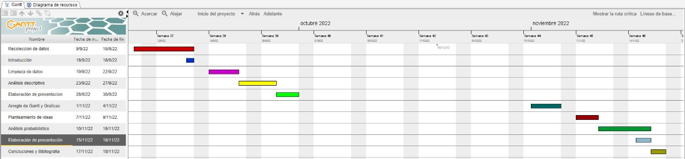

```{r warning=FALSE, echo=FALSE}
#importar paquetes
library(dplyr)
library(readr)
library(rstudioapi)
library(magrittr)
library(tidyverse)
library(stringi)
library(fitdistrplus)
```

```{r echo=FALSE}
#Getting the path of your current open file
#current_path = rstudioapi::getActiveDocumentContext()$path 
#setwd(dirname(current_path ))
```

# Introducción


## Relevancia

 Nuestro estudio es relevante porque permite encontrar si la relación entre la preferencia en videojuegos de los alumnos y su perfil estudiantil. Con esta información podremos validar o rechazar algunas ideas o prejuicios alrededor de los videojuegos; por ejemplo, la idea de que jugar videojuegos lleva a un menor rendimiento.

## Objetivo del estudio
Nuestro estudio busca recolectar datos del perfil universitario de los estudiantes y relacionarlo al uso de videojuegos. Nos enfocamos principalmente en la relación entre los videojuegos y el perfil académico, aunque consideramos otros factores. 


## Planificación
  


# Datos

## Proceso de recolección de datos
  
Los datos se recolectaron a través de una encuesta de _Google Forms_ de que fue circulada por la universidad. También se aprovechó la presencialidad para conseguir encuestas que fueron incentivadas con un dulce en la Universidad durante el 27 y 28 de septiembre del 2022 en horas del día. No encontramos algún factor de influencia a partir de esta metodología.
Utilizamos _Google Forms_ porque es gratuita, permite la restricción de dominios de las variables (facilitando la limpieza) y facilita compartir la encuesta. Para analizar los datos en R, se descargaron las respuestas en un archivo de formato `.csv`.

A continuación cargamos los datos con la ayuda de la librería `readr`.
```{r}
#cargar el archivo csv
DF <- read_csv("Encuesta UTECxVideojuegos.csv"
               , show_col_types = FALSE)
```

## Población, muestra y muestreo

+ Población de estudio: Alumnos de pregrado de UTEC.

+ Unidad muestral: Alumno.

+ Muestreo: Muestreo por conveniencia. Se hizo llegar la encuesta a estudiantes por medio digital que dieron su tiempo y 
Obtuvo una muestra cuyo tamaño es de `r nrow(DF)` observaciones.

+ Representatividad: Consideramos que la encuesta es representativa de la población de UTEC a pesar de que tenemos solo un total del `r round((nrow(DF)/3200)*100,2)`% del universo de alrededor de 3200 alumnos porque no encontramos ningún factor de influencia en la recolección de los datos.

## Descripción de las variables de estudio


| Variable | Tipo | Descripción | 
|-------------------|-------------|---------------|
| Código | Categórica nominal | Identificador de alumno en UTEC |
| Sexo | Categórica nominal  | Orientación sexual |
| Edad | Numérica discreta | Edad actual del encuestado |
| Carrera | Categórica nominal  | Carrera cursada |
| Ciclo | Numérica discreta | Ciclo académico |
| Créditos | Numérica discreta | Cantidad de créditos |
| Vive solo | Categórica nominal  | Afirmación o negación si vive solo |
| Ha jugado | Categórica nominal  | Afirmación o negación si ha jugado videojuegos |
| Gasto | Numérica continua  | Gasto en videojuegos el ultimo año |
| Costo | Numérica continua  | Precio del ultimo juego adquirido |
| Frecuencia |  Numérica continua | Horas de juego a la semana |
| Estudio | Numérica continua | Horas de estudio a la semana |
| Amigos | Categórica nominal | Afirmación o negación si juega con amigos |
| Frecuencia amigos | Numérica continua | Horas de juego con amigos |
| Promedio | Numérica continua | Promedio alcanzado en el ciclo pasado o promedio de 5to de secundaria si el alumno de primer ciclo |
| Afecta | Categórica nominal  | Afirmación o negación si cree que jugar afecta a sus estudios |
| Favorito | Categórica nominal | Videojuego favorito |
| Horas de juego | Numérica continua  | Horas de juego |
| Jugar es divertido |  Categórica ordinal | Calificación de del 1 - 7 si es divertido jugar |
| Continua | Categórica ordinal | Calificación de del 1 - 7 si continua jugando después de cada partida |
| Bueno | Categórica ordinal | Calificación del 1 - 7 si es bueno jugando |

**Preferencias**
| Shooter | Categórica ordinal  | Gusto por el genero si / no |
| Deporte y carreras | Categórica ordinal  | Gusto por el genero si / no |
| Plataformas | Categórica ordinal  | Gusto por el genero si / no |
| Peleas | Categórica ordinal  | Gusto por el genero si / no |
| Estrategia | Categórica ordinal  | Gusto por el genero si / no |
| Simulación | Categórica ordinal  | Gusto por el genero si / no |
| Aventura | Categórica ordinal  | Gusto por el genero si / no |
| RPG | Categórica ordinal  | Gusto por el genero si / no |
| Sandbox | Categórica ordinal  | Gusto por el genero si / no |
| Casual | Categórica ordinal  | Gusto por el genero si / no |
| Arcade | Categórica ordinal  | Gusto por el genero si / no |
| MOBA | Categórica ordinal  | Gusto por el genero si / no |

**Plataformas**
| Plataforma consola | Categórica nominal  | Juega en consola |
| Plataforma móvil | Categórica nominal  | Juega en móvil |
| Plataforma PC | Categórica nominal  | Juega en PC |
| Plataforma tablet | Categórica nominal  | Juega en Tablet |

Encontramos 37 variables

## Limpieza de base de datos

Nuestro archivo de datos muestra 36 variables, con nombres inadecuados, variables vacías o irrelevantes e incluso multiplicidad de valores en algunos campos.
```{r}
names(DF)
```

Primero que nada lidiamos con la multiplicidad de valores. Estos están primariamente en el tipo de juego de preferencia y en el tipo de plataforma.

Arreglamos la multiplicidad de el tipo de juego de preferencia
```{r warning=FALSE}
# codigo adaptado de https://community.rstudio.com/t/how-to-separate-multiple-choice-multiple-answers-questionnaire-data-that-google-forms-put-in-one-variable/31168

DF <- DF %>%
  mutate(ID = 1:n()) %>%
  mutate(`Tipo de juego de preferencia` = strsplit(`Tipo de juego de preferencia`, split = ";\\s?")) %>%
  unnest() %>%
  mutate(Value = 1) %>%
  spread(`Tipo de juego de preferencia`, Value, fill = 0) %>%
  dplyr::select(-ID)
```

Arreglamos la multiplicidad del tipo de plataforma
```{r warning=FALSE}
# codigo adaptado de https://community.rstudio.com/t/how-to-separate-multiple-choice-multiple-answers-questionnaire-data-that-google-forms-put-in-one-variable/31168

DF <- DF %>%
  mutate(ID = 1:n()) %>%
  mutate(`Juegas más en móvil, PC o en Consola` = strsplit(`Juegas más en móvil, PC o en Consola`, split = ";\\s?")) %>%
  unnest() %>%
  mutate(Value = 1) %>%
  spread(`Juegas más en móvil, PC o en Consola`, Value, fill = 0) %>%
  dplyr::select(-ID)
```

Continuamos eliminando las columnas innecesarias.

```{r}
DF$`Marca temporal` <- NULL
DF$`Nombre de usuario` <- NULL
DF$`Plataforma` <- NULL
DF$`Género al que pertenece` <- NULL
DF$`...28` <- NULL
DF$`...29` <- NULL
DF$`...30` <- NULL
DF$`...31` <- NULL
DF$`...32` <- NULL
DF$`...33` <- NULL
DF$`...34` <- NULL
DF$`...35` <- NULL
DF$`...36` <- NULL
```

También renombramos las columnas a nombres más convenientes.
```{r}
DF %>% rename(Codigo = `Código de alumno`
              , Sexo = `Sexo`
              , Edad = `Edad`
              , Carrera = `Carrera`
              , Ciclo = `En que ciclo estas?`
              , Creditos = Créditos
              , Vive_solo = `¿Vive solo en su domicilio?`
              , Ha_jugado = `¿Ha jugado algún videojuegos?`
              , Gasto = `En el último año, cuanto ha gastado relacionado con los videojuegos`
              , Costo = `Costo del último juego que adquiriste`
              , Frecuencia = `Frecuencia con la que juegas en la semana`
              , Estudio = `Durante la semana cuantas horas estudia`
              , Amigos = `Juegas con amigos`
              , Frecuencia_amigos = `Frecuencia con la que juegas en la semana con amigos`
              , Promedio = `¿Cuánto fue su promedio el último ciclo? (Use '.' como decimal)`
              , Afecta = `¿Cree que jugar videojuegos afecta su rendimiento académico?`
              , Favorito = `Mi videojuego favorito seria:`
              , Horas_juego = `¿Horas totales de juego?`
              , Jugar_es_divertido = `Jugar a videojuegos es una actividad divertida`
              , Continua = `Cuando inicio una partida en un videojuego me apetece continuar jugándolo`
              , Bueno = `Creo que soy bueno jugando a videojuegos`
              , Casual = `Juegos casuales (Tipo angry birds, farmville, etc )`
              , Shooter = `Shooters (Videojuegos de disparos)`
              , RPG = `Juegos de rol (RPG)`
              , MOBA = `MOBA (Lol, Dota, etc)`
              , Deportes_y_carreras = `Deportes y carreras`
              , Sandbox = `Sandboxes (Mundos abiertos en los que se puede hacer los que quiera)`
              , Simulacion = Simulación
              , Movil = Móvil
              

              ) -> DF
```

### Limpieza de unidad muestral (Variable `Codigo`)
Para respetar nuestra unidad muestral de alumno, eliminamos los códigos duplicados
```{r}
DF <- DF[!duplicated(DF$Codigo),]
```

Veamos si hay algun valor no numérico:
```{r}
DF[grep("[^0-9.]",DF$Codigo),]
```


Eliminamos la fila de la persona que colocó su correo en vez de un código
```{r}
DF <- DF[-grep("[^0-9.]",DF$Codigo),] #Eliminamos la fila 
```
### Limpieza de variable Sexo

Veamos que hay en Sexo:
```{r}
table(DF$Sexo)
```

La variable está limpia.

### Limpieza de la variable Edad

Veamos que hay en la variable edad:
```{r}
table(DF$Edad)
```
Tenemos individuos que han colocado 5, cosa que es imposible. Como no podemos corregirlo, tenemos que convertirlos a NA.
```{r}
DF$Edad[DF$Edad == "5"] <- NA
```


### Limpieza de la variable Carrera
Veamos que hay en Carrera
```{r}
table(DF$Carrera)
```
La variable Carrera está limpia

### Limpieza de la variable Ciclo

Veamos que hay en Ciclo
```{r}
table(DF$Ciclo)
```

Arreglamos los valores claramente mal formateados:

```{r}
DF$Ciclo[DF$Ciclo == "3ro"] <- "3"
DF$Ciclo[DF$Ciclo == "2ro"] <- "2"
DF$Ciclo[DF$Ciclo == "2do"] <- "2"
DF$Ciclo[DF$Ciclo == "0"] <- NA
```
Convertimos a numeric la variable:
```{r}
DF$Ciclo = as.numeric(DF$Ciclo)
```

### Limpieza de la variable `Creditos`

Veamos que contiene la variable `Creditos`:
```{r}
table(DF$Creditos)
```

Arreglamos algunos valores claramente errados y corregibles:
```{r}
DF$Creditos[DF$Creditos == "6creditos"] <- "6"
DF$Creditos[DF$Creditos == "Na"] = NA
DF$Creditos[DF$Creditos == "95"] <- "9"
DF$Creditos[DF$Creditos == "83"] <- "8"
DF$Creditos[DF$Creditos == "0"] = NA
```

Cambiamos el tipo de la variable a numeric:
```{r}
DF$Creditos = as.numeric(DF$Creditos)
```

### Limpieza de la variable Vive_solo

Veamos que hay dentro de Vive_Solo
```{r}
table(DF$Vive_solo)
```
Vive solo esta limpia. Solo tenemos que cambiarles el tipo a booleanos

```{r}
DF$Vive_solo = DF$Vive_solo == "Sí"
```

### Limpieza de la variable Ha_jugado

Veamos que hay dentro de Ha_jugado
```{r}
table(DF$Ha_jugado)
```
`Vive_solo` esta limpia.Solo tenemos que cambiarles el tipo a booleanos

```{r}
DF$Ha_jugado = DF$Ha_jugado == "Sí"
```

Además, no tiene sentido preguntar sobre los videojuegos a aquellos que no han jugado, por lo que debemos eliminar completamente las observaciones que tengan un `No` en esta respuesta.

```{r}
DF = DF[DF$Ha_jugado,]
```

### Limpieza de la variable Gasto

Veamos si hay algun gasto con forma no numérica positiva:
```{r}
DF$Gasto[grep("[^0-9.]",DF$Gasto)]
```
Encontramos valores que podemos corregir o que son distintas formas de nuestros encuestados de decir NA. Arreglamos esto a continuación:
```{r}
DF$Gasto[DF$Gasto == "-1"] <- NA
DF$Gasto[DF$Gasto == "~400"] <- "400"
DF$Gasto[DF$Gasto == "10 soles"] <- "10"
DF$Gasto[DF$Gasto == "O soles"] <- "0"
DF$Gasto[DF$Gasto == "No"] <- "0"
DF$Gasto[DF$Gasto == "Nada"] <- "0"
DF$Gasto[DF$Gasto == "Js"] <- NA
DF$Gasto[DF$Gasto == "00"] <- "0"
```
Una ves lo hemos arreglado podemos convertir el tipo de la variable a numeric:
```{r}
DF$Gasto <- as.numeric(DF$Gasto)
```
### Limpieza de la variable Costo

Veamos si en la variable Costo hay algo de forma no numérica positiva.
```{r}
DF$Costo[grep("[^0-9.]",DF$Costo)]
```
```{r}
DF$Costo[DF$Costo == "0 soles"] <- "0"
DF$Costo[DF$Costo == "00"] <- "0"
DF$Costo[DF$Costo == "No"] <- NA
DF$Costo[DF$Costo == "J"] <- NA
DF$Costo[DF$Costo == "Fortnite"] <- NA
DF$Costo[DF$Costo == "Nada"] <- "0"
DF$Costo[DF$Costo == "No gaste"] <- "0"
DF$Costo[DF$Costo == "Gratis"] <- "0"
DF$Costo[DF$Costo == "Ninguno"] <- "0"
DF$Costo[DF$Costo == "Need for speed"] <- NA
DF$Costo[DF$Costo == "God of War"] <- NA
DF$Costo[DF$Costo == "Star Wars The Skywalker saga"] <- NA
DF$Costo[DF$Costo == "Spiderman ps4"] <- NA
```
Una vez limpiamos eso, podemos cambiarle el tipo a numeric. Asimismo, eliminaremos los valores atipicos mayores a 400, que suponemos que vienen de una persona que penso que era un acumulado del gasto en videojuegos.
```{r}
DF$Costo <- as.numeric(DF$Costo)
DF$Costo[DF$Costo > 400] = NA
```
### Limpieza de la variable Frecuencia

Veamos qué valores dentro de Frecuencia no son de la forma de un entero positivo:
```{r}
DF$Frecuencia[grep("[^0-9.]",DF$Frecuencia)]
```
Arreglamos las que es sensato arreglar, y las que no las pasamos a NA.
```{r}
DF$Frecuencia[DF$Frecuencia == "2 veces"] <- NA
DF$Frecuencia[DF$Frecuencia == "2 veces a la semana"] <- NA
DF$Frecuencia[DF$Frecuencia == "1b hora"] <- "1"
DF$Frecuencia[DF$Frecuencia == "Nada"] <- 0
DF$Frecuencia[DF$Frecuencia == "14h"] <- "14"
DF$Frecuencia[DF$Frecuencia == "2 horas"] <- "2"
DF$Frecuencia[DF$Frecuencia == "2horas"] <- "2"
DF$Frecuencia[DF$Frecuencia == "5 horas"] <- "5"
DF$Frecuencia[DF$Frecuencia == "Jsj"] <- NA
DF$Frecuencia[DF$Frecuencia == "1:30"] <- "1.5"
DF$Frecuencia[DF$Frecuencia == "3 veces a la semana"] <- NA
DF$Frecuencia[DF$Frecuencia == "5/10"] <- NA
```
Una vez hemos limpiado esos datos, podemos convertir el tipo a numeric.
```{r}
DF$Frecuencia <- as.numeric(DF$Frecuencia)
```
Por último retiramos los valores claramente demasiado altos.
```{r}
DF$Frecuencia[DF$Frecuencia>50] = NA
```
### Limpieza de la variable Estudio

Veamos si hay alguna observación no numérica positiva en Estudio:
```{r}
DF$Estudio[grep("[^0-9.]",DF$Estudio)]
```
Arreglamos las que podemos y a las que no tienen una reparación sensata les asignamos NA

```{r}
DF$Estudio[DF$Estudio == "3 horas por día"] = "21"
DF$Estudio[DF$Estudio == "14h"] = "14"
DF$Estudio[DF$Estudio == "Depende la semana"] = NA
DF$Estudio[DF$Estudio == "No se"] = NA
DF$Estudio[DF$Estudio == "2h"] = "2"
DF$Estudio[DF$Estudio == "Ys"] = NA
DF$Estudio[DF$Estudio == "6 aprox"] = "6"
```

Una vez hecho eso le cambiamos el tipo a numeric:
```{r}
DF$Estudio = as.numeric(DF$Estudio)
```

### Limpieza de la variable Amigos

Veamos que hay en la variable Amigos

```{r}
table(DF$Amigos)
```
La variable Amigos está limpia. Ahora le colocaremos un tipo booleano.
```{r}
DF$Amigos = DF$Amigos == "Si"
```

### Limpieza de la variable Frecuencia_amigos

Veamos si en Frecuencia_amigos hay alguna observación que no se ajuste al formato de número positivo.
```{r}
DF$Frecuencia_amigos[grep("[^0-9.]",DF$Frecuencia_amigos)]
```
Corregimos las que tiene sentido corregir y las que no se convierten en NAs.
```{r}
DF$Frecuencia_amigos[DF$Frecuencia_amigos == "00"] <- "0"
DF$Frecuencia_amigos[DF$Frecuencia_amigos == "No"] <- "0"
DF$Frecuencia_amigos[DF$Frecuencia_amigos == "2 días"] <- NA
DF$Frecuencia_amigos[DF$Frecuencia_amigos == "2veces"] <- NA
DF$Frecuencia_amigos[DF$Frecuencia_amigos == "Cada 2 días"] <- NA
DF$Frecuencia_amigos[DF$Frecuencia_amigos == "Lunes a viernes"] <- NA
```

Convertimos el tipo de dato a ser numeric.
```{r}
DF$Frecuencia_amigos <- as.numeric(DF$Frecuencia_amigos)
```
### Limpieza de la variable Promedio

Veamos si en Promedio hay algun valor no numérico o mal formateado:
```{r}
DF$Promedio[grep("[^0-9.]",DF$Promedio)]
```
Encontramos múltiples números mal formateados y algunos valores no numéricos. Los valores numéricos serán arreglados y los valores no numéricos serán asignados como NA.
```{r}
DF$Promedio[DF$Promedio == "-"] <- NA
DF$Promedio[DF$Promedio == "Cachimba"] <- NA
DF$Promedio[DF$Promedio == "Eso no se pregunta ....T-T"] <- NA
DF$Promedio[DF$Promedio == "Que se yo"] <- NA
DF$Promedio[DF$Promedio == "15,34"] <- "15.34"
DF$Promedio[DF$Promedio == "11,41"] <- "11.41"
DF$Promedio[DF$Promedio == "16,5"] <- "16.5"
DF$Promedio[DF$Promedio == "14,61"] <- "14.61"
DF$Promedio[DF$Promedio == "-1"] <- NA
DF$Promedio[DF$Promedio == "17,7"] <- "17.7"
table(DF$Promedio)
```

Una vez hecho eso, convertimos el tipo a numeric.
```{r}
DF$Promedio <- as.numeric(DF$Promedio)
```
### Limpieza de la variable Afecta

Veamos que hay en Afecta
```{r}
table(DF$Afecta)
```
la variable Afecta está limpia.

### Limpieza de la variable Favorito

La variable Favorito es particularmente difícil de limpiar. Intentaremos dar un mismo nombre a las observaciones que se refieran al mismo juego, pero al haber sido un campo abierto existe mucha variabilidad.

No nos tomaremos siquiera la molestia de ver que tiene sin antes retirar las mayúsculas.

```{r}
DF$Favorito = tolower(DF$Favorito)
```
Ahora si podemos ver que tenemos en Favorito:
```{r}
table(DF$Favorito)
```
Realizamos la limpieza aproximando al más cercano. Aca hemos usado nuestra mejor aproximación pero no podemos garantizar que los datos no hayan sido afectados.
```{r}
DF$Favorito[grep("free",DF$Favorito)] = 'free fire'
DF$Favorito[grep("dota",DF$Favorito)] = 'dota'
DF$Favorito[grep("brawl",DF$Favorito)] = 'brawl stars'
DF$Favorito[grep("counter|conter|cs",DF$Favorito)] = 'counter strike'
DF$Favorito[grep("fif",DF$Favorito)] = 'fifa'
DF$Favorito[grep("dead",DF$Favorito)] = 'left 4 dead'
DF$Favorito[grep("genshin",DF$Favorito)] = 'genshin impact'
DF$Favorito[grep("lol",DF$Favorito)] = 'league of legends'
DF$Favorito[grep("cod",DF$Favorito)] = 'call of duty'
DF$Favorito[grep("for",DF$Favorito)] = 'fortnite'
DF$Favorito[grep("pokemon|pokémon",DF$Favorito)] = 'pokemon'
DF$Favorito[grep("plantas",DF$Favorito)] = 'plants vs zombies'
DF$Favorito[grep("valorant",DF$Favorito)] = 'valorant'
DF$Favorito[grep("destiny",DF$Favorito)] = 'destiny'
DF$Favorito[grep("hollow",DF$Favorito)] = 'hollow knight'
DF$Favorito[grep("ape",DF$Favorito)] = 'apex legends'
DF$Favorito[grep("smash",DF$Favorito)] = 'smash bros'
DF$Favorito[grep("assassin|assasins",DF$Favorito)] = 'assasins creed'
DF$Favorito[grep("spiderman",DF$Favorito)] = 'spiderman'
DF$Favorito[grep("age",DF$Favorito)] = 'age of empires'
DF$Favorito[grep("pes",DF$Favorito)] = 'age of empires'
DF$Favorito[DF$Favorito == 'good of ward'] = 'god of war'
DF$Favorito[grep("no tengo|ninguno|--|-1|carreras|jsjf|pugcito",DF$Favorito)] = NA
```
Finalmente quedamos con la siguiente tabla que resulta mas aceptable:
```{r}
table(DF$Favorito)
```

### Limpieza de la variable Horas_juego

Veamos si la variable Horas_juego tiene valores no numéricos positivos:
```{r}
DF$Horas_juego[grep("[^0-9.]",DF$Horas_juego)]
```
Corregiremos las que sea posible corregir a un valor sensato y colocaremos NA en las que no podamos corregir.
```{r}
DF$Horas_juego[DF$Horas_juego == "--"] <- NA
DF$Horas_juego[DF$Horas_juego == "+200"] <- "200"
DF$Horas_juego[DF$Horas_juego == "2 meses"] <- NA
DF$Horas_juego[DF$Horas_juego == "Más de 200"] <- "200"
DF$Horas_juego[DF$Horas_juego == "Bastantes"] <- NA
DF$Horas_juego[DF$Horas_juego == "No recuerdo"] <- NA
DF$Horas_juego[DF$Horas_juego == "251 horas"] <- "251"
DF$Horas_juego[DF$Horas_juego == "72h"] <- "72"
DF$Horas_juego[DF$Horas_juego == "Zjd"] <- NA
DF$Horas_juego[DF$Horas_juego == "3h"] <- "3"
DF$Horas_juego[DF$Horas_juego == "5h"] <- "5"
DF$Horas_juego[DF$Horas_juego == "6 horas"] <- "6"
DF$Horas_juego[DF$Horas_juego == "2000+"] <- "2000"
DF$Horas_juego[DF$Horas_juego == "30 min"] <- "0.5"
DF$Horas_juego[DF$Horas_juego == "4 a la semana máximo"] <- '4'
```
Ahora le cambiamos el tipo de dato a numeric:
```{r}
table(DF$Horas_juego)
```

```{r}
DF$Horas_juego <- as.numeric(DF$Horas_juego)
```

### Limpieza de la variable Jugar_es_divertido

Veamos que hay en la variable Jugar_es_divertido
```{r}
table(DF$Jugar_es_divertido)
```
La variable Jugar_es_divertido está limpia.

### Limpieza de la variable Continua

Veamos que hay en la variable Continua
```{r}
table(DF$Jugar_es_divertido)
```
La variable Continua esta limpia.

### Limpieza de la variable Bueno

Veamos que hay en la variable Bueno
```{r}
table(DF$Bueno)
```
La variable Jugar_es_divertido está limpia.

### Limpieza de las variables derivadas de atributos multivaluados
Dado que las variables que hemos derivado de atributos multivaluados ya están limpias en el sentido de contener un formato adecuado, solo haría falta cambiarles el tipo a booleano.

```{r}
DF$Arcade = DF$Arcade == 1
DF$Aventura = DF$Aventura == 1
DF$Deportes_y_carreras = DF$Deportes_y_carreras == 1
DF$Estrategia = DF$Estrategia == 1
DF$Casual = DF$Casual == 1
DF$RPG = DF$RPG == 1
DF$MOBA = DF$MOBA == 1
DF$Peleas = DF$Peleas == 1
DF$Plataformas = DF$Plataformas == 1
DF$Sandbox = DF$Sandbox == 1
DF$Shooter = DF$Shooter == 1
DF$Simulacion = DF$Simulacion == 1
DF$Consola = DF$Consola == 1
DF$Movil = DF$Movil == 1
DF$PC = DF$PC == 1
DF$Tablet = DF$Tablet == 1
```
### Conclusión de la limpieza
  Tenemos `r ncol(DF)` variables en una muestra con tamaño efectivo de `r nrow(DF)`. El conteo de tipos de las variables se detalla a continuación:
  
```{r}
print(table(sapply(DF,typeof)))
```
# Análisis descriptivo

Comencemos definiendo las variables de interés. Por la manera en como hemos planteado el proyecto tenemos dos tipos de variables: las variables de perfil del alumno y las variables de uso de videojuegos.

Las variables de perfil del alumno son `Sexo`, `Edad`, `Carrera`, `Ciclo`, `Creditos`, `Vive_solo`,`Estudio`,`Promedio` y `Afecta`. Estas nos permiten entender mas o menos quien es el alumno.

Las variables de uso de videojuegos son `Gasto`,`Costo`,`Frecuencia`,`Amigos`,`Frecuencia_amigos`, `Favorito`, `Horas_juego`, las variables que hacen referencia a los géneros preferidos y las que refieren a las plataformas usadas.

Veamos cual es el porcentaje de representacion de cada sexo:
```{r}
barplot( sort((table(DF$Sexo)/sum(!is.na(DF$Sexo)))*100,decreasing=T)
        ,cex.names = 0.6
        ,ylim = c(0,110)
        ,main = "Variable Sexo"
        ,axes = TRUE
        ,xlab = "Respuesta"
        ,ylab = "Porcentaje"
        )
```
Analicemos si, en promedio, alguno de los sexos gasta más que el otro en videojuegos:

```{r}
print(
DF %>%
  group_by(Sexo) %>%
  summarise_at(vars(Gasto), list(name = mean))
)
```
Podemos ver que en promedio las personas que se identifican como de Sexo masculino tienden a gastar mas dinero en promedio en videojuegos. Utilizaremos la mediana para poder corroborar si esto se debe a algún dato atípico.
```{r}
print(
DF %>%
  group_by(Sexo) %>%
  summarise_at(vars(Gasto), list(name = median))
)
```
Claramente no se debe exclusivamente a esto. Podria deberse a la menor representacion de las personas de sexo femenino en nuestros datos.

Veamos cual es nuestra distribución de edades
```{r}
hist(DF$Edad
     ,breaks = seq(10.5,35.5,1)
     ,main = "Edades"
     , ylab = "Frecuencia"
     , xlab = "Edad"
     )
```

Ahora veamos si hay alguna relación entre Edad y la mediana de las Horas_juego
```{r}
Edad_HorasPromedio = DF %>%
      group_by(Edad) %>%
      summarise(Mean = median(Horas_juego, na.rm = T))

medians_ages = data.frame("edades" = c(16,17,18,19,20,21,22,23,24,25,34),
                          "medianas" = pull(Edad_HorasPromedio[2],-1)[-12])

medians_ages = rbind(medians_ages,data.frame("medianas"=c(0,0,0,0,0,0,0,0),"edades"=c(26,27,28,29,30,31,32,33)))
medians_ages = medians_ages[order(medians_ages$edades),]

barplot(medians_ages$medianas
        ,names = medians_ages$edades
        #,type = "l"
        ,cex.names = 0.6
        ,main = "Mediana de horas de juego vs edad"
        ,ylab = "Horas de Juego"
        ,xlab = "Edad"
        )
```
Pareciera que las personas de alrededor de 22 años tienden a jugar más videojuegos.
Esto se refuerza con el promedio:
```{r}
Edad_HorasPromedio = DF %>%
      group_by(Edad) %>%
      summarise(Mean = mean(Horas_juego, na.rm = T))

medians_ages = data.frame("edades" = c(16,17,18,19,20,21,22,23,24,25,34),
                          "medianas" = pull(Edad_HorasPromedio[2],-1)[-12])

medians_ages = rbind(medians_ages,data.frame("medianas"=c(0,0,0,0,0,0,0,0),"edades"=c(26,27,28,29,30,31,32,33)))
medians_ages = medians_ages[order(medians_ages$edades),]

barplot(medians_ages$medianas
        ,names = medians_ages$edades
        #,type = "l"
        ,cex.names = 0.6
        ,main = "Promedio de horas de juego vs edad"
        ,ylab = "Horas de Juego"
        ,xlab = "Edad"
        )
```

Veamos si existe alguna relación entre horas de juego y horas de estudio

```{r}
plot(DF$Estudio,DF$Horas_juego 
     , ylab = 'Horas totales de juego'
     , xlab = 'Horas semanales de estudio')
```

Pareciera ser que si bien la relación entre ambas variables no es muy fuerte, las personas con más horas de estudio tienden a jugar menos. Lamentablemente la variabilidad de las horas de juego es muy grande.
A continuación mostramos un gráfico de caja y bigotes para demostrar la dispersión:

Es importante entender que si bien claramente las unidades son distintas (H/Semana y H totales) de todas maneras nos dan una idea de 'cuánto estudia' y 'cuánto juega'.

Veamos si podemos determinar los videojuegos favoritos de los estudiantes:

Claramente tenemos demasiados valores distintos con frecuencia 1 como vimos en la limpieza. Por ese motivo estamos limitando a 5 juegos 'favoritos de la UTEC'.
```{r}
print(head(sort(table(DF$Favorito), decreasing = T),5))
```
Veamos si el promedio es afectado por los videojuegos.

Notemos que existe un grupo importante de nuestros encuestados que así lo creen, aunque estan en la minoría
```{r}
DF$Afecta = factor(DF$Afecta,levels = c("No","Tal vez","Sí"))

barplot(100*table(DF$Afecta)/sum(!is.na(DF$Afecta))
        , ylim = c(0,100)
        )
```

Sabemos que el coeficiente de correlación de las variables es de `r cor(DF$Frecuencia,DF$Promedio, use="complete.obs")`. Esta es claramente muy pequeña, por lo que podemos decir que no hay correlación. Abajo el gráfico de dispersión muestra la distribución para convencerle.
```{r}
plot(DF$Frecuencia,DF$Promedio
     , ylab = "Promedio"
     , xlab =  "Frecuencia de Juego")
```

Veamos si la gente juega en promedio más cuando juega con amigos.

```{r}
Amigos_Frecuencia = DF %>%
      group_by(Amigos) %>%
      summarise(Mean = mean(Frecuencia, na.rm = T))
Amigos_Frecuencia$Amigos[Amigos_Frecuencia$Amigos] = "Sí"
Amigos_Frecuencia$Amigos[Amigos_Frecuencia$Amigos == "FALSE"] = "No"

Amigos_Frecuencia = Amigos_Frecuencia[order(Amigos_Frecuencia$Mean)]

barplot(rev(Amigos_Frecuencia$Mean),
        names = rev(Amigos_Frecuencia$Amigos)
        ,cex.names = 1
        ,main = "Promedio de horas de juego vs Amigos"
        )
```

Podemos ver que efectivamente es más frecuente que las personas jueguen cuando juegan con amigos. Esto tiene sentido porque los juegos favoritos son en su mayoría juegos multijugador.

Vamos a ver cuales son los géneros que los estudiantes más prefieren:
Aca veremos un gráfico de barras de las frecuencias de qué géneros fueron más preferidos:
```{r}
preferidos = c(sum(DF$Arcade),sum(DF$Aventura),sum(DF$Deportes_y_carreras),sum(DF$Casual),sum(DF$RPG),sum(DF$MOBA),sum(DF$Peleas),sum(DF$Plataformas),sum(DF$Sandbox),sum(DF$Shooter),sum(DF$Simulacion),sum(DF$Estrategia))
preferidos_labels = c('Arcade','Aventura','Deportes/Carreras','Casual','RPGs','MOBA','Peleas','Plataformas','Sandbox','Shooter','Simulacion','Estrategia')

preferidos_df = data.frame("preferidos" = preferidos,
                           "nombres" = preferidos_labels)
preferidos_df = 
preferidos_df %>% arrange(desc(preferidos))


barplot(preferidos_df$preferidos
        , names.arg = preferidos_df$nombres
        , las = 2
        , cex.names = 0.6
        , main = 'Frecuencias de Preferencia de Géneros'
        )
```

Veamos cual es la plataforma favorita de los alumnos de UTEC:
```{r}
preferidos = c(sum(DF$Consola),sum(DF$Movil),sum(DF$PC),sum(DF$Tablet))
preferidos_labels = c('Consola','Movil','PC','Tablet')

preferidos_df = data.frame("preferidos" = preferidos,
                           "nombres" = preferidos_labels)
preferidos_df = 
preferidos_df %>% arrange(desc(preferidos))


barplot(preferidos_df$preferidos
        , names.arg = preferidos_df$nombres
        , las = 2
        , cex.names = 0.6
        , main = 'Frecuencias de Preferencia de Plataforma'
        )
```

Claramente los alumnos de la UTEC juegan más en plataformas móviles y en PC.

<!-- # TESTEO Y DESCRIPTORES -->

<!-- Incidencia de NAs por variable: -->
<!-- ```{r} -->
<!-- colSums(is.na(DF))[colSums(is.na(DF)) > 0] -->
<!-- ``` -->

<!-- Incidencia porcentual de NAs por variable -->
<!-- ```{r} -->
<!-- round(colSums(is.na(DF))[colSums(is.na(DF)) > 0]/nrow(DF)*100,2) -->
<!-- ``` -->

<!-- # Histogramas de todas las variables numericas limpias: -->

<!-- A continuacion tenemos histogramas sencillos para todas las variables numericas que nuestro estudio ha considerado a fin de permitir hacerse una idea de la forma de la distribucion que se presenta en cada una de ellas. Esto nos permite hacernos una idea preeliminar de los modelos de las variables que tenemos  -->

<!-- ## Edad: -->

<!-- ```{r} -->
<!-- hist(DF$Edad) -->
<!-- ``` -->

<!-- ## Ciclo: -->

<!-- ```{r} -->
<!-- hist(DF$Ciclo, -->
<!--      breaks = 15) -->
<!-- ``` -->

<!-- ##Creditos: -->

<!-- ```{r} -->
<!-- hist(DF$Creditos) -->
<!-- ``` -->

<!-- ##Gasto: -->
<!-- ```{r} -->
<!-- hist(DF$Gasto[DF$Gasto != 0], -->
<!--      breaks = 75 -->
<!--      ) -->
<!-- ``` -->


<!-- ```{r} -->
<!-- hist(DF$Gasto, -->
<!--      breaks = 500) -->
<!-- ``` -->


<!-- ##Costo: -->

<!-- ```{r} -->
<!-- hist(DF$Costo, -->
<!--      breaks = 75 -->
<!--      ) -->
<!-- ``` -->

<!-- ```{r} -->
<!-- hist(DF$Costo[DF$Costo != 0], -->
<!--      breaks = 75 -->
<!--      ) -->
<!-- ``` -->

<!-- ##Frecuencia: -->

<!-- ```{r} -->
<!-- hist(DF$Frecuencia, -->
<!--      breaks = 200 -->
<!--      ) -->
<!-- ``` -->

<!-- ## Estudio: -->

<!-- ```{r} -->
<!-- hist(DF$Estudio, -->
<!--      breaks = 200 -->
<!--      ) -->
<!-- ``` -->

<!-- ## Amigos Freq: -->

<!-- ```{r} -->
<!-- hist(DF$Frecuencia_amigos, -->
<!--      breaks = 200 -->
<!--      ) -->
<!-- ``` -->

<!-- ## Promedio: -->

<!-- ```{r} -->
<!-- hist(DF$Promedio, -->
<!--      breaks = 30 -->
<!--      ) -->
<!-- ``` -->

<!-- ## Horas Juego: -->

<!-- ```{r} -->
<!-- hist(DF$Horas_juego, -->
<!--      breaks = 300 -->
<!--      ) -->
<!-- ``` -->

## Variables De Interes

Hemos decidido tomar como variables de interes las siguientes:

-   Costo, 

-   Generos

-   Creditos,

-   Promedio,

-   Gasto,

## Costo:
La densidad del costo se ve asi:
```{r}
hist(DF$Costo,
     main="Histograma de Precios de Compra Incluyendo Ceros",
     ylab = "Densidad",
     xlab = "Costo del ultimo videojuego comprado",
     #breaks = 30,
     prob = T
     )
```
Hay dos interpretaciones que hemos tomado para esta variable: El caso _holistico_ En este caso suponemos que la variable se explica con un solo modelo simple, a diferencia del caso segmentado que propone que realmente estamo viendo la suma de tres modelos y el caso _segmentado_. Si bien el caso holistico se ajusta bien al modelo, creemos que el caso segmentado es una mejor descripcion de lo que realmente esta ocurriendo.

### Caso _Holistico_  

En este caso suponemos que la variable se explica con una distribucion unica. Dada la forma de la variable es natural suponer que es una exponencial. La evidencia empirica, notablemente la media (`r round(mean(DF$Costo, na.rm=T),2)`) y la desviacion estandar (`r round(sd(DF$Costo, na.rm=T),2)`) parecen soportar esta tesis. Asumiendo que asi fuese podriamos decir que la variable es aproximadamente exponencial con parametro 0.02.

$$\mathbb{X} \sim \text{Exp}(0.02)$$


### Caso _Segmentado_

A pesar de lo investigado en el caso anterior, el costo presenta multiples "bultos" dentro de su forma exponencial. Ninguna de las variables conocidas tiene este comportamiento. Por lo tanto suponemos que la variable costo se compone de multiples distribuciones "simples" superpuestas.

Hay quienes no han comprado un juego pagado nunca, y por lo tanto habran marcado cero. Esto significa que S\. 0 como valor discreto tiene una probabilidad mayor que cero de "salir".

De una muestra con tamaño `r sum(!is.na(DF$Costo))` de observaciones que no son NA, hay `r sum(DF$Costo == 0, na.rm = TRUE)` que son cero. Esto significa que el cero tiene una probabilidad de `r round(sum(DF$Costo == 0, na.rm = TRUE)/sum(!is.na(DF$Costo)),2)` que es considerable.

Si eliminamos los ceros de nuestros datos eso nos deja con una distribucion que se ve asi:
```{r}
Costo_No_ceros = DF$Costo[DF$Costo != 0 & DF$Costo < 400 & !is.na(DF$Costo)]

hist(Costo_No_ceros,
  main="Histograma de Precios de Compra",
  ylab = "Densidad",
  xlab = "Precios de Compra",
  freq = TRUE,
  breaks = seq(0,300,by=10),
  xlim = c(0,300),
  #ylim = c(0,30)
)
abline(v=c(50,200),
       col="red",
       lwd=3
       )
text(x=c(0,110,215),y=c(20),c("Indie","AA", "AAA"))
```


"A ojo" vemos tres grupos de observaciones, unas en el rango de 0 hasta 100, otras de 100 hasta 200 y un ultimo grupo entre 200 y 300. Esto tiene sentido si pensamos que los juegos "indie" son considerablemente mas baratos, que los juegos AA estan alrededor de los \$40 (S\. ~160** A la taza de cambio de 4 soles por dolar) y que los titulos AAA se encuentran a precios de ~ \$70 (~S.\ 280). Por lo tanto nuestra muestra en realidad es un conjunto que resulta de la union de observaciones en tres variables aleatorias. La variable categorica que los separa no fue recogida en el proceso de recoleccion de datos y esfuerzos para reconstruirla a partir de las que tenemos (en particular las referentes a los generos que juega) han sido infructuosos.

$$ \mathbb{C}_{total} = \mathbb{C_i} \cup \mathbb{C}_{AA} \cup \mathbb{C}_{AAA} $$

<!-- Dada la multiplicidad de grupos superpuestos en nuestros datos, resultaria muy dificil modelar los datos a partir de lo que hemos recolectado. Sin embargo, sabemos que nuestras observaciones provienen de una "muestra" de precios de videojuegos. Si asumimos que todos los videojuegos dentro de cada categoria tienen una probabilidad semejante de ser comprados, entonces un buen modelo para los precios de videojuegos en general podria servir para nuestras observaciones. Entendemos que esto podria perder informacion de los sesgos especificos de UTEC. -->

Para poder trabajar con estas observaciones vamos a hacer los cortes sugeridos en la grafica y trataremos de modelar cada variable por separado. Sabemos que no podemos garantizar que las obsevaciones realmente pertenezcan a cada grupo, pero no tenemos otra forma trabajarlas.

```{r}
Costos_Indie = Costo_No_ceros[Costo_No_ceros <= 50]
Costos_AA = Costo_No_ceros[Costo_No_ceros > 50 & Costo_No_ceros <= 200]
Costos_AAA = Costo_No_ceros[Costo_No_ceros > 200]
```

Solo separando las observaciones ya podemos recolectar algunos datos interesantes. Si lo que estamos asumiendo respecto a las categorias es cierto, entonces el `r round((length(Costos_Indie)/length(DF$Costo[!is.na(DF$Costo)]))*100,2)`% de las observaciones son indie, el `r round((length(Costos_AA)/length(DF$Costo[!is.na(DF$Costo)]))*100,2)`% son AA y solo el `r round((length(Costos_AAA)/length(DF$Costo[!is.na(DF$Costo)]))*100,2)`% son AAA. Vale la pena recordar que hay un `r round(100*(sum(DF$Costo == 0, na.rm = TRUE)/sum(!is.na(DF$Costo))),2)`% de probabilidad de que sea cero.

```{r}
par(mfrow=c(1,3))
hist(Costos_Indie,
     breaks=5,
     main = "Indie"
     )

max(Costos_AA)
min(Costos_AA)
hist(Costos_AA,
     breaks=seq(50, 200, 30),
     main = "AA"
     )
hist(Costos_AAA,
     breaks=5,
     main = "AAA"
     )
```
Los datos que corresponden a los videojuegos Indie no se comportan de forma normal dado que al normalizarlos no tienen las proporciones adecuadas, ni de forma poisson por la relacion que hay entre la media y la desviacion estandar ($sd(\mathbb{X} ) \simeq media(\mathbb{X})$ ). Tampoco son exponenciales dado que la forma no es la apropiada y la media y desviacion estandar no cuadran. Sin embargo, dado que el rango es desde `r min(Costos_Indie)` hasta `r max(Costos_Indie)` la media esperada para una Uniforme seria de `r round((max(Costos_Indie)+min(Costos_Indie))/2,2)` y la desviacion estandar esperada seria de `r round(sqrt(((max(Costos_Indie)-min(Costos_Indie))^2)/12),2)`. Ambos descriptores se parecen a los observados (sd = `r round(sd(Costos_Indie),2)`, media = `r round(mean(Costos_Indie),2)`) asi que la variable que mas se asemeja dentro de las estudiadas es la Uniforme, a pesar del sesgo a la izquierda que presenta. Lo mismo se cumple para los costos de AA y AAA.Esto significa que nuestro modelo quedaria asi:

Existe T tal que
```{r}
min(Costos_AA)
max(Costos_AA)
```
$$ 
 \mathbb{T} =      \begin{cases}
     \text{Gratis} \quad \text{con probabilidad } 0.29 \\
     \text{Indie} \quad \text{con probabilidad } 0.42 \\
     \text{AA} \quad \text{con probabilidad } 0.26 \\
     \text{AAA} \quad \text{con probabilidad } 0.02 \\
     \end{cases} \\
$$
Y existe X tal que:
$$
     \\
\mathbb{X} \sim 
     \begin{cases}
     \mathbf{0}, \qquad \qquad \qquad \qquad \mathbb{T} = \text{Gratis} \\
     \mathbf{Unif(4,100)}, \qquad \quad \mathbb{T} = \text{Indie} \\
     \mathbf{Unif(55,200)}, \qquad \mathbb{T} = \text{AA} \\
     \mathbf{Unif(229,280)}, \qquad \mathbb{T} = \text{AAA} \\
     \end{cases} 
$$
Creemos que esto se debe a que los Utecsinos eligen videojuegos baratos exponencialmente mas que videojuegos caros, y que una ves han decidido en que categoria quieren tener un videojuego el precio no es un factor tan importante. Esto explica por que la variable _holistica_ se ajusta a un modelo exponencial.

Consideremos que queremos elegir 20 estudiantes al azar, considerando que en UTEC las aulas hay salones de 20 estudiantes. Planteamos como caso de éxito el hecho de que los estudiantes elegidos les guste menor o igual de 3 géneros de juego, ya que de acuerdo a nuestra muestra, les gusta pocos géneros de juego por lo general.
La probabilidad de que les guste menos o igual a 3 géneros de juego, para nuestro caso sería de 85/202, equivalente a 0.42 aproximadamente. Entonces el Modelo Binomial se vería de la siguiente manera:
X -> número de estudiantes que les gusta 3 a menos géneros de juegos en una aula de 20 alumnos
X∼Bin(202,0.42)
n -> número de muestras (20 encuestados)
p -> probabilidad de que la persona seleccionada le guste 3 a menos géneros de juegos es (85/202)
Ejemplo: La probabilidad de que 5 alumnos (cantidad de personas en un grupo de trabajo por lo general en los cursos) en un aula le guste 3 a menos géneros de juegos.
Tomamos en cuenta este análisis saber que probable sería tener un grupo en un curso y saber a todos los integrantes del grupo si les gusta por lo general la misma cantidad de géneros de juegos, usamos una distribución negativa binomial.

## Generos
```{r}
DF$Cuantos_Generos = DF$Arcade + DF$Aventura + DF$Deportes_y_carreras + DF$Estrategia + DF$Casual + DF$RPG + DF$MOBA + DF$Shooter + DF$Simulacion + DF$Peleas + DF$Plataformas + DF$Sandbox
hist(DF$Cuantos_Generos,
     main="Histograma de cuantos generos prefieren",
     ylab = "Densidad",
     xlab = "Número de generos que gustan",
     prob = T
     )
```

```{r}
r <- 5
p <- 0.42
n <- 20 - r

pDB <- dnbinom(x = n, size = r, prob = p)

data.frame(x = 0:17, prob = dnbinom(x = 0:17, size = r, prob = p)) %>%
  mutate(Failures = ifelse(x == n, n, "otro")) %>%
ggplot(aes(x = factor(x), y = prob, fill = Failures)) +
  geom_col() +
  geom_text(
    aes(label = round(prob,3), y = prob + 0.01),
    position = position_dodge(0.5),
    size = 2.5,
    vjust = 1
  ) +
  labs(title = "Probabilidad cuando r es 5, Exito cuando x es 20 Intentos", 
       x = "Intentos fallidos cuando: (x - r)",
       y = "Probabilidad de exito")
``` 
De la gráfica obtenemos que lo más probable es que se presenten 5 intentos fallidos con un porcentaje de 10,8%, es un número de intentos fallidos mediano ya que un 42% de alumnos les gusta pocos géneros de juego.


## Creditos

```{r}
library(stats4)
library(MASS)
library(survival)
library(distrMod)
```

```{r}
library(distrMod)
vector = DF$Creditos[!DF$Creditos ==0]
creditos = na.omit(vector)
pois.f<- fitdist(c(creditos), "pois")# Poisson
summary(pois.f)
credito_maximo = max(DF$Creditos,na.rm=TRUE)
x1 <- 1:credito_maximo
lambda_poisson <- 18.61692
plot(dpois(x1, lambda_poisson), type = "h", lwd = 2,
     main = "Probabilidad Poisson",
     ylab = "P(X = x)", xlab = "Creditos Academicos")
```

```{r}
hist(creditos,prob=TRUE,main="Histograma de variable Creditos",ylab="Densidad",xlab="Creditos")
lines(density(creditos), col = 4, lwd = 2)

#Probabilidad de que una persona lleve mas de 16 creditos academicos 
cpp = ppois(16, lambda = lambda_poisson, lower.tail = FALSE)
round(cpp,2)

```
Obtenemos como resultado que la probabilidad de que un estudiante lleve más de 16 creditos academicos es del 68%

```{r}
vector3 = DF$Gasto[!DF$Gasto ==0]
maximo_gasto = max(DF$Gasto)
gastar = na.omit(vector3)
exp.f<- fitdist(c(gastar), "exp")# Exponencial
summary(exp.f)
lambda_expo <- 0.003150127
xx <- 1:maximo_gasto
```

```{r}
plot(dexp(xx, lambda_expo), type = "h", lwd = 1,
     main = "Probabilidad exponencial",
     ylab = "P(X = x)", xlab = "Dinero Gastado")

```

```{r}
hist(gastar,prob=TRUE,main="Histograma de variable Gasto",ylab="Densidad",xlab="Dinero Gastado")
curve(dexp(x, rate = 0.003150127), col = 2, lty = 2, lwd = 2, add = TRUE)
```

```{r}
#Probabilidad de que una persona gaste igual o menos que 500 soles
messi <- pexp(500,rate = lambda_expo,lower.tail = TRUE)
round(messi,2)

```
Obtenemos como resultado que la probabilidad de que un estudiante gaste igual o menos que 500 soles es del 79%


## Promedio
```{r}
hist(DF$Promedio)
```

Para analizar el comportamiento de los promedios declarados por los alumnos entrevistados se ha elaborado el histograma de probabilidad de esta variable, que ha permitido validar no solo el gran porcentaje de notas aprobatorias de estos alumnos, sino que las mismas se concentran en su mayoria en promedio 14  

```{r}
hist(DF$Promedio,probability = 1, main = "Probabilidad del promedio", ylab = "Probabilidad",breaks = 20)
```

Para poder obtener ver los valores explícita mente de las probabilidades se evidencia en la siguiente tabla.

```{r}
probPromedio <- prop.table(table(DF$Promedio))
probPromedio <- data.frame(probPromedio)
names(probPromedio)[names(probPromedio)=='Freq'] <- 'Probabilidad'
probPromedio
```


Se calcula la media:
```{r}
mu_Pro<-mean(DF$Promedio,na.rm=T)
mu_Pro
```

La media es: 14.3997

Calculamos la desviación estándar:
```{r}
sd_Pro<-sd(DF$Promedio,na.rm=T)
sd_Pro
```

El valor de la desviación estándar es: 2.76536
Con los datos obtenidos se va graficar la función normal en el histograma

```{r}
hist(DF$Promedio,probability = 1,main = "Histograma del Promedio",xlab = "Promedio", breaks = 20)
curve(dnorm(x,mu_Pro,sd_Pro),lwd=2,add=T)
```

En la gráfica se puede apreciar que las notas se encuentran en el rango de 9 a 20.

En este caso nos planteamos la siguiente pregunta ¿Cual es la probabilidad de que los estudiantes tengan un promedio aprobatorio (10.5)?
La función probabilidad sería P(10.5<=X<=20) el cálculo seria P(X<20) - P(X<10.5)

```{r}
pnorm(20,mu_Pro,sd_Pro)-pnorm(10.5,mu_Pro,sd_Pro)
```

La probabilidad de que los alumnos encuestados tengan un promedio aprobatorio jugando videojuegos es de 0.8993336


# Bibliografía
Mendenhall, W., Beaver, R., & Beaver, B. (2014). Introduccion a la Probabilidad y Estadistica (14a ed.). Cengage Learning Editores S.A. de C.V.

Peng, R. D. (2014, febrero 25). R programming for data science. Leanpub. https://leanpub.com/rprogramming

Peng, R. D. (2015, abril 27). Exploratory data analysis with R. Leanpub. https://leanpub.com/exdata

Ross, S. M. (2021). Introduction to probability and statistics for engineers and scientists (6a ed.). Academic Press.
