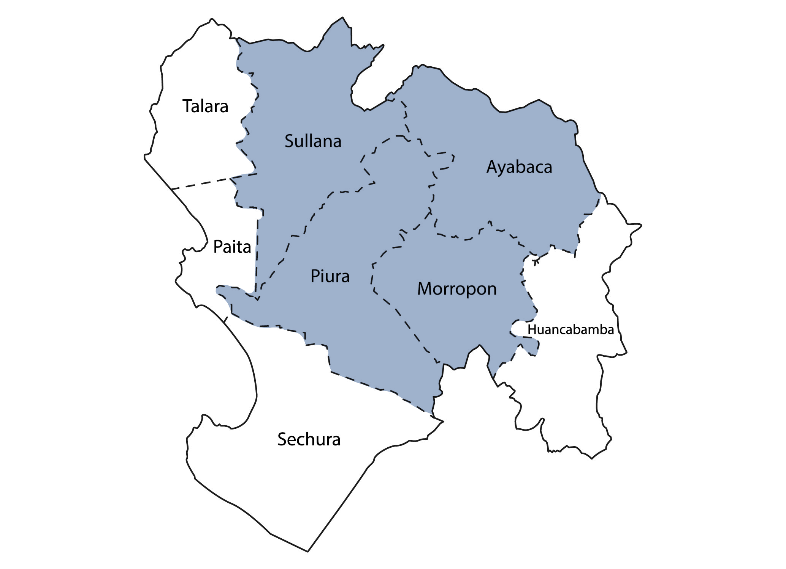
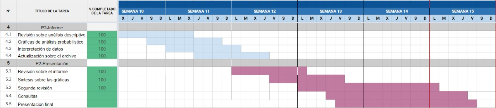

# Introducción   
Una cuenca hidrográfica es el territorio de donde provienen las aguas que fluyen hacia un mismo río o mar (Instituto Mexicano de Tecnología del Agua, 2019). Por lo que, el aumento de lluvias generará un aumento del caudal.     

En la región de Piura se tiene un total de 8 provincias, en la presente base se han recopilado los datos hidrometeorológicos de 4  de ellas, las cuales son Piura, Sullana, Ayabaca y Morropón   



## Relevancia 
Como grupo, deseamos informar sobre el impacto de las lluvias intensas en el departamento de Piura y cómo estas generan un aumento en los caudales, ya que sabemos que es uno de los departamentos más golpeados por las fuertes lluvias durante los primeros meses del año (Weather Spark, s.f.). Por ello, proporcionaremos la relación existente entre precipitaciones y caudales.   


## Planificación


# Datos

## Recolección de datos   
La recolección de datos consistió en consultar bases de datos en la [página web](https://www.datosabiertos.gob.pe/dataset/datos-hidrometereológicos-gobierno-regional-piura) oficial de datos abiertos del Perú. Con la finalidad de hallar información acerca de las precipitaciones a lo largo de los días en el departamento de Piura consultamos los datos hidrometeorológicos de dicha región. Al consultar a la plataforma nacional de datos abiertos del Perú, además de ser página gubernamental, brinda más fidelidad a los datos que brinda, extraídos directamente de las estaciones hidrográficas del departamento de Piura. Los datos son extraídos automáticamente, a la misma hora del día, mediante dispositivos tecnológicos. 


## Población, muestra y muestreo
La muestra es representativa debido a la automatización del proceso para la recolección de datos dentro de las estaciones hidrográficas de Piura. La representatividad de la muestra se mantiene al tener el mínimo contacto con el ser humano. Ellos no son los que realizan las medidas, ni las registran, estas son realizadas por dispositivos de medición como el caso del pluviómetro para medir la precipitación. Los dispositivos de medición están programados por igual alrededor de todas las estaciones, midiendo el caudal a la misma hora también. Con el fin de evitar sesgos en la muestra tomaremos el tamaño total de la población de 6723 y el total de la muestra 5478 observaciones. Incluimos todos los datos para mantener intacta la información sobre las estaciones hidrográficas a lo largo del cuartil 3 del año actual.

- Población: Nuestra población será el conjunto de datos de las Cuencas en el departamento de Piura.

- Muestra: Nuestra unidad muestral son las cuencas hidrográficas en el departamento de Piura, con un tamaño de  6723 datos, que serán nuestra muestra representativa. 

- Muestreo: Muestreo probabilistico, usando el método de muestreo estratificado. Se tomaron aleatoriamente los datos a usar en cada estrato.


## Variables

|      Variable | Descripción de la Variable                                                  | Tipo       |   Escala | Restricción                                                                                           |
|:--------------:|:--------------:|:--------------:|:--------------:|---------------|
|   Fecha_Corte | Último registro mes-día de alguna observación                               | Numérica   | Continua | Formato númerico para las fechas: año-mes-día                                                                                                      |
| Fecha_Muestra | Registro año-mes-día de alguna observación                                  | Numérica   | Continua | Formato númerico para las fechas: año-mes-día                                                                                                      |
|        Cuenca | Nombre de la Cuenca                                                         | Categórica |  Nominal | Hay 3 opciones: "río", "estructura natural" o "estructura artificial con caudal" |
|      Estación |                                                                             | Categórica |  Nominal | Hay 3 opciones: "hidrológica", "hidrométrica" o "presa"                                               |
| Unidad Medida | Unidades de medida usadas dentro de la estación                             | Categórica |  Nominal | Hay 3 opciones: "m3/s", "msnm" o "mmc"                                                                |
|  Departamento | Ubicación regional de la estación hidrometeorológica                        | Categórica |  Nominal | Única opción: "Piura"                                                                                                      |
|     Provincia | Ubicación provincial de la estación hidrometeorológica                      | Categórica |  Nominal | Hay 4 opciones: "Sullana", "Morropón","Ayabaca o "Piura"                                                                                                       |
|      Distrito | Ubicación distrital (dentro de Provincia) de la estación hidrometeorológica | Categórica |  Nominal | Hay 7 opciones: "Castilla", "Chulucanas", "Lancones", "Piura", "Sullana", "Suyo" o "Tambo Grande"                                                                                                      |
|     Caudal07H | Ubicación provincial de la estación hidrometeorológica                      | Categórica |  Nominal | Términos númericos decimales                                                                                                  |
|   Promedio24H | Cálculo del caudal y volumen de agua del día a las 24:00h                   | Categórica |  Nominal | Medido en m3/s                                                                                                     |
|     Maxima24H | Cálculo del caudal y volumen de agua máxima del día a las 24:00h            | Categórica |  Nominal | Medido en m3/s                                                                                                     |
|     Precip24H | Cantidad de agua liberada de las nubes en forma de lluvia                   | Numérica   | Continua | Tomadas en "mm"                                                                                       |
    

## Limpieza de base de datos
```{r message=FALSE, warning=FALSE, include=FALSE}
#Librerias
library(readr)
library(dplyr)
library(ggplot2)
library(readxl)
library(glue)
library(ggtext)
library(lubridate)
library(ggpubr)
library(ggsci)
library(forcats)
```


Se trabajará con la base de datos HM y se excluirán algunas variables que no fueron usadas en el análisis del proyecto   
```{r message=FALSE, warning=FALSE}
HM <- read_csv('HM.csv')

#Se excluirá la variable UBIGEO
HM %>% 
  select(1,2,3,4,5,6,8,9,11,12,13,14) -> HM
HMNuevo <- HM
```

Se cambiará el nombre a la variable **CUENTA** 
```{r}
HM  %>% 
  rename(CUENCA=CUENTA) -> HMNuevo
```

Se cambió el formato de la variable **FECHA_MUESTRA** a _date_ para facilitar su uso      
```{r}
HMNuevo$Fecha_Nueva <- as.Date(as.character(HMNuevo$FECHA_MUESTRA), format = "%Y%m%d", origin="20220101")
```

Crear nueva variable **MES**   
```{r}
HMNuevo$Mes <- format(HMNuevo$Fecha_Nueva, "%m")
```

# Análisis descriptivo
El análisis de las variables relevantes nos va a permitir un mayor conocimiento sobre el comportamiento de los caudales y las precipitaciones dentro de las diversas estaciones de Piura. Las variables numéricas nos muestran información sobre los distintos caudales y precipitaciones. En cambio, las categóricas nos permiten, además de dar claridad sobre la ubicación de los caudales medidos, categorizar las observaciones, por distrito, provincia, entre otros. Las variables relevantes para analizar son la precipitación, caudal a las 07:00, promedio del caudal, el caudal máximo, distrito y el tipo de estación.   

La variable **Caudal07H** nos permite observar el cálculo del caudal cada día a la misma hora. Por otro lado, está el promedio de los caudales en otra variable **Promedio24H**. Finalmente tenemos el valor máximo del caudal cada día registrado en otra variable **Maxima24H**. Dicho caudal puede variar por distintas razones, como el clima, la vegetación de la zona, la superficie por donde recorre, etc. La información que nos da el caudal puede ser útil tanto para la construcción en ríos, como para la conservación del ecosistema del mismo.   

Por otro lado, la precipitación medida dentro de la base de datos es la cantidad de agua que proviene de las nubes cada día en milímetros. Este valor también varía, generalmente, por factores naturales y del ecosistema de cada estación. Entre ellos están la latitud, distancia respecto al océano o estación de clima. Incluso el calentamiento global es un factor que afecta la precipitación. Una de las importancias del análisis de la precipitación es que se puede estimar cuándo empiezan y terminan las temporadas de lluvia. Es importante Tener en cuenta la precipitación de fechas pasadas ya que puede ser un indicador utilizado para prevenir desastres naturales. Por ejemplo, las precipitaciones extremas, y por largos periodos, son un indicador que alrededor de esa estación puede ocurrir un huayco o deslizamiento.   
 

## Desviación estándar de las variables   

Para saber cómo se dispersan los caudales y precipitaciones, y compararlos, tenemos que hacer uso de descriptores numéricos. El uso de la desviación estándar es muy conveniente a la hora de querer comparar los distintos caudales a lo largo del tiempo. Aun así, no se puede utilizar el mismo método para comparar las precipitaciones y los caudales, ya que tienen distinta unidad de medida, en milímetros y metros cúbicos respectivamente.    

### Precipitaciones:   
```{r}
sd(HMNuevo$PRECIP24H)
mean(HMNuevo$PRECIP24H)
```
Al analizar la precipitación con más detalle, la desviación respecto a la media aritmética es baja, con un valor de **CAMBIAAAAR ESTO 2.57 ml**. Sin embargo, este valor no es suficiente para concluir cuánto llueve en Piura, nos tenemos que apoyar de la misma media aritmética, la cual es *0.17 ml*. Gracias a la media y la desviación estándar, podemos observar que a lo largo del año, dentro de las estaciones del departamento de Piura, ha llovido una cantidad mínima de días, y con intensidad baja.    


### Promedio de los caudales al día:   
```{r}
sd(HMNuevo$PROMEDIO24H)
mean(HMNuevo$PROMEDIO24H)
```
   
Respecto a la desviación estándar del promedio de caudales diarios de cada estación, variable “Promedio24H”, esta nos indica que hubo una gran dispersión sobre las velocidades de los caudales a lo largo de los días. Este valor nos  indica cuánto varía el promedio del caudal diariamente. El valor de este descriptor es de **91.41 m3/s**. La variación de caudal dentro de los ríos se debe a factores naturales mencionados anteriormente. Sin embargo, según lo analizado sobre la precipitación, las lluvias no pueden ser un factor que afecte al caudal debido a que las precipitaciones han sido mínimas a lo largo del año. 


### Caudales
- Caudal:    
```{r}
sd(HMNuevo$CAUDAL07H)
mean(HMNuevo$CAUDAL07H)
```

- Caudal maximo:    
```{r}
sd(HMNuevo$MAXIMA24H)
mean(HMNuevo$MAXIMA24H)
```
     
El promedio nos da una vista general de los caudales de los ríos a lo largo del año. Pero, si se quiere analizar un posible riesgo, nos debemos centrar en el caudal máximo, que es una posible causa de deslizamientos o huaycos. El promedio de los caudales máximos es de 45.42 m3/s. En comparación, el promedio de los caudales a las 07:00 am es de 40.90 m3/s. Se toma este valor para comparar el caudal máximo con un valor exacto más que con un promedio de un rango de valores. Esta comparación nos permite observar que aunque haya un aumento de caudal, este no es muy elevado y por lo tanto es un indicador que el aumento de caudal posiblemente no ha causado mayores desastres este año.


## Precipitación de Piura
Para empezar a analizar los datos de la precipitación en los 4 distritos de la región de Piura, se graficará el
acumulado de este y así tener una vista general de la situación.      
```{r echo=FALSE, message=FALSE, warning=FALSE}
#Seleccionar data a usar
HMNuevo %>%
  select(Fecha_Nueva, PRECIP24H) %>%
  mutate(year = year(Fecha_Nueva),
         month = month(Fecha_Nueva),
         day = day(Fecha_Nueva)) %>%
  group_by(year) %>%
  arrange(Fecha_Nueva)%>%
  
  #Acumular 
  mutate(cum_pr=cumsum(PRECIP24H)) %>%
  ungroup() %>%
  
  #Graficar
ggplot(aes(x=Fecha_Nueva, y = cum_pr, group = year)) + 
  
  geom_line(size=1.4, color="#607EAA") + 
  geom_smooth(size=1, color="black") + 
  scale_x_date(date_labels = "%B", date_breaks = "1 months" ) + 
  labs(title = "Precipitación acumulada en la región de Piura* de enero a setiembre del 2022", x = "Meses", y ="Precipitación acumulada (ml)", caption ="*Provincias de Piura, Sullana, Ayabaca, Morropón") +
  theme_classic()

```
   
Se tiene una pendiente pronunciada en marzo, lo que indica que hubo una gran cantidad de precipitación durante esas fechas. Por otro lado, la gráfica tomó una forma lineal de enero a febrero y convergió a partir de agosto, así, entendemos que durante esos meses la lluvia es mínima.        
   
      
### Precipitación mensual en Piura  
Para averiguar cuál es la precipitación exacta que ha caído en cada mes, se realizará un gráfico de barras.   
```{r echo=FALSE, message=FALSE, warning=FALSE}
#Separar por mes
prEnero <- HMNuevo %>% filter(Mes=="01")
prFebrero <- HMNuevo %>% filter(Mes=="02")
prMarzo <- HMNuevo %>% filter(Mes=="03")
prAbril <- HMNuevo %>% filter(Mes=="04")
prMayo <- HMNuevo %>% filter(Mes=="05")
prJunio <- HMNuevo %>% filter(Mes=="06")
prJulio <- HMNuevo %>% filter(Mes=="07")
prAgosto <- HMNuevo %>% filter(Mes=="08")
prSetiembre <- HMNuevo %>% filter(Mes=="09")

#Sumar total por mes 
suma_meses <- c(
  colSums(prEnero[,12], na.rm = TRUE),
  colSums(prFebrero[,12], na.rm = TRUE),
  colSums(prMarzo[,12], na.rm = TRUE),
  colSums(prAbril[,12], na.rm = TRUE),
  colSums(prMayo[,12], na.rm = TRUE),
  colSums(prJunio[,12], na.rm = TRUE),
  colSums(prJulio[,12], na.rm = TRUE),
  colSums(prAgosto[,12], na.rm = TRUE),
  colSums(prSetiembre[,12], na.rm = TRUE)
)

#Vector meses del 1 al 9
meses<-seq(as.Date("2000-1-1"), by = "month", length.out = 9)

#Gráfica
dataGraf1<-aggregate(suma_meses, by=list(meses), FUN=sum)
dataGraf1<-data.frame(suma_meses, meses)

ggplot(dataGraf1,aes(x =meses, y = suma_meses, fill=meses)) +
geom_col(fill="#607EAA") +
theme_classic() +
  
#Agregar el valor a cada barra
geom_text(aes(label = suma_meses), vjust = -0.5, size = 3) +
  
#Ejes X y Y
scale_x_date(date_labels = "%B", date_breaks = "1 months") +
labs(title = "Precipitación por mes en la región de Piura* de enero a setiembre del 2022", x = "Meses", y = "Precipitación (ml)", caption = "*Provincias de Piura, Sullana, Ayabaca y Morropón") +
  
#Ajustar tamaño y posición del título
theme(plot.title = element_text(hjust = 0.5, vjust = 2, size=13)) +

#Ajustar margen para una mejor visualización
theme(plot.margin = unit(c(0.4,0.6,0.4,0.3), "cm"))
```
   
Con esta gráfica, confirmamos que es en marzo cuando cae abundante precipitación, exactamente, 817.11 ml. En cambio, a partir de agosto la precipitación baja a los 0 ml.   
   
   
         
### Precipitación en los distritos de Piura   
Ahora, se analizará la precipitación de los 4 distritos de Piura usando un gráfico de barras.       
```{r echo=FALSE, message=FALSE, warning=FALSE}
HMNuevo %>%
  
  #Seleccionar data a usar
  select(DISTRITO, PRECIP24H) %>%
  group_by(DISTRITO) %>%
  summarise(value=sum(PRECIP24H,na.rm=TRUE)) %>%
  ggplot(aes(x = fct_reorder(DISTRITO, value), y = value)) +
  
  #Graficar
  geom_col(fill="#607EAA") + 
  
  #Tema minimalista
  theme_classic() +

  labs(title="Precipitación por distrito en Piura*",y="Precipitación (ml)", x="Distritos", caption = "*Provincias de Piura, Sullana, Ayabaca y Morropón")+
  
  #Ajustar tamaño y posición del título
  theme(plot.title = element_text(hjust = 0.5, vjust = 2, size=13)) +
  
  #Agregar el valor a cada barra
  geom_text(aes(label = value), vjust = -0.5, size = 3) +
  
  #Tamaño y posicion del titulo
  theme(plot.title = element_text(hjust = 0.5, vjust = 1.5, size=13)) +
 
   #Ajustar margen para una mejor visualización
  theme(plot.margin = unit(c(0.4,0.8,0.4,0.3), "cm"))
```
   
Se ordenaron los distritos de menor a mayor precipitación. Obsevamos que el distrito donde hay más es Suyo, con 960 ml. Al contrario, en el distrito de Piura hubieron 0 ml.   
  


# Análisis probabilístico
### Aplicación 1   
Si se escoge un día de marzo al azar usando los datos tomados por la estación El Ciruelo, ¿cuál será la probabilidad de que haya llovido en dicho día?   

Para conseguir la probabilidad de lluvia en dicho mes, se usará el modelo de Bernoulli. Se verificará la precipitación cada día del mes, y así, se asignará como *éxito* los días donde sí ha llovido y como *fracaso* los días que no.  

Primero, se encontrará la probabilidad *p* con el siguiente código   
```{r message=FALSE, warning=FALSE}
#Dias totales en el mes de marzo
dMarzo <- days_in_month(as.Date("2022-03-01", "%Y-%m-%d"))

#Delimitar al distrito de Suyo, en la estacion El Cerezo y el mes de marzo
lluviaSuyo <- HMNuevo %>% filter(DISTRITO=="Suyo" & ESTACION=="EL CIRUELO" & Mes=="03")

#Contar los días de lluvia
diasDeLluvSuyo <- length(lluviaSuyo$PRECIP24H[lluviaSuyo$PRECIP24H > 0])

#Hallar la probabilidad 
p <- diasDeLluvSuyo/dMarzo
p
```
   
**Precipitación diaria de El Ciruelo - Suyo en marzo**      
Para verificar que el código anterior haya dado el resultado correcto, se va a comparar la respuesta con una gráfica de barras.   

Tenemos una probabilidad de 0.548 para el mes de marzo. Esta probabilidad representa 17 días aproximadamente que han llovido durante el mes. Para verificar que el código anterior haya dado el resultado correcto, se va a comparar la respuesta con una gráfica de barras.   

```{r, echo=FALSE}
#Crear vector de 31 días
treintaUnDias<-seq(as.Date("2022-3-1"), by = "day", length.out = 31)

#Graficar
dataGraf2<-data.frame(lluviaSuyo, treintaUnDias)
ggplot(dataGraf2,aes(x = treintaUnDias, lluviaSuyo$PRECIP24H)) +
geom_col(fill="#607EAA") +
labs(title = "Precipitación de El Ciruelo - Suyo en marzo", x = "Días", y = "Precipitación (ml)") +
theme_classic() +

#Eje x
scale_x_date(date_labels = "%e", date_breaks = "2 days") +
  
#Tamaño y posicion del titulo
theme(plot.title = element_text(hjust = 0.5, vjust = -3, size=13)) 
```
      
Podemos contar que hay 17 barras, lo que indica que, efectivamente, ha llovido 17 días.    

Además, el día 28 fue aquel en el que hubo una mayor precipitación respecto al resto de días de marzo. Tuvo un total de **139.7 mm** de lluvia durante el día. Este valor tomaría un total de **54.57 mm** de lluvia por hora.   

Según el Observatorio Hidrológico de la UNAM, se considera una lluvia muy fuerte aquellas que se encuentran dentro del intervalo de 30 a 60 mm/h . La observación principal que se obtiene es que durante el mes más lluvioso en Piura, se tuvo un día donde la precipitación se encuentra en la categoría de lluvia fuerte. Las condiciones hidrológicas en el departamento permiten que no ocurra un deslizamiento o huayco a causa de un aumento de caudal, ya que la precipitación se encuentra mayormente en rangos moderados (15 a 30 mm/h).
    
  

**Aplicando el modelo de Bernoulli**     

Se tiene la siguiente fórmula $$\mathbb{P}(X=x)=p^x(1-p)^{n-x}$$

En donde $\mathbb(X=1)$ significa que sí llovió y $\mathbb(X=0)$ que no llovió

Entonces $\mathbb{P}(X=1)=0.548^1(1-0.548)^{1-1}=0.548$, lo que significa que la probabilidad de que se haya detectado precipitación en la estación El Cerezo (Suyo) en marzo es de **54.8%**   

   

### Aplicación 2
Usando **p** de la *aplicación 1* ¿Cual es la probabilidad de que lluevan 15 días en todo el mes de marzo?   
Para resolver esto, se usará el siguiente modelo **binomial**:   $$\mathbb{P}(X=x)=\binom{n}{x}p^x(1-p)^{n-x}$$   

Se utilizará esta distribución para hallar el número de aciertos, en este caso días que llueven, dentro del total de días de marzo.
Entonces, $\mathbb{P}(X=15)=\binom{31}{15}0.548^{15}(1-0.548)^{31-15}$
```{r}
dbinom(15, 31, 0.548)
```
   
**Graficando el modelo binomial**   

```{r}
plot(0:31, dbinom(0:31, 31, 0.548), type = "h", col="#607EAA", lwd=2, main = "Modelo binomial",xlab = "Número de éxitos", ylab = "Probabilidad")
```
    
Del anterior gráfico se obtienen el número de días que llueven, con la probabilidad de que ocurra cada uno. Las probabilidades de lluvia dado el caso planteado son bajas, llegando a un máximo de 14% la probabilidad de que lluevan 17 días de marzo. Para el caso de que llueva aproximadamente la mitad del mes, se tiene una probabilidad de 11%. Estos dos valores son muy similares entre sí considerando la distribución. Entonces es muy probable que lluevan 15 días a lo largo de marzo. Sin embargo, analizando también la intensidad de las lluvias, definido por la precipitación, podemos ver que estos largos días de lluvia que se viven en Piura tienen una precipitación no muy elevada, haciendo que las lluvias sean consideradas no riesgosas.


### Aplicación 3   
Usando **p** de la *aplicación 1* ¿Cuál es la probabilidad de que haya llovido por primera vez en el 4to dia?    
Para resolver este ejercicio, se utilizará una **distribución geométrica**.
Se usarála siguiente fórmula:   
$$\mathbb{P}(X=x)=(1-p)^{x-1}p$$
   
Entonces, $\mathbb{P}(X=4)=(1-0.548)^{4-1}0.548$   
Para resolver esto con *dgeom* es importante recordar que R cuenta el número de fracasos, por lo que se le restara 1 a X   

```{r}
dgeom(3,0.548)
```
     
                     
            
**Graficando el modelo geométrico**   

```{r echo=FALSE, message=FALSE, warning=FALSE}
plot(0:31, dgeom(0:31,0.548), type = "h", col="#607EAA", lwd=2, main = "Distribución geométrica",xlab = "Número de intentos", ylab = "Probabilidad")
```
      
       
La gráfica muestra la repeticiión de un experimento Bernoulli con probabilidad de éxito fija (p = 0.548) y cuenta el número de intentos -precisamente, de fracasos- hasta lograr el primer éxito deseado. El número de intentos es infinito pero, en este caso, se colocó hasta 31 ya que ese es el total de días en marzo.   


# Bibliografía   
Observatorio Hidrológico del Instituto de Ingeniería de la UNAM. (2020, September 17). UNAM. Retrieved from Observatorio Hidrológico en timepo real: https://unamglobal.unam.mx/que-significa-que-se-registre-cantidades-de-lluvia-acumulada-de-hasta-100-mm/   

Datos Abiertos. (06 de Setiembre de 2022). Datos Hidrometereológicos Gobierno Regional Piura. Obtenido de Plataforma Nacional de Datos Abiertos: https://www.datosabiertos.gob.pe/dataset/datos-hidrometereol%C3%B3gicos-gobierno-regional-piura   
