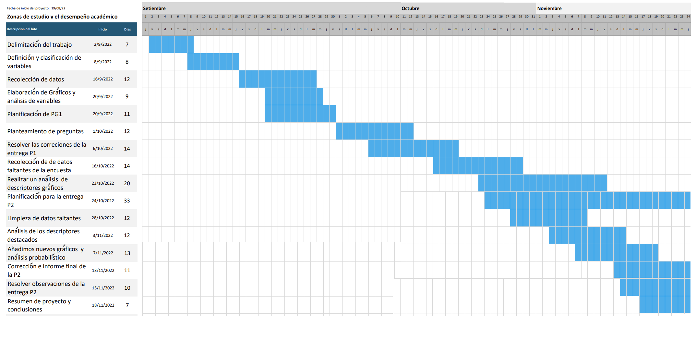

# Introducción {.tabset .tabset-fade .tabset-pills}

El tiempo que pasan los estudiantes en las zonas de estudio de la universidad(piso 1, piso 6, biblioteca y salones vacíos)

## Relevancia

Dado el caso de la semipresencialidad y la presencialidad del ciclo pasado y el actual, nos hemos visto en la necesidad de realizar la ruta normal de nuestros hogares, hasta la universidad. Entonces muchos estudiantes deciden realizar sus actividades de estudio, avance de proyectos, tareas y productividad en general en las zonas o espacios de estudio que brinda la universidad. Nuestro objetivo es poder demostrar, comprobar o averiguar si hay una influencia directa positiva o negativa en el uso de los espacios de estudio de la universidad, para con los estudiantes y su desempeño académico.

## Planificación

En el siguiente diagrama se mostrará el orden de las actividades que se realizaron durante estas primeras semanas del semestre, en el cual se señalará cada actividad con su respectivo tiempo de avance.



# Datos {.tabset .tabset-fade .tabset-pills}
## Recolección de datos

El objetivo de nuestro estudio es observar si los espacios de estudio de la universidad afecta de alguna manera al desempeño académico de los estudiantes. En base a nuestro objetivo se optó por la realización de una encuesta en Google Forms, en la cual se podría obtener información valiosa de cada estudiante respecto a su desempeño y a las variables relacionadas con los espacios de estudio de la universidad.

En principio se ejecutó una reunión y se establecieron las variables necesarias para el estudio, posteriormente se crearon las limitaciones de las variables en donde fuera necesario; luego, se colocaron ejemplos de la respuesta esperada en algunos ítems para un mejor entendimiento y facilitar la respuesta del encuestado. Finalmente, el equipo realizó una última revisión y se pasó a compartir la encuesta por redes sociales y también se aplicó de manera presencial. Cabe especificar que en ambos casos se llenó el mismo formulario. Además, se trató de recolectar las respuestas de universitarios de segundo ciclo en adelante (dado que ellos ya cuenta con una variable que describe su desempeño académico) y que asistieron de manera híbrida y presencial en la situación actual.

## Población, muestra y muestreo

La población de este estudio son los estudiantes de la Universidad de Ingeniería y Tecnología (UTEC). Se usará un total de 250 alumnos de UTEC, entre ellos incluimos a los estudiantes de la Universidad de Ingeniería y Tecnología (UTEC) que están cursando desde el segundo ciclo hasta los alumnos de décimo ciclo o superior. No incluimos a los de primer ciclo porque aún no tienen un promedio. El muestreo es aleatorio simple.

## Variables

Nuestra base de datos contiene 19 variables de interés para el estudio, de las cuales 6 son Cualitativas nominales, 2 Cualitativas ordinales, 7 Numéricas discretas y 1 Numérica continua.

|Variables|Descripción de la variable |Tipo de variable|Restricción|
|:------------------|:-------|:---------------:|:---------------|
|Sexo|Sexo del estudiante|Categórica nominal|No hubo restricción|
|Edad|Edad del estudiante|Numérica discreta|No hubo restricción|
|Carrera|Carrera de los estudiantes|Categórica nominal|No hubo restricción|
|Distrito|Zona de donde procede el estudiante|Categórica nominal |Sólo para estudiantes con residencia en Lima Metropolitana|
|Ciclo|Ciclo del estudiante|Categórica ordinal|Se tomó en cuenta a los de primer ciclo, pero se eliminó su variable promedio|
|Hora_prom_Uni|Tiempo que promedio que están en la universidad por semana|Numérica discreta |Ingresar la cantidad en horas(valor entero más cercano)|
|Hora_prom_ZonaEst|Tiempo promedio que se la pasa en las zonas de estudio de la universidad|Numérica discreta |Ingresar la cantidad en horas(valor entero más cercano)|
|Hora_prom_Est|Horas de estudio semanales, sin contar las horas de clase| Numérica discreta|Ingresar la cantidad en horas(valor entero más cercano)|
|Promedio_Ponderado|Promedio de que obtuvo durante el ciclo anterior|Numérica continua|Ingresar valores entre 0 y 20|
|EspacioEst_habitual|Espacio de estudio en el que normalmente pasa más tiempo| Categórica nominal|Decide entre los espacios de estudio, piso 6, piso 1, etc|
|Afecta_Posi_Nega|Cómo percibe que afecta estas zonas de estudio en su ámbito académico|Categorica nominal|Binario (Positivamente o Negativamente)|
|Uso_Lugar_Estudio|Para qué usa el estudiante los espacios de estudio|Categórica nominal|Decide si usa los espacios de estudio para avanzar tareas, proyectos, estudiar, etc|
|Hora_prom_Biblioteca|Horas promedio a la semana que está en la biblioteca |Numérica discreta|Ingresar en horas|
|Hora_prom_Piso1|Horas promedio a la semana que está en el piso 1 |Numérica discreta|Ingresar en horas|
|Hora_prom_piso6|Horas promedio a la semana que está en la piso 6 |Numérica discreta|Ingresar en horas|
|Preferencia|Qué zona de estudio es preferida por los estudiantes, seguido de las demás en orden|Categórica ordinal|En orden de preferencia entre las zonas de estudio|


## Limpieza de base de datos

Lo primero que haremos es cargar las librerías que se emplearán para este proyecto, luego la encuesta que previamente descargamos en nuestro directorio de trabajo. Lo siguiente será renombrar las variables para tener un mejor manejo de ellas,  eliminamos las variables que no utilizaremos para esta investigación, como por ejemplo "Marca temporal" y "En base a la pregunta anterior, ¿Por qué?". Limpiamos cada variable de los errores ortográficos que hay a la hora de pedir que ingresen una respuesta en la encuesta, también borramos lo datos atípicos de alguna variable, como puede ser en la variable promedio ponderado con el valor de 0 , ya que significaría que el alumno estaba ausente durante todo el ciclo o es de primer ciclo. Finalmente, le cambiamos de nombre a nuestra base de datos limpia obteniendo lo siguiente: 

```{r CargadeLibrerias,include=FALSE,warning=FALSE}
# Aplicamos una lógica para instalar paquetes en caso de no estar instalado
lista.paquetes <- c("readr","dplyr","knitr","ggplot2","MASS","survival","fitdistrplus") # En este vector se escriben los paquetes que deseamos cargar
nuevos.paquetes <- lista.paquetes[!(lista.paquetes %in% installed.packages()[,"Package"])] # almacena paquetes no instalados
if(length(nuevos.paquetes)) install.packages(nuevos.paquetes) # instala si no está instalado
```


```{r Lectura de Datos y carga de librerias, include=FALSE,warning=FALSE}
library(readr)
library(dplyr)
library(ggplot2)

df <-read_csv('Encuesta.csv')
```

```{r Renombrar variables, include=FALSE}
colnames(df)[1:21] <- c("Tiempo", "Sexo","Edad","Carrera","Distrito","Ciclo","Hora_prom_Uni","Hora_prom_ZonaEst","Hora_prom_Est","Promedio_Ponderado","EspacioEst_habitual","Afecta_Posi_Nega","Porque_anterior","Uso_Lugar_Estudio","Hora_prom_Biblioteca","Hora_prom_piso6","Hora_prom_Piso1","Orden_Preferencia_Biblioteca","Orden_Preferencia_Piso6","Orden_Preferencia_Piso1","Orden_Preferencia_Otro" ) 
```

```{r Datos No Usados, include=FALSE}
df$Tiempo <- NULL # no se usará la variable marca temporal
df$Porque_anterior <- NULL # no se usará la variable En base a la pregunta anterior, ¿Por qué?
df$Sexo[df$Sexo=="Prefiero no decirlo"]<- NA
```

```{r Limpieza variable Distrito, include=FALSE}
df$Distrito[df$Distrito=='San Juan de MIraflores']<-'San Juan de Miraflores'
#table(df$Distrito)
```

```{r Limpieza variable Ciclo, include=FALSE}
df$Ciclo[df$Ciclo=="1º Ciclo"]<-"1º"
df$Ciclo[df$Ciclo=="2º Ciclo"]<-"2º"
df$Ciclo[df$Ciclo=="3º Ciclo"]<-"3º"
df$Ciclo[df$Ciclo=="4º Ciclo"]<-"4º"
df$Ciclo[df$Ciclo=="5º Ciclo"]<-"5º"
df$Ciclo[df$Ciclo=="6º Ciclo"]<-"6º"
df$Ciclo[df$Ciclo=="7º Ciclo"]<-"7º"
df$Ciclo[df$Ciclo=="8º Ciclo"]<-"8º"
df$Ciclo[df$Ciclo=="9º Ciclo"]<-"9º"
df$Ciclo[df$Ciclo=="10º Ciclo"]<-"10º"
df$Ciclo<-factor(df$Ciclo,levels =c("1º","2º","3º","4º","5º","6º","7º","8º","9º","10º"))
#table(df$Ciclo)
```

```{r Limpieza variable Hora prom Uni, include=FALSE}
df$Hora_prom_Uni[df$Hora_prom_Uni == 15.1]<-round(15.1,0)
df$Hora_prom_Uni[df$Hora_prom_Uni == 4.5]<-round(4.5,0)
#unique(df$Hora_prom_Uni)
```

```{r Limpieza variable Promedio Ponderado, include=FALSE}
# Borramos lo datos atípicos de la variable, como puede ser el valor de 0 , ya que significaría que el alumno estaba ausente durante todo el ciclo o es de primer ciclo
df$Promedio_Ponderado[df$Promedio_Ponderado==0]<- NA

#table(df$Promedio_Ponderado)
```

```{r Limpieza variable EspacioEst_habitual, include=FALSE}
df$EspacioEst_habitual[df$EspacioEst_habitual %in% c("casa","Habitación","mi casa","Mi casa","Mi cuarto","Casa")] <- NA 
df$EspacioEst_habitual[df$EspacioEst_habitual %in% c("cubíclos","Cubiculo","cubículo","Cubículo","cubículos",  "Cubículos Piso 8", "Piso 8")]<-"Cubículos"

df$EspacioEst_habitual[df$EspacioEst_habitual=="No lo uso, porque no encuentro una buena área de estudio"]<-NA
df$EspacioEst_habitual[df$EspacioEst_habitual=="Auditorio"]<-"Piso 1"
df$EspacioEst_habitual[df$EspacioEst_habitual %in% c("Piso 5","Aulas vacías","Comedor")]<-"Otros"

#table(df$EspacioEst_habitual,useNA = "always")
```


```{r Limpieza variable Uso_Lugar_Estudio, include=FALSE}
df$Uso_Lugar_Estudio[df$Uso_Lugar_Estudio %in% c("Todas las anteriores","Todos","hacer tareas , estudiar y leer")]<-"Todos"
df$Uso_Lugar_Estudio[df$Uso_Lugar_Estudio == "Leer"]<-"Estudiar"
df$Uso_Lugar_Estudio[df$Uso_Lugar_Estudio %in% c("Estudiar y jugar videojuegos","No los uso","Jugar ","Conversar","Jugar")]<- NA
df$Uso_Lugar_Estudio[df$Uso_Lugar_Estudio == "Avanzar proyectos"]<- "Proyectos"
df$Uso_Lugar_Estudio[df$Uso_Lugar_Estudio == "Hacer tareas"]<- "Tareas"

#table(df$Uso_Lugar_Estudio)
```

```{r Limpieza variable Hora_prom_Biblioteca, include=FALSE}
df$Hora_prom_Biblioteca[df$Hora_prom_Biblioteca == 0.5]<- round(0.5,0) 
df$Hora_prom_Biblioteca[df$Hora_prom_Biblioteca == "4-6"]<- NA
df$Hora_prom_Biblioteca[df$Hora_prom_Biblioteca == "Ninguna"]<- 0

df$Hora_prom_Biblioteca<-as.numeric(df$Hora_prom_Biblioteca) #convertir a numero la variable de horas

#table(df$Hora_prom_Biblioteca)
```

```{r Limpieza variable Hora_prom_Piso1, include=FALSE}
#table(df$Hora_prom_Piso1)
df$Hora_prom_Piso1[df$Hora_prom_Piso1 %in% c("0 mucha bulla","Ninguna")]<- 0
df$Hora_prom_Piso1[df$Hora_prom_Piso1 == "1/2"] <- 1
df$Hora_prom_Piso1[df$Hora_prom_Piso1 == "1-2"] <- NA

#convertir a numero la variable de horas
df$Hora_prom_Piso1<-as.numeric(df$Hora_prom_Piso1) 
```

```{r Limpieza variable Hora_prom_piso6, include=FALSE}

df$Hora_prom_piso6[df$Hora_prom_piso6 %in% c("Casi nunca estoy por el piso 6","-1")]<- "0"
df$Hora_prom_piso6[df$Hora_prom_piso6 %in% c("1, mucho frio","1/2")]<- "1"
df$Hora_prom_piso6[df$Hora_prom_piso6 == "112"] <- NA
df$Hora_prom_piso6<-as.numeric(df$Hora_prom_piso6) #convertir a numero la variable de horas

#table(df$Hora_prom_piso6)
```

```{r}
dfn <- df # base de datos limpia

summary(dfn) 
```

### Inconvenientes encontrados:

- No vamos a tomar en cuenta la variable Tiempo y Porque_anterior, debido a que tiempo es el momento en que realizaron la encuesta y el segundo es una pregunta abierta o subjetiva.
- Se encontró información con NA’s, alumnos de primer ciclo omitieron la pregunta de promedio obtenido el ciclo anterior.
- En horas promedio de estudio, algunos pusieron intervalos de tiempo y un alumno puso -1.
- Lugares de estudio algunos ponían su habitación, su casa, etc. De diversas maneras con errores ortográficos.
- Las variables Hora promedio Biblioteca, piso 1, piso 6 estaban como variable categórica ya que respondieron con palabras envés de un números.

### Se resolvió de la siguiente forma:

- Se dejaron los NA's y los alumnos de primer ciclo le pusimos NA's para su variable promedio.
- En horas promedio de estudio, quitamos esos datos de tiempo o sustituimos por NA.
- Las variables Hora promedio Biblioteca, piso 1, piso 6 las convertimos en variables numéricas.
- Se corrigieron los errores ortográficos 

# Análisis Descriptivo {.tabset .tabset-fade .tabset-pills}

## Descriptores Numéricos y gráficos - Promedio Ponderado

Con la función summary podemos obtener la mediana y media con los rangos intercuartiles de la variable
```{r ,echo=FALSE}
summary(dfn$Promedio_Ponderado)
```

Desviación estándar
```{r ,echo=FALSE}
sd(dfn$Promedio_Ponderado,na.rm = TRUE)
```

Coeficiente de variación
```{r ,echo=FALSE}
(sd(dfn$Promedio_Ponderado,na.rm = TRUE)/mean(dfn$Promedio_Ponderado,na.rm = TRUE))*100
```

```{r Grafico_Promedio_Ponderado}
hist(dfn$Promedio_Ponderado, freq=FALSE,main = "Histograma de la variable Promedio Ponderado", xlab="Notas",col = "#F6E3CE")
lines(density(dfn$Promedio_Ponderado,na.rm = TRUE),col="red",lwd=3)
curve(dnorm(x,mean = mean(dfn$Promedio_Ponderado,na.rm = TRUE),
            sd= sd(dfn$Promedio_Ponderado,na.rm = TRUE)),col="blue",lwd=3,add=T)

legend("topleft",c("Curva observada","Curva Teórica"),col=c("red","blue"),lty=1,lwd=2,bty="n",cex=0.8)
```

La curva observada indica la  función de densidad del Promedio Ponderado, para ver si sigue un comportamiento normal, primero comprobamos y hallamos la verdadera normal con $\mu$ y $\sigma$ ya que con lo que tenemos son solo aproximaciones. Para hallar $\mu$ usamos la media que en este caso es 14.75 y para hallar $\sigma$ usamos la desviación estándar  que en este caso sería 1.78 , creando así una nueva función llamada curva  teórica, que viene a ser la función de la verdadera normal.

## Descriptores Numéricos y gráficos - Horas en Promedio en las areas de estudio de la Universidad

Mediana y media con los rangos intercuartiles de la variable __horas promedio en la biblioteca__:
```{r ,echo=FALSE}
summary(dfn$Hora_prom_Biblioteca)
```

Mediana y media con los rangos intercuartiles de la variable __horas promedio en el piso 6__:
```{r ,echo=FALSE}
summary(dfn$Hora_prom_piso6)
```

Mediana y media con los rangos intercuartiles de la variable __horas promedio en el piso 1__:
```{r ,echo=FALSE}
summary(dfn$Hora_prom_Piso1)
```

<span style="color:blue">**Gráfico de caja de las horas en las áreas de estudio en la Universidad**</span>

+ En las tres tablas se muestra que la media o promedio tiene una diferencia considerable con respecto a la mediana, esto puede ser producto de datos atípicos, ya que la mediana es mas robusta que la media. Esta hipótesis se podrá apreciar en el gráfico a continuación.

```{r Grafico_Horas_BP6P1}
op=par(mfrow=c(1,3))
boxplot(dfn$Hora_prom_Biblioteca,ylab="Horas",main="Horas promedio en la Biblioteca",sub="Personas",pch=20,border=rgb(0,0,0,0.2))
boxplot(dfn$Hora_prom_Biblioteca,outline=FALSE,add=TRUE,ylim=c(0,max(dfn$Hora_prom_Biblioteca)))
abline(h=mean(dfn$Hora_prom_Biblioteca, na.rm=TRUE),col="red",lwd=2)

boxplot(dfn$Hora_prom_piso6,ylab="Horas",main="Horas promedio en el Piso 6",sub="Personas",pch="*", col="#CEF6CE")
abline(h=mean(dfn$Hora_prom_piso6, na.rm=TRUE),col="red",lwd=2)

boxplot(dfn$Hora_prom_Piso1,ylab="Horas",main="Horas promedio en el Piso 1",sub="Personas",pch="*", col="#F3F781")
abline(h=mean(dfn$Hora_prom_Piso1, na.rm=TRUE),col="red",lwd=2)
par(op)
```
+ De acuerdo al diagrama de cajas podemos observar que el promedio de horas de las personas encuestadas para las diferentes zonas de estudio son muy cercanas a 5 horas.

## Relación entre Espacio de estudio habitual vs Sexo

```{r}
mosaicplot(table(dfn$EspacioEst_habitual,dfn$Sexo),main="Lugar de estudio vs Sexo",col=c("#CEE3F6", "#F8E0F7"))
```

Se pueden observar dos tendencias:

1. La gran mayoría de encuestados corresponden a un sexo masculino.
2. La gran mayoría de personas suelen usar otros sitios dentro de la universidad para sus actividades. Además, los cubículos son los menos usados por las personas encuestadas.

Estas conclusiones nos servirá para un posterior análisis acerca de las razones por las que los estudiantes prefieren otros sitios dentro de la institución a los sitios de estudios que brinda la universidad.


## Relación entre Hora promedio en Zonas de estudio vs Distrito

```{r}
ggplot(data=dfn,aes(factor(Distrito),fill=factor(Hora_prom_ZonaEst)))+ geom_bar(position = 'stack',stat='count') + coord_flip() +ylab("Numero de personas")+xlab("Distritos") +labs(title = "Hora promedio en Zonas de estudio vs Distrito")

```

Se puede apreciar en el siguiente gráfico que tanto las personas que viven muy lejos de Barranco como los que viven muy cerca de este, son en la mayoría las no paran un tiempo relativamente alto en la universidad. Por otra parte, se puede apreciar que hay una minoría de personas que utilizan las zonas de estudio por una minoría de tiempo durante la semana.

## Relación entre Carreras vs Horas promedio en la Biblioteca

```{r}
ggplot(data=dfn,aes(factor(Carrera),fill=factor(Hora_prom_Biblioteca)))+ geom_bar(position = 'stack',stat='count') + coord_flip() +ylab("Numero de personas")+xlab("CARRERAS") +labs(title = "Carreras vs Horas promedio en la Biblioteca")
```

Según el gráfico de barras apiladas se puede observar que la gran mayoría de personas encuestadas son de la carrera de Ingeniería Civil. La gran mayoría de estos, pasan más tiempo en la biblioteca. Sin embargo, dentro de la gráfica se también se pudo identificar que de las personas encuestadas, la minoría son de las carreras de ingeniería mecánica, ciencia de lo datos; y administración y negocios digitales, de los cuales la mayoría si pasan tiempo en la biblioteca.

## Relación entre Ciclo vs Horas promedio en la Biblioteca

Se vera si hay una relación entre estas dos variables, una categórica y numérica.

Utilizaremos el boxplot con ancho variable para detectar aquellas técnicas de estudio con pocas observaciones y analizarlas con mayor cuidado.

```{r}
plot(dfn$Hora_prom_ZonaEst~dfn$Ciclo,col=c("#F7BE81","#F2F5A9","#D0F5A9","#A9F5A9","#A9F5D0","#A9F5F2","#A9D0F5","#D0A9F5","#F5A9F2","#F78181"),xlab="Ciclo",ylab="Hora promedio en zonas de estudio", varwidth=TRUE,main="Ciclo vs Horas promedio en la Biblioteca")

```

Se puede apreciar que hay una variabilidad en algunos ciclos, en el caso de la anchura, esto puede ser por la cantidad de observaciones que obtuvimos. Veamos si esto es cierto.

```{r}
table(dfn$Ciclo)
```
Se puede apreciar que de los encuestados, sólo hay 5 y 6 personas en los ciclos 9 y 10 respectivamente, por lo tanto, el rango intercuartil se puede mover fácilmente cambiando cualquiera de los 2 valores.

Por otro lado, se encontraron más datos atípicos o personas que sobrepasan el  tiempo promedio en las zonas de estudio en los  primeros 4 ciclos de la universidad.


## Relación entre Hora promedio en la universidad vs Hora promedio en zonas de estudio

Covarianza:
```{r , echo=FALSE}
cov(dfn$Hora_prom_Uni,dfn$Hora_prom_ZonaEst)
```
La covarianza nos indica si es directa o inversamente proporcional, y al ver que es positivo se sabe que al aumentar horas promedio en la Universidad, el número de horas promedio en la zona de estudio aumentará, tienen relación directa positiva.

Correlación:
```{r , echo=FALSE}
cor(dfn$Hora_prom_Uni,dfn$Hora_prom_ZonaEst)*100
```
La correlación entre entre Horas promedio en la Universidad y Horas promedio en Zonas de estudio es de 60%, el grado de asociación es moderada.

Se añadió color sobre la opinión que tienen sobre si el estudio afecta positiva o negativamente en sus notas. Obteniendo el siguiente gráfico:
```{r}
plot(dfn$Hora_prom_Uni,dfn$Hora_prom_ZonaEst,xlab="Hora promedio en la universidad",ylab = "Hora promedio en zonas de estudio",col=ifelse(dfn$Afecta_Posi_Nega=="Positivamente","#298A08","red"),title("Hora promedio en la universidad vs Hora promedio en zonas de estudio"))
abline(lm(dfn$Hora_prom_ZonaEst ~ dfn$Hora_prom_Uni), col="black")#Gráfica la linea de la función
legend(x = "topleft", legend = c("Positvo","Negativo"), fill = c("#298A08", "Red"), title = "Afecta")
```

+ Observamos en la gráfica que son muy pocos alumnos los que opinan que afecta negativamente las horas que pasan en la universidad en zonas de estudio.

## Relación entre Lugar de estudio vs Uso del lugar de estudio

Para nuestro gráfico, como se quiere saber el uso académico especifico de las zonas de estudio dentro de la universidad, no tomaremos en cuenta la opción de todos en la variable Uso de lugar de estudio, por ser muy general. Obteniendo la siguiente gráfica:

```{r}
dfn_1<-dfn
dfn_1$Uso_Lugar_Estudio[dfn_1$Uso_Lugar_Estudio == "Todos"]<- NA
mosaicplot(table(dfn$EspacioEst_habitual,dfn_1$Uso_Lugar_Estudio), main="Lugar de estudio vs Uso del lugar de estudio",col=c("#B40431", "#F78181", "#FBEFEF"))
#table(dfn_1$Uso_Lugar_Estudio,dfn$EspacioEst_habitual)
```

+ Como se ve la gráfica los alumnos usan los lugares de estudio para reforzar sus conocimientos y aprender más.
+ Hay más alumnos que usan otro lugar de estudio dentro de la universidad que no son habituales para avanzar proyectos, hacer tareas y estudiar.
+ Los alumnos que tiene acceso a los cubículos mayormente van para estudiar
+ En el Piso 6 hay la misma cantidad de alumnos que van a estudiar y hacer tareas.

## Relación entre Hora promedio en zonas de estudio vs Hora promedio en la universidad y agrupamos por ciclos

Para el análisis de dos variable numéricas optamos por un diagrama de dispersión, donde la relación en esta gráfica hicimos la función de la linea de correlación con Hora de promedio en la zona de estudio y Hora promedio en la universidad pero por ciclo, así tendremos una relación mas coherente.

Por la gráfica se puede observar que hay una fuerte correlación entre muchas variables

```{r , include=FALSE}
cor((dfn$Hora_prom_ZonaEst[dfn$Ciclo=="1º"]),(dfn$Hora_prom_Uni[dfn$Ciclo=="1º"]))
cor((dfn$Hora_prom_ZonaEst[dfn$Ciclo=="2º"]),(dfn$Hora_prom_Uni[dfn$Ciclo=="2º"]))
cor((dfn$Hora_prom_ZonaEst[dfn$Ciclo=="3º"]),(dfn$Hora_prom_Uni[dfn$Ciclo=="3º"]))
cor((dfn$Hora_prom_ZonaEst[dfn$Ciclo=="4º"]),(dfn$Hora_prom_Uni[dfn$Ciclo=="4º"]))
cor((dfn$Hora_prom_ZonaEst[dfn$Ciclo=="5º"]),(dfn$Hora_prom_Uni[dfn$Ciclo=="5º"]))
cor((dfn$Hora_prom_ZonaEst[dfn$Ciclo=="6º"]),(dfn$Hora_prom_Uni[dfn$Ciclo=="6º"]))
cor((dfn$Hora_prom_ZonaEst[dfn$Ciclo=="7º"]),(dfn$Hora_prom_Uni[dfn$Ciclo=="7º"]))
cor((dfn$Hora_prom_ZonaEst[dfn$Ciclo=="8º"]),(dfn$Hora_prom_Uni[dfn$Ciclo=="8º"]))
cor((dfn$Hora_prom_ZonaEst[dfn$Ciclo=="9º"]),(dfn$Hora_prom_Uni[dfn$Ciclo=="9º"]))
cor((dfn$Hora_prom_ZonaEst[dfn$Ciclo=="10º"]),(dfn$Hora_prom_Uni[dfn$Ciclo=="10º"]))
```

```{r}
dfn$Ciclo<-as.character(dfn$Ciclo)
plot(dfn$Hora_prom_Uni,dfn$Hora_prom_ZonaEst,pch=20,col="black",xlab="Hora promedio en la universidad",ylab = "Hora promedio en zonas de estudio",title("Hora promedio en zonas de estudio vs Hora promedio en la universidad"))

abline(lm(dfn$Hora_prom_ZonaEst[dfn$Ciclo=="1º"] ~ dfn$Hora_prom_Uni[dfn$Ciclo=="1º"]), col="#FF8000")#Gráfica la linea de la función
abline(lm(dfn$Hora_prom_ZonaEst[dfn$Ciclo=="2º"] ~ dfn$Hora_prom_Uni[dfn$Ciclo=="2º"]), col="#D7DF01")
abline(lm(dfn$Hora_prom_ZonaEst[dfn$Ciclo=="3º"] ~ dfn$Hora_prom_Uni[dfn$Ciclo=="3º"]), col="#A5DF00")
abline(lm(dfn$Hora_prom_ZonaEst[dfn$Ciclo=="4º"] ~ dfn$Hora_prom_Uni[dfn$Ciclo=="4º"]), col="#088A08")
abline(lm(dfn$Hora_prom_ZonaEst[dfn$Ciclo=="5º"] ~ dfn$Hora_prom_Uni[dfn$Ciclo=="5º"]), col="#01DFD7")
abline(lm(dfn$Hora_prom_ZonaEst[dfn$Ciclo=="6º"] ~ dfn$Hora_prom_Uni[dfn$Ciclo=="6º"]), col="#0174DF")
abline(lm(dfn$Hora_prom_ZonaEst[dfn$Ciclo=="7º"] ~ dfn$Hora_prom_Uni[dfn$Ciclo=="7º"]), col="#0101DF")
abline(lm(dfn$Hora_prom_ZonaEst[dfn$Ciclo=="8º"] ~ dfn$Hora_prom_Uni[dfn$Ciclo=="8º"]), col="#8904B1")
abline(lm(dfn$Hora_prom_ZonaEst[dfn$Ciclo=="9º"] ~ dfn$Hora_prom_Uni[dfn$Ciclo=="9º"]), col="#FA58F4")
abline(lm(dfn$Hora_prom_ZonaEst[dfn$Ciclo=="10º"] ~ dfn$Hora_prom_Uni[dfn$Ciclo=="10º"]), col="#DF013A")

legend(x = "topright",
       inset = c(-0.05, 0.3),
       legend = c("1º", "2º", "3º", "4º", "5º", "6º", "7º", "8º", "9º", "10º"), 
       fill = c("#FF8000","#D7DF01","#A5DF00","#088A08","#01DFD7","#0174DF","#0101DF","#8904B1","#FA58F4","#DF013A"),
       xpd = TRUE)
```

+ Se puede apreciar la mayor correlación en el  ciclo 8 y la menor es del ciclo 10, es decir, no se podría confirmar que un alumno del ciclo 10 que pase más en la universidad necesariamente, pase mas tiempo en las zonas de estudio.

## Relación entre Promedio ponderado vs Horas promedio en las zonas de estudio de la universidad
**Promedio Ponderado vs Horas promedio en la Biblioteca**

Covarianza:
```{r}
cov(dfn$Promedio_Ponderado,dfn$Hora_prom_Biblioteca, use='complete.obs')
```
Correlación:
```{r}
cor(dfn$Promedio_Ponderado,dfn$Hora_prom_Biblioteca, use='complete.obs')
```

```{r}
plot(dfn$Promedio_Ponderado,dfn$Hora_prom_Biblioteca,xlab="Promedio Ponderado",ylab = "Horas promedio en la biblioteca")
abline(lm(dfn$Hora_prom_Biblioteca ~ dfn$Promedio_Ponderado), col="red")#Gráfica la linea de la función
```

**Promedio Ponderado vs Horas promedio en el piso 6**

Covarianza:
```{r}
cov(dfn$Promedio_Ponderado,dfn$Hora_prom_piso6, use='complete.obs')
```
Correlación:
```{r}
cor(dfn$Promedio_Ponderado,dfn$Hora_prom_piso6, use='complete.obs')
```

```{r}
plot(dfn$Promedio_Ponderado,dfn$Hora_prom_piso6,xlab="Promedio Ponderado",ylab = "Horas promedio en el piso 6")
abline(lm(dfn$Hora_prom_piso6 ~ dfn$Promedio_Ponderado), col="red")#Gráfica la linea de la función
```

**Promedio Ponderado vs Horas promedio en el piso 1**

Covarianza:
```{r}
cov(dfn$Promedio_Ponderado,dfn$Hora_prom_Piso1, use='complete.obs')
```
Correlación:
```{r}
cor(dfn$Promedio_Ponderado,dfn$Hora_prom_Piso1, use='complete.obs')
```

```{r}
plot(dfn$Promedio_Ponderado,dfn$Hora_prom_Piso1,xlab="Promedio Ponderado",ylab = "Horas promedio en el piso 1")
abline(lm(dfn$Hora_prom_Piso1 ~ dfn$Promedio_Ponderado), col="red")#Gráfica la linea de la función
```

+ Como se ve en las tres gráfica se concluye que el modelo es malo debido al resultado de la recta de regresión lineal y por su bajo coeficiente de correlación, ya que sus datos están muy esparcidos y no siguen mucho la tendencia de la recta.

# Análisis probabilístico {.tabset .tabset-fade .tabset-pills}
## Análisis de promedio y horas de estudio promedio
Para el análisis de estás dos variables vamos a ver:

### **¿Cuál es la probabilidad condicional de obtener un promedio mayor a la media dado que un estudiante estudió más que la media?**

Sea P el promedio y E las horas de estudio promedio de un estudiante, eliminando observaciones incompletas y posibles errores:

```{r}
Cond <- !is.na(dfn$Promedio_Ponderado) & dfn$Promedio_Ponderado != 0 & !is.na(dfn$Hora_prom_Est)
P <- dfn$Promedio_Ponderado[Cond]
E <- dfn$Hora_prom_Est[Cond]
n <- nrow(dfn[Cond, ])
```
Nota: Para que el cálculo de nuestras probabilidades tenga sentido, hemos tenido que filtrar las variables para considerar solo los casos en los que ambas variables están definidas
```{r}
MediaP <- mean(P)
MediaE <- mean(E)
MediaE
MediaP
```
Esta pregunta equivale a:

$\mathbb{P}(P>14.74941|E>4.3580189)= \frac{\mathbb{P}(P>14.74941 \cap E>4.3580189)}{\mathbb{P} (E>4.3580189)}$

Utilizando la definición de probabilidad condicional, y teniendo en cuenta que nuestro experimento aleatorio consiste en sacar a una persona de un subconjunto de la muestra que satisface cierta condición en la que todos tienen la misma probabilidad de ser escogidos, podemos calcular esta probabilidad como sigue:

```{r}
(sum((P > MediaP) & (E > MediaE)) / n) / (sum(E > MediaE) / n)
```
Por lo tanto, un estudiante que en promedio estudio mas que la media tendría un 51.09% de probabilidad de sacar un promedio ponderado mayor a la media de la encuesta.

### **¿Cuál es la probabilidad condicional de obtener un promedio mayor a la media dado que un estudiante estudió menos o igual que la media?**

```{r}
((sum((P > MediaP) & (E <= MediaE)) / n) / (sum(E <= MediaE) / n))
```
Es más probable que un estudiante que estudió menos que la media saque un promedio mayor a la media. Esto puede deberse a que estudiar más o menos no necesariamente influye de manera directa en el promedio, como pudimos ver en el gráfico de correlación del análisis descriptivo.
(Modificar)

### **¿Cuál es la probabilidad condicional de obtener un promedio menor a la media dado que un estudiante estudió mas o igual que la media?**

```{r}
((sum((P < MediaP) & (E >= MediaE)) / n) / (sum(E >= MediaE) / n))
```
Es menos probable que un estudiante que estudia mas que la media saque un promedio ponderado menor a la media. Esto se puede ver en la pregunta anterior, donde consideramos que las horas de estudio no necesariamente influyen de manera directa al promedio.


## Análisis de horas promedio en zonas de estudio y horas de estudio en la universidad

### **¿Cuál es la probabilidad condicional de saber si una persona que pasa mas tiempo promedio que la media en la universidad, pasa mas tiempo promedio que la media en las zonas de estudio?**

Sea P_Uni el promedio de las horas en la universidad y P_Ze el promedio de las horas en las zonas de estudio, eliminando observaciones incompletas y posibles errores:

```{r}
summary(dfn$Hora_prom_ZonaEst)
```


```{r}
Cond1 <- !is.na(dfn$Hora_prom_Uni) & dfn$Hora_prom_Uni != 0 & !is.na(dfn$Hora_prom_ZonaEst)
P_Uni <- dfn$Hora_prom_Uni[Cond]
P_Ze <- dfn$Hora_prom_ZonaEst[Cond]
n1 <- nrow(dfn[Cond, ])
```
Nota: Para que el cálculo de nuestras probabilidades tenga sentido, hemos tenido que filtrar las variables para considerar solo los casos en los que ambas variables están definidas
```{r}
MediaP_Uni <- mean(P_Uni)
MediaP_Ze <- mean(P_Ze)
MediaP_Uni
MediaP_Ze
```
Al igual que antes, nuestro espacio es equiprobable, pues cada persona tiene la misma probabilidad de ser elegida en el subconjunto que satisface cierta condición que tomamos de la muestra.

La pregunta equivale a calcular la siguiente probabilidad:

$\mathbb{P}(P_{Uni}>26.664|P_{Ze}>10.12)= \frac{\mathbb{P}(P_{Uni}>26.664 \cap P_{Ze}>10.12)}{\mathbb{P} (P_{Ze}>10.12)}$

Utilizando la definición de probabilidad condicional, y teniendo en cuenta que nuestro experimento aleatorio consiste en sacar a una persona de un subconjunto de la muestra que satisface cierta condición en la que todos tienen la misma probabilidad de ser escogidos, podemos calcular esta probabilidad como sigue:

```{r}
(sum((P_Uni > MediaP_Uni) & (P_Ze > MediaP_Ze)) / n1) / (sum(P_Ze > MediaP_Ze) / n1)
```
Un estudiante que pasa mas tiempo que la media en la universidad tiene un aproximado de 76.62% de probabilidad de pasar mas tiempo que la media en las zonas de estudio.

### **¿Cuál es la probabilidad condicional de saber si una persona que pasa menos tiempo promedio que la media en la universidad, pasa mas tiempo promedio que la media en las zonas de estudio?**


Esto lo podemos calcular con facilidad, utilizando el concepto del complemento, el cual seria el siguiente para nuestro caso: 

$1- \mathbb{P}(P_{Uni}>26.664|P_{Ze}>10.12)= \mathbb{P}(P_{Uni}<26.664|P_{Ze}>10.12)$


Ahora, procedemos a hallarlo:

```{r}
1-((sum((P_Uni > MediaP_Uni) & (P_Ze > MediaP_Ze)) / n1) / (sum(P_Ze > MediaP_Ze) / n1))
```

Un estudiante que pasa en menos tiempo en promedio que la media en la universidad tiene un  23.38% de probabilidad de pasar mas tiempo promedio que la media en las zonas de estudio.

## Modelo Hipergeometrico - Variable aleatoria discreta

Para este caso hemos elegido una variable categórica nominal, lugar habitual de estudio dentro de la universidad. Se tiene que tomar en cuenta que hay 46 estudiantes que habitúan la biblioteca, 17 cubículos, 42 piso 1, 43 piso 6; y 94 otros lugares dentro de la universidad.

```{r}
table(dfn$EspacioEst_habitual)
```
Vamos a suponer que se toma 50 personas para realizar la elección. ¿ Cual es la probabilidad de encontrar 10 estudiantes en la biblioteca?

$M=42, N=242, xo=10, n=50$

Donde:

M: Cantidad de elementos que cumplen una característica deseada
N: Tamaño de la población
xo: Cantidad de éxitos
n: Tamaño de la muestra

```{r}
M<-table(dfn$EspacioEst_habitual)
dhyper(10, 42, 242 - 42, 50)
```
Por lo tanto, la probabilidad de encontrar 10 estudiantes en la biblioteca sera de un 13.73%. Con este tipo de variable, también  se peude esperar la cantidad de personas que puedan estar en la biblioteca, utilizando la esperanza de la hipergoemtrica.

$ Exp(x) = n.p$

Teniendo en cuenta que el valor de p, seria la probabilidad de escoger las personas que esan en la biblioteca, seria igual a 42/250.

```{r}
E<-50*(42/242)
E
```
Es más probable que 9 personas estén en la biblioteca de una muestra de 50 estudiantes.

## Modelo Normal - Variable aleatoria continuo

En el análisis descriptivo pudimos ver que la variable promedio tiene una forma acampanada y es aproximadamente simétrica. Esto nos lleva a pensar de que esta se puede modelar mediante una variable aleatoria normal. Procedemos a realizar el análisis.

Nuestra hipótesis es que:

$P\sim Nor(\mu,\sigma)$

```{r}
P <- dfn$Promedio_Ponderado[!is.na(dfn$Promedio_Ponderado) & dfn$Promedio_Ponderado != 0]
```

Procedemos a realizar el gráfico de Cullen y Frey para verificar si tiene sentido realizar esta investigación.

```{r}

library("MASS")
library("survival")
library("fitdistrplus")

descdist(P, boot=500)
```
Como podemos observar, nuestra variable es buena candidata para ser modelada como una distribución normal.

Los parámetros de la distribución se pueden determinar utilizando la media y la desviación estándar.

```{r}
Mu <- mean(P)
Sigma <- sd(P)
```

Comparemos la gráfica de la densidad teórica con el histograma de la variable P. Tomaremos el parámetro breaks=10 por la misma razón que antes.

```{r}
Xs <- seq(min(P) - 5, max(P) + 5, 0.1)
Ys <- dnorm(Xs, mean=Mu, sd=Sigma)
hist(P, prob=TRUE, ylim=c(0, 0.25), xlim=c(min(P) - 5, max(P) + 5), breaks=10, ylab="Densidad", main=paste("Comparación de aproximación normal con histograma de P"), col="cyan")
lines(Xs, Ys, type="l", col="purple", lwd=2)
abline(v=mean(dfn$Promedio_Ponderado, na.rm = T),col="red",lwd=2)
abline(v=median(dfn$Promedio_Ponderado, na.rm = T),col="blue",lwd=1)
mode <- function(x) {
   return(as.numeric(names(which.max(table(x)))))
}
abline(v=mode(dfn$Promedio_Ponderado),col="yellow",lwd=1)

```

Como se pudo ver en la gráfica, tanto la media como la mediana y moda, son valores muy cercanos entre si, lo cual cumple con la condición de la distribución normal. Ademas, se observa gran similitud entre la densidad de la aproximación teórica y nuestra variable en la práctica

Evidentemente, al ser la normal una variable con rango en todos los reales, debemos verificar que la probabilidad de que esta esté fuera del rango sea muy baja.

```{r}
pnorm(0, mean=Mu, sd=Sigma)
```
```{r}
pnorm(20, mean=Mu, sd=Sigma, lower.tail=FALSE)
```
Con lo encontrado, se puede decir que cumple. Por lo tanto, nuestro modelo tendría la siguiente forma:

$P\sim Nor(14.74941,1.784197)$

```{r}
sd(dfn$Promedio_Ponderado,na.rm = TRUE)
mean(dfn$Promedio_Ponderado,na.rm = TRUE)
```

Ahora podemos realizar algunas preguntas acerca de lo encontrado.

**¿Cuál es la probabilidad de que un alumno de UTEC tenga un promedio ponderado mayor a 10?**

$\mathbb{P}(P\geq11)$

```{r}
pnorm(11,Mu,Sigma,lower.tail=FALSE)
```
Se podría decir que hay una probabilidad de un 98.22% que un alumno tenga un promedio mayor o igual a la nota que necesita para pasar un curso en general.

**¿Cuánto tiene que sacar de promedio un estudiante de UTEC para que sea un straight-A (tenga A de promedio) en una universidad de Estados Unidos con escala relativa en la que el cuarto quintil de los alumnos obtiene esta nota como promedio final?**

```{r}
qnorm(0.8, mean=Mu, sd=Sigma)
```
Para obtener un A, es necesario que el alumno de UTEC tenga 16.25% de promedio como mínimo.


## Modelo binomial  Negativo - Variable aleatoria discreta

De la variable que se enfoca a saber la opinión de los encuestados a las zonas de estudio, donde se puede observar que la mayoría dice que afecta positivamente con un valor de 92.8%.


```{r}
table(dfn$Afecta_Posi_Nega)
```
```{r}
table(dfn$Afecta_Posi_Nega)/sum(table(dfn$Afecta_Posi_Nega)) 
```
**¿Cual es la probabilidad de que cuatro o más personas tengan que ser encuestadas para encontrar que dos personas opinen que el uso de las zonas de estudio afecta de manera negativa en la vida académica?**

```{r}
1-sum(dnbinom(2:3-2,2,0.072))
```
La probabilidad de realizar 4 o más encuestas a personas para encontrar a dos personas con opiniones negativas acera del uso de las zonas de estudio son del 98.52%


## Modelo Binomial Negativo - Variable aleatoria discreta

De la variable enfocada al modo de uso de las lugares de estudio para los estudiantes encuestados, donde se puede observar que la mayoría lo usan con fines academicos, enfocados en el estudio de algun curso con un 


```{r}
table(dfn$Uso_Lugar_Estudio)
```

```{r}
table(dfn$Uso_Lugar_Estudio)/sum(table(dfn$Uso_Lugar_Estudio)) * 100
```

# Conclusiones y recomendaciones {.tabset .tabset-fade .tabset-pills}

## Conclusiones
Hemos logrado establecer 2 conclusiones principales:
+ Los estudiantes de UTEC prefieren estudiar en sus hogares y/o en algún otro lugar que en las zonas de estudio de la universidad.

+ Hay una relación directa con el promedio académico y la cantidad de horas que pasan en la universidad.

## Recomendaciones
+ Es preferible garantizar los datos, si algún estudiante o persona desea realizar este estudio o mejorarlo, procure intentar realizar una buena recaudación de datos, para que los entrevistados no pongan valores irreales o falsos.

# Bibliografia


https://bookdown.org/yihui/rmarkdown/html-document.html 


